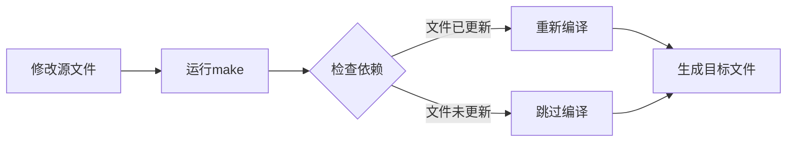

# Makefile编写入门：从零开始学习自动化构建


## 学习目标

完成本教程后，你将能够:

- [ ] 理解Makefile的基本概念和工作原理
- [ ] 掌握Makefile的基本语法和规则编写
- [ ] 使用变量和函数简化Makefile
- [ ] 编写适用于嵌入式项目的Makefile
- [ ] 实现自动化依赖管理和增量编译
- [ ] 调试和优化Makefile

## 前置要求

在开始本教程之前，你需要:

**知识要求**:
- 了解C/C++编程基础
- 熟悉编译和链接的基本概念
- 了解命令行操作

**技能要求**:
- 能够使用文本编辑器
- 会使用基本的Shell命令
- 了解GCC编译器的基本用法

## 准备工作

### 软件准备

- **操作系统**: Linux、macOS 或 Windows (需安装MinGW/Cygwin)
- **Make工具**: GNU Make 4.0+
- **编译器**: GCC或ARM GCC工具链
- **文本编辑器**: VS Code、Vim或任何文本编辑器

### 安装Make工具

**Linux系统**:
```bash
# Ubuntu/Debian
sudo apt install make

# CentOS/RHEL
sudo yum install make
```

**macOS系统**:
```bash
# 使用Homebrew
brew install make

# 或安装Xcode Command Line Tools
xcode-select --install
```

**Windows系统**:
```bash
# 使用MinGW
# 下载并安装MinGW，确保包含make工具

# 或使用Chocolatey
choco install make
```

### 验证安装

```bash
make --version
```

**预期输出**:
```
GNU Make 4.3
Built for x86_64-pc-linux-gnu
Copyright (C) 1988-2020 Free Software Foundation, Inc.
```


## 什么是Makefile？

### Makefile的作用

Makefile是一个描述文件之间依赖关系和构建规则的文本文件。它告诉Make工具:
- 哪些文件需要编译
- 如何编译这些文件
- 文件之间的依赖关系
- 如何生成最终的可执行文件

### 为什么需要Makefile？

**手动编译的问题**:
```bash
# 每次都要输入冗长的命令
gcc -c main.c -o main.o
gcc -c utils.c -o utils.o
gcc -c driver.c -o driver.o
gcc main.o utils.o driver.o -o program
```

**使用Makefile的优势**:
- ✅ 自动化构建过程
- ✅ 增量编译（只编译修改过的文件）
- ✅ 管理复杂的依赖关系
- ✅ 提高开发效率
- ✅ 减少人为错误

### Makefile的工作原理



Make工具通过比较文件的时间戳来判断是否需要重新编译。

## 步骤1：第一个Makefile

### 1.1 创建项目目录

```bash
mkdir makefile_tutorial
cd makefile_tutorial
```

### 1.2 创建源文件

创建 `main.c`:

```c
#include <stdio.h>

extern void print_hello(void);

int main(void) {
    printf("Makefile Tutorial\n");
    print_hello();
    return 0;
}
```

创建 `hello.c`:

```c
#include <stdio.h>

void print_hello(void) {
    printf("Hello from Makefile!\n");
}
```

### 1.3 创建最简单的Makefile

创建 `Makefile` 文件（注意首字母大写）:

```makefile
program: main.c hello.c
	gcc main.c hello.c -o program
```

**重要提示**: 
- 规则中的命令行必须以Tab键开头，不能用空格！
- 这是Makefile最常见的错误来源

### 1.4 运行Make

```bash
make
```

**预期输出**:
```
gcc main.c hello.c -o program
```

### 1.5 测试程序

```bash
./program
```

**预期输出**:
```
Makefile Tutorial
Hello from Makefile!
```


## 步骤2：理解Makefile基本语法

### 2.1 规则的基本格式

Makefile由一系列规则组成，每个规则的格式为:

```makefile
目标: 依赖文件列表
	命令1
	命令2
	...
```

**组成部分**:
- **目标(Target)**: 要生成的文件名
- **依赖(Prerequisites)**: 生成目标所需的文件
- **命令(Recipe)**: 生成目标的具体命令

### 2.2 改进的Makefile

修改Makefile，使用分步编译:

```makefile
# 最终目标
program: main.o hello.o
	gcc main.o hello.o -o program

# 编译main.c
main.o: main.c
	gcc -c main.c -o main.o

# 编译hello.c
hello.o: hello.c
	gcc -c hello.c -o hello.o
```

**代码说明**:
- 第一个规则定义最终目标`program`
- 它依赖于`main.o`和`hello.o`
- 后面的规则定义如何生成这些.o文件

### 2.3 测试增量编译

```bash
# 清理之前的文件
rm -f *.o program

# 第一次编译
make
```

**输出**:
```
gcc -c main.c -o main.o
gcc -c hello.c -o hello.o
gcc main.o hello.o -o program
```

```bash
# 再次运行make
make
```

**输出**:
```
make: 'program' is up to date.
```

```bash
# 修改hello.c后再次编译
touch hello.c
make
```

**输出**:
```
gcc -c hello.c -o hello.o
gcc main.o hello.o -o program
```

**观察**: 只重新编译了修改过的文件！

### 2.4 添加清理规则

```makefile
program: main.o hello.o
	gcc main.o hello.o -o program

main.o: main.c
	gcc -c main.c -o main.o

hello.o: hello.c
	gcc -c hello.c -o hello.o

# 清理规则
clean:
	rm -f *.o program
```

**使用清理规则**:
```bash
make clean
```

**说明**: `clean`是一个伪目标(Phony Target)，它不对应实际文件。


## 步骤3：使用变量

### 3.1 定义变量

变量可以简化Makefile，提高可维护性:

```makefile
# 定义变量
CC = gcc
CFLAGS = -Wall -O2
TARGET = program
OBJS = main.o hello.o

# 使用变量
$(TARGET): $(OBJS)
	$(CC) $(OBJS) -o $(TARGET)

main.o: main.c
	$(CC) $(CFLAGS) -c main.c -o main.o

hello.o: hello.c
	$(CC) $(CFLAGS) -c hello.c -o hello.o

clean:
	rm -f $(OBJS) $(TARGET)
```

**变量说明**:
- `CC`: 编译器名称
- `CFLAGS`: 编译选项
- `TARGET`: 目标文件名
- `OBJS`: 目标文件列表
- 使用`$(变量名)`引用变量

### 3.2 常用的预定义变量

```makefile
CC = gcc              # C编译器
CXX = g++             # C++编译器
CFLAGS = -Wall -O2    # C编译选项
CXXFLAGS = -Wall -O2  # C++编译选项
LDFLAGS = -L/usr/lib  # 链接选项
LDLIBS = -lm          # 链接库
```

### 3.3 自动变量

Make提供了一些特殊的自动变量:

```makefile
CC = gcc
CFLAGS = -Wall -O2
TARGET = program
OBJS = main.o hello.o

$(TARGET): $(OBJS)
	$(CC) $^ -o $@

%.o: %.c
	$(CC) $(CFLAGS) -c $< -o $@

clean:
	rm -f $(OBJS) $(TARGET)
```

**自动变量说明**:
- `$@`: 目标文件名
- `$<`: 第一个依赖文件名
- `$^`: 所有依赖文件列表
- `%`: 模式匹配符（通配符）

**模式规则**: `%.o: %.c` 表示所有.o文件都由对应的.c文件生成。

### 3.4 变量赋值方式

```makefile
# 递归赋值（延迟展开）
VAR1 = $(VAR2)
VAR2 = value

# 简单赋值（立即展开）
VAR3 := $(VAR4)
VAR4 := value

# 条件赋值（如果未定义才赋值）
VAR5 ?= default_value

# 追加赋值
VAR6 = initial
VAR6 += appended
```


## 步骤4：嵌入式项目Makefile

### 4.1 创建嵌入式项目结构

```bash
mkdir -p embedded_project/{src,inc,build}
cd embedded_project
```

**目录结构**:
```
embedded_project/
├── src/          # 源文件
├── inc/          # 头文件
├── build/        # 编译输出
└── Makefile
```

### 4.2 创建示例文件

创建 `inc/gpio.h`:

```c
#ifndef GPIO_H
#define GPIO_H

#include <stdint.h>

void gpio_init(void);
void gpio_set(uint8_t pin);
void gpio_clear(uint8_t pin);

#endif
```

创建 `src/gpio.c`:

```c
#include "gpio.h"
#include <stdio.h>

void gpio_init(void) {
    printf("GPIO initialized\n");
}

void gpio_set(uint8_t pin) {
    printf("GPIO pin %d set HIGH\n", pin);
}

void gpio_clear(uint8_t pin) {
    printf("GPIO pin %d set LOW\n", pin);
}
```

创建 `src/main.c`:

```c
#include <stdio.h>
#include "gpio.h"

int main(void) {
    printf("Embedded Project Example\n");
    
    gpio_init();
    gpio_set(5);
    gpio_clear(5);
    
    return 0;
}
```

### 4.3 编写嵌入式Makefile

创建 `Makefile`:

```makefile
# 项目名称
PROJECT = embedded_app

# 工具链配置
CC = gcc
OBJCOPY = objcopy
SIZE = size

# 目录配置
SRC_DIR = src
INC_DIR = inc
BUILD_DIR = build

# 源文件
SRCS = $(wildcard $(SRC_DIR)/*.c)

# 目标文件
OBJS = $(patsubst $(SRC_DIR)/%.c, $(BUILD_DIR)/%.o, $(SRCS))

# 编译选项
CFLAGS = -Wall -O2 -I$(INC_DIR)
LDFLAGS = 

# 目标文件
TARGET = $(BUILD_DIR)/$(PROJECT).elf

# 默认目标
all: $(BUILD_DIR) $(TARGET)
	@echo "Build complete!"
	$(SIZE) $(TARGET)

# 创建构建目录
$(BUILD_DIR):
	mkdir -p $(BUILD_DIR)

# 链接
$(TARGET): $(OBJS)
	$(CC) $(OBJS) $(LDFLAGS) -o $@

# 编译
$(BUILD_DIR)/%.o: $(SRC_DIR)/%.c
	$(CC) $(CFLAGS) -c $< -o $@

# 清理
clean:
	rm -rf $(BUILD_DIR)

# 重新构建
rebuild: clean all

# 伪目标声明
.PHONY: all clean rebuild
```

**代码说明**:
- `wildcard`: 获取所有匹配的文件
- `patsubst`: 模式替换函数
- `@echo`: @符号抑制命令回显
- `.PHONY`: 声明伪目标

### 4.4 测试构建

```bash
make
```

**预期输出**:
```
mkdir -p build
gcc -Wall -O2 -Iinc -c src/gpio.c -o build/gpio.o
gcc -Wall -O2 -Iinc -c src/main.c -o build/main.o
gcc build/gpio.o build/main.o  -o build/embedded_app.elf
Build complete!
size build/embedded_app.elf
```


## 步骤5：ARM嵌入式Makefile

### 5.1 ARM工具链Makefile

针对ARM Cortex-M的完整Makefile示例:

```makefile
# 项目配置
PROJECT = stm32_app
TARGET = $(PROJECT).elf

# 工具链前缀
PREFIX = arm-none-eabi-
CC = $(PREFIX)gcc
AS = $(PREFIX)as
LD = $(PREFIX)ld
OBJCOPY = $(PREFIX)objcopy
SIZE = $(PREFIX)size

# 目录
SRC_DIR = src
INC_DIR = inc
BUILD_DIR = build

# 源文件
C_SRCS = $(wildcard $(SRC_DIR)/*.c)
ASM_SRCS = $(wildcard $(SRC_DIR)/*.s)

# 目标文件
C_OBJS = $(patsubst $(SRC_DIR)/%.c, $(BUILD_DIR)/%.o, $(C_SRCS))
ASM_OBJS = $(patsubst $(SRC_DIR)/%.s, $(BUILD_DIR)/%.o, $(ASM_SRCS))
OBJS = $(C_OBJS) $(ASM_OBJS)

# MCU配置
MCU = -mcpu=cortex-m4 -mthumb -mfloat-abi=hard -mfpu=fpv4-sp-d16

# 编译选项
CFLAGS = $(MCU)
CFLAGS += -Wall -Wextra
CFLAGS += -O2 -g3
CFLAGS += -ffunction-sections -fdata-sections
CFLAGS += -I$(INC_DIR)

# 汇编选项
ASFLAGS = $(MCU)

# 链接选项
LDFLAGS = $(MCU)
LDFLAGS += -T STM32F407VG.ld
LDFLAGS += -Wl,--gc-sections
LDFLAGS += -Wl,-Map=$(BUILD_DIR)/$(PROJECT).map
LDFLAGS += --specs=nano.specs

# 默认目标
all: $(BUILD_DIR) $(BUILD_DIR)/$(TARGET) $(BUILD_DIR)/$(PROJECT).bin $(BUILD_DIR)/$(PROJECT).hex
	@echo "=== Build Summary ==="
	$(SIZE) $(BUILD_DIR)/$(TARGET)

# 创建目录
$(BUILD_DIR):
	mkdir -p $(BUILD_DIR)

# 链接
$(BUILD_DIR)/$(TARGET): $(OBJS)
	$(CC) $(OBJS) $(LDFLAGS) -o $@

# 编译C文件
$(BUILD_DIR)/%.o: $(SRC_DIR)/%.c
	$(CC) $(CFLAGS) -c $< -o $@

# 编译汇编文件
$(BUILD_DIR)/%.o: $(SRC_DIR)/%.s
	$(CC) $(ASFLAGS) -c $< -o $@

# 生成bin文件
$(BUILD_DIR)/%.bin: $(BUILD_DIR)/%.elf
	$(OBJCOPY) -O binary $< $@

# 生成hex文件
$(BUILD_DIR)/%.hex: $(BUILD_DIR)/%.elf
	$(OBJCOPY) -O ihex $< $@

# 烧录
flash: all
	openocd -f interface/stlink.cfg -f target/stm32f4x.cfg \
		-c "program $(BUILD_DIR)/$(PROJECT).bin 0x08000000 verify reset exit"

# 清理
clean:
	rm -rf $(BUILD_DIR)

# 显示变量（调试用）
info:
	@echo "C_SRCS: $(C_SRCS)"
	@echo "C_OBJS: $(C_OBJS)"
	@echo "ASM_SRCS: $(ASM_SRCS)"
	@echo "ASM_OBJS: $(ASM_OBJS)"

# 伪目标
.PHONY: all clean flash info
```

**关键配置说明**:
- `MCU`: 指定目标处理器架构
- `-ffunction-sections`: 每个函数独立段
- `-fdata-sections`: 每个数据独立段
- `--gc-sections`: 链接时删除未使用的段
- `--specs=nano.specs`: 使用精简的C库


## 步骤6：高级技巧

### 6.1 自动依赖生成

让编译器自动生成依赖关系:

```makefile
# 依赖文件
DEPS = $(OBJS:.o=.d)

# 包含依赖文件
-include $(DEPS)

# 编译时生成依赖
$(BUILD_DIR)/%.o: $(SRC_DIR)/%.c
	$(CC) $(CFLAGS) -MMD -MP -c $< -o $@
```

**选项说明**:
- `-MMD`: 生成依赖文件
- `-MP`: 为每个依赖生成伪目标
- `-include`: 包含依赖文件（忽略错误）

### 6.2 条件编译

根据不同配置编译:

```makefile
# 调试/发布模式
DEBUG ?= 1

ifeq ($(DEBUG), 1)
    CFLAGS += -O0 -g3 -DDEBUG
    $(info Building in DEBUG mode)
else
    CFLAGS += -O2 -DNDEBUG
    $(info Building in RELEASE mode)
endif
```

**使用方法**:
```bash
# 调试模式
make DEBUG=1

# 发布模式
make DEBUG=0
```

### 6.3 多目标构建

```makefile
# 定义多个目标
TARGETS = app1 app2 app3

# 默认构建所有目标
all: $(TARGETS)

# 每个目标的规则
app1: src/app1.c
	$(CC) $(CFLAGS) $< -o $@

app2: src/app2.c
	$(CC) $(CFLAGS) $< -o $@

app3: src/app3.c
	$(CC) $(CFLAGS) $< -o $@

# 清理所有目标
clean:
	rm -f $(TARGETS)
```

### 6.4 函数使用

Make提供了丰富的内置函数:

```makefile
# 字符串替换
SRCS = main.c utils.c driver.c
OBJS = $(SRCS:.c=.o)

# 模式替换
OBJS2 = $(patsubst %.c, %.o, $(SRCS))

# 过滤
C_FILES = $(filter %.c, $(SRCS))

# 排除
NO_MAIN = $(filter-out main.c, $(SRCS))

# 目录名
DIR = $(dir src/main.c)        # 结果: src/

# 文件名
FILE = $(notdir src/main.c)    # 结果: main.c

# 添加前缀
OBJS3 = $(addprefix build/, $(OBJS))

# 添加后缀
DEPS = $(addsuffix .d, $(basename $(SRCS)))
```

### 6.5 并行编译

```bash
# 使用4个并行任务
make -j4

# 使用所有可用CPU核心
make -j$(nproc)
```

**注意**: 确保Makefile中的规则没有隐藏的依赖关系。


## 步骤7：实用示例

### 7.1 带库的项目

```makefile
PROJECT = app_with_lib
CC = gcc
AR = ar

# 目录
SRC_DIR = src
LIB_DIR = lib
BUILD_DIR = build

# 源文件
APP_SRCS = $(SRC_DIR)/main.c
LIB_SRCS = $(wildcard $(LIB_DIR)/*.c)

# 目标文件
APP_OBJS = $(patsubst $(SRC_DIR)/%.c, $(BUILD_DIR)/%.o, $(APP_SRCS))
LIB_OBJS = $(patsubst $(LIB_DIR)/%.c, $(BUILD_DIR)/%.o, $(LIB_SRCS))

# 静态库
LIB_NAME = libmylib.a
LIB_PATH = $(BUILD_DIR)/$(LIB_NAME)

# 编译选项
CFLAGS = -Wall -O2 -Iinc
LDFLAGS = -L$(BUILD_DIR) -lmylib

all: $(BUILD_DIR) $(LIB_PATH) $(BUILD_DIR)/$(PROJECT)

$(BUILD_DIR):
	mkdir -p $(BUILD_DIR)

# 创建静态库
$(LIB_PATH): $(LIB_OBJS)
	$(AR) rcs $@ $^

# 链接应用
$(BUILD_DIR)/$(PROJECT): $(APP_OBJS) $(LIB_PATH)
	$(CC) $(APP_OBJS) $(LDFLAGS) -o $@

# 编译应用源文件
$(BUILD_DIR)/%.o: $(SRC_DIR)/%.c
	$(CC) $(CFLAGS) -c $< -o $@

# 编译库源文件
$(BUILD_DIR)/%.o: $(LIB_DIR)/%.c
	$(CC) $(CFLAGS) -c $< -o $@

clean:
	rm -rf $(BUILD_DIR)

.PHONY: all clean
```

### 7.2 多目录项目

```makefile
PROJECT = multi_dir_app

# 源目录列表
SRC_DIRS = src src/drivers src/utils src/hal

# 包含目录
INC_DIRS = inc inc/drivers inc/utils inc/hal

# 查找所有源文件
SRCS = $(foreach dir, $(SRC_DIRS), $(wildcard $(dir)/*.c))

# 生成目标文件路径
OBJS = $(patsubst %.c, build/%.o, $(notdir $(SRCS)))

# 生成包含路径
INCLUDES = $(addprefix -I, $(INC_DIRS))

# 编译选项
CFLAGS = -Wall -O2 $(INCLUDES)

# VPATH告诉make在哪里查找源文件
VPATH = $(SRC_DIRS)

all: build $(PROJECT)

build:
	mkdir -p build

$(PROJECT): $(OBJS)
	gcc $(OBJS) -o $@

build/%.o: %.c
	gcc $(CFLAGS) -c $< -o $@

clean:
	rm -rf build $(PROJECT)

.PHONY: all clean
```

### 7.3 带测试的项目

```makefile
PROJECT = app
TEST_PROJECT = test_app

# 源文件
APP_SRCS = src/main.c src/utils.c
TEST_SRCS = tests/test_main.c src/utils.c

# 目标文件
APP_OBJS = $(APP_SRCS:.c=.o)
TEST_OBJS = $(TEST_SRCS:.c=.o)

# 编译选项
CFLAGS = -Wall -O2 -Iinc
TEST_CFLAGS = $(CFLAGS) -DUNIT_TEST

# 默认目标
all: $(PROJECT)

# 应用程序
$(PROJECT): $(APP_OBJS)
	gcc $(APP_OBJS) -o $@

# 测试程序
$(TEST_PROJECT): $(TEST_OBJS)
	gcc $(TEST_OBJS) -o $@

# 编译测试文件
tests/%.o: tests/%.c
	gcc $(TEST_CFLAGS) -c $< -o $@

# 运行测试
test: $(TEST_PROJECT)
	./$(TEST_PROJECT)

# 清理
clean:
	rm -f $(APP_OBJS) $(TEST_OBJS) $(PROJECT) $(TEST_PROJECT)

.PHONY: all test clean
```


## 调试Makefile

### 调试技巧

#### 1. 打印变量值

```makefile
# 方法1: 使用info函数
$(info SRCS = $(SRCS))
$(info OBJS = $(OBJS))

# 方法2: 使用warning函数
$(warning This is a warning message)

# 方法3: 使用error函数（会停止执行）
$(error This is an error message)

# 方法4: 创建调试目标
debug:
	@echo "SRCS: $(SRCS)"
	@echo "OBJS: $(OBJS)"
	@echo "CFLAGS: $(CFLAGS)"
```

#### 2. 显示命令

```bash
# 显示make执行的所有命令
make -n

# 显示详细信息
make -d

# 显示为什么重新构建
make -d | grep "Considering target"
```

#### 3. 检查规则

```bash
# 显示所有规则
make -p

# 显示数据库（包括所有变量和规则）
make -p -f /dev/null
```

### 常见错误

#### 错误1: 缺少分隔符

```makefile
# 错误：使用空格而不是Tab
target: dependency
    command    # 错误！

# 正确：使用Tab
target: dependency
	command    # 正确
```

#### 错误2: 循环依赖

```makefile
# 错误：循环依赖
a: b
b: a

# 解决：检查依赖关系
```

#### 错误3: 变量未定义

```makefile
# 检查变量是否定义
ifndef CC
    $(error CC is not defined)
endif

# 或使用默认值
CC ?= gcc
```

## 故障排除

### 问题1: make命令找不到

**现象**:
```
bash: make: command not found
```

**解决方法**:
1. 安装make工具
2. 检查PATH环境变量
3. 使用完整路径运行make

### 问题2: 规则不执行

**现象**:
```
make: Nothing to be done for 'all'.
```

**可能原因**:
- 目标文件已是最新
- 依赖关系错误
- 时间戳问题

**解决方法**:
```bash
# 强制重新构建
make -B

# 或删除目标文件
make clean
make
```

### 问题3: 找不到头文件

**现象**:
```
fatal error: myheader.h: No such file or directory
```

**解决方法**:
```makefile
# 添加包含路径
CFLAGS += -Iinc -Ilib/inc
```

### 问题4: 链接错误

**现象**:
```
undefined reference to 'function_name'
```

**解决方法**:
```makefile
# 检查是否包含所有目标文件
OBJS = main.o utils.o driver.o

# 检查库的链接顺序
LDFLAGS = -lm -lpthread
```

### 问题5: 并行编译失败

**现象**:
并行编译时出现随机错误

**解决方法**:
```makefile
# 确保依赖关系正确
$(TARGET): $(OBJS)
	$(CC) $(OBJS) -o $@

# 或禁用并行编译
.NOTPARALLEL:
```


## 最佳实践

### 1. 项目组织

```makefile
# 清晰的目录结构
SRC_DIR = src
INC_DIR = inc
BUILD_DIR = build
LIB_DIR = lib

# 使用变量管理路径
SRCS = $(wildcard $(SRC_DIR)/*.c)
OBJS = $(patsubst $(SRC_DIR)/%.c, $(BUILD_DIR)/%.o, $(SRCS))
```

### 2. 编译选项管理

```makefile
# 基础选项
CFLAGS_BASE = -Wall -Wextra

# 调试选项
CFLAGS_DEBUG = -O0 -g3 -DDEBUG

# 发布选项
CFLAGS_RELEASE = -O2 -DNDEBUG

# 根据模式选择
ifeq ($(DEBUG), 1)
    CFLAGS = $(CFLAGS_BASE) $(CFLAGS_DEBUG)
else
    CFLAGS = $(CFLAGS_BASE) $(CFLAGS_RELEASE)
endif
```

### 3. 依赖管理

```makefile
# 自动生成依赖
DEPS = $(OBJS:.o=.d)

-include $(DEPS)

$(BUILD_DIR)/%.o: $(SRC_DIR)/%.c
	@mkdir -p $(dir $@)
	$(CC) $(CFLAGS) -MMD -MP -c $< -o $@
```

### 4. 输出美化

```makefile
# 静默模式
VERBOSE ?= 0

ifeq ($(VERBOSE), 0)
    Q = @
    ECHO = @echo
else
    Q =
    ECHO = @\#
endif

# 使用
$(BUILD_DIR)/%.o: $(SRC_DIR)/%.c
	$(ECHO) "CC $<"
	$(Q)$(CC) $(CFLAGS) -c $< -o $@
```

### 5. 跨平台支持

```makefile
# 检测操作系统
ifeq ($(OS), Windows_NT)
    RM = del /Q
    MKDIR = mkdir
    EXE_EXT = .exe
else
    RM = rm -f
    MKDIR = mkdir -p
    EXE_EXT =
endif

# 使用
clean:
	$(RM) $(OBJS) $(TARGET)$(EXE_EXT)
```

### 6. 模块化Makefile

主Makefile:
```makefile
# 包含配置文件
include config.mk

# 包含规则文件
include rules.mk

# 包含目标文件
include targets.mk
```

config.mk:
```makefile
# 工具链配置
CC = gcc
CFLAGS = -Wall -O2

# 目录配置
SRC_DIR = src
BUILD_DIR = build
```

rules.mk:
```makefile
# 通用规则
$(BUILD_DIR)/%.o: $(SRC_DIR)/%.c
	$(CC) $(CFLAGS) -c $< -o $@
```

### 7. 文档化

```makefile
# 在Makefile开头添加帮助信息
.DEFAULT_GOAL := help

help:
	@echo "Available targets:"
	@echo "  all      - Build the project"
	@echo "  clean    - Remove build files"
	@echo "  test     - Run tests"
	@echo "  flash    - Flash to device"
	@echo "  debug    - Build with debug info"
	@echo ""
	@echo "Usage:"
	@echo "  make [target] [DEBUG=1]"

.PHONY: help
```


## 完整示例：STM32项目Makefile

这是一个生产级的STM32项目Makefile模板:

```makefile
######################################
# 项目配置
######################################
PROJECT = stm32f4_project
TARGET = $(PROJECT)

######################################
# 构建路径
######################################
BUILD_DIR = build

######################################
# 源文件
######################################
C_SOURCES = \
src/main.c \
src/system_stm32f4xx.c \
src/stm32f4xx_it.c \
drivers/stm32f4xx_hal.c \
drivers/stm32f4xx_hal_gpio.c \
drivers/stm32f4xx_hal_rcc.c

ASM_SOURCES = \
startup/startup_stm32f407xx.s

######################################
# 工具链
######################################
PREFIX = arm-none-eabi-
CC = $(PREFIX)gcc
AS = $(PREFIX)gcc -x assembler-with-cpp
CP = $(PREFIX)objcopy
SZ = $(PREFIX)size
HEX = $(CP) -O ihex
BIN = $(CP) -O binary -S

######################################
# MCU配置
######################################
CPU = -mcpu=cortex-m4
FPU = -mfpu=fpv4-sp-d16
FLOAT-ABI = -mfloat-abi=hard
MCU = $(CPU) -mthumb $(FPU) $(FLOAT-ABI)

######################################
# 包含路径
######################################
C_INCLUDES = \
-Iinc \
-Idrivers/inc \
-ICMSIS/Include \
-ICMSIS/Device/ST/STM32F4xx/Include

######################################
# 编译选项
######################################
ASFLAGS = $(MCU) $(C_INCLUDES) -Wall -fdata-sections -ffunction-sections

CFLAGS = $(MCU) $(C_INCLUDES) -Wall -fdata-sections -ffunction-sections

# 调试/发布模式
ifeq ($(DEBUG), 1)
CFLAGS += -g -gdwarf-2 -DDEBUG
else
CFLAGS += -O2
endif

# 生成依赖信息
CFLAGS += -MMD -MP -MF"$(@:%.o=%.d)"

######################################
# 链接选项
######################################
LDSCRIPT = STM32F407VGTx_FLASH.ld

LIBS = -lc -lm -lnosys
LIBDIR =
LDFLAGS = $(MCU) -specs=nano.specs -T$(LDSCRIPT) $(LIBDIR) $(LIBS) \
-Wl,-Map=$(BUILD_DIR)/$(TARGET).map,--cref -Wl,--gc-sections

######################################
# 构建目标
######################################
all: $(BUILD_DIR)/$(TARGET).elf $(BUILD_DIR)/$(TARGET).hex $(BUILD_DIR)/$(TARGET).bin

######################################
# 目标文件列表
######################################
OBJECTS = $(addprefix $(BUILD_DIR)/,$(notdir $(C_SOURCES:.c=.o)))
vpath %.c $(sort $(dir $(C_SOURCES)))

OBJECTS += $(addprefix $(BUILD_DIR)/,$(notdir $(ASM_SOURCES:.s=.o)))
vpath %.s $(sort $(dir $(ASM_SOURCES)))

######################################
# 构建规则
######################################
$(BUILD_DIR)/%.o: %.c Makefile | $(BUILD_DIR)
	@echo "CC $<"
	@$(CC) -c $(CFLAGS) -Wa,-a,-ad,-alms=$(BUILD_DIR)/$(notdir $(<:.c=.lst)) $< -o $@

$(BUILD_DIR)/%.o: %.s Makefile | $(BUILD_DIR)
	@echo "AS $<"
	@$(AS) -c $(ASFLAGS) $< -o $@

$(BUILD_DIR)/$(TARGET).elf: $(OBJECTS) Makefile
	@echo "LD $@"
	@$(CC) $(OBJECTS) $(LDFLAGS) -o $@
	@$(SZ) $@

$(BUILD_DIR)/%.hex: $(BUILD_DIR)/%.elf | $(BUILD_DIR)
	@echo "HEX $@"
	@$(HEX) $< $@

$(BUILD_DIR)/%.bin: $(BUILD_DIR)/%.elf | $(BUILD_DIR)
	@echo "BIN $@"
	@$(BIN) $< $@

$(BUILD_DIR):
	mkdir -p $@

######################################
# 清理
######################################
clean:
	-rm -fR $(BUILD_DIR)

######################################
# 烧录
######################################
flash: all
	openocd -f interface/stlink.cfg -f target/stm32f4x.cfg \
	-c "program $(BUILD_DIR)/$(TARGET).bin 0x08000000 verify reset exit"

######################################
# 依赖
######################################
-include $(wildcard $(BUILD_DIR)/*.d)

######################################
# 伪目标
######################################
.PHONY: all clean flash
```

**使用方法**:
```bash
# 调试模式编译
make DEBUG=1

# 发布模式编译
make

# 烧录到开发板
make flash

# 清理
make clean
```


## 总结

通过本教程，你学习了:

- ✅ Makefile的基本概念和工作原理
- ✅ 规则、目标和依赖的编写方法
- ✅ 变量和自动变量的使用
- ✅ 模式规则和函数的应用
- ✅ 嵌入式项目Makefile的编写
- ✅ 自动依赖生成和增量编译
- ✅ 调试和优化Makefile的技巧

**关键要点**:
1. Makefile通过依赖关系实现增量编译
2. 使用变量可以提高Makefile的可维护性
3. 自动变量和模式规则可以简化规则编写
4. 自动依赖生成确保头文件修改后正确重编译
5. 合理的目录结构和模块化设计很重要

## 进阶挑战

尝试以下挑战来巩固学习:

1. **挑战1**: 为你的项目编写一个完整的Makefile
   - 支持多个源文件目录
   - 自动生成依赖关系
   - 支持调试和发布模式

2. **挑战2**: 实现交叉编译Makefile
   - 支持多个目标平台
   - 可配置的工具链
   - 自动检测工具链是否安装

3. **挑战3**: 添加单元测试支持
   - 集成测试框架
   - 自动运行测试
   - 生成测试报告

## 常见问题FAQ

### Q1: Makefile和CMake有什么区别？

**A**: 
- **Makefile**: 直接描述构建规则，更底层，学习曲线陡
- **CMake**: 生成Makefile的工具，跨平台，更高级
- **建议**: 小项目用Makefile，大项目用CMake

### Q2: 为什么必须用Tab而不是空格？

**A**: 这是Make的历史设计决定，无法改变。现代编辑器可以配置自动转换。

### Q3: 如何处理头文件依赖？

**A**: 使用`-MMD -MP`选项自动生成依赖文件:
```makefile
CFLAGS += -MMD -MP
-include $(DEPS)
```

### Q4: 并行编译安全吗？

**A**: 如果依赖关系正确，并行编译是安全的。使用`make -j4`启用。

### Q5: 如何调试Makefile？

**A**: 
- 使用`make -n`查看将要执行的命令
- 使用`$(info)`打印变量值
- 使用`make -d`查看详细调试信息

### Q6: Makefile可以跨平台吗？

**A**: 可以，但需要处理平台差异:
```makefile
ifeq ($(OS), Windows_NT)
    # Windows特定配置
else
    # Unix/Linux特定配置
endif
```

### Q7: 如何组织大型项目的Makefile？

**A**: 
- 使用递归Make（每个子目录一个Makefile）
- 或使用非递归Make（一个主Makefile包含所有规则）
- 推荐非递归方式，更快更可靠

### Q8: 什么时候应该使用CMake而不是Makefile？

**A**: 
- 项目需要跨平台支持
- 项目规模较大（>50个源文件）
- 需要复杂的配置选项
- 需要查找和链接外部库

## 下一步学习

建议继续学习以下内容:

### 初级进阶
- [CMake构建系统使用](../beginner/06-cmake-basics.html) - 学习更高级的构建工具
- [交叉编译工具链配置](../intermediate/02-cross-compilation.html) - 配置交叉编译环境
- [Git版本控制基础](../beginner/07-git-basics.html) - 学习版本管理

### 中级进阶
- [持续集成CI/CD实践](../intermediate/03-cicd-practice.html) - 自动化构建和测试
- [代码静态分析工具使用](../intermediate/04-static-analysis.html) - 提升代码质量
- [嵌入式开发工作流优化](../intermediate/05-workflow-optimization.html) - 优化开发流程

### 高级进阶
- [自定义工具链构建](../advanced/01-custom-toolchain.html) - 构建定制工具链
- [Docker化开发环境](../advanced/02-dockerized-dev-env.html) - 容器化开发


## 实践项目建议

### 项目1: LED控制系统Makefile
**难度**: ⭐⭐
**目标**: 为LED控制项目编写Makefile
**要求**:
- 支持多个源文件
- 自动依赖生成
- 调试和发布模式切换
- 清理和重建功能

### 项目2: 多模块嵌入式项目
**难度**: ⭐⭐⭐
**目标**: 管理包含驱动、HAL、应用层的项目
**要求**:
- 多目录源文件管理
- 静态库构建
- 条件编译支持
- 生成多种输出格式(bin, hex)

### 项目3: 跨平台构建系统
**难度**: ⭐⭐⭐⭐
**目标**: 支持多平台和多工具链的Makefile
**要求**:
- 自动检测操作系统
- 支持多个工具链(GCC, Clang, ARM GCC)
- 配置文件管理
- 并行编译优化

## 参考资料

### 官方文档
1. [GNU Make Manual](https://www.gnu.org/software/make/manual/) - 官方完整手册
2. [Make Tutorial](https://makefiletutorial.com/) - 交互式教程
3. [GCC Documentation](https://gcc.gnu.org/onlinedocs/) - GCC编译器文档

### 教程和文章
1. [Makefile Tutorial by Example](https://makefiletutorial.com/)
2. [Advanced Makefile Tricks](https://www.gnu.org/software/make/manual/html_node/index.html)
3. [Recursive Make Considered Harmful](http://aegis.sourceforge.net/auug97.pdf)

### 书籍推荐
1. "Managing Projects with GNU Make" - Robert Mecklenburg
2. "GNU Make Book" - John Graham-Cumming
3. "The Art of Unix Programming" - Eric S. Raymond

### 在线资源
1. [Stack Overflow - Makefile标签](https://stackoverflow.com/questions/tagged/makefile)
2. [GitHub Makefile示例](https://github.com/topics/makefile)
3. [Makefile最佳实践](https://clarkgrubb.com/makefile-style-guide)

### 工具和插件
1. **VS Code插件**: Makefile Tools
2. **语法检查**: checkmake
3. **格式化工具**: makeformat
4. **调试工具**: remake (带调试功能的make)

## 附录

### 附录A: Makefile常用变量

| 变量 | 说明 | 示例 |
|------|------|------|
| CC | C编译器 | gcc, arm-none-eabi-gcc |
| CXX | C++编译器 | g++, arm-none-eabi-g++ |
| AS | 汇编器 | as, arm-none-eabi-as |
| LD | 链接器 | ld, arm-none-eabi-ld |
| AR | 归档工具 | ar, arm-none-eabi-ar |
| CFLAGS | C编译选项 | -Wall -O2 |
| CXXFLAGS | C++编译选项 | -Wall -O2 -std=c++11 |
| LDFLAGS | 链接选项 | -L/usr/lib |
| LDLIBS | 链接库 | -lm -lpthread |

### 附录B: 自动变量

| 变量 | 说明 | 示例 |
|------|------|------|
| $@ | 目标文件名 | program.elf |
| $< | 第一个依赖文件 | main.c |
| $^ | 所有依赖文件 | main.o utils.o |
| $? | 比目标新的依赖文件 | main.o |
| $* | 目标模式中%匹配的部分 | main |
| $(@D) | 目标文件的目录部分 | build/ |
| $(@F) | 目标文件的文件名部分 | program.elf |

### 附录C: 常用函数

| 函数 | 说明 | 示例 |
|------|------|------|
| $(wildcard pattern) | 获取匹配的文件列表 | $(wildcard src/*.c) |
| $(patsubst pattern,replacement,text) | 模式替换 | $(patsubst %.c,%.o,$(SRCS)) |
| $(filter pattern,text) | 过滤 | $(filter %.c,$(FILES)) |
| $(filter-out pattern,text) | 反向过滤 | $(filter-out main.c,$(SRCS)) |
| $(dir names) | 提取目录部分 | $(dir src/main.c) |
| $(notdir names) | 提取文件名部分 | $(notdir src/main.c) |
| $(basename names) | 去除后缀 | $(basename main.c) |
| $(addsuffix suffix,names) | 添加后缀 | $(addsuffix .o,main utils) |
| $(addprefix prefix,names) | 添加前缀 | $(addprefix src/,main.c) |
| $(shell command) | 执行shell命令 | $(shell ls src/) |

### 附录D: 特殊目标

| 目标 | 说明 |
|------|------|
| .PHONY | 声明伪目标 |
| .SUFFIXES | 定义后缀规则 |
| .DEFAULT | 默认规则 |
| .PRECIOUS | 保留中间文件 |
| .INTERMEDIATE | 声明中间文件 |
| .SECONDARY | 不删除次要文件 |
| .DELETE_ON_ERROR | 错误时删除目标 |
| .IGNORE | 忽略错误 |
| .SILENT | 静默执行 |
| .NOTPARALLEL | 禁用并行 |

### 附录E: 快速参考卡片

```makefile
# 基本规则
target: dependencies
	command

# 变量定义
VAR = value          # 递归展开
VAR := value         # 立即展开
VAR ?= value         # 条件赋值
VAR += value         # 追加

# 自动变量
$@  # 目标
$<  # 第一个依赖
$^  # 所有依赖

# 模式规则
%.o: %.c
	$(CC) -c $< -o $@

# 函数调用
$(function arguments)

# 条件语句
ifeq ($(VAR),value)
    # ...
endif

# 包含文件
include file.mk
-include file.mk  # 忽略错误

# 伪目标
.PHONY: clean all
```

---

**反馈与支持**:
- 如果你在学习过程中遇到问题，欢迎在评论区留言
- 发现文档错误或有改进建议，请提交Issue
- 想要分享你的Makefile经验，欢迎投稿

**版本历史**:
- v1.0 (2024-01-15): 初始版本发布

**许可证**: 本文档采用 [CC BY-SA 4.0](https://creativecommons.org/licenses/by-sa/4.0/) 许可协议

