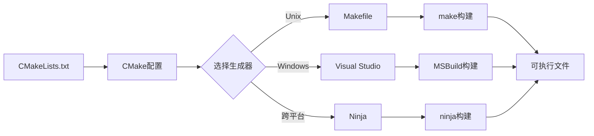

# CMake构建系统使用：现代化的跨平台构建工具


## 学习目标

完成本教程后，你将能够:

- [ ] 理解CMake的基本概念和工作原理
- [ ] 掌握CMakeLists.txt的基本语法
- [ ] 配置跨平台的CMake项目
- [ ] 管理项目依赖和外部库
- [ ] 为嵌入式项目编写CMake配置
- [ ] 使用CMake生成不同的构建系统

## 前置要求

在开始本教程之前，你需要:

**知识要求**:
- 了解C/C++编程基础
- 熟悉编译和链接的基本概念
- 了解Makefile的基本用法（推荐先学习）

**技能要求**:
- 能够使用命令行工具
- 了解基本的项目目录结构
- 会使用文本编辑器

## 准备工作

### 软件准备

- **操作系统**: Linux、macOS 或 Windows
- **CMake**: 3.15+ (推荐3.20+)
- **编译器**: GCC、Clang 或 MSVC
- **构建工具**: Make、Ninja 或 Visual Studio
- **文本编辑器**: VS Code、CLion 或任何文本编辑器

### 安装CMake

**Linux系统**:
```bash
# Ubuntu/Debian
sudo apt install cmake

# CentOS/RHEL
sudo yum install cmake

# 或从官网下载最新版本
wget https://github.com/Kitware/CMake/releases/download/v3.28.0/cmake-3.28.0-linux-x86_64.sh
chmod +x cmake-3.28.0-linux-x86_64.sh
sudo ./cmake-3.28.0-linux-x86_64.sh --prefix=/usr/local --skip-license
```

**macOS系统**:
```bash
# 使用Homebrew
brew install cmake

# 或使用MacPorts
sudo port install cmake
```

**Windows系统**:
```bash
# 使用Chocolatey
choco install cmake

# 或从官网下载安装包
# https://cmake.org/download/
```

### 验证安装

```bash
cmake --version
```

**预期输出**:
```
cmake version 3.28.0

CMake suite maintained and supported by Kitware (kitware.com/cmake).
```


## 什么是CMake？

### CMake的作用

CMake (Cross-platform Make) 是一个跨平台的构建系统生成器。它不直接构建项目，而是生成本地构建系统的配置文件（如Makefile、Ninja文件或Visual Studio项目文件）。

### CMake vs Makefile

**Makefile的局限**:
- ❌ 平台相关（Windows和Linux语法不同）
- ❌ 手动管理依赖复杂
- ❌ 难以处理大型项目
- ❌ 缺乏现代化的包管理

**CMake的优势**:
- ✅ 跨平台支持（一次编写，到处构建）
- ✅ 自动依赖管理
- ✅ 支持多种构建系统
- ✅ 现代化的语法和功能
- ✅ 强大的包查找机制
- ✅ 良好的IDE集成

### CMake工作流程



**两阶段构建**:
1. **配置阶段**: CMake读取CMakeLists.txt，生成构建系统文件
2. **构建阶段**: 使用生成的构建系统编译项目


## 步骤1：第一个CMake项目

### 1.1 创建项目目录

```bash
mkdir cmake_tutorial
cd cmake_tutorial
```

### 1.2 创建源文件

创建 `main.c`:

```c
#include <stdio.h>

int main(void) {
    printf("Hello from CMake!\n");
    return 0;
}
```

### 1.3 创建CMakeLists.txt

创建 `CMakeLists.txt` 文件:

```cmake
# 指定CMake最低版本
cmake_minimum_required(VERSION 3.15)

# 定义项目名称和语言
project(HelloCMake C)

# 添加可执行文件
add_executable(hello main.c)
```

**代码说明**:
- `cmake_minimum_required`: 指定所需的最低CMake版本
- `project`: 定义项目名称和使用的编程语言
- `add_executable`: 创建可执行目标

### 1.4 配置和构建

```bash
# 创建构建目录（推荐的out-of-source构建）
mkdir build
cd build

# 配置项目
cmake ..

# 构建项目
cmake --build .
```

**预期输出**:
```
-- The C compiler identification is GNU 11.4.0
-- Detecting C compiler ABI info
-- Detecting C compiler ABI info - done
-- Check for working C compiler: /usr/bin/cc - skipped
-- Detecting C compile features
-- Detecting C compile features - done
-- Configuring done
-- Generating done
-- Build files have been written to: /path/to/cmake_tutorial/build
[ 50%] Building C object CMakeFiles/hello.dir/main.c.o
[100%] Linking C executable hello
[100%] Built target hello
```

### 1.5 运行程序

```bash
./hello
```

**预期输出**:
```
Hello from CMake!
```

**重要概念**:
- **Out-of-source构建**: 将构建文件放在单独的目录中，保持源代码目录整洁
- **In-source构建**: 不推荐，会污染源代码目录


## 步骤2：CMake基本语法

### 2.1 变量

CMake使用变量来存储值:

```cmake
# 设置变量
set(MY_VAR "Hello")
set(MY_NUMBER 42)
set(MY_LIST item1 item2 item3)

# 使用变量
message("Value: ${MY_VAR}")

# 追加到列表
list(APPEND MY_LIST item4)

# 移除列表项
list(REMOVE_ITEM MY_LIST item2)
```

**常用内置变量**:
```cmake
# 项目相关
${PROJECT_NAME}              # 项目名称
${PROJECT_SOURCE_DIR}        # 项目源代码根目录
${PROJECT_BINARY_DIR}        # 项目构建根目录
${CMAKE_SOURCE_DIR}          # 顶层CMakeLists.txt所在目录
${CMAKE_BINARY_DIR}          # 顶层构建目录
${CMAKE_CURRENT_SOURCE_DIR}  # 当前CMakeLists.txt所在目录
${CMAKE_CURRENT_BINARY_DIR}  # 当前构建目录

# 编译器相关
${CMAKE_C_COMPILER}          # C编译器路径
${CMAKE_CXX_COMPILER}        # C++编译器路径
${CMAKE_C_FLAGS}             # C编译选项
${CMAKE_CXX_FLAGS}           # C++编译选项

# 系统相关
${CMAKE_SYSTEM_NAME}         # 操作系统名称
${CMAKE_SYSTEM_PROCESSOR}    # 处理器架构
```

### 2.2 条件语句

```cmake
# if语句
if(WIN32)
    message("Building on Windows")
elseif(UNIX)
    message("Building on Unix-like system")
else()
    message("Unknown platform")
endif()

# 变量比较
set(MY_VAR "value")
if(MY_VAR STREQUAL "value")
    message("Variable matches")
endif()

# 数值比较
set(NUM 10)
if(NUM GREATER 5)
    message("Number is greater than 5")
endif()

# 检查变量是否定义
if(DEFINED MY_VAR)
    message("MY_VAR is defined")
endif()

# 检查文件是否存在
if(EXISTS "${CMAKE_SOURCE_DIR}/config.h")
    message("config.h exists")
endif()
```

### 2.3 循环

```cmake
# foreach循环
set(SOURCES main.c utils.c driver.c)
foreach(SRC ${SOURCES})
    message("Source file: ${SRC}")
endforeach()

# 范围循环
foreach(i RANGE 5)
    message("Index: ${i}")
endforeach()

# while循环
set(COUNT 0)
while(COUNT LESS 5)
    message("Count: ${COUNT}")
    math(EXPR COUNT "${COUNT} + 1")
endwhile()
```

### 2.4 函数和宏

```cmake
# 定义函数
function(my_function arg1 arg2)
    message("Arg1: ${arg1}")
    message("Arg2: ${arg2}")
endfunction()

# 调用函数
my_function("Hello" "World")

# 定义宏
macro(my_macro arg)
    message("Macro arg: ${arg}")
endmacro()

# 调用宏
my_macro("Test")
```

**函数 vs 宏**:
- **函数**: 有自己的作用域，变量不会泄漏到外部
- **宏**: 在调用处展开，变量会影响外部作用域


## 步骤3：多文件项目

### 3.1 创建项目结构

```bash
mkdir -p multi_file_project/{src,inc}
cd multi_file_project
```

**目录结构**:
```
multi_file_project/
├── CMakeLists.txt
├── src/
│   ├── main.c
│   ├── math_utils.c
│   └── string_utils.c
└── inc/
    ├── math_utils.h
    └── string_utils.h
```

### 3.2 创建源文件

创建 `inc/math_utils.h`:

```c
#ifndef MATH_UTILS_H
#define MATH_UTILS_H

int add(int a, int b);
int multiply(int a, int b);

#endif
```

创建 `src/math_utils.c`:

```c
#include "math_utils.h"

int add(int a, int b) {
    return a + b;
}

int multiply(int a, int b) {
    return a * b;
}
```

创建 `inc/string_utils.h`:

```c
#ifndef STRING_UTILS_H
#define STRING_UTILS_H

void print_message(const char* msg);

#endif
```

创建 `src/string_utils.c`:

```c
#include "string_utils.h"
#include <stdio.h>

void print_message(const char* msg) {
    printf("Message: %s\n", msg);
}
```

创建 `src/main.c`:

```c
#include <stdio.h>
#include "math_utils.h"
#include "string_utils.h"

int main(void) {
    printf("Multi-file CMake Project\n");
    
    int result = add(5, 3);
    printf("5 + 3 = %d\n", result);
    
    result = multiply(4, 7);
    printf("4 * 7 = %d\n", result);
    
    print_message("Hello from CMake!");
    
    return 0;
}
```

### 3.3 编写CMakeLists.txt

创建 `CMakeLists.txt`:

```cmake
cmake_minimum_required(VERSION 3.15)
project(MultiFileProject C)

# 设置C标准
set(CMAKE_C_STANDARD 11)
set(CMAKE_C_STANDARD_REQUIRED ON)

# 添加包含目录
include_directories(inc)

# 收集所有源文件
file(GLOB SOURCES "src/*.c")

# 或者手动列出源文件（推荐）
set(SOURCES
    src/main.c
    src/math_utils.c
    src/string_utils.c
)

# 创建可执行文件
add_executable(myapp ${SOURCES})
```

**代码说明**:
- `CMAKE_C_STANDARD`: 设置C语言标准
- `include_directories`: 添加头文件搜索路径
- `file(GLOB ...)`: 自动查找匹配的文件（不推荐用于源文件）
- 手动列出源文件更可靠，CMake能正确追踪依赖

### 3.4 构建项目

```bash
mkdir build
cd build
cmake ..
cmake --build .
./myapp
```

**预期输出**:
```
Multi-file CMake Project
5 + 3 = 8
4 * 7 = 28
Message: Hello from CMake!
```


## 步骤4：库的创建和使用

### 4.1 静态库

修改 `CMakeLists.txt` 创建静态库:

```cmake
cmake_minimum_required(VERSION 3.15)
project(LibraryProject C)

set(CMAKE_C_STANDARD 11)

# 创建静态库
add_library(myutils STATIC
    src/math_utils.c
    src/string_utils.c
)

# 为库指定包含目录
target_include_directories(myutils PUBLIC inc)

# 创建可执行文件
add_executable(myapp src/main.c)

# 链接库到可执行文件
target_link_libraries(myapp PRIVATE myutils)
```

**关键概念**:
- `add_library`: 创建库目标
- `STATIC`: 静态库（.a 或 .lib）
- `target_include_directories`: 为目标指定包含目录
- `PUBLIC`: 包含目录对库和使用库的目标都可见
- `target_link_libraries`: 链接库到目标
- `PRIVATE`: 链接关系仅对当前目标可见

### 4.2 动态库

创建动态库（共享库）:

```cmake
# 创建动态库
add_library(myutils SHARED
    src/math_utils.c
    src/string_utils.c
)

target_include_directories(myutils PUBLIC inc)

# 可执行文件配置相同
add_executable(myapp src/main.c)
target_link_libraries(myapp PRIVATE myutils)
```

**库类型**:
- `STATIC`: 静态库（编译时链接）
- `SHARED`: 动态库（运行时链接）
- `MODULE`: 插件库（运行时动态加载）

### 4.3 接口库

接口库用于仅包含头文件的库:

```cmake
# 创建接口库（header-only库）
add_library(myheaders INTERFACE)

target_include_directories(myheaders INTERFACE inc)

# 使用接口库
add_executable(myapp src/main.c)
target_link_libraries(myapp PRIVATE myheaders)
```

### 4.4 可见性关键字

```cmake
# PUBLIC: 对当前目标和依赖它的目标都可见
target_include_directories(mylib PUBLIC inc)

# PRIVATE: 仅对当前目标可见
target_include_directories(mylib PRIVATE src/internal)

# INTERFACE: 仅对依赖它的目标可见
target_include_directories(mylib INTERFACE inc/public)
```

**使用场景**:
- **PUBLIC**: 头文件在库的公共API中使用
- **PRIVATE**: 头文件仅在库的实现中使用
- **INTERFACE**: 仅头文件库或传递依赖


## 步骤5：编译选项和配置

### 5.1 设置编译选项

```cmake
cmake_minimum_required(VERSION 3.15)
project(CompilerOptions C)

# 全局编译选项（不推荐）
add_compile_options(-Wall -Wextra)

# 为特定目标设置编译选项（推荐）
add_executable(myapp src/main.c)
target_compile_options(myapp PRIVATE
    -Wall
    -Wextra
    -Werror
    $<$<CONFIG:Debug>:-O0 -g3>
    $<$<CONFIG:Release>:-O2>
)
```

**生成器表达式**:
- `$<$<CONFIG:Debug>:-O0 -g3>`: 仅在Debug配置时添加选项
- `$<$<CONFIG:Release>:-O2>`: 仅在Release配置时添加选项

### 5.2 定义宏

```cmake
# 全局定义
add_definitions(-DVERSION=1.0)

# 为特定目标定义（推荐）
target_compile_definitions(myapp PRIVATE
    VERSION=1.0
    DEBUG_MODE
    $<$<CONFIG:Debug>:ENABLE_LOGGING>
)
```

在代码中使用:

```c
#include <stdio.h>

int main(void) {
    #ifdef DEBUG_MODE
    printf("Debug mode enabled\n");
    #endif
    
    #ifdef ENABLE_LOGGING
    printf("Logging enabled\n");
    #endif
    
    return 0;
}
```

### 5.3 构建类型

```cmake
# 设置默认构建类型
if(NOT CMAKE_BUILD_TYPE)
    set(CMAKE_BUILD_TYPE Release)
endif()

message("Build type: ${CMAKE_BUILD_TYPE}")

# 为不同构建类型设置选项
set(CMAKE_C_FLAGS_DEBUG "-O0 -g3 -DDEBUG")
set(CMAKE_C_FLAGS_RELEASE "-O2 -DNDEBUG")
set(CMAKE_C_FLAGS_RELWITHDEBINFO "-O2 -g")
set(CMAKE_C_FLAGS_MINSIZEREL "-Os")
```

**构建类型**:
- `Debug`: 调试版本（无优化，包含调试信息）
- `Release`: 发布版本（优化，无调试信息）
- `RelWithDebInfo`: 带调试信息的发布版本
- `MinSizeRel`: 最小体积发布版本

**指定构建类型**:
```bash
# 配置时指定
cmake -DCMAKE_BUILD_TYPE=Debug ..

# 或使用多配置生成器（如Visual Studio）
cmake --build . --config Debug
```

### 5.4 选项和缓存变量

```cmake
# 定义选项（用户可配置）
option(ENABLE_TESTS "Enable unit tests" ON)
option(BUILD_SHARED_LIBS "Build shared libraries" OFF)

# 使用选项
if(ENABLE_TESTS)
    enable_testing()
    add_subdirectory(tests)
endif()

# 缓存变量
set(MAX_BUFFER_SIZE 1024 CACHE STRING "Maximum buffer size")
set(USE_HARDWARE_ACCEL ON CACHE BOOL "Use hardware acceleration")

# 用户可以通过命令行修改
# cmake -DENABLE_TESTS=OFF -DMAX_BUFFER_SIZE=2048 ..
```


## 步骤6：嵌入式项目CMake

### 6.1 ARM Cortex-M项目

创建嵌入式项目的CMakeLists.txt:

```cmake
cmake_minimum_required(VERSION 3.15)

# 设置工具链文件（在project之前）
set(CMAKE_TOOLCHAIN_FILE ${CMAKE_SOURCE_DIR}/arm-none-eabi-gcc.cmake)

project(STM32Project C ASM)

# MCU配置
set(MCU_FAMILY STM32F4xx)
set(MCU_MODEL STM32F407xx)

# 编译选项
set(MCU_FLAGS
    -mcpu=cortex-m4
    -mthumb
    -mfloat-abi=hard
    -mfpu=fpv4-sp-d16
)

# C编译选项
add_compile_options(
    ${MCU_FLAGS}
    -Wall
    -Wextra
    -fdata-sections
    -ffunction-sections
    $<$<CONFIG:Debug>:-O0 -g3>
    $<$<CONFIG:Release>:-O2>
)

# 链接选项
add_link_options(
    ${MCU_FLAGS}
    -T${CMAKE_SOURCE_DIR}/STM32F407VGTx_FLASH.ld
    -Wl,--gc-sections
    -Wl,-Map=${PROJECT_NAME}.map
    --specs=nano.specs
)

# 源文件
set(SOURCES
    src/main.c
    src/system_stm32f4xx.c
    src/stm32f4xx_it.c
    startup/startup_stm32f407xx.s
)

# 包含目录
set(INCLUDES
    inc
    CMSIS/Include
    CMSIS/Device/ST/STM32F4xx/Include
)

# 创建可执行文件
add_executable(${PROJECT_NAME}.elf ${SOURCES})

target_include_directories(${PROJECT_NAME}.elf PRIVATE ${INCLUDES})

target_compile_definitions(${PROJECT_NAME}.elf PRIVATE
    ${MCU_MODEL}
    USE_HAL_DRIVER
)

# 生成hex和bin文件
add_custom_command(TARGET ${PROJECT_NAME}.elf POST_BUILD
    COMMAND ${CMAKE_OBJCOPY} -O ihex $<TARGET_FILE:${PROJECT_NAME}.elf> ${PROJECT_NAME}.hex
    COMMAND ${CMAKE_OBJCOPY} -O binary $<TARGET_FILE:${PROJECT_NAME}.elf> ${PROJECT_NAME}.bin
    COMMAND ${CMAKE_SIZE} $<TARGET_FILE:${PROJECT_NAME}.elf>
    COMMENT "Building ${PROJECT_NAME}.hex and ${PROJECT_NAME}.bin"
)

# 烧录目标
add_custom_target(flash
    COMMAND openocd -f interface/stlink.cfg -f target/stm32f4x.cfg
            -c "program ${PROJECT_NAME}.bin 0x08000000 verify reset exit"
    DEPENDS ${PROJECT_NAME}.elf
    COMMENT "Flashing ${PROJECT_NAME}.bin to target"
)
```

### 6.2 工具链文件

创建 `arm-none-eabi-gcc.cmake`:

```cmake
# 系统名称
set(CMAKE_SYSTEM_NAME Generic)
set(CMAKE_SYSTEM_PROCESSOR ARM)

# 工具链前缀
set(TOOLCHAIN_PREFIX arm-none-eabi-)

# 编译器
set(CMAKE_C_COMPILER ${TOOLCHAIN_PREFIX}gcc)
set(CMAKE_CXX_COMPILER ${TOOLCHAIN_PREFIX}g++)
set(CMAKE_ASM_COMPILER ${TOOLCHAIN_PREFIX}gcc)

# 工具
set(CMAKE_OBJCOPY ${TOOLCHAIN_PREFIX}objcopy)
set(CMAKE_OBJDUMP ${TOOLCHAIN_PREFIX}objdump)
set(CMAKE_SIZE ${TOOLCHAIN_PREFIX}size)

# 搜索路径配置
set(CMAKE_FIND_ROOT_PATH_MODE_PROGRAM NEVER)
set(CMAKE_FIND_ROOT_PATH_MODE_LIBRARY ONLY)
set(CMAKE_FIND_ROOT_PATH_MODE_INCLUDE ONLY)
set(CMAKE_FIND_ROOT_PATH_MODE_PACKAGE ONLY)

# 跳过编译器检查（交叉编译时）
set(CMAKE_C_COMPILER_WORKS 1)
set(CMAKE_CXX_COMPILER_WORKS 1)
```

### 6.3 使用工具链文件

```bash
# 方法1: 在CMakeLists.txt中设置（推荐）
# set(CMAKE_TOOLCHAIN_FILE ${CMAKE_SOURCE_DIR}/arm-none-eabi-gcc.cmake)

# 方法2: 命令行指定
cmake -DCMAKE_TOOLCHAIN_FILE=arm-none-eabi-gcc.cmake ..

# 方法3: 使用CMake预设（CMake 3.19+）
# 在CMakePresets.json中配置
```

### 6.4 构建嵌入式项目

```bash
mkdir build
cd build

# 配置
cmake -DCMAKE_BUILD_TYPE=Release ..

# 构建
cmake --build .

# 烧录
cmake --build . --target flash
```


## 步骤7：查找和使用外部库

### 7.1 使用find_package

```cmake
cmake_minimum_required(VERSION 3.15)
project(ExternalLibs C)

# 查找系统库
find_package(Threads REQUIRED)

# 查找自定义库
find_package(MyLib 1.0 REQUIRED)

# 创建可执行文件
add_executable(myapp src/main.c)

# 链接找到的库
target_link_libraries(myapp PRIVATE
    Threads::Threads
    MyLib::MyLib
)
```

**find_package模式**:
- **Module模式**: 查找FindXXX.cmake文件
- **Config模式**: 查找XXXConfig.cmake文件

### 7.2 查找库和头文件

```cmake
# 查找库文件
find_library(MATH_LIB
    NAMES m math
    PATHS /usr/lib /usr/local/lib
)

if(MATH_LIB)
    message("Found math library: ${MATH_LIB}")
    target_link_libraries(myapp PRIVATE ${MATH_LIB})
else()
    message(FATAL_ERROR "Math library not found")
endif()

# 查找头文件
find_path(MYLIB_INCLUDE_DIR
    NAMES mylib.h
    PATHS /usr/include /usr/local/include
)

if(MYLIB_INCLUDE_DIR)
    target_include_directories(myapp PRIVATE ${MYLIB_INCLUDE_DIR})
endif()
```

### 7.3 pkg-config集成

```cmake
# 使用pkg-config查找库
find_package(PkgConfig REQUIRED)

pkg_check_modules(GLIB REQUIRED glib-2.0)

if(GLIB_FOUND)
    target_include_directories(myapp PRIVATE ${GLIB_INCLUDE_DIRS})
    target_link_libraries(myapp PRIVATE ${GLIB_LIBRARIES})
    target_compile_options(myapp PRIVATE ${GLIB_CFLAGS_OTHER})
endif()
```

### 7.4 FetchContent（CMake 3.11+）

自动下载和构建依赖:

```cmake
include(FetchContent)

# 声明依赖
FetchContent_Declare(
    googletest
    GIT_REPOSITORY https://github.com/google/googletest.git
    GIT_TAG release-1.12.1
)

# 使依赖可用
FetchContent_MakeAvailable(googletest)

# 使用依赖
add_executable(mytest test/main.cpp)
target_link_libraries(mytest PRIVATE gtest_main)
```

### 7.5 ExternalProject

对于更复杂的外部项目:

```cmake
include(ExternalProject)

ExternalProject_Add(
    external_lib
    GIT_REPOSITORY https://github.com/example/lib.git
    GIT_TAG v1.0.0
    CMAKE_ARGS
        -DCMAKE_INSTALL_PREFIX=${CMAKE_BINARY_DIR}/external
        -DCMAKE_BUILD_TYPE=${CMAKE_BUILD_TYPE}
    BUILD_COMMAND cmake --build .
    INSTALL_COMMAND cmake --install .
)

# 使用外部项目
add_dependencies(myapp external_lib)
target_include_directories(myapp PRIVATE ${CMAKE_BINARY_DIR}/external/include)
target_link_directories(myapp PRIVATE ${CMAKE_BINARY_DIR}/external/lib)
target_link_libraries(myapp PRIVATE external_lib)
```


## 步骤8：子目录和模块化

### 8.1 使用add_subdirectory

**项目结构**:
```
project/
├── CMakeLists.txt
├── app/
│   ├── CMakeLists.txt
│   └── main.c
├── lib/
│   ├── CMakeLists.txt
│   ├── mylib.c
│   └── mylib.h
└── tests/
    ├── CMakeLists.txt
    └── test_main.c
```

**根CMakeLists.txt**:
```cmake
cmake_minimum_required(VERSION 3.15)
project(ModularProject C)

# 选项
option(BUILD_TESTS "Build tests" ON)

# 添加子目录
add_subdirectory(lib)
add_subdirectory(app)

if(BUILD_TESTS)
    enable_testing()
    add_subdirectory(tests)
endif()
```

**lib/CMakeLists.txt**:
```cmake
# 创建库
add_library(mylib
    mylib.c
    mylib.h
)

target_include_directories(mylib PUBLIC
    ${CMAKE_CURRENT_SOURCE_DIR}
)
```

**app/CMakeLists.txt**:
```cmake
# 创建应用
add_executable(myapp main.c)

# 链接库
target_link_libraries(myapp PRIVATE mylib)
```

**tests/CMakeLists.txt**:
```cmake
# 创建测试
add_executable(test_mylib test_main.c)
target_link_libraries(test_mylib PRIVATE mylib)

# 添加测试
add_test(NAME test_mylib COMMAND test_mylib)
```

### 8.2 包含CMake模块

创建 `cmake/MyFunctions.cmake`:

```cmake
# 自定义函数
function(add_my_executable target_name)
    add_executable(${target_name} ${ARGN})
    target_compile_options(${target_name} PRIVATE -Wall -Wextra)
endfunction()

# 自定义宏
macro(set_default_build_type)
    if(NOT CMAKE_BUILD_TYPE)
        set(CMAKE_BUILD_TYPE Release)
    endif()
endmacro()
```

在主CMakeLists.txt中使用:

```cmake
# 添加模块搜索路径
list(APPEND CMAKE_MODULE_PATH ${CMAKE_SOURCE_DIR}/cmake)

# 包含模块
include(MyFunctions)

# 使用自定义函数
set_default_build_type()
add_my_executable(myapp src/main.c)
```

### 8.3 导出和安装

```cmake
# 安装目标
install(TARGETS mylib myapp
    LIBRARY DESTINATION lib
    ARCHIVE DESTINATION lib
    RUNTIME DESTINATION bin
    INCLUDES DESTINATION include
)

# 安装头文件
install(FILES mylib.h
    DESTINATION include
)

# 导出目标（供其他项目使用）
install(EXPORT MyLibTargets
    FILE MyLibTargets.cmake
    NAMESPACE MyLib::
    DESTINATION lib/cmake/MyLib
)

# 创建配置文件
include(CMakePackageConfigHelpers)

configure_package_config_file(
    ${CMAKE_CURRENT_SOURCE_DIR}/Config.cmake.in
    ${CMAKE_CURRENT_BINARY_DIR}/MyLibConfig.cmake
    INSTALL_DESTINATION lib/cmake/MyLib
)

install(FILES
    ${CMAKE_CURRENT_BINARY_DIR}/MyLibConfig.cmake
    DESTINATION lib/cmake/MyLib
)
```

**安装项目**:
```bash
cmake --build . --target install

# 或指定安装前缀
cmake -DCMAKE_INSTALL_PREFIX=/usr/local ..
cmake --build .
cmake --install .
```


## 调试CMake

### 调试技巧

#### 1. 打印变量

```cmake
# 打印消息
message("Building project: ${PROJECT_NAME}")

# 不同级别的消息
message(STATUS "This is a status message")
message(WARNING "This is a warning")
message(FATAL_ERROR "This is a fatal error")

# 打印所有变量
get_cmake_property(_variableNames VARIABLES)
foreach(_variableName ${_variableNames})
    message(STATUS "${_variableName}=${${_variableName}}")
endforeach()
```

#### 2. 详细输出

```bash
# 详细构建输出
cmake --build . --verbose

# 或设置环境变量
export VERBOSE=1
make

# CMake配置详细输出
cmake --trace ..
cmake --trace-expand ..
```

#### 3. 查看生成的文件

```bash
# 查看CMake缓存
cmake -L ..
cmake -LA ..  # 包括高级选项
cmake -LAH .. # 包括帮助信息

# 查看生成的构建文件
cat CMakeCache.txt
cat CMakeFiles/myapp.dir/flags.make
```

#### 4. 使用CMake GUI

```bash
# 启动CMake GUI
cmake-gui

# 或使用ccmake（终端UI）
ccmake ..
```

### 常见错误

#### 错误1: 找不到编译器

```
CMake Error: CMAKE_C_COMPILER not set
```

**解决方法**:
```bash
# 指定编译器
cmake -DCMAKE_C_COMPILER=gcc ..

# 或设置环境变量
export CC=gcc
export CXX=g++
cmake ..
```

#### 错误2: 找不到库

```
Could not find package MyLib
```

**解决方法**:
```cmake
# 添加搜索路径
list(APPEND CMAKE_PREFIX_PATH /path/to/mylib)

# 或使用环境变量
# export CMAKE_PREFIX_PATH=/path/to/mylib
```

#### 错误3: 链接错误

```
undefined reference to 'function_name'
```

**解决方法**:
```cmake
# 检查链接顺序
target_link_libraries(myapp PRIVATE
    lib1  # 依赖lib2
    lib2  # 基础库
)

# 确保所有源文件都被包含
```

#### 错误4: 头文件找不到

```
fatal error: myheader.h: No such file or directory
```

**解决方法**:
```cmake
# 添加包含目录
target_include_directories(myapp PRIVATE
    ${CMAKE_SOURCE_DIR}/inc
    ${CMAKE_BINARY_DIR}/generated
)
```


## 最佳实践

### 1. 使用现代CMake

```cmake
# ❌ 旧式CMake（避免使用）
include_directories(inc)
link_directories(/usr/lib)
add_definitions(-DVERSION=1.0)

# ✅ 现代CMake（推荐）
target_include_directories(myapp PRIVATE inc)
target_link_directories(myapp PRIVATE /usr/lib)
target_compile_definitions(myapp PRIVATE VERSION=1.0)
```

**现代CMake原则**:
- 使用target_*命令而不是全局命令
- 明确指定可见性（PUBLIC/PRIVATE/INTERFACE）
- 避免使用全局变量

### 2. Out-of-source构建

```bash
# ✅ 推荐：out-of-source构建
mkdir build
cd build
cmake ..

# ❌ 避免：in-source构建
cmake .
```

### 3. 版本要求

```cmake
# 指定最低版本
cmake_minimum_required(VERSION 3.15)

# 指定版本范围
cmake_minimum_required(VERSION 3.15...3.28)
```

### 4. 项目结构

```
project/
├── CMakeLists.txt          # 根配置
├── cmake/                  # CMake模块
│   ├── FindMyLib.cmake
│   └── MyFunctions.cmake
├── src/                    # 源代码
│   └── CMakeLists.txt
├── include/                # 公共头文件
│   └── myproject/
├── tests/                  # 测试
│   └── CMakeLists.txt
├── docs/                   # 文档
├── examples/               # 示例
└── third_party/            # 第三方库
```

### 5. 命名约定

```cmake
# 目标名称：小写，使用下划线
add_executable(my_app main.c)
add_library(my_lib lib.c)

# 变量名称：大写，使用下划线
set(MY_SOURCES main.c utils.c)
set(MY_INCLUDE_DIRS inc)

# 选项名称：大写，使用下划线
option(BUILD_TESTS "Build tests" ON)
option(ENABLE_LOGGING "Enable logging" OFF)
```

### 6. 避免file(GLOB)

```cmake
# ❌ 不推荐：自动查找文件
file(GLOB SOURCES "src/*.c")

# ✅ 推荐：明确列出文件
set(SOURCES
    src/main.c
    src/utils.c
    src/driver.c
)
```

**原因**: file(GLOB)在添加新文件时不会自动重新配置。

### 7. 使用生成器表达式

```cmake
# 条件编译选项
target_compile_options(myapp PRIVATE
    $<$<CONFIG:Debug>:-O0 -g3>
    $<$<CONFIG:Release>:-O2>
    $<$<CXX_COMPILER_ID:GNU>:-Wall>
    $<$<CXX_COMPILER_ID:MSVC>:/W4>
)

# 条件链接库
target_link_libraries(myapp PRIVATE
    $<$<PLATFORM_ID:Linux>:pthread>
    $<$<PLATFORM_ID:Windows>:ws2_32>
)
```

### 8. 文档化

```cmake
# 在CMakeLists.txt中添加注释
# 项目配置
cmake_minimum_required(VERSION 3.15)
project(MyProject
    VERSION 1.0.0
    DESCRIPTION "My awesome project"
    LANGUAGES C CXX
)

# 选项说明
option(BUILD_SHARED_LIBS "Build shared libraries" OFF)
option(ENABLE_TESTS "Build and run tests" ON)

# 添加README.md
# 说明如何构建项目
```


## 完整示例：嵌入式项目

这是一个生产级的嵌入式项目CMake配置:

**项目结构**:
```
stm32_project/
├── CMakeLists.txt
├── cmake/
│   └── arm-none-eabi-gcc.cmake
├── src/
│   ├── main.c
│   ├── system_stm32f4xx.c
│   └── stm32f4xx_it.c
├── inc/
│   ├── main.h
│   └── stm32f4xx_it.h
├── drivers/
│   ├── CMakeLists.txt
│   └── STM32F4xx_HAL_Driver/
├── startup/
│   └── startup_stm32f407xx.s
└── STM32F407VGTx_FLASH.ld
```

**CMakeLists.txt**:
```cmake
cmake_minimum_required(VERSION 3.20)

# 设置工具链
set(CMAKE_TOOLCHAIN_FILE ${CMAKE_SOURCE_DIR}/cmake/arm-none-eabi-gcc.cmake)

# 项目定义
project(STM32F4_Project
    VERSION 1.0.0
    LANGUAGES C ASM
)

# 设置C标准
set(CMAKE_C_STANDARD 11)
set(CMAKE_C_STANDARD_REQUIRED ON)
set(CMAKE_C_EXTENSIONS OFF)

# MCU定义
set(MCU_FAMILY STM32F4xx)
set(MCU_MODEL STM32F407xx)
set(MCU_LINKER_SCRIPT ${CMAKE_SOURCE_DIR}/STM32F407VGTx_FLASH.ld)

# MCU编译选项
set(MCU_OPTIONS
    -mcpu=cortex-m4
    -mthumb
    -mfloat-abi=hard
    -mfpu=fpv4-sp-d16
)

# 编译选项
add_compile_options(
    ${MCU_OPTIONS}
    -Wall
    -Wextra
    -Wpedantic
    -fdata-sections
    -ffunction-sections
    $<$<CONFIG:Debug>:-Og -g3 -DDEBUG>
    $<$<CONFIG:Release>:-O2 -DNDEBUG>
)

# 链接选项
add_link_options(
    ${MCU_OPTIONS}
    -T${MCU_LINKER_SCRIPT}
    -Wl,-Map=${PROJECT_NAME}.map
    -Wl,--gc-sections
    -Wl,--print-memory-usage
    --specs=nano.specs
    --specs=nosys.specs
)

# 源文件
set(PROJECT_SOURCES
    src/main.c
    src/system_stm32f4xx.c
    src/stm32f4xx_it.c
    startup/startup_stm32f407xx.s
)

# 包含目录
set(PROJECT_INCLUDES
    inc
    CMSIS/Include
    CMSIS/Device/ST/STM32F4xx/Include
)

# 添加HAL驱动
add_subdirectory(drivers)

# 创建可执行文件
add_executable(${PROJECT_NAME}.elf ${PROJECT_SOURCES})

# 设置包含目录
target_include_directories(${PROJECT_NAME}.elf PRIVATE
    ${PROJECT_INCLUDES}
)

# 编译定义
target_compile_definitions(${PROJECT_NAME}.elf PRIVATE
    ${MCU_MODEL}
    USE_HAL_DRIVER
    $<$<CONFIG:Debug>:DEBUG>
)

# 链接库
target_link_libraries(${PROJECT_NAME}.elf PRIVATE
    stm32f4xx_hal
)

# 生成hex和bin文件
add_custom_command(TARGET ${PROJECT_NAME}.elf POST_BUILD
    COMMAND ${CMAKE_OBJCOPY} -O ihex $<TARGET_FILE:${PROJECT_NAME}.elf> ${PROJECT_NAME}.hex
    COMMAND ${CMAKE_OBJCOPY} -O binary $<TARGET_FILE:${PROJECT_NAME}.elf> ${PROJECT_NAME}.bin
    COMMAND ${CMAKE_SIZE} --format=berkeley $<TARGET_FILE:${PROJECT_NAME}.elf>
    COMMENT "Generating ${PROJECT_NAME}.hex and ${PROJECT_NAME}.bin"
    VERBATIM
)

# 打印构建信息
add_custom_command(TARGET ${PROJECT_NAME}.elf POST_BUILD
    COMMAND ${CMAKE_COMMAND} -E echo "===== Build Summary ====="
    COMMAND ${CMAKE_COMMAND} -E echo "Project: ${PROJECT_NAME}"
    COMMAND ${CMAKE_COMMAND} -E echo "Version: ${PROJECT_VERSION}"
    COMMAND ${CMAKE_COMMAND} -E echo "MCU: ${MCU_MODEL}"
    COMMAND ${CMAKE_COMMAND} -E echo "Build Type: ${CMAKE_BUILD_TYPE}"
    VERBATIM
)

# 烧录目标
add_custom_target(flash
    COMMAND openocd
        -f interface/stlink.cfg
        -f target/stm32f4x.cfg
        -c "program ${PROJECT_NAME}.bin 0x08000000 verify reset exit"
    DEPENDS ${PROJECT_NAME}.elf
    COMMENT "Flashing ${PROJECT_NAME}.bin to target"
    VERBATIM
)

# 擦除目标
add_custom_target(erase
    COMMAND openocd
        -f interface/stlink.cfg
        -f target/stm32f4x.cfg
        -c "init; reset halt; stm32f4x mass_erase 0; exit"
    COMMENT "Erasing target flash"
    VERBATIM
)

# 调试目标
add_custom_target(debug
    COMMAND openocd
        -f interface/stlink.cfg
        -f target/stm32f4x.cfg
    COMMENT "Starting OpenOCD debug server"
    VERBATIM
)
```

**drivers/CMakeLists.txt**:
```cmake
# HAL驱动库
set(HAL_SOURCES
    STM32F4xx_HAL_Driver/Src/stm32f4xx_hal.c
    STM32F4xx_HAL_Driver/Src/stm32f4xx_hal_gpio.c
    STM32F4xx_HAL_Driver/Src/stm32f4xx_hal_rcc.c
    STM32F4xx_HAL_Driver/Src/stm32f4xx_hal_cortex.c
    # 添加其他需要的HAL模块
)

add_library(stm32f4xx_hal STATIC ${HAL_SOURCES})

target_include_directories(stm32f4xx_hal PUBLIC
    STM32F4xx_HAL_Driver/Inc
    ${CMAKE_SOURCE_DIR}/inc
)

target_compile_definitions(stm32f4xx_hal PUBLIC
    ${MCU_MODEL}
    USE_HAL_DRIVER
)
```

**构建和使用**:
```bash
# 配置（Debug模式）
cmake -B build -DCMAKE_BUILD_TYPE=Debug

# 构建
cmake --build build

# 烧录
cmake --build build --target flash

# 擦除
cmake --build build --target erase

# 启动调试服务器
cmake --build build --target debug
```


## 总结

通过本教程，你学习了:

- ✅ CMake的基本概念和工作原理
- ✅ CMakeLists.txt的基本语法和命令
- ✅ 多文件项目的组织和构建
- ✅ 库的创建、链接和使用
- ✅ 编译选项和构建配置
- ✅ 嵌入式项目的CMake配置
- ✅ 外部库的查找和集成
- ✅ 项目模块化和最佳实践

**关键要点**:
1. CMake是跨平台的构建系统生成器
2. 使用target_*命令实现现代CMake
3. Out-of-source构建保持源代码整洁
4. 工具链文件用于交叉编译配置
5. 生成器表达式提供灵活的条件配置
6. 模块化设计提高项目可维护性

## 进阶挑战

尝试以下挑战来巩固学习:

1. **挑战1**: 转换Makefile项目到CMake
   - 将现有的Makefile项目迁移到CMake
   - 保持相同的功能和构建选项
   - 添加跨平台支持

2. **挑战2**: 创建可重用的库
   - 创建一个静态/动态库
   - 编写配置文件供其他项目使用
   - 实现版本管理和导出

3. **挑战3**: 集成测试框架
   - 使用FetchContent集成GoogleTest
   - 编写单元测试
   - 配置CTest运行测试

4. **挑战4**: 多平台嵌入式项目
   - 支持多个MCU系列
   - 使用选项切换目标平台
   - 实现条件编译和链接

## 常见问题FAQ

### Q1: CMake和Make有什么区别？

**A**: 
- **Make**: 直接执行构建，使用Makefile
- **CMake**: 生成构建系统文件（如Makefile），然后由Make执行
- **优势**: CMake跨平台，Make平台相关

### Q2: 什么时候使用CMake？

**A**: 
- 需要跨平台支持
- 项目规模较大
- 需要管理复杂依赖
- 需要与IDE集成
- 团队协作开发

### Q3: In-source和Out-of-source构建的区别？

**A**: 
- **In-source**: 构建文件和源文件混在一起（不推荐）
- **Out-of-source**: 构建文件在单独目录（推荐）
- **优势**: 保持源代码目录整洁，易于清理

### Q4: 如何指定编译器？

**A**: 
```bash
# 方法1: 环境变量
export CC=gcc
export CXX=g++
cmake ..

# 方法2: 命令行
cmake -DCMAKE_C_COMPILER=gcc -DCMAKE_CXX_COMPILER=g++ ..

# 方法3: 工具链文件（交叉编译）
cmake -DCMAKE_TOOLCHAIN_FILE=toolchain.cmake ..
```

### Q5: PUBLIC、PRIVATE、INTERFACE的区别？

**A**: 
- **PUBLIC**: 对当前目标和依赖它的目标都可见
- **PRIVATE**: 仅对当前目标可见
- **INTERFACE**: 仅对依赖它的目标可见

### Q6: 如何调试CMake配置？

**A**: 
```bash
# 打印变量
message("VAR = ${VAR}")

# 详细输出
cmake --trace ..

# 查看缓存
cmake -L ..
```

### Q7: 如何处理不同平台的差异？

**A**: 
```cmake
if(WIN32)
    # Windows特定配置
elseif(UNIX)
    # Unix/Linux特定配置
elseif(APPLE)
    # macOS特定配置
endif()
```

### Q8: CMake和Makefile哪个更好？

**A**: 
- **小项目**: Makefile简单直接
- **大项目**: CMake更易维护
- **跨平台**: CMake是唯一选择
- **学习曲线**: Makefile更陡峭
- **建议**: 新项目优先考虑CMake


## 下一步学习

建议继续学习以下内容:

### 初级进阶
- [Makefile编写入门](../beginner/05-makefile-basics.html) - 了解CMake生成的Makefile
- [交叉编译工具链配置](../intermediate/02-cross-compilation.html) - 深入学习交叉编译
- [Git版本控制基础](../beginner/07-git-basics.html) - 管理项目代码

### 中级进阶
- [持续集成CI/CD实践](../intermediate/03-cicd-practice.html) - 自动化构建和测试
- [代码静态分析工具使用](../intermediate/04-static-analysis.html) - 提升代码质量
- [嵌入式开发工作流优化](../intermediate/05-workflow-optimization.html) - 优化开发流程

### 高级进阶
- [自定义工具链构建](../advanced/01-custom-toolchain.html) - 构建定制工具链
- [Docker化开发环境](../advanced/02-dockerized-dev-env.html) - 容器化开发


## 实践项目建议

### 项目1: 简单应用程序
**难度**: ⭐⭐
**目标**: 使用CMake构建多文件C程序
**要求**:
- 多个源文件和头文件
- 创建静态库
- 配置Debug和Release模式
- 生成可执行文件

### 项目2: 跨平台工具
**难度**: ⭐⭐⭐
**目标**: 创建可在Windows、Linux、macOS上构建的项目
**要求**:
- 处理平台差异
- 条件编译和链接
- 使用find_package查找系统库
- 编写安装规则

### 项目3: STM32固件项目
**难度**: ⭐⭐⭐⭐
**目标**: 完整的嵌入式固件项目
**要求**:
- 配置ARM工具链
- 集成HAL库
- 生成hex/bin文件
- 实现烧录和调试目标
- 支持多个MCU型号

### 项目4: 带测试的库项目
**难度**: ⭐⭐⭐⭐
**目标**: 创建可重用的C库
**要求**:
- 静态和动态库
- 单元测试集成
- 导出配置文件
- 版本管理
- 文档生成

## 参考资料

### 官方文档
1. [CMake官方文档](https://cmake.org/documentation/) - 完整的CMake参考
2. [CMake Tutorial](https://cmake.org/cmake/help/latest/guide/tutorial/index.html) - 官方教程
3. [CMake Wiki](https://gitlab.kitware.com/cmake/community/-/wikis/home) - 社区Wiki

### 教程和文章
1. [Modern CMake](https://cliutils.gitlab.io/modern-cmake/) - 现代CMake最佳实践
2. [Effective CMake](https://www.youtube.com/watch?v=bsXLMQ6WgIk) - Daniel Pfeifer的演讲
3. [CMake Cookbook](https://github.com/dev-cafe/cmake-cookbook) - CMake实用示例

### 书籍推荐
1. "Professional CMake: A Practical Guide" - Craig Scott
2. "CMake Best Practices" - Dominik Berner & Mustafa Kemal Gilor
3. "Mastering CMake" - Ken Martin & Bill Hoffman

### 在线资源
1. [Stack Overflow - CMake标签](https://stackoverflow.com/questions/tagged/cmake)
2. [GitHub CMake示例](https://github.com/topics/cmake)
3. [CMake Discourse](https://discourse.cmake.org/) - 官方论坛

### 工具和插件
1. **VS Code插件**: CMake Tools
2. **CLion**: 内置CMake支持
3. **ccmake**: 终端UI配置工具
4. **cmake-gui**: 图形化配置工具

## 附录

### 附录A: CMake常用命令

| 命令 | 说明 | 示例 |
|------|------|------|
| cmake_minimum_required | 指定最低版本 | cmake_minimum_required(VERSION 3.15) |
| project | 定义项目 | project(MyProject C CXX) |
| add_executable | 创建可执行文件 | add_executable(app main.c) |
| add_library | 创建库 | add_library(mylib STATIC lib.c) |
| target_link_libraries | 链接库 | target_link_libraries(app mylib) |
| target_include_directories | 添加包含目录 | target_include_directories(app PRIVATE inc) |
| target_compile_options | 添加编译选项 | target_compile_options(app PRIVATE -Wall) |
| target_compile_definitions | 添加宏定义 | target_compile_definitions(app PRIVATE DEBUG) |
| add_subdirectory | 添加子目录 | add_subdirectory(lib) |
| find_package | 查找包 | find_package(Threads REQUIRED) |
| option | 定义选项 | option(BUILD_TESTS "Build tests" ON) |
| set | 设置变量 | set(MY_VAR value) |
| message | 打印消息 | message("Hello") |

### 附录B: 常用变量

| 变量 | 说明 |
|------|------|
| PROJECT_NAME | 项目名称 |
| PROJECT_VERSION | 项目版本 |
| PROJECT_SOURCE_DIR | 项目源代码目录 |
| PROJECT_BINARY_DIR | 项目构建目录 |
| CMAKE_SOURCE_DIR | 顶层源代码目录 |
| CMAKE_BINARY_DIR | 顶层构建目录 |
| CMAKE_CURRENT_SOURCE_DIR | 当前CMakeLists.txt所在目录 |
| CMAKE_CURRENT_BINARY_DIR | 当前构建目录 |
| CMAKE_C_COMPILER | C编译器 |
| CMAKE_CXX_COMPILER | C++编译器 |
| CMAKE_BUILD_TYPE | 构建类型 |
| CMAKE_SYSTEM_NAME | 操作系统名称 |
| WIN32 | Windows平台标志 |
| UNIX | Unix-like平台标志 |
| APPLE | macOS平台标志 |

### 附录C: 生成器表达式

| 表达式 | 说明 | 示例 |
|--------|------|------|
| $<CONFIG:cfg> | 配置匹配 | $<$<CONFIG:Debug>:-g> |
| $<PLATFORM_ID:id> | 平台匹配 | $<$<PLATFORM_ID:Linux>:pthread> |
| $<C_COMPILER_ID:id> | 编译器匹配 | $<$<C_COMPILER_ID:GNU>:-Wall> |
| $<TARGET_FILE:tgt> | 目标文件路径 | $<TARGET_FILE:myapp> |
| $<TARGET_PROPERTY:tgt,prop> | 目标属性 | $<TARGET_PROPERTY:mylib,INTERFACE_INCLUDE_DIRECTORIES> |
| $<BOOL:expr> | 布尔表达式 | $<$<BOOL:${MY_VAR}>:value> |

### 附录D: 构建类型

| 类型 | 说明 | 典型选项 |
|------|------|----------|
| Debug | 调试版本 | -O0 -g |
| Release | 发布版本 | -O3 -DNDEBUG |
| RelWithDebInfo | 带调试信息的发布版本 | -O2 -g |
| MinSizeRel | 最小体积发布版本 | -Os -DNDEBUG |

### 附录E: 快速参考

```cmake
# 基本项目结构
cmake_minimum_required(VERSION 3.15)
project(MyProject C)

# 创建可执行文件
add_executable(myapp main.c)

# 创建库
add_library(mylib STATIC lib.c)

# 链接库
target_link_libraries(myapp PRIVATE mylib)

# 包含目录
target_include_directories(myapp PRIVATE inc)

# 编译选项
target_compile_options(myapp PRIVATE -Wall)

# 宏定义
target_compile_definitions(myapp PRIVATE DEBUG)

# 条件语句
if(CONDITION)
    # ...
endif()

# 循环
foreach(item ${LIST})
    # ...
endforeach()

# 函数
function(my_func arg)
    # ...
endfunction()

# 选项
option(MY_OPTION "Description" ON)

# 查找包
find_package(MyLib REQUIRED)
```

---

**反馈与支持**:
- 如果你在学习过程中遇到问题，欢迎在评论区留言
- 发现文档错误或有改进建议，请提交Issue
- 想要分享你的CMake经验，欢迎投稿

**版本历史**:
- v1.0 (2024-01-15): 初始版本发布

**许可证**: 本文档采用 [CC BY-SA 4.0](https://creativecommons.org/licenses/by-sa/4.0/) 许可协议
