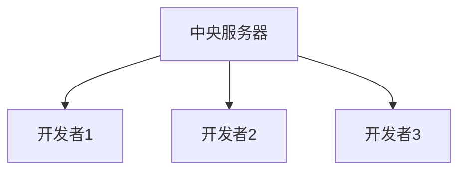
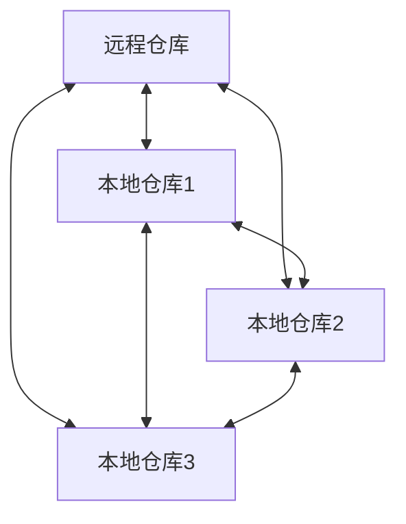
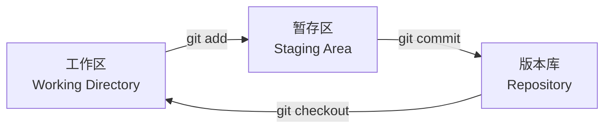
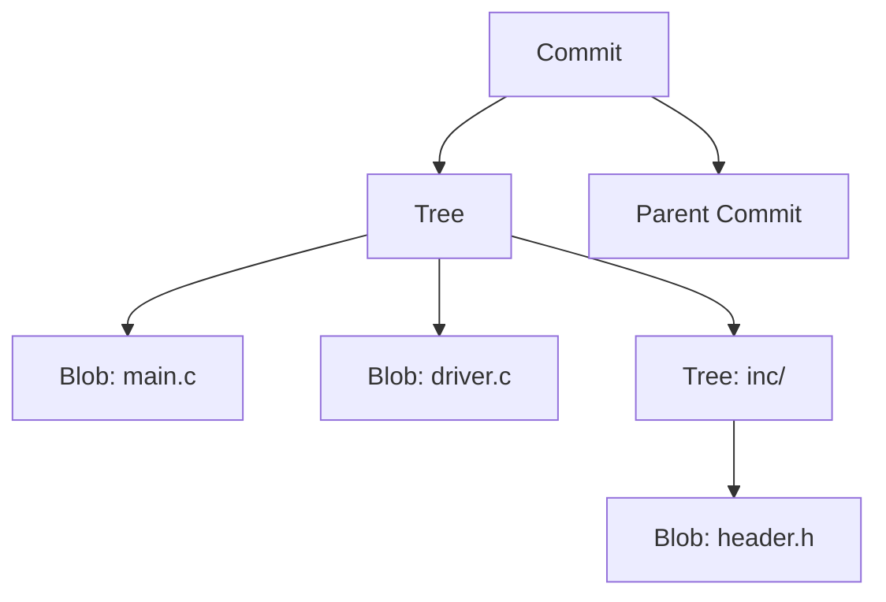
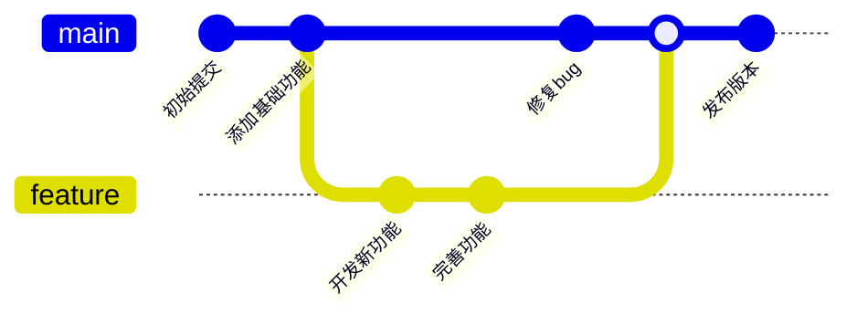
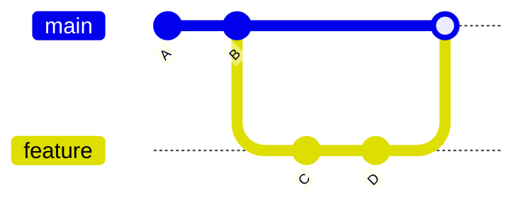
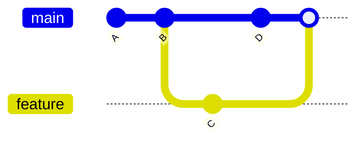
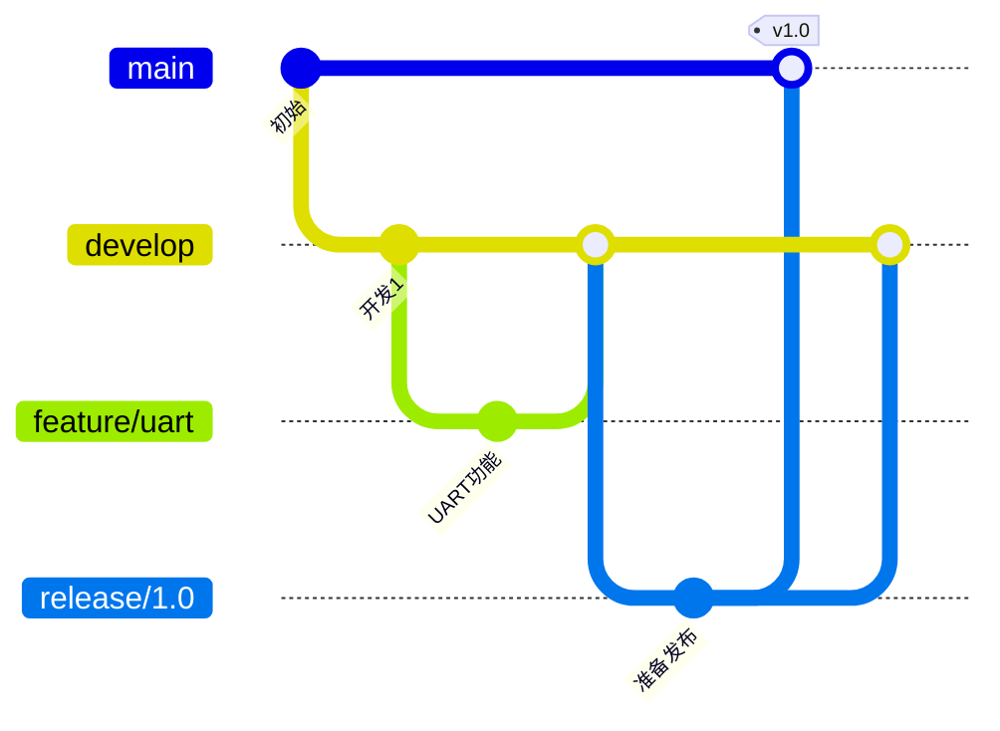
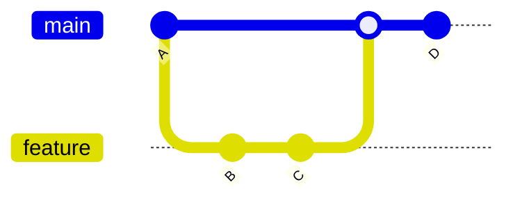

# 版本控制Git基础：嵌入式开发者的必备技能


## 概述

Git是目前最流行的分布式版本控制系统，由Linux之父Linus Torvalds创建。对于嵌入式开发者来说，Git不仅是代码管理的工具，更是团队协作和项目管理的基础。

### 为什么嵌入式开发需要Git？

**代码管理的挑战**:
- ❌ 多个版本的代码文件混乱
- ❌ 无法追踪代码修改历史
- ❌ 团队协作时代码冲突
- ❌ 难以回退到之前的版本
- ❌ 无法并行开发多个功能

**Git的优势**:
- ✅ 完整的版本历史记录
- ✅ 分支管理支持并行开发
- ✅ 分布式架构，本地完整仓库
- ✅ 强大的合并和冲突解决
- ✅ 与GitHub/GitLab等平台集成
- ✅ 支持代码审查和CI/CD

### 学习目标

完成本文学习后，你将能够:

- [ ] 理解Git的基本概念和工作原理
- [ ] 掌握Git的常用命令和操作
- [ ] 使用分支进行并行开发
- [ ] 处理代码合并和冲突
- [ ] 与远程仓库协作
- [ ] 遵循Git最佳实践


## Git基本概念

### 版本控制系统类型

**集中式版本控制 (SVN)**:

- 单一中央服务器
- 必须联网才能提交
- 服务器故障影响所有人

**分布式版本控制 (Git)**:

- 每个开发者都有完整仓库
- 可以离线工作
- 更安全和灵活


### Git的三个区域

Git管理代码的三个主要区域:



**工作区 (Working Directory)**:
- 你实际编辑代码的目录
- 包含项目的所有文件
- 可以随意修改

**暂存区 (Staging Area / Index)**:
- 临时存放即将提交的修改
- 使用`git add`添加文件到暂存区
- 可以选择性地提交部分修改

**版本库 (Repository)**:
- 存储所有提交的历史记录
- 使用`git commit`将暂存区内容提交到版本库
- 包含完整的项目历史

### Git对象模型

Git使用四种对象类型管理数据:

1. **Blob**: 文件内容
2. **Tree**: 目录结构
3. **Commit**: 提交记录
4. **Tag**: 标签引用




## 安装和配置Git

### 安装Git

**Linux系统**:
```bash
# Ubuntu/Debian
sudo apt install git

# CentOS/RHEL
sudo yum install git

# Fedora
sudo dnf install git
```

**macOS系统**:
```bash
# 使用Homebrew
brew install git

# 或安装Xcode Command Line Tools
xcode-select --install
```

**Windows系统**:
- 下载Git for Windows: https://git-scm.com/download/win
- 运行安装程序，使用默认选项
- 推荐选择"Git Bash"作为命令行工具


### 验证安装

```bash
git --version
```

**预期输出**:
```
git version 2.40.0
```

### 初始配置

配置用户信息（必须）:

```bash
# 配置用户名
git config --global user.name "你的名字"

# 配置邮箱
git config --global user.email "your.email@example.com"
```

**配置说明**:
- `--global`: 全局配置，对所有仓库生效
- `--local`: 仓库级配置，仅对当前仓库生效
- `--system`: 系统级配置，对所有用户生效

### 常用配置

```bash
# 配置默认编辑器
git config --global core.editor "vim"

# 配置默认分支名称
git config --global init.defaultBranch main

# 启用颜色输出
git config --global color.ui auto

# 配置换行符处理（Windows）
git config --global core.autocrlf true

# 配置换行符处理（Linux/macOS）
git config --global core.autocrlf input

# 配置别名
git config --global alias.st status
git config --global alias.co checkout
git config --global alias.br branch
git config --global alias.ci commit
```

### 查看配置

```bash
# 查看所有配置
git config --list

# 查看特定配置
git config user.name
git config user.email

# 查看配置来源
git config --list --show-origin
```


## Git基本操作

### 创建仓库

#### 方法1: 初始化新仓库

```bash
# 创建项目目录
mkdir stm32_project
cd stm32_project

# 初始化Git仓库
git init
```

**输出**:
```
Initialized empty Git repository in /path/to/stm32_project/.git/
```

这会创建一个`.git`目录，包含Git所需的所有文件。


#### 方法2: 克隆现有仓库

```bash
# 克隆远程仓库
git clone https://github.com/username/repository.git

# 克隆到指定目录
git clone https://github.com/username/repository.git my_project

# 克隆指定分支
git clone -b develop https://github.com/username/repository.git
```

### 查看状态

```bash
# 查看仓库状态
git status

# 简洁输出
git status -s
```

**输出示例**:
```
On branch main
Your branch is up to date with 'origin/main'.

Changes not staged for commit:
  (use "git add <file>..." to update what will be committed)
  (use "git restore <file>..." to discard changes in working directory)
        modified:   src/main.c

Untracked files:
  (use "git add <file>..." to include in what will be committed)
        src/driver.c

no changes added to commit (use "git add" and/or "git commit -a")
```

**状态说明**:
- `modified`: 文件已修改但未暂存
- `Untracked`: 新文件，Git尚未跟踪
- `Changes to be committed`: 已暂存，等待提交

### 添加文件

```bash
# 添加单个文件
git add src/main.c

# 添加多个文件
git add src/main.c src/driver.c

# 添加整个目录
git add src/

# 添加所有修改的文件
git add .

# 添加所有文件（包括删除）
git add -A

# 交互式添加
git add -i
```

**最佳实践**:
- 避免使用`git add .`添加所有文件
- 仔细检查要添加的文件
- 使用`.gitignore`排除不需要的文件

### 提交更改

```bash
# 提交暂存区的文件
git commit -m "添加GPIO驱动程序"

# 提交并显示详细信息
git commit -v

# 修改上一次提交
git commit --amend

# 跳过暂存区直接提交（不推荐）
git commit -a -m "快速提交所有修改"
```

**提交信息规范**:
```bash
# 好的提交信息
git commit -m "fix: 修复GPIO初始化时的时钟配置错误"
git commit -m "feat: 添加UART DMA传输支持"
git commit -m "docs: 更新README中的编译说明"

# 不好的提交信息
git commit -m "修改"
git commit -m "update"
git commit -m "fix bug"
```


**提交信息格式**:
```
<type>(<scope>): <subject>

<body>

<footer>
```

**类型 (type)**:
- `feat`: 新功能
- `fix`: 修复bug
- `docs`: 文档更新
- `style`: 代码格式（不影响功能）
- `refactor`: 重构
- `test`: 测试相关
- `chore`: 构建过程或辅助工具

### 查看历史

```bash
# 查看提交历史
git log

# 简洁输出
git log --oneline

# 图形化显示分支
git log --graph --oneline --all

# 查看最近N次提交
git log -n 5

# 查看某个文件的历史
git log src/main.c

# 查看提交的详细信息
git show <commit-hash>

# 查看某次提交的文件变化
git show <commit-hash>:src/main.c
```

**输出示例**:
```
commit a1b2c3d4e5f6g7h8i9j0k1l2m3n4o5p6q7r8s9t0
Author: 张三 <zhangsan@example.com>
Date:   Mon Jan 15 10:30:00 2024 +0800

    feat: 添加GPIO驱动程序
    
    - 实现GPIO初始化函数
    - 添加引脚配置接口
    - 支持中断模式
```

### 撤销操作

#### 撤销工作区修改

```bash
# 撤销单个文件的修改
git restore src/main.c

# 撤销所有修改
git restore .

# 旧版本命令（Git 2.23之前）
git checkout -- src/main.c
```

#### 撤销暂存区

```bash
# 取消暂存单个文件
git restore --staged src/main.c

# 取消所有暂存
git restore --staged .

# 旧版本命令
git reset HEAD src/main.c
```

#### 撤销提交

```bash
# 撤销最近一次提交，保留修改
git reset --soft HEAD~1

# 撤销最近一次提交，修改回到工作区
git reset --mixed HEAD~1

# 撤销最近一次提交，丢弃所有修改（危险！）
git reset --hard HEAD~1

# 撤销到指定提交
git reset --hard <commit-hash>
```

**reset模式对比**:
| 模式 | 工作区 | 暂存区 | 版本库 |
|------|--------|--------|--------|
| --soft | 保留 | 保留 | 回退 |
| --mixed | 保留 | 清空 | 回退 |
| --hard | 清空 | 清空 | 回退 |


### .gitignore文件

创建`.gitignore`文件来排除不需要版本控制的文件:

```gitignore
# 编译输出
*.o
*.elf
*.bin
*.hex
*.map

# 构建目录
build/
Debug/
Release/

# IDE文件
.vscode/
.idea/
*.swp
*.swo

# 操作系统文件
.DS_Store
Thumbs.db

# 临时文件
*.tmp
*.bak
*~

# 依赖库（如果使用包管理器）
node_modules/
vendor/
```

**规则说明**:
- `*.o`: 忽略所有.o文件
- `build/`: 忽略build目录
- `!important.o`: 不忽略important.o（例外）
- `doc/*.txt`: 忽略doc目录下的txt文件
- `doc/**/*.pdf`: 忽略doc目录及子目录的pdf文件


## 分支管理

### 分支的概念

分支允许你在不影响主代码的情况下开发新功能或修复bug。



### 分支操作

#### 查看分支

```bash
# 查看本地分支
git branch

# 查看所有分支（包括远程）
git branch -a

# 查看分支详细信息
git branch -v

# 查看已合并的分支
git branch --merged

# 查看未合并的分支
git branch --no-merged
```

#### 创建分支

```bash
# 创建新分支
git branch feature-uart

# 创建并切换到新分支
git checkout -b feature-uart

# 新版本命令（Git 2.23+）
git switch -c feature-uart

# 基于指定提交创建分支
git branch feature-uart <commit-hash>
```


#### 切换分支

```bash
# 切换分支
git checkout feature-uart

# 新版本命令
git switch feature-uart

# 切换到上一个分支
git checkout -

# 强制切换（丢弃当前修改）
git checkout -f feature-uart
```

#### 合并分支

```bash
# 切换到目标分支
git checkout main

# 合并feature分支到main
git merge feature-uart

# 禁用快进合并（保留分支历史）
git merge --no-ff feature-uart

# 压缩合并（所有提交合并为一个）
git merge --squash feature-uart
```

**合并类型**:

1. **快进合并 (Fast-forward)**:


2. **三方合并 (3-way merge)**:


#### 删除分支

```bash
# 删除已合并的分支
git branch -d feature-uart

# 强制删除分支（即使未合并）
git branch -D feature-uart

# 删除远程分支
git push origin --delete feature-uart
```

### 处理合并冲突

当两个分支修改了同一文件的同一部分时，会产生冲突。

**冲突标记**:
```c
<<<<<<< HEAD
// 当前分支的代码
void led_init(void) {
    GPIO_Init(GPIOA, GPIO_PIN_5);
}
=======
// 要合并分支的代码
void led_init(void) {
    GPIO_InitTypeDef GPIO_InitStruct = {0};
    GPIO_InitStruct.Pin = GPIO_PIN_5;
    HAL_GPIO_Init(GPIOA, &GPIO_InitStruct);
}
>>>>>>> feature-uart
```

**解决冲突步骤**:

1. 查看冲突文件:
```bash
git status
```

2. 编辑冲突文件，选择保留的代码:
```c
// 解决后的代码
void led_init(void) {
    GPIO_InitTypeDef GPIO_InitStruct = {0};
    GPIO_InitStruct.Pin = GPIO_PIN_5;
    HAL_GPIO_Init(GPIOA, &GPIO_InitStruct);
}
```

3. 标记冲突已解决:
```bash
git add src/led.c
```

4. 完成合并:
```bash
git commit -m "merge: 合并feature-uart分支，解决led_init冲突"
```

5. 取消合并（如果需要）:
```bash
git merge --abort
```


## 远程仓库

### 查看远程仓库

```bash
# 查看远程仓库
git remote

# 查看远程仓库详细信息
git remote -v

# 查看远程仓库详情
git remote show origin
```

**输出示例**:
```
origin  https://github.com/username/stm32_project.git (fetch)
origin  https://github.com/username/stm32_project.git (push)
```

### 添加远程仓库

```bash
# 添加远程仓库
git remote add origin https://github.com/username/stm32_project.git

# 修改远程仓库URL
git remote set-url origin https://github.com/username/new_project.git

# 删除远程仓库
git remote remove origin
```

### 推送到远程仓库

```bash
# 推送到远程仓库
git push origin main

# 首次推送并设置上游分支
git push -u origin main

# 推送所有分支
git push origin --all

# 推送标签
git push origin --tags

# 强制推送（危险！）
git push -f origin main
```

### 从远程仓库拉取

```bash
# 拉取并合并
git pull origin main

# 等价于
git fetch origin
git merge origin/main

# 拉取并变基
git pull --rebase origin main

# 仅拉取不合并
git fetch origin
```

**pull vs fetch**:
- `git pull`: 拉取并自动合并
- `git fetch`: 仅拉取，不合并，更安全

### 克隆仓库

```bash
# 克隆仓库
git clone https://github.com/username/stm32_project.git

# 克隆指定分支
git clone -b develop https://github.com/username/stm32_project.git

# 浅克隆（仅最近的提交）
git clone --depth 1 https://github.com/username/stm32_project.git
```


## 标签管理

标签用于标记重要的提交点，通常用于版本发布。

### 创建标签

```bash
# 创建轻量标签
git tag v1.0.0

# 创建附注标签（推荐）
git tag -a v1.0.0 -m "发布版本1.0.0"

# 为指定提交创建标签
git tag -a v1.0.0 <commit-hash> -m "版本1.0.0"
```

### 查看标签

```bash
# 查看所有标签
git tag

# 查看标签详细信息
git show v1.0.0

# 查看匹配的标签
git tag -l "v1.*"
```

### 推送标签

```bash
# 推送单个标签
git push origin v1.0.0

# 推送所有标签
git push origin --tags
```

### 删除标签

```bash
# 删除本地标签
git tag -d v1.0.0

# 删除远程标签
git push origin --delete v1.0.0
```


## 协作工作流

### Git Flow工作流

Git Flow是一种广泛使用的分支管理策略:



**分支类型**:

1. **main**: 主分支，存放稳定的发布版本
2. **develop**: 开发分支，日常开发的基础
3. **feature/**: 功能分支，开发新功能
4. **release/**: 发布分支，准备新版本发布
5. **hotfix/**: 热修复分支，紧急修复生产bug

**工作流程**:

```bash
# 1. 从develop创建功能分支
git checkout develop
git checkout -b feature/uart-driver

# 2. 开发功能
git add src/uart.c
git commit -m "feat: 实现UART驱动"

# 3. 合并回develop
git checkout develop
git merge --no-ff feature/uart-driver

# 4. 创建发布分支
git checkout -b release/1.0 develop

# 5. 发布准备（修复bug、更新版本号）
git commit -m "chore: 更新版本号到1.0"

# 6. 合并到main并打标签
git checkout main
git merge --no-ff release/1.0
git tag -a v1.0 -m "版本1.0发布"

# 7. 合并回develop
git checkout develop
git merge --no-ff release/1.0

# 8. 删除发布分支
git branch -d release/1.0
```

### GitHub Flow工作流

GitHub Flow是一种更简单的工作流，适合持续部署:



**工作流程**:

```bash
# 1. 创建功能分支
git checkout -b feature/add-sensor

# 2. 开发并提交
git add .
git commit -m "feat: 添加温度传感器支持"

# 3. 推送到远程
git push -u origin feature/add-sensor

# 4. 创建Pull Request（在GitHub上）

# 5. 代码审查和讨论

# 6. 合并到main（在GitHub上）

# 7. 删除功能分支
git branch -d feature/add-sensor
git push origin --delete feature/add-sensor
```

### Fork工作流

适合开源项目的协作模式:

1. **Fork仓库**: 在GitHub上Fork原仓库
2. **克隆Fork**: `git clone https://github.com/your-username/project.git`
3. **添加上游**: `git remote add upstream https://github.com/original/project.git`
4. **创建分支**: `git checkout -b feature/new-feature`
5. **开发提交**: 正常开发和提交
6. **同步上游**: `git fetch upstream && git merge upstream/main`
7. **推送Fork**: `git push origin feature/new-feature`
8. **创建PR**: 在GitHub上创建Pull Request


## 实用技巧

### 暂存工作进度

当需要临时切换分支但不想提交当前修改时:

```bash
# 暂存当前修改
git stash

# 暂存并添加说明
git stash save "临时保存UART驱动开发"

# 查看暂存列表
git stash list

# 恢复最近的暂存
git stash pop

# 恢复指定的暂存
git stash apply stash@{0}

# 删除暂存
git stash drop stash@{0}

# 清空所有暂存
git stash clear
```

### 查看差异

```bash
# 查看工作区和暂存区的差异
git diff

# 查看暂存区和版本库的差异
git diff --staged

# 查看两个提交之间的差异
git diff <commit1> <commit2>

# 查看某个文件的差异
git diff src/main.c

# 查看分支之间的差异
git diff main feature-uart
```

### 搜索和查找

```bash
# 在提交历史中搜索
git log --grep="UART"

# 搜索代码内容
git grep "GPIO_Init"

# 查找谁修改了某行代码
git blame src/main.c

# 查找引入bug的提交
git bisect start
git bisect bad
git bisect good <commit-hash>
```

### 重写历史

```bash
# 修改最近的提交信息
git commit --amend

# 交互式变基（修改多个提交）
git rebase -i HEAD~3

# 压缩提交
git rebase -i HEAD~3
# 在编辑器中将pick改为squash

# 拆分提交
git rebase -i HEAD~3
# 在编辑器中将pick改为edit
# 然后使用git reset HEAD~1拆分
```

**注意**: 不要重写已推送到远程的提交！

### 子模块管理

```bash
# 添加子模块
git submodule add https://github.com/user/lib.git libs/mylib

# 克隆包含子模块的仓库
git clone --recursive https://github.com/user/project.git

# 初始化子模块
git submodule init
git submodule update

# 更新子模块
git submodule update --remote

# 删除子模块
git submodule deinit libs/mylib
git rm libs/mylib
```


## 最佳实践

### 提交规范

1. **频繁提交**: 每完成一个小功能就提交
2. **原子提交**: 每次提交只包含一个逻辑修改
3. **有意义的提交信息**: 清楚描述做了什么
4. **提交前检查**: 使用`git diff`检查修改

### 分支策略

1. **main分支保护**: 不直接在main上开发
2. **功能分支**: 每个功能使用独立分支
3. **及时合并**: 功能完成后及时合并
4. **删除已合并分支**: 保持分支列表整洁

### 代码审查

1. **Pull Request**: 使用PR进行代码审查
2. **小而频繁**: PR保持小而频繁
3. **描述清楚**: PR描述清楚修改内容
4. **及时响应**: 及时响应审查意见


### .gitignore最佳实践

```gitignore
# 嵌入式项目通用.gitignore

# 编译输出
*.o
*.obj
*.elf
*.bin
*.hex
*.map
*.lst
*.su
*.d

# 构建目录
build/
Debug/
Release/
.build/

# IDE和编辑器
.vscode/
.idea/
*.swp
*.swo
*~
.DS_Store

# Keil MDK
*.uvguix.*
*.uvoptx
*.bak
*.dep
*.crf
*.lnp

# IAR
Debug/
Release/
settings/
*.dep
*.ewt

# Eclipse
.metadata/
.settings/
.project
.cproject

# 临时文件
*.tmp
*.log
*.bak

# 依赖库（根据项目调整）
# 如果使用Git管理依赖，注释掉这行
# libs/
```

### 安全实践

1. **不提交敏感信息**:
   - API密钥
   - 密码
   - 私钥
   - 配置文件中的敏感数据

2. **使用环境变量**: 敏感配置使用环境变量

3. **检查历史**: 定期检查是否误提交敏感信息

4. **使用.gitignore**: 排除敏感文件

### 性能优化

```bash
# 清理不必要的文件
git gc

# 压缩仓库
git gc --aggressive

# 清理远程分支引用
git remote prune origin

# 浅克隆（节省空间和时间）
git clone --depth 1 https://github.com/user/repo.git
```


## 常见问题

### 问题1: 误提交了大文件

**现象**: 仓库变得很大，推送很慢

**解决方法**:
```bash
# 从历史中删除大文件
git filter-branch --tree-filter 'rm -f path/to/large/file' HEAD

# 或使用BFG Repo-Cleaner（更快）
bfg --delete-files large-file.bin

# 强制推送
git push -f origin main
```

### 问题2: 提交到了错误的分支

**解决方法**:
```bash
# 方法1: 使用cherry-pick
git checkout correct-branch
git cherry-pick <commit-hash>
git checkout wrong-branch
git reset --hard HEAD~1

# 方法2: 创建新分支
git branch correct-branch
git reset --hard HEAD~1
git checkout correct-branch
```

### 问题3: 需要撤销已推送的提交

**解决方法**:
```bash
# 方法1: 使用revert（推荐）
git revert <commit-hash>
git push origin main

# 方法2: 强制推送（危险！）
git reset --hard HEAD~1
git push -f origin main
```

### 问题4: 合并冲突太多

**解决方法**:
```bash
# 取消合并
git merge --abort

# 使用变基代替合并
git rebase main

# 或使用工具辅助解决
git mergetool
```

### 问题5: 忘记切换分支就开始开发

**解决方法**:
```bash
# 暂存当前修改
git stash

# 切换到正确的分支
git checkout correct-branch

# 恢复修改
git stash pop
```


## Git与嵌入式开发

### 嵌入式项目结构

```
stm32_project/
├── .git/
├── .gitignore
├── README.md
├── Makefile
├── src/
│   ├── main.c
│   ├── system_stm32f4xx.c
│   └── stm32f4xx_it.c
├── inc/
│   ├── main.h
│   └── stm32f4xx_it.h
├── drivers/
│   ├── gpio.c
│   └── uart.c
├── libs/
│   └── CMSIS/
├── docs/
│   └── design.md
└── tests/
    └── test_gpio.c
```

### 版本发布流程

```bash
# 1. 确保在develop分支
git checkout develop

# 2. 创建发布分支
git checkout -b release/v1.0.0

# 3. 更新版本号
# 编辑version.h或其他版本文件
git add version.h
git commit -m "chore: 更新版本号到v1.0.0"

# 4. 合并到main
git checkout main
git merge --no-ff release/v1.0.0

# 5. 打标签
git tag -a v1.0.0 -m "版本1.0.0发布
- 添加GPIO驱动
- 添加UART驱动
- 修复时钟配置bug"

# 6. 合并回develop
git checkout develop
git merge --no-ff release/v1.0.0

# 7. 推送到远程
git push origin main develop --tags

# 8. 删除发布分支
git branch -d release/v1.0.0
```

### 固件版本管理

在代码中嵌入Git信息:

```c
// version.h
#ifndef VERSION_H
#define VERSION_H

#define FW_VERSION_MAJOR 1
#define FW_VERSION_MINOR 0
#define FW_VERSION_PATCH 0

// Git信息（由构建脚本自动生成）
#define GIT_COMMIT_HASH "a1b2c3d"
#define GIT_BRANCH "main"
#define BUILD_DATE "2024-01-15"

#endif
```

**自动生成版本信息**:

```bash
# generate_version.sh
#!/bin/bash

GIT_HASH=$(git rev-parse --short HEAD)
GIT_BRANCH=$(git rev-parse --abbrev-ref HEAD)
BUILD_DATE=$(date +%Y-%m-%d)

cat > inc/git_version.h << EOF
#ifndef GIT_VERSION_H
#define GIT_VERSION_H

#define GIT_COMMIT_HASH "${GIT_HASH}"
#define GIT_BRANCH "${GIT_BRANCH}"
#define BUILD_DATE "${BUILD_DATE}"

#endif
EOF
```

在Makefile中集成:

```makefile
# 生成版本信息
.PHONY: version
version:
	@./scripts/generate_version.sh

# 构建前生成版本信息
all: version $(TARGET)
```


## 工具推荐

### GUI工具

1. **GitKraken**: 跨平台，功能强大
2. **SourceTree**: 免费，适合初学者
3. **GitHub Desktop**: 简单易用
4. **TortoiseGit**: Windows集成
5. **Git Extensions**: Windows平台

### VS Code集成

安装Git相关插件:
- GitLens: 增强Git功能
- Git Graph: 可视化分支图
- Git History: 查看文件历史

### 命令行增强

```bash
# 安装Oh My Zsh（Linux/macOS）
sh -c "$(curl -fsSL https://raw.github.com/ohmyzsh/ohmyzsh/master/tools/install.sh)"

# 启用Git插件
# 编辑~/.zshrc
plugins=(git)

# 使用Git别名
git st    # git status
git co    # git checkout
git br    # git branch
git ci    # git commit
```


## 总结

通过本文学习，你已经掌握了:

- ✅ Git的基本概念和工作原理
- ✅ Git的常用命令和操作
- ✅ 分支管理和合并策略
- ✅ 远程仓库的协作方式
- ✅ 常见问题的解决方法
- ✅ 嵌入式开发中的Git应用

**关键要点**:
1. Git是分布式版本控制系统
2. 理解工作区、暂存区、版本库的概念
3. 使用分支进行并行开发
4. 遵循提交规范和工作流
5. 定期推送和拉取远程仓库
6. 不要重写已推送的历史

## 下一步学习

建议继续学习以下内容:

### 初级进阶
- [持续集成CI/CD实践](../intermediate/03-cicd-practice.html) - 自动化构建和测试
- [代码静态分析工具使用](../intermediate/04-static-analysis.html) - 提升代码质量
- [Makefile编写入门](../beginner/05-makefile-basics.html) - 自动化构建

### 中级进阶
- Git进阶技巧 - 深入学习Git
- GitHub Actions - 自动化工作流
- 代码审查最佳实践 - 提升代码质量

### 高级进阶
- Git内部原理 - 深入理解Git
- 大型项目Git管理 - 企业级应用
- 自定义Git工作流 - 定制化方案


## 常见问题FAQ

### Q1: Git和SVN有什么区别？

**A**: 
- **Git**: 分布式，每个开发者都有完整仓库，可离线工作
- **SVN**: 集中式，依赖中央服务器，必须联网
- **优势**: Git更快、更灵活、更安全

### Q2: 什么时候应该提交代码？

**A**: 
- 完成一个小功能或修复一个bug
- 代码可以编译通过
- 不要等到一天结束才提交
- 遵循"小而频繁"的原则

### Q3: 如何选择工作流？

**A**: 
- **小团队**: GitHub Flow（简单）
- **大团队**: Git Flow（规范）
- **开源项目**: Fork工作流
- **持续部署**: GitHub Flow

### Q4: 合并和变基有什么区别？

**A**: 
- **merge**: 保留完整历史，产生合并提交
- **rebase**: 线性历史，更清晰但会改写历史
- **建议**: 本地分支用rebase，公共分支用merge

### Q5: 如何处理大文件？

**A**: 
- 使用Git LFS（Large File Storage）
- 不要提交编译产物
- 使用.gitignore排除大文件
- 考虑使用外部存储

### Q6: 提交信息写什么？

**A**: 
- 简洁描述做了什么
- 使用约定的格式（如Conventional Commits）
- 包含相关的issue编号
- 避免"修改"、"更新"等模糊描述

### Q7: 如何保护main分支？

**A**: 
- 在GitHub/GitLab上设置分支保护
- 要求Pull Request审查
- 要求CI通过
- 禁止直接推送

### Q8: Git仓库太大怎么办？

**A**: 
- 运行`git gc`清理
- 使用`git filter-branch`删除大文件
- 使用浅克隆`--depth 1`
- 考虑拆分仓库


## 参考资料

### 官方文档
1. [Git官方文档](https://git-scm.com/doc) - 完整的Git文档
2. [Pro Git书籍](https://git-scm.com/book/zh/v2) - 免费的Git电子书
3. [GitHub文档](https://docs.github.com/) - GitHub使用指南

### 教程和文章
1. [Learn Git Branching](https://learngitbranching.js.org/) - 交互式Git学习
2. [Git Cheat Sheet](https://education.github.com/git-cheat-sheet-education.pdf) - Git速查表
3. [Atlassian Git教程](https://www.atlassian.com/git/tutorials) - 详细的Git教程

### 工具和资源
1. [GitKraken](https://www.gitkraken.com/) - Git GUI工具
2. [SourceTree](https://www.sourcetreeapp.com/) - 免费Git GUI
3. [Git Extensions](https://gitextensions.github.io/) - Windows Git工具

### 视频教程
1. [Git和GitHub入门](https://www.bilibili.com/video/BV1pX4y1S7Dq/) - B站教程
2. [Git工作流详解](https://www.bilibili.com/video/BV1BE411g7SV/) - 工作流讲解

### 书籍推荐
1. "Pro Git" - Scott Chacon & Ben Straub
2. "Git权威指南" - 蒋鑫
3. "版本控制之道" - Eric Sink


## 实践练习

### 练习1: 基础操作

1. 创建一个新的Git仓库
2. 创建几个文件并提交
3. 修改文件并查看差异
4. 撤销修改并重新提交

### 练习2: 分支管理

1. 创建一个新分支
2. 在新分支上开发功能
3. 切换回主分支
4. 合并功能分支
5. 解决可能的冲突

### 练习3: 远程协作

1. 在GitHub上创建仓库
2. 将本地仓库推送到GitHub
3. 克隆仓库到另一个目录
4. 在两个目录间进行推送和拉取
5. 模拟团队协作场景

### 练习4: 工作流实践

1. 使用Git Flow创建功能分支
2. 开发并提交功能
3. 创建发布分支
4. 合并到主分支并打标签
5. 完成完整的发布流程


## 附录

### Git命令速查表

**配置**:
```bash
git config --global user.name "name"
git config --global user.email "email"
```

**仓库操作**:
```bash
git init                    # 初始化仓库
git clone <url>             # 克隆仓库
git status                  # 查看状态
```

**提交操作**:
```bash
git add <file>              # 添加文件
git commit -m "message"     # 提交
git log                     # 查看历史
```

**分支操作**:
```bash
git branch                  # 查看分支
git branch <name>           # 创建分支
git checkout <name>         # 切换分支
git merge <name>            # 合并分支
```

**远程操作**:
```bash
git remote add origin <url> # 添加远程
git push origin <branch>    # 推送
git pull origin <branch>    # 拉取
git fetch origin            # 获取
```

**撤销操作**:
```bash
git restore <file>          # 撤销修改
git reset HEAD <file>       # 取消暂存
git revert <commit>         # 撤销提交
```

### 常用Git别名

```bash
# 添加到~/.gitconfig
[alias]
    st = status
    co = checkout
    br = branch
    ci = commit
    unstage = reset HEAD
    last = log -1 HEAD
    visual = log --graph --oneline --all
```

---

**反馈与支持**:
- 如果你在学习过程中遇到问题，欢迎在评论区留言
- 发现文档错误或有改进建议，请提交Issue
- 想要分享你的Git经验，欢迎投稿

**版本历史**:
- v1.0 (2024-01-15): 初始版本发布

**许可证**: 本文档采用 [CC BY-SA 4.0](https://creativecommons.org/licenses/by-sa/4.0/) 许可协议
