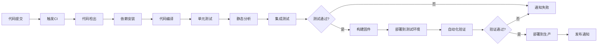
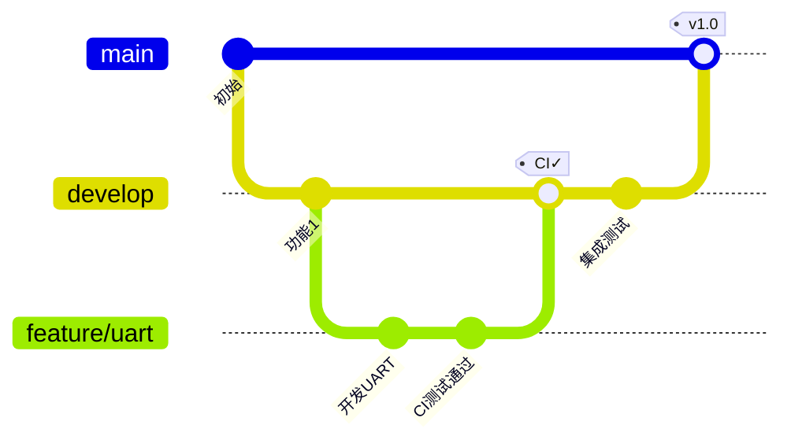

# 持续集成CI/CD实践：嵌入式项目自动化构建与部署


## 概述

持续集成（Continuous Integration, CI）和持续部署（Continuous Deployment, CD）是现代软件开发的核心实践。对于嵌入式系统开发，CI/CD可以显著提高开发效率、代码质量和产品可靠性。

### 什么是CI/CD？

**持续集成 (CI)**:
- 开发者频繁地将代码集成到主分支
- 每次集成都通过自动化构建和测试验证
- 快速发现和定位集成错误
- 保持代码库始终处于可工作状态

**持续部署 (CD)**:
- 自动将通过测试的代码部署到目标环境
- 减少手动部署的错误和时间
- 实现快速迭代和发布
- 提高软件交付的频率和质量

### 嵌入式开发的CI/CD挑战

**传统嵌入式开发痛点**:
- ❌ 手动编译耗时且容易出错
- ❌ 多平台交叉编译配置复杂
- ❌ 硬件依赖导致测试困难
- ❌ 固件烧录和验证流程繁琐
- ❌ 团队协作时集成问题频发
- ❌ 版本发布流程不规范

**CI/CD带来的改进**:
- ✅ 自动化编译和构建
- ✅ 多平台并行构建
- ✅ 自动化单元测试和集成测试
- ✅ 代码质量自动检查
- ✅ 自动生成固件和文档
- ✅ 规范化的发布流程

### 学习目标

完成本教程后，你将能够:

- [ ] 理解CI/CD的核心概念和价值
- [ ] 搭建Jenkins CI/CD环境
- [ ] 配置GitLab CI/CD流水线
- [ ] 集成自动化测试和代码质量检查
- [ ] 实现嵌入式项目的自动化构建
- [ ] 设计完整的CI/CD工作流
- [ ] 掌握CI/CD最佳实践


## CI/CD核心概念

### CI/CD流程图



### CI/CD关键组件

**1. 版本控制系统 (VCS)**:
- Git, SVN
- 代码托管平台: GitHub, GitLab, Bitbucket
- 触发CI/CD的源头

**2. CI/CD服务器**:
- Jenkins
- GitLab CI/CD
- GitHub Actions
- Travis CI
- CircleCI

**3. 构建工具**:
- Make, CMake
- GCC, ARM GCC
- 交叉编译工具链

**4. 测试框架**:
- Unity (C单元测试)
- Google Test
- Ceedling
- Robot Framework

**5. 代码质量工具**:
- Cppcheck (静态分析)
- Clang-Tidy
- SonarQube
- Coverity

**6. 部署工具**:
- Ansible
- Docker
- 固件烧录工具
- OTA更新系统

### CI/CD工作流模式

**1. 基础CI流程**:
```
提交代码 → 编译 → 测试 → 通知结果
```

**2. 完整CI/CD流程**:
```
提交代码 → 编译 → 单元测试 → 静态分析 → 
集成测试 → 构建固件 → 部署测试环境 → 
自动化验证 → 部署生产环境 → 监控
```

**3. 分支策略集成**:



## Jenkins CI/CD实践

### Jenkins简介

Jenkins是最流行的开源CI/CD工具，具有:
- 丰富的插件生态系统
- 灵活的Pipeline配置
- 支持分布式构建
- 强大的社区支持

### 安装Jenkins

#### 方法1: Docker安装（推荐）

```bash
# 拉取Jenkins镜像
docker pull jenkins/jenkins:lts

# 创建数据卷
docker volume create jenkins_home

# 运行Jenkins容器
docker run -d \
  --name jenkins \
  -p 8080:8080 \
  -p 50000:50000 \
  -v jenkins_home:/var/jenkins_home \
  -v /var/run/docker.sock:/var/run/docker.sock \
  jenkins/jenkins:lts

# 查看初始管理员密码
docker exec jenkins cat /var/jenkins_home/secrets/initialAdminPassword
```

#### 方法2: Linux系统安装

```bash
# Ubuntu/Debian
wget -q -O - https://pkg.jenkins.io/debian-stable/jenkins.io.key | sudo apt-key add -
sudo sh -c 'echo deb https://pkg.jenkins.io/debian-stable binary/ > /etc/apt/sources.list.d/jenkins.list'
sudo apt update
sudo apt install jenkins

# 启动Jenkins
sudo systemctl start jenkins
sudo systemctl enable jenkins

# 查看初始密码
sudo cat /var/lib/jenkins/secrets/initialAdminPassword
```

#### 方法3: Windows安装

1. 下载Jenkins WAR文件: https://www.jenkins.io/download/
2. 安装Java JDK 11或更高版本
3. 运行Jenkins:
```cmd
java -jar jenkins.war --httpPort=8080
```

### 初始配置

1. **访问Jenkins**: 打开浏览器访问 `http://localhost:8080`

2. **解锁Jenkins**: 输入初始管理员密码

3. **安装插件**: 选择"安装推荐的插件"

4. **创建管理员用户**: 设置用户名和密码

5. **配置Jenkins URL**: 确认Jenkins访问地址

### 安装必要插件

进入 "Manage Jenkins" → "Manage Plugins" → "Available"，安装:

**基础插件**:
- Git plugin
- Pipeline
- Blue Ocean (现代化UI)
- Workspace Cleanup

**嵌入式开发插件**:
- Warnings Next Generation (编译警告)
- Cobertura (代码覆盖率)
- HTML Publisher (报告发布)
- Email Extension (邮件通知)

**代码质量插件**:
- SonarQube Scanner
- Cppcheck
- Clang Scan-Build

### 配置全局工具

进入 "Manage Jenkins" → "Global Tool Configuration":

**1. 配置Git**:
```
Name: Default
Path to Git executable: git
```

**2. 配置构建工具**:
```
Name: ARM GCC
Installation directory: /usr/local/arm-gcc
```

**3. 配置环境变量**:
进入 "Manage Jenkins" → "Configure System" → "Global properties"
```
Name: ARM_TOOLCHAIN_PATH
Value: /usr/local/gcc-arm-none-eabi/bin
```


### 创建第一个Jenkins任务

#### 自由风格项目

1. **创建新任务**:
   - 点击 "New Item"
   - 输入任务名称: `STM32_Build`
   - 选择 "Freestyle project"
   - 点击 "OK"

2. **配置源代码管理**:
   - 选择 "Git"
   - Repository URL: `https://github.com/username/stm32-project.git`
   - Credentials: 添加Git凭据
   - Branch: `*/main`

3. **配置构建触发器**:
   - ☑ Poll SCM: `H/5 * * * *` (每5分钟检查一次)
   - ☑ GitHub hook trigger (推荐)

4. **配置构建环境**:
   - ☑ Delete workspace before build starts
   - ☑ Add timestamps to the Console Output

5. **添加构建步骤**:
   - 选择 "Execute shell"
   ```bash
   #!/bin/bash
   set -e
   
   echo "=== 开始构建 STM32 项目 ==="
   
   # 设置工具链路径
   export PATH=$ARM_TOOLCHAIN_PATH:$PATH
   
   # 清理之前的构建
   make clean
   
   # 编译项目
   make all
   
   # 检查编译结果
   if [ -f build/firmware.bin ]; then
       echo "✓ 固件构建成功"
       ls -lh build/firmware.bin
   else
       echo "✗ 固件构建失败"
       exit 1
   fi
   ```

6. **添加构建后操作**:
   - Archive the artifacts: `build/*.bin, build/*.hex, build/*.elf`
   - Email notification: 配置邮件通知

7. **保存并构建**:
   - 点击 "Save"
   - 点击 "Build Now"

### Jenkins Pipeline

Pipeline是Jenkins推荐的CI/CD配置方式，使用代码定义整个流程。

#### Jenkinsfile示例

在项目根目录创建 `Jenkinsfile`:

```groovy
pipeline {
    agent any
    
    environment {
        ARM_TOOLCHAIN = '/usr/local/gcc-arm-none-eabi/bin'
        PROJECT_NAME = 'STM32_Firmware'
    }
    
    stages {
        stage('Checkout') {
            steps {
                echo '检出代码...'
                checkout scm
            }
        }
        
        stage('Environment Setup') {
            steps {
                echo '配置构建环境...'
                sh '''
                    export PATH=$ARM_TOOLCHAIN:$PATH
                    arm-none-eabi-gcc --version
                '''
            }
        }
        
        stage('Build') {
            steps {
                echo '编译项目...'
                sh '''
                    export PATH=$ARM_TOOLCHAIN:$PATH
                    make clean
                    make all -j4
                '''
            }
        }
        
        stage('Unit Tests') {
            steps {
                echo '运行单元测试...'
                sh '''
                    make test
                '''
            }
        }
        
        stage('Static Analysis') {
            steps {
                echo '静态代码分析...'
                sh '''
                    cppcheck --enable=all --xml --xml-version=2 \
                        src/ 2> cppcheck-report.xml
                '''
            }
        }
        
        stage('Archive Artifacts') {
            steps {
                echo '归档构建产物...'
                archiveArtifacts artifacts: 'build/*.bin,build/*.hex,build/*.elf', 
                                 fingerprint: true
            }
        }
        
        stage('Generate Reports') {
            steps {
                echo '生成报告...'
                sh '''
                    # 生成代码大小报告
                    arm-none-eabi-size build/*.elf > size-report.txt
                    
                    # 生成内存映射
                    arm-none-eabi-nm -S --size-sort build/*.elf > memory-map.txt
                '''
            }
        }
    }
    
    post {
        success {
            echo '构建成功！'
            emailext (
                subject: "✓ ${PROJECT_NAME} 构建成功 - Build #${BUILD_NUMBER}",
                body: """
                    项目: ${PROJECT_NAME}
                    构建编号: ${BUILD_NUMBER}
                    状态: 成功
                    
                    查看详情: ${BUILD_URL}
                """,
                to: 'team@example.com'
            )
        }
        failure {
            echo '构建失败！'
            emailext (
                subject: "✗ ${PROJECT_NAME} 构建失败 - Build #${BUILD_NUMBER}",
                body: """
                    项目: ${PROJECT_NAME}
                    构建编号: ${BUILD_NUMBER}
                    状态: 失败
                    
                    查看日志: ${BUILD_URL}console
                """,
                to: 'team@example.com'
            )
        }
        always {
            echo '清理工作空间...'
            cleanWs()
        }
    }
}
```

#### 多平台构建Pipeline

```groovy
pipeline {
    agent none
    
    stages {
        stage('Build Multiple Targets') {
            parallel {
                stage('STM32F4') {
                    agent { label 'arm-builder' }
                    steps {
                        sh '''
                            export TARGET=STM32F4
                            make clean
                            make all
                        '''
                        archiveArtifacts 'build/stm32f4/*.bin'
                    }
                }
                
                stage('STM32F7') {
                    agent { label 'arm-builder' }
                    steps {
                        sh '''
                            export TARGET=STM32F7
                            make clean
                            make all
                        '''
                        archiveArtifacts 'build/stm32f7/*.bin'
                    }
                }
                
                stage('ESP32') {
                    agent { label 'esp32-builder' }
                    steps {
                        sh '''
                            export IDF_PATH=/opt/esp-idf
                            idf.py build
                        '''
                        archiveArtifacts 'build/*.bin'
                    }
                }
            }
        }
    }
}
```

### Jenkins高级配置

#### 1. 参数化构建

```groovy
pipeline {
    agent any
    
    parameters {
        choice(
            name: 'TARGET_BOARD',
            choices: ['STM32F4', 'STM32F7', 'STM32H7'],
            description: '选择目标板'
        )
        choice(
            name: 'BUILD_TYPE',
            choices: ['Debug', 'Release'],
            description: '构建类型'
        )
        booleanParam(
            name: 'RUN_TESTS',
            defaultValue: true,
            description: '是否运行测试'
        )
    }
    
    stages {
        stage('Build') {
            steps {
                sh """
                    export TARGET=${params.TARGET_BOARD}
                    export BUILD_TYPE=${params.BUILD_TYPE}
                    make clean
                    make all
                """
            }
        }
        
        stage('Test') {
            when {
                expression { params.RUN_TESTS == true }
            }
            steps {
                sh 'make test'
            }
        }
    }
}
```

#### 2. 构建矩阵

```groovy
pipeline {
    agent any
    
    stages {
        stage('Matrix Build') {
            matrix {
                axes {
                    axis {
                        name 'PLATFORM'
                        values 'STM32F4', 'STM32F7', 'ESP32'
                    }
                    axis {
                        name 'BUILD_TYPE'
                        values 'Debug', 'Release'
                    }
                }
                stages {
                    stage('Build') {
                        steps {
                            sh """
                                echo "Building ${PLATFORM} - ${BUILD_TYPE}"
                                make TARGET=${PLATFORM} BUILD_TYPE=${BUILD_TYPE}
                            """
                        }
                    }
                }
            }
        }
    }
}
```

#### 3. Docker集成

```groovy
pipeline {
    agent {
        docker {
            image 'arm-toolchain:latest'
            args '-v /var/run/docker.sock:/var/run/docker.sock'
        }
    }
    
    stages {
        stage('Build in Docker') {
            steps {
                sh '''
                    arm-none-eabi-gcc --version
                    make all
                '''
            }
        }
    }
}
```


## GitLab CI/CD实践

### GitLab CI/CD简介

GitLab CI/CD是GitLab内置的CI/CD解决方案，特点:
- 与GitLab深度集成
- 配置简单，使用YAML文件
- 支持Docker Runner
- 免费的共享Runner
- 强大的Pipeline可视化

### GitLab Runner安装

#### Linux安装

```bash
# 添加GitLab官方仓库
curl -L https://packages.gitlab.com/install/repositories/runner/gitlab-runner/script.deb.sh | sudo bash

# 安装GitLab Runner
sudo apt install gitlab-runner

# 验证安装
gitlab-runner --version
```

#### Docker安装

```bash
# 运行GitLab Runner容器
docker run -d --name gitlab-runner --restart always \
  -v /srv/gitlab-runner/config:/etc/gitlab-runner \
  -v /var/run/docker.sock:/var/run/docker.sock \
  gitlab/gitlab-runner:latest
```

### 注册Runner

```bash
# 注册Runner
sudo gitlab-runner register

# 按提示输入:
# GitLab URL: https://gitlab.com/
# Registration token: (从GitLab项目设置中获取)
# Description: embedded-builder
# Tags: arm,embedded,stm32
# Executor: docker
# Default Docker image: gcc:latest
```

### .gitlab-ci.yml配置

在项目根目录创建 `.gitlab-ci.yml`:

#### 基础配置

```yaml
# 定义构建阶段
stages:
  - build
  - test
  - deploy

# 全局变量
variables:
  GIT_SUBMODULE_STRATEGY: recursive
  ARM_TOOLCHAIN_PATH: /usr/local/gcc-arm-none-eabi/bin

# 构建任务
build_firmware:
  stage: build
  image: arm-toolchain:latest
  script:
    - export PATH=$ARM_TOOLCHAIN_PATH:$PATH
    - arm-none-eabi-gcc --version
    - make clean
    - make all -j4
  artifacts:
    paths:
      - build/*.bin
      - build/*.hex
      - build/*.elf
    expire_in: 1 week
  only:
    - main
    - develop
    - merge_requests

# 单元测试
unit_tests:
  stage: test
  image: arm-toolchain:latest
  script:
    - make test
    - make coverage
  coverage: '/Total:\|(\d+\.?\d*)%/'
  artifacts:
    reports:
      junit: test-results.xml
      cobertura: coverage.xml
  only:
    - main
    - develop
    - merge_requests

# 静态分析
static_analysis:
  stage: test
  image: cppcheck:latest
  script:
    - cppcheck --enable=all --xml --xml-version=2 src/ 2> cppcheck-report.xml
  artifacts:
    reports:
      codequality: cppcheck-report.xml
  allow_failure: true

# 部署到测试环境
deploy_test:
  stage: deploy
  script:
    - echo "部署到测试环境..."
    - scp build/firmware.bin user@test-server:/firmware/
  only:
    - develop
  when: manual
```


#### 多平台构建

```yaml
# 定义构建模板
.build_template: &build_template
  stage: build
  image: arm-toolchain:latest
  script:
    - export PATH=$ARM_TOOLCHAIN_PATH:$PATH
    - make TARGET=$TARGET_BOARD clean
    - make TARGET=$TARGET_BOARD all -j4
  artifacts:
    paths:
      - build/$TARGET_BOARD/*.bin
    expire_in: 1 week

# STM32F4构建
build_stm32f4:
  <<: *build_template
  variables:
    TARGET_BOARD: STM32F4
  tags:
    - arm
    - stm32

# STM32F7构建
build_stm32f7:
  <<: *build_template
  variables:
    TARGET_BOARD: STM32F7
  tags:
    - arm
    - stm32

# ESP32构建
build_esp32:
  stage: build
  image: espressif/idf:latest
  script:
    - . $IDF_PATH/export.sh
    - idf.py build
  artifacts:
    paths:
      - build/*.bin
  tags:
    - esp32
```

#### 完整的CI/CD流水线

```yaml
stages:
  - prepare
  - build
  - test
  - quality
  - package
  - deploy

variables:
  GIT_SUBMODULE_STRATEGY: recursive
  FIRMWARE_VERSION: "1.0.${CI_PIPELINE_ID}"

# 准备阶段：检查环境
prepare:
  stage: prepare
  image: alpine:latest
  script:
    - echo "Pipeline ID: $CI_PIPELINE_ID"
    - echo "Commit SHA: $CI_COMMIT_SHA"
    - echo "Branch: $CI_COMMIT_REF_NAME"
    - echo "Firmware Version: $FIRMWARE_VERSION"
  only:
    - branches
    - tags

# 构建阶段：编译固件
build:
  stage: build
  image: arm-toolchain:latest
  before_script:
    - export PATH=/usr/local/gcc-arm-none-eabi/bin:$PATH
    - arm-none-eabi-gcc --version
  script:
    - echo "开始编译固件 v$FIRMWARE_VERSION"
    - make clean
    - make all -j4 VERSION=$FIRMWARE_VERSION
    - ls -lh build/
  after_script:
    - arm-none-eabi-size build/*.elf
  artifacts:
    name: "firmware-$CI_COMMIT_REF_NAME-$CI_COMMIT_SHORT_SHA"
    paths:
      - build/*.bin
      - build/*.hex
      - build/*.elf
      - build/*.map
    expire_in: 30 days
  cache:
    key: ${CI_COMMIT_REF_SLUG}
    paths:
      - .cache/
  tags:
    - arm
    - docker

# 测试阶段：单元测试
unit_test:
  stage: test
  image: arm-toolchain:latest
  dependencies:
    - build
  script:
    - echo "运行单元测试..."
    - make test
    - make coverage
  coverage: '/Total:\|(\d+\.?\d*)%/'
  artifacts:
    reports:
      junit: test-results.xml
      cobertura: coverage.xml
    paths:
      - coverage/
  tags:
    - arm

# 测试阶段：集成测试
integration_test:
  stage: test
  image: python:3.9
  dependencies:
    - build
  script:
    - pip install pytest pyserial
    - pytest tests/integration/ -v
  artifacts:
    reports:
      junit: integration-test-results.xml
  only:
    - main
    - develop
  tags:
    - hardware

# 质量检查：静态分析
cppcheck:
  stage: quality
  image: cppcheck:latest
  script:
    - cppcheck --enable=all --inconclusive --xml --xml-version=2 src/ 2> cppcheck.xml
  artifacts:
    reports:
      codequality: cppcheck.xml
  allow_failure: true

# 质量检查：代码规范
lint:
  stage: quality
  image: python:3.9
  script:
    - pip install cpplint
    - cpplint --recursive src/
  allow_failure: true

# 质量检查：安全扫描
security_scan:
  stage: quality
  image: securego/gosec:latest
  script:
    - echo "执行安全扫描..."
    # 添加安全扫描工具
  allow_failure: true

# 打包阶段：生成发布包
package:
  stage: package
  image: alpine:latest
  dependencies:
    - build
  script:
    - apk add --no-cache zip
    - mkdir -p release
    - cp build/*.bin release/
    - cp build/*.hex release/
    - cp README.md release/
    - cd release && zip -r ../firmware-${FIRMWARE_VERSION}.zip .
  artifacts:
    name: "release-$FIRMWARE_VERSION"
    paths:
      - firmware-*.zip
    expire_in: 90 days
  only:
    - tags
    - main

# 部署阶段：测试环境
deploy_test:
  stage: deploy
  image: alpine:latest
  dependencies:
    - build
  before_script:
    - apk add --no-cache openssh-client
    - eval $(ssh-agent -s)
    - echo "$SSH_PRIVATE_KEY" | tr -d '\r' | ssh-add -
    - mkdir -p ~/.ssh
    - chmod 700 ~/.ssh
  script:
    - echo "部署到测试服务器..."
    - scp build/firmware.bin user@test-server:/opt/firmware/test/
    - ssh user@test-server "cd /opt/firmware && ./deploy-test.sh"
  environment:
    name: test
    url: http://test-server.example.com
  only:
    - develop
  when: manual

# 部署阶段：生产环境
deploy_production:
  stage: deploy
  image: alpine:latest
  dependencies:
    - package
  before_script:
    - apk add --no-cache openssh-client
    - eval $(ssh-agent -s)
    - echo "$SSH_PRIVATE_KEY" | tr -d '\r' | ssh-add -
  script:
    - echo "部署到生产服务器..."
    - scp firmware-${FIRMWARE_VERSION}.zip user@prod-server:/opt/firmware/releases/
    - ssh user@prod-server "cd /opt/firmware && ./deploy-prod.sh ${FIRMWARE_VERSION}"
  environment:
    name: production
    url: http://prod-server.example.com
  only:
    - tags
  when: manual

# 通知阶段：发送通知
notify_success:
  stage: .post
  image: curlimages/curl:latest
  script:
    - |
      curl -X POST $SLACK_WEBHOOK_URL \
        -H 'Content-Type: application/json' \
        -d "{\"text\":\"✓ 构建成功: $CI_PROJECT_NAME - $CI_COMMIT_REF_NAME\"}"
  when: on_success
  only:
    - main
    - tags

notify_failure:
  stage: .post
  image: curlimages/curl:latest
  script:
    - |
      curl -X POST $SLACK_WEBHOOK_URL \
        -H 'Content-Type: application/json' \
        -d "{\"text\":\"✗ 构建失败: $CI_PROJECT_NAME - $CI_COMMIT_REF_NAME\nCommit: $CI_COMMIT_SHORT_SHA\nAuthor: $CI_COMMIT_AUTHOR\"}"
  when: on_failure
```

### GitLab CI/CD高级特性

#### 1. 动态子Pipeline

```yaml
# .gitlab-ci.yml
generate_pipeline:
  stage: prepare
  script:
    - python generate_pipeline.py > generated-pipeline.yml
  artifacts:
    paths:
      - generated-pipeline.yml

trigger_pipeline:
  stage: build
  trigger:
    include:
      - artifact: generated-pipeline.yml
        job: generate_pipeline
```

#### 2. 条件执行

```yaml
build_debug:
  stage: build
  script:
    - make BUILD_TYPE=Debug
  rules:
    - if: '$CI_COMMIT_BRANCH == "develop"'
    - if: '$CI_MERGE_REQUEST_TARGET_BRANCH_NAME == "develop"'

build_release:
  stage: build
  script:
    - make BUILD_TYPE=Release
  rules:
    - if: '$CI_COMMIT_TAG'
    - if: '$CI_COMMIT_BRANCH == "main"'
```

#### 3. 缓存优化

```yaml
build:
  stage: build
  cache:
    key:
      files:
        - Makefile
        - CMakeLists.txt
    paths:
      - .cache/
      - build/obj/
  script:
    - make all
```


## 自动化测试集成

### 单元测试集成

#### Unity测试框架

**项目结构**:
```
project/
├── src/
│   ├── led.c
│   └── led.h
├── test/
│   ├── test_led.c
│   └── unity/
└── Makefile
```

**测试代码示例** (`test/test_led.c`):
```c
#include "unity.h"
#include "led.h"

void setUp(void) {
    // 每个测试前执行
    led_init();
}

void tearDown(void) {
    // 每个测试后执行
}

void test_led_init_should_configure_gpio(void) {
    // 测试LED初始化
    TEST_ASSERT_EQUAL(LED_OK, led_init());
}

void test_led_on_should_set_pin_high(void) {
    // 测试LED开启
    led_on();
    TEST_ASSERT_EQUAL(GPIO_HIGH, gpio_read(LED_PIN));
}

void test_led_off_should_set_pin_low(void) {
    // 测试LED关闭
    led_off();
    TEST_ASSERT_EQUAL(GPIO_LOW, gpio_read(LED_PIN));
}

void test_led_toggle_should_change_state(void) {
    // 测试LED切换
    led_on();
    led_toggle();
    TEST_ASSERT_EQUAL(GPIO_LOW, gpio_read(LED_PIN));
}

int main(void) {
    UNITY_BEGIN();
    
    RUN_TEST(test_led_init_should_configure_gpio);
    RUN_TEST(test_led_on_should_set_pin_high);
    RUN_TEST(test_led_off_should_set_pin_low);
    RUN_TEST(test_led_toggle_should_change_state);
    
    return UNITY_END();
}
```

**Makefile集成**:
```makefile
# 测试目标
test: $(TEST_EXEC)
	@echo "运行单元测试..."
	@./$(TEST_EXEC)
	@echo "生成测试报告..."
	@./$(TEST_EXEC) -v > test-results.txt

# 生成JUnit格式报告
test-junit: $(TEST_EXEC)
	@./$(TEST_EXEC) -j > test-results.xml

# 代码覆盖率
coverage: CFLAGS += --coverage
coverage: test
	@gcov src/*.c
	@lcov --capture --directory . --output-file coverage.info
	@genhtml coverage.info --output-directory coverage
```

#### CI集成测试

**Jenkins Pipeline**:
```groovy
stage('Unit Tests') {
    steps {
        sh 'make test-junit'
        junit 'test-results.xml'
        
        sh 'make coverage'
        publishHTML([
            reportDir: 'coverage',
            reportFiles: 'index.html',
            reportName: 'Code Coverage'
        ])
    }
}
```

**GitLab CI**:
```yaml
unit_test:
  stage: test
  script:
    - make test-junit
    - make coverage
  artifacts:
    reports:
      junit: test-results.xml
      cobertura: coverage.xml
    paths:
      - coverage/
  coverage: '/Total:\|(\d+\.?\d*)%/'
```

### 硬件在环测试

#### 测试架构


#### Python测试脚本

```python
# test_hardware.py
import serial
import time
import pytest

class HardwareTest:
    def __init__(self, port='/dev/ttyUSB0', baudrate=115200):
        self.ser = serial.Serial(port, baudrate, timeout=1)
        time.sleep(2)  # 等待设备复位
    
    def send_command(self, cmd):
        """发送命令到设备"""
        self.ser.write(f"{cmd}\n".encode())
        time.sleep(0.1)
        return self.ser.readline().decode().strip()
    
    def test_led_control(self):
        """测试LED控制"""
        # 打开LED
        response = self.send_command("LED ON")
        assert response == "OK", "LED开启失败"
        
        # 关闭LED
        response = self.send_command("LED OFF")
        assert response == "OK", "LED关闭失败"
    
    def test_sensor_reading(self):
        """测试传感器读取"""
        response = self.send_command("READ TEMP")
        temp = float(response.split(':')[1])
        assert 0 < temp < 100, f"温度读数异常: {temp}"
    
    def test_uart_communication(self):
        """测试UART通信"""
        test_data = "Hello, Device!"
        response = self.send_command(f"ECHO {test_data}")
        assert response == test_data, "UART回显测试失败"
    
    def cleanup(self):
        """清理资源"""
        self.ser.close()

# pytest测试用例
@pytest.fixture
def hardware():
    hw = HardwareTest()
    yield hw
    hw.cleanup()

def test_led(hardware):
    hardware.test_led_control()

def test_sensor(hardware):
    hardware.test_sensor_reading()

def test_uart(hardware):
    hardware.test_uart_communication()
```

#### CI集成硬件测试

**GitLab CI配置**:
```yaml
hardware_test:
  stage: test
  tags:
    - hardware  # 使用带硬件的Runner
  before_script:
    - pip install pytest pyserial
  script:
    # 烧录固件
    - st-flash write build/firmware.bin 0x8000000
    - sleep 2
    # 运行测试
    - pytest test_hardware.py -v --junitxml=hardware-test-results.xml
  artifacts:
    reports:
      junit: hardware-test-results.xml
  only:
    - main
    - develop
```


## 代码质量检查

### 静态分析工具

#### Cppcheck集成

**命令行使用**:
```bash
# 基础检查
cppcheck src/

# 启用所有检查
cppcheck --enable=all src/

# 生成XML报告
cppcheck --enable=all --xml --xml-version=2 src/ 2> cppcheck.xml

# 指定平台
cppcheck --platform=unix32 src/

# 检查未使用的函数
cppcheck --enable=unusedFunction src/
```

**CI集成**:
```yaml
# .gitlab-ci.yml
cppcheck:
  stage: quality
  image: neszt/cppcheck-docker:latest
  script:
    - cppcheck --enable=all --inconclusive 
      --xml --xml-version=2 
      --suppress=missingIncludeSystem 
      src/ 2> cppcheck.xml
  artifacts:
    reports:
      codequality: cppcheck.xml
    paths:
      - cppcheck.xml
  allow_failure: true
```


#### Clang-Tidy集成

**配置文件** (`.clang-tidy`):
```yaml
Checks: '-*,
  bugprone-*,
  cert-*,
  clang-analyzer-*,
  cppcoreguidelines-*,
  modernize-*,
  performance-*,
  readability-*'

CheckOptions:
  - key: readability-identifier-naming.VariableCase
    value: lower_case
  - key: readability-identifier-naming.FunctionCase
    value: lower_case
  - key: readability-identifier-naming.MacroCase
    value: UPPER_CASE
```

**CI集成**:
```bash
# 运行clang-tidy
clang-tidy src/*.c -- -Iinc/ -DSTM32F4

# 自动修复
clang-tidy -fix src/*.c -- -Iinc/
```

### SonarQube集成

#### SonarQube配置

**项目配置文件** (`sonar-project.properties`):
```properties
# 项目信息
sonar.projectKey=stm32-firmware
sonar.projectName=STM32 Firmware
sonar.projectVersion=1.0

# 源代码路径
sonar.sources=src
sonar.tests=test
sonar.sourceEncoding=UTF-8

# C/C++配置
sonar.cfamily.build-wrapper-output=build-wrapper-output
sonar.cfamily.cache.enabled=true
sonar.cfamily.threads=4

# 排除文件
sonar.exclusions=**/libs/**,**/build/**

# 测试覆盖率
sonar.coverageReportPaths=coverage.xml
```

#### Jenkins集成

```groovy
stage('SonarQube Analysis') {
    steps {
        withSonarQubeEnv('SonarQube') {
            sh '''
                # 使用build-wrapper收集编译信息
                build-wrapper-linux-x86-64 --out-dir build-wrapper-output make clean all
                
                # 运行SonarQube扫描
                sonar-scanner \
                    -Dsonar.projectKey=stm32-firmware \
                    -Dsonar.sources=src \
                    -Dsonar.cfamily.build-wrapper-output=build-wrapper-output
            '''
        }
    }
}

stage('Quality Gate') {
    steps {
        timeout(time: 1, unit: 'HOURS') {
            waitForQualityGate abortPipeline: true
        }
    }
}
```

#### GitLab CI集成

```yaml
sonarqube:
  stage: quality
  image: sonarsource/sonar-scanner-cli:latest
  variables:
    SONAR_USER_HOME: "${CI_PROJECT_DIR}/.sonar"
    GIT_DEPTH: "0"
  cache:
    key: "${CI_JOB_NAME}"
    paths:
      - .sonar/cache
  script:
    - sonar-scanner
      -Dsonar.projectKey=$CI_PROJECT_NAME
      -Dsonar.sources=src
      -Dsonar.host.url=$SONAR_HOST_URL
      -Dsonar.login=$SONAR_TOKEN
  only:
    - main
    - develop
```


## 完整CI/CD实践案例

### 项目结构

```
stm32-project/
├── .gitlab-ci.yml          # GitLab CI配置
├── Jenkinsfile             # Jenkins Pipeline
├── Makefile                # 构建脚本
├── sonar-project.properties # SonarQube配置
├── .clang-tidy             # Clang-Tidy配置
├── .gitignore
├── README.md
├── src/                    # 源代码
│   ├── main.c
│   ├── gpio.c
│   ├── uart.c
│   └── ...
├── inc/                    # 头文件
│   ├── gpio.h
│   ├── uart.h
│   └── ...
├── test/                   # 测试代码
│   ├── test_gpio.c
│   ├── test_uart.c
│   └── unity/
├── scripts/                # 辅助脚本
│   ├── flash.sh
│   ├── test.py
│   └── version.sh
├── docs/                   # 文档
└── build/                  # 构建输出（.gitignore）
```

### Makefile示例

```makefile
# 项目配置
PROJECT = stm32_firmware
TARGET = $(PROJECT).elf
BIN = $(PROJECT).bin
HEX = $(PROJECT).hex

# 工具链
PREFIX = arm-none-eabi-
CC = $(PREFIX)gcc
AS = $(PREFIX)as
LD = $(PREFIX)ld
OBJCOPY = $(PREFIX)objcopy
SIZE = $(PREFIX)size

# 目录
SRC_DIR = src
INC_DIR = inc
BUILD_DIR = build
TEST_DIR = test

# 源文件
SRCS = $(wildcard $(SRC_DIR)/*.c)
OBJS = $(SRCS:$(SRC_DIR)/%.c=$(BUILD_DIR)/%.o)

# 编译选项
CFLAGS = -mcpu=cortex-m4 -mthumb -O2 -Wall -Wextra
CFLAGS += -I$(INC_DIR)
CFLAGS += -DSTM32F407xx

# 链接选项
LDFLAGS = -T linker_script.ld
LDFLAGS += -Wl,-Map=$(BUILD_DIR)/$(PROJECT).map

# 版本信息
VERSION ?= $(shell git describe --tags --always --dirty)
CFLAGS += -DVERSION=\"$(VERSION)\"

# 默认目标
.PHONY: all
all: $(BUILD_DIR)/$(BIN) $(BUILD_DIR)/$(HEX)
	@echo "=== 构建完成 ==="
	@$(SIZE) $(BUILD_DIR)/$(TARGET)

# 创建构建目录
$(BUILD_DIR):
	@mkdir -p $(BUILD_DIR)

# 编译目标文件
$(BUILD_DIR)/%.o: $(SRC_DIR)/%.c | $(BUILD_DIR)
	@echo "编译: $<"
	@$(CC) $(CFLAGS) -c $< -o $@

# 链接
$(BUILD_DIR)/$(TARGET): $(OBJS)
	@echo "链接: $@"
	@$(CC) $(CFLAGS) $(LDFLAGS) $^ -o $@

# 生成BIN文件
$(BUILD_DIR)/$(BIN): $(BUILD_DIR)/$(TARGET)
	@echo "生成: $@"
	@$(OBJCOPY) -O binary $< $@

# 生成HEX文件
$(BUILD_DIR)/$(HEX): $(BUILD_DIR)/$(TARGET)
	@echo "生成: $@"
	@$(OBJCOPY) -O ihex $< $@

# 清理
.PHONY: clean
clean:
	@echo "清理构建文件..."
	@rm -rf $(BUILD_DIR)

# 烧录
.PHONY: flash
flash: $(BUILD_DIR)/$(BIN)
	@echo "烧录固件..."
	@st-flash write $< 0x8000000

# 测试
.PHONY: test
test:
	@echo "运行单元测试..."
	@$(MAKE) -C $(TEST_DIR) test

# 代码覆盖率
.PHONY: coverage
coverage:
	@echo "生成代码覆盖率报告..."
	@$(MAKE) -C $(TEST_DIR) coverage

# 静态分析
.PHONY: lint
lint:
	@echo "运行静态分析..."
	@cppcheck --enable=all $(SRC_DIR)/

# 帮助
.PHONY: help
help:
	@echo "可用目标:"
	@echo "  all      - 构建项目（默认）"
	@echo "  clean    - 清理构建文件"
	@echo "  flash    - 烧录固件"
	@echo "  test     - 运行单元测试"
	@echo "  coverage - 生成代码覆盖率"
	@echo "  lint     - 运行静态分析"
```

### 完整GitLab CI配置

```yaml
# .gitlab-ci.yml
image: arm-toolchain:latest

variables:
  GIT_SUBMODULE_STRATEGY: recursive
  FIRMWARE_VERSION: "1.0.${CI_PIPELINE_ID}"

stages:
  - prepare
  - build
  - test
  - quality
  - package
  - deploy
  - notify

# 缓存配置
cache:
  key: ${CI_COMMIT_REF_SLUG}
  paths:
    - .cache/

# 准备阶段
prepare:
  stage: prepare
  script:
    - echo "Pipeline ID: $CI_PIPELINE_ID"
    - echo "Commit: $CI_COMMIT_SHORT_SHA"
    - echo "Branch: $CI_COMMIT_REF_NAME"
    - echo "Version: $FIRMWARE_VERSION"
    - arm-none-eabi-gcc --version
    - make --version

# 构建阶段
build:
  stage: build
  script:
    - make clean
    - make all VERSION=$FIRMWARE_VERSION -j4
    - make size
  artifacts:
    name: "firmware-$CI_COMMIT_REF_NAME-$CI_COMMIT_SHORT_SHA"
    paths:
      - build/*.bin
      - build/*.hex
      - build/*.elf
      - build/*.map
    expire_in: 30 days
    reports:
      dotenv: build.env

# 单元测试
unit_test:
  stage: test
  dependencies:
    - build
  script:
    - make test
    - make coverage
  coverage: '/Total:\|(\d+\.?\d*)%/'
  artifacts:
    reports:
      junit: test-results.xml
      cobertura: coverage.xml
    paths:
      - coverage/
    expire_in: 7 days

# 静态分析
cppcheck:
  stage: quality
  image: neszt/cppcheck-docker:latest
  script:
    - cppcheck --enable=all --inconclusive --xml --xml-version=2 src/ 2> cppcheck.xml
  artifacts:
    reports:
      codequality: cppcheck.xml
  allow_failure: true

# SonarQube分析
sonarqube:
  stage: quality
  image: sonarsource/sonar-scanner-cli:latest
  variables:
    SONAR_USER_HOME: "${CI_PROJECT_DIR}/.sonar"
  cache:
    key: "${CI_JOB_NAME}"
    paths:
      - .sonar/cache
  script:
    - sonar-scanner
      -Dsonar.projectKey=$CI_PROJECT_NAME
      -Dsonar.projectVersion=$FIRMWARE_VERSION
      -Dsonar.sources=src
      -Dsonar.host.url=$SONAR_HOST_URL
      -Dsonar.login=$SONAR_TOKEN
  only:
    - main
    - develop

# 打包
package:
  stage: package
  image: alpine:latest
  dependencies:
    - build
  before_script:
    - apk add --no-cache zip
  script:
    - mkdir -p release
    - cp build/*.bin release/
    - cp build/*.hex release/
    - cp README.md release/
    - echo $FIRMWARE_VERSION > release/VERSION.txt
    - cd release && zip -r ../firmware-${FIRMWARE_VERSION}.zip .
  artifacts:
    name: "release-$FIRMWARE_VERSION"
    paths:
      - firmware-*.zip
    expire_in: 90 days
  only:
    - tags
    - main

# 部署到测试环境
deploy_test:
  stage: deploy
  dependencies:
    - build
  before_script:
    - apk add --no-cache openssh-client
    - eval $(ssh-agent -s)
    - echo "$SSH_PRIVATE_KEY" | tr -d '\r' | ssh-add -
    - mkdir -p ~/.ssh && chmod 700 ~/.ssh
  script:
    - scp build/firmware.bin user@test-server:/opt/firmware/test/
    - ssh user@test-server "cd /opt/firmware && ./deploy-test.sh"
  environment:
    name: test
    url: http://test-server.example.com
  only:
    - develop
  when: manual

# 部署到生产环境
deploy_production:
  stage: deploy
  dependencies:
    - package
  before_script:
    - apk add --no-cache openssh-client
    - eval $(ssh-agent -s)
    - echo "$SSH_PRIVATE_KEY" | tr -d '\r' | ssh-add -
  script:
    - scp firmware-${FIRMWARE_VERSION}.zip user@prod-server:/opt/firmware/releases/
    - ssh user@prod-server "cd /opt/firmware && ./deploy-prod.sh ${FIRMWARE_VERSION}"
  environment:
    name: production
    url: http://prod-server.example.com
  only:
    - tags
  when: manual

# 成功通知
notify_success:
  stage: notify
  image: curlimages/curl:latest
  script:
    - |
      curl -X POST $SLACK_WEBHOOK_URL \
        -H 'Content-Type: application/json' \
        -d "{
          \"text\": \"✓ 构建成功\",
          \"attachments\": [{
            \"color\": \"good\",
            \"fields\": [
              {\"title\": \"项目\", \"value\": \"$CI_PROJECT_NAME\", \"short\": true},
              {\"title\": \"分支\", \"value\": \"$CI_COMMIT_REF_NAME\", \"short\": true},
              {\"title\": \"版本\", \"value\": \"$FIRMWARE_VERSION\", \"short\": true},
              {\"title\": \"提交\", \"value\": \"$CI_COMMIT_SHORT_SHA\", \"short\": true}
            ]
          }]
        }"
  when: on_success
  only:
    - main
    - tags

# 失败通知
notify_failure:
  stage: notify
  image: curlimages/curl:latest
  script:
    - |
      curl -X POST $SLACK_WEBHOOK_URL \
        -H 'Content-Type: application/json' \
        -d "{
          \"text\": \"✗ 构建失败\",
          \"attachments\": [{
            \"color\": \"danger\",
            \"fields\": [
              {\"title\": \"项目\", \"value\": \"$CI_PROJECT_NAME\", \"short\": true},
              {\"title\": \"分支\", \"value\": \"$CI_COMMIT_REF_NAME\", \"short\": true},
              {\"title\": \"作者\", \"value\": \"$CI_COMMIT_AUTHOR\", \"short\": true},
              {\"title\": \"查看\", \"value\": \"$CI_PIPELINE_URL\", \"short\": false}
            ]
          }]
        }"
  when: on_failure
```


## CI/CD最佳实践

### 1. 构建速度优化

#### 使用缓存

```yaml
# GitLab CI缓存
cache:
  key: ${CI_COMMIT_REF_SLUG}
  paths:
    - .cache/
    - build/obj/
```

```groovy
// Jenkins缓存
pipeline {
    options {
        buildDiscarder(logRotator(numToKeepStr: '10'))
        disableConcurrentBuilds()
    }
}
```

#### 并行构建

```yaml
# 并行构建多个目标
build:
  stage: build
  parallel:
    matrix:
      - TARGET: [STM32F4, STM32F7, ESP32]
        BUILD_TYPE: [Debug, Release]
  script:
    - make TARGET=$TARGET BUILD_TYPE=$BUILD_TYPE
```

#### 增量构建

```makefile
# Makefile增量构建
$(BUILD_DIR)/%.o: $(SRC_DIR)/%.c | $(BUILD_DIR)
	@$(CC) $(CFLAGS) -MMD -MP -c $< -o $@

-include $(OBJS:.o=.d)
```

### 2. 测试策略

#### 测试金字塔

```
        /\
       /  \  E2E测试 (少量)
      /____\
     /      \
    / 集成测试 \ (适量)
   /__________\
  /            \
 /  单元测试    \ (大量)
/________________\
```

**测试分配**:
- 单元测试: 70%
- 集成测试: 20%
- 端到端测试: 10%

#### 测试分层

```yaml
# 快速测试（每次提交）
quick_test:
  stage: test
  script:
    - make unit-test
  only:
    - merge_requests

# 完整测试（合并到主分支）
full_test:
  stage: test
  script:
    - make unit-test
    - make integration-test
    - make hardware-test
  only:
    - main
    - develop
```

### 3. 代码质量门禁

#### 质量标准

```yaml
quality_gate:
  stage: quality
  script:
    - |
      # 检查代码覆盖率
      COVERAGE=$(grep -oP 'Total:\|\K\d+' coverage.txt)
      if [ $COVERAGE -lt 80 ]; then
        echo "代码覆盖率不足80%: $COVERAGE%"
        exit 1
      fi
      
      # 检查静态分析
      ISSUES=$(grep -c "error" cppcheck.xml)
      if [ $ISSUES -gt 0 ]; then
        echo "发现 $ISSUES 个严重问题"
        exit 1
      fi
```

### 4. 版本管理

#### 语义化版本

```bash
# 自动生成版本号
VERSION=$(git describe --tags --always --dirty)
MAJOR=$(echo $VERSION | cut -d. -f1)
MINOR=$(echo $VERSION | cut -d. -f2)
PATCH=$(echo $VERSION | cut -d. -f3)
```

#### 版本标签

```yaml
# 自动打标签
tag_release:
  stage: deploy
  script:
    - git tag -a v${FIRMWARE_VERSION} -m "Release v${FIRMWARE_VERSION}"
    - git push origin v${FIRMWARE_VERSION}
  only:
    - main
  when: manual
```

### 5. 安全实践

#### 密钥管理

```yaml
# 使用GitLab CI/CD变量
deploy:
  script:
    - echo "$SSH_PRIVATE_KEY" | tr -d '\r' | ssh-add -
  variables:
    SSH_PRIVATE_KEY:
      value: $SSH_KEY
      protected: true
      masked: true
```

#### 依赖扫描

```yaml
dependency_scan:
  stage: quality
  image: aquasec/trivy:latest
  script:
    - trivy fs --security-checks vuln .
  allow_failure: true
```

### 6. 监控和通知

#### 构建状态徽章

```markdown
# README.md


```

#### 多渠道通知

```yaml
notify:
  stage: notify
  script:
    # Slack通知
    - curl -X POST $SLACK_WEBHOOK -d '{"text":"Build completed"}'
    
    # 邮件通知
    - echo "Build completed" | mail -s "CI/CD Notification" team@example.com
    
    # 企业微信通知
    - curl -X POST $WECHAT_WEBHOOK -d '{"msgtype":"text","text":{"content":"Build completed"}}'
```


## 故障排查

### 常见问题

#### 问题1: 构建超时

**现象**: Pipeline执行超时

**解决方法**:
```yaml
# 增加超时时间
build:
  timeout: 2h
  script:
    - make all
```

#### 问题2: 缓存失效

**现象**: 每次都重新编译

**解决方法**:
```yaml
# 优化缓存键
cache:
  key:
    files:
      - Makefile
      - CMakeLists.txt
  paths:
    - .cache/
```

#### 问题3: 并发构建冲突

**现象**: 多个Pipeline同时运行导致冲突

**解决方法**:
```yaml
# 禁用并发构建
workflow:
  rules:
    - if: '$CI_PIPELINE_SOURCE == "merge_request_event"'
      when: never
    - when: always

deploy:
  resource_group: production
```

#### 问题4: 测试不稳定

**现象**: 测试时而通过时而失败

**解决方法**:
```yaml
# 重试失败的测试
test:
  retry:
    max: 2
    when:
      - script_failure
```

### 调试技巧

#### 1. 本地调试Pipeline

```bash
# 使用gitlab-runner本地执行
gitlab-runner exec docker build

# 使用act本地执行GitHub Actions
act -j build
```

#### 2. 查看详细日志

```yaml
# 启用调试模式
variables:
  CI_DEBUG_TRACE: "true"
```

#### 3. 交互式调试

```yaml
# 保留失败的容器
build:
  script:
    - make all
  artifacts:
    when: on_failure
    paths:
      - build/
```


## 总结

通过本教程，你已经学习了:

- ✅ CI/CD的核心概念和价值
- ✅ Jenkins和GitLab CI/CD的配置和使用
- ✅ 自动化测试的集成方法
- ✅ 代码质量检查工具的使用
- ✅ 完整的CI/CD工作流设计
- ✅ CI/CD最佳实践和故障排查

**关键要点**:
1. CI/CD是现代软件开发的基础设施
2. 自动化可以显著提高开发效率和代码质量
3. 测试是CI/CD的核心环节
4. 持续改进CI/CD流程
5. 安全和监控同样重要


## 下一步学习

建议继续学习以下内容:

### 初级进阶
- 自动化测试集成 - 深入测试自动化
- 代码静态分析工具 - 提升代码质量
- Docker容器化开发 - 容器化实践

### 中级进阶
- Kubernetes部署 - 容器编排
- 监控和日志 - 运维监控
- DevOps文化 - 团队协作

### 高级进阶
- GitOps实践 - 声明式部署
- 微服务CI/CD - 微服务架构
- 安全DevSecOps - 安全集成


## 常见问题FAQ

### Q1: CI/CD适合小团队吗？

**A**: 
- 非常适合！CI/CD可以帮助小团队:
  - 减少手动操作错误
  - 提高开发效率
  - 保证代码质量
- 建议从简单的自动化构建开始
- 逐步添加测试和部署自动化

### Q2: Jenkins和GitLab CI如何选择？

**A**: 
- **Jenkins**: 
  - 功能强大，插件丰富
  - 适合复杂的企业环境
  - 需要独立维护
- **GitLab CI**: 
  - 与GitLab深度集成
  - 配置简单，易于上手
  - 适合中小型项目

### Q3: 如何处理硬件依赖的测试？

**A**: 
- 使用硬件在环(HIL)测试
- 配置专用的测试Runner
- 使用模拟器和仿真器
- 分离硬件相关和无关的测试

### Q4: CI/CD会增加开发时间吗？

**A**: 
- 初期需要投入时间搭建
- 长期来看会显著节省时间
- 减少手动操作和错误修复时间
- 提高团队整体效率

### Q5: 如何保证CI/CD的安全性？

**A**: 
- 使用密钥管理工具
- 限制Pipeline权限
- 定期更新依赖
- 进行安全扫描
- 审计CI/CD日志

### Q6: 构建太慢怎么办？

**A**: 
- 使用缓存机制
- 并行构建
- 增量构建
- 优化构建脚本
- 使用更快的Runner

### Q7: 如何处理多分支构建？

**A**: 
- 为不同分支配置不同的Pipeline
- 使用条件执行
- 主分支执行完整测试
- 功能分支执行快速测试

### Q8: CI/CD失败率高怎么办？

**A**: 
- 分析失败原因
- 改进测试稳定性
- 优化构建环境
- 添加重试机制
- 持续改进流程


## 参考资料

### 官方文档
1. [Jenkins官方文档](https://www.jenkins.io/doc/) - Jenkins完整文档
2. [GitLab CI/CD文档](https://docs.gitlab.com/ee/ci/) - GitLab CI/CD指南
3. [GitHub Actions文档](https://docs.github.com/en/actions) - GitHub Actions

### 工具和资源
1. [Jenkins插件中心](https://plugins.jenkins.io/) - Jenkins插件
2. [GitLab CI/CD示例](https://gitlab.com/gitlab-org/gitlab/-/tree/master/lib/gitlab/ci/templates) - 模板库
3. [Docker Hub](https://hub.docker.com/) - 容器镜像

### 教程和文章
1. [CI/CD最佳实践](https://www.atlassian.com/continuous-delivery/principles/continuous-integration-vs-delivery-vs-deployment)
2. [嵌入式CI/CD](https://interrupt.memfault.com/blog/continuous-integration-for-firmware)
3. [测试金字塔](https://martinfowler.com/articles/practical-test-pyramid.html)

### 书籍推荐
1. "Continuous Delivery" - Jez Humble & David Farley
2. "The DevOps Handbook" - Gene Kim
3. "Accelerate" - Nicole Forsgren


## 实践练习

### 练习1: 搭建基础CI环境

1. 安装Jenkins或配置GitLab CI
2. 创建一个简单的嵌入式项目
3. 配置自动化构建
4. 验证构建成功

### 练习2: 集成自动化测试

1. 编写单元测试
2. 配置测试自动执行
3. 生成测试报告
4. 配置代码覆盖率

### 练习3: 添加代码质量检查

1. 集成Cppcheck
2. 配置代码规范检查
3. 设置质量门禁
4. 生成质量报告

### 练习4: 实现完整CI/CD流程

1. 配置多阶段Pipeline
2. 实现自动化部署
3. 添加通知机制
4. 优化构建速度


---

**反馈与支持**:
- 如果你在实践过程中遇到问题，欢迎在评论区留言
- 发现文档错误或有改进建议，请提交Issue
- 想要分享你的CI/CD经验，欢迎投稿

**版本历史**:
- v1.0 (2024-01-15): 初始版本发布

**许可证**: 本文档采用 [CC BY-SA 4.0](https://creativecommons.org/licenses/by-sa/4.0/) 许可协议
