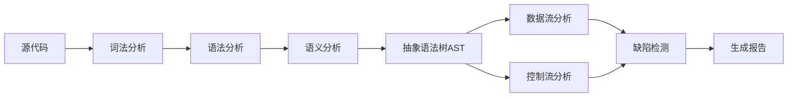
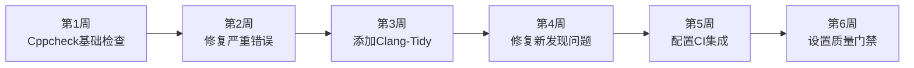

# 代码静态分析工具使用：提升嵌入式代码质量


## 概述

静态代码分析是在不运行程序的情况下，通过分析源代码来发现潜在缺陷、安全漏洞和代码质量问题的技术。对于嵌入式系统开发，静态分析尤为重要，因为嵌入式软件的错误可能导致严重的安全和可靠性问题。

### 什么是静态分析？

**静态分析 vs 动态测试**:

| 特性 | 静态分析 | 动态测试 |
|------|---------|---------|
| 执行方式 | 不运行代码 | 运行代码 |
| 分析时机 | 编译前/编译时 | 运行时 |
| 覆盖范围 | 所有代码路径 | 执行的代码路径 |
| 发现问题 | 潜在缺陷、代码规范 | 实际运行错误 |
| 成本 | 低 | 中到高 |
| 硬件依赖 | 无 | 可能需要 |

### 为什么嵌入式开发需要静态分析？

**嵌入式系统的特殊性**:
- ❌ 资源受限，错误代价高
- ❌ 难以调试和修复
- ❌ 安全性要求高
- ❌ 实时性要求严格
- ❌ 长期运行，稳定性关键

**静态分析的价值**:
- ✅ 提前发现潜在缺陷
- ✅ 降低测试成本
- ✅ 提高代码质量
- ✅ 强制代码规范
- ✅ 减少安全漏洞
- ✅ 改善可维护性

### 学习目标

完成本教程后，你将能够:

- [ ] 理解静态分析的原理和价值
- [ ] 掌握Cppcheck的使用和配置
- [ ] 使用Clang-Tidy进行代码检查
- [ ] 配置和使用PC-lint Plus
- [ ] 定制静态分析规则
- [ ] 将静态分析集成到CI/CD流程
- [ ] 解读和修复静态分析报告


## 静态分析核心概念

### 静态分析能发现什么问题？

**1. 编码错误**:
```c
// 空指针解引用
int *ptr = NULL;
*ptr = 10;  // ⚠️ 空指针解引用

// 数组越界
int arr[10];
arr[10] = 5;  // ⚠️ 数组越界

// 内存泄漏
void func() {
    int *p = malloc(100);
    // ⚠️ 忘记释放内存
}
```

**2. 逻辑错误**:
```c
// 死代码
if (x > 0) {
    return 1;
} else {
    return 0;
}
printf("Never reached");  // ⚠️ 死代码

// 条件恒为真/假
unsigned int x = 10;
if (x < 0) {  // ⚠️ 条件恒为假
    // ...
}
```

**3. 安全漏洞**:
```c
// 缓冲区溢出
char buffer[10];
strcpy(buffer, user_input);  // ⚠️ 可能溢出

// 格式化字符串漏洞
printf(user_input);  // ⚠️ 应该使用 printf("%s", user_input)

// 整数溢出
uint8_t a = 200;
uint8_t b = 100;
uint8_t c = a + b;  // ⚠️ 溢出
```

**4. 代码规范问题**:
```c
// 命名不规范
int X;  // ⚠️ 变量名应小写

// 魔术数字
if (status == 0x42) {  // ⚠️ 应使用宏定义
    // ...
}

// 未使用的变量
int unused_var = 10;  // ⚠️ 未使用
```

### 静态分析的工作原理



**分析技术**:
- **词法分析**: 识别代码中的标记（关键字、标识符等）
- **语法分析**: 检查代码结构是否符合语法规则
- **语义分析**: 理解代码的含义和行为
- **数据流分析**: 跟踪变量的值和状态
- **控制流分析**: 分析程序的执行路径

### 常见静态分析工具对比

| 工具 | 类型 | 语言支持 | 许可证 | 特点 |
|------|------|---------|--------|------|
| Cppcheck | 开源 | C/C++ | GPL | 免费、易用、误报少 |
| Clang-Tidy | 开源 | C/C++ | Apache | 强大、可定制、现代化 |
| PC-lint Plus | 商业 | C/C++ | 商业 | 专业、全面、误报少 |
| Coverity | 商业 | 多语言 | 商业 | 企业级、深度分析 |
| SonarQube | 开源/商业 | 多语言 | LGPL | 平台化、可视化 |
| PVS-Studio | 商业 | C/C++/C# | 商业 | 深度分析、误报少 |


## Cppcheck使用指南

### Cppcheck简介

Cppcheck是一个开源的C/C++静态分析工具，专注于发现编译器检测不到的错误。

**特点**:
- ✅ 完全免费开源
- ✅ 误报率低
- ✅ 易于使用和集成
- ✅ 支持多种输出格式
- ✅ 可定制检查规则

### 安装Cppcheck

**Linux系统**:
```bash
# Ubuntu/Debian
sudo apt install cppcheck

# CentOS/RHEL
sudo yum install cppcheck

# 从源码编译（获取最新版本）
git clone https://github.com/danmar/cppcheck.git
cd cppcheck
make MATCHCOMPILER=yes FILESDIR=/usr/share/cppcheck
sudo make install
```

**macOS系统**:
```bash
brew install cppcheck
```

**Windows系统**:
- 下载安装包: https://github.com/danmar/cppcheck/releases
- 或使用Chocolatey: `choco install cppcheck`

**验证安装**:
```bash
cppcheck --version
```

### 基础使用

#### 1. 检查单个文件

```bash
cppcheck main.c
```

**示例输出**:
```
Checking main.c ...
[main.c:10]: (error) Null pointer dereference: ptr
[main.c:15]: (warning) Unused variable: unused_var
[main.c:20]: (style) Variable 'x' is assigned a value that is never used
```

#### 2. 检查整个项目

```bash
# 检查当前目录及子目录
cppcheck .

# 检查指定目录
cppcheck src/

# 递归检查多个目录
cppcheck src/ lib/ drivers/
```

#### 3. 启用所有检查

```bash
cppcheck --enable=all src/
```

**检查类型**:
- `error`: 错误（默认启用）
- `warning`: 警告
- `style`: 代码风格问题
- `performance`: 性能问题
- `portability`: 可移植性问题
- `information`: 信息提示
- `all`: 启用所有检查

#### 4. 指定平台

```bash
# 32位Unix平台
cppcheck --platform=unix32 src/

# 64位Unix平台
cppcheck --platform=unix64 src/

# ARM平台
cppcheck --platform=arm src/

# 自定义平台
cppcheck --platform=my_platform.xml src/
```

### 高级配置

#### 1. 包含路径和宏定义

```bash
# 指定头文件路径
cppcheck -I inc/ -I lib/include/ src/

# 定义宏
cppcheck -DSTM32F4 -DDEBUG src/

# 取消宏定义
cppcheck -USTM32F7 src/

# 从文件读取配置
cppcheck --includes-file=includes.txt src/
```

#### 2. 排除文件和目录

```bash
# 排除特定目录
cppcheck -i build/ -i test/ src/

# 排除特定文件
cppcheck --suppress=*:lib/external/* src/

# 使用配置文件排除
cppcheck --suppressions-list=suppressions.txt src/
```

**suppressions.txt示例**:
```
// 排除特定错误
uninitvar:src/legacy.c

// 排除特定文件的所有错误
*:lib/external/*

// 排除特定错误类型
unusedFunction

// 使用通配符
*:*/generated/*
```

#### 3. 生成报告

**XML格式**:
```bash
cppcheck --xml --xml-version=2 src/ 2> report.xml
```

**HTML格式**:
```bash
# 生成XML报告
cppcheck --xml --xml-version=2 src/ 2> report.xml

# 转换为HTML
cppcheck-htmlreport --file=report.xml --report-dir=html_report --source-dir=.
```

**文本格式**:
```bash
cppcheck --template="{file}:{line}: {severity}: {message}" src/ > report.txt
```

#### 4. 配置文件

创建 `.cppcheck` 配置文件:

```xml
<?xml version="1.0"?>
<project>
    <root name="."/>
    <builddir>cppcheck-build</builddir>
    <analyze-all-vs-configs>true</analyze-all-vs-configs>
    
    <!-- 包含路径 -->
    <includedir>
        <dir name="inc/"/>
        <dir name="lib/include/"/>
    </includedir>
    
    <!-- 排除路径 -->
    <exclude>
        <path name="build/"/>
        <path name="test/"/>
        <path name="lib/external/"/>
    </exclude>
    
    <!-- 宏定义 -->
    <defines>
        <define name="STM32F4"/>
        <define name="USE_HAL_DRIVER"/>
    </defines>
    
    <!-- 抑制规则 -->
    <suppressions>
        <suppression>unusedFunction</suppression>
        <suppression files="legacy.c">*</suppression>
    </suppressions>
</project>
```

**使用配置文件**:
```bash
cppcheck --project=.cppcheck
```

### 实战示例

#### 示例1：检查嵌入式项目

**项目结构**:
```
stm32_project/
├── src/
│   ├── main.c
│   ├── gpio.c
│   └── uart.c
├── inc/
│   ├── gpio.h
│   └── uart.h
└── Makefile
```

**检查命令**:
```bash
cppcheck \
    --enable=all \
    --platform=arm \
    --std=c99 \
    -I inc/ \
    -DSTM32F4 \
    -DUSE_HAL_DRIVER \
    --suppress=missingIncludeSystem \
    --xml --xml-version=2 \
    src/ 2> cppcheck-report.xml
```

#### 示例2：集成到Makefile

```makefile
# Makefile
.PHONY: check
check:
	@echo "运行静态分析..."
	@cppcheck \
		--enable=all \
		--platform=arm \
		-I inc/ \
		-DSTM32F4 \
		--suppress=missingIncludeSystem \
		--quiet \
		src/

.PHONY: check-report
check-report:
	@echo "生成静态分析报告..."
	@cppcheck \
		--enable=all \
		--platform=arm \
		-I inc/ \
		-DSTM32F4 \
		--xml --xml-version=2 \
		src/ 2> cppcheck-report.xml
	@cppcheck-htmlreport \
		--file=cppcheck-report.xml \
		--report-dir=cppcheck-html \
		--source-dir=.
	@echo "报告已生成: cppcheck-html/index.html"
```

**使用**:
```bash
# 快速检查
make check

# 生成详细报告
make check-report
```


## Clang-Tidy使用指南

### Clang-Tidy简介

Clang-Tidy是基于Clang的C++代码检查工具，提供了丰富的检查规则和自动修复功能。

**特点**:
- ✅ 基于Clang编译器
- ✅ 检查规则丰富
- ✅ 支持自动修复
- ✅ 高度可定制
- ✅ 现代化的C++支持

### 安装Clang-Tidy

**Linux系统**:
```bash
# Ubuntu/Debian
sudo apt install clang-tidy

# CentOS/RHEL
sudo yum install clang-tools-extra
```

**macOS系统**:
```bash
brew install llvm
# clang-tidy位于 /usr/local/opt/llvm/bin/
```

**Windows系统**:
- 下载LLVM安装包: https://releases.llvm.org/
- 或使用Chocolatey: `choco install llvm`

**验证安装**:
```bash
clang-tidy --version
```

### 基础使用

#### 1. 检查单个文件

```bash
clang-tidy main.c -- -Iinc/
```

**说明**: `--` 后面是编译选项

#### 2. 指定检查规则

```bash
# 启用特定检查
clang-tidy -checks='bugprone-*,cert-*' main.c -- -Iinc/

# 禁用特定检查
clang-tidy -checks='-*,bugprone-*,-bugprone-easily-swappable-parameters' main.c

# 使用通配符
clang-tidy -checks='*' main.c  # 启用所有检查
```

**常用检查类别**:
- `bugprone-*`: 容易出错的代码模式
- `cert-*`: CERT安全编码标准
- `clang-analyzer-*`: Clang静态分析器
- `cppcoreguidelines-*`: C++ Core Guidelines
- `modernize-*`: 现代化C++建议
- `performance-*`: 性能优化建议
- `readability-*`: 可读性改进
- `misc-*`: 其他检查

#### 3. 自动修复

```bash
# 显示修复建议
clang-tidy -checks='readability-*' -fix-errors main.c -- -Iinc/

# 自动应用修复
clang-tidy -checks='readability-*' -fix main.c -- -Iinc/
```

### 配置文件

创建 `.clang-tidy` 配置文件:

```yaml
---
# 检查规则配置
Checks: >
  -*,
  bugprone-*,
  cert-*,
  clang-analyzer-*,
  cppcoreguidelines-*,
  modernize-*,
  performance-*,
  readability-*,
  -bugprone-easily-swappable-parameters,
  -cppcoreguidelines-avoid-magic-numbers,
  -readability-magic-numbers

# 检查选项
CheckOptions:
  # 命名规范
  - key: readability-identifier-naming.VariableCase
    value: lower_case
  - key: readability-identifier-naming.FunctionCase
    value: lower_case
  - key: readability-identifier-naming.MacroCase
    value: UPPER_CASE
  - key: readability-identifier-naming.ConstantCase
    value: UPPER_CASE
  - key: readability-identifier-naming.EnumCase
    value: CamelCase
  - key: readability-identifier-naming.StructCase
    value: CamelCase
  
  # 函数长度限制
  - key: readability-function-size.LineThreshold
    value: '100'
  - key: readability-function-size.StatementThreshold
    value: '50'
  
  # 其他选项
  - key: modernize-use-nullptr.NullMacros
    value: 'NULL'
  - key: performance-move-const-arg.CheckTriviallyCopyableMove
    value: 'false'

# 头文件过滤
HeaderFilterRegex: '.*'

# 警告视为错误
WarningsAsErrors: ''

# 格式化风格
FormatStyle: 'file'
```

### 使用编译数据库

Clang-Tidy可以使用`compile_commands.json`来获取编译信息。

#### 生成编译数据库

**使用CMake**:
```bash
cmake -DCMAKE_EXPORT_COMPILE_COMMANDS=ON .
```

**使用Bear**:
```bash
# 安装Bear
sudo apt install bear

# 生成编译数据库
bear -- make
```

**使用compile_commands.json**:
```bash
clang-tidy -p . src/main.c
```

### 实战示例

#### 示例1：嵌入式项目检查

```bash
clang-tidy \
    -checks='bugprone-*,cert-*,clang-analyzer-*,readability-*' \
    -header-filter='.*' \
    src/*.c \
    -- \
    -Iinc/ \
    -DSTM32F4 \
    -DUSE_HAL_DRIVER \
    -std=c99 \
    -target arm-none-eabi
```

#### 示例2：批量检查脚本

创建 `run-clang-tidy.sh`:

```bash
#!/bin/bash

# 颜色定义
RED='\033[0;31m'
GREEN='\033[0;32m'
YELLOW='\033[1;33m'
NC='\033[0m' # No Color

echo -e "${GREEN}开始Clang-Tidy检查...${NC}"

# 查找所有C文件
FILES=$(find src -name "*.c")

# 检查选项
CHECKS="bugprone-*,cert-*,clang-analyzer-*,readability-*"
COMPILE_FLAGS="-Iinc/ -DSTM32F4 -std=c99"

# 错误计数
ERROR_COUNT=0

# 逐个检查文件
for file in $FILES; do
    echo -e "${YELLOW}检查: $file${NC}"
    
    clang-tidy \
        -checks="$CHECKS" \
        "$file" \
        -- $COMPILE_FLAGS \
        2>&1 | tee -a clang-tidy.log
    
    if [ ${PIPESTATUS[0]} -ne 0 ]; then
        ((ERROR_COUNT++))
    fi
done

# 输出结果
echo ""
if [ $ERROR_COUNT -eq 0 ]; then
    echo -e "${GREEN}✓ 所有检查通过！${NC}"
    exit 0
else
    echo -e "${RED}✗ 发现 $ERROR_COUNT 个文件有问题${NC}"
    exit 1
fi
```

**使用脚本**:
```bash
chmod +x run-clang-tidy.sh
./run-clang-tidy.sh
```


## PC-lint Plus使用指南

### PC-lint Plus简介

PC-lint Plus是Gimpel Software开发的商业静态分析工具，在嵌入式行业广泛使用。

**特点**:
- ✅ 专业的C/C++分析
- ✅ 误报率极低
- ✅ 符合MISRA C/C++标准
- ✅ 深度分析能力
- ✅ 丰富的配置选项

**注意**: PC-lint Plus是商业软件，需要购买许可证。

### 基础使用

#### 1. 检查单个文件

```bash
pclp64 main.c
```

#### 2. 使用配置文件

创建 `std.lnt` 配置文件:

```
// 标准配置
-i"C:\lint\lnt"          // 包含标准配置文件路径
co-gcc.lnt               // GCC编译器配置
au-misra3.lnt            // MISRA C 2012规则

// 项目配置
-i"inc"                  // 头文件路径
+dSTM32F4                // 定义宏
+dUSE_HAL_DRIVER

// 消息控制
-w3                      // 警告级别3
-e*                      // 启用所有错误
-esym(534,printf)        // 忽略printf返回值检查

// 输出格式
-format=%f:%l: %t %n: %m
```

**使用配置文件**:
```bash
pclp64 std.lnt src/*.c
```

### MISRA C检查

MISRA C是汽车行业软件可靠性协会制定的C语言编码标准。

#### 启用MISRA C检查

```bash
pclp64 au-misra3.lnt src/*.c
```

#### MISRA C规则示例

**规则8.2**: 函数类型应在函数定义和声明中一致
```c
// ✗ 违反规则
void func();  // 声明

void func(int x) {  // 定义参数不一致
    // ...
}

// ✓ 符合规则
void func(int x);  // 声明

void func(int x) {  // 定义
    // ...
}
```

**规则21.3**: 不应使用malloc和free
```c
// ✗ 违反规则（嵌入式系统）
int *p = malloc(100);
free(p);

// ✓ 符合规则
static int buffer[100];
int *p = buffer;
```

### 配置示例

#### 完整的项目配置

创建 `project.lnt`:

```
// ============================================
// PC-lint Plus 项目配置文件
// ============================================

// 编译器配置
-i"C:\lint\lnt"
co-gcc.lnt

// MISRA C 2012
au-misra3.lnt

// 项目路径
-i"inc"
-i"lib/include"
-i"drivers/inc"

// 宏定义
+dSTM32F407xx
+dUSE_HAL_DRIVER
+dDEBUG

// 消息控制
-w3                          // 警告级别
-e*                          // 启用所有错误

// 抑制特定消息
-esym(534,printf,sprintf)    // 忽略printf返回值
-esym(715,*)                 // 忽略未使用的参数
-esym(818,*)                 // 忽略指针可以是const的建议

// 文件排除
-e*:lib/external/*           // 排除外部库

// 输出格式
-format=%f:%l: %t %n: %m
-format_specific= " [%t %n: %m]"

// 生成报告
-os(report.txt)
```


## CI/CD集成

### Jenkins集成

#### Jenkinsfile配置

```groovy
pipeline {
    agent any
    
    stages {
        stage('Static Analysis') {
            parallel {
                stage('Cppcheck') {
                    steps {
                        sh '''
                            cppcheck \
                                --enable=all \
                                --platform=arm \
                                --xml --xml-version=2 \
                                -I inc/ \
                                -DSTM32F4 \
                                src/ 2> cppcheck-report.xml
                        '''
                        
                        publishCppcheck pattern: 'cppcheck-report.xml'
                    }
                }
                
                stage('Clang-Tidy') {
                    steps {
                        sh '''
                            find src -name "*.c" | xargs clang-tidy \
                                -checks='bugprone-*,cert-*' \
                                -- -Iinc/ -DSTM32F4 \
                                > clang-tidy-report.txt 2>&1 || true
                        '''
                        
                        archiveArtifacts 'clang-tidy-report.txt'
                    }
                }
            }
        }
        
        stage('Quality Gate') {
            steps {
                script {
                    def cppcheckIssues = sh(
                        script: 'grep -c "error\\|warning" cppcheck-report.xml || true',
                        returnStdout: true
                    ).trim().toInteger()
                    
                    if (cppcheckIssues > 10) {
                        error("代码质量不达标: 发现 ${cppcheckIssues} 个问题")
                    }
                }
            }
        }
    }
    
    post {
        always {
            // 发布HTML报告
            publishHTML([
                reportDir: 'cppcheck-html',
                reportFiles: 'index.html',
                reportName: 'Cppcheck Report'
            ])
        }
    }
}
```

### GitLab CI集成

#### .gitlab-ci.yml配置

```yaml
stages:
  - analysis
  - report

variables:
  CPPCHECK_OPTIONS: "--enable=all --platform=arm -I inc/ -DSTM32F4"
  CLANG_TIDY_CHECKS: "bugprone-*,cert-*,clang-analyzer-*"

# Cppcheck分析
cppcheck:
  stage: analysis
  image: neszt/cppcheck-docker:latest
  script:
    - cppcheck $CPPCHECK_OPTIONS --xml --xml-version=2 src/ 2> cppcheck.xml
    - cppcheck $CPPCHECK_OPTIONS --quiet src/ | tee cppcheck.txt
  artifacts:
    reports:
      codequality: cppcheck.xml
    paths:
      - cppcheck.xml
      - cppcheck.txt
    expire_in: 1 week
  allow_failure: true

# Clang-Tidy分析
clang-tidy:
  stage: analysis
  image: silkeh/clang:latest
  script:
    - |
      find src -name "*.c" | xargs clang-tidy \
        -checks="$CLANG_TIDY_CHECKS" \
        -- -Iinc/ -DSTM32F4 \
        > clang-tidy.txt 2>&1 || true
  artifacts:
    paths:
      - clang-tidy.txt
    expire_in: 1 week
  allow_failure: true

# 生成HTML报告
generate_report:
  stage: report
  image: python:3.9
  dependencies:
    - cppcheck
    - clang-tidy
  script:
    - pip install cppcheck-codequality
    - cppcheck-htmlreport --file=cppcheck.xml --report-dir=html_report --source-dir=.
  artifacts:
    paths:
      - html_report/
    expire_in: 30 days
  only:
    - main
    - develop

# 质量门禁
quality_gate:
  stage: report
  image: alpine:latest
  dependencies:
    - cppcheck
  script:
    - apk add --no-cache grep
    - ERROR_COUNT=$(grep -c 'severity="error"' cppcheck.xml || true)
    - echo "发现 $ERROR_COUNT 个错误"
    - |
      if [ $ERROR_COUNT -gt 5 ]; then
        echo "错误数量超过阈值！"
        exit 1
      fi
  only:
    - main
    - merge_requests
```

### GitHub Actions集成

#### .github/workflows/static-analysis.yml

```yaml
name: Static Analysis

on:
  push:
    branches: [ main, develop ]
  pull_request:
    branches: [ main ]

jobs:
  cppcheck:
    runs-on: ubuntu-latest
    
    steps:
    - uses: actions/checkout@v3
    
    - name: Install Cppcheck
      run: sudo apt-get install -y cppcheck
    
    - name: Run Cppcheck
      run: |
        cppcheck \
          --enable=all \
          --platform=arm \
          --xml --xml-version=2 \
          -I inc/ \
          -DSTM32F4 \
          src/ 2> cppcheck-report.xml
    
    - name: Upload Cppcheck Report
      uses: actions/upload-artifact@v3
      with:
        name: cppcheck-report
        path: cppcheck-report.xml
    
    - name: Check for Errors
      run: |
        ERROR_COUNT=$(grep -c 'severity="error"' cppcheck-report.xml || true)
        echo "Found $ERROR_COUNT errors"
        if [ $ERROR_COUNT -gt 0 ]; then
          echo "::error::Cppcheck found $ERROR_COUNT errors"
          exit 1
        fi

  clang-tidy:
    runs-on: ubuntu-latest
    
    steps:
    - uses: actions/checkout@v3
    
    - name: Install Clang-Tidy
      run: sudo apt-get install -y clang-tidy
    
    - name: Run Clang-Tidy
      run: |
        find src -name "*.c" | xargs clang-tidy \
          -checks='bugprone-*,cert-*,clang-analyzer-*' \
          -- -Iinc/ -DSTM32F4 \
          > clang-tidy-report.txt 2>&1 || true
    
    - name: Upload Clang-Tidy Report
      uses: actions/upload-artifact@v3
      with:
        name: clang-tidy-report
        path: clang-tidy-report.txt
```


## 实战案例：完整的静态分析流程

### 项目结构

```
embedded_project/
├── src/
│   ├── main.c
│   ├── gpio.c
│   ├── uart.c
│   └── sensor.c
├── inc/
│   ├── gpio.h
│   ├── uart.h
│   └── sensor.h
├── test/
├── .cppcheck
├── .clang-tidy
├── Makefile
└── scripts/
    └── static-analysis.sh
```

### 配置文件

#### .cppcheck配置

```xml
<?xml version="1.0"?>
<project>
    <root name="."/>
    <builddir>build/cppcheck</builddir>
    
    <includedir>
        <dir name="inc/"/>
    </includedir>
    
    <exclude>
        <path name="build/"/>
        <path name="test/"/>
    </exclude>
    
    <defines>
        <define name="STM32F407xx"/>
        <define name="USE_HAL_DRIVER"/>
    </defines>
    
    <suppressions>
        <suppression>missingIncludeSystem</suppression>
        <suppression>unusedFunction:test/*</suppression>
    </suppressions>
</project>
```

#### .clang-tidy配置

```yaml
---
Checks: >
  -*,
  bugprone-*,
  cert-*,
  clang-analyzer-*,
  cppcoreguidelines-*,
  performance-*,
  readability-*,
  -bugprone-easily-swappable-parameters,
  -readability-magic-numbers

CheckOptions:
  - key: readability-identifier-naming.VariableCase
    value: lower_case
  - key: readability-identifier-naming.FunctionCase
    value: lower_case
  - key: readability-identifier-naming.MacroCase
    value: UPPER_CASE

HeaderFilterRegex: '.*'
```

### 自动化脚本

#### scripts/static-analysis.sh

```bash
#!/bin/bash

# 静态分析自动化脚本
# 用法: ./scripts/static-analysis.sh [--fix]

set -e

# 颜色定义
RED='\033[0;31m'
GREEN='\033[0;32m'
YELLOW='\033[1;33m'
BLUE='\033[0;34m'
NC='\033[0m'

# 配置
PROJECT_ROOT="$(cd "$(dirname "${BASH_SOURCE[0]}")/.." && pwd)"
BUILD_DIR="$PROJECT_ROOT/build/analysis"
REPORT_DIR="$PROJECT_ROOT/reports"

# 创建目录
mkdir -p "$BUILD_DIR"
mkdir -p "$REPORT_DIR"

# 解析参数
FIX_MODE=false
if [ "$1" == "--fix" ]; then
    FIX_MODE=true
fi

echo -e "${BLUE}========================================${NC}"
echo -e "${BLUE}  嵌入式项目静态分析${NC}"
echo -e "${BLUE}========================================${NC}"
echo ""

# ============================================
# 1. Cppcheck分析
# ============================================
echo -e "${YELLOW}[1/3] 运行Cppcheck...${NC}"

cppcheck \
    --project=.cppcheck \
    --enable=all \
    --platform=arm \
    --std=c99 \
    --xml --xml-version=2 \
    --output-file="$REPORT_DIR/cppcheck.xml" \
    src/

# 生成文本报告
cppcheck \
    --project=.cppcheck \
    --enable=all \
    --platform=arm \
    --quiet \
    src/ > "$REPORT_DIR/cppcheck.txt" 2>&1 || true

# 统计错误
CPPCHECK_ERRORS=$(grep -c 'severity="error"' "$REPORT_DIR/cppcheck.xml" || true)
CPPCHECK_WARNINGS=$(grep -c 'severity="warning"' "$REPORT_DIR/cppcheck.xml" || true)

echo -e "  错误: ${RED}$CPPCHECK_ERRORS${NC}"
echo -e "  警告: ${YELLOW}$CPPCHECK_WARNINGS${NC}"
echo ""

# ============================================
# 2. Clang-Tidy分析
# ============================================
echo -e "${YELLOW}[2/3] 运行Clang-Tidy...${NC}"

CLANG_TIDY_CMD="clang-tidy"
if [ "$FIX_MODE" = true ]; then
    CLANG_TIDY_CMD="$CLANG_TIDY_CMD -fix"
    echo -e "  ${GREEN}自动修复模式已启用${NC}"
fi

find src -name "*.c" | while read file; do
    echo "  检查: $file"
    $CLANG_TIDY_CMD \
        -p . \
        "$file" \
        -- -Iinc/ -DSTM32F407xx \
        >> "$REPORT_DIR/clang-tidy.txt" 2>&1 || true
done

# 统计问题
CLANG_TIDY_ISSUES=$(grep -c "warning:" "$REPORT_DIR/clang-tidy.txt" || true)
echo -e "  发现问题: ${YELLOW}$CLANG_TIDY_ISSUES${NC}"
echo ""

# ============================================
# 3. 生成HTML报告
# ============================================
echo -e "${YELLOW}[3/3] 生成HTML报告...${NC}"

if command -v cppcheck-htmlreport &> /dev/null; then
    cppcheck-htmlreport \
        --file="$REPORT_DIR/cppcheck.xml" \
        --report-dir="$REPORT_DIR/html" \
        --source-dir="$PROJECT_ROOT"
    
    echo -e "  ${GREEN}HTML报告已生成: $REPORT_DIR/html/index.html${NC}"
else
    echo -e "  ${YELLOW}未安装cppcheck-htmlreport，跳过HTML报告生成${NC}"
fi

echo ""

# ============================================
# 4. 质量门禁
# ============================================
echo -e "${BLUE}========================================${NC}"
echo -e "${BLUE}  分析结果汇总${NC}"
echo -e "${BLUE}========================================${NC}"
echo ""
echo -e "Cppcheck:"
echo -e "  错误: ${RED}$CPPCHECK_ERRORS${NC}"
echo -e "  警告: ${YELLOW}$CPPCHECK_WARNINGS${NC}"
echo ""
echo -e "Clang-Tidy:"
echo -e "  问题: ${YELLOW}$CLANG_TIDY_ISSUES${NC}"
echo ""

# 设置阈值
MAX_ERRORS=0
MAX_WARNINGS=10

if [ $CPPCHECK_ERRORS -gt $MAX_ERRORS ]; then
    echo -e "${RED}✗ 质量门禁失败: Cppcheck错误数超过阈值 ($CPPCHECK_ERRORS > $MAX_ERRORS)${NC}"
    exit 1
elif [ $CPPCHECK_WARNINGS -gt $MAX_WARNINGS ]; then
    echo -e "${YELLOW}⚠ 警告: Cppcheck警告数较多 ($CPPCHECK_WARNINGS > $MAX_WARNINGS)${NC}"
    echo -e "${YELLOW}  建议修复这些警告以提高代码质量${NC}"
else
    echo -e "${GREEN}✓ 质量门禁通过！${NC}"
fi

echo ""
echo -e "详细报告位于: ${BLUE}$REPORT_DIR/${NC}"
```

**使用脚本**:
```bash
# 运行分析
./scripts/static-analysis.sh

# 运行分析并自动修复
./scripts/static-analysis.sh --fix
```

### Makefile集成

```makefile
# Makefile

.PHONY: check
check:
	@./scripts/static-analysis.sh

.PHONY: check-fix
check-fix:
	@./scripts/static-analysis.sh --fix

.PHONY: check-report
check-report: check
	@echo "打开HTML报告..."
	@xdg-open reports/html/index.html 2>/dev/null || \
	 open reports/html/index.html 2>/dev/null || \
	 echo "请手动打开: reports/html/index.html"

.PHONY: clean-reports
clean-reports:
	@rm -rf reports/
	@rm -rf build/analysis/
	@echo "分析报告已清理"
```


## 最佳实践

### 1. 选择合适的工具

**项目初期**:
- 使用Cppcheck进行基础检查
- 配置简单，快速发现明显问题

**项目成熟期**:
- 添加Clang-Tidy进行深度分析
- 使用PC-lint Plus进行MISRA C合规检查

**持续集成**:
- 在CI中运行所有工具
- 设置质量门禁

### 2. 渐进式引入



**不要一次性启用所有检查**:
- 先修复error级别问题
- 再处理warning级别问题
- 最后优化style问题

### 3. 合理配置抑制规则

**何时抑制警告**:
- ✅ 第三方库的警告
- ✅ 自动生成代码的警告
- ✅ 已知的误报
- ✅ 特定场景下的合理代码

**如何抑制警告**:
```c
// 方法1: 使用注释（Cppcheck）
// cppcheck-suppress nullPointer
*ptr = 10;

// 方法2: 使用NOLINT（Clang-Tidy）
*ptr = 10;  // NOLINT(clang-analyzer-core.NullDereference)

// 方法3: 配置文件
// 在.cppcheck或.clang-tidy中配置
```

### 4. 定期审查报告

**建立审查机制**:
- 每日查看CI报告
- 每周团队审查
- 每月趋势分析

**跟踪指标**:
- 错误数量趋势
- 警告数量趋势
- 代码覆盖率
- 技术债务

### 5. 团队协作

**代码审查集成**:
```yaml
# .gitlab-ci.yml
code_review:
  stage: review
  script:
    - ./scripts/static-analysis.sh
  only:
    - merge_requests
  allow_failure: false
```

**Pull Request检查**:
- 要求静态分析通过才能合并
- 在PR中显示分析结果
- 自动添加审查评论


## 常见问题与解决方案

### 问题1：误报太多

**原因**:
- 工具配置不当
- 代码风格不统一
- 使用了特殊的编程技巧

**解决方案**:
```bash
# 1. 调整检查级别
cppcheck --enable=warning,performance src/  # 不启用style检查

# 2. 使用抑制规则
cppcheck --suppressions-list=suppressions.txt src/

# 3. 排除特定文件
cppcheck -i lib/external/ src/
```

### 问题2：分析速度慢

**原因**:
- 项目规模大
- 启用了所有检查
- 没有使用增量分析

**解决方案**:
```bash
# 1. 使用并行分析
cppcheck -j 4 src/  # 使用4个线程

# 2. 只分析修改的文件
git diff --name-only HEAD~1 | grep '\.c$' | xargs cppcheck

# 3. 使用缓存
cppcheck --cppcheck-build-dir=build/cppcheck src/
```

### 问题3：与编译器冲突

**原因**:
- 宏定义不一致
- 包含路径不正确
- 编译选项不匹配

**解决方案**:
```bash
# 使用编译数据库
clang-tidy -p compile_commands.json src/main.c

# 或明确指定编译选项
clang-tidy src/main.c -- \
    -Iinc/ \
    -DSTM32F4 \
    -std=c99 \
    -target arm-none-eabi
```

### 问题4：CI集成失败

**原因**:
- 工具未安装
- 权限问题
- 路径配置错误

**解决方案**:
```yaml
# 使用Docker镜像
static_analysis:
  image: cppcheck:latest
  script:
    - cppcheck --version
    - cppcheck src/
```


## 总结

### 关键要点

1. **静态分析是必要的**
   - 提前发现缺陷
   - 降低测试成本
   - 提高代码质量

2. **选择合适的工具**
   - Cppcheck: 免费、易用
   - Clang-Tidy: 强大、可定制
   - PC-lint Plus: 专业、深度

3. **渐进式引入**
   - 从基础检查开始
   - 逐步提高标准
   - 持续改进

4. **CI/CD集成**
   - 自动化检查
   - 质量门禁
   - 持续监控

### 下一步学习

- [ ] 学习单元测试框架
- [ ] 了解代码覆盖率工具
- [ ] 掌握性能分析工具
- [ ] 研究MISRA C标准
- [ ] 探索SonarQube平台

### 参考资源

**工具文档**:
- Cppcheck: https://cppcheck.sourceforge.io/
- Clang-Tidy: https://clang.llvm.org/extra/clang-tidy/
- PC-lint Plus: https://pclintplus.com/

**编码标准**:
- MISRA C: https://www.misra.org.uk/
- CERT C: https://wiki.sei.cmu.edu/confluence/display/c/
- C++ Core Guidelines: https://isocpp.github.io/CppCoreGuidelines/

**社区资源**:
- Stack Overflow: 搜索具体问题
- GitHub: 查看开源项目的配置
- Reddit r/embedded: 嵌入式开发讨论


## 练习项目

### 练习1：基础静态分析

**目标**: 使用Cppcheck检查一个简单的嵌入式项目

**步骤**:
1. 创建一个包含常见错误的C项目
2. 使用Cppcheck进行检查
3. 修复所有error级别的问题
4. 生成HTML报告

### 练习2：配置Clang-Tidy

**目标**: 为项目配置Clang-Tidy并修复问题

**步骤**:
1. 创建`.clang-tidy`配置文件
2. 定义命名规范
3. 运行检查并查看结果
4. 使用自动修复功能

### 练习3：CI集成

**目标**: 将静态分析集成到CI/CD流程

**步骤**:
1. 选择CI平台（GitLab CI或GitHub Actions）
2. 编写CI配置文件
3. 配置质量门禁
4. 测试CI流程

### 练习4：完整工作流

**目标**: 建立完整的静态分析工作流

**步骤**:
1. 配置多个静态分析工具
2. 编写自动化脚本
3. 集成到Makefile
4. 设置定期报告
5. 建立团队审查机制

---

**恭喜你完成了静态分析工具的学习！** 🎉

通过本教程，你已经掌握了使用静态分析工具提升代码质量的方法。记住，静态分析是持续改进的过程，需要团队的共同努力和长期坚持。

继续学习，不断提高代码质量！
