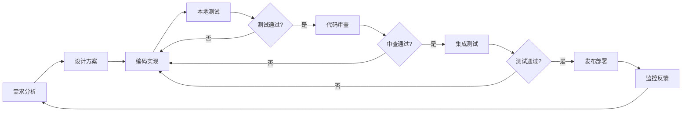

# 嵌入式开发工作流优化：提升效率的实用技巧


## 概述

高效的开发工作流是提升嵌入式开发效率的关键。一个优化的工作流不仅能减少重复劳动，还能降低错误率，让开发者专注于核心功能实现。

### 什么是开发工作流？

**开发工作流**是从需求分析到产品交付的完整开发过程，包括：
- 需求分析和设计
- 代码编写和调试
- 编译和构建
- 测试和验证
- 版本管理和发布

### 嵌入式开发的特殊挑战

**传统开发痛点**:
- ❌ 编译时间长，频繁等待
- ❌ 硬件调试复杂，效率低下
- ❌ 工具切换频繁，打断思路
- ❌ 重复性工作多，浪费时间
- ❌ 团队协作困难，沟通成本高
- ❌ 文档不完善，知识传承难

**优化后的改进**:
- ✅ 自动化构建，快速反馈
- ✅ 高效调试，问题快速定位
- ✅ 工具集成，无缝切换
- ✅ 脚本自动化，减少重复
- ✅ 规范化流程，协作顺畅
- ✅ 文档自动生成，知识沉淀

### 学习目标

完成本文学习后，你将能够:

- [ ] 理解高效工作流的核心要素
- [ ] 设计适合团队的开发流程
- [ ] 掌握常用的效率提升工具
- [ ] 实现开发任务的自动化
- [ ] 优化编译和调试流程
- [ ] 建立团队协作规范
- [ ] 持续改进开发效率


## 工作流设计原则

### 核心原则

#### 1. 自动化优先

**原则说明**: 能自动化的任务就不要手动执行

**应用场景**:
- 代码编译和构建
- 代码格式化和检查
- 测试执行和报告
- 文档生成和发布
- 固件烧录和验证

**实践方法**:
```bash
# 使用Makefile自动化构建
make clean && make all && make flash

# 使用脚本自动化测试
./scripts/run-tests.sh

# 使用Git hooks自动化检查
# .git/hooks/pre-commit
#!/bin/bash
make format
make lint
```

#### 2. 快速反馈

**原则说明**: 尽早发现问题，快速获得反馈

**实践方法**:
- 增量编译，只编译修改的文件
- 单元测试，快速验证功能
- 静态分析，编译前发现问题
- 持续集成，自动化测试

**时间目标**:
- 增量编译：< 10秒
- 单元测试：< 30秒
- 完整构建：< 5分钟
- CI反馈：< 10分钟

#### 3. 工具集成

**原则说明**: 减少工具切换，提高专注度

**集成方案**:
- IDE集成编译、调试、版本控制
- 终端集成常用命令和脚本
- 浏览器集成文档和问题跟踪
- 通信工具集成通知和提醒


#### 4. 标准化流程

**原则说明**: 建立统一的开发规范和流程

**标准化内容**:
- 代码风格和命名规范
- 目录结构和文件组织
- Git提交信息格式
- 代码审查流程
- 发布版本规范

**示例规范**:
```markdown
# Git提交信息格式
<type>(<scope>): <subject>

type: feat, fix, docs, style, refactor, test, chore
scope: 模块名称
subject: 简短描述

示例:
feat(gpio): 添加GPIO中断支持
fix(uart): 修复波特率配置错误
docs(readme): 更新安装说明
```

#### 5. 持续改进

**原则说明**: 定期回顾和优化工作流

**改进方法**:
- 每周回顾效率瓶颈
- 每月优化工具配置
- 每季度评估流程效果
- 收集团队反馈意见
- 学习业界最佳实践

### 工作流设计模型




## 开发环境优化

### IDE配置优化

#### VS Code配置

**1. 安装必要插件**:
```json
{
  "recommendations": [
    "ms-vscode.cpptools",
    "marus25.cortex-debug",
    "dan-c-underwood.arm",
    "ms-vscode.cmake-tools",
    "twxs.cmake",
    "ms-python.python",
    "eamodio.gitlens",
    "streetsidesoftware.code-spell-checker"
  ]
}
```

**2. 工作区配置** (`.vscode/settings.json`):
```json
{
  "C_Cpp.default.compilerPath": "/usr/bin/arm-none-eabi-gcc",
  "C_Cpp.default.includePath": [
    "${workspaceFolder}/inc",
    "${workspaceFolder}/lib/include"
  ],
  "C_Cpp.default.defines": [
    "STM32F407xx",
    "USE_HAL_DRIVER"
  ],
  "files.associations": {
    "*.h": "c",
    "*.c": "c"
  },
  "editor.formatOnSave": true,
  "editor.rulers": [80, 120],
  "files.trimTrailingWhitespace": true
}
```

**3. 任务配置** (`.vscode/tasks.json`):
```json
{
  "version": "2.0.0",
  "tasks": [
    {
      "label": "Build",
      "type": "shell",
      "command": "make all",
      "group": {
        "kind": "build",
        "isDefault": true
      },
      "problemMatcher": ["$gcc"]
    },
    {
      "label": "Clean",
      "type": "shell",
      "command": "make clean"
    },
    {
      "label": "Flash",
      "type": "shell",
      "command": "make flash",
      "dependsOn": ["Build"]
    }
  ]
}
```

**4. 调试配置** (`.vscode/launch.json`):
```json
{
  "version": "0.2.0",
  "configurations": [
    {
      "name": "Debug (OpenOCD)",
      "type": "cortex-debug",
      "request": "launch",
      "servertype": "openocd",
      "cwd": "${workspaceRoot}",
      "executable": "./build/firmware.elf",
      "configFiles": [
        "interface/stlink.cfg",
        "target/stm32f4x.cfg"
      ]
    }
  ]
}
```


#### 快捷键配置

**常用快捷键**:
```json
// keybindings.json
[
  {
    "key": "ctrl+shift+b",
    "command": "workbench.action.tasks.build"
  },
  {
    "key": "f5",
    "command": "workbench.action.debug.start"
  },
  {
    "key": "ctrl+shift+f",
    "command": "workbench.action.tasks.runTask",
    "args": "Flash"
  },
  {
    "key": "ctrl+shift+c",
    "command": "workbench.action.tasks.runTask",
    "args": "Clean"
  }
]
```

### 终端环境优化

#### Bash/Zsh配置

**1. 别名设置** (`~/.bashrc` 或 `~/.zshrc`):
```bash
# 项目快速导航
alias proj='cd ~/projects/stm32-project'
alias build='make clean && make all'
alias flash='make flash'

# Git快捷命令
alias gs='git status'
alias ga='git add'
alias gc='git commit'
alias gp='git push'
alias gl='git log --oneline --graph'

# 工具链路径
export ARM_TOOLCHAIN=/usr/local/gcc-arm-none-eabi/bin
export PATH=$ARM_TOOLCHAIN:$PATH

# 常用函数
function mkcd() {
    mkdir -p "$1" && cd "$1"
}

function gitlog() {
    git log --pretty=format:"%h - %an, %ar : %s"
}
```

**2. 提示符优化**:
```bash
# 显示Git分支和状态
parse_git_branch() {
    git branch 2> /dev/null | sed -e '/^[^*]/d' -e 's/* \(.*\)/ (\1)/'
}

export PS1="\[\033[01;32m\]\u@\h\[\033[00m\]:\[\033[01;34m\]\w\[\033[33m\]\$(parse_git_branch)\[\033[00m\]\$ "
```

#### 脚本工具集

**1. 快速构建脚本** (`scripts/quick-build.sh`):
```bash
#!/bin/bash

# 颜色定义
RED='\033[0;31m'
GREEN='\033[0;32m'
YELLOW='\033[1;33m'
NC='\033[0m'

echo -e "${YELLOW}开始快速构建...${NC}"

# 检查修改的文件
CHANGED_FILES=$(git diff --name-only HEAD)

if [ -z "$CHANGED_FILES" ]; then
    echo -e "${GREEN}没有文件修改，跳过构建${NC}"
    exit 0
fi

# 增量编译
echo -e "${YELLOW}编译修改的文件...${NC}"
make -j4

if [ $? -eq 0 ]; then
    echo -e "${GREEN}✓ 构建成功${NC}"
    
    # 显示固件大小
    arm-none-eabi-size build/firmware.elf
    
    # 询问是否烧录
    read -p "是否烧录到设备? (y/n) " -n 1 -r
    echo
    if [[ $REPLY =~ ^[Yy]$ ]]; then
        make flash
    fi
else
    echo -e "${RED}✗ 构建失败${NC}"
    exit 1
fi
```


**2. 项目初始化脚本** (`scripts/init-project.sh`):
```bash
#!/bin/bash

PROJECT_NAME=$1

if [ -z "$PROJECT_NAME" ]; then
    echo "用法: $0 <项目名称>"
    exit 1
fi

echo "创建项目: $PROJECT_NAME"

# 创建目录结构
mkdir -p $PROJECT_NAME/{src,inc,lib,build,docs,scripts}

# 创建基础文件
cat > $PROJECT_NAME/Makefile << 'EOF'
# Makefile模板
PROJECT = firmware

# 源文件
SOURCES = $(wildcard src/*.c)
OBJECTS = $(SOURCES:src/%.c=build/%.o)

# 编译选项
CC = arm-none-eabi-gcc
CFLAGS = -mcpu=cortex-m4 -mthumb -O2 -Wall
LDFLAGS = -T linker.ld

all: build/$(PROJECT).elf

build/%.o: src/%.c
	$(CC) $(CFLAGS) -c $< -o $@

build/$(PROJECT).elf: $(OBJECTS)
	$(CC) $(LDFLAGS) $^ -o $@

clean:
	rm -rf build/*

.PHONY: all clean
EOF

# 创建README
cat > $PROJECT_NAME/README.md << EOF
# $PROJECT_NAME

## 项目描述
[项目简介]

## 硬件要求
- 开发板: 
- 调试器: 

## 构建说明
\`\`\`bash
make all
\`\`\`

## 烧录说明
\`\`\`bash
make flash
\`\`\`
EOF

# 初始化Git仓库
cd $PROJECT_NAME
git init
cat > .gitignore << 'EOF'
build/
*.o
*.elf
*.bin
*.hex
.vscode/
EOF

git add .
git commit -m "Initial commit"

echo "项目创建完成: $PROJECT_NAME"
```

### 构建系统优化

#### Makefile优化技巧

**1. 并行编译**:
```makefile
# 使用多核编译
MAKEFLAGS += -j$(shell nproc)

# 或在命令行指定
# make -j4
```

**2. 增量编译**:
```makefile
# 依赖关系自动生成
DEPS = $(OBJECTS:.o=.d)

-include $(DEPS)

build/%.o: src/%.c
	$(CC) $(CFLAGS) -MMD -MP -c $< -o $@
```

**3. 编译缓存**:
```makefile
# 使用ccache加速编译
CC = ccache arm-none-eabi-gcc
```

**4. 颜色输出**:
```makefile
# 定义颜色
RED    = \033[0;31m
GREEN  = \033[0;32m
YELLOW = \033[1;33m
NC     = \033[0m

# 使用颜色
all:
	@echo "$(YELLOW)开始编译...$(NC)"
	@$(MAKE) build
	@echo "$(GREEN)编译完成$(NC)"
```


## 调试流程优化

### 日志系统设计

#### 分级日志实现

```c
// logger.h
#ifndef LOGGER_H
#define LOGGER_H

#include <stdio.h>

// 日志级别
typedef enum {
    LOG_LEVEL_DEBUG = 0,
    LOG_LEVEL_INFO,
    LOG_LEVEL_WARN,
    LOG_LEVEL_ERROR
} LogLevel_t;

// 全局日志级别
extern LogLevel_t g_log_level;

// 日志宏
#define LOG_DEBUG(fmt, ...) \
    do { \
        if (g_log_level <= LOG_LEVEL_DEBUG) { \
            printf("[DEBUG][%s:%d] " fmt "\r\n", __FILE__, __LINE__, ##__VA_ARGS__); \
        } \
    } while(0)

#define LOG_INFO(fmt, ...) \
    do { \
        if (g_log_level <= LOG_LEVEL_INFO) { \
            printf("[INFO] " fmt "\r\n", ##__VA_ARGS__); \
        } \
    } while(0)

#define LOG_WARN(fmt, ...) \
    do { \
        if (g_log_level <= LOG_LEVEL_WARN) { \
            printf("[WARN] " fmt "\r\n", ##__VA_ARGS__); \
        } \
    } while(0)

#define LOG_ERROR(fmt, ...) \
    do { \
        if (g_log_level <= LOG_LEVEL_ERROR) { \
            printf("[ERROR][%s:%d] " fmt "\r\n", __FILE__, __LINE__, ##__VA_ARGS__); \
        } \
    } while(0)

#endif // LOGGER_H
```

**使用示例**:
```c
#include "logger.h"

LogLevel_t g_log_level = LOG_LEVEL_INFO;

void sensor_init(void) {
    LOG_INFO("初始化传感器...");
    
    if (sensor_check() != 0) {
        LOG_ERROR("传感器检测失败");
        return;
    }
    
    LOG_DEBUG("传感器ID: 0x%02X", sensor_read_id());
    LOG_INFO("传感器初始化成功");
}
```

### 断言系统

```c
// assert.h
#ifndef ASSERT_H
#define ASSERT_H

#include <stdio.h>

#ifdef DEBUG
    #define ASSERT(expr) \
        do { \
            if (!(expr)) { \
                printf("断言失败: %s, 文件: %s, 行: %d\r\n", \
                       #expr, __FILE__, __LINE__); \
                while(1); /* 停止执行 */ \
            } \
        } while(0)
#else
    #define ASSERT(expr) ((void)0)
#endif

#endif // ASSERT_H
```

**使用示例**:
```c
void buffer_write(uint8_t *buf, uint32_t len, uint8_t data) {
    ASSERT(buf != NULL);
    ASSERT(len > 0);
    ASSERT(len < BUFFER_MAX_SIZE);
    
    buf[len] = data;
}
```

### 性能分析工具

```c
// profiler.h
#ifndef PROFILER_H
#define PROFILER_H

#include <stdint.h>

typedef struct {
    const char *name;
    uint32_t start_time;
    uint32_t total_time;
    uint32_t call_count;
} Profiler_t;

#define PROFILE_START(profiler) \
    do { \
        (profiler).start_time = get_tick(); \
    } while(0)

#define PROFILE_END(profiler) \
    do { \
        uint32_t elapsed = get_tick() - (profiler).start_time; \
        (profiler).total_time += elapsed; \
        (profiler).call_count++; \
    } while(0)

#define PROFILE_REPORT(profiler) \
    printf("%s: 总时间=%lu, 调用次数=%lu, 平均时间=%lu\r\n", \
           (profiler).name, \
           (profiler).total_time, \
           (profiler).call_count, \
           (profiler).total_time / (profiler).call_count)

#endif // PROFILER_H
```

**使用示例**:
```c
Profiler_t sensor_profiler = {.name = "sensor_read"};

void sensor_task(void) {
    PROFILE_START(sensor_profiler);
    
    // 执行传感器读取
    sensor_read_data();
    
    PROFILE_END(sensor_profiler);
}

void print_statistics(void) {
    PROFILE_REPORT(sensor_profiler);
}
```


## 自动化实践

### Git Hooks自动化

#### Pre-commit Hook

**自动格式化和检查** (`.git/hooks/pre-commit`):
```bash
#!/bin/bash

echo "运行pre-commit检查..."

# 1. 代码格式化
echo "格式化代码..."
git diff --cached --name-only --diff-filter=ACM | grep -E '\.(c|h)$' | while read file; do
    clang-format -i "$file"
    git add "$file"
done

# 2. 静态分析
echo "运行静态分析..."
make lint
if [ $? -ne 0 ]; then
    echo "静态分析失败，请修复问题后再提交"
    exit 1
fi

# 3. 编译检查
echo "编译检查..."
make clean && make all
if [ $? -ne 0 ]; then
    echo "编译失败，请修复后再提交"
    exit 1
fi

# 4. 运行测试
echo "运行单元测试..."
make test
if [ $? -ne 0 ]; then
    echo "测试失败，请修复后再提交"
    exit 1
fi

echo "所有检查通过！"
exit 0
```

#### Commit-msg Hook

**检查提交信息格式** (`.git/hooks/commit-msg`):
```bash
#!/bin/bash

commit_msg_file=$1
commit_msg=$(cat "$commit_msg_file")

# 检查提交信息格式: <type>(<scope>): <subject>
pattern="^(feat|fix|docs|style|refactor|test|chore)(\([a-z]+\))?: .{1,50}$"

if ! echo "$commit_msg" | grep -qE "$pattern"; then
    echo "错误: 提交信息格式不正确"
    echo "格式: <type>(<scope>): <subject>"
    echo "type: feat, fix, docs, style, refactor, test, chore"
    echo "示例: feat(gpio): 添加GPIO中断支持"
    exit 1
fi

exit 0
```

### Makefile自动化任务

**完整的Makefile示例**:
```makefile
# 项目配置
PROJECT = firmware
TARGET = STM32F407

# 工具链
PREFIX = arm-none-eabi-
CC = $(PREFIX)gcc
AS = $(PREFIX)as
LD = $(PREFIX)ld
OBJCOPY = $(PREFIX)objcopy
SIZE = $(PREFIX)size

# 源文件
SOURCES = $(wildcard src/*.c)
ASM_SOURCES = $(wildcard src/*.s)
OBJECTS = $(SOURCES:src/%.c=build/%.o) $(ASM_SOURCES:src/%.s=build/%.o)

# 编译选项
CFLAGS = -mcpu=cortex-m4 -mthumb -O2 -Wall -Wextra
CFLAGS += -Iinc -DSTM32F407xx -DUSE_HAL_DRIVER
LDFLAGS = -T linker.ld -Wl,-Map=build/$(PROJECT).map

# 颜色定义
RED    = \033[0;31m
GREEN  = \033[0;32m
YELLOW = \033[1;33m
NC     = \033[0m

# 默认目标
.PHONY: all
all: build/$(PROJECT).elf build/$(PROJECT).bin
	@echo "$(GREEN)✓ 构建完成$(NC)"
	@$(SIZE) build/$(PROJECT).elf

# 编译C文件
build/%.o: src/%.c
	@echo "$(YELLOW)编译: $<$(NC)"
	@mkdir -p build
	@$(CC) $(CFLAGS) -MMD -MP -c $< -o $@

# 编译汇编文件
build/%.o: src/%.s
	@echo "$(YELLOW)汇编: $<$(NC)"
	@mkdir -p build
	@$(AS) $< -o $@

# 链接
build/$(PROJECT).elf: $(OBJECTS)
	@echo "$(YELLOW)链接: $@$(NC)"
	@$(CC) $(CFLAGS) $(LDFLAGS) $^ -o $@

# 生成bin文件
build/$(PROJECT).bin: build/$(PROJECT).elf
	@echo "$(YELLOW)生成: $@$(NC)"
	@$(OBJCOPY) -O binary $< $@

# 清理
.PHONY: clean
clean:
	@echo "$(YELLOW)清理构建文件...$(NC)"
	@rm -rf build/
	@echo "$(GREEN)✓ 清理完成$(NC)"

# 烧录
.PHONY: flash
flash: all
	@echo "$(YELLOW)烧录固件...$(NC)"
	@st-flash write build/$(PROJECT).bin 0x8000000
	@echo "$(GREEN)✓ 烧录完成$(NC)"

# 格式化代码
.PHONY: format
format:
	@echo "$(YELLOW)格式化代码...$(NC)"
	@find src inc -name '*.[ch]' -exec clang-format -i {} \;
	@echo "$(GREEN)✓ 格式化完成$(NC)"

# 静态分析
.PHONY: lint
lint:
	@echo "$(YELLOW)运行静态分析...$(NC)"
	@cppcheck --enable=all --quiet src/
	@echo "$(GREEN)✓ 静态分析完成$(NC)"

# 运行测试
.PHONY: test
test:
	@echo "$(YELLOW)运行单元测试...$(NC)"
	@cd test && make test
	@echo "$(GREEN)✓ 测试完成$(NC)"

# 生成文档
.PHONY: docs
docs:
	@echo "$(YELLOW)生成文档...$(NC)"
	@doxygen Doxyfile
	@echo "$(GREEN)✓ 文档生成完成$(NC)"

# 帮助信息
.PHONY: help
help:
	@echo "可用目标:"
	@echo "  all     - 构建项目（默认）"
	@echo "  clean   - 清理构建文件"
	@echo "  flash   - 烧录固件到设备"
	@echo "  format  - 格式化代码"
	@echo "  lint    - 运行静态分析"
	@echo "  test    - 运行单元测试"
	@echo "  docs    - 生成文档"
	@echo "  help    - 显示此帮助信息"

# 包含依赖文件
-include $(OBJECTS:.o=.d)
```


### Python自动化脚本

#### 固件版本管理

```python
#!/usr/bin/env python3
# version_manager.py

import os
import re
import subprocess
from datetime import datetime

class VersionManager:
    def __init__(self, version_file='version.h'):
        self.version_file = version_file
        self.major = 1
        self.minor = 0
        self.patch = 0
        self.build = 0
        
    def read_version(self):
        """读取当前版本"""
        if not os.path.exists(self.version_file):
            return
            
        with open(self.version_file, 'r') as f:
            content = f.read()
            
        # 解析版本号
        major_match = re.search(r'#define VERSION_MAJOR\s+(\d+)', content)
        minor_match = re.search(r'#define VERSION_MINOR\s+(\d+)', content)
        patch_match = re.search(r'#define VERSION_PATCH\s+(\d+)', content)
        build_match = re.search(r'#define VERSION_BUILD\s+(\d+)', content)
        
        if major_match:
            self.major = int(major_match.group(1))
        if minor_match:
            self.minor = int(minor_match.group(1))
        if patch_match:
            self.patch = int(patch_match.group(1))
        if build_match:
            self.build = int(build_match.group(1))
    
    def increment_build(self):
        """增加构建号"""
        self.build += 1
    
    def increment_patch(self):
        """增加补丁版本"""
        self.patch += 1
        self.build = 0
    
    def increment_minor(self):
        """增加次版本"""
        self.minor += 1
        self.patch = 0
        self.build = 0
    
    def increment_major(self):
        """增加主版本"""
        self.major += 1
        self.minor = 0
        self.patch = 0
        self.build = 0
    
    def get_git_commit(self):
        """获取Git提交哈希"""
        try:
            commit = subprocess.check_output(
                ['git', 'rev-parse', '--short', 'HEAD'],
                stderr=subprocess.DEVNULL
            ).decode().strip()
            return commit
        except:
            return "unknown"
    
    def write_version(self):
        """写入版本文件"""
        commit = self.get_git_commit()
        date = datetime.now().strftime("%Y%m%d")
        
        content = f"""/* 自动生成的版本文件 */
#ifndef VERSION_H
#define VERSION_H

#define VERSION_MAJOR {self.major}
#define VERSION_MINOR {self.minor}
#define VERSION_PATCH {self.patch}
#define VERSION_BUILD {self.build}

#define VERSION_STRING "{self.major}.{self.minor}.{self.patch}.{self.build}"
#define VERSION_COMMIT "{commit}"
#define VERSION_DATE "{date}"

#endif // VERSION_H
"""
        
        with open(self.version_file, 'w') as f:
            f.write(content)
        
        print(f"版本已更新: {self.major}.{self.minor}.{self.patch}.{self.build}")
        print(f"提交: {commit}")
        print(f"日期: {date}")

if __name__ == '__main__':
    import sys
    
    vm = VersionManager()
    vm.read_version()
    
    if len(sys.argv) > 1:
        action = sys.argv[1]
        if action == 'major':
            vm.increment_major()
        elif action == 'minor':
            vm.increment_minor()
        elif action == 'patch':
            vm.increment_patch()
        elif action == 'build':
            vm.increment_build()
        else:
            print(f"未知操作: {action}")
            print("用法: version_manager.py [major|minor|patch|build]")
            sys.exit(1)
    else:
        vm.increment_build()
    
    vm.write_version()
```

**使用方法**:
```bash
# 增加构建号
python scripts/version_manager.py build

# 增加补丁版本
python scripts/version_manager.py patch

# 增加次版本
python scripts/version_manager.py minor

# 增加主版本
python scripts/version_manager.py major
```


## 团队协作优化

### 代码审查流程

#### Pull Request模板

创建 `.github/pull_request_template.md`:

```markdown
## 变更说明

### 变更类型
- [ ] 新功能
- [ ] Bug修复
- [ ] 文档更新
- [ ] 代码重构
- [ ] 性能优化
- [ ] 其他

### 变更描述
[详细描述本次变更的内容和原因]

### 相关Issue
关闭 #[issue编号]

### 测试说明
- [ ] 已添加单元测试
- [ ] 已通过所有测试
- [ ] 已在硬件上验证

### 检查清单
- [ ] 代码符合项目规范
- [ ] 已更新相关文档
- [ ] 已添加必要的注释
- [ ] 无编译警告
- [ ] 通过静态分析

### 截图/日志
[如有必要，添加截图或日志]

### 额外说明
[其他需要说明的内容]
```

#### 代码审查清单

**审查要点**:

1. **功能正确性**
   - [ ] 实现符合需求
   - [ ] 边界条件处理正确
   - [ ] 错误处理完善

2. **代码质量**
   - [ ] 命名清晰易懂
   - [ ] 逻辑简洁明了
   - [ ] 无重复代码
   - [ ] 注释充分

3. **性能考虑**
   - [ ] 无明显性能问题
   - [ ] 内存使用合理
   - [ ] 算法复杂度适当

4. **安全性**
   - [ ] 无缓冲区溢出风险
   - [ ] 输入验证充分
   - [ ] 无资源泄漏

5. **可维护性**
   - [ ] 代码结构清晰
   - [ ] 易于理解和修改
   - [ ] 文档完善

### 文档规范

#### README模板

```markdown
# 项目名称

## 项目简介
[简要描述项目功能和特点]

## 硬件要求
- 开发板: STM32F407 Discovery
- 调试器: ST-Link V2
- 外设: [列出所需外设]

## 软件要求
- IDE: STM32CubeIDE v1.10+
- 工具链: GCC ARM 10.3+
- 其他工具: [列出其他工具]

## 快速开始

### 1. 克隆项目
\`\`\`bash
git clone https://github.com/username/project.git
cd project
\`\`\`

### 2. 构建项目
\`\`\`bash
make all
\`\`\`

### 3. 烧录固件
\`\`\`bash
make flash
\`\`\`

## 项目结构
\`\`\`
project/
├── src/          # 源代码
├── inc/          # 头文件
├── lib/          # 库文件
├── docs/         # 文档
├── scripts/      # 脚本工具
└── test/         # 测试代码
\`\`\`

## 开发指南

### 编码规范
- 遵循项目代码风格
- 使用clang-format格式化代码
- 添加必要的注释

### 提交规范
\`\`\`
<type>(<scope>): <subject>

type: feat, fix, docs, style, refactor, test, chore
\`\`\`

### 测试
\`\`\`bash
make test
\`\`\`

## 常见问题

### Q1: 编译失败
A: 检查工具链路径配置

### Q2: 烧录失败
A: 确认调试器连接正常

## 贡献指南
欢迎提交Issue和Pull Request

## 许可证
MIT License

## 联系方式
- 作者: [姓名]
- 邮箱: [邮箱]
- 项目主页: [链接]
```


### 知识管理

#### 技术文档模板

**模块设计文档** (`docs/module_design.md`):

```markdown
# [模块名称] 设计文档

## 版本历史
| 版本 | 日期 | 作者 | 说明 |
|------|------|------|------|
| 1.0 | 2024-01-15 | 张三 | 初始版本 |

## 1. 概述

### 1.1 模块功能
[描述模块的主要功能]

### 1.2 设计目标
- 目标1
- 目标2
- 目标3

## 2. 架构设计

### 2.1 模块架构图
\`\`\`mermaid
graph TD
    A[模块A] --> B[模块B]
    B --> C[模块C]
\`\`\`

### 2.2 接口定义
[描述对外接口]

## 3. 详细设计

### 3.1 数据结构
\`\`\`c
typedef struct {
    uint32_t field1;
    uint32_t field2;
} ModuleData_t;
\`\`\`

### 3.2 函数说明

#### 3.2.1 初始化函数
\`\`\`c
/**
 * @brief  模块初始化
 * @param  config: 配置参数
 * @retval 0: 成功, -1: 失败
 */
int module_init(ModuleConfig_t *config);
\`\`\`

## 4. 使用示例
\`\`\`c
// 示例代码
\`\`\`

## 5. 测试计划
- 单元测试
- 集成测试
- 性能测试

## 6. 注意事项
[列出使用注意事项]

## 7. 参考资料
- [参考文档1]
- [参考文档2]
```

#### 问题记录模板

**问题跟踪文档** (`docs/issues.md`):

```markdown
# 问题跟踪记录

## 问题 #001: [问题标题]

### 基本信息
- **发现日期**: 2024-01-15
- **发现人**: 张三
- **严重程度**: 高/中/低
- **状态**: 待解决/已解决/已关闭

### 问题描述
[详细描述问题现象]

### 复现步骤
1. 步骤1
2. 步骤2
3. 步骤3

### 预期行为
[描述预期的正确行为]

### 实际行为
[描述实际观察到的行为]

### 环境信息
- 硬件: STM32F407
- 固件版本: v1.0.0
- 工具链: GCC ARM 10.3

### 分析过程
[记录分析和调试过程]

### 解决方案
[描述最终的解决方案]

### 验证结果
[描述验证测试结果]

### 经验总结
[总结经验教训]

---
```

## 效率提升技巧

### 快捷操作集合

#### 常用命令别名

```bash
# ~/.bash_aliases

# 项目管理
alias proj='cd ~/projects/current-project'
alias build='make clean && make all'
alias rebuild='make clean && make all && make flash'

# Git操作
alias gs='git status'
alias gd='git diff'
alias gl='git log --oneline --graph --all'
alias gco='git checkout'
alias gcm='git commit -m'
alias gp='git push'
alias gpu='git pull'

# 调试工具
alias openocd-start='openocd -f interface/stlink.cfg -f target/stm32f4x.cfg'
alias serial='minicom -D /dev/ttyUSB0 -b 115200'

# 代码质量
alias format-all='find src inc -name "*.[ch]" -exec clang-format -i {} \;'
alias check='cppcheck --enable=all src/'

# 快速查看
alias size='arm-none-eabi-size build/*.elf'
alias map='less build/*.map'
```

### 模板代码片段

#### VS Code代码片段

创建 `.vscode/snippets.code-snippets`:

```json
{
  "C Function Template": {
    "prefix": "cfunc",
    "body": [
      "/**",
      " * @brief  ${1:函数功能描述}",
      " * @param  ${2:参数说明}",
      " * @retval ${3:返回值说明}",
      " */",
      "${4:void} ${5:function_name}(${6:void}) {",
      "    ${0:// 函数实现}",
      "}"
    ],
    "description": "C函数模板"
  },
  
  "C Struct Template": {
    "prefix": "cstruct",
    "body": [
      "/**",
      " * @brief  ${1:结构体说明}",
      " */",
      "typedef struct {",
      "    ${2:uint32_t field1;  ///< 字段说明}",
      "} ${3:StructName}_t;"
    ],
    "description": "C结构体模板"
  },
  
  "C Header Guard": {
    "prefix": "hguard",
    "body": [
      "#ifndef ${1:${TM_FILENAME_BASE/(.*)/${1:/upcase}/}_H}",
      "#define $1",
      "",
      "${0:// 头文件内容}",
      "",
      "#endif // $1"
    ],
    "description": "头文件保护宏"
  }
}
```


### 时间管理技巧

#### 番茄工作法

**工作流程**:
1. 选择一个任务
2. 设置25分钟计时器
3. 专注工作，不被打断
4. 休息5分钟
5. 每4个番茄钟休息15-30分钟

**实践建议**:
- 关闭通知和干扰
- 记录完成的番茄钟数
- 分析时间使用情况
- 持续优化工作节奏

#### 任务优先级管理

**四象限法则**:

| 紧急 | 不紧急 |
|------|--------|
| **重要**: 立即处理<br/>- 紧急Bug修复<br/>- 截止日期临近的任务 | **重要**: 计划处理<br/>- 架构设计<br/>- 技术学习<br/>- 代码重构 |
| **不重要**: 委托他人<br/>- 一些会议<br/>- 部分邮件 | **不重要**: 减少或消除<br/>- 无意义的会议<br/>- 闲聊 |

## 持续改进

### 效率指标跟踪

#### 关键指标

**开发效率指标**:
```python
# metrics.py
import json
from datetime import datetime

class DevelopmentMetrics:
    def __init__(self):
        self.metrics = {
            'build_time': [],
            'test_time': [],
            'debug_time': [],
            'code_review_time': []
        }
    
    def record_build_time(self, duration):
        """记录构建时间"""
        self.metrics['build_time'].append({
            'timestamp': datetime.now().isoformat(),
            'duration': duration
        })
    
    def get_average_build_time(self):
        """获取平均构建时间"""
        times = [m['duration'] for m in self.metrics['build_time']]
        return sum(times) / len(times) if times else 0
    
    def save_metrics(self, filename='metrics.json'):
        """保存指标数据"""
        with open(filename, 'w') as f:
            json.dump(self.metrics, f, indent=2)
    
    def generate_report(self):
        """生成效率报告"""
        report = f"""
开发效率报告
============

平均构建时间: {self.get_average_build_time():.2f}秒
构建次数: {len(self.metrics['build_time'])}

改进建议:
- 如果构建时间 > 30秒，考虑优化Makefile
- 如果测试时间 > 60秒，考虑并行测试
"""
        return report
```

### 定期回顾

#### 周回顾模板

```markdown
# 周工作回顾 - 第X周

## 本周完成
- [ ] 任务1
- [ ] 任务2
- [ ] 任务3

## 遇到的问题
1. 问题描述
   - 解决方案
   - 经验总结

## 效率分析
- 平均构建时间: X秒
- 代码提交次数: X次
- 代码审查次数: X次

## 下周计划
- [ ] 任务1
- [ ] 任务2
- [ ] 任务3

## 改进措施
- 改进点1
- 改进点2
```

### 工具评估

#### 工具选择清单

**评估维度**:
- [ ] 学习成本
- [ ] 功能完整性
- [ ] 性能表现
- [ ] 社区支持
- [ ] 文档质量
- [ ] 集成能力
- [ ] 成本考虑

**评分标准**:
- 5分: 优秀
- 4分: 良好
- 3分: 一般
- 2分: 较差
- 1分: 很差

## 最佳实践总结

### 核心原则

1. **自动化一切可以自动化的**
   - 构建、测试、部署
   - 代码检查、格式化
   - 文档生成

2. **保持工具简单**
   - 选择合适的工具
   - 避免过度配置
   - 定期清理无用工具

3. **建立团队规范**
   - 统一代码风格
   - 统一提交规范
   - 统一文档格式

4. **持续学习改进**
   - 关注新工具和技术
   - 定期回顾和优化
   - 分享经验和知识

### 常见陷阱

**避免的错误**:
- ❌ 过度优化，浪费时间
- ❌ 工具太多，反而降低效率
- ❌ 忽视团队协作
- ❌ 不做记录和总结
- ❌ 追求完美，延误进度

**正确做法**:
- ✅ 优先解决最大的瓶颈
- ✅ 选择合适的工具组合
- ✅ 重视团队沟通
- ✅ 记录问题和解决方案
- ✅ 快速迭代，持续改进


## 实战案例

### 案例1：优化编译时间

**问题**: 项目编译时间超过5分钟，严重影响开发效率

**分析过程**:
1. 使用 `make -d` 分析构建过程
2. 发现每次都重新编译所有文件
3. 依赖关系未正确配置

**解决方案**:

```makefile
# 优化前
all:
	$(CC) $(CFLAGS) src/*.c -o build/firmware.elf

# 优化后
SOURCES = $(wildcard src/*.c)
OBJECTS = $(SOURCES:src/%.c=build/%.o)
DEPS = $(OBJECTS:.o=.d)

# 生成依赖文件
build/%.o: src/%.c
	$(CC) $(CFLAGS) -MMD -MP -c $< -o $@

# 包含依赖
-include $(DEPS)

# 并行编译
MAKEFLAGS += -j$(shell nproc)

all: $(OBJECTS)
	$(CC) $(LDFLAGS) $^ -o build/firmware.elf
```

**效果**:
- 首次编译: 5分钟 → 2分钟（并行编译）
- 增量编译: 5分钟 → 10秒（依赖管理）
- 效率提升: 30倍

### 案例2：简化调试流程

**问题**: 每次调试需要手动执行多个步骤，容易出错

**原始流程**:
```bash
# 1. 编译
make clean
make all

# 2. 烧录
st-flash write build/firmware.bin 0x8000000

# 3. 启动OpenOCD
openocd -f interface/stlink.cfg -f target/stm32f4x.cfg

# 4. 启动GDB
arm-none-eabi-gdb build/firmware.elf
(gdb) target remote localhost:3333
(gdb) load
(gdb) monitor reset halt
(gdb) continue
```

**优化方案**:

创建 `scripts/debug.sh`:
```bash
#!/bin/bash

set -e

echo "=== 快速调试流程 ==="

# 1. 编译
echo "1. 编译项目..."
make all

# 2. 启动OpenOCD（后台）
echo "2. 启动OpenOCD..."
openocd -f interface/stlink.cfg -f target/stm32f4x.cfg &
OPENOCD_PID=$!
sleep 2

# 3. 启动GDB
echo "3. 启动GDB调试..."
arm-none-eabi-gdb build/firmware.elf \
    -ex "target remote localhost:3333" \
    -ex "load" \
    -ex "monitor reset halt" \
    -ex "break main" \
    -ex "continue"

# 清理
kill $OPENOCD_PID
```

**VS Code集成**:
```json
// launch.json
{
  "version": "0.2.0",
  "configurations": [
    {
      "name": "Quick Debug",
      "type": "cortex-debug",
      "request": "launch",
      "servertype": "openocd",
      "cwd": "${workspaceRoot}",
      "executable": "./build/firmware.elf",
      "preLaunchTask": "Build",
      "configFiles": [
        "interface/stlink.cfg",
        "target/stm32f4x.cfg"
      ]
    }
  ]
}
```

**效果**:
- 操作步骤: 6步 → 1步（按F5）
- 时间: 2分钟 → 30秒
- 错误率: 显著降低

### 案例3：团队协作规范化

**问题**: 团队成员代码风格不统一，代码审查困难

**解决方案**:

**1. 统一代码风格** (`.clang-format`):
```yaml
BasedOnStyle: LLVM
IndentWidth: 4
ColumnLimit: 100
AllowShortFunctionsOnASingleLine: None
AllowShortIfStatementsOnASingleLine: false
```

**2. Git Hooks强制检查**:
```bash
# .git/hooks/pre-commit
#!/bin/bash

# 格式化修改的文件
git diff --cached --name-only --diff-filter=ACM | \
    grep -E '\.(c|h)$' | \
    xargs clang-format -i

# 重新添加格式化后的文件
git add -u

# 检查编译
make clean && make all
if [ $? -ne 0 ]; then
    echo "编译失败，请修复后再提交"
    exit 1
fi
```

**3. CI自动检查**:
```yaml
# .gitlab-ci.yml
code_style:
  stage: check
  script:
    - find src inc -name '*.[ch]' | xargs clang-format --dry-run --Werror
  only:
    - merge_requests
```

**效果**:
- 代码风格统一
- 代码审查效率提升50%
- 减少风格相关的讨论

## 工具推荐

### 开发工具

**IDE和编辑器**:
- VS Code + 插件（推荐）
- CLion（商业）
- Vim/Neovim（高级用户）

**构建工具**:
- Make（传统）
- CMake（跨平台）
- Ninja（快速）

**调试工具**:
- GDB + OpenOCD
- Segger J-Link
- ST-Link Utility

### 效率工具

**终端工具**:
- tmux（终端复用）
- fzf（模糊查找）
- ripgrep（快速搜索）
- bat（增强的cat）

**版本控制**:
- Git + GitLens
- tig（Git终端UI）
- lazygit（Git终端UI）

**文档工具**:
- Doxygen（代码文档）
- Markdown（通用文档）
- PlantUML（UML图）

### 自动化工具

**CI/CD**:
- GitLab CI
- GitHub Actions
- Jenkins

**代码质量**:
- Cppcheck
- Clang-Tidy
- SonarQube

**测试工具**:
- Unity（C单元测试）
- Google Test
- Ceedling

## 总结

### 关键要点

1. **工作流优化是持续的过程**
   - 不断发现瓶颈
   - 持续改进优化
   - 定期回顾评估

2. **自动化是提升效率的关键**
   - 减少重复劳动
   - 降低错误率
   - 提高一致性

3. **工具选择要适合团队**
   - 考虑学习成本
   - 评估实际收益
   - 保持简单实用

4. **团队协作需要规范**
   - 统一代码风格
   - 规范提交流程
   - 完善文档记录

### 下一步行动

建议按以下顺序优化工作流:

1. **第1周**: 优化开发环境
   - 配置IDE和插件
   - 设置快捷键和别名
   - 创建常用脚本

2. **第2周**: 优化构建流程
   - 改进Makefile
   - 实现增量编译
   - 添加并行编译

3. **第3周**: 实现自动化
   - 配置Git Hooks
   - 编写自动化脚本
   - 集成CI/CD

4. **第4周**: 建立团队规范
   - 统一代码风格
   - 制定提交规范
   - 完善文档模板

### 延伸学习

- [ ] 学习CI/CD实践
- [ ] 掌握Docker容器化
- [ ] 了解DevOps理念
- [ ] 研究敏捷开发方法
- [ ] 探索自动化测试

### 参考资源

**书籍推荐**:
- 《代码大全》
- 《重构：改善既有代码的设计》
- 《持续交付》

**在线资源**:
- GitHub优秀项目
- Stack Overflow
- 嵌入式开发社区

**工具文档**:
- Make官方文档
- Git官方文档
- VS Code文档

---

**恭喜你完成了工作流优化的学习！** 🎉

高效的工作流是提升开发效率的关键。记住，优化是一个持续的过程，需要不断实践和改进。从小处着手，逐步优化，你会发现开发效率显著提升。

继续学习，不断优化你的工作流程！
