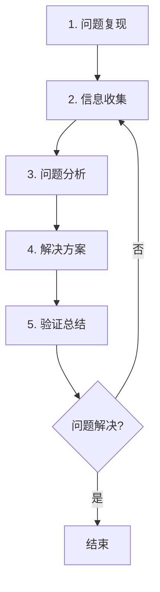

# 常见Bug调试方法：系统化的问题定位与解决


## 概述

调试是嵌入式开发中最重要的技能之一。无论是初学者还是经验丰富的工程师，都会在开发过程中遇到各种各样的Bug。掌握系统化的调试方法，不仅能够快速定位和解决问题，还能提高开发效率，减少项目风险。

本文将介绍嵌入式系统中常见的Bug类型、系统化的调试思路、实用的问题定位方法，以及针对不同类型Bug的解决方案。通过学习这些方法，你将建立起完整的调试思维体系，能够更加自信地面对各种技术难题。

### 为什么需要系统化的调试方法？

**常见问题**:
- 遇到Bug时不知从何下手
- 盲目尝试各种方法，浪费时间
- 解决了表面问题，根本原因未找到
- 同样的问题反复出现
- 缺乏调试经验的积累

**系统化调试的优势**:
- **高效定位**: 快速缩小问题范围，精准定位根本原因
- **避免遗漏**: 按照流程检查，不会遗漏关键信息
- **经验积累**: 建立问题库，形成知识沉淀
- **团队协作**: 统一的调试方法便于团队沟通
- **预防为主**: 从调试中总结规律，预防类似问题

### Bug的分类

根据表现形式和影响范围，Bug可以分为：

1. **编译错误**: 代码无法编译通过
2. **链接错误**: 编译通过但链接失败
3. **运行时错误**: 程序运行时崩溃或异常
4. **逻辑错误**: 程序运行但结果不正确
5. **性能问题**: 程序运行缓慢或资源占用过高
6. **偶发性问题**: 问题不稳定，难以复现


## 系统化调试流程

### 调试的五个步骤

一个完整的调试流程包括以下五个步骤：



#### 步骤1: 问题复现

**目标**: 确保问题可以稳定复现

**为什么重要**:
- 无法复现的问题很难调试
- 复现是验证修复的前提
- 了解触发条件有助于定位原因

**如何复现**:
1. **记录触发条件**: 什么操作导致问题出现
2. **记录环境信息**: 硬件版本、软件版本、配置参数
3. **记录问题现象**: 详细描述问题表现
4. **尝试多次复现**: 确认问题的稳定性
5. **简化复现步骤**: 找到最小复现路径

**示例**:
```
问题: 系统运行一段时间后死机

复现步骤:
1. 上电启动系统
2. 运行约30分钟
3. 系统停止响应，LED不再闪烁
4. 串口无输出

复现率: 10次测试中出现8次
```


#### 步骤2: 信息收集

**目标**: 收集所有相关信息，为分析提供依据

**收集内容**:

1. **错误信息**
   - 编译错误信息
   - 运行时错误代码
   - 异常堆栈信息
   - 日志输出

2. **系统状态**
   - CPU使用率
   - 内存使用情况
   - 任务状态
   - 外设状态

3. **环境信息**
   - 硬件版本
   - 软件版本
   - 编译器版本
   - 配置参数

4. **时间信息**
   - 问题出现时间
   - 运行时长
   - 操作序列

**信息收集方法**:

```c
// 1. 添加调试日志
void debug_print_system_info(void) {
    printf("=== System Info ===\n");
    printf("Uptime: %lu s\n", HAL_GetTick() / 1000);
    printf("Free Heap: %lu bytes\n", xPortGetFreeHeapSize());
    printf("Task Count: %d\n", uxTaskGetNumberOfTasks());
    printf("==================\n");
}

// 2. 记录关键变量
void debug_log_variables(void) {
    printf("sensor_value: %d\n", sensor_value);
    printf("state: %d\n", current_state);
    printf("counter: %lu\n", counter);
}

// 3. 记录函数调用
void critical_function(void) {
    printf("[ENTER] critical_function\n");
    
    // 函数逻辑
    
    printf("[EXIT] critical_function\n");
}
```


#### 步骤3: 问题分析

**目标**: 根据收集的信息，分析问题的根本原因

**分析方法**:

1. **二分法定位**
   - 将代码分成两部分
   - 确定问题在哪一部分
   - 继续细分，直到定位到具体代码

2. **对比法**
   - 对比正常版本和问题版本
   - 对比正常情况和异常情况
   - 找出差异点

3. **排除法**
   - 列出所有可能的原因
   - 逐一排除不可能的原因
   - 缩小范围

4. **因果分析**
   - 从现象推导原因
   - 建立因果关系链
   - 找到根本原因

**分析工具**:

```c
// 1. 断言检查
#define ASSERT(expr) \
    if (!(expr)) { \
        printf("ASSERT FAILED: %s, line %d\n", __FILE__, __LINE__); \
        while(1); \
    }

// 使用示例
ASSERT(ptr != NULL);
ASSERT(value >= 0 && value <= 100);

// 2. 条件编译
#ifdef DEBUG_MODE
    printf("Debug: x = %d\n", x);
#endif

// 3. 状态机跟踪
typedef enum {
    STATE_IDLE,
    STATE_RUNNING,
    STATE_ERROR
} State_t;

State_t current_state = STATE_IDLE;

void state_transition(State_t new_state) {
    printf("State: %d -> %d\n", current_state, new_state);
    current_state = new_state;
}
```


#### 步骤4: 解决方案

**目标**: 根据分析结果，制定并实施解决方案

**解决原则**:
- **治本不治标**: 解决根本原因，而非表面现象
- **最小改动**: 尽量减少代码改动，降低风险
- **可回退**: 保留原代码，便于回退
- **文档化**: 记录修改原因和方法

**常见解决方法**:

1. **修复代码逻辑**
```c
// 错误代码
if (value = 10) {  // 赋值而非比较
    // ...
}

// 修复后
if (value == 10) {  // 正确的比较
    // ...
}
```

2. **添加边界检查**
```c
// 错误代码
void process_data(uint8_t *data, uint16_t len) {
    for (int i = 0; i <= len; i++) {  // 越界访问
        buffer[i] = data[i];
    }
}

// 修复后
void process_data(uint8_t *data, uint16_t len) {
    if (data == NULL || len > BUFFER_SIZE) {
        return;  // 参数检查
    }
    for (int i = 0; i < len; i++) {  // 正确的边界
        buffer[i] = data[i];
    }
}
```

3. **资源管理**
```c
// 错误代码
void function(void) {
    uint8_t *ptr = malloc(100);
    // 使用ptr
    // 忘记释放内存
}

// 修复后
void function(void) {
    uint8_t *ptr = malloc(100);
    if (ptr == NULL) {
        return;  // 检查分配是否成功
    }
    // 使用ptr
    free(ptr);  // 释放内存
}
```


#### 步骤5: 验证总结

**目标**: 验证问题已解决，总结经验教训

**验证方法**:
1. **重复复现步骤**: 确认问题不再出现
2. **回归测试**: 确保修复没有引入新问题
3. **压力测试**: 在极端条件下测试稳定性
4. **长时间测试**: 运行足够长时间验证可靠性

**总结内容**:
- 问题描述和现象
- 根本原因分析
- 解决方法和代码修改
- 预防措施和经验教训
- 相关文档和参考资料

**总结模板**:
```markdown
## Bug修复记录

**Bug ID**: #001
**发现日期**: 2024-01-15
**修复日期**: 2024-01-16
**严重程度**: 高

### 问题描述
系统运行30分钟后死机，LED停止闪烁，串口无输出

### 根本原因
栈溢出导致系统崩溃。任务栈大小设置为512字节，
但实际使用超过600字节

### 解决方案
将任务栈大小从512字节增加到1024字节

### 代码修改
文件: main.c
行号: 45
修改前: xTaskCreate(task, "Task", 512, NULL, 1, NULL);
修改后: xTaskCreate(task, "Task", 1024, NULL, 1, NULL);

### 验证结果
运行24小时无异常，问题已解决

### 经验教训
1. 任务栈大小需要预留足够余量
2. 使用栈使用监控工具定期检查
3. 添加栈溢出检测机制
```


## 常见Bug类型及解决方法

### 1. 编译错误

#### 1.1 语法错误

**现象**: 编译器报告语法错误

**常见原因**:
- 缺少分号、括号不匹配
- 拼写错误
- 关键字使用错误
- 类型不匹配

**示例**:
```c
// 错误1: 缺少分号
int x = 10  // 缺少分号
int y = 20;

// 错误2: 括号不匹配
if (x > 0 {  // 缺少右括号
    printf("x is positive\n");
}

// 错误3: 类型不匹配
int *ptr;
ptr = 100;  // 不能将整数赋值给指针
```

**解决方法**:
1. 仔细阅读编译器错误信息
2. 检查错误行及其前后几行
3. 使用IDE的语法高亮和自动补全
4. 使用代码格式化工具

#### 1.2 头文件问题

**现象**: 找不到头文件或重复定义

**常见原因**:
- 头文件路径不正确
- 缺少头文件包含
- 头文件重复包含
- 循环包含

**解决方法**:

```c
// 1. 使用头文件保护
#ifndef MY_HEADER_H
#define MY_HEADER_H

// 头文件内容

#endif // MY_HEADER_H

// 2. 正确的包含顺序
#include <stdint.h>      // 标准库
#include <stdio.h>
#include "stm32f4xx.h"   // 芯片相关
#include "my_driver.h"   // 自定义头文件

// 3. 避免循环包含
// 使用前向声明
typedef struct Device Device_t;  // 前向声明

// 而不是包含完整定义
```


### 2. 链接错误

#### 2.1 未定义的引用

**现象**: 链接器报告 "undefined reference"

**常见原因**:
- 函数声明了但未实现
- 库文件未链接
- 函数名拼写错误
- C/C++混用时未使用extern "C"

**解决方法**:

```c
// 1. 确保函数已实现
// 头文件 my_func.h
void my_function(void);

// 源文件 my_func.c
void my_function(void) {
    // 实现代码
}

// 2. C/C++混用
#ifdef __cplusplus
extern "C" {
#endif

void c_function(void);

#ifdef __cplusplus
}
#endif

// 3. 检查链接库
// Makefile中添加
LIBS += -lm  # 数学库
```

#### 2.2 重复定义

**现象**: 链接器报告 "multiple definition"

**常见原因**:
- 全局变量在头文件中定义
- 函数在头文件中实现
- 同一个源文件被多次编译

**解决方法**:

```c
// 错误做法: 在头文件中定义全局变量
// my_header.h
int global_var = 0;  // 错误！

// 正确做法: 在头文件中声明，在源文件中定义
// my_header.h
extern int global_var;  // 声明

// my_source.c
int global_var = 0;  // 定义

// 或者使用static限制作用域
// my_header.h
static inline int get_value(void) {
    return 42;
}
```


### 3. 运行时错误

#### 3.1 空指针解引用

**现象**: 程序崩溃，访问非法内存地址

**常见原因**:
- 指针未初始化
- 内存分配失败后未检查
- 指针被意外修改

**解决方法**:

```c
// 1. 初始化指针
uint8_t *ptr = NULL;  // 初始化为NULL

// 2. 使用前检查
if (ptr != NULL) {
    *ptr = 10;
}

// 3. 内存分配后检查
ptr = (uint8_t *)malloc(100);
if (ptr == NULL) {
    // 处理分配失败
    return ERROR_NO_MEMORY;
}

// 4. 使用断言
ASSERT(ptr != NULL);
*ptr = 10;

// 5. 释放后置NULL
free(ptr);
ptr = NULL;  // 防止野指针
```

#### 3.2 数组越界

**现象**: 程序行为异常，可能崩溃

**常见原因**:
- 循环条件错误
- 数组索引计算错误
- 缓冲区溢出

**解决方法**:

```c
// 错误代码
uint8_t buffer[10];
for (int i = 0; i <= 10; i++) {  // 越界！
    buffer[i] = i;
}

// 正确代码
uint8_t buffer[10];
for (int i = 0; i < 10; i++) {  // 正确
    buffer[i] = i;
}

// 使用宏定义数组大小
#define BUFFER_SIZE 10
uint8_t buffer[BUFFER_SIZE];

for (int i = 0; i < BUFFER_SIZE; i++) {
    buffer[i] = i;
}

// 边界检查函数
bool safe_array_access(uint8_t *array, size_t size, size_t index) {
    if (index >= size) {
        printf("Error: Array index out of bounds\n");
        return false;
    }
    return true;
}
```


#### 3.3 栈溢出

**现象**: 系统崩溃，程序跑飞

**常见原因**:
- 任务栈太小
- 递归层次太深
- 局部变量太大
- 栈被破坏

**解决方法**:

```c
// 1. 增加任务栈大小
xTaskCreate(task_function, "Task", 
            1024,  // 栈大小（字）
            NULL, 1, NULL);

// 2. 避免大的局部变量
// 错误做法
void function(void) {
    uint8_t large_buffer[10000];  // 栈上分配大数组
    // ...
}

// 正确做法
void function(void) {
    static uint8_t large_buffer[10000];  // 使用static
    // 或者
    uint8_t *buffer = malloc(10000);  // 堆上分配
    // ...
    free(buffer);
}

// 3. 限制递归深度
int recursive_function(int n, int depth) {
    if (depth > MAX_RECURSION_DEPTH) {
        return ERROR_TOO_DEEP;
    }
    if (n <= 1) {
        return 1;
    }
    return n * recursive_function(n - 1, depth + 1);
}

// 4. 监控栈使用
void check_stack_usage(void) {
    UBaseType_t stack_high_water_mark = uxTaskGetStackHighWaterMark(NULL);
    printf("Stack free: %lu words\n", stack_high_water_mark);
    
    if (stack_high_water_mark < 100) {
        printf("Warning: Stack usage high!\n");
    }
}
```


#### 3.4 内存泄漏

**现象**: 可用内存逐渐减少，最终耗尽

**常见原因**:
- 分配内存后未释放
- 异常退出时未释放
- 循环中重复分配

**解决方法**:

```c
// 1. 配对使用malloc/free
void function(void) {
    uint8_t *ptr = malloc(100);
    if (ptr == NULL) {
        return;
    }
    
    // 使用ptr
    
    free(ptr);  // 确保释放
}

// 2. 异常处理中释放资源
void function(void) {
    uint8_t *ptr1 = malloc(100);
    uint8_t *ptr2 = malloc(200);
    
    if (ptr1 == NULL || ptr2 == NULL) {
        // 释放已分配的内存
        if (ptr1) free(ptr1);
        if (ptr2) free(ptr2);
        return;
    }
    
    // 使用ptr1和ptr2
    
    free(ptr1);
    free(ptr2);
}

// 3. 使用内存池
typedef struct {
    uint8_t buffer[100];
    bool in_use;
} MemBlock_t;

MemBlock_t mem_pool[10];

MemBlock_t* alloc_from_pool(void) {
    for (int i = 0; i < 10; i++) {
        if (!mem_pool[i].in_use) {
            mem_pool[i].in_use = true;
            return &mem_pool[i];
        }
    }
    return NULL;
}

void free_to_pool(MemBlock_t *block) {
    if (block != NULL) {
        block->in_use = false;
    }
}

// 4. 监控内存使用
void check_memory_usage(void) {
    size_t free_heap = xPortGetFreeHeapSize();
    size_t min_free_heap = xPortGetMinimumEverFreeHeapSize();
    
    printf("Free heap: %lu bytes\n", free_heap);
    printf("Min free heap: %lu bytes\n", min_free_heap);
    
    if (free_heap < 1000) {
        printf("Warning: Low memory!\n");
    }
}
```


### 4. 逻辑错误

#### 4.1 条件判断错误

**现象**: 程序逻辑不符合预期

**常见原因**:
- 使用赋值而非比较
- 逻辑运算符错误
- 优先级理解错误

**解决方法**:

```c
// 错误1: 赋值而非比较
if (x = 10) {  // 错误！这是赋值
    // ...
}

// 正确
if (x == 10) {  // 比较
    // ...
}

// 错误2: 逻辑运算符
if (x > 0 && x < 10 || y > 0) {  // 优先级不明确
    // ...
}

// 正确
if ((x > 0 && x < 10) || y > 0) {  // 使用括号明确优先级
    // ...
}

// 错误3: 位运算和逻辑运算混淆
if (flags & FLAG_A && flags & FLAG_B) {  // 可能不是预期行为
    // ...
}

// 正确
if ((flags & FLAG_A) && (flags & FLAG_B)) {  // 明确意图
    // ...
}

// 技巧: 使用Yoda条件避免赋值错误
if (10 == x) {  // 如果写成 10 = x 会编译错误
    // ...
}
```

#### 4.2 整数溢出

**现象**: 计算结果不正确

**常见原因**:
- 数据类型范围不足
- 运算过程中溢出
- 有符号和无符号混用

**解决方法**:

```c
// 1. 选择合适的数据类型
uint8_t small = 200;
small = small + 100;  // 溢出！结果是44

uint16_t large = 200;
large = large + 100;  // 正确，结果是300

// 2. 检查溢出
bool safe_add_uint32(uint32_t a, uint32_t b, uint32_t *result) {
    if (a > UINT32_MAX - b) {
        return false;  // 会溢出
    }
    *result = a + b;
    return true;
}

// 3. 使用更大的类型进行中间计算
uint16_t a = 30000;
uint16_t b = 30000;
uint32_t result = (uint32_t)a * (uint32_t)b;  // 避免溢出

// 4. 有符号和无符号混用
int8_t signed_val = -1;
uint8_t unsigned_val = 1;

if (signed_val < unsigned_val) {  // 错误！signed_val被转换为很大的正数
    // 不会执行
}

// 正确做法
if ((int)signed_val < (int)unsigned_val) {
    // 正确执行
}
```


### 5. 并发问题

#### 5.1 竞态条件

**现象**: 程序行为不确定，偶尔出错

**常见原因**:
- 多个任务访问共享资源
- 中断和主程序访问同一变量
- 缺少同步机制

**解决方法**:

```c
// 问题代码
volatile uint32_t shared_counter = 0;

void task1(void) {
    shared_counter++;  // 非原子操作
}

void task2(void) {
    shared_counter++;  // 可能与task1冲突
}

// 解决方法1: 使用互斥锁
SemaphoreHandle_t mutex;

void task1(void) {
    xSemaphoreTake(mutex, portMAX_DELAY);
    shared_counter++;
    xSemaphoreGive(mutex);
}

// 解决方法2: 关闭中断
void critical_section(void) {
    taskENTER_CRITICAL();
    shared_counter++;
    taskEXIT_CRITICAL();
}

// 解决方法3: 使用原子操作
#include <stdatomic.h>
atomic_uint shared_counter = 0;

void task1(void) {
    atomic_fetch_add(&shared_counter, 1);
}

// 解决方法4: 使用消息队列
QueueHandle_t queue;

void task1(void) {
    uint32_t value = 1;
    xQueueSend(queue, &value, portMAX_DELAY);
}

void task2(void) {
    uint32_t value;
    if (xQueueReceive(queue, &value, 0) == pdTRUE) {
        shared_counter += value;
    }
}
```


#### 5.2 死锁

**现象**: 系统挂起，任务无法继续执行

**常见原因**:
- 循环等待资源
- 锁的获取顺序不一致
- 忘记释放锁

**解决方法**:

```c
// 问题代码: 可能死锁
SemaphoreHandle_t mutex_a, mutex_b;

void task1(void) {
    xSemaphoreTake(mutex_a, portMAX_DELAY);
    vTaskDelay(10);  // 模拟处理时间
    xSemaphoreTake(mutex_b, portMAX_DELAY);  // 可能死锁
    
    // 临界区
    
    xSemaphoreGive(mutex_b);
    xSemaphoreGive(mutex_a);
}

void task2(void) {
    xSemaphoreTake(mutex_b, portMAX_DELAY);
    vTaskDelay(10);
    xSemaphoreTake(mutex_a, portMAX_DELAY);  // 可能死锁
    
    // 临界区
    
    xSemaphoreGive(mutex_a);
    xSemaphoreGive(mutex_b);
}

// 解决方法1: 统一锁的获取顺序
void task1(void) {
    xSemaphoreTake(mutex_a, portMAX_DELAY);
    xSemaphoreTake(mutex_b, portMAX_DELAY);
    
    // 临界区
    
    xSemaphoreGive(mutex_b);
    xSemaphoreGive(mutex_a);
}

void task2(void) {
    xSemaphoreTake(mutex_a, portMAX_DELAY);  // 与task1相同顺序
    xSemaphoreTake(mutex_b, portMAX_DELAY);
    
    // 临界区
    
    xSemaphoreGive(mutex_b);
    xSemaphoreGive(mutex_a);
}

// 解决方法2: 使用超时
void task1(void) {
    if (xSemaphoreTake(mutex_a, pdMS_TO_TICKS(100)) == pdTRUE) {
        if (xSemaphoreTake(mutex_b, pdMS_TO_TICKS(100)) == pdTRUE) {
            // 临界区
            xSemaphoreGive(mutex_b);
        }
        xSemaphoreGive(mutex_a);
    }
}

// 解决方法3: 尝试获取，失败则释放已获取的锁
void task1(void) {
    while (1) {
        xSemaphoreTake(mutex_a, portMAX_DELAY);
        if (xSemaphoreTake(mutex_b, 0) == pdTRUE) {
            // 成功获取两个锁
            // 临界区
            xSemaphoreGive(mutex_b);
            xSemaphoreGive(mutex_a);
            break;
        } else {
            // 获取mutex_b失败，释放mutex_a
            xSemaphoreGive(mutex_a);
            vTaskDelay(1);  // 短暂延时后重试
        }
    }
}
```


### 6. 硬件相关问题

#### 6.1 时序问题

**现象**: 外设工作不正常，通信失败

**常见原因**:
- 时钟配置错误
- 延时不足
- 信号建立/保持时间不满足

**解决方法**:

```c
// 1. 检查时钟配置
void check_clock_config(void) {
    uint32_t sysclk = HAL_RCC_GetSysClockFreq();
    uint32_t hclk = HAL_RCC_GetHCLKFreq();
    uint32_t pclk1 = HAL_RCC_GetPCLK1Freq();
    uint32_t pclk2 = HAL_RCC_GetPCLK2Freq();
    
    printf("SYSCLK: %lu Hz\n", sysclk);
    printf("HCLK: %lu Hz\n", hclk);
    printf("PCLK1: %lu Hz\n", pclk1);
    printf("PCLK2: %lu Hz\n", pclk2);
}

// 2. 添加适当延时
void spi_write_byte(uint8_t data) {
    HAL_GPIO_WritePin(CS_GPIO_Port, CS_Pin, GPIO_PIN_RESET);
    delay_us(1);  // CS建立时间
    
    HAL_SPI_Transmit(&hspi1, &data, 1, 100);
    
    delay_us(1);  // CS保持时间
    HAL_GPIO_WritePin(CS_GPIO_Port, CS_Pin, GPIO_PIN_SET);
}

// 3. 降低通信速度
void init_i2c_slow(void) {
    hi2c1.Init.ClockSpeed = 100000;  // 100kHz标准模式
    // 而不是400000（快速模式）
    HAL_I2C_Init(&hi2c1);
}

// 4. 使用逻辑分析仪验证时序
// 连接逻辑分析仪到SCL和SDA
// 捕获波形，测量时序参数
// 对比数据手册要求
```

#### 6.2 电源问题

**现象**: 系统不稳定，偶尔复位

**常见原因**:
- 电源纹波过大
- 瞬态电流过大
- 电源容量不足

**解决方法**:

```c
// 1. 添加电源监控
void monitor_power(void) {
    // 使用ADC监测电源电压
    uint32_t vdd = read_vdd_voltage();
    
    if (vdd < 3000) {  // 低于3.0V
        printf("Warning: Low voltage %lu mV\n", vdd);
        // 进入低功耗模式或报警
    }
}

// 2. 软件防抖
void init_with_retry(void) {
    int retry = 0;
    while (retry < 3) {
        if (peripheral_init() == SUCCESS) {
            break;
        }
        retry++;
        HAL_Delay(100);  // 延时后重试
    }
    
    if (retry >= 3) {
        printf("Error: Init failed after 3 retries\n");
    }
}

// 3. 降低功耗
void reduce_power_consumption(void) {
    // 降低时钟频率
    SystemClock_Config_LowPower();
    
    // 关闭不用的外设
    __HAL_RCC_TIM2_CLK_DISABLE();
    __HAL_RCC_USART2_CLK_DISABLE();
    
    // 进入低功耗模式
    HAL_PWR_EnterSLEEPMode(PWR_MAINREGULATOR_ON, PWR_SLEEPENTRY_WFI);
}
```


## 调试工具使用

### 1. 串口调试

**优点**: 简单易用，成本低
**缺点**: 功能有限，影响时序

**使用场景**:
- 输出日志信息
- 监控程序状态
- 简单的交互调试

**示例**:
```c
// 基本日志输出
printf("System started\n");
printf("Sensor value: %d\n", sensor_value);

// 带时间戳的日志
printf("[%lu] Temperature: %.2f C\n", HAL_GetTick(), temperature);

// 十六进制输出
void print_hex(uint8_t *data, uint16_t len) {
    for (uint16_t i = 0; i < len; i++) {
        printf("%02X ", data[i]);
    }
    printf("\n");
}
```

**详细内容**: 参见 [串口调试技巧大全](./03-serial-debugging.html)

### 2. JTAG/SWD调试

**优点**: 功能强大，可设置断点
**缺点**: 需要调试器硬件

**使用场景**:
- 单步调试
- 查看变量和寄存器
- 设置断点和观察点
- Flash编程

**基本操作**:
1. 连接调试器到目标板
2. 启动调试会话
3. 设置断点
4. 单步执行
5. 查看变量值

**详细内容**: 参见 [JTAG/SWD调试接口使用](./01-jtag-swd-debugging.html)

### 3. GDB调试器

**优点**: 命令行调试，功能全面
**缺点**: 学习曲线陡峭

**常用命令**:
```bash
# 启动调试
arm-none-eabi-gdb firmware.elf

# 连接目标
target remote localhost:3333

# 加载程序
load

# 设置断点
break main
break file.c:100

# 运行程序
continue

# 单步执行
step      # 进入函数
next      # 跳过函数

# 查看变量
print variable_name
print /x register_value  # 十六进制显示

# 查看内存
x/10x 0x20000000  # 查看10个字（十六进制）

# 查看堆栈
backtrace

# 查看寄存器
info registers
```

**详细内容**: 参见 [GDB调试器基础使用](./02-gdb-basics.html)


### 4. 逻辑分析仪

**优点**: 多通道，协议解析
**缺点**: 只能分析数字信号

**使用场景**:
- 分析I2C/SPI/UART通信
- 验证时序
- 捕获偶发事件

**详细内容**: 参见 [逻辑分析仪使用入门](./04-logic-analyzer.html)

### 5. 静态分析工具

**优点**: 自动发现潜在问题
**缺点**: 可能有误报

**常用工具**:
- **Cppcheck**: 开源C/C++静态分析
- **PC-lint**: 商业静态分析工具
- **Clang Static Analyzer**: LLVM静态分析

**使用示例**:
```bash
# 使用Cppcheck
cppcheck --enable=all --inconclusive src/

# 常见检查项
# - 内存泄漏
# - 空指针解引用
# - 数组越界
# - 未初始化变量
# - 死代码
```

## 调试技巧

### 1. 二分法定位

**原理**: 将代码分成两部分，确定问题在哪一部分

**步骤**:
1. 在代码中间位置添加日志或断点
2. 运行程序，观察是否到达该位置
3. 如果到达，问题在后半部分；否则在前半部分
4. 继续细分，直到定位到具体代码

**示例**:
```c
void complex_function(void) {
    printf("Point 1\n");  // 检查点1
    
    // 代码块A
    init_hardware();
    
    printf("Point 2\n");  // 检查点2
    
    // 代码块B
    process_data();
    
    printf("Point 3\n");  // 检查点3
    
    // 代码块C
    send_result();
    
    printf("Point 4\n");  // 检查点4
}

// 如果输出到Point 2但没有Point 3
// 说明问题在process_data()中
```


### 2. 对比法

**原理**: 对比正常和异常情况，找出差异

**应用场景**:
- 对比不同版本的代码
- 对比不同的配置参数
- 对比不同的硬件环境

**示例**:
```c
// 记录关键状态
void log_system_state(const char *label) {
    printf("=== %s ===\n", label);
    printf("Clock: %lu Hz\n", SystemCoreClock);
    printf("Free heap: %lu bytes\n", xPortGetFreeHeapSize());
    printf("Task count: %d\n", uxTaskGetNumberOfTasks());
    printf("==============\n");
}

// 在不同位置调用
log_system_state("Before init");
init_system();
log_system_state("After init");

// 对比两次输出，找出差异
```

### 3. 排除法

**原理**: 列出所有可能原因，逐一排除

**步骤**:
1. 列出所有可能的原因
2. 按照可能性排序
3. 逐一验证和排除
4. 找到真正的原因

**示例**:
```
问题: I2C通信失败

可能原因:
1. [ ] 硬件连接问题
   - [x] SCL/SDA接线正确
   - [x] 上拉电阻存在
   - [x] 电源正常
   
2. [ ] 软件配置问题
   - [x] I2C时钟已使能
   - [x] GPIO配置正确
   - [ ] I2C速度设置 ← 发现问题！
   
3. [ ] 设备地址问题
   - [ ] 地址是否正确
```

### 4. 最小化复现

**原理**: 简化问题，找到最小复现路径

**步骤**:
1. 从完整程序开始
2. 逐步删除不相关代码
3. 保留能复现问题的最小代码
4. 更容易定位问题

**示例**:
```c
// 原始复杂代码
void complex_system(void) {
    init_all_peripherals();
    start_all_tasks();
    enable_all_interrupts();
    // 100行代码...
    // 问题出现
}

// 简化后的最小复现
void minimal_reproduce(void) {
    init_i2c();  // 只初始化I2C
    read_sensor();  // 只读取传感器
    // 问题仍然出现
    // 说明问题与其他外设无关
}
```


### 5. 橡皮鸭调试法

**原理**: 向他人（或橡皮鸭）解释问题，往往能自己发现问题

**步骤**:
1. 准备一个橡皮鸭（或任何物体）
2. 向它详细解释你的代码逻辑
3. 解释问题现象和你的分析
4. 在解释过程中，往往能发现问题所在

**为什么有效**:
- 强迫你理清思路
- 从不同角度审视问题
- 发现之前忽略的细节

### 6. 版本控制辅助调试

**使用Git定位问题**:

```bash
# 1. 查看最近的修改
git log --oneline -10

# 2. 对比两个版本
git diff v1.0 v1.1

# 3. 二分查找引入问题的提交
git bisect start
git bisect bad  # 当前版本有问题
git bisect good v1.0  # v1.0版本正常
# Git会自动切换到中间版本
# 测试后标记为good或bad
git bisect good/bad
# 重复直到找到引入问题的提交

# 4. 查看特定文件的修改历史
git log -p -- path/to/file.c

# 5. 回退到之前的版本
git checkout v1.0
```

## 预防性编程

### 1. 防御性编程

**原则**: 假设所有输入都可能是错误的

**实践**:

```c
// 1. 参数检查
int process_data(uint8_t *data, uint16_t len) {
    // 检查参数有效性
    if (data == NULL) {
        return ERROR_NULL_POINTER;
    }
    if (len == 0 || len > MAX_DATA_LEN) {
        return ERROR_INVALID_LENGTH;
    }
    
    // 处理数据
    // ...
    
    return SUCCESS;
}

// 2. 边界检查
void safe_array_write(uint8_t *array, size_t size, size_t index, uint8_t value) {
    if (index < size) {
        array[index] = value;
    } else {
        printf("Error: Index %zu out of bounds (size: %zu)\n", index, size);
    }
}

// 3. 状态检查
typedef enum {
    STATE_IDLE,
    STATE_BUSY,
    STATE_ERROR
} State_t;

State_t current_state = STATE_IDLE;

void start_operation(void) {
    if (current_state != STATE_IDLE) {
        printf("Error: Cannot start, current state: %d\n", current_state);
        return;
    }
    
    current_state = STATE_BUSY;
    // 执行操作
}
```


### 2. 断言使用

**目的**: 在开发阶段捕获逻辑错误

**实现**:

```c
// 定义断言宏
#ifdef DEBUG
    #define ASSERT(expr) \
        if (!(expr)) { \
            printf("ASSERT FAILED: %s, line %d: %s\n", \
                   __FILE__, __LINE__, #expr); \
            while(1);  /* 停止执行 */ \
        }
#else
    #define ASSERT(expr)  /* 发布版本中移除 */
#endif

// 使用示例
void function(int *ptr, int value) {
    ASSERT(ptr != NULL);  // 检查指针
    ASSERT(value >= 0 && value <= 100);  // 检查范围
    
    *ptr = value;
}

// 静态断言（编译时检查）
_Static_assert(sizeof(int) == 4, "int must be 4 bytes");
_Static_assert(MAX_BUFFER_SIZE <= 1024, "Buffer too large");
```

### 3. 错误处理

**原则**: 明确的错误处理策略

**实践**:

```c
// 1. 定义错误码
typedef enum {
    SUCCESS = 0,
    ERROR_NULL_POINTER = -1,
    ERROR_INVALID_PARAM = -2,
    ERROR_TIMEOUT = -3,
    ERROR_NO_MEMORY = -4,
    ERROR_HARDWARE = -5
} ErrorCode_t;

// 2. 统一的错误处理
ErrorCode_t function(void) {
    ErrorCode_t result;
    
    result = step1();
    if (result != SUCCESS) {
        printf("Error in step1: %d\n", result);
        goto cleanup;
    }
    
    result = step2();
    if (result != SUCCESS) {
        printf("Error in step2: %d\n", result);
        goto cleanup;
    }
    
    return SUCCESS;
    
cleanup:
    // 清理资源
    cleanup_resources();
    return result;
}

// 3. 错误日志
void log_error(ErrorCode_t error, const char *function, int line) {
    printf("[ERROR] Code: %d, Function: %s, Line: %d\n", 
           error, function, line);
}

#define LOG_ERROR(err) log_error(err, __FUNCTION__, __LINE__)
```


### 4. 代码审查

**目的**: 通过他人审查发现潜在问题

**审查要点**:
- 逻辑正确性
- 边界条件处理
- 错误处理
- 资源管理
- 代码风格

**审查清单**:
```markdown
## 代码审查清单

### 基本检查
- [ ] 代码符合编码规范
- [ ] 变量命名清晰
- [ ] 注释充分
- [ ] 无编译警告

### 逻辑检查
- [ ] 算法正确
- [ ] 边界条件处理
- [ ] 循环终止条件正确
- [ ] 条件判断正确

### 资源管理
- [ ] 内存分配/释放配对
- [ ] 文件打开/关闭配对
- [ ] 锁获取/释放配对
- [ ] 无资源泄漏

### 错误处理
- [ ] 参数检查
- [ ] 返回值检查
- [ ] 异常处理
- [ ] 错误日志

### 并发安全
- [ ] 共享资源保护
- [ ] 无竞态条件
- [ ] 无死锁风险
- [ ] 原子操作正确
```

## 调试案例分析

### 案例1: 系统定时死机

**问题描述**:
系统运行约30分钟后死机，LED停止闪烁，串口无输出

**调试过程**:

1. **问题复现**
   - 多次测试，确认30分钟左右必然死机
   - 记录死机前的操作和状态

2. **信息收集**
   - 添加内存监控代码
   - 添加任务状态监控
   - 记录死机前的日志

3. **发现线索**
   ```c
   // 监控代码
   void monitor_task(void *param) {
       while(1) {
           printf("Free heap: %lu\n", xPortGetFreeHeapSize());
           printf("Min free heap: %lu\n", xPortGetMinimumEverFreeHeapSize());
           vTaskDelay(pdMS_TO_TICKS(5000));
       }
   }
   
   // 输出显示内存持续减少
   // Free heap: 5000
   // Free heap: 4500
   // Free heap: 4000
   // ...
   // Free heap: 100  ← 死机前
   ```

4. **问题分析**
   - 内存持续减少，怀疑内存泄漏
   - 检查所有malloc/free配对
   - 发现问题代码：
   
   ```c
   void process_message(void) {
       char *buffer = malloc(100);
       // 处理消息
       if (error_occurred) {
           return;  // 忘记释放内存！
       }
       free(buffer);
   }
   ```

5. **解决方案**
   ```c
   void process_message(void) {
       char *buffer = malloc(100);
       if (buffer == NULL) {
           return;
       }
       
       // 处理消息
       if (error_occurred) {
           free(buffer);  // 确保释放
           return;
       }
       free(buffer);
   }
   ```

6. **验证**
   - 运行24小时无异常
   - 内存使用稳定
   - 问题解决


### 案例2: 偶发性数据错误

**问题描述**:
传感器数据偶尔出现异常值，约每100次读取出现1次

**调试过程**:

1. **问题复现**
   - 连续读取1000次，记录所有数据
   - 发现约10次异常值

2. **数据分析**
   ```
   正常值: 25.3, 25.4, 25.3, 25.5
   异常值: 255.0, 0.0, 6553.5
   ```
   
   - 255.0 = 0xFF（全1）
   - 0.0 = 0x00（全0）
   - 6553.5 = 0xFFFF（16位全1）
   
   怀疑是通信错误或未初始化数据

3. **添加调试代码**
   ```c
   uint16_t read_sensor(void) {
       uint16_t raw_value;
       HAL_StatusTypeDef status;
       
       status = HAL_I2C_Mem_Read(&hi2c1, SENSOR_ADDR, 
                                  REG_TEMP, 1, 
                                  (uint8_t*)&raw_value, 2, 100);
       
       printf("I2C Status: %d, Raw: 0x%04X\n", status, raw_value);
       
       if (status != HAL_OK) {
           printf("I2C Error!\n");
           return 0xFFFF;  // 错误标记
       }
       
       return raw_value;
   }
   ```

4. **发现问题**
   - 日志显示偶尔出现 "I2C Error"
   - 但错误未被处理，返回了未初始化的数据

5. **根本原因**
   - I2C总线偶尔出现干扰
   - 错误处理不完善

6. **解决方案**
   ```c
   uint16_t read_sensor_with_retry(void) {
       uint16_t raw_value;
       HAL_StatusTypeDef status;
       int retry = 0;
       
       while (retry < 3) {
           status = HAL_I2C_Mem_Read(&hi2c1, SENSOR_ADDR, 
                                      REG_TEMP, 1, 
                                      (uint8_t*)&raw_value, 2, 100);
           
           if (status == HAL_OK) {
               // 验证数据合理性
               if (raw_value >= MIN_VALUE && raw_value <= MAX_VALUE) {
                   return raw_value;
               }
           }
           
           retry++;
           HAL_Delay(10);  // 短暂延时后重试
       }
       
       printf("Error: Sensor read failed after 3 retries\n");
       return INVALID_VALUE;
   }
   ```

7. **硬件改进**
   - 添加I2C上拉电阻
   - 缩短I2C线缆
   - 添加滤波电容

8. **验证**
   - 连续读取10000次无异常
   - 问题解决


## 最佳实践

### 1. 调试前的准备

**DO（推荐做法）**:
- ✅ 理解代码逻辑和预期行为
- ✅ 准备好调试工具和环境
- ✅ 备份当前代码
- ✅ 记录调试过程和发现
- ✅ 保持冷静和耐心

**DON'T（避免做法）**:
- ❌ 盲目修改代码
- ❌ 同时修改多处代码
- ❌ 不记录修改内容
- ❌ 急于求成，跳过分析
- ❌ 忽视警告信息

### 2. 调试过程中

**DO（推荐做法）**:
- ✅ 一次只改一处
- ✅ 每次修改后测试
- ✅ 记录每次修改的效果
- ✅ 使用版本控制
- ✅ 寻求他人帮助

**DON'T（避免做法）**:
- ❌ 随意添加延时"解决"问题
- ❌ 注释掉大段代码
- ❌ 忽视编译警告
- ❌ 不验证假设
- ❌ 放弃系统化方法

### 3. 调试后的总结

**DO（推荐做法）**:
- ✅ 记录问题和解决方案
- ✅ 分析根本原因
- ✅ 总结经验教训
- ✅ 更新文档
- ✅ 分享给团队

**DON'T（避免做法）**:
- ❌ 解决问题就结束
- ❌ 不分析根本原因
- ❌ 不记录调试过程
- ❌ 不分享经验
- ❌ 不预防类似问题

### 4. 调试效率提升

**技巧**:
1. **建立问题库**: 记录常见问题和解决方案
2. **使用模板**: 标准化的调试流程和记录模板
3. **工具熟练**: 熟练使用各种调试工具
4. **经验积累**: 从每次调试中学习
5. **团队协作**: 与团队分享经验和技巧

**时间分配建议**:
- 问题复现: 10%
- 信息收集: 20%
- 问题分析: 40%
- 解决方案: 20%
- 验证总结: 10%


## 总结

通过本文，你已经学习了:

- ✅ 系统化的调试流程（复现、收集、分析、解决、验证）
- ✅ 常见Bug类型及其解决方法
- ✅ 各种调试工具的使用场景
- ✅ 实用的调试技巧和方法
- ✅ 预防性编程的最佳实践
- ✅ 真实的调试案例分析

**关键要点**:
1. 调试是一个系统化的过程，需要遵循科学的方法
2. 问题复现是调试的基础，信息收集是分析的前提
3. 分析问题要找到根本原因，而非表面现象
4. 使用合适的工具可以大大提高调试效率
5. 预防性编程可以减少Bug的产生
6. 经验积累和知识分享对团队很重要

**调试心态**:
- 保持冷静和耐心
- 相信问题一定有原因
- 系统化地分析问题
- 不要害怕寻求帮助
- 从每次调试中学习

**持续提升**:
- 学习新的调试工具和技术
- 总结调试经验和教训
- 阅读优秀的代码和文档
- 参与代码审查和技术讨论
- 建立个人的问题库和知识库

调试能力是嵌入式工程师的核心竞争力之一。通过不断实践和总结，你将建立起强大的调试能力，能够快速定位和解决各种技术难题。

## 延伸阅读

### 相关文章

- [串口调试技巧大全](./03-serial-debugging.html) - 学习串口调试方法
- [JTAG/SWD调试接口使用](./01-jtag-swd-debugging.html) - 掌握硬件调试
- [GDB调试器基础使用](./02-gdb-basics.html) - 学习命令行调试
- [逻辑分析仪使用入门](./04-logic-analyzer.html) - 分析数字信号

### 进阶主题

- [硬件故障排查指南](./06-hardware-troubleshooting.html) - 硬件问题调试
- [内存泄漏检测与分析](../intermediate/04-memory-leak-detection.html) - 内存问题调试
- [单元测试框架搭建](../advanced/01-unit-testing-framework.html) - 自动化测试

### 参考资料

**书籍推荐**:
1. 《调试九法》- David J. Agans
2. 《代码大全》- Steve McConnell
3. 《程序员修炼之道》- Andrew Hunt

**在线资源**:
1. [Debugging Guide](https://interrupt.memfault.com/blog/tag/debugging) - Memfault调试博客
2. [Embedded Debugging](https://www.embedded.com/category/debug-and-optimization/) - Embedded.com调试专栏
3. [ARM Debugging](https://developer.arm.com/documentation/dui0446/latest/) - ARM官方调试文档

**工具文档**:
1. [GDB Documentation](https://sourceware.org/gdb/documentation/) - GDB官方文档
2. [OpenOCD User's Guide](http://openocd.org/doc/html/index.html) - OpenOCD用户指南
3. [Segger J-Link](https://www.segger.com/products/debug-probes/j-link/) - J-Link调试器文档


## 常见问题FAQ

### Q1: 遇到Bug时应该从哪里开始？

**A**: 
按照系统化流程开始：
1. 首先确保问题可以复现
2. 收集所有相关信息（错误信息、日志、环境）
3. 分析问题可能的原因
4. 制定调试计划
5. 不要盲目修改代码

### Q2: 如何处理无法复现的Bug？

**A**: 
无法复现的Bug通常是偶发性问题：
- 增加日志输出，记录更多信息
- 使用触发条件捕获问题发生时的状态
- 长时间运行测试，增加复现机会
- 检查是否与时序、并发、环境有关
- 使用压力测试触发问题

### Q3: 调试时应该使用printf还是调试器？

**A**: 
两者各有优势，建议结合使用：
- **printf**: 简单快速，适合查看程序流程和变量值
- **调试器**: 功能强大，适合深入分析和单步调试
- 初步定位用printf，深入分析用调试器
- 实时系统注意printf可能影响时序

### Q4: 如何避免调试时引入新的Bug？

**A**: 
遵循以下原则：
- 一次只修改一处代码
- 每次修改后立即测试
- 使用版本控制，便于回退
- 理解代码逻辑后再修改
- 进行回归测试

### Q5: 调试时间过长怎么办？

**A**: 
如果调试超过预期时间：
- 休息一下，换个思路
- 向同事或社区寻求帮助
- 回顾调试流程，是否遗漏关键信息
- 尝试最小化复现
- 考虑是否需要重构代码

### Q6: 如何提高调试效率？

**A**: 
提高效率的方法：
- 熟练使用调试工具
- 建立个人问题库
- 学习常见Bug模式
- 使用静态分析工具
- 编写可调试的代码（添加日志、断言）
- 定期总结调试经验

### Q7: 生产环境的Bug如何调试？

**A**: 
生产环境调试需要特别注意：
- 不能影响正常运行
- 使用日志记录关键信息
- 在测试环境复现问题
- 使用远程调试（如果可能）
- 收集现场信息后离线分析
- 准备回滚方案

### Q8: 如何判断是硬件问题还是软件问题？

**A**: 
判断方法：
- 更换硬件测试（如果可能）
- 在不同硬件上测试软件
- 使用示波器/逻辑分析仪检查信号
- 检查硬件连接和电源
- 查看硬件数据手册的时序要求
- 软件问题通常可以稳定复现

---

**反馈与支持**:
- 如果你在调试过程中遇到问题，欢迎在评论区留言
- 发现文档错误或有改进建议，请提交Issue
- 想要分享你的调试经验，欢迎投稿

**版本历史**:
- v1.0 (2024-01-15): 初始版本发布

**许可证**: 本文档采用 [CC BY-SA 4.0](https://creativecommons.org/licenses/by-sa/4.0/) 许可协议
