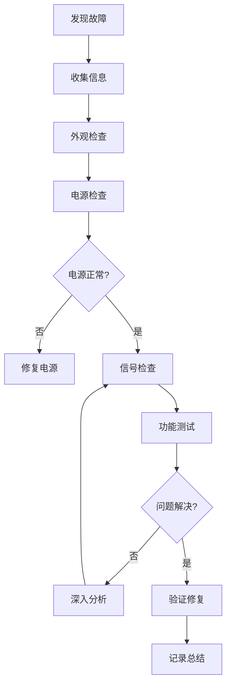

# 硬件故障排查指南：系统化的硬件调试方法


## 学习目标

完成本教程后，你将能够:

- [ ] 理解硬件故障的常见类型和表现形式
- [ ] 掌握系统化的硬件故障排查流程
- [ ] 使用万用表进行基本的电路测试
- [ ] 识别和诊断电源相关问题
- [ ] 排查通信接口故障（I2C、SPI、UART）
- [ ] 检测和修复焊接问题
- [ ] 使用示波器和逻辑分析仪分析信号
- [ ] 建立硬件故障排查的知识库

## 前置要求

在开始本教程之前，你需要:

**知识要求**:
- 了解基本的电路原理（欧姆定律、基尔霍夫定律）
- 熟悉常用电子元器件（电阻、电容、二极管、三极管）
- 了解数字电路基础（高低电平、时钟信号）
- 掌握嵌入式系统基本概念

**技能要求**:
- 会使用万用表测量电压、电流、电阻
- 能够阅读电路原理图
- 了解基本的焊接技术
- 会使用基本的调试工具

## 准备工作

### 硬件工具

| 名称 | 数量 | 说明 | 参考价格 |
|------|------|------|----------|
| 数字万用表 | 1 | 测量电压、电流、电阻 | 50-500元 |
| 示波器 | 1 | 观察信号波形（可选） | 500-5000元 |
| 逻辑分析仪 | 1 | 分析数字信号（可选） | 30-500元 |
| 电烙铁 | 1 | 焊接和拆焊 | 50-300元 |
| 放大镜/显微镜 | 1 | 检查焊点和元器件 | 20-200元 |
| 镊子套装 | 1套 | 操作小元器件 | 10-50元 |
| 测试线 | 若干 | 连接测试点 | 10-30元 |
| 热风枪 | 1 | 拆焊贴片元件（可选） | 100-500元 |

### 软件工具

- **电路仿真软件**: LTspice、Multisim（可选）
- **原理图查看器**: KiCad、Altium Viewer
- **数据手册**: 芯片和元器件的官方文档
- **测试程序**: 用于验证硬件功能的固件

### 安全注意事项

**电气安全**:
- 断电后再进行硬件操作
- 注意高压电路（如电源适配器）
- 使用绝缘工具
- 避免短路

**静电防护**:
- 使用防静电手环
- 在防静电垫上操作
- 避免直接触摸芯片引脚

**工具安全**:
- 电烙铁使用后放在支架上
- 热风枪远离易燃物品
- 保持工作区域整洁


## 步骤1: 理解硬件故障类型

### 1.1 硬件故障分类

**按故障性质分类**:

1. **完全失效**: 设备完全无法工作
   - 无法上电
   - 无任何响应
   - LED不亮

2. **部分失效**: 部分功能正常，部分功能异常
   - 某个外设无法工作
   - 某些引脚无输出
   - 通信时断时续

3. **性能下降**: 功能正常但性能不达标
   - 运行速度变慢
   - 通信速率降低
   - 功耗异常增加

4. **间歇性故障**: 问题不稳定，时好时坏
   - 偶尔死机
   - 温度相关故障
   - 接触不良

**按故障原因分类**:

1. **设计问题**:
   - 电路设计错误
   - 元器件选型不当
   - PCB布局不合理
   - 时序不满足要求

2. **制造问题**:
   - 焊接不良（虚焊、短路）
   - 元器件装反
   - PCB制造缺陷
   - 元器件质量问题

3. **使用问题**:
   - 静电损坏
   - 过压/过流
   - 机械损伤
   - 环境因素（温度、湿度）

4. **老化问题**:
   - 元器件老化
   - 焊点氧化
   - 电解电容失效
   - 晶振频率漂移

### 1.2 常见故障表现

**电源相关**:
- 上电无反应
- 电压不稳定
- 发热严重
- 电流异常

**通信相关**:
- 无法通信
- 数据错误
- 通信中断
- 速率异常

**信号相关**:
- 无输出信号
- 信号电平异常
- 波形失真
- 时序错误

**功能相关**:
- 外设无响应
- 传感器读数异常
- 执行器不动作
- 存储器读写错误

### 1.3 故障诊断思路

**系统化排查流程**:



**排查原则**:
1. **从简单到复杂**: 先检查明显问题，再深入分析
2. **从外到内**: 先检查外部连接，再检查内部电路
3. **从电源到信号**: 先确保电源正常，再检查信号
4. **分而治之**: 将系统分成模块，逐个排查
5. **对比法**: 与正常设备对比，找出差异


## 步骤2: 外观检查

外观检查是最快速、最直接的故障排查方法，很多问题可以通过肉眼观察发现。

### 2.1 PCB板检查

**检查项目**:

1. **焊点检查**:
   - 虚焊：焊点不饱满，有裂纹
   - 短路：相邻焊盘连接
   - 冷焊：焊点表面粗糙、无光泽
   - 漏焊：引脚未焊接

**识别方法**:
```
良好焊点特征：
- 表面光滑有光泽
- 呈火山口形状
- 焊料均匀覆盖
- 无裂纹和气孔

不良焊点特征：
- 表面粗糙暗淡
- 焊料堆积或不足
- 有明显裂纹
- 引脚露出过多
```

2. **元器件检查**:
   - 元器件是否装反（注意极性）
   - 元器件是否损坏（烧焦、变色）
   - 元器件型号是否正确
   - 元器件是否松动

**常见错误**:
- 电解电容装反（注意负极标记）
- 二极管装反（注意阴极标记）
- IC方向错误（注意1脚标记）
- 晶振未焊接或虚焊

3. **PCB板检查**:
   - 是否有断线
   - 是否有短路（锡渣、毛刺）
   - 是否有裂纹
   - 是否有腐蚀

**检查工具**:
- 放大镜（5-10倍）
- 显微镜（20-40倍，用于贴片元件）
- 强光手电（侧光观察焊点）

### 2.2 连接检查

**检查项目**:

1. **电源连接**:
   - 电源线是否连接
   - 电源极性是否正确
   - 电源开关是否打开
   - 保险丝是否熔断

2. **信号连接**:
   - 排线是否插好
   - 跳线帽是否正确
   - 接插件是否松动
   - 引脚是否弯曲

3. **外部设备**:
   - 传感器是否连接
   - 执行器是否连接
   - 调试器是否连接
   - 天线是否安装（无线模块）

### 2.3 环境检查

**检查项目**:

1. **温度**:
   - 芯片是否过热（用手触摸）
   - 电源芯片是否烫手
   - 是否有烧焦气味

2. **湿度**:
   - 是否有水渍
   - 是否有凝露
   - 是否有腐蚀

3. **机械损伤**:
   - PCB是否弯曲
   - 元器件是否脱落
   - 引脚是否断裂

### 2.4 外观检查清单

**快速检查清单**:

```markdown
□ 电源连接正确
□ 电源开关打开
□ 保险丝完好
□ 无明显烧焦痕迹
□ 无明显短路
□ 元器件方向正确
□ 焊点饱满无虚焊
□ 无断线和裂纹
□ 排线和接插件连接牢固
□ 无异常发热
□ 无水渍和腐蚀
```


## 步骤3: 电源系统检查

电源是硬件系统的基础，大部分硬件故障都与电源有关。

### 3.1 电压测量

**测量方法**:

1. **使用万用表测量电压**:
   ```
   步骤：
   1. 将万用表调到直流电压档（DCV）
   2. 选择合适的量程（如20V）
   3. 红表笔接测试点，黑表笔接GND
   4. 读取电压值
   ```

2. **关键测试点**:
   - 电源输入端（如5V、12V）
   - 稳压器输出端（如3.3V）
   - MCU电源引脚（VDD）
   - 外设电源引脚
   - 参考电压（VREF）

**正常电压范围**:
```
3.3V系统：3.0V - 3.6V（典型值3.3V）
5V系统：4.5V - 5.5V（典型值5.0V）
12V系统：11V - 13V（典型值12.0V）

注意：超出范围可能损坏器件！
```

### 3.2 电流测量

**测量方法**:

1. **串联测量**:
   ```
   步骤：
   1. 断开电源
   2. 将万用表串联到电路中
   3. 万用表调到电流档（DCA）
   4. 选择合适的量程
   5. 上电并读取电流值
   ```

2. **注意事项**:
   - 电流测量需要串联，不能并联
   - 选择合适的量程，避免烧毁表笔
   - 测量大电流时注意表笔发热
   - 测量时间不宜过长

**正常电流范围**:
```
STM32F103（72MHz）：约30-50mA
ESP32（WiFi关闭）：约80-160mA
ESP32（WiFi开启）：约160-260mA
Arduino Uno：约50mA

异常情况：
- 电流过大：可能短路或元器件损坏
- 电流过小：可能断路或未工作
- 电流为0：电路断开或保护
```

### 3.3 电源纹波测量

**使用示波器测量**:

1. **测量方法**:
   ```
   步骤：
   1. 示波器探头接电源输出端
   2. 设置AC耦合模式
   3. 调整垂直档位（如50mV/div）
   4. 观察纹波波形
   ```

2. **纹波标准**:
   ```
   3.3V电源纹波：< 50mV（峰峰值）
   5V电源纹波：< 100mV（峰峰值）
   
   纹波过大可能导致：
   - 系统不稳定
   - 通信错误
   - ADC精度下降
   - 偶发性死机
   ```

### 3.4 常见电源问题

**问题1: 电压为0**

**可能原因**:
- 电源未连接
- 保险丝熔断
- 稳压器损坏
- 短路导致保护

**排查方法**:
1. 检查电源输入
2. 检查保险丝
3. 断开负载，测量空载电压
4. 检查是否短路

**问题2: 电压偏低**

**可能原因**:
- 负载过大
- 稳压器性能不足
- 电源线压降
- 稳压器损坏

**排查方法**:
1. 测量空载电压
2. 测量负载电流
3. 检查电源线阻抗
4. 更换稳压器测试

**问题3: 电压不稳定**

**可能原因**:
- 电源纹波过大
- 滤波电容失效
- 接触不良
- 负载波动

**排查方法**:
1. 测量纹波
2. 检查滤波电容
3. 检查连接
4. 添加去耦电容

**问题4: 发热严重**

**可能原因**:
- 短路
- 负载过大
- 稳压器效率低
- 散热不良

**排查方法**:
1. 测量电流
2. 检查是否短路
3. 检查散热片
4. 降低负载测试


## 步骤4: 信号完整性检查

### 4.1 数字信号检查

**使用万用表检查**:

1. **静态电平测量**:
   ```
   高电平（3.3V系统）：2.4V - 3.6V
   低电平（3.3V系统）：0V - 0.8V
   
   高电平（5V系统）：3.5V - 5.5V
   低电平（5V系统）：0V - 1.5V
   ```

2. **测量方法**:
   - 测量GPIO输出电平
   - 测量时钟信号（会显示平均值）
   - 测量复位信号
   - 测量使能信号

**使用示波器检查**:

1. **波形观察**:
   - 上升沿和下降沿
   - 信号幅度
   - 频率和周期
   - 占空比

2. **时序测量**:
   - 建立时间（Setup Time）
   - 保持时间（Hold Time）
   - 传播延迟
   - 时钟抖动

**使用逻辑分析仪检查**:

1. **协议分析**:
   - I2C通信
   - SPI通信
   - UART通信
   - CAN总线

2. **时序分析**:
   - 多通道同步
   - 时序关系
   - 协议违例
   - 数据完整性

### 4.2 时钟信号检查

**晶振检查**:

1. **外观检查**:
   - 晶振是否焊接牢固
   - 负载电容是否正确
   - 是否有裂纹

2. **电压测量**:
   ```
   正常情况：
   - 晶振两端电压约为VDD/2
   - 如果一端为0V或VDD，可能未起振
   ```

3. **波形测量**:
   ```
   使用示波器（10x探头）：
   - 频率是否正确
   - 幅度是否足够（>0.5V）
   - 波形是否稳定
   
   注意：探头负载可能影响晶振起振
   ```

**常见晶振问题**:

**问题1: 晶振不起振**

**可能原因**:
- 负载电容不匹配
- 晶振损坏
- PCB走线过长
- 驱动能力不足

**解决方法**:
1. 检查负载电容值（通常10-22pF）
2. 更换晶振测试
3. 缩短走线长度
4. 调整驱动电流

**问题2: 频率不准确**

**可能原因**:
- 负载电容不正确
- 温度影响
- 晶振老化
- 寄生电容

**解决方法**:
1. 调整负载电容
2. 使用温补晶振
3. 更换晶振
4. 优化PCB布局

### 4.3 复位信号检查

**复位电路检查**:

1. **上电复位**:
   ```
   正常波形：
   - 上电时复位信号为低电平
   - 延时后变为高电平
   - 保持高电平
   
   异常情况：
   - 一直为低电平：复位电路故障
   - 抖动：电源不稳定或RC参数不当
   - 无复位：复位电路失效
   ```

2. **手动复位**:
   ```
   按下复位按钮：
   - 复位信号变为低电平
   - 释放后恢复高电平
   - MCU重新启动
   ```

**常见复位问题**:

**问题1: 无法复位**

**可能原因**:
- 复位按钮损坏
- 复位电路故障
- 复位引脚配置错误

**解决方法**:
1. 检查复位按钮
2. 测量复位电路
3. 检查软件配置

**问题2: 频繁复位**

**可能原因**:
- 电源不稳定
- 看门狗超时
- 软件死循环
- 电磁干扰

**解决方法**:
1. 稳定电源
2. 检查看门狗配置
3. 调试软件
4. 添加滤波电容


## 步骤5: 通信接口故障排查

### 5.1 I2C总线故障

**硬件检查**:

1. **上拉电阻检查**:
   ```
   测量方法：
   1. 断电状态下测量SCL和SDA到VDD的电阻
   2. 正常值：2.2kΩ - 10kΩ
   3. 如果阻值很大或无穷大，上拉电阻缺失
   4. 如果阻值很小，可能短路
   ```

2. **电平检查**:
   ```
   空闲状态：
   - SCL和SDA都应为高电平（接近VDD）
   - 如果为低电平，可能有设备拉低总线
   
   通信时：
   - 使用逻辑分析仪观察波形
   - 检查起始条件和停止条件
   - 验证ACK/NACK信号
   ```

**常见I2C问题**:

**问题1: 无ACK响应**

**可能原因**:
- 设备地址错误
- 设备未上电
- 上拉电阻缺失
- SCL/SDA接反

**排查方法**:
1. 确认设备地址（7位或8位）
2. 检查设备电源
3. 测量上拉电阻
4. 检查引脚连接

**问题2: 总线被拉低**

**可能原因**:
- 某个设备故障
- 软件未释放总线
- 短路

**排查方法**:
1. 逐个断开设备，找出故障设备
2. 复位MCU
3. 检查是否短路

**问题3: 通信速率过高**

**可能原因**:
- 上拉电阻过小
- 总线电容过大
- 线缆过长

**排查方法**:
1. 降低I2C时钟频率
2. 增大上拉电阻
3. 缩短线缆长度

### 5.2 SPI总线故障

**硬件检查**:

1. **信号检查**:
   ```
   使用逻辑分析仪：
   - SCK：时钟信号是否正常
   - MOSI：主机发送数据
   - MISO：从机返回数据
   - CS：片选信号（低电平有效）
   ```

2. **时序检查**:
   ```
   关键参数：
   - 时钟频率
   - 时钟极性（CPOL）
   - 时钟相位（CPHA）
   - 建立时间和保持时间
   ```

**常见SPI问题**:

**问题1: 无数据返回**

**可能原因**:
- CS信号未拉低
- MISO线断开
- 从机未响应
- 时序不匹配

**排查方法**:
1. 检查CS信号
2. 测量MISO电平
3. 检查从机电源
4. 验证CPOL和CPHA设置

**问题2: 数据错误**

**可能原因**:
- 时钟频率过高
- 建立时间不足
- 线缆干扰
- 时序参数错误

**排查方法**:
1. 降低SPI时钟频率
2. 测量时序参数
3. 缩短线缆
4. 检查CPOL/CPHA配置

### 5.3 UART通信故障

**硬件检查**:

1. **连接检查**:
   ```
   正确连接：
   MCU_TX → 对方_RX
   MCU_RX → 对方_TX
   GND → GND
   
   常见错误：
   - TX和RX接反
   - GND未连接
   - 电平不匹配（3.3V vs 5V）
   ```

2. **电平检查**:
   ```
   空闲状态：
   - TX应为高电平
   - 如果为低电平，可能短路或配置错误
   ```

**常见UART问题**:

**问题1: 乱码**

**可能原因**:
- 波特率不匹配
- 数据位/停止位/校验位不一致
- 电平不匹配
- 晶振频率不准

**排查方法**:
1. 确认波特率设置
2. 确认数据格式（8N1）
3. 检查电平转换
4. 测量晶振频率

**问题2: 无输出**

**可能原因**:
- TX引脚配置错误
- TX和RX接反
- 串口未初始化
- 线缆断开

**排查方法**:
1. 检查引脚配置
2. 检查连接
3. 测试程序
4. 测量TX电平

### 5.4 CAN总线故障

**硬件检查**:

1. **终端电阻检查**:
   ```
   测量方法：
   1. 断电状态下测量CAN_H和CAN_L之间的电阻
   2. 正常值：约60Ω（两个120Ω并联）
   3. 如果阻值很大，终端电阻缺失
   4. 如果阻值很小，可能短路
   ```

2. **差分电压检查**:
   ```
   隐性状态（空闲）：
   - CAN_H：约2.5V
   - CAN_L：约2.5V
   - 差分电压：约0V
   
   显性状态（传输）：
   - CAN_H：约3.5V
   - CAN_L：约1.5V
   - 差分电压：约2V
   ```

**常见CAN问题**:

**问题1: 无法通信**

**可能原因**:
- 终端电阻缺失
- 波特率不匹配
- CAN_H和CAN_L接反
- 收发器损坏

**排查方法**:
1. 检查终端电阻
2. 确认波特率
3. 检查连接
4. 更换收发器测试

**问题2: 错误帧过多**

**可能原因**:
- 线缆质量差
- 线缆过长
- 电磁干扰
- 终端电阻不匹配

**排查方法**:
1. 使用屏蔽双绞线
2. 缩短线缆长度
3. 远离干扰源
4. 检查终端电阻


## 步骤6: 元器件故障检测

### 6.1 电阻检测

**测量方法**:

1. **在线测量**:
   ```
   注意事项：
   - 断电后测量
   - 可能受并联电路影响
   - 结果仅供参考
   ```

2. **离线测量**:
   ```
   步骤：
   1. 断电
   2. 焊下一端引脚
   3. 测量电阻值
   4. 对比标称值
   ```

**故障判断**:
```
正常：阻值在标称值±5%范围内
开路：阻值无穷大
短路：阻值接近0Ω
变值：阻值偏离标称值较大
```

### 6.2 电容检测

**测量方法**:

1. **使用万用表电容档**:
   ```
   步骤：
   1. 断电并放电
   2. 焊下电容
   3. 测量电容值
   4. 对比标称值
   ```

2. **简易测试**:
   ```
   使用万用表电阻档：
   1. 测量电容两端
   2. 观察阻值变化
   3. 正常：阻值从小变大
   4. 短路：阻值一直很小
   5. 开路：阻值一直很大
   ```

**电解电容检测**:
```
正常：
- 容值在标称值±20%范围内
- 无漏液
- 无鼓包

故障：
- 容值严重偏离
- 顶部鼓包
- 漏液
- ESR过大
```

### 6.3 二极管检测

**测量方法**:

1. **使用万用表二极管档**:
   ```
   正向测量：
   - 红表笔接阳极，黑表笔接阴极
   - 正常：显示0.5-0.7V（硅二极管）
   - 短路：显示0V或很小
   - 开路：显示OL（溢出）
   
   反向测量：
   - 红表笔接阴极，黑表笔接阳极
   - 正常：显示OL（溢出）
   - 击穿：显示电压值
   ```

2. **LED检测**:
   ```
   使用万用表二极管档：
   - 正向：LED微亮，显示1.8-3.0V
   - 反向：不亮，显示OL
   ```

### 6.4 三极管检测

**NPN三极管检测**:

```
使用万用表二极管档：

1. 判断基极（B）：
   - 红表笔接某一脚，黑表笔分别接另外两脚
   - 如果都导通（显示0.5-0.7V），该脚为基极
   
2. 判断集电极（C）和发射极（E）：
   - 红表笔接基极，黑表笔接另一脚
   - 测量正向压降
   - 压降较小的为发射极，较大的为集电极
```

**PNP三极管检测**:
```
与NPN相反：
- 黑表笔接基极，红表笔接另外两脚
- 都导通则该脚为基极
```

### 6.5 集成电路检测

**基本检查**:

1. **电源引脚**:
   ```
   测量VDD和GND之间的电压：
   - 正常：接近标称电压
   - 短路：接近0V
   - 开路：无电压
   ```

2. **输入输出引脚**:
   ```
   测量各引脚电平：
   - 对比数据手册
   - 检查是否异常
   ```

3. **温度检查**:
   ```
   用手触摸芯片：
   - 正常：微温或常温
   - 异常：烫手（可能短路或损坏）
   ```

**替换测试**:
```
如果怀疑芯片损坏：
1. 准备相同型号的芯片
2. 更换后测试
3. 如果问题解决，确认原芯片损坏
4. 如果问题依旧，检查其他部分
```

### 6.6 晶振检测

**测量方法**:

1. **电阻测量**:
   ```
   断电状态：
   - 测量晶振两端电阻
   - 正常：几十MΩ到无穷大
   - 短路：接近0Ω
   - 开路：无穷大（可能正常）
   ```

2. **电容测量**:
   ```
   使用电容表：
   - 测量晶振等效电容
   - 正常：几pF到几十pF
   - 开路：0pF或很小
   ```

3. **替换测试**:
   ```
   最可靠的方法：
   - 更换相同规格的晶振
   - 测试是否正常工作
   ```


## 步骤7: 焊接问题排查与修复

### 7.1 识别焊接问题

**虚焊（Cold Solder Joint）**:

**特征**:
- 焊点表面粗糙、无光泽
- 焊料与引脚或焊盘接触不良
- 可能有裂纹

**识别方法**:
- 用放大镜观察焊点
- 轻轻拨动元器件，看是否松动
- 用万用表测量，可能时通时断

**修复方法**:
```
步骤：
1. 清理焊点（去除氧化层）
2. 加助焊剂
3. 重新加热焊接
4. 确保焊料充分熔化并润湿
5. 冷却后检查焊点质量
```

**短路（Solder Bridge）**:

**特征**:
- 相邻焊盘或引脚被焊料连接
- 焊料过多形成桥接

**识别方法**:
- 用放大镜仔细观察
- 用万用表测量相邻引脚电阻
- 检查是否有意外的导通

**修复方法**:
```
方法1：吸锡带
1. 将吸锡带放在短路处
2. 用烙铁加热
3. 焊料被吸锡带吸走
4. 清理残留

方法2：吸锡器
1. 用烙铁熔化焊料
2. 用吸锡器吸走多余焊料
3. 重复直到短路消除

方法3：重新焊接
1. 加热短路处
2. 用烙铁尖分离焊料
3. 清理并重新焊接
```

**漏焊（Missing Solder）**:

**特征**:
- 引脚未焊接
- 焊盘上无焊料

**识别方法**:
- 目视检查
- 用万用表测量连通性

**修复方法**:
```
步骤：
1. 清理焊盘和引脚
2. 涂助焊剂
3. 焊接引脚
4. 检查焊点质量
```

### 7.2 贴片元件焊接

**手工焊接方法**:

1. **电阻/电容焊接**:
   ```
   步骤：
   1. 在一个焊盘上预先上锡
   2. 用镊子夹住元件
   3. 加热焊盘，将元件放上去
   4. 移开烙铁，元件固定
   5. 焊接另一端
   6. 回焊第一端（补焊）
   ```

2. **IC芯片焊接**:
   ```
   步骤：
   1. 在对角焊盘上预先上锡
   2. 对齐芯片位置
   3. 焊接对角两个引脚固定
   4. 检查对齐
   5. 逐个焊接其他引脚
   6. 检查是否有短路
   7. 用吸锡带清理多余焊料
   ```

**热风枪焊接**:

```
步骤：
1. 在焊盘上涂锡膏
2. 放置元件
3. 设置热风枪温度（约350°C）
4. 均匀加热
5. 观察焊料熔化
6. 移开热风枪
7. 冷却后检查
```

### 7.3 拆焊技巧

**直插元件拆焊**:

```
方法1：吸锡器
1. 用烙铁熔化焊点
2. 用吸锡器吸走焊料
3. 重复直到焊料清除
4. 轻轻拔出元件

方法2：吸锡带
1. 将吸锡带放在焊点上
2. 用烙铁加热
3. 焊料被吸走
4. 拔出元件
```

**贴片元件拆焊**:

```
方法1：双头烙铁
1. 同时加热两端
2. 用镊子取下元件

方法2：热风枪
1. 设置温度（约350°C）
2. 均匀加热元件
3. 观察焊料熔化
4. 用镊子取下元件

方法3：低熔点合金
1. 在焊点上加低熔点合金
2. 降低熔点
3. 更容易拆焊
```

**IC芯片拆焊**:

```
方法1：热风枪（推荐）
1. 设置温度（约380°C）
2. 均匀加热芯片
3. 观察焊料熔化
4. 用镊子轻轻提起芯片
5. 清理焊盘

方法2：拖焊
1. 在引脚上涂大量助焊剂
2. 用烙铁拖过所有引脚
3. 焊料熔化后取下芯片
4. 清理焊盘
```

### 7.4 焊接质量检查

**检查清单**:

```markdown
□ 焊点饱满，呈火山口形状
□ 焊点表面光滑有光泽
□ 焊料均匀覆盖焊盘和引脚
□ 无裂纹和气孔
□ 无短路和桥接
□ 无虚焊和冷焊
□ 元器件位置正确
□ 元器件方向正确
□ 无多余焊料和助焊剂残留
```

**测试方法**:
1. 目视检查（使用放大镜）
2. 万用表测量连通性
3. 轻轻拨动元件，检查是否牢固
4. 上电测试功能


## 步骤8: 实际案例分析

### 案例1: 系统无法上电

**故障现象**:
- 连接电源后无任何反应
- LED不亮
- 无法通过串口通信

**排查过程**:

1. **检查电源输入**:
   ```
   测量电源输入端电压：
   - 结果：5V正常
   - 结论：电源输入正常
   ```

2. **检查稳压器输出**:
   ```
   测量3.3V稳压器输出：
   - 结果：0V
   - 结论：稳压器无输出
   ```

3. **检查稳压器输入**:
   ```
   测量稳压器输入端：
   - 结果：5V正常
   - 结论：输入正常，稳压器可能损坏
   ```

4. **检查负载**:
   ```
   断开负载，测量空载输出：
   - 结果：仍为0V
   - 结论：稳压器损坏，非负载问题
   ```

5. **更换稳压器**:
   ```
   更换AMS1117-3.3：
   - 结果：输出3.3V正常
   - 系统正常启动
   ```

**根本原因**: 稳压器损坏（可能因过流或静电）

**预防措施**:
- 添加输入保护（TVS二极管）
- 添加输出滤波电容
- 注意静电防护

### 案例2: I2C传感器无响应

**故障现象**:
- I2C传感器读取失败
- 程序返回NACK错误
- 其他I2C设备正常

**排查过程**:

1. **检查设备地址**:
   ```
   使用I2C扫描程序：
   - 结果：未发现传感器地址
   - 结论：传感器未响应
   ```

2. **检查电源**:
   ```
   测量传感器VDD引脚：
   - 结果：3.3V正常
   - 结论：电源正常
   ```

3. **检查上拉电阻**:
   ```
   测量SCL和SDA到VDD的电阻：
   - 结果：4.7kΩ正常
   - 结论：上拉电阻正常
   ```

4. **检查信号**:
   ```
   使用逻辑分析仪：
   - SCL：正常
   - SDA：一直为低电平
   - 结论：SDA被拉低
   ```

5. **检查焊接**:
   ```
   用放大镜检查传感器焊点：
   - 发现SDA引脚虚焊
   - 重新焊接后正常
   ```

**根本原因**: SDA引脚虚焊导致接触不良

**预防措施**:
- 焊接后仔细检查
- 使用放大镜检查焊点
- 测试所有功能

### 案例3: 系统偶尔死机

**故障现象**:
- 系统运行一段时间后死机
- 死机时间不固定
- 复位后恢复正常

**排查过程**:

1. **检查电源稳定性**:
   ```
   使用示波器测量电源纹波：
   - 结果：纹波约150mV（峰峰值）
   - 标准：<50mV
   - 结论：电源纹波过大
   ```

2. **检查滤波电容**:
   ```
   检查电源输出端电容：
   - 发现10uF电容鼓包
   - 测量ESR过大
   - 结论：电容失效
   ```

3. **更换电容**:
   ```
   更换为新的10uF电容：
   - 测量纹波降至30mV
   - 系统稳定运行
   ```

4. **长时间测试**:
   ```
   连续运行24小时：
   - 无死机现象
   - 问题解决
   ```

**根本原因**: 滤波电容失效导致电源纹波过大

**预防措施**:
- 使用高质量电容
- 定期检查电容状态
- 添加足够的去耦电容

### 案例4: UART通信乱码

**故障现象**:
- 串口输出乱码
- 无法识别字符
- 偶尔有正确字符

**排查过程**:

1. **检查波特率**:
   ```
   确认软件配置：
   - 代码：115200
   - 串口工具：115200
   - 结论：波特率设置一致
   ```

2. **检查晶振**:
   ```
   使用示波器测量晶振频率：
   - 标称值：8MHz
   - 实测值：7.95MHz
   - 误差：0.625%
   - 结论：晶振频率偏差
   ```

3. **计算波特率误差**:
   ```
   实际波特率 = 115200 × (7.95/8)
                = 114345
   误差 = (114345-115200)/115200
        = -0.74%
   
   结论：误差在可接受范围内（<2%）
   ```

4. **检查负载电容**:
   ```
   测量晶振两端电容：
   - 标称值：22pF
   - 实测值：10pF
   - 结论：负载电容不匹配
   ```

5. **更换负载电容**:
   ```
   更换为22pF电容：
   - 测量频率：8.00MHz
   - 串口通信正常
   ```

**根本原因**: 负载电容不匹配导致晶振频率偏差

**预防措施**:
- 使用数据手册推荐的负载电容
- 测量晶振频率验证
- 使用高精度晶振


## 高级调试技巧

### 技巧1: 分区隔离法

**原理**: 将系统分成多个区域，逐个排查

**步骤**:
1. 将系统分为：电源、时钟、MCU、外设等模块
2. 从电源开始，逐个验证
3. 确认一个模块正常后，再检查下一个
4. 缩小故障范围

**示例**:
```
系统无法工作：
1. 检查电源 → 正常
2. 检查时钟 → 正常
3. 检查MCU → 正常
4. 检查外设 → 发现传感器故障
```

### 技巧2: 对比测试法

**原理**: 与正常设备对比，找出差异

**方法**:
1. 准备一个正常工作的设备
2. 对比测量关键测试点
3. 找出电压、信号等差异
4. 定位故障位置

**示例**:
```
对比测量：
正常设备：VDD = 3.30V, VREF = 1.65V
故障设备：VDD = 3.28V, VREF = 0.00V
结论：VREF电路故障
```

### 技巧3: 替换排除法

**原理**: 逐个替换元器件，找出故障件

**步骤**:
1. 列出可疑元器件
2. 逐个替换测试
3. 观察问题是否解决
4. 确定故障元器件

**注意事项**:
- 一次只替换一个元器件
- 使用相同规格的元器件
- 记录替换过程
- 避免引入新问题

### 技巧4: 最小系统法

**原理**: 从最小系统开始，逐步添加模块

**步骤**:
1. 搭建最小系统（MCU + 电源 + 时钟）
2. 验证最小系统正常
3. 逐个添加外设模块
4. 找出导致故障的模块

**示例**:
```
最小系统：
1. MCU + 电源 + 晶振 → 正常
2. 添加串口 → 正常
3. 添加I2C传感器 → 正常
4. 添加SPI Flash → 故障
结论：SPI Flash或其电路有问题
```

### 技巧5: 波形对比法

**原理**: 对比正常和异常波形，找出差异

**工具**: 示波器或逻辑分析仪

**方法**:
1. 捕获正常设备的波形
2. 捕获故障设备的波形
3. 对比波形差异
4. 分析差异原因

**示例**:
```
I2C波形对比：
正常：起始条件清晰，ACK正常
异常：SDA上升沿缓慢，无ACK
结论：上拉电阻过大或SDA负载过重
```

### 技巧6: 热敏测试法

**原理**: 利用温度变化观察故障

**方法**:
1. 使用冷冻喷雾降温
2. 使用热风枪加热
3. 观察故障变化
4. 定位温度敏感元件

**应用场景**:
- 虚焊检测（加热时故障出现）
- 元器件老化（温度变化时性能下降）
- 热敏电阻问题

**注意事项**:
- 温度变化不要过快
- 避免过热损坏元器件
- 注意安全

### 技巧7: 电流追踪法

**原理**: 通过测量电流找出异常

**方法**:
1. 测量总电流
2. 逐个断开模块
3. 观察电流变化
4. 找出异常耗电模块

**示例**:
```
正常电流：50mA
实测电流：200mA

断开模块测试：
- 断开LCD：180mA
- 断开WiFi：150mA
- 断开传感器：50mA ← 正常
结论：WiFi模块异常耗电
```

## 故障排查工具箱

### 必备工具清单

**测量工具**:
- [ ] 数字万用表（电压、电流、电阻、二极管、电容）
- [ ] 示波器（观察波形，可选）
- [ ] 逻辑分析仪（协议分析，可选）
- [ ] 电流表（精确测量电流）
- [ ] 温度计（测量温度）

**焊接工具**:
- [ ] 电烙铁（温控，推荐）
- [ ] 焊锡丝（0.5-0.8mm）
- [ ] 助焊剂
- [ ] 吸锡带
- [ ] 吸锡器
- [ ] 热风枪（拆焊贴片，可选）

**辅助工具**:
- [ ] 放大镜/显微镜
- [ ] 镊子（尖头、弯头）
- [ ] 小刀/刮刀
- [ ] 刷子（清洁）
- [ ] 防静电手环
- [ ] 防静电垫

**耗材**:
- [ ] 常用电阻、电容
- [ ] 常用二极管、三极管
- [ ] 稳压器（AMS1117、LM2596等）
- [ ] 晶振（8MHz、16MHz等）
- [ ] 杜邦线、测试线

### 软件工具

**电路仿真**:
- LTspice（免费）
- Multisim（商业）
- Proteus（商业）

**原理图查看**:
- KiCad（免费）
- Altium Viewer（免费）
- Eagle（商业）

**数据手册**:
- 芯片厂商官网
- Datasheet Archive
- Alldatasheet

**测试程序**:
- 串口测试程序
- I2C扫描程序
- GPIO测试程序
- 外设测试程序

## 最佳实践

### 1. 故障排查流程

**标准流程**:

1. **收集信息**:
   - 故障现象描述
   - 发生时间和条件
   - 之前的操作
   - 环境因素

2. **外观检查**:
   - PCB板检查
   - 元器件检查
   - 连接检查
   - 环境检查

3. **电源检查**:
   - 电压测量
   - 电流测量
   - 纹波测量
   - 发热检查

4. **信号检查**:
   - 时钟信号
   - 复位信号
   - 通信信号
   - 控制信号

5. **功能测试**:
   - 最小系统测试
   - 模块功能测试
   - 接口测试
   - 性能测试

6. **修复验证**:
   - 修复故障
   - 功能验证
   - 长时间测试
   - 记录总结

### 2. 安全注意事项

**DO（推荐做法）**:
- ✅ 断电后再进行硬件操作
- ✅ 使用防静电手环
- ✅ 在防静电垫上操作
- ✅ 使用绝缘工具
- ✅ 记录测量数据
- ✅ 拍照记录原始状态

**DON'T（避免做法）**:
- ❌ 带电操作硬件
- ❌ 直接触摸芯片引脚
- ❌ 使用过高电压测试
- ❌ 短路电源
- ❌ 盲目更换元器件
- ❌ 不记录修改过程

### 3. 文档记录

**建议记录的内容**:

```markdown
## 故障记录

**日期**: 2024-01-15
**设备**: STM32开发板 v1.2
**故障现象**: 系统无法上电

**排查过程**:
1. 检查电源输入：5V正常
2. 检查稳压器输出：0V异常
3. 检查稳压器输入：5V正常
4. 断开负载测试：仍为0V
5. 结论：稳压器损坏

**解决方案**:
更换AMS1117-3.3稳压器

**验证结果**:
系统正常启动，运行24小时无异常

**根本原因**:
稳压器因过流损坏

**预防措施**:
1. 添加输入保护（TVS二极管）
2. 添加输出滤波电容
3. 注意静电防护

**照片**:
- 故障前照片
- 测量数据照片
- 修复后照片
```

### 4. 经验积累

**建立故障库**:
- 记录常见故障和解决方法
- 分类整理（电源、通信、信号等）
- 定期更新和完善
- 团队共享

**学习提升**:
- 阅读数据手册
- 学习电路原理
- 观看教学视频
- 参与技术论坛
- 实践练习


## 总结

通过本教程，你已经学习了:

- ✅ 硬件故障的常见类型和表现形式
- ✅ 系统化的硬件故障排查流程
- ✅ 使用万用表进行电路测试的方法
- ✅ 电源系统的检查和故障诊断
- ✅ 信号完整性的检查方法
- ✅ 通信接口故障的排查技巧
- ✅ 元器件故障的检测方法
- ✅ 焊接问题的识别和修复
- ✅ 实际案例的分析和解决
- ✅ 高级调试技巧和最佳实践

**关键要点**:
1. 硬件故障排查需要系统化的方法，从简单到复杂
2. 电源是硬件系统的基础，优先检查电源
3. 外观检查可以快速发现明显问题
4. 使用万用表是最基本的测试方法
5. 示波器和逻辑分析仪可以提供更详细的信息
6. 焊接质量直接影响硬件可靠性
7. 记录故障排查过程，积累经验
8. 安全第一，注意静电防护

**硬件调试的核心思想**:
- 分而治之：将复杂问题分解为简单问题
- 对比分析：与正常状态对比找出差异
- 逐步排除：从可能性大的原因开始排查
- 验证假设：每个假设都要通过测试验证
- 记录总结：积累经验，建立知识库

## 下一步学习

建议继续学习以下内容:

### 初级进阶
- [串口调试技巧大全](./03-serial-debugging.html) - 软件调试方法
- [逻辑分析仪使用入门](./04-logic-analyzer.html) - 数字信号分析
- [常见Bug调试方法](./05-bug-debugging-methods.html) - 系统化调试思路

### 中级进阶
- [示波器在嵌入式调试中的应用](../intermediate/03-oscilloscope-debugging.html) - 模拟信号分析
- [OpenOCD调试工具使用](../intermediate/01-openocd.html) - 开源调试方案
- [J-Link调试器高级功能](../intermediate/02-jlink-advanced.html) - 专业调试工具

### 高级进阶
- [单元测试框架搭建](../advanced/01-unit-testing-framework.html) - 自动化测试
- [硬件在环(HIL)测试系统](../advanced/02-hil-testing-system.html) - 系统级测试

## 实践项目建议

### 项目1: 电源故障诊断
**难度**: ⭐⭐
**目标**: 诊断和修复电源问题
**任务**:
- 测量电源电压和纹波
- 检查稳压器工作状态
- 排查电源相关故障
- 优化电源设计

**学习要点**:
- 电压测量技巧
- 纹波分析方法
- 电源故障排查

### 项目2: 通信接口调试
**难度**: ⭐⭐⭐
**目标**: 排查I2C/SPI/UART通信故障
**任务**:
- 使用逻辑分析仪捕获信号
- 分析协议是否正确
- 排查硬件连接问题
- 验证时序参数

**学习要点**:
- 协议分析
- 时序测量
- 硬件排查

### 项目3: 焊接质量检查
**难度**: ⭐⭐
**目标**: 识别和修复焊接问题
**任务**:
- 检查PCB板焊接质量
- 识别虚焊、短路等问题
- 练习焊接和拆焊技术
- 验证修复效果

**学习要点**:
- 焊接质量识别
- 焊接技术
- 拆焊技巧

### 项目4: 综合故障排查
**难度**: ⭐⭐⭐⭐
**目标**: 排查复杂的硬件故障
**任务**:
- 分析故障现象
- 制定排查计划
- 使用多种工具测试
- 定位并修复故障
- 记录排查过程

**学习要点**:
- 系统化排查方法
- 综合运用工具
- 问题分析能力

## 常见问题FAQ

### Q1: 如何判断是硬件问题还是软件问题？

**A**: 
可以通过以下方法判断：
1. **替换测试**: 使用相同硬件运行相同软件，如果问题消失，可能是硬件问题
2. **软件测试**: 运行不同的测试程序，如果都有问题，可能是硬件问题
3. **最小系统**: 搭建最小系统测试，排除软件复杂性
4. **硬件测量**: 使用万用表、示波器等工具测量，验证硬件是否正常

**经验**: 如果问题稳定复现，更可能是软件问题；如果问题不稳定，更可能是硬件问题

### Q2: 万用表测量时应该注意什么？

**A**: 
注意事项：
1. **选择正确的档位**: 电压、电流、电阻档位不能混用
2. **注意量程**: 从大量程开始，逐步减小
3. **电流测量**: 必须串联，不能并联
4. **断电测量**: 测量电阻时必须断电
5. **表笔极性**: 红表笔接正极，黑表笔接负极
6. **安全第一**: 不要测量超过表的量程的电压或电流

### Q3: 如何判断元器件是否损坏？

**A**: 
判断方法：
1. **外观检查**: 烧焦、变色、鼓包等明显损坏
2. **电阻测量**: 测量元器件阻值，对比正常值
3. **电压测量**: 测量工作电压，检查是否正常
4. **替换测试**: 更换相同元器件，观察是否解决问题
5. **功能测试**: 测试元器件功能是否正常

**注意**: 有些元器件损坏后外观正常，需要通过测量或替换来判断

### Q4: 虚焊和冷焊有什么区别？

**A**: 
- **虚焊**: 焊料与引脚或焊盘接触不良，可能时通时断
- **冷焊**: 焊接温度不够，焊料未充分熔化，表面粗糙无光泽

**识别方法**:
- 虚焊：轻轻拨动元件会松动，万用表测量可能时通时断
- 冷焊：焊点表面粗糙暗淡，无光泽

**修复方法**: 都需要重新加热焊接，确保焊料充分熔化并润湿

### Q5: 如何避免静电损坏元器件？

**A**: 
防护措施：
1. **使用防静电手环**: 连接到地线
2. **使用防静电垫**: 在防静电垫上操作
3. **避免直接触摸**: 不要直接触摸芯片引脚
4. **存储保护**: 使用防静电袋存储元器件
5. **环境控制**: 保持适当的湿度（40-60%）
6. **工具接地**: 电烙铁等工具要接地

**特别注意**: CMOS器件对静电特别敏感，操作时要格外小心

### Q6: 示波器和逻辑分析仪有什么区别？

**A**: 
主要区别：
- **示波器**: 测量模拟信号，可以看到波形细节（电压、频率、上升时间等）
- **逻辑分析仪**: 分析数字信号，专注于逻辑状态（高低电平），支持协议解析

**选择建议**:
- 分析数字通信协议（I2C、SPI等）→ 逻辑分析仪
- 测量信号质量、上升时间、噪声等 → 示波器
- 复杂问题 → 两者结合使用

### Q7: 如何提高硬件调试能力？

**A**: 
提升方法：
1. **理论学习**: 学习电路原理、数字电路、模拟电路
2. **实践练习**: 多动手实践，积累经验
3. **工具熟练**: 熟练使用万用表、示波器等工具
4. **案例分析**: 学习他人的故障排查案例
5. **记录总结**: 记录每次调试过程，建立知识库
6. **团队交流**: 与同事交流经验和技巧
7. **持续学习**: 关注新技术、新工具、新方法

## 参考资料

### 官方文档
1. [万用表使用指南](https://www.fluke.com/en-us/learn/blog/digital-multimeters) - Fluke官方教程
2. [示波器基础](https://www.tek.com/oscilloscope) - Tektronix官方资源
3. [逻辑分析仪应用](https://www.saleae.com/learn/) - Saleae学习中心

### 教程和文章
1. [硬件调试技巧](https://www.embedded.com/hardware-debugging-techniques/) - Embedded.com文章
2. [焊接技术指南](https://learn.sparkfun.com/tutorials/how-to-solder-through-hole-soldering) - SparkFun教程
3. [电路故障排查](https://www.allaboutcircuits.com/textbook/direct-current/chpt-8/troubleshooting-strategies/) - All About Circuits

### 视频教程
1. [万用表使用教程](https://www.youtube.com/results?search_query=multimeter+tutorial) - YouTube教程
2. [焊接技术视频](https://www.youtube.com/results?search_query=soldering+tutorial) - 焊接教学
3. [硬件调试实战](https://www.youtube.com/results?search_query=hardware+debugging) - 调试案例

### 推荐书籍
1. 《电子电路调试与故障排除》- 实用调试指南
2. 《模拟电路故障诊断》- 模拟电路调试
3. 《数字电路与逻辑设计》- 数字电路基础
4. 《The Art of Electronics》- 电子学经典教材

### 工具资源
1. [LTspice](https://www.analog.com/en/design-center/design-tools-and-calculators/ltspice-simulator.html) - 免费电路仿真软件
2. [KiCad](https://www.kicad.org/) - 开源PCB设计软件
3. [Datasheet Archive](https://www.datasheetarchive.com/) - 数据手册查询

## 附录

### 附录A: 常用元器件参数

| 元器件 | 常用规格 | 测量方法 | 正常范围 |
|--------|---------|---------|---------|
| 电阻 | 1kΩ, 10kΩ, 100kΩ | 万用表电阻档 | ±5% |
| 电容 | 0.1uF, 10uF, 100uF | 万用表电容档 | ±20% |
| 二极管 | 1N4148, 1N4007 | 万用表二极管档 | 0.5-0.7V |
| LED | 红、绿、蓝 | 万用表二极管档 | 1.8-3.0V |
| 稳压器 | AMS1117-3.3, LM2596 | 测量输出电压 | ±2% |
| 晶振 | 8MHz, 16MHz | 示波器测量频率 | ±50ppm |

### 附录B: 故障排查清单

```markdown
## 硬件故障排查清单

### 外观检查
- [ ] PCB板无明显损伤
- [ ] 元器件方向正确
- [ ] 焊点饱满无虚焊
- [ ] 无短路和断线
- [ ] 连接器插好
- [ ] 无异常发热

### 电源检查
- [ ] 电源输入正常
- [ ] 稳压器输出正常
- [ ] MCU电源正常
- [ ] 外设电源正常
- [ ] 纹波在正常范围
- [ ] 电流在正常范围

### 信号检查
- [ ] 时钟信号正常
- [ ] 复位信号正常
- [ ] GPIO电平正常
- [ ] 通信信号正常
- [ ] 中断信号正常

### 功能检查
- [ ] 最小系统正常
- [ ] 串口通信正常
- [ ] I2C通信正常
- [ ] SPI通信正常
- [ ] 外设功能正常
```

### 附录C: 测量数据记录表

```markdown
## 测量数据记录

**日期**: ___________
**设备**: ___________
**测试人**: ___________

### 电压测量
| 测试点 | 标称值 | 实测值 | 状态 |
|--------|--------|--------|------|
| VDD    | 3.3V   |        |      |
| VREF   | 1.65V  |        |      |
| VCC    | 5.0V   |        |      |

### 电流测量
| 模块 | 标称值 | 实测值 | 状态 |
|------|--------|--------|------|
| 总电流 | 50mA |        |      |
| MCU   | 30mA  |        |      |
| 外设  | 20mA  |        |      |

### 信号测量
| 信号 | 频率 | 幅度 | 状态 |
|------|------|------|------|
| 时钟 | 8MHz |      |      |
| I2C  | 100kHz |    |      |
| SPI  | 1MHz |      |      |

### 备注
___________________________________________
___________________________________________
```

---

**反馈与支持**:
- 如果你在学习过程中遇到问题，欢迎在评论区留言
- 发现文档错误或有改进建议，请提交Issue
- 想要分享你的硬件调试经验，欢迎投稿

**版本历史**:
- v1.0 (2024-01-15): 初始版本发布

**许可证**: 本文档采用 [CC BY-SA 4.0](https://creativecommons.org/licenses/by-sa/4.0/) 许可协议
