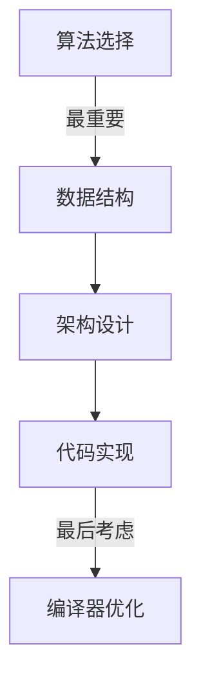
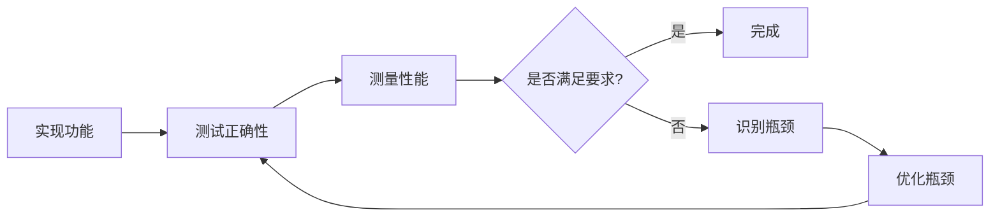

# 代码优化基础原则：平衡性能与可读性的艺术

## 概述

代码优化是嵌入式开发中的重要技能，但优化并不意味着盲目追求极致性能。在资源受限的嵌入式系统中，我们需要在性能、可读性、可维护性和开发效率之间找到最佳平衡点。

本文将介绍代码优化的基本原则、如何识别性能瓶颈、常见的优化策略，以及如何在优化过程中保持代码的可读性和可维护性。通过学习这些基础知识，你将建立起正确的优化思维，避免过早优化和过度优化的陷阱。

### 为什么需要代码优化？

**嵌入式系统的资源限制**:
- **处理器性能有限**: 通常运行在几十到几百MHz
- **内存容量受限**: Flash和RAM通常只有几KB到几MB
- **功耗要求严格**: 电池供电设备需要长时间运行
- **实时性要求高**: 必须在规定时间内完成任务
- **成本敏感**: 需要使用性价比高的硬件

**优化的目标**:
- **提高执行速度**: 减少任务执行时间
- **降低内存占用**: 减少RAM和Flash使用
- **降低功耗**: 延长电池寿命
- **提高响应性**: 改善用户体验
- **降低成本**: 使用更便宜的硬件

### 优化的误区

在开始优化之前，我们需要了解一些常见的误区：

**误区1: 过早优化**
> "过早优化是万恶之源" - Donald Knuth

- 在功能未完成时就开始优化
- 优化不是瓶颈的代码
- 牺牲可读性换取微小的性能提升

**误区2: 盲目优化**
- 没有测量就开始优化
- 凭感觉而非数据做决策
- 不知道优化效果如何

**误区3: 过度优化**
- 追求极致性能而忽视可维护性
- 使用过于复杂的技巧
- 优化已经足够快的代码

**误区4: 局部优化**
- 只关注代码级优化
- 忽视算法和架构层面的优化
- 见树不见林


## 优化的基本原则

### 原则1: 先测量，再优化

**核心思想**: 没有测量就没有优化

**为什么重要**:
- 避免优化不是瓶颈的代码
- 量化优化效果
- 确保优化有价值

**如何测量**:

```c
// 1. 使用系统时钟测量执行时间
uint32_t start_time = HAL_GetTick();

// 执行要测量的代码
process_data();

uint32_t end_time = HAL_GetTick();
uint32_t elapsed = end_time - start_time;
printf("Execution time: %lu ms\n", elapsed);

// 2. 使用高精度计时器
void measure_execution_time(void) {
    // 启动计时器
    __HAL_TIM_SET_COUNTER(&htim2, 0);
    HAL_TIM_Base_Start(&htim2);
    
    // 执行代码
    critical_function();
    
    // 停止计时器
    HAL_TIM_Base_Stop(&htim2);
    uint32_t cycles = __HAL_TIM_GET_COUNTER(&htim2);
    
    // 计算时间（假设72MHz时钟）
    float time_us = (float)cycles / 72.0f;
    printf("Execution time: %.2f us\n", time_us);
}

// 3. 使用DWT周期计数器（Cortex-M）
void dwt_init(void) {
    CoreDebug->DEMCR |= CoreDebug_DEMCR_TRCENA_Msk;
    DWT->CYCCNT = 0;
    DWT->CTRL |= DWT_CTRL_CYCCNTENA_Msk;
}

uint32_t dwt_get_cycles(void) {
    return DWT->CYCCNT;
}

void measure_with_dwt(void) {
    uint32_t start = dwt_get_cycles();
    
    // 执行代码
    algorithm();
    
    uint32_t end = dwt_get_cycles();
    uint32_t cycles = end - start;
    
    printf("CPU cycles: %lu\n", cycles);
}
```

**测量要点**:
- 多次测量取平均值
- 考虑缓存和预取的影响
- 在实际工作负载下测量
- 记录测量条件和环境

### 原则2: 先算法，后代码

**核心思想**: 算法优化比代码优化更重要

**优化层次**:



**示例: 查找算法对比**

```c
// 方法1: 线性查找 - O(n)
int linear_search(int *array, int size, int target) {
    for (int i = 0; i < size; i++) {
        if (array[i] == target) {
            return i;
        }
    }
    return -1;
}

// 方法2: 二分查找 - O(log n)
// 要求数组已排序
int binary_search(int *array, int size, int target) {
    int left = 0;
    int right = size - 1;
    
    while (left <= right) {
        int mid = left + (right - left) / 2;
        
        if (array[mid] == target) {
            return mid;
        } else if (array[mid] < target) {
            left = mid + 1;
        } else {
            right = mid - 1;
        }
    }
    return -1;
}

// 性能对比（1000个元素）:
// 线性查找: 平均500次比较
// 二分查找: 最多10次比较
// 性能提升: 50倍
```

**算法复杂度对比**:

| 算法 | 时间复杂度 | 1000元素 | 10000元素 | 100000元素 |
|------|-----------|---------|----------|-----------|
| O(1) | 常数 | 1 | 1 | 1 |
| O(log n) | 对数 | 10 | 13 | 17 |
| O(n) | 线性 | 1000 | 10000 | 100000 |
| O(n log n) | 线性对数 | 10000 | 130000 | 1700000 |
| O(n²) | 平方 | 1000000 | 100000000 | 10000000000 |

**关键点**: 选择正确的算法比优化代码重要得多


### 原则3: 80/20法则

**核心思想**: 80%的执行时间花在20%的代码上

**实践方法**:
1. 使用性能分析工具找出热点代码
2. 集中精力优化这20%的代码
3. 不要浪费时间优化不常执行的代码

**识别热点代码**:

```c
// 1. 手动插桩
typedef struct {
    const char *name;
    uint32_t call_count;
    uint32_t total_cycles;
} ProfileData_t;

ProfileData_t profile_data[10];
int profile_index = 0;

void profile_start(const char *name) {
    // 记录开始时间
    profile_data[profile_index].name = name;
    profile_data[profile_index].call_count++;
    // 记录开始周期数
}

void profile_end(void) {
    // 记录结束周期数
    // 累加到total_cycles
    profile_index++;
}

// 使用示例
void my_function(void) {
    profile_start("my_function");
    
    // 函数代码
    
    profile_end();
}

// 2. 统计函数调用次数
#define PROFILE_FUNC(func) \
    do { \
        static uint32_t call_count = 0; \
        call_count++; \
        if (call_count % 1000 == 0) { \
            printf("%s called %lu times\n", #func, call_count); \
        } \
        func; \
    } while(0)
```

**优化优先级**:
1. **高优先级**: 频繁调用的函数
2. **中优先级**: 偶尔调用但耗时长的函数
3. **低优先级**: 很少调用的函数

### 原则4: 保持可读性

**核心思想**: 可读性和可维护性同样重要

**平衡策略**:

```c
// 不好的例子: 过度优化，难以理解
int f(int x) {
    return x * (x & 1 ? 3 : 1) >> (x & 1);
}

// 好的例子: 清晰的意图
int calculate_value(int input) {
    if (input % 2 == 1) {  // 奇数
        return input * 3 / 2;
    } else {  // 偶数
        return input;
    }
}

// 如果性能确实重要，添加注释
int calculate_value_optimized(int input) {
    // 使用位运算优化: 
    // - (x & 1) 检查奇偶性，比 % 2 快
    // - >> 1 相当于除以2，比 / 2 快
    return input * (input & 1 ? 3 : 1) >> (input & 1);
}
```

**可读性原则**:
- 使用有意义的变量名
- 添加必要的注释
- 保持函数简短
- 避免过度复杂的技巧
- 优化后保留原始版本作为参考

### 原则5: 避免过早优化

**核心思想**: 先让代码工作，再让代码快速

**开发流程**:



**何时开始优化**:
- ✅ 功能已完整实现
- ✅ 代码已通过测试
- ✅ 发现明确的性能问题
- ✅ 有明确的性能目标
- ✅ 已识别性能瓶颈

**何时不要优化**:
- ❌ 功能还未完成
- ❌ 没有性能问题
- ❌ 没有测量数据
- ❌ 优化收益很小
- ❌ 会严重影响可读性


## 识别性能瓶颈

### 常见的性能瓶颈

**1. CPU密集型瓶颈**
- 复杂的数学运算
- 大量的循环
- 低效的算法

**2. 内存访问瓶颈**
- 频繁的内存分配/释放
- 缓存未命中
- 大量的数据拷贝

**3. I/O瓶颈**
- 等待外设响应
- 频繁的Flash读写
- 串口通信延迟

**4. 并发瓶颈**
- 锁竞争
- 任务切换开销
- 优先级倒置

### 性能分析方法

**方法1: 代码插桩**

```c
// 简单的性能计数器
typedef struct {
    const char *name;
    uint32_t count;
    uint32_t total_time;
    uint32_t min_time;
    uint32_t max_time;
} PerfCounter_t;

#define MAX_COUNTERS 20
PerfCounter_t perf_counters[MAX_COUNTERS];
int counter_count = 0;

// 开始计时
int perf_start(const char *name) {
    // 查找或创建计数器
    for (int i = 0; i < counter_count; i++) {
        if (strcmp(perf_counters[i].name, name) == 0) {
            return i;
        }
    }
    
    // 新建计数器
    if (counter_count < MAX_COUNTERS) {
        perf_counters[counter_count].name = name;
        perf_counters[counter_count].count = 0;
        perf_counters[counter_count].min_time = UINT32_MAX;
        perf_counters[counter_count].max_time = 0;
        return counter_count++;
    }
    return -1;
}

// 记录时间
void perf_record(int id, uint32_t elapsed) {
    if (id < 0 || id >= counter_count) return;
    
    perf_counters[id].count++;
    perf_counters[id].total_time += elapsed;
    
    if (elapsed < perf_counters[id].min_time) {
        perf_counters[id].min_time = elapsed;
    }
    if (elapsed > perf_counters[id].max_time) {
        perf_counters[id].max_time = elapsed;
    }
}

// 打印统计信息
void perf_print_stats(void) {
    printf("\n=== Performance Statistics ===\n");
    printf("%-20s %8s %10s %8s %8s %10s\n", 
           "Function", "Calls", "Total(us)", "Min(us)", "Max(us)", "Avg(us)");
    
    for (int i = 0; i < counter_count; i++) {
        uint32_t avg = perf_counters[i].total_time / perf_counters[i].count;
        printf("%-20s %8lu %10lu %8lu %8lu %10lu\n",
               perf_counters[i].name,
               perf_counters[i].count,
               perf_counters[i].total_time,
               perf_counters[i].min_time,
               perf_counters[i].max_time,
               avg);
    }
    printf("==============================\n\n");
}

// 使用示例
void my_function(void) {
    int id = perf_start("my_function");
    uint32_t start = DWT->CYCCNT;
    
    // 函数代码
    process_data();
    
    uint32_t end = DWT->CYCCNT;
    uint32_t cycles = end - start;
    uint32_t us = cycles / (SystemCoreClock / 1000000);
    
    perf_record(id, us);
}
```

**方法2: 采样分析**

```c
// 定期采样当前执行位置
volatile uint32_t sample_pc[1000];
volatile int sample_index = 0;

void SysTick_Handler(void) {
    // 每1ms采样一次
    if (sample_index < 1000) {
        sample_pc[sample_index++] = __get_PC();
    }
}

// 分析采样结果
void analyze_samples(void) {
    // 统计每个函数被采样的次数
    // 次数多的函数就是热点
}
```

**方法3: 使用调试器**

```c
// 在GDB中使用
// 1. 设置断点
(gdb) break main

// 2. 运行程序
(gdb) run

// 3. 单步执行并计时
(gdb) set $start = $pc
(gdb) next
(gdb) set $end = $pc
(gdb) print $end - $start

// 4. 查看函数调用次数
(gdb) break function_name
(gdb) commands
> silent
> set $count = $count + 1
> continue
> end
```


## 常见优化策略

### 策略1: 减少函数调用开销

**问题**: 函数调用有开销（保存寄存器、跳转、恢复）

**解决方案**:

```c
// 1. 内联小函数
// 不好: 频繁调用小函数
int add(int a, int b) {
    return a + b;
}

void process(void) {
    for (int i = 0; i < 1000; i++) {
        result[i] = add(data1[i], data2[i]);  // 1000次函数调用
    }
}

// 好: 使用inline
static inline int add(int a, int b) {
    return a + b;
}

// 或者使用宏
#define ADD(a, b) ((a) + (b))

// 2. 减少不必要的函数调用
// 不好: 循环中重复调用
void process_array(uint8_t *data, int size) {
    for (int i = 0; i < size; i++) {
        if (is_valid_data(data[i])) {  // 每次都调用
            process(data[i]);
        }
    }
}

// 好: 提取到循环外
void process_array_optimized(uint8_t *data, int size) {
    // 如果验证逻辑简单，直接内联
    for (int i = 0; i < size; i++) {
        if (data[i] >= MIN_VALUE && data[i] <= MAX_VALUE) {
            process(data[i]);
        }
    }
}
```

### 策略2: 循环优化

**技巧1: 循环展开**

```c
// 原始循环
void sum_array(int *array, int size) {
    int sum = 0;
    for (int i = 0; i < size; i++) {
        sum += array[i];
    }
}

// 循环展开（4路）
void sum_array_unrolled(int *array, int size) {
    int sum = 0;
    int i;
    
    // 处理4的倍数部分
    for (i = 0; i < size - 3; i += 4) {
        sum += array[i];
        sum += array[i + 1];
        sum += array[i + 2];
        sum += array[i + 3];
    }
    
    // 处理剩余部分
    for (; i < size; i++) {
        sum += array[i];
    }
}

// 性能提升: 减少循环控制开销，提高指令级并行
```

**技巧2: 循环不变量外提**

```c
// 不好: 循环中重复计算
void process_data(int *data, int size, int factor) {
    for (int i = 0; i < size; i++) {
        data[i] = data[i] * (factor * 2 + 10);  // 每次都计算
    }
}

// 好: 提取到循环外
void process_data_optimized(int *data, int size, int factor) {
    int multiplier = factor * 2 + 10;  // 只计算一次
    for (int i = 0; i < size; i++) {
        data[i] = data[i] * multiplier;
    }
}
```

**技巧3: 减少循环次数**

```c
// 不好: 多次遍历
void process_arrays(int *a, int *b, int *c, int size) {
    for (int i = 0; i < size; i++) {
        a[i] = a[i] * 2;
    }
    for (int i = 0; i < size; i++) {
        b[i] = b[i] + 10;
    }
    for (int i = 0; i < size; i++) {
        c[i] = a[i] + b[i];
    }
}

// 好: 合并循环
void process_arrays_optimized(int *a, int *b, int *c, int size) {
    for (int i = 0; i < size; i++) {
        a[i] = a[i] * 2;
        b[i] = b[i] + 10;
        c[i] = a[i] + b[i];
    }
}
```

### 策略3: 减少内存访问

**技巧1: 使用局部变量**

```c
// 不好: 频繁访问全局变量
int global_counter = 0;

void process_data(int *data, int size) {
    for (int i = 0; i < size; i++) {
        if (data[i] > 0) {
            global_counter++;  // 每次都访问内存
        }
    }
}

// 好: 使用局部变量
void process_data_optimized(int *data, int size) {
    int local_counter = global_counter;  // 读取一次
    
    for (int i = 0; i < size; i++) {
        if (data[i] > 0) {
            local_counter++;  // 访问寄存器
        }
    }
    
    global_counter = local_counter;  // 写回一次
}
```

**技巧2: 数据对齐**

```c
// 不好: 未对齐的数据
typedef struct {
    uint8_t flag;      // 1字节
    uint32_t value;    // 4字节，未对齐
    uint8_t status;    // 1字节
} UnalignedData_t;  // 实际占用12字节（有填充）

// 好: 对齐的数据
typedef struct {
    uint32_t value;    // 4字节，对齐
    uint8_t flag;      // 1字节
    uint8_t status;    // 1字节
    uint16_t padding;  // 2字节填充（可用于其他字段）
} AlignedData_t;  // 占用8字节

// 或者使用packed（牺牲访问速度换取空间）
typedef struct __attribute__((packed)) {
    uint8_t flag;
    uint32_t value;
    uint8_t status;
} PackedData_t;  // 占用6字节，但访问较慢
```

**技巧3: 缓存友好的数据布局**

```c
// 不好: 结构体数组（AoS）
typedef struct {
    float x, y, z;
} Point_t;

Point_t points[1000];

void process_x_coordinates(void) {
    for (int i = 0; i < 1000; i++) {
        // 访问x时，y和z也被加载到缓存
        // 但y和z不会被使用，浪费缓存
        process(points[i].x);
    }
}

// 好: 数组结构体（SoA）
typedef struct {
    float x[1000];
    float y[1000];
    float z[1000];
} Points_t;

Points_t points;

void process_x_coordinates_optimized(void) {
    for (int i = 0; i < 1000; i++) {
        // 只加载x数组，缓存利用率高
        process(points.x[i]);
    }
}
```


### 策略4: 选择合适的数据类型

**原则**: 使用最小但足够的数据类型

```c
// 不好: 使用过大的类型
void count_events(void) {
    uint64_t counter = 0;  // 64位，但只需要计数到100
    
    for (uint64_t i = 0; i < 100; i++) {
        counter++;
    }
}

// 好: 使用合适的类型
void count_events_optimized(void) {
    uint8_t counter = 0;  // 8位足够
    
    for (uint8_t i = 0; i < 100; i++) {
        counter++;
    }
}

// 注意: 在某些架构上，使用32位可能比8位更快
// 需要根据具体平台测试
```

**位域优化**:

```c
// 不好: 使用多个变量
typedef struct {
    uint8_t flag1;     // 只需要1位
    uint8_t flag2;     // 只需要1位
    uint8_t status;    // 只需要3位
    uint8_t mode;      // 只需要2位
} Flags_t;  // 占用4字节

// 好: 使用位域
typedef struct {
    uint8_t flag1 : 1;
    uint8_t flag2 : 1;
    uint8_t status : 3;
    uint8_t mode : 2;
    uint8_t reserved : 1;
} FlagsOptimized_t;  // 占用1字节

// 注意: 位域访问可能比普通变量慢
// 适合空间敏感但不频繁访问的场景
```

### 策略5: 避免不必要的计算

**技巧1: 查表法**

```c
// 不好: 每次都计算
uint8_t calculate_crc(uint8_t data) {
    uint8_t crc = 0;
    for (int i = 0; i < 8; i++) {
        if ((crc ^ data) & 0x01) {
            crc = (crc >> 1) ^ 0x8C;
        } else {
            crc >>= 1;
        }
        data >>= 1;
    }
    return crc;
}

// 好: 使用查找表
const uint8_t crc_table[256] = {
    0x00, 0x5E, 0xBC, 0xE2, /* ... 预计算的值 ... */
};

uint8_t calculate_crc_fast(uint8_t data) {
    return crc_table[data];  // 直接查表
}

// 性能提升: 从O(n)到O(1)
```

**技巧2: 缓存计算结果**

```c
// 不好: 重复计算
float calculate_distance(Point_t *p1, Point_t *p2) {
    float dx = p2->x - p1->x;
    float dy = p2->y - p1->y;
    return sqrtf(dx * dx + dy * dy);  // sqrt很慢
}

void process_points(Point_t *points, int count) {
    for (int i = 0; i < count; i++) {
        for (int j = i + 1; j < count; j++) {
            float dist = calculate_distance(&points[i], &points[j]);
            // 使用dist
        }
    }
}

// 好: 缓存结果
typedef struct {
    float distance;
    bool valid;
} CachedDistance_t;

CachedDistance_t distance_cache[MAX_POINTS][MAX_POINTS];

float get_distance(Point_t *p1, Point_t *p2, int i, int j) {
    if (!distance_cache[i][j].valid) {
        float dx = p2->x - p1->x;
        float dy = p2->y - p1->y;
        distance_cache[i][j].distance = sqrtf(dx * dx + dy * dy);
        distance_cache[i][j].valid = true;
    }
    return distance_cache[i][j].distance;
}
```

**技巧3: 延迟计算**

```c
// 不好: 立即计算所有值
typedef struct {
    float x, y;
    float magnitude;  // 立即计算
    float angle;      // 立即计算
} Vector_t;

Vector_t create_vector(float x, float y) {
    Vector_t v;
    v.x = x;
    v.y = y;
    v.magnitude = sqrtf(x * x + y * y);  // 可能不需要
    v.angle = atan2f(y, x);              // 可能不需要
    return v;
}

// 好: 按需计算
typedef struct {
    float x, y;
    float magnitude;
    float angle;
    bool magnitude_valid;
    bool angle_valid;
} VectorLazy_t;

VectorLazy_t create_vector_lazy(float x, float y) {
    VectorLazy_t v;
    v.x = x;
    v.y = y;
    v.magnitude_valid = false;
    v.angle_valid = false;
    return v;
}

float get_magnitude(VectorLazy_t *v) {
    if (!v->magnitude_valid) {
        v->magnitude = sqrtf(v->x * v->x + v->y * v->y);
        v->magnitude_valid = true;
    }
    return v->magnitude;
}
```

### 策略6: 使用位运算

**常见优化**:

```c
// 1. 乘除2的幂次
// 不好
int multiply_by_8(int x) {
    return x * 8;
}

// 好
int multiply_by_8_fast(int x) {
    return x << 3;  // 左移3位
}

// 2. 判断奇偶
// 不好
bool is_even(int x) {
    return (x % 2) == 0;
}

// 好
bool is_even_fast(int x) {
    return (x & 1) == 0;  // 检查最低位
}

// 3. 交换变量（无需临时变量）
void swap(int *a, int *b) {
    *a = *a ^ *b;
    *b = *a ^ *b;
    *a = *a ^ *b;
}

// 4. 设置/清除/翻转位
#define SET_BIT(reg, bit)    ((reg) |= (1 << (bit)))
#define CLEAR_BIT(reg, bit)  ((reg) &= ~(1 << (bit)))
#define TOGGLE_BIT(reg, bit) ((reg) ^= (1 << (bit)))
#define CHECK_BIT(reg, bit)  (((reg) >> (bit)) & 1)

// 5. 快速求绝对值（对于有符号整数）
int abs_fast(int x) {
    int mask = x >> 31;  // 如果x<0，mask=-1；否则mask=0
    return (x + mask) ^ mask;
}
```

**注意**: 现代编译器通常会自动进行这些优化，手动优化前先检查生成的汇编代码。


## 优化实践案例

### 案例1: 数字滤波器优化

**原始实现**:

```c
// 简单移动平均滤波器
#define FILTER_SIZE 10

float moving_average_filter(float new_value) {
    static float buffer[FILTER_SIZE] = {0};
    static int index = 0;
    
    // 更新缓冲区
    buffer[index] = new_value;
    index = (index + 1) % FILTER_SIZE;
    
    // 计算平均值
    float sum = 0;
    for (int i = 0; i < FILTER_SIZE; i++) {
        sum += buffer[i];
    }
    
    return sum / FILTER_SIZE;
}

// 性能: 每次调用需要10次加法和1次除法
```

**优化版本1: 增量更新**

```c
float moving_average_filter_v1(float new_value) {
    static float buffer[FILTER_SIZE] = {0};
    static int index = 0;
    static float sum = 0;  // 缓存总和
    
    // 减去旧值，加上新值
    sum = sum - buffer[index] + new_value;
    
    // 更新缓冲区
    buffer[index] = new_value;
    index = (index + 1) % FILTER_SIZE;
    
    return sum / FILTER_SIZE;
}

// 性能提升: 只需要2次加法和1次除法
// 提升约5倍
```

**优化版本2: 避免除法**

```c
float moving_average_filter_v2(float new_value) {
    static float buffer[FILTER_SIZE] = {0};
    static int index = 0;
    static float sum = 0;
    
    sum = sum - buffer[index] + new_value;
    buffer[index] = new_value;
    index = (index + 1) % FILTER_SIZE;
    
    // 使用乘法代替除法（如果FILTER_SIZE是常数）
    return sum * (1.0f / FILTER_SIZE);  // 编译器会优化为常数
}

// 性能提升: 除法变为乘法，更快
```

**优化版本3: 整数运算**

```c
// 如果可以接受整数精度
int32_t moving_average_filter_v3(int32_t new_value) {
    static int32_t buffer[FILTER_SIZE] = {0};
    static int index = 0;
    static int32_t sum = 0;
    
    sum = sum - buffer[index] + new_value;
    buffer[index] = new_value;
    index = (index + 1) % FILTER_SIZE;
    
    // 如果FILTER_SIZE是2的幂，可以用位移
    return sum >> 4;  // 除以16（假设FILTER_SIZE=16）
}

// 性能提升: 整数运算比浮点快，位移比除法快
```

### 案例2: 字符串处理优化

**原始实现**:

```c
// 查找字符串中的字符
int find_char(const char *str, char c) {
    int len = strlen(str);  // 每次都计算长度
    
    for (int i = 0; i < len; i++) {
        if (str[i] == c) {
            return i;
        }
    }
    return -1;
}
```

**优化版本**:

```c
int find_char_optimized(const char *str, char c) {
    // 不需要预先计算长度
    for (int i = 0; str[i] != '\0'; i++) {
        if (str[i] == c) {
            return i;
        }
    }
    return -1;
}

// 或者使用指针
int find_char_pointer(const char *str, char c) {
    const char *p = str;
    while (*p != '\0') {
        if (*p == c) {
            return p - str;
        }
        p++;
    }
    return -1;
}
```

### 案例3: 数据包处理优化

**原始实现**:

```c
typedef struct {
    uint8_t header;
    uint8_t length;
    uint8_t data[256];
    uint16_t checksum;
} Packet_t;

bool validate_packet(Packet_t *packet) {
    // 计算校验和
    uint16_t sum = 0;
    sum += packet->header;
    sum += packet->length;
    
    for (int i = 0; i < packet->length; i++) {
        sum += packet->data[i];
    }
    
    return sum == packet->checksum;
}
```

**优化版本**:

```c
// 1. 使用更快的校验算法
bool validate_packet_v1(Packet_t *packet) {
    // 使用32位累加，减少溢出处理
    uint32_t sum = 0;
    sum += packet->header;
    sum += packet->length;
    
    // 循环展开
    int i;
    for (i = 0; i < packet->length - 3; i += 4) {
        sum += packet->data[i];
        sum += packet->data[i + 1];
        sum += packet->data[i + 2];
        sum += packet->data[i + 3];
    }
    
    // 处理剩余字节
    for (; i < packet->length; i++) {
        sum += packet->data[i];
    }
    
    return (uint16_t)sum == packet->checksum;
}

// 2. 使用查找表加速CRC
const uint16_t crc16_table[256] = { /* 预计算的CRC表 */ };

uint16_t calculate_crc16(uint8_t *data, int length) {
    uint16_t crc = 0xFFFF;
    
    for (int i = 0; i < length; i++) {
        uint8_t index = (crc ^ data[i]) & 0xFF;
        crc = (crc >> 8) ^ crc16_table[index];
    }
    
    return crc;
}
```


## 优化的权衡

### 性能 vs 可读性

**场景**: 需要优化一个复杂的算法

**选项1: 极致优化**
```c
// 高度优化但难以理解
int f(int x) {
    return ((x * 0x5DEECE66DL + 0xBL) & ((1L << 48) - 1)) >> 16;
}
```

**选项2: 平衡方案**
```c
// 清晰的实现 + 注释
int generate_random(int seed) {
    // 线性同余生成器: X(n+1) = (a * X(n) + c) mod m
    // 参数来自Java的Random类
    const uint64_t a = 0x5DEECE66DL;
    const uint64_t c = 0xBL;
    const uint64_t m = (1L << 48);
    
    uint64_t next = (a * seed + c) & (m - 1);
    return (int)(next >> 16);
}
```

**建议**: 
- 关键路径上的代码可以牺牲一些可读性
- 非关键代码保持清晰
- 添加详细注释说明优化原理

### 性能 vs 内存

**场景**: 需要快速查找

**选项1: 空间换时间**
```c
// 使用哈希表，O(1)查找，但占用更多内存
#define HASH_SIZE 1024
typedef struct {
    int key;
    int value;
    bool valid;
} HashEntry_t;

HashEntry_t hash_table[HASH_SIZE];

int hash_lookup(int key) {
    int index = key % HASH_SIZE;
    if (hash_table[index].valid && hash_table[index].key == key) {
        return hash_table[index].value;
    }
    return -1;
}
```

**选项2: 时间换空间**
```c
// 使用数组，O(n)查找，但节省内存
typedef struct {
    int key;
    int value;
} Entry_t;

Entry_t entries[100];
int entry_count = 0;

int array_lookup(int key) {
    for (int i = 0; i < entry_count; i++) {
        if (entries[i].key == key) {
            return entries[i].value;
        }
    }
    return -1;
}
```

**建议**:
- 根据实际需求选择
- 频繁查找 → 空间换时间
- 内存紧张 → 时间换空间
- 考虑混合方案

### 性能 vs 功耗

**场景**: 电池供电设备

**选项1: 高性能模式**
```c
void high_performance_mode(void) {
    // 使用最高时钟频率
    SystemClock_Config_Max();  // 168MHz
    
    // 快速处理数据
    while (has_data()) {
        process_data_fast();
    }
}
// 优点: 快速完成任务
// 缺点: 功耗高
```

**选项2: 低功耗模式**
```c
void low_power_mode(void) {
    // 降低时钟频率
    SystemClock_Config_Low();  // 16MHz
    
    // 慢速处理数据
    while (has_data()) {
        process_data_slow();
        
        // 处理间隙进入睡眠
        if (!has_urgent_data()) {
            HAL_PWR_EnterSLEEPMode(PWR_MAINREGULATOR_ON, 
                                   PWR_SLEEPENTRY_WFI);
        }
    }
}
// 优点: 功耗低
// 缺点: 处理慢
```

**选项3: 动态调整**
```c
void adaptive_mode(void) {
    if (battery_level > 50) {
        // 电量充足，使用高性能
        high_performance_mode();
    } else if (battery_level > 20) {
        // 电量中等，平衡模式
        balanced_mode();
    } else {
        // 电量低，省电模式
        low_power_mode();
    }
}
```

### 通用性 vs 性能

**场景**: 实现一个通用函数

**选项1: 通用但慢**
```c
// 支持任意大小的数据
void copy_data(void *dst, const void *src, size_t size) {
    uint8_t *d = (uint8_t *)dst;
    const uint8_t *s = (const uint8_t *)src;
    
    for (size_t i = 0; i < size; i++) {
        d[i] = s[i];
    }
}
```

**选项2: 针对特定场景优化**
```c
// 针对4字节对齐的数据优化
void copy_data_aligned(uint32_t *dst, const uint32_t *src, size_t count) {
    for (size_t i = 0; i < count; i++) {
        dst[i] = src[i];  // 一次复制4字节
    }
}

// 或者使用DMA
void copy_data_dma(void *dst, const void *src, size_t size) {
    HAL_DMA_Start(&hdma, (uint32_t)src, (uint32_t)dst, size);
    HAL_DMA_PollForTransfer(&hdma, HAL_DMA_FULL_TRANSFER, 1000);
}
```

**建议**:
- 提供通用版本作为默认实现
- 为常见场景提供优化版本
- 使用条件编译或函数指针选择


## 最佳实践

### DO（推荐做法）

**1. 测量驱动优化**
- ✅ 使用性能分析工具识别瓶颈
- ✅ 记录优化前后的性能数据
- ✅ 在真实环境中测试
- ✅ 考虑最坏情况和平均情况

**2. 优先级排序**
- ✅ 先优化算法和数据结构
- ✅ 再优化热点代码
- ✅ 最后考虑微优化
- ✅ 关注20%的关键代码

**3. 保持代码质量**
- ✅ 添加注释说明优化原理
- ✅ 保留原始版本作为参考
- ✅ 编写测试验证正确性
- ✅ 定期审查优化代码

**4. 使用编译器优化**
- ✅ 了解编译器优化选项
- ✅ 让编译器做它擅长的事
- ✅ 检查生成的汇编代码
- ✅ 使用编译器内置函数

**5. 文档化**
- ✅ 记录优化决策和原因
- ✅ 说明性能提升幅度
- ✅ 注明适用场景和限制
- ✅ 提供性能测试代码

### DON'T（避免做法）

**1. 过早优化**
- ❌ 功能未完成就开始优化
- ❌ 优化不是瓶颈的代码
- ❌ 没有性能问题就优化
- ❌ 凭感觉而非数据优化

**2. 牺牲正确性**
- ❌ 为了性能忽略边界检查
- ❌ 使用未定义行为
- ❌ 跳过错误处理
- ❌ 不验证优化结果

**3. 过度复杂化**
- ❌ 使用晦涩的技巧
- ❌ 过度展开循环
- ❌ 过度内联函数
- ❌ 牺牲可维护性

**4. 忽视可移植性**
- ❌ 依赖特定编译器行为
- ❌ 使用平台相关代码
- ❌ 假设特定的数据大小
- ❌ 不考虑字节序

**5. 盲目优化**
- ❌ 不测量就优化
- ❌ 不验证优化效果
- ❌ 不考虑副作用
- ❌ 不记录优化过程

### 优化检查清单

**优化前**:
- [ ] 功能是否已完整实现？
- [ ] 是否存在明确的性能问题？
- [ ] 是否已识别性能瓶颈？
- [ ] 是否有明确的性能目标？
- [ ] 是否有性能测试基准？

**优化中**:
- [ ] 是否只修改一处代码？
- [ ] 是否保留了原始版本？
- [ ] 是否添加了注释？
- [ ] 是否测量了性能变化？
- [ ] 是否验证了正确性？

**优化后**:
- [ ] 性能是否达到目标？
- [ ] 是否引入了新问题？
- [ ] 代码是否仍然可读？
- [ ] 是否更新了文档？
- [ ] 是否通过了所有测试？

### 优化工具推荐

**性能分析工具**:
1. **GProf**: GNU性能分析器
2. **Valgrind**: 内存和性能分析
3. **Perf**: Linux性能分析工具
4. **ARM DS-5**: ARM开发工具套件

**代码分析工具**:
1. **Compiler Explorer**: 查看编译器生成的汇编
2. **Godbolt**: 在线编译器对比
3. **Quick Bench**: 在线性能测试

**嵌入式专用**:
1. **Segger SystemView**: 实时系统分析
2. **Tracealyzer**: RTOS性能分析
3. **Percepio**: 嵌入式系统追踪


## 总结

通过本文，你已经学习了:

- ✅ 代码优化的基本原则（测量、算法优先、80/20法则）
- ✅ 如何识别性能瓶颈
- ✅ 常见的优化策略和技巧
- ✅ 优化过程中的权衡考虑
- ✅ 优化的最佳实践

**关键要点**:

1. **先测量，再优化**: 没有数据支持的优化是盲目的
2. **算法优于代码**: 选择正确的算法比优化代码更重要
3. **关注热点**: 集中精力优化20%的关键代码
4. **保持平衡**: 在性能、可读性和可维护性之间找到平衡
5. **避免过早**: 过早优化是万恶之源

**优化思维**:
- 从整体到局部
- 从算法到代码
- 从测量到优化
- 从简单到复杂

**持续提升**:
- 学习算法和数据结构
- 了解硬件特性
- 掌握性能分析工具
- 积累优化经验
- 阅读优秀代码

记住，优化是一门艺术，需要在多个目标之间找到最佳平衡。不要为了优化而优化，而是要根据实际需求做出明智的决策。

## 延伸阅读

### 相关文章

- [编译器优化选项使用](./02-compiler-optimization.html) - 学习编译器优化
- [代码执行时间测量方法](./03-execution-time-measurement.html) - 掌握性能测量
- [内存使用优化技术](../intermediate/01-memory-optimization.html) - 优化内存使用
- [算法复杂度与性能分析](../intermediate/03-algorithm-complexity.html) - 深入理解算法

### 进阶主题

- [功耗优化实战](../intermediate/02-power-optimization.html) - 降低功耗
- [实时性能优化技术](../advanced/01-real-time-optimization.html) - 实时系统优化
- [性能分析工具开发](../advanced/02-performance-analysis-tool.html) - 开发分析工具

### 参考资料

**书籍推荐**:
1. 《编写高效的C程序》- Robert Sedgewick
2. 《深入理解计算机系统》- Randal E. Bryant
3. 《算法导论》- Thomas H. Cormen

**在线资源**:
1. [Compiler Explorer](https://godbolt.org/) - 查看编译器生成的代码
2. [Quick Bench](https://quick-bench.com/) - 在线性能测试
3. [Embedded Artistry](https://embeddedartistry.com/blog/tag/performance/) - 嵌入式性能优化

**标准和指南**:
1. [MISRA C](https://www.misra.org.uk/) - C语言编码标准
2. [CERT C](https://wiki.sei.cmu.edu/confluence/display/c) - 安全编码标准
3. [ARM Optimization Guide](https://developer.arm.com/documentation/) - ARM优化指南

---

**练习建议**:
1. 选择一个现有项目，使用性能分析工具找出瓶颈
2. 尝试不同的优化策略，测量效果
3. 对比优化前后的代码，理解权衡
4. 阅读开源项目中的优化代码
5. 参与代码审查，学习他人的优化经验
