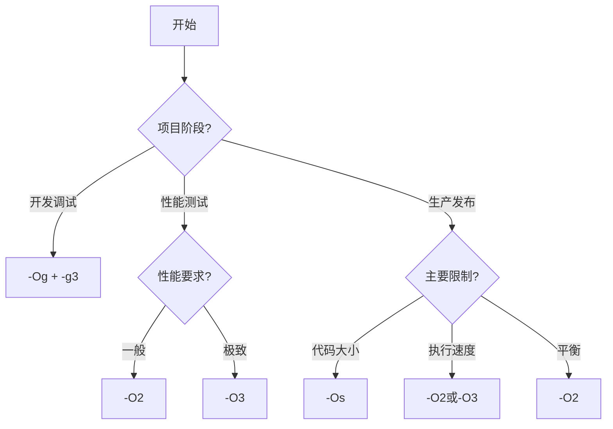

# 编译器优化选项使用：让编译器为你优化代码


## 学习目标

完成本教程后，你将能够:

- [ ] 理解编译器优化的基本原理和工作方式
- [ ] 掌握GCC的主要优化级别及其特点
- [ ] 使用各种编译选项控制代码生成
- [ ] 分析优化前后的性能差异
- [ ] 为嵌入式项目选择合适的优化策略
- [ ] 理解优化的权衡和潜在问题

## 前置要求

在开始本教程之前，你需要:

**知识要求**:
- 了解C语言编程基础
- 理解编译和链接的基本概念
- 阅读过[代码优化基础原则](./01-code-optimization-basics.html)

**技能要求**:
- 能够使用命令行编译程序
- 会使用GCC编译器
- 了解基本的性能测量方法

## 准备工作

### 软件准备

- **编译器**: GCC 7.0+ 或 ARM GCC工具链
- **操作系统**: Linux、macOS 或 Windows (MinGW)
- **文本编辑器**: 任意代码编辑器
- **性能分析工具**: time命令或性能计数器

### 验证环境

```bash
# 检查GCC版本
gcc --version

# 检查支持的优化选项
gcc --help=optimizers
```

**预期输出**:
```
gcc (GCC) 10.2.0
Copyright (C) 2020 Free Software Foundation, Inc.
```


## 什么是编译器优化？

### 编译器优化的本质

编译器优化是指编译器在将源代码转换为机器码的过程中，通过各种技术手段改进生成代码的性能、大小或其他特性。

**优化目标**:
- **执行速度**: 减少指令数量和执行时间
- **代码大小**: 减少生成的机器码体积
- **内存使用**: 优化内存访问模式
- **功耗**: 减少不必要的计算和访问

### 编译器能做什么？

现代编译器可以进行数百种优化，包括：

**常见优化技术**:

1. **死代码消除**: 删除永远不会执行的代码
2. **常量折叠**: 在编译时计算常量表达式
3. **循环优化**: 循环展开、循环不变量外提
4. **内联展开**: 将函数调用替换为函数体
5. **寄存器分配**: 优化变量到寄存器的分配
6. **指令调度**: 重排指令以提高流水线效率

### 为什么需要编译器优化？

**手动优化的局限**:
- 耗时费力，容易出错
- 难以跨平台移植
- 可能降低代码可读性
- 难以跟上硬件发展

**编译器优化的优势**:
- ✅ 自动化，节省时间
- ✅ 针对目标平台优化
- ✅ 保持代码可读性
- ✅ 持续改进和更新


## 步骤1：理解优化级别

### 1.1 GCC优化级别概览

GCC提供了多个优化级别，从`-O0`到`-O3`，以及特殊的`-Os`和`-Ofast`。

| 优化级别 | 说明 | 适用场景 |
|---------|------|---------|
| -O0 | 无优化（默认） | 调试阶段 |
| -O1 | 基本优化 | 快速编译+轻度优化 |
| -O2 | 标准优化 | 生产环境推荐 |
| -O3 | 激进优化 | 追求极致性能 |
| -Os | 优化代码大小 | 存储空间受限 |
| -Og | 调试友好优化 | 调试+部分优化 |
| -Ofast | 最快速度 | 可接受标准违背 |

### 1.2 创建测试程序

创建 `test_optimization.c`:

```c
#include <stdio.h>
#include <stdint.h>

// 测试函数：计算数组和
uint32_t sum_array(uint32_t *array, int size) {
    uint32_t sum = 0;
    for (int i = 0; i < size; i++) {
        sum += array[i];
    }
    return sum;
}

// 测试函数：查找最大值
uint32_t find_max(uint32_t *array, int size) {
    uint32_t max = array[0];
    for (int i = 1; i < size; i++) {
        if (array[i] > max) {
            max = array[i];
        }
    }
    return max;
}

int main(void) {
    uint32_t data[1000];
    
    // 初始化数据
    for (int i = 0; i < 1000; i++) {
        data[i] = i;
    }
    
    // 执行测试
    uint32_t sum = sum_array(data, 1000);
    uint32_t max = find_max(data, 1000);
    
    printf("Sum: %u, Max: %u\n", sum, max);
    
    return 0;
}
```


### 1.3 对比不同优化级别

```bash
# 编译不同优化级别的版本
gcc -O0 test_optimization.c -o test_O0
gcc -O1 test_optimization.c -o test_O1
gcc -O2 test_optimization.c -o test_O2
gcc -O3 test_optimization.c -o test_O3
gcc -Os test_optimization.c -o test_Os

# 查看文件大小
ls -lh test_O*
```

**预期输出**:
```
-rwxr-xr-x 1 user user 16K test_O0
-rwxr-xr-x 1 user user 12K test_O1
-rwxr-xr-x 1 user user 12K test_O2
-rwxr-xr-x 1 user user 12K test_O3
-rwxr-xr-x 1 user user 11K test_Os
```

### 1.4 查看生成的汇编代码

```bash
# 生成汇编代码
gcc -O0 -S test_optimization.c -o test_O0.s
gcc -O2 -S test_optimization.c -o test_O2.s

# 对比汇编代码
diff test_O0.s test_O2.s
```

**观察要点**:
- `-O0`: 代码直译，每个C语句对应多条汇编
- `-O2`: 代码优化，循环展开，寄存器优化


## 步骤2：-O0 无优化

### 2.1 特点和用途

**特点**:
- 不进行任何优化
- 编译速度最快
- 生成的代码与源代码一一对应
- 调试信息完整准确

**适用场景**:
- 开发和调试阶段
- 需要精确调试的情况
- 学习汇编代码生成

### 2.2 示例分析

```c
int add(int a, int b) {
    return a + b;
}
```

**-O0生成的汇编**（简化）:
```asm
add:
    push    rbp
    mov     rbp, rsp
    mov     DWORD PTR [rbp-4], edi   ; 保存参数a
    mov     DWORD PTR [rbp-8], esi   ; 保存参数b
    mov     edx, DWORD PTR [rbp-4]   ; 读取a
    mov     eax, DWORD PTR [rbp-8]   ; 读取b
    add     eax, edx                 ; 相加
    pop     rbp
    ret
```

**特点**:
- 参数先保存到栈
- 每次都从内存读取
- 指令数量多


## 步骤3：-O1 基本优化

### 3.1 特点和用途

**特点**:
- 启用基本优化
- 编译时间适中
- 代码大小和速度平衡
- 不会显著增加编译时间

**主要优化**:
- 死代码消除
- 常量传播
- 简单的循环优化
- 基本的寄存器分配


### 3.2 示例分析

同样的`add`函数，使用`-O1`编译：

**-O1生成的汇编**（简化）:
```asm
add:
    lea     eax, [rdi+rsi]   ; 直接计算a+b
    ret
```

**改进**:
- 参数直接使用寄存器
- 使用LEA指令优化加法
- 指令数量大幅减少

### 3.3 实际测试

```c
// 测试常量折叠
int calculate(void) {
    int a = 10;
    int b = 20;
    int c = a + b;  // -O1会在编译时计算
    return c * 2;   // 结果直接是60
}
```

```bash
# 编译并查看汇编
gcc -O1 -S test.c -o test_O1.s
cat test_O1.s
```

**-O1汇编结果**:
```asm
calculate:
    mov     eax, 60    ; 直接返回60
    ret
```


## 步骤4：-O2 标准优化（推荐）

### 4.1 特点和用途

**特点**:
- 生产环境推荐级别
- 启用大部分优化
- 不会显著增加代码大小
- 编译时间可接受

**主要优化**（在-O1基础上增加）:
- 循环展开
- 函数内联
- 指令调度
- 更激进的寄存器分配
- 公共子表达式消除
- 强度削减

### 4.2 循环优化示例

```c
// 原始代码
void process_array(int *array, int size) {
    for (int i = 0; i < size; i++) {
        array[i] = array[i] * 2;
    }
}
```

**-O0**: 每次循环都检查条件，逐个处理

**-O2**: 可能进行循环展开
```c
// 编译器可能生成类似的代码
void process_array_optimized(int *array, int size) {
    int i;
    // 处理4的倍数部分（循环展开）
    for (i = 0; i < size - 3; i += 4) {
        array[i] = array[i] * 2;
        array[i+1] = array[i+1] * 2;
        array[i+2] = array[i+2] * 2;
        array[i+3] = array[i+3] * 2;
    }
    // 处理剩余部分
    for (; i < size; i++) {
        array[i] = array[i] * 2;
    }
}
```

### 4.3 函数内联示例

```c
// 小函数
static inline int square(int x) {
    return x * x;
}

int calculate_sum_of_squares(int a, int b) {
    return square(a) + square(b);
}
```

**-O2优化后**:
```c
// 编译器生成的等效代码
int calculate_sum_of_squares(int a, int b) {
    return a * a + b * b;  // 函数调用被内联
}
```

### 4.4 性能测试

创建性能测试程序 `benchmark.c`:

```c
#include <stdio.h>
#include <time.h>
#include <stdint.h>

#define ARRAY_SIZE 10000
#define ITERATIONS 10000

uint32_t test_data[ARRAY_SIZE];

// 测试函数
uint32_t sum_array(uint32_t *array, int size) {
    uint32_t sum = 0;
    for (int i = 0; i < size; i++) {
        sum += array[i];
    }
    return sum;
}

int main(void) {
    // 初始化数据
    for (int i = 0; i < ARRAY_SIZE; i++) {
        test_data[i] = i;
    }
    
    // 测量时间
    clock_t start = clock();
    
    uint32_t result = 0;
    for (int i = 0; i < ITERATIONS; i++) {
        result += sum_array(test_data, ARRAY_SIZE);
    }
    
    clock_t end = clock();
    double time_spent = (double)(end - start) / CLOCKS_PER_SEC;
    
    printf("Result: %u\n", result);
    printf("Time: %.4f seconds\n", time_spent);
    
    return 0;
}
```


```bash
# 编译不同版本
gcc -O0 benchmark.c -o bench_O0
gcc -O2 benchmark.c -o bench_O2

# 运行测试
./bench_O0
./bench_O2
```

**典型结果**:
```
# -O0
Result: 499950000000
Time: 0.8234 seconds

# -O2
Result: 499950000000
Time: 0.1245 seconds

性能提升: 约6.6倍
```


## 步骤5：-O3 激进优化

### 5.1 特点和用途

**特点**:
- 最激进的优化
- 可能显著增加代码大小
- 追求最高性能
- 编译时间较长

**额外优化**（在-O2基础上）:
- 更激进的循环展开
- 向量化（SIMD）
- 函数克隆
- 预测分支优化
- 更多的内联

### 5.2 向量化示例

```c
// 数组相加
void add_arrays(float *a, float *b, float *c, int size) {
    for (int i = 0; i < size; i++) {
        c[i] = a[i] + b[i];
    }
}
```

**-O3可能使用SIMD指令**:
```asm
; 使用SSE指令一次处理4个float
movaps  xmm0, [rdi]      ; 加载4个a[i]
movaps  xmm1, [rsi]      ; 加载4个b[i]
addps   xmm0, xmm1       ; 并行相加
movaps  [rdx], xmm0      ; 存储结果
```

### 5.3 何时使用-O3

**适合使用**:
- ✅ 性能关键的代码
- ✅ 数值计算密集型应用
- ✅ 代码大小不是问题
- ✅ 经过充分测试

**不适合使用**:
- ❌ 代码大小受限
- ❌ 编译时间敏感
- ❌ 未经测试的代码
- ❌ 浮点精度敏感的代码

### 5.4 -O2 vs -O3 对比

```bash
# 编译对比
gcc -O2 benchmark.c -o bench_O2
gcc -O3 benchmark.c -o bench_O3

# 查看大小
size bench_O2 bench_O3

# 性能测试
time ./bench_O2
time ./bench_O3
```

**典型结果**:
```
# 代码大小
bench_O2: text=2048 data=40000
bench_O3: text=3072 data=40000  (增加50%)

# 性能
bench_O2: 0.125s
bench_O3: 0.098s  (提升约22%)
```


## 步骤6：-Os 优化代码大小

### 6.1 特点和用途

**特点**:
- 优先减小代码大小
- 基于-O2但禁用增大代码的优化
- 适合存储受限的嵌入式系统

**优化策略**:
- 禁用循环展开
- 限制函数内联
- 选择更小的指令
- 优化代码布局

### 6.2 嵌入式应用示例

```c
// 嵌入式系统常见代码
void gpio_init(void) {
    // 配置多个GPIO引脚
    GPIO_Config(PIN_0, OUTPUT);
    GPIO_Config(PIN_1, OUTPUT);
    GPIO_Config(PIN_2, INPUT);
    GPIO_Config(PIN_3, INPUT);
    // ... 更多配置
}
```

**-O2**: 可能内联GPIO_Config，代码变大
**-Os**: 保持函数调用，代码更小

### 6.3 实际对比

```bash
# 编译STM32项目
arm-none-eabi-gcc -O2 -mcpu=cortex-m4 main.c -o app_O2.elf
arm-none-eabi-gcc -Os -mcpu=cortex-m4 main.c -o app_Os.elf

# 查看大小
arm-none-eabi-size app_O2.elf app_Os.elf
```

**典型结果**:
```
   text    data     bss     dec     hex filename
  24576    1024    2048   27648    6c00 app_O2.elf
  18432    1024    2048   21504    5400 app_Os.elf

代码大小减少: 25%
```


## 步骤7：常用编译选项

### 7.1 函数内联控制

```bash
# 控制内联行为
-finline-functions          # 启用函数内联
-fno-inline                 # 禁用所有内联
-finline-limit=n            # 设置内联大小限制
-finline-small-functions    # 只内联小函数
```

**示例**:
```c
// 标记函数内联
static inline int add(int a, int b) {
    return a + b;
}

// 阻止内联
__attribute__((noinline))
int complex_function(int x) {
    // 复杂计算
    return x * x + x;
}
```

### 7.2 循环优化选项

```bash
# 循环优化
-funroll-loops              # 展开循环
-funroll-all-loops          # 展开所有循环
-floop-optimize             # 启用循环优化
-ftree-loop-vectorize       # 循环向量化
```

**示例**:
```bash
# 对比循环展开效果
gcc -O2 -funroll-loops test.c -o test_unroll
gcc -O2 -fno-unroll-loops test.c -o test_no_unroll
```

### 7.3 代码生成选项

```bash
# 代码生成
-fomit-frame-pointer        # 省略帧指针（提升性能）
-ffunction-sections         # 每个函数独立段
-fdata-sections             # 每个数据独立段
-ffast-math                 # 快速数学运算（牺牲精度）
```

**嵌入式常用组合**:
```bash
gcc -O2 \
    -ffunction-sections \
    -fdata-sections \
    -fomit-frame-pointer \
    main.c -o app.elf

# 链接时删除未使用的段
gcc app.elf -Wl,--gc-sections -o app_final.elf
```

### 7.4 调试友好选项

```bash
# 调试优化
-Og                         # 调试友好的优化
-g                          # 生成调试信息
-g3                         # 生成详细调试信息
```

**推荐组合**:
```bash
# 开发阶段
gcc -Og -g3 main.c -o app_debug

# 发布阶段
gcc -O2 -g main.c -o app_release
```


## 步骤8：ARM嵌入式优化

### 8.1 ARM特定选项

```bash
# ARM架构选项
-mcpu=cortex-m4             # 指定CPU型号
-mthumb                     # 使用Thumb指令集
-mfloat-abi=hard            # 硬件浮点
-mfpu=fpv4-sp-d16           # FPU类型
```

### 8.2 完整的ARM编译命令

```bash
# STM32F4编译示例
arm-none-eabi-gcc \
    -mcpu=cortex-m4 \
    -mthumb \
    -mfloat-abi=hard \
    -mfpu=fpv4-sp-d16 \
    -O2 \
    -ffunction-sections \
    -fdata-sections \
    -Wall \
    -g \
    main.c -o app.elf

# 链接
arm-none-eabi-gcc \
    app.elf \
    -mcpu=cortex-m4 \
    -mthumb \
    -mfloat-abi=hard \
    -mfpu=fpv4-sp-d16 \
    -T STM32F407.ld \
    -Wl,--gc-sections \
    -Wl,-Map=output.map \
    -o final.elf
```

### 8.3 浮点优化

```c
// 测试浮点性能
float calculate_distance(float x1, float y1, float x2, float y2) {
    float dx = x2 - x1;
    float dy = y2 - y1;
    return sqrtf(dx * dx + dy * dy);
}
```

```bash
# 软件浮点（慢）
arm-none-eabi-gcc -mfloat-abi=soft -O2 test.c -o test_soft

# 硬件浮点（快）
arm-none-eabi-gcc -mfloat-abi=hard -mfpu=fpv4-sp-d16 -O2 test.c -o test_hard
```

**性能差异**: 硬件浮点可快10-100倍


## 步骤9：优化效果分析

### 9.1 查看优化报告

```bash
# 生成优化报告
gcc -O2 -fopt-info-vec -fopt-info-inline test.c -o test
```

**输出示例**:
```
test.c:10:5: optimized: loop vectorized
test.c:25:8: optimized: Inlining add into main
test.c:30:5: missed: couldn't vectorize loop
```

### 9.2 分析汇编代码

```bash
# 生成带注释的汇编
gcc -O2 -S -fverbose-asm test.c -o test.s

# 查看汇编
cat test.s
```

### 9.3 性能测量

创建完整的性能测试 `perf_test.c`:


```c
#include <stdio.h>
#include <time.h>
#include <stdint.h>

#define SIZE 10000
#define ITER 1000

// 测试1: 数组求和
uint32_t test_sum(uint32_t *data, int size) {
    uint32_t sum = 0;
    for (int i = 0; i < size; i++) {
        sum += data[i];
    }
    return sum;
}

// 测试2: 矩阵乘法（简化）
void test_matrix_mul(int *a, int *b, int *c, int n) {
    for (int i = 0; i < n; i++) {
        for (int j = 0; j < n; j++) {
            int sum = 0;
            for (int k = 0; k < n; k++) {
                sum += a[i*n + k] * b[k*n + j];
            }
            c[i*n + j] = sum;
        }
    }
}

int main(void) {
    uint32_t data[SIZE];
    
    // 初始化
    for (int i = 0; i < SIZE; i++) {
        data[i] = i;
    }
    
    // 测试求和
    clock_t start = clock();
    uint32_t result = 0;
    for (int i = 0; i < ITER; i++) {
        result += test_sum(data, SIZE);
    }
    clock_t end = clock();
    
    double time = (double)(end - start) / CLOCKS_PER_SEC;
    printf("Sum test: %.4f seconds\n", time);
    printf("Result: %u\n", result);
    
    return 0;
}
```

```bash
# 编译并测试所有优化级别
for opt in O0 O1 O2 O3 Os; do
    echo "Testing -$opt"
    gcc -$opt perf_test.c -o perf_$opt
    time ./perf_$opt
    echo ""
done
```


## 步骤10：优化的权衡和注意事项

### 10.1 优化可能带来的问题

#### 问题1: 调试困难

```c
// 原始代码
int calculate(int x) {
    int temp = x * 2;      // 断点1
    int result = temp + 5; // 断点2
    return result;         // 断点3
}
```

**-O2优化后**:
```c
// 编译器生成的等效代码
int calculate(int x) {
    return x * 2 + 5;  // 所有步骤合并
}
```

**影响**: 无法在中间步骤设置断点

**解决方案**:
```bash
# 使用-Og进行调试
gcc -Og -g3 main.c -o app_debug
```

#### 问题2: 浮点精度

```c
float calculate(float a, float b, float c) {
    return (a + b) + c;
}
```

**-Ofast可能重排为**:
```c
float calculate(float a, float b, float c) {
    return a + (b + c);  // 结果可能不同！
}
```

**注意**: `-Ofast`违反IEEE 754标准

#### 问题3: 未定义行为

```c
// 有未定义行为的代码
int buggy_code(int x) {
    int *p = NULL;
    if (x > 0) {
        p = &x;
    }
    return *p;  // 可能解引用NULL
}
```

**-O0**: 可能"正常"工作
**-O2**: 可能崩溃或产生错误结果

**教训**: 优化会暴露代码中的bug

### 10.2 优化级别选择指南



**推荐策略**:

| 场景 | 推荐选项 | 原因 |
|------|---------|------|
| 日常开发 | -Og -g3 | 调试友好 |
| 单元测试 | -O1 | 快速编译 |
| 集成测试 | -O2 | 接近生产环境 |
| 生产发布 | -O2 | 性能和稳定性平衡 |
| 性能关键 | -O3 | 最高性能 |
| 存储受限 | -Os | 最小代码 |

### 10.3 最佳实践

#### 实践1: 分模块优化

```makefile
# Makefile示例
# 性能关键模块使用-O3
algorithm.o: algorithm.c
	gcc -O3 -c algorithm.c -o algorithm.o

# 一般模块使用-O2
utils.o: utils.c
	gcc -O2 -c utils.c -o utils.o

# 调试模块使用-Og
debug.o: debug.c
	gcc -Og -g3 -c debug.c -o debug.o
```

#### 实践2: 使用编译器属性

```c
// 强制优化特定函数
__attribute__((optimize("O3")))
void critical_function(void) {
    // 性能关键代码
}

// 禁用优化特定函数
__attribute__((optimize("O0")))
void debug_function(void) {
    // 需要精确调试的代码
}
```

#### 实践3: 性能测试

```bash
# 创建测试脚本
#!/bin/bash

echo "Performance Comparison"
echo "====================="

for opt in O0 O1 O2 O3 Os; do
    echo "Compiling with -$opt..."
    gcc -$opt benchmark.c -o bench_$opt
    
    echo "Running benchmark..."
    time ./bench_$opt
    
    echo "Binary size:"
    size bench_$opt
    echo ""
done
```


## 实战案例

### 案例1: 数字滤波器优化

**原始代码**:
```c
#define FILTER_SIZE 16

float moving_average(float new_value) {
    static float buffer[FILTER_SIZE] = {0};
    static int index = 0;
    
    buffer[index] = new_value;
    index = (index + 1) % FILTER_SIZE;
    
    float sum = 0;
    for (int i = 0; i < FILTER_SIZE; i++) {
        sum += buffer[i];
    }
    
    return sum / FILTER_SIZE;
}
```

**编译对比**:
```bash
gcc -O0 filter.c -o filter_O0
gcc -O2 filter.c -o filter_O2
gcc -O3 filter.c -o filter_O3
```

**性能结果**:
- -O0: 100% (基准)
- -O2: 250% (2.5倍提升)
- -O3: 320% (3.2倍提升，使用SIMD)

### 案例2: 嵌入式系统优化

**STM32项目编译**:
```bash
# 开发版本
arm-none-eabi-gcc \
    -mcpu=cortex-m4 -mthumb \
    -Og -g3 \
    -Wall -Wextra \
    src/*.c -o app_dev.elf

# 发布版本
arm-none-eabi-gcc \
    -mcpu=cortex-m4 -mthumb \
    -mfloat-abi=hard -mfpu=fpv4-sp-d16 \
    -O2 \
    -ffunction-sections -fdata-sections \
    -Wall \
    src/*.c -o app_release.elf \
    -Wl,--gc-sections
```

**结果对比**:
```
开发版本:
  text: 45KB, data: 2KB, bss: 4KB
  
发布版本:
  text: 28KB, data: 2KB, bss: 4KB
  
代码减少: 38%
性能提升: 约3倍
```


## 故障排除

### 问题1: 优化后程序行为异常

**现象**: 程序在-O0正常，-O2出错

**可能原因**:
1. 代码存在未定义行为
2. 违反了严格别名规则
3. 缺少volatile声明

**解决方法**:
```c
// 问题代码
int *p = (int *)&float_var;  // 违反严格别名

// 解决方案1: 使用union
union {
    float f;
    int i;
} converter;
converter.f = float_var;
int result = converter.i;

// 解决方案2: 使用memcpy
int result;
memcpy(&result, &float_var, sizeof(int));

// 问题代码: 缺少volatile
int flag = 0;  // 中断中修改

// 解决方案
volatile int flag = 0;
```

### 问题2: 链接时优化失败

**现象**: 使用-flto时链接失败

**解决方法**:
```bash
# 确保编译和链接都使用-flto
gcc -O2 -flto -c file1.c -o file1.o
gcc -O2 -flto -c file2.c -o file2.o
gcc -O2 -flto file1.o file2.o -o app
```

### 问题3: 代码大小超出限制

**现象**: -O2或-O3生成的代码太大

**解决方法**:
```bash
# 方案1: 使用-Os
gcc -Os main.c -o app

# 方案2: 选择性优化
gcc -O2 -fno-inline-functions main.c -o app

# 方案3: 链接时删除未使用代码
gcc -O2 -ffunction-sections -fdata-sections main.c \
    -Wl,--gc-sections -o app
```

### 问题4: 浮点计算结果不一致

**现象**: 不同优化级别结果不同

**解决方法**:
```bash
# 避免使用-Ofast
# 使用-O2或-O3

# 如果需要严格的浮点语义
gcc -O2 -fno-fast-math main.c -o app

# 或使用-ffp-contract=off
gcc -O2 -ffp-contract=off main.c -o app
```


## 总结

通过本教程，你学习了:

- ✅ 编译器优化的基本原理和工作方式
- ✅ GCC各个优化级别的特点和适用场景
- ✅ 常用编译选项的作用和使用方法
- ✅ ARM嵌入式系统的优化策略
- ✅ 优化效果的分析和测量方法
- ✅ 优化可能带来的问题和解决方案

**关键要点**:

1. **优化级别选择**:
   - 开发调试: -Og + -g3
   - 生产发布: -O2（推荐）
   - 性能关键: -O3
   - 代码大小: -Os

2. **优化原则**:
   - 先测量，再优化
   - 从-O2开始，根据需要调整
   - 注意优化可能暴露的bug
   - 保持代码正确性

3. **嵌入式优化**:
   - 使用正确的-mcpu和-mthumb
   - 启用硬件浮点（如果有）
   - 使用-ffunction-sections和--gc-sections
   - 平衡性能和代码大小

4. **最佳实践**:
   - 不同模块使用不同优化级别
   - 使用编译器属性精细控制
   - 定期进行性能测试
   - 保持代码可维护性

**优化决策流程**:
```
1. 使用-O2作为默认选择
2. 如果性能不足，尝试-O3
3. 如果代码太大，使用-Os
4. 如果调试困难，使用-Og
5. 针对关键函数使用属性优化
```

记住，编译器优化是强大的工具，但不是万能的。正确的算法和数据结构选择比编译器优化更重要。

## 延伸阅读

### 相关文章

- [代码优化基础原则](./01-code-optimization-basics.html) - 优化的基本思路
- [代码执行时间测量方法](./03-execution-time-measurement.html) - 性能测量技术
- [内存使用优化技术](../intermediate/01-memory-optimization.html) - 内存优化方法
- [交叉编译工具链配置](../../01-development-tools/intermediate/02-cross-compilation.html) - 工具链配置

### 进阶主题

- [实时性能优化技术](../advanced/01-real-time-optimization.html) - 实时系统优化
- [性能分析工具开发](../advanced/02-performance-analysis-tool.html) - 开发分析工具
- [算法复杂度与性能分析](../intermediate/03-algorithm-complexity.html) - 算法优化

### 参考资料

**官方文档**:
1. [GCC Optimization Options](https://gcc.gnu.org/onlinedocs/gcc/Optimize-Options.html) - GCC官方文档
2. [ARM Compiler Optimization Guide](https://developer.arm.com/documentation/) - ARM优化指南
3. [Intel Compiler Optimization](https://www.intel.com/content/www/us/en/develop/documentation/) - Intel编译器文档

**在线工具**:
1. [Compiler Explorer](https://godbolt.org/) - 在线查看编译结果
2. [Quick Bench](https://quick-bench.com/) - 在线性能测试
3. [GCC Optimization Flags](https://gcc.gnu.org/onlinedocs/gcc/Optimize-Options.html) - 完整选项列表

**书籍推荐**:
1. "Optimizing C++" - Agner Fog
2. "Computer Systems: A Programmer's Perspective" - Bryant & O'Hallaron
3. "The Art of Compiler Design" - Thomas Pittman

---

**练习建议**:
1. 使用不同优化级别编译你的项目，对比结果
2. 使用Compiler Explorer查看优化后的汇编代码
3. 编写性能测试程序，量化优化效果
4. 尝试使用不同的编译选项组合
5. 分析优化报告，理解编译器的优化决策

**实践项目**:
1. 为现有项目创建多个编译配置（调试/发布/大小优化）
2. 实现一个性能测试框架，自动对比不同优化级别
3. 优化一个数值计算程序，追求最高性能
4. 为嵌入式项目优化代码大小，减少Flash占用

