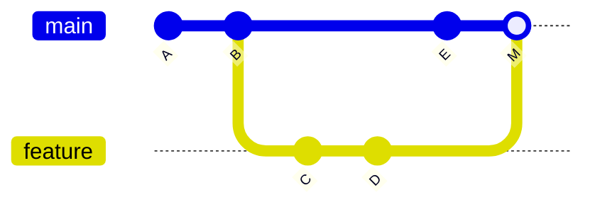
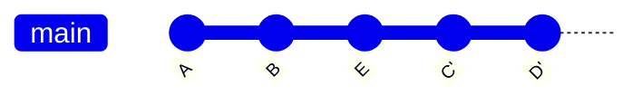
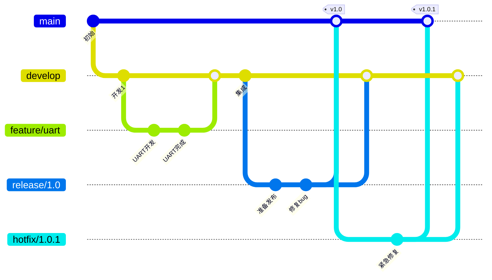

# Git版本控制进阶：掌握高级技巧与工作流


## 概述

在掌握了Git基础操作后，进一步学习Git的高级功能将大幅提升你的开发效率和团队协作能力。本教程将深入探讨Git的高级特性，包括变基、交互式操作、高级分支策略、子模块管理等内容。

### 为什么需要学习Git进阶？

**基础操作的局限**:
- ❌ 提交历史混乱，难以追踪
- ❌ 分支管理不规范，冲突频繁
- ❌ 无法高效处理复杂的合并场景
- ❌ 团队协作效率低下
- ❌ 缺乏自动化和工作流优化

**进阶技能的优势**:
- ✅ 保持清晰的提交历史
- ✅ 灵活处理分支和合并
- ✅ 高效解决复杂问题
- ✅ 优化团队协作流程
- ✅ 自动化重复性任务
- ✅ 深入理解Git内部机制

### 学习目标

完成本教程后，你将能够:

- [ ] 熟练使用rebase进行分支整理
- [ ] 掌握交互式rebase修改历史
- [ ] 使用cherry-pick精确选择提交
- [ ] 理解并应用高级分支策略
- [ ] 管理Git子模块和子树
- [ ] 使用Git钩子自动化任务
- [ ] 优化Git性能和仓库大小
- [ ] 处理复杂的合并和冲突场景


## Git Rebase详解

### Rebase vs Merge

理解rebase和merge的区别是掌握Git进阶的关键。

**Merge合并**:


**Rebase变基**:


**对比分析**:

| 特性 | Merge | Rebase |
|------|-------|--------|
| 历史记录 | 保留完整历史 | 线性历史 |
| 提交图 | 有分支合并点 | 直线型 |
| 冲突处理 | 一次性解决 | 逐个提交解决 |
| 安全性 | 安全，不改写历史 | 改写历史，需谨慎 |
| 适用场景 | 公共分支 | 本地分支整理 |

### 基本Rebase操作

**场景**: 将feature分支变基到main分支

```bash
# 当前在feature分支
git checkout feature

# 变基到main分支
git rebase main
```

**执行过程**:
1. Git找到feature和main的共同祖先
2. 提取feature分支上的所有提交
3. 将feature分支指向main的最新提交
4. 依次应用之前提取的提交

**示例**:
```bash
# 初始状态
# main:    A - B - E
# feature: A - B - C - D

git checkout feature
git rebase main

# 结果
# main:    A - B - E
# feature: A - B - E - C' - D'
```

### 处理Rebase冲突

在rebase过程中遇到冲突时:

```bash
# 1. Git会暂停并提示冲突
Auto-merging src/main.c
CONFLICT (content): Merge conflict in src/main.c
error: could not apply a1b2c3d... feat: 添加新功能

# 2. 查看冲突文件
git status

# 3. 编辑冲突文件，解决冲突
# 编辑src/main.c，删除冲突标记

# 4. 标记冲突已解决
git add src/main.c

# 5. 继续rebase
git rebase --continue

# 如果想放弃rebase
git rebase --abort

# 如果想跳过当前提交
git rebase --skip
```

### Rebase最佳实践

**黄金法则**: 永远不要rebase已经推送到公共仓库的提交！

**推荐使用场景**:
1. ✅ 整理本地分支的提交历史
2. ✅ 在推送前清理提交
3. ✅ 保持feature分支与main同步
4. ✅ 创建清晰的线性历史

**避免使用场景**:
1. ❌ 已推送到远程的分支
2. ❌ 多人协作的公共分支
3. ❌ 已被其他分支依赖的提交
4. ❌ 不熟悉rebase时的重要分支

**实用技巧**:
```bash
# 在pull时使用rebase
git pull --rebase origin main

# 配置默认使用rebase
git config --global pull.rebase true

# 保留合并提交的rebase
git rebase --preserve-merges main

# 交互式rebase（后面详细介绍）
git rebase -i HEAD~3
```


## 交互式Rebase

交互式rebase是Git最强大的功能之一，允许你修改、重排、合并、删除提交。

### 启动交互式Rebase

```bash
# 修改最近3次提交
git rebase -i HEAD~3

# 修改从某个提交开始的所有提交
git rebase -i <commit-hash>

# 修改到根提交
git rebase -i --root
```

### 交互式Rebase命令

执行后会打开编辑器，显示类似内容:

```
pick a1b2c3d feat: 添加GPIO驱动
pick d4e5f6g fix: 修复时钟配置
pick h7i8j9k docs: 更新README

# Rebase commands:
# p, pick = 使用提交
# r, reword = 使用提交，但修改提交信息
# e, edit = 使用提交，但停下来修改
# s, squash = 使用提交，但合并到前一个提交
# f, fixup = 类似squash，但丢弃提交信息
# x, exec = 运行shell命令
# d, drop = 删除提交
```

**命令说明**:

| 命令 | 简写 | 作用 |
|------|------|------|
| pick | p | 保留提交 |
| reword | r | 修改提交信息 |
| edit | e | 修改提交内容 |
| squash | s | 合并到前一个提交，保留信息 |
| fixup | f | 合并到前一个提交，丢弃信息 |
| exec | x | 执行shell命令 |
| drop | d | 删除提交 |

### 实用场景

#### 场景1: 修改提交信息

```bash
# 启动交互式rebase
git rebase -i HEAD~3

# 将pick改为reword
reword a1b2c3d feat: 添加GPIO驱动
pick d4e5f6g fix: 修复时钟配置
pick h7i8j9k docs: 更新README

# 保存后会打开编辑器让你修改提交信息
```

#### 场景2: 合并多个提交

```bash
# 启动交互式rebase
git rebase -i HEAD~3

# 将后续提交合并到第一个
pick a1b2c3d feat: 添加GPIO驱动
squash d4e5f6g feat: 完善GPIO驱动
squash h7i8j9k feat: 添加GPIO测试

# 保存后会打开编辑器让你编辑合并后的提交信息
```

**结果**: 三个提交合并为一个

#### 场景3: 拆分提交

```bash
# 启动交互式rebase
git rebase -i HEAD~3

# 将要拆分的提交标记为edit
pick a1b2c3d feat: 添加GPIO驱动
edit d4e5f6g feat: 添加多个功能  # 这个提交包含太多内容
pick h7i8j9k docs: 更新README

# 保存后Git会停在标记为edit的提交
# 撤销这个提交但保留修改
git reset HEAD~1

# 分别提交不同的修改
git add src/gpio.c
git commit -m "feat: 添加GPIO驱动"

git add src/uart.c
git commit -m "feat: 添加UART驱动"

# 继续rebase
git rebase --continue
```

#### 场景4: 重排提交顺序

```bash
# 启动交互式rebase
git rebase -i HEAD~3

# 调整提交顺序
pick h7i8j9k docs: 更新README
pick a1b2c3d feat: 添加GPIO驱动
pick d4e5f6g fix: 修复时钟配置

# 保存即可
```

#### 场景5: 删除提交

```bash
# 启动交互式rebase
git rebase -i HEAD~3

# 删除不需要的提交
pick a1b2c3d feat: 添加GPIO驱动
drop d4e5f6g test: 临时测试代码  # 删除这个提交
pick h7i8j9k docs: 更新README

# 或者直接删除该行
```

#### 场景6: 在每个提交后执行测试

```bash
# 启动交互式rebase
git rebase -i HEAD~3

# 在每个提交后运行测试
pick a1b2c3d feat: 添加GPIO驱动
exec make test
pick d4e5f6g fix: 修复时钟配置
exec make test
pick h7i8j9k docs: 更新README
exec make test

# 如果测试失败，rebase会停止
```

### 交互式Rebase注意事项

**安全提示**:
1. 只修改本地未推送的提交
2. 修改前创建备份分支: `git branch backup`
3. 如果出错，使用reflog恢复: `git reflog`
4. 团队协作时谨慎使用

**常见错误**:
```bash
# 错误: 修改了已推送的提交
# 解决: 使用git push -f（仅限个人分支）
git push -f origin feature-branch

# 错误: rebase过程中迷失方向
# 解决: 放弃rebase重新开始
git rebase --abort

# 错误: 不小心删除了重要提交
# 解决: 使用reflog找回
git reflog
git cherry-pick <commit-hash>
```


## Cherry-Pick精确选择

Cherry-pick允许你选择特定的提交应用到当前分支。

### 基本用法

```bash
# 应用单个提交
git cherry-pick <commit-hash>

# 应用多个提交
git cherry-pick <commit1> <commit2> <commit3>

# 应用提交范围（不包含start）
git cherry-pick <start-commit>..<end-commit>

# 应用提交范围（包含start）
git cherry-pick <start-commit>^..<end-commit>
```

### 实用场景

#### 场景1: 将bug修复应用到多个分支

```bash
# 在develop分支修复了bug
git checkout develop
git commit -m "fix: 修复内存泄漏问题"  # commit: a1b2c3d

# 将修复应用到release分支
git checkout release/1.0
git cherry-pick a1b2c3d

# 将修复应用到main分支
git checkout main
git cherry-pick a1b2c3d
```

#### 场景2: 从错误的分支提取提交

```bash
# 不小心在main分支开发了新功能
git checkout main
git commit -m "feat: 新功能"  # commit: d4e5f6g

# 创建正确的feature分支
git checkout -b feature/new-feature main~1

# 应用那个提交
git cherry-pick d4e5f6g

# 回到main分支撤销错误的提交
git checkout main
git reset --hard HEAD~1
```

#### 场景3: 选择性合并

```bash
# feature分支有10个提交，但只想要其中3个
git checkout main
git cherry-pick commit1 commit2 commit3
```

### Cherry-Pick选项

```bash
# 应用提交但不自动提交（可以修改）
git cherry-pick -n <commit-hash>
git cherry-pick --no-commit <commit-hash>

# 仅应用提交，不保留原作者信息
git cherry-pick -x <commit-hash>

# 编辑提交信息
git cherry-pick -e <commit-hash>
git cherry-pick --edit <commit-hash>

# 保留原提交的作者日期
git cherry-pick --keep-redundant-commits <commit-hash>
```

### 处理Cherry-Pick冲突

```bash
# 1. 执行cherry-pick
git cherry-pick a1b2c3d

# 2. 如果有冲突，Git会提示
error: could not apply a1b2c3d... feat: 添加新功能
hint: after resolving the conflicts, mark the corrected paths
hint: with 'git add <paths>' or 'git rm <paths>'
hint: and commit the result with 'git commit'

# 3. 解决冲突
# 编辑冲突文件

# 4. 标记已解决
git add <resolved-files>

# 5. 继续cherry-pick
git cherry-pick --continue

# 或者放弃
git cherry-pick --abort
```

### Cherry-Pick最佳实践

**适用场景**:
- ✅ 将bug修复应用到多个分支
- ✅ 从废弃分支提取有用的提交
- ✅ 选择性合并部分功能
- ✅ 紧急修复需要快速部署

**注意事项**:
- ⚠️ Cherry-pick会创建新的提交（不同的hash）
- ⚠️ 可能导致重复的修改
- ⚠️ 不适合大量提交的迁移
- ⚠️ 注意依赖关系，可能需要多个提交


## 高级分支策略

### Git Flow详解

Git Flow是一套完整的分支管理规范。

**分支类型**:

1. **main**: 生产环境代码
2. **develop**: 开发主分支
3. **feature/***: 功能开发分支
4. **release/***: 发布准备分支
5. **hotfix/***: 紧急修复分支

**完整流程**:



**详细操作**:

```bash
# 1. 初始化Git Flow
git flow init

# 2. 开始新功能
git flow feature start uart-driver
# 等价于
git checkout -b feature/uart-driver develop

# 3. 完成功能
git flow feature finish uart-driver
# 等价于
git checkout develop
git merge --no-ff feature/uart-driver
git branch -d feature/uart-driver

# 4. 开始发布
git flow release start 1.0.0
# 等价于
git checkout -b release/1.0.0 develop

# 5. 完成发布
git flow release finish 1.0.0
# 等价于
git checkout main
git merge --no-ff release/1.0.0
git tag -a v1.0.0
git checkout develop
git merge --no-ff release/1.0.0
git branch -d release/1.0.0

# 6. 开始热修复
git flow hotfix start 1.0.1
# 等价于
git checkout -b hotfix/1.0.1 main

# 7. 完成热修复
git flow hotfix finish 1.0.1
# 等价于
git checkout main
git merge --no-ff hotfix/1.0.1
git tag -a v1.0.1
git checkout develop
git merge --no-ff hotfix/1.0.1
git branch -d hotfix/1.0.1
```

### GitHub Flow

GitHub Flow是一种更简单的工作流，适合持续部署。

**核心原则**:
1. main分支始终可部署
2. 从main创建描述性分支
3. 定期推送到远程
4. 通过Pull Request合并
5. 合并后立即部署

**操作流程**:

```bash
# 1. 创建功能分支
git checkout -b feature/add-sensor main

# 2. 开发并提交
git add .
git commit -m "feat: 添加温度传感器"

# 3. 推送到远程
git push -u origin feature/add-sensor

# 4. 在GitHub上创建Pull Request

# 5. 代码审查和讨论

# 6. 合并到main（在GitHub上点击Merge）

# 7. 部署到生产环境

# 8. 删除功能分支
git branch -d feature/add-sensor
git push origin --delete feature/add-sensor
```

### Trunk-Based Development

主干开发是一种快速迭代的开发模式。

**核心思想**:
- 所有开发者在main分支上工作
- 使用短生命周期的分支（1-2天）
- 频繁集成到main
- 使用特性开关控制功能发布

**操作方式**:

```bash
# 1. 从main创建短期分支
git checkout -b task/add-feature main

# 2. 快速开发（1-2天内完成）
git add .
git commit -m "feat: 添加新功能"

# 3. 及时合并回main
git checkout main
git pull --rebase origin main
git merge task/add-feature
git push origin main

# 4. 删除短期分支
git branch -d task/add-feature
```

**特性开关示例**:

```c
// feature_flags.h
#define FEATURE_NEW_SENSOR_ENABLED 0

// main.c
#if FEATURE_NEW_SENSOR_ENABLED
    init_new_sensor();
#endif
```

### 分支策略对比

| 策略 | 复杂度 | 适用场景 | 发布频率 |
|------|--------|----------|----------|
| Git Flow | 高 | 定期发布的产品 | 周/月 |
| GitHub Flow | 中 | 持续部署的Web应用 | 天 |
| Trunk-Based | 低 | 快速迭代的项目 | 小时/天 |

**选择建议**:
- 嵌入式固件: Git Flow（需要严格的版本管理）
- Web后端: GitHub Flow（持续部署）
- 敏捷团队: Trunk-Based（快速迭代）


## Git子模块管理

子模块允许你在Git仓库中包含其他Git仓库。

### 添加子模块

```bash
# 添加子模块
git submodule add https://github.com/user/library.git libs/library

# 添加到指定目录
git submodule add https://github.com/user/hal.git drivers/hal

# 添加特定分支
git submodule add -b develop https://github.com/user/lib.git libs/lib
```

**结果**:
- 创建`.gitmodules`文件
- 在指定目录创建子模块
- 子模块作为特殊的提交记录

**.gitmodules文件**:
```ini
[submodule "libs/library"]
    path = libs/library
    url = https://github.com/user/library.git
    branch = main
```

### 克隆包含子模块的仓库

```bash
# 方法1: 克隆时初始化子模块
git clone --recursive https://github.com/user/project.git

# 方法2: 克隆后初始化子模块
git clone https://github.com/user/project.git
cd project
git submodule init
git submodule update

# 或者合并为一条命令
git submodule update --init --recursive
```

### 更新子模块

```bash
# 更新所有子模块到最新提交
git submodule update --remote

# 更新特定子模块
git submodule update --remote libs/library

# 更新并合并
git submodule update --remote --merge

# 更新并变基
git submodule update --remote --rebase
```

### 在子模块中工作

```bash
# 进入子模块目录
cd libs/library

# 子模块是一个完整的Git仓库
git checkout main
git pull origin main

# 进行修改
git add .
git commit -m "fix: 修复bug"
git push origin main

# 返回主项目
cd ../..

# 提交子模块的更新
git add libs/library
git commit -m "chore: 更新library子模块"
git push origin main
```

### 删除子模块

```bash
# 1. 删除子模块配置
git submodule deinit libs/library

# 2. 删除子模块目录
git rm libs/library

# 3. 删除.git/modules中的子模块
rm -rf .git/modules/libs/library

# 4. 提交更改
git commit -m "chore: 移除library子模块"
```

### 子模块最佳实践

**优点**:
- ✅ 明确的依赖版本
- ✅ 独立的版本控制
- ✅ 可以单独更新

**缺点**:
- ❌ 操作复杂
- ❌ 容易出错
- ❌ 团队成员需要理解子模块

**建议**:
1. 为子模块创建文档
2. 使用自动化脚本初始化
3. 定期更新子模块
4. 考虑使用Git Subtree作为替代


## Git Subtree

Git Subtree是子模块的替代方案，更简单但有不同的权衡。

### 添加Subtree

```bash
# 添加远程仓库
git remote add library-remote https://github.com/user/library.git

# 添加subtree
git subtree add --prefix=libs/library library-remote main --squash
```

### 更新Subtree

```bash
# 拉取更新
git subtree pull --prefix=libs/library library-remote main --squash
```

### 推送到Subtree

```bash
# 推送修改到上游
git subtree push --prefix=libs/library library-remote main
```

### Subtree vs Submodule

| 特性 | Submodule | Subtree |
|------|-----------|---------|
| 复杂度 | 高 | 低 |
| 历史记录 | 独立 | 合并 |
| 克隆 | 需要额外步骤 | 自动包含 |
| 更新 | 复杂 | 简单 |
| 推送修改 | 简单 | 复杂 |
| 仓库大小 | 小 | 大 |

**选择建议**:
- 需要频繁修改依赖: Submodule
- 只读依赖: Subtree
- 团队不熟悉Git: Subtree


## Git钩子(Hooks)

Git钩子是在特定Git事件发生时自动执行的脚本。

### 钩子类型

**客户端钩子**:
- `pre-commit`: 提交前执行
- `prepare-commit-msg`: 准备提交信息时
- `commit-msg`: 提交信息编辑后
- `post-commit`: 提交后执行
- `pre-push`: 推送前执行
- `pre-rebase`: 变基前执行

**服务器端钩子**:
- `pre-receive`: 接收推送前
- `update`: 更新引用前
- `post-receive`: 接收推送后

### 创建钩子

钩子脚本位于`.git/hooks/`目录。

#### 示例1: pre-commit检查代码格式

```bash
#!/bin/bash
# .git/hooks/pre-commit

echo "运行代码格式检查..."

# 检查C代码格式
files=$(git diff --cached --name-only --diff-filter=ACM | grep '\.c$')$')

if [ -n "$files" ]; then
    for file in $files; do
        # 使用clang-format检查
        clang-format -style=file "$file" | diff -u "$file" - > /dev/null
        if [ $? -ne 0 ]; then
            echo "错误: $file 格式不正确"
            echo "请运行: clang-format -i $file"
            exit 1
        fi
    done
fi

echo "代码格式检查通过"
exit 0
```

**使钩子可执行**:
```bash
chmod +x .git/hooks/pre-commit
```

#### 示例2: commit-msg检查提交信息

```bash
#!/bin/bash
# .git/hooks/commit-msg

commit_msg_file=$1
commit_msg=$(cat "$commit_msg_file")

# 检查提交信息格式: type(scope): subject
pattern="^(feat|fix|docs|style|refactor|test|chore)(\(.+\))?: .{1,50}"

if ! echo "$commit_msg" | grep -qE "$pattern"; then
    echo "错误: 提交信息格式不正确"
    echo "格式应为: type(scope): subject"
    echo "类型: feat, fix, docs, style, refactor, test, chore"
    echo "示例: feat(gpio): 添加GPIO驱动"
    exit 1
fi

echo "提交信息格式正确"
exit 0
```

#### 示例3: pre-push运行测试

```bash
#!/bin/bash
# .git/hooks/pre-push

echo "运行测试..."

# 运行单元测试
make test

if [ $? -ne 0 ]; then
    echo "错误: 测试失败，推送被阻止"
    exit 1
fi

echo "测试通过，允许推送"
exit 0
```

### 共享钩子

由于`.git/hooks`不被Git跟踪，需要其他方式共享钩子。

**方法1: 使用脚本目录**

```bash
# 项目结构
project/
├── .git/
├── scripts/
│   └── hooks/
│       ├── pre-commit
│       └── commit-msg
└── setup-hooks.sh

# setup-hooks.sh
#!/bin/bash
ln -sf ../../scripts/hooks/pre-commit .git/hooks/pre-commit
ln -sf ../../scripts/hooks/commit-msg .git/hooks/commit-msg
chmod +x .git/hooks/*
```

**方法2: 使用Git配置**

```bash
# 设置钩子目录
git config core.hooksPath scripts/hooks
```

### 钩子最佳实践

**设计原则**:
1. 快速执行（< 5秒）
2. 提供清晰的错误信息
3. 可以跳过（使用--no-verify）
4. 幂等性（多次执行结果相同）

**实用技巧**:
```bash
# 跳过pre-commit钩子
git commit --no-verify -m "紧急修复"

# 跳过pre-push钩子
git push --no-verify origin main
```


## Git Reflog恢复

Reflog记录了HEAD和分支引用的变化历史，是恢复丢失提交的救命稻草。

### 查看Reflog

```bash
# 查看HEAD的reflog
git reflog

# 查看特定分支的reflog
git reflog show main

# 查看详细信息
git reflog show --all
```

**输出示例**:
```
a1b2c3d HEAD@{0}: commit: feat: 添加新功能
d4e5f6g HEAD@{1}: rebase finished: returning to refs/heads/feature
h7i8j9k HEAD@{2}: rebase: feat: 修改功能
k1l2m3n HEAD@{3}: checkout: moving from main to feature
```

### 恢复场景

#### 场景1: 恢复被删除的分支

```bash
# 不小心删除了分支
git branch -D feature-important

# 查找分支最后的提交
git reflog

# 恢复分支
git branch feature-important a1b2c3d
```

#### 场景2: 恢复reset丢失的提交

```bash
# 不小心hard reset
git reset --hard HEAD~3

# 查找丢失的提交
git reflog

# 恢复到之前的状态
git reset --hard HEAD@{1}
```

#### 场景3: 恢复rebase前的状态

```bash
# rebase出错了
git rebase main

# 查找rebase前的状态
git reflog

# 恢复
git reset --hard HEAD@{1}
```

### Reflog配置

```bash
# 设置reflog保留时间（默认90天）
git config gc.reflogExpire 180.days

# 设置未引用对象的reflog保留时间（默认30天）
git config gc.reflogExpireUnreachable 60.days
```


## Git性能优化

### 仓库维护

```bash
# 清理不必要的文件并优化仓库
git gc

# 更激进的清理
git gc --aggressive --prune=now

# 查看仓库大小
git count-objects -vH
```

### 浅克隆

```bash
# 只克隆最近的提交
git clone --depth 1 https://github.com/user/repo.git

# 克隆最近10次提交
git clone --depth 10 https://github.com/user/repo.git

# 获取完整历史
git fetch --unshallow
```

### 部分克隆

```bash
# 只克隆特定分支
git clone --single-branch --branch main https://github.com/user/repo.git

# 稀疏检出（只检出部分文件）
git clone --filter=blob:none --sparse https://github.com/user/repo.git
cd repo
git sparse-checkout init --cone
git sparse-checkout set src/ docs/
```

### 大文件处理

**使用Git LFS**:

```bash
# 安装Git LFS
git lfs install

# 跟踪大文件
git lfs track "*.bin"
git lfs track "*.hex"

# 查看跟踪的文件
git lfs ls-files

# 提交
git add .gitattributes
git add firmware.bin
git commit -m "添加固件文件"
```

**.gitattributes示例**:
```
*.bin filter=lfs diff=lfs merge=lfs -text
*.hex filter=lfs diff=lfs merge=lfs -text
*.elf filter=lfs diff=lfs merge=lfs -text
```

### 清理历史中的大文件

```bash
# 使用BFG Repo-Cleaner
# 下载: https://rtyley.github.io/bfg-repo-cleaner/

# 删除大于10MB的文件
bfg --strip-blobs-bigger-than 10M repo.git

# 删除特定文件
bfg --delete-files firmware.bin repo.git

# 清理
cd repo.git
git reflog expire --expire=now --all
git gc --prune=now --aggressive
```


## 高级合并策略

### 合并策略选项

```bash
# 使用ours策略（保留当前分支）
git merge -s ours feature-branch

# 使用theirs策略（Git 2.20+）
git merge -X theirs feature-branch

# 递归策略（默认）
git merge -s recursive feature-branch

# 忽略空白字符
git merge -Xignore-space-change feature-branch

# 耐心合并算法
git merge -Xpatience feature-branch
```

### 三方合并

```bash
# 手动三方合并
git merge-base main feature  # 找到共同祖先
git merge-tree <base> <branch1> <branch2>
```

### 合并冲突高级处理

```bash
# 查看冲突的不同版本
git show :1:file.c  # 共同祖先版本
git show :2:file.c  # 当前分支版本
git show :3:file.c  # 要合并的分支版本

# 选择特定版本
git checkout --ours file.c    # 使用当前分支版本
git checkout --theirs file.c  # 使用要合并的分支版本

# 使用合并工具
git mergetool

# 配置合并工具
git config --global merge.tool vimdiff
git config --global mergetool.prompt false
```


## Git别名和配置优化

### 实用别名

```bash
# 添加到~/.gitconfig
[alias]
    # 简短命令
    st = status -sb
    co = checkout
    br = branch
    ci = commit
    unstage = reset HEAD
    
    # 日志相关
    lg = log --graph --pretty=format:'%Cred%h%Creset -%C(yellow)%d%Creset %s %Cgreen(%cr) %C(bold blue)<%an>%Creset' --abbrev-commit
    last = log -1 HEAD
    hist = log --pretty=format:'%h %ad | %s%d [%an]' --graph --date=short
    
    # 差异相关
    df = diff --color --color-words --abbrev
    dfs = diff --staged
    
    # 分支相关
    branches = branch -a
    tags = tag -l
    remotes = remote -v
    
    # 撤销相关
    undo = reset --soft HEAD~1
    amend = commit --amend --no-edit
    
    # 清理相关
    cleanup = "!git branch --merged | grep -v '\\*\\|main\\|develop' | xargs -n 1 git branch -d"
    
    # 查找相关
    find = "!git ls-files | grep -i"
    grep = grep -Ii
    
    # 贡献统计
    contributors = shortlog -sn
    
    # 工作进度
    save = stash save
    pop = stash pop
    
    # 同步
    sync = !git fetch --all && git pull --rebase
```


### 全局配置优化

```bash
# 用户信息
git config --global user.name "Your Name"
git config --global user.email "your.email@example.com"

# 编辑器
git config --global core.editor "vim"

# 差异工具
git config --global diff.tool vimdiff

# 合并工具
git config --global merge.tool vimdiff

# 颜色输出
git config --global color.ui auto

# 默认分支名
git config --global init.defaultBranch main

# Pull策略
git config --global pull.rebase true

# 推送策略
git config --global push.default current

# 自动修正拼写错误
git config --global help.autocorrect 1

# 忽略文件权限变化
git config --global core.fileMode false

# 处理换行符（Windows）
git config --global core.autocrlf true

# 处理换行符（Linux/Mac）
git config --global core.autocrlf input
```


## Git工作流最佳实践

### 提交信息规范

**Conventional Commits格式**:

```
<type>(<scope>): <subject>

<body>

<footer>
```

**类型(type)**:
- `feat`: 新功能
- `fix`: Bug修复
- `docs`: 文档更新
- `style`: 代码格式（不影响功能）
- `refactor`: 重构
- `perf`: 性能优化
- `test`: 测试相关
- `chore`: 构建/工具相关

**示例**:
```
feat(gpio): 添加GPIO中断支持

实现了GPIO外部中断功能，支持上升沿、下降沿和双边沿触发。
添加了中断回调注册机制。

Closes #123
```

### 分支命名规范

```
feature/功能名称    # 新功能
bugfix/问题描述     # Bug修复
hotfix/紧急修复     # 紧急修复
release/版本号      # 发布分支
docs/文档更新       # 文档
refactor/重构内容   # 重构
test/测试内容       # 测试
```

**示例**:
```bash
feature/add-uart-driver
bugfix/fix-memory-leak
hotfix/critical-security-fix
release/v1.2.0
docs/update-api-reference
```

### 提交频率建议

**推荐**:
- ✅ 完成一个逻辑单元就提交
- ✅ 每个提交都能通过编译
- ✅ 每个提交都有清晰的目的
- ✅ 一天至少提交一次

**避免**:
- ❌ 一次提交包含多个不相关的修改
- ❌ 提交无法编译的代码
- ❌ 提交信息含糊不清
- ❌ 长时间不提交积累大量修改

### 代码审查流程

**Pull Request最佳实践**:

1. **创建PR前**:
   - 确保代码通过所有测试
   - 更新相关文档
   - 自我审查代码
   - 保持PR小而专注

2. **PR描述**:
   ```markdown
   ## 变更说明
   添加了UART驱动支持
   
   ## 变更类型
   - [x] 新功能
   - [ ] Bug修复
   - [ ] 文档更新
   
   ## 测试
   - [x] 单元测试通过
   - [x] 集成测试通过
   - [x] 手动测试通过
   
   ## 相关Issue
   Closes #456
   
   ## 截图（如适用）
   [添加截图]
   ```

3. **审查清单**:
   - [ ] 代码符合编码规范
   - [ ] 有适当的注释
   - [ ] 有相应的测试
   - [ ] 文档已更新
   - [ ] 没有明显的性能问题
   - [ ] 没有安全隐患


## 常见问题与解决方案

### 问题1: 如何撤销已推送的提交？

**场景**: 不小心推送了错误的提交到远程仓库。

**解决方案**:

```bash
# 方法1: 使用revert（推荐，安全）
git revert <commit-hash>
git push origin main

# 方法2: 使用reset（仅限个人分支）
git reset --hard HEAD~1
git push -f origin feature-branch

# 方法3: 使用rebase（仅限个人分支）
git rebase -i HEAD~3
# 删除错误的提交
git push -f origin feature-branch
```

### 问题2: 如何合并多个提交？

**场景**: 本地有很多小提交，想合并后再推送。

**解决方案**:

```bash
# 方法1: 交互式rebase
git rebase -i HEAD~5
# 将后续提交标记为squash

# 方法2: 软重置后重新提交
git reset --soft HEAD~5
git commit -m "feat: 完整功能实现"

# 方法3: 合并时使用squash
git merge --squash feature-branch
git commit -m "feat: 合并功能分支"
```

### 问题3: 如何处理大量冲突？

**场景**: 合并时遇到大量冲突文件。

**解决方案**:

```bash
# 1. 使用合并工具
git mergetool

# 2. 分步解决
git merge --no-commit feature-branch
# 逐个解决冲突文件
git add <resolved-file>
# 继续解决下一个

# 3. 选择一方的修改
git checkout --ours .    # 保留当前分支
git checkout --theirs .  # 使用要合并的分支

# 4. 如果冲突太多，考虑重新规划合并策略
git merge --abort
# 尝试先合并部分提交
```

### 问题4: 如何找回删除的文件？

**场景**: 不小心删除了重要文件。

**解决方案**:

```bash
# 1. 如果还没提交
git checkout HEAD <file>

# 2. 如果已经提交
git log --all --full-history -- <file>
git checkout <commit-hash> -- <file>

# 3. 使用reflog
git reflog
git checkout <commit-hash> -- <file>

# 4. 恢复整个目录
git checkout <commit-hash> -- <directory>/
```

### 问题5: 如何清理本地分支？

**场景**: 本地有很多已合并的分支。

**解决方案**:

```bash
# 查看已合并的分支
git branch --merged

# 删除已合并的分支（排除main和develop）
git branch --merged | grep -v "\*\|main\|develop" | xargs -n 1 git branch -d

# 删除远程已删除的本地跟踪分支
git fetch --prune

# 查看远程分支状态
git remote prune origin --dry-run

# 清理远程分支
git remote prune origin
```

### 问题6: 如何处理detached HEAD？

**场景**: 检出了特定提交，处于detached HEAD状态。

**解决方案**:

```bash
# 1. 如果想保留修改
git branch temp-branch
git checkout main
git merge temp-branch

# 2. 如果不想保留修改
git checkout main

# 3. 如果已经提交了修改
git branch new-feature
git checkout new-feature
```


## 实战演练

### 演练1: 完整的功能开发流程

```bash
# 1. 更新main分支
git checkout main
git pull origin main

# 2. 创建功能分支
git checkout -b feature/add-spi-driver

# 3. 开发功能
# 编辑文件...
git add src/spi.c src/spi.h
git commit -m "feat(spi): 添加SPI基础驱动"

# 继续开发...
git add src/spi.c
git commit -m "feat(spi): 添加DMA支持"

# 4. 整理提交历史
git rebase -i HEAD~2
# 如果需要，合并提交

# 5. 同步main分支的更新
git fetch origin main
git rebase origin/main

# 6. 推送到远程
git push -u origin feature/add-spi-driver

# 7. 创建Pull Request（在GitHub/GitLab上）

# 8. 代码审查通过后，合并到main

# 9. 清理本地分支
git checkout main
git pull origin main
git branch -d feature/add-spi-driver
```

### 演练2: 紧急修复流程

```bash
# 1. 从main创建hotfix分支
git checkout main
git pull origin main
git checkout -b hotfix/fix-critical-bug

# 2. 修复bug
# 编辑文件...
git add src/critical.c
git commit -m "fix: 修复严重内存泄漏"

# 3. 测试修复
make test

# 4. 推送并合并到main
git push -u origin hotfix/fix-critical-bug
# 创建PR并快速审查

# 5. 合并到main后，也合并到develop
git checkout develop
git pull origin develop
git merge hotfix/fix-critical-bug
git push origin develop

# 6. 清理分支
git branch -d hotfix/fix-critical-bug
git push origin --delete hotfix/fix-critical-bug
```

### 演练3: 处理复杂冲突

```bash
# 1. 尝试合并
git checkout main
git merge feature/complex-feature

# 2. 发现冲突
# CONFLICT (content): Merge conflict in src/main.c

# 3. 查看冲突
git status
git diff

# 4. 使用合并工具
git mergetool

# 5. 或手动解决
# 编辑src/main.c，删除冲突标记
# <<<<<<< HEAD
# 当前分支的代码
# =======
# 要合并分支的代码
# >>>>>>> feature/complex-feature

# 6. 标记已解决
git add src/main.c

# 7. 完成合并
git commit

# 8. 验证
make test
```


## 进阶技巧总结

### Git命令速查表

**基础操作**:
```bash
git init                    # 初始化仓库
git clone <url>            # 克隆仓库
git add <file>             # 添加到暂存区
git commit -m "message"    # 提交
git push origin main       # 推送
git pull origin main       # 拉取
```

**分支操作**:
```bash
git branch                 # 查看分支
git branch <name>          # 创建分支
git checkout <name>        # 切换分支
git checkout -b <name>     # 创建并切换
git merge <branch>         # 合并分支
git branch -d <name>       # 删除分支
```

**历史操作**:
```bash
git log                    # 查看历史
git log --graph            # 图形化历史
git reflog                 # 查看引用日志
git reset --hard <commit>  # 重置到指定提交
git revert <commit>        # 撤销提交
git cherry-pick <commit>   # 应用提交
```

**高级操作**:
```bash
git rebase main            # 变基
git rebase -i HEAD~3       # 交互式变基
git stash                  # 暂存修改
git stash pop              # 恢复暂存
git submodule add <url>    # 添加子模块
git submodule update       # 更新子模块
```

### 学习资源

**官方文档**:
- [Git官方文档](https://git-scm.com/doc)
- [Pro Git书籍](https://git-scm.com/book/zh/v2)

**交互式学习**:
- [Learn Git Branching](https://learngitbranching.js.org/)
- [Git Immersion](http://gitimmersion.com/)

**视频教程**:
- [Git and GitHub for Beginners](https://www.youtube.com/watch?v=RGOj5yH7evk)
- [Advanced Git Tutorials](https://www.atlassian.com/git/tutorials/advanced-overview)

**实用工具**:
- [GitKraken](https://www.gitkraken.com/) - Git GUI客户端
- [SourceTree](https://www.sourcetreeapp.com/) - 免费Git GUI
- [Git Extensions](https://gitextensions.github.io/) - Windows Git工具


## 总结

通过本教程，你已经学习了Git的高级功能：

### 核心技能
- ✅ **Rebase**: 整理提交历史，保持线性
- ✅ **交互式Rebase**: 修改、合并、重排提交
- ✅ **Cherry-Pick**: 精确选择提交
- ✅ **分支策略**: Git Flow、GitHub Flow、Trunk-Based
- ✅ **子模块**: 管理依赖仓库
- ✅ **钩子**: 自动化工作流
- ✅ **Reflog**: 恢复丢失的提交
- ✅ **性能优化**: 维护和优化仓库

### 最佳实践
1. 保持提交历史清晰
2. 使用规范的提交信息
3. 频繁提交，小步前进
4. 定期同步远程分支
5. 谨慎使用改写历史的操作
6. 使用分支策略规范团队协作
7. 自动化重复性任务

### 下一步
- 在实际项目中应用这些技巧
- 学习团队的Git工作流
- 探索CI/CD集成
- 深入理解Git内部原理

记住：Git是一个强大的工具，但也需要谨慎使用。在修改历史或使用强制推送前，务必确保理解其影响。


## 练习题

### 练习1: Rebase实践
1. 创建一个feature分支
2. 在feature分支上提交3次
3. 在main分支上提交2次
4. 将feature分支rebase到main
5. 解决可能的冲突

### 练习2: 交互式Rebase
1. 创建5个提交
2. 使用交互式rebase合并其中3个
3. 修改一个提交信息
4. 重排提交顺序

### 练习3: Cherry-Pick
1. 在分支A上提交3次
2. 在分支B上cherry-pick其中2个提交
3. 解决可能的冲突

### 练习4: 子模块管理
1. 创建一个主项目
2. 添加一个子模块
3. 在子模块中进行修改
4. 更新主项目中的子模块引用

### 练习5: Git钩子
1. 创建pre-commit钩子检查代码格式
2. 创建commit-msg钩子验证提交信息
3. 创建pre-push钩子运行测试

### 练习6: 恢复操作
1. 创建一些提交
2. 使用reset删除提交
3. 使用reflog找回删除的提交
4. 恢复删除的分支


## 参考资料

### 命令参考
- `git rebase --help` - Rebase帮助
- `git cherry-pick --help` - Cherry-pick帮助
- `git submodule --help` - 子模块帮助
- `git reflog --help` - Reflog帮助

### 配置文件
- `~/.gitconfig` - 全局配置
- `.git/config` - 仓库配置
- `.gitignore` - 忽略文件
- `.gitattributes` - 文件属性
- `.gitmodules` - 子模块配置

### 相关文章
- [Git分支管理策略](https://nvie.com/posts/a-successful-git-branching-model/)
- [Conventional Commits](https://www.conventionalcommits.org/)
- [Git内部原理](https://git-scm.com/book/zh/v2/Git-内部原理-底层命令与上层命令)

---

**作者**: 嵌入式知识平台  
**最后更新**: 2024-01-15  
**版本**: 1.0  
**许可**: CC BY-NC-SA 4.0
