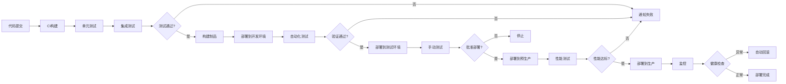
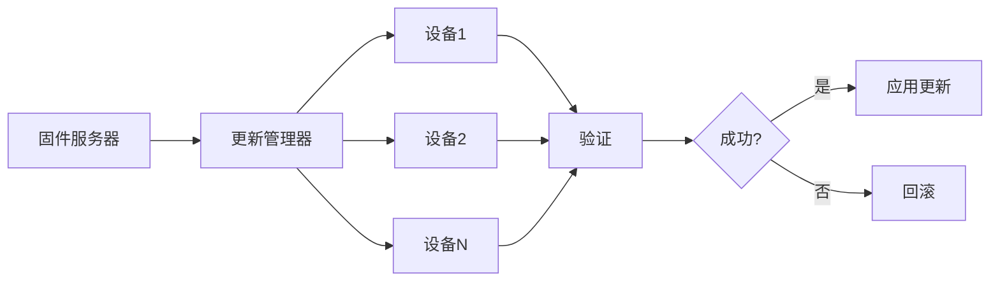



# 持续部署流程设计：自动化部署与发布管理


## 概述

持续部署(Continuous Deployment, CD)是持续集成(CI)的自然延伸，它将经过测试验证的代码自动部署到目标环境。对于嵌入式系统，CD流程需要考虑硬件特性、固件更新机制和生产环境的特殊要求。

### 什么是持续部署？

**持续部署的核心理念**:
- 自动化将代码变更部署到生产环境
- 每次代码提交都可能触发部署
- 通过自动化测试保证质量
- 快速交付价值给用户
- 降低部署风险和成本

**CD vs CI vs CD**:
- **CI (Continuous Integration)**: 持续集成 - 自动构建和测试
- **CD (Continuous Delivery)**: 持续交付 - 自动化到可部署状态，手动部署
- **CD (Continuous Deployment)**: 持续部署 - 完全自动化部署到生产环境

### 嵌入式系统的CD挑战

**特殊挑战**:
- ❌ 硬件依赖性强，难以完全自动化
- ❌ 固件更新需要物理接触或OTA机制
- ❌ 部署失败可能导致设备变砖
- ❌ 生产环境测试困难
- ❌ 回滚机制复杂
- ❌ 多设备批量更新风险高

**解决方案**:
- ✅ 分阶段部署策略
- ✅ 完善的测试环境
- ✅ 可靠的OTA更新机制
- ✅ 自动回滚能力
- ✅ 灰度发布和金丝雀部署
- ✅ 完整的监控和告警系统

### 学习目标

完成本文后，你将能够:

- [ ] 理解CD流程的核心概念
- [ ] 设计完整的部署流水线
- [ ] 选择合适的部署策略
- [ ] 实现环境管理和配置
- [ ] 建立回滚机制
- [ ] 掌握嵌入式系统的部署最佳实践


## CD流程架构

### 完整的CD流水线



### 环境层级

**典型环境配置**:

1. **开发环境 (Development)**
   - 用途: 开发人员日常开发和调试
   - 更新频率: 每次提交
   - 稳定性要求: 低
   - 自动化程度: 完全自动

2. **测试环境 (Testing/QA)**
   - 用途: QA团队功能测试
   - 更新频率: 每日或每次Sprint
   - 稳定性要求: 中
   - 自动化程度: 半自动（需要批准）

3. **预生产环境 (Staging/Pre-production)**
   - 用途: 生产环境的镜像，最终验证
   - 更新频率: 每周或每次发布前
   - 稳定性要求: 高
   - 自动化程度: 手动批准

4. **生产环境 (Production)**
   - 用途: 实际用户使用
   - 更新频率: 按发布计划
   - 稳定性要求: 最高
   - 自动化程度: 严格控制的自动化


## 部署策略

### 1. 蓝绿部署 (Blue-Green Deployment)

**原理**:
- 维护两套完全相同的生产环境（蓝和绿）
- 一套运行当前版本，另一套部署新版本
- 验证通过后切换流量到新版本
- 出问题可以快速切回旧版本

**优点**:
- ✅ 零停机时间
- ✅ 快速回滚
- ✅ 完整的测试环境
- ✅ 降低部署风险

**缺点**:
- ❌ 需要双倍资源
- ❌ 数据库迁移复杂
- ❌ 成本较高

**嵌入式应用场景**:
```
设备A组 (蓝) - 运行v1.0固件
设备B组 (绿) - 部署v1.1固件
验证通过后 → 切换所有流量到B组
如有问题 → 立即切回A组
```

**实现示例**:
```yaml
# GitLab CI配置
deploy_blue:
  stage: deploy
  script:
    - echo "部署到蓝环境..."
    - ansible-playbook -i inventory/blue deploy.yml
  environment:
    name: production-blue
    url: http://blue.example.com
  when: manual

switch_to_blue:
  stage: switch
  script:
    - echo "切换流量到蓝环境..."
    - ./scripts/switch-traffic.sh blue
  when: manual
  needs:
    - deploy_blue
```

### 2. 金丝雀部署 (Canary Deployment)

**原理**:
- 先将新版本部署到一小部分设备（金丝雀）
- 监控金丝雀设备的表现
- 逐步扩大部署范围
- 发现问题立即停止

**优点**:
- ✅ 降低风险
- ✅ 早期发现问题
- ✅ 渐进式验证
- ✅ 用户影响最小

**缺点**:
- ❌ 部署时间较长
- ❌ 需要复杂的流量控制
- ❌ 监控要求高

**部署阶段**:
```
阶段1: 5%设备  → 监控24小时
阶段2: 25%设备 → 监控12小时
阶段3: 50%设备 → 监控6小时
阶段4: 100%设备 → 持续监控
```

**实现示例**:
```python
# 金丝雀部署脚本
def canary_deployment(version, stages):
    """
    stages = [
        {'percentage': 5, 'duration': 24},   # 5%设备，监控24小时
        {'percentage': 25, 'duration': 12},  # 25%设备，监控12小时
        {'percentage': 50, 'duration': 6},   # 50%设备，监控6小时
        {'percentage': 100, 'duration': 0}   # 全量部署
    ]
    """
    for stage in stages:
        # 部署到指定百分比的设备
        deploy_to_percentage(version, stage['percentage'])
        
        # 监控指定时间
        if not monitor_health(duration=stage['duration']):
            # 发现问题，回滚
            rollback(version)
            return False
    
    return True
```


### 3. 滚动部署 (Rolling Deployment)

**原理**:
- 逐批次更新设备
- 每批次完成后验证
- 继续下一批次
- 保持服务可用性

**优点**:
- ✅ 不需要额外资源
- ✅ 渐进式部署
- ✅ 可以随时暂停

**缺点**:
- ❌ 部署时间长
- ❌ 版本共存复杂
- ❌ 回滚困难

**批次策略**:
```
批次1: 10台设备 → 验证
批次2: 50台设备 → 验证
批次3: 200台设备 → 验证
批次4: 剩余所有设备
```

### 4. A/B测试部署

**原理**:
- 同时运行两个版本
- 根据用户特征分配版本
- 收集数据对比效果
- 选择最优版本全量部署

**应用场景**:
- 新功能验证
- 性能优化对比
- 用户体验测试

**实现示例**:
```python
def ab_test_routing(device_id, version_a, version_b):
    """根据设备ID分配版本"""
    # 使用哈希确保同一设备总是获得相同版本
    hash_value = hash(device_id) % 100
    
    if hash_value < 50:
        return version_a  # 50%设备使用版本A
    else:
        return version_b  # 50%设备使用版本B
```

### 5. 特性开关 (Feature Flags)

**原理**:
- 代码中包含新旧功能
- 通过配置开关控制启用
- 可以动态切换功能
- 降低部署风险

**优点**:
- ✅ 代码和部署解耦
- ✅ 快速启用/禁用功能
- ✅ 支持A/B测试
- ✅ 降低回滚复杂度

**代码示例**:
```c
// feature_flags.h
#define FEATURE_NEW_ALGORITHM_ENABLED 0
#define FEATURE_ADVANCED_LOGGING 1

// main.c
void process_data(void) {
    #if FEATURE_NEW_ALGORITHM_ENABLED
        // 新算法
        new_algorithm_process();
    #else
        // 旧算法
        legacy_algorithm_process();
    #endif
}

// 或使用运行时配置
void process_data(void) {
    if (config_get_feature_flag("new_algorithm")) {
        new_algorithm_process();
    } else {
        legacy_algorithm_process();
    }
}
```


## 环境管理

### 环境配置管理

**配置分离原则**:
- 代码和配置分离
- 不同环境使用不同配置
- 敏感信息加密存储
- 版本化管理配置

**配置文件结构**:
```
config/
├── common.yml          # 通用配置
├── development.yml     # 开发环境
├── testing.yml         # 测试环境
├── staging.yml         # 预生产环境
└── production.yml      # 生产环境
```

**配置示例**:
```yaml
# config/production.yml
environment: production

server:
  host: prod-server.example.com
  port: 8080
  ssl_enabled: true

database:
  host: db-prod.example.com
  port: 5432
  name: firmware_db
  pool_size: 20

firmware:
  update_server: https://ota.example.com
  update_interval: 3600
  rollback_enabled: true

logging:
  level: INFO
  remote_logging: true
  log_server: logs.example.com

monitoring:
  enabled: true
  metrics_endpoint: https://metrics.example.com
  alert_email: ops@example.com
```

### 环境变量管理

**Jenkins环境变量**:
```groovy
pipeline {
    agent any
    
    environment {
        // 全局环境变量
        PROJECT_NAME = 'STM32_Firmware'
        BUILD_TYPE = 'Release'
    }
    
    stages {
        stage('Deploy to Production') {
            environment {
                // 阶段特定环境变量
                DEPLOY_SERVER = credentials('prod-server')
                API_KEY = credentials('prod-api-key')
            }
            steps {
                sh '''
                    echo "部署到: $DEPLOY_SERVER"
                    ./deploy.sh --env production --api-key $API_KEY
                '''
            }
        }
    }
}
```

**GitLab CI环境变量**:
```yaml
# 在GitLab项目设置中配置变量
# Settings → CI/CD → Variables

deploy_production:
  stage: deploy
  script:
    - echo "部署服务器: $PROD_SERVER"
    - echo "API密钥: $PROD_API_KEY"
    - ./deploy.sh --server $PROD_SERVER --key $PROD_API_KEY
  environment:
    name: production
    url: https://prod.example.com
  only:
    - main
```

### 密钥管理

**最佳实践**:
1. 永远不要在代码中硬编码密钥
2. 使用专门的密钥管理工具
3. 定期轮换密钥
4. 限制密钥访问权限
5. 审计密钥使用

**工具选择**:
- **HashiCorp Vault**: 企业级密钥管理
- **AWS Secrets Manager**: AWS云环境
- **Azure Key Vault**: Azure云环境
- **Kubernetes Secrets**: K8s环境

**Vault使用示例**:
```bash
# 存储密钥
vault kv put secret/prod/database \
    username=admin \
    password=secure_password

# 读取密钥
vault kv get secret/prod/database

# 在CI中使用
export DB_PASSWORD=$(vault kv get -field=password secret/prod/database)
```


## 回滚机制

### 回滚策略

**回滚触发条件**:
- 部署后健康检查失败
- 错误率超过阈值
- 性能指标下降
- 用户投诉激增
- 手动触发回滚

**回滚类型**:

1. **自动回滚**
   - 基于监控指标自动触发
   - 快速响应问题
   - 减少人工干预

2. **手动回滚**
   - 需要人工判断和批准
   - 适用于复杂场景
   - 更加谨慎

### 版本管理

**语义化版本控制**:
```
主版本号.次版本号.修订号
例如: 1.2.3

主版本号: 不兼容的API修改
次版本号: 向下兼容的功能新增
修订号: 向下兼容的问题修正
```

**版本标记**:
```bash
# Git标签
git tag -a v1.2.3 -m "Release version 1.2.3"
git push origin v1.2.3

# 查看所有版本
git tag -l

# 回滚到特定版本
git checkout v1.2.2
```

### 固件回滚实现

**双分区方案**:
```
Flash布局:
├── Bootloader (64KB)
├── Partition A (512KB) - 当前运行版本
├── Partition B (512KB) - 备份版本
└── Config (64KB)     - 配置和标志
```

**回滚流程**:
```c
// bootloader.c
typedef struct {
    uint32_t version;
    uint32_t crc;
    uint8_t  valid;
    uint8_t  active;
} partition_info_t;

void bootloader_main(void) {
    partition_info_t part_a, part_b;
    
    // 读取分区信息
    read_partition_info(PARTITION_A, &part_a);
    read_partition_info(PARTITION_B, &part_b);
    
    // 检查当前分区
    if (part_a.active && verify_partition(PARTITION_A)) {
        // 分区A有效，启动
        boot_from_partition(PARTITION_A);
    } else if (part_b.valid && verify_partition(PARTITION_B)) {
        // 分区A失败，回滚到分区B
        log_error("Partition A failed, rolling back to B");
        boot_from_partition(PARTITION_B);
    } else {
        // 两个分区都失败，进入恢复模式
        enter_recovery_mode();
    }
}
```

**OTA更新回滚**:
```python
# ota_update.py
class OTAUpdate:
    def __init__(self):
        self.current_version = self.get_current_version()
        self.backup_version = self.get_backup_version()
    
    def update(self, new_firmware):
        """执行OTA更新"""
        try:
            # 1. 下载新固件到备份分区
            self.download_firmware(new_firmware, PARTITION_B)
            
            # 2. 验证固件
            if not self.verify_firmware(PARTITION_B):
                raise Exception("Firmware verification failed")
            
            # 3. 标记新固件为活动
            self.mark_active(PARTITION_B)
            
            # 4. 重启设备
            self.reboot()
            
            # 5. 启动后验证（在新固件中执行）
            if not self.post_update_check():
                # 验证失败，自动回滚
                self.rollback()
        
        except Exception as e:
            log_error(f"Update failed: {e}")
            self.rollback()
    
    def rollback(self):
        """回滚到上一个版本"""
        log_info(f"Rolling back to version {self.backup_version}")
        
        # 1. 标记备份分区为活动
        self.mark_active(PARTITION_A)
        
        # 2. 重启设备
        self.reboot()
```


## 嵌入式系统部署实践

### OTA (Over-The-Air) 更新

**OTA架构**:


**OTA更新流程**:
```python
# ota_client.py
import hashlib
import requests

class OTAClient:
    def __init__(self, server_url, device_id):
        self.server_url = server_url
        self.device_id = device_id
        self.current_version = self.get_current_version()
    
    def check_update(self):
        """检查是否有新版本"""
        response = requests.get(
            f"{self.server_url}/api/check_update",
            params={
                'device_id': self.device_id,
                'current_version': self.current_version
            }
        )
        
        if response.status_code == 200:
            data = response.json()
            if data['update_available']:
                return data['new_version'], data['download_url']
        
        return None, None
    
    def download_firmware(self, url, target_file):
        """下载固件"""
        response = requests.get(url, stream=True)
        total_size = int(response.headers.get('content-length', 0))
        
        with open(target_file, 'wb') as f:
            downloaded = 0
            for chunk in response.iter_content(chunk_size=8192):
                if chunk:
                    f.write(chunk)
                    downloaded += len(chunk)
                    progress = (downloaded / total_size) * 100
                    print(f"下载进度: {progress:.1f}%")
    
    def verify_firmware(self, firmware_file, expected_hash):
        """验证固件完整性"""
        sha256_hash = hashlib.sha256()
        with open(firmware_file, "rb") as f:
            for byte_block in iter(lambda: f.read(4096), b""):
                sha256_hash.update(byte_block)
        
        return sha256_hash.hexdigest() == expected_hash
    
    def apply_update(self, firmware_file):
        """应用更新"""
        # 1. 写入固件到备份分区
        self.write_to_backup_partition(firmware_file)
        
        # 2. 标记备份分区为待启动
        self.mark_pending_boot()
        
        # 3. 重启设备
        self.reboot()
    
    def perform_update(self):
        """执行完整的OTA更新流程"""
        # 1. 检查更新
        new_version, download_url = self.check_update()
        if not new_version:
            print("已是最新版本")
            return
        
        print(f"发现新版本: {new_version}")
        
        # 2. 下载固件
        firmware_file = f"/tmp/firmware_{new_version}.bin"
        self.download_firmware(download_url, firmware_file)
        
        # 3. 验证固件
        expected_hash = self.get_firmware_hash(new_version)
        if not self.verify_firmware(firmware_file, expected_hash):
            print("固件验证失败")
            return
        
        # 4. 应用更新
        self.apply_update(firmware_file)
```

### 批量设备管理

**设备分组策略**:
```python
# device_groups.py
class DeviceGroupManager:
    def __init__(self):
        self.groups = {
            'canary': [],      # 金丝雀设备（5%）
            'early': [],       # 早期采用者（20%）
            'general': [],     # 一般设备（70%）
            'conservative': [] # 保守设备（5%）
        }
    
    def assign_device_to_group(self, device_id):
        """根据策略分配设备到组"""
        # 使用哈希确保稳定分配
        hash_value = hash(device_id) % 100
        
        if hash_value < 5:
            return 'canary'
        elif hash_value < 25:
            return 'early'
        elif hash_value < 95:
            return 'general'
        else:
            return 'conservative'
    
    def get_deployment_schedule(self, version):
        """获取部署计划"""
        return [
            {
                'group': 'canary',
                'delay': 0,           # 立即部署
                'monitor_hours': 24
            },
            {
                'group': 'early',
                'delay': 24,          # 24小时后
                'monitor_hours': 12
            },
            {
                'group': 'general',
                'delay': 36,          # 36小时后
                'monitor_hours': 6
            },
            {
                'group': 'conservative',
                'delay': 42,          # 42小时后
                'monitor_hours': 0
            }
        ]
```


### 固件签名和验证

**数字签名流程**:
```bash
# 1. 生成密钥对
openssl genrsa -out private_key.pem 2048
openssl rsa -in private_key.pem -pubout -out public_key.pem

# 2. 签名固件
openssl dgst -sha256 -sign private_key.pem \
    -out firmware.sig firmware.bin

# 3. 验证签名
openssl dgst -sha256 -verify public_key.pem \
    -signature firmware.sig firmware.bin
```

**嵌入式设备验证**:
```c
// firmware_verify.c
#include <mbedtls/rsa.h>
#include <mbedtls/sha256.h>

int verify_firmware_signature(
    const uint8_t *firmware,
    size_t firmware_len,
    const uint8_t *signature,
    size_t sig_len
) {
    mbedtls_rsa_context rsa;
    mbedtls_sha256_context sha256;
    uint8_t hash[32];
    int ret;
    
    // 1. 计算固件哈希
    mbedtls_sha256_init(&sha256);
    mbedtls_sha256_starts(&sha256, 0);
    mbedtls_sha256_update(&sha256, firmware, firmware_len);
    mbedtls_sha256_finish(&sha256, hash);
    
    // 2. 初始化RSA上下文
    mbedtls_rsa_init(&rsa, MBEDTLS_RSA_PKCS_V15, 0);
    
    // 3. 加载公钥（嵌入在固件中）
    ret = load_public_key(&rsa);
    if (ret != 0) {
        return -1;
    }
    
    // 4. 验证签名
    ret = mbedtls_rsa_pkcs1_verify(
        &rsa,
        NULL, NULL,
        MBEDTLS_RSA_PUBLIC,
        MBEDTLS_MD_SHA256,
        32,
        hash,
        signature
    );
    
    mbedtls_rsa_free(&rsa);
    
    return ret == 0 ? 1 : 0;
}
```

### 部署监控

**关键指标**:
```python
# monitoring.py
class DeploymentMonitor:
    def __init__(self):
        self.metrics = {
            'success_rate': 0.0,
            'failure_rate': 0.0,
            'rollback_rate': 0.0,
            'avg_update_time': 0.0,
            'device_health': {}
        }
    
    def monitor_deployment(self, deployment_id):
        """监控部署过程"""
        while True:
            # 1. 收集指标
            metrics = self.collect_metrics(deployment_id)
            
            # 2. 检查健康状态
            if metrics['failure_rate'] > 0.05:  # 失败率超过5%
                self.alert("高失败率", metrics)
                self.pause_deployment(deployment_id)
            
            if metrics['error_rate'] > 0.10:  # 错误率超过10%
                self.alert("高错误率", metrics)
                self.trigger_rollback(deployment_id)
            
            # 3. 更新仪表板
            self.update_dashboard(metrics)
            
            # 4. 等待下一次检查
            time.sleep(60)
    
    def collect_metrics(self, deployment_id):
        """收集部署指标"""
        devices = self.get_deployment_devices(deployment_id)
        
        total = len(devices)
        success = sum(1 for d in devices if d.status == 'success')
        failed = sum(1 for d in devices if d.status == 'failed')
        rollback = sum(1 for d in devices if d.status == 'rollback')
        
        return {
            'total_devices': total,
            'success_count': success,
            'failure_count': failed,
            'rollback_count': rollback,
            'success_rate': success / total if total > 0 else 0,
            'failure_rate': failed / total if total > 0 else 0,
            'rollback_rate': rollback / total if total > 0 else 0
        }
```


## CD流水线实现

### Jenkins CD Pipeline

```groovy
// Jenkinsfile
pipeline {
    agent any
    
    parameters {
        choice(
            name: 'DEPLOY_ENV',
            choices: ['dev', 'test', 'staging', 'production'],
            description: '选择部署环境'
        )
        choice(
            name: 'DEPLOY_STRATEGY',
            choices: ['rolling', 'blue-green', 'canary'],
            description: '选择部署策略'
        )
    }
    
    environment {
        FIRMWARE_VERSION = "${env.BUILD_NUMBER}"
        DEPLOY_SERVER = credentials('deploy-server')
    }
    
    stages {
        stage('Build') {
            steps {
                sh '''
                    make clean
                    make all VERSION=${FIRMWARE_VERSION}
                '''
            }
        }
        
        stage('Test') {
            steps {
                sh 'make test'
            }
        }
        
        stage('Package') {
            steps {
                sh '''
                    mkdir -p release
                    cp build/*.bin release/
                    cd release && tar -czf firmware-${FIRMWARE_VERSION}.tar.gz *
                '''
                archiveArtifacts 'release/*.tar.gz'
            }
        }
        
        stage('Deploy to Dev') {
            when {
                expression { params.DEPLOY_ENV == 'dev' }
            }
            steps {
                sh './scripts/deploy.sh dev ${FIRMWARE_VERSION}'
            }
        }
        
        stage('Deploy to Test') {
            when {
                expression { params.DEPLOY_ENV == 'test' }
            }
            steps {
                input message: '确认部署到测试环境?'
                sh './scripts/deploy.sh test ${FIRMWARE_VERSION}'
            }
        }
        
        stage('Deploy to Staging') {
            when {
                expression { params.DEPLOY_ENV == 'staging' }
            }
            steps {
                input message: '确认部署到预生产环境?'
                sh './scripts/deploy.sh staging ${FIRMWARE_VERSION}'
                
                // 运行冒烟测试
                sh './scripts/smoke-test.sh staging'
            }
        }
        
        stage('Deploy to Production') {
            when {
                expression { params.DEPLOY_ENV == 'production' }
            }
            steps {
                script {
                    // 需要多人批准
                    def approvers = ['manager', 'tech-lead']
                    input message: '确认部署到生产环境?',
                          submitter: approvers.join(',')
                    
                    // 根据策略部署
                    if (params.DEPLOY_STRATEGY == 'blue-green') {
                        sh './scripts/deploy-blue-green.sh ${FIRMWARE_VERSION}'
                    } else if (params.DEPLOY_STRATEGY == 'canary') {
                        sh './scripts/deploy-canary.sh ${FIRMWARE_VERSION}'
                    } else {
                        sh './scripts/deploy-rolling.sh ${FIRMWARE_VERSION}'
                    }
                }
            }
        }
        
        stage('Monitor') {
            when {
                expression { params.DEPLOY_ENV == 'production' }
            }
            steps {
                sh './scripts/monitor-deployment.sh ${FIRMWARE_VERSION}'
            }
        }
    }
    
    post {
        success {
            emailext (
                subject: "✓ 部署成功: ${params.DEPLOY_ENV} - v${FIRMWARE_VERSION}",
                body: """
                    环境: ${params.DEPLOY_ENV}
                    版本: ${FIRMWARE_VERSION}
                    策略: ${params.DEPLOY_STRATEGY}
                    状态: 成功
                """,
                to: 'team@example.com'
            )
        }
        failure {
            emailext (
                subject: "✗ 部署失败: ${params.DEPLOY_ENV} - v${FIRMWARE_VERSION}",
                body: """
                    环境: ${params.DEPLOY_ENV}
                    版本: ${FIRMWARE_VERSION}
                    状态: 失败
                    
                    查看日志: ${BUILD_URL}console
                """,
                to: 'team@example.com'
            )
        }
    }
}
```


### GitLab CD Pipeline

```yaml
# .gitlab-ci.yml
stages:
  - build
  - test
  - package
  - deploy_dev
  - deploy_test
  - deploy_staging
  - deploy_production

variables:
  FIRMWARE_VERSION: "1.0.${CI_PIPELINE_ID}"

# 构建阶段
build:
  stage: build
  script:
    - make clean
    - make all VERSION=$FIRMWARE_VERSION
  artifacts:
    paths:
      - build/
    expire_in: 1 week

# 测试阶段
test:
  stage: test
  dependencies:
    - build
  script:
    - make test

# 打包阶段
package:
  stage: package
  dependencies:
    - build
  script:
    - mkdir -p release
    - cp build/*.bin release/
    - cd release && tar -czf firmware-${FIRMWARE_VERSION}.tar.gz *
  artifacts:
    paths:
      - release/*.tar.gz
    expire_in: 30 days

# 部署到开发环境
deploy_dev:
  stage: deploy_dev
  dependencies:
    - package
  script:
    - ./scripts/deploy.sh dev $FIRMWARE_VERSION
  environment:
    name: development
    url: http://dev.example.com
  only:
    - develop

# 部署到测试环境
deploy_test:
  stage: deploy_test
  dependencies:
    - package
  script:
    - ./scripts/deploy.sh test $FIRMWARE_VERSION
    - ./scripts/smoke-test.sh test
  environment:
    name: testing
    url: http://test.example.com
  only:
    - develop
  when: manual

# 部署到预生产环境
deploy_staging:
  stage: deploy_staging
  dependencies:
    - package
  script:
    - ./scripts/deploy.sh staging $FIRMWARE_VERSION
    - ./scripts/integration-test.sh staging
  environment:
    name: staging
    url: http://staging.example.com
  only:
    - main
  when: manual

# 金丝雀部署到生产环境
deploy_production_canary:
  stage: deploy_production
  dependencies:
    - package
  script:
    - echo "金丝雀部署 - 5%设备"
    - ./scripts/deploy-canary.sh $FIRMWARE_VERSION 5
    - sleep 3600  # 监控1小时
    - ./scripts/check-health.sh
  environment:
    name: production-canary
    url: http://prod.example.com
  only:
    - tags
  when: manual

# 全量部署到生产环境
deploy_production_full:
  stage: deploy_production
  dependencies:
    - package
  script:
    - echo "全量部署到生产环境"
    - ./scripts/deploy-rolling.sh $FIRMWARE_VERSION
  environment:
    name: production
    url: http://prod.example.com
  only:
    - tags
  when: manual
  needs:
    - deploy_production_canary

# 回滚
rollback_production:
  stage: deploy_production
  script:
    - echo "回滚到上一个版本"
    - ./scripts/rollback.sh
  environment:
    name: production
    url: http://prod.example.com
  when: manual
  only:
    - tags
```


## 部署脚本示例

### 通用部署脚本

```bash
#!/bin/bash
# deploy.sh - 通用部署脚本

set -e

ENVIRONMENT=$1
VERSION=$2

if [ -z "$ENVIRONMENT" ] || [ -z "$VERSION" ]; then
    echo "用法: $0 <environment> <version>"
    exit 1
fi

echo "========================================="
echo "部署固件到 $ENVIRONMENT 环境"
echo "版本: $VERSION"
echo "========================================="

# 加载环境配置
source config/${ENVIRONMENT}.env

# 1. 验证固件
echo "验证固件..."
if [ ! -f "release/firmware-${VERSION}.tar.gz" ]; then
    echo "错误: 固件文件不存在"
    exit 1
fi

# 2. 解压固件
echo "解压固件..."
mkdir -p /tmp/firmware-${VERSION}
tar -xzf release/firmware-${VERSION}.tar.gz -C /tmp/firmware-${VERSION}

# 3. 验证签名
echo "验证固件签名..."
openssl dgst -sha256 -verify public_key.pem \
    -signature /tmp/firmware-${VERSION}/firmware.sig \
    /tmp/firmware-${VERSION}/firmware.bin

if [ $? -ne 0 ]; then
    echo "错误: 固件签名验证失败"
    exit 1
fi

# 4. 上传到服务器
echo "上传固件到服务器..."
scp /tmp/firmware-${VERSION}/firmware.bin \
    ${DEPLOY_USER}@${DEPLOY_SERVER}:${DEPLOY_PATH}/firmware-${VERSION}.bin

# 5. 更新设备
echo "更新设备..."
ssh ${DEPLOY_USER}@${DEPLOY_SERVER} << EOF
    cd ${DEPLOY_PATH}
    ./update-devices.sh firmware-${VERSION}.bin
EOF

# 6. 验证部署
echo "验证部署..."
sleep 10
./scripts/verify-deployment.sh ${ENVIRONMENT} ${VERSION}

if [ $? -eq 0 ]; then
    echo "✓ 部署成功"
else
    echo "✗ 部署验证失败"
    exit 1
fi

# 7. 清理临时文件
rm -rf /tmp/firmware-${VERSION}

echo "========================================="
echo "部署完成"
echo "========================================="
```

### 金丝雀部署脚本

```bash
#!/bin/bash
# deploy-canary.sh - 金丝雀部署脚本

VERSION=$1
PERCENTAGE=$2

echo "金丝雀部署: ${PERCENTAGE}%设备"

# 1. 获取设备列表
DEVICES=$(curl -s http://device-manager/api/devices | jq -r '.[] | .id')
TOTAL=$(echo "$DEVICES" | wc -l)
CANARY_COUNT=$((TOTAL * PERCENTAGE / 100))

echo "总设备数: $TOTAL"
echo "金丝雀设备数: $CANARY_COUNT"

# 2. 选择金丝雀设备
CANARY_DEVICES=$(echo "$DEVICES" | head -n $CANARY_COUNT)

# 3. 部署到金丝雀设备
for device in $CANARY_DEVICES; do
    echo "部署到设备: $device"
    curl -X POST http://device-manager/api/devices/$device/update \
        -H "Content-Type: application/json" \
        -d "{\"version\": \"$VERSION\"}"
done

# 4. 监控金丝雀设备
echo "监控金丝雀设备..."
sleep 60

# 5. 检查健康状态
HEALTHY=0
for device in $CANARY_DEVICES; do
    STATUS=$(curl -s http://device-manager/api/devices/$device/health | jq -r '.status')
    if [ "$STATUS" == "healthy" ]; then
        HEALTHY=$((HEALTHY + 1))
    fi
done

SUCCESS_RATE=$((HEALTHY * 100 / CANARY_COUNT))
echo "成功率: ${SUCCESS_RATE}%"

if [ $SUCCESS_RATE -lt 95 ]; then
    echo "✗ 金丝雀部署失败，成功率低于95%"
    exit 1
fi

echo "✓ 金丝雀部署成功"
```

### 回滚脚本

```bash
#!/bin/bash
# rollback.sh - 回滚脚本

echo "========================================="
echo "开始回滚"
echo "========================================="

# 1. 获取当前版本
CURRENT_VERSION=$(cat /var/lib/firmware/current_version)
echo "当前版本: $CURRENT_VERSION"

# 2. 获取上一个版本
PREVIOUS_VERSION=$(cat /var/lib/firmware/previous_version)
echo "回滚到版本: $PREVIOUS_VERSION"

if [ -z "$PREVIOUS_VERSION" ]; then
    echo "错误: 没有可回滚的版本"
    exit 1
fi

# 3. 验证备份固件存在
if [ ! -f "/var/lib/firmware/firmware-${PREVIOUS_VERSION}.bin" ]; then
    echo "错误: 备份固件不存在"
    exit 1
fi

# 4. 获取所有设备
DEVICES=$(curl -s http://device-manager/api/devices | jq -r '.[] | .id')

# 5. 回滚所有设备
for device in $DEVICES; do
    echo "回滚设备: $device"
    curl -X POST http://device-manager/api/devices/$device/rollback \
        -H "Content-Type: application/json" \
        -d "{\"version\": \"$PREVIOUS_VERSION\"}"
done

# 6. 等待设备重启
echo "等待设备重启..."
sleep 30

# 7. 验证回滚
HEALTHY=0
TOTAL=0
for device in $DEVICES; do
    TOTAL=$((TOTAL + 1))
    VERSION=$(curl -s http://device-manager/api/devices/$device/version | jq -r '.version')
    if [ "$VERSION" == "$PREVIOUS_VERSION" ]; then
        HEALTHY=$((HEALTHY + 1))
    fi
done

SUCCESS_RATE=$((HEALTHY * 100 / TOTAL))
echo "回滚成功率: ${SUCCESS_RATE}%"

if [ $SUCCESS_RATE -lt 95 ]; then
    echo "✗ 回滚失败"
    exit 1
fi

# 8. 更新版本记录
echo "$PREVIOUS_VERSION" > /var/lib/firmware/current_version

echo "========================================="
echo "✓ 回滚完成"
echo "========================================="
```


## 最佳实践

### 1. 自动化优先

**原则**:
- 尽可能自动化所有步骤
- 减少人工干预
- 提高部署速度和一致性

**实践**:
```yaml
# 自动化部署到开发环境
deploy_dev:
  stage: deploy
  script:
    - ./deploy.sh dev
  environment:
    name: development
  only:
    - develop
  # 自动执行，无需人工批准

# 半自动部署到生产环境
deploy_prod:
  stage: deploy
  script:
    - ./deploy.sh production
  environment:
    name: production
  only:
    - tags
  when: manual  # 需要人工批准
```

### 2. 小步快跑

**原则**:
- 频繁小规模部署
- 降低单次部署风险
- 快速获得反馈

**实践**:
- 每天多次部署到开发环境
- 每周部署到测试环境
- 每两周部署到生产环境
- 使用特性开关控制功能发布

### 3. 监控和可观测性

**关键指标**:
```python
# 部署监控指标
DEPLOYMENT_METRICS = {
    # 部署指标
    'deployment_frequency': '部署频率',
    'deployment_duration': '部署时长',
    'deployment_success_rate': '部署成功率',
    
    # 质量指标
    'change_failure_rate': '变更失败率',
    'mean_time_to_recovery': '平均恢复时间',
    
    # 业务指标
    'error_rate': '错误率',
    'response_time': '响应时间',
    'throughput': '吞吐量',
    
    # 设备指标
    'device_health': '设备健康度',
    'update_success_rate': '更新成功率',
    'rollback_rate': '回滚率'
}
```

**告警规则**:
```yaml
# alerting_rules.yml
groups:
  - name: deployment_alerts
    rules:
      - alert: HighDeploymentFailureRate
        expr: deployment_failure_rate > 0.05
        for: 5m
        annotations:
          summary: "部署失败率过高"
          description: "失败率: {{ $value }}"
      
      - alert: HighErrorRate
        expr: error_rate > 0.10
        for: 10m
        annotations:
          summary: "错误率过高"
          description: "错误率: {{ $value }}"
      
      - alert: SlowDeployment
        expr: deployment_duration > 1800
        annotations:
          summary: "部署时间过长"
          description: "部署时长: {{ $value }}秒"
```

### 4. 文档化

**必要文档**:
- 部署流程文档
- 回滚操作手册
- 故障排查指南
- 环境配置说明
- 应急响应计划

**部署检查清单**:
```markdown
# 部署前检查清单

## 准备阶段
- [ ] 代码已合并到主分支
- [ ] 所有测试通过
- [ ] 代码审查完成
- [ ] 变更日志已更新
- [ ] 部署计划已审批

## 部署阶段
- [ ] 备份当前版本
- [ ] 通知相关团队
- [ ] 执行部署脚本
- [ ] 验证部署结果
- [ ] 监控关键指标

## 部署后
- [ ] 运行冒烟测试
- [ ] 检查日志
- [ ] 验证功能
- [ ] 更新文档
- [ ] 发送部署通知
```

### 5. 安全性

**安全实践**:
- 使用HTTPS传输固件
- 固件签名验证
- 密钥安全存储
- 访问权限控制
- 审计日志记录

**安全检查**:
```bash
#!/bin/bash
# security-check.sh

echo "执行安全检查..."

# 1. 检查固件签名
if ! verify_signature firmware.bin; then
    echo "✗ 固件签名验证失败"
    exit 1
fi

# 2. 检查SSL证书
if ! check_ssl_cert; then
    echo "✗ SSL证书无效"
    exit 1
fi

# 3. 检查访问权限
if ! verify_permissions; then
    echo "✗ 权限配置错误"
    exit 1
fi

# 4. 扫描漏洞
if ! scan_vulnerabilities; then
    echo "✗ 发现安全漏洞"
    exit 1
fi

echo "✓ 安全检查通过"
```


## 常见问题与解决方案

### 问题1: 部署失败如何快速恢复？

**症状**: 部署后系统不可用

**解决方案**:
```bash
# 1. 立即回滚
./scripts/rollback.sh

# 2. 检查回滚状态
./scripts/verify-rollback.sh

# 3. 分析失败原因
tail -f /var/log/deployment.log

# 4. 修复问题后重新部署
./scripts/deploy.sh production v1.2.4
```

### 问题2: 如何处理数据库迁移？

**策略**:
1. **向后兼容的迁移**
   - 先部署兼容新旧版本的代码
   - 再执行数据库迁移
   - 最后部署新版本代码

2. **蓝绿部署数据库**
   - 使用数据库复制
   - 在绿环境测试迁移
   - 验证通过后切换

**示例**:
```sql
-- 向后兼容的列添加
ALTER TABLE devices ADD COLUMN new_field VARCHAR(255) DEFAULT NULL;

-- 数据迁移
UPDATE devices SET new_field = old_field WHERE new_field IS NULL;

-- 在新版本中使用new_field
-- 旧版本继续使用old_field

-- 确认无问题后删除旧列
ALTER TABLE devices DROP COLUMN old_field;
```

### 问题3: 如何处理配置变更？

**最佳实践**:
- 配置与代码分离
- 使用配置管理工具
- 版本化配置文件
- 环境特定配置

**示例**:
```yaml
# config/base.yml - 基础配置
app:
  name: firmware_manager
  log_level: INFO

# config/production.yml - 生产环境覆盖
app:
  log_level: WARNING
  
database:
  host: prod-db.example.com
  pool_size: 20
```

### 问题4: 大规模设备更新如何控制？

**策略**:
1. **分批更新**
   ```python
   batches = [
       {'size': 100, 'wait': 3600},   # 100台，等待1小时
       {'size': 500, 'wait': 1800},   # 500台，等待30分钟
       {'size': 2000, 'wait': 900},   # 2000台，等待15分钟
       {'size': -1, 'wait': 0}        # 剩余全部
   ]
   ```

2. **限流控制**
   ```python
   # 限制并发更新数
   MAX_CONCURRENT_UPDATES = 50
   
   # 限制更新速率
   MAX_UPDATES_PER_MINUTE = 100
   ```

3. **错误阈值**
   ```python
   # 失败率超过5%时暂停
   if failure_rate > 0.05:
       pause_deployment()
       alert_team()
   ```

### 问题5: 如何验证部署成功？

**验证步骤**:
```bash
#!/bin/bash
# verify-deployment.sh

ENVIRONMENT=$1
VERSION=$2

echo "验证部署: $ENVIRONMENT - $VERSION"

# 1. 检查服务状态
if ! check_service_status; then
    echo "✗ 服务状态异常"
    exit 1
fi

# 2. 检查版本
ACTUAL_VERSION=$(get_running_version)
if [ "$ACTUAL_VERSION" != "$VERSION" ]; then
    echo "✗ 版本不匹配: 期望 $VERSION, 实际 $ACTUAL_VERSION"
    exit 1
fi

# 3. 运行冒烟测试
if ! run_smoke_tests; then
    echo "✗ 冒烟测试失败"
    exit 1
fi

# 4. 检查关键指标
if ! check_metrics; then
    echo "✗ 指标异常"
    exit 1
fi

# 5. 检查错误日志
if check_error_logs; then
    echo "⚠ 发现错误日志"
fi

echo "✓ 部署验证通过"
```


## 实战案例

### 案例1: IoT设备OTA更新系统

**场景**: 管理10000+台IoT设备的固件更新

**架构**:
```
更新服务器 → 设备管理平台 → 设备分组 → 批量更新
    ↓              ↓              ↓           ↓
  固件存储      版本管理      金丝雀组    监控告警
```

**实现**:
```python
# ota_manager.py
class OTAManager:
    def __init__(self):
        self.device_groups = {
            'canary': [],
            'early': [],
            'general': [],
            'conservative': []
        }
    
    def deploy_firmware(self, version, firmware_file):
        """部署固件到所有设备"""
        # 1. 上传固件到服务器
        self.upload_firmware(firmware_file, version)
        
        # 2. 金丝雀部署（5%设备）
        if not self.deploy_to_group('canary', version, monitor_hours=24):
            self.rollback('canary', version)
            return False
        
        # 3. 早期采用者（20%设备）
        if not self.deploy_to_group('early', version, monitor_hours=12):
            self.rollback_all(version)
            return False
        
        # 4. 一般设备（70%设备）
        if not self.deploy_to_group('general', version, monitor_hours=6):
            self.rollback_all(version)
            return False
        
        # 5. 保守设备（5%设备）
        self.deploy_to_group('conservative', version, monitor_hours=0)
        
        return True
    
    def deploy_to_group(self, group, version, monitor_hours):
        """部署到指定组"""
        devices = self.device_groups[group]
        
        # 批量更新
        for device in devices:
            self.update_device(device, version)
        
        # 监控
        if monitor_hours > 0:
            time.sleep(monitor_hours * 3600)
            return self.check_group_health(group)
        
        return True
```

### 案例2: 工业控制器固件更新

**场景**: 生产线上的PLC控制器固件更新

**要求**:
- 零停机时间
- 100%可靠性
- 快速回滚能力

**方案**: 双控制器热备份
```
主控制器A (运行v1.0) ←→ 备份控制器B (待机)
    ↓
1. 更新B到v1.1
2. 验证B的功能
3. 切换到B
4. 更新A到v1.1
5. A作为新的备份
```

**实现**:
```bash
#!/bin/bash
# update-plc.sh

echo "开始PLC固件更新..."

# 1. 检查当前状态
ACTIVE=$(get_active_controller)
STANDBY=$(get_standby_controller)

echo "活动控制器: $ACTIVE"
echo "备份控制器: $STANDBY"

# 2. 更新备份控制器
echo "更新备份控制器..."
update_controller $STANDBY $NEW_VERSION

# 3. 验证备份控制器
echo "验证备份控制器..."
if ! verify_controller $STANDBY; then
    echo "✗ 备份控制器验证失败"
    exit 1
fi

# 4. 切换到备份控制器
echo "切换到备份控制器..."
switch_to_controller $STANDBY

# 5. 验证生产运行
echo "验证生产运行..."
sleep 60
if ! check_production_status; then
    echo "✗ 生产异常，回滚"
    switch_to_controller $ACTIVE
    exit 1
fi

# 6. 更新原活动控制器
echo "更新原活动控制器..."
update_controller $ACTIVE $NEW_VERSION

echo "✓ 更新完成"
```

### 案例3: 汽车ECU固件更新

**场景**: 车载ECU的OTA更新

**挑战**:
- 安全性要求极高
- 更新失败可能危及安全
- 需要多重验证

**安全措施**:
```c
// ecu_update.c
typedef struct {
    uint32_t version;
    uint32_t size;
    uint8_t  signature[256];
    uint8_t  checksum[32];
} firmware_header_t;

int secure_firmware_update(const uint8_t *firmware, size_t size) {
    // 1. 验证数字签名
    if (!verify_digital_signature(firmware, size)) {
        log_error("签名验证失败");
        return -1;
    }
    
    // 2. 验证校验和
    if (!verify_checksum(firmware, size)) {
        log_error("校验和验证失败");
        return -2;
    }
    
    // 3. 验证版本号
    if (!verify_version(firmware)) {
        log_error("版本号无效");
        return -3;
    }
    
    // 4. 写入备份分区
    if (!write_to_backup_partition(firmware, size)) {
        log_error("写入失败");
        return -4;
    }
    
    // 5. 验证写入
    if (!verify_backup_partition()) {
        log_error("备份分区验证失败");
        return -5;
    }
    
    // 6. 标记待更新
    mark_pending_update();
    
    // 7. 重启应用更新
    system_reboot();
    
    return 0;
}

// 启动时验证
void bootloader_verify_and_boot(void) {
    if (is_pending_update()) {
        // 尝试从备份分区启动
        if (verify_backup_partition()) {
            boot_from_backup();
            
            // 启动后验证
            if (post_boot_verification()) {
                // 成功，提交更新
                commit_update();
            } else {
                // 失败，回滚
                rollback_to_main();
            }
        }
    } else {
        // 正常启动
        boot_from_main();
    }
}
```


## 总结

### 核心要点

**CD流程设计原则**:
1. ✅ 自动化优先，减少人工干预
2. ✅ 小步快跑，频繁部署
3. ✅ 分阶段部署，降低风险
4. ✅ 完善监控，快速发现问题
5. ✅ 可靠回滚，保证系统稳定

**部署策略选择**:
- **蓝绿部署**: 适合需要零停机的场景
- **金丝雀部署**: 适合风险控制要求高的场景
- **滚动部署**: 适合资源受限的场景
- **A/B测试**: 适合功能验证的场景

**嵌入式系统特殊考虑**:
- OTA更新机制设计
- 固件签名和验证
- 双分区备份方案
- 批量设备管理
- 安全性保障

### 关键指标

**DORA指标** (DevOps Research and Assessment):
1. **部署频率**: 多久部署一次
2. **变更前置时间**: 从提交到部署的时间
3. **变更失败率**: 部署导致问题的比例
4. **平均恢复时间**: 从故障到恢复的时间

**目标**:
- 部署频率: 每天多次
- 前置时间: < 1小时
- 失败率: < 5%
- 恢复时间: < 1小时

### 持续改进

**改进方向**:
1. 提高自动化程度
2. 缩短部署时间
3. 降低失败率
4. 加强监控能力
5. 优化回滚流程

**学习资源**:
- [The Phoenix Project](https://itrevolution.com/the-phoenix-project/) - DevOps小说
- [Continuous Delivery](https://continuousdelivery.com/) - CD权威指南
- [Site Reliability Engineering](https://sre.google/) - Google SRE实践

### 下一步

完成本文学习后，建议:
- [ ] 为项目设计CD流水线
- [ ] 实现自动化部署脚本
- [ ] 建立监控和告警系统
- [ ] 制定回滚应急预案
- [ ] 进行部署演练
- [ ] 学习自动化测试集成
- [ ] 探索DevOps最佳实践


## 参考资料

### 工具和平台

**CI/CD工具**:
- [Jenkins](https://www.jenkins.io/) - 开源CI/CD平台
- [GitLab CI/CD](https://docs.gitlab.com/ee/ci/) - GitLab集成CI/CD
- [GitHub Actions](https://github.com/features/actions) - GitHub CI/CD
- [CircleCI](https://circleci.com/) - 云端CI/CD服务

**配置管理**:
- [Ansible](https://www.ansible.com/) - 自动化配置管理
- [Terraform](https://www.terraform.io/) - 基础设施即代码
- [Consul](https://www.consul.io/) - 服务发现和配置

**监控工具**:
- [Prometheus](https://prometheus.io/) - 监控和告警
- [Grafana](https://grafana.com/) - 可视化仪表板
- [ELK Stack](https://www.elastic.co/elk-stack) - 日志分析

### 相关文章

- 持续集成环境搭建
- 自动化测试集成
- DevOps最佳实践
- CI/CD实践指南

### 标准和规范

- [Semantic Versioning](https://semver.org/) - 语义化版本控制
- [Conventional Commits](https://www.conventionalcommits.org/) - 提交信息规范
- [12-Factor App](https://12factor.net/) - 应用开发方法论

---

**作者**: 嵌入式知识平台  
**最后更新**: 2024-01-15  
**版本**: 1.0  
**许可**: CC BY-NC-SA 4.0

