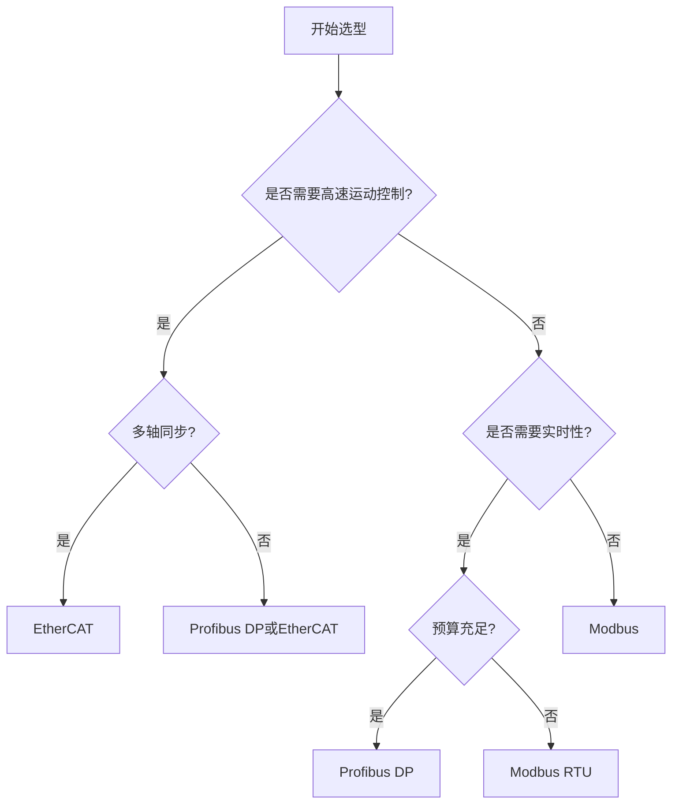

# 工业通信协议详解：Modbus、Profibus与EtherCAT对比

## 概述

工业通信协议是工业自动化系统的神经网络，连接着PLC、传感器、执行器和上位机等各种设备。选择合适的通信协议对系统的性能、可靠性和成本有着决定性影响。完成本文学习后，你将能够：

- 理解工业通信协议的基本概念和分类
- 掌握Modbus、Profibus、EtherCAT三大主流协议的技术特点
- 了解各协议的应用场景和优缺点
- 能够根据项目需求选择合适的通信协议
- 理解工业通信协议的发展趋势

## 背景知识

### 为什么需要工业通信协议？

在工业自动化系统中，各种设备需要相互通信和协作：

**传统通信方式的问题**：
- **点对点连接**：设备间需要大量电缆，布线复杂
- **专有协议**：不同厂商设备无法互联互通
- **维护困难**：故障诊断和系统扩展成本高
- **实时性差**：无法满足高速控制需求
- **可靠性低**：易受工业环境干扰

**工业通信协议的优势**：
- **总线拓扑**：多个设备共享一条通信线路
- **标准化**：遵循统一的通信规范
- **互操作性**：不同厂商设备可以互联
- **实时性**：支持确定性的数据传输
- **抗干扰**：适应恶劣的工业环境

### 工业通信协议的发展历程

**第一代：模拟信号（1960s-1980s）**
- 4-20mA电流环
- 0-10V电压信号
- 特点：简单可靠，但信息量有限

**第二代：现场总线（1980s-2000s）**
- Modbus、Profibus、DeviceNet等
- 特点：数字化通信，支持多设备


**第三代：工业以太网（2000s-至今）**
- EtherCAT、PROFINET、EtherNet/IP等
- 特点：高速、实时、大容量

**第四代：工业物联网（2010s-未来）**
- OPC UA、TSN、5G等
- 特点：云端集成、智能化、安全性

## 工业通信协议分类

### 按通信介质分类

**串行通信**：
- RS-232、RS-485、RS-422
- 特点：简单、成本低、距离有限

**现场总线**：
- Modbus、Profibus、CAN等
- 特点：专为工业设计、抗干扰强

**工业以太网**：
- EtherCAT、PROFINET、EtherNet/IP
- 特点：高速、大容量、易扩展

**无线通信**：
- Wi-Fi、Zigbee、LoRa、5G
- 特点：灵活部署、移动应用

### 按应用层次分类

```
┌─────────────────────────────────────┐
│      企业管理层 (ERP/MES)            │
│      协议：OPC UA、MQTT              │
├─────────────────────────────────────┤
│      监控层 (SCADA/HMI)              │
│      协议：Modbus TCP、OPC           │
├─────────────────────────────────────┤
│      控制层 (PLC/DCS)                │
│      协议：PROFINET、EtherCAT        │
├─────────────────────────────────────┤
│      现场层 (传感器/执行器)           │
│      协议：Modbus RTU、Profibus DP   │
└─────────────────────────────────────┘
```

### 按实时性分类

**非实时协议**：
- Modbus TCP、HTTP
- 响应时间：毫秒到秒级
- 应用：数据采集、监控

**软实时协议**：
- PROFINET RT、EtherNet/IP
- 响应时间：1-10ms
- 应用：一般运动控制

**硬实时协议**：
- EtherCAT、PROFINET IRT
- 响应时间：<1ms
- 应用：高速运动控制、同步

## Modbus协议详解

### 协议概述

**Modbus** 是由Modicon（现施耐德电气）于1979年开发的串行通信协议，是工业自动化领域应用最广泛的协议之一。

**核心特点**：
- **开放免费**：无需授权费用
- **简单易用**：协议规范简洁明了
- **广泛支持**：几乎所有工业设备都支持
- **多种变体**：RTU、ASCII、TCP等


### Modbus协议变体

#### Modbus RTU（Remote Terminal Unit）

**特点**：
- 二进制编码，传输效率高
- 使用CRC校验，可靠性好
- 最常用的Modbus变体

**帧格式**：
```
┌──────┬──────┬──────┬────────┬──────┐
│ 地址 │ 功能码│ 数据 │  CRC   │      │
│ 1字节│ 1字节│ N字节│ 2字节  │      │
└──────┴──────┴──────┴────────┴──────┘
```

**示例**：读取从站01的保持寄存器40001-40010
```
请求：01 03 00 00 00 0A C5 CD
      │  │  │     │     └─ CRC校验
      │  │  │     └─ 数量：10个寄存器
      │  │  └─ 起始地址：0x0000
      │  └─ 功能码：03（读保持寄存器）
      └─ 从站地址：01

响应：01 03 14 [20字节数据] XX XX
      │  │  │                └─ CRC校验
      │  │  └─ 字节数：20字节
      │  └─ 功能码：03
      └─ 从站地址：01
```

#### Modbus ASCII

**特点**：
- ASCII字符编码
- 可读性好，便于调试
- 传输效率较低

**帧格式**：
```
┌──┬──────┬──────┬──────┬────────┬──┐
│: │ 地址 │ 功能码│ 数据 │  LRC   │CR│LF
│  │2字符 │2字符 │N字符 │ 2字符  │  │
└──┴──────┴──────┴──────┴────────┴──┘
```

#### Modbus TCP

**特点**：
- 基于TCP/IP协议
- 支持以太网通信
- 无需RS-485硬件

**帧格式**：
```
┌────────────┬──────┬──────┬──────┐
│  MBAP头    │ 地址 │ 功能码│ 数据 │
│  7字节     │ 1字节│ 1字节│ N字节│
└────────────┴──────┴──────┴──────┘

MBAP头：
- 事务标识符：2字节
- 协议标识符：2字节（0x0000）
- 长度：2字节
- 单元标识符：1字节
```

### Modbus功能码

**常用功能码**：

| 功能码 | 名称 | 说明 |
|--------|------|------|
| 01 | Read Coils | 读线圈状态（DO） |
| 02 | Read Discrete Inputs | 读离散输入（DI） |
| 03 | Read Holding Registers | 读保持寄存器（AO） |
| 04 | Read Input Registers | 读输入寄存器（AI） |
| 05 | Write Single Coil | 写单个线圈 |
| 06 | Write Single Register | 写单个寄存器 |
| 15 | Write Multiple Coils | 写多个线圈 |
| 16 | Write Multiple Registers | 写多个寄存器 |

### Modbus数据模型

**四种数据类型**：

```
┌─────────────────────────────────────┐
│  线圈 (Coils)                        │
│  地址：00001-09999                   │
│  类型：可读写的位（DO）               │
├─────────────────────────────────────┤
│  离散输入 (Discrete Inputs)          │
│  地址：10001-19999                   │
│  类型：只读的位（DI）                 │
├─────────────────────────────────────┤
│  输入寄存器 (Input Registers)        │
│  地址：30001-39999                   │
│  类型：只读的16位字（AI）             │
├─────────────────────────────────────┤
│  保持寄存器 (Holding Registers)      │
│  地址：40001-49999                   │
│  类型：可读写的16位字（AO）           │
└─────────────────────────────────────┘
```


### Modbus应用场景

**适用场景**：
- 楼宇自动化系统
- 能源管理系统
- 数据采集系统
- 简单的PLC通信
- 仪表和传感器网络

**典型应用**：
```
┌──────────┐    Modbus TCP    ┌──────────┐
│  SCADA   │◄────────────────►│   PLC    │
│  上位机  │                  │          │
└──────────┘                  └──────────┘
                                    │
                              Modbus RTU
                                    │
                    ┌───────────────┼───────────────┐
                    │               │               │
              ┌──────────┐    ┌──────────┐   ┌──────────┐
              │ 变频器   │    │ 温控器   │   │ 流量计   │
              │ 地址:01  │    │ 地址:02  │   │ 地址:03  │
              └──────────┘    └──────────┘   └──────────┘
```

### Modbus优缺点

**优点**：
- ✅ 开放免费，无需授权
- ✅ 简单易学，容易实现
- ✅ 设备支持广泛
- ✅ 成本低廉
- ✅ 适合简单应用

**缺点**：
- ❌ 实时性较差（响应时间10-100ms）
- ❌ 数据量有限（单次最多250字节）
- ❌ 主从结构，不支持多主站
- ❌ 无内置安全机制
- ❌ 不适合高速运动控制

## Profibus协议详解

### 协议概述

**Profibus**（Process Field Bus，过程现场总线）是由西门子等德国公司于1989年推出的现场总线标准，是欧洲应用最广泛的现场总线之一。

**核心特点**：
- **高速可靠**：传输速率最高12Mbps
- **确定性**：支持实时通信
- **灵活性**：支持多种拓扑结构
- **诊断功能**：完善的故障诊断

### Profibus协议族

#### Profibus DP（Decentralized Periphery）

**特点**：
- 用于分散式外设通信
- 高速、实时
- 最常用的Profibus变体

**应用**：
- PLC与I/O模块通信
- 变频器控制
- 传感器/执行器网络

**通信速率**：
- 9.6 kbps - 12 Mbps
- 典型应用：1.5 Mbps

#### Profibus PA（Process Automation）

**特点**：
- 用于过程自动化
- 本质安全，可用于防爆区域
- 支持总线供电

**应用**：
- 化工过程控制
- 石油天然气
- 制药行业

**通信速率**：
- 固定31.25 kbps

#### Profibus FMS（Fieldbus Message Specification）

**特点**：
- 用于单元级通信
- 支持复杂数据交换
- 已较少使用

### Profibus网络拓扑

**线型拓扑**：
```
┌─────┐    ┌─────┐    ┌─────┐    ┌─────┐
│ 主站│────│从站1│────│从站2│────│从站3│
└─────┘    └─────┘    └─────┘    └─────┘
  │                                  │
  └──────────────────────────────────┘
         终端电阻（120Ω）
```

**树型拓扑**（使用中继器）：
```
        ┌─────┐
        │ 主站│
        └──┬──┘
           │
      ┌────┴────┐
      │ 中继器  │
      └─┬───┬───┘
        │   │
    ┌───┴┐ ┌┴───┐
    │从站1│ │从站2│
    └────┘ └────┘
```


### Profibus通信机制

**令牌传递 + 主从**：

```
主站1 ──令牌──► 主站2 ──令牌──► 主站3
  │               │               │
  ├─请求/响应─►从站1  │               │
  │               ├─请求/响应─►从站2  │
  │               │               ├─请求/响应─►从站3
  │               │               │
  └───────────────┴───────────────┘
```

**特点**：
- 主站间通过令牌传递获得总线控制权
- 主站与从站采用主从通信
- 确保实时性和确定性

### Profibus帧格式

**标准帧（无数据）**：
```
┌──┬──┬──┬──┬──┬──┬──┐
│SD│DA│SA│FC│FCS│ED│  │
│1 │1 │1 │1 │1  │1 │  │
└──┴──┴──┴──┴──┴──┴──┘

SD: 起始定界符
DA: 目标地址
SA: 源地址
FC: 功能码
FCS: 帧校验序列
ED: 结束定界符
```

**扩展帧（有数据）**：
```
┌──┬──┬──┬──┬──┬────┬──┬──┐
│SD│DA│SA│FC│LE│DATA│FCS│ED│
│1 │1 │1 │1 │1 │N   │1  │1 │
└──┴──┴──┴──┴──┴────┴──┴──┘

LE: 数据长度
DATA: 用户数据
```

### Profibus应用场景

**适用场景**：
- 汽车制造自动化
- 包装机械
- 过程工业
- 楼宇自动化
- 电力系统

**典型应用**：
```
┌──────────────┐
│   PLC主站    │
│  (S7-300)    │
└──────┬───────┘
       │ Profibus DP
       │
   ┌───┴───┬────────┬────────┐
   │       │        │        │
┌──┴──┐ ┌──┴──┐ ┌──┴──┐ ┌──┴──┐
│ET200S│ │变频器│ │伺服 │ │远程I/O│
│I/O站 │ │     │ │驱动 │ │      │
└─────┘ └─────┘ └─────┘ └─────┘
```

### Profibus优缺点

**优点**：
- ✅ 高速实时通信
- ✅ 确定性好，适合运动控制
- ✅ 完善的诊断功能
- ✅ 成熟稳定，应用广泛
- ✅ 支持多主站

**缺点**：
- ❌ 需要购买授权
- ❌ 配置相对复杂
- ❌ 硬件成本较高
- ❌ 逐渐被工业以太网取代
- ❌ 电缆要求严格

## EtherCAT协议详解

### 协议概述

**EtherCAT**（Ethernet for Control Automation Technology）是由德国倍福自动化（Beckhoff）于2003年开发的实时工业以太网协议，是目前性能最优秀的工业以太网协议之一。

**核心特点**：
- **超高速**：周期时间可达100μs以下
- **高精度同步**：同步精度<1μs
- **大容量**：单个网段支持65535个节点
- **灵活拓扑**：支持线型、树型、星型等
- **低成本**：使用标准以太网硬件

### EtherCAT工作原理

**"飞读飞写"技术**：

```
主站                                           
  │                                            
  ├──► 帧 ──►┌─────┐──►┌─────┐──►┌─────┐──►  
  │          │从站1│    │从站2│    │从站3│     
  │          │读写 │    │读写 │    │读写 │     
  │          └─────┘    └─────┘    └─────┘     
  │                                            
  ◄──── 帧返回 ◄──────────────────────────────
```

**关键特性**：
- 数据帧在网络中传输时，各从站"飞行中"读写数据
- 无需交换机，数据处理延迟极低
- 一个周期内可完成所有设备的数据交换


### EtherCAT网络拓扑

**线型拓扑**（最常用）：
```
┌──────┐    ┌──────┐    ┌──────┐    ┌──────┐
│ 主站 ├────┤从站1 ├────┤从站2 ├────┤从站3 │
└──────┘    └──────┘    └──────┘    └──────┘
```

**树型拓扑**：
```
        ┌──────┐
        │ 主站 │
        └───┬──┘
            │
        ┌───┴───┐
        │从站1  │
        └─┬───┬─┘
          │   │
      ┌───┴┐ ┌┴───┐
      │从站2│ │从站3│
      └────┘ └────┘
```

**星型拓扑**（使用分支模块）：
```
        ┌──────┐
        │ 主站 │
        └───┬──┘
            │
        ┌───┴───┐
        │ 分支  │
        └┬──┬──┬┘
         │  │  │
      ┌──┴┐┌┴─┐┌┴──┐
      │从站││从站││从站│
      └───┘└──┘└───┘
```

### EtherCAT帧结构

**以太网帧**：
```
┌────────┬────────┬──────┬────────────┬─────┐
│以太网头│EtherCAT│EtherCAT│  数据     │ FCS │
│14字节  │头2字节 │子报文 │           │4字节│
└────────┴────────┴──────┴────────────┴─────┘
```

**EtherCAT子报文**：
```
┌──────┬──────┬──────┬──────┬──────┬──────┐
│ 命令 │ 索引 │ 地址 │ 长度 │ 数据 │ WKC  │
│ 1字节│ 1字节│ 4字节│ 2字节│ N字节│ 2字节│
└──────┴──────┴──────┴──────┴──────┴──────┘

WKC: 工作计数器（Working Counter）
```

### EtherCAT分布式时钟

**DC（Distributed Clock）技术**：

```
主站时钟
  │
  ├──► 从站1时钟 ◄─── 同步 ◄─── 参考时钟
  │
  ├──► 从站2时钟 ◄─── 同步 ◄─── 参考时钟
  │
  └──► 从站3时钟 ◄─── 同步 ◄─── 参考时钟
```

**特点**：
- 同步精度：<1μs
- 支持多轴同步运动
- 适合高精度应用

### EtherCAT应用场景

**适用场景**：
- 高速运动控制
- 多轴同步系统
- 机器人控制
- 半导体设备
- 印刷包装机械

**典型应用**：
```
┌──────────────┐
│  EtherCAT主站│
│   (IPC/PLC)  │
└──────┬───────┘
       │ EtherCAT
       │
   ┌───┴───┬────────┬────────┬────────┐
   │       │        │        │        │
┌──┴──┐ ┌──┴──┐ ┌──┴──┐ ┌──┴──┐ ┌──┴──┐
│伺服1│ │伺服2│ │伺服3│ │伺服4│ │I/O站│
│     │ │     │ │     │ │     │ │     │
└─────┘ └─────┘ └─────┘ └─────┘ └─────┘
   多轴同步运动控制系统
```

### EtherCAT优缺点

**优点**：
- ✅ 超高速实时性能（周期<100μs）
- ✅ 高精度同步（<1μs）
- ✅ 大容量（65535个节点）
- ✅ 灵活拓扑结构
- ✅ 使用标准以太网硬件
- ✅ 开放技术，免费使用

**缺点**：
- ❌ 需要专用的从站芯片
- ❌ 主站开发相对复杂
- ❌ 对网络质量要求高
- ❌ 故障诊断需要专业工具


## 三大协议对比

### 技术参数对比

| 对比项 | Modbus | Profibus DP | EtherCAT |
|--------|--------|-------------|----------|
| **通信速率** | 115.2 kbps (RTU) | 12 Mbps | 100 Mbps |
| **周期时间** | 10-100 ms | 1-10 ms | 0.1-1 ms |
| **同步精度** | 不支持 | 1 ms | <1 μs |
| **最大节点数** | 247 | 126 | 65535 |
| **最大距离** | 1200m (RS-485) | 1200m (12Mbps) | 100m (可中继) |
| **拓扑结构** | 总线型 | 总线型 | 线型/树型/星型 |
| **实时性** | 非实时 | 硬实时 | 硬实时 |
| **成本** | 低 | 中 | 中高 |
| **复杂度** | 简单 | 中等 | 较复杂 |

### 应用场景对比

**Modbus适用场景**：
```
┌─────────────────────────────────┐
│  简单数据采集和监控              │
│  - 楼宇自动化                   │
│  - 能源管理                     │
│  - 仪表读数                     │
│  - 简单PLC通信                  │
│                                 │
│  特点：成本低、简单易用          │
└─────────────────────────────────┘
```

**Profibus适用场景**：
```
┌─────────────────────────────────┐
│  中速实时控制                    │
│  - 汽车制造                     │
│  - 过程工业                     │
│  - 包装机械                     │
│  - 一般运动控制                 │
│                                 │
│  特点：成熟稳定、诊断完善        │
└─────────────────────────────────┘
```

**EtherCAT适用场景**：
```
┌─────────────────────────────────┐
│  高速精密控制                    │
│  - 多轴同步运动                 │
│  - 机器人控制                   │
│  - 半导体设备                   │
│  - 高速印刷                     │
│                                 │
│  特点：超高速、高精度同步        │
└─────────────────────────────────┘
```

### 性能对比图

**响应时间对比**：
```
Modbus RTU:    ████████████████████ (10-100ms)
Profibus DP:   ████ (1-10ms)
EtherCAT:      █ (<1ms)
               │
               0ms ────────────► 100ms
```

**数据吞吐量对比**：
```
Modbus TCP:    ██ (1 Mbps)
Profibus DP:   ████████ (12 Mbps)
EtherCAT:      ████████████████████ (100 Mbps)
               │
               0 ────────────► 100 Mbps
```

## 协议选型指南

### 选型决策树



### 选型考虑因素

#### 1. 性能需求

**实时性要求**：
- **非实时**（>100ms）：Modbus
- **软实时**（1-10ms）：Profibus DP
- **硬实时**（<1ms）：EtherCAT

**同步要求**：
- **无同步要求**：Modbus
- **一般同步**（ms级）：Profibus DP
- **高精度同步**（μs级）：EtherCAT

**数据量**：
- **小数据量**（<100字节）：Modbus
- **中等数据量**（100-1000字节）：Profibus DP
- **大数据量**（>1000字节）：EtherCAT

#### 2. 成本预算

**硬件成本**：
```
Modbus:    ★☆☆☆☆ (最低)
Profibus:  ★★★☆☆ (中等)
EtherCAT:  ★★★★☆ (较高)
```

**开发成本**：
```
Modbus:    ★☆☆☆☆ (简单)
Profibus:  ★★★☆☆ (中等)
EtherCAT:  ★★★★☆ (较复杂)
```

**维护成本**：
```
Modbus:    ★★☆☆☆ (简单)
Profibus:  ★★★☆☆ (中等)
EtherCAT:  ★★★★☆ (需要专业知识)
```


#### 3. 系统规模

**小型系统**（<10个节点）：
- 推荐：Modbus RTU/TCP
- 理由：成本低、配置简单

**中型系统**（10-50个节点）：
- 推荐：Profibus DP或Modbus TCP
- 理由：性能适中、成熟稳定

**大型系统**（>50个节点）：
- 推荐：EtherCAT或PROFINET
- 理由：大容量、高性能

#### 4. 行业特点

**楼宇自动化**：
- 首选：Modbus TCP
- 备选：BACnet

**过程工业**：
- 首选：Profibus PA
- 备选：HART、Foundation Fieldbus

**离散制造**：
- 首选：Profibus DP、EtherCAT
- 备选：PROFINET

**运动控制**：
- 首选：EtherCAT
- 备选：PROFINET IRT、Sercos III

#### 5. 兼容性考虑

**现有设备**：
- 检查现有设备支持的协议
- 考虑协议转换网关的成本

**供应商生态**：
- Modbus：几乎所有厂商支持
- Profibus：西门子、ABB等欧洲厂商
- EtherCAT：倍福、欧姆龙等

**未来扩展**：
- 考虑系统的可扩展性
- 评估协议的发展趋势

### 典型应用案例

#### 案例1：楼宇能源管理系统

**需求**：
- 监控100个电表和环境传感器
- 数据采集周期：1分钟
- 通信距离：最远500米
- 预算有限

**选型**：Modbus TCP

**理由**：
- 实时性要求不高
- 设备支持广泛
- 成本低廉
- 配置简单

**系统架构**：
```
┌──────────┐
│  SCADA   │
│  服务器  │
└────┬─────┘
     │ 以太网
     │
┌────┴─────┬─────────┬─────────┐
│          │         │         │
┌──────┐ ┌──────┐ ┌──────┐ ┌──────┐
│电表1 │ │电表2 │ │温湿度│ │空调 │
│Modbus│ │Modbus│ │传感器│ │控制器│
└──────┘ └──────┘ └──────┘ └──────┘
```

#### 案例2：汽车生产线

**需求**：
- 30个工位，每个工位10-20个I/O点
- 包含变频器、机器人等设备
- 周期时间：5ms
- 需要诊断功能

**选型**：Profibus DP

**理由**：
- 满足实时性要求
- 成熟稳定
- 诊断功能完善
- 汽车行业标准

**系统架构**：
```
┌──────────┐
│ S7-400   │
│ PLC主站  │
└────┬─────┘
     │ Profibus DP
     │
┌────┴─────┬─────────┬─────────┬─────────┐
│          │         │         │         │
┌──────┐ ┌──────┐ ┌──────┐ ┌──────┐ ┌──────┐
│ET200S│ │变频器│ │机器人│ │焊接 │ │检测 │
│I/O站 │ │     │ │控制器│ │设备 │ │设备 │
└──────┘ └──────┘ └──────┘ └──────┘ └──────┘
```

#### 案例3：高速包装机

**需求**：
- 8轴伺服同步运动
- 位置同步精度：<100μs
- 周期时间：250μs
- 高速I/O响应

**选型**：EtherCAT

**理由**：
- 超高速实时性能
- 高精度同步
- 支持多轴协调
- 适合高速运动控制

**系统架构**：
```
┌──────────────┐
│  EtherCAT主站│
│   (IPC)      │
└──────┬───────┘
       │ EtherCAT
       │
   ┌───┴───┬────┬────┬────┬────┬────┬────┬────┐
   │       │    │    │    │    │    │    │    │
┌──┴──┐ ┌─┴─┐┌─┴─┐┌─┴─┐┌─┴─┐┌─┴─┐┌─┴─┐┌─┴─┐┌─┴─┐
│伺服1│ │伺服2││伺服3││伺服4││伺服5││伺服6││伺服7││伺服8││I/O│
└─────┘ └───┘└───┘└───┘└───┘└───┘└───┘└───┘└───┘
```

## 其他工业协议简介

### PROFINET

**特点**：
- Profibus的以太网版本
- 支持三种实时等级（NRT、RT、IRT）
- 西门子主推协议

**应用**：
- 离散制造
- 过程自动化
- 运动控制

### EtherNet/IP

**特点**：
- 基于CIP协议
- 罗克韦尔（AB）主推
- 北美市场占有率高

**应用**：
- 汽车制造
- 食品饮料
- 包装机械

### CC-Link IE

**特点**：
- 三菱主推协议
- 日本市场占有率高
- 支持TSN技术

**应用**：
- 亚洲市场
- 三菱系统集成

### OPC UA

**特点**：
- 跨平台、跨协议
- 支持云端集成
- 工业4.0标准

**应用**：
- 企业级集成
- 云端数据采集
- 跨系统通信


## 工业通信协议发展趋势

### 1. 向工业以太网演进

**趋势**：
- 传统现场总线逐渐被工业以太网取代
- EtherCAT、PROFINET、EtherNet/IP成为主流
- 统一的物理层和数据链路层

**优势**：
- 更高的带宽和速度
- 更好的互联互通
- 支持IT技术融合

### 2. 时间敏感网络（TSN）

**TSN技术**：
- 基于标准以太网的确定性通信
- IEEE 802.1标准族
- 支持多协议共存

**应用前景**：
```
┌─────────────────────────────────┐
│      统一的TSN以太网网络         │
├─────────────────────────────────┤
│  EtherCAT  │ PROFINET │ OPC UA  │
│  数据流    │  数据流  │ 数据流  │
└─────────────────────────────────┘
```

### 3. 工业物联网（IIoT）集成

**发展方向**：
- 边缘计算集成
- 云端数据分析
- 预测性维护
- 数字孪生

**架构演进**：
```
┌─────────────────────────────────┐
│         云平台 (Cloud)           │
│    大数据分析、AI、存储          │
└────────────┬────────────────────┘
             │ OPC UA / MQTT
┌────────────┴────────────────────┐
│       边缘计算 (Edge)            │
│    数据预处理、本地控制          │
└────────────┬────────────────────┘
             │ EtherCAT / PROFINET
┌────────────┴────────────────────┐
│      现场设备 (Field)            │
│    传感器、执行器、PLC           │
└─────────────────────────────────┘
```

### 4. 安全性增强

**网络安全**：
- 加密通信
- 身份认证
- 访问控制
- 安全审计

**功能安全**：
- 安全协议（PROFIsafe、FSoE）
- 冗余通信
- 故障检测

### 5. 5G技术应用

**5G特性**：
- 超低延迟（<1ms）
- 高可靠性（99.999%）
- 大连接数（100万/km²）

**应用场景**：
- 移动机器人
- AGV调度
- 远程控制
- 柔性制造

## 实践建议

### 学习路径

**第一阶段：基础学习**（1-2周）
1. 理解工业通信基本概念
2. 学习OSI模型和网络基础
3. 了解各协议的特点和应用

**第二阶段：协议深入**（2-4周）
1. 选择一个协议深入学习（建议从Modbus开始）
2. 学习协议规范和帧格式
3. 使用仿真工具进行实验

**第三阶段：实践应用**（4-8周）
1. 搭建实际的通信系统
2. 编写通信程序
3. 进行故障诊断和优化

### 实验环境搭建

**Modbus实验**：
```
硬件：
- USB转RS-485模块
- Modbus从站设备（或仿真器）
- PC电脑

软件：
- Modbus Poll（主站仿真）
- Modbus Slave（从站仿真）
- Python + pymodbus库
```

**EtherCAT实验**：
```
硬件：
- 支持EtherCAT的工控机或开发板
- EtherCAT从站设备
- 以太网线缆

软件：
- TwinCAT 3（倍福）
- SOEM（开源EtherCAT主站）
- Wireshark（协议分析）
```

### 调试工具推荐

**通用工具**：
- **Wireshark**：网络协议分析
- **串口助手**：串行通信调试
- **网络分析仪**：专业协议分析

**Modbus工具**：
- Modbus Poll/Slave
- QModMaster
- pymodbus

**Profibus工具**：
- Profibus Tester
- PB-Q One
- Siemens STEP 7

**EtherCAT工具**：
- TwinCAT System Manager
- EtherCAT Configurator
- Wireshark + EtherCAT插件

## 常见问题

### Q1: 如何选择Modbus RTU还是Modbus TCP？

**A**: 根据应用场景选择：

**选择Modbus RTU**：
- 距离较远（>100米）
- 设备只支持串口
- 成本敏感
- 简单点对点通信

**选择Modbus TCP**：
- 需要以太网集成
- 数据量较大
- 需要远程访问
- 多主站应用

### Q2: Profibus和PROFINET有什么区别？

**A**: 主要区别：

| 特性 | Profibus | PROFINET |
|------|----------|----------|
| 物理层 | RS-485 | 以太网 |
| 速率 | 最高12Mbps | 100Mbps/1Gbps |
| 拓扑 | 总线型 | 星型/线型 |
| 实时性 | 硬实时 | 三种等级 |
| 应用 | 传统自动化 | 新项目 |

**建议**：新项目优先选择PROFINET

### Q3: EtherCAT需要特殊的网卡吗？

**A**: 
- **主站**：需要支持EtherCAT的网卡或使用通用网卡+实时内核
- **从站**：需要专用的EtherCAT从站芯片（如ET1100、ET1200）
- **推荐**：使用Intel网卡，兼容性好

### Q4: 如何提高工业通信的可靠性？

**A**: 多方面措施：

**硬件层面**：
- 使用屏蔽电缆
- 正确接地
- 添加终端电阻
- 使用工业级设备

**软件层面**：
- 启用CRC校验
- 实现超时重传
- 添加心跳检测
- 记录通信日志

**网络层面**：
- 冗余通信
- 网络隔离
- 流量控制
- 定期维护

### Q5: 不同协议之间如何互联？

**A**: 使用协议转换网关：

**常见转换**：
- Modbus ↔ Profibus
- Modbus ↔ EtherCAT
- Profibus ↔ PROFINET
- 任意协议 ↔ OPC UA

**注意事项**：
- 转换会增加延迟
- 可能丢失部分功能
- 需要配置映射关系
- 影响系统实时性

## 总结

通过本文的学习，你应该已经掌握了工业通信协议的核心知识：

**关键要点**：
- 工业通信协议是工业自动化系统的基础，连接各种设备实现数据交换和协同控制
- Modbus是最简单、应用最广泛的协议，适合简单的数据采集和监控应用
- Profibus是成熟的现场总线协议，适合中速实时控制和过程自动化
- EtherCAT是高性能工业以太网协议，适合高速运动控制和多轴同步应用
- 协议选型需要综合考虑性能需求、成本预算、系统规模和行业特点
- 工业通信正在向工业以太网、TSN和工业物联网方向发展

**协议选择建议**：
1. **简单应用**：优先选择Modbus，成本低、易实现
2. **中等复杂度**：考虑Profibus DP，成熟稳定
3. **高性能要求**：选择EtherCAT，性能最优
4. **新项目**：考虑工业以太网协议，面向未来
5. **兼容性**：评估现有设备和供应商生态

**下一步行动**：
- 根据实际项目需求选择合适的协议
- 搭建实验环境进行实践
- 深入学习选定协议的技术细节
- 关注工业通信技术的最新发展
- 参与相关技术社区和培训

## 延伸阅读

推荐进一步学习的内容：

**基础深化**：
- [PLC编程基础](./01-plc-programming.html) - 学习PLC与通信协议的结合
- [SCADA系统应用](../intermediate/01-scada-system.html) - 了解上位机监控系统
- [工业机器人控制](../intermediate/02-industrial-robot.html) - 学习机器人通信

**进阶学习**：
- [工业4.0与智能制造](../intermediate/03-industry-4.0.html) - 了解工业通信的未来
- [工业自动化控制系统项目](../advanced/01-industrial-control-system.html) - 综合应用实践

**相关技术**：
- [CAN总线应用](../../01-automotive-electronics/beginner/02-can-lin-automotive.html) - 学习汽车通信协议
- [车载以太网技术](../../01-automotive-electronics/intermediate/01-automotive-ethernet.html) - 了解汽车以太网
- TCP/IP协议栈 - 深入网络基础

## 参考资料

### 官方规范
1. [Modbus Organization](https://modbus.org/) - Modbus官方网站和规范
2. [Profibus & Profinet International](https://www.profibus.com/) - Profibus/PROFINET官方组织
3. [EtherCAT Technology Group](https://www.ethercat.org/) - EtherCAT官方网站
4. [IEC 61158](https://webstore.iec.ch/) - 现场总线国际标准

### 技术文档
1. Modbus Application Protocol Specification V1.1b3
2. Profibus DP Specification
3. EtherCAT Protocol Specification
4. Industrial Ethernet Book - 工业以太网技术手册

### 学习资源
1. 《工业通信网络技术》 - 系统介绍工业通信
2. 《现场总线技术及应用》 - 深入讲解现场总线
3. 《工业以太网技术与应用》 - 工业以太网实践
4. [Automation.com](https://www.automation.com/) - 工业自动化资讯

### 工具和软件
1. [Modbus Tools](https://www.modbustools.com/) - Modbus调试工具
2. [Wireshark](https://www.wireshark.org/) - 网络协议分析
3. [TwinCAT](https://www.beckhoff.com/twincat3/) - EtherCAT开发平台
4. [SOEM](https://github.com/OpenEtherCATsociety/SOEM) - 开源EtherCAT主站

---

**练习题**：

1. 比较Modbus RTU和Modbus TCP的帧格式差异，说明各自的优缺点。
2. 解释Profibus DP的令牌传递机制，为什么这种机制能保证实时性？
3. 描述EtherCAT的"飞读飞写"技术原理，它如何实现超低延迟？
4. 为一个包含50个I/O点、5台变频器和2台机器人的生产线选择合适的通信协议，并说明理由。
5. 列举三种提高工业通信可靠性的方法，并说明实施要点。

**下一步**：建议学习 [SCADA系统应用](../intermediate/01-scada-system.html)，了解如何使用这些通信协议构建监控系统。

