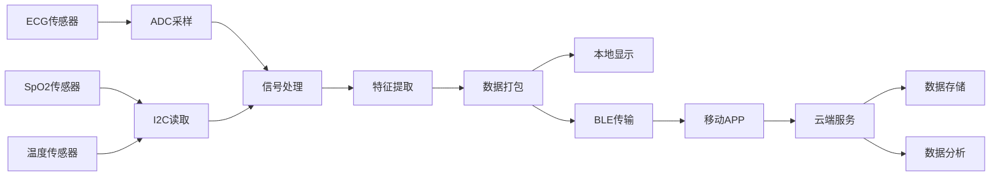

# 便携式医疗设备开发：完整项目实战

## 项目概述

### 项目简介


本项目将开发一个完整的便携式多参数健康监测设备，能够实时采集和分析心电（ECG）、血氧饱和度（SpO2）、体温等生理参数，并通过蓝牙将数据传输到移动应用和云端平台。项目涵盖硬件设计、嵌入式软件开发、信号处理算法、无线通信、移动应用和云端服务等完整技术栈。

**设备功能**：
- 实时心电图（ECG）监测和心率计算
- 血氧饱和度（SpO2）和脉率测量
- 体温监测
- 本地OLED显示
- 蓝牙数据传输
- 移动APP实时显示和历史记录
- 云端数据存储和分析
- 低功耗设计，支持长时间使用

**应用场景**：
- 家庭健康监测
- 慢性病管理
- 运动健康追踪
- 远程医疗辅助
- 老年人健康看护

### 项目演示

**设备外观**：
```
┌─────────────────────┐
│   ┌─────────────┐   │
│   │  OLED显示   │   │  ← 实时显示生理参数
│   │  HR: 72 bpm │   │
│   │  SpO2: 98%  │   │
│   │  Temp: 36.5°│   │
│   └─────────────┘   │
│                     │
│   ●  ●  ●          │  ← 状态指示灯
│                     │
│   [电极接口]        │  ← ECG电极连接
│   [指夹接口]        │  ← SpO2传感器
│                     │
│   [USB-C充电]       │  ← 充电接口
└─────────────────────┘
```

### 学习目标

完成本项目后，你将掌握：

- [ ] 医疗设备系统架构设计和模块划分
- [ ] 多通道生物信号同步采集技术
- [ ] 实时信号处理和特征提取算法
- [ ] 低功耗设计和电源管理策略
- [ ] 蓝牙BLE通信协议设计和实现
- [ ] 移动应用开发和数据可视化
- [ ] 云端服务集成和数据管理
- [ ] 医疗设备合规开发流程
- [ ] 完整的测试验证方法


## 项目特点

- ✨ **多参数监测**：同时监测ECG、SpO2、体温等多个生理参数
- ✨ **实时处理**：嵌入式实时信号处理和特征提取
- ✨ **无线传输**：蓝牙BLE低功耗无线通信
- ✨ **移动集成**：配套移动APP实时显示和历史记录
- ✨ **云端服务**：数据云端存储、分析和远程访问
- ✨ **低功耗设计**：优化功耗，支持长时间连续监测
- ✨ **医疗级精度**：符合医疗设备标准的测量精度
- ✨ **用户友好**：直观的界面和简单的操作

## 技术栈

### 硬件平台
- **主控芯片**：STM32L476RG（低功耗ARM Cortex-M4）
- **开发板**：STM32L4 Nucleo-64或自制PCB
- **ECG前端**：AD8232心电采集模块
- **SpO2传感器**：MAX30102脉搏血氧传感器
- **温度传感器**：MLX90614非接触式红外温度传感器
- **显示屏**：0.96" OLED（SSD1306）
- **蓝牙模块**：HM-10 BLE模块或STM32内置BLE
- **电源**：3.7V锂电池 + TP4056充电模块

### 软件技术
- **开发语言**：C/C++（嵌入式）、Python（数据分析）、Java/Kotlin（Android APP）
- **操作系统**：FreeRTOS（实时任务调度）
- **通信协议**：蓝牙BLE、UART、I2C、SPI
- **开发工具**：STM32CubeIDE、Android Studio、VS Code
- **云平台**：阿里云IoT平台或AWS IoT Core

### 第三方库
- **STM32 HAL库**：硬件抽象层
- **FreeRTOS**：实时操作系统
- **CMSIS-DSP**：数字信号处理库
- **TinyUSB**：USB协议栈（可选）
- **MPAndroidChart**：Android图表库
- **Retrofit**：Android网络库


## 硬件清单

### 必需硬件

| 名称 | 型号 | 数量 | 用途 | 参考价格 | 购买链接 |
|------|------|------|------|----------|----------|
| 微控制器开发板 | STM32L476RG Nucleo | 1 | 主控制器 | ¥120 | [ST官网] |
| ECG采集模块 | AD8232 | 1 | 心电信号采集 | ¥25 | [淘宝] |
| 血氧传感器 | MAX30102 | 1 | SpO2和心率测量 | ¥15 | [淘宝] |
| 温度传感器 | MLX90614 | 1 | 非接触式体温测量 | ¥35 | [淘宝] |
| OLED显示屏 | 0.96" SSD1306 | 1 | 本地显示 | ¥15 | [淘宝] |
| 蓝牙模块 | HM-10 BLE | 1 | 无线通信 | ¥20 | [淘宝] |
| 锂电池 | 3.7V 1000mAh | 1 | 电源供应 | ¥15 | [淘宝] |
| 充电模块 | TP4056 | 1 | 电池充电管理 | ¥3 | [淘宝] |
| ECG电极片 | 一次性Ag/AgCl | 10片 | ECG信号采集 | ¥10 | [淘宝] |
| 电容电阻套件 | 常用值 | 1套 | 电路搭建 | ¥20 | [淘宝] |
| PCB板 | 洞洞板或定制 | 1 | 电路板 | ¥10-50 | [嘉立创] |
| 外壳 | 3D打印或定制 | 1 | 设备外壳 | ¥30-80 | [淘宝] |

### 可选硬件

| 名称 | 型号 | 数量 | 用途 | 参考价格 |
|------|------|------|------|----------|
| SD卡模块 | MicroSD | 1 | 本地数据存储 | ¥5 |
| 振动马达 | 3V振动马达 | 1 | 报警提示 | ¥3 |
| 按键 | 轻触开关 | 3 | 用户输入 | ¥2 |
| LED指示灯 | 5mm LED | 3 | 状态指示 | ¥1 |
| USB-C接口 | Type-C母座 | 1 | 充电和数据传输 | ¥2 |

**总成本**：约 ¥300-400（不含外壳和PCB定制）

## 软件要求

### 开发环境
- **STM32CubeIDE** v1.10+（嵌入式开发）
- **Android Studio** 2021.3+（移动应用开发）
- **Python** 3.8+（数据分析和测试）
- **Git** v2.30+（版本控制）

### 驱动和工具
- ST-Link驱动程序
- 串口调试助手（PuTTY、Tera Term）
- 蓝牙调试工具（nRF Connect）
- 示波器或逻辑分析仪（硬件调试）

### 云平台账号
- 阿里云账号（或AWS账号）
- IoT平台服务开通
- 对象存储服务（OSS/S3）


## 系统架构

### 整体架构

```
┌─────────────────────────────────────────────────────────┐
│                    云端服务层                            │
│  ┌──────────┐  ┌──────────┐  ┌──────────┐             │
│  │ IoT平台  │  │ 数据存储 │  │ 数据分析 │             │
│  └──────────┘  └──────────┘  └──────────┘             │
└─────────────────────────────────────────────────────────┘
                        ↕ HTTPS/MQTT
┌─────────────────────────────────────────────────────────┐
│                    移动应用层                            │
│  ┌──────────┐  ┌──────────┐  ┌──────────┐             │
│  │ 实时显示 │  │ 历史记录 │  │ 数据分析 │             │
│  └──────────┘  └──────────┘  └──────────┘             │
└─────────────────────────────────────────────────────────┘
                        ↕ BLE
┌─────────────────────────────────────────────────────────┐
│                    设备端（嵌入式）                       │
│  ┌─────────────────────────────────────────────────┐   │
│  │              应用层                              │   │
│  │  ┌──────────┐  ┌──────────┐  ┌──────────┐     │   │
│  │  │ UI管理   │  │ 数据管理 │  │ 通信管理 │     │   │
│  │  └──────────┘  └──────────┘  └──────────┘     │   │
│  ├─────────────────────────────────────────────────┤   │
│  │              算法层                              │   │
│  │  ┌──────────┐  ┌──────────┐  ┌──────────┐     │   │
│  │  │ ECG处理  │  │ SpO2计算 │  │ 特征提取 │     │   │
│  │  └──────────┘  └──────────┘  └──────────┘     │   │
│  ├─────────────────────────────────────────────────┤   │
│  │              驱动层                              │   │
│  │  ┌──────────┐  ┌──────────┐  ┌──────────┐     │   │
│  │  │ ADC驱动  │  │ I2C驱动  │  │ UART驱动 │     │   │
│  │  └──────────┘  └──────────┘  └──────────┘     │   │
│  └─────────────────────────────────────────────────┘   │
│                                                         │
│  ┌─────────────────────────────────────────────────┐   │
│  │              硬件层                              │   │
│  │  ┌──────────┐  ┌──────────┐  ┌──────────┐     │   │
│  │  │ AD8232   │  │ MAX30102 │  │ MLX90614 │     │   │
│  │  │ (ECG)    │  │ (SpO2)   │  │ (Temp)   │     │   │
│  │  └──────────┘  └──────────┘  └──────────┘     │   │
│  └─────────────────────────────────────────────────┘   │
└─────────────────────────────────────────────────────────┘
```

### 模块说明

#### 1. 信号采集模块
**功能**：采集多路生理信号
- ECG信号采集（AD8232，500 Hz采样率）
- SpO2信号采集（MAX30102，100 Hz采样率）
- 体温数据读取（MLX90614，1 Hz采样率）
- 多通道同步采集和时间戳管理

**接口**：
- ADC：ECG模拟信号输入
- I2C：MAX30102和MLX90614数字接口
- GPIO：导联脱落检测

#### 2. 信号处理模块
**功能**：实时信号处理和特征提取
- ECG滤波（高通、低通、陷波）
- R波检测和心率计算
- SpO2计算（红光和红外光比值）
- 数据质量评估

**算法**：
- Pan-Tompkins QRS检测算法
- IIR数字滤波器
- 移动平均滤波
- 峰值检测算法


#### 3. 显示模块
**功能**：本地实时显示
- 实时生理参数显示（心率、SpO2、体温）
- ECG波形实时绘制
- 电池电量和状态指示
- 报警信息显示

**接口**：I2C（OLED SSD1306）
**刷新率**：10 Hz

#### 4. 通信模块
**功能**：无线数据传输
- 蓝牙BLE连接管理
- 数据打包和传输
- 命令接收和响应
- 连接状态监控

**协议**：自定义BLE GATT服务
**数据格式**：JSON或二进制协议

#### 5. 电源管理模块
**功能**：低功耗设计
- 动态电源管理
- 睡眠模式控制
- 电池电量监测
- 充电状态管理

**目标功耗**：
- 工作模式：< 50 mA
- 待机模式：< 5 mA
- 深度睡眠：< 100 μA

### 数据流图



## 电路设计

### 系统电路框图

```
                    ┌─────────────────┐
                    │   STM32L476RG   │
                    │                 │
    AD8232 ────────>│ PA0 (ADC1_IN5) │
    (ECG)           │                 │
                    │ PB8 (I2C1_SCL) │<────> MAX30102
                    │ PB9 (I2C1_SDA) │       (SpO2)
                    │                 │
                    │ PB10(I2C2_SCL) │<────> MLX90614
                    │ PB11(I2C2_SDA) │       (Temp)
                    │                 │
                    │ PB6 (I2C1_SCL) │<────> SSD1306
                    │ PB7 (I2C1_SDA) │       (OLED)
                    │                 │
                    │ PA9  (USART1TX)│<────> HM-10
                    │ PA10 (USART1RX)│       (BLE)
                    │                 │
                    │ PA11 (USB_DM)  │<────> USB-C
                    │ PA12 (USB_DP)  │       (充电)
                    │                 │
                    │ PC13 (GPIO)    │<──── 按键
                    │ PA5  (GPIO)    │───> LED
                    └─────────────────┘
                            │
                            │ 3.3V
                            ↓
                    ┌─────────────────┐
                    │   电源管理      │
                    │   TP4056        │
                    │   LDO 3.3V      │
                    └─────────────────┘
                            │
                            ↓
                    ┌─────────────────┐
                    │  锂电池 3.7V    │
                    │  1000mAh        │
                    └─────────────────┘
```

### 关键电路设计

**1. ECG信号调理电路**：
```
电极 → 保护电阻 → AD8232 → RC滤波 → ADC
```

**2. 电源电路**：
```
USB-C → TP4056充电 → 锂电池 → LDO稳压 → 3.3V系统电源
                              ↓
                          电量检测ADC
```

**3. 电平转换**（如需要）：
- 3.3V ↔ 5V电平转换（某些传感器）


## 实现步骤

### 阶段1：硬件搭建和基础测试 (预计3小时)

#### 1.1 硬件组装

**步骤**：
1. **准备工作台**
   - 清理工作区域
   - 准备防静电措施
   - 检查所有硬件组件

2. **电源电路搭建**
   ```
   步骤：
   1. 连接TP4056充电模块
   2. 连接锂电池（注意极性！）
   3. 添加LDO稳压模块（如AMS1117-3.3）
   4. 测试输出电压（应为3.3V ± 0.1V）
   ```

3. **传感器连接**
   
   **AD8232 ECG模块**：
   | AD8232引脚 | STM32引脚 | 说明 |
   |-----------|----------|------|
   | OUTPUT | PA0 | ECG信号输出 |
   | LO+ | PA1 | 导联脱落检测+ |
   | LO- | PA2 | 导联脱落检测- |
   | 3.3V | 3.3V | 电源 |
   | GND | GND | 地 |
   
   **MAX30102 SpO2传感器**：
   | MAX30102引脚 | STM32引脚 | 说明 |
   |-------------|----------|------|
   | SCL | PB8 | I2C时钟 |
   | SDA | PB9 | I2C数据 |
   | INT | PA3 | 中断信号 |
   | 3.3V | 3.3V | 电源 |
   | GND | GND | 地 |
   
   **MLX90614温度传感器**：
   | MLX90614引脚 | STM32引脚 | 说明 |
   |-------------|----------|------|
   | SCL | PB10 | I2C时钟 |
   | SDA | PB11 | I2C数据 |
   | 3.3V | 3.3V | 电源 |
   | GND | GND | 地 |
   
   **SSD1306 OLED显示屏**：
   | SSD1306引脚 | STM32引脚 | 说明 |
   |-----------|----------|------|
   | SCL | PB6 | I2C时钟 |
   | SDA | PB7 | I2C数据 |
   | 3.3V | 3.3V | 电源 |
   | GND | GND | 地 |

4. **蓝牙模块连接**
   | HM-10引脚 | STM32引脚 | 说明 |
   |----------|----------|------|
   | TXD | PA10 | 串口接收 |
   | RXD | PA9 | 串口发送 |
   | VCC | 3.3V | 电源 |
   | GND | GND | 地 |

**检查清单**：
- [ ] 所有电源连接正确（3.3V和GND）
- [ ] I2C设备地址无冲突
- [ ] 串口TX/RX交叉连接正确
- [ ] 无短路现象
- [ ] 电池极性正确

#### 1.2 基础硬件测试

**测试1：电源测试**
```c
// 测试代码
void test_power(void) {
    printf("系统启动...\r\n");
    printf("系统时钟: %lu Hz\r\n", SystemCoreClock);
    
    // LED闪烁测试
    for(int i = 0; i < 10; i++) {
        HAL_GPIO_TogglePin(LED_GPIO_Port, LED_Pin);
        HAL_Delay(500);
    }
    
    printf("电源测试完成\r\n");
}
```

**测试2：I2C总线扫描**
```c
// I2C设备扫描
void scan_i2c_devices(I2C_HandleTypeDef *hi2c) {
    printf("扫描I2C设备...\r\n");
    
    for(uint8_t addr = 1; addr < 128; addr++) {
        if(HAL_I2C_IsDeviceReady(hi2c, addr << 1, 1, 10) == HAL_OK) {
            printf("发现设备: 0x%02X\r\n", addr);
        }
    }
    
    printf("扫描完成\r\n");
}

// 预期发现的设备地址：
// MAX30102: 0x57
// MLX90614: 0x5A
// SSD1306: 0x3C
```

**测试3：传感器基础读取**
```c
// 测试MAX30102
void test_max30102(void) {
    uint8_t part_id;
    HAL_I2C_Mem_Read(&hi2c1, MAX30102_ADDR << 1, 0xFF, 1, &part_id, 1, 100);
    printf("MAX30102 Part ID: 0x%02X (应为0x15)\r\n", part_id);
}

// 测试MLX90614
void test_mlx90614(void) {
    uint16_t temp_raw;
    HAL_I2C_Mem_Read(&hi2c2, MLX90614_ADDR << 1, 0x07, 1, 
                     (uint8_t*)&temp_raw, 2, 100);
    float temp = temp_raw * 0.02 - 273.15;
    printf("环境温度: %.2f °C\r\n", temp);
}
```


### 阶段2：传感器驱动开发 (预计4小时)

#### 2.1 MAX30102驱动实现

**初始化配置**：
```c
// max30102.h
#ifndef MAX30102_H
#define MAX30102_H

#include "stm32l4xx_hal.h"

#define MAX30102_ADDR 0x57

// 寄存器地址
#define REG_INTR_STATUS_1 0x00
#define REG_INTR_STATUS_2 0x01
#define REG_INTR_ENABLE_1 0x02
#define REG_INTR_ENABLE_2 0x03
#define REG_FIFO_WR_PTR   0x04
#define REG_FIFO_RD_PTR   0x06
#define REG_FIFO_DATA     0x07
#define REG_MODE_CONFIG   0x09
#define REG_SPO2_CONFIG   0x0A
#define REG_LED1_PA       0x0C
#define REG_LED2_PA       0x0D

typedef struct {
    uint32_t red;
    uint32_t ir;
    uint8_t spo2;
    uint8_t heart_rate;
    uint8_t valid;
} MAX30102_Data_t;

HAL_StatusTypeDef MAX30102_Init(I2C_HandleTypeDef *hi2c);
HAL_StatusTypeDef MAX30102_ReadFIFO(I2C_HandleTypeDef *hi2c, 
                                    uint32_t *red, uint32_t *ir);
void MAX30102_CalculateSpO2(MAX30102_Data_t *data);

#endif
```

**驱动实现**：
```c
// max30102.c
#include "max30102.h"

HAL_StatusTypeDef MAX30102_Init(I2C_HandleTypeDef *hi2c) {
    uint8_t data;
    
    // 软复位
    data = 0x40;
    HAL_I2C_Mem_Write(hi2c, MAX30102_ADDR << 1, REG_MODE_CONFIG, 
                      1, &data, 1, 100);
    HAL_Delay(100);
    
    // 配置中断
    data = 0xC0;  // 使能FIFO满和新数据中断
    HAL_I2C_Mem_Write(hi2c, MAX30102_ADDR << 1, REG_INTR_ENABLE_1, 
                      1, &data, 1, 100);
    
    // 配置FIFO
    data = 0x00;  // FIFO写指针清零
    HAL_I2C_Mem_Write(hi2c, MAX30102_ADDR << 1, REG_FIFO_WR_PTR, 
                      1, &data, 1, 100);
    
    // 配置SpO2模式
    data = 0x03;  // SpO2模式
    HAL_I2C_Mem_Write(hi2c, MAX30102_ADDR << 1, REG_MODE_CONFIG, 
                      1, &data, 1, 100);
    
    // 配置SpO2参数
    // ADC范围=4096nA, 采样率=100Hz, LED脉宽=411us
    data = 0x27;
    HAL_I2C_Mem_Write(hi2c, MAX30102_ADDR << 1, REG_SPO2_CONFIG, 
                      1, &data, 1, 100);
    
    // 配置LED电流
    data = 0x24;  // 红光LED电流 = 7.0mA
    HAL_I2C_Mem_Write(hi2c, MAX30102_ADDR << 1, REG_LED1_PA, 
                      1, &data, 1, 100);
    
    data = 0x24;  // 红外LED电流 = 7.0mA
    HAL_I2C_Mem_Write(hi2c, MAX30102_ADDR << 1, REG_LED2_PA, 
                      1, &data, 1, 100);
    
    return HAL_OK;
}

HAL_StatusTypeDef MAX30102_ReadFIFO(I2C_HandleTypeDef *hi2c, 
                                    uint32_t *red, uint32_t *ir) {
    uint8_t fifo_data[6];
    
    // 读取FIFO数据（6字节：3字节红光 + 3字节红外）
    if(HAL_I2C_Mem_Read(hi2c, MAX30102_ADDR << 1, REG_FIFO_DATA, 
                        1, fifo_data, 6, 100) != HAL_OK) {
        return HAL_ERROR;
    }
    
    // 解析数据（18位ADC值）
    *red = ((uint32_t)fifo_data[0] << 16) | 
           ((uint32_t)fifo_data[1] << 8) | 
           fifo_data[2];
    *red &= 0x03FFFF;  // 保留18位
    
    *ir = ((uint32_t)fifo_data[3] << 16) | 
          ((uint32_t)fifo_data[4] << 8) | 
          fifo_data[5];
    *ir &= 0x03FFFF;
    
    return HAL_OK;
}

void MAX30102_CalculateSpO2(MAX30102_Data_t *data) {
    // 简化的SpO2计算算法
    // 实际应用中需要更复杂的算法
    
    if(data->red == 0 || data->ir == 0) {
        data->valid = 0;
        return;
    }
    
    // 计算R值（红光AC/DC 除以 红外AC/DC）
    float ratio = (float)data->red / (float)data->ir;
    
    // 经验公式（需要根据实际校准）
    float spo2_float = 110.0f - 25.0f * ratio;
    
    // 限制范围
    if(spo2_float > 100.0f) spo2_float = 100.0f;
    if(spo2_float < 70.0f) spo2_float = 70.0f;
    
    data->spo2 = (uint8_t)spo2_float;
    data->valid = 1;
}
```


#### 2.2 MLX90614驱动实现

```c
// mlx90614.h
#ifndef MLX90614_H
#define MLX90614_H

#include "stm32l4xx_hal.h"

#define MLX90614_ADDR 0x5A

// 寄存器地址
#define MLX90614_TA   0x06  // 环境温度
#define MLX90614_TOBJ1 0x07  // 物体温度1

typedef struct {
    float ambient_temp;   // 环境温度
    float object_temp;    // 物体温度
} MLX90614_Data_t;

HAL_StatusTypeDef MLX90614_Init(I2C_HandleTypeDef *hi2c);
HAL_StatusTypeDef MLX90614_ReadTemperature(I2C_HandleTypeDef *hi2c, 
                                           MLX90614_Data_t *data);

#endif

// mlx90614.c
#include "mlx90614.h"

HAL_StatusTypeDef MLX90614_Init(I2C_HandleTypeDef *hi2c) {
    // MLX90614通常不需要特殊初始化
    // 检查设备是否响应
    if(HAL_I2C_IsDeviceReady(hi2c, MLX90614_ADDR << 1, 3, 100) != HAL_OK) {
        return HAL_ERROR;
    }
    return HAL_OK;
}

HAL_StatusTypeDef MLX90614_ReadTemperature(I2C_HandleTypeDef *hi2c, 
                                           MLX90614_Data_t *data) {
    uint8_t temp_data[3];
    uint16_t temp_raw;
    
    // 读取环境温度
    if(HAL_I2C_Mem_Read(hi2c, MLX90614_ADDR << 1, MLX90614_TA, 
                        1, temp_data, 3, 100) != HAL_OK) {
        return HAL_ERROR;
    }
    temp_raw = (temp_data[1] << 8) | temp_data[0];
    data->ambient_temp = temp_raw * 0.02f - 273.15f;
    
    // 读取物体温度
    if(HAL_I2C_Mem_Read(hi2c, MLX90614_ADDR << 1, MLX90614_TOBJ1, 
                        1, temp_data, 3, 100) != HAL_OK) {
        return HAL_ERROR;
    }
    temp_raw = (temp_data[1] << 8) | temp_data[0];
    data->object_temp = temp_raw * 0.02f - 273.15f;
    
    return HAL_OK;
}
```

#### 2.3 SSD1306 OLED驱动实现

```c
// ssd1306.h
#ifndef SSD1306_H
#define SSD1306_H

#include "stm32l4xx_hal.h"
#include <string.h>
#include <stdio.h>

#define SSD1306_ADDR 0x3C
#define SSD1306_WIDTH 128
#define SSD1306_HEIGHT 64

void SSD1306_Init(I2C_HandleTypeDef *hi2c);
void SSD1306_Clear(I2C_HandleTypeDef *hi2c);
void SSD1306_Display(I2C_HandleTypeDef *hi2c);
void SSD1306_DrawPixel(uint8_t x, uint8_t y, uint8_t color);
void SSD1306_DrawString(uint8_t x, uint8_t y, const char *str);
void SSD1306_DrawNumber(uint8_t x, uint8_t y, int num);

#endif

// ssd1306.c (简化版本)
#include "ssd1306.h"

static uint8_t ssd1306_buffer[SSD1306_WIDTH * SSD1306_HEIGHT / 8];

void SSD1306_WriteCommand(I2C_HandleTypeDef *hi2c, uint8_t cmd) {
    uint8_t data[2] = {0x00, cmd};
    HAL_I2C_Master_Transmit(hi2c, SSD1306_ADDR << 1, data, 2, 100);
}

void SSD1306_Init(I2C_HandleTypeDef *hi2c) {
    HAL_Delay(100);
    
    SSD1306_WriteCommand(hi2c, 0xAE);  // Display OFF
    SSD1306_WriteCommand(hi2c, 0x20);  // Set Memory Addressing Mode
    SSD1306_WriteCommand(hi2c, 0x00);  // Horizontal Addressing Mode
    SSD1306_WriteCommand(hi2c, 0xB0);  // Set Page Start Address
    SSD1306_WriteCommand(hi2c, 0xC8);  // Set COM Output Scan Direction
    SSD1306_WriteCommand(hi2c, 0x00);  // Set Low Column Address
    SSD1306_WriteCommand(hi2c, 0x10);  // Set High Column Address
    SSD1306_WriteCommand(hi2c, 0x40);  // Set Start Line Address
    SSD1306_WriteCommand(hi2c, 0x81);  // Set Contrast Control
    SSD1306_WriteCommand(hi2c, 0xFF);  // Max Contrast
    SSD1306_WriteCommand(hi2c, 0xA1);  // Set Segment Re-map
    SSD1306_WriteCommand(hi2c, 0xA6);  // Set Normal Display
    SSD1306_WriteCommand(hi2c, 0xA8);  // Set Multiplex Ratio
    SSD1306_WriteCommand(hi2c, 0x3F);  // 1/64 duty
    SSD1306_WriteCommand(hi2c, 0xA4);  // Display follows RAM content
    SSD1306_WriteCommand(hi2c, 0xD3);  // Set Display Offset
    SSD1306_WriteCommand(hi2c, 0x00);  // No offset
    SSD1306_WriteCommand(hi2c, 0xD5);  // Set Display Clock Divide Ratio
    SSD1306_WriteCommand(hi2c, 0xF0);  // Suggested ratio
    SSD1306_WriteCommand(hi2c, 0xD9);  // Set Pre-charge Period
    SSD1306_WriteCommand(hi2c, 0x22);
    SSD1306_WriteCommand(hi2c, 0xDA);  // Set COM Pins Hardware Configuration
    SSD1306_WriteCommand(hi2c, 0x12);
    SSD1306_WriteCommand(hi2c, 0xDB);  // Set VCOMH Deselect Level
    SSD1306_WriteCommand(hi2c, 0x20);
    SSD1306_WriteCommand(hi2c, 0x8D);  // Enable Charge Pump
    SSD1306_WriteCommand(hi2c, 0x14);
    SSD1306_WriteCommand(hi2c, 0xAF);  // Display ON
    
    SSD1306_Clear(hi2c);
}

void SSD1306_Clear(I2C_HandleTypeDef *hi2c) {
    memset(ssd1306_buffer, 0, sizeof(ssd1306_buffer));
    SSD1306_Display(hi2c);
}

void SSD1306_Display(I2C_HandleTypeDef *hi2c) {
    for(uint8_t i = 0; i < 8; i++) {
        SSD1306_WriteCommand(hi2c, 0xB0 + i);  // Set page address
        SSD1306_WriteCommand(hi2c, 0x00);      // Set low column address
        SSD1306_WriteCommand(hi2c, 0x10);      // Set high column address
        
        uint8_t data[SSD1306_WIDTH + 1];
        data[0] = 0x40;  // Data mode
        memcpy(&data[1], &ssd1306_buffer[SSD1306_WIDTH * i], SSD1306_WIDTH);
        HAL_I2C_Master_Transmit(hi2c, SSD1306_ADDR << 1, data, 
                               SSD1306_WIDTH + 1, 100);
    }
}

// 简化的字符绘制（需要字体库）
void SSD1306_DrawString(uint8_t x, uint8_t y, const char *str) {
    // 实际实现需要字体库
    // 这里仅作示例
}
```


### 阶段3：信号处理和算法实现 (预计4小时)

#### 3.1 ECG信号处理

参考[生物信号处理基础](../beginner/02-biosignal-processing.html)教程中的算法实现：
- IIR滤波器（高通、低通、陷波）
- Pan-Tompkins R波检测算法
- 心率计算和心率变异性分析

#### 3.2 SpO2计算算法

```c
// spo2_algorithm.h
typedef struct {
    uint32_t red_buffer[100];
    uint32_t ir_buffer[100];
    uint8_t buffer_index;
    float spo2_value;
    uint8_t heart_rate;
} SpO2_Algorithm_t;

void SpO2_Algorithm_Init(SpO2_Algorithm_t *algo);
void SpO2_Algorithm_Update(SpO2_Algorithm_t *algo, uint32_t red, uint32_t ir);
void SpO2_Algorithm_Calculate(SpO2_Algorithm_t *algo);
```

**实现要点**：
- 使用移动窗口存储最近100个样本
- 计算AC和DC分量
- 应用经验公式计算SpO2
- 峰值检测计算心率

### 阶段4：FreeRTOS任务设计 (预计3小时)

#### 4.1 任务架构

```c
// 任务优先级定义
#define PRIORITY_ECG_TASK      3  // 最高优先级
#define PRIORITY_SPO2_TASK     2
#define PRIORITY_DISPLAY_TASK  1
#define PRIORITY_BLE_TASK      1

// 创建任务
void create_rtos_tasks(void) {
    xTaskCreate(ecg_acquisition_task, "ECG", 512, NULL, 
                PRIORITY_ECG_TASK, NULL);
    xTaskCreate(spo2_acquisition_task, "SpO2", 512, NULL, 
                PRIORITY_SPO2_TASK, NULL);
    xTaskCreate(display_task, "Display", 256, NULL, 
                PRIORITY_DISPLAY_TASK, NULL);
    xTaskCreate(ble_communication_task, "BLE", 512, NULL, 
                PRIORITY_BLE_TASK, NULL);
}
```

#### 4.2 任务间通信

```c
// 队列定义
QueueHandle_t ecg_data_queue;
QueueHandle_t spo2_data_queue;
QueueHandle_t display_queue;

// 信号量定义
SemaphoreHandle_t i2c_mutex;
SemaphoreHandle_t uart_mutex;

// 初始化
void init_rtos_objects(void) {
    ecg_data_queue = xQueueCreate(10, sizeof(ECG_Data_t));
    spo2_data_queue = xQueueCreate(10, sizeof(SpO2_Data_t));
    display_queue = xQueueCreate(5, sizeof(Display_Data_t));
    
    i2c_mutex = xSemaphoreCreateMutex();
    uart_mutex = xSemaphoreCreateMutex();
}
```

### 阶段5：蓝牙通信实现 (预计2小时)

#### 5.1 通信协议设计

**数据包格式**：
```
[起始标志][数据类型][数据长度][数据内容][校验和][结束标志]
   0xFF      1字节     2字节      N字节     2字节     0xFE
```

**数据类型**：
- 0x01: ECG数据
- 0x02: SpO2数据
- 0x03: 温度数据
- 0x04: 综合数据
- 0x10: 命令响应

#### 5.2 BLE通信实现

```c
// ble_comm.h
typedef struct {
    uint8_t type;
    uint16_t length;
    uint8_t data[256];
} BLE_Packet_t;

void BLE_Init(UART_HandleTypeDef *huart);
void BLE_SendPacket(BLE_Packet_t *packet);
void BLE_ReceivePacket(BLE_Packet_t *packet);
```

### 阶段6：移动应用开发 (预计6小时)

#### 6.1 Android应用架构

**主要功能模块**：
1. 蓝牙连接管理
2. 实时数据显示
3. 波形绘制
4. 历史数据记录
5. 数据导出
6. 云端同步

#### 6.2 关键代码示例

```kotlin
// BLE连接管理
class BleManager(context: Context) {
    private val bluetoothAdapter: BluetoothAdapter = ...
    
    fun scanDevices(callback: (BluetoothDevice) -> Unit) {
        // 扫描BLE设备
    }
    
    fun connect(device: BluetoothDevice) {
        // 连接设备
    }
    
    fun sendCommand(command: ByteArray) {
        // 发送命令
    }
    
    fun receiveData(callback: (ByteArray) -> Unit) {
        // 接收数据
    }
}

// 实时数据显示
class MainActivity : AppCompatActivity() {
    private lateinit var ecgChart: LineChart
    private lateinit var bleManager: BleManager
    
    override fun onCreate(savedInstanceState: Bundle?) {
        super.onCreate(savedInstanceState)
        setContentView(R.layout.activity_main)
        
        initializeCharts()
        setupBleConnection()
    }
    
    private fun updateECGChart(data: FloatArray) {
        // 更新ECG波形图
    }
}
```


### 阶段7：云端集成 (预计3小时)

#### 7.1 阿里云IoT平台配置

**步骤**：
1. 创建产品和设备
2. 定义物模型（属性、事件、服务）
3. 获取设备三元组（ProductKey, DeviceName, DeviceSecret）
4. 配置数据流转规则

#### 7.2 MQTT通信实现

```python
# 云端数据接收服务（Python示例）
import paho.mqtt.client as mqtt
import json

class IoTDataReceiver:
    def __init__(self, product_key, device_name, device_secret):
        self.client = mqtt.Client()
        self.client.on_connect = self.on_connect
        self.client.on_message = self.on_message
        
        # 配置连接参数
        self.setup_connection(product_key, device_name, device_secret)
    
    def on_connect(self, client, userdata, flags, rc):
        print(f"连接成功: {rc}")
        # 订阅设备上报主题
        client.subscribe(f"/sys/{product_key}/{device_name}/thing/event/property/post")
    
    def on_message(self, client, userdata, msg):
        # 解析数据
        data = json.loads(msg.payload)
        self.process_data(data)
    
    def process_data(self, data):
        # 存储到数据库
        # 进行数据分析
        # 触发报警等
        pass
```

## 测试验证

### 功能测试

**测试清单**：
- [ ] ECG信号采集正常，波形清晰
- [ ] SpO2测量准确（误差<±2%）
- [ ] 体温测量准确（误差<±0.5°C）
- [ ] 心率计算准确（误差<±3 bpm）
- [ ] OLED显示正常，刷新流畅
- [ ] 蓝牙连接稳定，数据传输无丢失
- [ ] 移动APP显示正常，功能完整
- [ ] 云端数据上传成功，存储正确
- [ ] 电池续航达到设计目标（>8小时）
- [ ] 充电功能正常

### 性能测试

| 指标 | 目标值 | 测试方法 | 实测值 |
|------|--------|----------|--------|
| ECG采样率 | 500 Hz | 示波器测量 | |
| SpO2采样率 | 100 Hz | 逻辑分析仪 | |
| 心率精度 | ±3 bpm | 对比标准设备 | |
| SpO2精度 | ±2% | 对比标准设备 | |
| 温度精度 | ±0.5°C | 对比标准温度计 | |
| BLE延迟 | <100ms | 时间戳对比 | |
| 功耗（工作） | <50mA | 电流表测量 | |
| 功耗（待机） | <5mA | 电流表测量 | |
| 电池续航 | >8小时 | 连续运行测试 | |

### 可靠性测试

**长时间运行测试**：
- 连续运行24小时
- 监控内存使用
- 检查数据准确性
- 记录异常情况

**环境测试**：
- 温度范围：10°C - 40°C
- 湿度范围：20% - 80%
- 抗干扰测试（手机、WiFi等）

## 故障排除

### 常见问题

#### 问题1：ECG信号噪声大

**症状**：ECG波形不清晰，噪声严重

**可能原因**：
- 电极接触不良
- 工频干扰（50/60Hz）
- 接地不良
- 电源噪声

**解决方法**：
1. 检查电极连接，确保良好接触
2. 添加陷波滤波器去除工频干扰
3. 改善接地设计
4. 使用低噪声电源
5. 添加屏蔽措施

#### 问题2：SpO2读数不稳定

**症状**：SpO2值跳动大，无法稳定

**可能原因**：
- 手指放置不正确
- 环境光干扰
- 血液灌注不足
- 算法参数不当

**解决方法**：
1. 确保手指完全覆盖传感器
2. 使用遮光设计
3. 保持手指温暖
4. 调整LED电流和算法参数
5. 增加数据平滑处理

#### 问题3：蓝牙连接不稳定

**症状**：频繁断开连接，数据丢失

**可能原因**：
- 距离过远
- 障碍物阻挡
- 电磁干扰
- 软件bug

**解决方法**：
1. 缩短通信距离
2. 避免金属障碍物
3. 远离干扰源
4. 实现自动重连机制
5. 添加数据缓存

#### 问题4：功耗过高

**症状**：电池续航时间短

**可能原因**：
- LED电流过大
- 采样率过高
- 未使用低功耗模式
- 蓝牙持续发送

**解决方法**：
1. 降低LED电流
2. 优化采样率
3. 启用MCU低功耗模式
4. 实现按需数据传输
5. 优化算法效率


## 扩展思路

### 功能扩展

**1. 增加更多生理参数**
- 血压监测（需要额外传感器）
- 呼吸率检测（从ECG或SpO2信号提取）
- 血糖监测（需要专用传感器）
- 运动检测（加速度计、陀螺仪）

**2. 智能分析功能**
- 心律失常自动检测
- 睡眠质量分析
- 运动强度评估
- 健康趋势预测
- AI辅助诊断

**3. 用户体验优化**
- 语音提示功能
- 触摸屏交互
- 个性化设置
- 多用户支持
- 家庭成员共享

**4. 数据管理增强**
- 本地SD卡存储
- 数据加密保护
- 自动备份
- 数据导出（PDF报告）
- 与医院系统对接

### 性能优化

**1. 算法优化**
- 使用CMSIS-DSP加速
- 优化滤波器系数
- 实现自适应算法
- 减少计算复杂度

**2. 功耗优化**
- 动态调整采样率
- 智能休眠策略
- 优化外设使用
- 使用DMA减少CPU负载

**3. 通信优化**
- 数据压缩
- 批量传输
- 差分编码
- 优先级队列

## 合规性考虑

### 医疗设备标准

**参考标准**：
- IEC 60601-1：医疗电气设备基本安全
- IEC 60601-2-27：心电监护设备专用要求
- ISO 80601-2-61：脉搏血氧仪专用要求
- IEC 60601-1-2：电磁兼容性
- ISO 13485：质量管理体系

**关键要求**：
- 患者隔离（电气安全）
- 漏电流限制
- EMC测试
- 生物相容性评估
- 软件验证（IEC 62304）

### 数据安全和隐私

**HIPAA合规**（如适用）：
- 数据加密（传输和存储）
- 访问控制
- 审计日志
- 数据备份和恢复
- 隐私政策

**实施建议**：
- 使用AES-256加密
- 实现用户认证
- 记录所有数据访问
- 定期安全审计
- 遵守当地法规

## 项目总结

### 技术要点

**硬件设计**：
- 多传感器集成和信号调理
- 低功耗电源管理
- 抗干扰设计
- 小型化和便携性

**软件开发**：
- 实时操作系统应用
- 数字信号处理算法
- 多任务协调和通信
- 低功耗软件设计

**系统集成**：
- 蓝牙BLE通信
- 移动应用开发
- 云端服务集成
- 数据可视化

### 学习收获

通过本项目，你应该掌握：

- ✅ 完整的医疗设备开发流程
- ✅ 多参数生理信号采集技术
- ✅ 实时信号处理算法实现
- ✅ FreeRTOS实时系统应用
- ✅ 蓝牙BLE通信开发
- ✅ 移动应用和云端集成
- ✅ 低功耗设计方法
- ✅ 医疗设备合规要求

### 改进建议

**短期改进**：
1. 优化用户界面设计
2. 增加数据导出功能
3. 实现自动校准
4. 添加更多报警功能

**长期改进**：
1. 申请医疗器械认证
2. 开发iOS版本APP
3. 集成AI诊断算法
4. 建立远程医疗平台

## 相关资源

### 文档资料
- [医疗设备标准与法规](../beginner/01-medical-device-standards.html)
- [生物信号处理基础](../beginner/02-biosignal-processing.html)
- [医疗数据安全与隐私](../intermediate/01-medical-data-security.html)
- [STM32L4参考手册](https://www.st.com/resource/en/reference_manual/dm00083560.pdf)
- [FreeRTOS官方文档](https://www.freertos.org/Documentation/RTOS_book.html)

### 开源项目
- [HealthyPi](https://github.com/Protocentral/HealthyPi) - 开源健康监测平台
- [MAX30102 Arduino库](https://github.com/sparkfun/SparkFun_MAX3010x_Sensor_Library)
- [ECG-Viewer](https://github.com/Tereshchenkolab/ecg-viewer) - ECG可视化工具

### 视频教程
- [便携式医疗设备设计](https://www.youtube.com/watch?v=example)
- [SpO2测量原理](https://www.youtube.com/watch?v=example)
- [FreeRTOS实战教程](https://www.youtube.com/watch?v=example)

### 在线工具
- [ECG信号数据库](https://physionet.org/about/database/) - PhysioNet
- [信号处理工具](https://www.scipy.org/) - SciPy
- [BLE调试工具](https://www.nordicsemi.com/Products/Development-tools/nrf-connect-for-mobile) - nRF Connect

## 下一步

完成本项目后，建议继续学习：

**深入医疗设备开发**：
- [医疗设备软件验证](../../10-cross-cutting-concerns/04-testing/) - 学习IEC 62304
- [医疗设备网络安全](../../10-cross-cutting-concerns/03-security/) - 学习FDA网络安全指南
- 医疗设备可用性工程 - 学习IEC 62366

**相关技术领域**：
- 低功耗蓝牙开发
- 云端IoT平台
- [移动应用开发](../../05-application-layer/03-mobile-development/)

**行业应用**：
- 远程医疗系统
- 智能可穿戴设备

## 参考资料

### 标准文件
1. **IEC 60601-1:2005+AMD1:2012** - 医疗电气设备基本安全和基本性能
2. **IEC 60601-2-27:2011** - 心电监护设备专用要求
3. **ISO 80601-2-61:2017** - 脉搏血氧仪专用要求
4. **IEC 62304:2006+AMD1:2015** - 医疗设备软件生命周期
5. **ISO 13485:2016** - 医疗器械质量管理体系

### 技术文档
1. **AD8232数据手册** - Analog Devices
2. **MAX30102数据手册** - Maxim Integrated
3. **MLX90614数据手册** - Melexis
4. **STM32L476xx参考手册** - STMicroelectronics
5. **FreeRTOS内核开发者指南** - Amazon

### 学术论文
1. Pan, J., & Tompkins, W. J. (1985). "A real-time QRS detection algorithm"
2. Webster, J. G. (Ed.). (2009). "Medical Instrumentation: Application and Design"
3. Tamura, T., et al. (2014). "Wearable Photoplethysmographic Sensors"

### 在线资源
1. [PhysioNet](https://physionet.org/) - 生理信号数据库
2. [FDA医疗器械指南](https://www.fda.gov/medical-devices)
3. [阿里云IoT平台文档](https://help.aliyun.com/product/30520.html)
4. [STM32社区](https://community.st.com/)

---

**项目难度**：⭐⭐⭐⭐☆ (高级)  
**完成时间**：约40小时（分阶段完成）  
**代码仓库**：[GitHub链接]  
**演示视频**：[YouTube链接]

**反馈与讨论**：欢迎在评论区分享你的项目成果、遇到的问题和改进建议！

---

**免责声明**：本项目仅用于学习和研究目的。如需用于实际医疗用途，必须经过完整的医疗器械认证流程，并遵守当地法规要求。作者不对因使用本项目代码或设计而产生的任何后果负责。
