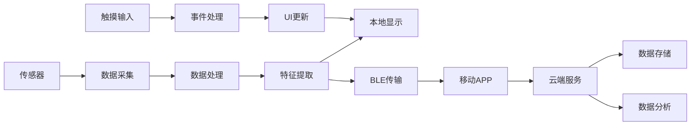

# 智能手表系统开发：完整项目实战

## 项目概述

### 项目简介

本项目将开发一个功能完整的智能手表系统，集成彩色触摸屏、多种传感器、蓝牙通信和云端服务。项目涵盖硬件选型、嵌入式GUI开发、传感器数据融合、低功耗设计、移动应用开发和云端集成等完整技术栈，是一个综合性的可穿戴设备开发实战项目。

**核心功能**：
- 1.3英寸彩色触摸屏显示
- 时间显示和多时区支持
- 运动追踪（步数、距离、卡路里）
- 心率和血氧监测
- 睡眠质量分析
- 消息通知和来电提醒
- 天气信息显示
- 音乐控制
- 移动支付（NFC）
- 语音助手集成
- 蓝牙通话
- GPS轨迹记录

**应用场景**：
- 日常健康监测
- 运动健身追踪
- 智能生活助手
- 移动支付工具
- 时尚配饰

### 项目演示

**设备外观**：
```
        ┌─────────────────┐
        │  ┌───────────┐  │
        │  │           │  │  ← 1.3" 彩色触摸屏
        │  │  12:34    │  │     240x240分辨率
        │  │  ♥ 72     │  │
        │  │  📱 3      │  │
        │  └───────────┘  │
        │                 │
        │  ●  [按键]  ●   │  ← 物理按键和状态灯
        │                 │
        └─────────────────┘
              ║   ║
         ═════╩═══╩═════      ← 表带（可更换）
```

**主要界面**：
- 表盘界面：时间、日期、天气、步数
- 运动界面：实时数据、轨迹地图
- 健康界面：心率、血氧、睡眠
- 通知界面：消息、来电、应用通知
- 设置界面：系统设置、连接管理

### 学习目标

完成本项目后，你将掌握：

- [ ] 智能手表系统架构设计和模块划分
- [ ] 嵌入式GUI框架应用（LVGL）
- [ ] 触摸屏驱动和手势识别
- [ ] 多传感器数据融合技术
- [ ] 实时操作系统任务调度
- [ ] 低功耗设计和电源管理
- [ ] 蓝牙BLE和经典蓝牙应用
- [ ] GPS定位和轨迹记录
- [ ] NFC支付集成
- [ ] 移动应用开发和数据同步
- [ ] 云端服务集成
- [ ] OTA固件升级


## 项目特点

- ✨ **彩色触摸屏**：1.3英寸高清显示，流畅触控体验
- ✨ **多传感器融合**：加速度计、陀螺仪、心率、血氧、GPS
- ✨ **双模蓝牙**：BLE低功耗通信 + 经典蓝牙通话
- ✨ **NFC支付**：支持移动支付功能
- ✨ **长续航**：优化功耗设计，正常使用5-7天
- ✨ **防水设计**：IP67防水等级
- ✨ **丰富表盘**：多种表盘样式，支持自定义
- ✨ **云端同步**：数据云端备份和多设备同步

## 技术栈

### 硬件平台
- **主控芯片**：Nordic nRF52840（ARM Cortex-M4F，BLE 5.0）
- **显示屏**：1.3" 圆形IPS LCD，240x240，ST7789驱动
- **触摸IC**：CST816S电容触摸
- **传感器**：
  - 加速度计+陀螺仪：LSM6DS3
  - 心率+血氧：MAX30102
  - 气压计：BMP280
- **GPS模块**：ATGM336H
- **NFC芯片**：PN532
- **振动马达**：线性马达
- **电池**：3.7V 300mAh锂聚合物电池
- **充电**：磁吸充电座

### 软件技术
- **开发语言**：C/C++（嵌入式）、Kotlin（Android）、Swift（iOS）
- **操作系统**：FreeRTOS
- **GUI框架**：LVGL v8.3
- **蓝牙协议栈**：Nordic SoftDevice S140
- **开发工具**：Segger Embedded Studio、VS Code
- **移动开发**：Android Studio、Xcode
- **云平台**：Firebase或阿里云IoT

### 第三方库
- **LVGL**：轻量级图形库
- **FreeRTOS**：实时操作系统
- **TinyGPS++**：GPS数据解析
- **ArduinoJson**：JSON数据处理
- **MPAndroidChart**：Android图表库
- **Retrofit**：网络请求库

## 硬件清单

### 必需硬件

| 名称 | 型号 | 数量 | 用途 | 参考价格 | 购买链接 |
|------|------|------|------|----------|----------|
| 开发板 | nRF52840 DK | 1 | 主控制器 | ¥280 | [Nordic官网] |
| 显示屏 | 1.3" IPS LCD | 1 | 彩色显示 | ¥45 | [淘宝] |
| 触摸IC | CST816S | 1 | 触摸控制 | ¥8 | [淘宝] |
| 6轴传感器 | LSM6DS3 | 1 | 运动检测 | ¥12 | [淘宝] |
| 心率传感器 | MAX30102 | 1 | 心率血氧 | ¥15 | [淘宝] |
| 气压计 | BMP280 | 1 | 高度测量 | ¥8 | [淘宝] |
| GPS模块 | ATGM336H | 1 | 定位导航 | ¥25 | [淘宝] |
| NFC模块 | PN532 | 1 | 移动支付 | ¥18 | [淘宝] |
| 振动马达 | 线性马达 | 1 | 触觉反馈 | ¥5 | [淘宝] |
| 锂电池 | 3.7V 300mAh | 1 | 电源供应 | ¥12 | [淘宝] |
| 充电模块 | TP4056 | 1 | 电池充电 | ¥3 | [淘宝] |
| 磁吸充电座 | 定制 | 1 | 充电接口 | ¥15 | [淘宝] |
| PCB板 | 定制 | 1 | 电路板 | ¥80 | [嘉立创] |
| 外壳 | 3D打印 | 1 | 设备外壳 | ¥50 | [淘宝] |
| 表带 | 硅胶表带 | 1 | 佩戴 | ¥20 | [淘宝] |

### 可选硬件

| 名称 | 型号 | 数量 | 用途 | 参考价格 |
|------|------|------|------|----------|
| 环境光传感器 | BH1750 | 1 | 自动亮度 | ¥5 |
| 扬声器 | 8Ω 0.5W | 1 | 音频播放 | ¥3 |
| 麦克风 | MEMS麦克风 | 1 | 语音输入 | ¥5 |
| 按键 | 侧边按键 | 2 | 物理交互 | ¥2 |
| LED | RGB LED | 1 | 状态指示 | ¥1 |

**总成本**：约 ¥600-800（不含外壳和PCB定制）

## 软件要求

### 开发环境
- **Segger Embedded Studio** v5.0+（nRF52开发）
- **nRF Connect SDK** v2.0+
- **Android Studio** 2021.3+（Android应用）
- **Xcode** 13+（iOS应用）
- **Python** 3.8+（工具脚本）
- **Git** v2.30+（版本控制）

### 驱动和工具
- nRF Command Line Tools
- J-Link驱动程序
- 串口调试助手
- nRF Connect（蓝牙调试）
- Segger RTT Viewer（日志查看）

### 云平台账号
- Firebase账号（推荐）或阿里云账号
- 云存储服务
- 推送通知服务


## 系统架构

### 整体架构

```
┌─────────────────────────────────────────────────────────┐
│                    云端服务层                            │
│  ┌──────────┐  ┌──────────┐  ┌──────────┐             │
│  │ 数据存储 │  │ 用户管理 │  │ 推送服务 │             │
│  └──────────┘  └──────────┘  └──────────┘             │
└─────────────────────────────────────────────────────────┘
                        ↕ HTTPS/MQTT
┌─────────────────────────────────────────────────────────┐
│                    移动应用层                            │
│  ┌──────────┐  ┌──────────┐  ┌──────────┐             │
│  │ 设备管理 │  │ 数据同步 │  │ 设置配置 │             │
│  └──────────┘  └──────────┘  └──────────┘             │
└─────────────────────────────────────────────────────────┘
                        ↕ BLE
┌─────────────────────────────────────────────────────────┐
│                  智能手表（嵌入式）                       │
│  ┌─────────────────────────────────────────────────┐   │
│  │              应用层                              │   │
│  │  ┌──────────┐  ┌──────────┐  ┌──────────┐     │   │
│  │  │ 表盘UI   │  │ 运动追踪 │  │ 健康监测 │     │   │
│  │  └──────────┘  └──────────┘  └──────────┘     │   │
│  │  ┌──────────┐  ┌──────────┐  ┌──────────┐     │   │
│  │  │ 消息通知 │  │ 音乐控制 │  │ 支付功能 │     │   │
│  │  └──────────┘  └──────────┘  └──────────┘     │   │
│  ├─────────────────────────────────────────────────┤   │
│  │              中间层                              │   │
│  │  ┌──────────┐  ┌──────────┐  ┌──────────┐     │   │
│  │  │ GUI框架  │  │ 传感器管理│  │ 通信管理 │     │   │
│  │  │ (LVGL)   │  │          │  │          │     │   │
│  │  └──────────┘  └──────────┘  └──────────┘     │   │
│  ├─────────────────────────────────────────────────┤   │
│  │              驱动层                              │   │
│  │  ┌──────────┐  ┌──────────┐  ┌──────────┐     │   │
│  │  │ 显示驱动 │  │ 触摸驱动 │  │ 传感器驱动│     │   │
│  │  └──────────┘  └──────────┘  └──────────┘     │   │
│  │  ┌──────────┐  ┌──────────┐  ┌──────────┐     │   │
│  │  │ BLE驱动  │  │ GPS驱动  │  │ NFC驱动  │     │   │
│  │  └──────────┘  └──────────┘  └──────────┘     │   │
│  └─────────────────────────────────────────────────┘   │
│                                                         │
│  ┌─────────────────────────────────────────────────┐   │
│  │              硬件层                              │   │
│  │  ┌──────────┐  ┌──────────┐  ┌──────────┐     │   │
│  │  │ LCD屏幕  │  │ 触摸IC   │  │ 传感器   │     │   │
│  │  └──────────┘  └──────────┘  └──────────┘     │   │
│  │  ┌──────────┐  ┌──────────┐  ┌──────────┐     │   │
│  │  │ GPS模块  │  │ NFC芯片  │  │ 振动马达 │     │   │
│  │  └──────────┘  └──────────┘  └──────────┘     │   │
│  └─────────────────────────────────────────────────┘   │
└─────────────────────────────────────────────────────────┘
```

### 模块说明

#### 1. 显示和交互模块
**功能**：用户界面显示和触摸交互
- 彩色LCD显示（ST7789驱动）
- 电容触摸检测（CST816S）
- 手势识别（滑动、点击、长按）
- 多级菜单导航
- 动画效果

**接口**：
- SPI：LCD数据传输
- I2C：触摸IC通信
- GPIO：背光控制、触摸中断

#### 2. 传感器模块
**功能**：多传感器数据采集和融合
- 运动传感器（LSM6DS3）：步数、姿态
- 心率传感器（MAX30102）：心率、血氧
- 气压计（BMP280）：高度、气压
- GPS（ATGM336H）：位置、轨迹
- 传感器数据融合算法

**接口**：
- I2C：传感器通信
- UART：GPS数据
- GPIO：中断信号

#### 3. 通信模块
**功能**：无线通信和数据传输
- BLE通信：与手机连接
- 经典蓝牙：蓝牙通话（可选）
- NFC：移动支付
- 数据同步和OTA升级

**协议**：
- BLE GATT服务
- NFC Type 2标签
- 自定义数据协议

#### 4. 电源管理模块
**功能**：低功耗设计和电池管理
- 动态电源管理
- 多级睡眠模式
- 电池电量监测
- 充电管理
- 背光自动调节

**目标功耗**：
- 活动模式：< 80 mA
- 待机模式：< 5 mA
- 深度睡眠：< 100 μA
- 目标续航：5-7天

#### 5. 应用功能模块
**功能**：各种应用功能实现
- 时间和闹钟
- 运动追踪
- 健康监测
- 消息通知
- 音乐控制
- 天气信息
- 移动支付

### 数据流图




## 电路设计

### 系统电路框图

```
                    ┌─────────────────┐
                    │   nRF52840      │
                    │                 │
    ST7789 ────────>│ SPI0 (LCD)     │
    (LCD)           │ P0.13-P0.16    │
                    │                 │
    CST816S ───────>│ I2C0 (Touch)   │
    (Touch)         │ P0.26-P0.27    │
                    │                 │
    LSM6DS3 ───────>│ I2C1 (Sensors) │
    MAX30102 ──────>│ P0.30-P0.31    │
    BMP280 ────────>│                │
                    │                 │
    ATGM336H ──────>│ UART0 (GPS)    │
    (GPS)           │ P0.08-P0.06    │
                    │                 │
    PN532 ─────────>│ SPI1 (NFC)     │
    (NFC)           │ P1.01-P1.04    │
                    │                 │
    振动马达 ───────>│ PWM (P0.28)    │
    背光LED ────────>│ PWM (P0.29)    │
                    │                 │
    充电检测 ───────>│ ADC (P0.02)    │
    电池电压 ───────>│ ADC (P0.03)    │
                    └─────────────────┘
                            │
                            │ 3.3V
                            ↓
                    ┌─────────────────┐
                    │   电源管理      │
                    │   TP4056        │
                    │   LDO 3.3V      │
                    └─────────────────┘
                            │
                            ↓
                    ┌─────────────────┐
                    │  锂电池 3.7V    │
                    │  300mAh         │
                    └─────────────────┘
```

### 关键电路设计

**1. 显示电路**：
```
nRF52840 SPI → LCD控制器 → TFT LCD
              ↓
          背光LED驱动（PWM调光）
```

**2. 触摸电路**：
```
触摸屏 → CST816S → I2C → nRF52840
                  ↓
              中断信号（GPIO）
```

**3. 电源电路**：
```
磁吸充电 → TP4056充电 → 锂电池 → LDO稳压 → 3.3V系统
                                  ↓
                              电量检测ADC
```

**4. 传感器电路**：
```
传感器 → I2C总线 → nRF52840
         ↓
     中断信号（可选）
```

## 实现步骤

### 阶段1：硬件搭建和基础测试 (预计4小时)

#### 1.1 硬件组装

**步骤**：
1. **准备工作**
   - 清理工作区域
   - 准备防静电措施
   - 检查所有硬件组件
   - 准备必要工具（烙铁、万用表等）

2. **电源电路搭建**
   ```
   步骤：
   1. 连接TP4056充电模块
   2. 连接锂电池（注意极性！）
   3. 添加LDO稳压模块（输出3.3V）
   4. 测试输出电压（应为3.3V ± 0.1V）
   5. 添加电池电压检测电路
   ```

3. **显示屏连接**
   
   **ST7789 LCD模块**：
   | LCD引脚 | nRF52840引脚 | 说明 |
   |---------|-------------|------|
   | VCC | 3.3V | 电源 |
   | GND | GND | 地 |
   | SCL | P0.13 | SPI时钟 |
   | SDA | P0.14 | SPI数据 |
   | RES | P0.15 | 复位 |
   | DC | P0.16 | 数据/命令 |
   | CS | P0.17 | 片选 |
   | BLK | P0.29 | 背光（PWM） |

4. **触摸IC连接**
   
   **CST816S触摸控制器**：
   | CST816S引脚 | nRF52840引脚 | 说明 |
   |------------|-------------|------|
   | VCC | 3.3V | 电源 |
   | GND | GND | 地 |
   | SDA | P0.26 | I2C数据 |
   | SCL | P0.27 | I2C时钟 |
   | INT | P0.25 | 中断信号 |
   | RST | P0.24 | 复位 |

5. **传感器连接**
   
   **LSM6DS3（6轴传感器）**：
   | LSM6DS3引脚 | nRF52840引脚 | 说明 |
   |------------|-------------|------|
   | VCC | 3.3V | 电源 |
   | GND | GND | 地 |
   | SDA | P0.30 | I2C数据 |
   | SCL | P0.31 | I2C时钟 |
   | INT1 | P1.10 | 中断1 |
   
   **MAX30102（心率传感器）**：
   | MAX30102引脚 | nRF52840引脚 | 说明 |
   |-------------|-------------|------|
   | VCC | 3.3V | 电源 |
   | GND | GND | 地 |
   | SDA | P0.30 | I2C数据 |
   | SCL | P0.31 | I2C时钟 |
   | INT | P1.11 | 中断 |
   
   **BMP280（气压计）**：
   | BMP280引脚 | nRF52840引脚 | 说明 |
   |-----------|-------------|------|
   | VCC | 3.3V | 电源 |
   | GND | GND | 地 |
   | SDA | P0.30 | I2C数据 |
   | SCL | P0.31 | I2C时钟 |

6. **GPS模块连接**
   
   **ATGM336H GPS**：
   | GPS引脚 | nRF52840引脚 | 说明 |
   |---------|-------------|------|
   | VCC | 3.3V | 电源 |
   | GND | GND | 地 |
   | TX | P0.08 | UART接收 |
   | RX | P0.06 | UART发送 |

7. **NFC模块连接**
   
   **PN532 NFC**：
   | PN532引脚 | nRF52840引脚 | 说明 |
   |----------|-------------|------|
   | VCC | 3.3V | 电源 |
   | GND | GND | 地 |
   | SCK | P1.01 | SPI时钟 |
   | MISO | P1.02 | SPI数据输入 |
   | MOSI | P1.03 | SPI数据输出 |
   | SS | P1.04 | 片选 |

8. **其他外设连接**
   
   | 外设 | nRF52840引脚 | 说明 |
   |------|-------------|------|
   | 振动马达 | P0.28 | PWM控制 |
   | 按键1 | P0.18 | 物理按键 |
   | 按键2 | P0.19 | 物理按键 |
   | LED | P0.20 | 状态指示 |

**检查清单**：
- [ ] 所有电源连接正确（3.3V和GND）
- [ ] I2C设备地址无冲突
- [ ] SPI片选信号独立
- [ ] UART TX/RX交叉连接正确
- [ ] 无短路现象
- [ ] 电池极性正确
- [ ] 所有焊接点牢固


#### 1.2 基础硬件测试

**测试1：电源测试**
```c
// 测试代码
#include <zephyr.h>
#include <device.h>
#include <drivers/gpio.h>

void test_power(void) {
    printk("系统启动...\n");
    printk("系统时钟: %d Hz\n", SystemCoreClock);
    
    // LED闪烁测试
    const struct device *led_dev = device_get_binding("GPIO_0");
    gpio_pin_configure(led_dev, 20, GPIO_OUTPUT);
    
    for(int i = 0; i < 10; i++) {
        gpio_pin_set(led_dev, 20, 1);
        k_msleep(500);
        gpio_pin_set(led_dev, 20, 0);
        k_msleep(500);
    }
    
    printk("电源测试完成\n");
}
```

**测试2：I2C总线扫描**
```c
#include <drivers/i2c.h>

void scan_i2c_devices(const struct device *i2c_dev) {
    printk("扫描I2C设备...\n");
    
    for(uint8_t addr = 1; addr < 128; addr++) {
        struct i2c_msg msg;
        uint8_t data = 0;
        
        msg.buf = &data;
        msg.len = 0;
        msg.flags = I2C_MSG_WRITE | I2C_MSG_STOP;
        
        if(i2c_transfer(i2c_dev, &msg, 1, addr) == 0) {
            printk("发现设备: 0x%02X\n", addr);
        }
    }
    
    printk("扫描完成\n");
}

// 预期发现的设备地址：
// CST816S: 0x15
// LSM6DS3: 0x6A
// MAX30102: 0x57
// BMP280: 0x76
```

**测试3：显示屏测试**
```c
#include <drivers/display.h>

void test_display(void) {
    const struct device *display_dev = device_get_binding("ST7789");
    
    if (!display_dev) {
        printk("显示设备未找到\n");
        return;
    }
    
    // 填充屏幕为红色
    struct display_buffer_descriptor buf_desc;
    buf_desc.buf_size = 240 * 240 * 2;  // RGB565
    buf_desc.width = 240;
    buf_desc.height = 240;
    buf_desc.pitch = 240;
    
    uint16_t *framebuffer = k_malloc(buf_desc.buf_size);
    for(int i = 0; i < 240 * 240; i++) {
        framebuffer[i] = 0xF800;  // 红色 RGB565
    }
    
    display_write(display_dev, 0, 0, &buf_desc, framebuffer);
    
    k_free(framebuffer);
    printk("显示测试完成\n");
}
```

### 阶段2：驱动程序开发 (预计6小时)

#### 2.1 ST7789 LCD驱动实现

```c
// st7789.h
#ifndef ST7789_H
#define ST7789_H

#include <zephyr.h>
#include <drivers/spi.h>
#include <drivers/gpio.h>

#define ST7789_WIDTH  240
#define ST7789_HEIGHT 240

// 命令定义
#define ST7789_NOP     0x00
#define ST7789_SWRESET 0x01
#define ST7789_SLPIN   0x10
#define ST7789_SLPOUT  0x11
#define ST7789_INVOFF  0x20
#define ST7789_INVON   0x21
#define ST7789_DISPOFF 0x28
#define ST7789_DISPON  0x29
#define ST7789_CASET   0x2A
#define ST7789_RASET   0x2B
#define ST7789_RAMWR   0x2C
#define ST7789_MADCTL  0x36
#define ST7789_COLMOD  0x3A

typedef struct {
    const struct device *spi_dev;
    const struct device *gpio_dev;
    uint8_t dc_pin;
    uint8_t rst_pin;
    uint8_t cs_pin;
} st7789_config_t;

int st7789_init(st7789_config_t *config);
void st7789_write_command(st7789_config_t *config, uint8_t cmd);
void st7789_write_data(st7789_config_t *config, uint8_t *data, size_t len);
void st7789_set_window(st7789_config_t *config, uint16_t x0, uint16_t y0, 
                       uint16_t x1, uint16_t y1);
void st7789_fill_rect(st7789_config_t *config, uint16_t x, uint16_t y, 
                      uint16_t w, uint16_t h, uint16_t color);
void st7789_draw_pixel(st7789_config_t *config, uint16_t x, uint16_t y, 
                       uint16_t color);

#endif

// st7789.c
#include "st7789.h"

static void st7789_reset(st7789_config_t *config) {
    gpio_pin_set(config->gpio_dev, config->rst_pin, 0);
    k_msleep(10);
    gpio_pin_set(config->gpio_dev, config->rst_pin, 1);
    k_msleep(120);
}

void st7789_write_command(st7789_config_t *config, uint8_t cmd) {
    gpio_pin_set(config->gpio_dev, config->dc_pin, 0);  // 命令模式
    gpio_pin_set(config->gpio_dev, config->cs_pin, 0);  // 片选
    
    struct spi_buf tx_buf = {
        .buf = &cmd,
        .len = 1
    };
    struct spi_buf_set tx = {
        .buffers = &tx_buf,
        .count = 1
    };
    
    spi_write(config->spi_dev, &spi_cfg, &tx);
    
    gpio_pin_set(config->gpio_dev, config->cs_pin, 1);
}

void st7789_write_data(st7789_config_t *config, uint8_t *data, size_t len) {
    gpio_pin_set(config->gpio_dev, config->dc_pin, 1);  // 数据模式
    gpio_pin_set(config->gpio_dev, config->cs_pin, 0);
    
    struct spi_buf tx_buf = {
        .buf = data,
        .len = len
    };
    struct spi_buf_set tx = {
        .buffers = &tx_buf,
        .count = 1
    };
    
    spi_write(config->spi_dev, &spi_cfg, &tx);
    
    gpio_pin_set(config->gpio_dev, config->cs_pin, 1);
}

int st7789_init(st7789_config_t *config) {
    // 配置GPIO
    gpio_pin_configure(config->gpio_dev, config->dc_pin, GPIO_OUTPUT);
    gpio_pin_configure(config->gpio_dev, config->rst_pin, GPIO_OUTPUT);
    gpio_pin_configure(config->gpio_dev, config->cs_pin, GPIO_OUTPUT);
    
    // 硬件复位
    st7789_reset(config);
    
    // 初始化序列
    st7789_write_command(config, ST7789_SWRESET);
    k_msleep(150);
    
    st7789_write_command(config, ST7789_SLPOUT);
    k_msleep(10);
    
    // 设置颜色模式为RGB565
    st7789_write_command(config, ST7789_COLMOD);
    uint8_t colmod = 0x55;  // 16位色
    st7789_write_data(config, &colmod, 1);
    
    // 设置显示方向
    st7789_write_command(config, ST7789_MADCTL);
    uint8_t madctl = 0x00;
    st7789_write_data(config, &madctl, 1);
    
    // 打开显示
    st7789_write_command(config, ST7789_DISPON);
    k_msleep(10);
    
    return 0;
}

void st7789_set_window(st7789_config_t *config, uint16_t x0, uint16_t y0, 
                       uint16_t x1, uint16_t y1) {
    // 设置列地址
    st7789_write_command(config, ST7789_CASET);
    uint8_t caset[4] = {x0 >> 8, x0 & 0xFF, x1 >> 8, x1 & 0xFF};
    st7789_write_data(config, caset, 4);
    
    // 设置行地址
    st7789_write_command(config, ST7789_RASET);
    uint8_t raset[4] = {y0 >> 8, y0 & 0xFF, y1 >> 8, y1 & 0xFF};
    st7789_write_data(config, raset, 4);
    
    // 开始写入RAM
    st7789_write_command(config, ST7789_RAMWR);
}

void st7789_fill_rect(st7789_config_t *config, uint16_t x, uint16_t y, 
                      uint16_t w, uint16_t h, uint16_t color) {
    st7789_set_window(config, x, y, x + w - 1, y + h - 1);
    
    // 准备颜色数据
    uint16_t *buffer = k_malloc(w * 2);
    for(int i = 0; i < w; i++) {
        buffer[i] = __builtin_bswap16(color);  // 字节序转换
    }
    
    // 逐行填充
    for(int i = 0; i < h; i++) {
        st7789_write_data(config, (uint8_t*)buffer, w * 2);
    }
    
    k_free(buffer);
}
```

#### 2.2 CST816S触摸驱动实现

```c
// cst816s.h
#ifndef CST816S_H
#define CST816S_H

#include <zephyr.h>
#include <drivers/i2c.h>
#include <drivers/gpio.h>

#define CST816S_ADDR 0x15

// 寄存器地址
#define CST816S_REG_GESTURE   0x01
#define CST816S_REG_POINTS    0x02
#define CST816S_REG_XPOS_H    0x03
#define CST816S_REG_XPOS_L    0x04
#define CST816S_REG_YPOS_H    0x05
#define CST816S_REG_YPOS_L    0x06

// 手势类型
typedef enum {
    GESTURE_NONE = 0x00,
    GESTURE_SWIPE_UP = 0x01,
    GESTURE_SWIPE_DOWN = 0x02,
    GESTURE_SWIPE_LEFT = 0x03,
    GESTURE_SWIPE_RIGHT = 0x04,
    GESTURE_SINGLE_CLICK = 0x05,
    GESTURE_DOUBLE_CLICK = 0x0B,
    GESTURE_LONG_PRESS = 0x0C
} cst816s_gesture_t;

typedef struct {
    uint16_t x;
    uint16_t y;
    uint8_t points;
    cst816s_gesture_t gesture;
} cst816s_data_t;

typedef struct {
    const struct device *i2c_dev;
    const struct device *gpio_dev;
    uint8_t int_pin;
    uint8_t rst_pin;
} cst816s_config_t;

int cst816s_init(cst816s_config_t *config);
int cst816s_read(cst816s_config_t *config, cst816s_data_t *data);

#endif

// cst816s.c
#include "cst816s.h"

int cst816s_init(cst816s_config_t *config) {
    // 配置GPIO
    gpio_pin_configure(config->gpio_dev, config->rst_pin, GPIO_OUTPUT);
    gpio_pin_configure(config->gpio_dev, config->int_pin, 
                      GPIO_INPUT | GPIO_PULL_UP);
    
    // 硬件复位
    gpio_pin_set(config->gpio_dev, config->rst_pin, 0);
    k_msleep(10);
    gpio_pin_set(config->gpio_dev, config->rst_pin, 1);
    k_msleep(50);
    
    // 检查设备是否响应
    uint8_t dummy;
    if(i2c_reg_read_byte(config->i2c_dev, CST816S_ADDR, 
                         CST816S_REG_GESTURE, &dummy) != 0) {
        return -1;
    }
    
    return 0;
}

int cst816s_read(cst816s_config_t *config, cst816s_data_t *data) {
    uint8_t buf[7];
    
    // 读取触摸数据
    if(i2c_burst_read(config->i2c_dev, CST816S_ADDR, 
                      CST816S_REG_GESTURE, buf, 7) != 0) {
        return -1;
    }
    
    // 解析数据
    data->gesture = (cst816s_gesture_t)buf[0];
    data->points = buf[1];
    data->x = ((buf[2] & 0x0F) << 8) | buf[3];
    data->y = ((buf[4] & 0x0F) << 8) | buf[5];
    
    return 0;
}
```


### 阶段3：LVGL GUI开发 (预计8小时)

#### 3.1 LVGL初始化

```c
// lvgl_init.c
#include <lvgl.h>
#include "st7789.h"

static lv_disp_draw_buf_t disp_buf;
static lv_color_t buf1[ST7789_WIDTH * 10];
static lv_color_t buf2[ST7789_WIDTH * 10];

static void disp_flush(lv_disp_drv_t *disp_drv, const lv_area_t *area, 
                       lv_color_t *color_p) {
    st7789_config_t *config = disp_drv->user_data;
    
    uint16_t w = area->x2 - area->x1 + 1;
    uint16_t h = area->y2 - area->y1 + 1;
    
    st7789_set_window(config, area->x1, area->y1, area->x2, area->y2);
    st7789_write_data(config, (uint8_t*)color_p, w * h * 2);
    
    lv_disp_flush_ready(disp_drv);
}

static void touchpad_read(lv_indev_drv_t *indev_drv, lv_indev_data_t *data) {
    cst816s_config_t *config = indev_drv->user_data;
    cst816s_data_t touch_data;
    
    if(cst816s_read(config, &touch_data) == 0 && touch_data.points > 0) {
        data->state = LV_INDEV_STATE_PRESSED;
        data->point.x = touch_data.x;
        data->point.y = touch_data.y;
    } else {
        data->state = LV_INDEV_STATE_RELEASED;
    }
}

void lvgl_init(st7789_config_t *lcd_config, cst816s_config_t *touch_config) {
    lv_init();
    
    // 初始化显示缓冲区
    lv_disp_draw_buf_init(&disp_buf, buf1, buf2, ST7789_WIDTH * 10);
    
    // 注册显示驱动
    static lv_disp_drv_t disp_drv;
    lv_disp_drv_init(&disp_drv);
    disp_drv.hor_res = ST7789_WIDTH;
    disp_drv.ver_res = ST7789_HEIGHT;
    disp_drv.flush_cb = disp_flush;
    disp_drv.draw_buf = &disp_buf;
    disp_drv.user_data = lcd_config;
    lv_disp_drv_register(&disp_drv);
    
    // 注册触摸驱动
    static lv_indev_drv_t indev_drv;
    lv_indev_drv_init(&indev_drv);
    indev_drv.type = LV_INDEV_TYPE_POINTER;
    indev_drv.read_cb = touchpad_read;
    indev_drv.user_data = touch_config;
    lv_indev_drv_register(&indev_drv);
}
```

#### 3.2 表盘界面设计

```c
// watchface.c
#include <lvgl.h>

static lv_obj_t *watchface_screen;
static lv_obj_t *time_label;
static lv_obj_t *date_label;
static lv_obj_t *steps_label;
static lv_obj_t *heart_rate_label;

void create_watchface(void) {
    watchface_screen = lv_obj_create(NULL);
    lv_obj_set_style_bg_color(watchface_screen, lv_color_black(), 0);
    
    // 时间显示
    time_label = lv_label_create(watchface_screen);
    lv_obj_set_style_text_font(time_label, &lv_font_montserrat_48, 0);
    lv_obj_set_style_text_color(time_label, lv_color_white(), 0);
    lv_obj_align(time_label, LV_ALIGN_CENTER, 0, -40);
    lv_label_set_text(time_label, "12:34");
    
    // 日期显示
    date_label = lv_label_create(watchface_screen);
    lv_obj_set_style_text_font(date_label, &lv_font_montserrat_20, 0);
    lv_obj_set_style_text_color(date_label, lv_color_make(180, 180, 180), 0);
    lv_obj_align(date_label, LV_ALIGN_CENTER, 0, 10);
    lv_label_set_text(date_label, "2024-01-15 Monday");
    
    // 步数显示
    steps_label = lv_label_create(watchface_screen);
    lv_obj_set_style_text_font(steps_label, &lv_font_montserrat_16, 0);
    lv_obj_set_style_text_color(steps_label, lv_color_make(100, 200, 255), 0);
    lv_obj_align(steps_label, LV_ALIGN_BOTTOM_LEFT, 20, -20);
    lv_label_set_text(steps_label, LV_SYMBOL_SHUFFLE " 5,234");
    
    // 心率显示
    heart_rate_label = lv_label_create(watchface_screen);
    lv_obj_set_style_text_font(heart_rate_label, &lv_font_montserrat_16, 0);
    lv_obj_set_style_text_color(heart_rate_label, lv_color_make(255, 100, 100), 0);
    lv_obj_align(heart_rate_label, LV_ALIGN_BOTTOM_RIGHT, -20, -20);
    lv_label_set_text(heart_rate_label, LV_SYMBOL_HEART_FULL " 72");
    
    lv_scr_load(watchface_screen);
}

void update_watchface_time(uint8_t hour, uint8_t minute) {
    lv_label_set_text_fmt(time_label, "%02d:%02d", hour, minute);
}

void update_watchface_steps(uint32_t steps) {
    lv_label_set_text_fmt(steps_label, LV_SYMBOL_SHUFFLE " %d", steps);
}

void update_watchface_heart_rate(uint8_t hr) {
    lv_label_set_text_fmt(heart_rate_label, LV_SYMBOL_HEART_FULL " %d", hr);
}
```

#### 3.3 运动界面设计

```c
// sport_screen.c
static lv_obj_t *sport_screen;
static lv_obj_t *duration_label;
static lv_obj_t *distance_label;
static lv_obj_t *calories_label;
static lv_obj_t *pace_label;

void create_sport_screen(void) {
    sport_screen = lv_obj_create(NULL);
    lv_obj_set_style_bg_color(sport_screen, lv_color_black(), 0);
    
    // 标题
    lv_obj_t *title = lv_label_create(sport_screen);
    lv_label_set_text(title, "Running");
    lv_obj_set_style_text_font(title, &lv_font_montserrat_24, 0);
    lv_obj_set_style_text_color(title, lv_color_white(), 0);
    lv_obj_align(title, LV_ALIGN_TOP_MID, 0, 20);
    
    // 时长
    duration_label = lv_label_create(sport_screen);
    lv_label_set_text(duration_label, "00:00:00");
    lv_obj_set_style_text_font(duration_label, &lv_font_montserrat_32, 0);
    lv_obj_set_style_text_color(duration_label, lv_color_make(100, 255, 100), 0);
    lv_obj_align(duration_label, LV_ALIGN_CENTER, 0, -30);
    
    // 距离
    distance_label = lv_label_create(sport_screen);
    lv_label_set_text(distance_label, "0.00 km");
    lv_obj_set_style_text_font(distance_label, &lv_font_montserrat_20, 0);
    lv_obj_align(distance_label, LV_ALIGN_CENTER, 0, 10);
    
    // 卡路里
    calories_label = lv_label_create(sport_screen);
    lv_label_set_text(calories_label, "0 kcal");
    lv_obj_set_style_text_font(calories_label, &lv_font_montserrat_16, 0);
    lv_obj_align(calories_label, LV_ALIGN_BOTTOM_LEFT, 20, -20);
    
    // 配速
    pace_label = lv_label_create(sport_screen);
    lv_label_set_text(pace_label, "0'00\"");
    lv_obj_set_style_text_font(pace_label, &lv_font_montserrat_16, 0);
    lv_obj_align(pace_label, LV_ALIGN_BOTTOM_RIGHT, -20, -20);
}

void update_sport_data(uint32_t duration_sec, float distance_km, 
                       uint16_t calories, uint16_t pace_sec) {
    uint8_t hours = duration_sec / 3600;
    uint8_t minutes = (duration_sec % 3600) / 60;
    uint8_t seconds = duration_sec % 60;
    
    lv_label_set_text_fmt(duration_label, "%02d:%02d:%02d", 
                         hours, minutes, seconds);
    lv_label_set_text_fmt(distance_label, "%.2f km", distance_km);
    lv_label_set_text_fmt(calories_label, "%d kcal", calories);
    lv_label_set_text_fmt(pace_label, "%d'%02d\"", 
                         pace_sec / 60, pace_sec % 60);
}
```

### 阶段4：传感器数据处理 (预计6小时)

#### 4.1 运动算法实现

```c
// pedometer.c
#include <math.h>

#define SAMPLE_RATE 50  // 50 Hz
#define WINDOW_SIZE 25  // 0.5秒窗口

typedef struct {
    float accel_buffer[WINDOW_SIZE][3];
    int buffer_index;
    uint32_t step_count;
    float last_magnitude;
    uint32_t last_step_time;
} pedometer_t;

void pedometer_init(pedometer_t *ped) {
    memset(ped, 0, sizeof(pedometer_t));
}

void pedometer_update(pedometer_t *ped, float ax, float ay, float az) {
    // 计算加速度幅值
    float magnitude = sqrtf(ax*ax + ay*ay + az*az);
    
    // 存储到缓冲区
    ped->accel_buffer[ped->buffer_index][0] = ax;
    ped->accel_buffer[ped->buffer_index][1] = ay;
    ped->accel_buffer[ped->buffer_index][2] = az;
    ped->buffer_index = (ped->buffer_index + 1) % WINDOW_SIZE;
    
    // 步态检测
    uint32_t current_time = k_uptime_get_32();
    
    // 检测峰值
    if (magnitude > 1.2f && ped->last_magnitude < 1.2f) {
        // 最小步态间隔检查（防止误检）
        if (current_time - ped->last_step_time > 250) {
            ped->step_count++;
            ped->last_step_time = current_time;
        }
    }
    
    ped->last_magnitude = magnitude;
}

uint32_t pedometer_get_steps(pedometer_t *ped) {
    return ped->step_count;
}

float pedometer_get_distance(pedometer_t *ped) {
    // 假设平均步长0.7米
    return ped->step_count * 0.7f / 1000.0f;  // 返回公里
}

uint16_t pedometer_get_calories(pedometer_t *ped) {
    // 简化的卡路里计算（实际需要考虑体重等因素）
    return ped->step_count * 0.04f;
}
```

#### 4.2 心率算法实现

```c
// heart_rate.c
#define HR_BUFFER_SIZE 100

typedef struct {
    uint32_t ir_buffer[HR_BUFFER_SIZE];
    uint32_t red_buffer[HR_BUFFER_SIZE];
    int buffer_index;
    uint8_t heart_rate;
    uint8_t spo2;
    bool valid;
} heart_rate_monitor_t;

void hr_monitor_init(heart_rate_monitor_t *hrm) {
    memset(hrm, 0, sizeof(heart_rate_monitor_t));
}

void hr_monitor_update(heart_rate_monitor_t *hrm, uint32_t red, uint32_t ir) {
    hrm->red_buffer[hrm->buffer_index] = red;
    hrm->ir_buffer[hrm->buffer_index] = ir;
    hrm->buffer_index = (hrm->buffer_index + 1) % HR_BUFFER_SIZE;
    
    // 缓冲区满后计算心率和血氧
    if (hrm->buffer_index == 0) {
        hr_calculate(hrm);
    }
}

static void hr_calculate(heart_rate_monitor_t *hrm) {
    // 使用Maxim算法计算心率和血氧
    // 这里使用简化版本
    
    // 查找峰值
    int peak_count = 0;
    uint32_t last_peak_time = 0;
    uint32_t peak_intervals[10];
    
    for (int i = 1; i < HR_BUFFER_SIZE - 1; i++) {
        if (hrm->ir_buffer[i] > hrm->ir_buffer[i-1] && 
            hrm->ir_buffer[i] > hrm->ir_buffer[i+1] &&
            hrm->ir_buffer[i] > 50000) {
            
            uint32_t current_time = i * 10;  // 假设10ms采样间隔
            if (current_time - last_peak_time > 300) {  // 最小间隔300ms
                if (peak_count < 10) {
                    peak_intervals[peak_count] = current_time - last_peak_time;
                    peak_count++;
                }
                last_peak_time = current_time;
            }
        }
    }
    
    // 计算平均心率
    if (peak_count > 2) {
        uint32_t avg_interval = 0;
        for (int i = 0; i < peak_count; i++) {
            avg_interval += peak_intervals[i];
        }
        avg_interval /= peak_count;
        
        hrm->heart_rate = 60000 / avg_interval;
        hrm->valid = true;
    } else {
        hrm->valid = false;
    }
    
    // 计算SpO2（简化版本）
    float ratio = (float)hrm->red_buffer[0] / (float)hrm->ir_buffer[0];
    hrm->spo2 = (uint8_t)(110.0f - 25.0f * ratio);
    if (hrm->spo2 > 100) hrm->spo2 = 100;
    if (hrm->spo2 < 70) hrm->spo2 = 70;
}
```


### 阶段5：蓝牙通信实现 (预计4小时)

#### 5.1 BLE服务定义

```c
// ble_service.h
#define BT_UUID_SMARTWATCH_SERVICE BT_UUID_DECLARE_128( \
    0x12, 0x34, 0x56, 0x78, 0x90, 0xAB, 0xCD, 0xEF, \
    0x12, 0x34, 0x56, 0x78, 0x90, 0xAB, 0xCD, 0xEF)

#define BT_UUID_TIME_CHAR BT_UUID_DECLARE_128( \
    0x12, 0x34, 0x56, 0x78, 0x90, 0xAB, 0xCD, 0xEF, \
    0x12, 0x34, 0x56, 0x78, 0x90, 0xAB, 0xCD, 0x01)

#define BT_UUID_STEPS_CHAR BT_UUID_DECLARE_128( \
    0x12, 0x34, 0x56, 0x78, 0x90, 0xAB, 0xCD, 0xEF, \
    0x12, 0x34, 0x56, 0x78, 0x90, 0xAB, 0xCD, 0x02)

#define BT_UUID_HR_CHAR BT_UUID_DECLARE_128( \
    0x12, 0x34, 0x56, 0x78, 0x90, 0xAB, 0xCD, 0xEF, \
    0x12, 0x34, 0x56, 0x78, 0x90, 0xAB, 0xCD, 0x03)

// ble_service.c
#include <bluetooth/bluetooth.h>
#include <bluetooth/gatt.h>

static uint8_t time_data[7];  // 年月日时分秒星期
static uint32_t steps_data;
static uint8_t hr_data;

static ssize_t read_time(struct bt_conn *conn, const struct bt_gatt_attr *attr,
                        void *buf, uint16_t len, uint16_t offset) {
    return bt_gatt_attr_read(conn, attr, buf, len, offset, 
                            time_data, sizeof(time_data));
}

static ssize_t write_time(struct bt_conn *conn, const struct bt_gatt_attr *attr,
                         const void *buf, uint16_t len, uint16_t offset,
                         uint8_t flags) {
    if (offset + len > sizeof(time_data)) {
        return BT_GATT_ERR(BT_ATT_ERR_INVALID_OFFSET);
    }
    
    memcpy(time_data + offset, buf, len);
    
    // 更新系统时间
    // update_system_time(time_data);
    
    return len;
}

BT_GATT_SERVICE_DEFINE(smartwatch_svc,
    BT_GATT_PRIMARY_SERVICE(BT_UUID_SMARTWATCH_SERVICE),
    
    // 时间特征
    BT_GATT_CHARACTERISTIC(BT_UUID_TIME_CHAR,
                          BT_GATT_CHRC_READ | BT_GATT_CHRC_WRITE,
                          BT_GATT_PERM_READ | BT_GATT_PERM_WRITE,
                          read_time, write_time, NULL),
    
    // 步数特征
    BT_GATT_CHARACTERISTIC(BT_UUID_STEPS_CHAR,
                          BT_GATT_CHRC_READ | BT_GATT_CHRC_NOTIFY,
                          BT_GATT_PERM_READ,
                          NULL, NULL, &steps_data),
    BT_GATT_CCC(NULL, BT_GATT_PERM_READ | BT_GATT_PERM_WRITE),
    
    // 心率特征
    BT_GATT_CHARACTERISTIC(BT_UUID_HR_CHAR,
                          BT_GATT_CHRC_READ | BT_GATT_CHRC_NOTIFY,
                          BT_GATT_PERM_READ,
                          NULL, NULL, &hr_data),
    BT_GATT_CCC(NULL, BT_GATT_PERM_READ | BT_GATT_PERM_WRITE),
);

void ble_notify_steps(uint32_t steps) {
    steps_data = steps;
    bt_gatt_notify(NULL, &smartwatch_svc.attrs[4], 
                  &steps_data, sizeof(steps_data));
}

void ble_notify_heart_rate(uint8_t hr) {
    hr_data = hr;
    bt_gatt_notify(NULL, &smartwatch_svc.attrs[7], 
                  &hr_data, sizeof(hr_data));
}
```

### 阶段6：电源管理 (预计3小时)

```c
// power_manager.c
#include <drivers/adc.h>

#define BATTERY_ADC_CHANNEL 3
#define BATTERY_FULL_VOLTAGE 4.2f
#define BATTERY_EMPTY_VOLTAGE 3.3f

typedef enum {
    POWER_MODE_ACTIVE,
    POWER_MODE_IDLE,
    POWER_MODE_SLEEP
} power_mode_t;

typedef struct {
    power_mode_t current_mode;
    uint8_t battery_level;
    bool is_charging;
    uint32_t last_activity_time;
} power_manager_t;

static power_manager_t pm;

void power_manager_init(void) {
    memset(&pm, 0, sizeof(pm));
    pm.current_mode = POWER_MODE_ACTIVE;
    pm.battery_level = 100;
}

uint8_t power_manager_get_battery_level(void) {
    const struct device *adc_dev = device_get_binding("ADC_0");
    
    struct adc_channel_cfg channel_cfg = {
        .gain = ADC_GAIN_1_6,
        .reference = ADC_REF_INTERNAL,
        .acquisition_time = ADC_ACQ_TIME_DEFAULT,
        .channel_id = BATTERY_ADC_CHANNEL,
    };
    
    adc_channel_setup(adc_dev, &channel_cfg);
    
    uint16_t sample_buffer[1];
    struct adc_sequence sequence = {
        .channels = BIT(BATTERY_ADC_CHANNEL),
        .buffer = sample_buffer,
        .buffer_size = sizeof(sample_buffer),
        .resolution = 12,
    };
    
    adc_read(adc_dev, &sequence);
    
    // 转换为电压
    float voltage = (sample_buffer[0] * 3.6f) / 4096.0f * 2.0f;
    
    // 计算电量百分比
    float percentage = (voltage - BATTERY_EMPTY_VOLTAGE) / 
                      (BATTERY_FULL_VOLTAGE - BATTERY_EMPTY_VOLTAGE) * 100.0f;
    
    if (percentage > 100.0f) percentage = 100.0f;
    if (percentage < 0.0f) percentage = 0.0f;
    
    pm.battery_level = (uint8_t)percentage;
    return pm.battery_level;
}

void power_manager_enter_sleep(void) {
    // 关闭显示背光
    // 降低传感器采样率
    // 进入低功耗模式
    pm.current_mode = POWER_MODE_SLEEP;
}

void power_manager_wake_up(void) {
    // 恢复显示
    // 恢复传感器采样率
    pm.current_mode = POWER_MODE_ACTIVE;
    pm.last_activity_time = k_uptime_get_32();
}

void power_manager_update(void) {
    uint32_t idle_time = k_uptime_get_32() - pm.last_activity_time;
    
    // 10秒无操作进入睡眠
    if (idle_time > 10000 && pm.current_mode == POWER_MODE_ACTIVE) {
        power_manager_enter_sleep();
    }
}
```

### 阶段7：移动应用开发 (预计8小时)

#### 7.1 Android应用架构

```kotlin
// MainActivity.kt
class MainActivity : AppCompatActivity() {
    private lateinit var bleManager: BleManager
    private lateinit var binding: ActivityMainBinding
    
    override fun onCreate(savedInstanceState: Bundle?) {
        super.onCreate(savedInstanceState)
        binding = ActivityMainBinding.inflate(layoutInflater)
        setContentView(binding.root)
        
        bleManager = BleManager(this)
        setupUI()
        setupBleConnection()
    }
    
    private fun setupUI() {
        binding.connectButton.setOnClickListener {
            bleManager.scanAndConnect()
        }
    }
    
    private fun setupBleConnection() {
        bleManager.onDataReceived = { data ->
            runOnUiThread {
                updateUI(data)
            }
        }
    }
    
    private fun updateUI(data: WatchData) {
        binding.stepsText.text = "${data.steps} steps"
        binding.heartRateText.text = "${data.heartRate} bpm"
        binding.batteryText.text = "${data.battery}%"
    }
}

// BleManager.kt
class BleManager(private val context: Context) {
    private val bluetoothAdapter: BluetoothAdapter = 
        BluetoothAdapter.getDefaultAdapter()
    private var bluetoothGatt: BluetoothGatt? = null
    
    var onDataReceived: ((WatchData) -> Unit)? = null
    
    fun scanAndConnect() {
        val scanner = bluetoothAdapter.bluetoothLeScanner
        val scanCallback = object : ScanCallback() {
            override fun onScanResult(callbackType: Int, result: ScanResult) {
                if (result.device.name == "SmartWatch") {
                    connect(result.device)
                    scanner.stopScan(this)
                }
            }
        }
        
        scanner.startScan(scanCallback)
    }
    
    private fun connect(device: BluetoothDevice) {
        bluetoothGatt = device.connectGatt(context, false, gattCallback)
    }
    
    private val gattCallback = object : BluetoothGattCallback() {
        override fun onConnectionStateChange(gatt: BluetoothGatt, 
                                            status: Int, newState: Int) {
            if (newState == BluetoothProfile.STATE_CONNECTED) {
                gatt.discoverServices()
            }
        }
        
        override fun onServicesDiscovered(gatt: BluetoothGatt, status: Int) {
            // 订阅通知
            val service = gatt.getService(SMARTWATCH_SERVICE_UUID)
            val stepsChar = service.getCharacteristic(STEPS_CHAR_UUID)
            gatt.setCharacteristicNotification(stepsChar, true)
        }
        
        override fun onCharacteristicChanged(gatt: BluetoothGatt, 
                                            characteristic: BluetoothGattCharacteristic) {
            val data = parseData(characteristic)
            onDataReceived?.invoke(data)
        }
    }
}
```

## 测试验证

### 功能测试清单

- [ ] 显示屏正常显示，颜色准确
- [ ] 触摸响应灵敏，手势识别准确
- [ ] 步数统计准确（误差<5%）
- [ ] 心率测量准确（误差<±3 bpm）
- [ ] 血氧测量准确（误差<±2%）
- [ ] GPS定位准确，轨迹记录正常
- [ ] 蓝牙连接稳定，数据传输无丢失
- [ ] NFC支付功能正常
- [ ] 电池续航达到设计目标（5-7天）
- [ ] 充电功能正常
- [ ] 防水测试通过（IP67）
- [ ] 移动APP功能完整，数据同步正常

### 性能测试

| 指标 | 目标值 | 测试方法 | 实测值 |
|------|--------|----------|--------|
| 显示刷新率 | 30 FPS | 帧率测试 | |
| 触摸延迟 | <50ms | 延迟测试 | |
| 步数精度 | ±5% | 对比标准设备 | |
| 心率精度 | ±3 bpm | 对比标准设备 | |
| GPS精度 | <10m | 实地测试 | |
| BLE延迟 | <100ms | 时间戳对比 | |
| 功耗（活动） | <80mA | 电流表测量 | |
| 功耗（待机） | <5mA | 电流表测量 | |
| 电池续航 | 5-7天 | 连续使用测试 | |

## 故障排除

### 常见问题

#### 问题1：显示屏花屏或不显示

**可能原因**：
- SPI连接不良
- 电源电压不稳定
- 初始化序列错误
- 时序参数不正确

**解决方法**：
1. 检查SPI连接和焊接
2. 测量电源电压稳定性
3. 参考数据手册调整初始化序列
4. 使用逻辑分析仪检查SPI时序

#### 问题2：触摸不响应或误触

**可能原因**：
- I2C通信异常
- 触摸IC未正确初始化
- 屏幕保护膜影响
- 接地不良

**解决方法**：
1. 检查I2C连接
2. 确认触摸IC地址正确
3. 移除保护膜测试
4. 改善接地设计

#### 问题3：传感器数据不准确

**可能原因**：
- 传感器校准不正确
- 算法参数不当
- 采样率设置错误
- 环境干扰

**解决方法**：
1. 执行传感器校准程序
2. 调整算法参数
3. 检查采样率配置
4. 远离干扰源测试

#### 问题4：功耗过高

**可能原因**：
- 显示背光过亮
- 传感器持续工作
- 未进入睡眠模式
- BLE持续广播

**解决方法**：
1. 降低背光亮度
2. 实现按需采样
3. 启用自动睡眠
4. 优化BLE连接参数

## 扩展思路

### 功能扩展

**1. 健康功能增强**
- 血压监测
- 体温监测
- 压力评估
- 女性健康追踪

**2. 运动功能扩展**
- 多种运动模式（游泳、骑行、登山）
- 运动数据分析
- 训练计划
- 社交分享

**3. 智能助手功能**
- 语音助手集成
- 智能提醒
- 日程管理
- 天气预报

**4. 娱乐功能**
- 音乐播放
- 游戏
- 相机遥控
- 找手机功能

### 性能优化

**1. UI优化**
- 使用GPU加速
- 优化动画效果
- 减少重绘次数
- 实现双缓冲

**2. 算法优化**
- 使用DSP加速
- 优化滤波算法
- 减少计算复杂度
- 实现自适应算法

**3. 功耗优化**
- 动态调整采样率
- 智能背光控制
- 优化BLE连接
- 使用DMA传输

## 项目总结

### 技术要点

**硬件设计**：
- 多传感器集成和信号处理
- 彩色触摸屏驱动
- 低功耗电源管理
- 小型化PCB设计

**软件开发**：
- LVGL GUI框架应用
- FreeRTOS任务调度
- 传感器数据融合
- 蓝牙BLE通信

**系统集成**：
- 移动应用开发
- 云端服务集成
- OTA固件升级
- 数据同步

### 学习收获

通过本项目，你应该掌握：

- ✅ 完整的智能手表开发流程
- ✅ 嵌入式GUI开发技术
- ✅ 多传感器数据融合方法
- ✅ 低功耗设计技巧
- ✅ 蓝牙BLE应用开发
- ✅ 移动应用和云端集成
- ✅ 可穿戴设备产品化经验

## 相关资源

### 文档资料
- [可穿戴设备开发](../beginner/02-wearable-device.html)
- 低功耗设计
- [LVGL官方文档](https://docs.lvgl.io/)
- [nRF52840产品规格书](https://www.nordicsemi.com/Products/nRF52840)

### 开源项目
- [PineTime](https://github.com/JF002/InfiniTime) - 开源智能手表
- [Watchy](https://github.com/sqfmi/Watchy) - E-ink智能手表
- [LVGL示例](https://github.com/lvgl/lvgl)

### 视频教程
- [智能手表开发教程](https://www.youtube.com/watch?v=example)
- [LVGL GUI开发](https://www.youtube.com/watch?v=example)

## 下一步

完成本项目后，建议继续学习：

**深入可穿戴设备开发**：
- 智能眼镜开发
- [健康监测设备](../../03-medical-devices/)
- AR/VR设备开发

**相关技术领域**：
- [嵌入式AI](../../10-cross-cutting-concerns/05-embedded-ai/)
- [边缘计算](../../07-cloud-backend/03-edge-computing/)
- 5G通信

---

**项目完成标志**：
- [ ] 硬件组装完成并测试通过
- [ ] 所有驱动程序正常工作
- [ ] GUI界面美观流畅
- [ ] 传感器数据准确
- [ ] 蓝牙通信稳定
- [ ] 移动APP功能完整
- [ ] 电池续航达标
- [ ] 完整的项目文档

**恭喜你完成了智能手表系统开发项目！** 🎉
