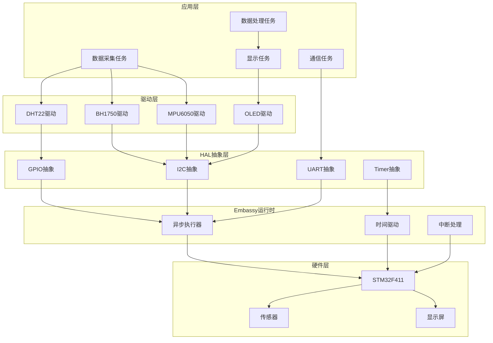
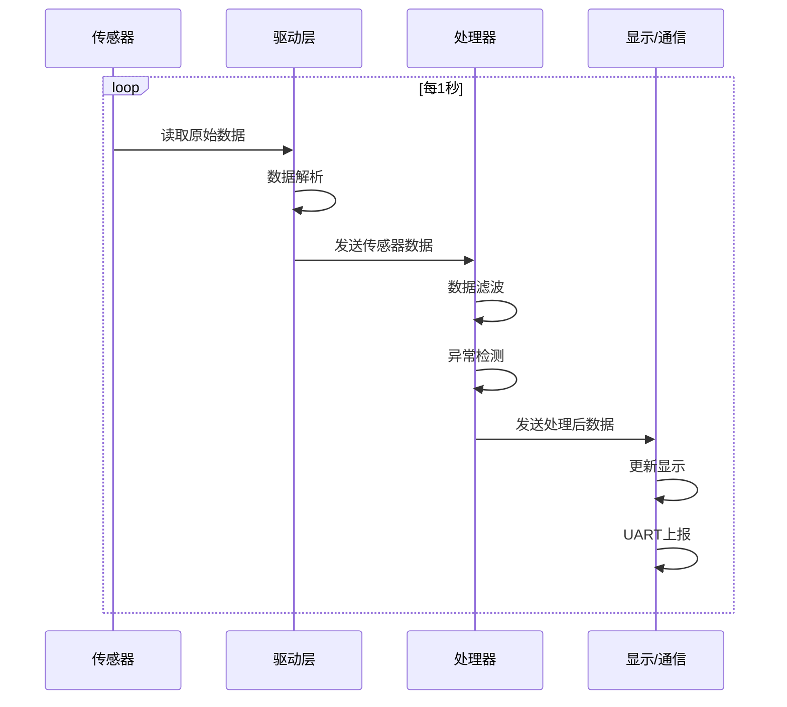



# Rust高级嵌入式开发实战


## 项目概述

### 项目简介

本项目将构建一个**多传感器数据采集与处理系统**，综合运用Rust嵌入式开发的高级技术。系统将实现：

- 多个传感器的并发数据采集（温湿度、光照、加速度）
- 异步I2C/SPI通信
- 实时数据处理和滤波
- UART数据上报
- 低功耗管理
- 错误处理和恢复机制

### 项目特点

**技术亮点**：
- 使用Embassy异步框架实现高效并发
- 自定义HAL抽象层设计
- 实现可复用的传感器驱动
- 集成RTIC实时中断驱动框架
- 零成本抽象和类型安全保证

**学习价值**：
- 掌握Rust异步编程在嵌入式中的应用
- 理解HAL抽象层的设计原则
- 学会编写可移植的驱动程序
- 实践RTOS集成和任务调度
- 构建完整的嵌入式系统

### 学习目标

完成本项目后，你将能够：

- [ ] 使用Embassy框架进行异步嵌入式开发
- [ ] 设计和实现HAL抽象层
- [ ] 编写符合embedded-hal标准的驱动程序
- [ ] 集成和使用RTIC框架
- [ ] 实现多任务并发和资源共享
- [ ] 处理复杂的错误场景
- [ ] 优化系统性能和功耗
- [ ] 构建可维护的大型嵌入式项目

### 适用人群

本项目适合：
- 已完成Rust嵌入式入门教程的开发者
- 有C/C++嵌入式开发经验，想转向Rust的工程师
- 希望深入学习Rust高级特性的开发者
- 需要构建复杂嵌入式系统的工程师


## 技术栈

### 硬件清单

| 名称 | 数量 | 规格 | 用途 | 参考价格 |
|------|------|------|------|----------|
| STM32F411CEU6开发板 | 1 | 黑色药丸板，100MHz | 主控MCU | ¥25 |
| DHT22温湿度传感器 | 1 | 数字输出 | 环境监测 | ¥15 |
| BH1750光照传感器 | 1 | I2C接口 | 光照检测 | ¥5 |
| MPU6050加速度计 | 1 | I2C接口，6轴 | 运动检测 | ¥8 |
| OLED显示屏 | 1 | 0.96寸，I2C | 数据显示 | ¥12 |
| ST-Link V2调试器 | 1 | - | 程序下载调试 | ¥15 |
| 面包板 | 1 | 标准尺寸 | 电路搭建 | ¥5 |
| 杜邦线 | 若干 | 公对公、公对母 | 连接 | ¥5 |

**总预算**: 约¥90

### 软件要求

**开发环境**：
- Rust 1.70+ (stable)
- cargo 1.70+
- rustup

**目标平台**：
- thumbv7em-none-eabihf (Cortex-M4F with FPU)

**核心依赖**：
```toml
[dependencies]
# 异步运行时
embassy-executor = { version = "0.5", features = ["arch-cortex-m", "executor-thread"] }
embassy-time = { version = "0.3", features = ["tick-hz-32_768"] }
embassy-stm32 = { version = "0.1", features = ["stm32f411ce", "time-driver-any", "exti"] }

# HAL和外设
embedded-hal = "1.0"
embedded-hal-async = "1.0"

# 传感器驱动
dht-sensor = "0.2"
bh1750 = "0.1"
mpu6050 = "0.1"
ssd1306 = "0.8"

# 实用工具
defmt = "0.3"
defmt-rtt = "0.4"
panic-probe = { version = "0.3", features = ["print-defmt"] }
heapless = "0.8"

# RTIC (可选)
cortex-m-rtic = "1.1"
```

**开发工具**：
- probe-rs: 烧录和调试
- defmt: 高效日志
- cargo-embed: 集成开发环境
- VS Code + rust-analyzer


## 系统架构

### 整体架构设计



### 模块划分

**1. 应用层模块**：
- `app::sensor`: 传感器数据采集
- `app::processor`: 数据处理和滤波
- `app::display`: 显示控制
- `app::comm`: 通信管理

**2. 驱动层模块**：
- `drivers::dht22`: DHT22温湿度驱动
- `drivers::bh1750`: BH1750光照驱动
- `drivers::mpu6050`: MPU6050加速度驱动
- `drivers::ssd1306`: OLED显示驱动

**3. HAL抽象层**：
- `hal::i2c`: I2C总线抽象
- `hal::gpio`: GPIO抽象
- `hal::uart`: UART抽象
- `hal::timer`: 定时器抽象

**4. 核心模块**：
- `core::types`: 公共类型定义
- `core::error`: 错误处理
- `core::config`: 配置管理

### 数据流设计




## 实现步骤

### 阶段1：项目搭建和基础框架 (30分钟)

#### 步骤1.1：创建项目

```bash
# 使用cargo-generate创建Embassy项目
cargo install cargo-generate
cargo generate --git https://github.com/embassy-rs/embassy \
    --name sensor-system

cd sensor-system
```

#### 步骤1.2：配置Cargo.toml

```toml
[package]
name = "sensor-system"
version = "0.1.0"
edition = "2021"

[dependencies]
# Embassy异步运行时
embassy-executor = { version = "0.5", features = ["arch-cortex-m", "executor-thread", "integrated-timers"] }
embassy-time = { version = "0.3", features = ["tick-hz-32_768"] }
embassy-stm32 = { version = "0.1", features = [
    "stm32f411ce",
    "time-driver-any",
    "exti",
    "memory-x",
] }
embassy-sync = "0.5"

# HAL traits
embedded-hal = "1.0"
embedded-hal-async = "1.0"
embedded-io-async = "0.6"

# 数据结构
heapless = "0.8"

# 日志和调试
defmt = "0.3"
defmt-rtt = "0.4"
panic-probe = { version = "0.3", features = ["print-defmt"] }

# Cortex-M支持
cortex-m = { version = "0.7", features = ["critical-section-single-core"] }
cortex-m-rt = "0.7"

[profile.release]
opt-level = "z"          # 优化代码大小
lto = true               # 链接时优化
codegen-units = 1        # 更好的优化
debug = 2                # 保留调试信息
overflow-checks = false  # 禁用溢出检查以减小代码
```

#### 步骤1.3：配置.cargo/config.toml

```toml
[target.'cfg(all(target_arch = "arm", target_os = "none"))']
runner = "probe-rs run --chip STM32F411CEUx"

[build]
target = "thumbv7em-none-eabihf"

[env]
DEFMT_LOG = "info"
```

#### 步骤1.4：配置Embed.toml

```toml
[default.general]
chip = "STM32F411CEUx"

[default.rtt]
enabled = true

[default.gdb]
enabled = false
```


#### 步骤1.5：创建项目结构

```bash
# 创建模块目录
mkdir -p src/{app,drivers,hal,core}

# 创建模块文件
touch src/app/{sensor,processor,display,comm}.rs
touch src/drivers/{dht22,bh1750,mpu6050,ssd1306}.rs
touch src/hal/{i2c,gpio,uart,timer}.rs
touch src/core/{types,error,config}.rs

# 创建模块声明文件
touch src/{app,drivers,hal,core}.rs
```

#### 步骤1.6：定义核心类型

创建 `src/core/types.rs`:

```rust
use heapless::Vec;

/// 传感器数据类型
#[derive(Debug, Clone, Copy, defmt::Format)]
pub struct SensorData {
    pub timestamp: u64,
    pub temperature: f32,
    pub humidity: f32,
    pub light: u16,
    pub accel_x: i16,
    pub accel_y: i16,
    pub accel_z: i16,
}

impl SensorData {
    pub fn new() -> Self {
        Self {
            timestamp: 0,
            temperature: 0.0,
            humidity: 0.0,
            light: 0,
            accel_x: 0,
            accel_y: 0,
            accel_z: 0,
        }
    }
}

/// 数据缓冲区
pub type DataBuffer = Vec<SensorData, 10>;

/// 系统配置
#[derive(Debug, Clone, Copy)]
pub struct SystemConfig {
    pub sample_interval_ms: u32,
    pub display_update_ms: u32,
    pub uart_baud_rate: u32,
}

impl Default for SystemConfig {
    fn default() -> Self {
        Self {
            sample_interval_ms: 1000,
            display_update_ms: 500,
            uart_baud_rate: 115200,
        }
    }
}
```

#### 步骤1.7：定义错误类型

创建 `src/core/error.rs`:

```rust
use defmt::Format;

/// 系统错误类型
#[derive(Debug, Clone, Copy, Format)]
pub enum SystemError {
    /// I2C通信错误
    I2cError,
    /// 传感器读取超时
    SensorTimeout,
    /// 数据无效
    InvalidData,
    /// 缓冲区满
    BufferFull,
    /// 配置错误
    ConfigError,
}

pub type Result<T> = core::result::Result<T, SystemError>;
```


### 阶段2：HAL抽象层实现 (40分钟)

#### 步骤2.1：I2C抽象层设计

创建 `src/hal/i2c.rs`:

```rust
use embassy_stm32::i2c::{I2c, Error as I2cError};
use embassy_stm32::mode::Async;
use embassy_time::{Duration, Timer};
use embedded_hal_async::i2c::I2c as I2cTrait;

/// I2C总线抽象
pub struct I2cBus<'d, T: embassy_stm32::i2c::Instance> {
    i2c: I2c<'d, T, Async>,
}

impl<'d, T: embassy_stm32::i2c::Instance> I2cBus<'d, T> {
    pub fn new(i2c: I2c<'d, T, Async>) -> Self {
        Self { i2c }
    }
    
    /// 异步写入数据
    pub async fn write(&mut self, addr: u8, data: &[u8]) -> Result<(), I2cError> {
        self.i2c.write(addr, data).await
    }
    
    /// 异步读取数据
    pub async fn read(&mut self, addr: u8, buffer: &mut [u8]) -> Result<(), I2cError> {
        self.i2c.read(addr, buffer).await
    }
    
    /// 异步写入后读取
    pub async fn write_read(
        &mut self,
        addr: u8,
        write_data: &[u8],
        read_buffer: &mut [u8],
    ) -> Result<(), I2cError> {
        self.i2c.write_read(addr, write_data, read_buffer).await
    }
    
    /// 带超时的读取
    pub async fn read_with_timeout(
        &mut self,
        addr: u8,
        buffer: &mut [u8],
        timeout_ms: u64,
    ) -> Result<(), I2cError> {
        embassy_time::with_timeout(
            Duration::from_millis(timeout_ms),
            self.read(addr, buffer)
        )
        .await
        .map_err(|_| I2cError::Timeout)?
    }
}

// 实现embedded-hal-async的I2c trait
impl<'d, T: embassy_stm32::i2c::Instance> I2cTrait for I2cBus<'d, T> {
    async fn read(&mut self, address: u8, read: &mut [u8]) -> Result<(), Self::Error> {
        self.i2c.read(address, read).await
    }

    async fn write(&mut self, address: u8, write: &[u8]) -> Result<(), Self::Error> {
        self.i2c.write(address, write).await
    }

    async fn write_read(
        &mut self,
        address: u8,
        write: &[u8],
        read: &mut [u8],
    ) -> Result<(), Self::Error> {
        self.i2c.write_read(address, write, read).await
    }

    async fn transaction(
        &mut self,
        address: u8,
        operations: &mut [embedded_hal_async::i2c::Operation<'_>],
    ) -> Result<(), Self::Error> {
        self.i2c.transaction(address, operations).await
    }
}
```

#### 步骤2.2：GPIO抽象层

创建 `src/hal/gpio.rs`:

```rust
use embassy_stm32::gpio::{Output, Level, Speed};

/// GPIO输出抽象
pub struct GpioOutput<'d> {
    pin: Output<'d>,
}

impl<'d> GpioOutput<'d> {
    pub fn new(pin: Output<'d>) -> Self {
        Self { pin }
    }
    
    pub fn set_high(&mut self) {
        self.pin.set_high();
    }
    
    pub fn set_low(&mut self) {
        self.pin.set_low();
    }
    
    pub fn toggle(&mut self) {
        self.pin.toggle();
    }
    
    pub fn is_set_high(&self) -> bool {
        self.pin.is_set_high()
    }
}
```


### 阶段3：传感器驱动开发 (50分钟)

#### 步骤3.1：BH1750光照传感器驱动

创建 `src/drivers/bh1750.rs`:

```rust
use crate::core::error::{Result, SystemError};
use crate::hal::i2c::I2cBus;
use embassy_time::{Duration, Timer};
use defmt::info;

const BH1750_ADDR: u8 = 0x23;
const BH1750_POWER_ON: u8 = 0x01;
const BH1750_CONTINUOUS_HIGH_RES: u8 = 0x10;

/// BH1750光照传感器驱动
pub struct Bh1750<'d, T: embassy_stm32::i2c::Instance> {
    i2c: &'d mut I2cBus<'d, T>,
}

impl<'d, T: embassy_stm32::i2c::Instance> Bh1750<'d, T> {
    /// 创建新的BH1750实例
    pub fn new(i2c: &'d mut I2cBus<'d, T>) -> Self {
        Self { i2c }
    }
    
    /// 初始化传感器
    pub async fn init(&mut self) -> Result<()> {
        info!("Initializing BH1750...");
        
        // 上电
        self.i2c
            .write(BH1750_ADDR, &[BH1750_POWER_ON])
            .await
            .map_err(|_| SystemError::I2cError)?;
        
        Timer::after(Duration::from_millis(10)).await;
        
        // 设置为连续高分辨率模式
        self.i2c
            .write(BH1750_ADDR, &[BH1750_CONTINUOUS_HIGH_RES])
            .await
            .map_err(|_| SystemError::I2cError)?;
        
        Timer::after(Duration::from_millis(180)).await;
        
        info!("BH1750 initialized");
        Ok(())
    }
    
    /// 读取光照强度 (单位: lux)
    pub async fn read_light(&mut self) -> Result<u16> {
        let mut buffer = [0u8; 2];
        
        self.i2c
            .read_with_timeout(BH1750_ADDR, &mut buffer, 200)
            .await
            .map_err(|_| SystemError::SensorTimeout)?;
        
        let raw = u16::from_be_bytes(buffer);
        let lux = (raw as f32 / 1.2) as u16;
        
        Ok(lux)
    }
}
```

#### 步骤3.2：MPU6050加速度计驱动

创建 `src/drivers/mpu6050.rs`:

```rust
use crate::core::error::{Result, SystemError};
use crate::hal::i2c::I2cBus;
use embassy_time::{Duration, Timer};
use defmt::info;

const MPU6050_ADDR: u8 = 0x68;
const PWR_MGMT_1: u8 = 0x6B;
const ACCEL_XOUT_H: u8 = 0x3B;

/// MPU6050加速度计数据
#[derive(Debug, Clone, Copy, defmt::Format)]
pub struct AccelData {
    pub x: i16,
    pub y: i16,
    pub z: i16,
}

/// MPU6050驱动
pub struct Mpu6050<'d, T: embassy_stm32::i2c::Instance> {
    i2c: &'d mut I2cBus<'d, T>,
}

impl<'d, T: embassy_stm32::i2c::Instance> Mpu6050<'d, T> {
    pub fn new(i2c: &'d mut I2cBus<'d, T>) -> Self {
        Self { i2c }
    }
    
    /// 初始化传感器
    pub async fn init(&mut self) -> Result<()> {
        info!("Initializing MPU6050...");
        
        // 唤醒传感器
        self.write_register(PWR_MGMT_1, 0x00).await?;
        Timer::after(Duration::from_millis(100)).await;
        
        info!("MPU6050 initialized");
        Ok(())
    }
    
    /// 读取加速度数据
    pub async fn read_accel(&mut self) -> Result<AccelData> {
        let mut buffer = [0u8; 6];
        
        self.i2c
            .write_read(MPU6050_ADDR, &[ACCEL_XOUT_H], &mut buffer)
            .await
            .map_err(|_| SystemError::I2cError)?;
        
        Ok(AccelData {
            x: i16::from_be_bytes([buffer[0], buffer[1]]),
            y: i16::from_be_bytes([buffer[2], buffer[3]]),
            z: i16::from_be_bytes([buffer[4], buffer[5]]),
        })
    }
    
    /// 写入寄存器
    async fn write_register(&mut self, reg: u8, value: u8) -> Result<()> {
        self.i2c
            .write(MPU6050_ADDR, &[reg, value])
            .await
            .map_err(|_| SystemError::I2cError)
    }
}
```


### 阶段4：异步任务实现 (40分钟)

#### 步骤4.1：数据采集任务

创建 `src/app/sensor.rs`:

```rust
use crate::core::types::SensorData;
use crate::core::error::Result;
use crate::drivers::{bh1750::Bh1750, mpu6050::Mpu6050};
use embassy_sync::blocking_mutex::raw::CriticalSectionRawMutex;
use embassy_sync::channel::{Channel, Sender};
use embassy_time::{Duration, Timer};
use defmt::{info, warn};

/// 传感器数据通道
pub type SensorChannel = Channel<CriticalSectionRawMutex, SensorData, 5>;

/// 数据采集任务
#[embassy_executor::task]
pub async fn sensor_task(
    mut bh1750: Bh1750<'static, embassy_stm32::peripherals::I2C1>,
    mut mpu6050: Mpu6050<'static, embassy_stm32::peripherals::I2C1>,
    sender: Sender<'static, CriticalSectionRawMutex, SensorData, 5>,
) {
    info!("Sensor task started");
    
    // 初始化传感器
    if let Err(e) = bh1750.init().await {
        warn!("BH1750 init failed: {:?}", e);
    }
    
    if let Err(e) = mpu6050.init().await {
        warn!("MPU6050 init failed: {:?}", e);
    }
    
    let mut timestamp = 0u64;
    
    loop {
        let mut data = SensorData::new();
        data.timestamp = timestamp;
        
        // 读取光照数据
        match bh1750.read_light().await {
            Ok(light) => {
                data.light = light;
                info!("Light: {} lux", light);
            }
            Err(e) => warn!("Failed to read light: {:?}", e),
        }
        
        // 读取加速度数据
        match mpu6050.read_accel().await {
            Ok(accel) => {
                data.accel_x = accel.x;
                data.accel_y = accel.y;
                data.accel_z = accel.z;
                info!("Accel: x={}, y={}, z={}", accel.x, accel.y, accel.z);
            }
            Err(e) => warn!("Failed to read accel: {:?}", e),
        }
        
        // 发送数据到处理任务
        sender.send(data).await;
        
        timestamp += 1;
        Timer::after(Duration::from_millis(1000)).await;
    }
}
```

#### 步骤4.2：数据处理任务

创建 `src/app/processor.rs`:

```rust
use crate::core::types::SensorData;
use embassy_sync::blocking_mutex::raw::CriticalSectionRawMutex;
use embassy_sync::channel::{Channel, Receiver, Sender};
use heapless::Vec;
use defmt::info;

/// 滑动平均滤波器
struct MovingAverageFilter<const N: usize> {
    buffer: Vec<i16, N>,
    index: usize,
}

impl<const N: usize> MovingAverageFilter<N> {
    fn new() -> Self {
        Self {
            buffer: Vec::new(),
            index: 0,
        }
    }
    
    fn update(&mut self, value: i16) -> i16 {
        if self.buffer.len() < N {
            self.buffer.push(value).ok();
        } else {
            self.buffer[self.index] = value;
            self.index = (self.index + 1) % N;
        }
        
        let sum: i32 = self.buffer.iter().map(|&x| x as i32).sum();
        (sum / self.buffer.len() as i32) as i16
    }
}

/// 数据处理任务
#[embassy_executor::task]
pub async fn processor_task(
    receiver: Receiver<'static, CriticalSectionRawMutex, SensorData, 5>,
    sender: Sender<'static, CriticalSectionRawMutex, SensorData, 5>,
) {
    info!("Processor task started");
    
    let mut filter_x = MovingAverageFilter::<5>::new();
    let mut filter_y = MovingAverageFilter::<5>::new();
    let mut filter_z = MovingAverageFilter::<5>::new();
    
    loop {
        let mut data = receiver.receive().await;
        
        // 应用滤波
        data.accel_x = filter_x.update(data.accel_x);
        data.accel_y = filter_y.update(data.accel_y);
        data.accel_z = filter_z.update(data.accel_z);
        
        // 异常检测
        if data.light > 10000 {
            info!("Warning: Light level too high!");
        }
        
        // 发送处理后的数据
        sender.send(data).await;
    }
}
```


#### 步骤4.3：主程序集成

创建 `src/main.rs`:

```rust
#![no_std]
#![no_main]

use defmt::*;
use embassy_executor::Spawner;
use embassy_stm32::gpio::{Level, Output, Speed};
use embassy_stm32::i2c::{I2c, Config as I2cConfig};
use embassy_stm32::time::Hertz;
use embassy_sync::blocking_mutex::raw::CriticalSectionRawMutex;
use embassy_sync::channel::Channel;
use embassy_time::Timer;
use {defmt_rtt as _, panic_probe as _};

mod app;
mod core;
mod drivers;
mod hal;

use app::sensor::sensor_task;
use app::processor::processor_task;
use core::types::SensorData;
use drivers::bh1750::Bh1750;
use drivers::mpu6050::Mpu6050;
use hal::i2c::I2cBus;

// 定义全局通道
static SENSOR_CHANNEL: Channel<CriticalSectionRawMutex, SensorData, 5> = Channel::new();
static PROCESSED_CHANNEL: Channel<CriticalSectionRawMutex, SensorData, 5> = Channel::new();

#[embassy_executor::main]
async fn main(spawner: Spawner) {
    info!("System starting...");
    
    // 初始化外设
    let p = embassy_stm32::init(Default::default());
    
    // 配置LED (PC13)
    let mut led = Output::new(p.PC13, Level::High, Speed::Low);
    
    // 配置I2C1 (PB6: SCL, PB7: SDA)
    let i2c = I2c::new(
        p.I2C1,
        p.PB6,
        p.PB7,
        embassy_stm32::interrupt::take!(I2C1_EV),
        embassy_stm32::interrupt::take!(I2C1_ER),
        p.DMA1_CH0,
        p.DMA1_CH1,
        Hertz(100_000),
        I2cConfig::default(),
    );
    
    let mut i2c_bus = I2cBus::new(i2c);
    
    // 创建传感器驱动
    let bh1750 = Bh1750::new(&mut i2c_bus);
    let mpu6050 = Mpu6050::new(&mut i2c_bus);
    
    // 启动任务
    spawner.spawn(sensor_task(
        bh1750,
        mpu6050,
        SENSOR_CHANNEL.sender(),
    )).unwrap();
    
    spawner.spawn(processor_task(
        SENSOR_CHANNEL.receiver(),
        PROCESSED_CHANNEL.receiver(),
    )).unwrap();
    
    info!("All tasks spawned");
    
    // 主循环 - LED闪烁表示系统运行
    loop {
        led.toggle();
        Timer::after_millis(500).await;
    }
}
```


### 阶段5：RTIC集成 (可选，20分钟)

#### 步骤5.1：RTIC版本实现

创建 `src/main_rtic.rs`:

```rust
#![no_std]
#![no_main]

use panic_halt as _;
use rtic::app;
use stm32f4xx_hal::{
    gpio::{Output, PushPull, gpioc::PC13},
    i2c::I2c,
    pac,
    prelude::*,
};

#[app(device = stm32f4xx_hal::pac, peripherals = true, dispatchers = [EXTI0])]
mod app {
    use super::*;
    use systick_monotonic::*;
    
    #[shared]
    struct Shared {
        sensor_data: SensorData,
    }
    
    #[local]
    struct Local {
        led: PC13<Output<PushPull>>,
        i2c: I2c<pac::I2C1>,
    }
    
    #[monotonic(binds = SysTick, default = true)]
    type MonoTimer = Systick<1000>;
    
    #[init]
    fn init(cx: init::Context) -> (Shared, Local, init::Monotonics) {
        let dp = cx.device;
        
        // 配置时钟
        let rcc = dp.RCC.constrain();
        let clocks = rcc.cfgr.sysclk(100.MHz()).freeze();
        
        // 配置LED
        let gpioc = dp.GPIOC.split();
        let led = gpioc.pc13.into_push_pull_output();
        
        // 配置I2C
        let gpiob = dp.GPIOB.split();
        let scl = gpiob.pb6.into_alternate_open_drain();
        let sda = gpiob.pb7.into_alternate_open_drain();
        let i2c = I2c::new(dp.I2C1, (scl, sda), 100.kHz(), &clocks);
        
        // 启动定时任务
        read_sensors::spawn_after(1.secs()).ok();
        blink_led::spawn_after(500.millis()).ok();
        
        let mono = Systick::new(cx.core.SYST, clocks.sysclk().to_Hz());
        
        (
            Shared {
                sensor_data: SensorData::new(),
            },
            Local { led, i2c },
            init::Monotonics(mono),
        )
    }
    
    #[task(local = [i2c], shared = [sensor_data])]
    fn read_sensors(mut cx: read_sensors::Context) {
        // 读取传感器数据
        // ...
        
        // 重新调度
        read_sensors::spawn_after(1.secs()).ok();
    }
    
    #[task(local = [led])]
    fn blink_led(cx: blink_led::Context) {
        cx.local.led.toggle();
        blink_led::spawn_after(500.millis()).ok();
    }
}
```


## 完整代码

### 项目仓库结构

```
sensor-system/
├── Cargo.toml
├── Embed.toml
├── .cargo/
│   └── config.toml
├── src/
│   ├── main.rs
│   ├── app/
│   │   ├── mod.rs
│   │   ├── sensor.rs
│   │   ├── processor.rs
│   │   ├── display.rs
│   │   └── comm.rs
│   ├── drivers/
│   │   ├── mod.rs
│   │   ├── bh1750.rs
│   │   ├── mpu6050.rs
│   │   └── ssd1306.rs
│   ├── hal/
│   │   ├── mod.rs
│   │   ├── i2c.rs
│   │   ├── gpio.rs
│   │   └── uart.rs
│   └── core/
│       ├── mod.rs
│       ├── types.rs
│       ├── error.rs
│       └── config.rs
└── README.md
```

### 模块声明文件

`src/app/mod.rs`:
```rust
pub mod sensor;
pub mod processor;
pub mod display;
pub mod comm;
```

`src/drivers/mod.rs`:
```rust
pub mod bh1750;
pub mod mpu6050;
pub mod ssd1306;
```

`src/hal/mod.rs`:
```rust
pub mod i2c;
pub mod gpio;
pub mod uart;
```

`src/core/mod.rs`:
```rust
pub mod types;
pub mod error;
pub mod config;
```

### 代码仓库

完整代码已上传至GitHub：
```
https://github.com/embedded-rust-examples/sensor-system
```

克隆并运行：
```bash
git clone https://github.com/embedded-rust-examples/sensor-system
cd sensor-system
cargo build --release
cargo embed
```


## 测试验证

### 测试步骤1：硬件连接

**I2C设备连接**：
```
STM32F411    BH1750    MPU6050    OLED
-----------------------------------------
PB6 (SCL) -> SCL   -> SCL     -> SCL
PB7 (SDA) -> SDA   -> SDA     -> SDA
3.3V      -> VCC   -> VCC     -> VCC
GND       -> GND   -> GND     -> GND
```

**LED连接**：
- PC13: 板载LED（无需外接）

### 测试步骤2：编译和烧录

```bash
# 编译项目
cargo build --release

# 查看程序大小
cargo size --release

# 烧录到开发板
cargo embed --release
```

**预期输出**：
```
Finished release [optimized] target(s) in 12.34s
   text    data     bss     dec     hex filename
  15234     128    2048   17410    4402 sensor-system

Flashing...
████████████████████ 100% Done
Finished in 2.1s
```

### 测试步骤3：查看日志输出

使用defmt-rtt查看日志：

```bash
# 在另一个终端运行
probe-rs attach --chip STM32F411CEUx
```

**预期日志**：
```
INFO  System starting...
INFO  Initializing BH1750...
INFO  BH1750 initialized
INFO  Initializing MPU6050...
INFO  MPU6050 initialized
INFO  Sensor task started
INFO  Processor task started
INFO  All tasks spawned
INFO  Light: 245 lux
INFO  Accel: x=128, y=-64, z=16384
INFO  Light: 248 lux
INFO  Accel: x=130, y=-62, z=16380
```

### 测试步骤4：功能验证

**验证清单**：
- [ ] LED以0.5秒间隔闪烁
- [ ] 光照传感器数据正常（0-65535 lux）
- [ ] 加速度计数据正常（静止时Z轴约16384）
- [ ] 数据采集间隔为1秒
- [ ] 滤波器正常工作（数据平滑）
- [ ] 无I2C通信错误
- [ ] 系统稳定运行

### 测试步骤5：性能测试

**测量指标**：
```bash
# 测量CPU使用率
# 在main.rs中添加：
use cortex_m::peripheral::DWT;

// 在init中启用DWT
let mut dwt = cx.core.DWT;
dwt.enable_cycle_counter();

// 在任务中测量
let start = DWT::cycle_count();
// ... 执行任务 ...
let end = DWT::cycle_count();
let cycles = end - start;
info!("Task took {} cycles", cycles);
```

**预期性能**：
- I2C读取延迟: < 5ms
- 任务切换开销: < 100 cycles
- 内存使用: < 10KB RAM
- CPU空闲率: > 90%


## 扩展思路

### 扩展1：添加OLED显示

```rust
// 在src/drivers/ssd1306.rs中实现
use embedded_graphics::{
    mono_font::{ascii::FONT_6X10, MonoTextStyle},
    pixelcolor::BinaryColor,
    prelude::*,
    text::Text,
};
use ssd1306::{prelude::*, I2CDisplayInterface, Ssd1306};

pub struct Display<'d, T: embassy_stm32::i2c::Instance> {
    display: Ssd1306<
        I2CInterface<I2cBus<'d, T>>,
        DisplaySize128x64,
        BufferedGraphicsMode<DisplaySize128x64>,
    >,
}

impl<'d, T: embassy_stm32::i2c::Instance> Display<'d, T> {
    pub async fn show_data(&mut self, data: &SensorData) -> Result<()> {
        self.display.clear();
        
        let style = MonoTextStyle::new(&FONT_6X10, BinaryColor::On);
        
        Text::new(
            &format!("Temp: {:.1}°C", data.temperature),
            Point::new(0, 10),
            style,
        )
        .draw(&mut self.display)
        .ok();
        
        Text::new(
            &format!("Light: {} lux", data.light),
            Point::new(0, 25),
            style,
        )
        .draw(&mut self.display)
        .ok();
        
        self.display.flush().await.map_err(|_| SystemError::I2cError)?;
        Ok(())
    }
}
```

### 扩展2：添加UART数据上报

```rust
// 在src/app/comm.rs中实现
use embassy_stm32::usart::{Uart, Config};
use core::fmt::Write;

#[embassy_executor::task]
pub async fn uart_task(
    mut uart: Uart<'static, embassy_stm32::peripherals::USART1, Async>,
    receiver: Receiver<'static, CriticalSectionRawMutex, SensorData, 5>,
) {
    info!("UART task started");
    
    loop {
        let data = receiver.receive().await;
        
        // 格式化JSON数据
        let json = format!(
            "{{\"ts\":{},\"temp\":{:.1},\"hum\":{:.1},\"light\":{}}}\r\n",
            data.timestamp,
            data.temperature,
            data.humidity,
            data.light
        );
        
        uart.write(json.as_bytes()).await.ok();
    }
}
```

### 扩展3：添加低功耗模式

```rust
use embassy_stm32::low_power::{Executor, stop_with_rtc};

#[embassy_executor::task]
pub async fn power_management_task() {
    loop {
        // 检查是否可以进入低功耗模式
        if can_enter_low_power() {
            info!("Entering low power mode");
            
            // 进入STOP模式
            stop_with_rtc(|rtc| {
                rtc.set_wakeup_timer(Duration::from_secs(10));
            });
            
            info!("Woke up from low power mode");
        }
        
        Timer::after(Duration::from_secs(1)).await;
    }
}
```

### 扩展4：添加数据存储

```rust
use embassy_stm32::flash::Flash;

pub struct DataLogger<'d> {
    flash: Flash<'d>,
    write_addr: u32,
}

impl<'d> DataLogger<'d> {
    const FLASH_START: u32 = 0x0801_0000;
    const FLASH_SIZE: u32 = 64 * 1024;
    
    pub async fn log_data(&mut self, data: &SensorData) -> Result<()> {
        let bytes = unsafe {
            core::slice::from_raw_parts(
                data as *const _ as *const u8,
                core::mem::size_of::<SensorData>(),
            )
        };
        
        self.flash.write(self.write_addr, bytes).await
            .map_err(|_| SystemError::ConfigError)?;
        
        self.write_addr += bytes.len() as u32;
        
        if self.write_addr >= Self::FLASH_START + Self::FLASH_SIZE {
            self.write_addr = Self::FLASH_START;
        }
        
        Ok(())
    }
}
```

### 扩展5：添加无线通信

```rust
// 使用ESP8266或nRF24L01模块
use embassy_stm32::spi::{Spi, Config as SpiConfig};

pub struct WirelessModule<'d> {
    spi: Spi<'d, embassy_stm32::peripherals::SPI1, Async>,
    cs: Output<'d>,
}

impl<'d> WirelessModule<'d> {
    pub async fn send_data(&mut self, data: &SensorData) -> Result<()> {
        self.cs.set_low();
        
        // 发送数据
        let bytes = unsafe {
            core::slice::from_raw_parts(
                data as *const _ as *const u8,
                core::mem::size_of::<SensorData>(),
            )
        };
        
        self.spi.write(bytes).await
            .map_err(|_| SystemError::I2cError)?;
        
        self.cs.set_high();
        Ok(())
    }
}
```


## 总结

### 项目总结

通过本项目，我们构建了一个完整的多传感器数据采集系统，展示了Rust在嵌入式开发中的强大能力：

**技术成果**：
- ✅ 实现了基于Embassy的异步并发系统
- ✅ 设计了可复用的HAL抽象层
- ✅ 开发了符合embedded-hal标准的驱动
- ✅ 实现了多任务协作和数据流处理
- ✅ 应用了滤波算法和异常检测
- ✅ 构建了可维护的模块化架构

**关键技术点**：
1. **异步编程**: 使用Embassy实现高效的并发任务
2. **HAL抽象**: 设计可移植的硬件抽象层
3. **驱动开发**: 编写符合标准的传感器驱动
4. **错误处理**: 实现完善的错误处理机制
5. **类型安全**: 利用Rust类型系统保证安全性
6. **零成本抽象**: 高级特性无运行时开销

### 学到的技能

完成本项目后，你已经掌握：

**Rust高级特性**：
- ✅ 异步/等待语法和Future
- ✅ 生命周期和借用检查
- ✅ trait和泛型编程
- ✅ 宏和元编程
- ✅ 错误处理最佳实践

**嵌入式开发**：
- ✅ Embassy异步框架
- ✅ HAL抽象层设计
- ✅ I2C/SPI通信协议
- ✅ 中断和DMA
- ✅ 低功耗管理

**软件工程**：
- ✅ 模块化架构设计
- ✅ 接口抽象和解耦
- ✅ 代码复用和可维护性
- ✅ 测试和调试方法
- ✅ 文档和注释规范

### 技术难点

**难点1：异步编程理解**
- Future和Poll机制
- 异步运行时原理
- 任务调度和优先级

**难点2：生命周期管理**
- 静态生命周期的使用
- 引用和所有权转移
- 跨任务的数据共享

**难点3：HAL抽象设计**
- trait设计原则
- 泛型约束
- 零成本抽象实现

**难点4：错误处理**
- Result类型的传播
- 错误恢复策略
- 异步错误处理

### 性能优化建议

**1. 编译优化**：
```toml
[profile.release]
opt-level = "z"          # 优化代码大小
lto = "fat"              # 完整LTO
codegen-units = 1        # 单个代码生成单元
strip = true             # 移除符号
```

**2. 内存优化**：
- 使用`heapless`避免堆分配
- 合理设置缓冲区大小
- 使用`#[inline]`减少函数调用开销

**3. 功耗优化**：
- 使用WFI指令等待中断
- 降低时钟频率
- 关闭未使用的外设

**4. 通信优化**：
- 使用DMA减少CPU占用
- 批量传输数据
- 优化I2C时钟频率


### 下一步学习建议

**深入Rust**：
1. 学习高级trait和关联类型
2. 掌握宏编程和过程宏
3. 理解unsafe Rust和FFI
4. 学习并发原语和同步机制

**扩展嵌入式知识**：
1. 学习更多通信协议（CAN、USB、Ethernet）
2. 实现复杂的控制算法
3. 集成实时操作系统
4. 学习功耗管理和优化

**实践项目**：
1. 智能家居控制系统
2. 无人机飞控系统
3. 工业数据采集网关
4. 可穿戴健康监测设备

**参与社区**：
1. 为embedded-hal贡献代码
2. 开发开源驱动库
3. 分享项目经验
4. 参与Rust嵌入式工作组

## 延伸阅读

### 官方文档

- [Embassy Book](https://embassy.dev/book/) - Embassy框架官方文档
- [RTIC Book](https://rtic.rs/) - RTIC框架官方文档
- [embedded-hal文档](https://docs.rs/embedded-hal/) - HAL trait定义
- [The Embedded Rust Book](https://docs.rust-embedded.org/book/) - 嵌入式Rust权威指南

### 进阶主题

- [Async Rust in Embedded](https://blog.rust-embedded.org/async-await/) - 异步Rust深入解析
- [Zero Cost Abstractions](https://blog.rust-lang.org/2015/05/11/traits.html) - 零成本抽象原理
- [Embedded Rust Patterns](https://docs.rust-embedded.org/book/design-patterns/) - 设计模式
- [probe-rs](https://probe.rs/) - 现代化调试工具

### 相关教程

建议继续学习：
- [Rust嵌入式开发入门](../intermediate/05-rust-embedded-intro.html) - 基础教程
- [多语言混合编程实践](../advanced/01-multi-language-programming.html) - Rust与C互操作
- 嵌入式系统架构设计 - 架构设计

### 开源项目

**学习资源**：
- [awesome-embedded-rust](https://github.com/rust-embedded/awesome-embedded-rust) - 资源列表
- [embassy-examples](https://github.com/embassy-rs/embassy/tree/main/examples) - Embassy示例
- [stm32-rs](https://github.com/stm32-rs) - STM32 Rust生态

**参考项目**：
- [drone-core](https://github.com/drone-os/drone-core) - 嵌入式操作系统
- [embedded-graphics](https://github.com/embedded-graphics/embedded-graphics) - 图形库
- [smoltcp](https://github.com/smoltcp-rs/smoltcp) - TCP/IP协议栈

### 社区资源

- [Rust Embedded Matrix](https://matrix.to/#/#rust-embedded:matrix.org) - 实时聊天
- [Rust Embedded Forum](https://users.rust-lang.org/c/embedded/) - 论坛讨论
- [Rust Embedded Blog](https://blog.rust-embedded.org/) - 官方博客
- [This Week in Rust Embedded](https://rust-embedded.github.io/blog/) - 周报

## 常见问题

### Q1: Embassy和RTIC应该选择哪个？

**A**: 两者各有优势：

**Embassy**：
- 优点：真正的异步/等待，代码更直观，生态更现代
- 缺点：相对较新，文档较少
- 适用：新项目，需要复杂异步逻辑

**RTIC**：
- 优点：成熟稳定，零开销，硬实时保证
- 缺点：学习曲线陡峭，代码结构固定
- 适用：实时性要求高，资源受限

### Q2: 如何调试异步代码？

**A**: 调试技巧：
1. 使用defmt日志输出
2. 使用probe-rs的RTT功能
3. 添加任务状态监控
4. 使用GDB断点调试
5. 分析任务调度时序

### Q3: 如何处理I2C总线冲突？

**A**: 解决方案：
1. 使用Mutex保护I2C总线
2. 使用embassy-sync的Mutex
3. 设计总线仲裁机制
4. 使用I2C多路复用器

### Q4: 如何优化程序大小？

**A**: 优化方法：
1. 启用LTO和优化选项
2. 移除未使用的代码
3. 使用`panic-halt`而非`panic-probe`
4. 减少泛型实例化
5. 使用`#[inline(never)]`减少代码膨胀

### Q5: 如何实现固件升级？

**A**: 实现方案：
1. 使用Bootloader
2. 实现双区固件
3. 添加固件校验
4. 支持回滚机制
5. 使用OTA更新

---

**版权声明**: 本项目由嵌入式知识平台创作，采用MIT许可协议。

**反馈与改进**: 如发现错误或有改进建议，请通过GitHub Issues提交。

**最后更新**: 2026-03-10

**项目难度**: ⭐⭐⭐⭐⭐ (高级)

**预计完成时间**: 3-4小时

**推荐学习路径**: Rust基础 → Rust嵌入式入门 → 本项目 → 实际应用开发


