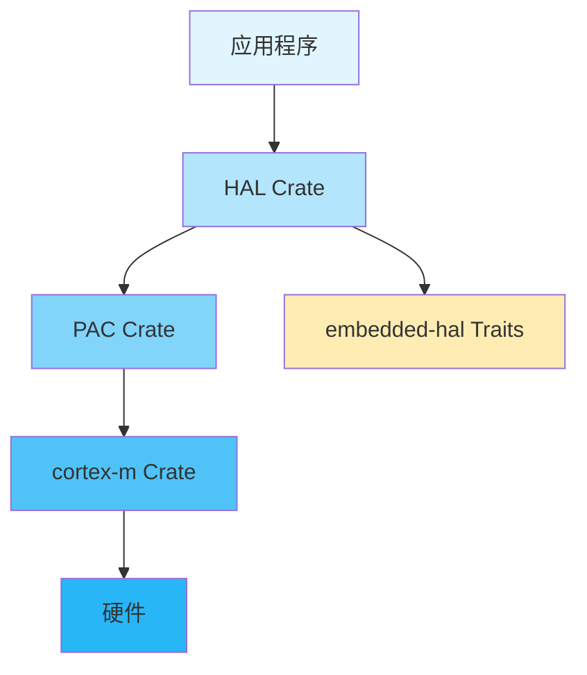

# Rust嵌入式开发入门


## 学习目标

完成本教程后，你将能够：

- [ ] 理解Rust语言的核心特性和优势
- [ ] 掌握Rust的所有权系统和借用检查器
- [ ] 了解嵌入式Rust生态系统和工具链
- [ ] 学会使用no_std进行裸机开发
- [ ] 编写并运行第一个Rust嵌入式项目
- [ ] 理解Rust如何保证内存安全和线程安全

## 前置要求

在开始本教程之前，你需要：

**知识要求**：
- 掌握至少一门编程语言（C/C++优先）
- 了解基本的嵌入式系统概念
- 熟悉GPIO、中断等基本外设概念
- 了解内存管理的基本原理

**技能要求**：
- 能够使用命令行工具
- 会使用Git进行版本控制
- 了解基本的电路连接
- 有C语言嵌入式开发经验（推荐但非必需）

## 准备工作

### 硬件准备

| 名称 | 数量 | 说明 | 参考链接 |
|------|------|------|----------|
| STM32F103C8T6开发板 | 1 | 蓝色药丸板 | [购买链接](https://example.com) |
| ST-Link V2调试器 | 1 | 用于程序下载和调试 | [购买链接](https://example.com) |
| LED灯 | 1 | 任意颜色 | - |
| 电阻 | 1 | 220Ω | - |
| 面包板 | 1 | - | - |
| 杜邦线 | 若干 | 公对公、公对母 | - |

### 软件准备

- **Rust工具链**：rustup、cargo
- **目标平台支持**：thumbv7m-none-eabi
- **调试工具**：OpenOCD、GDB
- **开发工具**：
  - VS Code + rust-analyzer扩展
  - 或 CLion + Rust插件
- **烧录工具**：cargo-flash或st-flash

### 环境配置

#### 1. 安装Rust工具链

```bash
# 安装rustup (Rust版本管理工具)
# Linux/macOS:
curl --proto '=https' --tlsv1.2 -sSf https://sh.rustup.rs | sh

# Windows: 从 https://rustup.rs 下载安装程序

# 验证安装
rustc --version
cargo --version
```


#### 2. 添加嵌入式目标支持

```bash
# 添加ARM Cortex-M3目标支持
rustup target add thumbv7m-none-eabi

# 验证目标已安装
rustup target list | grep thumbv7m
```

#### 3. 安装cargo-binutils

```bash
# 安装二进制工具集
cargo install cargo-binutils
rustup component add llvm-tools-preview

# 这些工具包括：
# - cargo-objdump: 查看二进制文件
# - cargo-size: 查看程序大小
# - cargo-nm: 查看符号表
```

#### 4. 安装OpenOCD和GDB

```bash
# Ubuntu/Debian
sudo apt-get install openocd gdb-multiarch

# macOS
brew install openocd arm-none-eabi-gdb

# Windows: 从官网下载安装包
# OpenOCD: https://openocd.org/
# GDB: https://developer.arm.com/tools-and-software/open-source-software/developer-tools/gnu-toolchain
```

#### 5. 安装cargo-flash (可选)

```bash
# 更方便的烧录工具
cargo install cargo-flash
```

## 步骤1：Rust语言核心概念

### 1.1 所有权系统 (Ownership)

Rust的所有权系统是其最核心的特性，它在编译时保证内存安全，无需垃圾回收器。

**所有权规则**：
1. Rust中的每个值都有一个所有者（owner）
2. 值在任一时刻只能有一个所有者
3. 当所有者离开作用域时，值将被丢弃

```rust
fn ownership_example() {
    // s1拥有字符串的所有权
    let s1 = String::from("hello");
    
    // 所有权转移给s2，s1不再有效
    let s2 = s1;
    
    // 编译错误！s1已经失效
    // println!("{}", s1);
    
    // s2有效
    println!("{}", s2);
    
} // s2离开作用域，内存被自动释放
```

**在嵌入式中的意义**：
- 编译时检查内存错误，避免运行时崩溃
- 无需手动管理内存，减少内存泄漏
- 零成本抽象，无运行时开销

### 1.2 借用和引用 (Borrowing & References)

借用允许你引用某个值而不获取其所有权。

```rust
fn borrowing_example() {
    let s1 = String::from("hello");
    
    // 不可变借用
    let len = calculate_length(&s1);
    
    // s1仍然有效
    println!("The length of '{}' is {}.", s1, len);
}

fn calculate_length(s: &String) -> usize {
    s.len()
} // s离开作用域，但因为它不拥有所有权，所以什么也不会发生
```

**借用规则**：
- 在任意给定时间，要么只能有一个可变引用，要么只能有多个不可变引用
- 引用必须总是有效的

```rust
fn mutable_borrowing() {
    let mut s = String::from("hello");
    
    // 可变借用
    change(&mut s);
    
    println!("{}", s); // 输出: hello, world
}

fn change(s: &mut String) {
    s.push_str(", world");
}
```

**在嵌入式中的应用**：
- 安全地共享外设访问权限
- 避免数据竞争
- 编译时检查并发访问

### 1.3 生命周期 (Lifetimes)

生命周期确保引用在使用期间始终有效。

```rust
// 生命周期注解
fn longest<'a>(x: &'a str, y: &'a str) -> &'a str {
    if x.len() > y.len() {
        x
    } else {
        y
    }
}

fn lifetime_example() {
    let string1 = String::from("long string");
    let string2 = String::from("short");
    
    let result = longest(string1.as_str(), string2.as_str());
    println!("The longest string is {}", result);
}
```

**在嵌入式中的意义**：
- 确保外设引用的有效性
- 防止悬垂指针
- 静态分析资源生命周期


## 步骤2：嵌入式Rust生态系统

### 2.1 核心crate介绍

嵌入式Rust生态系统由多个层次的crate组成：



**核心crate说明**：

1. **cortex-m**: Cortex-M处理器的底层支持
   - 中断处理
   - 异常处理
   - 处理器特定功能

2. **PAC (Peripheral Access Crate)**: 外设访问层
   - 由SVD文件自动生成
   - 提供寄存器级别的访问
   - 类型安全的寄存器操作

3. **HAL (Hardware Abstraction Layer)**: 硬件抽象层
   - 高级API
   - 实现embedded-hal traits
   - 简化外设使用

4. **embedded-hal**: 硬件抽象trait定义
   - 定义通用接口
   - 实现跨平台兼容
   - 驱动程序可移植

### 2.2 常用工具

```bash
# cargo-generate: 从模板创建项目
cargo install cargo-generate

# cargo-embed: 烧录和调试
cargo install cargo-embed

# probe-run: 运行和查看输出
cargo install probe-run

# flip-link: 栈溢出保护
cargo install flip-link
```

### 2.3 项目结构

典型的嵌入式Rust项目结构：

```
my-project/
├── Cargo.toml          # 项目配置
├── .cargo/
│   └── config.toml     # Cargo配置
├── memory.x            # 链接脚本
├── build.rs            # 构建脚本
└── src/
    └── main.rs         # 主程序
```

## 步骤3：创建第一个no_std项目

### 3.1 创建项目

```bash
# 使用cargo-generate从模板创建项目
cargo generate --git https://github.com/rust-embedded/cortex-m-quickstart

# 或手动创建
cargo new --bin blinky
cd blinky
```

### 3.2 配置Cargo.toml

```toml
[package]
name = "blinky"
version = "0.1.0"
edition = "2021"

[dependencies]
# Cortex-M运行时
cortex-m = "0.7"
cortex-m-rt = "0.7"

# STM32F1 HAL
stm32f1xx-hal = { version = "0.10", features = ["stm32f103", "rt"] }

# 恐慌处理
panic-halt = "0.2"

[profile.release]
# 优化代码大小
opt-level = "z"
# 链接时优化
lto = true
# 减少代码大小
codegen-units = 1
```

### 3.3 配置.cargo/config.toml

```toml
[target.thumbv7m-none-eabi]
# 使用自定义链接脚本
rustflags = [
  "-C", "link-arg=-Tmemory.x",
  "-C", "link-arg=-Tlink.x",
]

[build]
# 默认目标平台
target = "thumbv7m-none-eabi"

[target.'cfg(all(target_arch = "arm", target_os = "none"))']
# 使用probe-run作为运行器
runner = "probe-run --chip STM32F103C8"
```

### 3.4 创建memory.x链接脚本

```ld
/* STM32F103C8T6内存布局 */
MEMORY
{
  /* Flash: 64KB */
  FLASH : ORIGIN = 0x08000000, LENGTH = 64K
  
  /* RAM: 20KB */
  RAM : ORIGIN = 0x20000000, LENGTH = 20K
}

/* 栈大小 */
_stack_start = ORIGIN(RAM) + LENGTH(RAM);
```

### 3.5 编写主程序

```rust
#![no_std]  // 不使用标准库
#![no_main] // 不使用标准main函数

use panic_halt as _; // 恐慌时停机

use cortex_m_rt::entry;
use stm32f1xx_hal::{pac, prelude::*};

#[entry]
fn main() -> ! {
    // 获取外设访问权限
    let dp = pac::Peripherals::take().unwrap();
    
    // 获取RCC (复位和时钟控制)
    let mut rcc = dp.RCC.constrain();
    
    // 配置时钟
    let mut flash = dp.FLASH.constrain();
    let clocks = rcc.cfgr.freeze(&mut flash.acr);
    
    // 获取GPIOC
    let mut gpioc = dp.GPIOC.split();
    
    // 配置PC13为推挽输出 (板载LED)
    let mut led = gpioc.pc13.into_push_pull_output(&mut gpioc.crh);
    
    // 主循环
    loop {
        // LED点亮
        led.set_low();
        cortex_m::asm::delay(8_000_000); // 延时约1秒
        
        // LED熄灭
        led.set_high();
        cortex_m::asm::delay(8_000_000); // 延时约1秒
    }
}
```

**代码说明**：

1. `#![no_std]`: 不使用标准库，因为嵌入式环境没有操作系统
2. `#![no_main]`: 不使用标准的main函数入口
3. `#[entry]`: 标记程序入口点
4. `-> !`: 返回Never类型，表示函数永不返回
5. `take()`: 单例模式，确保外设只被初始化一次


## 步骤4：编译和烧录

### 4.1 编译项目

```bash
# 编译debug版本
cargo build

# 编译release版本 (优化代码大小)
cargo build --release

# 查看生成的二进制文件大小
cargo size --release -- -A
```

**输出示例**：
```
section              size        addr
.vector_table         256   0x8000000
.text                2048   0x8000100
.rodata               128   0x8000900
.data                  64   0x20000000
.bss                  256   0x20000040
```

### 4.2 使用cargo-flash烧录

```bash
# 烧录并运行
cargo flash --chip STM32F103C8 --release

# 输出:
# Flashing target/thumbv7m-none-eabi/release/blinky
# Finished in 2.3s
```

### 4.3 使用OpenOCD烧录

**启动OpenOCD**：
```bash
# 在一个终端启动OpenOCD
openocd -f interface/stlink-v2.cfg -f target/stm32f1x.cfg
```

**在另一个终端烧录**：
```bash
# 连接到OpenOCD
arm-none-eabi-gdb target/thumbv7m-none-eabi/release/blinky

# 在GDB中执行
(gdb) target remote :3333
(gdb) load
(gdb) monitor reset halt
(gdb) continue
```

### 4.4 使用probe-run运行

```bash
# 直接运行并查看输出
cargo run --release

# 输出:
# Flashing...
# Finished in 2.1s
# Running...
# (程序输出会显示在这里)
```

## 步骤5：进阶示例 - 串口通信

### 5.1 添加依赖

```toml
[dependencies]
cortex-m = "0.7"
cortex-m-rt = "0.7"
stm32f1xx-hal = { version = "0.10", features = ["stm32f103", "rt"] }
panic-halt = "0.2"

# 添加格式化支持
cortex-m-semihosting = "0.5"
```

### 5.2 实现串口通信

```rust
#![no_std]
#![no_main]

use panic_halt as _;
use cortex_m_rt::entry;
use stm32f1xx_hal::{pac, prelude::*, serial::{Config, Serial}};
use core::fmt::Write; // 用于write!宏

#[entry]
fn main() -> ! {
    // 获取外设
    let dp = pac::Peripherals::take().unwrap();
    
    // 配置时钟
    let mut flash = dp.FLASH.constrain();
    let rcc = dp.RCC.constrain();
    let clocks = rcc.cfgr.freeze(&mut flash.acr);
    
    // 配置GPIO
    let mut afio = dp.AFIO.constrain();
    let mut gpioa = dp.GPIOA.split();
    
    // 配置USART1引脚
    // PA9: TX, PA10: RX
    let tx = gpioa.pa9.into_alternate_push_pull(&mut gpioa.crh);
    let rx = gpioa.pa10;
    
    // 配置串口
    let serial = Serial::new(
        dp.USART1,
        (tx, rx),
        &mut afio.mapr,
        Config::default().baudrate(115200.bps()),
        &clocks,
    );
    
    // 分离发送和接收
    let (mut tx, mut rx) = serial.split();
    
    // 发送欢迎消息
    writeln!(tx, "Hello from Rust!").unwrap();
    
    let mut counter = 0u32;
    
    loop {
        // 发送计数值
        writeln!(tx, "Counter: {}", counter).unwrap();
        counter = counter.wrapping_add(1);
        
        // 延时
        cortex_m::asm::delay(8_000_000);
        
        // 检查是否有接收数据
        if let Ok(byte) = rx.read() {
            // 回显接收到的数据
            writeln!(tx, "Received: {}", byte as char).unwrap();
        }
    }
}
```

**代码说明**：
- 使用`Serial`配置USART1
- 波特率设置为115200
- 使用`write!`宏进行格式化输出
- 实现简单的回显功能

### 5.3 测试串口通信

```bash
# 编译并烧录
cargo flash --chip STM32F103C8 --release

# 使用串口工具连接
# Linux/macOS:
screen /dev/ttyUSB0 115200

# Windows: 使用PuTTY或其他串口工具
# 端口: COM3 (根据实际情况)
# 波特率: 115200
```

**预期输出**：
```
Hello from Rust!
Counter: 0
Counter: 1
Counter: 2
...
```

## 步骤6：中断处理

### 6.1 配置定时器中断

```rust
#![no_std]
#![no_main]

use panic_halt as _;
use cortex_m_rt::entry;
use stm32f1xx_hal::{
    pac::{self, interrupt, Interrupt},
    prelude::*,
    timer::{Event, Timer},
};
use core::cell::RefCell;
use cortex_m::interrupt::Mutex;

// 全局变量，用于在中断中访问
static LED: Mutex<RefCell<Option<stm32f1xx_hal::gpio::gpioc::PC13<stm32f1xx_hal::gpio::Output<stm32f1xx_hal::gpio::PushPull>>>>> = 
    Mutex::new(RefCell::new(None));

#[entry]
fn main() -> ! {
    let dp = pac::Peripherals::take().unwrap();
    let cp = cortex_m::Peripherals::take().unwrap();
    
    // 配置时钟
    let mut flash = dp.FLASH.constrain();
    let rcc = dp.RCC.constrain();
    let clocks = rcc.cfgr.freeze(&mut flash.acr);
    
    // 配置LED
    let mut gpioc = dp.GPIOC.split();
    let led = gpioc.pc13.into_push_pull_output(&mut gpioc.crh);
    
    // 将LED移动到全局变量
    cortex_m::interrupt::free(|cs| {
        LED.borrow(cs).replace(Some(led));
    });
    
    // 配置定时器
    let mut timer = Timer::tim2(dp.TIM2, &clocks).start_count_down(1.Hz());
    
    // 启用定时器中断
    timer.listen(Event::Update);
    
    // 启用NVIC中断
    unsafe {
        cortex_m::peripheral::NVIC::unmask(Interrupt::TIM2);
    }
    
    loop {
        // 主循环可以做其他事情
        cortex_m::asm::wfi(); // 等待中断
    }
}

// 定时器中断处理函数
#[interrupt]
fn TIM2() {
    // 清除中断标志
    unsafe {
        (*pac::TIM2::ptr()).sr.modify(|_, w| w.uif().clear_bit());
    }
    
    // 切换LED状态
    cortex_m::interrupt::free(|cs| {
        if let Some(ref mut led) = LED.borrow(cs).borrow_mut().as_mut() {
            led.toggle();
        }
    });
}
```

**代码说明**：
- 使用`Mutex`和`RefCell`实现中断安全的共享状态
- `#[interrupt]`宏标记中断处理函数
- `wfi()`指令让CPU进入低功耗模式，等待中断
- 中断中切换LED状态，实现定时闪烁


## 验证方法

### 验证步骤1：基础LED闪烁

1. 编译并烧录基础LED闪烁程序
2. 观察板载LED是否以1秒间隔闪烁
3. 使用`cargo size`检查程序大小是否合理（应小于10KB）

**预期结果**：
- LED规律闪烁
- 程序大小约2-5KB
- 无编译警告或错误

### 验证步骤2：串口通信

1. 连接串口工具到开发板
2. 烧录串口通信程序
3. 观察串口输出
4. 发送字符，观察回显

**预期结果**：
- 看到"Hello from Rust!"消息
- 计数器持续递增
- 发送的字符被正确回显

### 验证步骤3：中断处理

1. 烧录中断处理程序
2. 观察LED闪烁
3. 使用调试器验证中断触发

**预期结果**：
- LED以1Hz频率闪烁
- CPU大部分时间处于低功耗模式
- 中断响应及时

## 故障排除

### 问题1：编译错误 - 找不到目标

**错误信息**：
```
error: couldn't find crate for `std`
```

**解决方案**：
```bash
# 确保已添加目标支持
rustup target add thumbv7m-none-eabi

# 检查.cargo/config.toml中的target配置
```

### 问题2：链接错误 - 内存溢出

**错误信息**：
```
error: linking with `rust-lld` failed
region `FLASH' overflowed by 1024 bytes
```

**解决方案**：
1. 检查memory.x中的内存配置是否正确
2. 启用release模式优化：`cargo build --release`
3. 减少代码大小：
```toml
[profile.release]
opt-level = "z"  # 优化代码大小
lto = true       # 链接时优化
```

### 问题3：烧录失败

**错误信息**：
```
Error: Could not find a connected probe
```

**解决方案**：
1. 检查ST-Link连接
2. 确认驱动已安装
3. 尝试使用OpenOCD：
```bash
openocd -f interface/stlink-v2.cfg -f target/stm32f1x.cfg
```

### 问题4：程序不运行

**可能原因**：
1. BOOT0引脚设置错误
2. 程序入口地址不正确
3. 时钟配置错误

**解决方案**：
1. 确保BOOT0接地（从Flash启动）
2. 检查memory.x中的FLASH起始地址
3. 验证时钟配置代码

### 问题5：中断不触发

**检查清单**：
- [ ] 中断已在NVIC中启用
- [ ] 外设中断已启用
- [ ] 中断优先级配置正确
- [ ] 中断标志已清除

## 常见问题

### Q1: Rust嵌入式开发相比C有什么优势？

**A**: 主要优势包括：
1. **内存安全**：编译时检查，避免空指针、缓冲区溢出等问题
2. **并发安全**：所有权系统防止数据竞争
3. **零成本抽象**：高级特性无运行时开销
4. **现代工具链**：cargo、rustfmt、clippy等工具
5. **强类型系统**：编译时捕获更多错误

### Q2: no_std是什么意思？

**A**: `no_std`表示不使用Rust标准库，因为：
- 标准库依赖操作系统
- 嵌入式系统通常没有OS
- 使用`core`库代替，提供基础功能
- 需要自己实现panic处理、内存分配等

### Q3: 如何在Rust中使用动态内存分配？

**A**: 在嵌入式Rust中使用堆：
```rust
// 添加依赖
// alloc-cortex-m = "0.4"

use alloc_cortex_m::CortexMHeap;

#[global_allocator]
static ALLOCATOR: CortexMHeap = CortexMHeap::empty();

fn init_heap() {
    const HEAP_SIZE: usize = 1024;
    static mut HEAP: [u8; HEAP_SIZE] = [0; HEAP_SIZE];
    unsafe { ALLOCATOR.init(HEAP.as_ptr() as usize, HEAP_SIZE) }
}
```

### Q4: 如何调试Rust嵌入式程序？

**A**: 调试方法：
1. **使用probe-run**：直接查看输出
2. **使用GDB**：断点调试
3. **使用RTT**：实时传输调试信息
4. **使用defmt**：高效的日志框架

```rust
// 使用defmt进行日志输出
use defmt::info;

info!("LED state: {}", led_state);
```

### Q5: Rust嵌入式的学习曲线陡峭吗？

**A**: 确实有一定学习曲线：
- **Rust语言本身**：所有权、生命周期等概念需要时间理解
- **嵌入式概念**：如果已有嵌入式经验，这部分较容易
- **工具链**：Rust工具链相对现代化，容易上手
- **建议**：先学习Rust基础，再学习嵌入式应用

## 总结

### 关键要点回顾

1. **Rust核心特性**：
   - 所有权系统保证内存安全
   - 借用检查器防止数据竞争
   - 生命周期确保引用有效性
   - 零成本抽象无运行时开销

2. **嵌入式Rust生态**：
   - cortex-m: 处理器支持
   - PAC: 寄存器级访问
   - HAL: 硬件抽象层
   - embedded-hal: 通用trait

3. **no_std开发**：
   - 不依赖标准库
   - 使用core库
   - 自定义panic处理
   - 可选的堆分配

4. **开发流程**：
   - 配置工具链和目标
   - 编写no_std代码
   - 配置链接脚本
   - 编译、烧录、调试

### 学到的技能

通过本教程，你已经掌握：
- ✅ Rust语言的核心概念
- ✅ 嵌入式Rust生态系统
- ✅ no_std项目的创建和配置
- ✅ GPIO控制和LED闪烁
- ✅ 串口通信实现
- ✅ 中断处理机制

### 下一步学习建议

1. **深入Rust语言**：
   - 学习trait和泛型
   - 理解宏系统
   - 掌握异步编程

2. **扩展嵌入式知识**：
   - 学习更多外设（I2C、SPI、ADC）
   - 实现驱动程序
   - 使用RTIC框架

3. **实践项目**：
   - 温湿度监测系统
   - 电机控制
   - 无线通信应用

4. **参与社区**：
   - 阅读embedded-hal文档
   - 参与开源项目
   - 分享学习经验

## 延伸阅读

### 官方资源

- [The Embedded Rust Book](https://docs.rust-embedded.org/book/) - 官方嵌入式Rust教程
- [The Rust Programming Language](https://doc.rust-lang.org/book/) - Rust语言官方教程
- [embedded-hal文档](https://docs.rs/embedded-hal/) - HAL trait文档
- [cortex-m文档](https://docs.rs/cortex-m/) - Cortex-M支持文档

### 进阶主题

- [RTIC框架](https://rtic.rs/) - 实时中断驱动并发框架
- [Embassy](https://embassy.dev/) - 异步嵌入式框架
- [defmt](https://defmt.ferrous-systems.com/) - 高效日志框架
- [probe-rs](https://probe.rs/) - 现代化调试工具

### 社区资源

- [Rust Embedded Working Group](https://github.com/rust-embedded) - 官方工作组
- [Awesome Embedded Rust](https://github.com/rust-embedded/awesome-embedded-rust) - 资源列表
- [Rust Embedded Community](https://matrix.to/#/#rust-embedded:matrix.org) - Matrix聊天室

### 相关教程

建议继续学习：
- [Rust高级嵌入式开发](../advanced/02-rust-advanced-embedded.html) - 深入学习异步、RTIC等高级主题
- [汇编语言在嵌入式中的应用](../intermediate/06-assembly-in-embedded.html) - 结合汇编优化性能
- [多语言混合编程实践](../advanced/01-multi-language-programming.html) - Rust与C的互操作

---

**版权声明**: 本教程由嵌入式知识平台创作，采用CC BY-SA 4.0许可协议。

**反馈与改进**: 如发现错误或有改进建议，请通过平台反馈系统提交。

**最后更新**: 2026-03-10
