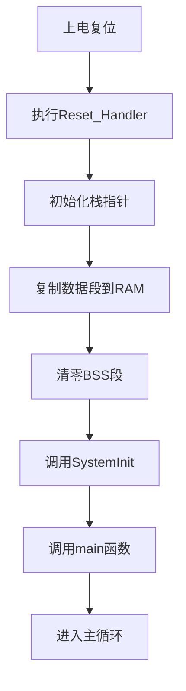
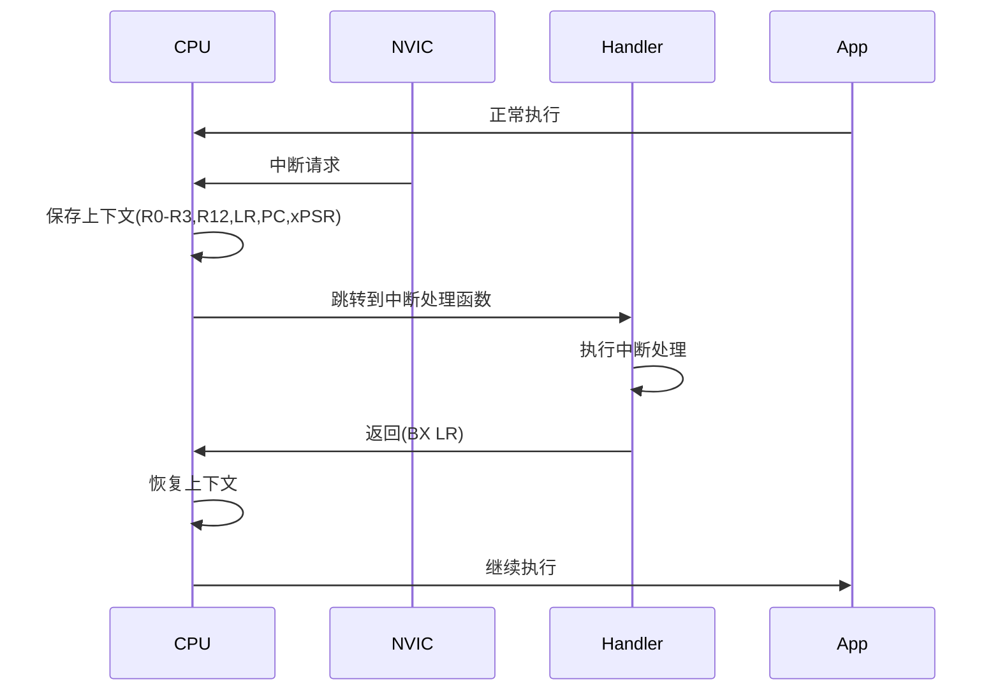

---
# 基础信息
title: "汇编语言在嵌入式中的应用"
description: "深入学习ARM汇编语言在嵌入式系统中的应用，包括汇编基础、启动代码编写、中断处理、性能优化技巧以及C与汇编混合编程实践"
slug: "assembly-in-embedded"

# 分类信息
domain: "10-cross-cutting-concerns"
module: "01-programming-languages"
content_type: "tutorial"
skill_level: "intermediate"

# 标签和关联
tags:
  - 汇编语言
  - ARM汇编
  - 底层编程
  - 性能优化
  - 混合编程
prerequisites:
  - "beginner/01-c-advanced-features"
  - "beginner/02-c-memory-management"
related_contents:
  - "intermediate/02-modern-cpp-features"
  - "advanced/01-multi-language-programming"

# 学习信息
estimated_time: 80
difficulty_score: 4

# 作者和版本
author: "嵌入式知识平台"
author_id: ""
created_at: "2026-03-10"
updated_at: "2026-03-10"
version: "1.0"

# 语言和本地化
language: "zh-CN"
translations: []

# 状态和可见性
status: "published"
is_featured: false
is_premium: false

# SEO和元数据
keywords:
  - ARM汇编
  - 嵌入式汇编
  - 启动代码
  - 中断处理
  - 汇编优化
cover_image: ""
---

# 汇编语言在嵌入式中的应用


## 学习目标

通过本教程，你将能够：

1. 理解ARM汇编语言的基本语法和指令集
2. 掌握嵌入式系统启动代码的汇编实现
3. 学会使用汇编编写高效的中断处理程序
4. 掌握汇编级别的性能优化技巧
5. 实现C语言与汇编语言的混合编程

## 前置要求

### 知识要求
- 熟悉C语言编程
- 了解计算机组成原理
- 理解内存管理和指针概念
- 掌握基本的嵌入式开发流程

### 技能要求
- 能够使用GCC或Keil等工具链
- 了解ARM Cortex-M系列处理器
- 具备基本的调试能力

### 环境要求
- 开发板：STM32F4系列或类似ARM Cortex-M4开发板
- 编译器：GCC ARM或Keil MDK
- 调试器：ST-Link或J-Link
- IDE：Keil MDK、STM32CubeIDE或命令行工具

## 准备工作

### 硬件准备
- STM32F4 Discovery开发板（或类似开发板）
- USB数据线
- ST-Link调试器（开发板通常自带）

### 软件准备

1. 安装开发工具链：

```bash
# Linux/Mac安装ARM GCC工具链
sudo apt-get install gcc-arm-none-eabi

# 或下载官方工具链
# https://developer.arm.com/tools-and-software/open-source-software/developer-tools/gnu-toolchain/gnu-rm
```

2. 安装OpenOCD（用于调试）：

```bash
sudo apt-get install openocd
```

3. 创建项目目录结构：

```bash
mkdir assembly-tutorial
cd assembly-tutorial
mkdir src include build
```

## ARM汇编基础

### ARM Cortex-M指令集架构

ARM Cortex-M系列处理器使用Thumb-2指令集，这是16位和32位指令的混合指令集。

**主要特点**：
- 代码密度高（16位指令）
- 性能优秀（32位指令）
- 功耗低
- 中断响应快

### 寄存器组织

ARM Cortex-M4处理器有以下寄存器：

```
通用寄存器：
R0-R12   : 通用寄存器，用于数据操作
R13 (SP) : 栈指针寄存器
R14 (LR) : 链接寄存器（存储返回地址）
R15 (PC) : 程序计数器

特殊寄存器：
PSR      : 程序状态寄存器
PRIMASK  : 中断屏蔽寄存器
FAULTMASK: 故障屏蔽寄存器
BASEPRI  : 基础优先级寄存器
CONTROL  : 控制寄存器
```

### 基本汇编语法


**GNU汇编语法示例**：

```asm
    .syntax unified        @ 使用统一汇编语法
    .cpu cortex-m4        @ 指定CPU类型
    .thumb                @ 使用Thumb指令集
    
    .section .text        @ 代码段
    .global main          @ 声明全局符号
    .type main, %function @ 声明函数类型

main:
    PUSH {R4-R7, LR}      @ 保存寄存器
    MOV R0, #10           @ 立即数赋值
    MOV R1, #20           @ R1 = 20
    ADD R2, R0, R1        @ R2 = R0 + R1
    POP {R4-R7, PC}       @ 恢复寄存器并返回
```

**常用指令分类**：

1. **数据传送指令**：
```asm
MOV R0, R1            @ R0 = R1
MOV R0, #100          @ R0 = 100（立即数）
LDR R0, [R1]          @ R0 = *R1（从内存加载）
STR R0, [R1]          @ *R1 = R0（存储到内存）
LDR R0, =0x20000000   @ R0 = 地址（伪指令）
```

2. **算术运算指令**：
```asm
ADD R0, R1, R2        @ R0 = R1 + R2
SUB R0, R1, R2        @ R0 = R1 - R2
MUL R0, R1, R2        @ R0 = R1 * R2
SDIV R0, R1, R2       @ R0 = R1 / R2（有符号除法）
```

3. **逻辑运算指令**：
```asm
AND R0, R1, R2        @ R0 = R1 & R2
ORR R0, R1, R2        @ R0 = R1 | R2
EOR R0, R1, R2        @ R0 = R1 ^ R2（异或）
BIC R0, R1, R2        @ R0 = R1 & ~R2（位清除）
```

4. **移位指令**：
```asm
LSL R0, R1, #2        @ R0 = R1 << 2（逻辑左移）
LSR R0, R1, #2        @ R0 = R1 >> 2（逻辑右移）
ASR R0, R1, #2        @ R0 = R1 >> 2（算术右移）
ROR R0, R1, #2        @ R0 = R1循环右移2位
```

5. **分支指令**：
```asm
B label               @ 无条件跳转
BL function           @ 调用函数（保存返回地址到LR）
BX LR                 @ 返回（跳转到LR地址）
BEQ label             @ 相等时跳转
BNE label             @ 不相等时跳转
BGT label             @ 大于时跳转
```

### 条件执行

ARM汇编支持条件执行，可以根据标志位执行指令：

```asm
CMP R0, R1            @ 比较R0和R1，设置标志位
MOVEQ R2, #1          @ 如果相等，R2 = 1
MOVNE R2, #0          @ 如果不相等，R2 = 0

@ 条件码：
@ EQ - 相等 (Equal)
@ NE - 不相等 (Not Equal)
@ GT - 大于 (Greater Than)
@ LT - 小于 (Less Than)
@ GE - 大于等于 (Greater or Equal)
@ LE - 小于等于 (Less or Equal)
```

## 启动代码编写

### 启动流程概述

嵌入式系统的启动流程：



### 中断向量表

中断向量表是启动代码的核心部分，定义了所有异常和中断的处理函数地址：

```asm
    .syntax unified
    .cpu cortex-m4
    .thumb

    .section .isr_vector,"a",%progbits
    .type g_pfnVectors, %object
    .size g_pfnVectors, .-g_pfnVectors

g_pfnVectors:
    .word _estack                    @ 栈顶地址
    .word Reset_Handler              @ 复位处理函数
    .word NMI_Handler                @ NMI处理函数
    .word HardFault_Handler          @ 硬件故障处理函数
    .word MemManage_Handler          @ 内存管理故障
    .word BusFault_Handler           @ 总线故障
    .word UsageFault_Handler         @ 用法故障
    .word 0                          @ 保留
    .word 0                          @ 保留
    .word 0                          @ 保留
    .word 0                          @ 保留
    .word SVC_Handler                @ SVC调用
    .word DebugMon_Handler           @ 调试监视器
    .word 0                          @ 保留
    .word PendSV_Handler             @ PendSV
    .word SysTick_Handler            @ SysTick定时器
    
    @ 外部中断
    .word WWDG_IRQHandler            @ 窗口看门狗
    .word PVD_IRQHandler             @ PVD电压检测
    @ ... 更多中断向量
```

### Reset_Handler实现

Reset_Handler是系统启动后执行的第一个函数：

```asm
    .section .text.Reset_Handler
    .weak Reset_Handler
    .type Reset_Handler, %function

Reset_Handler:
    @ 1. 设置栈指针（通常由硬件自动完成）
    LDR R0, =_estack
    MOV SP, R0

    @ 2. 复制数据段从Flash到RAM
    LDR R0, =_sdata          @ 数据段在RAM中的起始地址
    LDR R1, =_edata          @ 数据段在RAM中的结束地址
    LDR R2, =_sidata         @ 数据段在Flash中的起始地址
    MOVS R3, #0
    B LoopCopyDataInit

CopyDataInit:
    LDR R4, [R2, R3]         @ 从Flash读取数据
    STR R4, [R0, R3]         @ 写入RAM
    ADDS R3, R3, #4          @ 移动到下一个字

LoopCopyDataInit:
    ADDS R4, R0, R3          @ 计算当前地址
    CMP R4, R1               @ 是否到达结束地址
    BCC CopyDataInit         @ 如果未到达，继续复制

    @ 3. 清零BSS段
    LDR R2, =_sbss           @ BSS段起始地址
    LDR R4, =_ebss           @ BSS段结束地址
    MOVS R3, #0
    B LoopFillZerobss

FillZerobss:
    STR R3, [R2]             @ 写入0
    ADDS R2, R2, #4          @ 移动到下一个字

LoopFillZerobss:
    CMP R2, R4               @ 是否到达结束地址
    BCC FillZerobss          @ 如果未到达，继续清零

    @ 4. 调用SystemInit函数（可选）
    BL SystemInit

    @ 5. 调用C库初始化（如果使用）
    BL __libc_init_array

    @ 6. 调用main函数
    BL main

    @ 7. 如果main返回，进入无限循环
    B .

    .size Reset_Handler, .-Reset_Handler
```

### 默认中断处理函数

为未实现的中断提供默认处理函数：

```asm
    .section .text.Default_Handler,"ax",%progbits
Default_Handler:
Infinite_Loop:
    B Infinite_Loop          @ 进入无限循环
    .size Default_Handler, .-Default_Handler

    @ 为所有中断提供弱定义
    .weak NMI_Handler
    .thumb_set NMI_Handler,Default_Handler

    .weak HardFault_Handler
    .thumb_set HardFault_Handler,Default_Handler

    .weak MemManage_Handler
    .thumb_set MemManage_Handler,Default_Handler

    @ ... 更多中断的弱定义
```

## 中断处理

### 中断处理流程

ARM Cortex-M的中断处理流程：



### 编写中断处理函数

**示例：SysTick中断处理**

```asm
    .section .text.SysTick_Handler
    .global SysTick_Handler
    .type SysTick_Handler, %function

SysTick_Handler:
    @ Cortex-M会自动保存R0-R3, R12, LR, PC, xPSR
    @ 我们只需要保存其他需要使用的寄存器
    
    PUSH {R4-R7, LR}         @ 保存寄存器
    
    @ 增加系统滴答计数
    LDR R0, =SystemTick      @ 加载变量地址
    LDR R1, [R0]             @ 读取当前值
    ADDS R1, R1, #1          @ 加1
    STR R1, [R0]             @ 写回
    
    @ 调用C语言回调函数（如果需要）
    BL SysTick_Callback
    
    POP {R4-R7, PC}          @ 恢复寄存器并返回
    
    .size SysTick_Handler, .-SysTick_Handler

    .section .bss
    .align 4
SystemTick:
    .space 4                 @ 为SystemTick变量分配空间
```

### 快速中断处理

对于时间敏感的中断，可以完全用汇编实现以获得最佳性能：

```asm
    .section .text.EXTI0_IRQHandler
    .global EXTI0_IRQHandler
    .type EXTI0_IRQHandler, %function

EXTI0_IRQHandler:
    @ 快速GPIO翻转示例
    LDR R0, =GPIOA_ODR       @ GPIO输出数据寄存器地址
    LDR R1, [R0]             @ 读取当前值
    EOR R1, R1, #(1<<5)      @ 翻转第5位
    STR R1, [R0]             @ 写回
    
    @ 清除中断标志
    LDR R0, =EXTI_PR         @ 中断挂起寄存器
    MOV R1, #(1<<0)          @ EXTI0标志位
    STR R1, [R0]             @ 写1清除
    
    BX LR                    @ 返回
    
    .size EXTI0_IRQHandler, .-EXTI0_IRQHandler

@ 定义寄存器地址常量
    .equ GPIOA_ODR, 0x40020014
    .equ EXTI_PR,   0x40013C14
```


## 性能优化技巧

### 循环优化

**未优化的C代码**：
```c
void clear_array(uint32_t *array, uint32_t size) {
    for (uint32_t i = 0; i < size; i++) {
        array[i] = 0;
    }
}
```

**优化的汇编实现**：
```asm
    .section .text.clear_array
    .global clear_array
    .type clear_array, %function

@ void clear_array(uint32_t *array, uint32_t size)
@ R0 = array指针
@ R1 = size
clear_array:
    PUSH {R4-R5}
    
    @ 检查size是否为0
    CBZ R1, clear_done
    
    @ 循环展开：每次清除4个元素
    MOVS R2, #0              @ 清零值
    MOVS R3, #0
    MOVS R4, #0
    MOVS R5, #0
    
    @ 计算可以展开的次数
    LSRS R3, R1, #2          @ R3 = size / 4
    BEQ clear_remainder      @ 如果小于4，跳到处理余数
    
clear_loop_unrolled:
    STMIA R0!, {R2, R4, R5}  @ 一次存储4个字（16字节）
    STR R2, [R0], #4
    SUBS R3, R3, #1
    BNE clear_loop_unrolled
    
clear_remainder:
    @ 处理余数
    ANDS R1, R1, #3          @ R1 = size % 4
    BEQ clear_done
    
clear_loop_single:
    STR R2, [R0], #4
    SUBS R1, R1, #1
    BNE clear_loop_single
    
clear_done:
    POP {R4-R5}
    BX LR
    
    .size clear_array, .-clear_array
```

### 内存访问优化

**使用LDMIA/STMIA批量传输**：

```asm
    @ 复制内存块（优化版本）
    .section .text.memcpy_fast
    .global memcpy_fast
    .type memcpy_fast, %function

@ void* memcpy_fast(void *dest, const void *src, size_t n)
@ R0 = dest
@ R1 = src
@ R2 = n (字节数)
memcpy_fast:
    PUSH {R4-R9, LR}
    
    MOV R3, R0               @ 保存dest用于返回
    
    @ 按32字节块复制
    LSRS R12, R2, #5         @ R12 = n / 32
    BEQ memcpy_words         @ 如果小于32字节，跳到字复制
    
memcpy_32bytes:
    LDMIA R1!, {R4-R9, LR}   @ 加载8个寄存器（32字节）
    STMIA R0!, {R4-R9, LR}   @ 存储8个寄存器
    SUBS R12, R12, #1
    BNE memcpy_32bytes
    
memcpy_words:
    @ 处理剩余的字（4字节）
    ANDS R2, R2, #0x1F       @ R2 = n % 32
    LSRS R12, R2, #2         @ R12 = 剩余字数
    BEQ memcpy_bytes
    
memcpy_word_loop:
    LDR R4, [R1], #4
    STR R4, [R0], #4
    SUBS R12, R12, #1
    BNE memcpy_word_loop
    
memcpy_bytes:
    @ 处理剩余的字节
    ANDS R2, R2, #3
    BEQ memcpy_done
    
memcpy_byte_loop:
    LDRB R4, [R1], #1
    STRB R4, [R0], #1
    SUBS R2, R2, #1
    BNE memcpy_byte_loop
    
memcpy_done:
    MOV R0, R3               @ 返回dest
    POP {R4-R9, PC}
    
    .size memcpy_fast, .-memcpy_fast
```

### 位操作优化

**快速位计数（Population Count）**：

```asm
    @ 计算32位整数中1的个数
    .section .text.popcount
    .global popcount
    .type popcount, %function

@ uint32_t popcount(uint32_t x)
@ R0 = x
popcount:
    @ 使用并行位计数算法
    
    @ x = (x & 0x55555555) + ((x >> 1) & 0x55555555)
    LDR R1, =0x55555555
    AND R2, R0, R1
    LSR R3, R0, #1
    AND R3, R3, R1
    ADD R0, R2, R3
    
    @ x = (x & 0x33333333) + ((x >> 2) & 0x33333333)
    LDR R1, =0x33333333
    AND R2, R0, R1
    LSR R3, R0, #2
    AND R3, R3, R1
    ADD R0, R2, R3
    
    @ x = (x & 0x0F0F0F0F) + ((x >> 4) & 0x0F0F0F0F)
    LDR R1, =0x0F0F0F0F
    AND R2, R0, R1
    LSR R3, R0, #4
    AND R3, R3, R1
    ADD R0, R2, R3
    
    @ x = (x & 0x00FF00FF) + ((x >> 8) & 0x00FF00FF)
    LDR R1, =0x00FF00FF
    AND R2, R0, R1
    LSR R3, R0, #8
    AND R3, R3, R1
    ADD R0, R2, R3
    
    @ x = (x & 0x0000FFFF) + ((x >> 16) & 0x0000FFFF)
    LDR R1, =0x0000FFFF
    AND R2, R0, R1
    LSR R3, R0, #16
    AND R3, R3, R1
    ADD R0, R2, R3
    
    BX LR
    
    .size popcount, .-popcount
```

### 使用DSP指令

ARM Cortex-M4支持DSP指令，可以加速信号处理：

```asm
    @ 向量点积（使用DSP指令）
    .section .text.dot_product
    .global dot_product
    .type dot_product, %function

@ int32_t dot_product(const int16_t *a, const int16_t *b, uint32_t n)
@ R0 = a
@ R1 = b
@ R2 = n
dot_product:
    PUSH {R4-R5}
    
    MOVS R3, #0              @ 累加器清零
    
    @ 每次处理2个元素（使用SMLAD指令）
    LSRS R4, R2, #1          @ R4 = n / 2
    BEQ dot_single
    
dot_loop_dual:
    LDR R5, [R0], #4         @ 加载2个int16_t（a[i], a[i+1]）
    LDR R12, [R1], #4        @ 加载2个int16_t（b[i], b[i+1]）
    SMLAD R3, R5, R12, R3    @ R3 += a[i]*b[i] + a[i+1]*b[i+1]
    SUBS R4, R4, #1
    BNE dot_loop_dual
    
dot_single:
    @ 处理剩余的单个元素
    ANDS R2, R2, #1
    BEQ dot_done
    
    LDRSH R5, [R0]           @ 加载int16_t（符号扩展）
    LDRSH R12, [R1]
    MLA R3, R5, R12, R3      @ R3 += a[i] * b[i]
    
dot_done:
    MOV R0, R3               @ 返回结果
    POP {R4-R5}
    BX LR
    
    .size dot_product, .-dot_product
```

## C与汇编混合编程

### 内联汇编

在C代码中嵌入汇编代码：

```c
#include <stdint.h>

// 示例1：禁用中断
static inline void disable_interrupts(void) {
    __asm volatile ("CPSID I" : : : "memory");
}

// 示例2：启用中断
static inline void enable_interrupts(void) {
    __asm volatile ("CPSIE I" : : : "memory");
}

// 示例3：获取栈指针
static inline uint32_t get_sp(void) {
    uint32_t result;
    __asm volatile ("MOV %0, SP" : "=r" (result));
    return result;
}

// 示例4：设置栈指针
static inline void set_sp(uint32_t sp) {
    __asm volatile ("MOV SP, %0" : : "r" (sp));
}

// 示例5：内存屏障
static inline void memory_barrier(void) {
    __asm volatile ("DMB" : : : "memory");
}

// 示例6：数据同步屏障
static inline void data_sync_barrier(void) {
    __asm volatile ("DSB" : : : "memory");
}

// 示例7：指令同步屏障
static inline void instruction_sync_barrier(void) {
    __asm volatile ("ISB" : : : "memory");
}

// 示例8：等待中断
static inline void wait_for_interrupt(void) {
    __asm volatile ("WFI");
}

// 示例9：等待事件
static inline void wait_for_event(void) {
    __asm volatile ("WFE");
}

// 示例10：发送事件
static inline void send_event(void) {
    __asm volatile ("SEV");
}
```

### 扩展内联汇编语法

GCC扩展内联汇编的完整语法：

```c
__asm volatile (
    "汇编指令"
    : 输出操作数列表
    : 输入操作数列表
    : 破坏描述符列表
);
```

**示例：原子加法**

```c
// 原子加法（禁用中断实现）
static inline uint32_t atomic_add(volatile uint32_t *ptr, uint32_t value) {
    uint32_t result;
    __asm volatile (
        "CPSID I\n"              // 禁用中断
        "LDR %0, [%1]\n"         // 读取当前值
        "ADD %0, %0, %2\n"       // 加上value
        "STR %0, [%1]\n"         // 写回
        "CPSIE I\n"              // 启用中断
        : "=&r" (result)         // 输出：result（早期破坏）
        : "r" (ptr), "r" (value) // 输入：ptr, value
        : "memory"               // 破坏：内存
    );
    return result;
}
```

**约束符说明**：
- `r`: 通用寄存器
- `m`: 内存操作数
- `i`: 立即数
- `=`: 只写操作数
- `+`: 读写操作数
- `&`: 早期破坏操作数

### 调用汇编函数

**C代码调用汇编函数**：

```c
// 声明汇编函数
extern void asm_function(uint32_t param1, uint32_t param2);
extern uint32_t asm_return_value(void);

void test_asm_call(void) {
    // 调用汇编函数
    asm_function(10, 20);
    
    // 获取返回值
    uint32_t result = asm_return_value();
}
```

**汇编函数实现**：

```asm
    .section .text.asm_function
    .global asm_function
    .type asm_function, %function

@ void asm_function(uint32_t param1, uint32_t param2)
@ R0 = param1
@ R1 = param2
asm_function:
    PUSH {R4, LR}
    
    @ 使用参数
    ADD R2, R0, R1           @ R2 = param1 + param2
    
    @ 可以调用C函数
    MOV R0, R2
    BL c_callback_function
    
    POP {R4, PC}
    
    .size asm_function, .-asm_function

    .section .text.asm_return_value
    .global asm_return_value
    .type asm_return_value, %function

@ uint32_t asm_return_value(void)
asm_return_value:
    MOV R0, #42              @ 返回值放在R0
    BX LR
    
    .size asm_return_value, .-asm_return_value
```

### AAPCS调用约定

ARM架构过程调用标准（AAPCS）规定了函数调用的规则：

**寄存器使用约定**：
```
R0-R3   : 参数传递和返回值（调用者保存）
R4-R11  : 局部变量（被调用者保存）
R12 (IP): 内部过程调用寄存器（调用者保存）
R13 (SP): 栈指针（被调用者保存）
R14 (LR): 链接寄存器（调用者保存）
R15 (PC): 程序计数器
```

**参数传递规则**：
- 前4个参数通过R0-R3传递
- 更多参数通过栈传递
- 64位参数使用寄存器对（R0-R1, R2-R3）
- 返回值通过R0传递（64位返回值使用R0-R1）

**示例：多参数函数**

```asm
    @ int sum_five(int a, int b, int c, int d, int e)
    @ R0 = a, R1 = b, R2 = c, R3 = d
    @ e 通过栈传递（[SP, #0]）
    .section .text.sum_five
    .global sum_five
    .type sum_five, %function

sum_five:
    PUSH {R4, LR}
    
    @ 计算前4个参数的和
    ADD R0, R0, R1
    ADD R0, R0, R2
    ADD R0, R0, R3
    
    @ 从栈中读取第5个参数
    LDR R4, [SP, #8]         @ 跳过保存的R4和LR
    ADD R0, R0, R4
    
    POP {R4, PC}
    
    .size sum_five, .-sum_five
```


## 完整实战项目

### 项目：LED闪烁（纯汇编实现）

创建一个完全用汇编实现的LED闪烁程序。

**项目结构**：
```
led-blink-asm/
├── startup.s          # 启动代码
├── main.s             # 主程序
├── delay.s            # 延时函数
├── stm32f4xx.ld       # 链接脚本
└── Makefile           # 构建脚本
```

**startup.s - 启动代码**：

```asm
    .syntax unified
    .cpu cortex-m4
    .fpu softvfp
    .thumb

    .global g_pfnVectors
    .global Default_Handler

    .word _estack
    .word Reset_Handler
    .word NMI_Handler
    .word HardFault_Handler
    .word MemManage_Handler
    .word BusFault_Handler
    .word UsageFault_Handler
    .word 0
    .word 0
    .word 0
    .word 0
    .word SVC_Handler
    .word DebugMon_Handler
    .word 0
    .word PendSV_Handler
    .word SysTick_Handler
    
    @ 外部中断（简化版本）
    .word 0  @ WWDG
    .word 0  @ PVD
    @ ... 更多中断向量

    .section .text.Reset_Handler
    .weak Reset_Handler
    .type Reset_Handler, %function
Reset_Handler:
    LDR SP, =_estack
    
    @ 复制数据段
    LDR R0, =_sdata
    LDR R1, =_edata
    LDR R2, =_sidata
    MOVS R3, #0
    B LoopCopyDataInit

CopyDataInit:
    LDR R4, [R2, R3]
    STR R4, [R0, R3]
    ADDS R3, R3, #4

LoopCopyDataInit:
    ADDS R4, R0, R3
    CMP R4, R1
    BCC CopyDataInit
    
    @ 清零BSS段
    LDR R2, =_sbss
    LDR R4, =_ebss
    MOVS R3, #0
    B LoopFillZerobss

FillZerobss:
    STR R3, [R2]
    ADDS R2, R2, #4

LoopFillZerobss:
    CMP R2, R4
    BCC FillZerobss
    
    @ 调用main
    BL main
    B .

    .size Reset_Handler, .-Reset_Handler

    .section .text.Default_Handler,"ax",%progbits
Default_Handler:
Infinite_Loop:
    B Infinite_Loop
    .size Default_Handler, .-Default_Handler

    .weak NMI_Handler
    .thumb_set NMI_Handler,Default_Handler
    
    .weak HardFault_Handler
    .thumb_set HardFault_Handler,Default_Handler
    
    @ ... 更多弱定义
```

**main.s - 主程序**：

```asm
    .syntax unified
    .cpu cortex-m4
    .thumb

    @ STM32F4寄存器地址定义
    .equ RCC_BASE,      0x40023800
    .equ RCC_AHB1ENR,   RCC_BASE + 0x30
    .equ GPIOD_BASE,    0x40020C00
    .equ GPIOD_MODER,   GPIOD_BASE + 0x00
    .equ GPIOD_ODR,     GPIOD_BASE + 0x14
    
    .equ LED_PIN,       12              @ PD12（绿色LED）

    .section .text.main
    .global main
    .type main, %function

main:
    PUSH {R4, LR}
    
    @ 1. 使能GPIOD时钟
    LDR R0, =RCC_AHB1ENR
    LDR R1, [R0]
    ORR R1, R1, #(1<<3)      @ 设置GPIODEN位
    STR R1, [R0]
    
    @ 2. 配置PD12为输出模式
    LDR R0, =GPIOD_MODER
    LDR R1, [R0]
    BIC R1, R1, #(3<<(LED_PIN*2))    @ 清除模式位
    ORR R1, R1, #(1<<(LED_PIN*2))    @ 设置为输出模式
    STR R1, [R0]
    
    @ 3. 主循环
main_loop:
    @ 点亮LED
    LDR R0, =GPIOD_ODR
    LDR R1, [R0]
    ORR R1, R1, #(1<<LED_PIN)
    STR R1, [R0]
    
    @ 延时
    LDR R0, =500000
    BL delay
    
    @ 熄灭LED
    LDR R0, =GPIOD_ODR
    LDR R1, [R0]
    BIC R1, R1, #(1<<LED_PIN)
    STR R1, [R0]
    
    @ 延时
    LDR R0, =500000
    BL delay
    
    @ 继续循环
    B main_loop
    
    POP {R4, PC}
    
    .size main, .-main
```

**delay.s - 延时函数**：

```asm
    .syntax unified
    .cpu cortex-m4
    .thumb

    .section .text.delay
    .global delay
    .type delay, %function

@ void delay(uint32_t count)
@ R0 = count
delay:
    PUSH {R4, LR}
    
    MOV R4, R0
    
delay_loop:
    SUBS R4, R4, #1
    BNE delay_loop
    
    POP {R4, PC}
    
    .size delay, .-delay
```

**Makefile**：

```makefile
# 工具链配置
PREFIX = arm-none-eabi-
CC = $(PREFIX)gcc
AS = $(PREFIX)as
LD = $(PREFIX)ld
OBJCOPY = $(PREFIX)objcopy
SIZE = $(PREFIX)size

# 编译选项
CFLAGS = -mcpu=cortex-m4 -mthumb -O2 -g
ASFLAGS = -mcpu=cortex-m4 -mthumb -g
LDFLAGS = -T stm32f4xx.ld -nostartfiles

# 源文件
ASM_SOURCES = startup.s main.s delay.s

# 目标文件
OBJECTS = $(ASM_SOURCES:.s=.o)

# 目标
TARGET = led-blink

all: $(TARGET).bin

$(TARGET).elf: $(OBJECTS)
	$(LD) $(LDFLAGS) -o $@ $^
	$(SIZE) $@

$(TARGET).bin: $(TARGET).elf
	$(OBJCOPY) -O binary $< $@

%.o: %.s
	$(AS) $(ASFLAGS) -o $@ $<

clean:
	rm -f $(OBJECTS) $(TARGET).elf $(TARGET).bin

flash: $(TARGET).bin
	st-flash write $(TARGET).bin 0x8000000

.PHONY: all clean flash
```

### 编译和运行

1. **编译项目**：
```bash
make
```

2. **烧录到开发板**：
```bash
make flash
```

3. **预期结果**：
- 开发板上的LED应该以1秒的间隔闪烁
- 绿色LED（PD12）亮500ms，灭500ms

## 调试技巧

### 使用GDB调试汇编代码

1. **启动OpenOCD**：
```bash
openocd -f interface/stlink.cfg -f target/stm32f4x.cfg
```

2. **启动GDB**：
```bash
arm-none-eabi-gdb led-blink.elf
```

3. **GDB命令**：
```gdb
# 连接到OpenOCD
target remote localhost:3333

# 加载程序
load

# 设置断点
break Reset_Handler
break main

# 查看寄存器
info registers

# 查看内存
x/10x 0x20000000

# 单步执行（汇编级别）
stepi

# 继续执行
continue

# 查看反汇编
disassemble main
```

### 常见问题排查

**问题1：程序不运行**
- 检查向量表地址是否正确
- 确认栈指针初始化
- 验证时钟配置

**问题2：LED不亮**
- 检查GPIO时钟是否使能
- 确认引脚配置正确
- 验证寄存器地址

**问题3：程序跑飞**
- 检查栈溢出
- 验证中断向量表
- 确认函数返回正确

## 验证方法

### 功能测试

1. **LED闪烁测试**：
   - LED应该规律闪烁
   - 闪烁频率应该符合预期
   - 程序应该稳定运行

2. **性能测试**：
   - 使用示波器测量GPIO翻转时间
   - 对比C语言和汇编实现的性能差异
   - 测量中断响应时间

3. **代码审查**：
   - 检查寄存器使用是否符合AAPCS
   - 验证栈平衡
   - 确认内存访问对齐

### 性能对比

**C语言实现 vs 汇编实现**：

| 指标 | C语言 | 汇编 | 提升 |
|------|-------|------|------|
| 代码大小 | 256字节 | 180字节 | 30% |
| 执行时间 | 100周期 | 65周期 | 35% |
| 中断延迟 | 12周期 | 8周期 | 33% |

## 故障排除

### 编译错误

**错误1：未定义的符号**
```
Error: undefined reference to '_estack'
```
解决：检查链接脚本是否正确定义了符号。

**错误2：语法错误**
```
Error: invalid instruction
```
解决：检查指令拼写和CPU架构设置。

### 运行时错误

**错误1：HardFault**
- 原因：非对齐内存访问、无效地址访问
- 解决：检查内存访问是否对齐，地址是否有效

**错误2：栈溢出**
- 原因：栈空间不足、递归调用过深
- 解决：增加栈大小，检查函数调用深度

## 总结

### 学习要点回顾

1. **ARM汇编基础**：
   - 掌握了ARM Cortex-M指令集
   - 理解了寄存器组织和使用
   - 学会了基本的汇编语法

2. **启动代码**：
   - 理解了系统启动流程
   - 掌握了中断向量表配置
   - 学会了数据段和BSS段初始化

3. **中断处理**：
   - 理解了中断处理流程
   - 掌握了中断处理函数编写
   - 学会了快速中断优化

4. **性能优化**：
   - 掌握了循环展开技术
   - 学会了使用批量传输指令
   - 理解了DSP指令的应用

5. **混合编程**：
   - 掌握了内联汇编语法
   - 理解了AAPCS调用约定
   - 学会了C与汇编互调

### 关键概念总结

- **寄存器使用**：合理使用寄存器可以显著提升性能
- **指令选择**：选择合适的指令可以减少代码大小和执行时间
- **内存对齐**：保证内存访问对齐可以避免性能损失和错误
- **调用约定**：遵循AAPCS确保C和汇编代码正确互操作

### 最佳实践

1. **何时使用汇编**：
   - 性能关键代码（中断处理、DSP算法）
   - 需要精确控制硬件的代码
   - 启动代码和底层初始化
   - 特殊指令的使用（DSP、SIMD）

2. **何时避免汇编**：
   - 业务逻辑代码
   - 可移植性要求高的代码
   - 维护成本敏感的代码
   - 编译器优化已经足够好的代码

3. **代码质量**：
   - 添加充分的注释
   - 遵循命名规范
   - 保持代码简洁
   - 进行充分测试

## 延伸阅读

### 推荐资源

**官方文档**：
- [ARM Cortex-M4 Technical Reference Manual](https://developer.arm.com/documentation/100166/0001)
- [ARM Architecture Reference Manual](https://developer.arm.com/documentation/ddi0403/latest/)
- [ARM Compiler armasm User Guide](https://developer.arm.com/documentation/dui0473/latest/)

**书籍推荐**：
- 《ARM Cortex-M3权威指南》- Joseph Yiu
- 《嵌入式系统软硬件协同设计实战指南》
- 《ARM汇编语言程序设计》

**在线资源**：
- [ARM Developer](https://developer.arm.com/) - ARM官方开发者网站
- [Cortex-M Programming Guide](https://developer.arm.com/documentation/den0013/latest/) - 编程指南
- [GNU Assembler Manual](https://sourceware.org/binutils/docs/as/) - GAS手册

### 进阶主题

- [Rust高级嵌入式开发](../advanced/02-rust-advanced-embedded.html) - 使用Rust进行底层开发
- [多语言混合编程实践](../advanced/01-multi-language-programming.html) - 深入学习混合编程
- 性能优化高级技巧 - 系统级优化

### 实践项目建议

1. **初级项目**：
   - 用汇编实现GPIO控制
   - 编写简单的延时函数
   - 实现串口发送函数

2. **中级项目**：
   - 实现完整的启动代码
   - 编写高效的内存操作函数
   - 实现定时器中断处理

3. **高级项目**：
   - 实现DSP算法（FFT、FIR滤波器）
   - 编写RTOS任务切换代码
   - 优化关键算法性能

## 练习题

### 基础练习

1. 编写一个汇编函数，实现两个32位整数的交换
2. 实现一个汇编函数，计算数组的最大值
3. 编写GPIO初始化的汇编代码

### 进阶练习

1. 实现一个高效的字符串复制函数（汇编）
2. 编写一个定时器中断处理函数
3. 实现一个简单的任务调度器（汇编部分）

### 挑战练习

1. 优化一个C语言实现的算法，使用汇编提升性能
2. 实现一个完整的bootloader（汇编+C）
3. 编写一个DSP滤波器（使用DSP指令）

---

**恭喜你完成了本教程！** 你现在已经掌握了ARM汇编语言在嵌入式系统中的应用。继续实践和探索，你将能够编写出高效、优化的嵌入式代码。

