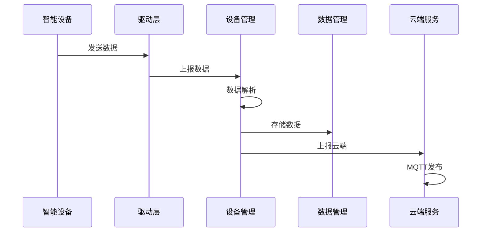
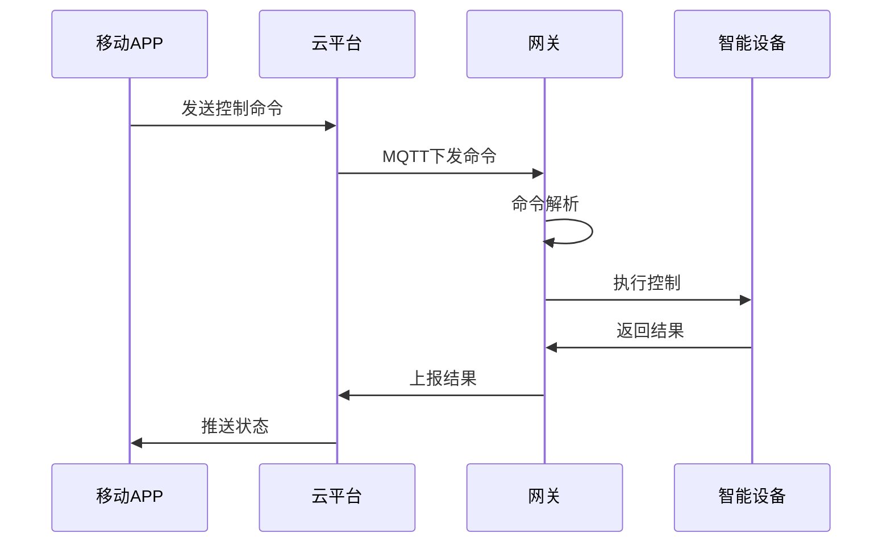
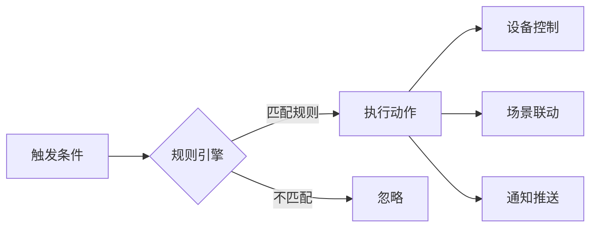

# 嵌入式系统架构设计实战


## 项目概述

### 项目简介

本项目将带你完成一个**智能家居网关系统**的完整架构设计。这是一个真实的工业级项目场景，涵盖了从需求分析到详细设计的全过程。通过本项目，你将学会如何系统化地进行嵌入式系统架构设计，掌握架构设计的方法论和最佳实践。

智能家居网关是智能家居系统的核心设备，负责连接各种智能设备（传感器、执行器、摄像头等），实现设备管理、数据采集、本地控制和云端通信等功能。

### 项目背景

随着物联网技术的发展，智能家居市场快速增长。一个优秀的智能家居网关需要：
- 支持多种通信协议（WiFi、Zigbee、BLE、LoRa等）
- 管理数十甚至上百个智能设备
- 提供稳定可靠的本地控制
- 实现安全的云端通信
- 支持OTA升级和远程维护

这样的系统复杂度高，如果没有良好的架构设计，很容易陷入代码混乱、难以维护的困境。

### 学习目标

完成本项目后，你将掌握：

- [ ] **需求分析能力**：学会从业务需求中提取技术需求，识别关键功能和非功能需求
- [ ] **架构设计能力**：掌握分层架构、模块化设计等架构模式的实际应用
- [ ] **接口设计能力**：学会定义清晰、稳定的模块接口，实现高内聚低耦合
- [ ] **文档编写能力**：掌握架构设计文档的编写规范和要点
- [ ] **技术选型能力**：学会根据需求进行合理的技术选型和权衡

## 项目特点

- ✨ **真实场景**：基于实际的智能家居网关产品需求
- ✨ **完整流程**：覆盖从需求分析到详细设计的完整过程
- ✨ **方法论导向**：不仅教你设计，更教你如何思考和决策
- ✨ **可落地实施**：设计方案可直接用于实际开发
- ✨ **最佳实践**：融入工业级项目的设计经验和最佳实践


## 技术栈

### 硬件平台
- **主控芯片**：STM32H743（Cortex-M7, 480MHz, 2MB Flash, 1MB RAM）
- **通信模块**：
  - WiFi/BLE：ESP32-C3
  - Zigbee：CC2652P
  - LoRa：SX1278
- **存储**：
  - 外部Flash：16MB（W25Q128）
  - SD卡接口（可选）
- **其他外设**：
  - 以太网接口（可选）
  - USB接口
  - 调试接口（SWD）

### 软件技术
- **操作系统**：FreeRTOS v10.4+
- **开发语言**：C语言（C99标准）
- **通信协议**：
  - 应用层：MQTT, HTTP/HTTPS, CoAP
  - 传输层：TCP/UDP, TLS/DTLS
  - 网络层：IPv4/IPv6
  - 链路层：WiFi, Zigbee, BLE, LoRa
- **数据格式**：JSON, Protocol Buffers
- **开发工具**：STM32CubeIDE, Git, PlantUML

### 第三方库
- **网络栈**：lwIP 2.1+
- **MQTT客户端**：Paho MQTT
- **JSON解析**：cJSON
- **加密库**：mbedTLS
- **文件系统**：FatFs（可选）


## 硬件清单

### 必需硬件

| 名称 | 型号 | 数量 | 用途 | 参考价格 | 备注 |
|------|------|------|------|----------|------|
| 主控开发板 | STM32H743 Nucleo | 1 | 主控制器 | ¥200 | 或其他H7系列 |
| WiFi/BLE模块 | ESP32-C3 | 1 | 无线通信 | ¥15 | UART接口 |
| Zigbee模块 | CC2652P | 1 | Zigbee通信 | ¥30 | UART接口 |
| 调试器 | ST-Link V2 | 1 | 程序下载调试 | ¥50 | Nucleo板载 |
| 电源模块 | 5V/2A适配器 | 1 | 供电 | ¥20 | - |

### 可选硬件

| 名称 | 型号 | 数量 | 用途 | 参考价格 |
|------|------|------|------|----------|
| LoRa模块 | SX1278 | 1 | LoRa通信 | ¥25 |
| 以太网模块 | W5500 | 1 | 有线网络 | ¥20 |
| 外部Flash | W25Q128 | 1 | 扩展存储 | ¥8 |
| 逻辑分析仪 | - | 1 | 协议调试 | ¥100 |

**总成本**：约 ¥300-500（根据配置）

**注意**：本项目重点是架构设计，硬件仅用于验证设计方案的可行性。如果没有硬件，也可以完成架构设计部分。

## 软件要求

### 开发环境
- STM32CubeIDE v1.10+ 或 Keil MDK v5.36+
- Git v2.30+
- PlantUML（用于绘制架构图）
- Markdown编辑器（用于编写文档）

### 设计工具
- **架构设计**：PlantUML, Draw.io, Visio
- **文档编写**：Markdown, Word, Confluence
- **版本控制**：Git, GitHub/GitLab

### 可选工具
- Wireshark（网络协议分析）
- MQTT.fx（MQTT客户端测试）
- Postman（HTTP API测试）


## 实现步骤

### 阶段1：需求分析 (预计2小时)

#### 1.1 业务需求分析

首先，我们需要理解智能家居网关的业务需求。通过与产品经理、市场团队的沟通，我们整理出以下核心需求：

**核心功能需求**：
1. **设备管理**：支持添加、删除、配置智能设备
2. **数据采集**：定期采集设备数据（温度、湿度、开关状态等）
3. **本地控制**：支持本地场景联动和自动化规则
4. **云端通信**：与云平台进行数据同步和远程控制
5. **用户交互**：通过移动APP进行设备控制和状态查看
6. **系统管理**：支持OTA升级、日志管理、配置管理

**非功能需求**：
1. **性能要求**：
   - 支持管理至少50个设备
   - 设备响应时间 < 500ms
   - 数据上报延迟 < 2s
   
2. **可靠性要求**：
   - 系统可用性 ≥ 99.9%
   - 支持断网续传
   - 支持设备离线检测
   
3. **安全性要求**：
   - 数据传输加密（TLS）
   - 设备认证和授权
   - 固件签名验证
   
4. **可维护性要求**：
   - 模块化设计，便于扩展
   - 支持远程诊断和日志查看
   - 代码可读性和文档完整性

#### 1.2 技术需求提取

基于业务需求，我们提取出技术需求：

**功能性技术需求**：

```markdown
FR-001: 设备发现与配对
- 系统应支持Zigbee、BLE设备的自动发现
- 系统应提供设备配对接口
- 系统应维护设备列表和状态

FR-002: 多协议通信
- 系统应支持WiFi、Zigbee、BLE、LoRa等多种通信协议
- 系统应提供统一的设备通信接口
- 系统应支持协议转换和数据格式转换

FR-003: 数据采集与存储
- 系统应定期采集设备数据
- 系统应支持本地数据缓存
- 系统应支持数据持久化存储

FR-004: 本地自动化
- 系统应支持场景定义和执行
- 系统应支持条件触发和定时触发
- 系统应支持设备联动控制

FR-005: 云端通信
- 系统应通过MQTT与云平台通信
- 系统应支持数据上报和命令下发
- 系统应支持断线重连和消息缓存
```

**非功能性技术需求**：

```markdown
NFR-001: 性能要求
- CPU使用率 < 80%
- 内存使用率 < 70%
- 网络带宽 < 100KB/s

NFR-002: 实时性要求
- 本地控制响应时间 < 200ms
- 云端控制响应时间 < 1s
- 数据采集周期可配置（1s-60s）

NFR-003: 可靠性要求
- MTBF（平均无故障时间）> 10000小时
- 支持看门狗和异常恢复
- 支持数据完整性校验

NFR-004: 安全性要求
- 支持TLS 1.2+加密通信
- 支持设备证书认证
- 支持固件签名和安全启动
```

#### 1.3 约束条件识别

在设计架构时，我们需要考虑以下约束条件：

**硬件约束**：
- Flash空间：2MB（需预留OTA空间）
- RAM空间：1MB（需考虑多任务和网络栈）
- 通信接口数量有限

**软件约束**：
- 必须使用FreeRTOS
- 必须兼容现有的云平台协议
- 必须支持OTA升级

**成本约束**：
- 硬件BOM成本 < ¥100
- 开发周期 < 6个月

**法规约束**：
- 符合无线电管理规定
- 符合信息安全等级保护要求


### 阶段2：架构设计 (预计3小时)

#### 2.1 架构风格选择

基于需求分析，我们需要选择合适的架构风格。常见的嵌入式系统架构风格包括：

1. **分层架构**（Layered Architecture）
2. **事件驱动架构**（Event-Driven Architecture）
3. **微内核架构**（Microkernel Architecture）
4. **管道-过滤器架构**（Pipe-Filter Architecture）

**决策过程**：

对于智能家居网关，我们选择**分层架构 + 事件驱动**的混合架构：

- **分层架构**：提供清晰的模块划分和职责分离
- **事件驱动**：处理异步事件和设备消息

**架构风格对比**：

| 架构风格 | 优点 | 缺点 | 适用性 |
|---------|------|------|--------|
| 分层架构 | 结构清晰、易维护 | 性能开销 | ⭐⭐⭐⭐⭐ |
| 事件驱动 | 解耦、灵活 | 调试困难 | ⭐⭐⭐⭐ |
| 微内核 | 可扩展性强 | 复杂度高 | ⭐⭐⭐ |
| 管道-过滤器 | 数据流清晰 | 不适合交互 | ⭐⭐ |

#### 2.2 整体架构设计

我们采用**五层架构**设计：

```
┌─────────────────────────────────────────────────────┐
│                   应用层 (Application Layer)          │
│  ┌──────────────┐  ┌──────────────┐  ┌───────────┐ │
│  │ 设备管理服务  │  │ 场景自动化   │  │ 云端服务  │ │
│  └──────────────┘  └──────────────┘  └───────────┘ │
├─────────────────────────────────────────────────────┤
│                   业务逻辑层 (Business Layer)         │
│  ┌──────────────┐  ┌──────────────┐  ┌───────────┐ │
│  │ 设备抽象层    │  │ 规则引擎     │  │ 数据管理  │ │
│  └──────────────┘  └──────────────┘  └───────────┘ │
├─────────────────────────────────────────────────────┤
│                   中间件层 (Middleware Layer)         │
│  ┌──────────────┐  ┌──────────────┐  ┌───────────┐ │
│  │ 消息队列     │  │ 网络协议栈   │  │ 文件系统  │ │
│  └──────────────┘  └──────────────┘  └───────────┘ │
├─────────────────────────────────────────────────────┤
│                   驱动层 (Driver Layer)               │
│  ┌──────────────┐  ┌──────────────┐  ┌───────────┐ │
│  │ WiFi驱动     │  │ Zigbee驱动   │  │ BLE驱动   │ │
│  └──────────────┘  └──────────────┘  └───────────┘ │
├─────────────────────────────────────────────────────┤
│                   硬件抽象层 (HAL)                    │
│  ┌──────────────┐  ┌──────────────┐  ┌───────────┐ │
│  │ UART HAL     │  │ SPI HAL      │  │ I2C HAL   │ │
│  └──────────────┘  └──────────────┘  └───────────┘ │
└─────────────────────────────────────────────────────┘
                         ↓
              ┌──────────────────────┐
              │   FreeRTOS Kernel    │
              └──────────────────────┘
                         ↓
              ┌──────────────────────┐
              │   Hardware (STM32)   │
              └──────────────────────┘
```

**各层职责**：

1. **应用层**：
   - 实现具体的业务功能
   - 处理用户请求和云端命令
   - 协调各个服务模块

2. **业务逻辑层**：
   - 提供设备抽象和统一接口
   - 实现业务规则和逻辑
   - 管理数据和状态

3. **中间件层**：
   - 提供通用的系统服务
   - 封装复杂的底层细节
   - 提供跨平台能力

4. **驱动层**：
   - 实现具体的硬件驱动
   - 提供标准化的设备接口
   - 处理硬件相关的细节

5. **硬件抽象层**：
   - 封装芯片外设操作
   - 提供统一的HAL接口
   - 隔离硬件差异

#### 2.3 核心模块设计

基于整体架构，我们识别出以下核心模块：

**应用层模块**：

```c
// 设备管理服务
typedef struct {
    void (*init)(void);
    int (*add_device)(device_info_t *info);
    int (*remove_device)(uint32_t device_id);
    int (*get_device_list)(device_info_t *list, int *count);
    int (*control_device)(uint32_t device_id, control_cmd_t *cmd);
} device_manager_t;

// 场景自动化服务
typedef struct {
    void (*init)(void);
    int (*create_scene)(scene_config_t *config);
    int (*delete_scene)(uint32_t scene_id);
    int (*execute_scene)(uint32_t scene_id);
    int (*add_rule)(rule_config_t *rule);
} automation_service_t;

// 云端服务
typedef struct {
    void (*init)(void);
    int (*connect)(cloud_config_t *config);
    int (*disconnect)(void);
    int (*publish_data)(const char *topic, const char *data);
    int (*subscribe)(const char *topic, msg_callback_t callback);
} cloud_service_t;
```

**业务逻辑层模块**：

```c
// 设备抽象层
typedef struct {
    device_type_t type;
    uint32_t device_id;
    char name[32];
    device_status_t status;
    
    // 设备操作接口
    int (*read_data)(void *data);
    int (*write_data)(const void *data);
    int (*get_status)(device_status_t *status);
} device_abstract_t;

// 规则引擎
typedef struct {
    void (*init)(void);
    int (*add_rule)(rule_t *rule);
    int (*remove_rule)(uint32_t rule_id);
    int (*evaluate_rules)(event_t *event);
} rule_engine_t;

// 数据管理
typedef struct {
    void (*init)(void);
    int (*save_data)(const char *key, const void *data, size_t len);
    int (*load_data)(const char *key, void *data, size_t *len);
    int (*delete_data)(const char *key);
} data_manager_t;
```


#### 2.4 数据流设计

设计系统的主要数据流：

**设备数据采集流程**：



**设备控制流程**：



**场景自动化流程**：



#### 2.5 并发设计

使用FreeRTOS进行任务划分：

**任务设计**：

```c
// 任务优先级定义
#define PRIORITY_CRITICAL   5  // 关键任务
#define PRIORITY_HIGH       4  // 高优先级
#define PRIORITY_NORMAL     3  // 普通优先级
#define PRIORITY_LOW        2  // 低优先级
#define PRIORITY_IDLE       1  // 空闲任务

// 任务列表
typedef enum {
    TASK_DEVICE_MANAGER,    // 设备管理任务
    TASK_CLOUD_SERVICE,     // 云端通信任务
    TASK_AUTOMATION,        // 自动化任务
    TASK_DATA_COLLECTOR,    // 数据采集任务
    TASK_WATCHDOG,          // 看门狗任务
    TASK_MAX
} task_id_t;

// 任务配置
typedef struct {
    const char *name;
    TaskFunction_t function;
    uint16_t stack_size;
    UBaseType_t priority;
    TaskHandle_t handle;
} task_config_t;

// 任务配置表
static const task_config_t task_configs[TASK_MAX] = {
    {"DevMgr",    device_manager_task,   2048, PRIORITY_HIGH,     NULL},
    {"Cloud",     cloud_service_task,    4096, PRIORITY_NORMAL,   NULL},
    {"Auto",      automation_task,       2048, PRIORITY_NORMAL,   NULL},
    {"Collector", data_collector_task,   1024, PRIORITY_LOW,      NULL},
    {"Watchdog",  watchdog_task,         512,  PRIORITY_CRITICAL, NULL},
};
```

**同步机制**：

```c
// 消息队列
QueueHandle_t device_msg_queue;      // 设备消息队列
QueueHandle_t cloud_msg_queue;       // 云端消息队列
QueueHandle_t automation_msg_queue;  // 自动化消息队列

// 信号量
SemaphoreHandle_t device_list_mutex; // 设备列表互斥锁
SemaphoreHandle_t config_mutex;      // 配置互斥锁
SemaphoreHandle_t flash_mutex;       // Flash访问互斥锁

// 事件组
EventGroupHandle_t system_events;    // 系统事件组
#define EVENT_NETWORK_READY   (1 << 0)
#define EVENT_CLOUD_CONNECTED (1 << 1)
#define EVENT_DEVICE_READY    (1 << 2)
```


### 阶段3：接口设计 (预计2小时)

#### 3.1 模块接口定义

为每个核心模块定义清晰的接口：

**设备管理接口**：

```c
/**
 * @file device_manager.h
 * @brief 设备管理模块接口定义
 */

#ifndef DEVICE_MANAGER_H
#define DEVICE_MANAGER_H

#include <stdint.h>
#include <stdbool.h>

// 设备类型
typedef enum {
    DEVICE_TYPE_SENSOR,      // 传感器
    DEVICE_TYPE_SWITCH,      // 开关
    DEVICE_TYPE_LIGHT,       // 灯光
    DEVICE_TYPE_LOCK,        // 门锁
    DEVICE_TYPE_CAMERA,      // 摄像头
} device_type_t;

// 设备状态
typedef enum {
    DEVICE_STATUS_OFFLINE,   // 离线
    DEVICE_STATUS_ONLINE,    // 在线
    DEVICE_STATUS_ERROR,     // 故障
} device_status_t;

// 设备信息
typedef struct {
    uint32_t device_id;           // 设备ID
    device_type_t type;           // 设备类型
    char name[32];                // 设备名称
    char manufacturer[32];        // 制造商
    char model[32];               // 型号
    char firmware_version[16];    // 固件版本
    device_status_t status;       // 设备状态
    uint32_t last_seen;           // 最后在线时间
} device_info_t;

// 控制命令
typedef struct {
    uint32_t device_id;           // 目标设备ID
    uint8_t command;              // 命令类型
    uint8_t params[64];           // 命令参数
    uint16_t params_len;          // 参数长度
} control_cmd_t;

/**
 * @brief 初始化设备管理模块
 * @return 0:成功, <0:失败
 */
int device_manager_init(void);

/**
 * @brief 添加设备
 * @param info 设备信息
 * @return 0:成功, <0:失败
 */
int device_manager_add(const device_info_t *info);

/**
 * @brief 删除设备
 * @param device_id 设备ID
 * @return 0:成功, <0:失败
 */
int device_manager_remove(uint32_t device_id);

/**
 * @brief 获取设备列表
 * @param list 设备列表缓冲区
 * @param count 输入:缓冲区大小, 输出:实际设备数量
 * @return 0:成功, <0:失败
 */
int device_manager_get_list(device_info_t *list, int *count);

/**
 * @brief 控制设备
 * @param cmd 控制命令
 * @return 0:成功, <0:失败
 */
int device_manager_control(const control_cmd_t *cmd);

/**
 * @brief 获取设备状态
 * @param device_id 设备ID
 * @param status 输出:设备状态
 * @return 0:成功, <0:失败
 */
int device_manager_get_status(uint32_t device_id, device_status_t *status);

#endif // DEVICE_MANAGER_H
```

**云端服务接口**：

```c
/**
 * @file cloud_service.h
 * @brief 云端服务接口定义
 */

#ifndef CLOUD_SERVICE_H
#define CLOUD_SERVICE_H

#include <stdint.h>
#include <stdbool.h>

// 云端配置
typedef struct {
    char server_url[128];         // 服务器地址
    uint16_t server_port;         // 服务器端口
    char client_id[64];           // 客户端ID
    char username[64];            // 用户名
    char password[64];            // 密码
    bool use_tls;                 // 是否使用TLS
} cloud_config_t;

// 消息回调函数类型
typedef void (*cloud_msg_callback_t)(const char *topic, 
                                     const char *payload, 
                                     size_t payload_len);

/**
 * @brief 初始化云端服务
 * @param config 云端配置
 * @return 0:成功, <0:失败
 */
int cloud_service_init(const cloud_config_t *config);

/**
 * @brief 连接云端
 * @return 0:成功, <0:失败
 */
int cloud_service_connect(void);

/**
 * @brief 断开连接
 * @return 0:成功, <0:失败
 */
int cloud_service_disconnect(void);

/**
 * @brief 发布消息
 * @param topic 主题
 * @param payload 消息内容
 * @param payload_len 消息长度
 * @param qos QoS等级 (0, 1, 2)
 * @return 0:成功, <0:失败
 */
int cloud_service_publish(const char *topic, 
                          const char *payload, 
                          size_t payload_len,
                          int qos);

/**
 * @brief 订阅主题
 * @param topic 主题
 * @param callback 消息回调函数
 * @return 0:成功, <0:失败
 */
int cloud_service_subscribe(const char *topic, 
                            cloud_msg_callback_t callback);

/**
 * @brief 取消订阅
 * @param topic 主题
 * @return 0:成功, <0:失败
 */
int cloud_service_unsubscribe(const char *topic);

/**
 * @brief 检查连接状态
 * @return true:已连接, false:未连接
 */
bool cloud_service_is_connected(void);

#endif // CLOUD_SERVICE_H
```

#### 3.2 接口设计原则

在设计接口时，我们遵循以下原则：

**1. 单一职责原则**
- 每个接口只负责一个功能
- 避免接口过于复杂

**2. 接口隔离原则**
- 不同的客户端使用不同的接口
- 避免接口污染

**3. 依赖倒置原则**
- 高层模块不依赖低层模块
- 都依赖于抽象接口

**4. 最小知识原则**
- 模块之间只通过接口交互
- 隐藏内部实现细节

**接口设计检查清单**：

```markdown
- [ ] 接口命名清晰，符合命名规范
- [ ] 参数类型明确，避免使用void*
- [ ] 返回值统一，使用错误码
- [ ] 提供完整的注释文档
- [ ] 考虑线程安全性
- [ ] 考虑错误处理
- [ ] 考虑向后兼容性
```


### 阶段4：详细设计 (预计2小时)

#### 4.1 关键模块详细设计

**设备管理模块详细设计**：

```c
/**
 * @brief 设备管理模块内部结构
 */

// 设备节点
typedef struct device_node {
    device_info_t info;           // 设备信息
    void *driver;                 // 设备驱动实例
    struct device_node *next;     // 链表指针
} device_node_t;

// 设备管理器上下文
typedef struct {
    device_node_t *device_list;   // 设备链表
    uint32_t device_count;        // 设备数量
    SemaphoreHandle_t mutex;      // 互斥锁
    QueueHandle_t msg_queue;      // 消息队列
    TaskHandle_t task_handle;     // 任务句柄
    bool initialized;             // 初始化标志
} device_manager_ctx_t;

// 内部函数声明
static device_node_t* find_device(uint32_t device_id);
static int add_device_to_list(const device_info_t *info);
static int remove_device_from_list(uint32_t device_id);
static void device_manager_task(void *pvParameters);
static void handle_device_message(device_msg_t *msg);
```

**状态机设计**：

```c
// 设备状态机
typedef enum {
    DEV_STATE_INIT,           // 初始化
    DEV_STATE_DISCOVERING,    // 发现中
    DEV_STATE_PAIRING,        // 配对中
    DEV_STATE_ONLINE,         // 在线
    DEV_STATE_OFFLINE,        // 离线
    DEV_STATE_ERROR,          // 错误
} device_state_t;

// 设备事件
typedef enum {
    DEV_EVENT_DISCOVER,       // 发现设备
    DEV_EVENT_PAIR_REQ,       // 配对请求
    DEV_EVENT_PAIR_SUCCESS,   // 配对成功
    DEV_EVENT_PAIR_FAIL,      // 配对失败
    DEV_EVENT_ONLINE,         // 上线
    DEV_EVENT_OFFLINE,        // 离线
    DEV_EVENT_ERROR,          // 错误
} device_event_t;

// 状态转换表
typedef struct {
    device_state_t current_state;
    device_event_t event;
    device_state_t next_state;
    void (*action)(device_node_t *device);
} state_transition_t;

// 状态转换函数
static device_state_t device_state_machine(device_node_t *device, 
                                           device_event_t event);
```

#### 4.2 错误处理设计

**错误码定义**：

```c
/**
 * @file error_codes.h
 * @brief 系统错误码定义
 */

#ifndef ERROR_CODES_H
#define ERROR_CODES_H

// 成功
#define ERR_OK                  0

// 通用错误 (-1 ~ -99)
#define ERR_FAIL               -1
#define ERR_INVALID_PARAM      -2
#define ERR_NO_MEMORY          -3
#define ERR_TIMEOUT            -4
#define ERR_NOT_FOUND          -5
#define ERR_ALREADY_EXISTS     -6
#define ERR_NOT_INITIALIZED    -7
#define ERR_BUSY               -8

// 设备相关错误 (-100 ~ -199)
#define ERR_DEVICE_NOT_FOUND   -100
#define ERR_DEVICE_OFFLINE     -101
#define ERR_DEVICE_ERROR       -102
#define ERR_DEVICE_BUSY        -103

// 网络相关错误 (-200 ~ -299)
#define ERR_NETWORK_DISCONNECTED  -200
#define ERR_NETWORK_TIMEOUT       -201
#define ERR_NETWORK_ERROR         -202

// 云端相关错误 (-300 ~ -399)
#define ERR_CLOUD_NOT_CONNECTED   -300
#define ERR_CLOUD_AUTH_FAILED     -301
#define ERR_CLOUD_PUBLISH_FAILED  -302

/**
 * @brief 获取错误描述
 * @param error_code 错误码
 * @return 错误描述字符串
 */
const char* get_error_string(int error_code);

#endif // ERROR_CODES_H
```

**错误处理策略**：

```c
// 错误处理函数
typedef void (*error_handler_t)(int error_code, const char *module);

// 注册错误处理函数
void register_error_handler(error_handler_t handler);

// 报告错误
void report_error(int error_code, const char *module, const char *function);

// 错误恢复策略
typedef enum {
    RECOVERY_RETRY,           // 重试
    RECOVERY_RESET,           // 重置模块
    RECOVERY_REBOOT,          // 重启系统
    RECOVERY_IGNORE,          // 忽略错误
} recovery_strategy_t;

// 根据错误码选择恢复策略
recovery_strategy_t get_recovery_strategy(int error_code);
```

#### 4.3 日志系统设计

```c
/**
 * @file logger.h
 * @brief 日志系统接口
 */

#ifndef LOGGER_H
#define LOGGER_H

// 日志级别
typedef enum {
    LOG_LEVEL_DEBUG,
    LOG_LEVEL_INFO,
    LOG_LEVEL_WARN,
    LOG_LEVEL_ERROR,
    LOG_LEVEL_FATAL,
} log_level_t;

// 日志宏
#define LOG_DEBUG(fmt, ...) log_print(LOG_LEVEL_DEBUG, __FILE__, __LINE__, fmt, ##__VA_ARGS__)
#define LOG_INFO(fmt, ...)  log_print(LOG_LEVEL_INFO,  __FILE__, __LINE__, fmt, ##__VA_ARGS__)
#define LOG_WARN(fmt, ...)  log_print(LOG_LEVEL_WARN,  __FILE__, __LINE__, fmt, ##__VA_ARGS__)
#define LOG_ERROR(fmt, ...) log_print(LOG_LEVEL_ERROR, __FILE__, __LINE__, fmt, ##__VA_ARGS__)
#define LOG_FATAL(fmt, ...) log_print(LOG_LEVEL_FATAL, __FILE__, __LINE__, fmt, ##__VA_ARGS__)

/**
 * @brief 初始化日志系统
 * @param level 日志级别
 * @return 0:成功, <0:失败
 */
int logger_init(log_level_t level);

/**
 * @brief 打印日志
 * @param level 日志级别
 * @param file 文件名
 * @param line 行号
 * @param fmt 格式字符串
 */
void log_print(log_level_t level, const char *file, int line, 
               const char *fmt, ...);

/**
 * @brief 设置日志级别
 * @param level 日志级别
 */
void logger_set_level(log_level_t level);

/**
 * @brief 设置日志输出
 * @param output 输出函数
 */
void logger_set_output(void (*output)(const char *msg));

#endif // LOGGER_H
```

#### 4.4 配置管理设计

```c
/**
 * @file config_manager.h
 * @brief 配置管理接口
 */

#ifndef CONFIG_MANAGER_H
#define CONFIG_MANAGER_H

// 系统配置
typedef struct {
    // 网络配置
    struct {
        char wifi_ssid[32];
        char wifi_password[64];
        bool dhcp_enabled;
        char static_ip[16];
        char gateway[16];
        char netmask[16];
    } network;
    
    // 云端配置
    struct {
        char server_url[128];
        uint16_t server_port;
        char client_id[64];
        char username[64];
        char password[64];
        bool use_tls;
    } cloud;
    
    // 系统配置
    struct {
        char device_name[32];
        uint32_t log_level;
        bool auto_update;
        uint32_t heartbeat_interval;
    } system;
} system_config_t;

/**
 * @brief 初始化配置管理
 * @return 0:成功, <0:失败
 */
int config_manager_init(void);

/**
 * @brief 加载配置
 * @param config 配置结构体
 * @return 0:成功, <0:失败
 */
int config_manager_load(system_config_t *config);

/**
 * @brief 保存配置
 * @param config 配置结构体
 * @return 0:成功, <0:失败
 */
int config_manager_save(const system_config_t *config);

/**
 * @brief 恢复默认配置
 * @return 0:成功, <0:失败
 */
int config_manager_reset(void);

#endif // CONFIG_MANAGER_H
```


### 阶段5：设计文档编写 (预计2小时)

#### 5.1 架构设计文档模板

一份完整的架构设计文档应包含以下内容：

```markdown
# 智能家居网关系统架构设计文档

## 1. 文档信息
- 项目名称：智能家居网关系统
- 文档版本：v1.0
- 编写日期：2024-01-15
- 编写人：[姓名]
- 审核人：[姓名]
- 批准人：[姓名]

## 2. 项目概述
### 2.1 项目背景
### 2.2 项目目标
### 2.3 项目范围

## 3. 需求分析
### 3.1 功能需求
### 3.2 非功能需求
### 3.3 约束条件

## 4. 架构设计
### 4.1 架构风格选择
### 4.2 整体架构
### 4.3 分层设计
### 4.4 模块划分

## 5. 详细设计
### 5.1 核心模块设计
### 5.2 接口设计
### 5.3 数据流设计
### 5.4 并发设计
### 5.5 错误处理设计

## 6. 技术选型
### 6.1 硬件平台
### 6.2 软件平台
### 6.3 第三方库

## 7. 部署方案
### 7.1 系统部署
### 7.2 配置管理
### 7.3 升级方案

## 8. 安全设计
### 8.1 通信安全
### 8.2 数据安全
### 8.3 访问控制

## 9. 性能设计
### 9.1 性能指标
### 9.2 性能优化
### 9.3 资源管理

## 10. 可靠性设计
### 10.1 故障检测
### 10.2 故障恢复
### 10.3 数据备份

## 11. 测试策略
### 11.1 单元测试
### 11.2 集成测试
### 11.3 系统测试

## 12. 风险分析
### 12.1 技术风险
### 12.2 进度风险
### 12.3 应对措施

## 13. 附录
### 13.1 术语表
### 13.2 参考资料
### 13.3 变更记录
```

#### 5.2 设计文档编写要点

**1. 清晰的结构**
- 使用层次化的标题
- 逻辑清晰，层次分明
- 便于查找和阅读

**2. 丰富的图表**
- 架构图、流程图、时序图
- 使用PlantUML或Draw.io
- 图文并茂，易于理解

**3. 详细的说明**
- 设计决策的理由
- 技术选型的依据
- 接口的使用说明

**4. 完整的示例**
- 代码示例
- 配置示例
- 使用示例

**5. 版本管理**
- 记录变更历史
- 标注版本号
- 说明变更原因

#### 5.3 设计评审

设计完成后，需要进行设计评审：

**评审检查清单**：

```markdown
架构设计评审：
- [ ] 架构风格是否合适
- [ ] 模块划分是否合理
- [ ] 接口定义是否清晰
- [ ] 是否满足功能需求
- [ ] 是否满足非功能需求

详细设计评审：
- [ ] 数据结构是否合理
- [ ] 算法是否高效
- [ ] 错误处理是否完善
- [ ] 并发设计是否安全
- [ ] 资源使用是否合理

可实施性评审：
- [ ] 技术选型是否可行
- [ ] 开发难度是否可控
- [ ] 是否有技术风险
- [ ] 是否需要技术预研
- [ ] 开发周期是否合理

文档质量评审：
- [ ] 文档结构是否清晰
- [ ] 内容是否完整
- [ ] 图表是否准确
- [ ] 描述是否清楚
- [ ] 是否便于维护
```


## 完整设计方案

### 项目目录结构

```
smart_home_gateway/
├── docs/                          # 文档目录
│   ├── architecture.md            # 架构设计文档
│   ├── api_reference.md           # API参考文档
│   └── diagrams/                  # 架构图
│       ├── overall_architecture.puml
│       ├── data_flow.puml
│       └── sequence_diagrams.puml
├── src/                           # 源代码目录
│   ├── application/               # 应用层
│   │   ├── device_manager/
│   │   ├── automation_service/
│   │   └── cloud_service/
│   ├── business/                  # 业务逻辑层
│   │   ├── device_abstract/
│   │   ├── rule_engine/
│   │   └── data_manager/
│   ├── middleware/                # 中间件层
│   │   ├── message_queue/
│   │   ├── network_stack/
│   │   └── file_system/
│   ├── drivers/                   # 驱动层
│   │   ├── wifi_driver/
│   │   ├── zigbee_driver/
│   │   └── ble_driver/
│   ├── hal/                       # 硬件抽象层
│   │   ├── uart_hal/
│   │   ├── spi_hal/
│   │   └── i2c_hal/
│   ├── common/                    # 公共模块
│   │   ├── logger/
│   │   ├── config_manager/
│   │   └── error_handler/
│   └── main.c                     # 主程序
├── tests/                         # 测试目录
│   ├── unit_tests/
│   ├── integration_tests/
│   └── system_tests/
├── tools/                         # 工具脚本
│   ├── build.sh
│   ├── flash.sh
│   └── test.sh
├── CMakeLists.txt                 # 构建配置
└── README.md                      # 项目说明
```

### 核心代码框架

**主程序框架**：

```c
/**
 * @file main.c
 * @brief 主程序入口
 */

#include "FreeRTOS.h"
#include "task.h"
#include "device_manager.h"
#include "cloud_service.h"
#include "automation_service.h"
#include "logger.h"
#include "config_manager.h"

// 系统配置
static system_config_t g_system_config;

/**
 * @brief 系统初始化
 */
static int system_init(void)
{
    int ret;
    
    // 1. 初始化HAL层
    HAL_Init();
    SystemClock_Config();
    
    // 2. 初始化日志系统
    ret = logger_init(LOG_LEVEL_INFO);
    if (ret != ERR_OK) {
        return ret;
    }
    LOG_INFO("Logger initialized");
    
    // 3. 加载配置
    ret = config_manager_init();
    if (ret != ERR_OK) {
        LOG_ERROR("Config manager init failed: %d", ret);
        return ret;
    }
    
    ret = config_manager_load(&g_system_config);
    if (ret != ERR_OK) {
        LOG_WARN("Load config failed, using default");
        config_manager_reset();
    }
    
    // 4. 初始化网络
    ret = network_init(&g_system_config.network);
    if (ret != ERR_OK) {
        LOG_ERROR("Network init failed: %d", ret);
        return ret;
    }
    LOG_INFO("Network initialized");
    
    // 5. 初始化设备管理
    ret = device_manager_init();
    if (ret != ERR_OK) {
        LOG_ERROR("Device manager init failed: %d", ret);
        return ret;
    }
    LOG_INFO("Device manager initialized");
    
    // 6. 初始化云端服务
    ret = cloud_service_init(&g_system_config.cloud);
    if (ret != ERR_OK) {
        LOG_ERROR("Cloud service init failed: %d", ret);
        return ret;
    }
    LOG_INFO("Cloud service initialized");
    
    // 7. 初始化自动化服务
    ret = automation_service_init();
    if (ret != ERR_OK) {
        LOG_ERROR("Automation service init failed: %d", ret);
        return ret;
    }
    LOG_INFO("Automation service initialized");
    
    return ERR_OK;
}

/**
 * @brief 创建系统任务
 */
static void create_system_tasks(void)
{
    // 创建设备管理任务
    xTaskCreate(device_manager_task, 
                "DevMgr", 
                2048, 
                NULL, 
                PRIORITY_HIGH, 
                NULL);
    
    // 创建云端服务任务
    xTaskCreate(cloud_service_task, 
                "Cloud", 
                4096, 
                NULL, 
                PRIORITY_NORMAL, 
                NULL);
    
    // 创建自动化任务
    xTaskCreate(automation_task, 
                "Auto", 
                2048, 
                NULL, 
                PRIORITY_NORMAL, 
                NULL);
    
    // 创建看门狗任务
    xTaskCreate(watchdog_task, 
                "Watchdog", 
                512, 
                NULL, 
                PRIORITY_CRITICAL, 
                NULL);
    
    LOG_INFO("System tasks created");
}

/**
 * @brief 主函数
 */
int main(void)
{
    int ret;
    
    // 系统初始化
    ret = system_init();
    if (ret != ERR_OK) {
        // 初始化失败，进入错误处理
        error_handler(ret);
        while(1);
    }
    
    // 创建系统任务
    create_system_tasks();
    
    // 启动调度器
    LOG_INFO("Starting FreeRTOS scheduler");
    vTaskStartScheduler();
    
    // 不应该到达这里
    LOG_FATAL("Scheduler returned!");
    while(1);
    
    return 0;
}
```

### 设计文档示例

完整的架构设计文档已整理成独立文件，包含：

1. **架构设计文档**（architecture.md）
   - 系统概述
   - 需求分析
   - 架构设计
   - 详细设计
   - 技术选型

2. **接口设计文档**（api_reference.md）
   - 模块接口定义
   - 数据结构定义
   - 错误码定义
   - 使用示例

3. **部署文档**（deployment.md）
   - 编译说明
   - 烧录说明
   - 配置说明
   - 调试说明


## 测试验证

### 架构验证方法

**1. 架构评审**
- 组织技术评审会议
- 邀请架构师、技术专家参与
- 评审架构设计的合理性
- 识别潜在风险和问题

**2. 原型验证**
- 实现关键模块的原型
- 验证技术可行性
- 测试性能指标
- 评估开发难度

**3. 接口测试**
- 编写接口测试用例
- 验证接口的正确性
- 测试边界条件
- 检查错误处理

### 设计质量评估

**评估维度**：

| 维度 | 评估标准 | 权重 |
|------|---------|------|
| 功能完整性 | 是否满足所有功能需求 | 25% |
| 性能指标 | 是否满足性能要求 | 20% |
| 可维护性 | 模块化、文档完整性 | 20% |
| 可扩展性 | 是否易于扩展新功能 | 15% |
| 可靠性 | 错误处理、容错能力 | 10% |
| 安全性 | 数据安全、通信安全 | 10% |

**评分标准**：
- 优秀（90-100分）：设计完善，可直接实施
- 良好（80-89分）：设计合理，需小幅调整
- 及格（60-79分）：设计基本可行，需较大改进
- 不及格（<60分）：设计存在重大问题，需重新设计


## 故障排除

### 常见设计问题

#### 问题1：模块耦合度过高

**症状**：
- 修改一个模块影响多个模块
- 模块之间相互依赖
- 难以进行单元测试

**原因**：
- 接口设计不合理
- 没有遵循依赖倒置原则
- 模块职责不清晰

**解决方法**：
1. 重新审视模块划分
2. 定义清晰的接口
3. 使用依赖注入
4. 引入中间层解耦

#### 问题2：性能无法满足要求

**症状**：
- CPU使用率过高
- 内存不足
- 响应时间过长

**原因**：
- 算法效率低
- 资源分配不合理
- 任务优先级设置不当

**解决方法**：
1. 优化算法和数据结构
2. 调整任务优先级
3. 使用缓存机制
4. 减少不必要的拷贝

#### 问题3：系统不稳定

**症状**：
- 系统经常死机
- 任务阻塞
- 内存泄漏

**原因**：
- 并发设计有问题
- 资源竞争
- 错误处理不完善

**解决方法**：
1. 检查互斥锁使用
2. 避免死锁
3. 完善错误处理
4. 添加看门狗机制


## 扩展思路

### 功能扩展

1. **支持更多通信协议**
   - 添加Thread协议支持
   - 添加Matter协议支持
   - 支持蓝牙Mesh

2. **增强本地智能**
   - 集成边缘AI能力
   - 本地语音识别
   - 场景学习和推荐

3. **提升用户体验**
   - 添加Web配置界面
   - 支持语音控制
   - 提供移动APP

4. **增强安全性**
   - 实现端到端加密
   - 添加入侵检测
   - 支持安全审计

### 架构演进

1. **微服务化**
   - 将功能模块拆分为独立服务
   - 使用消息总线通信
   - 支持服务独立升级

2. **容器化部署**
   - 使用Docker容器
   - 支持快速部署
   - 便于版本管理

3. **云边协同**
   - 边缘计算能力
   - 云端训练，边缘推理
   - 数据本地处理

### 性能优化

1. **算法优化**
   - 使用更高效的数据结构
   - 优化关键路径
   - 减少内存拷贝

2. **并发优化**
   - 调整任务优先级
   - 优化任务调度
   - 使用无锁数据结构

3. **资源优化**
   - 动态内存管理
   - 按需加载模块
   - 低功耗设计


## 项目总结

### 技术要点

本项目涉及的关键技术和方法：

1. **需求分析**
   - 从业务需求到技术需求的转换
   - 功能需求和非功能需求的识别
   - 约束条件的分析

2. **架构设计**
   - 分层架构的应用
   - 模块化设计原则
   - 接口设计方法

3. **详细设计**
   - 数据结构设计
   - 状态机设计
   - 并发设计
   - 错误处理设计

4. **文档编写**
   - 架构设计文档
   - 接口设计文档
   - 部署文档

### 学习收获

通过本项目，你应该掌握：

- ✅ 系统化的架构设计方法论
- ✅ 从需求到设计的完整流程
- ✅ 模块化和分层设计的实践
- ✅ 接口设计的原则和技巧
- ✅ 设计文档的编写规范
- ✅ 架构评审和质量评估方法

### 设计原则总结

**SOLID原则**：
- **S**ingle Responsibility：单一职责原则
- **O**pen/Closed：开闭原则
- **L**iskov Substitution：里氏替换原则
- **I**nterface Segregation：接口隔离原则
- **D**ependency Inversion：依赖倒置原则

**其他重要原则**：
- 高内聚低耦合
- 最小知识原则
- 组合优于继承
- 面向接口编程

### 最佳实践

1. **需求先行**：充分理解需求再开始设计
2. **迭代设计**：设计不是一蹴而就的，需要不断迭代
3. **评审验证**：通过评审发现问题，及时调整
4. **文档完善**：好的文档是设计的重要组成部分
5. **持续改进**：根据实施反馈不断优化设计


## 相关资源

### 推荐书籍

1. **《软件架构设计：程序员向架构师转型必备》** - 温昱
   - 系统讲解软件架构设计方法
   - 包含大量实战案例

2. **《嵌入式系统软件架构设计》** - Bruce Powel Douglass
   - 专注于嵌入式系统架构
   - 介绍UML建模方法

3. **《设计模式：可复用面向对象软件的基础》** - GoF
   - 经典设计模式书籍
   - 必读的架构设计参考

4. **《Clean Architecture》** - Robert C. Martin
   - 介绍整洁架构理念
   - 强调架构的可维护性

### 在线资源

- [Martin Fowler的架构博客](https://martinfowler.com/architecture/)
- [Microsoft架构指南](https://docs.microsoft.com/en-us/azure/architecture/)
- [AWS架构最佳实践](https://aws.amazon.com/architecture/)
- [嵌入式系统设计社区](https://www.embedded.com/)

### 工具推荐

**架构设计工具**：
- PlantUML - 文本描述的UML工具
- Draw.io - 在线图表绘制工具
- Enterprise Architect - 专业UML建模工具
- Visio - Microsoft图表工具

**文档工具**：
- Markdown编辑器（Typora, VS Code）
- Confluence - 团队协作文档平台
- GitBook - 文档生成工具
- Sphinx - Python文档生成工具

## 下一步

完成本项目后，建议继续学习：

- **设计模式综合应用** - 深入学习各种设计模式的实际应用
- **微服务架构** - 了解微服务架构在嵌入式系统中的应用
- **领域驱动设计（DDD）** - 学习更高级的架构设计方法
- **实际项目实践** - 将所学应用到真实项目中

## 参考资料

1. STM32H7系列参考手册 - STMicroelectronics
2. FreeRTOS开发者指南 - Amazon
3. MQTT协议规范 v5.0 - OASIS
4. 《嵌入式系统架构设计》- 作者名
5. 《软件架构设计实践》- 作者名

---

**项目难度**：⭐⭐⭐⭐☆ (高级)  
**完成时间**：约10-15小时（设计阶段）  
**适用人群**：有2年以上嵌入式开发经验的工程师  
**前置知识**：C语言、FreeRTOS、网络协议、设计模式

**交付物**：
- ✅ 完整的架构设计文档
- ✅ 详细的接口设计文档
- ✅ 核心模块的代码框架
- ✅ 部署和测试文档

**反馈与讨论**：欢迎在评论区分享你的设计方案和心得体会！

