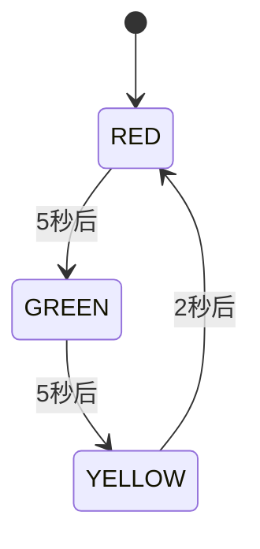
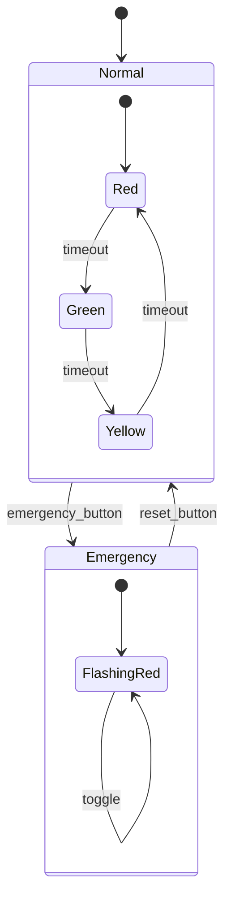

# 状态机设计模式实践教程


## 学习目标

完成本教程后，你将能够：

- [ ] 理解状态机的基本概念和工作原理
- [ ] 掌握有限状态机(FSM)的设计方法
- [ ] 学会使用C语言实现状态机
- [ ] 了解状态机在嵌入式系统中的典型应用场景
- [ ] 能够设计和实现一个完整的状态机系统

## 前置要求

在开始本教程之前，你需要：

**知识要求**：
- 熟悉C语言基础语法
- 了解函数指针的概念
- 理解switch-case语句的使用
- 掌握基本的程序设计思想

**技能要求**：
- 能够使用IDE编写和调试C代码
- 会画简单的状态转换图
- 具备基本的逻辑思维能力

## 准备工作

### 硬件准备

| 名称 | 数量 | 说明 | 参考链接 |
|------|------|------|----------|
| STM32开发板 | 1 | STM32F103或F4系列 | - |
| LED灯 | 3 | 红、黄、绿各一个 | - |
| 按键 | 2 | 用于触发状态转换 | - |
| 电阻 | 3 | 220Ω限流电阻 | - |
| 面包板 | 1 | 用于电路连接 | - |
| 杜邦线 | 若干 | 连接线 | - |

### 软件准备

- **开发环境**：Keil MDK 或 STM32CubeIDE
- **编译器**：ARM GCC 或 ARMCC
- **调试工具**：ST-Link调试器
- **辅助工具**：串口调试助手

### 环境配置

1. 安装开发环境（Keil MDK或STM32CubeIDE）
2. 配置编译工具链
3. 安装ST-Link驱动程序
4. 测试开发板连接是否正常


## 状态机基础理论

### 什么是状态机

状态机(State Machine)，也称为有限状态机(Finite State Machine, FSM)，是一种数学模型，用于描述系统在不同状态之间的转换行为。

**核心概念**：
- **状态(State)**：系统在某一时刻的工作模式或条件
- **事件(Event)**：触发状态转换的条件或输入
- **转换(Transition)**：从一个状态到另一个状态的变化过程
- **动作(Action)**：状态转换时执行的操作

### 状态机的组成要素

一个完整的状态机包含以下要素：

1. **有限的状态集合**：系统可能处于的所有状态
2. **初始状态**：系统启动时的默认状态
3. **输入事件集合**：可能触发状态转换的所有事件
4. **状态转换规则**：定义在特定事件下如何从一个状态转换到另一个状态
5. **输出动作**：状态转换时执行的操作

### 状态机的类型

**Mealy状态机**：
- 输出取决于当前状态和输入
- 输出在状态转换时产生

**Moore状态机**：
- 输出仅取决于当前状态
- 输出在进入状态时产生

在嵌入式系统中，我们通常使用Moore状态机，因为它更容易实现和调试。


## 步骤1：设计交通信号灯状态机

我们将通过一个经典的交通信号灯例子来学习状态机的设计和实现。

### 1.1 需求分析

设计一个简单的交通信号灯系统：
- 红灯亮5秒
- 绿灯亮5秒
- 黄灯亮2秒
- 循环切换

### 1.2 状态定义

定义三个状态：

```c
// 状态枚举定义
typedef enum {
    STATE_RED,      // 红灯状态
    STATE_YELLOW,   // 黄灯状态
    STATE_GREEN     // 绿灯状态
} TrafficLightState;
```

### 1.3 绘制状态转换图

使用Mermaid绘制状态转换图：



**状态转换规则**：
- 红灯 → 绿灯：定时器超时(5秒)
- 绿灯 → 黄灯：定时器超时(5秒)
- 黄灯 → 红灯：定时器超时(2秒)

### 1.4 定义事件

```c
// 事件枚举定义
typedef enum {
    EVENT_TIMEOUT,   // 定时器超时事件
    EVENT_NONE       // 无事件
} TrafficLightEvent;
```


## 步骤2：实现基于Switch-Case的状态机

### 2.1 创建项目结构

创建以下文件：
- `traffic_light.h` - 头文件
- `traffic_light.c` - 实现文件
- `main.c` - 主程序

### 2.2 定义状态机结构

在 `traffic_light.h` 中定义：

```c
#ifndef TRAFFIC_LIGHT_H
#define TRAFFIC_LIGHT_H

#include <stdint.h>
#include <stdbool.h>

// 状态枚举
typedef enum {
    STATE_RED,
    STATE_YELLOW,
    STATE_GREEN
} TrafficLightState;

// 事件枚举
typedef enum {
    EVENT_TIMEOUT,
    EVENT_NONE
} TrafficLightEvent;

// 状态机结构体
typedef struct {
    TrafficLightState current_state;  // 当前状态
    uint32_t timer;                   // 定时器计数
    uint32_t timeout;                 // 超时时间(ms)
} TrafficLightFSM;

// 函数声明
void traffic_light_init(TrafficLightFSM *fsm);
void traffic_light_update(TrafficLightFSM *fsm, uint32_t elapsed_time);
void traffic_light_handle_event(TrafficLightFSM *fsm, TrafficLightEvent event);

#endif // TRAFFIC_LIGHT_H
```

**代码说明**：
- `TrafficLightFSM`：状态机结构体，包含当前状态和定时器信息
- `current_state`：记录当前所处的状态
- `timer`：累计时间计数器
- `timeout`：当前状态的超时时间


### 2.3 实现状态机逻辑

在 `traffic_light.c` 中实现：

```c
#include "traffic_light.h"
#include <stdio.h>

// LED控制函数(需要根据实际硬件实现)
static void turn_on_red_led(void) {
    printf("红灯亮\n");
    // HAL_GPIO_WritePin(RED_LED_GPIO_Port, RED_LED_Pin, GPIO_PIN_SET);
}

static void turn_on_yellow_led(void) {
    printf("黄灯亮\n");
    // HAL_GPIO_WritePin(YELLOW_LED_GPIO_Port, YELLOW_LED_Pin, GPIO_PIN_SET);
}

static void turn_on_green_led(void) {
    printf("绿灯亮\n");
    // HAL_GPIO_WritePin(GREEN_LED_GPIO_Port, GREEN_LED_Pin, GPIO_PIN_SET);
}

static void turn_off_all_leds(void) {
    printf("所有灯熄灭\n");
    // HAL_GPIO_WritePin(RED_LED_GPIO_Port, RED_LED_Pin, GPIO_PIN_RESET);
    // HAL_GPIO_WritePin(YELLOW_LED_GPIO_Port, YELLOW_LED_Pin, GPIO_PIN_RESET);
    // HAL_GPIO_WritePin(GREEN_LED_GPIO_Port, GREEN_LED_Pin, GPIO_PIN_RESET);
}

/**
 * @brief  初始化状态机
 * @param  fsm: 状态机指针
 * @retval None
 */
void traffic_light_init(TrafficLightFSM *fsm) {
    fsm->current_state = STATE_RED;  // 初始状态为红灯
    fsm->timer = 0;
    fsm->timeout = 5000;  // 红灯持续5秒
    
    turn_off_all_leds();
    turn_on_red_led();
}

/**
 * @brief  更新状态机定时器
 * @param  fsm: 状态机指针
 * @param  elapsed_time: 经过的时间(ms)
 * @retval None
 */
void traffic_light_update(TrafficLightFSM *fsm, uint32_t elapsed_time) {
    fsm->timer += elapsed_time;
    
    // 检查是否超时
    if (fsm->timer >= fsm->timeout) {
        fsm->timer = 0;  // 重置定时器
        traffic_light_handle_event(fsm, EVENT_TIMEOUT);
    }
}
```

**代码说明**：
- `traffic_light_init()`：初始化状态机，设置初始状态为红灯
- `traffic_light_update()`：更新定时器，检查是否超时
- LED控制函数：控制硬件LED的开关（需要根据实际硬件实现）


### 2.4 实现事件处理函数

继续在 `traffic_light.c` 中添加：

```c
/**
 * @brief  处理状态机事件
 * @param  fsm: 状态机指针
 * @param  event: 事件类型
 * @retval None
 */
void traffic_light_handle_event(TrafficLightFSM *fsm, TrafficLightEvent event) {
    if (event != EVENT_TIMEOUT) {
        return;  // 只处理超时事件
    }
    
    // 根据当前状态处理事件
    switch (fsm->current_state) {
        case STATE_RED:
            // 红灯 -> 绿灯
            printf("状态转换: 红灯 -> 绿灯\n");
            turn_off_all_leds();
            turn_on_green_led();
            fsm->current_state = STATE_GREEN;
            fsm->timeout = 5000;  // 绿灯持续5秒
            break;
            
        case STATE_GREEN:
            // 绿灯 -> 黄灯
            printf("状态转换: 绿灯 -> 黄灯\n");
            turn_off_all_leds();
            turn_on_yellow_led();
            fsm->current_state = STATE_YELLOW;
            fsm->timeout = 2000;  // 黄灯持续2秒
            break;
            
        case STATE_YELLOW:
            // 黄灯 -> 红灯
            printf("状态转换: 黄灯 -> 红灯\n");
            turn_off_all_leds();
            turn_on_red_led();
            fsm->current_state = STATE_RED;
            fsm->timeout = 5000;  // 红灯持续5秒
            break;
            
        default:
            // 异常状态，重置为红灯
            printf("异常状态，重置为红灯\n");
            traffic_light_init(fsm);
            break;
    }
}
```

**代码说明**：
- 使用`switch-case`语句根据当前状态处理事件
- 每个状态转换时：
  1. 打印状态转换信息（调试用）
  2. 关闭所有LED
  3. 点亮对应的LED
  4. 更新当前状态
  5. 设置新状态的超时时间
- 包含异常处理，防止进入未定义状态


### 2.5 编写主程序

在 `main.c` 中：

```c
#include "traffic_light.h"
#include <stdio.h>
#include <unistd.h>  // 用于sleep函数

int main(void) {
    TrafficLightFSM traffic_light;
    
    printf("交通信号灯状态机示例\n");
    printf("====================\n\n");
    
    // 初始化状态机
    traffic_light_init(&traffic_light);
    
    // 主循环
    while (1) {
        // 模拟100ms的时间流逝
        usleep(100000);  // 100ms
        
        // 更新状态机
        traffic_light_update(&traffic_light, 100);
    }
    
    return 0;
}
```

**代码说明**：
- 创建状态机实例
- 初始化状态机
- 在主循环中：
  - 模拟时间流逝（100ms）
  - 调用`traffic_light_update()`更新状态机
- 状态机会自动处理状态转换

**预期输出**：
```
交通信号灯状态机示例
====================

红灯亮
状态转换: 红灯 -> 绿灯
所有灯熄灭
绿灯亮
状态转换: 绿灯 -> 黄灯
所有灯熄灭
黄灯亮
状态转换: 黄灯 -> 红灯
所有灯熄灭
红灯亮
...
```


## 步骤3：实现基于状态表的状态机

基于Switch-Case的实现简单直观，但当状态和事件增多时，代码会变得冗长。我们可以使用状态表(State Table)来优化。

### 3.1 定义状态表结构

```c
// 状态转换函数指针类型
typedef void (*StateAction)(void);

// 状态转换表项
typedef struct {
    TrafficLightState current_state;  // 当前状态
    TrafficLightEvent event;          // 触发事件
    TrafficLightState next_state;     // 下一个状态
    StateAction action;               // 转换时执行的动作
    uint32_t timeout;                 // 新状态的超时时间
} StateTransition;
```

### 3.2 定义状态转换动作

```c
// 进入红灯状态的动作
static void enter_red_state(void) {
    turn_off_all_leds();
    turn_on_red_led();
    printf("进入红灯状态\n");
}

// 进入绿灯状态的动作
static void enter_green_state(void) {
    turn_off_all_leds();
    turn_on_green_led();
    printf("进入绿灯状态\n");
}

// 进入黄灯状态的动作
static void enter_yellow_state(void) {
    turn_off_all_leds();
    turn_on_yellow_led();
    printf("进入黄灯状态\n");
}
```

### 3.3 创建状态转换表

```c
// 状态转换表
static const StateTransition state_table[] = {
    // 当前状态      事件           下一状态        动作函数          超时时间
    {STATE_RED,     EVENT_TIMEOUT, STATE_GREEN,   enter_green_state,  5000},
    {STATE_GREEN,   EVENT_TIMEOUT, STATE_YELLOW,  enter_yellow_state, 2000},
    {STATE_YELLOW,  EVENT_TIMEOUT, STATE_RED,     enter_red_state,    5000},
};

#define STATE_TABLE_SIZE (sizeof(state_table) / sizeof(state_table[0]))
```

**代码说明**：
- 状态转换表是一个常量数组
- 每一行定义一个状态转换规则
- 包含：当前状态、触发事件、下一状态、执行动作、超时时间
- 使用宏定义计算表的大小


### 3.4 实现基于表的事件处理

```c
/**
 * @brief  基于状态表的事件处理
 * @param  fsm: 状态机指针
 * @param  event: 事件类型
 * @retval None
 */
void traffic_light_handle_event_table(TrafficLightFSM *fsm, TrafficLightEvent event) {
    // 遍历状态转换表
    for (uint32_t i = 0; i < STATE_TABLE_SIZE; i++) {
        // 查找匹配的转换规则
        if (state_table[i].current_state == fsm->current_state &&
            state_table[i].event == event) {
            
            // 执行转换动作
            if (state_table[i].action != NULL) {
                state_table[i].action();
            }
            
            // 更新状态
            fsm->current_state = state_table[i].next_state;
            fsm->timeout = state_table[i].timeout;
            
            return;  // 找到匹配规则，退出
        }
    }
    
    // 没有找到匹配的转换规则
    printf("警告: 未定义的状态转换 (状态=%d, 事件=%d)\n", 
           fsm->current_state, event);
}
```

**代码说明**：
- 遍历状态转换表，查找匹配的规则
- 匹配条件：当前状态和事件都相同
- 找到匹配规则后：
  1. 执行转换动作函数
  2. 更新到新状态
  3. 设置新状态的超时时间
- 如果没有找到匹配规则，输出警告信息

**优势**：
- 代码更简洁，易于维护
- 添加新状态只需在表中添加一行
- 状态转换逻辑一目了然
- 便于测试和验证


## 步骤4：添加按键控制功能

让我们扩展状态机，添加按键控制功能：按下按键可以手动切换到下一个状态。

### 4.1 添加新事件

```c
// 扩展事件枚举
typedef enum {
    EVENT_TIMEOUT,      // 定时器超时事件
    EVENT_BUTTON_PRESS, // 按键按下事件
    EVENT_NONE          // 无事件
} TrafficLightEvent;
```

### 4.2 更新状态转换表

```c
// 扩展的状态转换表
static const StateTransition state_table[] = {
    // 定时器超时转换
    {STATE_RED,     EVENT_TIMEOUT,      STATE_GREEN,   enter_green_state,  5000},
    {STATE_GREEN,   EVENT_TIMEOUT,      STATE_YELLOW,  enter_yellow_state, 2000},
    {STATE_YELLOW,  EVENT_TIMEOUT,      STATE_RED,     enter_red_state,    5000},
    
    // 按键手动转换
    {STATE_RED,     EVENT_BUTTON_PRESS, STATE_GREEN,   enter_green_state,  5000},
    {STATE_GREEN,   EVENT_BUTTON_PRESS, STATE_YELLOW,  enter_yellow_state, 2000},
    {STATE_YELLOW,  EVENT_BUTTON_PRESS, STATE_RED,     enter_red_state,    5000},
};
```

### 4.3 添加按键检测函数

```c
/**
 * @brief  检测按键是否按下
 * @retval true: 按键按下, false: 按键未按下
 */
bool is_button_pressed(void) {
    // 读取按键GPIO状态
    // return (HAL_GPIO_ReadPin(BUTTON_GPIO_Port, BUTTON_Pin) == GPIO_PIN_RESET);
    
    // 模拟按键检测（实际应用中需要实现防抖）
    static uint32_t last_check = 0;
    uint32_t current_time = HAL_GetTick();
    
    if (current_time - last_check > 1000) {  // 1秒检测一次
        last_check = current_time;
        // 这里可以添加实际的按键检测逻辑
        return false;
    }
    
    return false;
}
```

### 4.4 更新主循环

```c
int main(void) {
    TrafficLightFSM traffic_light;
    
    // 初始化
    traffic_light_init(&traffic_light);
    
    while (1) {
        // 检测按键
        if (is_button_pressed()) {
            printf("按键按下，手动切换状态\n");
            traffic_light_handle_event_table(&traffic_light, EVENT_BUTTON_PRESS);
            traffic_light.timer = 0;  // 重置定时器
        }
        
        // 更新定时器
        usleep(100000);  // 100ms
        traffic_light_update(&traffic_light, 100);
    }
    
    return 0;
}
```

**代码说明**：
- 在主循环中添加按键检测
- 按键按下时触发`EVENT_BUTTON_PRESS`事件
- 重置定时器，避免立即再次触发超时事件
- 状态转换表自动处理按键事件


## 步骤5：实现层次状态机

对于更复杂的系统，我们可以使用层次状态机(Hierarchical State Machine)，也称为状态图(Statechart)。

### 5.1 层次状态机概念

层次状态机允许状态嵌套，一个状态可以包含子状态：



### 5.2 定义层次状态

```c
// 主状态
typedef enum {
    MAIN_STATE_NORMAL,     // 正常模式
    MAIN_STATE_EMERGENCY   // 紧急模式
} MainState;

// 正常模式的子状态
typedef enum {
    NORMAL_STATE_RED,
    NORMAL_STATE_YELLOW,
    NORMAL_STATE_GREEN
} NormalSubState;

// 紧急模式的子状态
typedef enum {
    EMERGENCY_STATE_FLASHING_RED,
    EMERGENCY_STATE_OFF
} EmergencySubState;

// 层次状态机结构
typedef struct {
    MainState main_state;
    union {
        NormalSubState normal_sub_state;
        EmergencySubState emergency_sub_state;
    } sub_state;
    uint32_t timer;
    uint32_t timeout;
} HierarchicalFSM;
```

### 5.3 实现层次状态机逻辑

```c
/**
 * @brief  处理层次状态机事件
 * @param  fsm: 状态机指针
 * @param  event: 事件类型
 * @retval None
 */
void hierarchical_fsm_handle_event(HierarchicalFSM *fsm, TrafficLightEvent event) {
    // 首先处理主状态级别的事件
    if (event == EVENT_EMERGENCY) {
        // 切换到紧急模式
        fsm->main_state = MAIN_STATE_EMERGENCY;
        fsm->sub_state.emergency_sub_state = EMERGENCY_STATE_FLASHING_RED;
        printf("进入紧急模式\n");
        return;
    }
    
    if (event == EVENT_RESET && fsm->main_state == MAIN_STATE_EMERGENCY) {
        // 从紧急模式返回正常模式
        fsm->main_state = MAIN_STATE_NORMAL;
        fsm->sub_state.normal_sub_state = NORMAL_STATE_RED;
        printf("返回正常模式\n");
        return;
    }
    
    // 根据主状态处理子状态事件
    switch (fsm->main_state) {
        case MAIN_STATE_NORMAL:
            handle_normal_state(fsm, event);
            break;
            
        case MAIN_STATE_EMERGENCY:
            handle_emergency_state(fsm, event);
            break;
    }
}

// 处理正常模式的子状态
static void handle_normal_state(HierarchicalFSM *fsm, TrafficLightEvent event) {
    if (event != EVENT_TIMEOUT) return;
    
    switch (fsm->sub_state.normal_sub_state) {
        case NORMAL_STATE_RED:
            fsm->sub_state.normal_sub_state = NORMAL_STATE_GREEN;
            enter_green_state();
            break;
        case NORMAL_STATE_GREEN:
            fsm->sub_state.normal_sub_state = NORMAL_STATE_YELLOW;
            enter_yellow_state();
            break;
        case NORMAL_STATE_YELLOW:
            fsm->sub_state.normal_sub_state = NORMAL_STATE_RED;
            enter_red_state();
            break;
    }
}

// 处理紧急模式的子状态
static void handle_emergency_state(HierarchicalFSM *fsm, TrafficLightEvent event) {
    if (event != EVENT_TIMEOUT) return;
    
    // 红灯闪烁
    if (fsm->sub_state.emergency_sub_state == EMERGENCY_STATE_FLASHING_RED) {
        fsm->sub_state.emergency_sub_state = EMERGENCY_STATE_OFF;
        turn_off_all_leds();
    } else {
        fsm->sub_state.emergency_sub_state = EMERGENCY_STATE_FLASHING_RED;
        turn_on_red_led();
    }
}
```

**代码说明**：
- 层次状态机有两层：主状态和子状态
- 主状态处理模式切换（正常/紧急）
- 子状态处理各模式内的状态转换
- 使用union节省内存（同一时间只有一个子状态有效）


## 步骤6：测试和验证

### 6.1 编译项目

使用GCC编译：

```bash
gcc -o traffic_light main.c traffic_light.c -I.
```

或在Keil/STM32CubeIDE中点击编译按钮。

### 6.2 运行测试

运行程序：

```bash
./traffic_light
```

**预期行为**：
- 程序启动后，红灯亮5秒
- 自动切换到绿灯，持续5秒
- 切换到黄灯，持续2秒
- 循环往复

### 6.3 功能测试清单

- [ ] 状态机正确初始化为红灯状态
- [ ] 红灯持续5秒后自动切换到绿灯
- [ ] 绿灯持续5秒后自动切换到黄灯
- [ ] 黄灯持续2秒后自动切换到红灯
- [ ] 按键按下时能手动切换状态
- [ ] 紧急模式下红灯闪烁
- [ ] 能从紧急模式返回正常模式

### 6.4 调试技巧

**添加状态日志**：

```c
void print_state_info(TrafficLightFSM *fsm) {
    const char *state_names[] = {"RED", "YELLOW", "GREEN"};
    printf("[状态机] 当前状态: %s, 定时器: %u/%u ms\n",
           state_names[fsm->current_state],
           fsm->timer,
           fsm->timeout);
}
```

**使用断言验证状态**：

```c
#include <assert.h>

void validate_state(TrafficLightFSM *fsm) {
    // 确保状态在有效范围内
    assert(fsm->current_state >= STATE_RED && 
           fsm->current_state <= STATE_GREEN);
    
    // 确保超时时间合理
    assert(fsm->timeout > 0 && fsm->timeout <= 10000);
}
```


## 故障排除

### 问题1：状态不切换

**可能原因**：
- 定时器未正确更新
- 超时时间设置错误
- 事件处理函数未被调用

**解决方法**：
1. 添加调试输出，检查定时器值
2. 验证`traffic_light_update()`是否被周期性调用
3. 检查超时时间是否合理

```c
// 调试代码
printf("Timer: %u, Timeout: %u\n", fsm->timer, fsm->timeout);
```

### 问题2：状态转换混乱

**可能原因**：
- 状态转换表定义错误
- 多个事件同时触发
- 状态变量被意外修改

**解决方法**：
1. 检查状态转换表的定义
2. 添加事件队列，避免事件冲突
3. 使用`const`保护状态转换表

### 问题3：LED不亮或闪烁异常

**可能原因**：
- GPIO配置错误
- LED连接错误
- 电源问题

**解决方法**：
1. 检查GPIO初始化代码
2. 用万用表测试引脚电压
3. 检查LED极性和限流电阻

### 问题4：按键无响应

**可能原因**：
- 按键未正确配置
- 缺少防抖处理
- 按键检测逻辑错误

**解决方法**：
1. 检查按键GPIO配置
2. 添加软件防抖
3. 使用示波器检查按键信号

```c
// 简单的软件防抖
bool debounce_button(void) {
    static uint32_t last_press = 0;
    uint32_t current_time = HAL_GetTick();
    
    if (HAL_GPIO_ReadPin(BUTTON_GPIO_Port, BUTTON_Pin) == GPIO_PIN_RESET) {
        if (current_time - last_press > 200) {  // 200ms防抖
            last_press = current_time;
            return true;
        }
    }
    return false;
}
```


## 状态机设计最佳实践

### 1. 状态设计原则

**单一职责**：
- 每个状态应该有明确的职责
- 避免在一个状态中处理过多逻辑

**完备性**：
- 考虑所有可能的状态
- 为每个状态定义所有可能的事件处理

**互斥性**：
- 确保同一时间只处于一个状态
- 避免状态重叠或模糊

### 2. 事件处理原则

**原子性**：
- 状态转换应该是原子操作
- 避免在转换过程中被中断

**确定性**：
- 相同的状态和事件应该产生相同的结果
- 避免随机或不确定的行为

**及时性**：
- 事件应该被及时处理
- 避免事件丢失或延迟

### 3. 代码组织建议

**模块化**：
```c
// 将状态机封装为独立模块
// state_machine.h - 接口
// state_machine.c - 实现
// state_machine_config.h - 配置
```

**可配置性**：
```c
// 使用配置文件或宏定义
#define RED_LIGHT_DURATION    5000
#define GREEN_LIGHT_DURATION  5000
#define YELLOW_LIGHT_DURATION 2000
```

**可测试性**：
```c
// 提供测试接口
void fsm_inject_event(FSM *fsm, Event event);
State fsm_get_current_state(FSM *fsm);
```

### 4. 性能优化

**减少状态转换开销**：
- 使用状态表而不是多层if-else
- 缓存常用的状态转换

**优化定时器**：
- 使用硬件定时器而不是软件延时
- 合并多个定时器

**内存优化**：
- 使用位域存储状态
- 共享状态机实例

```c
// 使用位域节省内存
typedef struct {
    uint8_t current_state : 3;  // 最多8个状态
    uint8_t reserved : 5;
    uint32_t timer;
} CompactFSM;
```


## 实际应用场景

### 1. 通信协议处理

状态机非常适合处理通信协议：

```c
// UART通信协议状态机
typedef enum {
    UART_STATE_IDLE,        // 空闲状态
    UART_STATE_RECEIVING,   // 接收数据
    UART_STATE_PROCESSING,  // 处理数据
    UART_STATE_SENDING      // 发送响应
} UartState;

// 协议事件
typedef enum {
    UART_EVENT_START_BYTE,  // 接收到起始字节
    UART_EVENT_DATA_BYTE,   // 接收到数据字节
    UART_EVENT_END_BYTE,    // 接收到结束字节
    UART_EVENT_TIMEOUT      // 超时
} UartEvent;
```

### 2. 电源管理

管理系统的电源状态：

```c
// 电源管理状态
typedef enum {
    POWER_STATE_ACTIVE,     // 活动状态
    POWER_STATE_IDLE,       // 空闲状态
    POWER_STATE_SLEEP,      // 睡眠状态
    POWER_STATE_DEEP_SLEEP  // 深度睡眠
} PowerState;

// 电源事件
typedef enum {
    POWER_EVENT_ACTIVITY,   // 检测到活动
    POWER_EVENT_IDLE_TIMEOUT,  // 空闲超时
    POWER_EVENT_WAKEUP      // 唤醒信号
} PowerEvent;
```

### 3. 用户界面导航

管理菜单系统：

```c
// 菜单状态
typedef enum {
    MENU_STATE_MAIN,        // 主菜单
    MENU_STATE_SETTINGS,    // 设置菜单
    MENU_STATE_ABOUT,       // 关于页面
    MENU_STATE_CONFIRM      // 确认对话框
} MenuState;

// 菜单事件
typedef enum {
    MENU_EVENT_UP,          // 向上
    MENU_EVENT_DOWN,        // 向下
    MENU_EVENT_SELECT,      // 选择
    MENU_EVENT_BACK         // 返回
} MenuEvent;
```

### 4. 设备控制

控制复杂设备的工作流程：

```c
// 洗衣机状态
typedef enum {
    WASH_STATE_IDLE,        // 待机
    WASH_STATE_FILLING,     // 注水
    WASH_STATE_WASHING,     // 洗涤
    WASH_STATE_RINSING,     // 漂洗
    WASH_STATE_SPINNING,    // 脱水
    WASH_STATE_COMPLETE     // 完成
} WashState;
```


## 总结

通过本教程，你学习了：

- ✅ 状态机的基本概念和组成要素
- ✅ 如何设计状态转换图
- ✅ 使用Switch-Case实现简单状态机
- ✅ 使用状态表实现可扩展的状态机
- ✅ 实现层次状态机处理复杂逻辑
- ✅ 状态机的测试和调试方法
- ✅ 状态机设计的最佳实践
- ✅ 状态机在嵌入式系统中的实际应用

**关键要点**：

1. **状态机是管理复杂逻辑的有效工具**
   - 将复杂的控制逻辑分解为清晰的状态和转换
   - 使代码更易理解和维护

2. **选择合适的实现方式**
   - 简单系统：Switch-Case实现
   - 复杂系统：状态表或层次状态机
   - 根据需求权衡复杂度和灵活性

3. **注重可维护性**
   - 清晰的状态定义
   - 完整的状态转换规则
   - 充分的注释和文档

4. **考虑实际约束**
   - 内存限制
   - 实时性要求
   - 可靠性需求

## 进阶挑战

尝试以下挑战来巩固学习：

1. **挑战1：实现电梯控制系统**
   - 多个楼层状态
   - 上行/下行/停止状态
   - 开门/关门状态
   - 处理多个请求

2. **挑战2：实现自动售货机**
   - 待机、选择商品、支付、出货等状态
   - 处理投币、找零、退款
   - 库存管理

3. **挑战3：实现智能家居场景控制**
   - 回家、离家、睡眠、起床等场景
   - 根据场景自动控制灯光、空调、窗帘
   - 支持手动和自动切换

4. **挑战4：实现游戏角色状态机**
   - 站立、行走、跑步、跳跃、攻击等状态
   - 处理用户输入
   - 动画状态同步


## 完整代码

完整的项目代码可以在这里下载：

**GitHub仓库**：[traffic-light-state-machine](https://github.com/embedded-knowledge/traffic-light-fsm)

**文件结构**：
```
traffic-light-fsm/
├── src/
│   ├── traffic_light.h
│   ├── traffic_light.c
│   ├── main.c
│   └── hierarchical_fsm.c
├── examples/
│   ├── basic_example.c
│   ├── table_based_example.c
│   └── hierarchical_example.c
├── tests/
│   └── test_state_machine.c
├── docs/
│   └── state_diagram.png
├── Makefile
└── README.md
```

**编译说明**：
```bash
# Linux/Mac
make

# Windows (MinGW)
mingw32-make

# 运行
./traffic_light
```

## 下一步

建议继续学习：

- [观察者模式在嵌入式中的应用](05-observer-pattern.html) - 学习事件通知机制
- [工厂模式与单例模式](06-factory-singleton-patterns.html) - 学习对象创建模式
- [事件驱动架构设计](../intermediate/03-event-driven-architecture.html) - 深入学习事件驱动编程

## 参考资料

### 书籍
1. 《设计模式：可复用面向对象软件的基础》- Gang of Four
2. 《嵌入式系统设计模式》- Bruce Powel Douglass
3. 《UML状态机：面向对象设计的实用指南》- Miro Samek

### 在线资源
1. [State Pattern - Refactoring Guru](https://refactoring.guru/design-patterns/state)
2. [Quantum Leaps - State Machine Framework](https://www.state-machine.com/)
3. [Wikipedia - Finite State Machine](https://en.wikipedia.org/wiki/Finite-state_machine)

### 工具
1. **PlantUML** - 绘制状态图
2. **QM Tool** - 可视化状态机建模工具
3. **SMC (State Machine Compiler)** - 状态机代码生成器

---

**反馈**：如果你在学习过程中遇到问题或有改进建议，欢迎在评论区留言或提交Issue！

**版权声明**：本教程采用 [CC BY-NC-SA 4.0](https://creativecommons.org/licenses/by-nc-sa/4.0/) 许可协议。

