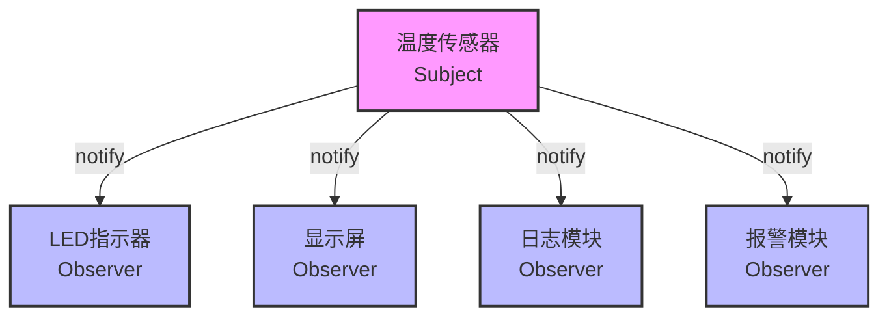

# 观察者模式在嵌入式系统中的应用


## 学习目标

完成本教程后，你将能够：

- [ ] 理解观察者模式的基本概念和工作原理
- [ ] 掌握发布-订阅(Pub-Sub)机制的设计方法
- [ ] 学会使用C语言实现观察者模式
- [ ] 了解观察者模式在嵌入式系统中的典型应用场景
- [ ] 能够设计和实现一个完整的事件通知系统

## 前置要求

在开始本教程之前，你需要：

**知识要求**：
- 熟悉C语言基础语法
- 了解函数指针的概念和使用
- 理解结构体和链表的基本操作
- 掌握基本的程序设计思想

**技能要求**：
- 能够使用IDE编写和调试C代码
- 会画简单的UML类图
- 具备基本的逻辑思维能力

## 准备工作

### 硬件准备

| 名称 | 数量 | 说明 | 参考链接 |
|------|------|------|----------|
| STM32开发板 | 1 | STM32F103或F4系列 | - |
| LED灯 | 3 | 用于显示状态 | - |
| 温度传感器 | 1 | DHT11或DS18B20 | - |
| 按键 | 2 | 用于触发事件 | - |
| OLED显示屏 | 1 | 0.96寸I2C接口(可选) | - |

### 软件准备

- **开发环境**：Keil MDK 或 STM32CubeIDE
- **编译器**：ARM GCC 或 ARMCC
- **调试工具**：ST-Link调试器
- **辅助工具**：串口调试助手

### 环境配置

1. 安装开发环境（Keil MDK或STM32CubeIDE）
2. 配置编译工具链
3. 安装ST-Link驱动程序
4. 测试开发板连接是否正常


## 观察者模式基础理论

### 什么是观察者模式

观察者模式(Observer Pattern)是一种行为设计模式，它定义了对象之间的一对多依赖关系，当一个对象的状态发生改变时，所有依赖于它的对象都会得到通知并自动更新。

**核心概念**：
- **主题(Subject)**：被观察的对象，维护观察者列表，状态改变时通知观察者
- **观察者(Observer)**：观察主题的对象，接收主题的通知并作出响应
- **通知(Notification)**：主题向观察者发送的状态变化消息
- **订阅(Subscribe)**：观察者注册到主题，表示希望接收通知
- **取消订阅(Unsubscribe)**：观察者从主题注销，不再接收通知

### 观察者模式的组成要素

一个完整的观察者模式包含以下要素：

1. **主题接口**：定义注册、注销和通知观察者的方法
2. **具体主题**：实现主题接口，维护观察者列表
3. **观察者接口**：定义更新方法，接收主题通知
4. **具体观察者**：实现观察者接口，定义具体的响应行为

### 观察者模式 vs 发布-订阅模式

**观察者模式**：
- 主题和观察者直接耦合
- 主题知道所有观察者
- 同步通知

**发布-订阅模式**：
- 发布者和订阅者通过事件总线解耦
- 发布者不知道订阅者
- 可以异步通知

在嵌入式系统中，我们通常使用发布-订阅模式的变体，因为它提供了更好的解耦性。

### 观察者模式的优缺点

**优点**：
- 降低耦合度：主题和观察者松耦合
- 支持广播通信：一对多通知
- 动态添加/删除观察者：运行时灵活配置
- 符合开闭原则：易于扩展新的观察者

**缺点**：
- 通知开销：观察者过多时性能下降
- 内存开销：需要维护观察者列表
- 可能导致循环依赖：观察者之间相互通知
- 调试困难：通知链路不直观


## 步骤1：设计温度监控系统

我们将通过一个温度监控系统来学习观察者模式的设计和实现。

### 1.1 需求分析

设计一个温度监控系统：
- 温度传感器定期读取温度值
- 多个模块需要响应温度变化：
  - LED指示器：温度过高时亮红灯
  - 显示屏：实时显示当前温度
  - 日志模块：记录温度历史
  - 报警模块：温度异常时发出警报

### 1.2 系统架构设计

使用Mermaid绘制系统架构图：



**设计要点**：
- 温度传感器作为主题(Subject)
- 各个功能模块作为观察者(Observer)
- 温度变化时，传感器通知所有观察者
- 观察者独立响应，互不影响

### 1.3 定义数据结构

```c
// 温度数据结构
typedef struct {
    float temperature;      // 当前温度(℃)
    uint32_t timestamp;     // 时间戳
    bool is_valid;          // 数据是否有效
} TemperatureData;

// 观察者回调函数类型
typedef void (*ObserverCallback)(const TemperatureData *data, void *context);

// 观察者节点
typedef struct ObserverNode {
    ObserverCallback callback;      // 回调函数
    void *context;                  // 上下文数据
    struct ObserverNode *next;      // 下一个观察者
} ObserverNode;

// 主题(温度传感器)
typedef struct {
    TemperatureData current_data;   // 当前温度数据
    ObserverNode *observers;        // 观察者链表
    uint32_t observer_count;        // 观察者数量
} TemperatureSensor;
```

**代码说明**：
- `TemperatureData`：温度数据结构，包含温度值、时间戳和有效性标志
- `ObserverCallback`：观察者回调函数类型，接收温度数据和上下文
- `ObserverNode`：观察者节点，使用链表组织
- `TemperatureSensor`：主题结构，维护当前数据和观察者列表


## 步骤2：实现基础观察者模式

### 2.1 创建项目结构

创建以下文件：
- `observer.h` - 观察者模式接口
- `temperature_sensor.h` - 温度传感器头文件
- `temperature_sensor.c` - 温度传感器实现
- `observers.c` - 具体观察者实现
- `main.c` - 主程序

### 2.2 定义观察者接口

在 `observer.h` 中定义：

```c
#ifndef OBSERVER_H
#define OBSERVER_H

#include <stdint.h>
#include <stdbool.h>

// 温度数据结构
typedef struct {
    float temperature;
    uint32_t timestamp;
    bool is_valid;
} TemperatureData;

// 观察者回调函数类型
typedef void (*ObserverCallback)(const TemperatureData *data, void *context);

// 观察者节点
typedef struct ObserverNode {
    ObserverCallback callback;
    void *context;
    struct ObserverNode *next;
} ObserverNode;

#endif // OBSERVER_H
```

### 2.3 实现温度传感器(主题)

在 `temperature_sensor.h` 中定义：

```c
#ifndef TEMPERATURE_SENSOR_H
#define TEMPERATURE_SENSOR_H

#include "observer.h"

// 温度传感器结构
typedef struct {
    TemperatureData current_data;
    ObserverNode *observers;
    uint32_t observer_count;
} TemperatureSensor;

// 初始化传感器
void temp_sensor_init(TemperatureSensor *sensor);

// 注册观察者
bool temp_sensor_attach(TemperatureSensor *sensor, 
                        ObserverCallback callback, 
                        void *context);

// 注销观察者
bool temp_sensor_detach(TemperatureSensor *sensor, 
                        ObserverCallback callback);

// 通知所有观察者
void temp_sensor_notify(TemperatureSensor *sensor);

// 更新温度值
void temp_sensor_update(TemperatureSensor *sensor, float temperature);

// 获取观察者数量
uint32_t temp_sensor_get_observer_count(TemperatureSensor *sensor);

#endif // TEMPERATURE_SENSOR_H
```


### 2.4 实现主题方法

在 `temperature_sensor.c` 中实现：

```c
#include "temperature_sensor.h"
#include <stdlib.h>
#include <stdio.h>
#include <string.h>

/**
 * @brief  初始化温度传感器
 * @param  sensor: 传感器指针
 * @retval None
 */
void temp_sensor_init(TemperatureSensor *sensor) {
    if (sensor == NULL) return;
    
    memset(sensor, 0, sizeof(TemperatureSensor));
    sensor->current_data.is_valid = false;
    sensor->observers = NULL;
    sensor->observer_count = 0;
    
    printf("[传感器] 初始化完成\n");
}

/**
 * @brief  注册观察者
 * @param  sensor: 传感器指针
 * @param  callback: 回调函数
 * @param  context: 上下文数据
 * @retval true: 成功, false: 失败
 */
bool temp_sensor_attach(TemperatureSensor *sensor, 
                        ObserverCallback callback, 
                        void *context) {
    if (sensor == NULL || callback == NULL) {
        return false;
    }
    
    // 创建新的观察者节点
    ObserverNode *new_node = (ObserverNode *)malloc(sizeof(ObserverNode));
    if (new_node == NULL) {
        printf("[传感器] 内存分配失败\n");
        return false;
    }
    
    // 初始化节点
    new_node->callback = callback;
    new_node->context = context;
    new_node->next = NULL;
    
    // 添加到链表头部
    if (sensor->observers == NULL) {
        sensor->observers = new_node;
    } else {
        new_node->next = sensor->observers;
        sensor->observers = new_node;
    }
    
    sensor->observer_count++;
    printf("[传感器] 观察者已注册 (总数: %u)\n", sensor->observer_count);
    
    return true;
}

/**
 * @brief  注销观察者
 * @param  sensor: 传感器指针
 * @param  callback: 回调函数
 * @retval true: 成功, false: 失败
 */
bool temp_sensor_detach(TemperatureSensor *sensor, 
                        ObserverCallback callback) {
    if (sensor == NULL || callback == NULL) {
        return false;
    }
    
    ObserverNode *current = sensor->observers;
    ObserverNode *previous = NULL;
    
    // 遍历链表查找匹配的观察者
    while (current != NULL) {
        if (current->callback == callback) {
            // 找到匹配的观察者，从链表中移除
            if (previous == NULL) {
                // 移除头节点
                sensor->observers = current->next;
            } else {
                // 移除中间或尾节点
                previous->next = current->next;
            }
            
            free(current);
            sensor->observer_count--;
            printf("[传感器] 观察者已注销 (总数: %u)\n", sensor->observer_count);
            return true;
        }
        
        previous = current;
        current = current->next;
    }
    
    printf("[传感器] 未找到要注销的观察者\n");
    return false;
}
```

**代码说明**：
- `temp_sensor_init()`：初始化传感器，清空观察者列表
- `temp_sensor_attach()`：注册新观察者，添加到链表头部
- `temp_sensor_detach()`：注销观察者，从链表中移除并释放内存
- 使用链表管理观察者，支持动态添加和删除


### 2.5 实现通知机制

继续在 `temperature_sensor.c` 中添加：

```c
/**
 * @brief  通知所有观察者
 * @param  sensor: 传感器指针
 * @retval None
 */
void temp_sensor_notify(TemperatureSensor *sensor) {
    if (sensor == NULL) return;
    
    printf("[传感器] 开始通知观察者 (温度: %.1f℃)\n", 
           sensor->current_data.temperature);
    
    // 遍历观察者链表，调用每个观察者的回调函数
    ObserverNode *current = sensor->observers;
    uint32_t notified_count = 0;
    
    while (current != NULL) {
        if (current->callback != NULL) {
            // 调用观察者的回调函数
            current->callback(&sensor->current_data, current->context);
            notified_count++;
        }
        current = current->next;
    }
    
    printf("[传感器] 通知完成 (已通知: %u个观察者)\n", notified_count);
}

/**
 * @brief  更新温度值
 * @param  sensor: 传感器指针
 * @param  temperature: 新的温度值
 * @retval None
 */
void temp_sensor_update(TemperatureSensor *sensor, float temperature) {
    if (sensor == NULL) return;
    
    // 更新温度数据
    sensor->current_data.temperature = temperature;
    sensor->current_data.timestamp = HAL_GetTick();  // 获取系统时间戳
    sensor->current_data.is_valid = true;
    
    printf("[传感器] 温度更新: %.1f℃\n", temperature);
    
    // 通知所有观察者
    temp_sensor_notify(sensor);
}

/**
 * @brief  获取观察者数量
 * @param  sensor: 传感器指针
 * @retval 观察者数量
 */
uint32_t temp_sensor_get_observer_count(TemperatureSensor *sensor) {
    if (sensor == NULL) return 0;
    return sensor->observer_count;
}
```

**代码说明**：
- `temp_sensor_notify()`：遍历观察者链表，调用每个观察者的回调函数
- `temp_sensor_update()`：更新温度值，然后自动通知所有观察者
- `temp_sensor_get_observer_count()`：获取当前注册的观察者数量
- 通知是同步的，按照链表顺序依次调用


## 步骤3：实现具体观察者

### 3.1 LED指示器观察者

在 `observers.c` 中实现：

```c
#include "observer.h"
#include <stdio.h>

// LED指示器上下文
typedef struct {
    float threshold_high;   // 高温阈值
    float threshold_low;    // 低温阈值
    bool led_state;         // LED状态
} LEDContext;

/**
 * @brief  LED指示器观察者回调函数
 * @param  data: 温度数据
 * @param  context: LED上下文
 * @retval None
 */
void led_observer_callback(const TemperatureData *data, void *context) {
    if (data == NULL || !data->is_valid || context == NULL) {
        return;
    }
    
    LEDContext *led_ctx = (LEDContext *)context;
    
    printf("  [LED指示器] 收到通知: %.1f℃\n", data->temperature);
    
    // 根据温度控制LED
    if (data->temperature > led_ctx->threshold_high) {
        // 温度过高，亮红灯
        printf("  [LED指示器] 温度过高！红灯亮\n");
        led_ctx->led_state = true;
        // HAL_GPIO_WritePin(RED_LED_GPIO_Port, RED_LED_Pin, GPIO_PIN_SET);
    } else if (data->temperature < led_ctx->threshold_low) {
        // 温度过低，亮蓝灯
        printf("  [LED指示器] 温度过低！蓝灯亮\n");
        led_ctx->led_state = true;
        // HAL_GPIO_WritePin(BLUE_LED_GPIO_Port, BLUE_LED_Pin, GPIO_PIN_SET);
    } else {
        // 温度正常，绿灯亮
        printf("  [LED指示器] 温度正常，绿灯亮\n");
        led_ctx->led_state = false;
        // HAL_GPIO_WritePin(GREEN_LED_GPIO_Port, GREEN_LED_Pin, GPIO_PIN_SET);
    }
}
```

**代码说明**：
- `LEDContext`：LED观察者的上下文数据，包含温度阈值和LED状态
- `led_observer_callback()`：LED观察者的回调函数
- 根据温度值控制不同颜色的LED
- 实际应用中需要调用HAL库函数控制GPIO

### 3.2 显示屏观察者

继续在 `observers.c` 中添加：

```c
// 显示屏上下文
typedef struct {
    char display_buffer[32];  // 显示缓冲区
    uint32_t update_count;    // 更新次数
} DisplayContext;

/**
 * @brief  显示屏观察者回调函数
 * @param  data: 温度数据
 * @param  context: 显示屏上下文
 * @retval None
 */
void display_observer_callback(const TemperatureData *data, void *context) {
    if (data == NULL || !data->is_valid || context == NULL) {
        return;
    }
    
    DisplayContext *disp_ctx = (DisplayContext *)context;
    
    printf("  [显示屏] 收到通知: %.1f℃\n", data->temperature);
    
    // 格式化显示内容
    snprintf(disp_ctx->display_buffer, sizeof(disp_ctx->display_buffer),
             "Temp: %.1f C", data->temperature);
    
    disp_ctx->update_count++;
    
    printf("  [显示屏] 更新显示: %s (第%u次更新)\n", 
           disp_ctx->display_buffer, disp_ctx->update_count);
    
    // 实际应用中需要调用OLED显示函数
    // OLED_ShowString(0, 0, disp_ctx->display_buffer);
}
```

**代码说明**：
- `DisplayContext`：显示屏观察者的上下文数据
- `display_observer_callback()`：显示屏观察者的回调函数
- 格式化温度数据并更新显示
- 记录更新次数用于调试


### 3.3 日志模块观察者

继续在 `observers.c` 中添加：

```c
// 日志模块上下文
typedef struct {
    uint32_t log_count;       // 日志条数
    float max_temp;           // 最高温度
    float min_temp;           // 最低温度
} LoggerContext;

/**
 * @brief  日志模块观察者回调函数
 * @param  data: 温度数据
 * @param  context: 日志上下文
 * @retval None
 */
void logger_observer_callback(const TemperatureData *data, void *context) {
    if (data == NULL || !data->is_valid || context == NULL) {
        return;
    }
    
    LoggerContext *log_ctx = (LoggerContext *)context;
    
    printf("  [日志模块] 收到通知: %.1f℃\n", data->temperature);
    
    // 记录日志
    printf("  [日志模块] [%u] 温度: %.1f℃\n", 
           data->timestamp, data->temperature);
    
    // 更新统计信息
    if (log_ctx->log_count == 0) {
        log_ctx->max_temp = data->temperature;
        log_ctx->min_temp = data->temperature;
    } else {
        if (data->temperature > log_ctx->max_temp) {
            log_ctx->max_temp = data->temperature;
        }
        if (data->temperature < log_ctx->min_temp) {
            log_ctx->min_temp = data->temperature;
        }
    }
    
    log_ctx->log_count++;
    
    printf("  [日志模块] 统计: 最高%.1f℃, 最低%.1f℃, 共%u条记录\n",
           log_ctx->max_temp, log_ctx->min_temp, log_ctx->log_count);
}
```

### 3.4 报警模块观察者

继续在 `observers.c` 中添加：

```c
// 报警模块上下文
typedef struct {
    float alarm_threshold;    // 报警阈值
    bool alarm_active;        // 报警状态
    uint32_t alarm_count;     // 报警次数
} AlarmContext;

/**
 * @brief  报警模块观察者回调函数
 * @param  data: 温度数据
 * @param  context: 报警上下文
 * @retval None
 */
void alarm_observer_callback(const TemperatureData *data, void *context) {
    if (data == NULL || !data->is_valid || context == NULL) {
        return;
    }
    
    AlarmContext *alarm_ctx = (AlarmContext *)context;
    
    printf("  [报警模块] 收到通知: %.1f℃\n", data->temperature);
    
    // 检查是否需要报警
    if (data->temperature > alarm_ctx->alarm_threshold) {
        if (!alarm_ctx->alarm_active) {
            // 触发报警
            printf("  [报警模块] ⚠️  警告！温度超过阈值！\n");
            printf("  [报警模块] 当前: %.1f℃, 阈值: %.1f℃\n",
                   data->temperature, alarm_ctx->alarm_threshold);
            
            alarm_ctx->alarm_active = true;
            alarm_ctx->alarm_count++;
            
            // 实际应用中可以触发蜂鸣器或发送通知
            // HAL_GPIO_WritePin(BUZZER_GPIO_Port, BUZZER_Pin, GPIO_PIN_SET);
        }
    } else {
        if (alarm_ctx->alarm_active) {
            // 解除报警
            printf("  [报警模块] ✓ 温度恢复正常，解除报警\n");
            alarm_ctx->alarm_active = false;
            
            // HAL_GPIO_WritePin(BUZZER_GPIO_Port, BUZZER_Pin, GPIO_PIN_RESET);
        }
    }
}
```

**代码说明**：
- 每个观察者都有自己的上下文数据结构
- 观察者独立处理温度数据，互不影响
- 可以根据需要添加或删除观察者
- 实际应用中需要实现具体的硬件控制代码


## 步骤4：编写主程序

### 4.1 主程序实现

在 `main.c` 中：

```c
#include "temperature_sensor.h"
#include "observers.h"
#include <stdio.h>
#include <unistd.h>

// 模拟读取温度传感器
float read_temperature_sensor(void) {
    // 实际应用中需要读取真实的传感器
    // 这里模拟温度在20-35℃之间变化
    static float temp = 20.0f;
    temp += (rand() % 30 - 10) / 10.0f;  // 随机变化±1℃
    
    // 限制温度范围
    if (temp < 15.0f) temp = 15.0f;
    if (temp > 40.0f) temp = 40.0f;
    
    return temp;
}

int main(void) {
    printf("========================================\n");
    printf("  观察者模式 - 温度监控系统示例\n");
    printf("========================================\n\n");
    
    // 1. 创建温度传感器(主题)
    TemperatureSensor sensor;
    temp_sensor_init(&sensor);
    
    // 2. 创建观察者上下文
    LEDContext led_ctx = {
        .threshold_high = 30.0f,
        .threshold_low = 18.0f,
        .led_state = false
    };
    
    DisplayContext disp_ctx = {
        .display_buffer = {0},
        .update_count = 0
    };
    
    LoggerContext log_ctx = {
        .log_count = 0,
        .max_temp = 0.0f,
        .min_temp = 0.0f
    };
    
    AlarmContext alarm_ctx = {
        .alarm_threshold = 32.0f,
        .alarm_active = false,
        .alarm_count = 0
    };
    
    // 3. 注册观察者
    printf("\n--- 注册观察者 ---\n");
    temp_sensor_attach(&sensor, led_observer_callback, &led_ctx);
    temp_sensor_attach(&sensor, display_observer_callback, &disp_ctx);
    temp_sensor_attach(&sensor, logger_observer_callback, &log_ctx);
    temp_sensor_attach(&sensor, alarm_observer_callback, &alarm_ctx);
    
    printf("\n当前观察者数量: %u\n", 
           temp_sensor_get_observer_count(&sensor));
    
    // 4. 模拟温度变化
    printf("\n--- 开始监控温度 ---\n");
    for (int i = 0; i < 10; i++) {
        printf("\n=== 第 %d 次测量 ===\n", i + 1);
        
        // 读取温度
        float temperature = read_temperature_sensor();
        
        // 更新温度(会自动通知所有观察者)
        temp_sensor_update(&sensor, temperature);
        
        // 延时1秒
        sleep(1);
    }
    
    // 5. 演示动态注销观察者
    printf("\n--- 注销LED观察者 ---\n");
    temp_sensor_detach(&sensor, led_observer_callback);
    
    printf("\n当前观察者数量: %u\n", 
           temp_sensor_get_observer_count(&sensor));
    
    // 6. 再次更新温度
    printf("\n=== 注销后的测量 ===\n");
    float temperature = read_temperature_sensor();
    temp_sensor_update(&sensor, temperature);
    
    printf("\n========================================\n");
    printf("  监控结束\n");
    printf("========================================\n");
    
    return 0;
}
```

**代码说明**：
- 创建温度传感器实例
- 创建各个观察者的上下文数据
- 注册所有观察者到传感器
- 模拟温度变化，每次更新都会通知所有观察者
- 演示动态注销观察者的功能


### 4.2 编译和运行

使用GCC编译：

```bash
gcc -o temp_monitor main.c temperature_sensor.c observers.c -I.
```

运行程序：

```bash
./temp_monitor
```

**预期输出**：

```
========================================
  观察者模式 - 温度监控系统示例
========================================

[传感器] 初始化完成

--- 注册观察者 ---
[传感器] 观察者已注册 (总数: 1)
[传感器] 观察者已注册 (总数: 2)
[传感器] 观察者已注册 (总数: 3)
[传感器] 观察者已注册 (总数: 4)

当前观察者数量: 4

--- 开始监控温度 ---

=== 第 1 次测量 ===
[传感器] 温度更新: 22.5℃
[传感器] 开始通知观察者 (温度: 22.5℃)
  [报警模块] 收到通知: 22.5℃
  [日志模块] 收到通知: 22.5℃
  [日志模块] [1000] 温度: 22.5℃
  [日志模块] 统计: 最高22.5℃, 最低22.5℃, 共1条记录
  [显示屏] 收到通知: 22.5℃
  [显示屏] 更新显示: Temp: 22.5 C (第1次更新)


### 4.2 编译和运行

使用GCC编译：

```bash
gcc -o temp_monitor main.c temperature_sensor.c observers.c -I.
```

运行程序：

```bash
./temp_monitor
```

**预期行为**：
- 程序启动后注册4个观察者
- 每次温度更新时，所有观察者都会收到通知
- LED根据温度显示不同颜色
- 显示屏更新温度显示
- 日志模块记录温度历史
- 温度超过阈值时触发报警
- 注销观察者后，该观察者不再收到通知


## 步骤5：实现事件总线模式

为了进一步解耦，我们可以实现一个事件总线(Event Bus)，这是发布-订阅模式的一种实现。

### 5.1 事件总线设计

```c
// 事件类型
typedef enum {
    EVENT_TEMPERATURE_CHANGED,
    EVENT_TEMPERATURE_HIGH,
    EVENT_TEMPERATURE_LOW,
    EVENT_SENSOR_ERROR,
    EVENT_MAX
} EventType;

// 事件数据
typedef struct {
    EventType type;
    void *data;
    uint32_t data_size;
    uint32_t timestamp;
} Event;

// 事件处理器
typedef void (*EventHandler)(const Event *event, void *context);

// 事件订阅者
typedef struct EventSubscriber {
    EventType event_type;
    EventHandler handler;
    void *context;
    struct EventSubscriber *next;
} EventSubscriber;

// 事件总线
typedef struct {
    EventSubscriber *subscribers[EVENT_MAX];
    uint32_t subscriber_counts[EVENT_MAX];
} EventBus;
```

### 5.2 实现事件总线

```c
// 初始化事件总线
void event_bus_init(EventBus *bus) {
    if (bus == NULL) return;
    
    for (int i = 0; i < EVENT_MAX; i++) {
        bus->subscribers[i] = NULL;
        bus->subscriber_counts[i] = 0;
    }
    
    printf("[事件总线] 初始化完成\n");
}

// 订阅事件
bool event_bus_subscribe(EventBus *bus, EventType type, 
                         EventHandler handler, void *context) {
    if (bus == NULL || handler == NULL || type >= EVENT_MAX) {
        return false;
    }
    
    // 创建新订阅者
    EventSubscriber *subscriber = malloc(sizeof(EventSubscriber));
    if (subscriber == NULL) return false;
    
    subscriber->event_type = type;
    subscriber->handler = handler;
    subscriber->context = context;
    subscriber->next = bus->subscribers[type];
    
    bus->subscribers[type] = subscriber;
    bus->subscriber_counts[type]++;
    
    printf("[事件总线] 订阅事件类型 %d (订阅者数: %u)\n", 
           type, bus->subscriber_counts[type]);
    
    return true;
}

// 发布事件
void event_bus_publish(EventBus *bus, const Event *event) {
    if (bus == NULL || event == NULL || event->type >= EVENT_MAX) {
        return;
    }
    
    printf("[事件总线] 发布事件类型 %d\n", event->type);
    
    // 通知所有订阅者
    EventSubscriber *subscriber = bus->subscribers[event->type];
    uint32_t notified = 0;
    
    while (subscriber != NULL) {
        if (subscriber->handler != NULL) {
            subscriber->handler(event, subscriber->context);
            notified++;
        }
        subscriber = subscriber->next;
    }
    
    printf("[事件总线] 已通知 %u 个订阅者\n", notified);
}
```

**代码说明**：
- 事件总线维护多个事件类型的订阅者列表
- 订阅者只订阅感兴趣的事件类型
- 发布事件时只通知订阅了该类型的订阅者
- 实现了更细粒度的事件过滤


## 步骤6：优化和最佳实践

### 6.1 线程安全实现

在多线程环境中，需要保护观察者列表：

```c
#include "cmsis_os.h"  // FreeRTOS

typedef struct {
    TemperatureData current_data;
    ObserverNode *observers;
    uint32_t observer_count;
    osMutexId_t mutex;  // 互斥锁
} ThreadSafeTemperatureSensor;

// 初始化(带互斥锁)
void temp_sensor_init_threadsafe(ThreadSafeTemperatureSensor *sensor) {
    temp_sensor_init((TemperatureSensor *)sensor);
    sensor->mutex = osMutexNew(NULL);
}

// 线程安全的注册
bool temp_sensor_attach_threadsafe(ThreadSafeTemperatureSensor *sensor,
                                    ObserverCallback callback, void *context) {
    osMutexAcquire(sensor->mutex, osWaitForever);
    bool result = temp_sensor_attach((TemperatureSensor *)sensor, 
                                     callback, context);
    osMutexRelease(sensor->mutex);
    return result;
}

// 线程安全的通知
void temp_sensor_notify_threadsafe(ThreadSafeTemperatureSensor *sensor) {
    osMutexAcquire(sensor->mutex, osWaitForever);
    temp_sensor_notify((TemperatureSensor *)sensor);
    osMutexRelease(sensor->mutex);
}
```

### 6.2 内存优化

使用固定大小的数组代替动态链表：

```c
#define MAX_OBSERVERS 10

typedef struct {
    ObserverCallback callbacks[MAX_OBSERVERS];
    void *contexts[MAX_OBSERVERS];
    uint32_t count;
} StaticObserverList;

// 注册观察者(静态版本)
bool observer_list_add(StaticObserverList *list, 
                       ObserverCallback callback, void *context) {
    if (list->count >= MAX_OBSERVERS) {
        return false;  // 列表已满
    }
    
    list->callbacks[list->count] = callback;
    list->contexts[list->count] = context;
    list->count++;
    
    return true;
}

// 通知所有观察者(静态版本)
void observer_list_notify(StaticObserverList *list, 
                          const TemperatureData *data) {
    for (uint32_t i = 0; i < list->count; i++) {
        if (list->callbacks[i] != NULL) {
            list->callbacks[i](data, list->contexts[i]);
        }
    }
}
```

**优点**：
- 避免动态内存分配
- 更快的遍历速度
- 更可预测的内存使用

**缺点**：
- 观察者数量受限
- 删除观察者需要移动数组元素


### 6.3 异步通知

实现异步通知机制，避免阻塞：

```c
// 事件队列
#define EVENT_QUEUE_SIZE 20

typedef struct {
    Event events[EVENT_QUEUE_SIZE];
    uint32_t head;
    uint32_t tail;
    uint32_t count;
} EventQueue;

// 入队
bool event_queue_push(EventQueue *queue, const Event *event) {
    if (queue->count >= EVENT_QUEUE_SIZE) {
        return false;  // 队列已满
    }
    
    queue->events[queue->tail] = *event;
    queue->tail = (queue->tail + 1) % EVENT_QUEUE_SIZE;
    queue->count++;
    
    return true;
}

// 出队
bool event_queue_pop(EventQueue *queue, Event *event) {
    if (queue->count == 0) {
        return false;  // 队列为空
    }
    
    *event = queue->events[queue->head];
    queue->head = (queue->head + 1) % EVENT_QUEUE_SIZE;
    queue->count--;
    
    return true;
}

// 事件处理任务
void event_handler_task(void *argument) {
    EventQueue *queue = (EventQueue *)argument;
    Event event;
    
    while (1) {
        if (event_queue_pop(queue, &event)) {
            // 处理事件
            event_bus_publish(&global_event_bus, &event);
        }
        
        osDelay(10);  // 延时10ms
    }
}
```

**优点**：
- 发布者不会被观察者阻塞
- 可以控制事件处理的优先级
- 支持事件缓冲

**缺点**：
- 增加了系统复杂度
- 需要额外的内存存储队列
- 事件处理有延迟


## 故障排除

### 问题1：观察者未收到通知

**可能原因**：
- 观察者未正确注册
- 回调函数指针为NULL
- 主题未调用notify方法

**解决方法**：
1. 检查注册返回值
2. 验证回调函数地址
3. 添加调试输出

```c
// 调试代码
printf("观察者数量: %u\n", sensor->observer_count);
printf("回调函数地址: %p\n", (void*)callback);
```

### 问题2：内存泄漏

**可能原因**：
- 注销观察者时未释放内存
- 重复注册同一观察者
- 程序退出前未清理

**解决方法**：
1. 确保detach时释放内存
2. 注册前检查是否已存在
3. 添加清理函数

```c
// 清理所有观察者
void temp_sensor_cleanup(TemperatureSensor *sensor) {
    ObserverNode *current = sensor->observers;
    while (current != NULL) {
        ObserverNode *next = current->next;
        free(current);
        current = next;
    }
    sensor->observers = NULL;
    sensor->observer_count = 0;
}
```

### 问题3：通知顺序不确定

**可能原因**：
- 使用链表头插法
- 多线程并发修改

**解决方法**：
1. 使用尾插法保持顺序
2. 添加优先级机制
3. 使用互斥锁保护

```c
// 按优先级排序的观察者
typedef struct ObserverNode {
    ObserverCallback callback;
    void *context;
    uint32_t priority;  // 优先级(数值越小越优先)
    struct ObserverNode *next;
} ObserverNode;

// 按优先级插入
bool temp_sensor_attach_with_priority(TemperatureSensor *sensor,
                                      ObserverCallback callback,
                                      void *context,
                                      uint32_t priority) {
    ObserverNode *new_node = malloc(sizeof(ObserverNode));
    if (new_node == NULL) return false;
    
    new_node->callback = callback;
    new_node->context = context;
    new_node->priority = priority;
    
    // 按优先级插入到合适位置
    if (sensor->observers == NULL || 
        sensor->observers->priority > priority) {
        new_node->next = sensor->observers;
        sensor->observers = new_node;
    } else {
        ObserverNode *current = sensor->observers;
        while (current->next != NULL && 
               current->next->priority <= priority) {
            current = current->next;
        }
        new_node->next = current->next;
        current->next = new_node;
    }
    
    sensor->observer_count++;
    return true;
}
```

### 问题4：观察者执行时间过长

**可能原因**：
- 观察者回调中有阻塞操作
- 观察者处理逻辑复杂

**解决方法**：
1. 使用异步通知
2. 限制回调执行时间
3. 将耗时操作放到单独任务

```c
// 带超时的通知
void temp_sensor_notify_with_timeout(TemperatureSensor *sensor, 
                                     uint32_t timeout_ms) {
    ObserverNode *current = sensor->observers;
    
    while (current != NULL) {
        uint32_t start_time = HAL_GetTick();
        
        if (current->callback != NULL) {
            current->callback(&sensor->current_data, current->context);
        }
        
        uint32_t elapsed = HAL_GetTick() - start_time;
        if (elapsed > timeout_ms) {
            printf("警告: 观察者执行超时 (%u ms)\n", elapsed);
        }
        
        current = current->next;
    }
}
```


## 实际应用场景

### 1. GUI事件处理

在嵌入式GUI系统中，观察者模式用于处理用户交互：

```c
// 按钮事件
typedef enum {
    BUTTON_EVENT_PRESSED,
    BUTTON_EVENT_RELEASED,
    BUTTON_EVENT_LONG_PRESS
} ButtonEvent;

// 按钮观察者
void menu_button_observer(const ButtonEvent *event, void *context) {
    if (*event == BUTTON_EVENT_PRESSED) {
        // 切换菜单
    }
}

void volume_button_observer(const ButtonEvent *event, void *context) {
    if (*event == BUTTON_EVENT_PRESSED) {
        // 调整音量
    }
}
```

### 2. 传感器数据融合

多个传感器数据需要融合处理：

```c
// 传感器融合系统
typedef struct {
    float accelerometer_data[3];
    float gyroscope_data[3];
    float magnetometer_data[3];
} SensorFusionData;

// IMU观察者
void imu_observer(const SensorFusionData *data, void *context) {
    // 计算姿态角
}

// 导航观察者
void navigation_observer(const SensorFusionData *data, void *context) {
    // 更新位置信息
}
```

### 3. 通信协议处理

处理串口、CAN、网络等通信事件：

```c
// 串口数据接收
void uart_rx_observer(const uint8_t *data, void *context) {
    // 解析协议
}

// CAN消息接收
void can_rx_observer(const CANMessage *msg, void *context) {
    // 处理CAN消息
}
```

### 4. 系统状态监控

监控系统各个模块的状态：

```c
// 系统状态
typedef enum {
    SYSTEM_STATE_INIT,
    SYSTEM_STATE_RUNNING,
    SYSTEM_STATE_ERROR,
    SYSTEM_STATE_SHUTDOWN
} SystemState;

// 电源管理观察者
void power_mgmt_observer(const SystemState *state, void *context) {
    if (*state == SYSTEM_STATE_SHUTDOWN) {
        // 准备关机
    }
}

// 日志观察者
void log_observer(const SystemState *state, void *context) {
    // 记录状态变化
}
```


## 观察者模式设计最佳实践

### 1. 设计原则

**单一职责**：
- 观察者只关注特定类型的事件
- 避免在一个观察者中处理多种不相关的事件

**最小知识原则**：
- 观察者不应该知道其他观察者的存在
- 主题不应该知道观察者的具体实现

**开闭原则**：
- 添加新观察者不需要修改主题代码
- 易于扩展新的通知类型

### 2. 性能优化建议

**减少通知开销**：
```c
// 批量通知
void temp_sensor_batch_update(TemperatureSensor *sensor, 
                               float *temperatures, uint32_t count) {
    for (uint32_t i = 0; i < count; i++) {
        sensor->current_data.temperature = temperatures[i];
        // 只在最后一次通知
        if (i == count - 1) {
            temp_sensor_notify(sensor);
        }
    }
}
```

**延迟通知**：
```c
// 防抖动
void temp_sensor_update_debounced(TemperatureSensor *sensor, 
                                   float temperature) {
    static uint32_t last_notify = 0;
    uint32_t current_time = HAL_GetTick();
    
    sensor->current_data.temperature = temperature;
    
    // 至少间隔100ms才通知
    if (current_time - last_notify > 100) {
        temp_sensor_notify(sensor);
        last_notify = current_time;
    }
}
```

**选择性通知**：
```c
// 只在温度变化超过阈值时通知
void temp_sensor_update_threshold(TemperatureSensor *sensor, 
                                   float temperature, float threshold) {
    float delta = fabs(temperature - sensor->current_data.temperature);
    
    if (delta > threshold) {
        sensor->current_data.temperature = temperature;
        temp_sensor_notify(sensor);
    }
}
```

### 3. 内存管理建议

**使用内存池**：
```c
#define OBSERVER_POOL_SIZE 20

ObserverNode observer_pool[OBSERVER_POOL_SIZE];
bool observer_pool_used[OBSERVER_POOL_SIZE];

ObserverNode* observer_alloc(void) {
    for (int i = 0; i < OBSERVER_POOL_SIZE; i++) {
        if (!observer_pool_used[i]) {
            observer_pool_used[i] = true;
            return &observer_pool[i];
        }
    }
    return NULL;
}

void observer_free(ObserverNode *node) {
    int index = node - observer_pool;
    if (index >= 0 && index < OBSERVER_POOL_SIZE) {
        observer_pool_used[index] = false;
    }
}
```

### 4. 错误处理建议

**观察者异常隔离**：
```c
void temp_sensor_notify_safe(TemperatureSensor *sensor) {
    ObserverNode *current = sensor->observers;
    
    while (current != NULL) {
        if (current->callback != NULL) {
            // 捕获观察者异常，避免影响其他观察者
            __try {
                current->callback(&sensor->current_data, current->context);
            } __except(EXCEPTION_EXECUTE_HANDLER) {
                printf("错误: 观察者回调异常\n");
            }
        }
        current = current->next;
    }
}
```


## 总结

通过本教程，你学习了：

- ✅ 观察者模式的基本概念和工作原理
- ✅ 如何使用C语言实现观察者模式
- ✅ 主题和观察者的设计与实现
- ✅ 事件总线模式的实现
- ✅ 线程安全和性能优化技巧
- ✅ 观察者模式在嵌入式系统中的实际应用
- ✅ 常见问题的故障排除方法

**关键要点**：

1. **观察者模式实现松耦合**
   - 主题和观察者之间松耦合
   - 支持一对多的依赖关系
   - 便于动态添加和删除观察者

2. **选择合适的实现方式**
   - 简单系统：基础观察者模式
   - 复杂系统：事件总线模式
   - 实时系统：考虑异步通知

3. **注意性能和资源**
   - 控制观察者数量
   - 避免观察者回调中的阻塞操作
   - 合理使用内存（动态 vs 静态）

4. **保证系统可靠性**
   - 线程安全保护
   - 异常隔离
   - 资源清理

## 进阶挑战

尝试以下挑战来巩固学习：

1. **挑战1：实现优先级观察者**
   - 为观察者添加优先级
   - 按优先级顺序通知
   - 支持动态调整优先级

2. **挑战2：实现事件过滤**
   - 观察者可以设置过滤条件
   - 只接收满足条件的通知
   - 支持多种过滤规则

3. **挑战3：实现事件历史记录**
   - 记录最近N个事件
   - 新观察者注册时可以获取历史事件
   - 支持事件回放

4. **挑战4：实现分布式观察者**
   - 通过网络通知远程观察者
   - 处理网络延迟和丢包
   - 实现可靠的事件传递

## 完整代码

完整的项目代码可以在这里下载：

**GitHub仓库**：[observer-pattern-embedded](https://github.com/embedded-knowledge/observer-pattern)

**文件结构**：
```
observer-pattern/
├── src/
│   ├── observer.h
│   ├── temperature_sensor.h
│   ├── temperature_sensor.c
│   ├── observers.c
│   ├── event_bus.h
│   ├── event_bus.c
│   └── main.c
├── examples/
│   ├── basic_example.c
│   ├── event_bus_example.c
│   └── async_example.c
├── tests/
│   └── test_observer.c
├── docs/
│   └── architecture.png
├── Makefile
└── README.md
```

**编译说明**：
```bash
# Linux/Mac
make

# Windows (MinGW)
mingw32-make

# 运行
./temp_monitor
```

## 下一步

建议继续学习：

- [工厂模式与单例模式](06-factory-singleton-patterns.html) - 学习对象创建模式
- [策略模式与命令模式](../intermediate/01-strategy-command-patterns.html) - 学习行为型模式
- [事件驱动架构设计](../intermediate/03-event-driven-architecture.html) - 深入学习事件驱动编程

## 参考资料

### 书籍
1. 《设计模式：可复用面向对象软件的基础》- Gang of Four
2. 《Head First设计模式》- Eric Freeman
3. 《嵌入式系统设计模式》- Bruce Powel Douglass

### 在线资源
1. [Observer Pattern - Refactoring Guru](https://refactoring.guru/design-patterns/observer)
2. [Publish-Subscribe Pattern](https://en.wikipedia.org/wiki/Publish%E2%80%93subscribe_pattern)
3. [Event-Driven Architecture](https://martinfowler.com/articles/201701-event-driven.html)

### 相关技术
1. **消息队列** - RabbitMQ, MQTT
2. **事件流** - Apache Kafka
3. **响应式编程** - RxC, ReactiveX

---

**反馈**：如果你在学习过程中遇到问题或有改进建议，欢迎在评论区留言或提交Issue！

**版权声明**：本教程采用 [CC BY-NC-SA 4.0](https://creativecommons.org/licenses/by-nc-sa/4.0/) 许可协议。
