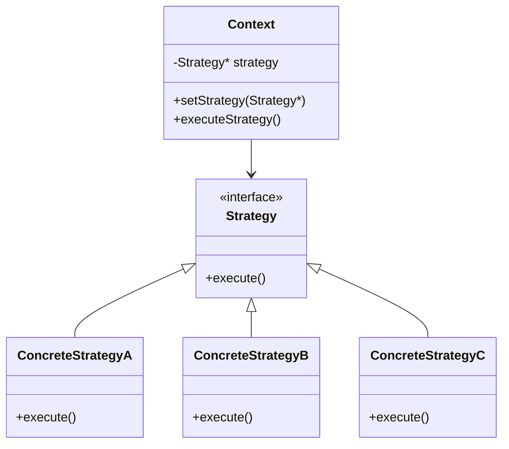
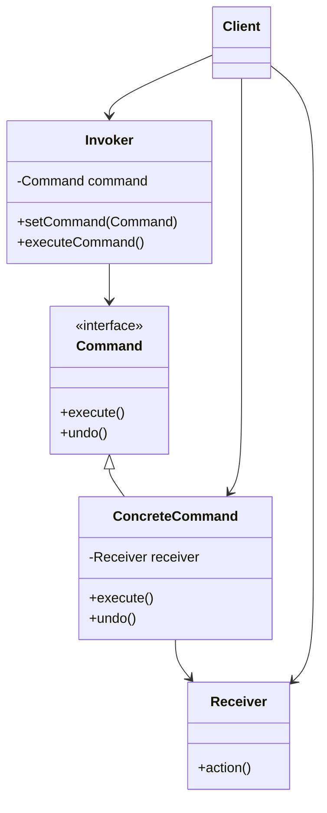
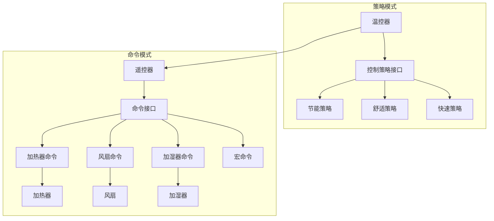

# 策略模式与命令模式实践教程

## 学习目标

完成本教程后，你将能够：

- [ ] 理解策略模式和命令模式的核心概念和设计思想
- [ ] 掌握策略模式在嵌入式系统中的应用场景和实现方法
- [ ] 学会使用命令模式实现操作的封装和解耦
- [ ] 能够在实际项目中选择合适的设计模式解决问题
- [ ] 理解行为型设计模式如何提高代码的可维护性和扩展性

## 前置要求

在开始本教程之前，你需要：

**知识要求**：
- 熟练掌握C语言编程
- 理解函数指针和回调函数的概念
- 了解基本的设计模式概念
- 掌握结构体和指针的高级用法

**技能要求**：
- 能够设计和实现模块化的代码结构
- 具备面向对象的设计思维
- 会使用IDE进行代码重构
- 理解接口和抽象的概念

**环境要求**：
- 已完成基础设计模式的学习（如工厂模式、单例模式）
- 具备一定的嵌入式项目开发经验

## 准备工作

### 硬件准备

| 名称 | 数量 | 说明 | 参考链接 |
|------|------|------|----------|
| STM32开发板 | 1 | STM32F103或更高系列 | - |
| OLED显示屏 | 1 | 128x64 I2C接口 | - |
| 按键模块 | 1 | 4个独立按键 | - |
| 蜂鸣器 | 1 | 有源或无源均可 | - |
| LED灯 | 3 | 用于状态指示 | - |

### 软件准备

- **开发环境**：STM32CubeIDE 或 Keil MDK
- **编译器**：ARM GCC
- **调试工具**：ST-Link
- **版本控制**：Git（推荐）

### 环境配置

1. 安装并配置开发环境
2. 创建新的STM32项目
3. 配置GPIO、I2C等外设
4. 准备好串口调试工具

---

## 第一部分：策略模式 (Strategy Pattern)

### 1.1 策略模式概述

策略模式是一种行为型设计模式，它定义了一系列算法，将每个算法封装起来，并使它们可以相互替换。策略模式让算法的变化独立于使用算法的客户端。

**核心思想**：
- 将算法族封装成独立的策略类
- 通过接口或函数指针实现策略的可替换性
- 客户端可以在运行时动态选择不同的策略

**适用场景**：
- 需要在运行时选择不同的算法或行为
- 有多个相关的类，仅行为不同
- 需要避免使用大量的条件语句（if-else或switch-case）
- 算法需要独立于使用它的客户端而变化

### 1.2 策略模式结构



**组成部分**：
1. **Strategy（策略接口）**：定义所有支持的算法的公共接口
2. **ConcreteStrategy（具体策略）**：实现Strategy接口的具体算法
3. **Context（上下文）**：维护一个对Strategy对象的引用，并提供接口让客户端设置策略

### 1.3 策略模式实现

#### 1.3.1 基础实现

让我们通过一个电机控制的例子来理解策略模式。假设我们需要控制电机的运行模式，有三种策略：恒速模式、加速模式、减速模式。

```c
// motor_strategy.h
#ifndef MOTOR_STRATEGY_H
#define MOTOR_STRATEGY_H

#include <stdint.h>

// 策略接口：定义电机控制策略的函数指针类型
typedef void (*MotorStrategyFunc)(uint16_t* speed);

// 策略接口结构体
typedef struct {
    const char* name;              // 策略名称
    MotorStrategyFunc execute;     // 策略执行函数
} MotorStrategy;

// 具体策略：恒速模式
void constantSpeedStrategy(uint16_t* speed);

// 具体策略：加速模式
void accelerateStrategy(uint16_t* speed);

// 具体策略：减速模式
void decelerateStrategy(uint16_t* speed);

// 上下文：电机控制器
typedef struct {
    uint16_t currentSpeed;         // 当前速度
    uint16_t targetSpeed;          // 目标速度
    MotorStrategy* strategy;       // 当前策略
} MotorController;

// 上下文操作函数
void motorController_init(MotorController* controller);
void motorController_setStrategy(MotorController* controller, MotorStrategy* strategy);
void motorController_execute(MotorController* controller);
void motorController_setTargetSpeed(MotorController* controller, uint16_t speed);

#endif // MOTOR_STRATEGY_H
```

```c
// motor_strategy.c
#include "motor_strategy.h"
#include <stdio.h>

// 具体策略实现：恒速模式
void constantSpeedStrategy(uint16_t* speed) {
    // 保持当前速度不变
    printf("恒速模式: 速度保持在 %d RPM\n", *speed);
}

// 具体策略实现：加速模式
void accelerateStrategy(uint16_t* speed) {
    // 每次调用增加10 RPM
    if (*speed < 3000) {  // 最大速度限制
        *speed += 10;
        printf("加速模式: 速度增加到 %d RPM\n", *speed);
    } else {
        printf("加速模式: 已达到最大速度 %d RPM\n", *speed);
    }
}

// 具体策略实现：减速模式
void decelerateStrategy(uint16_t* speed) {
    // 每次调用减少10 RPM
    if (*speed > 0) {
        *speed -= 10;
        printf("减速模式: 速度降低到 %d RPM\n", *speed);
    } else {
        printf("减速模式: 已停止\n");
    }
}

// 创建策略对象
MotorStrategy constantSpeed = {
    .name = "恒速模式",
    .execute = constantSpeedStrategy
};

MotorStrategy accelerate = {
    .name = "加速模式",
    .execute = accelerateStrategy
};

MotorStrategy decelerate = {
    .name = "减速模式",
    .execute = decelerateStrategy
};

// 上下文操作函数实现
void motorController_init(MotorController* controller) {
    controller->currentSpeed = 0;
    controller->targetSpeed = 0;
    controller->strategy = &constantSpeed;  // 默认策略
}

void motorController_setStrategy(MotorController* controller, MotorStrategy* strategy) {
    if (strategy != NULL) {
        controller->strategy = strategy;
        printf("切换到策略: %s\n", strategy->name);
    }
}

void motorController_execute(MotorController* controller) {
    if (controller->strategy != NULL && controller->strategy->execute != NULL) {
        controller->strategy->execute(&controller->currentSpeed);
    }
}

void motorController_setTargetSpeed(MotorController* controller, uint16_t speed) {
    controller->targetSpeed = speed;
    printf("设置目标速度: %d RPM\n", speed);
}
```

#### 1.3.2 使用示例

```c
// main.c
#include "motor_strategy.h"
#include <stdio.h>

// 外部策略对象声明
extern MotorStrategy constantSpeed;
extern MotorStrategy accelerate;
extern MotorStrategy decelerate;

int main(void) {
    // 创建电机控制器
    MotorController motor;
    motorController_init(&motor);
    
    printf("=== 策略模式示例：电机控制 ===\n\n");
    
    // 场景1：加速到目标速度
    printf("场景1：启动并加速\n");
    motorController_setStrategy(&motor, &accelerate);
    motorController_setTargetSpeed(&motor, 1000);
    
    for (int i = 0; i < 10; i++) {
        motorController_execute(&motor);
        // 模拟延时
        for (volatile int j = 0; j < 100000; j++);
    }
    
    printf("\n");
    
    // 场景2：恒速运行
    printf("场景2：恒速运行\n");
    motorController_setStrategy(&motor, &constantSpeed);
    
    for (int i = 0; i < 5; i++) {
        motorController_execute(&motor);
        for (volatile int j = 0; j < 100000; j++);
    }
    
    printf("\n");
    
    // 场景3：减速停止
    printf("场景3：减速停止\n");
    motorController_setStrategy(&motor, &decelerate);
    
    for (int i = 0; i < 12; i++) {
        motorController_execute(&motor);
        for (volatile int j = 0; j < 100000; j++);
    }
    
    return 0;
}
```

**运行结果**：
```
=== 策略模式示例：电机控制 ===

场景1：启动并加速
切换到策略: 加速模式
设置目标速度: 1000 RPM
加速模式: 速度增加到 10 RPM
加速模式: 速度增加到 20 RPM
加速模式: 速度增加到 30 RPM
...
加速模式: 速度增加到 100 RPM

场景2：恒速运行
切换到策略: 恒速模式
恒速模式: 速度保持在 100 RPM
恒速模式: 速度保持在 100 RPM
...

场景3：减速停止
切换到策略: 减速模式
减速模式: 速度降低到 90 RPM
减速模式: 速度降低到 80 RPM
...
减速模式: 已停止
```

### 1.4 策略模式的优势

**优点**：
1. **算法可以自由切换**：通过改变策略对象，轻松切换算法
2. **避免多重条件判断**：消除大量的if-else或switch-case语句
3. **扩展性好**：添加新策略不需要修改现有代码
4. **符合开闭原则**：对扩展开放，对修改关闭

**缺点**：
1. **策略类数量增加**：每个策略都需要一个类或结构体
2. **客户端需要了解策略**：客户端必须知道所有策略的区别
3. **内存开销**：需要额外的内存存储策略对象

### 1.5 策略模式应用场景

在嵌入式系统中，策略模式常用于：

1. **通信协议选择**：UART、SPI、I2C等不同通信方式
2. **加密算法切换**：AES、DES、RSA等加密算法
3. **传感器数据处理**：不同的滤波算法（均值、中值、卡尔曼）
4. **电源管理策略**：节能模式、性能模式、平衡模式
5. **PID控制参数**：不同工况下的PID参数组

---

## 第二部分：命令模式 (Command Pattern)

### 2.1 命令模式概述

命令模式是一种行为型设计模式，它将请求封装成对象，从而使你可以用不同的请求对客户进行参数化，对请求排队或记录请求日志，以及支持可撤销的操作。

**核心思想**：
- 将"请求"封装成对象
- 将请求的发送者和接收者解耦
- 支持请求的排队、记录和撤销

**适用场景**：
- 需要将请求调用者和请求接收者解耦
- 需要支持撤销（Undo）和重做（Redo）操作
- 需要支持事务操作（一组操作要么全部执行，要么全部不执行）
- 需要记录操作日志
- 需要支持宏命令（组合多个命令）

### 2.2 命令模式结构



**组成部分**：
1. **Command（命令接口）**：声明执行操作的接口
2. **ConcreteCommand（具体命令）**：实现Command接口，绑定接收者和动作
3. **Receiver（接收者）**：知道如何实施与执行一个请求相关的操作
4. **Invoker（调用者）**：要求命令执行请求
5. **Client（客户端）**：创建具体命令对象并设置接收者

### 2.3 命令模式实现

#### 2.3.1 基础实现

让我们通过一个智能家居控制系统来理解命令模式。系统可以控制灯光、空调和窗帘。

```c
// smart_home_command.h
#ifndef SMART_HOME_COMMAND_H
#define SMART_HOME_COMMAND_H

#include <stdint.h>
#include <stdbool.h>

// ========== 接收者：设备 ==========

// 灯光设备
typedef struct {
    bool isOn;
    uint8_t brightness;  // 0-100
} Light;

void light_init(Light* light);
void light_on(Light* light);
void light_off(Light* light);
void light_setBrightness(Light* light, uint8_t brightness);

// 空调设备
typedef struct {
    bool isOn;
    uint8_t temperature;  // 16-30°C
} AirConditioner;

void ac_init(AirConditioner* ac);
void ac_on(AirConditioner* ac);
void ac_off(AirConditioner* ac);
void ac_setTemperature(AirConditioner* ac, uint8_t temp);

// 窗帘设备
typedef struct {
    uint8_t position;  // 0-100, 0=完全关闭, 100=完全打开
} Curtain;

void curtain_init(Curtain* curtain);
void curtain_open(Curtain* curtain);
void curtain_close(Curtain* curtain);
void curtain_setPosition(Curtain* curtain, uint8_t position);

// ========== 命令接口 ==========

// 命令函数指针类型
typedef void (*CommandExecuteFunc)(void* context);
typedef void (*CommandUndoFunc)(void* context);

// 命令接口
typedef struct {
    const char* name;              // 命令名称
    void* receiver;                // 接收者（设备）
    void* params;                  // 命令参数
    CommandExecuteFunc execute;    // 执行函数
    CommandUndoFunc undo;          // 撤销函数
} Command;

// ========== 具体命令 ==========

// 灯光开关命令
typedef struct {
    Command base;
    Light* light;
    bool previousState;  // 用于撤销
} LightOnOffCommand;

Command* lightOnCommand_create(Light* light);
Command* lightOffCommand_create(Light* light);

// 灯光亮度命令
typedef struct {
    Command base;
    Light* light;
    uint8_t brightness;
    uint8_t previousBrightness;  // 用于撤销
} LightBrightnessCommand;

Command* lightBrightnessCommand_create(Light* light, uint8_t brightness);

// 空调命令
typedef struct {
    Command base;
    AirConditioner* ac;
    uint8_t temperature;
    uint8_t previousTemperature;
} ACCommand;

Command* acOnCommand_create(AirConditioner* ac);
Command* acOffCommand_create(AirConditioner* ac);
Command* acSetTempCommand_create(AirConditioner* ac, uint8_t temp);

// 窗帘命令
typedef struct {
    Command base;
    Curtain* curtain;
    uint8_t position;
    uint8_t previousPosition;
} CurtainCommand;

Command* curtainOpenCommand_create(Curtain* curtain);
Command* curtainCloseCommand_create(Curtain* curtain);

// ========== 调用者：遥控器 ==========

#define MAX_COMMAND_HISTORY 10

typedef struct {
    Command* commandHistory[MAX_COMMAND_HISTORY];  // 命令历史
    int historyCount;                               // 历史记录数量
    int currentIndex;                               // 当前位置
} RemoteControl;

void remoteControl_init(RemoteControl* remote);
void remoteControl_executeCommand(RemoteControl* remote, Command* command);
void remoteControl_undo(RemoteControl* remote);
void remoteControl_redo(RemoteControl* remote);

#endif // SMART_HOME_COMMAND_H
```


```c
// smart_home_command.c
#include "smart_home_command.h"
#include <stdio.h>
#include <stdlib.h>
#include <string.h>

// ========== 接收者实现 ==========

// 灯光设备实现
void light_init(Light* light) {
    light->isOn = false;
    light->brightness = 0;
}

void light_on(Light* light) {
    light->isOn = true;
    if (light->brightness == 0) {
        light->brightness = 100;  // 默认最大亮度
    }
    printf("[灯光] 开启，亮度: %d%%\n", light->brightness);
}

void light_off(Light* light) {
    light->isOn = false;
    printf("[灯光] 关闭\n");
}

void light_setBrightness(Light* light, uint8_t brightness) {
    if (brightness > 100) brightness = 100;
    light->brightness = brightness;
    if (light->isOn) {
        printf("[灯光] 亮度调整为: %d%%\n", brightness);
    }
}

// 空调设备实现
void ac_init(AirConditioner* ac) {
    ac->isOn = false;
    ac->temperature = 26;  // 默认26°C
}

void ac_on(AirConditioner* ac) {
    ac->isOn = true;
    printf("[空调] 开启，温度: %d°C\n", ac->temperature);
}

void ac_off(AirConditioner* ac) {
    ac->isOn = false;
    printf("[空调] 关闭\n");
}

void ac_setTemperature(AirConditioner* ac, uint8_t temp) {
    if (temp < 16) temp = 16;
    if (temp > 30) temp = 30;
    ac->temperature = temp;
    if (ac->isOn) {
        printf("[空调] 温度调整为: %d°C\n", temp);
    }
}

// 窗帘设备实现
void curtain_init(Curtain* curtain) {
    curtain->position = 0;  // 默认关闭
}

void curtain_open(Curtain* curtain) {
    curtain->position = 100;
    printf("[窗帘] 完全打开\n");
}

void curtain_close(Curtain* curtain) {
    curtain->position = 0;
    printf("[窗帘] 完全关闭\n");
}

void curtain_setPosition(Curtain* curtain, uint8_t position) {
    if (position > 100) position = 100;
    curtain->position = position;
    printf("[窗帘] 位置调整为: %d%%\n", position);
}
```

// ========== 具体命令实现 ==========

// 灯光开命令
static void lightOn_execute(void* context) {
    LightOnOffCommand* cmd = (LightOnOffCommand*)context;
    cmd->previousState = cmd->light->isOn;
    light_on(cmd->light);
}

static void lightOn_undo(void* context) {
    LightOnOffCommand* cmd = (LightOnOffCommand*)context;
    if (!cmd->previousState) {
        light_off(cmd->light);
    }
}

Command* lightOnCommand_create(Light* light) {
    LightOnOffCommand* cmd = (LightOnOffCommand*)malloc(sizeof(LightOnOffCommand));
    cmd->base.name = "灯光开启";
    cmd->base.receiver = light;
    cmd->base.execute = lightOn_execute;
    cmd->base.undo = lightOn_undo;
    cmd->light = light;
    cmd->previousState = false;
    return (Command*)cmd;
}

// 灯光关命令
static void lightOff_execute(void* context) {
    LightOnOffCommand* cmd = (LightOnOffCommand*)context;
    cmd->previousState = cmd->light->isOn;
    light_off(cmd->light);
}

static void lightOff_undo(void* context) {
    LightOnOffCommand* cmd = (LightOnOffCommand*)context;
    if (cmd->previousState) {
        light_on(cmd->light);
    }
}

Command* lightOffCommand_create(Light* light) {
    LightOnOffCommand* cmd = (LightOnOffCommand*)malloc(sizeof(LightOnOffCommand));
    cmd->base.name = "灯光关闭";
    cmd->base.receiver = light;
    cmd->base.execute = lightOff_execute;
    cmd->base.undo = lightOff_undo;
    cmd->light = light;
    cmd->previousState = false;
    return (Command*)cmd;
}

// 灯光亮度命令
static void lightBrightness_execute(void* context) {
    LightBrightnessCommand* cmd = (LightBrightnessCommand*)context;
    cmd->previousBrightness = cmd->light->brightness;
    light_setBrightness(cmd->light, cmd->brightness);
}

static void lightBrightness_undo(void* context) {
    LightBrightnessCommand* cmd = (LightBrightnessCommand*)context;
    light_setBrightness(cmd->light, cmd->previousBrightness);
}

Command* lightBrightnessCommand_create(Light* light, uint8_t brightness) {
    LightBrightnessCommand* cmd = (LightBrightnessCommand*)malloc(sizeof(LightBrightnessCommand));
    cmd->base.name = "灯光亮度调节";
    cmd->base.receiver = light;
    cmd->base.execute = lightBrightness_execute;
    cmd->base.undo = lightBrightness_undo;
    cmd->light = light;
    cmd->brightness = brightness;
    cmd->previousBrightness = 0;
    return (Command*)cmd;
}
```

// 空调开命令
static void acOn_execute(void* context) {
    ACCommand* cmd = (ACCommand*)context;
    ac_on(cmd->ac);
}

static void acOn_undo(void* context) {
    ACCommand* cmd = (ACCommand*)context;
    ac_off(cmd->ac);
}

Command* acOnCommand_create(AirConditioner* ac) {
    ACCommand* cmd = (ACCommand*)malloc(sizeof(ACCommand));
    cmd->base.name = "空调开启";
    cmd->base.receiver = ac;
    cmd->base.execute = acOn_execute;
    cmd->base.undo = acOn_undo;
    cmd->ac = ac;
    return (Command*)cmd;
}

// 窗帘打开命令
static void curtainOpen_execute(void* context) {
    CurtainCommand* cmd = (CurtainCommand*)context;
    cmd->previousPosition = cmd->curtain->position;
    curtain_open(cmd->curtain);
}

static void curtainOpen_undo(void* context) {
    CurtainCommand* cmd = (CurtainCommand*)context;
    curtain_setPosition(cmd->curtain, cmd->previousPosition);
}

Command* curtainOpenCommand_create(Curtain* curtain) {
    CurtainCommand* cmd = (CurtainCommand*)malloc(sizeof(CurtainCommand));
    cmd->base.name = "窗帘打开";
    cmd->base.receiver = curtain;
    cmd->base.execute = curtainOpen_execute;
    cmd->base.undo = curtainOpen_undo;
    cmd->curtain = curtain;
    cmd->previousPosition = 0;
    return (Command*)cmd;
}

// ========== 调用者实现 ==========

void remoteControl_init(RemoteControl* remote) {
    remote->historyCount = 0;
    remote->currentIndex = -1;
    for (int i = 0; i < MAX_COMMAND_HISTORY; i++) {
        remote->commandHistory[i] = NULL;
    }
}

void remoteControl_executeCommand(RemoteControl* remote, Command* command) {
    if (command == NULL || command->execute == NULL) {
        return;
    }
    
    // 执行命令
    printf("\n执行命令: %s\n", command->name);
    command->execute(command);
    
    // 清除当前位置之后的历史记录（如果有的话）
    for (int i = remote->currentIndex + 1; i < remote->historyCount; i++) {
        remote->commandHistory[i] = NULL;
    }
    
    // 添加到历史记录
    remote->currentIndex++;
    if (remote->currentIndex >= MAX_COMMAND_HISTORY) {
        // 历史记录满了，移除最旧的
        for (int i = 0; i < MAX_COMMAND_HISTORY - 1; i++) {
            remote->commandHistory[i] = remote->commandHistory[i + 1];
        }
        remote->currentIndex = MAX_COMMAND_HISTORY - 1;
    }
    
    remote->commandHistory[remote->currentIndex] = command;
    remote->historyCount = remote->currentIndex + 1;
}

void remoteControl_undo(RemoteControl* remote) {
    if (remote->currentIndex < 0) {
        printf("\n没有可撤销的命令\n");
        return;
    }
    
    Command* command = remote->commandHistory[remote->currentIndex];
    if (command != NULL && command->undo != NULL) {
        printf("\n撤销命令: %s\n", command->name);
        command->undo(command);
        remote->currentIndex--;
    }
}

void remoteControl_redo(RemoteControl* remote) {
    if (remote->currentIndex >= remote->historyCount - 1) {
        printf("\n没有可重做的命令\n");
        return;
    }
    
    remote->currentIndex++;
    Command* command = remote->commandHistory[remote->currentIndex];
    if (command != NULL && command->execute != NULL) {
        printf("\n重做命令: %s\n", command->name);
        command->execute(command);
    }
}
```

#### 2.3.2 使用示例

```c
// main.c - 命令模式示例
#include "smart_home_command.h"
#include <stdio.h>

int main(void) {
    printf("=== 命令模式示例：智能家居控制 ===\n");
    
    // 创建设备（接收者）
    Light livingRoomLight;
    AirConditioner ac;
    Curtain curtain;
    
    light_init(&livingRoomLight);
    ac_init(&ac);
    curtain_init(&curtain);
    
    // 创建遥控器（调用者）
    RemoteControl remote;
    remoteControl_init(&remote);
    
    // 创建命令
    Command* lightOn = lightOnCommand_create(&livingRoomLight);
    Command* lightBright = lightBrightnessCommand_create(&livingRoomLight, 50);
    Command* acOn = acOnCommand_create(&ac);
    Command* curtainOpen = curtainOpenCommand_create(&curtain);
    
    // 场景1：回家模式
    printf("\n=== 场景1：回家模式 ===\n");
    remoteControl_executeCommand(&remote, lightOn);
    remoteControl_executeCommand(&remote, lightBright);
    remoteControl_executeCommand(&remote, acOn);
    remoteControl_executeCommand(&remote, curtainOpen);
    
    // 场景2：撤销操作
    printf("\n=== 场景2：撤销最后两个操作 ===\n");
    remoteControl_undo(&remote);  // 撤销窗帘打开
    remoteControl_undo(&remote);  // 撤销空调开启
    
    // 场景3：重做操作
    printf("\n=== 场景3：重做操作 ===\n");
    remoteControl_redo(&remote);  // 重做空调开启
    
    return 0;
}
```

**运行结果**：
```
=== 命令模式示例：智能家居控制 ===

=== 场景1：回家模式 ===

执行命令: 灯光开启
[灯光] 开启，亮度: 100%

执行命令: 灯光亮度调节
[灯光] 亮度调整为: 50%

执行命令: 空调开启
[空调] 开启，温度: 26°C

执行命令: 窗帘打开
[窗帘] 完全打开

=== 场景2：撤销最后两个操作 ===

撤销命令: 窗帘打开
[窗帘] 位置调整为: 0%

撤销命令: 空调开启
[空调] 关闭

=== 场景3：重做操作 ===

重做命令: 空调开启
[空调] 开启，温度: 26°C
```

### 2.4 命令模式的优势

**优点**：
1. **解耦调用者和接收者**：调用者不需要知道接收者的具体实现
2. **支持撤销和重做**：通过保存命令历史实现
3. **支持宏命令**：可以组合多个命令
4. **支持命令队列**：可以将命令排队执行
5. **支持日志记录**：可以记录所有执行的命令
6. **符合开闭原则**：添加新命令不需要修改现有代码

**缺点**：
1. **类的数量增加**：每个命令都需要一个类
2. **内存开销**：需要存储命令对象和历史记录
3. **复杂度增加**：引入了额外的抽象层

### 2.5 命令模式应用场景

在嵌入式系统中，命令模式常用于：

1. **按键处理**：将按键操作封装成命令
2. **菜单系统**：每个菜单项对应一个命令
3. **任务调度**：将任务封装成命令放入队列
4. **协议解析**：将协议命令封装成对象
5. **操作日志**：记录所有操作以便审计或回放

---

## 第三部分：综合实战项目

### 3.1 项目需求

设计一个智能温控系统，要求：

1. **温度控制策略**：
   - 节能模式：温度波动范围大，降低能耗
   - 舒适模式：温度波动范围小，保持舒适
   - 快速模式：快速达到目标温度

2. **设备控制命令**：
   - 支持加热器、风扇、加湿器的开关控制
   - 支持命令的撤销和重做
   - 支持宏命令（一键执行多个命令）

### 3.2 系统设计



### 3.3 完整实现

```c
// temperature_control.h
#ifndef TEMPERATURE_CONTROL_H
#define TEMPERATURE_CONTROL_H

#include <stdint.h>
#include <stdbool.h>

// ========== 设备（接收者） ==========

typedef struct {
    bool isOn;
    uint8_t power;  // 0-100%
} Heater;

typedef struct {
    bool isOn;
    uint8_t speed;  // 0-100%
} Fan;

typedef struct {
    bool isOn;
    uint8_t level;  // 0-100%
} Humidifier;

void heater_init(Heater* heater);
void heater_on(Heater* heater, uint8_t power);
void heater_off(Heater* heater);

void fan_init(Fan* fan);
void fan_on(Fan* fan, uint8_t speed);
void fan_off(Fan* fan);

void humidifier_init(Humidifier* humidifier);
void humidifier_on(Humidifier* humidifier, uint8_t level);
void humidifier_off(Humidifier* humidifier);

// ========== 策略模式：温度控制策略 ==========

typedef struct {
    float currentTemp;
    float targetTemp;
    Heater* heater;
    Fan* fan;
} TempController;

typedef void (*TempControlStrategy)(TempController* controller);

typedef struct {
    const char* name;
    TempControlStrategy adjust;
} ControlStrategy;

// 具体策略
void economyStrategy(TempController* controller);
void comfortStrategy(TempController* controller);
void rapidStrategy(TempController* controller);

// 策略对象
extern ControlStrategy economyMode;
extern ControlStrategy comfortMode;
extern ControlStrategy rapidMode;

// 温控器操作
void tempController_init(TempController* controller, Heater* heater, Fan* fan);
void tempController_setStrategy(TempController* controller, ControlStrategy* strategy);
void tempController_setTarget(TempController* controller, float target);
void tempController_update(TempController* controller, float currentTemp);

// ========== 命令模式：设备控制命令 ==========

typedef void (*CommandFunc)(void* context);

typedef struct Command {
    const char* name;
    void* receiver;
    CommandFunc execute;
    CommandFunc undo;
    struct Command* next;  // 用于宏命令链表
} Command;

// 具体命令
Command* heaterOnCommand_create(Heater* heater, uint8_t power);
Command* heaterOffCommand_create(Heater* heater);
Command* fanOnCommand_create(Fan* fan, uint8_t speed);
Command* fanOffCommand_create(Fan* fan);

// 宏命令
typedef struct {
    Command base;
    Command* commands[10];
    int count;
} MacroCommand;

MacroCommand* macroCommand_create(const char* name);
void macroCommand_add(MacroCommand* macro, Command* command);

// 命令调用者
typedef struct {
    Command* history[20];
    int historyCount;
    int currentIndex;
} CommandInvoker;

void invoker_init(CommandInvoker* invoker);
void invoker_execute(CommandInvoker* invoker, Command* command);
void invoker_undo(CommandInvoker* invoker);
void invoker_redo(CommandInvoker* invoker);

#endif // TEMPERATURE_CONTROL_H
```

```c
// temperature_control.c
#include "temperature_control.h"
#include <stdio.h>
#include <stdlib.h>
#include <math.h>

// ========== 设备实现 ==========

void heater_init(Heater* heater) {
    heater->isOn = false;
    heater->power = 0;
}

void heater_on(Heater* heater, uint8_t power) {
    heater->isOn = true;
    heater->power = power;
    printf("[加热器] 开启，功率: %d%%\n", power);
}

void heater_off(Heater* heater) {
    heater->isOn = false;
    heater->power = 0;
    printf("[加热器] 关闭\n");
}

void fan_init(Fan* fan) {
    fan->isOn = false;
    fan->speed = 0;
}

void fan_on(Fan* fan, uint8_t speed) {
    fan->isOn = true;
    fan->speed = speed;
    printf("[风扇] 开启，速度: %d%%\n", speed);
}

void fan_off(Fan* fan) {
    fan->isOn = false;
    fan->speed = 0;
    printf("[风扇] 关闭\n");
}

void humidifier_init(Humidifier* humidifier) {
    humidifier->isOn = false;
    humidifier->level = 0;
}

void humidifier_on(Humidifier* humidifier, uint8_t level) {
    humidifier->isOn = true;
    humidifier->level = level;
    printf("[加湿器] 开启，档位: %d%%\n", level);
}

void humidifier_off(Humidifier* humidifier) {
    humidifier->isOn = false;
    humidifier->level = 0;
    printf("[加湿器] 关闭\n");
}

// ========== 策略实现 ==========

// 节能策略：温差大于2度才调整
void economyStrategy(TempController* controller) {
    float diff = controller->targetTemp - controller->currentTemp;
    
    printf("[节能模式] 当前温度: %.1f°C, 目标温度: %.1f°C, 温差: %.1f°C\n",
           controller->currentTemp, controller->targetTemp, diff);
    
    if (fabs(diff) < 2.0f) {
        // 温差小，关闭设备节能
        if (controller->heater->isOn) {
            heater_off(controller->heater);
        }
        if (controller->fan->isOn) {
            fan_off(controller->fan);
        }
        printf("[节能模式] 温差较小，关闭设备节能\n");
    } else if (diff > 0) {
        // 需要加热
        uint8_t power = (uint8_t)(diff * 20);  // 低功率
        if (power > 100) power = 100;
        heater_on(controller->heater, power);
        fan_off(controller->fan);
    } else {
        // 需要降温
        uint8_t speed = (uint8_t)(fabs(diff) * 20);  // 低速
        if (speed > 100) speed = 100;
        fan_on(controller->fan, speed);
        heater_off(controller->heater);
    }
}

// 舒适策略：温差大于0.5度就调整
void comfortStrategy(TempController* controller) {
    float diff = controller->targetTemp - controller->currentTemp;
    
    printf("[舒适模式] 当前温度: %.1f°C, 目标温度: %.1f°C, 温差: %.1f°C\n",
           controller->currentTemp, controller->targetTemp, diff);
    
    if (fabs(diff) < 0.5f) {
        // 温度合适，保持低功率运行
        if (diff > 0) {
            heater_on(controller->heater, 30);
        } else {
            fan_on(controller->fan, 30);
        }
        printf("[舒适模式] 温度适宜，保持低功率运行\n");
    } else if (diff > 0) {
        // 需要加热
        uint8_t power = (uint8_t)(diff * 40);  // 中等功率
        if (power > 100) power = 100;
        heater_on(controller->heater, power);
        fan_off(controller->fan);
    } else {
        // 需要降温
        uint8_t speed = (uint8_t)(fabs(diff) * 40);  // 中等速度
        if (speed > 100) speed = 100;
        fan_on(controller->fan, speed);
        heater_off(controller->heater);
    }
}

// 快速策略：全功率运行
void rapidStrategy(TempController* controller) {
    float diff = controller->targetTemp - controller->currentTemp;
    
    printf("[快速模式] 当前温度: %.1f°C, 目标温度: %.1f°C, 温差: %.1f°C\n",
           controller->currentTemp, controller->targetTemp, diff);
    
    if (fabs(diff) < 0.2f) {
        // 已达到目标
        heater_off(controller->heater);
        fan_off(controller->fan);
        printf("[快速模式] 已达到目标温度\n");
    } else if (diff > 0) {
        // 需要加热，全功率
        heater_on(controller->heater, 100);
        fan_off(controller->fan);
        printf("[快速模式] 全功率加热\n");
    } else {
        // 需要降温，全速
        fan_on(controller->fan, 100);
        heater_off(controller->heater);
        printf("[快速模式] 全速降温\n");
    }
}

// 策略对象
ControlStrategy economyMode = {
    .name = "节能模式",
    .adjust = economyStrategy
};

ControlStrategy comfortMode = {
    .name = "舒适模式",
    .adjust = comfortStrategy
};

ControlStrategy rapidMode = {
    .name = "快速模式",
    .adjust = rapidStrategy
};

// 温控器操作
void tempController_init(TempController* controller, Heater* heater, Fan* fan) {
    controller->currentTemp = 20.0f;
    controller->targetTemp = 24.0f;
    controller->heater = heater;
    controller->fan = fan;
}

void tempController_setStrategy(TempController* controller, ControlStrategy* strategy) {
    printf("\n切换控制策略: %s\n", strategy->name);
}

void tempController_setTarget(TempController* controller, float target) {
    controller->targetTemp = target;
    printf("设置目标温度: %.1f°C\n", target);
}

void tempController_update(TempController* controller, float currentTemp) {
    controller->currentTemp = currentTemp;
}
```

// ========== 命令实现 ==========

// 加热器开命令
typedef struct {
    Command base;
    Heater* heater;
    uint8_t power;
    bool wasOn;
    uint8_t previousPower;
} HeaterCommand;

static void heaterOn_execute(void* context) {
    HeaterCommand* cmd = (HeaterCommand*)context;
    cmd->wasOn = cmd->heater->isOn;
    cmd->previousPower = cmd->heater->power;
    heater_on(cmd->heater, cmd->power);
}

static void heaterOn_undo(void* context) {
    HeaterCommand* cmd = (HeaterCommand*)context;
    if (cmd->wasOn) {
        heater_on(cmd->heater, cmd->previousPower);
    } else {
        heater_off(cmd->heater);
    }
}

Command* heaterOnCommand_create(Heater* heater, uint8_t power) {
    HeaterCommand* cmd = (HeaterCommand*)malloc(sizeof(HeaterCommand));
    cmd->base.name = "加热器开启";
    cmd->base.receiver = heater;
    cmd->base.execute = heaterOn_execute;
    cmd->base.undo = heaterOn_undo;
    cmd->base.next = NULL;
    cmd->heater = heater;
    cmd->power = power;
    return (Command*)cmd;
}

// 宏命令实现
static void macro_execute(void* context) {
    MacroCommand* macro = (MacroCommand*)context;
    printf("执行宏命令: %s\n", macro->base.name);
    for (int i = 0; i < macro->count; i++) {
        if (macro->commands[i] && macro->commands[i]->execute) {
            macro->commands[i]->execute(macro->commands[i]);
        }
    }
}

static void macro_undo(void* context) {
    MacroCommand* macro = (MacroCommand*)context;
    printf("撤销宏命令: %s\n", macro->base.name);
    // 逆序撤销
    for (int i = macro->count - 1; i >= 0; i--) {
        if (macro->commands[i] && macro->commands[i]->undo) {
            macro->commands[i]->undo(macro->commands[i]);
        }
    }
}

MacroCommand* macroCommand_create(const char* name) {
    MacroCommand* macro = (MacroCommand*)malloc(sizeof(MacroCommand));
    macro->base.name = name;
    macro->base.execute = macro_execute;
    macro->base.undo = macro_undo;
    macro->base.next = NULL;
    macro->count = 0;
    return macro;
}

void macroCommand_add(MacroCommand* macro, Command* command) {
    if (macro->count < 10) {
        macro->commands[macro->count++] = command;
    }
}

// 命令调用者实现
void invoker_init(CommandInvoker* invoker) {
    invoker->historyCount = 0;
    invoker->currentIndex = -1;
}

void invoker_execute(CommandInvoker* invoker, Command* command) {
    if (command && command->execute) {
        printf("\n>>> 执行命令: %s\n", command->name);
        command->execute(command);
        
        // 添加到历史
        invoker->currentIndex++;
        if (invoker->currentIndex >= 20) {
            invoker->currentIndex = 19;
        }
        invoker->history[invoker->currentIndex] = command;
        invoker->historyCount = invoker->currentIndex + 1;
    }
}

void invoker_undo(CommandInvoker* invoker) {
    if (invoker->currentIndex >= 0) {
        Command* command = invoker->history[invoker->currentIndex];
        if (command && command->undo) {
            printf("\n<<< 撤销命令: %s\n", command->name);
            command->undo(command);
            invoker->currentIndex--;
        }
    } else {
        printf("\n没有可撤销的命令\n");
    }
}

void invoker_redo(CommandInvoker* invoker) {
    if (invoker->currentIndex < invoker->historyCount - 1) {
        invoker->currentIndex++;
        Command* command = invoker->history[invoker->currentIndex];
        if (command && command->execute) {
            printf("\n>>> 重做命令: %s\n", command->name);
            command->execute(command);
        }
    } else {
        printf("\n没有可重做的命令\n");
    }
}
```

### 3.4 综合测试

```c
// main.c - 综合实战测试
#include "temperature_control.h"
#include <stdio.h>

int main(void) {
    printf("=== 策略模式与命令模式综合实战 ===\n");
    printf("=== 智能温控系统 ===\n\n");
    
    // 初始化设备
    Heater heater;
    Fan fan;
    Humidifier humidifier;
    
    heater_init(&heater);
    fan_init(&fan);
    humidifier_init(&humidifier);
    
    // 初始化温控器（策略模式）
    TempController controller;
    tempController_init(&controller, &heater, &fan);
    
    // 初始化命令调用者
    CommandInvoker invoker;
    invoker_init(&invoker);
    
    // ========== 场景1：使用不同策略控制温度 ==========
    printf("\n========== 场景1：策略模式 - 温度控制 ==========\n");
    
    // 节能模式
    printf("\n--- 测试节能模式 ---\n");
    tempController_setStrategy(&controller, &economyMode);
    tempController_setTarget(&controller, 24.0f);
    tempController_update(&controller, 20.0f);
    economyMode.adjust(&controller);
    
    // 舒适模式
    printf("\n--- 测试舒适模式 ---\n");
    tempController_setStrategy(&controller, &comfortMode);
    tempController_update(&controller, 22.0f);
    comfortMode.adjust(&controller);
    
    // 快速模式
    printf("\n--- 测试快速模式 ---\n");
    tempController_setStrategy(&controller, &rapidMode);
    tempController_update(&controller, 18.0f);
    rapidMode.adjust(&controller);
    
    // ========== 场景2：使用命令模式控制设备 ==========
    printf("\n\n========== 场景2：命令模式 - 设备控制 ==========\n");
    
    // 创建单个命令
    Command* heaterCmd = heaterOnCommand_create(&heater, 80);
    Command* fanCmd = fanOnCommand_create(&fan, 60);
    
    // 执行命令
    invoker_execute(&invoker, heaterCmd);
    invoker_execute(&invoker, fanCmd);
    
    // 撤销命令
    printf("\n--- 撤销操作 ---\n");
    invoker_undo(&invoker);
    invoker_undo(&invoker);
    
    // 重做命令
    printf("\n--- 重做操作 ---\n");
    invoker_redo(&invoker);
    
    // ========== 场景3：宏命令 ==========
    printf("\n\n========== 场景3：宏命令 - 一键回家模式 ==========\n");
    
    // 创建宏命令：回家模式
    MacroCommand* homeMode = macroCommand_create("回家模式");
    macroCommand_add(homeMode, heaterOnCommand_create(&heater, 70));
    macroCommand_add(homeMode, fanOnCommand_create(&fan, 40));
    macroCommand_add(homeMode, (Command*)humidifier);  // 简化示例
    
    // 执行宏命令
    invoker_execute(&invoker, (Command*)homeMode);
    
    // 撤销宏命令
    printf("\n--- 撤销回家模式 ---\n");
    invoker_undo(&invoker);
    
    printf("\n=== 测试完成 ===\n");
    
    return 0;
}
```

**预期输出**：
```
=== 策略模式与命令模式综合实战 ===
=== 智能温控系统 ===

========== 场景1：策略模式 - 温度控制 ==========

--- 测试节能模式 ---

切换控制策略: 节能模式
设置目标温度: 24.0°C
[节能模式] 当前温度: 20.0°C, 目标温度: 24.0°C, 温差: 4.0°C
[加热器] 开启，功率: 80%
[风扇] 关闭

--- 测试舒适模式 ---

切换控制策略: 舒适模式
[舒适模式] 当前温度: 22.0°C, 目标温度: 24.0°C, 温差: 2.0°C
[加热器] 开启，功率: 80%
[风扇] 关闭

--- 测试快速模式 ---

切换控制策略: 快速模式
[快速模式] 当前温度: 18.0°C, 目标温度: 24.0°C, 温差: 6.0°C
[加热器] 开启，功率: 100%
[风扇] 关闭
[快速模式] 全功率加热

========== 场景2：命令模式 - 设备控制 ==========

>>> 执行命令: 加热器开启
[加热器] 开启，功率: 80%

>>> 执行命令: 风扇开启
[风扇] 开启，速度: 60%

--- 撤销操作 ---

<<< 撤销命令: 风扇开启
[风扇] 关闭

<<< 撤销命令: 加热器开启
[加热器] 关闭

--- 重做操作 ---

>>> 重做命令: 加热器开启
[加热器] 开启，功率: 80%

========== 场景3：宏命令 - 一键回家模式 ==========

>>> 执行命令: 回家模式
执行宏命令: 回家模式
[加热器] 开启，功率: 70%
[风扇] 开启，速度: 40%

--- 撤销回家模式 ---

<<< 撤销命令: 回家模式
撤销宏命令: 回家模式
[风扇] 关闭
[加热器] 关闭

=== 测试完成 ===
```

---

## 验证方法

### 4.1 功能验证

**验证清单**：
- [ ] 策略模式能够动态切换不同的控制策略
- [ ] 命令模式能够封装操作并支持撤销/重做
- [ ] 宏命令能够组合多个命令一起执行
- [ ] 命令历史记录功能正常
- [ ] 所有代码能够编译通过并正常运行

### 4.2 性能测试

```c
// 性能测试代码
void performance_test(void) {
    printf("\n=== 性能测试 ===\n");
    
    TempController controller;
    Heater heater;
    Fan fan;
    
    heater_init(&heater);
    fan_init(&fan);
    tempController_init(&controller, &heater, &fan);
    
    // 测试策略切换性能
    uint32_t start = HAL_GetTick();
    for (int i = 0; i < 1000; i++) {
        economyMode.adjust(&controller);
    }
    uint32_t end = HAL_GetTick();
    
    printf("1000次策略执行耗时: %lu ms\n", end - start);
    printf("平均每次: %.2f ms\n", (end - start) / 1000.0f);
}
```

### 4.3 内存占用分析

```c
void memory_analysis(void) {
    printf("\n=== 内存占用分析 ===\n");
    
    printf("Command结构体大小: %zu bytes\n", sizeof(Command));
    printf("MacroCommand结构体大小: %zu bytes\n", sizeof(MacroCommand));
    printf("CommandInvoker结构体大小: %zu bytes\n", sizeof(CommandInvoker));
    printf("TempController结构体大小: %zu bytes\n", sizeof(TempController));
    
    // 估算总内存占用
    size_t total = sizeof(Command) * 20 +  // 命令历史
                   sizeof(MacroCommand) * 5 +  // 宏命令
                   sizeof(CommandInvoker) +
                   sizeof(TempController);
    
    printf("预估总内存占用: %zu bytes (%.2f KB)\n", total, total / 1024.0f);
}
```

---

## 故障排除

### 5.1 常见问题

**问题1：命令撤销后状态不正确**
```
原因：没有正确保存命令执行前的状态
解决：在execute函数中保存previous状态
```

**问题2：策略切换后行为异常**
```
原因：策略对象指针为空或未初始化
解决：检查策略对象的初始化和赋值
```

**问题3：宏命令执行顺序错误**
```
原因：命令添加顺序不对或执行逻辑错误
解决：按正确顺序添加命令，检查执行循环
```

### 5.2 调试技巧

1. **添加日志输出**：在关键函数中添加printf调试信息
2. **使用断点调试**：在IDE中设置断点，单步执行
3. **检查指针有效性**：确保所有指针在使用前已初始化
4. **验证函数指针**：确保函数指针指向正确的函数

---

## 总结

### 6.1 核心要点

**策略模式**：
- 定义算法族，封装每个算法，使它们可以互相替换
- 适用于需要在运行时选择不同算法的场景
- 消除大量条件语句，提高代码可维护性

**命令模式**：
- 将请求封装成对象，实现请求的参数化和队列化
- 支持撤销/重做操作，适用于需要记录操作历史的场景
- 解耦请求发送者和接收者

**两者结合**：
- 策略模式关注算法的选择和替换
- 命令模式关注操作的封装和执行
- 结合使用可以构建灵活、可扩展的系统

### 6.2 最佳实践

1. **合理选择模式**：根据实际需求选择合适的设计模式
2. **保持简单**：不要过度设计，避免不必要的复杂性
3. **注意内存管理**：在嵌入式系统中要特别注意内存分配和释放
4. **性能优化**：避免频繁的动态内存分配，考虑使用内存池
5. **文档化**：为每个策略和命令编写清晰的文档说明

### 6.3 扩展学习

- 学习其他行为型模式：观察者模式、状态模式、责任链模式
- 研究设计模式在RTOS中的应用
- 了解设计模式与面向对象设计原则的关系
- 实践更复杂的项目，综合运用多种设计模式

---

## 延伸阅读

1. **《设计模式：可复用面向对象软件的基础》** - GoF经典著作
2. **《Head First设计模式》** - 通俗易懂的设计模式入门书
3. **《嵌入式C语言设计模式》** - 专注于嵌入式系统的设计模式
4. **《重构：改善既有代码的设计》** - 学习如何重构代码应用设计模式

---

**恭喜你完成本教程！** 你已经掌握了策略模式和命令模式的核心概念和实现方法。继续实践，将这些模式应用到实际项目中，提升代码质量和可维护性。
```
