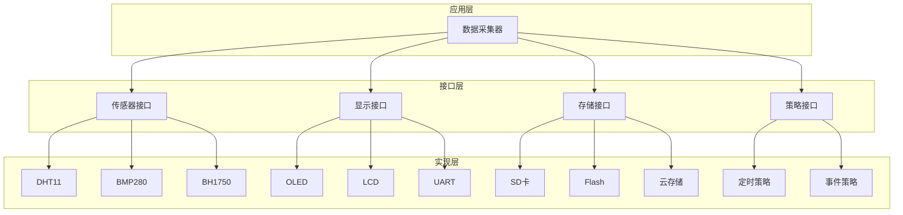

# 面向接口编程实践教程


## 学习目标

完成本教程后，你将能够：

- [ ] 理解面向接口编程的核心概念和设计思想
- [ ] 掌握在C语言中实现接口抽象的多种方法
- [ ] 学会使用依赖注入提高代码的灵活性和可测试性
- [ ] 能够设计清晰的抽象层，实现模块间的解耦
- [ ] 理解接口设计如何提高代码的可维护性和可扩展性

## 前置要求

在开始本教程之前，你需要：

**知识要求**：
- 熟练掌握C语言编程
- 理解函数指针和回调函数的概念
- 了解结构体和指针的高级用法
- 掌握基本的软件设计原则

**技能要求**：
- 能够设计和实现模块化的代码结构
- 具备面向对象的设计思维
- 会使用IDE进行代码重构
- 理解分层架构的概念

**环境要求**：
- 已完成基础设计模式的学习
- 具备一定的嵌入式项目开发经验

## 准备工作

### 硬件准备

| 名称 | 数量 | 说明 | 参考链接 |
|------|------|------|----------|
| STM32开发板 | 1 | STM32F103或更高系列 | - |
| 传感器模块 | 2-3 | 温湿度、光照等不同类型 | - |
| OLED显示屏 | 1 | 128x64 I2C接口 | - |

### 软件准备

- **开发环境**：STM32CubeIDE 或 Keil MDK
- **编译器**：ARM GCC
- **调试工具**：ST-Link
- **版本控制**：Git（推荐）

### 环境配置

1. 安装并配置开发环境
2. 创建新的STM32项目
3. 配置GPIO、I2C等外设
4. 准备好串口调试工具

---

## 第一部分：面向接口编程概述

### 1.1 什么是面向接口编程

面向接口编程（Interface-Oriented Programming）是一种软件设计思想，强调通过定义清晰的接口来实现模块间的交互，而不是直接依赖具体的实现。

**核心思想**：
- 依赖于抽象，而不是具体实现
- 通过接口定义契约，规范模块间的交互
- 实现与接口分离，提高代码的灵活性
- 面向接口编程，而不是面向实现编程

**与面向对象编程的关系**：
- 面向接口编程是面向对象设计原则的体现
- 在C语言中，通过函数指针和结构体实现接口抽象
- 强调"依赖倒置原则"：高层模块不应依赖低层模块，两者都应依赖抽象


### 1.2 为什么需要面向接口编程

**传统方式的问题**：

```c
// 传统方式：直接依赖具体实现
#include "dht11_sensor.h"  // 直接依赖DHT11传感器

void readTemperature(void) {
    float temp = dht11_readTemperature();  // 直接调用DHT11的函数
    printf("Temperature: %.1f°C\n", temp);
}
```

**问题分析**：
1. **强耦合**：代码直接依赖DHT11传感器，更换传感器需要修改代码
2. **难以测试**：无法在没有硬件的情况下测试代码
3. **扩展性差**：添加新传感器需要修改现有代码
4. **维护困难**：传感器变更影响所有使用它的代码

**面向接口的方式**：

```c
// 面向接口：依赖抽象接口
typedef struct {
    float (*readTemperature)(void);  // 温度读取接口
    float (*readHumidity)(void);     // 湿度读取接口
} SensorInterface;

void readTemperature(SensorInterface* sensor) {
    if (sensor && sensor->readTemperature) {
        float temp = sensor->readTemperature();  // 通过接口调用
        printf("Temperature: %.1f°C\n", temp);
    }
}
```

**优势**：
1. **低耦合**：代码只依赖接口，不依赖具体实现
2. **易测试**：可以创建模拟对象进行测试
3. **易扩展**：添加新传感器只需实现接口
4. **易维护**：传感器变更不影响使用代码

### 1.3 面向接口编程的核心原则

**1. 依赖倒置原则（Dependency Inversion Principle）**
- 高层模块不应依赖低层模块，两者都应依赖抽象
- 抽象不应依赖细节，细节应依赖抽象

**2. 接口隔离原则（Interface Segregation Principle）**
- 客户端不应被迫依赖它不使用的接口
- 接口应该小而专注，而不是大而全

**3. 里氏替换原则（Liskov Substitution Principle）**
- 子类型必须能够替换其基类型
- 所有实现同一接口的对象应该可以互相替换

---

## 第二部分：C语言中的接口实现

### 2.1 使用函数指针实现接口

在C语言中，我们使用函数指针来模拟接口的概念。

#### 2.1.1 基础接口定义

```c
// sensor_interface.h
#ifndef SENSOR_INTERFACE_H
#define SENSOR_INTERFACE_H

#include <stdint.h>
#include <stdbool.h>

// 传感器接口定义
typedef struct {
    // 初始化函数
    bool (*init)(void);
    
    // 读取温度（返回摄氏度）
    float (*readTemperature)(void);
    
    // 读取湿度（返回百分比）
    float (*readHumidity)(void);
    
    // 检查传感器是否就绪
    bool (*isReady)(void);
    
    // 传感器名称
    const char* name;
} SensorInterface;

#endif // SENSOR_INTERFACE_H
```

**设计要点**：
- 使用函数指针定义接口方法
- 包含必要的元数据（如name）
- 返回值和参数类型要清晰明确
- 考虑错误处理（返回bool或错误码）


#### 2.1.2 具体实现：DHT11传感器

```c
// dht11_sensor.c
#include "sensor_interface.h"
#include <stdio.h>

// DHT11传感器的私有数据
static float lastTemperature = 0.0f;
static float lastHumidity = 0.0f;
static bool initialized = false;

// DHT11传感器的具体实现
static bool dht11_init(void) {
    printf("[DHT11] 初始化传感器...\n");
    // 实际的硬件初始化代码
    initialized = true;
    return true;
}

static float dht11_readTemperature(void) {
    if (!initialized) {
        printf("[DHT11] 错误：传感器未初始化\n");
        return 0.0f;
    }
    
    // 模拟读取温度
    lastTemperature = 25.5f;  // 实际应从硬件读取
    printf("[DHT11] 读取温度: %.1f°C\n", lastTemperature);
    return lastTemperature;
}

static float dht11_readHumidity(void) {
    if (!initialized) {
        printf("[DHT11] 错误：传感器未初始化\n");
        return 0.0f;
    }
    
    // 模拟读取湿度
    lastHumidity = 60.0f;  // 实际应从硬件读取
    printf("[DHT11] 读取湿度: %.1f%%\n", lastHumidity);
    return lastHumidity;
}

static bool dht11_isReady(void) {
    return initialized;
}

// 创建DHT11传感器接口对象
SensorInterface dht11Sensor = {
    .init = dht11_init,
    .readTemperature = dht11_readTemperature,
    .readHumidity = dht11_readHumidity,
    .isReady = dht11_isReady,
    .name = "DHT11"
};
```

#### 2.1.3 具体实现：DS18B20传感器

```c
// ds18b20_sensor.c
#include "sensor_interface.h"
#include <stdio.h>

// DS18B20传感器的私有数据
static float lastTemperature = 0.0f;
static bool initialized = false;

// DS18B20传感器的具体实现
static bool ds18b20_init(void) {
    printf("[DS18B20] 初始化传感器...\n");
    // 实际的硬件初始化代码
    initialized = true;
    return true;
}

static float ds18b20_readTemperature(void) {
    if (!initialized) {
        printf("[DS18B20] 错误：传感器未初始化\n");
        return 0.0f;
    }
    
    // 模拟读取温度（DS18B20精度更高）
    lastTemperature = 25.75f;  // 实际应从硬件读取
    printf("[DS18B20] 读取温度: %.2f°C\n", lastTemperature);
    return lastTemperature;
}

static float ds18b20_readHumidity(void) {
    // DS18B20不支持湿度读取
    printf("[DS18B20] 警告：不支持湿度读取\n");
    return 0.0f;
}

static bool ds18b20_isReady(void) {
    return initialized;
}

// 创建DS18B20传感器接口对象
SensorInterface ds18b20Sensor = {
    .init = ds18b20_init,
    .readTemperature = ds18b20_readTemperature,
    .readHumidity = ds18b20_readHumidity,
    .isReady = ds18b20_isReady,
    .name = "DS18B20"
};
```

#### 2.1.4 使用接口的客户端代码

```c
// temperature_monitor.c
#include "sensor_interface.h"
#include <stdio.h>

// 温度监控器：依赖传感器接口，而不是具体实现
typedef struct {
    SensorInterface* sensor;  // 依赖抽象接口
    float threshold;          // 温度阈值
} TemperatureMonitor;

// 初始化监控器
void monitor_init(TemperatureMonitor* monitor, SensorInterface* sensor, float threshold) {
    monitor->sensor = sensor;
    monitor->threshold = threshold;
    
    if (sensor && sensor->init) {
        sensor->init();
    }
}

// 检查温度
void monitor_check(TemperatureMonitor* monitor) {
    if (!monitor->sensor) {
        printf("[监控器] 错误：未设置传感器\n");
        return;
    }
    
    // 通过接口读取温度
    float temp = monitor->sensor->readTemperature();
    
    printf("[监控器] 当前温度: %.1f°C (阈值: %.1f°C)\n", temp, monitor->threshold);
    
    if (temp > monitor->threshold) {
        printf("[监控器] 警告：温度超过阈值！\n");
    }
}

// 切换传感器（运行时替换）
void monitor_setSensor(TemperatureMonitor* monitor, SensorInterface* sensor) {
    printf("[监控器] 切换传感器: %s\n", sensor->name);
    monitor->sensor = sensor;
    
    if (sensor && sensor->init) {
        sensor->init();
    }
}
```


#### 2.1.5 使用示例

```c
// main.c
#include "sensor_interface.h"
#include "temperature_monitor.h"
#include <stdio.h>

// 外部传感器对象声明
extern SensorInterface dht11Sensor;
extern SensorInterface ds18b20Sensor;

int main(void) {
    printf("=== 面向接口编程示例：温度监控系统 ===\n\n");
    
    // 创建温度监控器
    TemperatureMonitor monitor;
    
    // 场景1：使用DHT11传感器
    printf("场景1：使用DHT11传感器\n");
    monitor_init(&monitor, &dht11Sensor, 26.0f);
    monitor_check(&monitor);
    printf("\n");
    
    // 场景2：运行时切换到DS18B20传感器
    printf("场景2：切换到DS18B20传感器\n");
    monitor_setSensor(&monitor, &ds18b20Sensor);
    monitor_check(&monitor);
    printf("\n");
    
    // 场景3：再次切换回DHT11
    printf("场景3：切换回DHT11传感器\n");
    monitor_setSensor(&monitor, &dht11Sensor);
    monitor_check(&monitor);
    
    return 0;
}
```

**运行结果**：
```
=== 面向接口编程示例：温度监控系统 ===

场景1：使用DHT11传感器
[DHT11] 初始化传感器...
[DHT11] 读取温度: 25.5°C
[监控器] 当前温度: 25.5°C (阈值: 26.0°C)

场景2：切换到DS18B20传感器
[监控器] 切换传感器: DS18B20
[DS18B20] 初始化传感器...
[DS18B20] 读取温度: 25.75°C
[监控器] 当前温度: 25.75°C (阈值: 26.0°C)

场景3：切换回DHT11传感器
[监控器] 切换传感器: DHT11
[DHT11] 初始化传感器...
[DHT11] 读取温度: 25.5°C
[监控器] 当前温度: 25.5°C (阈值: 26.0°C)
```

### 2.2 接口设计的最佳实践

#### 2.2.1 接口粒度控制

**原则**：接口应该小而专注，遵循单一职责原则。

**不好的设计**：
```c
// 接口过大，包含太多职责
typedef struct {
    bool (*init)(void);
    float (*readTemperature)(void);
    float (*readHumidity)(void);
    float (*readPressure)(void);
    float (*readLight)(void);
    void (*calibrate)(void);
    void (*reset)(void);
    void (*sleep)(void);
    void (*wakeup)(void);
} SensorInterface;  // 接口太大，不是所有传感器都需要这些功能
```

**好的设计**：
```c
// 基础传感器接口
typedef struct {
    bool (*init)(void);
    bool (*isReady)(void);
    const char* name;
} BaseSensorInterface;

// 温度传感器接口
typedef struct {
    BaseSensorInterface base;
    float (*readTemperature)(void);
} TemperatureSensorInterface;

// 湿度传感器接口
typedef struct {
    BaseSensorInterface base;
    float (*readHumidity)(void);
} HumiditySensorInterface;

// 组合接口：温湿度传感器
typedef struct {
    BaseSensorInterface base;
    float (*readTemperature)(void);
    float (*readHumidity)(void);
} TempHumiditySensorInterface;
```

#### 2.2.2 接口命名规范

**原则**：接口名称应该清晰表达其职责和用途。

```c
// 好的命名
typedef struct {
    void (*read)(void* buffer, size_t size);
    void (*write)(const void* buffer, size_t size);
} StorageInterface;

typedef struct {
    bool (*send)(const uint8_t* data, size_t len);
    bool (*receive)(uint8_t* buffer, size_t* len);
} CommunicationInterface;

typedef struct {
    void (*on)(void);
    void (*off)(void);
    void (*toggle)(void);
} SwitchableInterface;
```

#### 2.2.3 错误处理设计

**原则**：接口应该提供清晰的错误处理机制。

```c
// 方式1：使用返回值表示成功/失败
typedef struct {
    bool (*init)(void);                    // 返回true表示成功
    bool (*read)(float* value);            // 通过指针返回数据，返回值表示成功/失败
} SensorInterface_v1;

// 方式2：使用错误码
typedef enum {
    SENSOR_OK = 0,
    SENSOR_ERROR_NOT_INIT,
    SENSOR_ERROR_TIMEOUT,
    SENSOR_ERROR_INVALID_DATA,
    SENSOR_ERROR_HARDWARE
} SensorError;

typedef struct {
    SensorError (*init)(void);
    SensorError (*read)(float* value);
} SensorInterface_v2;

// 方式3：使用回调函数报告错误
typedef void (*ErrorCallback)(SensorError error, const char* message);

typedef struct {
    void (*setErrorCallback)(ErrorCallback callback);
    bool (*init)(void);
    float (*read)(void);  // 错误通过回调报告
} SensorInterface_v3;
```

---

## 第三部分：依赖注入

### 3.1 什么是依赖注入

依赖注入（Dependency Injection, DI）是一种实现控制反转（Inversion of Control, IoC）的技术，通过外部注入依赖对象，而不是在内部创建。

**传统方式**：
```c
// 内部创建依赖（紧耦合）
void temperatureMonitor_init(TemperatureMonitor* monitor) {
    monitor->sensor = &dht11Sensor;  // 硬编码依赖DHT11
}
```

**依赖注入方式**：
```c
// 通过参数注入依赖（松耦合）
void temperatureMonitor_init(TemperatureMonitor* monitor, SensorInterface* sensor) {
    monitor->sensor = sensor;  // 依赖从外部注入
}
```


### 3.2 依赖注入的三种方式

#### 3.2.1 构造函数注入（初始化时注入）

```c
// 通过初始化函数注入依赖
typedef struct {
    SensorInterface* sensor;
    DisplayInterface* display;
    float threshold;
} TemperatureController;

void controller_init(TemperatureController* ctrl,
                    SensorInterface* sensor,
                    DisplayInterface* display,
                    float threshold) {
    ctrl->sensor = sensor;      // 注入传感器依赖
    ctrl->display = display;    // 注入显示器依赖
    ctrl->threshold = threshold;
}
```

**优点**：
- 依赖关系明确
- 对象创建后即可使用
- 强制提供所有必需的依赖

**缺点**：
- 参数较多时不够灵活
- 依赖变更需要修改初始化函数

#### 3.2.2 Setter注入（设置器注入）

```c
// 通过setter函数注入依赖
typedef struct {
    SensorInterface* sensor;
    DisplayInterface* display;
    float threshold;
} TemperatureController;

void controller_setSensor(TemperatureController* ctrl, SensorInterface* sensor) {
    ctrl->sensor = sensor;
}

void controller_setDisplay(TemperatureController* ctrl, DisplayInterface* display) {
    ctrl->display = display;
}

void controller_setThreshold(TemperatureController* ctrl, float threshold) {
    ctrl->threshold = threshold;
}
```

**优点**：
- 灵活，可以单独设置每个依赖
- 可以在运行时更换依赖
- 参数列表简洁

**缺点**：
- 对象可能处于不完整状态
- 需要检查依赖是否已设置

#### 3.2.3 接口注入（通过接口方法注入）

```c
// 定义注入接口
typedef struct {
    void (*injectSensor)(void* obj, SensorInterface* sensor);
    void (*injectDisplay)(void* obj, DisplayInterface* display);
} DependencyInjector;

// 实现注入接口
static void controller_injectSensor(void* obj, SensorInterface* sensor) {
    TemperatureController* ctrl = (TemperatureController*)obj;
    ctrl->sensor = sensor;
}

static void controller_injectDisplay(void* obj, DisplayInterface* display) {
    TemperatureController* ctrl = (TemperatureController*)obj;
    ctrl->display = display;
}

// 创建注入器
DependencyInjector controllerInjector = {
    .injectSensor = controller_injectSensor,
    .injectDisplay = controller_injectDisplay
};
```

**优点**：
- 统一的注入接口
- 便于实现依赖注入容器
- 支持复杂的注入逻辑

**缺点**：
- 实现较复杂
- 在嵌入式系统中较少使用

### 3.3 依赖注入的实际应用

#### 3.3.1 完整示例：智能温控系统

```c
// interfaces.h - 定义所有接口
#ifndef INTERFACES_H
#define INTERFACES_H

#include <stdint.h>
#include <stdbool.h>

// 传感器接口
typedef struct {
    bool (*init)(void);
    float (*read)(void);
    const char* name;
} SensorInterface;

// 显示器接口
typedef struct {
    bool (*init)(void);
    void (*clear)(void);
    void (*print)(const char* text);
    void (*printFloat)(const char* label, float value);
    const char* name;
} DisplayInterface;

// 执行器接口（加热器、风扇等）
typedef struct {
    bool (*init)(void);
    void (*on)(void);
    void (*off)(void);
    void (*setPower)(uint8_t power);  // 0-100%
    const char* name;
} ActuatorInterface;

#endif // INTERFACES_H
```

```c
// temperature_controller.h
#ifndef TEMPERATURE_CONTROLLER_H
#define TEMPERATURE_CONTROLLER_H

#include "interfaces.h"

typedef struct {
    // 依赖的接口
    SensorInterface* tempSensor;
    DisplayInterface* display;
    ActuatorInterface* heater;
    ActuatorInterface* cooler;
    
    // 控制参数
    float targetTemp;
    float hysteresis;  // 温度滞后范围
    
    // 状态
    bool isRunning;
} TemperatureController;

// 使用构造函数注入
void controller_init(TemperatureController* ctrl,
                    SensorInterface* tempSensor,
                    DisplayInterface* display,
                    ActuatorInterface* heater,
                    ActuatorInterface* cooler,
                    float targetTemp,
                    float hysteresis);

// 使用Setter注入（可选，用于运行时更换组件）
void controller_setSensor(TemperatureController* ctrl, SensorInterface* sensor);
void controller_setDisplay(TemperatureController* ctrl, DisplayInterface* display);

// 控制逻辑
void controller_start(TemperatureController* ctrl);
void controller_stop(TemperatureController* ctrl);
void controller_update(TemperatureController* ctrl);

#endif // TEMPERATURE_CONTROLLER_H
```

```c
// temperature_controller.c
#include "temperature_controller.h"
#include <stdio.h>

void controller_init(TemperatureController* ctrl,
                    SensorInterface* tempSensor,
                    DisplayInterface* display,
                    ActuatorInterface* heater,
                    ActuatorInterface* cooler,
                    float targetTemp,
                    float hysteresis) {
    // 注入所有依赖
    ctrl->tempSensor = tempSensor;
    ctrl->display = display;
    ctrl->heater = heater;
    ctrl->cooler = cooler;
    
    // 设置参数
    ctrl->targetTemp = targetTemp;
    ctrl->hysteresis = hysteresis;
    ctrl->isRunning = false;
    
    // 初始化所有组件
    if (tempSensor && tempSensor->init) {
        tempSensor->init();
    }
    if (display && display->init) {
        display->init();
    }
    if (heater && heater->init) {
        heater->init();
    }
    if (cooler && cooler->init) {
        cooler->init();
    }
}

void controller_setSensor(TemperatureController* ctrl, SensorInterface* sensor) {
    printf("[控制器] 更换传感器: %s\n", sensor->name);
    ctrl->tempSensor = sensor;
    if (sensor && sensor->init) {
        sensor->init();
    }
}

void controller_setDisplay(TemperatureController* ctrl, DisplayInterface* display) {
    printf("[控制器] 更换显示器: %s\n", display->name);
    ctrl->display = display;
    if (display && display->init) {
        display->init();
    }
}

void controller_start(TemperatureController* ctrl) {
    ctrl->isRunning = true;
    printf("[控制器] 启动温度控制\n");
    
    if (ctrl->display) {
        ctrl->display->clear();
        ctrl->display->print("温控系统启动");
    }
}

void controller_stop(TemperatureController* ctrl) {
    ctrl->isRunning = false;
    printf("[控制器] 停止温度控制\n");
    
    // 关闭所有执行器
    if (ctrl->heater) {
        ctrl->heater->off();
    }
    if (ctrl->cooler) {
        ctrl->cooler->off();
    }
}

void controller_update(TemperatureController* ctrl) {
    if (!ctrl->isRunning || !ctrl->tempSensor) {
        return;
    }
    
    // 读取当前温度
    float currentTemp = ctrl->tempSensor->read();
    
    // 显示温度
    if (ctrl->display) {
        ctrl->display->printFloat("当前温度", currentTemp);
        ctrl->display->printFloat("目标温度", ctrl->targetTemp);
    }
    
    // 温度控制逻辑
    float diff = ctrl->targetTemp - currentTemp;
    
    if (diff > ctrl->hysteresis) {
        // 需要加热
        if (ctrl->heater) {
            uint8_t power = (uint8_t)(diff * 20);  // 简单的比例控制
            if (power > 100) power = 100;
            ctrl->heater->setPower(power);
            ctrl->heater->on();
        }
        if (ctrl->cooler) {
            ctrl->cooler->off();
        }
        printf("[控制器] 加热中... (温差: %.1f°C)\n", diff);
    } else if (diff < -ctrl->hysteresis) {
        // 需要制冷
        if (ctrl->cooler) {
            uint8_t power = (uint8_t)(-diff * 20);
            if (power > 100) power = 100;
            ctrl->cooler->setPower(power);
            ctrl->cooler->on();
        }
        if (ctrl->heater) {
            ctrl->heater->off();
        }
        printf("[控制器] 制冷中... (温差: %.1f°C)\n", diff);
    } else {
        // 温度合适，关闭执行器
        if (ctrl->heater) {
            ctrl->heater->off();
        }
        if (ctrl->cooler) {
            ctrl->cooler->off();
        }
        printf("[控制器] 温度正常\n");
    }
}
```


#### 3.3.2 具体实现：传感器

```c
// dht11_impl.c - DHT11传感器实现
#include "interfaces.h"
#include <stdio.h>

static bool dht11_init(void) {
    printf("[DHT11] 初始化\n");
    return true;
}

static float dht11_read(void) {
    float temp = 25.5f;  // 模拟读取
    printf("[DHT11] 读取温度: %.1f°C\n", temp);
    return temp;
}

SensorInterface dht11Sensor = {
    .init = dht11_init,
    .read = dht11_read,
    .name = "DHT11"
};

// ds18b20_impl.c - DS18B20传感器实现
static bool ds18b20_init(void) {
    printf("[DS18B20] 初始化\n");
    return true;
}

static float ds18b20_read(void) {
    float temp = 25.75f;  // 模拟读取
    printf("[DS18B20] 读取温度: %.2f°C\n", temp);
    return temp;
}

SensorInterface ds18b20Sensor = {
    .init = ds18b20_init,
    .read = ds18b20_read,
    .name = "DS18B20"
};
```

#### 3.3.3 具体实现：显示器

```c
// oled_display_impl.c - OLED显示器实现
#include "interfaces.h"
#include <stdio.h>

static bool oled_init(void) {
    printf("[OLED] 初始化显示器\n");
    return true;
}

static void oled_clear(void) {
    printf("[OLED] 清屏\n");
}

static void oled_print(const char* text) {
    printf("[OLED] 显示: %s\n", text);
}

static void oled_printFloat(const char* label, float value) {
    printf("[OLED] %s: %.1f\n", label, value);
}

DisplayInterface oledDisplay = {
    .init = oled_init,
    .clear = oled_clear,
    .print = oled_print,
    .printFloat = oled_printFloat,
    .name = "OLED"
};

// lcd_display_impl.c - LCD显示器实现
static bool lcd_init(void) {
    printf("[LCD] 初始化显示器\n");
    return true;
}

static void lcd_clear(void) {
    printf("[LCD] 清屏\n");
}

static void lcd_print(const char* text) {
    printf("[LCD] 显示: %s\n", text);
}

static void lcd_printFloat(const char* label, float value) {
    printf("[LCD] %s: %.2f\n", label, value);
}

DisplayInterface lcdDisplay = {
    .init = lcd_init,
    .clear = lcd_clear,
    .print = lcd_print,
    .printFloat = lcd_printFloat,
    .name = "LCD"
};
```

#### 3.3.4 具体实现：执行器

```c
// heater_impl.c - 加热器实现
#include "interfaces.h"
#include <stdio.h>

static uint8_t heaterPower = 0;

static bool heater_init(void) {
    printf("[加热器] 初始化\n");
    return true;
}

static void heater_on(void) {
    printf("[加热器] 开启 (功率: %d%%)\n", heaterPower);
}

static void heater_off(void) {
    printf("[加热器] 关闭\n");
}

static void heater_setPower(uint8_t power) {
    heaterPower = power;
}

ActuatorInterface heater = {
    .init = heater_init,
    .on = heater_on,
    .off = heater_off,
    .setPower = heater_setPower,
    .name = "加热器"
};

// fan_impl.c - 风扇实现
static uint8_t fanPower = 0;

static bool fan_init(void) {
    printf("[风扇] 初始化\n");
    return true;
}

static void fan_on(void) {
    printf("[风扇] 开启 (功率: %d%%)\n", fanPower);
}

static void fan_off(void) {
    printf("[风扇] 关闭\n");
}

static void fan_setPower(uint8_t power) {
    fanPower = power;
}

ActuatorInterface fan = {
    .init = fan_init,
    .on = fan_on,
    .off = fan_off,
    .setPower = fan_setPower,
    .name = "风扇"
};
```

#### 3.3.5 主程序：组装和使用

```c
// main.c
#include "temperature_controller.h"
#include <stdio.h>

// 外部对象声明
extern SensorInterface dht11Sensor;
extern SensorInterface ds18b20Sensor;
extern DisplayInterface oledDisplay;
extern DisplayInterface lcdDisplay;
extern ActuatorInterface heater;
extern ActuatorInterface fan;

int main(void) {
    printf("=== 依赖注入示例：智能温控系统 ===\n\n");
    
    // 创建控制器
    TemperatureController controller;
    
    // 场景1：使用DHT11 + OLED的配置
    printf("场景1：DHT11传感器 + OLED显示器\n");
    controller_init(&controller,
                   &dht11Sensor,    // 注入DHT11传感器
                   &oledDisplay,    // 注入OLED显示器
                   &heater,         // 注入加热器
                   &fan,            // 注入风扇
                   26.0f,           // 目标温度
                   0.5f);           // 温度滞后
    
    controller_start(&controller);
    
    // 模拟几次温度更新
    for (int i = 0; i < 3; i++) {
        printf("\n--- 更新 %d ---\n", i + 1);
        controller_update(&controller);
    }
    
    printf("\n");
    
    // 场景2：运行时更换传感器和显示器
    printf("场景2：切换到DS18B20传感器 + LCD显示器\n");
    controller_setSensor(&controller, &ds18b20Sensor);
    controller_setDisplay(&controller, &lcdDisplay);
    
    // 再次更新
    printf("\n--- 更新 ---\n");
    controller_update(&controller);
    
    printf("\n");
    controller_stop(&controller);
    
    return 0;
}
```

**运行结果**：
```
=== 依赖注入示例：智能温控系统 ===

场景1：DHT11传感器 + OLED显示器
[DHT11] 初始化
[OLED] 初始化显示器
[加热器] 初始化
[风扇] 初始化
[控制器] 启动温度控制
[OLED] 清屏
[OLED] 显示: 温控系统启动

--- 更新 1 ---
[DHT11] 读取温度: 25.5°C
[OLED] 当前温度: 25.5
[OLED] 目标温度: 26.0
[加热器] 开启 (功率: 10%)
[控制器] 加热中... (温差: 0.5°C)

--- 更新 2 ---
[DHT11] 读取温度: 25.5°C
[OLED] 当前温度: 25.5
[OLED] 目标温度: 26.0
[加热器] 开启 (功率: 10%)
[控制器] 加热中... (温差: 0.5°C)

--- 更新 3 ---
[DHT11] 读取温度: 25.5°C
[OLED] 当前温度: 25.5
[OLED] 目标温度: 26.0
[加热器] 开启 (功率: 10%)
[控制器] 加热中... (温差: 0.5°C)

场景2：切换到DS18B20传感器 + LCD显示器
[控制器] 更换传感器: DS18B20
[DS18B20] 初始化
[控制器] 更换显示器: LCD
[LCD] 初始化显示器

--- 更新 ---
[DS18B20] 读取温度: 25.75°C
[LCD] 当前温度: 25.75
[LCD] 目标温度: 26.00
[加热器] 关闭
[风扇] 关闭
[控制器] 温度正常

[控制器] 停止温度控制
[加热器] 关闭
[风扇] 关闭
```

---

## 第四部分：提高可测试性

### 4.1 为什么接口提高可测试性

面向接口编程的一个重要优势是提高代码的可测试性。通过接口，我们可以：

1. **创建模拟对象（Mock Objects）**：替换真实的硬件依赖
2. **隔离测试**：单独测试每个模块
3. **自动化测试**：无需硬件即可运行测试
4. **测试边界条件**：模拟各种异常情况


### 4.2 创建模拟对象

#### 4.2.1 简单的模拟传感器

```c
// mock_sensor.c - 模拟传感器用于测试
#include "interfaces.h"
#include <stdio.h>

// 模拟传感器的状态
static float mockTemperature = 25.0f;
static bool mockInitialized = false;
static int readCount = 0;

// 设置模拟温度（测试辅助函数）
void mockSensor_setTemperature(float temp) {
    mockTemperature = temp;
    printf("[Mock] 设置模拟温度: %.1f°C\n", temp);
}

// 获取读取次数（测试辅助函数）
int mockSensor_getReadCount(void) {
    return readCount;
}

// 重置模拟传感器（测试辅助函数）
void mockSensor_reset(void) {
    mockTemperature = 25.0f;
    mockInitialized = false;
    readCount = 0;
    printf("[Mock] 重置模拟传感器\n");
}

// 模拟传感器接口实现
static bool mock_init(void) {
    mockInitialized = true;
    printf("[Mock] 初始化模拟传感器\n");
    return true;
}

static float mock_read(void) {
    if (!mockInitialized) {
        printf("[Mock] 错误：传感器未初始化\n");
        return 0.0f;
    }
    
    readCount++;
    printf("[Mock] 读取模拟温度: %.1f°C (第%d次读取)\n", mockTemperature, readCount);
    return mockTemperature;
}

SensorInterface mockSensor = {
    .init = mock_init,
    .read = mock_read,
    .name = "MockSensor"
};
```

#### 4.2.2 使用模拟对象进行测试

```c
// test_temperature_controller.c
#include "temperature_controller.h"
#include "interfaces.h"
#include <stdio.h>
#include <assert.h>

// 外部模拟对象
extern SensorInterface mockSensor;
extern DisplayInterface mockDisplay;
extern ActuatorInterface mockHeater;
extern ActuatorInterface mockCooler;

// 测试辅助函数
extern void mockSensor_setTemperature(float temp);
extern int mockSensor_getReadCount(void);
extern void mockSensor_reset(void);
extern bool mockHeater_isOn(void);
extern bool mockCooler_isOn(void);

// 测试用例1：测试初始化
void test_controller_init(void) {
    printf("\n=== 测试用例1：控制器初始化 ===\n");
    
    TemperatureController controller;
    controller_init(&controller,
                   &mockSensor,
                   &mockDisplay,
                   &mockHeater,
                   &mockCooler,
                   26.0f,
                   0.5f);
    
    // 验证初始化
    assert(controller.tempSensor == &mockSensor);
    assert(controller.display == &mockDisplay);
    assert(controller.targetTemp == 26.0f);
    assert(controller.hysteresis == 0.5f);
    
    printf("✓ 初始化测试通过\n");
}

// 测试用例2：测试加热逻辑
void test_heating_logic(void) {
    printf("\n=== 测试用例2：加热逻辑 ===\n");
    
    mockSensor_reset();
    mockSensor_setTemperature(24.0f);  // 低于目标温度
    
    TemperatureController controller;
    controller_init(&controller, &mockSensor, &mockDisplay,
                   &mockHeater, &mockCooler, 26.0f, 0.5f);
    
    controller_start(&controller);
    controller_update(&controller);
    
    // 验证加热器应该开启
    assert(mockHeater_isOn() == true);
    assert(mockCooler_isOn() == false);
    
    printf("✓ 加热逻辑测试通过\n");
}

// 测试用例3：测试制冷逻辑
void test_cooling_logic(void) {
    printf("\n=== 测试用例3：制冷逻辑 ===\n");
    
    mockSensor_reset();
    mockSensor_setTemperature(28.0f);  // 高于目标温度
    
    TemperatureController controller;
    controller_init(&controller, &mockSensor, &mockDisplay,
                   &mockHeater, &mockCooler, 26.0f, 0.5f);
    
    controller_start(&controller);
    controller_update(&controller);
    
    // 验证风扇应该开启
    assert(mockHeater_isOn() == false);
    assert(mockCooler_isOn() == true);
    
    printf("✓ 制冷逻辑测试通过\n");
}

// 测试用例4：测试温度滞后
void test_hysteresis(void) {
    printf("\n=== 测试用例4：温度滞后 ===\n");
    
    mockSensor_reset();
    mockSensor_setTemperature(25.8f);  // 在滞后范围内
    
    TemperatureController controller;
    controller_init(&controller, &mockSensor, &mockDisplay,
                   &mockHeater, &mockCooler, 26.0f, 0.5f);
    
    controller_start(&controller);
    controller_update(&controller);
    
    // 验证执行器应该关闭（温差在滞后范围内）
    assert(mockHeater_isOn() == false);
    assert(mockCooler_isOn() == false);
    
    printf("✓ 温度滞后测试通过\n");
}

// 测试用例5：测试传感器切换
void test_sensor_switching(void) {
    printf("\n=== 测试用例5：传感器切换 ===\n");
    
    mockSensor_reset();
    
    TemperatureController controller;
    controller_init(&controller, &mockSensor, &mockDisplay,
                   &mockHeater, &mockCooler, 26.0f, 0.5f);
    
    // 第一次读取
    controller_start(&controller);
    controller_update(&controller);
    assert(mockSensor_getReadCount() == 1);
    
    // 切换传感器（实际上还是同一个mock，但测试切换逻辑）
    controller_setSensor(&controller, &mockSensor);
    
    // 再次读取
    controller_update(&controller);
    assert(mockSensor_getReadCount() == 2);
    
    printf("✓ 传感器切换测试通过\n");
}

// 运行所有测试
int main(void) {
    printf("=== 温度控制器单元测试 ===\n");
    
    test_controller_init();
    test_heating_logic();
    test_cooling_logic();
    test_hysteresis();
    test_sensor_switching();
    
    printf("\n=== 所有测试通过 ===\n");
    return 0;
}
```

### 4.3 测试驱动开发（TDD）

使用接口可以更好地实践测试驱动开发：

**TDD流程**：
1. **编写测试**：先写测试用例，定义期望的行为
2. **实现接口**：实现满足测试的最小功能
3. **重构代码**：优化实现，保持测试通过
4. **重复循环**：逐步完善功能

**示例**：
```c
// 步骤1：编写测试（测试先行）
void test_sensor_read_returns_valid_temperature(void) {
    SensorInterface* sensor = createMockSensor();
    
    float temp = sensor->read();
    
    assert(temp >= -40.0f && temp <= 125.0f);  // 合理的温度范围
}

// 步骤2：实现接口（最小实现）
static float mock_read(void) {
    return 25.0f;  // 简单返回固定值
}

// 步骤3：重构（优化实现）
static float mock_read(void) {
    // 添加更真实的模拟逻辑
    return mockTemperature + (rand() % 10) / 10.0f;  // 添加小幅波动
}
```

---

## 第五部分：实战项目

### 5.1 项目需求

设计一个多传感器数据采集系统，要求：

1. **支持多种传感器**：温度、湿度、光照、气压
2. **支持多种显示方式**：OLED、LCD、串口
3. **支持多种存储方式**：SD卡、Flash、云端
4. **可配置的采集策略**：定时采集、事件触发、阈值触发
5. **易于扩展**：添加新传感器或显示器不需要修改核心代码

### 5.2 系统架构设计




### 5.3 接口定义

```c
// data_acquisition_interfaces.h
#ifndef DATA_ACQUISITION_INTERFACES_H
#define DATA_ACQUISITION_INTERFACES_H

#include <stdint.h>
#include <stdbool.h>

// 传感器数据类型
typedef enum {
    SENSOR_TYPE_TEMPERATURE,
    SENSOR_TYPE_HUMIDITY,
    SENSOR_TYPE_PRESSURE,
    SENSOR_TYPE_LIGHT
} SensorType;

// 传感器数据结构
typedef struct {
    SensorType type;
    float value;
    uint32_t timestamp;
    const char* unit;
} SensorData;

// 通用传感器接口
typedef struct {
    bool (*init)(void);
    bool (*read)(SensorData* data);
    SensorType (*getType)(void);
    const char* name;
} GenericSensorInterface;

// 显示接口
typedef struct {
    bool (*init)(void);
    void (*clear)(void);
    void (*showData)(const SensorData* data);
    void (*showMultiData)(const SensorData* data, int count);
    const char* name;
} DisplayInterface;

// 存储接口
typedef struct {
    bool (*init)(void);
    bool (*save)(const SensorData* data);
    bool (*saveBatch)(const SensorData* data, int count);
    bool (*load)(SensorData* data, int* count);
    const char* name;
} StorageInterface;

// 采集策略接口
typedef struct {
    bool (*shouldCollect)(uint32_t currentTime);
    uint32_t (*getInterval)(void);
    void (*reset)(void);
    const char* name;
} CollectionStrategy;

#endif // DATA_ACQUISITION_INTERFACES_H
```

### 5.4 核心数据采集器实现

```c
// data_collector.h
#ifndef DATA_COLLECTOR_H
#define DATA_COLLECTOR_H

#include "data_acquisition_interfaces.h"

#define MAX_SENSORS 10
#define MAX_DISPLAYS 3
#define MAX_STORAGES 3

typedef struct {
    // 依赖注入的组件
    GenericSensorInterface* sensors[MAX_SENSORS];
    int sensorCount;
    
    DisplayInterface* displays[MAX_DISPLAYS];
    int displayCount;
    
    StorageInterface* storages[MAX_STORAGES];
    int storageCount;
    
    CollectionStrategy* strategy;
    
    // 状态
    bool isRunning;
    uint32_t lastCollectionTime;
    SensorData dataBuffer[MAX_SENSORS];
    int bufferCount;
} DataCollector;

// 初始化
void collector_init(DataCollector* collector);

// 添加组件（依赖注入）
void collector_addSensor(DataCollector* collector, GenericSensorInterface* sensor);
void collector_addDisplay(DataCollector* collector, DisplayInterface* display);
void collector_addStorage(DataCollector* collector, StorageInterface* storage);
void collector_setStrategy(DataCollector* collector, CollectionStrategy* strategy);

// 控制
void collector_start(DataCollector* collector);
void collector_stop(DataCollector* collector);
void collector_update(DataCollector* collector, uint32_t currentTime);

// 手动采集
void collector_collectNow(DataCollector* collector);

#endif // DATA_COLLECTOR_H
```

```c
// data_collector.c
#include "data_collector.h"
#include <stdio.h>
#include <string.h>

void collector_init(DataCollector* collector) {
    memset(collector, 0, sizeof(DataCollector));
    collector->isRunning = false;
    printf("[采集器] 初始化完成\n");
}

void collector_addSensor(DataCollector* collector, GenericSensorInterface* sensor) {
    if (collector->sensorCount < MAX_SENSORS) {
        collector->sensors[collector->sensorCount++] = sensor;
        printf("[采集器] 添加传感器: %s\n", sensor->name);
        
        if (sensor->init) {
            sensor->init();
        }
    }
}

void collector_addDisplay(DataCollector* collector, DisplayInterface* display) {
    if (collector->displayCount < MAX_DISPLAYS) {
        collector->displays[collector->displayCount++] = display;
        printf("[采集器] 添加显示器: %s\n", display->name);
        
        if (display->init) {
            display->init();
        }
    }
}

void collector_addStorage(DataCollector* collector, StorageInterface* storage) {
    if (collector->storageCount < MAX_STORAGES) {
        collector->storages[collector->storageCount++] = storage;
        printf("[采集器] 添加存储: %s\n", storage->name);
        
        if (storage->init) {
            storage->init();
        }
    }
}

void collector_setStrategy(DataCollector* collector, CollectionStrategy* strategy) {
    collector->strategy = strategy;
    printf("[采集器] 设置采集策略: %s\n", strategy->name);
}

void collector_start(DataCollector* collector) {
    collector->isRunning = true;
    collector->lastCollectionTime = 0;
    printf("[采集器] 启动数据采集\n");
}

void collector_stop(DataCollector* collector) {
    collector->isRunning = false;
    printf("[采集器] 停止数据采集\n");
}

void collector_collectNow(DataCollector* collector) {
    printf("\n[采集器] 开始采集数据...\n");
    
    collector->bufferCount = 0;
    
    // 从所有传感器读取数据
    for (int i = 0; i < collector->sensorCount; i++) {
        GenericSensorInterface* sensor = collector->sensors[i];
        if (sensor && sensor->read) {
            SensorData data;
            if (sensor->read(&data)) {
                collector->dataBuffer[collector->bufferCount++] = data;
            }
        }
    }
    
    printf("[采集器] 采集到 %d 条数据\n", collector->bufferCount);
    
    // 显示数据
    for (int i = 0; i < collector->displayCount; i++) {
        DisplayInterface* display = collector->displays[i];
        if (display && display->showMultiData) {
            display->showMultiData(collector->dataBuffer, collector->bufferCount);
        }
    }
    
    // 存储数据
    for (int i = 0; i < collector->storageCount; i++) {
        StorageInterface* storage = collector->storages[i];
        if (storage && storage->saveBatch) {
            storage->saveBatch(collector->dataBuffer, collector->bufferCount);
        }
    }
}

void collector_update(DataCollector* collector, uint32_t currentTime) {
    if (!collector->isRunning || !collector->strategy) {
        return;
    }
    
    // 根据策略判断是否需要采集
    if (collector->strategy->shouldCollect(currentTime)) {
        collector->lastCollectionTime = currentTime;
        collector_collectNow(collector);
    }
}
```

### 5.5 具体实现示例

```c
// 定时采集策略
typedef struct {
    CollectionStrategy base;
    uint32_t interval;  // 采集间隔（毫秒）
    uint32_t lastTime;
} TimedStrategy;

static bool timed_shouldCollect(uint32_t currentTime) {
    TimedStrategy* strategy = (TimedStrategy*)/* 获取当前策略 */;
    if (currentTime - strategy->lastTime >= strategy->interval) {
        strategy->lastTime = currentTime;
        return true;
    }
    return false;
}

static uint32_t timed_getInterval(void) {
    TimedStrategy* strategy = (TimedStrategy*)/* 获取当前策略 */;
    return strategy->interval;
}

static void timed_reset(void) {
    TimedStrategy* strategy = (TimedStrategy*)/* 获取当前策略 */;
    strategy->lastTime = 0;
}

// 创建定时策略
CollectionStrategy* createTimedStrategy(uint32_t interval) {
    static TimedStrategy strategy;
    strategy.base.shouldCollect = timed_shouldCollect;
    strategy.base.getInterval = timed_getInterval;
    strategy.base.reset = timed_reset;
    strategy.base.name = "定时采集";
    strategy.interval = interval;
    strategy.lastTime = 0;
    return (CollectionStrategy*)&strategy;
}
```

### 5.6 主程序示例

```c
// main.c
#include "data_collector.h"
#include <stdio.h>

// 外部对象声明
extern GenericSensorInterface dht11TempSensor;
extern GenericSensorInterface dht11HumiSensor;
extern GenericSensorInterface bmp280Sensor;
extern DisplayInterface oledDisplay;
extern DisplayInterface uartDisplay;
extern StorageInterface sdCardStorage;
extern StorageInterface flashStorage;

int main(void) {
    printf("=== 多传感器数据采集系统 ===\n\n");
    
    // 创建数据采集器
    DataCollector collector;
    collector_init(&collector);
    
    // 注入传感器
    collector_addSensor(&collector, &dht11TempSensor);
    collector_addSensor(&collector, &dht11HumiSensor);
    collector_addSensor(&collector, &bmp280Sensor);
    
    // 注入显示器
    collector_addDisplay(&collector, &oledDisplay);
    collector_addDisplay(&collector, &uartDisplay);
    
    // 注入存储
    collector_addStorage(&collector, &sdCardStorage);
    collector_addStorage(&collector, &flashStorage);
    
    // 设置采集策略
    CollectionStrategy* strategy = createTimedStrategy(5000);  // 每5秒采集一次
    collector_setStrategy(&collector, strategy);
    
    // 启动采集
    collector_start(&collector);
    
    // 模拟运行
    uint32_t currentTime = 0;
    for (int i = 0; i < 3; i++) {
        currentTime += 5000;  // 模拟时间流逝
        printf("\n=== 时间: %d ms ===\n", currentTime);
        collector_update(&collector, currentTime);
    }
    
    // 停止采集
    collector_stop(&collector);
    
    return 0;
}
```

---

## 验证方法

### 验证步骤

1. **编译代码**
   ```bash
   # 使用GCC编译
   gcc -o interface_demo main.c sensor_impl.c display_impl.c \
       temperature_controller.c -I./include
   
   # 或使用Makefile
   make all
   ```

2. **运行程序**
   ```bash
   ./interface_demo
   ```

3. **观察输出**
   - 检查各组件是否正确初始化
   - 验证依赖注入是否生效
   - 确认运行时切换组件是否正常

4. **运行测试**
   ```bash
   # 编译测试程序
   gcc -o test_controller test_temperature_controller.c \
       temperature_controller.c mock_sensor.c -I./include
   
   # 运行测试
   ./test_controller
   ```

### 预期结果

- 所有组件正确初始化
- 依赖注入成功，组件可以互相替换
- 测试用例全部通过
- 系统运行稳定，无内存泄漏

---

## 故障排除

### 常见问题

**问题1：函数指针为NULL导致程序崩溃**

**原因**：接口对象未正确初始化，或者某些函数指针未赋值

**解决方案**：
```c
// 在调用前检查函数指针
if (sensor && sensor->read) {
    float temp = sensor->read();
} else {
    printf("错误：传感器接口未初始化\n");
}
```

**问题2：依赖注入后对象行为异常**

**原因**：注入的对象生命周期管理不当，可能是局部变量被销毁

**解决方案**：
```c
// 使用静态变量或全局变量
static SensorInterface dht11Sensor = {
    .init = dht11_init,
    .read = dht11_read,
    .name = "DHT11"
};

// 或使用动态分配
SensorInterface* sensor = malloc(sizeof(SensorInterface));
```

**问题3：接口切换后状态不一致**

**原因**：切换接口时未重新初始化

**解决方案**：
```c
void controller_setSensor(TemperatureController* ctrl, SensorInterface* sensor) {
    ctrl->sensor = sensor;
    // 重新初始化新传感器
    if (sensor && sensor->init) {
        sensor->init();
    }
}
```

---

## 总结

### 关键要点

1. **面向接口编程的核心**：
   - 依赖抽象而不是具体实现
   - 通过接口定义契约
   - 实现与接口分离

2. **C语言中的接口实现**：
   - 使用函数指针模拟接口
   - 使用结构体封装接口方法
   - 通过依赖注入实现解耦

3. **依赖注入的优势**：
   - 提高代码灵活性
   - 便于单元测试
   - 支持运行时替换组件

4. **接口设计原则**：
   - 接口应该小而专注
   - 遵循单一职责原则
   - 提供清晰的错误处理

### 最佳实践

1. **接口设计**：
   - 定义清晰的接口契约
   - 使用有意义的命名
   - 包含必要的元数据

2. **依赖管理**：
   - 优先使用构造函数注入
   - 检查依赖的有效性
   - 管理好对象生命周期

3. **测试策略**：
   - 创建模拟对象进行测试
   - 隔离测试每个模块
   - 实践测试驱动开发

4. **代码组织**：
   - 接口定义独立文件
   - 实现与接口分离
   - 保持清晰的目录结构

### 下一步学习

- [事件驱动架构设计](03-event-driven-architecture.html) - 学习事件驱动的系统设计
- [代码重构技术与实践](05-code-refactoring.html) - 学习如何改进现有代码
- [领域驱动设计入门](06-domain-driven-design.html) - 深入学习DDD设计方法

---

## 延伸阅读

### 推荐资源

**书籍**：
- 《设计模式：可复用面向对象软件的基础》- Gang of Four
- 《重构：改善既有代码的设计》- Martin Fowler
- 《Clean Architecture》- Robert C. Martin

**在线资源**：
- [SOLID原则详解](https://en.wikipedia.org/wiki/SOLID)
- [依赖注入模式](https://martinfowler.com/articles/injection.html)
- [接口隔离原则](https://en.wikipedia.org/wiki/Interface_segregation_principle)

**相关标准**：
- MISRA C编码规范
- AUTOSAR架构标准
- ISO 26262功能安全标准

### 实践项目建议

1. **重构现有项目**：
   - 识别紧耦合的代码
   - 提取接口抽象
   - 应用依赖注入

2. **设计新系统**：
   - 从接口设计开始
   - 定义清晰的模块边界
   - 使用依赖注入组装系统

3. **编写测试**：
   - 为现有代码添加测试
   - 使用模拟对象隔离依赖
   - 提高测试覆盖率

---

**文档版本**: 1.0  
**最后更新**: 2026-03-10  
**作者**: 嵌入式知识平台  
**许可**: CC BY-SA 4.0
