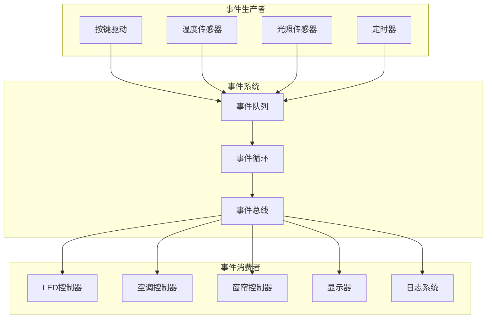

# 事件驱动架构设计


## 概述

事件驱动架构（Event-Driven Architecture, EDA）是一种以事件为核心的软件架构模式，系统的各个组件通过产生、检测和响应事件来进行交互。在嵌入式系统中，事件驱动架构能够有效处理异步事件、提高系统响应性、降低模块间耦合度，是构建复杂嵌入式应用的重要架构模式。

### 什么是事件驱动架构

**事件（Event）** 是系统中发生的有意义的状态变化或动作，例如：
- 按键按下
- 传感器数据更新
- 定时器超时
- 通信数据到达
- 系统状态改变

**事件驱动架构的核心思想**：
- 组件之间通过事件进行通信，而不是直接调用
- 事件生产者（Producer）不需要知道谁会处理事件
- 事件消费者（Consumer）不需要知道事件从哪里来
- 通过事件总线（Event Bus）或消息队列解耦组件

### 为什么使用事件驱动架构

**传统调用方式的问题**：

```c
// 传统方式：直接调用，紧耦合
void button_handler(void) {
    // 按键处理直接调用多个模块
    led_toggle();           // 直接依赖LED模块
    buzzer_beep();          // 直接依赖蜂鸣器模块
    display_update();       // 直接依赖显示模块
    log_event("Button");    // 直接依赖日志模块
}
```

**问题分析**：
1. **强耦合**：按键处理器直接依赖所有响应模块
2. **难扩展**：添加新功能需要修改按键处理器
3. **难测试**：测试按键处理需要所有依赖模块
4. **同步阻塞**：所有处理必须在按键中断中完成

**事件驱动方式**：

```c
// 事件驱动方式：发布事件，松耦合
void button_handler(void) {
    // 只负责发布事件
    Event evt = {
        .type = EVENT_BUTTON_PRESSED,
        .timestamp = get_timestamp(),
        .data = NULL
    };
    event_publish(&evt);  // 发布事件，不关心谁处理
}

// 各模块独立订阅和处理事件
void led_module_init(void) {
    event_subscribe(EVENT_BUTTON_PRESSED, led_event_handler);
}

void buzzer_module_init(void) {
    event_subscribe(EVENT_BUTTON_PRESSED, buzzer_event_handler);
}
```

**优势**：
- **低耦合**：组件之间通过事件间接通信
- **易扩展**：添加新功能只需订阅事件
- **易测试**：可以独立测试每个组件
- **异步处理**：事件可以在合适的时机处理


## 背景知识

### 事件驱动架构的核心概念

#### 1. 事件（Event）

事件是系统中发生的有意义的状态变化，通常包含以下信息：

```c
typedef struct {
    uint16_t type;        // 事件类型
    uint32_t timestamp;   // 时间戳
    void* data;           // 事件数据
    uint16_t dataSize;    // 数据大小
} Event;
```

**事件类型**：
- **系统事件**：启动、关机、错误
- **硬件事件**：按键、中断、传感器
- **定时事件**：定时器超时、周期任务
- **应用事件**：状态变化、用户操作

#### 2. 事件生产者（Event Producer）

事件生产者负责检测和发布事件：

```c
// 按键驱动作为事件生产者
void button_isr(void) {
    Event evt = {
        .type = EVENT_BUTTON_PRESSED,
        .timestamp = HAL_GetTick(),
        .data = &button_id,
        .dataSize = sizeof(button_id)
    };
    event_publish(&evt);
}
```

#### 3. 事件消费者（Event Consumer）

事件消费者订阅并处理感兴趣的事件：

```c
// LED控制器作为事件消费者
void led_event_handler(Event* evt) {
    if (evt->type == EVENT_BUTTON_PRESSED) {
        led_toggle();
    }
}

void led_init(void) {
    event_subscribe(EVENT_BUTTON_PRESSED, led_event_handler);
}
```

#### 4. 事件总线（Event Bus）

事件总线是事件分发的中心，负责：
- 接收事件发布请求
- 维护订阅者列表
- 将事件分发给订阅者

```c
typedef struct {
    EventHandler handlers[MAX_HANDLERS];  // 事件处理器列表
    uint8_t handlerCount;                 // 处理器数量
} EventBus;
```

### 事件驱动 vs 轮询

**轮询方式**：
```c
// 主循环不断轮询
while (1) {
    if (button_is_pressed()) {
        handle_button();
    }
    if (sensor_data_ready()) {
        handle_sensor();
    }
    if (uart_data_available()) {
        handle_uart();
    }
    // 浪费CPU资源
}
```

**事件驱动方式**：
```c
// 主循环处理事件队列
while (1) {
    Event evt;
    if (event_queue_get(&evt, TIMEOUT_MS)) {
        event_dispatch(&evt);  // 分发事件
    } else {
        // 没有事件时可以进入低功耗模式
        enter_sleep_mode();
    }
}
```

**对比**：

| 特性 | 轮询方式 | 事件驱动方式 |
|------|----------|--------------|
| CPU利用率 | 持续占用 | 按需使用 |
| 响应延迟 | 取决于轮询周期 | 实时响应 |
| 功耗 | 高 | 低（可休眠） |
| 代码复杂度 | 简单 | 中等 |
| 扩展性 | 差 | 好 |


## 核心内容

### 1. 事件系统的基本实现

#### 1.1 事件定义

```c
// event.h
#ifndef EVENT_H
#define EVENT_H

#include <stdint.h>
#include <stdbool.h>

// 事件类型定义
typedef enum {
    EVENT_NONE = 0,
    
    // 系统事件 (1-99)
    EVENT_SYSTEM_INIT = 1,
    EVENT_SYSTEM_ERROR = 2,
    EVENT_SYSTEM_SHUTDOWN = 3,
    
    // 硬件事件 (100-199)
    EVENT_BUTTON_PRESSED = 100,
    EVENT_BUTTON_RELEASED = 101,
    EVENT_SENSOR_DATA_READY = 102,
    EVENT_UART_DATA_RECEIVED = 103,
    
    // 定时事件 (200-299)
    EVENT_TIMER_1S = 200,
    EVENT_TIMER_100MS = 201,
    
    // 应用事件 (300-399)
    EVENT_STATE_CHANGED = 300,
    EVENT_DATA_UPDATED = 301,
    
    EVENT_MAX
} EventType;

// 事件结构
typedef struct {
    EventType type;       // 事件类型
    uint32_t timestamp;   // 时间戳（毫秒）
    void* data;           // 事件数据指针
    uint16_t dataSize;    // 数据大小
} Event;

// 事件处理器函数类型
typedef void (*EventHandler)(Event* evt);

#endif // EVENT_H
```

#### 1.2 事件队列实现

```c
// event_queue.h
#ifndef EVENT_QUEUE_H
#define EVENT_QUEUE_H

#include "event.h"

#define EVENT_QUEUE_SIZE 32  // 队列大小

typedef struct {
    Event events[EVENT_QUEUE_SIZE];  // 事件缓冲区
    uint8_t head;                    // 队列头
    uint8_t tail;                    // 队列尾
    uint8_t count;                   // 当前事件数量
} EventQueue;

// 初始化事件队列
void event_queue_init(EventQueue* queue);

// 向队列添加事件
bool event_queue_put(EventQueue* queue, Event* evt);

// 从队列获取事件
bool event_queue_get(EventQueue* queue, Event* evt);

// 检查队列是否为空
bool event_queue_is_empty(EventQueue* queue);

// 检查队列是否已满
bool event_queue_is_full(EventQueue* queue);

// 获取队列中事件数量
uint8_t event_queue_count(EventQueue* queue);

#endif // EVENT_QUEUE_H
```

```c
// event_queue.c
#include "event_queue.h"
#include <string.h>

void event_queue_init(EventQueue* queue) {
    queue->head = 0;
    queue->tail = 0;
    queue->count = 0;
    memset(queue->events, 0, sizeof(queue->events));
}

bool event_queue_put(EventQueue* queue, Event* evt) {
    if (event_queue_is_full(queue)) {
        return false;  // 队列已满
    }
    
    // 复制事件到队列
    memcpy(&queue->events[queue->tail], evt, sizeof(Event));
    
    // 更新队列尾指针（循环队列）
    queue->tail = (queue->tail + 1) % EVENT_QUEUE_SIZE;
    queue->count++;
    
    return true;
}

bool event_queue_get(EventQueue* queue, Event* evt) {
    if (event_queue_is_empty(queue)) {
        return false;  // 队列为空
    }
    
    // 复制事件从队列
    memcpy(evt, &queue->events[queue->head], sizeof(Event));
    
    // 更新队列头指针（循环队列）
    queue->head = (queue->head + 1) % EVENT_QUEUE_SIZE;
    queue->count--;
    
    return true;
}

bool event_queue_is_empty(EventQueue* queue) {
    return queue->count == 0;
}

bool event_queue_is_full(EventQueue* queue) {
    return queue->count >= EVENT_QUEUE_SIZE;
}

uint8_t event_queue_count(EventQueue* queue) {
    return queue->count;
}
```


#### 1.3 事件总线实现

```c
// event_bus.h
#ifndef EVENT_BUS_H
#define EVENT_BUS_H

#include "event.h"

#define MAX_SUBSCRIBERS 16  // 每个事件类型的最大订阅者数量

// 订阅者信息
typedef struct {
    EventHandler handler;  // 事件处理函数
    bool active;           // 是否激活
} Subscriber;

// 事件总线
typedef struct {
    Subscriber subscribers[EVENT_MAX][MAX_SUBSCRIBERS];  // 订阅者列表
} EventBus;

// 初始化事件总线
void event_bus_init(EventBus* bus);

// 订阅事件
bool event_bus_subscribe(EventBus* bus, EventType type, EventHandler handler);

// 取消订阅
bool event_bus_unsubscribe(EventBus* bus, EventType type, EventHandler handler);

// 发布事件
void event_bus_publish(EventBus* bus, Event* evt);

// 分发事件给所有订阅者
void event_bus_dispatch(EventBus* bus, Event* evt);

#endif // EVENT_BUS_H
```

```c
// event_bus.c
#include "event_bus.h"
#include <string.h>

void event_bus_init(EventBus* bus) {
    memset(bus->subscribers, 0, sizeof(bus->subscribers));
}

bool event_bus_subscribe(EventBus* bus, EventType type, EventHandler handler) {
    if (type >= EVENT_MAX || handler == NULL) {
        return false;
    }
    
    // 查找空闲的订阅者槽位
    for (int i = 0; i < MAX_SUBSCRIBERS; i++) {
        if (!bus->subscribers[type][i].active) {
            bus->subscribers[type][i].handler = handler;
            bus->subscribers[type][i].active = true;
            return true;
        }
    }
    
    return false;  // 订阅者已满
}

bool event_bus_unsubscribe(EventBus* bus, EventType type, EventHandler handler) {
    if (type >= EVENT_MAX || handler == NULL) {
        return false;
    }
    
    // 查找并移除订阅者
    for (int i = 0; i < MAX_SUBSCRIBERS; i++) {
        if (bus->subscribers[type][i].active &&
            bus->subscribers[type][i].handler == handler) {
            bus->subscribers[type][i].active = false;
            bus->subscribers[type][i].handler = NULL;
            return true;
        }
    }
    
    return false;  // 未找到订阅者
}

void event_bus_publish(EventBus* bus, Event* evt) {
    // 直接分发事件（同步方式）
    event_bus_dispatch(bus, evt);
}

void event_bus_dispatch(EventBus* bus, Event* evt) {
    if (evt->type >= EVENT_MAX) {
        return;
    }
    
    // 调用所有订阅者的处理函数
    for (int i = 0; i < MAX_SUBSCRIBERS; i++) {
        if (bus->subscribers[evt->type][i].active) {
            EventHandler handler = bus->subscribers[evt->type][i].handler;
            if (handler) {
                handler(evt);  // 调用事件处理函数
            }
        }
    }
}
```


### 2. 异步事件处理

#### 2.1 事件循环（Event Loop）

事件循环是事件驱动系统的核心，负责从队列中获取事件并分发：

```c
// event_loop.h
#ifndef EVENT_LOOP_H
#define EVENT_LOOP_H

#include "event.h"
#include "event_queue.h"
#include "event_bus.h"

typedef struct {
    EventQueue queue;    // 事件队列
    EventBus bus;        // 事件总线
    bool running;        // 运行标志
} EventLoop;

// 初始化事件循环
void event_loop_init(EventLoop* loop);

// 启动事件循环
void event_loop_run(EventLoop* loop);

// 停止事件循环
void event_loop_stop(EventLoop* loop);

// 发布事件到队列
bool event_loop_post(EventLoop* loop, Event* evt);

// 订阅事件
bool event_loop_subscribe(EventLoop* loop, EventType type, EventHandler handler);

#endif // EVENT_LOOP_H
```

```c
// event_loop.c
#include "event_loop.h"
#include <stdio.h>

void event_loop_init(EventLoop* loop) {
    event_queue_init(&loop->queue);
    event_bus_init(&loop->bus);
    loop->running = false;
}

void event_loop_run(EventLoop* loop) {
    loop->running = true;
    
    printf("[事件循环] 启动\n");
    
    while (loop->running) {
        Event evt;
        
        // 从队列获取事件（阻塞等待）
        if (event_queue_get(&loop->queue, &evt)) {
            printf("[事件循环] 处理事件: type=%d, timestamp=%lu\n",
                   evt.type, evt.timestamp);
            
            // 分发事件给订阅者
            event_bus_dispatch(&loop->bus, &evt);
        } else {
            // 队列为空，可以进入低功耗模式
            // 在实际系统中，这里可以使用WFI指令等待中断
            // __WFI();
        }
    }
    
    printf("[事件循环] 停止\n");
}

void event_loop_stop(EventLoop* loop) {
    loop->running = false;
}

bool event_loop_post(EventLoop* loop, Event* evt) {
    return event_queue_put(&loop->queue, evt);
}

bool event_loop_subscribe(EventLoop* loop, EventType type, EventHandler handler) {
    return event_bus_subscribe(&loop->bus, type, handler);
}
```

#### 2.2 中断安全的事件发布

在中断服务程序中发布事件需要特别注意：

```c
// 全局事件循环
extern EventLoop g_eventLoop;

// 按键中断服务程序
void EXTI0_IRQHandler(void) {
    if (EXTI_GetITStatus(EXTI_Line0) != RESET) {
        // 清除中断标志
        EXTI_ClearITPendingBit(EXTI_Line0);
        
        // 在中断中发布事件
        Event evt = {
            .type = EVENT_BUTTON_PRESSED,
            .timestamp = HAL_GetTick(),
            .data = NULL,
            .dataSize = 0
        };
        
        // 注意：在中断中只能快速发布事件，不能做复杂处理
        event_loop_post(&g_eventLoop, &evt);
    }
}

// 定时器中断服务程序
void TIM2_IRQHandler(void) {
    if (TIM_GetITStatus(TIM2, TIM_IT_Update) != RESET) {
        TIM_ClearITPendingBit(TIM2, TIM_IT_Update);
        
        // 发布定时事件
        Event evt = {
            .type = EVENT_TIMER_100MS,
            .timestamp = HAL_GetTick(),
            .data = NULL,
            .dataSize = 0
        };
        
        event_loop_post(&g_eventLoop, &evt);
    }
}
```

**中断安全注意事项**：
1. 在中断中只发布事件，不做复杂处理
2. 事件队列操作需要考虑临界区保护
3. 避免在中断中分配动态内存
4. 事件数据应该是静态或全局变量


### 3. 实践示例：智能家居控制系统

#### 3.1 系统架构



#### 3.2 模块实现

**LED控制器模块**：

```c
// led_controller.c
#include "event_loop.h"
#include <stdio.h>

// LED状态
static bool led_state = false;

// LED事件处理器
void led_event_handler(Event* evt) {
    switch (evt->type) {
        case EVENT_BUTTON_PRESSED:
            // 按键按下，切换LED状态
            led_state = !led_state;
            printf("[LED] 状态切换: %s\n", led_state ? "ON" : "OFF");
            break;
            
        case EVENT_TIMER_1S:
            // 定时闪烁
            if (led_state) {
                printf("[LED] 闪烁\n");
            }
            break;
            
        default:
            break;
    }
}

// LED控制器初始化
void led_controller_init(EventLoop* loop) {
    printf("[LED] 初始化控制器\n");
    
    // 订阅感兴趣的事件
    event_loop_subscribe(loop, EVENT_BUTTON_PRESSED, led_event_handler);
    event_loop_subscribe(loop, EVENT_TIMER_1S, led_event_handler);
}
```

**空调控制器模块**：

```c
// ac_controller.c
#include "event_loop.h"
#include <stdio.h>

// 空调状态
typedef struct {
    bool power;           // 电源状态
    float targetTemp;     // 目标温度
    float currentTemp;    // 当前温度
} ACState;

static ACState ac_state = {
    .power = false,
    .targetTemp = 26.0f,
    .currentTemp = 25.0f
};

// 空调事件处理器
void ac_event_handler(Event* evt) {
    switch (evt->type) {
        case EVENT_BUTTON_PRESSED:
            // 按键按下，切换空调电源
            ac_state.power = !ac_state.power;
            printf("[空调] 电源: %s\n", ac_state.power ? "ON" : "OFF");
            break;
            
        case EVENT_SENSOR_DATA_READY:
            // 传感器数据更新
            if (evt->data && evt->dataSize == sizeof(float)) {
                ac_state.currentTemp = *(float*)evt->data;
                printf("[空调] 当前温度: %.1f°C\n", ac_state.currentTemp);
                
                // 温度控制逻辑
                if (ac_state.power) {
                    if (ac_state.currentTemp > ac_state.targetTemp + 1.0f) {
                        printf("[空调] 开始制冷\n");
                    } else if (ac_state.currentTemp < ac_state.targetTemp - 1.0f) {
                        printf("[空调] 开始制热\n");
                    } else {
                        printf("[空调] 温度适宜，待机\n");
                    }
                }
            }
            break;
            
        default:
            break;
    }
}

// 空调控制器初始化
void ac_controller_init(EventLoop* loop) {
    printf("[空调] 初始化控制器\n");
    
    // 订阅感兴趣的事件
    event_loop_subscribe(loop, EVENT_BUTTON_PRESSED, ac_event_handler);
    event_loop_subscribe(loop, EVENT_SENSOR_DATA_READY, ac_event_handler);
}
```

**窗帘控制器模块**：

```c
// curtain_controller.c
#include "event_loop.h"
#include <stdio.h>

// 窗帘状态
typedef enum {
    CURTAIN_CLOSED = 0,
    CURTAIN_OPEN = 100
} CurtainPosition;

static uint8_t curtain_position = CURTAIN_CLOSED;

// 窗帘事件处理器
void curtain_event_handler(Event* evt) {
    switch (evt->type) {
        case EVENT_SENSOR_DATA_READY:
            // 根据光照强度自动调节窗帘
            if (evt->data && evt->dataSize == sizeof(uint16_t)) {
                uint16_t light_level = *(uint16_t*)evt->data;
                printf("[窗帘] 光照强度: %d lux\n", light_level);
                
                if (light_level > 1000) {
                    // 光照强，关闭窗帘
                    curtain_position = CURTAIN_CLOSED;
                    printf("[窗帘] 自动关闭（光照过强）\n");
                } else if (light_level < 200) {
                    // 光照弱，打开窗帘
                    curtain_position = CURTAIN_OPEN;
                    printf("[窗帘] 自动打开（光照不足）\n");
                }
            }
            break;
            
        default:
            break;
    }
}

// 窗帘控制器初始化
void curtain_controller_init(EventLoop* loop) {
    printf("[窗帘] 初始化控制器\n");
    
    // 订阅光照传感器事件
    event_loop_subscribe(loop, EVENT_SENSOR_DATA_READY, curtain_event_handler);
}
```


#### 3.3 主程序

```c
// main.c
#include "event_loop.h"
#include <stdio.h>
#include <stdlib.h>

// 全局事件循环
EventLoop g_eventLoop;

// 外部模块初始化函数
extern void led_controller_init(EventLoop* loop);
extern void ac_controller_init(EventLoop* loop);
extern void curtain_controller_init(EventLoop* loop);

// 模拟按键按下
void simulate_button_press(void) {
    Event evt = {
        .type = EVENT_BUTTON_PRESSED,
        .timestamp = HAL_GetTick(),
        .data = NULL,
        .dataSize = 0
    };
    event_loop_post(&g_eventLoop, &evt);
}

// 模拟温度传感器数据
void simulate_temperature_sensor(float temp) {
    static float temperature = temp;
    
    Event evt = {
        .type = EVENT_SENSOR_DATA_READY,
        .timestamp = HAL_GetTick(),
        .data = &temperature,
        .dataSize = sizeof(float)
    };
    event_loop_post(&g_eventLoop, &evt);
}

// 模拟光照传感器数据
void simulate_light_sensor(uint16_t light) {
    static uint16_t light_level = light;
    
    Event evt = {
        .type = EVENT_SENSOR_DATA_READY,
        .timestamp = HAL_GetTick(),
        .data = &light_level,
        .dataSize = sizeof(uint16_t)
    };
    event_loop_post(&g_eventLoop, &evt);
}

// 模拟定时器事件
void simulate_timer_event(void) {
    Event evt = {
        .type = EVENT_TIMER_1S,
        .timestamp = HAL_GetTick(),
        .data = NULL,
        .dataSize = 0
    };
    event_loop_post(&g_eventLoop, &evt);
}

int main(void) {
    printf("=== 事件驱动架构示例：智能家居控制系统 ===\n\n");
    
    // 初始化事件循环
    event_loop_init(&g_eventLoop);
    
    // 初始化各个控制器模块
    led_controller_init(&g_eventLoop);
    ac_controller_init(&g_eventLoop);
    curtain_controller_init(&g_eventLoop);
    
    printf("\n--- 系统初始化完成 ---\n\n");
    
    // 模拟一系列事件
    printf("场景1：用户按下按键\n");
    simulate_button_press();
    
    printf("\n场景2：温度传感器上报数据\n");
    simulate_temperature_sensor(28.5f);
    
    printf("\n场景3：光照传感器上报数据\n");
    simulate_light_sensor(1200);
    
    printf("\n场景4：定时器事件\n");
    simulate_timer_event();
    
    printf("\n场景5：再次按下按键\n");
    simulate_button_press();
    
    printf("\n--- 开始事件循环 ---\n");
    
    // 启动事件循环（实际应用中会一直运行）
    // 这里为了演示，处理完队列中的事件后就停止
    while (!event_queue_is_empty(&g_eventLoop.queue)) {
        Event evt;
        if (event_queue_get(&g_eventLoop.queue, &evt)) {
            printf("\n[事件循环] 处理事件: type=%d\n", evt.type);
            event_bus_dispatch(&g_eventLoop.bus, &evt);
        }
    }
    
    printf("\n=== 演示结束 ===\n");
    
    return 0;
}
```

**运行结果**：

```
=== 事件驱动架构示例：智能家居控制系统 ===

[LED] 初始化控制器
[空调] 初始化控制器
[窗帘] 初始化控制器

--- 系统初始化完成 ---

场景1：用户按下按键

场景2：温度传感器上报数据

场景3：光照传感器上报数据

场景4：定时器事件

场景5：再次按下按键

--- 开始事件循环 ---

[事件循环] 处理事件: type=100
[LED] 状态切换: ON
[空调] 电源: ON

[事件循环] 处理事件: type=102
[空调] 当前温度: 28.5°C
[空调] 开始制冷
[窗帘] 光照强度: 1200 lux
[窗帘] 自动关闭（光照过强）

[事件循环] 处理事件: type=200
[LED] 闪烁

[事件循环] 处理事件: type=100
[LED] 状态切换: OFF
[空调] 电源: OFF

=== 演示结束 ===
```


### 4. 高级特性

#### 4.1 事件优先级

为不同类型的事件设置优先级，确保重要事件优先处理：

```c
typedef enum {
    PRIORITY_LOW = 0,
    PRIORITY_NORMAL = 1,
    PRIORITY_HIGH = 2,
    PRIORITY_CRITICAL = 3
} EventPriority;

typedef struct {
    Event event;
    EventPriority priority;
} PriorityEvent;

// 优先级队列实现
typedef struct {
    PriorityEvent events[EVENT_QUEUE_SIZE];
    uint8_t count;
} PriorityEventQueue;

// 按优先级插入事件
bool priority_queue_put(PriorityEventQueue* queue, Event* evt, EventPriority priority) {
    if (queue->count >= EVENT_QUEUE_SIZE) {
        return false;
    }
    
    // 找到插入位置（按优先级排序）
    int insert_pos = queue->count;
    for (int i = 0; i < queue->count; i++) {
        if (priority > queue->events[i].priority) {
            insert_pos = i;
            break;
        }
    }
    
    // 移动后面的事件
    for (int i = queue->count; i > insert_pos; i--) {
        queue->events[i] = queue->events[i-1];
    }
    
    // 插入新事件
    queue->events[insert_pos].event = *evt;
    queue->events[insert_pos].priority = priority;
    queue->count++;
    
    return true;
}
```

#### 4.2 事件过滤

允许订阅者设置过滤条件，只接收满足条件的事件：

```c
// 事件过滤器类型
typedef bool (*EventFilter)(Event* evt, void* context);

// 带过滤器的订阅
typedef struct {
    EventHandler handler;
    EventFilter filter;
    void* filterContext;
    bool active;
} FilteredSubscriber;

// 订阅时指定过滤器
bool event_bus_subscribe_filtered(EventBus* bus,
                                  EventType type,
                                  EventHandler handler,
                                  EventFilter filter,
                                  void* context) {
    // 实现略...
}

// 示例：只处理温度高于30度的事件
bool temperature_filter(Event* evt, void* context) {
    if (evt->data && evt->dataSize == sizeof(float)) {
        float temp = *(float*)evt->data;
        float threshold = *(float*)context;
        return temp > threshold;
    }
    return false;
}

// 使用过滤器订阅
float threshold = 30.0f;
event_bus_subscribe_filtered(&bus,
                             EVENT_SENSOR_DATA_READY,
                             high_temp_handler,
                             temperature_filter,
                             &threshold);
```

#### 4.3 事件聚合

将多个相关事件聚合成一个复合事件：

```c
// 事件聚合器
typedef struct {
    Event events[4];      // 待聚合的事件
    uint8_t count;        // 已收集的事件数
    uint8_t required;     // 需要的事件数
    EventType outputType; // 输出事件类型
} EventAggregator;

// 添加事件到聚合器
bool aggregator_add_event(EventAggregator* agg, Event* evt) {
    if (agg->count >= agg->required) {
        return false;
    }
    
    agg->events[agg->count++] = *evt;
    
    // 如果收集齐了，生成聚合事件
    if (agg->count == agg->required) {
        Event aggregated_evt = {
            .type = agg->outputType,
            .timestamp = HAL_GetTick(),
            .data = agg->events,
            .dataSize = sizeof(Event) * agg->count
        };
        
        // 发布聚合事件
        event_loop_post(&g_eventLoop, &aggregated_evt);
        
        // 重置聚合器
        agg->count = 0;
        return true;
    }
    
    return false;
}
```

#### 4.4 事件重放

记录和重放事件序列，用于调试和测试：

```c
// 事件记录器
typedef struct {
    Event* events;        // 事件缓冲区
    uint16_t capacity;    // 容量
    uint16_t count;       // 已记录的事件数
    bool recording;       // 是否正在记录
} EventRecorder;

// 开始记录
void recorder_start(EventRecorder* recorder) {
    recorder->count = 0;
    recorder->recording = true;
}

// 记录事件
void recorder_record(EventRecorder* recorder, Event* evt) {
    if (recorder->recording && recorder->count < recorder->capacity) {
        recorder->events[recorder->count++] = *evt;
    }
}

// 停止记录
void recorder_stop(EventRecorder* recorder) {
    recorder->recording = false;
}

// 重放事件
void recorder_replay(EventRecorder* recorder, EventLoop* loop) {
    for (uint16_t i = 0; i < recorder->count; i++) {
        event_loop_post(loop, &recorder->events[i]);
    }
}
```


## 深入理解

### 1. 事件驱动架构的优势

#### 1.1 解耦性

**传统方式**：
```c
// 模块A直接调用模块B、C、D
void moduleA_process(void) {
    moduleB_update();  // 直接依赖
    moduleC_update();  // 直接依赖
    moduleD_update();  // 直接依赖
}
```

**事件驱动方式**：
```c
// 模块A只发布事件，不知道谁会处理
void moduleA_process(void) {
    Event evt = {.type = EVENT_DATA_READY};
    event_publish(&evt);  // 间接通信
}

// 模块B、C、D独立订阅
void moduleB_init(void) {
    event_subscribe(EVENT_DATA_READY, moduleB_handler);
}
```

**优势**：
- 模块之间没有直接依赖
- 添加新模块不需要修改现有代码
- 模块可以独立开发和测试

#### 1.2 可扩展性

添加新功能只需：
1. 定义新的事件类型
2. 实现事件处理器
3. 订阅相关事件

不需要修改现有代码，符合开闭原则（对扩展开放，对修改关闭）。

#### 1.3 异步处理

事件可以在合适的时机处理，不会阻塞事件生产者：

```c
// 中断中快速发布事件
void sensor_isr(void) {
    Event evt = {.type = EVENT_SENSOR_DATA};
    event_post(&evt);  // 快速返回，不阻塞中断
}

// 主循环中慢慢处理
void main_loop(void) {
    Event evt;
    if (event_get(&evt)) {
        // 在主循环中处理，不影响中断响应
        process_sensor_data(&evt);
    }
}
```

#### 1.4 可测试性

可以轻松创建测试事件，验证系统行为：

```c
// 测试用例
void test_button_handler(void) {
    // 创建测试事件
    Event evt = {.type = EVENT_BUTTON_PRESSED};
    
    // 发布事件
    event_publish(&evt);
    
    // 验证结果
    assert(led_is_on());
}
```

### 2. 事件驱动架构的挑战

#### 2.1 调试困难

事件驱动系统的执行流程不是线性的，调试时难以追踪：

**解决方案**：
- 添加事件日志记录
- 使用事件追踪工具
- 实现事件重放功能

```c
// 事件日志
void event_log(Event* evt) {
    printf("[%lu] Event: type=%d, data=%p\n",
           evt->timestamp, evt->type, evt->data);
}
```

#### 2.2 事件顺序

多个事件的处理顺序可能影响系统行为：

**解决方案**：
- 使用事件优先级
- 实现事件依赖关系
- 使用事件序列号

```c
typedef struct {
    Event event;
    uint32_t sequence;  // 序列号
} SequencedEvent;
```

#### 2.3 内存管理

事件数据的生命周期管理需要特别注意：

**解决方案**：
- 使用静态内存分配
- 实现事件数据的引用计数
- 明确事件数据的所有权

```c
// 方案1：事件数据使用静态缓冲区
static uint8_t event_data_buffer[256];

// 方案2：事件数据复制到队列
void event_post_with_copy(Event* evt) {
    Event copied_evt = *evt;
    if (evt->data && evt->dataSize > 0) {
        // 复制数据
        void* data_copy = malloc(evt->dataSize);
        memcpy(data_copy, evt->data, evt->dataSize);
        copied_evt.data = data_copy;
    }
    event_queue_put(&queue, &copied_evt);
}
```

#### 2.4 性能开销

事件系统引入了额外的开销：

**优化方案**：
- 使用高效的队列实现（环形缓冲区）
- 减少事件复制
- 使用内联函数
- 避免动态内存分配

```c
// 使用内联函数减少函数调用开销
static inline bool event_queue_is_empty(EventQueue* queue) {
    return queue->count == 0;
}
```

### 3. 性能考虑

#### 3.1 事件队列大小

队列太小会导致事件丢失，太大会浪费内存：

```c
// 根据系统特性选择合适的队列大小
#define EVENT_QUEUE_SIZE 32  // 经验值：峰值事件率 × 处理延迟

// 监控队列使用情况
void monitor_queue_usage(EventQueue* queue) {
    uint8_t usage = (queue->count * 100) / EVENT_QUEUE_SIZE;
    if (usage > 80) {
        printf("警告：事件队列使用率 %d%%\n", usage);
    }
}
```

#### 3.2 事件处理时间

事件处理器应该快速返回，避免阻塞事件循环：

```c
// 好的做法：快速处理
void quick_handler(Event* evt) {
    // 简单的状态更新
    led_toggle();
}

// 不好的做法：耗时操作
void slow_handler(Event* evt) {
    // 避免在事件处理器中做耗时操作
    HAL_Delay(1000);  // ❌ 阻塞事件循环
    
    // 应该：
    // 1. 设置标志位，在主循环中处理
    // 2. 或者发布新事件，由专门的任务处理
}
```

#### 3.3 中断优先级

合理设置中断优先级，避免事件丢失：

```c
// 高优先级中断：紧急事件
void critical_isr(void) {
    Event evt = {.type = EVENT_CRITICAL};
    event_post_from_isr(&evt);  // 使用中断安全的发布函数
}

// 低优先级中断：普通事件
void normal_isr(void) {
    Event evt = {.type = EVENT_NORMAL};
    event_post_from_isr(&evt);
}
```


## 常见问题

### Q1: 事件驱动架构适合所有嵌入式系统吗？

**A**: 不一定。事件驱动架构适合以下场景：
- 系统有多个异步事件源（按键、传感器、通信等）
- 需要良好的模块解耦和可扩展性
- 系统复杂度较高，有多个功能模块
- 需要支持动态功能配置

对于简单的单一功能系统，传统的轮询或状态机可能更简单高效。

### Q2: 事件队列满了怎么办？

**A**: 有几种处理策略：

1. **丢弃新事件**（默认策略）
```c
bool event_post(Event* evt) {
    if (event_queue_is_full(&queue)) {
        printf("警告：事件队列已满，丢弃事件 type=%d\n", evt->type);
        return false;
    }
    return event_queue_put(&queue, evt);
}
```

2. **覆盖旧事件**
```c
bool event_post_overwrite(Event* evt) {
    if (event_queue_is_full(&queue)) {
        Event old_evt;
        event_queue_get(&queue, &old_evt);  // 移除最旧的事件
    }
    return event_queue_put(&queue, evt);
}
```

3. **阻塞等待**（不推荐在中断中使用）
```c
bool event_post_blocking(Event* evt, uint32_t timeout) {
    uint32_t start = HAL_GetTick();
    while (event_queue_is_full(&queue)) {
        if (HAL_GetTick() - start > timeout) {
            return false;  // 超时
        }
    }
    return event_queue_put(&queue, evt);
}
```

4. **增大队列**或**优化事件处理速度**

### Q3: 如何保证事件处理的原子性？

**A**: 使用临界区保护：

```c
// 方案1：关闭中断
void event_post_atomic(Event* evt) {
    __disable_irq();
    event_queue_put(&queue, evt);
    __enable_irq();
}

// 方案2：使用互斥锁（RTOS环境）
void event_post_mutex(Event* evt) {
    osMutexWait(event_mutex, osWaitForever);
    event_queue_put(&queue, evt);
    osMutexRelease(event_mutex);
}

// 方案3：使用无锁队列（高级）
// 使用原子操作实现无锁队列
```

### Q4: 事件数据应该如何管理？

**A**: 几种常见方案：

1. **静态数据**（推荐）
```c
static float sensor_data;
Event evt = {
    .type = EVENT_SENSOR_DATA,
    .data = &sensor_data,
    .dataSize = sizeof(sensor_data)
};
```

2. **数据复制**
```c
typedef struct {
    Event event;
    uint8_t data[64];  // 内嵌数据
} EventWithData;
```

3. **引用计数**（复杂场景）
```c
typedef struct {
    void* data;
    uint32_t refCount;
} SharedEventData;
```

### Q5: 如何调试事件驱动系统？

**A**: 调试技巧：

1. **事件日志**
```c
void event_log(Event* evt) {
    printf("[%lu] Event: type=%d (%s)\n",
           evt->timestamp,
           evt->type,
           event_type_to_string(evt->type));
}
```

2. **事件统计**
```c
typedef struct {
    uint32_t posted;
    uint32_t processed;
    uint32_t dropped;
} EventStats;

void print_event_stats(EventStats* stats) {
    printf("Posted: %lu, Processed: %lu, Dropped: %lu\n",
           stats->posted, stats->processed, stats->dropped);
}
```

3. **事件追踪**
```c
#define EVENT_TRACE_SIZE 100
Event event_trace[EVENT_TRACE_SIZE];
uint8_t trace_index = 0;

void event_trace_add(Event* evt) {
    event_trace[trace_index] = *evt;
    trace_index = (trace_index + 1) % EVENT_TRACE_SIZE;
}
```

### Q6: 事件驱动和状态机如何结合？

**A**: 两者可以很好地结合：

```c
// 状态机作为事件处理器
typedef enum {
    STATE_IDLE,
    STATE_RUNNING,
    STATE_PAUSED
} SystemState;

static SystemState current_state = STATE_IDLE;

void state_machine_handler(Event* evt) {
    switch (current_state) {
        case STATE_IDLE:
            if (evt->type == EVENT_START) {
                current_state = STATE_RUNNING;
                printf("状态转换: IDLE -> RUNNING\n");
            }
            break;
            
        case STATE_RUNNING:
            if (evt->type == EVENT_PAUSE) {
                current_state = STATE_PAUSED;
                printf("状态转换: RUNNING -> PAUSED\n");
            } else if (evt->type == EVENT_STOP) {
                current_state = STATE_IDLE;
                printf("状态转换: RUNNING -> IDLE\n");
            }
            break;
            
        case STATE_PAUSED:
            if (evt->type == EVENT_RESUME) {
                current_state = STATE_RUNNING;
                printf("状态转换: PAUSED -> RUNNING\n");
            }
            break;
    }
}
```


## 总结

### 核心要点

1. **事件驱动架构的本质**
   - 通过事件进行组件间通信
   - 生产者和消费者解耦
   - 异步处理提高响应性

2. **关键组件**
   - 事件（Event）：系统状态变化的表示
   - 事件队列（Event Queue）：缓冲和排序事件
   - 事件总线（Event Bus）：分发事件给订阅者
   - 事件循环（Event Loop）：驱动事件处理

3. **设计原则**
   - 保持事件处理器简单快速
   - 合理设计事件类型和数据结构
   - 注意内存管理和线程安全
   - 提供调试和监控机制

4. **适用场景**
   - 多事件源的复杂系统
   - 需要高度解耦的模块化设计
   - 异步事件处理需求
   - 需要动态扩展功能

### 最佳实践

1. **事件设计**
   - 事件类型应该语义清晰
   - 事件数据应该简洁必要
   - 使用枚举定义事件类型
   - 为事件添加时间戳

2. **队列管理**
   - 根据系统特性选择队列大小
   - 监控队列使用情况
   - 处理队列满的情况
   - 考虑使用优先级队列

3. **性能优化**
   - 使用环形缓冲区实现队列
   - 避免在事件处理器中做耗时操作
   - 减少事件复制
   - 使用内联函数

4. **调试支持**
   - 添加事件日志
   - 实现事件统计
   - 支持事件追踪
   - 提供事件重放功能

### 进一步学习

**相关主题**：
- 观察者模式：事件驱动的设计模式基础
- 状态机模式：与事件驱动结合使用
- 消息队列：更高级的事件处理机制
- RTOS事件机制：操作系统级别的事件支持

**推荐资源**：
- 《设计模式：可复用面向对象软件的基础》
- 《嵌入式系统软件架构设计》
- FreeRTOS事件组和队列文档
- Linux内核事件机制源码

**实践建议**：
1. 从简单的事件系统开始实现
2. 逐步添加高级特性（优先级、过滤等）
3. 在实际项目中应用和优化
4. 学习开源项目的事件系统实现

### 下一步

学完本文后，建议：
1. 实现一个完整的事件驱动系统
2. 在实际项目中应用事件驱动架构
3. 学习RTOS的事件机制
4. 研究微服务架构中的事件驱动模式

---

## 延伸阅读

### 相关文章

- [观察者模式在嵌入式中的应用](../beginner/05-observer-pattern.html)
- [状态机设计模式](../beginner/04-state-machine-pattern.html)
- [面向接口编程实践](./02-interface-oriented-programming.html)
- [微服务架构在嵌入式中的应用](./04-microservices-in-embedded.html)

### 参考资料

1. **书籍**
   - 《Reactive Design Patterns》by Roland Kuhn
   - 《Enterprise Integration Patterns》by Gregor Hohpe
   - 《Event-Driven Architecture》by Hugh Taylor

2. **在线资源**
   - [Martin Fowler - Event-Driven Architecture](https://martinfowler.com/articles/201701-event-driven.html)
   - [AWS - Event-Driven Architecture](https://aws.amazon.com/event-driven-architecture/)
   - [Microsoft - Event-Driven Architecture Style](https://docs.microsoft.com/en-us/azure/architecture/guide/architecture-styles/event-driven)

3. **开源项目**
   - FreeRTOS事件组和队列
   - Zephyr RTOS事件系统
   - Qt信号槽机制
   - Node.js EventEmitter

### 实践项目

1. **基础项目**：实现一个简单的事件驱动LED控制系统
2. **中级项目**：开发一个多传感器数据采集系统
3. **高级项目**：构建一个完整的智能家居控制系统
4. **挑战项目**：实现一个支持分布式事件的物联网网关

---

**文档版本**: 1.0  
**最后更新**: 2026-03-10  
**作者**: 嵌入式知识平台  
**许可**: CC BY-NC-SA 4.0

