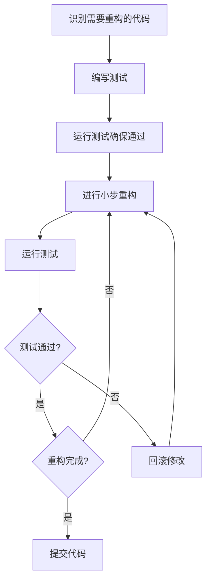

---
# 基础信息
title: "代码重构技术与实践"
description: "深入学习嵌入式系统中的代码重构原则、坏味道识别、重构技巧和测试保障方法，通过实际案例掌握持续改进代码质量的技能"
slug: "code-refactoring"

# 分类信息
domain: "10-cross-cutting-concerns"
module: "02-software-architecture-design-patterns"
content_type: "tutorial"
skill_level: "intermediate"

# 标签和关联
tags:
  - 代码重构
  - 代码质量
  - 软件工程
  - 设计模式
  - 测试驱动开发
prerequisites: []
related_contents: []

# 学习信息
estimated_time: 85
difficulty_score: 3

# 作者和版本
author: "嵌入式知识平台"
author_id: ""
created_at: "2026-03-10"
updated_at: "2026-03-10"
version: "1.0"

# 语言和本地化
language: "zh-CN"
translations: []

# 状态和可见性
status: "draft"
is_featured: false
is_premium: false

# SEO和元数据
keywords:
  - 代码重构
  - 重构技巧
  - 代码坏味道
  - 嵌入式重构
  - 代码优化
cover_image: ""
---

# 代码重构技术与实践

## 学习目标

通过本教程的学习，你将能够：

1. 理解代码重构的核心原则和重要性
2. 识别常见的代码坏味道（Code Smells）
3. 掌握嵌入式系统中常用的重构技巧
4. 学会使用测试保障重构的安全性
5. 建立持续改进代码质量的工作习惯


## 前置要求

### 知识要求
- 熟悉C/C++编程语言
- 了解基本的软件设计原则
- 掌握单元测试基础知识
- 理解函数、模块化设计概念

### 技能要求
- 能够阅读和理解现有代码
- 具备基本的调试能力
- 了解版本控制系统（Git）

### 环境要求
- C/C++编译器（GCC或Keil）
- 代码编辑器或IDE
- 单元测试框架（可选：Unity、CppUTest）
- 静态分析工具（可选：Cppcheck、PC-lint）

## 准备工作

### 1. 理解重构的定义

重构（Refactoring）是在不改变代码外部行为的前提下，对代码内部结构进行改进的过程。重构的目标是：

- **提高代码可读性**：让代码更容易理解
- **降低维护成本**：减少未来修改的难度
- **提高代码质量**：消除潜在的bug和设计问题
- **改善设计结构**：使代码更符合设计原则

### 2. 重构的黄金法则

```
重构 = 小步修改 + 频繁测试 + 保持功能不变
```

**关键原则**：
1. 每次只做一个小改动
2. 每次改动后立即运行测试
3. 确保外部行为完全不变
4. 提交前确保所有测试通过

### 3. 何时进行重构

**适合重构的时机**：
- 添加新功能之前
- 修复bug之后
- 代码审查时发现问题
- 理解代码困难时

**不适合重构的时机**：
- 项目临近交付期限
- 代码完全需要重写
- 没有测试保障的情况下


## 步骤1：识别代码坏味道

### 1.1 常见的代码坏味道

#### 坏味道1：过长的函数（Long Function）

**特征**：函数超过50行，做了太多事情

**问题**：难以理解、测试和维护

**示例**：
```c
// 坏味道：一个函数做了太多事情
void process_sensor_data(void) {
    // 读取传感器数据
    uint16_t adc_value = ADC_Read(ADC_CHANNEL_0);
    
    // 数据转换
    float voltage = (adc_value * 3.3f) / 4095.0f;
    float temperature = (voltage - 0.5f) * 100.0f;
    
    // 数据过滤
    static float filter_buffer[10];
    static uint8_t filter_index = 0;
    filter_buffer[filter_index++] = temperature;
    if (filter_index >= 10) filter_index = 0;
    
    float sum = 0;
    for (int i = 0; i < 10; i++) {
        sum += filter_buffer[i];
    }
    float filtered_temp = sum / 10.0f;
    
    // 数据校验
    if (filtered_temp < -40.0f || filtered_temp > 125.0f) {
        // 错误处理
        error_count++;
        if (error_count > 5) {
            system_error_flag = 1;
        }
        return;
    }
    
    // 数据存储
    temperature_history[history_index++] = filtered_temp;
    if (history_index >= 100) history_index = 0;
    
    // 数据显示
    char buffer[32];
    sprintf(buffer, "Temp: %.1f C", filtered_temp);
    LCD_DisplayString(0, 0, buffer);
    
    // 数据上报
    if (uart_ready) {
        UART_SendFloat(filtered_temp);
    }
}
```

#### 坏味道2：重复代码（Duplicated Code）

**特征**：相同或相似的代码出现在多个地方

**问题**：修改时需要同步多处，容易遗漏

**示例**：
```c
// 坏味道：重复的初始化代码
void init_uart1(void) {
    RCC->APB2ENR |= RCC_APB2ENR_USART1EN;
    RCC->APB2ENR |= RCC_APB2ENR_IOPAEN;
    
    GPIOA->CRH &= ~(GPIO_CRH_MODE9 | GPIO_CRH_CNF9);
    GPIOA->CRH |= GPIO_CRH_MODE9_1 | GPIO_CRH_CNF9_1;
    
    USART1->BRR = 0x341;  // 115200 baud
    USART1->CR1 = USART_CR1_TE | USART_CR1_RE | USART_CR1_UE;
}

void init_uart2(void) {
    RCC->APB1ENR |= RCC_APB1ENR_USART2EN;
    RCC->APB2ENR |= RCC_APB2ENR_IOPAEN;
    
    GPIOA->CRL &= ~(GPIO_CRL_MODE2 | GPIO_CRL_CNF2);
    GPIOA->CRL |= GPIO_CRL_MODE2_1 | GPIO_CRL_CNF2_1;
    
    USART2->BRR = 0x341;  // 115200 baud
    USART2->CR1 = USART_CR1_TE | USART_CR1_RE | USART_CR1_UE;
}
```

#### 坏味道3：过大的类/结构体（Large Class）

**特征**：结构体包含过多字段，承担过多职责

**问题**：违反单一职责原则，难以维护

**示例**：
```c
// 坏味道：一个结构体做了太多事情
typedef struct {
    // 传感器相关
    uint16_t sensor_value;
    float temperature;
    float humidity;
    
    // 通信相关
    uint8_t uart_buffer[256];
    uint8_t uart_index;
    uint8_t uart_ready;
    
    // 显示相关
    char lcd_buffer[64];
    uint8_t lcd_line;
    
    // 存储相关
    uint32_t flash_address;
    uint8_t flash_buffer[512];
    
    // 状态管理
    uint8_t system_state;
    uint8_t error_flags;
    uint32_t uptime;
} system_context_t;
```


#### 坏味道4：过长的参数列表（Long Parameter List）

**特征**：函数参数超过4个

**问题**：难以记忆参数顺序，容易传错

**示例**：
```c
// 坏味道：参数过多
void configure_timer(uint32_t prescaler, uint32_t period, 
                    uint8_t mode, uint8_t interrupt_enable,
                    uint8_t channel, uint32_t compare_value,
                    uint8_t output_mode, uint8_t polarity) {
    // 配置代码...
}
```

#### 坏味道5：神秘的数字（Magic Numbers）

**特征**：代码中出现没有解释的数字常量

**问题**：含义不明确，难以维护

**示例**：
```c
// 坏味道：魔法数字
void delay_ms(uint32_t ms) {
    for (uint32_t i = 0; i < ms * 8000; i++) {  // 8000是什么？
        __NOP();
    }
}

if (adc_value > 2048) {  // 2048代表什么？
    // 处理代码
}
```

#### 坏味道6：过度耦合（Tight Coupling）

**特征**：模块之间直接访问内部数据

**问题**：修改一个模块影响其他模块

**示例**：
```c
// 坏味道：直接访问全局变量
extern uint8_t sensor_data;  // 全局变量
extern uint8_t sensor_ready;

void display_task(void) {
    if (sensor_ready) {  // 直接访问其他模块的状态
        LCD_Display(sensor_data);  // 直接使用其他模块的数据
    }
}
```

### 1.2 识别坏味道的工具

**手动检查清单**：
```
□ 函数是否超过50行？
□ 是否有重复的代码块？
□ 函数参数是否超过4个？
□ 是否有未命名的数字常量？
□ 变量名是否清晰表达意图？
□ 是否有过深的嵌套（>3层）？
□ 注释是否过多（可能代码不够清晰）？
```

**静态分析工具**：
- **Cppcheck**：检测代码质量问题
- **PC-lint**：商业静态分析工具
- **Clang-Tidy**：LLVM的代码检查工具
- **SonarQube**：代码质量管理平台


## 步骤2：掌握基本重构技巧

### 2.1 提取函数（Extract Function）

**目的**：将长函数分解为多个小函数

**重构前**：
```c
void process_sensor_data(void) {
    // 读取传感器
    uint16_t adc_value = ADC_Read(ADC_CHANNEL_0);
    
    // 转换为温度
    float voltage = (adc_value * 3.3f) / 4095.0f;
    float temperature = (voltage - 0.5f) * 100.0f;
    
    // 滤波处理
    static float filter_buffer[10];
    static uint8_t filter_index = 0;
    filter_buffer[filter_index++] = temperature;
    if (filter_index >= 10) filter_index = 0;
    
    float sum = 0;
    for (int i = 0; i < 10; i++) {
        sum += filter_buffer[i];
    }
    float filtered_temp = sum / 10.0f;
    
    // 显示温度
    char buffer[32];
    sprintf(buffer, "Temp: %.1f C", filtered_temp);
    LCD_DisplayString(0, 0, buffer);
}
```

**重构后**：
```c
// 提取：读取原始温度
static float read_temperature(void) {
    uint16_t adc_value = ADC_Read(ADC_CHANNEL_0);
    float voltage = (adc_value * 3.3f) / 4095.0f;
    float temperature = (voltage - 0.5f) * 100.0f;
    return temperature;
}

// 提取：滤波处理
static float filter_temperature(float temperature) {
    static float filter_buffer[10] = {0};
    static uint8_t filter_index = 0;
    
    filter_buffer[filter_index++] = temperature;
    if (filter_index >= 10) {
        filter_index = 0;
    }
    
    float sum = 0;
    for (int i = 0; i < 10; i++) {
        sum += filter_buffer[i];
    }
    
    return sum / 10.0f;
}

// 提取：显示温度
static void display_temperature(float temperature) {
    char buffer[32];
    sprintf(buffer, "Temp: %.1f C", temperature);
    LCD_DisplayString(0, 0, buffer);
}

// 主函数变得清晰简洁
void process_sensor_data(void) {
    float raw_temp = read_temperature();
    float filtered_temp = filter_temperature(raw_temp);
    display_temperature(filtered_temp);
}
```

**优点**：
- 每个函数职责单一
- 函数名清晰表达意图
- 易于测试和复用
- 主函数逻辑一目了然

### 2.2 提取常量（Extract Constant）

**目的**：消除魔法数字，提高可读性

**重构前**：
```c
void init_adc(void) {
    ADC1->SMPR2 = 0x07;  // 采样时间
    ADC1->SQR1 = 0x00;   // 转换序列长度
    ADC1->CR2 = 0x01;    // 使能ADC
}

float convert_to_temperature(uint16_t adc_value) {
    float voltage = (adc_value * 3.3f) / 4095.0f;
    return (voltage - 0.5f) * 100.0f;
}
```

**重构后**：
```c
// 定义有意义的常量
#define ADC_SAMPLE_TIME_239_5_CYCLES    0x07
#define ADC_SEQUENCE_LENGTH_1           0x00
#define ADC_ENABLE                      0x01

#define ADC_REFERENCE_VOLTAGE           3.3f
#define ADC_MAX_VALUE                   4095.0f
#define TEMP_SENSOR_OFFSET              0.5f
#define TEMP_SENSOR_SCALE               100.0f

void init_adc(void) {
    ADC1->SMPR2 = ADC_SAMPLE_TIME_239_5_CYCLES;
    ADC1->SQR1 = ADC_SEQUENCE_LENGTH_1;
    ADC1->CR2 = ADC_ENABLE;
}

float convert_to_temperature(uint16_t adc_value) {
    float voltage = (adc_value * ADC_REFERENCE_VOLTAGE) / ADC_MAX_VALUE;
    return (voltage - TEMP_SENSOR_OFFSET) * TEMP_SENSOR_SCALE;
}
```

**优点**：
- 代码自解释，不需要注释
- 修改常量值只需改一处
- 避免拼写错误


### 2.3 引入参数对象（Introduce Parameter Object）

**目的**：减少参数数量，提高可读性

**重构前**：
```c
void configure_timer(uint32_t prescaler, uint32_t period, 
                    uint8_t mode, uint8_t interrupt_enable) {
    TIM2->PSC = prescaler;
    TIM2->ARR = period;
    TIM2->CR1 = mode;
    if (interrupt_enable) {
        TIM2->DIER |= TIM_DIER_UIE;
    }
}

// 调用时参数很多，容易出错
configure_timer(7200, 10000, 0x01, 1);
```

**重构后**：
```c
// 定义配置结构体
typedef struct {
    uint32_t prescaler;
    uint32_t period;
    uint8_t mode;
    uint8_t interrupt_enable;
} timer_config_t;

void configure_timer(const timer_config_t *config) {
    TIM2->PSC = config->prescaler;
    TIM2->ARR = config->period;
    TIM2->CR1 = config->mode;
    if (config->interrupt_enable) {
        TIM2->DIER |= TIM_DIER_UIE;
    }
}

// 调用时更清晰
timer_config_t timer_cfg = {
    .prescaler = 7200,
    .period = 10000,
    .mode = 0x01,
    .interrupt_enable = 1
};
configure_timer(&timer_cfg);
```

**优点**：
- 参数含义清晰
- 易于扩展新参数
- 可以提供默认配置

### 2.4 分解条件表达式（Decompose Conditional）

**目的**：简化复杂的条件判断

**重构前**：
```c
void check_system_status(void) {
    if ((temperature > 80.0f || voltage < 3.0f) && 
        (error_count > 5 || system_time > 86400)) {
        // 进入错误状态
        system_state = STATE_ERROR;
    }
}
```

**重构后**：
```c
// 提取条件判断为函数
static bool is_temperature_abnormal(float temperature) {
    return temperature > 80.0f;
}

static bool is_voltage_low(float voltage) {
    return voltage < 3.0f;
}

static bool is_error_count_high(uint8_t error_count) {
    return error_count > 5;
}

static bool is_system_timeout(uint32_t system_time) {
    const uint32_t ONE_DAY_SECONDS = 86400;
    return system_time > ONE_DAY_SECONDS;
}

static bool is_hardware_fault(void) {
    return is_temperature_abnormal(temperature) || is_voltage_low(voltage);
}

static bool is_system_fault(void) {
    return is_error_count_high(error_count) || is_system_timeout(system_time);
}

void check_system_status(void) {
    if (is_hardware_fault() && is_system_fault()) {
        system_state = STATE_ERROR;
    }
}
```

**优点**：
- 条件判断的意图清晰
- 易于单独测试每个条件
- 可以复用条件判断


### 2.5 消除重复代码（Remove Duplication）

**目的**：提取公共代码，减少重复

**重构前**：
```c
void init_uart1(void) {
    RCC->APB2ENR |= RCC_APB2ENR_USART1EN;
    RCC->APB2ENR |= RCC_APB2ENR_IOPAEN;
    
    GPIOA->CRH &= ~(GPIO_CRH_MODE9 | GPIO_CRH_CNF9);
    GPIOA->CRH |= GPIO_CRH_MODE9_1 | GPIO_CRH_CNF9_1;
    
    USART1->BRR = 0x341;
    USART1->CR1 = USART_CR1_TE | USART_CR1_RE | USART_CR1_UE;
}

void init_uart2(void) {
    RCC->APB1ENR |= RCC_APB1ENR_USART2EN;
    RCC->APB2ENR |= RCC_APB2ENR_IOPAEN;
    
    GPIOA->CRL &= ~(GPIO_CRL_MODE2 | GPIO_CRL_CNF2);
    GPIOA->CRL |= GPIO_CRL_MODE2_1 | GPIO_CRL_CNF2_1;
    
    USART2->BRR = 0x341;
    USART2->CR1 = USART_CR1_TE | USART_CR1_RE | USART_CR1_UE;
}
```

**重构后**：
```c
// 定义UART配置结构
typedef struct {
    USART_TypeDef *uart;
    uint32_t rcc_enable;
    GPIO_TypeDef *gpio;
    uint32_t gpio_pin;
    uint32_t baudrate;
} uart_config_t;

// 通用初始化函数
static void uart_init_common(const uart_config_t *config) {
    // 使能时钟
    if (config->uart == USART1) {
        RCC->APB2ENR |= config->rcc_enable;
    } else {
        RCC->APB1ENR |= config->rcc_enable;
    }
    RCC->APB2ENR |= RCC_APB2ENR_IOPAEN;
    
    // 配置GPIO
    // ... GPIO配置代码 ...
    
    // 配置UART
    config->uart->BRR = config->baudrate;
    config->uart->CR1 = USART_CR1_TE | USART_CR1_RE | USART_CR1_UE;
}

// 简化的初始化函数
void init_uart1(void) {
    uart_config_t config = {
        .uart = USART1,
        .rcc_enable = RCC_APB2ENR_USART1EN,
        .gpio = GPIOA,
        .gpio_pin = 9,
        .baudrate = 0x341
    };
    uart_init_common(&config);
}

void init_uart2(void) {
    uart_config_t config = {
        .uart = USART2,
        .rcc_enable = RCC_APB1ENR_USART2EN,
        .gpio = GPIOA,
        .gpio_pin = 2,
        .baudrate = 0x341
    };
    uart_init_common(&config);
}
```

**优点**：
- 消除重复代码
- 修改逻辑只需改一处
- 易于添加新的UART


## 步骤3：使用测试保障重构安全

### 3.1 重构前编写测试

**为什么需要测试？**
- 确保重构不改变功能
- 快速发现引入的问题
- 提供重构的信心

**测试策略**：
```c
// 1. 为现有代码编写测试
void test_temperature_conversion(void) {
    // 测试正常值
    assert(convert_to_temperature(2048) == 25.0f);
    
    // 测试边界值
    assert(convert_to_temperature(0) == -50.0f);
    assert(convert_to_temperature(4095) == 280.0f);
}

// 2. 运行测试确保通过
// 3. 进行重构
// 4. 再次运行测试确保仍然通过
```

### 3.2 单元测试示例

使用Unity测试框架：

```c
#include "unity.h"
#include "temperature_sensor.h"

void setUp(void) {
    // 每个测试前的初始化
    temperature_sensor_init();
}

void tearDown(void) {
    // 每个测试后的清理
}

// 测试温度转换
void test_temperature_conversion_normal_value(void) {
    uint16_t adc_value = 2048;  // 中间值
    float expected = 25.0f;
    float actual = convert_to_temperature(adc_value);
    TEST_ASSERT_FLOAT_WITHIN(0.1f, expected, actual);
}

// 测试边界条件
void test_temperature_conversion_min_value(void) {
    uint16_t adc_value = 0;
    float actual = convert_to_temperature(adc_value);
    TEST_ASSERT_TRUE(actual < -40.0f);
}

void test_temperature_conversion_max_value(void) {
    uint16_t adc_value = 4095;
    float actual = convert_to_temperature(adc_value);
    TEST_ASSERT_TRUE(actual > 100.0f);
}

// 测试滤波功能
void test_temperature_filter_stability(void) {
    // 输入相同值，输出应该稳定
    for (int i = 0; i < 20; i++) {
        filter_temperature(25.0f);
    }
    float result = filter_temperature(25.0f);
    TEST_ASSERT_FLOAT_WITHIN(0.1f, 25.0f, result);
}

// 测试滤波效果
void test_temperature_filter_smoothing(void) {
    // 输入波动值，输出应该平滑
    float inputs[] = {20.0f, 25.0f, 22.0f, 24.0f, 23.0f};
    float result = 0;
    
    for (int i = 0; i < 5; i++) {
        result = filter_temperature(inputs[i]);
    }
    
    // 结果应该在输入范围内
    TEST_ASSERT_TRUE(result >= 20.0f && result <= 25.0f);
}

int main(void) {
    UNITY_BEGIN();
    
    RUN_TEST(test_temperature_conversion_normal_value);
    RUN_TEST(test_temperature_conversion_min_value);
    RUN_TEST(test_temperature_conversion_max_value);
    RUN_TEST(test_temperature_filter_stability);
    RUN_TEST(test_temperature_filter_smoothing);
    
    return UNITY_END();
}
```

### 3.3 重构工作流




## 步骤4：嵌入式系统重构实战

### 4.1 案例1：重构状态机代码

**重构前**：使用大量if-else的状态机

```c
typedef enum {
    STATE_IDLE,
    STATE_READING,
    STATE_PROCESSING,
    STATE_SENDING,
    STATE_ERROR
} system_state_t;

static system_state_t current_state = STATE_IDLE;

void state_machine_update(void) {
    if (current_state == STATE_IDLE) {
        if (button_pressed) {
            start_reading();
            current_state = STATE_READING;
        }
    } else if (current_state == STATE_READING) {
        if (reading_complete) {
            current_state = STATE_PROCESSING;
        } else if (reading_error) {
            current_state = STATE_ERROR;
        }
    } else if (current_state == STATE_PROCESSING) {
        if (processing_complete) {
            current_state = STATE_SENDING;
        } else if (processing_error) {
            current_state = STATE_ERROR;
        }
    } else if (current_state == STATE_SENDING) {
        if (sending_complete) {
            current_state = STATE_IDLE;
        } else if (sending_error) {
            current_state = STATE_ERROR;
        }
    } else if (current_state == STATE_ERROR) {
        if (error_cleared) {
            current_state = STATE_IDLE;
        }
    }
}
```

**重构后**：使用函数指针表

```c
// 状态处理函数类型
typedef void (*state_handler_t)(void);

// 各状态的处理函数
static void handle_idle_state(void) {
    if (button_pressed) {
        start_reading();
        transition_to_state(STATE_READING);
    }
}

static void handle_reading_state(void) {
    if (reading_complete) {
        transition_to_state(STATE_PROCESSING);
    } else if (reading_error) {
        transition_to_state(STATE_ERROR);
    }
}

static void handle_processing_state(void) {
    if (processing_complete) {
        transition_to_state(STATE_SENDING);
    } else if (processing_error) {
        transition_to_state(STATE_ERROR);
    }
}

static void handle_sending_state(void) {
    if (sending_complete) {
        transition_to_state(STATE_IDLE);
    } else if (sending_error) {
        transition_to_state(STATE_ERROR);
    }
}

static void handle_error_state(void) {
    if (error_cleared) {
        transition_to_state(STATE_IDLE);
    }
}

// 状态处理函数表
static const state_handler_t state_handlers[] = {
    [STATE_IDLE] = handle_idle_state,
    [STATE_READING] = handle_reading_state,
    [STATE_PROCESSING] = handle_processing_state,
    [STATE_SENDING] = handle_sending_state,
    [STATE_ERROR] = handle_error_state
};

// 状态转换函数
static void transition_to_state(system_state_t new_state) {
    if (new_state < sizeof(state_handlers) / sizeof(state_handlers[0])) {
        current_state = new_state;
        log_state_transition(new_state);  // 可选：记录状态转换
    }
}

// 简化的状态机更新
void state_machine_update(void) {
    if (state_handlers[current_state] != NULL) {
        state_handlers[current_state]();
    }
}
```

**优点**：
- 每个状态的逻辑独立
- 易于添加新状态
- 代码结构清晰
- 便于单元测试


### 4.2 案例2：重构中断处理代码

**重构前**：中断函数做了太多事情

```c
void USART1_IRQHandler(void) {
    if (USART1->SR & USART_SR_RXNE) {
        uint8_t data = USART1->DR;
        
        // 数据解析
        if (data == 0xAA) {
            rx_state = RX_HEADER;
        } else if (rx_state == RX_HEADER) {
            rx_length = data;
            rx_state = RX_LENGTH;
        } else if (rx_state == RX_LENGTH) {
            rx_buffer[rx_index++] = data;
            if (rx_index >= rx_length) {
                rx_state = RX_CHECKSUM;
            }
        } else if (rx_state == RX_CHECKSUM) {
            uint8_t checksum = 0;
            for (int i = 0; i < rx_length; i++) {
                checksum += rx_buffer[i];
            }
            if (checksum == data) {
                // 处理数据
                process_received_data(rx_buffer, rx_length);
            }
            rx_state = RX_IDLE;
            rx_index = 0;
        }
    }
}
```

**重构后**：分离中断处理和业务逻辑

```c
// 中断服务函数只负责接收数据
void USART1_IRQHandler(void) {
    if (USART1->SR & USART_SR_RXNE) {
        uint8_t data = USART1->DR;
        uart_rx_buffer_put(data);  // 放入缓冲区
    }
}

// 在主循环或任务中处理数据
void uart_process_task(void) {
    uint8_t data;
    
    while (uart_rx_buffer_get(&data)) {
        uart_protocol_parse(data);  // 协议解析
    }
}

// 协议解析状态机
static void uart_protocol_parse(uint8_t data) {
    switch (rx_state) {
        case RX_IDLE:
            if (data == PROTOCOL_HEADER) {
                rx_state = RX_HEADER;
            }
            break;
            
        case RX_HEADER:
            rx_length = data;
            rx_index = 0;
            rx_state = RX_DATA;
            break;
            
        case RX_DATA:
            rx_buffer[rx_index++] = data;
            if (rx_index >= rx_length) {
                rx_state = RX_CHECKSUM;
            }
            break;
            
        case RX_CHECKSUM:
            if (verify_checksum(rx_buffer, rx_length, data)) {
                process_received_data(rx_buffer, rx_length);
            }
            rx_state = RX_IDLE;
            break;
    }
}

// 校验和验证函数
static bool verify_checksum(const uint8_t *data, uint8_t length, uint8_t checksum) {
    uint8_t calculated = 0;
    for (uint8_t i = 0; i < length; i++) {
        calculated += data[i];
    }
    return calculated == checksum;
}
```

**优点**：
- 中断函数简短快速
- 业务逻辑在主循环处理
- 易于测试和调试
- 降低中断延迟


### 4.3 案例3：重构全局变量

**重构前**：大量全局变量

```c
// 全局变量散落各处
uint8_t sensor_data[100];
uint8_t sensor_index;
float temperature;
float humidity;
uint8_t sensor_ready;
uint32_t last_update_time;
```

**重构后**：封装为模块

```c
// sensor_module.h
typedef struct {
    uint8_t data[100];
    uint8_t index;
    float temperature;
    float humidity;
    bool ready;
    uint32_t last_update_time;
} sensor_context_t;

// 初始化函数
void sensor_init(void);

// 访问接口
bool sensor_is_ready(void);
float sensor_get_temperature(void);
float sensor_get_humidity(void);
void sensor_update(void);

// sensor_module.c
static sensor_context_t sensor_ctx = {0};  // 私有变量

void sensor_init(void) {
    memset(&sensor_ctx, 0, sizeof(sensor_ctx));
}

bool sensor_is_ready(void) {
    return sensor_ctx.ready;
}

float sensor_get_temperature(void) {
    return sensor_ctx.temperature;
}

float sensor_get_humidity(void) {
    return sensor_ctx.humidity;
}

void sensor_update(void) {
    // 更新传感器数据
    sensor_ctx.temperature = read_temperature();
    sensor_ctx.humidity = read_humidity();
    sensor_ctx.ready = true;
    sensor_ctx.last_update_time = get_system_time();
}
```

**优点**：
- 数据封装，隐藏实现细节
- 通过接口访问，易于修改内部实现
- 避免命名冲突
- 便于单元测试（可以mock接口）

### 4.4 案例4：重构硬件抽象层

**重构前**：直接操作寄存器

```c
void led_on(void) {
    GPIOC->BSRR = GPIO_BSRR_BS13;
}

void led_off(void) {
    GPIOC->BSRR = GPIO_BSRR_BR13;
}

void button_init(void) {
    RCC->APB2ENR |= RCC_APB2ENR_IOPAEN;
    GPIOA->CRL &= ~GPIO_CRL_MODE0;
    GPIOA->CRL |= GPIO_CRL_CNF0_1;
}

bool button_is_pressed(void) {
    return (GPIOA->IDR & GPIO_IDR_IDR0) == 0;
}
```

**重构后**：抽象硬件接口

```c
// hal_gpio.h - 硬件抽象层
typedef enum {
    GPIO_PIN_LOW = 0,
    GPIO_PIN_HIGH = 1
} gpio_pin_state_t;

typedef enum {
    GPIO_MODE_INPUT,
    GPIO_MODE_OUTPUT,
    GPIO_MODE_ALTERNATE,
    GPIO_MODE_ANALOG
} gpio_mode_t;

typedef struct {
    GPIO_TypeDef *port;
    uint16_t pin;
} gpio_pin_t;

void hal_gpio_init(gpio_pin_t pin, gpio_mode_t mode);
void hal_gpio_write(gpio_pin_t pin, gpio_pin_state_t state);
gpio_pin_state_t hal_gpio_read(gpio_pin_t pin);

// hal_gpio.c
void hal_gpio_write(gpio_pin_t pin, gpio_pin_state_t state) {
    if (state == GPIO_PIN_HIGH) {
        pin.port->BSRR = (1 << pin.pin);
    } else {
        pin.port->BSRR = (1 << (pin.pin + 16));
    }
}

gpio_pin_state_t hal_gpio_read(gpio_pin_t pin) {
    return (pin.port->IDR & (1 << pin.pin)) ? GPIO_PIN_HIGH : GPIO_PIN_LOW;
}

// 应用层代码
static const gpio_pin_t LED_PIN = {GPIOC, 13};
static const gpio_pin_t BUTTON_PIN = {GPIOA, 0};

void led_on(void) {
    hal_gpio_write(LED_PIN, GPIO_PIN_HIGH);
}

void led_off(void) {
    hal_gpio_write(LED_PIN, GPIO_PIN_LOW);
}

bool button_is_pressed(void) {
    return hal_gpio_read(BUTTON_PIN) == GPIO_PIN_LOW;
}
```

**优点**：
- 应用代码与硬件解耦
- 易于移植到不同平台
- 便于单元测试（可以mock HAL层）
- 代码更清晰易读


## 步骤5：建立持续改进机制

### 5.1 代码审查清单

在每次代码审查时使用以下清单：

```markdown
## 可读性
- [ ] 函数名清晰表达意图
- [ ] 变量名有意义
- [ ] 没有魔法数字
- [ ] 注释解释"为什么"而非"是什么"
- [ ] 代码自解释，注释适量

## 结构
- [ ] 函数长度合理（<50行）
- [ ] 函数职责单一
- [ ] 参数数量合理（<4个）
- [ ] 嵌套层次不深（<3层）
- [ ] 没有重复代码

## 设计
- [ ] 模块职责清晰
- [ ] 接口设计合理
- [ ] 依赖关系清晰
- [ ] 易于测试
- [ ] 易于扩展

## 性能
- [ ] 没有明显的性能问题
- [ ] 内存使用合理
- [ ] 中断处理简短
- [ ] 关键路径优化

## 安全性
- [ ] 边界检查完整
- [ ] 错误处理完善
- [ ] 资源正确释放
- [ ] 没有内存泄漏风险
```

### 5.2 重构时机

**定期重构**：
```yaml
每日:
  - 提交代码前检查代码质量
  - 发现坏味道立即修复

每周:
  - 回顾本周代码
  - 识别需要重构的模块

每月:
  - 运行静态分析工具
  - 重构技术债务最高的模块

每季度:
  - 架构层面的重构
  - 更新编码规范
```

### 5.3 重构优先级

**高优先级**（立即重构）：
- 影响系统稳定性的代码
- 频繁修改的代码
- 难以理解的关键代码
- 有明显bug风险的代码

**中优先级**（计划重构）：
- 重复代码
- 过长的函数
- 复杂的条件判断
- 命名不清晰的代码

**低优先级**（可选重构）：
- 不常修改的代码
- 性能优化
- 代码风格统一

### 5.4 重构工具推荐

**静态分析工具**：
```bash
# Cppcheck - 开源C/C++静态分析
cppcheck --enable=all --inconclusive src/

# Clang-Tidy - LLVM静态分析
clang-tidy src/*.c -- -Iinclude/

# PC-lint - 商业静态分析（需要许可证）
lint-nt -i include src/*.c
```

**代码度量工具**：
```bash
# 计算代码复杂度
lizard src/

# 统计代码行数
cloc src/
```

**重构辅助工具**：
- **IDE重构功能**：VS Code、CLion的重构工具
- **版本控制**：Git用于安全回滚
- **自动化测试**：确保重构不破坏功能


## 验证方法

### 验证重构是否成功

**功能验证**：
```c
// 1. 运行所有单元测试
void run_all_tests(void) {
    RUN_TEST(test_temperature_conversion);
    RUN_TEST(test_temperature_filter);
    RUN_TEST(test_uart_protocol);
    RUN_TEST(test_state_machine);
    // ... 更多测试
}

// 2. 运行集成测试
void run_integration_tests(void) {
    test_sensor_to_display_flow();
    test_uart_communication_flow();
    test_error_handling_flow();
}

// 3. 在实际硬件上测试
void hardware_validation(void) {
    // 测试所有功能
    // 观察系统行为
    // 检查性能指标
}
```

**质量指标**：
```yaml
代码质量提升:
  - 函数平均长度: 减少30%
  - 代码重复率: 降低50%
  - 圈复杂度: 降低40%
  - 测试覆盖率: 提升到80%+

可维护性提升:
  - 新功能添加时间: 减少40%
  - Bug修复时间: 减少50%
  - 代码理解时间: 减少60%
```

## 故障排除

### 常见问题1：重构后功能异常

**症状**：重构后系统行为改变

**原因**：
- 修改了关键逻辑
- 引入了新的bug
- 测试不充分

**解决方案**：
```bash
# 1. 立即回滚到上一个工作版本
git revert HEAD

# 2. 对比代码差异
git diff HEAD~1 HEAD

# 3. 逐步重新应用修改
# 每次修改后运行测试

# 4. 使用调试器定位问题
gdb ./program
```

### 常见问题2：性能下降

**症状**：重构后系统响应变慢

**原因**：
- 增加了函数调用开销
- 引入了不必要的复制
- 算法复杂度增加

**解决方案**：
```c
// 1. 使用性能分析工具
// 找出性能瓶颈

// 2. 对关键路径使用inline
static inline float fast_convert(uint16_t value) {
    return (value * 3.3f) / 4095.0f;
}

// 3. 减少不必要的函数调用
// 在性能关键的地方可以适当牺牲抽象

// 4. 使用编译器优化
// -O2 或 -O3 优化级别
```

### 常见问题3：内存使用增加

**症状**：重构后内存占用增加

**原因**：
- 引入了额外的数据结构
- 增加了局部变量
- 栈使用增加

**解决方案**：
```c
// 1. 使用static变量代替局部变量
static uint8_t buffer[256];  // 在.bss段，不占用栈

// 2. 复用缓冲区
static uint8_t shared_buffer[512];

// 3. 使用内存池
typedef struct {
    uint8_t pool[1024];
    uint16_t used;
} memory_pool_t;

// 4. 检查栈使用
// 使用工具分析栈深度
```


## 总结

### 关键要点回顾

1. **重构的本质**
   - 改善代码内部结构
   - 不改变外部行为
   - 小步前进，频繁测试

2. **识别坏味道**
   - 过长的函数
   - 重复代码
   - 魔法数字
   - 过度耦合
   - 复杂的条件判断

3. **重构技巧**
   - 提取函数
   - 提取常量
   - 引入参数对象
   - 分解条件表达式
   - 消除重复代码

4. **测试保障**
   - 重构前编写测试
   - 每次修改后运行测试
   - 保持测试覆盖率

5. **持续改进**
   - 建立代码审查机制
   - 定期重构技术债务
   - 使用静态分析工具
   - 培养重构习惯

### 重构原则总结

```
1. 小步前进：每次只做一个小改动
2. 频繁测试：每次改动后立即测试
3. 保持功能：确保外部行为不变
4. 及时提交：通过测试后立即提交
5. 持续改进：将重构融入日常开发
```

### 嵌入式系统重构特点

**需要特别注意**：
- **性能影响**：关注函数调用开销
- **内存限制**：避免增加内存使用
- **实时性**：保证中断响应时间
- **硬件依赖**：抽象硬件接口便于移植
- **测试难度**：需要在实际硬件上验证

**推荐实践**：
- 使用HAL层抽象硬件
- 中断函数保持简短
- 关键路径使用inline
- 合理使用static变量
- 建立完善的测试框架

## 下一步学习

### 推荐阅读

**书籍**：
- 《重构：改善既有代码的设计》- Martin Fowler
- 《代码整洁之道》- Robert C. Martin
- 《修改代码的艺术》- Michael Feathers

**在线资源**：
- Refactoring Guru: https://refactoring.guru/
- Clean Code Blog: https://blog.cleancoder.com/
- Embedded Artistry: https://embeddedartistry.com/

### 实践项目

1. **重构现有项目**
   - 选择一个旧项目
   - 识别代码坏味道
   - 逐步进行重构
   - 记录改进效果

2. **建立代码规范**
   - 制定团队编码规范
   - 建立代码审查流程
   - 使用静态分析工具
   - 定期技术分享

3. **学习设计模式**
   - 了解常用设计模式
   - 在重构中应用模式
   - 理解模式的适用场景

### 进阶主题

- **测试驱动开发（TDD）**：先写测试再写代码
- **持续集成（CI）**：自动化测试和部署
- **代码度量**：使用工具量化代码质量
- **架构重构**：系统级别的重构
- **遗留代码处理**：如何安全地重构老代码

## 练习题

### 练习1：识别坏味道

分析以下代码，找出所有的代码坏味道：

```c
void f(int x, int y, int z, int w) {
    if (x > 0) {
        if (y > 0) {
            if (z > 0) {
                int r = x + y + z;
                if (r > 100) {
                    // do something
                    for (int i = 0; i < 10; i++) {
                        // ...
                    }
                } else {
                    // do something else
                }
            }
        }
    }
    
    if (w == 1) {
        // ...
    } else if (w == 2) {
        // ...
    } else if (w == 3) {
        // ...
    }
}
```

### 练习2：重构实践

重构以下代码，使其更清晰易读：

```c
void process(void) {
    uint16_t v = ADC_Read(0);
    float t = (v * 3.3 / 4095 - 0.5) * 100;
    
    if (t > 80 || t < -40) {
        // error
        return;
    }
    
    char b[32];
    sprintf(b, "T: %.1f", t);
    LCD_Display(0, 0, b);
}
```

### 练习3：添加测试

为以下函数编写单元测试：

```c
float calculate_average(const float *data, uint8_t length) {
    if (data == NULL || length == 0) {
        return 0.0f;
    }
    
    float sum = 0.0f;
    for (uint8_t i = 0; i < length; i++) {
        sum += data[i];
    }
    
    return sum / length;
}
```

---

**恭喜你完成了代码重构技术与实践教程！**

通过本教程的学习，你已经掌握了：
- 识别代码坏味道的能力
- 常用的重构技巧
- 使用测试保障重构安全
- 嵌入式系统重构的特殊考虑
- 建立持续改进的工作习惯

记住：重构是一个持续的过程，需要在日常开发中不断实践和改进。保持代码整洁，让未来的自己和团队成员感谢现在的你！
