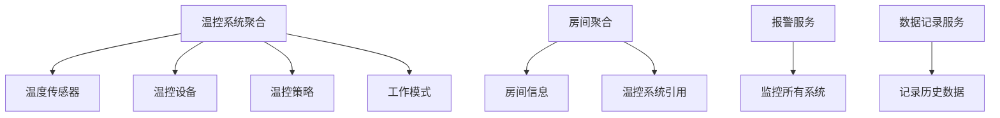

---
# 基础信息
title: "领域驱动设计(DDD)入门"
description: "深入学习领域驱动设计的核心概念、领域模型、聚合根、限界上下文和战术设计方法，掌握在嵌入式系统中应用DDD的实践技巧"
slug: "domain-driven-design"

# 分类信息
domain: "10-cross-cutting-concerns"
module: "02-software-architecture-design-patterns"
content_type: "article"
skill_level: "intermediate"

# 标签和关联
tags:
  - DDD
  - 领域驱动
  - 架构设计
  - 领域模型
  - 软件工程
prerequisites: []
related_contents: []

# 学习信息
estimated_time: 70
difficulty_score: 4

# 作者和版本
author: "嵌入式知识平台"
author_id: ""
created_at: "2026-03-10"
updated_at: "2026-03-10"
version: "1.0"

# 语言和本地化
language: "zh-CN"
translations: []

# 状态和可见性
status: "draft"
is_featured: false
is_premium: false

# SEO和元数据
keywords:
  - 领域驱动设计
  - DDD
  - 领域模型
  - 聚合根
  - 限界上下文
  - 战术设计
cover_image: ""
---

# 领域驱动设计(DDD)入门


## 概述

领域驱动设计（Domain-Driven Design，简称DDD）是由Eric Evans在2003年提出的一套软件开发方法论。DDD强调将业务领域的复杂性作为软件设计的核心，通过建立精确的领域模型来应对复杂的业务逻辑。

### 为什么需要DDD？

在嵌入式系统开发中，我们常常面临以下挑战：

**业务复杂性**：
- 工业控制系统的复杂状态机
- 汽车电子的多模块协同
- 医疗设备的严格业务规则
- 物联网设备的多场景适配

**技术复杂性**：
- 硬件抽象层的设计
- 实时性要求
- 资源受限环境
- 多任务协调

**沟通障碍**：
- 硬件工程师与软件工程师的沟通
- 业务专家与开发人员的沟通
- 不同模块团队之间的协作

DDD通过建立统一的领域模型和通用语言，帮助我们更好地应对这些挑战。

### DDD的核心价值

1. **统一语言（Ubiquitous Language）**
   - 业务专家和开发人员使用相同的术语
   - 代码直接反映业务概念
   - 减少沟通成本和理解偏差

2. **领域模型（Domain Model）**
   - 将复杂业务逻辑封装在模型中
   - 模型即文档，代码即设计
   - 提高代码的可维护性

3. **战略设计（Strategic Design）**
   - 通过限界上下文划分系统边界
   - 明确模块之间的关系
   - 支持大型系统的演进

4. **战术设计（Tactical Design）**
   - 提供实体、值对象、聚合等构建块
   - 指导代码的组织方式
   - 保证业务规则的完整性

### DDD在嵌入式系统中的应用

虽然DDD最初是为企业级应用设计的，但其核心思想同样适用于嵌入式系统：

**适用场景**：
- 复杂的工业控制系统
- 智能家居中枢设备
- 汽车电子控制单元
- 医疗监护设备
- 机器人控制系统

**需要调整的地方**：
- 考虑资源限制（内存、CPU）
- 适应实时性要求
- 简化某些DDD模式
- 与硬件抽象层结合


## 核心概念

### 1. 统一语言（Ubiquitous Language）

统一语言是DDD的基石，它要求团队成员（包括业务专家、开发人员、测试人员）使用相同的术语来描述业务概念。

**嵌入式系统示例 - 温控系统**：

```c
// 不好的命名 - 技术术语
typedef struct {
    float val;      // 什么值？
    uint8_t st;     // 什么状态？
    uint32_t ts;    // 什么时间戳？
} data_t;

void proc(data_t *d) {
    if (d->val > 80.0f) {
        d->st = 1;
    }
}

// 好的命名 - 使用领域语言
typedef struct {
    float temperature_celsius;      // 温度（摄氏度）
    heating_status_t heating_status; // 加热状态
    uint32_t last_update_time;      // 最后更新时间
} temperature_reading_t;

void regulate_temperature(temperature_reading_t *reading) {
    if (reading->temperature_celsius > OVERHEAT_THRESHOLD) {
        reading->heating_status = HEATING_OFF;
    }
}
```

**建立统一语言的步骤**：

1. **识别核心概念**
   - 与业务专家讨论
   - 提取关键术语
   - 建立术语表

2. **在代码中使用**
   - 类型名使用领域术语
   - 函数名反映业务操作
   - 变量名表达业务含义

3. **持续完善**
   - 发现新概念时更新
   - 消除歧义
   - 保持一致性

### 2. 限界上下文（Bounded Context）

限界上下文定义了模型的边界，在不同的上下文中，同一个术语可能有不同的含义。

**嵌入式系统示例 - 智能家居系统**：

```
┌─────────────────────────────────────────────────────────┐
│                    智能家居系统                          │
├─────────────────────────────────────────────────────────┤
│                                                          │
│  ┌──────────────────┐      ┌──────────────────┐       │
│  │  照明控制上下文   │      │  安防监控上下文   │       │
│  │                  │      │                  │       │
│  │  - 灯光设备      │      │  - 传感器        │       │
│  │  - 场景模式      │      │  - 报警规则      │       │
│  │  - 亮度调节      │      │  - 事件记录      │       │
│  └──────────────────┘      └──────────────────┘       │
│                                                          │
│  ┌──────────────────┐      ┌──────────────────┐       │
│  │  温控系统上下文   │      │  能源管理上下文   │       │
│  │                  │      │                  │       │
│  │  - 温度传感器    │      │  - 功耗监控      │       │
│  │  - 加热/制冷     │      │  - 能效优化      │       │
│  │  - 温度策略      │      │  - 用电统计      │       │
│  └──────────────────┘      └──────────────────┘       │
│                                                          │
└─────────────────────────────────────────────────────────┘
```

**代码实现**：

```c
// 照明控制上下文
typedef struct {
    uint8_t device_id;
    brightness_level_t brightness;  // 亮度级别
    light_scene_t scene;            // 场景模式
} lighting_device_t;

// 安防监控上下文
typedef struct {
    uint8_t device_id;
    sensor_type_t type;             // 传感器类型
    alarm_level_t alarm_level;      // 报警级别
} security_sensor_t;

// 注意：两个上下文中的device_id含义不同
// 照明上下文：灯光设备ID
// 安防上下文：传感器设备ID
```

**划分限界上下文的原则**：

1. **业务边界**：按业务功能划分
2. **团队边界**：不同团队负责不同上下文
3. **技术边界**：不同技术栈或硬件平台
4. **变化频率**：变化频率相似的放在一起


### 3. 实体（Entity）

实体是具有唯一标识的对象，即使属性值相同，只要标识不同就是不同的实体。

**特征**：
- 有唯一标识（ID）
- 有生命周期
- 可变的（属性可以改变）
- 标识不变，但状态可变

**嵌入式系统示例 - 传感器设备**：

```c
// 传感器实体
typedef struct {
    // 唯一标识
    uint32_t sensor_id;
    
    // 可变属性
    sensor_type_t type;
    float current_value;
    sensor_status_t status;
    uint32_t last_update_time;
    uint32_t error_count;
    
    // 配置信息
    float calibration_offset;
    uint16_t sample_interval_ms;
} sensor_entity_t;

// 实体操作
void sensor_update_reading(sensor_entity_t *sensor, float new_value) {
    sensor->current_value = new_value;
    sensor->last_update_time = get_system_time();
    sensor->status = SENSOR_STATUS_ACTIVE;
}

void sensor_report_error(sensor_entity_t *sensor) {
    sensor->error_count++;
    if (sensor->error_count > MAX_ERROR_COUNT) {
        sensor->status = SENSOR_STATUS_FAULT;
    }
}

// 实体比较 - 基于ID
bool sensor_equals(const sensor_entity_t *s1, const sensor_entity_t *s2) {
    return s1->sensor_id == s2->sensor_id;
}
```

### 4. 值对象（Value Object）

值对象没有唯一标识，完全由其属性值定义。两个属性值相同的值对象被认为是相等的。

**特征**：
- 无唯一标识
- 不可变（Immutable）
- 可替换
- 通过值比较相等性

**嵌入式系统示例 - 温度值**：

```c
// 温度值对象
typedef struct {
    float value;
    temperature_unit_t unit;  // 摄氏度或华氏度
} temperature_t;

// 值对象是不可变的，修改时创建新对象
temperature_t temperature_create(float value, temperature_unit_t unit) {
    temperature_t temp = {
        .value = value,
        .unit = unit
    };
    return temp;
}

// 值对象转换
temperature_t temperature_to_celsius(temperature_t temp) {
    if (temp.unit == TEMP_UNIT_CELSIUS) {
        return temp;  // 已经是摄氏度
    }
    
    // 创建新的值对象
    return temperature_create(
        (temp.value - 32.0f) * 5.0f / 9.0f,
        TEMP_UNIT_CELSIUS
    );
}

// 值对象比较 - 基于值
bool temperature_equals(temperature_t t1, temperature_t t2) {
    // 先转换为相同单位再比较
    temperature_t t1_celsius = temperature_to_celsius(t1);
    temperature_t t2_celsius = temperature_to_celsius(t2);
    
    return fabs(t1_celsius.value - t2_celsius.value) < 0.01f;
}

// 更多值对象示例
typedef struct {
    uint8_t red;
    uint8_t green;
    uint8_t blue;
} rgb_color_t;

typedef struct {
    uint16_t x;
    uint16_t y;
} screen_position_t;

typedef struct {
    uint32_t seconds;
    uint16_t milliseconds;
} time_duration_t;
```

**实体 vs 值对象的选择**：

| 特性 | 实体 | 值对象 |
|------|------|--------|
| 标识 | 有唯一ID | 无ID |
| 可变性 | 可变 | 不可变 |
| 比较方式 | 比较ID | 比较值 |
| 生命周期 | 有生命周期 | 无生命周期 |
| 示例 | 传感器、设备、用户 | 温度、颜色、坐标 |


### 5. 聚合（Aggregate）和聚合根（Aggregate Root）

聚合是一组相关对象的集合，作为数据修改的单元。聚合根是聚合的入口点，外部只能通过聚合根访问聚合内的对象。

**聚合的作用**：
- 维护业务规则的一致性
- 定义事务边界
- 简化对象关系
- 控制访问权限

**嵌入式系统示例 - 温控系统聚合**：

```c
// 温度传感器（聚合内的实体）
typedef struct {
    uint8_t sensor_id;
    float current_temperature;
    sensor_status_t status;
} temperature_sensor_t;

// 加热器（聚合内的实体）
typedef struct {
    uint8_t heater_id;
    heating_power_t power_level;
    bool is_active;
} heater_t;

// 温控策略（聚合内的值对象）
typedef struct {
    float target_temperature;
    float hysteresis;  // 滞后范围
    float max_temperature;
    float min_temperature;
} temperature_policy_t;

// 温控系统聚合根
typedef struct {
    // 聚合根ID
    uint8_t system_id;
    
    // 聚合内的对象
    temperature_sensor_t sensor;
    heater_t heater;
    temperature_policy_t policy;
    
    // 聚合状态
    control_mode_t mode;
    uint32_t last_regulation_time;
} temperature_control_system_t;

// 聚合根的操作 - 维护业务规则
void temp_control_regulate(temperature_control_system_t *system) {
    // 检查传感器状态
    if (system->sensor.status != SENSOR_STATUS_ACTIVE) {
        // 传感器故障，关闭加热器
        system->heater.is_active = false;
        return;
    }
    
    float current_temp = system->sensor.current_temperature;
    float target_temp = system->policy.target_temperature;
    float hysteresis = system->policy.hysteresis;
    
    // 应用温控策略
    if (current_temp < target_temp - hysteresis) {
        // 温度过低，开启加热
        system->heater.is_active = true;
        system->heater.power_level = calculate_power_level(
            target_temp - current_temp
        );
    } else if (current_temp > target_temp + hysteresis) {
        // 温度过高，关闭加热
        system->heater.is_active = false;
    }
    
    // 安全检查 - 聚合根保证业务规则
    if (current_temp > system->policy.max_temperature) {
        system->heater.is_active = false;
        system->mode = CONTROL_MODE_EMERGENCY_STOP;
    }
    
    system->last_regulation_time = get_system_time();
}

// 外部只能通过聚合根修改策略
void temp_control_set_target(temperature_control_system_t *system, 
                             float target_temperature) {
    // 验证业务规则
    if (target_temperature < system->policy.min_temperature ||
        target_temperature > system->policy.max_temperature) {
        return;  // 拒绝无效的目标温度
    }
    
    system->policy.target_temperature = target_temperature;
}

// 禁止直接访问聚合内部对象
// 错误示例：
// system->heater.is_active = true;  // 绕过了业务规则检查
// 正确示例：
// temp_control_regulate(system);    // 通过聚合根操作
```

**聚合设计原则**：

1. **小聚合原则**
   - 聚合应该尽可能小
   - 只包含必须保持一致性的对象
   - 避免大聚合导致的性能问题

2. **通过ID引用其他聚合**
   - 不直接持有其他聚合的引用
   - 使用ID进行关联
   - 降低耦合度

3. **聚合内保证一致性**
   - 聚合内的业务规则必须始终满足
   - 聚合是事务边界
   - 修改聚合时检查所有不变量

**嵌入式系统中的聚合示例**：

```c
// 示例1：电机控制聚合
typedef struct {
    uint8_t motor_id;              // 聚合根ID
    motor_state_t state;           // 电机状态
    speed_setpoint_t target_speed; // 目标速度
    pid_controller_t pid;          // PID控制器
    encoder_t encoder;             // 编码器
    safety_limits_t limits;        // 安全限制
} motor_control_aggregate_t;

// 示例2：通信会话聚合
typedef struct {
    uint32_t session_id;           // 聚合根ID
    connection_state_t state;      // 连接状态
    message_queue_t tx_queue;      // 发送队列
    message_queue_t rx_queue;      // 接收队列
    retry_policy_t retry_policy;   // 重试策略
    uint32_t last_activity_time;   // 最后活动时间
} communication_session_aggregate_t;
```


### 6. 领域服务（Domain Service）

当某个操作不自然地属于任何实体或值对象时，可以将其建模为领域服务。

**领域服务的特征**：
- 无状态
- 操作涉及多个领域对象
- 表达领域中的重要概念
- 不属于任何实体或值对象

**嵌入式系统示例 - 传感器校准服务**：

```c
// 传感器校准服务
typedef struct {
    // 服务可以有配置，但不应有业务状态
    calibration_algorithm_t algorithm;
    float tolerance;
} sensor_calibration_service_t;

// 校准操作涉及多个传感器
calibration_result_t calibrate_sensor_pair(
    sensor_calibration_service_t *service,
    sensor_entity_t *sensor1,
    sensor_entity_t *sensor2
) {
    // 读取两个传感器的值
    float value1 = sensor1->current_value;
    float value2 = sensor2->current_value;
    
    // 计算偏差
    float deviation = fabs(value1 - value2);
    
    // 应用校准算法
    if (deviation > service->tolerance) {
        // 计算校准偏移量
        float offset = (value1 + value2) / 2.0f - value1;
        
        // 更新传感器校准参数
        sensor1->calibration_offset += offset;
        
        return CALIBRATION_SUCCESS;
    }
    
    return CALIBRATION_NOT_NEEDED;
}

// 更多领域服务示例

// 数据同步服务
typedef struct {
    sync_strategy_t strategy;
} data_sync_service_t;

sync_result_t sync_data_between_devices(
    data_sync_service_t *service,
    device_entity_t *source,
    device_entity_t *target
);

// 能耗计算服务
typedef struct {
    power_model_t model;
} power_calculation_service_t;

power_consumption_t calculate_total_power(
    power_calculation_service_t *service,
    device_entity_t *devices[],
    uint8_t device_count
);
```

### 7. 领域事件（Domain Event）

领域事件表示领域中发生的重要事情，用于解耦不同的聚合和上下文。

**领域事件的特征**：
- 表示过去发生的事情
- 不可变
- 包含事件发生的时间和相关数据
- 可以被多个订阅者处理

**嵌入式系统示例 - 温度事件**：

```c
// 事件类型
typedef enum {
    EVENT_TEMPERATURE_CHANGED,
    EVENT_TEMPERATURE_THRESHOLD_EXCEEDED,
    EVENT_SENSOR_FAULT_DETECTED,
    EVENT_HEATING_STATE_CHANGED
} temperature_event_type_t;

// 温度事件
typedef struct {
    temperature_event_type_t type;
    uint32_t timestamp;
    uint8_t sensor_id;
    
    union {
        struct {
            float old_value;
            float new_value;
        } temperature_changed;
        
        struct {
            float threshold;
            float actual_value;
        } threshold_exceeded;
        
        struct {
            sensor_fault_t fault_type;
        } sensor_fault;
        
        struct {
            bool is_heating;
        } heating_state;
    } data;
} temperature_event_t;

// 事件发布
typedef void (*event_handler_t)(const temperature_event_t *event);

typedef struct {
    event_handler_t handlers[MAX_EVENT_HANDLERS];
    uint8_t handler_count;
} event_bus_t;

void event_bus_publish(event_bus_t *bus, const temperature_event_t *event) {
    for (uint8_t i = 0; i < bus->handler_count; i++) {
        if (bus->handlers[i] != NULL) {
            bus->handlers[i](event);
        }
    }
}

// 事件处理器示例
void on_temperature_threshold_exceeded(const temperature_event_t *event) {
    if (event->type == EVENT_TEMPERATURE_THRESHOLD_EXCEEDED) {
        // 触发报警
        alarm_trigger(ALARM_HIGH_TEMPERATURE);
        
        // 记录日志
        log_event("Temperature exceeded: %.1f > %.1f",
                 event->data.threshold_exceeded.actual_value,
                 event->data.threshold_exceeded.threshold);
    }
}

// 在聚合中发布事件
void temp_control_regulate(temperature_control_system_t *system, 
                          event_bus_t *event_bus) {
    float old_temp = system->sensor.current_temperature;
    
    // 更新温度
    sensor_update_reading(&system->sensor, read_temperature());
    
    float new_temp = system->sensor.current_temperature;
    
    // 发布温度变化事件
    if (fabs(new_temp - old_temp) > 0.5f) {
        temperature_event_t event = {
            .type = EVENT_TEMPERATURE_CHANGED,
            .timestamp = get_system_time(),
            .sensor_id = system->sensor.sensor_id,
            .data.temperature_changed = {
                .old_value = old_temp,
                .new_value = new_temp
            }
        };
        event_bus_publish(event_bus, &event);
    }
    
    // 检查阈值
    if (new_temp > system->policy.max_temperature) {
        temperature_event_t event = {
            .type = EVENT_TEMPERATURE_THRESHOLD_EXCEEDED,
            .timestamp = get_system_time(),
            .sensor_id = system->sensor.sensor_id,
            .data.threshold_exceeded = {
                .threshold = system->policy.max_temperature,
                .actual_value = new_temp
            }
        };
        event_bus_publish(event_bus, &event);
    }
}
```


## 战术设计模式

### 1. 仓储模式（Repository）

仓储提供了访问聚合的接口，隐藏了数据存储的细节。

**嵌入式系统示例 - 传感器仓储**：

```c
// 传感器仓储接口
typedef struct {
    // 查找操作
    sensor_entity_t* (*find_by_id)(uint32_t sensor_id);
    sensor_entity_t** (*find_all)(uint8_t *count);
    sensor_entity_t** (*find_by_type)(sensor_type_t type, uint8_t *count);
    
    // 保存操作
    bool (*save)(sensor_entity_t *sensor);
    bool (*remove)(uint32_t sensor_id);
} sensor_repository_t;

// 内存实现
static sensor_entity_t sensor_storage[MAX_SENSORS];
static uint8_t sensor_count = 0;

static sensor_entity_t* memory_find_by_id(uint32_t sensor_id) {
    for (uint8_t i = 0; i < sensor_count; i++) {
        if (sensor_storage[i].sensor_id == sensor_id) {
            return &sensor_storage[i];
        }
    }
    return NULL;
}

static bool memory_save(sensor_entity_t *sensor) {
    // 查找是否已存在
    sensor_entity_t *existing = memory_find_by_id(sensor->sensor_id);
    
    if (existing != NULL) {
        // 更新现有传感器
        *existing = *sensor;
        return true;
    }
    
    // 添加新传感器
    if (sensor_count < MAX_SENSORS) {
        sensor_storage[sensor_count++] = *sensor;
        return true;
    }
    
    return false;  // 存储已满
}

// 创建仓储实例
sensor_repository_t* create_memory_sensor_repository(void) {
    static sensor_repository_t repo = {
        .find_by_id = memory_find_by_id,
        .find_all = memory_find_all,
        .find_by_type = memory_find_by_type,
        .save = memory_save,
        .remove = memory_remove
    };
    return &repo;
}

// Flash存储实现（可替换）
static sensor_entity_t* flash_find_by_id(uint32_t sensor_id) {
    // 从Flash读取
    // ...
}

sensor_repository_t* create_flash_sensor_repository(void) {
    static sensor_repository_t repo = {
        .find_by_id = flash_find_by_id,
        // ...
    };
    return &repo;
}

// 使用仓储
void example_use_repository(void) {
    sensor_repository_t *repo = create_memory_sensor_repository();
    
    // 查找传感器
    sensor_entity_t *sensor = repo->find_by_id(1);
    if (sensor != NULL) {
        // 修改传感器
        sensor->current_value = 25.5f;
        
        // 保存修改
        repo->save(sensor);
    }
}
```

### 2. 工厂模式（Factory）

工厂负责创建复杂的聚合或实体，确保对象创建时的业务规则。

```c
// 温控系统工厂
typedef struct {
    uint8_t next_system_id;
} temp_control_factory_t;

temperature_control_system_t* temp_control_factory_create(
    temp_control_factory_t *factory,
    sensor_type_t sensor_type,
    heater_type_t heater_type,
    float target_temperature
) {
    // 验证参数
    if (target_temperature < MIN_SAFE_TEMPERATURE ||
        target_temperature > MAX_SAFE_TEMPERATURE) {
        return NULL;
    }
    
    // 分配内存
    temperature_control_system_t *system = 
        (temperature_control_system_t*)malloc(sizeof(temperature_control_system_t));
    
    if (system == NULL) {
        return NULL;
    }
    
    // 初始化聚合根
    system->system_id = factory->next_system_id++;
    system->mode = CONTROL_MODE_MANUAL;
    system->last_regulation_time = 0;
    
    // 初始化传感器
    system->sensor.sensor_id = system->system_id;
    system->sensor.type = sensor_type;
    system->sensor.current_temperature = 0.0f;
    system->sensor.status = SENSOR_STATUS_INITIALIZING;
    
    // 初始化加热器
    system->heater.heater_id = system->system_id;
    system->heater.power_level = HEATING_POWER_OFF;
    system->heater.is_active = false;
    
    // 初始化策略
    system->policy.target_temperature = target_temperature;
    system->policy.hysteresis = DEFAULT_HYSTERESIS;
    system->policy.max_temperature = MAX_SAFE_TEMPERATURE;
    system->policy.min_temperature = MIN_SAFE_TEMPERATURE;
    
    return system;
}
```


## 实践案例：智能温控系统

让我们通过一个完整的案例来展示DDD在嵌入式系统中的应用。

### 需求分析

**业务需求**：
- 监控多个房间的温度
- 根据设定温度自动调节加热/制冷
- 支持多种工作模式（自动、手动、节能）
- 记录温度历史数据
- 异常情况报警

### 领域模型设计



### 完整代码实现

```c
// ============ 值对象 ============

// 温度值对象
typedef struct {
    float value;
    temperature_unit_t unit;
} temperature_t;

temperature_t temperature_create_celsius(float value) {
    temperature_t temp = {.value = value, .unit = TEMP_UNIT_CELSIUS};
    return temp;
}

// 温度范围值对象
typedef struct {
    temperature_t min;
    temperature_t max;
} temperature_range_t;

bool temperature_range_contains(temperature_range_t range, temperature_t temp) {
    return temp.value >= range.min.value && temp.value <= range.max.value;
}

// ============ 实体 ============

// 温度传感器实体
typedef struct {
    uint32_t sensor_id;
    sensor_type_t type;
    temperature_t current_reading;
    sensor_status_t status;
    uint32_t last_update_time;
    float calibration_offset;
} temperature_sensor_t;

void sensor_update(temperature_sensor_t *sensor, float raw_value) {
    sensor->current_reading = temperature_create_celsius(
        raw_value + sensor->calibration_offset
    );
    sensor->last_update_time = get_system_time();
    sensor->status = SENSOR_STATUS_ACTIVE;
}

// 温控设备实体
typedef struct {
    uint32_t device_id;
    device_type_t type;  // HEATER or COOLER
    bool is_active;
    power_level_t power_level;
} climate_device_t;

void device_set_power(climate_device_t *device, power_level_t level) {
    device->power_level = level;
    device->is_active = (level != POWER_OFF);
}

// ============ 聚合根 ============

// 温控系统聚合
typedef struct {
    // 聚合根ID
    uint32_t system_id;
    
    // 聚合内的实体
    temperature_sensor_t sensor;
    climate_device_t device;
    
    // 聚合内的值对象
    temperature_t target_temperature;
    temperature_range_t safe_range;
    float hysteresis;
    
    // 聚合状态
    control_mode_t mode;
    system_status_t status;
    uint32_t last_regulation_time;
} climate_control_system_t;

// 聚合根操作 - 温度调节
void climate_system_regulate(climate_control_system_t *system) {
    // 检查传感器状态
    if (system->sensor.status != SENSOR_STATUS_ACTIVE) {
        device_set_power(&system->device, POWER_OFF);
        system->status = SYSTEM_STATUS_SENSOR_FAULT;
        return;
    }
    
    temperature_t current = system->sensor.current_reading;
    temperature_t target = system->target_temperature;
    
    // 安全检查
    if (!temperature_range_contains(system->safe_range, current)) {
        device_set_power(&system->device, POWER_OFF);
        system->status = SYSTEM_STATUS_EMERGENCY_STOP;
        return;
    }
    
    // 根据模式调节
    if (system->mode == CONTROL_MODE_AUTO) {
        float diff = target.value - current.value;
        
        if (diff > system->hysteresis) {
            // 需要加热/制冷
            power_level_t level = calculate_power_level(fabs(diff));
            device_set_power(&system->device, level);
        } else if (diff < -system->hysteresis) {
            // 温度过高，关闭
            device_set_power(&system->device, POWER_OFF);
        }
        // 在滞后范围内，保持当前状态
    }
    
    system->last_regulation_time = get_system_time();
    system->status = SYSTEM_STATUS_NORMAL;
}

// 聚合根操作 - 设置目标温度
bool climate_system_set_target(climate_control_system_t *system, 
                               temperature_t target) {
    // 验证业务规则
    if (!temperature_range_contains(system->safe_range, target)) {
        return false;  // 目标温度超出安全范围
    }
    
    system->target_temperature = target;
    return true;
}

// 聚合根操作 - 切换模式
void climate_system_set_mode(climate_control_system_t *system, 
                             control_mode_t mode) {
    system->mode = mode;
    
    if (mode == CONTROL_MODE_MANUAL) {
        // 手动模式，关闭自动调节
        device_set_power(&system->device, POWER_OFF);
    }
}

// ============ 领域服务 ============

// 报警服务
typedef struct {
    alarm_threshold_t thresholds;
} alarm_service_t;

void alarm_service_check(alarm_service_t *service, 
                        climate_control_system_t *system) {
    temperature_t current = system->sensor.current_reading;
    
    if (current.value > service->thresholds.high_temperature) {
        trigger_alarm(ALARM_HIGH_TEMPERATURE, system->system_id);
    } else if (current.value < service->thresholds.low_temperature) {
        trigger_alarm(ALARM_LOW_TEMPERATURE, system->system_id);
    }
    
    if (system->status == SYSTEM_STATUS_SENSOR_FAULT) {
        trigger_alarm(ALARM_SENSOR_FAULT, system->system_id);
    }
}

// 数据记录服务
typedef struct {
    data_logger_t *logger;
} data_recording_service_t;

void data_recording_service_record(data_recording_service_t *service,
                                   climate_control_system_t *system) {
    temperature_record_t record = {
        .timestamp = get_system_time(),
        .system_id = system->system_id,
        .temperature = system->sensor.current_reading,
        .target_temperature = system->target_temperature,
        .device_active = system->device.is_active,
        .power_level = system->device.power_level
    };
    
    data_logger_write(service->logger, &record);
}

// ============ 仓储 ============

typedef struct {
    climate_control_system_t* (*find_by_id)(uint32_t system_id);
    bool (*save)(climate_control_system_t *system);
} climate_system_repository_t;

// ============ 应用服务 ============

typedef struct {
    climate_system_repository_t *repository;
    alarm_service_t *alarm_service;
    data_recording_service_t *recording_service;
} climate_control_application_t;

void climate_app_regulate_all(climate_control_application_t *app) {
    uint8_t system_count;
    climate_control_system_t **systems = 
        app->repository->find_all(&system_count);
    
    for (uint8_t i = 0; i < system_count; i++) {
        climate_control_system_t *system = systems[i];
        
        // 调节温度
        climate_system_regulate(system);
        
        // 检查报警
        alarm_service_check(app->alarm_service, system);
        
        // 记录数据
        data_recording_service_record(app->recording_service, system);
        
        // 保存状态
        app->repository->save(system);
    }
}
```


## 嵌入式系统中的DDD实践建议

### 1. 资源限制下的权衡

**内存优化**：
```c
// 避免：过度使用动态内存
climate_control_system_t* system = malloc(sizeof(climate_control_system_t));

// 推荐：使用静态分配
static climate_control_system_t systems[MAX_SYSTEMS];

// 或使用内存池
typedef struct {
    climate_control_system_t pool[MAX_SYSTEMS];
    bool used[MAX_SYSTEMS];
} system_pool_t;
```

**性能优化**：
```c
// 避免：过多的函数调用层次
temperature_t temp = get_sensor_reading(get_sensor(get_system(id)));

// 推荐：减少间接访问
climate_control_system_t *system = find_system(id);
temperature_t temp = system->sensor.current_reading;
```

### 2. 实时性考虑

**中断上下文中的DDD**：
```c
// 中断处理函数保持简单
void TIMER_IRQHandler(void) {
    // 只更新原始数据
    raw_sensor_data = ADC_Read();
    sensor_data_ready = true;
}

// 在主循环或任务中处理领域逻辑
void main_loop(void) {
    if (sensor_data_ready) {
        // 更新领域模型
        sensor_update(&system->sensor, raw_sensor_data);
        
        // 执行领域逻辑
        climate_system_regulate(system);
        
        sensor_data_ready = false;
    }
}
```

### 3. 与硬件抽象层集成

```c
// 硬件抽象层（HAL）
typedef struct {
    float (*read_temperature)(void);
    void (*set_heater_power)(uint8_t power);
} hardware_interface_t;

// 领域层使用HAL
void sensor_update_from_hardware(temperature_sensor_t *sensor,
                                hardware_interface_t *hal) {
    float raw_value = hal->read_temperature();
    sensor_update(sensor, raw_value);
}

void device_apply_to_hardware(climate_device_t *device,
                             hardware_interface_t *hal) {
    uint8_t power = (device->is_active) ? device->power_level : 0;
    hal->set_heater_power(power);
}
```

### 4. 测试策略

**单元测试领域模型**：
```c
void test_climate_system_regulation(void) {
    // 创建测试对象
    climate_control_system_t system = {
        .system_id = 1,
        .target_temperature = temperature_create_celsius(22.0f),
        .hysteresis = 1.0f,
        .mode = CONTROL_MODE_AUTO
    };
    
    // 设置传感器读数
    system.sensor.current_reading = temperature_create_celsius(18.0f);
    system.sensor.status = SENSOR_STATUS_ACTIVE;
    
    // 执行调节
    climate_system_regulate(&system);
    
    // 验证结果
    assert(system.device.is_active == true);
    assert(system.status == SYSTEM_STATUS_NORMAL);
}
```

**Mock硬件接口**：
```c
// Mock HAL用于测试
static float mock_temperature = 20.0f;

float mock_read_temperature(void) {
    return mock_temperature;
}

void mock_set_heater_power(uint8_t power) {
    // 记录调用，用于验证
    last_heater_power = power;
}

hardware_interface_t create_mock_hal(void) {
    hardware_interface_t hal = {
        .read_temperature = mock_read_temperature,
        .set_heater_power = mock_set_heater_power
    };
    return hal;
}
```

## 常见问题

### Q1: DDD会不会增加代码复杂度？

**A**: DDD确实会增加一些代码量，但它带来的好处是：
- 代码更清晰，易于理解
- 业务逻辑集中，易于维护
- 模块边界清晰，易于测试

对于简单系统，可以只采用部分DDD概念（如实体、值对象、统一语言），不必完全遵循所有模式。

### Q2: 嵌入式系统资源有限，如何应用DDD？

**A**: 可以采取以下策略：
- 使用静态内存分配代替动态分配
- 简化聚合结构，避免过深的对象层次
- 关键路径使用inline函数减少调用开销
- 在编译时优化掉不必要的抽象层

### Q3: DDD适合所有嵌入式项目吗？

**A**: 不一定。DDD最适合：
- 业务逻辑复杂的系统
- 需要长期维护的项目
- 多人协作的大型项目

对于简单的驱动程序或工具类代码，传统的结构化编程可能更合适。

### Q4: 如何在现有项目中引入DDD？

**A**: 可以渐进式引入：
1. 从识别核心领域概念开始
2. 建立统一语言
3. 逐步重构关键模块
4. 引入聚合和仓储模式
5. 持续改进和优化

不需要一次性重写整个系统。


## 总结

### 核心要点

1. **统一语言**
   - 使用业务术语命名
   - 代码即文档
   - 减少沟通成本

2. **限界上下文**
   - 明确模块边界
   - 管理复杂性
   - 支持系统演进

3. **领域模型**
   - 实体：有唯一标识
   - 值对象：不可变的值
   - 聚合：保证一致性的边界
   - 领域服务：跨对象的操作
   - 领域事件：解耦不同模块

4. **战术模式**
   - 仓储：隐藏存储细节
   - 工厂：封装创建逻辑
   - 规范：封装查询条件

5. **嵌入式适配**
   - 考虑资源限制
   - 保证实时性
   - 与HAL层集成
   - 简化复杂模式

### DDD的价值

**对开发者**：
- 代码更清晰易懂
- 业务逻辑集中
- 易于测试和维护
- 减少技术债务

**对团队**：
- 统一的沟通语言
- 清晰的模块边界
- 更好的协作效率
- 知识传承更容易

**对项目**：
- 应对需求变化
- 支持长期演进
- 降低维护成本
- 提高代码质量

### 实践建议

1. **从小处开始**
   - 不要一次性重写整个系统
   - 从核心领域模块开始
   - 逐步引入DDD概念

2. **保持务实**
   - 不要过度设计
   - 根据项目规模选择模式
   - 性能优先时可以妥协

3. **持续学习**
   - DDD是一个持续学习的过程
   - 在实践中不断改进
   - 与团队分享经验

4. **工具支持**
   - 使用代码生成工具
   - 建立项目模板
   - 编写辅助脚本

## 延伸阅读

### 推荐书籍

1. **《领域驱动设计》** - Eric Evans
   - DDD的经典著作
   - 系统阐述DDD理论

2. **《实现领域驱动设计》** - Vaughn Vernon
   - 更实践导向
   - 包含大量代码示例

3. **《领域驱动设计精粹》** - Vaughn Vernon
   - 简明扼要
   - 适合快速入门

### 在线资源

- **DDD Community**: https://dddcommunity.org/
- **Domain-Driven Design Reference**: Eric Evans的参考指南
- **Embedded Artistry**: 嵌入式系统设计模式

### 相关主题

- [事件驱动架构设计](03-event-driven-architecture.html) - 与DDD的领域事件相关
- [代码重构技术与实践](05-code-refactoring.html) - 如何重构到DDD模型
- [面向接口编程实践](02-interface-oriented-programming.html) - DDD中的接口设计

## 练习题

### 练习1：识别领域概念

分析以下需求，识别出实体、值对象和聚合：

**需求**：设计一个电机控制系统，需要控制电机的速度和方向，监控电机的温度和电流，当温度过高时自动停止电机。

**思考**：
- 哪些是实体？
- 哪些是值对象？
- 如何划分聚合？
- 需要哪些领域服务？

### 练习2：设计聚合

为以下场景设计聚合根和聚合内的对象：

**场景**：智能门锁系统，支持密码、指纹、刷卡三种开锁方式，记录开锁历史，支持临时密码功能。

**要求**：
- 定义聚合根
- 设计聚合内的实体和值对象
- 实现关键的业务规则
- 确保聚合的一致性

### 练习3：实现领域服务

实现一个数据同步服务，用于同步两个设备之间的配置数据。

**要求**：
- 定义服务接口
- 实现同步逻辑
- 处理冲突情况
- 考虑网络异常

---

**恭喜你完成了领域驱动设计(DDD)入门的学习！**

通过本文的学习，你已经掌握了：
- DDD的核心概念和价值
- 实体、值对象、聚合等构建块
- 战术设计模式的应用
- 在嵌入式系统中应用DDD的方法
- 实践案例和最佳实践

DDD是一个深入的主题，需要在实际项目中不断实践和体会。建议从小处开始，逐步在项目中应用DDD的思想，你会发现代码变得更加清晰和易于维护。

记住：DDD不是银弹，但它提供了一套有效的方法来应对复杂的业务逻辑。保持务实的态度，根据项目的实际情况灵活应用DDD的原则和模式。

