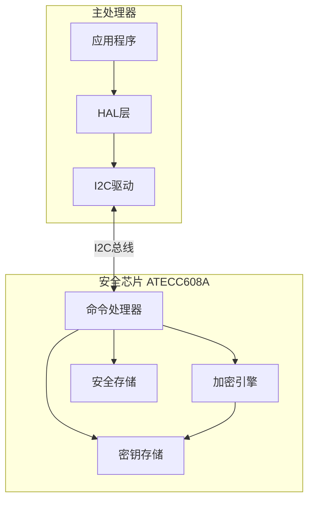
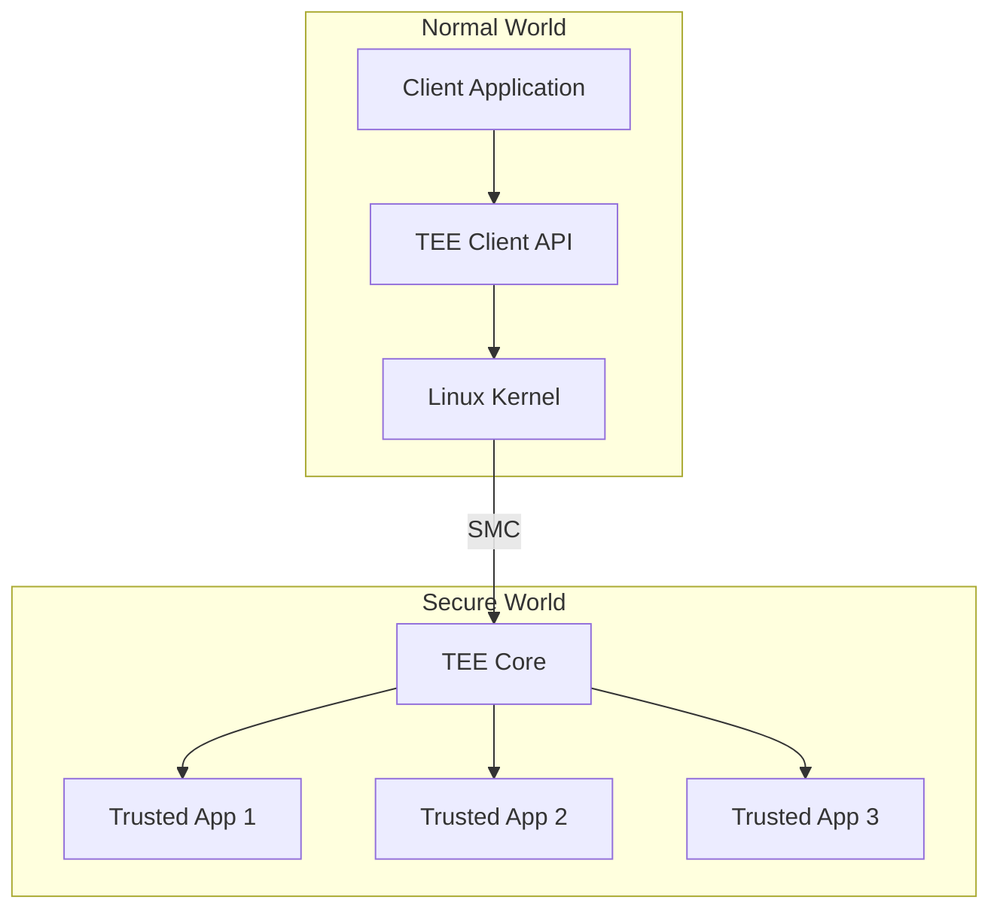

# 安全芯片(SE/TEE)应用开发


## 学习目标

完成本教程后，你将能够：

- 理解安全芯片(SE)和可信执行环境(TEE)的核心概念和架构
- 掌握ARM TrustZone技术的工作原理和应用
- 能够使用安全芯片进行密钥存储和加密操作
- 了解TEE应用开发的完整流程
- 掌握安全芯片与主处理器的通信机制
- 能够设计和实现基于硬件安全的应用方案


## 前置要求

### 知识要求
- 熟悉嵌入式系统开发
- 掌握C语言和汇编语言
- 理解信息安全基础概念（加密、签名、证书）
- 了解安全启动和固件验证机制
- 熟悉密钥管理基础知识

### 环境要求
- 开发板：支持TrustZone的ARM Cortex-A或Cortex-M33处理器
- 安全芯片：ATECC608A、SE050或类似芯片
- 开发工具：Keil MDK、ARM DS或GCC工具链
- 调试器：J-Link或CMSIS-DAP
- 软件库：OP-TEE或TrustZone SDK


## 准备工作

### 1. 硬件准备

**开发板清单**：
- STM32L5系列开发板（支持TrustZone）或
- NXP i.MX RT1170开发板 × 1
- ATECC608A安全芯片模块 × 1
- I2C连接线 × 4
- USB数据线 × 1

**硬件连接**：
```
ATECC608A    →    MCU
SDA          →    I2C_SDA (PB7)
SCL          →    I2C_SCL (PB6)
VCC          →    3.3V
GND          →    GND
```


### 2. 软件准备

**安装开发环境**：
1. 下载并安装Keil MDK或STM32CubeIDE
2. 安装TrustZone开发包
3. 下载ATECC608A驱动库

**创建工程**：
```bash
# 创建工程目录
mkdir secure-element-demo
cd secure-element-demo

# 下载ATECC608A库
git clone https://github.com/MicrochipTech/cryptoauthlib.git
cd cryptoauthlib
```

### 3. 理解基础概念

**安全芯片(Secure Element, SE)**：
- 独立的安全硬件芯片
- 专门用于密钥存储和加密操作
- 物理隔离，防篡改
- 常见型号：ATECC608A、SE050、A71CH

**可信执行环境(Trusted Execution Environment, TEE)**：
- 处理器内部的安全执行环境
- 与普通环境(REE)隔离
- 基于硬件支持（如ARM TrustZone）
- 运行可信应用(TA)


## 步骤说明

### 步骤1: 理解安全芯片架构

#### 1.1 安全芯片的核心特性

**ATECC608A安全芯片特性**：

```
核心功能:
├── 密钥存储
│   ├── 16个密钥槽位
│   ├── 硬件保护
│   └── 不可导出
├── 加密操作
│   ├── ECDSA签名/验证
│   ├── ECDH密钥交换
│   └── SHA-256哈希
├── 安全存储
│   ├── 配置区(128字节)
│   ├── OTP区(64字节)
│   └── 数据区(416字节)
└── 安全特性
    ├── 防篡改检测
    ├── 安全启动支持
    └── 单线接口(可选)
```


#### 1.2 安全芯片通信架构



#### 1.3 密钥槽位配置

ATECC608A提供16个密钥槽位，每个槽位可配置不同的访问权限：

```c
#include <stdint.h>

// 密钥槽位配置
typedef struct {
    uint8_t slot_id;           // 槽位ID (0-15)
    uint8_t key_type;          // 密钥类型
    uint16_t key_config;       // 密钥配置
    uint8_t read_key;          // 读取密钥ID
    uint8_t write_key;         // 写入密钥ID
    uint8_t is_secret;         // 是否为私钥
    uint8_t encrypt_read;      // 加密读取
    uint8_t limited_use;       // 限制使用次数
    uint8_t no_mac;            // 禁用MAC
} atca_slot_config_t;

// 典型的槽位配置示例
const atca_slot_config_t slot_configs[] = {
    // 槽位0: 设备私钥（不可导出）
    {
        .slot_id = 0,
        .key_type = ATCA_KEY_TYPE_ECC,
        .is_secret = 1,
        .encrypt_read = 0,
        .limited_use = 0,
        .no_mac = 0
    },
    // 槽位1: 对称密钥（AES-128）
    {
        .slot_id = 1,
        .key_type = ATCA_KEY_TYPE_AES,
        .is_secret = 1,
        .encrypt_read = 1,
        .limited_use = 0,
        .no_mac = 0
    },
    // 槽位2: 公钥（可读取）
    {
        .slot_id = 2,
        .key_type = ATCA_KEY_TYPE_ECC,
        .is_secret = 0,
        .encrypt_read = 0,
        .limited_use = 0,
        .no_mac = 1
    }
};
```


### 步骤2: 初始化安全芯片

#### 2.1 I2C通信初始化

首先配置I2C接口与安全芯片通信：

```c
#include "stm32l5xx_hal.h"
#include "cryptoauthlib.h"

// I2C句柄
I2C_HandleTypeDef hi2c1;

/**
 * @brief 初始化I2C接口
 * @return HAL状态
 */
HAL_StatusTypeDef i2c_init(void) {
    // 1. 使能I2C时钟
    __HAL_RCC_I2C1_CLK_ENABLE();
    __HAL_RCC_GPIOB_CLK_ENABLE();
    
    // 2. 配置GPIO引脚
    GPIO_InitTypeDef GPIO_InitStruct = {0};
    
    // I2C1_SCL: PB6
    GPIO_InitStruct.Pin = GPIO_PIN_6;
    GPIO_InitStruct.Mode = GPIO_MODE_AF_OD;
    GPIO_InitStruct.Pull = GPIO_PULLUP;
    GPIO_InitStruct.Speed = GPIO_SPEED_FREQ_HIGH;
    GPIO_InitStruct.Alternate = GPIO_AF4_I2C1;
    HAL_GPIO_Init(GPIOB, &GPIO_InitStruct);
    
    // I2C1_SDA: PB7
    GPIO_InitStruct.Pin = GPIO_PIN_7;
    HAL_GPIO_Init(GPIOB, &GPIO_InitStruct);
    
    // 3. 配置I2C参数
    hi2c1.Instance = I2C1;
    hi2c1.Init.Timing = 0x00702991;  // 100kHz @ 110MHz
    hi2c1.Init.OwnAddress1 = 0;
    hi2c1.Init.AddressingMode = I2C_ADDRESSINGMODE_7BIT;
    hi2c1.Init.DualAddressMode = I2C_DUALADDRESS_DISABLE;
    hi2c1.Init.GeneralCallMode = I2C_GENERALCALL_DISABLE;
    hi2c1.Init.NoStretchMode = I2C_NOSTRETCH_DISABLE;
    
    return HAL_I2C_Init(&hi2c1);
}
```

#### 2.2 安全芯片初始化

```c
#include "atca_basic.h"
#include "atca_hal.h"

// ATECC608A设备地址
#define ATECC608A_I2C_ADDR  0xC0

/**
 * @brief 初始化ATECC608A安全芯片
 * @return ATCA_SUCCESS: 成功, 其他: 失败
 */
ATCA_STATUS atca_init(void) {
    ATCA_STATUS status;
    
    // 1. 配置设备接口
    ATCAIfaceCfg cfg = {
        .iface_type = ATCA_I2C_IFACE,
        .devtype = ATECC608A,
        .atcai2c.slave_address = ATECC608A_I2C_ADDR,
        .atcai2c.bus = 1,
        .atcai2c.baud = 100000,
        .wake_delay = 1500,
        .rx_retries = 20
    };
    
    // 2. 初始化CryptoAuthLib
    status = atcab_init(&cfg);
    if (status != ATCA_SUCCESS) {
        printf("ATCA init failed: 0x%02X\n", status);
        return status;
    }
    
    // 3. 唤醒设备
    status = atcab_wakeup();
    if (status != ATCA_SUCCESS) {
        printf("ATCA wakeup failed: 0x%02X\n", status);
        return status;
    }
    
    // 4. 读取设备信息
    uint8_t revision[4];
    status = atcab_info(revision);
    if (status == ATCA_SUCCESS) {
        printf("ATECC608A detected\n");
        printf("  Revision: %02X %02X %02X %02X\n",
               revision[0], revision[1], revision[2], revision[3]);
    }
    
    return status;
}
```

**代码说明**：
- 配置I2C接口参数（地址、波特率等）
- 初始化CryptoAuthLib库
- 唤醒安全芯片（从休眠模式）
- 读取设备信息验证通信


### 步骤3: 密钥生成和存储

#### 3.1 生成ECC密钥对

在安全芯片内部生成ECC-P256密钥对：

```c
/**
 * @brief 在安全芯片中生成ECC密钥对
 * @param slot_id 密钥槽位ID (0-15)
 * @param public_key 输出的公钥 (64字节)
 * @return ATCA_SUCCESS: 成功, 其他: 失败
 */
ATCA_STATUS generate_ecc_keypair(uint8_t slot_id, uint8_t *public_key) {
    ATCA_STATUS status;
    
    printf("Generating ECC keypair in slot %d...\n", slot_id);
    
    // 在指定槽位生成密钥对
    // 私钥保存在芯片内部，永不导出
    // 公钥返回给主机
    status = atcab_genkey(slot_id, public_key);
    
    if (status == ATCA_SUCCESS) {
        printf("Keypair generated successfully\n");
        printf("Public key (X,Y):\n");
        printf("  X: ");
        for (int i = 0; i < 32; i++) {
            printf("%02X", public_key[i]);
        }
        printf("\n  Y: ");
        for (int i = 32; i < 64; i++) {
            printf("%02X", public_key[i]);
        }
        printf("\n");
    } else {
        printf("Keypair generation failed: 0x%02X\n", status);
    }
    
    return status;
}
```

#### 3.2 写入对称密钥

将AES密钥写入安全芯片：

```c
/**
 * @brief 写入AES密钥到安全芯片
 * @param slot_id 密钥槽位ID
 * @param key AES密钥 (16/24/32字节)
 * @param key_len 密钥长度
 * @return ATCA_SUCCESS: 成功, 其他: 失败
 */
ATCA_STATUS write_aes_key(uint8_t slot_id, const uint8_t *key, size_t key_len) {
    ATCA_STATUS status;
    uint8_t write_key[32] = {0};
    
    // 检查密钥长度
    if (key_len != 16 && key_len != 24 && key_len != 32) {
        printf("Invalid key length: %d\n", key_len);
        return ATCA_BAD_PARAM;
    }
    
    // 复制密钥数据
    memcpy(write_key, key, key_len);
    
    printf("Writing AES key to slot %d...\n", slot_id);
    
    // 写入密钥（加密写入）
    status = atcab_write_zone(
        ATCA_ZONE_DATA,      // 数据区
        slot_id,             // 槽位ID
        0,                   // 块号
        0,                   // 偏移
        write_key,           // 密钥数据
        32                   // 数据长度
    );
    
    if (status == ATCA_SUCCESS) {
        printf("AES key written successfully\n");
    } else {
        printf("AES key write failed: 0x%02X\n", status);
    }
    
    // 清除内存中的密钥
    memset(write_key, 0, sizeof(write_key));
    
    return status;
}
```

#### 3.3 读取公钥

从安全芯片读取公钥：

```c
/**
 * @brief 从安全芯片读取公钥
 * @param slot_id 密钥槽位ID
 * @param public_key 输出的公钥 (64字节)
 * @return ATCA_SUCCESS: 成功, 其他: 失败
 */
ATCA_STATUS read_public_key(uint8_t slot_id, uint8_t *public_key) {
    ATCA_STATUS status;
    
    printf("Reading public key from slot %d...\n", slot_id);
    
    // 读取公钥
    status = atcab_get_pubkey(slot_id, public_key);
    
    if (status == ATCA_SUCCESS) {
        printf("Public key read successfully\n");
    } else {
        printf("Public key read failed: 0x%02X\n", status);
    }
    
    return status;
}
```

**代码说明**：
- 私钥在芯片内部生成，永不导出
- 公钥可以读取并分发
- 对称密钥通过加密通道写入
- 所有密钥操作都在安全芯片内完成


### 步骤4: 使用安全芯片进行加密操作

#### 4.1 ECDSA签名

使用安全芯片中的私钥对数据进行签名：

```c
/**
 * @brief 使用ECDSA对数据进行签名
 * @param slot_id 私钥槽位ID
 * @param message 待签名的消息
 * @param message_len 消息长度
 * @param signature 输出的签名 (64字节: R||S)
 * @return ATCA_SUCCESS: 成功, 其他: 失败
 */
ATCA_STATUS ecdsa_sign(uint8_t slot_id, const uint8_t *message, 
                       size_t message_len, uint8_t *signature) {
    ATCA_STATUS status;
    uint8_t digest[32];
    
    // 1. 计算消息的SHA-256哈希
    status = atcab_sha(message_len, message, digest);
    if (status != ATCA_SUCCESS) {
        printf("SHA-256 failed: 0x%02X\n", status);
        return status;
    }
    
    printf("Message digest: ");
    for (int i = 0; i < 32; i++) {
        printf("%02X", digest[i]);
    }
    printf("\n");
    
    // 2. 使用私钥对哈希进行签名
    printf("Signing with slot %d...\n", slot_id);
    status = atcab_sign(slot_id, digest, signature);
    
    if (status == ATCA_SUCCESS) {
        printf("Signature generated successfully\n");
        printf("  R: ");
        for (int i = 0; i < 32; i++) {
            printf("%02X", signature[i]);
        }
        printf("\n  S: ");
        for (int i = 32; i < 64; i++) {
            printf("%02X", signature[i]);
        }
        printf("\n");
    } else {
        printf("Signing failed: 0x%02X\n", status);
    }
    
    return status;
}
```

#### 4.2 ECDSA验证

验证ECDSA签名：

```c
/**
 * @brief 验证ECDSA签名
 * @param public_key 公钥 (64字节)
 * @param message 原始消息
 * @param message_len 消息长度
 * @param signature 签名 (64字节)
 * @param is_verified 输出: 签名是否有效
 * @return ATCA_SUCCESS: 成功, 其他: 失败
 */
ATCA_STATUS ecdsa_verify(const uint8_t *public_key, const uint8_t *message,
                         size_t message_len, const uint8_t *signature,
                         bool *is_verified) {
    ATCA_STATUS status;
    uint8_t digest[32];
    
    // 1. 计算消息的SHA-256哈希
    status = atcab_sha(message_len, message, digest);
    if (status != ATCA_SUCCESS) {
        printf("SHA-256 failed: 0x%02X\n", status);
        return status;
    }
    
    // 2. 验证签名
    printf("Verifying signature...\n");
    status = atcab_verify_extern(digest, signature, public_key, is_verified);
    
    if (status == ATCA_SUCCESS) {
        printf("Signature verification: %s\n", 
               *is_verified ? "VALID" : "INVALID");
    } else {
        printf("Verification failed: 0x%02X\n", status);
    }
    
    return status;
}
```

#### 4.3 ECDH密钥交换

使用ECDH协议进行密钥交换：

```c
/**
 * @brief 执行ECDH密钥交换
 * @param slot_id 本地私钥槽位ID
 * @param peer_public_key 对方公钥 (64字节)
 * @param shared_secret 输出的共享密钥 (32字节)
 * @return ATCA_SUCCESS: 成功, 其他: 失败
 */
ATCA_STATUS ecdh_key_exchange(uint8_t slot_id, const uint8_t *peer_public_key,
                               uint8_t *shared_secret) {
    ATCA_STATUS status;
    
    printf("Performing ECDH key exchange...\n");
    
    // 使用本地私钥和对方公钥计算共享密钥
    status = atcab_ecdh(slot_id, peer_public_key, shared_secret);
    
    if (status == ATCA_SUCCESS) {
        printf("Shared secret generated successfully\n");
        printf("  Secret: ");
        for (int i = 0; i < 32; i++) {
            printf("%02X", shared_secret[i]);
        }
        printf("\n");
    } else {
        printf("ECDH failed: 0x%02X\n", status);
    }
    
    return status;
}
```

**代码说明**：
- 所有加密操作在安全芯片内部完成
- 私钥永不离开安全芯片
- 支持标准的ECDSA和ECDH算法
- 使用NIST P-256椭圆曲线


### 步骤5: 理解TEE架构

#### 5.1 ARM TrustZone技术

ARM TrustZone将处理器划分为两个世界：

```
+----------------------------------+
|        Normal World (REE)        |
|  ┌────────────────────────────┐  |
|  │   Rich OS (Linux/Android)  │  |
|  │   ┌──────────────────────┐ │  |
|  │   │  Normal Applications │ │  |
|  │   └──────────────────────┘ │  |
|  └────────────────────────────┘  |
+----------------------------------+
           ↕ SMC调用
+----------------------------------+
|        Secure World (TEE)        |
|  ┌────────────────────────────┐  |
|  │   Secure OS (OP-TEE)       │  |
|  │   ┌──────────────────────┐ │  |
|  │   │  Trusted Applications│ │  |
|  │   └──────────────────────┘ │  |
|  └────────────────────────────┘  |
+----------------------------------+
```

**TrustZone核心特性**：

1. **硬件隔离**
   - 独立的内存空间
   - 独立的外设访问
   - 独立的中断处理

2. **安全状态切换**
   - 通过SMC指令切换
   - 硬件保证安全性
   - 上下文自动保存/恢复

3. **资源保护**
   - 安全内存（Secure RAM）
   - 安全外设（Secure Peripherals）
   - 安全中断（Secure Interrupts）

#### 5.2 TEE系统架构



#### 5.3 TEE内存布局

```c
// Cortex-M33 TrustZone内存配置
#define SECURE_FLASH_BASE       0x0C000000
#define SECURE_FLASH_SIZE       (128 * 1024)  // 128KB

#define NON_SECURE_FLASH_BASE   0x08000000
#define NON_SECURE_FLASH_SIZE   (384 * 1024)  // 384KB

#define SECURE_SRAM_BASE        0x30000000
#define SECURE_SRAM_SIZE        (64 * 1024)   // 64KB

#define NON_SECURE_SRAM_BASE    0x20000000
#define NON_SECURE_SRAM_SIZE    (192 * 1024)  // 192KB

/**
 * @brief 配置TrustZone内存区域
 */
void configure_trustzone_memory(void) {
    // 1. 配置SAU (Security Attribution Unit)
    SAU->CTRL = 0;  // 禁用SAU
    
    // 配置安全Flash区域
    SAU->RNR = 0;
    SAU->RBAR = SECURE_FLASH_BASE;
    SAU->RLAR = (SECURE_FLASH_BASE + SECURE_FLASH_SIZE - 1) | 
                SAU_RLAR_ENABLE_Msk;
    
    // 配置非安全Flash区域
    SAU->RNR = 1;
    SAU->RBAR = NON_SECURE_FLASH_BASE | SAU_RBAR_NSC_Msk;
    SAU->RLAR = (NON_SECURE_FLASH_BASE + NON_SECURE_FLASH_SIZE - 1) | 
                SAU_RLAR_ENABLE_Msk;
    
    // 配置安全SRAM区域
    SAU->RNR = 2;
    SAU->RBAR = SECURE_SRAM_BASE;
    SAU->RLAR = (SECURE_SRAM_BASE + SECURE_SRAM_SIZE - 1) | 
                SAU_RLAR_ENABLE_Msk;
    
    // 配置非安全SRAM区域
    SAU->RNR = 3;
    SAU->RBAR = NON_SECURE_SRAM_BASE | SAU_RBAR_NSC_Msk;
    SAU->RLAR = (NON_SECURE_SRAM_BASE + NON_SECURE_SRAM_SIZE - 1) | 
                SAU_RLAR_ENABLE_Msk;
    
    // 2. 启用SAU
    SAU->CTRL = SAU_CTRL_ENABLE_Msk;
    
    // 3. 配置NVIC安全属性
    NVIC->ITNS[0] = 0xFFFFFFFF;  // 所有中断默认为非安全
    
    printf("TrustZone memory configured\n");
}
```

**代码说明**：
- SAU用于配置内存的安全属性
- 安全区域只能被安全代码访问
- 非安全区域可以被两个世界访问
- NSC (Non-Secure Callable) 区域用于安全函数入口


### 步骤6: 开发可信应用(TA)

#### 6.1 可信应用结构

```c
#include "tee_internal_api.h"
#include "tee_api_defines.h"

// 可信应用UUID
#define TA_CRYPTO_UUID \
    { 0x12345678, 0x1234, 0x5678, \
      { 0x12, 0x34, 0x56, 0x78, 0x90, 0xAB, 0xCD, 0xEF } }

// 命令ID
#define CMD_GENERATE_KEY    1
#define CMD_SIGN_DATA       2
#define CMD_VERIFY_SIGN     3
#define CMD_ENCRYPT_DATA    4
#define CMD_DECRYPT_DATA    5

/**
 * @brief TA创建入口点
 */
TEE_Result TA_CreateEntryPoint(void) {
    DMSG("TA_CreateEntryPoint");
    return TEE_SUCCESS;
}

/**
 * @brief TA销毁入口点
 */
void TA_DestroyEntryPoint(void) {
    DMSG("TA_DestroyEntryPoint");
}

/**
 * @brief 打开会话
 */
TEE_Result TA_OpenSessionEntryPoint(uint32_t param_types,
                                    TEE_Param params[4],
                                    void **sess_ctx) {
    uint32_t exp_param_types = TEE_PARAM_TYPES(
        TEE_PARAM_TYPE_NONE,
        TEE_PARAM_TYPE_NONE,
        TEE_PARAM_TYPE_NONE,
        TEE_PARAM_TYPE_NONE
    );
    
    if (param_types != exp_param_types) {
        return TEE_ERROR_BAD_PARAMETERS;
    }
    
    DMSG("Session opened");
    *sess_ctx = NULL;
    
    return TEE_SUCCESS;
}

/**
 * @brief 关闭会话
 */
void TA_CloseSessionEntryPoint(void *sess_ctx) {
    (void)sess_ctx;
    DMSG("Session closed");
}
```

#### 6.2 实现加密命令

```c
/**
 * @brief 命令调用入口点
 */
TEE_Result TA_InvokeCommandEntryPoint(void *sess_ctx,
                                      uint32_t cmd_id,
                                      uint32_t param_types,
                                      TEE_Param params[4]) {
    (void)sess_ctx;
    
    switch (cmd_id) {
    case CMD_GENERATE_KEY:
        return cmd_generate_key(param_types, params);
    
    case CMD_SIGN_DATA:
        return cmd_sign_data(param_types, params);
    
    case CMD_VERIFY_SIGN:
        return cmd_verify_signature(param_types, params);
    
    case CMD_ENCRYPT_DATA:
        return cmd_encrypt_data(param_types, params);
    
    case CMD_DECRYPT_DATA:
        return cmd_decrypt_data(param_types, params);
    
    default:
        return TEE_ERROR_BAD_PARAMETERS;
    }
}

/**
 * @brief 生成密钥命令
 */
static TEE_Result cmd_generate_key(uint32_t param_types, TEE_Param params[4]) {
    TEE_Result res;
    TEE_ObjectHandle key_handle;
    uint32_t key_size = 256;  // ECC-P256
    
    // 检查参数类型
    uint32_t exp_param_types = TEE_PARAM_TYPES(
        TEE_PARAM_TYPE_VALUE_INPUT,   // 密钥类型
        TEE_PARAM_TYPE_MEMREF_OUTPUT, // 公钥输出
        TEE_PARAM_TYPE_NONE,
        TEE_PARAM_TYPE_NONE
    );
    
    if (param_types != exp_param_types) {
        return TEE_ERROR_BAD_PARAMETERS;
    }
    
    // 1. 分配密钥对象
    res = TEE_AllocateTransientObject(
        TEE_TYPE_ECDSA_KEYPAIR,
        key_size,
        &key_handle
    );
    if (res != TEE_SUCCESS) {
        EMSG("Failed to allocate key object: 0x%x", res);
        return res;
    }
    
    // 2. 生成密钥对
    res = TEE_GenerateKey(key_handle, key_size, NULL, 0);
    if (res != TEE_SUCCESS) {
        EMSG("Failed to generate key: 0x%x", res);
        TEE_FreeTransientObject(key_handle);
        return res;
    }
    
    // 3. 导出公钥
    uint8_t *public_key = params[1].memref.buffer;
    uint32_t public_key_len = params[1].memref.size;
    
    res = TEE_GetObjectBufferAttribute(
        key_handle,
        TEE_ATTR_ECC_PUBLIC_VALUE_X,
        public_key,
        &public_key_len
    );
    
    if (res == TEE_SUCCESS) {
        params[1].memref.size = public_key_len;
        DMSG("Key generated successfully");
    }
    
    // 4. 保存私钥到安全存储
    res = save_key_to_storage(key_handle, "device_key");
    
    TEE_FreeTransientObject(key_handle);
    
    return res;
}
```


#### 6.3 实现签名命令

```c
/**
 * @brief 签名数据命令
 */
static TEE_Result cmd_sign_data(uint32_t param_types, TEE_Param params[4]) {
    TEE_Result res;
    TEE_ObjectHandle key_handle;
    TEE_OperationHandle op_handle;
    
    // 检查参数类型
    uint32_t exp_param_types = TEE_PARAM_TYPES(
        TEE_PARAM_TYPE_MEMREF_INPUT,  // 待签名数据
        TEE_PARAM_TYPE_MEMREF_OUTPUT, // 签名输出
        TEE_PARAM_TYPE_NONE,
        TEE_PARAM_TYPE_NONE
    );
    
    if (param_types != exp_param_types) {
        return TEE_ERROR_BAD_PARAMETERS;
    }
    
    // 1. 从安全存储加载私钥
    res = load_key_from_storage(&key_handle, "device_key");
    if (res != TEE_SUCCESS) {
        EMSG("Failed to load key: 0x%x", res);
        return res;
    }
    
    // 2. 分配签名操作
    res = TEE_AllocateOperation(
        &op_handle,
        TEE_ALG_ECDSA_P256,
        TEE_MODE_SIGN,
        256
    );
    if (res != TEE_SUCCESS) {
        EMSG("Failed to allocate operation: 0x%x", res);
        TEE_CloseObject(key_handle);
        return res;
    }
    
    // 3. 设置密钥
    res = TEE_SetOperationKey(op_handle, key_handle);
    if (res != TEE_SUCCESS) {
        EMSG("Failed to set key: 0x%x", res);
        goto cleanup;
    }
    
    // 4. 执行签名
    uint8_t *data = params[0].memref.buffer;
    uint32_t data_len = params[0].memref.size;
    uint8_t *signature = params[1].memref.buffer;
    uint32_t sig_len = params[1].memref.size;
    
    res = TEE_AsymmetricSignDigest(
        op_handle,
        NULL, 0,
        data, data_len,
        signature, &sig_len
    );
    
    if (res == TEE_SUCCESS) {
        params[1].memref.size = sig_len;
        DMSG("Data signed successfully");
    } else {
        EMSG("Signing failed: 0x%x", res);
    }

cleanup:
    TEE_FreeOperation(op_handle);
    TEE_CloseObject(key_handle);
    
    return res;
}
```

#### 6.4 安全存储

```c
/**
 * @brief 保存密钥到安全存储
 */
static TEE_Result save_key_to_storage(TEE_ObjectHandle key_handle,
                                      const char *key_name) {
    TEE_Result res;
    TEE_ObjectHandle storage_handle;
    uint32_t flags = TEE_DATA_FLAG_ACCESS_WRITE |
                    TEE_DATA_FLAG_ACCESS_READ |
                    TEE_DATA_FLAG_OVERWRITE;
    
    // 1. 创建持久化对象
    res = TEE_CreatePersistentObject(
        TEE_STORAGE_PRIVATE,
        key_name, strlen(key_name),
        flags,
        key_handle,
        NULL, 0,
        &storage_handle
    );
    
    if (res != TEE_SUCCESS) {
        EMSG("Failed to create persistent object: 0x%x", res);
        return res;
    }
    
    // 2. 关闭对象
    TEE_CloseObject(storage_handle);
    
    DMSG("Key saved to secure storage: %s", key_name);
    return TEE_SUCCESS;
}

/**
 * @brief 从安全存储加载密钥
 */
static TEE_Result load_key_from_storage(TEE_ObjectHandle *key_handle,
                                        const char *key_name) {
    TEE_Result res;
    TEE_ObjectHandle storage_handle;
    TEE_ObjectInfo obj_info;
    
    // 1. 打开持久化对象
    res = TEE_OpenPersistentObject(
        TEE_STORAGE_PRIVATE,
        key_name, strlen(key_name),
        TEE_DATA_FLAG_ACCESS_READ,
        &storage_handle
    );
    
    if (res != TEE_SUCCESS) {
        EMSG("Failed to open persistent object: 0x%x", res);
        return res;
    }
    
    // 2. 获取对象信息
    res = TEE_GetObjectInfo1(storage_handle, &obj_info);
    if (res != TEE_SUCCESS) {
        TEE_CloseObject(storage_handle);
        return res;
    }
    
    // 3. 分配临时对象
    res = TEE_AllocateTransientObject(
        obj_info.objectType,
        obj_info.maxObjectSize,
        key_handle
    );
    
    if (res != TEE_SUCCESS) {
        TEE_CloseObject(storage_handle);
        return res;
    }
    
    // 4. 复制密钥数据
    res = TEE_CopyObjectAttributes1(*key_handle, storage_handle);
    
    TEE_CloseObject(storage_handle);
    
    if (res == TEE_SUCCESS) {
        DMSG("Key loaded from secure storage: %s", key_name);
    }
    
    return res;
}
```

**代码说明**：
- TA运行在安全世界，与普通应用隔离
- 密钥存储在安全存储中，加密保护
- 所有加密操作在TEE内部完成
- 私钥永不离开安全世界


### 步骤7: 客户端应用开发

#### 7.1 初始化TEE客户端

```c
#include <tee_client_api.h>
#include <stdio.h>
#include <string.h>

// TA UUID
static const TEEC_UUID ta_uuid = TA_CRYPTO_UUID;

// 全局上下文和会话
static TEEC_Context ctx;
static TEEC_Session sess;

/**
 * @brief 初始化TEE客户端
 * @return TEEC_SUCCESS: 成功, 其他: 失败
 */
TEEC_Result tee_client_init(void) {
    TEEC_Result res;
    uint32_t err_origin;
    
    // 1. 初始化上下文
    res = TEEC_InitializeContext(NULL, &ctx);
    if (res != TEEC_SUCCESS) {
        printf("TEEC_InitializeContext failed: 0x%x\n", res);
        return res;
    }
    
    // 2. 打开会话
    res = TEEC_OpenSession(
        &ctx,
        &sess,
        &ta_uuid,
        TEEC_LOGIN_PUBLIC,
        NULL,
        NULL,
        &err_origin
    );
    
    if (res != TEEC_SUCCESS) {
        printf("TEEC_OpenSession failed: 0x%x (origin: 0x%x)\n",
               res, err_origin);
        TEEC_FinalizeContext(&ctx);
        return res;
    }
    
    printf("TEE client initialized successfully\n");
    return TEEC_SUCCESS;
}

/**
 * @brief 清理TEE客户端
 */
void tee_client_cleanup(void) {
    TEEC_CloseSession(&sess);
    TEEC_FinalizeContext(&ctx);
    printf("TEE client cleaned up\n");
}
```

#### 7.2 调用TA生成密钥

```c
/**
 * @brief 调用TA生成密钥
 * @param public_key 输出的公钥缓冲区
 * @param public_key_len 公钥缓冲区大小
 * @return TEEC_SUCCESS: 成功, 其他: 失败
 */
TEEC_Result tee_generate_key(uint8_t *public_key, uint32_t *public_key_len) {
    TEEC_Result res;
    TEEC_Operation op;
    uint32_t err_origin;
    
    // 准备操作参数
    memset(&op, 0, sizeof(op));
    op.paramTypes = TEEC_PARAM_TYPES(
        TEEC_VALUE_INPUT,
        TEEC_MEMREF_TEMP_OUTPUT,
        TEEC_NONE,
        TEEC_NONE
    );
    
    op.params[0].value.a = 0;  // 密钥类型: ECC
    op.params[1].tmpref.buffer = public_key;
    op.params[1].tmpref.size = *public_key_len;
    
    // 调用TA命令
    res = TEEC_InvokeCommand(
        &sess,
        CMD_GENERATE_KEY,
        &op,
        &err_origin
    );
    
    if (res == TEEC_SUCCESS) {
        *public_key_len = op.params[1].tmpref.size;
        printf("Key generated in TEE\n");
        printf("Public key (%d bytes):\n", *public_key_len);
        for (uint32_t i = 0; i < *public_key_len; i++) {
            printf("%02X", public_key[i]);
            if ((i + 1) % 32 == 0) printf("\n");
        }
        printf("\n");
    } else {
        printf("Key generation failed: 0x%x (origin: 0x%x)\n",
               res, err_origin);
    }
    
    return res;
}
```

#### 7.3 调用TA签名数据

```c
/**
 * @brief 调用TA对数据进行签名
 * @param data 待签名数据
 * @param data_len 数据长度
 * @param signature 输出的签名缓冲区
 * @param sig_len 签名缓冲区大小
 * @return TEEC_SUCCESS: 成功, 其他: 失败
 */
TEEC_Result tee_sign_data(const uint8_t *data, uint32_t data_len,
                          uint8_t *signature, uint32_t *sig_len) {
    TEEC_Result res;
    TEEC_Operation op;
    uint32_t err_origin;
    
    // 准备操作参数
    memset(&op, 0, sizeof(op));
    op.paramTypes = TEEC_PARAM_TYPES(
        TEEC_MEMREF_TEMP_INPUT,
        TEEC_MEMREF_TEMP_OUTPUT,
        TEEC_NONE,
        TEEC_NONE
    );
    
    op.params[0].tmpref.buffer = (void*)data;
    op.params[0].tmpref.size = data_len;
    op.params[1].tmpref.buffer = signature;
    op.params[1].tmpref.size = *sig_len;
    
    // 调用TA命令
    res = TEEC_InvokeCommand(
        &sess,
        CMD_SIGN_DATA,
        &op,
        &err_origin
    );
    
    if (res == TEEC_SUCCESS) {
        *sig_len = op.params[1].tmpref.size;
        printf("Data signed in TEE\n");
        printf("Signature (%d bytes):\n", *sig_len);
        for (uint32_t i = 0; i < *sig_len; i++) {
            printf("%02X", signature[i]);
            if ((i + 1) % 32 == 0) printf("\n");
        }
        printf("\n");
    } else {
        printf("Signing failed: 0x%x (origin: 0x%x)\n",
               res, err_origin);
    }
    
    return res;
}
```

#### 7.4 完整示例程序

```c
/**
 * @brief TEE客户端示例程序
 */
int main(void) {
    TEEC_Result res;
    
    printf("=== TEE Client Example ===\n\n");
    
    // 1. 初始化TEE客户端
    res = tee_client_init();
    if (res != TEEC_SUCCESS) {
        return -1;
    }
    
    // 2. 生成密钥
    uint8_t public_key[64];
    uint32_t public_key_len = sizeof(public_key);
    
    printf("\n1. Generating key in TEE...\n");
    res = tee_generate_key(public_key, &public_key_len);
    if (res != TEEC_SUCCESS) {
        goto cleanup;
    }
    
    // 3. 签名数据
    const char *message = "Hello, TEE!";
    uint8_t signature[64];
    uint32_t sig_len = sizeof(signature);
    
    printf("\n2. Signing data in TEE...\n");
    printf("Message: %s\n", message);
    res = tee_sign_data((uint8_t*)message, strlen(message),
                       signature, &sig_len);
    if (res != TEEC_SUCCESS) {
        goto cleanup;
    }
    
    printf("\n=== Test Complete ===\n");

cleanup:
    // 4. 清理
    tee_client_cleanup();
    
    return (res == TEEC_SUCCESS) ? 0 : -1;
}
```

**代码说明**：
- 客户端应用运行在普通世界
- 通过TEE Client API与TA通信
- 敏感操作在TEE中执行
- 数据通过共享内存传递


## 验证方法

### 1. 测试安全芯片功能

创建测试程序验证ATECC608A功能：

```c
/**
 * @brief 测试安全芯片功能
 */
void test_secure_element(void) {
    ATCA_STATUS status;
    
    printf("\n=== Secure Element Test ===\n");
    
    // 1. 初始化
    printf("\n1. Initializing ATECC608A...\n");
    status = atca_init();
    if (status != ATCA_SUCCESS) {
        printf("   [FAIL] Initialization failed\n");
        return;
    }
    printf("   [PASS] Initialized successfully\n");
    
    // 2. 生成密钥对
    printf("\n2. Generating ECC keypair...\n");
    uint8_t public_key[64];
    status = generate_ecc_keypair(0, public_key);
    if (status == ATCA_SUCCESS) {
        printf("   [PASS] Keypair generated\n");
    } else {
        printf("   [FAIL] Keypair generation failed\n");
    }
    
    // 3. 签名测试
    printf("\n3. Testing ECDSA signing...\n");
    const char *message = "Test message";
    uint8_t signature[64];
    status = ecdsa_sign(0, (uint8_t*)message, strlen(message), signature);
    if (status == ATCA_SUCCESS) {
        printf("   [PASS] Signature generated\n");
    } else {
        printf("   [FAIL] Signing failed\n");
    }
    
    // 4. 验证测试
    printf("\n4. Testing ECDSA verification...\n");
    bool is_verified;
    status = ecdsa_verify(public_key, (uint8_t*)message, strlen(message),
                         signature, &is_verified);
    if (status == ATCA_SUCCESS && is_verified) {
        printf("   [PASS] Signature verified\n");
    } else {
        printf("   [FAIL] Verification failed\n");
    }
    
    printf("\n=== Test Complete ===\n");
}
```

### 2. 测试TEE功能

测试TrustZone和TEE功能：

```c
/**
 * @brief 测试TEE功能
 */
void test_tee(void) {
    TEEC_Result res;
    
    printf("\n=== TEE Test ===\n");
    
    // 1. 初始化TEE客户端
    printf("\n1. Initializing TEE client...\n");
    res = tee_client_init();
    if (res == TEEC_SUCCESS) {
        printf("   [PASS] TEE client initialized\n");
    } else {
        printf("   [FAIL] Initialization failed: 0x%x\n", res);
        return;
    }
    
    // 2. 生成密钥
    printf("\n2. Generating key in TEE...\n");
    uint8_t public_key[64];
    uint32_t public_key_len = sizeof(public_key);
    res = tee_generate_key(public_key, &public_key_len);
    if (res == TEEC_SUCCESS) {
        printf("   [PASS] Key generated\n");
    } else {
        printf("   [FAIL] Key generation failed\n");
    }
    
    // 3. 签名数据
    printf("\n3. Signing data in TEE...\n");
    const char *data = "TEE test data";
    uint8_t signature[64];
    uint32_t sig_len = sizeof(signature);
    res = tee_sign_data((uint8_t*)data, strlen(data), signature, &sig_len);
    if (res == TEEC_SUCCESS) {
        printf("   [PASS] Data signed\n");
    } else {
        printf("   [FAIL] Signing failed\n");
    }
    
    // 4. 清理
    tee_client_cleanup();
    
    printf("\n=== Test Complete ===\n");
}
```

### 3. 预期输出

**安全芯片测试输出**：
```
=== Secure Element Test ===

1. Initializing ATECC608A...
ATECC608A detected
  Revision: 00 00 60 02
   [PASS] Initialized successfully

2. Generating ECC keypair...
Keypair generated successfully
Public key (X,Y):
  X: A1B2C3D4E5F6...
  Y: 1A2B3C4D5E6F...
   [PASS] Keypair generated

3. Testing ECDSA signing...
Message digest: 9F86D081884C7D659A2FEAA0C55AD015...
Signing with slot 0...
Signature generated successfully
  R: 12345678...
  S: ABCDEF01...
   [PASS] Signature generated

4. Testing ECDSA verification...
Verifying signature...
Signature verification: VALID
   [PASS] Signature verified

=== Test Complete ===
```

**TEE测试输出**：
```
=== TEE Test ===

1. Initializing TEE client...
TEE client initialized successfully
   [PASS] TEE client initialized

2. Generating key in TEE...
Key generated in TEE
Public key (64 bytes):
A1B2C3D4E5F6...
   [PASS] Key generated

3. Signing data in TEE...
Data signed in TEE
Signature (64 bytes):
12345678ABCD...
   [PASS] Data signed

=== Test Complete ===
```


## 故障排除

### 问题1: 安全芯片通信失败

**现象**：
```
ATCA init failed: 0xF0
ATCA wakeup failed: 0xF0
```

**可能原因**：
1. I2C连接问题
2. 设备地址错误
3. 上拉电阻缺失
4. 电源供电不足

**解决方法**：

```c
// 1. 检查I2C通信
HAL_StatusTypeDef status = HAL_I2C_IsDeviceReady(
    &hi2c1,
    ATECC608A_I2C_ADDR,
    3,
    1000
);

if (status == HAL_OK) {
    printf("Device detected at 0x%02X\n", ATECC608A_I2C_ADDR);
} else {
    printf("Device not found\n");
    // 尝试扫描I2C总线
    for (uint8_t addr = 0x08; addr < 0xF8; addr += 2) {
        if (HAL_I2C_IsDeviceReady(&hi2c1, addr, 1, 100) == HAL_OK) {
            printf("Found device at 0x%02X\n", addr);
        }
    }
}

// 2. 检查上拉电阻
// 使用示波器或万用表测量SDA/SCL线电压
// 应该在空闲时为3.3V

// 3. 增加唤醒延时
cfg.wake_delay = 2500;  // 增加到2.5ms
cfg.rx_retries = 50;    // 增加重试次数
```

### 问题2: 密钥槽位配置错误

**现象**：
```
Failed to write key: 0x03 (ATCA_CHECKMAC_VERIFY_FAILED)
```

**原因**：
- 密钥槽位未正确配置
- 写保护已启用
- 槽位已锁定

**解决方法**：

```c
// 1. 读取槽位配置
uint8_t config_data[128];
ATCA_STATUS status = atcab_read_config_zone(config_data);

if (status == ATCA_SUCCESS) {
    // 检查槽位0的配置
    uint16_t slot_config = (config_data[20] << 8) | config_data[21];
    printf("Slot 0 config: 0x%04X\n", slot_config);
    
    // 检查是否锁定
    uint8_t lock_config = config_data[87];
    uint8_t lock_data = config_data[86];
    printf("Config locked: %s\n", lock_config == 0x00 ? "Yes" : "No");
    printf("Data locked: %s\n", lock_data == 0x00 ? "Yes" : "No");
}

// 2. 如果需要重新配置（仅在开发阶段）
// 注意：配置锁定后无法更改！
if (lock_config != 0x00) {
    // 写入新配置
    // ...
    
    // 锁定配置
    status = atcab_lock_config_zone();
}
```

### 问题3: TEE会话打开失败

**现象**：
```
TEEC_OpenSession failed: 0xFFFF0008 (origin: 0x00000003)
```

**可能原因**：
1. TA未正确安装
2. UUID不匹配
3. TEE驱动未加载
4. 权限不足

**解决方法**：

```bash
# 1. 检查TA是否安装
ls -l /lib/optee_armtz/
# 应该看到对应UUID的.ta文件

# 2. 检查TEE驱动
lsmod | grep optee
# 应该看到optee和optee_armtz模块

# 3. 检查设备节点
ls -l /dev/tee*
# 应该看到/dev/tee0和/dev/teepriv0

# 4. 检查权限
sudo chmod 666 /dev/tee0

# 5. 查看TEE日志
dmesg | grep optee
```

### 问题4: TrustZone配置错误

**现象**：
- 系统启动后卡死
- 访问安全内存时触发异常
- 非安全代码无法访问外设

**原因**：
- SAU配置错误
- 内存区域重叠
- 外设安全属性配置错误

**解决方法**：

```c
// 1. 验证SAU配置
void verify_sau_config(void) {
    printf("SAU Configuration:\n");
    printf("  CTRL: 0x%08X\n", SAU->CTRL);
    printf("  TYPE: 0x%08X\n", SAU->TYPE);
    
    // 遍历所有SAU区域
    for (int i = 0; i < 8; i++) {
        SAU->RNR = i;
        uint32_t rbar = SAU->RBAR;
        uint32_t rlar = SAU->RLAR;
        
        if (rlar & SAU_RLAR_ENABLE_Msk) {
            printf("  Region %d:\n", i);
            printf("    Base: 0x%08X\n", rbar & SAU_RBAR_BADDR_Msk);
            printf("    Limit: 0x%08X\n", rlar & SAU_RLAR_LADDR_Msk);
            printf("    NSC: %s\n", (rbar & SAU_RBAR_NSC_Msk) ? "Yes" : "No");
        }
    }
}

// 2. 检查内存访问
void test_memory_access(void) {
    // 测试安全内存访问
    volatile uint32_t *secure_mem = (uint32_t*)SECURE_SRAM_BASE;
    *secure_mem = 0x12345678;
    printf("Secure memory write: OK\n");
    
    // 测试非安全内存访问
    volatile uint32_t *nonsecure_mem = (uint32_t*)NON_SECURE_SRAM_BASE;
    *nonsecure_mem = 0xABCDEF01;
    printf("Non-secure memory write: OK\n");
}
```

### 问题5: 性能问题

**现象**：
- 加密操作耗时过长
- I2C通信速度慢
- TEE调用延迟高

**优化方法**：

```c
// 1. 优化I2C速度
hi2c1.Init.Timing = 0x00300F38;  // 400kHz @ 110MHz

// 2. 使用DMA传输
HAL_I2C_Master_Transmit_DMA(&hi2c1, addr, data, len);

// 3. 批量操作
// 避免频繁的小数据传输，尽量批量处理

// 4. 缓存公钥
static uint8_t cached_public_key[64];
static bool key_cached = false;

if (!key_cached) {
    read_public_key(0, cached_public_key);
    key_cached = true;
}

// 5. 异步操作
// 使用回调或事件机制，避免阻塞等待
```


## 总结

通过本教程，我们学习了：

### 核心概念

1. **安全芯片(SE)**
   - 独立的硬件安全模块
   - 专用于密钥存储和加密操作
   - 物理隔离，防篡改保护
   - 典型应用：ATECC608A、SE050

2. **可信执行环境(TEE)**
   - 处理器内部的安全执行环境
   - 基于ARM TrustZone技术
   - 与普通环境(REE)硬件隔离
   - 运行可信应用(TA)

3. **密钥管理**
   - 密钥在安全区域生成
   - 私钥永不导出
   - 安全存储和访问控制
   - 密钥生命周期管理

4. **加密操作**
   - ECDSA签名和验证
   - ECDH密钥交换
   - AES加密和解密
   - SHA-256哈希计算

### 关键要点

**安全芯片优势**：
- 硬件级安全保护
- 独立于主处理器
- 防物理攻击
- 低功耗设计
- 标准化接口

**TEE优势**：
- 集成在主处理器中
- 性能更高
- 灵活性强
- 支持复杂应用
- 成本较低

**应用场景**：
- 设备认证和身份验证
- 安全启动和固件验证
- 数据加密和签名
- 安全通信（TLS/DTLS）
- 支付和金融应用
- DRM和内容保护

### 最佳实践

1. **密钥管理**
   - 使用硬件生成密钥
   - 私钥永不导出
   - 定期轮换密钥
   - 实施密钥备份策略
   - 记录密钥使用日志

2. **安全设计**
   - 最小权限原则
   - 纵深防御策略
   - 安全默认配置
   - 定期安全审计
   - 及时更新补丁

3. **性能优化**
   - 批量处理操作
   - 缓存常用数据
   - 使用DMA传输
   - 异步操作模式
   - 合理选择算法

4. **开发流程**
   - 安全需求分析
   - 威胁建模
   - 安全编码规范
   - 代码审查
   - 渗透测试

### 安全注意事项

⚠️ **重要提醒**：

1. **密钥保护**
   - 绝不在普通内存中存储私钥
   - 使用安全芯片或TEE存储密钥
   - 实施访问控制
   - 监控异常访问

2. **侧信道攻击**
   - 注意功耗分析攻击
   - 防止时序攻击
   - 使用随机延时
   - 实施掩码技术

3. **物理安全**
   - 防止芯片读取
   - 使用防篡改封装
   - 实施物理检测
   - 安全销毁机制

4. **软件安全**
   - 输入验证
   - 边界检查
   - 安全编码
   - 定期更新

### 性能对比

| 特性 | 安全芯片(SE) | TEE |
|------|-------------|-----|
| 安全级别 | 极高 | 高 |
| 性能 | 中等 | 高 |
| 成本 | 较高 | 较低 |
| 灵活性 | 有限 | 高 |
| 功耗 | 极低 | 中等 |
| 集成度 | 外部芯片 | 集成在SoC |
| 适用场景 | 高安全要求 | 平衡性能和安全 |

### 技术选择建议

**选择安全芯片(SE)的场景**：
- 需要最高级别的安全保护
- 密钥存储是核心需求
- 需要通过安全认证（如CC EAL5+）
- 预算允许增加硬件成本
- 功耗要求极低

**选择TEE的场景**：
- 需要运行复杂的安全应用
- 性能要求较高
- 成本敏感
- 需要灵活的开发环境
- 已有TrustZone支持的处理器

**混合方案**：
- 使用SE存储根密钥
- 使用TEE执行复杂加密操作
- 结合两者优势
- 提供最佳的安全性和性能平衡


## 下一步

### 进阶学习

1. **高级安全特性**
   - 安全调试技术
   - 防篡改检测
   - 侧信道攻击防护
   - 故障注入防护

2. **安全认证**
   - Common Criteria认证
   - FIPS 140-2/140-3认证
   - PSA认证
   - GlobalPlatform认证

3. **安全协议**
   - TLS 1.3实现
   - DTLS for IoT
   - MQTT安全
   - CoAP安全

4. **行业应用**
   - 支付终端安全
   - 汽车安全（ISO 26262）
   - 医疗设备安全
   - 工业控制安全

### 实践项目

1. **安全物联网设备**
   - 使用SE进行设备认证
   - 实现安全OTA更新
   - 加密数据传输
   - 安全云连接

2. **安全支付终端**
   - PIN码安全输入
   - 交易数据加密
   - 密钥管理
   - 安全认证

3. **安全通信系统**
   - 端到端加密
   - 身份认证
   - 密钥协商
   - 安全会话管理

### 参考资源

**官方文档**：
- [ARM TrustZone技术文档](https://developer.arm.com/ip-products/security-ip/trustzone)
- [OP-TEE文档](https://optee.readthedocs.io/)
- [ATECC608A数据手册](https://www.microchip.com/wwwproducts/en/ATECC608A)
- [GlobalPlatform TEE规范](https://globalplatform.org/specs-library/tee-specifications/)

**开源项目**：
- [OP-TEE OS](https://github.com/OP-TEE/optee_os)
- [CryptoAuthLib](https://github.com/MicrochipTech/cryptoauthlib)
- [mbedTLS](https://github.com/ARMmbed/mbedtls)
- [TF-M (Trusted Firmware-M)](https://www.trustedfirmware.org/projects/tf-m/)

**学习资源**：
- [ARM Security Technology](https://www.arm.com/why-arm/security)
- [Microchip Trust Platform](https://www.microchip.com/design-centers/security-ics/trust-platform)
- [TEE Security Whitepaper](https://www.linaro.org/blog/tee-security/)

**相关教程**：
- [安全启动与固件验证](../beginner/04-secure-boot-firmware-verification.html)
- [密钥管理与存储](../beginner/05-key-management-storage.html)
- [安全通信协议实现](../intermediate/04-secure-communication-protocols.html)
- [渗透测试与漏洞分析](../intermediate/05-penetration-testing.html)
- [高可靠性系统设计实战](02-high-reliability-system.html)

---

**教程版本**: 1.0  
**最后更新**: 2024-01-15  
**作者**: 嵌入式知识平台  
**难度等级**: 高级  
**预计学习时间**: 100分钟

