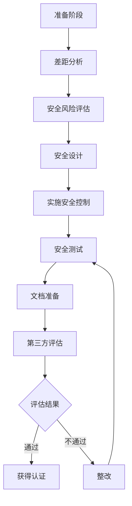
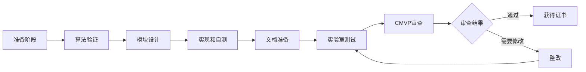

---
# 基础信息
title: "嵌入式系统安全认证与合规实践"
description: "深入介绍嵌入式系统安全认证体系、合规要求、认证流程、测试标准和实际案例，帮助开发者理解和应对安全认证挑战"
slug: "security-certification-compliance"

# 分类信息
domain: "10-cross-cutting-concerns"
module: "03-security-reliability"
content_type: "article"
skill_level: "advanced"

# 标签和关联
tags:
  - 安全认证
  - 合规
  - 标准
  - IEC 62443
  - Common Criteria
prerequisites: []
related_contents: []

# 学习信息
estimated_time: 80
difficulty_score: 5

# 作者和版本
author: "嵌入式知识平台"
author_id: ""
created_at: "2026-03-10"
updated_at: "2026-03-10"
version: "1.0"

# 语言和本地化
language: "zh-CN"
translations: []

# 状态和可见性
status: "draft"
is_featured: false
is_premium: false

# SEO和元数据
keywords:
  - 安全认证
  - 合规标准
  - IEC 62443
  - Common Criteria
  - 认证流程
cover_image: ""
---

# 嵌入式系统安全认证与合规实践


## 概述

在当今互联的世界中,嵌入式系统的安全性已成为产品成功的关键因素。无论是工业控制系统、医疗设备、汽车电子还是物联网设备,都面临着日益严峻的安全威胁。安全认证和合规不仅是法律法规的要求,更是保护用户、维护品牌信誉和确保系统可靠运行的必要手段。

本文将深入探讨嵌入式系统安全认证的各个方面,包括主要的认证体系、合规要求、认证流程、测试标准以及实际案例分析,帮助开发者和企业更好地理解和应对安全认证挑战。

### 学习目标

通过本文的学习,你将能够:

- 理解主要的安全认证体系和标准(IEC 62443、Common Criteria、FIPS等)
- 掌握安全认证的流程和关键步骤
- 了解不同行业的合规要求和特殊标准
- 学习安全测试和评估方法
- 通过实际案例理解认证实践中的挑战和解决方案

## 背景知识

### 为什么需要安全认证

安全认证的必要性体现在多个方面:

**法律合规要求**
- 许多国家和地区对特定行业的产品有强制性安全要求
- 不符合标准的产品可能无法进入市场
- 违规可能导致巨额罚款和法律责任

**市场准入门槛**
- 大型企业和政府采购通常要求安全认证
- 认证是产品差异化和竞争优势的体现
- 某些行业(如国防、金融)必须通过特定认证

**风险管理**
- 系统性地识别和缓解安全风险
- 减少安全事故和数据泄露的可能性
- 降低潜在的经济损失和声誉损害

**客户信任**
- 认证证明产品经过独立第三方验证
- 增强客户对产品安全性的信心
- 提升品牌形象和市场认可度

### 安全认证的挑战

嵌入式系统的安全认证面临诸多挑战:

- **技术复杂性**: 嵌入式系统涉及硬件、固件、软件多个层面
- **资源限制**: 认证过程需要大量时间、人力和资金投入
- **标准多样性**: 不同行业和地区有不同的认证标准
- **持续合规**: 系统更新和维护需要保持合规状态
- **供应链管理**: 需要确保整个供应链的安全性


## 主要安全认证体系

### IEC 62443 - 工业自动化和控制系统安全

IEC 62443是工业控制系统(ICS)和运营技术(OT)领域最重要的安全标准系列。

#### 标准结构

IEC 62443分为四个主要部分:

**Part 1: 通用要求**
- 1-1: 术语、概念和模型
- 1-2: 主要术语和定义
- 1-3: 系统安全合规性指标
- 1-4: IACS安全生命周期和用例

**Part 2: 政策和程序**
- 2-1: IACS安全管理系统要求
- 2-2: IACS安全计划要求
- 2-3: 补丁管理
- 2-4: 安全服务提供商要求

**Part 3: 系统要求**
- 3-1: 安全技术
- 3-2: 安全风险评估和系统设计
- 3-3: 系统安全要求和安全等级

**Part 4: 组件要求**
- 4-1: 产品开发要求
- 4-2: 组件技术安全要求

#### 安全等级(Security Level)

IEC 62443定义了四个安全等级(SL):

```
SL 1 (Security Level 1)
- 防护目标: 防止偶然或巧合的违规
- 威胁场景: 无意的违规行为
- 典型应用: 低风险工业环境

SL 2 (Security Level 2)
- 防护目标: 防止使用简单手段的有意违规
- 威胁场景: 具有低技能和低动机的攻击者
- 典型应用: 一般工业控制系统

SL 3 (Security Level 3)
- 防护目标: 防止使用复杂手段的有意违规
- 威胁场景: 具有中等技能和中等资源的攻击者
- 典型应用: 关键基础设施

SL 4 (Security Level 4)
- 防护目标: 防止使用扩展手段的有意违规
- 威胁场景: 具有高技能和大量资源的攻击者
- 典型应用: 国家关键基础设施
```

#### 认证流程

IEC 62443认证的典型流程:



**关键步骤说明**:

1. **准备阶段**: 了解标准要求,组建认证团队,制定认证计划
2. **差距分析**: 评估当前系统与标准要求的差距
3. **安全风险评估**: 识别威胁、漏洞和风险
4. **安全设计**: 根据目标安全等级设计安全架构
5. **实施安全控制**: 实现技术和管理控制措施
6. **安全测试**: 进行渗透测试、漏洞扫描等
7. **文档准备**: 准备安全文档、测试报告等
8. **第三方评估**: 由认证机构进行独立评估


### Common Criteria (CC) - 通用准则

Common Criteria (ISO/IEC 15408)是国际公认的IT产品安全评估标准。

#### 评估保证级别(EAL)

Common Criteria定义了七个评估保证级别:

```
EAL1: 功能测试
- 最低级别,适用于低风险环境
- 主要通过功能测试验证

EAL2: 结构测试
- 需要开发者配合,提供设计信息
- 进行结构化测试

EAL3: 方法测试和检查
- 需要开发过程文档
- 进行更深入的测试

EAL4: 方法设计、测试和审查
- 工程化开发和测试
- 商业产品常见级别

EAL5: 半形式化设计和测试
- 需要半形式化设计描述
- 严格的开发过程

EAL6: 半形式化验证设计和测试
- 需要结构化开发过程
- 高安全性要求

EAL7: 形式化验证设计和测试
- 最高级别,需要形式化方法
- 用于最高安全要求场景
```

#### 保护轮廓(Protection Profile)

保护轮廓定义了特定类型产品的安全要求:

```yaml
保护轮廓组成:
  - PP简介: 产品类型、使用场景
  - 一致性声明: 符合的标准和其他PP
  - 安全问题定义: 威胁、假设、组织安全策略
  - 安全目标: 产品和环境的安全目标
  - 扩展组件定义: 自定义的安全功能
  - 安全要求: 功能要求(SFR)和保证要求(SAR)
  - 应用说明: 如何应用PP

常见保护轮廓:
  - 操作系统PP
  - 防火墙PP
  - 智能卡PP
  - 移动设备PP
  - 生物识别系统PP
```

#### 安全目标(Security Target)

安全目标是具体产品的安全规格说明:

```yaml
ST文档结构:
  1. ST简介
     - 产品标识
     - ST概述
     - CC一致性声明
  
  2. 一致性声明
     - PP一致性
     - 包声明
  
  3. 安全问题定义
     - 威胁
     - 组织安全策略
     - 假设
  
  4. 安全目标
     - TOE安全目标
     - 环境安全目标
  
  5. 扩展组件定义
  
  6. 安全要求
     - TOE安全功能要求
     - TOE安全保证要求
  
  7. TOE总结规格
     - TOE安全功能
     - 保证措施
```


### FIPS 140-3 - 密码模块验证

FIPS 140-3是美国联邦信息处理标准,用于验证密码模块的安全性。

#### 安全级别

FIPS 140-3定义了四个安全级别:

**Level 1: 基本安全要求**
```
要求:
- 使用经过批准的算法
- 基本的物理安全
- 软件或固件实现

适用场景:
- 低安全要求的应用
- 成本敏感的产品
```

**Level 2: 增强物理安全**
```
要求:
- Level 1的所有要求
- 防篡改证据(如封条)
- 基于角色的认证
- 操作员认证

适用场景:
- 一般商业应用
- 需要防止物理篡改
```

**Level 3: 高级物理安全**
```
要求:
- Level 2的所有要求
- 防篡改响应机制
- 基于身份的认证
- 物理或逻辑隔离
- 关键安全参数(CSP)进出保护

适用场景:
- 高安全要求应用
- 金融、政府系统
```

**Level 4: 最高物理安全**
```
要求:
- Level 3的所有要求
- 完整的物理包络保护
- 环境故障保护和测试
- 侧信道攻击防护

适用场景:
- 最高安全要求
- 国防、情报系统
```

#### 认证测试要求

FIPS 140-3认证需要通过以下测试:

```yaml
密码算法测试:
  - 算法实现验证(CAVP)
  - 支持的算法列表
  - 算法自测试

物理安全测试:
  - 防篡改测试
  - 环境故障测试
  - 侧信道分析

软件/固件安全:
  - 完整性测试
  - 加载测试
  - 自测试

接口测试:
  - 数据输入接口
  - 数据输出接口
  - 控制接口
  - 状态接口

角色和服务:
  - 角色定义
  - 服务授权
  - 认证机制

密钥管理:
  - 密钥生成
  - 密钥建立
  - 密钥存储
  - 密钥销毁
```

#### 认证流程




### 其他重要认证标准

#### UL 2900 - 网络安全认证

UL 2900系列专注于网络连接产品的安全性:

```yaml
UL 2900-1: 通用要求
  - 适用于所有网络连接产品
  - 软件安全开发生命周期
  - 漏洞管理
  - 安全测试

UL 2900-2-1: 医疗设备
  - 医疗设备特定要求
  - FDA认可的标准
  - 患者安全考虑

UL 2900-2-2: 工业控制系统
  - ICS特定要求
  - 与IEC 62443协调
  - 运营技术安全

UL 2900-2-3: 安防系统
  - 物理安全系统
  - 视频监控
  - 访问控制系统
```

#### ETSI EN 303 645 - 物联网安全

欧洲电信标准协会(ETSI)制定的物联网消费品安全标准:

```yaml
核心要求:
  1. 禁止默认密码
  2. 实施漏洞披露政策
  3. 保持软件更新
  4. 安全存储凭证
  5. 安全通信
  6. 最小化攻击面
  7. 确保软件完整性
  8. 确保个人数据受保护
  9. 使系统具有弹性
  10. 监控系统遥测数据
  11. 便于用户删除数据
  12. 便于安装和维护
  13. 验证输入数据

适用产品:
  - 智能家居设备
  - 可穿戴设备
  - 消费类物联网产品
```

#### PSA Certified - ARM平台安全架构

针对物联网设备的安全认证框架:

```yaml
认证级别:

Level 1: PSA Certified
  - 基础安全功能
  - 威胁模型
  - 安全分析

Level 2: PSA Certified Level 2
  - 独立实验室评估
  - 安全功能测试
  - 漏洞分析

Level 3: PSA Certified Level 3
  - 高保证评估
  - 形式化方法
  - 侧信道分析

认证范围:
  - 芯片级(Silicon)
  - 软件级(Software)
  - 设备级(Device)
```


## 行业特定合规要求

### 汽车行业

#### ISO/SAE 21434 - 汽车网络安全

汽车行业的网络安全标准:

```yaml
生命周期阶段:
  1. 概念阶段
     - 项目定义
     - 威胁分析和风险评估(TARA)
     - 网络安全目标
  
  2. 产品开发
     - 网络安全规格
     - 网络安全设计
     - 集成和验证
  
  3. 生产
     - 生产控制
     - 网络安全配置
  
  4. 运营和维护
     - 事件响应
     - 更新管理
     - 持续监控
  
  5. 报废
     - 数据删除
     - 组件处置

关键活动:
  - 网络安全管理系统
  - 项目相关网络安全管理
  - 持续网络安全活动
  - 风险评估方法
```

#### UNECE WP.29 - 联合国法规

联合国欧洲经济委员会的汽车网络安全法规:

```
UN R155: 网络安全管理系统
- 要求制造商建立CSMS
- 涵盖车辆生命周期
- 2024年7月起强制执行

UN R156: 软件更新管理系统
- OTA更新安全要求
- 更新验证和授权
- 与R155协调实施
```

### 医疗设备

#### IEC 62304 - 医疗设备软件生命周期

```yaml
软件安全分类:
  Class A: 不可能造成伤害
  Class B: 可能造成非严重伤害
  Class C: 可能造成死亡或严重伤害

开发过程要求:
  - 软件开发计划
  - 需求分析
  - 架构设计
  - 详细设计
  - 单元实现和验证
  - 集成和集成测试
  - 系统测试
  - 发布

维护过程:
  - 问题分析
  - 修改实施
  - 维护测试
  - 更新发布
```

#### FDA网络安全指南

美国FDA对医疗设备网络安全的要求:

```yaml
上市前指南:
  - 威胁建模
  - 安全风险管理
  - 安全架构
  - 安全测试
  - 软件物料清单(SBOM)
  - 漏洞管理计划

上市后指南:
  - 持续监控
  - 漏洞披露
  - 补丁管理
  - 事件响应
  - 定期安全更新
```

### 工业控制系统

#### NERC CIP - 北美电力可靠性标准

```yaml
CIP标准系列:
  CIP-002: 关键网络资产识别
  CIP-003: 安全管理控制
  CIP-004: 人员和培训
  CIP-005: 电子安全边界
  CIP-006: 物理安全
  CIP-007: 系统安全管理
  CIP-008: 事件报告和响应
  CIP-009: 恢复计划
  CIP-010: 配置变更管理
  CIP-011: 信息保护
  CIP-013: 供应链风险管理

合规要求:
  - 定期审计
  - 证据收集
  - 违规处罚
  - 持续改进
```


## 认证实施流程

### 认证准备阶段

#### 1. 认证策略制定

```yaml
关键决策:
  - 选择适用的认证标准
  - 确定目标认证级别
  - 评估认证成本和时间
  - 组建认证团队
  - 制定认证计划

团队组成:
  - 项目经理: 整体协调
  - 安全架构师: 技术设计
  - 开发工程师: 实现安全功能
  - 测试工程师: 安全测试
  - 文档工程师: 文档准备
  - 合规专家: 标准解读
```

#### 2. 差距分析

识别当前状态与认证要求的差距:

```python
# 差距分析示例框架
class GapAnalysis:
    def __init__(self, standard, current_system):
        self.standard = standard
        self.current_system = current_system
        self.gaps = []
    
    def analyze_requirement(self, requirement):
        """分析单个要求的差距"""
        gap = {
            'requirement_id': requirement.id,
            'requirement_text': requirement.text,
            'current_status': self.assess_current_status(requirement),
            'gap_level': 'none',  # none, minor, major, critical
            'remediation_effort': 'low',  # low, medium, high
            'priority': 1,  # 1-5
            'remediation_plan': ''
        }
        
        # 评估差距级别
        if gap['current_status'] == 'not_implemented':
            gap['gap_level'] = 'critical'
            gap['priority'] = 5
        elif gap['current_status'] == 'partially_implemented':
            gap['gap_level'] = 'major'
            gap['priority'] = 3
        
        self.gaps.append(gap)
        return gap
    
    def generate_report(self):
        """生成差距分析报告"""
        report = {
            'total_requirements': len(self.standard.requirements),
            'gaps_by_level': self.count_gaps_by_level(),
            'estimated_effort': self.estimate_total_effort(),
            'priority_items': self.get_priority_items(),
            'recommendations': self.generate_recommendations()
        }
        return report
```

#### 3. 资源规划

```yaml
人力资源:
  - 内部团队配置
  - 外部顾问需求
  - 培训计划

时间规划:
  - 准备阶段: 2-3个月
  - 实施阶段: 6-12个月
  - 测试阶段: 2-4个月
  - 认证阶段: 3-6个月
  - 总计: 13-25个月

预算规划:
  - 咨询费用
  - 工具和设备
  - 测试费用
  - 认证费用
  - 培训费用
  - 应急预算(20%)
```

### 安全设计与实施

#### 1. 威胁建模

使用STRIDE方法进行威胁分析:

```yaml
STRIDE威胁类型:
  S - Spoofing (欺骗):
    - 身份伪造
    - 凭证窃取
    - 缓解: 强认证、多因素认证
  
  T - Tampering (篡改):
    - 数据修改
    - 代码注入
    - 缓解: 完整性保护、数字签名
  
  R - Repudiation (否认):
    - 操作否认
    - 日志删除
    - 缓解: 审计日志、不可否认性
  
  I - Information Disclosure (信息泄露):
    - 数据窃取
    - 侧信道攻击
    - 缓解: 加密、访问控制
  
  D - Denial of Service (拒绝服务):
    - 资源耗尽
    - 系统崩溃
    - 缓解: 速率限制、资源管理
  
  E - Elevation of Privilege (权限提升):
    - 未授权访问
    - 漏洞利用
    - 缓解: 最小权限、输入验证
```

#### 2. 安全架构设计

```c
// 安全架构示例 - 分层防御
typedef struct {
    // 第一层: 物理安全
    struct {
        bool tamper_detection;
        bool secure_enclosure;
        bool environmental_sensors;
    } physical_layer;
    
    // 第二层: 硬件安全
    struct {
        bool secure_boot;
        bool hardware_crypto;
        bool secure_storage;
        bool debug_protection;
    } hardware_layer;
    
    // 第三层: 固件安全
    struct {
        bool code_signing;
        bool secure_update;
        bool runtime_integrity;
        bool memory_protection;
    } firmware_layer;
    
    // 第四层: 应用安全
    struct {
        bool authentication;
        bool authorization;
        bool encryption;
        bool audit_logging;
    } application_layer;
    
    // 第五层: 通信安全
    struct {
        bool tls_support;
        bool certificate_validation;
        bool secure_protocols;
    } communication_layer;
    
} security_architecture_t;

// 安全初始化
int security_init(security_architecture_t *arch) {
    // 1. 初始化硬件安全模块
    if (init_hardware_security(&arch->hardware_layer) != 0) {
        return -1;
    }
    
    // 2. 验证固件完整性
    if (verify_firmware_integrity(&arch->firmware_layer) != 0) {
        return -2;
    }
    
    // 3. 初始化加密服务
    if (init_crypto_services() != 0) {
        return -3;
    }
    
    // 4. 启动安全监控
    if (start_security_monitoring(arch) != 0) {
        return -4;
    }
    
    return 0;
}
```


#### 3. 安全功能实现

关键安全功能的实现示例:

```c
// 安全启动实现
typedef struct {
    uint8_t signature[256];      // RSA-2048签名
    uint8_t hash[32];            // SHA-256哈希
    uint32_t version;            // 固件版本
    uint32_t size;               // 固件大小
    uint8_t public_key_hash[32]; // 公钥哈希
} firmware_header_t;

int secure_boot_verify(const firmware_header_t *header, 
                       const uint8_t *firmware_data) {
    // 1. 验证公钥
    uint8_t computed_key_hash[32];
    sha256(trusted_public_key, sizeof(trusted_public_key), 
           computed_key_hash);
    
    if (memcmp(computed_key_hash, header->public_key_hash, 32) != 0) {
        log_security_event("Public key verification failed");
        return -1;
    }
    
    // 2. 验证固件哈希
    uint8_t computed_hash[32];
    sha256(firmware_data, header->size, computed_hash);
    
    if (memcmp(computed_hash, header->hash, 32) != 0) {
        log_security_event("Firmware hash verification failed");
        return -2;
    }
    
    // 3. 验证数字签名
    if (rsa_verify(header->hash, 32, header->signature, 
                   trusted_public_key) != 0) {
        log_security_event("Signature verification failed");
        return -3;
    }
    
    // 4. 验证版本(防回滚)
    uint32_t current_version = get_current_firmware_version();
    if (header->version < current_version) {
        log_security_event("Firmware rollback attempt detected");
        return -4;
    }
    
    log_security_event("Secure boot verification successful");
    return 0;
}

// 安全通信实现
typedef struct {
    mbedtls_ssl_context ssl;
    mbedtls_ssl_config conf;
    mbedtls_x509_crt cacert;
    mbedtls_x509_crt clicert;
    mbedtls_pk_context pkey;
} secure_connection_t;

int secure_connection_init(secure_connection_t *conn) {
    // 1. 初始化SSL上下文
    mbedtls_ssl_init(&conn->ssl);
    mbedtls_ssl_config_init(&conn->conf);
    
    // 2. 配置SSL参数
    mbedtls_ssl_config_defaults(&conn->conf,
                                MBEDTLS_SSL_IS_CLIENT,
                                MBEDTLS_SSL_TRANSPORT_STREAM,
                                MBEDTLS_SSL_PRESET_DEFAULT);
    
    // 3. 设置最低TLS版本(TLS 1.2)
    mbedtls_ssl_conf_min_version(&conn->conf,
                                 MBEDTLS_SSL_MAJOR_VERSION_3,
                                 MBEDTLS_SSL_MINOR_VERSION_3);
    
    // 4. 配置密码套件(仅使用强加密)
    const int ciphersuites[] = {
        MBEDTLS_TLS_ECDHE_RSA_WITH_AES_256_GCM_SHA384,
        MBEDTLS_TLS_ECDHE_RSA_WITH_AES_128_GCM_SHA256,
        0
    };
    mbedtls_ssl_conf_ciphersuites(&conn->conf, ciphersuites);
    
    // 5. 加载证书
    mbedtls_x509_crt_parse(&conn->cacert, ca_cert_pem, 
                           strlen(ca_cert_pem) + 1);
    mbedtls_ssl_conf_ca_chain(&conn->conf, &conn->cacert, NULL);
    
    // 6. 配置证书验证
    mbedtls_ssl_conf_authmode(&conn->conf, 
                              MBEDTLS_SSL_VERIFY_REQUIRED);
    
    return 0;
}

// 访问控制实现
typedef enum {
    ROLE_ADMIN = 0,
    ROLE_OPERATOR = 1,
    ROLE_VIEWER = 2,
    ROLE_GUEST = 3
} user_role_t;

typedef struct {
    uint32_t user_id;
    user_role_t role;
    uint32_t permissions;
    time_t session_start;
    time_t last_activity;
} user_session_t;

bool check_permission(user_session_t *session, uint32_t required_perm) {
    // 1. 检查会话有效性
    time_t now = time(NULL);
    if (now - session->last_activity > SESSION_TIMEOUT) {
        log_security_event("Session timeout for user %d", 
                          session->user_id);
        return false;
    }
    
    // 2. 检查权限
    if ((session->permissions & required_perm) == 0) {
        log_security_event("Permission denied for user %d, perm 0x%x",
                          session->user_id, required_perm);
        return false;
    }
    
    // 3. 更新活动时间
    session->last_activity = now;
    
    // 4. 记录访问
    log_audit_event("User %d accessed resource with perm 0x%x",
                   session->user_id, required_perm);
    
    return true;
}
```

### 安全测试与验证

#### 1. 渗透测试

```yaml
测试范围:
  网络层测试:
    - 端口扫描
    - 协议模糊测试
    - 中间人攻击
    - 重放攻击
  
  应用层测试:
    - 输入验证
    - 认证绕过
    - 授权漏洞
    - 会话管理
  
  固件测试:
    - 固件提取
    - 逆向工程
    - 漏洞分析
    - 调试接口测试
  
  物理测试:
    - 侧信道分析
    - 故障注入
    - 调试端口访问
    - 芯片解封装

测试工具:
  - Nmap: 网络扫描
  - Burp Suite: Web应用测试
  - Metasploit: 漏洞利用
  - Wireshark: 流量分析
  - IDA Pro: 逆向工程
  - ChipWhisperer: 侧信道分析
```

#### 2. 漏洞扫描

```python
# 自动化漏洞扫描脚本示例
import nmap
import requests
from typing import List, Dict

class VulnerabilityScanner:
    def __init__(self, target_ip: str):
        self.target = target_ip
        self.scanner = nmap.PortScanner()
        self.vulnerabilities = []
    
    def scan_ports(self) -> List[int]:
        """扫描开放端口"""
        print(f"Scanning ports on {self.target}...")
        self.scanner.scan(self.target, '1-65535', '-sV')
        
        open_ports = []
        for host in self.scanner.all_hosts():
            for proto in self.scanner[host].all_protocols():
                ports = self.scanner[host][proto].keys()
                open_ports.extend(ports)
        
        return open_ports
    
    def check_default_credentials(self, port: int) -> bool:
        """检查默认凭证"""
        default_creds = [
            ('admin', 'admin'),
            ('admin', 'password'),
            ('root', 'root'),
            ('admin', '12345')
        ]
        
        for username, password in default_creds:
            try:
                # 尝试登录
                response = requests.post(
                    f'http://{self.target}:{port}/login',
                    data={'username': username, 'password': password},
                    timeout=5
                )
                if response.status_code == 200:
                    self.vulnerabilities.append({
                        'type': 'default_credentials',
                        'severity': 'critical',
                        'port': port,
                        'details': f'Default credentials: {username}/{password}'
                    })
                    return True
            except:
                pass
        
        return False
    
    def check_tls_configuration(self, port: int) -> Dict:
        """检查TLS配置"""
        import ssl
        import socket
        
        context = ssl.create_default_context()
        context.check_hostname = False
        context.verify_mode = ssl.CERT_NONE
        
        try:
            with socket.create_connection((self.target, port), timeout=5) as sock:
                with context.wrap_socket(sock) as ssock:
                    # 检查协议版本
                    version = ssock.version()
                    if version in ['TLSv1', 'TLSv1.1']:
                        self.vulnerabilities.append({
                            'type': 'weak_tls',
                            'severity': 'high',
                            'port': port,
                            'details': f'Weak TLS version: {version}'
                        })
                    
                    # 检查密码套件
                    cipher = ssock.cipher()
                    if 'DES' in cipher[0] or 'RC4' in cipher[0]:
                        self.vulnerabilities.append({
                            'type': 'weak_cipher',
                            'severity': 'high',
                            'port': port,
                            'details': f'Weak cipher: {cipher[0]}'
                        })
        except:
            pass
    
    def generate_report(self) -> str:
        """生成漏洞报告"""
        report = "Vulnerability Scan Report\n"
        report += "=" * 50 + "\n"
        report += f"Target: {self.target}\n"
        report += f"Total vulnerabilities: {len(self.vulnerabilities)}\n\n"
        
        # 按严重程度分组
        by_severity = {}
        for vuln in self.vulnerabilities:
            severity = vuln['severity']
            if severity not in by_severity:
                by_severity[severity] = []
            by_severity[severity].append(vuln)
        
        for severity in ['critical', 'high', 'medium', 'low']:
            if severity in by_severity:
                report += f"\n{severity.upper()} Severity:\n"
                report += "-" * 50 + "\n"
                for vuln in by_severity[severity]:
                    report += f"Type: {vuln['type']}\n"
                    report += f"Port: {vuln['port']}\n"
                    report += f"Details: {vuln['details']}\n\n"
        
        return report
```


#### 3. 合规性测试

```yaml
测试类型:

功能测试:
  - 验证安全功能正确实现
  - 测试认证机制
  - 测试授权控制
  - 测试加密功能
  - 测试审计日志

负面测试:
  - 无效输入测试
  - 边界条件测试
  - 错误处理测试
  - 异常场景测试

性能测试:
  - 加密性能
  - 认证延迟
  - 并发处理能力
  - 资源消耗

压力测试:
  - 拒绝服务测试
  - 资源耗尽测试
  - 恢复能力测试

回归测试:
  - 修改后重新测试
  - 确保未引入新问题
  - 验证修复有效性
```

### 文档准备

#### 1. 必需文档清单

```yaml
技术文档:
  - 系统架构文档
  - 安全设计文档
  - 威胁模型文档
  - 安全功能规格
  - 接口规格文档
  - 数据流图

测试文档:
  - 测试计划
  - 测试用例
  - 测试报告
  - 漏洞评估报告
  - 渗透测试报告

管理文档:
  - 安全策略
  - 风险评估报告
  - 配置管理计划
  - 变更管理流程
  - 事件响应计划

合规文档:
  - 合规性矩阵
  - 差距分析报告
  - 整改计划
  - 认证申请表
  - 自评估报告
```

#### 2. 文档质量要求

```yaml
完整性:
  - 覆盖所有要求
  - 无遗漏项
  - 版本控制

准确性:
  - 技术描述准确
  - 与实际实现一致
  - 及时更新

可追溯性:
  - 需求到设计
  - 设计到实现
  - 实现到测试
  - 测试到需求

可审计性:
  - 清晰的证据链
  - 完整的记录
  - 独立可验证
```


## 实际案例分析

### 案例1: 工业控制器IEC 62443认证

#### 项目背景

某工业自动化公司开发了一款用于关键基础设施的可编程逻辑控制器(PLC),需要通过IEC 62443-4-2认证,目标安全等级为SL 3。

#### 认证过程

**1. 准备阶段(3个月)**

```yaml
初始评估:
  - 产品定位: 工业PLC
  - 目标等级: SL 3
  - 适用标准: IEC 62443-4-2
  - 预算: $500,000
  - 时间: 18个月

团队组建:
  - 项目经理: 1人
  - 安全架构师: 2人
  - 开发工程师: 5人
  - 测试工程师: 3人
  - 文档工程师: 2人
  - 外部顾问: 1人

差距分析结果:
  - 总要求数: 156项
  - 已满足: 78项(50%)
  - 部分满足: 45项(29%)
  - 未满足: 33项(21%)
```

**2. 设计与实施(9个月)**

关键安全功能实现:

```c
// 1. 安全通信实现
typedef struct {
    uint32_t session_id;
    uint8_t aes_key[32];        // AES-256密钥
    uint8_t hmac_key[32];       // HMAC-SHA256密钥
    uint32_t tx_counter;        // 发送计数器
    uint32_t rx_counter;        // 接收计数器
    time_t key_creation_time;   // 密钥创建时间
} secure_channel_t;

int secure_channel_send(secure_channel_t *channel, 
                       const uint8_t *data, size_t len) {
    // 1. 检查密钥有效期(24小时)
    time_t now = time(NULL);
    if (now - channel->key_creation_time > 86400) {
        // 触发密钥更新
        if (rekey_channel(channel) != 0) {
            return -1;
        }
    }
    
    // 2. 构造消息
    uint8_t message[MAX_MESSAGE_SIZE];
    uint32_t offset = 0;
    
    // 会话ID
    memcpy(message + offset, &channel->session_id, 4);
    offset += 4;
    
    // 计数器(防重放)
    memcpy(message + offset, &channel->tx_counter, 4);
    offset += 4;
    
    // 加密数据
    uint8_t encrypted[MAX_PAYLOAD_SIZE];
    uint8_t iv[16];
    generate_random(iv, 16);
    
    aes256_cbc_encrypt(data, len, encrypted, 
                      channel->aes_key, iv);
    
    memcpy(message + offset, iv, 16);
    offset += 16;
    memcpy(message + offset, encrypted, len);
    offset += len;
    
    // 3. 计算HMAC
    uint8_t hmac[32];
    hmac_sha256(message, offset, channel->hmac_key, hmac);
    memcpy(message + offset, hmac, 32);
    offset += 32;
    
    // 4. 发送
    int ret = network_send(message, offset);
    if (ret == 0) {
        channel->tx_counter++;
    }
    
    return ret;
}

// 2. 访问控制实现
typedef struct {
    char username[32];
    uint8_t password_hash[32];
    user_role_t role;
    uint32_t failed_attempts;
    time_t lockout_until;
    bool mfa_enabled;
    uint8_t mfa_secret[32];
} user_account_t;

int authenticate_user(const char *username, const char *password,
                     const char *mfa_code) {
    user_account_t *account = find_user(username);
    if (account == NULL) {
        // 防止用户枚举,延迟响应
        sleep_ms(1000);
        log_security_event("Login attempt for non-existent user: %s", 
                          username);
        return -1;
    }
    
    // 1. 检查账户锁定
    time_t now = time(NULL);
    if (now < account->lockout_until) {
        log_security_event("Login attempt for locked account: %s", 
                          username);
        return -2;
    }
    
    // 2. 验证密码
    uint8_t password_hash[32];
    sha256_with_salt(password, account->username, password_hash);
    
    if (memcmp(password_hash, account->password_hash, 32) != 0) {
        account->failed_attempts++;
        
        // 3次失败后锁定30分钟
        if (account->failed_attempts >= 3) {
            account->lockout_until = now + 1800;
            log_security_event("Account locked due to failed attempts: %s",
                              username);
        }
        
        return -3;
    }
    
    // 3. 验证MFA(如果启用)
    if (account->mfa_enabled) {
        if (!verify_totp(mfa_code, account->mfa_secret)) {
            log_security_event("MFA verification failed for user: %s",
                              username);
            return -4;
        }
    }
    
    // 4. 认证成功
    account->failed_attempts = 0;
    log_audit_event("User logged in: %s", username);
    
    return 0;
}

// 3. 审计日志实现
typedef struct {
    time_t timestamp;
    uint32_t event_id;
    uint8_t severity;       // 1=info, 2=warning, 3=error, 4=critical
    uint32_t user_id;
    char event_type[32];
    char description[256];
    uint8_t signature[64];  // 日志签名
} audit_log_entry_t;

int log_audit_event(const char *event_type, const char *format, ...) {
    audit_log_entry_t entry;
    
    // 1. 填充基本信息
    entry.timestamp = time(NULL);
    entry.event_id = get_next_event_id();
    entry.user_id = get_current_user_id();
    strncpy(entry.event_type, event_type, 31);
    
    // 2. 格式化描述
    va_list args;
    va_start(args, format);
    vsnprintf(entry.description, 255, format, args);
    va_end(args);
    
    // 3. 计算签名(防篡改)
    uint8_t hash[32];
    sha256(&entry, sizeof(entry) - 64, hash);
    sign_with_private_key(hash, 32, entry.signature);
    
    // 4. 写入日志
    if (write_to_secure_log(&entry) != 0) {
        // 日志写入失败是严重问题
        trigger_alarm("Audit log write failed");
        return -1;
    }
    
    // 5. 如果是关键事件,立即同步到远程日志服务器
    if (entry.severity >= 3) {
        send_to_remote_log_server(&entry);
    }
    
    return 0;
}
```

**3. 测试阶段(4个月)**

```yaml
测试活动:
  功能测试:
    - 156项安全要求逐项测试
    - 测试用例: 1,247个
    - 通过率: 98.5%
  
  渗透测试:
    - 网络层测试: 2周
    - 应用层测试: 2周
    - 固件测试: 2周
    - 发现漏洞: 12个(全部修复)
  
  性能测试:
    - 加密吞吐量: 满足要求
    - 认证延迟: <100ms
    - 并发连接: >100
  
  压力测试:
    - DoS防护: 有效
    - 资源耗尽: 未发生
    - 恢复时间: <5秒
```

**4. 认证阶段(2个月)**

```yaml
认证活动:
  文档审查:
    - 提交文档: 23份
    - 审查轮次: 2轮
    - 修改项: 47项
  
  现场评估:
    - 评估时间: 5天
    - 评估人员: 3人
    - 测试项: 89项
    - 发现问题: 5项(全部整改)
  
  最终结果:
    - 认证通过
    - 安全等级: SL 3
    - 证书有效期: 3年
```

#### 经验教训

```yaml
成功因素:
  - 高层管理支持
  - 充足的资源投入
  - 经验丰富的团队
  - 早期引入安全设计
  - 持续的测试和验证

挑战与应对:
  挑战1: 遗留代码安全性差
    应对: 重构关键模块,隔离不安全代码
  
  挑战2: 性能与安全的平衡
    应对: 硬件加速,优化算法
  
  挑战3: 供应链安全
    应对: 审查第三方组件,建立SBOM
  
  挑战4: 文档工作量大
    应对: 自动化工具,模板化

成本分析:
  - 总成本: $520,000
  - 人力成本: 65%
  - 工具和设备: 15%
  - 认证费用: 12%
  - 培训和咨询: 8%
```


### 案例2: 医疗设备FDA网络安全合规

#### 项目背景

某医疗设备公司开发了一款联网的患者监护仪,需要满足FDA网络安全指南要求并获得510(k)许可。

#### 合规过程

**1. 威胁建模(2个月)**

使用STRIDE方法进行系统性威胁分析:

```yaml
识别的威胁:
  T1: 未授权访问患者数据
    - 影响: 隐私泄露
    - 严重程度: 高
    - 缓解: 强认证,加密存储
  
  T2: 恶意软件感染
    - 影响: 设备功能异常
    - 严重程度: 严重
    - 缓解: 应用白名单,完整性检查
  
  T3: 网络攻击导致服务中断
    - 影响: 患者监护中断
    - 严重程度: 严重
    - 缓解: 网络隔离,冗余设计
  
  T4: 固件被篡改
    - 影响: 设备行为异常
    - 严重程度: 严重
    - 缓解: 安全启动,代码签名
  
  T5: 配置被恶意修改
    - 影响: 错误的监护参数
    - 严重程度: 严重
    - 缓解: 配置完整性保护,审计

风险评估:
  - 高风险威胁: 3个
  - 中风险威胁: 8个
  - 低风险威胁: 12个
  - 总计: 23个威胁
```

**2. 安全架构设计(3个月)**

```c
// 医疗设备安全架构
typedef struct {
    // 设备标识
    uint8_t device_id[16];
    uint8_t serial_number[32];
    
    // 安全状态
    enum {
        STATE_SECURE_BOOT,
        STATE_INITIALIZATION,
        STATE_NORMAL_OPERATION,
        STATE_MAINTENANCE,
        STATE_EMERGENCY
    } security_state;
    
    // 患者数据保护
    struct {
        bool encryption_enabled;
        uint8_t data_key[32];
        bool anonymization_enabled;
    } patient_data_protection;
    
    // 网络安全
    struct {
        bool firewall_enabled;
        bool ids_enabled;
        uint32_t allowed_ip_count;
        uint32_t allowed_ips[MAX_ALLOWED_IPS];
    } network_security;
    
    // 审计
    struct {
        bool logging_enabled;
        uint32_t log_level;
        bool remote_logging;
    } audit_config;
    
} medical_device_security_t;

// 患者数据加密
int encrypt_patient_data(const patient_data_t *data,
                        encrypted_data_t *encrypted) {
    // 1. 生成数据加密密钥(DEK)
    uint8_t dek[32];
    generate_random(dek, 32);
    
    // 2. 使用DEK加密患者数据
    uint8_t iv[16];
    generate_random(iv, 16);
    
    aes256_gcm_encrypt(
        (uint8_t*)data, sizeof(patient_data_t),
        encrypted->ciphertext,
        dek, iv,
        encrypted->tag
    );
    
    memcpy(encrypted->iv, iv, 16);
    
    // 3. 使用KEK(密钥加密密钥)加密DEK
    uint8_t kek[32];
    get_key_encryption_key(kek);
    
    aes256_wrap(dek, 32, encrypted->wrapped_key, kek);
    
    // 4. 添加元数据
    encrypted->timestamp = time(NULL);
    encrypted->device_id = get_device_id();
    
    // 5. 计算完整性保护
    uint8_t hash[32];
    sha256(encrypted, sizeof(encrypted_data_t) - 32, hash);
    memcpy(encrypted->integrity_hash, hash, 32);
    
    // 清除敏感数据
    secure_zero(dek, 32);
    secure_zero(kek, 32);
    
    return 0;
}

// 安全日志记录
int log_medical_event(const char *event_type, 
                     const patient_data_t *patient,
                     const char *details) {
    medical_audit_log_t log;
    
    // 1. 基本信息
    log.timestamp = time(NULL);
    log.device_id = get_device_id();
    strncpy(log.event_type, event_type, 31);
    
    // 2. 患者信息(匿名化)
    if (patient != NULL) {
        // 使用哈希代替真实ID
        sha256(patient->patient_id, strlen(patient->patient_id),
               log.patient_hash);
    }
    
    // 3. 事件详情
    strncpy(log.details, details, 255);
    
    // 4. 安全标记
    log.security_level = get_current_security_level();
    log.user_id = get_current_user_id();
    
    // 5. 数字签名
    uint8_t hash[32];
    sha256(&log, sizeof(log) - 64, hash);
    sign_log_entry(hash, log.signature);
    
    // 6. 写入本地日志
    write_to_local_log(&log);
    
    // 7. 如果是关键事件,发送到中央日志服务器
    if (is_critical_event(event_type)) {
        send_to_central_log_server(&log);
    }
    
    return 0;
}

// 紧急访问模式
int enable_emergency_access(const char *reason,
                           const char *authorized_by) {
    // 1. 验证授权
    if (!verify_emergency_authorization(authorized_by)) {
        log_security_event("Unauthorized emergency access attempt");
        return -1;
    }
    
    // 2. 记录紧急访问
    log_audit_event("EMERGENCY_ACCESS_ENABLED",
                   "Reason: %s, Authorized by: %s",
                   reason, authorized_by);
    
    // 3. 启用紧急模式
    set_security_state(STATE_EMERGENCY);
    
    // 4. 放宽某些安全限制(但保持核心保护)
    disable_non_critical_security_checks();
    
    // 5. 增强监控
    enable_enhanced_monitoring();
    
    // 6. 通知相关人员
    notify_security_team("Emergency access enabled");
    
    // 7. 设置自动恢复定时器(30分钟)
    set_emergency_timeout(1800);
    
    return 0;
}
```

**3. 软件物料清单(SBOM)(1个月)**

```yaml
SBOM内容:
  开源组件:
    - mbedTLS 3.2.1
      用途: TLS/SSL通信
      许可证: Apache 2.0
      已知漏洞: 0
    
    - FreeRTOS 10.4.6
      用途: 实时操作系统
      许可证: MIT
      已知漏洞: 0
    
    - lwIP 2.1.3
      用途: TCP/IP协议栈
      许可证: BSD
      已知漏洞: 1(已修复)
  
  商业组件:
    - TouchGFX 4.20
      用途: 图形界面
      供应商: STMicroelectronics
      许可证: 商业许可
  
  自研组件:
    - Patient Monitor Core
      版本: 2.5.0
      代码行数: 45,000
      测试覆盖率: 92%

漏洞管理:
  - 定期扫描: 每周
  - 漏洞数据库: NVD, CVE
  - 响应时间: 
    - 严重: 24小时
    - 高: 7天
    - 中: 30天
```

**4. FDA提交(2个月)**

```yaml
提交文档:
  网络安全文档:
    - 威胁模型
    - 安全架构
    - 风险分析
    - 缓解措施
    - 测试报告
    - SBOM
    - 漏洞管理计划
    - 事件响应计划
  
  临床文档:
    - 临床评估
    - 性能测试
    - 可用性测试
    - 风险管理文件
  
  质量体系文档:
    - 设计控制
    - 验证和确认
    - 变更控制
    - 投诉处理

审查过程:
  - 提交日期: 2024-01-15
  - 首次反馈: 2024-02-20(36天)
  - 问题数量: 18个
  - 补充提交: 2024-03-15
  - 最终批准: 2024-04-10
  - 总耗时: 85天
```

#### 上市后监控

```yaml
持续监控:
  漏洞监控:
    - 每日扫描SBOM组件
    - 订阅安全公告
    - 参与信息共享组织
  
  事件监控:
    - 24/7安全运营中心
    - 自动告警系统
    - 事件响应团队
  
  更新管理:
    - 安全补丁: 30天内
    - 功能更新: 季度
    - 主要版本: 年度

合规维护:
  - 年度安全审计
  - 季度风险评估
  - 月度漏洞报告
  - 持续文档更新
```


## 最佳实践与建议

### 认证准备建议

#### 1. 早期规划

```yaml
设计阶段:
  - 在项目初期就考虑安全认证
  - 选择合适的认证标准
  - 将安全要求纳入需求
  - 建立安全开发流程

优势:
  - 降低后期修改成本
  - 避免架构性问题
  - 缩短认证周期
  - 提高成功率

成本对比:
  早期规划: 
    - 设计阶段投入: 10%
    - 实施阶段投入: 20%
    - 测试阶段投入: 15%
    - 总成本: 45%
  
  后期补救:
    - 重新设计: 25%
    - 重新实现: 35%
    - 额外测试: 25%
    - 延期成本: 15%
    - 总成本: 100%
```

#### 2. 团队能力建设

```yaml
培训计划:
  基础培训:
    - 安全基础知识
    - 认证标准解读
    - 威胁建模方法
    - 安全编码实践
  
  专项培训:
    - 密码学应用
    - 安全测试技术
    - 渗透测试方法
    - 事件响应流程
  
  认证培训:
    - 标准认证课程
    - 实践工作坊
    - 案例研究
    - 模拟评估

能力认证:
  - CISSP: 信息安全专家
  - CEH: 道德黑客
  - GIAC: 安全认证系列
  - ISA/IEC 62443: 工控安全
```

#### 3. 工具和自动化

```yaml
推荐工具:

静态分析:
  - SonarQube: 代码质量和安全
  - Coverity: 静态代码分析
  - Checkmarx: 安全漏洞扫描
  - Fortify: 应用安全测试

动态分析:
  - Burp Suite: Web应用测试
  - OWASP ZAP: 安全扫描
  - Nessus: 漏洞扫描
  - Metasploit: 渗透测试

合规管理:
  - GRC平台: 治理、风险、合规
  - 文档管理系统
  - 测试管理工具
  - 缺陷跟踪系统

自动化流程:
  - CI/CD集成安全检查
  - 自动化安全测试
  - 持续漏洞扫描
  - 自动化报告生成
```

### 常见问题与解决方案

#### 问题1: 性能与安全的平衡

```yaml
挑战:
  - 加密影响性能
  - 认证增加延迟
  - 安全检查消耗资源

解决方案:
  硬件加速:
    - 使用加密协处理器
    - 硬件随机数生成器
    - 安全存储单元
  
  算法优化:
    - 选择高效算法
    - 优化实现代码
    - 使用查表法
  
  架构优化:
    - 异步处理
    - 批量操作
    - 缓存机制
  
  分级保护:
    - 根据数据敏感度分级
    - 关键路径优化
    - 非关键功能降级

实例:
  问题: AES加密导致吞吐量下降40%
  解决: 
    - 使用硬件AES引擎
    - 优化数据流
    - 结果: 性能损失<5%
```

#### 问题2: 遗留系统改造

```yaml
挑战:
  - 旧代码安全性差
  - 架构不支持安全功能
  - 文档不完整
  - 测试困难

解决方案:
  渐进式改造:
    阶段1: 外围防护
      - 添加网络防火墙
      - 实施访问控制
      - 加强监控
    
    阶段2: 接口加固
      - 输入验证
      - 输出编码
      - 错误处理
    
    阶段3: 核心重构
      - 重写关键模块
      - 引入安全库
      - 改进架构
    
    阶段4: 全面升级
      - 完整重构
      - 现代化技术栈
      - 持续改进
  
  隔离策略:
    - 将不安全代码隔离
    - 使用沙箱技术
    - 限制权限
    - 增强监控

案例:
  系统: 20年历史的工控系统
  方案: 
    - 保留核心逻辑
    - 添加安全网关
    - 重写通信模块
    - 增加审计功能
  结果: 
    - 通过IEC 62443 SL2认证
    - 核心功能未改动
    - 6个月完成
```

#### 问题3: 供应链安全

```yaml
挑战:
  - 第三方组件漏洞
  - 供应商安全水平参差
  - 组件更新困难
  - 许可证合规

解决方案:
  供应商评估:
    - 安全能力评估
    - 历史记录审查
    - 合同条款约定
    - 定期审计
  
  组件管理:
    - 建立SBOM
    - 漏洞持续监控
    - 版本管理
    - 更新策略
  
  风险缓解:
    - 多供应商策略
    - 关键组件自研
    - 安全封装
    - 应急预案

工具支持:
  - Dependency-Check: 依赖检查
  - Snyk: 开源安全
  - Black Duck: 组件分析
  - WhiteSource: 许可证合规
```


### 持续合规策略

#### 1. 变更管理

```yaml
变更控制流程:
  1. 变更请求
     - 提交变更申请
     - 描述变更内容
     - 评估安全影响
  
  2. 安全评估
     - 威胁分析
     - 风险评估
     - 合规性检查
  
  3. 审批流程
     - 技术审批
     - 安全审批
     - 管理审批
  
  4. 实施变更
     - 按计划实施
     - 记录过程
     - 验证结果
  
  5. 验证确认
     - 功能测试
     - 安全测试
     - 合规验证
  
  6. 文档更新
     - 更新设计文档
     - 更新测试文档
     - 更新合规文档

关键原则:
  - 所有变更必须评估安全影响
  - 重大变更需要重新认证
  - 保持完整的变更记录
  - 确保可追溯性
```

#### 2. 漏洞管理

```python
# 漏洞管理系统示例
class VulnerabilityManagement:
    def __init__(self):
        self.vulnerabilities = []
        self.sbom = self.load_sbom()
    
    def scan_vulnerabilities(self):
        """扫描已知漏洞"""
        for component in self.sbom:
            # 查询NVD数据库
            cves = self.query_nvd(
                component.name,
                component.version
            )
            
            for cve in cves:
                vuln = {
                    'cve_id': cve.id,
                    'component': component.name,
                    'version': component.version,
                    'severity': cve.severity,
                    'cvss_score': cve.cvss_score,
                    'description': cve.description,
                    'published_date': cve.published_date,
                    'status': 'new'
                }
                self.vulnerabilities.append(vuln)
    
    def assess_risk(self, vulnerability):
        """评估漏洞风险"""
        # 基础CVSS分数
        base_score = vulnerability['cvss_score']
        
        # 环境因素调整
        if self.is_internet_facing():
            base_score *= 1.2
        
        if self.is_critical_system():
            base_score *= 1.3
        
        # 可利用性评估
        if self.has_known_exploit(vulnerability['cve_id']):
            base_score *= 1.5
        
        # 缓解措施
        if self.has_mitigation(vulnerability):
            base_score *= 0.7
        
        # 确定优先级
        if base_score >= 9.0:
            priority = 'critical'
            sla_days = 1
        elif base_score >= 7.0:
            priority = 'high'
            sla_days = 7
        elif base_score >= 4.0:
            priority = 'medium'
            sla_days = 30
        else:
            priority = 'low'
            sla_days = 90
        
        return {
            'adjusted_score': base_score,
            'priority': priority,
            'sla_days': sla_days
        }
    
    def create_remediation_plan(self, vulnerability):
        """创建修复计划"""
        risk = self.assess_risk(vulnerability)
        
        plan = {
            'vulnerability': vulnerability,
            'risk_assessment': risk,
            'remediation_options': [],
            'selected_option': None,
            'implementation_plan': None,
            'testing_plan': None
        }
        
        # 评估修复选项
        # 选项1: 升级组件
        if self.has_fixed_version(vulnerability):
            plan['remediation_options'].append({
                'type': 'upgrade',
                'description': 'Upgrade to fixed version',
                'effort': 'medium',
                'risk': 'low'
            })
        
        # 选项2: 应用补丁
        if self.has_patch(vulnerability):
            plan['remediation_options'].append({
                'type': 'patch',
                'description': 'Apply security patch',
                'effort': 'low',
                'risk': 'low'
            })
        
        # 选项3: 缓解措施
        plan['remediation_options'].append({
            'type': 'mitigation',
            'description': 'Implement workaround',
            'effort': 'low',
            'risk': 'medium'
        })
        
        # 选项4: 接受风险
        if risk['priority'] == 'low':
            plan['remediation_options'].append({
                'type': 'accept',
                'description': 'Accept risk with monitoring',
                'effort': 'none',
                'risk': 'medium'
            })
        
        return plan
    
    def generate_report(self):
        """生成漏洞报告"""
        report = {
            'scan_date': datetime.now(),
            'total_vulnerabilities': len(self.vulnerabilities),
            'by_severity': self.count_by_severity(),
            'by_status': self.count_by_status(),
            'overdue': self.get_overdue_vulnerabilities(),
            'trending': self.get_trending_data()
        }
        return report
```

#### 3. 事件响应

```yaml
事件响应计划:
  准备阶段:
    - 建立响应团队
    - 制定响应流程
    - 准备工具和资源
    - 定期演练
  
  检测阶段:
    - 安全监控
    - 异常检测
    - 告警分析
    - 事件确认
  
  遏制阶段:
    - 隔离受影响系统
    - 阻止攻击扩散
    - 保护关键资产
    - 收集证据
  
  根除阶段:
    - 识别根本原因
    - 清除恶意代码
    - 修复漏洞
    - 加固系统
  
  恢复阶段:
    - 恢复系统功能
    - 验证系统安全
    - 监控异常
    - 逐步恢复服务
  
  总结阶段:
    - 事件分析
    - 经验教训
    - 改进措施
    - 更新流程

响应时间要求:
  严重事件(P1):
    - 检测: 15分钟
    - 响应: 30分钟
    - 遏制: 2小时
    - 根除: 24小时
  
  高级事件(P2):
    - 检测: 1小时
    - 响应: 4小时
    - 遏制: 24小时
    - 根除: 7天
  
  中级事件(P3):
    - 检测: 24小时
    - 响应: 2天
    - 遏制: 7天
    - 根除: 30天
```


## 未来趋势

### 1. 自动化和AI驱动的合规

```yaml
趋势:
  自动化测试:
    - AI驱动的漏洞发现
    - 自动化渗透测试
    - 持续合规验证
    - 智能风险评估
  
  智能文档:
    - 自动生成合规文档
    - 智能文档审查
    - 自动化追溯
    - 实时合规状态
  
  预测性安全:
    - 威胁预测
    - 漏洞预测
    - 风险预测
    - 主动防御

技术支持:
  - 机器学习
  - 自然语言处理
  - 知识图谱
  - 自动化推理
```

### 2. 供应链安全强化

```yaml
发展方向:
  透明度提升:
    - 强制SBOM要求
    - 供应链可视化
    - 来源追溯
    - 实时监控
  
  零信任架构:
    - 持续验证
    - 最小权限
    - 微分段
    - 加密一切
  
  区块链应用:
    - 不可篡改记录
    - 分布式信任
    - 智能合约
    - 供应链追溯

标准演进:
  - NIST SSDF
  - SLSA框架
  - SBOM标准化
  - 供应链安全认证
```

### 3. 量子安全准备

```yaml
挑战:
  - 量子计算威胁现有加密
  - RSA和ECC将被破解
  - 需要迁移到抗量子算法
  - 长期数据保护

应对策略:
  算法迁移:
    - 评估量子风险
    - 选择PQC算法
    - 混合加密方案
    - 渐进式迁移
  
  标准跟踪:
    - NIST PQC标准
    - 行业最佳实践
    - 互操作性
    - 性能优化

时间表:
  - 2024: NIST PQC标准发布
  - 2025-2030: 逐步迁移
  - 2030+: 全面部署
```

### 4. 监管趋势

```yaml
全球趋势:
  更严格的要求:
    - 强制安全认证
    - 更高的罚款
    - 个人责任
    - 公开披露
  
  统一标准:
    - 国际协调
    - 互认机制
    - 统一框架
    - 简化流程
  
  持续合规:
    - 实时监控
    - 动态评估
    - 持续认证
    - 自动化审计

重点领域:
  - 关键基础设施
  - 医疗设备
  - 汽车
  - 物联网
  - 人工智能
```

## 总结

安全认证和合规是嵌入式系统开发中不可或缺的环节。通过本文的学习,我们了解了:

### 核心要点

1. **认证体系多样**: 不同行业和应用场景有不同的认证标准,需要根据实际情况选择合适的认证路径

2. **系统性方法**: 安全认证需要系统性的方法,从威胁建模、安全设计、实施、测试到文档准备,每个环节都至关重要

3. **持续过程**: 认证不是一次性活动,需要建立持续的合规机制,包括变更管理、漏洞管理和事件响应

4. **成本与收益**: 虽然认证需要大量投入,但早期规划和系统性方法可以显著降低成本,同时带来市场准入、风险降低和客户信任等收益

5. **团队能力**: 成功的认证需要具备安全专业知识的团队,持续的培训和能力建设至关重要

### 实践建议

**对于开发团队**:
- 在项目早期就考虑安全认证要求
- 建立安全开发生命周期(SDL)
- 投资于团队安全能力建设
- 使用自动化工具提高效率
- 保持与认证机构的良好沟通

**对于管理层**:
- 提供充足的资源支持
- 建立安全文化
- 将安全作为竞争优势
- 关注长期合规而非一次性认证
- 平衡安全投入与业务目标

**对于架构师**:
- 采用纵深防御策略
- 遵循安全设计原则
- 考虑性能与安全的平衡
- 设计可审计的系统
- 为未来的安全需求预留空间

### 展望未来

随着技术的发展和威胁的演进,安全认证和合规将面临新的挑战和机遇。自动化、AI、量子计算等新技术将深刻影响安全认证的方式。同时,监管要求也在不断加强,要求企业建立更加完善的安全体系。

只有持续学习、不断改进,才能在这个快速变化的领域保持竞争力,为用户提供安全可靠的产品。

## 延伸阅读

### 标准文档
- IEC 62443系列标准
- ISO/IEC 15408 (Common Criteria)
- NIST SP 800-53: Security and Privacy Controls
- NIST Cybersecurity Framework
- ISO/SAE 21434: Road vehicles - Cybersecurity engineering

### 技术指南
- OWASP Embedded Application Security
- NIST Guidelines for IoT Security
- FDA Cybersecurity Guidance
- CIS Controls for Industrial Control Systems

### 在线资源
- NIST National Vulnerability Database (NVD)
- Common Vulnerabilities and Exposures (CVE)
- ICS-CERT Advisories
- OWASP Top 10 for IoT

### 培训认证
- GIAC Industrial Control Systems Security (GICSP)
- ISA/IEC 62443 Cybersecurity Certificate Programs
- Certified Information Systems Security Professional (CISSP)
- Offensive Security Certified Professional (OSCP)

---

**文档版本**: 1.0  
**最后更新**: 2026-03-10  
**作者**: 嵌入式知识平台  
**许可**: CC BY-NC-SA 4.0
