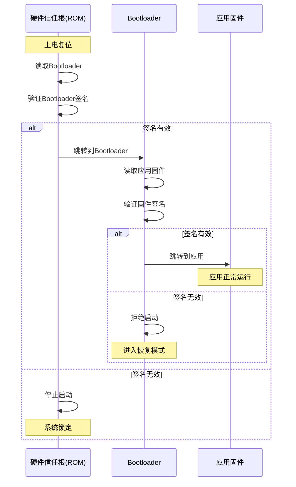

# 安全启动与固件验证


## 学习目标

完成本教程后，你将能够：

- 理解安全启动的核心概念和工作原理
- 掌握数字签名和证书链验证的实现方法
- 了解信任根（Root of Trust）的建立机制
- 能够设计和实现固件完整性验证方案
- 掌握安全固件更新的最佳实践
- 理解防回滚攻击的保护机制


## 前置要求

### 知识要求
- 了解嵌入式系统基础知识
- 掌握C语言编程
- 理解信息安全基础概念（加密、哈希、数字签名）
- 熟悉固件开发和烧录流程

### 环境要求
- 开发板：STM32F4系列或类似MCU
- 开发工具：Keil MDK或STM32CubeIDE
- 调试器：ST-Link或J-Link
- 加密库：mbedTLS或wolfSSL


## 准备工作

### 1. 硬件准备

**开发板清单**：
- STM32F407开发板 × 1
- USB数据线 × 1
- ST-Link调试器 × 1

**硬件连接**：
```
ST-Link    →    STM32F407
SWDIO      →    SWDIO
SWCLK      →    SWCLK
GND        →    GND
3.3V       →    3.3V
```

### 2. 软件准备

**安装开发环境**：
1. 下载并安装STM32CubeIDE
2. 安装ST-Link驱动程序
3. 下载mbedTLS加密库

**创建工程**：
```bash
# 创建工程目录
mkdir secure-boot-demo
cd secure-boot-demo

# 下载mbedTLS
git clone https://github.com/ARMmbed/mbedtls.git
cd mbedtls
git checkout mbedtls-2.28
```

### 3. 密钥生成

使用OpenSSL生成测试用的密钥对：

```bash
# 生成RSA-2048私钥
openssl genrsa -out private_key.pem 2048

# 从私钥提取公钥
openssl rsa -in private_key.pem -pubout -out public_key.pem

# 生成自签名证书
openssl req -new -x509 -key private_key.pem -out certificate.pem -days 365

# 查看证书信息
openssl x509 -in certificate.pem -text -noout
```


## 步骤说明

### 步骤1: 理解安全启动流程

安全启动（Secure Boot）是一种确保设备只运行可信固件的机制。

#### 1.1 安全启动的核心概念

**信任链（Chain of Trust）**：

```
硬件信任根 (ROM)
    ↓ 验证
Bootloader
    ↓ 验证
应用固件
    ↓ 验证
应用数据
```

每一级验证下一级的完整性和真实性，形成完整的信任链。

**关键组件**：

1. **信任根（Root of Trust, RoT）**
   - 硬件保护的不可变代码
   - 通常位于ROM中
   - 包含厂商公钥

2. **Bootloader**
   - 第一级可更新代码
   - 验证应用固件
   - 由信任根验证

3. **应用固件**
   - 主要应用程序
   - 由Bootloader验证
   - 可以安全更新

#### 1.2 安全启动流程图



#### 1.3 实现信任根

在STM32中，信任根通常通过以下方式实现：

```c
// 信任根公钥（存储在ROM或OTP区域）
const uint8_t root_public_key[] = {
    // RSA-2048公钥的DER编码
    0x30, 0x82, 0x01, 0x22, 0x30, 0x0d, 0x06, 0x09,
    // ... (省略完整密钥数据)
};

// 信任根验证函数（ROM代码）
int verify_bootloader(void) {
    uint8_t *bootloader_addr = (uint8_t*)BOOTLOADER_START_ADDR;
    uint32_t bootloader_size = BOOTLOADER_SIZE;
    uint8_t *signature = (uint8_t*)BOOTLOADER_SIGNATURE_ADDR;
    
    // 1. 计算Bootloader哈希
    uint8_t hash[32];
    sha256(bootloader_addr, bootloader_size, hash);
    
    // 2. 使用信任根公钥验证签名
    int result = rsa_verify_signature(
        hash, sizeof(hash),
        signature, 256,
        root_public_key, sizeof(root_public_key)
    );
    
    if (result == 0) {
        // 签名有效，可以启动Bootloader
        return 0;
    } else {
        // 签名无效，停止启动
        return -1;
    }
}
```

**代码说明**：
- 信任根公钥存储在只读区域，无法被篡改
- 验证过程在ROM代码中执行，保证安全性
- 只有签名验证通过，才会跳转到Bootloader


### 步骤2: 实现数字签名验证

数字签名是安全启动的核心技术，用于验证固件的真实性和完整性。

#### 2.1 固件签名结构

定义固件镜像的数据结构：

```c
#include <stdint.h>

// 固件头部结构
typedef struct {
    uint32_t magic;              // 魔数: 0x46574D53 ("SMFW")
    uint32_t version;            // 固件版本号
    uint32_t size;               // 固件大小（字节）
    uint32_t load_addr;          // 加载地址
    uint32_t entry_point;        // 入口地址
    uint8_t  hash[32];           // SHA-256哈希
    uint8_t  signature[256];     // RSA-2048签名
    uint32_t timestamp;          // 构建时间戳
    uint32_t crc32;              // CRC32校验
} firmware_header_t;

// 固件镜像布局
/*
+------------------+
| Firmware Header  |  (sizeof(firmware_header_t))
+------------------+
| Firmware Code    |  (header.size bytes)
+------------------+
*/
```

#### 2.2 生成固件签名

在开发主机上使用Python脚本生成签名：

```python
#!/usr/bin/env python3
import hashlib
import struct
from Crypto.PublicKey import RSA
from Crypto.Signature import pkcs1_15
from Crypto.Hash import SHA256

def sign_firmware(firmware_file, private_key_file, output_file):
    # 1. 读取固件二进制
    with open(firmware_file, 'rb') as f:
        firmware_data = f.read()
    
    # 2. 计算SHA-256哈希
    hash_obj = SHA256.new(firmware_data)
    firmware_hash = hash_obj.digest()
    
    # 3. 读取私钥
    with open(private_key_file, 'r') as f:
        private_key = RSA.import_key(f.read())
    
    # 4. 生成RSA签名
    signature = pkcs1_15.new(private_key).sign(hash_obj)
    
    # 5. 构建固件头部
    header = struct.pack(
        '<IIIIII32s256sII',
        0x46574D53,              # magic
        0x00010000,              # version 1.0.0
        len(firmware_data),      # size
        0x08000000,              # load_addr
        0x08000000,              # entry_point
        firmware_hash,           # hash
        signature,               # signature
        int(time.time()),        # timestamp
        0                        # crc32 (计算后填充)
    )
    
    # 6. 计算CRC32
    import zlib
    crc = zlib.crc32(header[:-4] + firmware_data)
    header = header[:-4] + struct.pack('<I', crc)
    
    # 7. 写入输出文件
    with open(output_file, 'wb') as f:
        f.write(header)
        f.write(firmware_data)
    
    print(f"Firmware signed successfully: {output_file}")
    print(f"  Size: {len(firmware_data)} bytes")
    print(f"  Hash: {firmware_hash.hex()}")
    print(f"  Signature: {signature[:16].hex()}...")

if __name__ == '__main__':
    sign_firmware('app.bin', 'private_key.pem', 'app_signed.bin')
```

#### 2.3 验证固件签名

在Bootloader中实现签名验证：

```c
#include <stdint.h>
#include <string.h>
#include "mbedtls/sha256.h"
#include "mbedtls/rsa.h"
#include "mbedtls/pk.h"

// 公钥（从证书中提取）
extern const uint8_t public_key_der[];
extern const uint32_t public_key_der_len;

/**
 * @brief 验证固件签名
 * @param firmware_addr 固件起始地址
 * @return 0: 验证成功, -1: 验证失败
 */
int verify_firmware_signature(uint32_t firmware_addr) {
    firmware_header_t *header = (firmware_header_t*)firmware_addr;
    uint8_t *firmware_code = (uint8_t*)(firmware_addr + sizeof(firmware_header_t));
    
    // 1. 验证魔数
    if (header->magic != 0x46574D53) {
        printf("Invalid firmware magic\n");
        return -1;
    }
    
    // 2. 计算固件哈希
    uint8_t calculated_hash[32];
    mbedtls_sha256_context sha256_ctx;
    
    mbedtls_sha256_init(&sha256_ctx);
    mbedtls_sha256_starts(&sha256_ctx, 0);  // SHA-256
    mbedtls_sha256_update(&sha256_ctx, firmware_code, header->size);
    mbedtls_sha256_finish(&sha256_ctx, calculated_hash);
    mbedtls_sha256_free(&sha256_ctx);
    
    // 3. 验证哈希值
    if (memcmp(calculated_hash, header->hash, 32) != 0) {
        printf("Firmware hash mismatch\n");
        return -2;
    }
    
    // 4. 验证RSA签名
    mbedtls_pk_context pk;
    mbedtls_pk_init(&pk);
    
    // 解析公钥
    int ret = mbedtls_pk_parse_public_key(&pk, public_key_der, public_key_der_len);
    if (ret != 0) {
        printf("Failed to parse public key: -0x%04x\n", -ret);
        mbedtls_pk_free(&pk);
        return -3;
    }
    
    // 验证签名
    ret = mbedtls_pk_verify(&pk, MBEDTLS_MD_SHA256,
                           calculated_hash, sizeof(calculated_hash),
                           header->signature, sizeof(header->signature));
    
    mbedtls_pk_free(&pk);
    
    if (ret != 0) {
        printf("Signature verification failed: -0x%04x\n", -ret);
        return -4;
    }
    
    printf("Firmware signature verified successfully\n");
    return 0;
}
```

**代码说明**：
- 首先验证固件魔数，确保是有效的固件镜像
- 计算固件代码的SHA-256哈希值
- 将计算的哈希与头部中的哈希对比
- 使用公钥验证RSA签名
- 所有检查通过才认为固件有效


### 步骤3: 实现证书链验证

证书链验证确保固件签名者的身份可信。

#### 3.1 证书链结构

```
根证书 (Root CA)
    ↓ 签发
中间证书 (Intermediate CA)
    ↓ 签发
设备证书 (Device Certificate)
    ↓ 签名
固件
```

#### 3.2 证书数据结构

```c
#include <stdint.h>

// X.509证书简化结构
typedef struct {
    uint8_t *cert_data;          // DER编码的证书数据
    uint32_t cert_len;           // 证书长度
    uint8_t *public_key;         // 公钥数据
    uint32_t public_key_len;     // 公钥长度
    uint32_t not_before;         // 有效期开始
    uint32_t not_after;          // 有效期结束
    uint8_t subject_hash[32];    // 主题哈希
    uint8_t issuer_hash[32];     // 颁发者哈希
} certificate_t;

// 证书链
typedef struct {
    certificate_t root_cert;     // 根证书
    certificate_t inter_cert;    // 中间证书
    certificate_t device_cert;   // 设备证书
} cert_chain_t;
```

#### 3.3 证书链验证实现

```c
#include "mbedtls/x509_crt.h"
#include "mbedtls/pk.h"

/**
 * @brief 验证证书链
 * @param chain 证书链
 * @param current_time 当前时间戳
 * @return 0: 验证成功, 负数: 验证失败
 */
int verify_certificate_chain(const cert_chain_t *chain, uint32_t current_time) {
    mbedtls_x509_crt root, inter, device;
    int ret;
    
    // 1. 解析根证书
    mbedtls_x509_crt_init(&root);
    ret = mbedtls_x509_crt_parse_der(&root, chain->root_cert.cert_data,
                                     chain->root_cert.cert_len);
    if (ret != 0) {
        printf("Failed to parse root certificate\n");
        goto cleanup;
    }
    
    // 2. 解析中间证书
    mbedtls_x509_crt_init(&inter);
    ret = mbedtls_x509_crt_parse_der(&inter, chain->inter_cert.cert_data,
                                     chain->inter_cert.cert_len);
    if (ret != 0) {
        printf("Failed to parse intermediate certificate\n");
        goto cleanup;
    }
    
    // 3. 解析设备证书
    mbedtls_x509_crt_init(&device);
    ret = mbedtls_x509_crt_parse_der(&device, chain->device_cert.cert_data,
                                     chain->device_cert.cert_len);
    if (ret != 0) {
        printf("Failed to parse device certificate\n");
        goto cleanup;
    }
    
    // 4. 验证中间证书由根证书签发
    ret = verify_cert_signature(&inter, &root);
    if (ret != 0) {
        printf("Intermediate certificate verification failed\n");
        goto cleanup;
    }
    
    // 5. 验证设备证书由中间证书签发
    ret = verify_cert_signature(&device, &inter);
    if (ret != 0) {
        printf("Device certificate verification failed\n");
        goto cleanup;
    }
    
    // 6. 检查证书有效期
    ret = check_cert_validity(&device, current_time);
    if (ret != 0) {
        printf("Device certificate expired or not yet valid\n");
        goto cleanup;
    }
    
    printf("Certificate chain verified successfully\n");
    ret = 0;

cleanup:
    mbedtls_x509_crt_free(&root);
    mbedtls_x509_crt_free(&inter);
    mbedtls_x509_crt_free(&device);
    return ret;
}

/**
 * @brief 验证证书签名
 * @param cert 待验证的证书
 * @param issuer 颁发者证书
 * @return 0: 验证成功, 负数: 验证失败
 */
static int verify_cert_signature(mbedtls_x509_crt *cert, mbedtls_x509_crt *issuer) {
    // 使用颁发者的公钥验证证书签名
    return mbedtls_pk_verify(&issuer->pk, cert->sig_md,
                            cert->tbs.p, cert->tbs.len,
                            cert->sig.p, cert->sig.len);
}

/**
 * @brief 检查证书有效期
 * @param cert 证书
 * @param current_time 当前时间戳
 * @return 0: 有效, -1: 无效
 */
static int check_cert_validity(mbedtls_x509_crt *cert, uint32_t current_time) {
    // 将mbedtls时间转换为时间戳
    uint32_t not_before = convert_to_timestamp(&cert->valid_from);
    uint32_t not_after = convert_to_timestamp(&cert->valid_to);
    
    if (current_time < not_before) {
        printf("Certificate not yet valid\n");
        return -1;
    }
    
    if (current_time > not_after) {
        printf("Certificate expired\n");
        return -2;
    }
    
    return 0;
}
```

**代码说明**：
- 逐级验证证书链，确保每个证书由上级签发
- 检查证书有效期，防止使用过期证书
- 使用mbedTLS库简化证书解析和验证


### 步骤4: 实现防回滚保护

防回滚保护防止攻击者将固件降级到存在漏洞的旧版本。

#### 4.1 版本管理策略

使用单调递增的版本号：

```c
// 版本号结构（语义化版本）
typedef struct {
    uint16_t major;    // 主版本号
    uint16_t minor;    // 次版本号
    uint16_t patch;    // 补丁版本号
    uint16_t build;    // 构建号
} version_t;

// 将版本号转换为32位整数（用于比较）
uint32_t version_to_uint32(const version_t *ver) {
    return ((uint32_t)ver->major << 24) |
           ((uint32_t)ver->minor << 16) |
           ((uint32_t)ver->patch << 8) |
           ((uint32_t)ver->build);
}

// 比较版本号
// 返回: 1 (v1 > v2), 0 (v1 == v2), -1 (v1 < v2)
int compare_version(const version_t *v1, const version_t *v2) {
    uint32_t ver1 = version_to_uint32(v1);
    uint32_t ver2 = version_to_uint32(v2);
    
    if (ver1 > ver2) return 1;
    if (ver1 < ver2) return -1;
    return 0;
}
```

#### 4.2 安全版本号存储

将最小允许版本号存储在OTP（一次性可编程）区域：

```c
// OTP区域地址（STM32F4）
#define OTP_BASE_ADDR       0x1FFF7800
#define OTP_MIN_VERSION     (OTP_BASE_ADDR + 0x00)  // 4字节

/**
 * @brief 读取最小允许版本号
 * @param min_version 输出的最小版本号
 * @return 0: 成功, -1: 失败
 */
int read_min_version(version_t *min_version) {
    uint32_t *otp_addr = (uint32_t*)OTP_MIN_VERSION;
    uint32_t ver_uint = *otp_addr;
    
    // 如果OTP未编程（全1），返回版本0.0.0.0
    if (ver_uint == 0xFFFFFFFF) {
        memset(min_version, 0, sizeof(version_t));
        return 0;
    }
    
    // 解析版本号
    min_version->major = (ver_uint >> 24) & 0xFF;
    min_version->minor = (ver_uint >> 16) & 0xFF;
    min_version->patch = (ver_uint >> 8) & 0xFF;
    min_version->build = ver_uint & 0xFF;
    
    return 0;
}

/**
 * @brief 更新最小允许版本号（只能增加，不能减少）
 * @param new_version 新的最小版本号
 * @return 0: 成功, -1: 失败
 */
int update_min_version(const version_t *new_version) {
    version_t current_min;
    read_min_version(&current_min);
    
    // 检查新版本是否大于当前最小版本
    if (compare_version(new_version, &current_min) <= 0) {
        printf("Cannot downgrade minimum version\n");
        return -1;
    }
    
    // 写入OTP（注意：OTP只能写入一次）
    uint32_t ver_uint = version_to_uint32(new_version);
    
    // 解锁OTP写保护
    HAL_FLASH_Unlock();
    HAL_FLASH_OB_Unlock();
    
    // 写入OTP
    HAL_StatusTypeDef status = HAL_FLASH_Program(
        FLASH_TYPEPROGRAM_WORD,
        OTP_MIN_VERSION,
        ver_uint
    );
    
    // 锁定OTP
    HAL_FLASH_OB_Lock();
    HAL_FLASH_Lock();
    
    if (status != HAL_OK) {
        printf("Failed to write OTP\n");
        return -2;
    }
    
    printf("Minimum version updated to %d.%d.%d.%d\n",
           new_version->major, new_version->minor,
           new_version->patch, new_version->build);
    
    return 0;
}
```

#### 4.3 版本检查实现

在固件验证时检查版本号：

```c
/**
 * @brief 检查固件版本是否允许安装
 * @param firmware_version 固件版本号
 * @return 0: 允许, -1: 拒绝（版本过低）
 */
int check_firmware_version(const version_t *firmware_version) {
    version_t min_version;
    
    // 读取最小允许版本
    if (read_min_version(&min_version) != 0) {
        printf("Failed to read minimum version\n");
        return -1;
    }
    
    // 比较版本号
    int cmp = compare_version(firmware_version, &min_version);
    
    if (cmp < 0) {
        printf("Firmware version %d.%d.%d.%d is below minimum %d.%d.%d.%d\n",
               firmware_version->major, firmware_version->minor,
               firmware_version->patch, firmware_version->build,
               min_version.major, min_version.minor,
               min_version.patch, min_version.build);
        return -1;
    }
    
    printf("Firmware version check passed\n");
    return 0;
}
```

**代码说明**：
- 使用OTP存储最小版本号，防止被篡改
- 版本号只能增加，不能减少
- 固件更新时强制检查版本号


### 步骤5: 实现安全固件更新

安全固件更新是安全启动的重要组成部分。

#### 5.1 双分区设计

使用双分区（A/B分区）实现安全更新：

```
Flash布局:
+------------------+  0x08000000
| Bootloader       |  64KB
+------------------+  0x08010000
| 分区A (主分区)    |  448KB
+------------------+  0x08080000
| 分区B (备份分区)  |  448KB
+------------------+  0x080F0000
| 配置区           |  64KB
+------------------+  0x08100000
```

#### 5.2 分区管理

```c
#include <stdint.h>

// 分区定义
#define PARTITION_A_ADDR    0x08010000
#define PARTITION_B_ADDR    0x08080000
#define PARTITION_SIZE      (448 * 1024)
#define CONFIG_ADDR         0x080F0000

// 分区状态
typedef enum {
    PARTITION_INVALID = 0,    // 无效
    PARTITION_VALID = 1,      // 有效
    PARTITION_ACTIVE = 2,     // 当前运行
    PARTITION_PENDING = 3     // 待激活
} partition_status_t;

// 分区信息
typedef struct {
    uint32_t magic;              // 魔数
    partition_status_t status;   // 状态
    version_t version;           // 版本号
    uint32_t size;               // 固件大小
    uint8_t hash[32];            // SHA-256哈希
    uint32_t crc32;              // CRC32校验
} partition_info_t;

// 配置区结构
typedef struct {
    partition_info_t partition_a;
    partition_info_t partition_b;
    uint32_t active_partition;   // 0: A, 1: B
    uint32_t boot_count;         // 启动计数
    uint32_t update_count;       // 更新计数
} boot_config_t;

/**
 * @brief 读取启动配置
 * @param config 输出的配置
 * @return 0: 成功, -1: 失败
 */
int read_boot_config(boot_config_t *config) {
    boot_config_t *flash_config = (boot_config_t*)CONFIG_ADDR;
    
    // 检查配置有效性
    if (flash_config->partition_a.magic != 0x50415254) {  // "PART"
        // 配置无效，初始化默认配置
        memset(config, 0, sizeof(boot_config_t));
        config->partition_a.magic = 0x50415254;
        config->partition_b.magic = 0x50415254;
        config->active_partition = 0;  // 默认使用分区A
        return 0;
    }
    
    // 复制配置
    memcpy(config, flash_config, sizeof(boot_config_t));
    return 0;
}

/**
 * @brief 写入启动配置
 * @param config 配置
 * @return 0: 成功, -1: 失败
 */
int write_boot_config(const boot_config_t *config) {
    // 解锁Flash
    HAL_FLASH_Unlock();
    
    // 擦除配置扇区
    FLASH_EraseInitTypeDef erase_init;
    erase_init.TypeErase = FLASH_TYPEERASE_SECTORS;
    erase_init.Sector = FLASH_SECTOR_11;  // 配置区所在扇区
    erase_init.NbSectors = 1;
    erase_init.VoltageRange = FLASH_VOLTAGE_RANGE_3;
    
    uint32_t sector_error;
    HAL_StatusTypeDef status = HAL_FLASHEx_Erase(&erase_init, &sector_error);
    if (status != HAL_OK) {
        HAL_FLASH_Lock();
        return -1;
    }
    
    // 写入配置
    uint32_t *src = (uint32_t*)config;
    uint32_t addr = CONFIG_ADDR;
    
    for (uint32_t i = 0; i < sizeof(boot_config_t) / 4; i++) {
        status = HAL_FLASH_Program(FLASH_TYPEPROGRAM_WORD, addr, src[i]);
        if (status != HAL_OK) {
            HAL_FLASH_Lock();
            return -2;
        }
        addr += 4;
    }
    
    // 锁定Flash
    HAL_FLASH_Lock();
    
    return 0;
}
```

#### 5.3 固件更新流程

```c
/**
 * @brief 安全固件更新
 * @param update_data 更新数据
 * @param update_size 更新大小
 * @return 0: 成功, 负数: 失败
 */
int secure_firmware_update(const uint8_t *update_data, uint32_t update_size) {
    boot_config_t config;
    firmware_header_t *header = (firmware_header_t*)update_data;
    
    // 1. 读取当前配置
    if (read_boot_config(&config) != 0) {
        printf("Failed to read boot config\n");
        return -1;
    }
    
    // 2. 解析固件头部
    if (header->magic != 0x46574D53) {
        printf("Invalid firmware magic\n");
        return -2;
    }
    
    // 3. 检查版本号（防回滚）
    version_t firmware_version = {
        .major = (header->version >> 24) & 0xFF,
        .minor = (header->version >> 16) & 0xFF,
        .patch = (header->version >> 8) & 0xFF,
        .build = header->version & 0xFF
    };
    
    if (check_firmware_version(&firmware_version) != 0) {
        printf("Firmware version check failed\n");
        return -3;
    }
    
    // 4. 验证签名
    // （使用步骤2中的verify_firmware_signature函数）
    
    // 5. 确定目标分区（非活动分区）
    uint32_t target_partition = (config.active_partition == 0) ? 1 : 0;
    uint32_t target_addr = (target_partition == 0) ? 
                          PARTITION_A_ADDR : PARTITION_B_ADDR;
    
    printf("Updating partition %c\n", target_partition == 0 ? 'A' : 'B');
    
    // 6. 擦除目标分区
    if (erase_partition(target_addr, PARTITION_SIZE) != 0) {
        printf("Failed to erase partition\n");
        return -4;
    }
    
    // 7. 写入新固件
    if (write_firmware(target_addr, update_data, update_size) != 0) {
        printf("Failed to write firmware\n");
        return -5;
    }
    
    // 8. 验证写入的固件
    uint8_t verify_hash[32];
    calculate_partition_hash(target_addr + sizeof(firmware_header_t),
                            header->size, verify_hash);
    
    if (memcmp(verify_hash, header->hash, 32) != 0) {
        printf("Firmware verification after write failed\n");
        erase_partition(target_addr, PARTITION_SIZE);
        return -6;
    }
    
    // 9. 更新配置
    partition_info_t *target_info = (target_partition == 0) ?
                                    &config.partition_a : &config.partition_b;
    
    target_info->status = PARTITION_PENDING;
    target_info->version = firmware_version;
    target_info->size = header->size;
    memcpy(target_info->hash, header->hash, 32);
    target_info->crc32 = header->crc32;
    
    config.update_count++;
    
    if (write_boot_config(&config) != 0) {
        printf("Failed to write boot config\n");
        return -7;
    }
    
    printf("Firmware update successful\n");
    printf("Please reboot to activate new firmware\n");
    
    return 0;
}
```

**代码说明**：
- 使用双分区设计，更新时不影响当前运行的固件
- 完整验证新固件后才写入配置
- 写入后再次验证，确保数据正确
- 支持回滚到旧版本（如果新版本有问题）


## 验证方法

### 1. 测试安全启动流程

创建测试程序验证安全启动：

```c
/**
 * @brief 测试安全启动流程
 */
void test_secure_boot(void) {
    printf("\n=== Secure Boot Test ===\n");
    
    // 1. 测试固件签名验证
    printf("\n1. Testing firmware signature verification...\n");
    int ret = verify_firmware_signature(PARTITION_A_ADDR);
    if (ret == 0) {
        printf("   [PASS] Firmware signature valid\n");
    } else {
        printf("   [FAIL] Firmware signature invalid: %d\n", ret);
    }
    
    // 2. 测试版本检查
    printf("\n2. Testing version check...\n");
    firmware_header_t *header = (firmware_header_t*)PARTITION_A_ADDR;
    version_t fw_version = {
        .major = (header->version >> 24) & 0xFF,
        .minor = (header->version >> 16) & 0xFF,
        .patch = (header->version >> 8) & 0xFF,
        .build = header->version & 0xFF
    };
    
    ret = check_firmware_version(&fw_version);
    if (ret == 0) {
        printf("   [PASS] Version check passed\n");
    } else {
        printf("   [FAIL] Version check failed\n");
    }
    
    // 3. 测试证书链验证（如果实现）
    printf("\n3. Testing certificate chain...\n");
    // cert_chain_t chain;
    // ret = verify_certificate_chain(&chain, get_current_timestamp());
    printf("   [SKIP] Certificate chain not implemented\n");
    
    printf("\n=== Test Complete ===\n");
}
```

### 2. 测试固件更新

模拟固件更新流程：

```c
/**
 * @brief 测试固件更新
 */
void test_firmware_update(void) {
    printf("\n=== Firmware Update Test ===\n");
    
    // 1. 准备测试固件（实际应从外部获取）
    uint8_t test_firmware[1024];
    // ... 填充测试数据 ...
    
    // 2. 执行更新
    printf("Starting firmware update...\n");
    int ret = secure_firmware_update(test_firmware, sizeof(test_firmware));
    
    if (ret == 0) {
        printf("[PASS] Firmware update successful\n");
        printf("System will reboot in 3 seconds...\n");
        HAL_Delay(3000);
        NVIC_SystemReset();
    } else {
        printf("[FAIL] Firmware update failed: %d\n", ret);
    }
}
```

### 3. 预期输出

正常启动时的输出：

```
=== Secure Boot Starting ===
Bootloader version: 1.0.0
Checking partition A...
  Magic: 0x46574D53
  Version: 1.2.3.4
  Size: 102400 bytes
Verifying firmware signature...
  Hash calculated: a1b2c3d4...
  Hash match: OK
  Signature verification: OK
Version check: OK (1.2.3.4 >= 1.0.0.0)
Firmware verification successful
Jumping to application at 0x08010000...

=== Application Started ===
Application version: 1.2.3.4
System initialized successfully
```

固件更新时的输出：

```
=== Firmware Update ===
Received update package: 104448 bytes
Parsing firmware header...
  Version: 1.3.0.0
  Size: 102400 bytes
Checking version: 1.3.0.0 >= 1.2.3.4 [OK]
Verifying signature...
  Signature valid [OK]
Erasing partition B...
  Erased 448KB [OK]
Writing firmware...
  Written 102400 bytes [OK]
Verifying written firmware...
  Hash match [OK]
Updating boot configuration...
  Configuration saved [OK]
Firmware update successful
Please reboot to activate new firmware
```


## 故障排除

### 问题1: 签名验证失败

**现象**：
```
Signature verification failed: -0x4380
```

**可能原因**：
1. 公钥不匹配（使用了错误的公钥）
2. 固件被篡改
3. 签名算法不匹配
4. 哈希计算错误

**解决方法**：
```c
// 1. 验证公钥是否正确
printf("Public key hash: ");
uint8_t key_hash[32];
sha256(public_key_der, public_key_der_len, key_hash);
for (int i = 0; i < 32; i++) {
    printf("%02x", key_hash[i]);
}
printf("\n");

// 2. 重新计算固件哈希
uint8_t recalc_hash[32];
sha256(firmware_code, firmware_size, recalc_hash);
printf("Calculated hash: ");
for (int i = 0; i < 32; i++) {
    printf("%02x", recalc_hash[i]);
}
printf("\n");

// 3. 检查签名算法
printf("Signature algorithm: RSA-2048 with SHA-256\n");
```

### 问题2: 版本回滚被拒绝

**现象**：
```
Firmware version 1.1.0.0 is below minimum 1.2.0.0
```

**原因**：
- 尝试安装低于最小允许版本的固件

**解决方法**：
1. 确认固件版本号正确
2. 如果确实需要降级，需要通过特殊流程（如工厂模式）
3. 检查OTP中的最小版本号：

```c
version_t min_ver;
read_min_version(&min_ver);
printf("Minimum allowed version: %d.%d.%d.%d\n",
       min_ver.major, min_ver.minor, min_ver.patch, min_ver.build);
```

### 问题3: Flash写入失败

**现象**：
```
Failed to write firmware: -5
HAL_FLASH_Program returned error
```

**可能原因**：
1. Flash未解锁
2. 扇区未擦除
3. 写保护未关闭
4. 地址不对齐

**解决方法**：
```c
// 1. 确保Flash已解锁
HAL_FLASH_Unlock();

// 2. 检查写保护状态
FLASH_OBProgramInitTypeDef ob_config;
HAL_FLASHEx_OBGetConfig(&ob_config);
printf("Write protection: 0x%08X\n", ob_config.WRPSector);

// 3. 确保地址4字节对齐
if ((addr & 0x03) != 0) {
    printf("Address not aligned: 0x%08X\n", addr);
}

// 4. 检查扇区是否已擦除
uint32_t *check_addr = (uint32_t*)target_addr;
int erased = 1;
for (int i = 0; i < 256; i++) {
    if (check_addr[i] != 0xFFFFFFFF) {
        erased = 0;
        break;
    }
}
printf("Sector erased: %s\n", erased ? "Yes" : "No");
```

### 问题4: 证书链验证失败

**现象**：
```
Certificate chain verification failed
Intermediate certificate verification failed
```

**可能原因**：
1. 证书顺序错误
2. 证书过期
3. 证书链不完整
4. 时间戳不正确

**解决方法**：
```c
// 1. 检查证书有效期
printf("Root cert: %s to %s\n", 
       format_time(&root.valid_from),
       format_time(&root.valid_to));
printf("Current time: %s\n", format_time(&current_time));

// 2. 验证证书链完整性
printf("Root subject: %s\n", root.subject);
printf("Inter issuer: %s\n", inter.issuer);
printf("Match: %s\n", strcmp(root.subject, inter.issuer) == 0 ? "Yes" : "No");

// 3. 检查证书签名算法
printf("Root sig alg: %s\n", get_sig_alg_name(&root));
printf("Inter sig alg: %s\n", get_sig_alg_name(&inter));
```

### 问题5: 系统无法启动

**现象**：
- 系统上电后无响应
- LED不闪烁
- 串口无输出

**可能原因**：
1. Bootloader损坏
2. 所有分区都无效
3. 配置区损坏
4. 硬件故障

**解决方法**：

1. **通过调试器检查**：
```
(gdb) x/16x 0x08000000  # 检查Bootloader
(gdb) x/16x 0x08010000  # 检查分区A
(gdb) x/16x 0x08080000  # 检查分区B
(gdb) x/16x 0x080F0000  # 检查配置区
```

2. **重新烧录Bootloader**：
```bash
# 使用ST-Link工具
st-flash write bootloader.bin 0x08000000
```

3. **恢复出厂固件**：
```bash
# 完整擦除Flash
st-flash erase

# 烧录完整镜像
st-flash write factory_image.bin 0x08000000
```


## 总结

通过本教程，我们学习了：

### 核心概念
1. **安全启动流程**
   - 信任链的建立
   - 从硬件信任根到应用固件的逐级验证
   - 每一级验证下一级的完整性和真实性

2. **数字签名技术**
   - RSA签名的生成和验证
   - SHA-256哈希计算
   - 签名与哈希的结合使用

3. **证书链验证**
   - X.509证书结构
   - 证书链的逐级验证
   - 证书有效期检查

4. **防回滚保护**
   - 版本号管理
   - OTP存储最小版本
   - 版本检查机制

5. **安全固件更新**
   - 双分区设计
   - 更新流程的安全性保证
   - 失败回滚机制

### 关键要点

**安全性**：
- 使用硬件信任根作为安全基础
- 多层验证确保固件可信
- 防回滚保护防止降级攻击
- 签名验证确保固件来源可信

**可靠性**：
- 双分区设计支持安全更新
- 更新失败可以回滚
- 完整的验证流程
- 错误处理和恢复机制

**实用性**：
- 使用成熟的加密库（mbedTLS）
- 标准的证书格式（X.509）
- 灵活的版本管理
- 易于集成到现有系统

### 最佳实践

1. **密钥管理**
   - 私钥离线保存，严格保护
   - 公钥嵌入到固件中
   - 定期轮换密钥
   - 使用硬件安全模块（HSM）

2. **版本管理**
   - 使用语义化版本号
   - 强制版本递增
   - 记录版本历史
   - 提供版本查询接口

3. **测试验证**
   - 完整的测试用例
   - 模拟攻击场景
   - 性能测试
   - 长期稳定性测试

4. **文档记录**
   - 详细的设计文档
   - 操作手册
   - 故障排除指南
   - 安全审计报告

### 安全注意事项

⚠️ **重要提醒**：

1. **私钥保护**
   - 绝不将私钥嵌入到固件中
   - 使用硬件安全模块保护私钥
   - 限制私钥访问权限
   - 定期审计密钥使用

2. **调试接口**
   - 生产环境禁用调试接口
   - 使用读保护（RDP）
   - 禁用JTAG/SWD
   - 实施调试认证

3. **固件保护**
   - 启用Flash读保护
   - 加密敏感数据
   - 防止固件提取
   - 实施防篡改检测

4. **更新安全**
   - 使用加密通道传输固件
   - 验证更新来源
   - 实施更新认证
   - 记录更新日志


## 下一步

### 进阶学习

1. **密钥管理与存储**
   - 学习安全芯片（SE）的使用
   - 了解可信执行环境（TEE）
   - 掌握密钥派生和轮换
   - 参考：`key-management-storage.md`

2. **安全芯片应用**
   - ATECC608A等安全芯片
   - TPM（可信平台模块）
   - 硬件加密引擎
   - 参考：`secure-element-tee.md`

3. **高级安全特性**
   - 安全调试
   - 防篡改检测
   - 侧信道攻击防护
   - 故障注入防护

### 实践项目

1. **完整的安全启动系统**
   - 实现三级启动（ROM → Bootloader → App）
   - 集成证书链验证
   - 实现OTA更新
   - 添加恢复模式

2. **安全固件更新平台**
   - 开发固件签名工具
   - 实现更新服务器
   - 设计更新协议
   - 实现增量更新

3. **安全审计工具**
   - 固件分析工具
   - 签名验证工具
   - 版本管理工具
   - 安全测试套件

### 参考资源

**标准和规范**：
- NIST SP 800-147: BIOS Protection Guidelines
- NIST SP 800-193: Platform Firmware Resiliency Guidelines
- TCG PC Client Platform Firmware Profile Specification
- UEFI Secure Boot Specification

**开源项目**：
- U-Boot: 支持安全启动的Bootloader
- MCUboot: 用于MCU的安全Bootloader
- TF-A: ARM Trusted Firmware
- OP-TEE: 开源TEE实现

**加密库**：
- mbedTLS: 轻量级TLS库
- wolfSSL: 嵌入式SSL/TLS库
- Crypto++: C++加密库
- OpenSSL: 通用加密库

**工具**：
- OpenSSL: 密钥和证书管理
- STM32CubeProgrammer: STM32烧录工具
- J-Link: 调试和烧录工具
- Binwalk: 固件分析工具

### 相关文章

- 嵌入式系统安全概述
- 信息安全基础知识
- 密钥管理与存储
- 安全芯片(SE/TEE)应用
- 高可靠性系统设计


## 延伸阅读

### 学术论文
1. "Secure Boot and Remote Attestation in the Sanctum Processor"
2. "A Survey on Secure Boot Schemes for Embedded Devices"
3. "Firmware Protection: Challenges and Solutions"

### 技术博客
1. [ARM TrustZone Technology](https://developer.arm.com/ip-products/security-ip/trustzone)
2. [STM32 Security Features](https://www.st.com/en/embedded-software/stm32-security.html)
3. [Secure Boot Best Practices](https://www.embedded.com/secure-boot-best-practices/)

### 在线课程
1. Coursera: Hardware Security
2. edX: Cybersecurity Fundamentals
3. Udemy: Embedded Systems Security

---

**恭喜你完成了安全启动与固件验证的学习！**

你现在已经掌握了：
- ✅ 安全启动的核心原理
- ✅ 数字签名的实现方法
- ✅ 证书链验证技术
- ✅ 防回滚保护机制
- ✅ 安全固件更新流程

继续深入学习，构建更加安全可靠的嵌入式系统！

