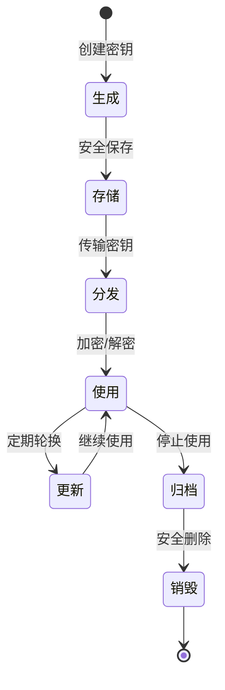

# 密钥管理与存储


## 学习目标

完成本教程后，你将能够：

- 理解密钥管理的核心概念和生命周期
- 掌握密钥生成的安全方法和最佳实践
- 了解不同的密钥存储方案及其安全性
- 能够实现基于软件和硬件的密钥保护
- 掌握密钥派生函数（KDF）的使用
- 了解安全芯片（如ATECC608）的应用
- 能够设计和实现安全的密钥管理系统


## 前置要求

### 知识要求
- 了解嵌入式系统基础知识
- 掌握C语言编程
- 理解对称加密和非对称加密原理
- 了解哈希函数和数字签名
- 熟悉安全启动和固件验证概念

### 环境要求
- 开发板：STM32F4系列或类似MCU
- 开发工具：Keil MDK或STM32CubeIDE
- 调试器：ST-Link或J-Link
- 加密库：mbedTLS或wolfSSL
- 可选：ATECC608安全芯片模块


## 准备工作

### 1. 硬件准备

**基础开发板清单**：
- STM32F407开发板 × 1
- USB数据线 × 1
- ST-Link调试器 × 1

**可选安全芯片模块**：
- ATECC608A安全芯片模块 × 1
- I2C连接线

**硬件连接**：
```
ST-Link    →    STM32F407
SWDIO      →    SWDIO
SWCLK      →    SWCLK
GND        →    GND
3.3V       →    3.3V

ATECC608   →    STM32F407 (可选)
SDA        →    PB7 (I2C1_SDA)
SCL        →    PB6 (I2C1_SCL)
VCC        →    3.3V
GND        →    GND
```

### 2. 软件准备

**安装开发环境**：
1. 下载并安装STM32CubeIDE
2. 安装ST-Link驱动程序
3. 下载mbedTLS加密库

**创建工程**：
```bash
# 创建工程目录
mkdir key-management-demo
cd key-management-demo

# 下载mbedTLS
git clone https://github.com/ARMmbed/mbedtls.git
cd mbedtls
git checkout mbedtls-2.28

# 配置mbedTLS（启用需要的功能）
cp configs/config-mini-tls1_2.h include/mbedtls/config.h
```

### 3. 理解密钥类型

在开始之前，了解不同类型的密钥：

**对称密钥**：
- AES密钥（128/192/256位）
- 用于数据加密和解密
- 速度快，适合大量数据

**非对称密钥**：
- RSA密钥对（2048/3072/4096位）
- ECC密钥对（P-256/P-384/P-521）
- 用于数字签名和密钥交换
- 安全性高，但速度较慢

**派生密钥**：
- 从主密钥派生的子密钥
- 用于不同的加密目的
- 便于密钥管理和更新


## 步骤说明

### 步骤1: 理解密钥生命周期

密钥管理涵盖密钥从生成到销毁的整个生命周期。

#### 1.1 密钥生命周期阶段



**各阶段说明**：

1. **生成（Generation）**
   - 使用安全的随机数生成器
   - 确保密钥强度足够
   - 记录密钥元数据

2. **存储（Storage）**
   - 选择合适的存储位置
   - 实施访问控制
   - 加密保护密钥

3. **分发（Distribution）**
   - 安全传输密钥
   - 验证接收方身份
   - 使用密钥封装机制

4. **使用（Usage）**
   - 限制密钥用途
   - 记录使用日志
   - 监控异常使用

5. **更新（Update/Rotation）**
   - 定期更换密钥
   - 保持服务连续性
   - 管理新旧密钥过渡

6. **归档（Archive）**
   - 保留历史密钥
   - 用于解密旧数据
   - 限制访问权限

7. **销毁（Destruction）**
   - 安全擦除密钥
   - 防止数据恢复
   - 记录销毁日志

#### 1.2 密钥管理策略

定义密钥管理的数据结构：

```c
#include <stdint.h>
#include <time.h>

// 密钥类型
typedef enum {
    KEY_TYPE_AES_128 = 0,      // AES-128对称密钥
    KEY_TYPE_AES_256 = 1,      // AES-256对称密钥
    KEY_TYPE_RSA_2048 = 2,     // RSA-2048非对称密钥
    KEY_TYPE_ECC_P256 = 3,     // ECC P-256非对称密钥
    KEY_TYPE_HMAC = 4          // HMAC密钥
} key_type_t;

// 密钥状态
typedef enum {
    KEY_STATE_ACTIVE = 0,      // 活跃状态
    KEY_STATE_SUSPENDED = 1,   // 暂停使用
    KEY_STATE_ARCHIVED = 2,    // 已归档
    KEY_STATE_DESTROYED = 3    // 已销毁
} key_state_t;

// 密钥用途
typedef enum {
    KEY_USAGE_ENCRYPT = 0x01,  // 加密
    KEY_USAGE_DECRYPT = 0x02,  // 解密
    KEY_USAGE_SIGN = 0x04,     // 签名
    KEY_USAGE_VERIFY = 0x08,   // 验证
    KEY_USAGE_DERIVE = 0x10    // 派生
} key_usage_t;

// 密钥元数据
typedef struct {
    uint32_t key_id;           // 密钥ID
    key_type_t type;           // 密钥类型
    key_state_t state;         // 密钥状态
    uint8_t usage;             // 密钥用途（位掩码）
    uint32_t created_at;       // 创建时间戳
    uint32_t expires_at;       // 过期时间戳
    uint32_t last_used;        // 最后使用时间
    uint32_t use_count;        // 使用次数
    uint8_t owner_id[16];      // 所有者ID
} key_metadata_t;

// 密钥存储结构
typedef struct {
    key_metadata_t metadata;   // 元数据
    uint8_t *key_data;         // 密钥数据（加密存储）
    uint32_t key_len;          // 密钥长度
    uint8_t checksum[32];      // 完整性校验
} key_storage_t;
```

**代码说明**：
- 定义了密钥的类型、状态和用途
- 元数据包含密钥的完整生命周期信息
- 支持密钥的访问控制和审计


### 步骤2: 实现安全的密钥生成

密钥生成是密钥管理的第一步，必须确保生成的密钥具有足够的随机性和强度。

#### 2.1 真随机数生成器（TRNG）

STM32F4系列MCU内置硬件随机数生成器：

```c
#include "stm32f4xx_hal.h"

// 全局RNG句柄
RNG_HandleTypeDef hrng;

/**
 * @brief 初始化硬件随机数生成器
 * @return 0: 成功, -1: 失败
 */
int init_hardware_rng(void) {
    // 使能RNG时钟
    __HAL_RCC_RNG_CLK_ENABLE();
    
    // 配置RNG
    hrng.Instance = RNG;
    
    if (HAL_RNG_Init(&hrng) != HAL_OK) {
        printf("Failed to initialize RNG\n");
        return -1;
    }
    
    printf("Hardware RNG initialized\n");
    return 0;
}

/**
 * @brief 生成随机数
 * @param buffer 输出缓冲区
 * @param length 需要的字节数
 * @return 0: 成功, -1: 失败
 */
int generate_random_bytes(uint8_t *buffer, uint32_t length) {
    if (buffer == NULL || length == 0) {
        return -1;
    }
    
    // 每次生成4字节
    for (uint32_t i = 0; i < length; i += 4) {
        uint32_t random_value;
        
        // 生成随机数
        if (HAL_RNG_GenerateRandomNumber(&hrng, &random_value) != HAL_OK) {
            printf("Failed to generate random number\n");
            return -1;
        }
        
        // 复制到缓冲区
        uint32_t copy_len = (length - i) < 4 ? (length - i) : 4;
        memcpy(&buffer[i], &random_value, copy_len);
    }
    
    return 0;
}
```

#### 2.2 生成AES密钥

```c
#include "mbedtls/aes.h"

/**
 * @brief 生成AES密钥
 * @param key_bits 密钥位数（128, 192, 256）
 * @param key_out 输出的密钥
 * @return 0: 成功, -1: 失败
 */
int generate_aes_key(uint32_t key_bits, uint8_t *key_out) {
    if (key_out == NULL) {
        return -1;
    }
    
    // 检查密钥位数
    if (key_bits != 128 && key_bits != 192 && key_bits != 256) {
        printf("Invalid AES key size: %d\n", key_bits);
        return -1;
    }
    
    uint32_t key_bytes = key_bits / 8;
    
    // 使用硬件RNG生成密钥
    if (generate_random_bytes(key_out, key_bytes) != 0) {
        printf("Failed to generate random key\n");
        return -1;
    }
    
    printf("Generated AES-%d key:\n", key_bits);
    for (uint32_t i = 0; i < key_bytes; i++) {
        printf("%02x", key_out[i]);
        if ((i + 1) % 16 == 0) printf("\n");
    }
    printf("\n");
    
    return 0;
}
```

#### 2.3 生成RSA密钥对

```c
#include "mbedtls/rsa.h"
#include "mbedtls/entropy.h"
#include "mbedtls/ctr_drbg.h"

/**
 * @brief 生成RSA密钥对
 * @param key_bits 密钥位数（2048, 3072, 4096）
 * @param rsa_ctx RSA上下文（输出）
 * @return 0: 成功, 负数: 失败
 */
int generate_rsa_keypair(uint32_t key_bits, mbedtls_rsa_context *rsa_ctx) {
    mbedtls_entropy_context entropy;
    mbedtls_ctr_drbg_context ctr_drbg;
    const char *pers = "rsa_keygen";
    int ret;
    
    // 初始化
    mbedtls_entropy_init(&entropy);
    mbedtls_ctr_drbg_init(&ctr_drbg);
    mbedtls_rsa_init(rsa_ctx, MBEDTLS_RSA_PKCS_V15, 0);
    
    // 种子随机数生成器
    ret = mbedtls_ctr_drbg_seed(&ctr_drbg, mbedtls_entropy_func, &entropy,
                                (const unsigned char *)pers, strlen(pers));
    if (ret != 0) {
        printf("Failed to seed RNG: -0x%04x\n", -ret);
        goto cleanup;
    }
    
    // 生成RSA密钥对
    printf("Generating RSA-%d keypair (this may take a while)...\n", key_bits);
    ret = mbedtls_rsa_gen_key(rsa_ctx, mbedtls_ctr_drbg_random, &ctr_drbg,
                              key_bits, 65537);  // 使用标准公钥指数65537
    
    if (ret != 0) {
        printf("Failed to generate RSA keypair: -0x%04x\n", -ret);
        goto cleanup;
    }
    
    printf("RSA keypair generated successfully\n");
    
    // 验证密钥对
    ret = mbedtls_rsa_check_pubkey(&rsa_ctx->N, &rsa_ctx->E);
    if (ret != 0) {
        printf("Public key check failed: -0x%04x\n", -ret);
        goto cleanup;
    }
    
    ret = mbedtls_rsa_check_privkey(rsa_ctx);
    if (ret != 0) {
        printf("Private key check failed: -0x%04x\n", -ret);
        goto cleanup;
    }
    
    printf("Keypair validation passed\n");
    ret = 0;

cleanup:
    mbedtls_ctr_drbg_free(&ctr_drbg);
    mbedtls_entropy_free(&entropy);
    
    return ret;
}
```

#### 2.4 生成ECC密钥对

```c
#include "mbedtls/ecdsa.h"
#include "mbedtls/ecp.h"

/**
 * @brief 生成ECC密钥对
 * @param curve_id 曲线ID（如MBEDTLS_ECP_DP_SECP256R1）
 * @param ecp_ctx ECC上下文（输出）
 * @return 0: 成功, 负数: 失败
 */
int generate_ecc_keypair(mbedtls_ecp_group_id curve_id, 
                        mbedtls_ecp_keypair *ecp_ctx) {
    mbedtls_entropy_context entropy;
    mbedtls_ctr_drbg_context ctr_drbg;
    const char *pers = "ecc_keygen";
    int ret;
    
    // 初始化
    mbedtls_entropy_init(&entropy);
    mbedtls_ctr_drbg_init(&ctr_drbg);
    mbedtls_ecp_keypair_init(ecp_ctx);
    
    // 种子随机数生成器
    ret = mbedtls_ctr_drbg_seed(&ctr_drbg, mbedtls_entropy_func, &entropy,
                                (const unsigned char *)pers, strlen(pers));
    if (ret != 0) {
        printf("Failed to seed RNG: -0x%04x\n", -ret);
        goto cleanup;
    }
    
    // 生成ECC密钥对
    printf("Generating ECC keypair on curve %d...\n", curve_id);
    ret = mbedtls_ecp_gen_key(curve_id, ecp_ctx,
                              mbedtls_ctr_drbg_random, &ctr_drbg);
    
    if (ret != 0) {
        printf("Failed to generate ECC keypair: -0x%04x\n", -ret);
        goto cleanup;
    }
    
    printf("ECC keypair generated successfully\n");
    
    // 验证密钥对
    ret = mbedtls_ecp_check_pubkey(&ecp_ctx->grp, &ecp_ctx->Q);
    if (ret != 0) {
        printf("Public key check failed: -0x%04x\n", -ret);
        goto cleanup;
    }
    
    ret = mbedtls_ecp_check_privkey(&ecp_ctx->grp, &ecp_ctx->d);
    if (ret != 0) {
        printf("Private key check failed: -0x%04x\n", -ret);
        goto cleanup;
    }
    
    printf("Keypair validation passed\n");
    ret = 0;

cleanup:
    mbedtls_ctr_drbg_free(&ctr_drbg);
    mbedtls_entropy_free(&entropy);
    
    return ret;
}
```

**代码说明**：
- 使用硬件RNG确保密钥的随机性
- 支持生成AES、RSA和ECC密钥
- 生成后验证密钥的有效性
- RSA密钥生成较慢，需要耐心等待


### 步骤3: 实现密钥的安全存储

密钥存储是密钥管理中最关键的环节，必须确保密钥不被未授权访问。

#### 3.1 Flash存储方案

使用MCU内部Flash存储密钥：

```c
#include "stm32f4xx_hal.h"

// 密钥存储区域（使用Flash的最后一个扇区）
#define KEY_STORAGE_SECTOR      FLASH_SECTOR_11
#define KEY_STORAGE_ADDR        0x080E0000
#define KEY_STORAGE_SIZE        (128 * 1024)  // 128KB

// 密钥存储头部
typedef struct {
    uint32_t magic;            // 魔数: 0x4B455953 ("KEYS")
    uint32_t version;          // 版本号
    uint32_t key_count;        // 密钥数量
    uint32_t reserved;         // 保留
} key_storage_header_t;

/**
 * @brief 初始化密钥存储区域
 * @return 0: 成功, -1: 失败
 */
int init_key_storage(void) {
    key_storage_header_t *header = (key_storage_header_t*)KEY_STORAGE_ADDR;
    
    // 检查是否已初始化
    if (header->magic == 0x4B455953) {
        printf("Key storage already initialized\n");
        printf("  Version: %d\n", header->version);
        printf("  Key count: %d\n", header->key_count);
        return 0;
    }
    
    // 初始化存储区域
    printf("Initializing key storage...\n");
    
    // 解锁Flash
    HAL_FLASH_Unlock();
    
    // 擦除扇区
    FLASH_EraseInitTypeDef erase_init;
    erase_init.TypeErase = FLASH_TYPEERASE_SECTORS;
    erase_init.Sector = KEY_STORAGE_SECTOR;
    erase_init.NbSectors = 1;
    erase_init.VoltageRange = FLASH_VOLTAGE_RANGE_3;
    
    uint32_t sector_error;
    HAL_StatusTypeDef status = HAL_FLASHEx_Erase(&erase_init, &sector_error);
    if (status != HAL_OK) {
        printf("Failed to erase key storage sector\n");
        HAL_FLASH_Lock();
        return -1;
    }
    
    // 写入头部
    key_storage_header_t init_header = {
        .magic = 0x4B455953,
        .version = 1,
        .key_count = 0,
        .reserved = 0
    };
    
    uint32_t *src = (uint32_t*)&init_header;
    uint32_t addr = KEY_STORAGE_ADDR;
    
    for (uint32_t i = 0; i < sizeof(key_storage_header_t) / 4; i++) {
        status = HAL_FLASH_Program(FLASH_TYPEPROGRAM_WORD, addr, src[i]);
        if (status != HAL_OK) {
            printf("Failed to write key storage header\n");
            HAL_FLASH_Lock();
            return -2;
        }
        addr += 4;
    }
    
    // 锁定Flash
    HAL_FLASH_Lock();
    
    printf("Key storage initialized successfully\n");
    return 0;
}

/**
 * @brief 存储密钥到Flash
 * @param key_id 密钥ID
 * @param key_data 密钥数据
 * @param key_len 密钥长度
 * @param metadata 密钥元数据
 * @return 0: 成功, 负数: 失败
 */
int store_key_to_flash(uint32_t key_id, const uint8_t *key_data, 
                      uint32_t key_len, const key_metadata_t *metadata) {
    if (key_data == NULL || metadata == NULL || key_len == 0) {
        return -1;
    }
    
    // 读取头部
    key_storage_header_t *header = (key_storage_header_t*)KEY_STORAGE_ADDR;
    
    if (header->magic != 0x4B455953) {
        printf("Key storage not initialized\n");
        return -2;
    }
    
    // 计算存储位置
    uint32_t offset = sizeof(key_storage_header_t);
    offset += header->key_count * (sizeof(key_storage_t) + 256);  // 假设最大密钥256字节
    
    if (offset + sizeof(key_storage_t) + key_len > KEY_STORAGE_SIZE) {
        printf("Key storage full\n");
        return -3;
    }
    
    // 准备存储结构
    key_storage_t storage;
    memcpy(&storage.metadata, metadata, sizeof(key_metadata_t));
    storage.key_len = key_len;
    
    // 计算校验和
    mbedtls_sha256_context sha256_ctx;
    mbedtls_sha256_init(&sha256_ctx);
    mbedtls_sha256_starts(&sha256_ctx, 0);
    mbedtls_sha256_update(&sha256_ctx, key_data, key_len);
    mbedtls_sha256_finish(&sha256_ctx, storage.checksum);
    mbedtls_sha256_free(&sha256_ctx);
    
    // 解锁Flash
    HAL_FLASH_Unlock();
    
    // 写入元数据
    uint32_t addr = KEY_STORAGE_ADDR + offset;
    uint32_t *src = (uint32_t*)&storage;
    
    for (uint32_t i = 0; i < sizeof(key_storage_t) / 4; i++) {
        HAL_FLASH_Program(FLASH_TYPEPROGRAM_WORD, addr, src[i]);
        addr += 4;
    }
    
    // 写入密钥数据（需要加密保护，见步骤4）
    src = (uint32_t*)key_data;
    for (uint32_t i = 0; i < (key_len + 3) / 4; i++) {
        HAL_FLASH_Program(FLASH_TYPEPROGRAM_WORD, addr, src[i]);
        addr += 4;
    }
    
    // 更新密钥计数
    header->key_count++;
    
    // 锁定Flash
    HAL_FLASH_Lock();
    
    printf("Key %d stored successfully\n", key_id);
    return 0;
}

/**
 * @brief 从Flash读取密钥
 * @param key_id 密钥ID
 * @param key_data 输出的密钥数据
 * @param key_len 密钥长度（输入/输出）
 * @param metadata 输出的元数据
 * @return 0: 成功, 负数: 失败
 */
int load_key_from_flash(uint32_t key_id, uint8_t *key_data, 
                       uint32_t *key_len, key_metadata_t *metadata) {
    if (key_data == NULL || key_len == NULL || metadata == NULL) {
        return -1;
    }
    
    // 读取头部
    key_storage_header_t *header = (key_storage_header_t*)KEY_STORAGE_ADDR;
    
    if (header->magic != 0x4B455953) {
        printf("Key storage not initialized\n");
        return -2;
    }
    
    // 遍历查找密钥
    uint32_t offset = sizeof(key_storage_header_t);
    
    for (uint32_t i = 0; i < header->key_count; i++) {
        key_storage_t *storage = (key_storage_t*)(KEY_STORAGE_ADDR + offset);
        
        if (storage->metadata.key_id == key_id) {
            // 找到密钥
            if (*key_len < storage->key_len) {
                printf("Buffer too small\n");
                return -3;
            }
            
            // 复制元数据
            memcpy(metadata, &storage->metadata, sizeof(key_metadata_t));
            
            // 复制密钥数据
            uint8_t *stored_key = (uint8_t*)(KEY_STORAGE_ADDR + offset + sizeof(key_storage_t));
            memcpy(key_data, stored_key, storage->key_len);
            *key_len = storage->key_len;
            
            // 验证校验和
            uint8_t calculated_checksum[32];
            mbedtls_sha256_context sha256_ctx;
            mbedtls_sha256_init(&sha256_ctx);
            mbedtls_sha256_starts(&sha256_ctx, 0);
            mbedtls_sha256_update(&sha256_ctx, key_data, storage->key_len);
            mbedtls_sha256_finish(&sha256_ctx, calculated_checksum);
            mbedtls_sha256_free(&sha256_ctx);
            
            if (memcmp(calculated_checksum, storage->checksum, 32) != 0) {
                printf("Key checksum mismatch\n");
                return -4;
            }
            
            printf("Key %d loaded successfully\n", key_id);
            return 0;
        }
        
        // 移动到下一个密钥
        offset += sizeof(key_storage_t) + storage->key_len;
    }
    
    printf("Key %d not found\n", key_id);
    return -5;
}
```

**代码说明**：
- 使用Flash的专用扇区存储密钥
- 包含完整性校验（SHA-256）
- 支持多个密钥的存储和检索
- 注意：实际应用中密钥数据应加密存储（见步骤4）


#### 3.2 使用密钥加密密钥（KEK）

为了保护存储的密钥，使用密钥加密密钥（Key Encryption Key）：

```c
#include "mbedtls/aes.h"
#include "mbedtls/gcm.h"

// 主密钥（KEK）- 实际应用中应从安全芯片或OTP获取
static uint8_t master_kek[32] = {
    // 这里仅作示例，实际应用中绝不能硬编码
    0x00, 0x01, 0x02, 0x03, 0x04, 0x05, 0x06, 0x07,
    0x08, 0x09, 0x0A, 0x0B, 0x0C, 0x0D, 0x0E, 0x0F,
    0x10, 0x11, 0x12, 0x13, 0x14, 0x15, 0x16, 0x17,
    0x18, 0x19, 0x1A, 0x1B, 0x1C, 0x1D, 0x1E, 0x1F
};

/**
 * @brief 使用KEK加密密钥
 * @param plaintext_key 明文密钥
 * @param key_len 密钥长度
 * @param encrypted_key 输出的加密密钥
 * @param encrypted_len 加密后的长度（输出）
 * @return 0: 成功, 负数: 失败
 */
int encrypt_key_with_kek(const uint8_t *plaintext_key, uint32_t key_len,
                        uint8_t *encrypted_key, uint32_t *encrypted_len) {
    mbedtls_gcm_context gcm;
    uint8_t iv[12];  // GCM推荐使用12字节IV
    uint8_t tag[16]; // 认证标签
    int ret;
    
    // 生成随机IV
    if (generate_random_bytes(iv, sizeof(iv)) != 0) {
        return -1;
    }
    
    // 初始化GCM
    mbedtls_gcm_init(&gcm);
    ret = mbedtls_gcm_setkey(&gcm, MBEDTLS_CIPHER_ID_AES, 
                            master_kek, 256);
    if (ret != 0) {
        printf("Failed to set GCM key: -0x%04x\n", -ret);
        mbedtls_gcm_free(&gcm);
        return -2;
    }
    
    // 加密密钥
    ret = mbedtls_gcm_crypt_and_tag(&gcm, MBEDTLS_GCM_ENCRYPT,
                                   key_len, iv, sizeof(iv),
                                   NULL, 0,  // 无额外认证数据
                                   plaintext_key, encrypted_key + sizeof(iv),
                                   sizeof(tag), tag);
    
    if (ret != 0) {
        printf("Failed to encrypt key: -0x%04x\n", -ret);
        mbedtls_gcm_free(&gcm);
        return -3;
    }
    
    // 组装输出：IV + 密文 + Tag
    memcpy(encrypted_key, iv, sizeof(iv));
    memcpy(encrypted_key + sizeof(iv) + key_len, tag, sizeof(tag));
    
    *encrypted_len = sizeof(iv) + key_len + sizeof(tag);
    
    mbedtls_gcm_free(&gcm);
    
    printf("Key encrypted with KEK\n");
    return 0;
}

/**
 * @brief 使用KEK解密密钥
 * @param encrypted_key 加密的密钥
 * @param encrypted_len 加密数据长度
 * @param plaintext_key 输出的明文密钥
 * @param key_len 密钥长度（输出）
 * @return 0: 成功, 负数: 失败
 */
int decrypt_key_with_kek(const uint8_t *encrypted_key, uint32_t encrypted_len,
                        uint8_t *plaintext_key, uint32_t *key_len) {
    mbedtls_gcm_context gcm;
    uint8_t iv[12];
    uint8_t tag[16];
    int ret;
    
    // 解析IV和Tag
    memcpy(iv, encrypted_key, sizeof(iv));
    uint32_t ciphertext_len = encrypted_len - sizeof(iv) - sizeof(tag);
    memcpy(tag, encrypted_key + sizeof(iv) + ciphertext_len, sizeof(tag));
    
    // 初始化GCM
    mbedtls_gcm_init(&gcm);
    ret = mbedtls_gcm_setkey(&gcm, MBEDTLS_CIPHER_ID_AES,
                            master_kek, 256);
    if (ret != 0) {
        printf("Failed to set GCM key: -0x%04x\n", -ret);
        mbedtls_gcm_free(&gcm);
        return -2;
    }
    
    // 解密并验证
    ret = mbedtls_gcm_auth_decrypt(&gcm, ciphertext_len,
                                  iv, sizeof(iv),
                                  NULL, 0,  // 无额外认证数据
                                  tag, sizeof(tag),
                                  encrypted_key + sizeof(iv), plaintext_key);
    
    if (ret != 0) {
        printf("Failed to decrypt key: -0x%04x\n", -ret);
        mbedtls_gcm_free(&gcm);
        return -3;
    }
    
    *key_len = ciphertext_len;
    
    mbedtls_gcm_free(&gcm);
    
    printf("Key decrypted with KEK\n");
    return 0;
}
```

**代码说明**：
- 使用AES-GCM模式加密密钥
- GCM提供加密和认证功能
- IV（初始化向量）每次加密都应不同
- 认证标签确保密钥未被篡改


### 步骤4: 实现密钥派生函数（KDF）

密钥派生函数用于从主密钥派生出多个子密钥，便于密钥管理。

#### 4.1 基于HKDF的密钥派生

HKDF（HMAC-based Key Derivation Function）是推荐的密钥派生方法：

```c
#include "mbedtls/hkdf.h"
#include "mbedtls/md.h"

/**
 * @brief 使用HKDF派生密钥
 * @param master_key 主密钥
 * @param master_key_len 主密钥长度
 * @param salt 盐值（可选）
 * @param salt_len 盐值长度
 * @param info 上下文信息
 * @param info_len 信息长度
 * @param derived_key 输出的派生密钥
 * @param derived_key_len 派生密钥长度
 * @return 0: 成功, 负数: 失败
 */
int derive_key_hkdf(const uint8_t *master_key, uint32_t master_key_len,
                   const uint8_t *salt, uint32_t salt_len,
                   const uint8_t *info, uint32_t info_len,
                   uint8_t *derived_key, uint32_t derived_key_len) {
    const mbedtls_md_info_t *md_info;
    int ret;
    
    // 使用SHA-256作为哈希函数
    md_info = mbedtls_md_info_from_type(MBEDTLS_MD_SHA256);
    if (md_info == NULL) {
        printf("Failed to get MD info\n");
        return -1;
    }
    
    // 执行HKDF
    ret = mbedtls_hkdf(md_info,
                      salt, salt_len,
                      master_key, master_key_len,
                      info, info_len,
                      derived_key, derived_key_len);
    
    if (ret != 0) {
        printf("HKDF failed: -0x%04x\n", -ret);
        return -2;
    }
    
    printf("Derived %d-byte key using HKDF\n", derived_key_len);
    return 0;
}

/**
 * @brief 派生多个用途的密钥
 * @param master_key 主密钥
 * @param master_key_len 主密钥长度
 * @param keys 输出的密钥结构
 * @return 0: 成功, 负数: 失败
 */
typedef struct {
    uint8_t encryption_key[32];  // 加密密钥
    uint8_t mac_key[32];          // MAC密钥
    uint8_t signing_key[32];      // 签名密钥
} derived_keys_t;

int derive_multiple_keys(const uint8_t *master_key, uint32_t master_key_len,
                        derived_keys_t *keys) {
    if (master_key == NULL || keys == NULL) {
        return -1;
    }
    
    // 派生加密密钥
    const uint8_t enc_info[] = "encryption";
    if (derive_key_hkdf(master_key, master_key_len,
                       NULL, 0,  // 无盐值
                       enc_info, sizeof(enc_info) - 1,
                       keys->encryption_key, 32) != 0) {
        return -2;
    }
    
    // 派生MAC密钥
    const uint8_t mac_info[] = "mac";
    if (derive_key_hkdf(master_key, master_key_len,
                       NULL, 0,
                       mac_info, sizeof(mac_info) - 1,
                       keys->mac_key, 32) != 0) {
        return -3;
    }
    
    // 派生签名密钥
    const uint8_t sign_info[] = "signing";
    if (derive_key_hkdf(master_key, master_key_len,
                       NULL, 0,
                       sign_info, sizeof(sign_info) - 1,
                       keys->signing_key, 32) != 0) {
        return -4;
    }
    
    printf("Derived multiple keys successfully\n");
    return 0;
}
```

#### 4.2 基于PBKDF2的密码派生

PBKDF2用于从用户密码派生密钥：

```c
#include "mbedtls/pkcs5.h"

/**
 * @brief 从密码派生密钥（PBKDF2）
 * @param password 用户密码
 * @param password_len 密码长度
 * @param salt 盐值
 * @param salt_len 盐值长度
 * @param iterations 迭代次数（建议≥10000）
 * @param derived_key 输出的派生密钥
 * @param key_len 密钥长度
 * @return 0: 成功, 负数: 失败
 */
int derive_key_from_password(const char *password, uint32_t password_len,
                             const uint8_t *salt, uint32_t salt_len,
                             uint32_t iterations,
                             uint8_t *derived_key, uint32_t key_len) {
    mbedtls_md_context_t md_ctx;
    const mbedtls_md_info_t *md_info;
    int ret;
    
    // 初始化MD上下文
    mbedtls_md_init(&md_ctx);
    md_info = mbedtls_md_info_from_type(MBEDTLS_MD_SHA256);
    
    ret = mbedtls_md_setup(&md_ctx, md_info, 1);  // 1 = HMAC
    if (ret != 0) {
        printf("Failed to setup MD: -0x%04x\n", -ret);
        mbedtls_md_free(&md_ctx);
        return -1;
    }
    
    // 执行PBKDF2
    printf("Deriving key from password (this may take a while)...\n");
    ret = mbedtls_pkcs5_pbkdf2_hmac(&md_ctx,
                                   (const unsigned char *)password, password_len,
                                   salt, salt_len,
                                   iterations,
                                   key_len, derived_key);
    
    mbedtls_md_free(&md_ctx);
    
    if (ret != 0) {
        printf("PBKDF2 failed: -0x%04x\n", -ret);
        return -2;
    }
    
    printf("Key derived from password successfully\n");
    return 0;
}

/**
 * @brief 示例：使用用户PIN派生加密密钥
 */
void example_pin_based_encryption(void) {
    const char *user_pin = "123456";
    uint8_t salt[16];
    uint8_t derived_key[32];
    
    // 生成随机盐值（应保存以便后续使用）
    generate_random_bytes(salt, sizeof(salt));
    
    // 从PIN派生密钥
    derive_key_from_password(user_pin, strlen(user_pin),
                            salt, sizeof(salt),
                            10000,  // 10000次迭代
                            derived_key, sizeof(derived_key));
    
    // 使用派生的密钥加密数据
    // ...
    
    printf("PIN-based encryption key derived\n");
}
```

**代码说明**：
- HKDF适合从高熵密钥派生子密钥
- PBKDF2适合从低熵密码派生密钥
- 使用不同的info/context可以派生多个独立的密钥
- PBKDF2的迭代次数越多越安全，但计算时间也越长


### 步骤5: 使用安全芯片存储密钥

安全芯片（如ATECC608）提供硬件级的密钥保护。

#### 5.1 ATECC608简介

ATECC608是Microchip的安全认证芯片，特点：
- 硬件保护的密钥存储
- 支持ECC P-256加密
- 支持SHA-256哈希
- 支持HMAC和AES-128
- 防篡改设计
- I2C接口

#### 5.2 初始化ATECC608

```c
#include "atca_basic.h"
#include "atca_cfgs.h"

// ATECC608配置
ATCAIfaceCfg atecc608_i2c_config = {
    .iface_type = ATCA_I2C_IFACE,
    .devtype = ATECC608A,
    .atcai2c.slave_address = 0xC0,
    .atcai2c.bus = 1,
    .atcai2c.baud = 400000,
    .wake_delay = 1500,
    .rx_retries = 20
};

/**
 * @brief 初始化ATECC608
 * @return 0: 成功, 负数: 失败
 */
int init_atecc608(void) {
    ATCA_STATUS status;
    
    // 初始化库
    status = atcab_init(&atecc608_i2c_config);
    if (status != ATCA_SUCCESS) {
        printf("Failed to initialize ATECC608: 0x%02x\n", status);
        return -1;
    }
    
    // 读取序列号
    uint8_t serial_number[9];
    status = atcab_read_serial_number(serial_number);
    if (status != ATCA_SUCCESS) {
        printf("Failed to read serial number: 0x%02x\n", status);
        return -2;
    }
    
    printf("ATECC608 initialized successfully\n");
    printf("Serial number: ");
    for (int i = 0; i < 9; i++) {
        printf("%02X", serial_number[i]);
    }
    printf("\n");
    
    return 0;
}
```

#### 5.3 在ATECC608中生成和存储密钥

```c
/**
 * @brief 在ATECC608中生成ECC密钥对
 * @param slot_id 密钥槽ID（0-15）
 * @param public_key 输出的公钥（64字节）
 * @return 0: 成功, 负数: 失败
 */
int atecc608_generate_keypair(uint16_t slot_id, uint8_t *public_key) {
    ATCA_STATUS status;
    
    if (public_key == NULL || slot_id > 15) {
        return -1;
    }
    
    // 生成密钥对（私钥存储在芯片内部，无法读取）
    printf("Generating ECC keypair in slot %d...\n", slot_id);
    status = atcab_genkey(slot_id, public_key);
    
    if (status != ATCA_SUCCESS) {
        printf("Failed to generate keypair: 0x%02x\n", status);
        return -2;
    }
    
    printf("Keypair generated successfully\n");
    printf("Public key (X): ");
    for (int i = 0; i < 32; i++) {
        printf("%02X", public_key[i]);
    }
    printf("\n");
    printf("Public key (Y): ");
    for (int i = 32; i < 64; i++) {
        printf("%02X", public_key[i]);
    }
    printf("\n");
    
    return 0;
}

/**
 * @brief 使用ATECC608中的私钥进行签名
 * @param slot_id 密钥槽ID
 * @param message 要签名的消息
 * @param message_len 消息长度
 * @param signature 输出的签名（64字节）
 * @return 0: 成功, 负数: 失败
 */
int atecc608_sign_message(uint16_t slot_id, const uint8_t *message,
                         uint32_t message_len, uint8_t *signature) {
    ATCA_STATUS status;
    uint8_t digest[32];
    
    if (message == NULL || signature == NULL) {
        return -1;
    }
    
    // 计算消息的SHA-256哈希
    status = atcab_sha(message_len, message, digest);
    if (status != ATCA_SUCCESS) {
        printf("Failed to calculate hash: 0x%02x\n", status);
        return -2;
    }
    
    // 使用私钥签名
    status = atcab_sign(slot_id, digest, signature);
    if (status != ATCA_SUCCESS) {
        printf("Failed to sign: 0x%02x\n", status);
        return -3;
    }
    
    printf("Message signed successfully\n");
    return 0;
}

/**
 * @brief 验证ATECC608签名
 * @param public_key 公钥（64字节）
 * @param message 原始消息
 * @param message_len 消息长度
 * @param signature 签名（64字节）
 * @return 0: 验证成功, 负数: 验证失败
 */
int atecc608_verify_signature(const uint8_t *public_key, const uint8_t *message,
                              uint32_t message_len, const uint8_t *signature) {
    ATCA_STATUS status;
    uint8_t digest[32];
    bool is_verified = false;
    
    // 计算消息哈希
    status = atcab_sha(message_len, message, digest);
    if (status != ATCA_SUCCESS) {
        printf("Failed to calculate hash: 0x%02x\n", status);
        return -2;
    }
    
    // 验证签名
    status = atcab_verify_extern(digest, signature, public_key, &is_verified);
    if (status != ATCA_SUCCESS) {
        printf("Failed to verify: 0x%02x\n", status);
        return -3;
    }
    
    if (is_verified) {
        printf("Signature verified successfully\n");
        return 0;
    } else {
        printf("Signature verification failed\n");
        return -4;
    }
}
```

#### 5.4 使用ATECC608进行密钥协商

```c
/**
 * @brief 使用ECDH进行密钥协商
 * @param slot_id 本地私钥槽ID
 * @param peer_public_key 对方公钥（64字节）
 * @param shared_secret 输出的共享密钥（32字节）
 * @return 0: 成功, 负数: 失败
 */
int atecc608_ecdh(uint16_t slot_id, const uint8_t *peer_public_key,
                 uint8_t *shared_secret) {
    ATCA_STATUS status;
    
    if (peer_public_key == NULL || shared_secret == NULL) {
        return -1;
    }
    
    // 执行ECDH密钥协商
    status = atcab_ecdh(slot_id, peer_public_key, shared_secret);
    
    if (status != ATCA_SUCCESS) {
        printf("ECDH failed: 0x%02x\n", status);
        return -2;
    }
    
    printf("ECDH completed successfully\n");
    printf("Shared secret: ");
    for (int i = 0; i < 32; i++) {
        printf("%02X", shared_secret[i]);
    }
    printf("\n");
    
    return 0;
}

/**
 * @brief 完整的密钥协商示例
 */
void example_key_exchange(void) {
    uint8_t alice_public_key[64];
    uint8_t bob_public_key[64];
    uint8_t alice_shared_secret[32];
    uint8_t bob_shared_secret[32];
    
    // Alice生成密钥对（槽0）
    printf("=== Alice generates keypair ===\n");
    atecc608_generate_keypair(0, alice_public_key);
    
    // Bob生成密钥对（槽1）
    printf("\n=== Bob generates keypair ===\n");
    atecc608_generate_keypair(1, bob_public_key);
    
    // Alice使用Bob的公钥计算共享密钥
    printf("\n=== Alice computes shared secret ===\n");
    atecc608_ecdh(0, bob_public_key, alice_shared_secret);
    
    // Bob使用Alice的公钥计算共享密钥
    printf("\n=== Bob computes shared secret ===\n");
    atecc608_ecdh(1, alice_public_key, bob_shared_secret);
    
    // 验证共享密钥相同
    if (memcmp(alice_shared_secret, bob_shared_secret, 32) == 0) {
        printf("\n✓ Key exchange successful! Shared secrets match.\n");
    } else {
        printf("\n✗ Key exchange failed! Shared secrets don't match.\n");
    }
}
```

**代码说明**：
- ATECC608的私钥永远不会离开芯片
- 支持ECC P-256的密钥生成、签名和ECDH
- 提供硬件级的密钥保护
- 适合需要高安全性的应用场景


## 验证方法

### 1. 测试密钥生成

创建测试程序验证密钥生成功能：

```c
/**
 * @brief 测试密钥生成
 */
void test_key_generation(void) {
    printf("\n=== Key Generation Test ===\n");
    
    // 1. 测试AES密钥生成
    printf("\n1. Testing AES key generation...\n");
    uint8_t aes_key[32];
    if (generate_aes_key(256, aes_key) == 0) {
        printf("   [PASS] AES-256 key generated\n");
    } else {
        printf("   [FAIL] AES key generation failed\n");
    }
    
    // 2. 测试RSA密钥对生成
    printf("\n2. Testing RSA keypair generation...\n");
    mbedtls_rsa_context rsa;
    if (generate_rsa_keypair(2048, &rsa) == 0) {
        printf("   [PASS] RSA-2048 keypair generated\n");
        mbedtls_rsa_free(&rsa);
    } else {
        printf("   [FAIL] RSA keypair generation failed\n");
    }
    
    // 3. 测试ECC密钥对生成
    printf("\n3. Testing ECC keypair generation...\n");
    mbedtls_ecp_keypair ecp;
    if (generate_ecc_keypair(MBEDTLS_ECP_DP_SECP256R1, &ecp) == 0) {
        printf("   [PASS] ECC P-256 keypair generated\n");
        mbedtls_ecp_keypair_free(&ecp);
    } else {
        printf("   [FAIL] ECC keypair generation failed\n");
    }
    
    printf("\n=== Test Complete ===\n");
}
```

### 2. 测试密钥存储和加载

```c
/**
 * @brief 测试密钥存储
 */
void test_key_storage(void) {
    printf("\n=== Key Storage Test ===\n");
    
    // 1. 初始化存储
    printf("\n1. Initializing key storage...\n");
    if (init_key_storage() == 0) {
        printf("   [PASS] Storage initialized\n");
    } else {
        printf("   [FAIL] Storage initialization failed\n");
        return;
    }
    
    // 2. 生成测试密钥
    printf("\n2. Generating test key...\n");
    uint8_t test_key[32];
    generate_aes_key(256, test_key);
    
    // 3. 准备元数据
    key_metadata_t metadata = {
        .key_id = 1,
        .type = KEY_TYPE_AES_256,
        .state = KEY_STATE_ACTIVE,
        .usage = KEY_USAGE_ENCRYPT | KEY_USAGE_DECRYPT,
        .created_at = time(NULL),
        .expires_at = time(NULL) + 365 * 24 * 3600,  // 1年后过期
        .last_used = 0,
        .use_count = 0
    };
    
    // 4. 存储密钥
    printf("\n3. Storing key...\n");
    if (store_key_to_flash(1, test_key, 32, &metadata) == 0) {
        printf("   [PASS] Key stored\n");
    } else {
        printf("   [FAIL] Key storage failed\n");
        return;
    }
    
    // 5. 加载密钥
    printf("\n4. Loading key...\n");
    uint8_t loaded_key[32];
    uint32_t loaded_len = sizeof(loaded_key);
    key_metadata_t loaded_metadata;
    
    if (load_key_from_flash(1, loaded_key, &loaded_len, &loaded_metadata) == 0) {
        printf("   [PASS] Key loaded\n");
        
        // 6. 验证密钥
        if (memcmp(test_key, loaded_key, 32) == 0) {
            printf("   [PASS] Key matches\n");
        } else {
            printf("   [FAIL] Key mismatch\n");
        }
    } else {
        printf("   [FAIL] Key loading failed\n");
    }
    
    printf("\n=== Test Complete ===\n");
}
```

### 3. 测试密钥派生

```c
/**
 * @brief 测试密钥派生
 */
void test_key_derivation(void) {
    printf("\n=== Key Derivation Test ===\n");
    
    // 1. 生成主密钥
    printf("\n1. Generating master key...\n");
    uint8_t master_key[32];
    generate_random_bytes(master_key, sizeof(master_key));
    
    // 2. 测试HKDF
    printf("\n2. Testing HKDF...\n");
    derived_keys_t keys;
    if (derive_multiple_keys(master_key, sizeof(master_key), &keys) == 0) {
        printf("   [PASS] HKDF derivation successful\n");
        
        // 验证派生的密钥不同
        if (memcmp(keys.encryption_key, keys.mac_key, 32) != 0 &&
            memcmp(keys.encryption_key, keys.signing_key, 32) != 0 &&
            memcmp(keys.mac_key, keys.signing_key, 32) != 0) {
            printf("   [PASS] Derived keys are different\n");
        } else {
            printf("   [FAIL] Derived keys are not unique\n");
        }
    } else {
        printf("   [FAIL] HKDF derivation failed\n");
    }
    
    // 3. 测试PBKDF2
    printf("\n3. Testing PBKDF2...\n");
    const char *password = "test_password_123";
    uint8_t salt[16];
    uint8_t derived_key[32];
    
    generate_random_bytes(salt, sizeof(salt));
    
    if (derive_key_from_password(password, strlen(password),
                                 salt, sizeof(salt),
                                 10000, derived_key, sizeof(derived_key)) == 0) {
        printf("   [PASS] PBKDF2 derivation successful\n");
    } else {
        printf("   [FAIL] PBKDF2 derivation failed\n");
    }
    
    printf("\n=== Test Complete ===\n");
}
```

### 4. 测试安全芯片（如果有ATECC608）

```c
/**
 * @brief 测试ATECC608
 */
void test_atecc608(void) {
    printf("\n=== ATECC608 Test ===\n");
    
    // 1. 初始化
    printf("\n1. Initializing ATECC608...\n");
    if (init_atecc608() == 0) {
        printf("   [PASS] ATECC608 initialized\n");
    } else {
        printf("   [FAIL] ATECC608 initialization failed\n");
        return;
    }
    
    // 2. 生成密钥对
    printf("\n2. Generating keypair...\n");
    uint8_t public_key[64];
    if (atecc608_generate_keypair(0, public_key) == 0) {
        printf("   [PASS] Keypair generated\n");
    } else {
        printf("   [FAIL] Keypair generation failed\n");
        return;
    }
    
    // 3. 测试签名和验证
    printf("\n3. Testing sign and verify...\n");
    const uint8_t test_message[] = "Hello, ATECC608!";
    uint8_t signature[64];
    
    if (atecc608_sign_message(0, test_message, sizeof(test_message) - 1, signature) == 0) {
        printf("   [PASS] Message signed\n");
        
        if (atecc608_verify_signature(public_key, test_message, 
                                      sizeof(test_message) - 1, signature) == 0) {
            printf("   [PASS] Signature verified\n");
        } else {
            printf("   [FAIL] Signature verification failed\n");
        }
    } else {
        printf("   [FAIL] Signing failed\n");
    }
    
    printf("\n=== Test Complete ===\n");
}
```

### 5. 预期输出

正常运行时的输出：

```
=== Key Generation Test ===

1. Testing AES key generation...
Generated AES-256 key:
a1b2c3d4e5f6...
   [PASS] AES-256 key generated

2. Testing RSA keypair generation...
Generating RSA-2048 keypair (this may take a while)...
RSA keypair generated successfully
Keypair validation passed
   [PASS] RSA-2048 keypair generated

3. Testing ECC keypair generation...
Generating ECC keypair on curve 19...
ECC keypair generated successfully
Keypair validation passed
   [PASS] ECC P-256 keypair generated

=== Test Complete ===

=== Key Storage Test ===

1. Initializing key storage...
Key storage initialized successfully
   [PASS] Storage initialized

2. Generating test key...
Generated AES-256 key:
...

3. Storing key...
Key 1 stored successfully
   [PASS] Key stored

4. Loading key...
Key 1 loaded successfully
   [PASS] Key loaded
   [PASS] Key matches

=== Test Complete ===
```


## 故障排除

### 问题1: 硬件RNG初始化失败

**现象**：
```
Failed to initialize RNG
```

**可能原因**：
1. RNG时钟未使能
2. 硬件故障
3. 配置错误

**解决方法**：
```c
// 1. 确保RNG时钟已使能
__HAL_RCC_RNG_CLK_ENABLE();

// 2. 检查RNG状态
if (__HAL_RNG_GET_FLAG(&hrng, RNG_FLAG_DRDY)) {
    printf("RNG ready\n");
} else {
    printf("RNG not ready\n");
}

// 3. 重置RNG
__HAL_RNG_FORCE_RESET();
__HAL_RNG_RELEASE_RESET();

// 4. 重新初始化
HAL_RNG_Init(&hrng);
```

### 问题2: Flash写入失败

**现象**：
```
Failed to write key storage header
HAL_FLASH_Program returned error
```

**可能原因**：
1. Flash未解锁
2. 扇区未擦除
3. 写保护未关闭
4. 地址不对齐

**解决方法**：
```c
// 1. 确保Flash已解锁
HAL_FLASH_Unlock();

// 2. 检查写保护状态
FLASH_OBProgramInitTypeDef ob_config;
HAL_FLASHEx_OBGetConfig(&ob_config);
printf("Write protection: 0x%08X\n", ob_config.WRPSector);

// 如果有写保护，需要先解除
if (ob_config.WRPSector != 0xFFFFFFFF) {
    ob_config.OptionType = OPTIONBYTE_WRP;
    ob_config.WRPState = OB_WRPSTATE_DISABLE;
    ob_config.WRPSector = OB_WRP_SECTOR_All;
    HAL_FLASHEx_OBProgram(&ob_config);
    HAL_FLASH_OB_Launch();
}

// 3. 确保地址4字节对齐
if ((addr & 0x03) != 0) {
    printf("Address not aligned: 0x%08X\n", addr);
    addr = (addr + 3) & ~0x03;  // 对齐到4字节
}

// 4. 确保扇区已擦除
uint32_t *check_addr = (uint32_t*)KEY_STORAGE_ADDR;
for (int i = 0; i < 256; i++) {
    if (check_addr[i] != 0xFFFFFFFF) {
        printf("Sector not erased at offset %d\n", i * 4);
        // 重新擦除
        break;
    }
}
```

### 问题3: 密钥解密失败

**现象**：
```
Failed to decrypt key: -0x4380
```

**可能原因**：
1. KEK不正确
2. 密文被篡改
3. IV或Tag损坏
4. 加密算法不匹配

**解决方法**：
```c
// 1. 验证KEK
printf("KEK hash: ");
uint8_t kek_hash[32];
mbedtls_sha256(master_kek, sizeof(master_kek), kek_hash, 0);
for (int i = 0; i < 32; i++) {
    printf("%02x", kek_hash[i]);
}
printf("\n");

// 2. 验证密文完整性
printf("Encrypted data length: %d\n", encrypted_len);
printf("Expected: IV(12) + Ciphertext + Tag(16)\n");

// 3. 检查IV和Tag
printf("IV: ");
for (int i = 0; i < 12; i++) {
    printf("%02x", encrypted_key[i]);
}
printf("\n");

printf("Tag: ");
for (int i = encrypted_len - 16; i < encrypted_len; i++) {
    printf("%02x", encrypted_key[i]);
}
printf("\n");

// 4. 尝试使用正确的KEK重新加密测试
uint8_t test_plaintext[] = "test";
uint8_t test_encrypted[128];
uint32_t test_encrypted_len;

encrypt_key_with_kek(test_plaintext, sizeof(test_plaintext),
                    test_encrypted, &test_encrypted_len);

uint8_t test_decrypted[128];
uint32_t test_decrypted_len;

if (decrypt_key_with_kek(test_encrypted, test_encrypted_len,
                        test_decrypted, &test_decrypted_len) == 0) {
    printf("KEK is working correctly\n");
} else {
    printf("KEK test failed\n");
}
```

### 问题4: ATECC608通信失败

**现象**：
```
Failed to initialize ATECC608: 0xF0
```

**可能原因**：
1. I2C连接问题
2. 地址配置错误
3. 电源问题
4. 芯片未唤醒

**解决方法**：
```c
// 1. 检查I2C连接
printf("Scanning I2C bus...\n");
for (uint8_t addr = 0; addr < 128; addr++) {
    if (HAL_I2C_IsDeviceReady(&hi2c1, addr << 1, 3, 100) == HAL_OK) {
        printf("Device found at address 0x%02X\n", addr);
    }
}

// 2. 尝试不同的I2C地址
uint8_t test_addresses[] = {0xC0, 0xC2, 0xC4, 0xC6};
for (int i = 0; i < 4; i++) {
    atecc608_i2c_config.atcai2c.slave_address = test_addresses[i];
    printf("Trying address 0x%02X...\n", test_addresses[i]);
    
    if (atcab_init(&atecc608_i2c_config) == ATCA_SUCCESS) {
        printf("Success with address 0x%02X\n", test_addresses[i]);
        break;
    }
}

// 3. 检查电源
printf("Check ATECC608 power supply:\n");
printf("  VCC should be 3.3V\n");
printf("  GND should be connected\n");

// 4. 手动唤醒芯片
atcab_wakeup();
HAL_Delay(2);  // 等待芯片唤醒
```

### 问题5: 密钥派生结果不一致

**现象**：
- 相同输入得到不同的派生密钥
- 派生密钥无法解密数据

**可能原因**：
1. 盐值不一致
2. 迭代次数不同
3. 哈希算法不匹配
4. 输入编码问题

**解决方法**：
```c
// 1. 确保盐值一致
printf("Salt used: ");
for (int i = 0; i < salt_len; i++) {
    printf("%02x", salt[i]);
}
printf("\n");

// 2. 确保参数一致
printf("PBKDF2 parameters:\n");
printf("  Password length: %d\n", password_len);
printf("  Salt length: %d\n", salt_len);
printf("  Iterations: %d\n", iterations);
printf("  Output length: %d\n", key_len);

// 3. 测试派生一致性
uint8_t key1[32], key2[32];

derive_key_from_password(password, password_len,
                        salt, salt_len, iterations,
                        key1, sizeof(key1));

derive_key_from_password(password, password_len,
                        salt, salt_len, iterations,
                        key2, sizeof(key2));

if (memcmp(key1, key2, 32) == 0) {
    printf("Derivation is consistent\n");
} else {
    printf("Derivation is NOT consistent\n");
}

// 4. 保存派生参数
typedef struct {
    uint8_t salt[16];
    uint32_t iterations;
    uint32_t key_len;
} kdf_params_t;

// 将参数与密钥一起存储
```


## 总结

通过本教程，我们学习了：

### 核心概念

1. **密钥生命周期管理**
   - 生成、存储、分发、使用、更新、归档、销毁
   - 每个阶段都有特定的安全要求
   - 完整的生命周期管理确保密钥安全

2. **密钥生成方法**
   - 使用硬件RNG确保随机性
   - 支持AES、RSA、ECC等多种密钥类型
   - 生成后验证密钥有效性

3. **密钥存储方案**
   - Flash存储：适合资源受限的设备
   - 密钥加密密钥（KEK）：保护存储的密钥
   - 安全芯片：提供硬件级保护

4. **密钥派生技术**
   - HKDF：从高熵密钥派生子密钥
   - PBKDF2：从低熵密码派生密钥
   - 支持派生多个用途的密钥

5. **安全芯片应用**
   - ATECC608提供硬件保护
   - 私钥永不离开芯片
   - 支持ECC加密和ECDH密钥协商

### 关键要点

**安全性**：
- 使用硬件RNG生成密钥
- 密钥加密存储，防止泄露
- 使用安全芯片提供硬件保护
- 实施访问控制和审计

**可靠性**：
- 完整性校验确保密钥未被篡改
- 备份和恢复机制
- 错误处理和恢复
- 定期密钥轮换

**实用性**：
- 使用成熟的加密库（mbedTLS）
- 标准的密钥格式和算法
- 灵活的密钥管理策略
- 易于集成到现有系统

### 最佳实践

1. **密钥生成**
   - 始终使用硬件RNG
   - 验证生成的密钥
   - 记录密钥元数据
   - 使用足够的密钥长度

2. **密钥存储**
   - 加密存储所有密钥
   - 使用专用的存储区域
   - 实施访问控制
   - 定期备份密钥

3. **密钥使用**
   - 限制密钥用途
   - 记录使用日志
   - 监控异常使用
   - 定期审计

4. **密钥更新**
   - 定期轮换密钥
   - 保持服务连续性
   - 管理新旧密钥过渡
   - 安全销毁旧密钥

### 安全注意事项

⚠️ **重要提醒**：

1. **密钥保护**
   - 绝不在代码中硬编码密钥
   - 使用KEK保护存储的密钥
   - 限制密钥访问权限
   - 使用安全芯片存储关键密钥

2. **随机数质量**
   - 使用硬件RNG
   - 避免使用伪随机数生成器
   - 定期测试随机数质量
   - 确保足够的熵源

3. **密钥分发**
   - 使用安全通道传输密钥
   - 验证接收方身份
   - 使用密钥封装机制
   - 记录分发日志

4. **密钥销毁**
   - 安全擦除密钥数据
   - 多次覆写存储区域
   - 验证销毁完成
   - 记录销毁日志


## 下一步

### 进阶学习

1. **安全芯片深入应用**
   - 学习TPM（可信平台模块）
   - 了解HSM（硬件安全模块）
   - 掌握TEE（可信执行环境）
   - 参考：`secure-element-tee.md`

2. **密钥管理系统**
   - 企业级密钥管理
   - 密钥管理服务（KMS）
   - 云密钥管理
   - 密钥管理最佳实践

3. **高级加密技术**
   - 同态加密
   - 零知识证明
   - 多方安全计算
   - 后量子密码学

### 实践项目

1. **完整的密钥管理系统**
   - 实现密钥的完整生命周期管理
   - 集成多种存储方案
   - 支持密钥轮换和备份
   - 提供审计和监控功能

2. **基于ATECC608的安全认证**
   - 使用ATECC608实现设备认证
   - 实现安全的固件更新
   - 支持密钥协商和加密通信
   - 集成到实际产品中

3. **密钥管理API设计**
   - 设计易用的密钥管理API
   - 实现密钥的CRUD操作
   - 提供密钥导入导出功能
   - 支持多种密钥格式

### 相关主题

- 嵌入式系统安全概述 - 安全基础知识
- 信息安全基础知识 - 加密和哈希原理
- 安全启动与固件验证 - 固件安全
- 安全芯片(SE/TEE)应用 - 硬件安全深入
- 安全通信协议实现 - TLS/DTLS应用


## 参考资料

### 标准和规范

1. **NIST Special Publications**
   - NIST SP 800-57: Key Management Recommendations
   - NIST SP 800-132: PBKDF2 Recommendations
   - NIST SP 800-108: Key Derivation Functions

2. **加密标准**
   - FIPS 140-2/3: Cryptographic Module Validation
   - PKCS #11: Cryptographic Token Interface
   - RFC 5869: HKDF Specification

### 技术文档

1. **mbedTLS Documentation**
   - https://tls.mbed.org/
   - API参考和示例代码
   - 加密算法实现

2. **ATECC608 Datasheet**
   - Microchip官方文档
   - 硬件特性和接口说明
   - 应用笔记

3. **STM32 Security Guidelines**
   - ST官方安全指南
   - 硬件安全特性
   - 最佳实践建议

### 推荐书籍

1. **《Applied Cryptography》** - Bruce Schneier
   - 密码学经典教材
   - 涵盖各种加密算法和协议

2. **《Cryptography Engineering》** - Ferguson, Schneier, Kohno
   - 实用的密码工程指南
   - 密钥管理最佳实践

3. **《Security Engineering》** - Ross Anderson
   - 安全工程全面指南
   - 包含密钥管理章节

### 在线资源

1. **OWASP Cryptographic Storage Cheat Sheet**
   - https://cheatsheetseries.owasp.org/
   - 密钥存储最佳实践

2. **Cryptography Stack Exchange**
   - https://crypto.stackexchange.com/
   - 密码学问答社区

3. **GitHub开源项目**
   - mbedTLS: https://github.com/ARMmbed/mbedtls
   - cryptoauthlib: https://github.com/MicrochipTech/cryptoauthlib

---

**文档版本**: 1.0  
**创建日期**: 2024-01-15  
**最后更新**: 2024-01-15  
**作者**: 嵌入式知识平台  
**许可**: CC BY-SA 4.0
