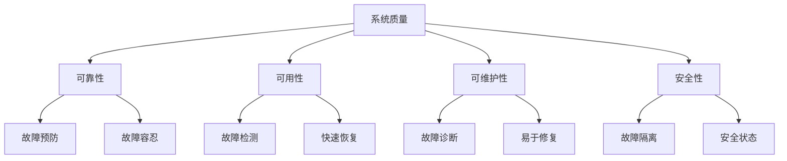
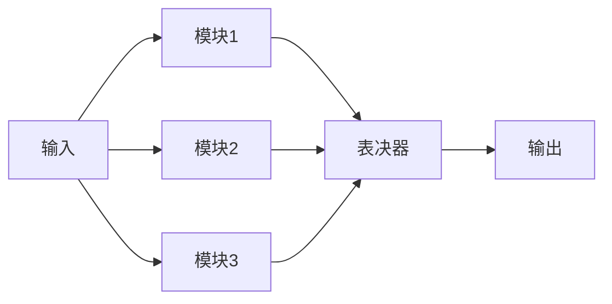

---
# 基础信息
title: "嵌入式系统可靠性设计原则"
description: "本文介绍嵌入式系统可靠性的基本概念、关键指标、故障模式分析、冗余设计、容错机制和可靠性测试方法，帮助开发者构建高可靠性的嵌入式系统"
slug: "reliability-design-principles"

# 分类信息
domain: "10-cross-cutting-concerns"
module: "03-security-reliability"
content_type: "article"
skill_level: "beginner"

# 标签和关联
tags:
  - 可靠性
  - 容错设计
  - 冗余
  - 故障模式
  - 系统设计
prerequisites: []
related_contents: []

# 学习信息
estimated_time: 50
difficulty_score: 2

# 作者和版本
author: "嵌入式知识平台"
author_id: ""
created_at: "2024-03-10"
updated_at: "2024-03-10"
version: "1.0"

# 语言和本地化
language: "zh-CN"
translations: []

# 状态和可见性
status: "draft"
is_featured: false
is_premium: false

# SEO和元数据
keywords:
  - 嵌入式可靠性
  - 容错设计
  - 冗余技术
  - MTBF
  - 故障分析
cover_image: ""
---

# 嵌入式系统可靠性设计原则


## 概述

在嵌入式系统开发中，可靠性是衡量系统质量的核心指标之一。无论是工业控制系统、医疗设备、汽车电子还是航空航天应用，系统的可靠性直接关系到人身安全、财产安全和业务连续性。本文将系统介绍嵌入式系统可靠性设计的基本原则和实践方法。

### 学习目标

通过本文的学习，你将能够：

- 理解可靠性的基本概念和关键指标
- 掌握常见的故障模式和分析方法
- 了解冗余设计的类型和应用场景
- 学习容错机制的设计原则
- 掌握可靠性测试的基本方法

## 可靠性基本概念

### 什么是可靠性

可靠性（Reliability）是指系统在规定条件下、规定时间内完成规定功能的能力。对于嵌入式系统而言，可靠性意味着：

- **功能正确性**：系统能够正确执行预期功能
- **时间持续性**：系统能够长时间稳定运行
- **环境适应性**：系统能够在各种环境条件下正常工作
- **故障恢复能力**：系统能够从故障中恢复或降级运行

### 可靠性与其他质量属性的关系




## 可靠性关键指标

### MTBF（平均故障间隔时间）

MTBF（Mean Time Between Failures）是衡量系统可靠性的最重要指标，表示系统两次故障之间的平均时间。

**计算公式**：
```
MTBF = 总运行时间 / 故障次数
```

**示例**：
- 系统运行10000小时，发生2次故障
- MTBF = 10000 / 2 = 5000小时

**工程意义**：
- MTBF越大，系统可靠性越高
- 用于预测系统寿命和维护周期
- 指导备件准备和维护计划

### MTTR（平均修复时间）

MTTR（Mean Time To Repair）表示系统从故障发生到修复完成的平均时间。

**影响因素**：
- 故障检测时间
- 故障定位时间
- 备件准备时间
- 实际修复时间
- 系统重启时间

### 可用性（Availability）

可用性表示系统在需要时能够正常工作的概率。

**计算公式**：
```
可用性 = MTBF / (MTBF + MTTR)
```

**示例**：
- MTBF = 5000小时
- MTTR = 2小时
- 可用性 = 5000 / (5000 + 2) = 99.96%

**可用性等级**：
- 99.9%（3个9）：年停机时间约8.76小时
- 99.99%（4个9）：年停机时间约52.56分钟
- 99.999%（5个9）：年停机时间约5.26分钟


## 故障模式分析

### 常见故障类型

嵌入式系统的故障可以分为以下几类：

**1. 硬件故障**
- 元器件老化失效
- 电源波动或中断
- 温度过高或过低
- 电磁干扰（EMI）
- 机械振动或冲击

**2. 软件故障**
- 程序逻辑错误
- 内存泄漏
- 死锁或资源竞争
- 数据损坏
- 异常未处理

**3. 环境故障**
- 温度超出工作范围
- 湿度过高导致短路
- 电磁干扰
- 供电不稳定
- 物理损坏

### FMEA（故障模式与影响分析）

FMEA是一种系统化的故障分析方法，用于识别潜在故障模式及其影响。

**FMEA分析步骤**：

1. **识别故障模式**：列出所有可能的故障
2. **分析故障影响**：评估故障对系统的影响
3. **评估严重度**：1-10分，10分最严重
4. **评估发生概率**：1-10分，10分最可能
5. **评估检测难度**：1-10分，10分最难检测
6. **计算风险优先数**：RPN = 严重度 × 概率 × 检测难度
7. **制定改进措施**：针对高RPN项制定对策

**FMEA示例表格**：

| 功能 | 故障模式 | 故障影响 | 严重度 | 概率 | 检测度 | RPN | 改进措施 |
|------|----------|----------|--------|------|--------|-----|----------|
| 电源管理 | 电源突然中断 | 数据丢失 | 8 | 3 | 2 | 48 | 添加备用电池 |
| 温度监控 | 传感器失效 | 过热保护失效 | 9 | 2 | 4 | 72 | 双传感器冗余 |
| 通信模块 | 数据传输错误 | 控制指令错误 | 7 | 4 | 3 | 84 | 增加CRC校验 |


## 冗余设计

冗余（Redundancy）是提高系统可靠性的重要手段，通过增加备份组件或功能来应对故障。

### 冗余类型

**1. 硬件冗余**

在硬件层面增加备份组件：

```c
// 双电源冗余示例
typedef struct {
    bool power1_active;    // 主电源状态
    bool power2_active;    // 备用电源状态
    uint8_t active_source; // 当前使用的电源
} PowerRedundancy_t;

// 电源切换逻辑
void PowerManagement_Check(PowerRedundancy_t *power) {
    // 检测主电源
    power->power1_active = CheckPower1();
    power->power2_active = CheckPower2();
    
    // 主电源失效，切换到备用电源
    if (!power->power1_active && power->power2_active) {
        if (power->active_source == 1) {
            SwitchToPower2();
            power->active_source = 2;
            LogEvent("切换到备用电源");
        }
    }
    // 主电源恢复，切换回主电源
    else if (power->power1_active && power->active_source == 2) {
        SwitchToPower1();
        power->active_source = 1;
        LogEvent("切换回主电源");
    }
}
```

**2. 软件冗余**

通过软件机制提供冗余保护：

```c
// 数据冗余存储示例
typedef struct {
    uint32_t data;      // 实际数据
    uint32_t data_copy; // 数据备份
    uint16_t crc;       // CRC校验值
} RedundantData_t;

// 写入冗余数据
void WriteRedundantData(RedundantData_t *rd, uint32_t value) {
    rd->data = value;
    rd->data_copy = value;
    rd->crc = CalculateCRC(&value, sizeof(value));
}

// 读取并验证冗余数据
bool ReadRedundantData(RedundantData_t *rd, uint32_t *value) {
    // 检查CRC
    uint16_t calc_crc = CalculateCRC(&rd->data, sizeof(rd->data));
    
    if (calc_crc == rd->crc) {
        // CRC正确，使用主数据
        *value = rd->data;
        return true;
    }
    else if (rd->data == rd->data_copy) {
        // CRC错误但两份数据一致，使用备份数据
        *value = rd->data_copy;
        // 修复CRC
        rd->crc = CalculateCRC(&rd->data, sizeof(rd->data));
        return true;
    }
    else {
        // 数据损坏
        return false;
    }
}
```


**3. 时间冗余**

通过重复执行来检测和纠正错误：

```c
// 三次表决机制
uint32_t TripleVoting(uint32_t (*ReadSensor)(void)) {
    uint32_t reading1 = ReadSensor();
    uint32_t reading2 = ReadSensor();
    uint32_t reading3 = ReadSensor();
    
    // 三个读数中至少两个相同则采用
    if (reading1 == reading2) {
        return reading1;
    }
    else if (reading1 == reading3) {
        return reading1;
    }
    else if (reading2 == reading3) {
        return reading2;
    }
    else {
        // 三个读数都不同，返回中值
        return GetMedian(reading1, reading2, reading3);
    }
}
```

**4. 信息冗余**

通过增加校验信息来检测和纠正错误：

```c
// 汉明码纠错示例（简化版）
typedef struct {
    uint8_t data;        // 4位数据
    uint8_t parity;      // 3位校验位
} HammingCode_t;

// 编码：添加校验位
HammingCode_t HammingEncode(uint8_t data) {
    HammingCode_t code;
    code.data = data & 0x0F;  // 取低4位
    
    // 计算校验位
    uint8_t p1 = (data & 0x01) ^ ((data & 0x02) >> 1) ^ ((data & 0x04) >> 2);
    uint8_t p2 = (data & 0x01) ^ ((data & 0x04) >> 2) ^ ((data & 0x08) >> 3);
    uint8_t p3 = ((data & 0x02) >> 1) ^ ((data & 0x04) >> 2) ^ ((data & 0x08) >> 3);
    
    code.parity = (p3 << 2) | (p2 << 1) | p1;
    return code;
}

// 解码：检测并纠正单比特错误
uint8_t HammingDecode(HammingCode_t code, bool *error_detected) {
    // 重新计算校验位
    uint8_t data = code.data;
    uint8_t p1 = (data & 0x01) ^ ((data & 0x02) >> 1) ^ ((data & 0x04) >> 2);
    uint8_t p2 = (data & 0x01) ^ ((data & 0x04) >> 2) ^ ((data & 0x08) >> 3);
    uint8_t p3 = ((data & 0x02) >> 1) ^ ((data & 0x04) >> 2) ^ ((data & 0x08) >> 3);
    
    uint8_t syndrome = ((p3 ^ ((code.parity & 0x04) >> 2)) << 2) |
                       ((p2 ^ ((code.parity & 0x02) >> 1)) << 1) |
                       (p1 ^ (code.parity & 0x01));
    
    if (syndrome != 0) {
        *error_detected = true;
        // 纠正错误（翻转错误位）
        data ^= (1 << (syndrome - 1));
    } else {
        *error_detected = false;
    }
    
    return data;
}
```


### N模冗余（NMR）

N模冗余是一种常用的容错技术，通过多个相同模块并行工作并进行表决。

**常见配置**：

- **双模冗余（DMR）**：两个模块，需要外部仲裁
- **三模冗余（TMR）**：三个模块，多数表决
- **五模冗余（5MR）**：五个模块，可容忍两个故障



**三模冗余实现示例**：

```c
// 三模冗余系统
typedef struct {
    uint32_t (*module1)(uint32_t);  // 模块1函数指针
    uint32_t (*module2)(uint32_t);  // 模块2函数指针
    uint32_t (*module3)(uint32_t);  // 模块3函数指针
    uint32_t error_count[3];        // 各模块错误计数
} TMR_System_t;

// 三模冗余执行和表决
uint32_t TMR_Execute(TMR_System_t *tmr, uint32_t input) {
    // 三个模块并行执行
    uint32_t result1 = tmr->module1(input);
    uint32_t result2 = tmr->module2(input);
    uint32_t result3 = tmr->module3(input);
    
    // 多数表决
    if (result1 == result2) {
        if (result1 != result3) {
            tmr->error_count[2]++;  // 模块3出错
        }
        return result1;
    }
    else if (result1 == result3) {
        tmr->error_count[1]++;  // 模块2出错
        return result1;
    }
    else if (result2 == result3) {
        tmr->error_count[0]++;  // 模块1出错
        return result2;
    }
    else {
        // 三个结果都不同，系统故障
        LogError("TMR: 所有模块结果不一致");
        return result1;  // 返回模块1结果作为默认值
    }
}
```


## 容错机制

容错（Fault Tolerance）是指系统在出现故障时仍能继续提供服务的能力。

### 故障检测

**1. 看门狗定时器（Watchdog Timer）**

```c
// 看门狗初始化
void Watchdog_Init(uint32_t timeout_ms) {
    // 配置看门狗超时时间
    WDT->TIMEOUT = timeout_ms;
    // 启动看门狗
    WDT->CTRL |= WDT_ENABLE;
}

// 喂狗操作
void Watchdog_Feed(void) {
    WDT->FEED = 0xA5;  // 写入特定值重置计数器
}

// 主循环中定期喂狗
void MainLoop(void) {
    while (1) {
        // 执行正常任务
        ProcessTasks();
        
        // 定期喂狗
        Watchdog_Feed();
        
        // 延时
        Delay(100);
    }
}
```

**2. 健康检查（Health Check）**

```c
// 系统健康状态
typedef struct {
    bool cpu_ok;           // CPU状态
    bool memory_ok;        // 内存状态
    bool power_ok;         // 电源状态
    bool temperature_ok;   // 温度状态
    bool communication_ok; // 通信状态
} SystemHealth_t;

// 系统健康检查
bool SystemHealthCheck(SystemHealth_t *health) {
    // 检查CPU
    health->cpu_ok = CheckCPUStatus();
    
    // 检查内存
    health->memory_ok = CheckMemoryIntegrity();
    
    // 检查电源
    health->power_ok = CheckPowerVoltage();
    
    // 检查温度
    health->temperature_ok = CheckTemperature();
    
    // 检查通信
    health->communication_ok = CheckCommunication();
    
    // 返回整体健康状态
    return health->cpu_ok && health->memory_ok && 
           health->power_ok && health->temperature_ok &&
           health->communication_ok;
}
```


### 故障隔离

将故障限制在局部，防止扩散到整个系统。

```c
// 模块隔离示例
typedef enum {
    MODULE_STATE_NORMAL,    // 正常运行
    MODULE_STATE_WARNING,   // 警告状态
    MODULE_STATE_ERROR,     // 错误状态
    MODULE_STATE_ISOLATED   // 已隔离
} ModuleState_t;

typedef struct {
    ModuleState_t state;
    uint32_t error_count;
    uint32_t max_errors;
} Module_t;

// 模块错误处理
void Module_HandleError(Module_t *module) {
    module->error_count++;
    
    if (module->error_count >= module->max_errors) {
        // 错误次数超过阈值，隔离模块
        module->state = MODULE_STATE_ISOLATED;
        LogError("模块已隔离");
        
        // 通知系统管理器
        NotifySystemManager(MODULE_ISOLATED);
        
        // 尝试重启模块
        RestartModule(module);
    }
    else if (module->error_count > module->max_errors / 2) {
        // 错误次数较多，进入警告状态
        module->state = MODULE_STATE_WARNING;
    }
}
```

### 故障恢复

**1. 自动重启**

```c
// 系统重启管理
typedef struct {
    uint32_t restart_count;      // 重启次数
    uint32_t max_restart_count;  // 最大重启次数
    uint32_t last_restart_time;  // 上次重启时间
    uint32_t restart_interval;   // 重启间隔
} RestartManager_t;

// 执行系统重启
bool SystemRestart(RestartManager_t *mgr) {
    uint32_t current_time = GetSystemTime();
    
    // 检查重启间隔
    if (current_time - mgr->last_restart_time < mgr->restart_interval) {
        LogWarning("重启间隔太短，拒绝重启");
        return false;
    }
    
    // 检查重启次数
    if (mgr->restart_count >= mgr->max_restart_count) {
        LogError("重启次数超过限制，进入安全模式");
        EnterSafeMode();
        return false;
    }
    
    // 保存重启信息
    mgr->restart_count++;
    mgr->last_restart_time = current_time;
    SaveRestartInfo(mgr);
    
    // 执行重启
    LogInfo("系统重启中...");
    NVIC_SystemReset();
    
    return true;
}
```


**2. 降级运行**

当系统无法完全恢复时，可以降级到基本功能模式。

```c
// 系统运行模式
typedef enum {
    MODE_FULL_FUNCTION,    // 全功能模式
    MODE_REDUCED_FUNCTION, // 降级功能模式
    MODE_SAFE_MODE,        // 安全模式
    MODE_EMERGENCY         // 紧急模式
} SystemMode_t;

// 系统模式管理
typedef struct {
    SystemMode_t current_mode;
    SystemHealth_t health;
} SystemManager_t;

// 根据健康状态调整运行模式
void AdjustSystemMode(SystemManager_t *mgr) {
    SystemHealthCheck(&mgr->health);
    
    // 根据健康状态决定运行模式
    if (mgr->health.cpu_ok && mgr->health.memory_ok && 
        mgr->health.power_ok && mgr->health.temperature_ok) {
        // 所有关键组件正常，全功能模式
        mgr->current_mode = MODE_FULL_FUNCTION;
    }
    else if (mgr->health.cpu_ok && mgr->health.memory_ok && 
             mgr->health.power_ok) {
        // 关键组件正常，但有次要问题，降级模式
        mgr->current_mode = MODE_REDUCED_FUNCTION;
        DisableNonCriticalFunctions();
    }
    else if (mgr->health.cpu_ok && mgr->health.power_ok) {
        // 仅核心功能可用，安全模式
        mgr->current_mode = MODE_SAFE_MODE;
        EnableOnlySafeFunctions();
    }
    else {
        // 严重故障，紧急模式
        mgr->current_mode = MODE_EMERGENCY;
        EmergencyShutdown();
    }
}
```

### 状态保存与恢复

```c
// 系统状态结构
typedef struct {
    uint32_t magic_number;     // 魔数，用于验证数据有效性
    uint32_t version;          // 版本号
    uint32_t crc;              // CRC校验
    SystemMode_t mode;         // 运行模式
    uint32_t runtime;          // 运行时间
    uint32_t error_count;      // 错误计数
    // 其他关键状态数据
} SystemState_t;

#define STATE_MAGIC 0x12345678

// 保存系统状态到非易失性存储
void SaveSystemState(SystemState_t *state) {
    state->magic_number = STATE_MAGIC;
    state->version = SYSTEM_VERSION;
    
    // 计算CRC
    state->crc = CalculateCRC(state, sizeof(SystemState_t) - sizeof(uint32_t));
    
    // 写入Flash或EEPROM
    WriteToNonVolatileMemory(STATE_ADDRESS, state, sizeof(SystemState_t));
}

// 从非易失性存储恢复系统状态
bool RestoreSystemState(SystemState_t *state) {
    // 从Flash或EEPROM读取
    ReadFromNonVolatileMemory(STATE_ADDRESS, state, sizeof(SystemState_t));
    
    // 验证魔数
    if (state->magic_number != STATE_MAGIC) {
        LogError("状态数据无效：魔数错误");
        return false;
    }
    
    // 验证CRC
    uint32_t calc_crc = CalculateCRC(state, sizeof(SystemState_t) - sizeof(uint32_t));
    if (calc_crc != state->crc) {
        LogError("状态数据无效：CRC错误");
        return false;
    }
    
    LogInfo("系统状态恢复成功");
    return true;
}
```


## 可靠性测试

### 功能测试

验证系统在正常条件下的功能正确性。

```c
// 功能测试示例
void TestBasicFunctions(void) {
    // 测试1：电源管理
    assert(PowerManagement_Init() == SUCCESS);
    assert(GetPowerVoltage() > MIN_VOLTAGE);
    
    // 测试2：通信功能
    uint8_t test_data[] = {0x01, 0x02, 0x03};
    assert(SendData(test_data, 3) == SUCCESS);
    
    // 测试3：数据处理
    uint32_t result = ProcessData(100);
    assert(result == EXPECTED_VALUE);
    
    LogInfo("功能测试通过");
}
```

### 压力测试

测试系统在极限条件下的表现。

```c
// 压力测试示例
void StressTest(void) {
    uint32_t test_count = 10000;
    uint32_t error_count = 0;
    
    LogInfo("开始压力测试...");
    
    for (uint32_t i = 0; i < test_count; i++) {
        // 高频率执行操作
        if (PerformOperation() != SUCCESS) {
            error_count++;
        }
        
        // 每1000次输出进度
        if (i % 1000 == 0) {
            LogInfo("进度: %d/%d, 错误: %d", i, test_count, error_count);
        }
    }
    
    // 计算错误率
    float error_rate = (float)error_count / test_count * 100;
    LogInfo("压力测试完成，错误率: %.2f%%", error_rate);
    
    // 错误率应低于阈值
    assert(error_rate < 0.1);  // 错误率应低于0.1%
}
```

### 老化测试

长时间运行测试，发现潜在的可靠性问题。

```c
// 老化测试配置
typedef struct {
    uint32_t test_duration_hours;  // 测试时长（小时）
    uint32_t check_interval_sec;   // 检查间隔（秒）
    uint32_t max_errors;            // 最大允许错误数
} BurnInTest_t;

// 老化测试执行
void BurnInTest(BurnInTest_t *config) {
    uint32_t start_time = GetSystemTime();
    uint32_t test_duration_sec = config->test_duration_hours * 3600;
    uint32_t error_count = 0;
    uint32_t cycle_count = 0;
    
    LogInfo("开始老化测试，时长: %d小时", config->test_duration_hours);
    
    while (GetSystemTime() - start_time < test_duration_sec) {
        cycle_count++;
        
        // 执行各种操作
        if (!PerformAllOperations()) {
            error_count++;
            LogError("老化测试错误 #%d", error_count);
            
            if (error_count >= config->max_errors) {
                LogError("错误次数超过限制，测试失败");
                return;
            }
        }
        
        // 定期输出状态
        if (cycle_count % 100 == 0) {
            uint32_t elapsed = GetSystemTime() - start_time;
            LogInfo("已运行: %d秒, 循环: %d, 错误: %d", 
                    elapsed, cycle_count, error_count);
        }
        
        // 等待下一个检查周期
        Delay(config->check_interval_sec * 1000);
    }
    
    LogInfo("老化测试完成，总循环: %d, 总错误: %d", cycle_count, error_count);
}
```


### 故障注入测试

主动注入故障，测试系统的容错能力。

```c
// 故障注入类型
typedef enum {
    FAULT_POWER_GLITCH,      // 电源毛刺
    FAULT_MEMORY_CORRUPTION, // 内存损坏
    FAULT_SENSOR_ERROR,      // 传感器错误
    FAULT_COMMUNICATION_LOSS,// 通信丢失
    FAULT_TIMEOUT            // 超时
} FaultType_t;

// 故障注入测试
void FaultInjectionTest(FaultType_t fault_type) {
    LogInfo("注入故障类型: %d", fault_type);
    
    // 记录注入前状态
    SystemState_t state_before;
    GetSystemState(&state_before);
    
    // 注入故障
    switch (fault_type) {
        case FAULT_POWER_GLITCH:
            SimulatePowerGlitch();
            break;
        case FAULT_MEMORY_CORRUPTION:
            CorruptMemory(TEST_ADDRESS);
            break;
        case FAULT_SENSOR_ERROR:
            InjectSensorError();
            break;
        case FAULT_COMMUNICATION_LOSS:
            DisableCommunication();
            break;
        case FAULT_TIMEOUT:
            SimulateTimeout();
            break;
    }
    
    // 等待系统响应
    Delay(1000);
    
    // 检查系统状态
    SystemState_t state_after;
    GetSystemState(&state_after);
    
    // 验证系统是否正确处理故障
    bool recovered = CheckSystemRecovery(&state_before, &state_after);
    
    if (recovered) {
        LogInfo("故障注入测试通过：系统成功恢复");
    } else {
        LogError("故障注入测试失败：系统未能恢复");
    }
}
```

### 环境测试

测试系统在不同环境条件下的可靠性。

**测试项目**：
- 温度测试：-40°C ~ +85°C
- 湿度测试：10% ~ 95% RH
- 振动测试：按照相关标准
- 电磁兼容测试：EMI/EMS
- 电源波动测试：额定电压±20%


## 可靠性设计最佳实践

### 1. 防御性编程

始终假设可能出现错误，并进行防御。

```c
// 防御性编程示例
int ProcessData(uint8_t *data, uint32_t length) {
    // 参数检查
    if (data == NULL) {
        LogError("数据指针为空");
        return ERROR_NULL_POINTER;
    }
    
    if (length == 0 || length > MAX_DATA_LENGTH) {
        LogError("数据长度无效: %d", length);
        return ERROR_INVALID_LENGTH;
    }
    
    // 范围检查
    for (uint32_t i = 0; i < length; i++) {
        if (data[i] > MAX_VALUE) {
            LogWarning("数据值超出范围: %d", data[i]);
            data[i] = MAX_VALUE;  // 限幅处理
        }
    }
    
    // 执行处理
    int result = DoProcessing(data, length);
    
    // 结果验证
    if (result < 0) {
        LogError("处理失败: %d", result);
        return ERROR_PROCESSING_FAILED;
    }
    
    return SUCCESS;
}
```

### 2. 错误处理策略

建立完善的错误处理机制。

```c
// 错误处理策略
typedef enum {
    ERROR_STRATEGY_IGNORE,    // 忽略错误
    ERROR_STRATEGY_LOG,       // 记录错误
    ERROR_STRATEGY_RETRY,     // 重试操作
    ERROR_STRATEGY_FALLBACK,  // 使用备用方案
    ERROR_STRATEGY_SHUTDOWN   // 关闭系统
} ErrorStrategy_t;

// 错误处理函数
void HandleError(int error_code, ErrorStrategy_t strategy) {
    // 记录错误
    LogError("错误代码: %d", error_code);
    
    switch (strategy) {
        case ERROR_STRATEGY_IGNORE:
            // 忽略错误，继续执行
            break;
            
        case ERROR_STRATEGY_LOG:
            // 仅记录，不采取行动
            SaveErrorLog(error_code);
            break;
            
        case ERROR_STRATEGY_RETRY:
            // 重试操作
            RetryLastOperation();
            break;
            
        case ERROR_STRATEGY_FALLBACK:
            // 使用备用方案
            UseFallbackMethod();
            break;
            
        case ERROR_STRATEGY_SHUTDOWN:
            // 安全关闭系统
            SafeShutdown();
            break;
    }
}
```

### 3. 资源管理

合理管理系统资源，避免资源耗尽。

```c
// 内存池管理
#define POOL_SIZE 10

typedef struct {
    uint8_t buffer[BUFFER_SIZE];
    bool in_use;
} MemoryBlock_t;

typedef struct {
    MemoryBlock_t blocks[POOL_SIZE];
    uint32_t allocated_count;
} MemoryPool_t;

// 分配内存块
MemoryBlock_t* AllocateBlock(MemoryPool_t *pool) {
    if (pool->allocated_count >= POOL_SIZE) {
        LogError("内存池已满");
        return NULL;
    }
    
    // 查找空闲块
    for (int i = 0; i < POOL_SIZE; i++) {
        if (!pool->blocks[i].in_use) {
            pool->blocks[i].in_use = true;
            pool->allocated_count++;
            return &pool->blocks[i];
        }
    }
    
    return NULL;
}

// 释放内存块
void FreeBlock(MemoryPool_t *pool, MemoryBlock_t *block) {
    if (block == NULL) return;
    
    block->in_use = false;
    pool->allocated_count--;
}
```


### 4. 日志和监控

建立完善的日志系统，便于问题诊断。

```c
// 日志级别
typedef enum {
    LOG_LEVEL_DEBUG,
    LOG_LEVEL_INFO,
    LOG_LEVEL_WARNING,
    LOG_LEVEL_ERROR,
    LOG_LEVEL_CRITICAL
} LogLevel_t;

// 日志条目
typedef struct {
    uint32_t timestamp;
    LogLevel_t level;
    char message[128];
} LogEntry_t;

// 循环日志缓冲区
#define LOG_BUFFER_SIZE 100
LogEntry_t log_buffer[LOG_BUFFER_SIZE];
uint32_t log_index = 0;

// 写入日志
void WriteLog(LogLevel_t level, const char *format, ...) {
    LogEntry_t *entry = &log_buffer[log_index];
    
    // 记录时间戳
    entry->timestamp = GetSystemTime();
    entry->level = level;
    
    // 格式化消息
    va_list args;
    va_start(args, format);
    vsnprintf(entry->message, sizeof(entry->message), format, args);
    va_end(args);
    
    // 更新索引（循环缓冲区）
    log_index = (log_index + 1) % LOG_BUFFER_SIZE;
    
    // 如果是严重错误，立即保存到非易失性存储
    if (level >= LOG_LEVEL_ERROR) {
        SaveLogToFlash(entry);
    }
}
```

### 5. 版本管理

记录软件和硬件版本信息，便于追溯问题。

```c
// 版本信息
typedef struct {
    uint8_t major;
    uint8_t minor;
    uint8_t patch;
    uint32_t build;
    char date[12];  // YYYY-MM-DD
    char time[9];   // HH:MM:SS
} VersionInfo_t;

// 定义版本信息
const VersionInfo_t firmware_version = {
    .major = 1,
    .minor = 2,
    .patch = 3,
    .build = 12345,
    .date = __DATE__,
    .time = __TIME__
};

// 打印版本信息
void PrintVersionInfo(void) {
    LogInfo("固件版本: %d.%d.%d (Build %d)",
            firmware_version.major,
            firmware_version.minor,
            firmware_version.patch,
            firmware_version.build);
    LogInfo("编译时间: %s %s",
            firmware_version.date,
            firmware_version.time);
}
```


## 常见问题

### Q1: 如何选择合适的冗余方案？

**A**: 选择冗余方案需要考虑以下因素：

1. **可靠性要求**：
   - 一般应用：单一系统 + 看门狗
   - 重要应用：双模冗余（DMR）
   - 关键应用：三模冗余（TMR）或更高

2. **成本约束**：
   - 硬件冗余成本高，但可靠性最好
   - 软件冗余成本低，但可靠性相对较低
   - 时间冗余几乎无额外成本，但会降低性能

3. **性能要求**：
   - 实时性要求高：避免时间冗余
   - 计算资源有限：避免N模冗余
   - 存储空间有限：减少信息冗余

### Q2: MTBF如何计算和提升？

**A**: MTBF的计算和提升方法：

**计算方法**：
```
MTBF = 总运行时间 / 故障次数
```

**提升策略**：
1. 使用高质量元器件
2. 降额设计（Derating）
3. 热设计优化
4. 减少机械应力
5. 软件优化和测试
6. 定期维护保养

### Q3: 如何平衡可靠性和成本？

**A**: 平衡策略：

1. **风险评估**：
   - 识别关键功能和非关键功能
   - 对关键功能投入更多资源

2. **分级保护**：
   - 核心功能：高冗余
   - 重要功能：中等冗余
   - 一般功能：基本保护

3. **渐进式设计**：
   - 先实现基本可靠性
   - 根据实际需求逐步增强

### Q4: 看门狗超时时间如何设置？

**A**: 设置原则：

1. **分析最长任务时间**：
   - 测量所有任务的执行时间
   - 找出最长的任务周期

2. **留有余量**：
   ```
   超时时间 = 最长任务时间 × 1.5 ~ 2.0
   ```

3. **考虑中断影响**：
   - 如果有高优先级中断，需要考虑中断延迟

4. **实际测试验证**：
   - 在最坏情况下测试
   - 确保不会误触发


## 总结

可靠性设计是嵌入式系统开发的重要组成部分，需要从多个层面进行考虑：

### 核心要点

1. **理解可靠性指标**：
   - MTBF、MTTR、可用性是衡量系统可靠性的关键指标
   - 不同应用场景对可靠性有不同要求

2. **故障模式分析**：
   - 使用FMEA等方法系统分析潜在故障
   - 针对高风险故障制定预防和应对措施

3. **冗余设计**：
   - 硬件冗余、软件冗余、时间冗余、信息冗余
   - 根据需求选择合适的冗余方案

4. **容错机制**：
   - 故障检测：看门狗、健康检查
   - 故障隔离：防止故障扩散
   - 故障恢复：自动重启、降级运行

5. **可靠性测试**：
   - 功能测试、压力测试、老化测试
   - 故障注入测试、环境测试

### 设计原则

- **防御性编程**：假设一切都可能出错
- **完善的错误处理**：不忽略任何错误
- **资源管理**：避免资源耗尽
- **日志和监控**：便于问题诊断
- **版本管理**：便于问题追溯

### 实践建议

1. **从设计阶段开始考虑可靠性**，而不是事后补救
2. **根据应用场景选择合适的可靠性措施**，避免过度设计
3. **充分测试**，包括正常情况和异常情况
4. **建立完善的日志系统**，便于现场问题诊断
5. **持续改进**，根据实际运行情况优化设计

## 延伸阅读

### 相关标准

- **IEC 61508**：功能安全标准
- **ISO 26262**：汽车功能安全标准
- **DO-178C**：航空软件安全标准
- **IEC 62304**：医疗设备软件生命周期标准

### 推荐资源

- 《可靠性工程基础》
- 《嵌入式系统设计与实践》
- 《容错系统设计》
- NASA软件可靠性指南

### 相关主题

- 功能安全设计（IEC 61508）
- 故障检测与诊断技术
- 看门狗与系统监控
- 冗余设计与容错技术
- 系统测试与验证

---

**注意事项**：
- 可靠性设计需要在性能、成本和可靠性之间找到平衡
- 不同行业和应用对可靠性有不同的标准和要求
- 可靠性设计是一个持续改进的过程，需要根据实际运行情况不断优化

