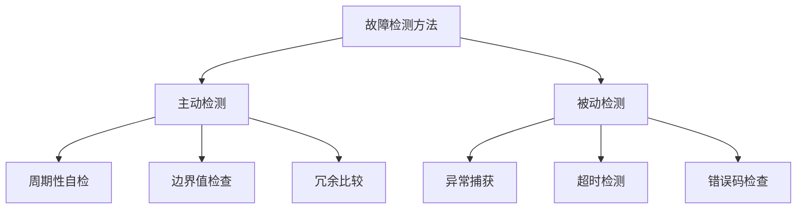

# 故障检测与诊断技术


## 学习目标

完成本教程后，你将能够：

- 理解故障检测与诊断的核心概念和重要性
- 掌握常见的故障检测方法和诊断算法
- 能够设计和实现系统自检机制
- 掌握日志记录系统的设计与实现
- 了解故障恢复策略和最佳实践
- 能够构建完整的故障检测与诊断系统


## 前置要求

### 知识要求
- 掌握C语言编程
- 了解嵌入式系统基础知识
- 理解可靠性设计原则
- 熟悉RTOS基本概念
- 了解常见的通信协议

### 环境要求
- 开发板：STM32F4系列或类似MCU
- 开发工具：STM32CubeIDE或Keil MDK
- 调试器：ST-Link或J-Link
- RTOS：FreeRTOS（可选）
- 串口工具：用于查看日志输出


## 准备工作

### 1. 硬件准备

**开发板清单**：
- STM32F407开发板 × 1
- USB数据线 × 1
- ST-Link调试器 × 1
- LED指示灯 × 3（用于状态指示）
- 按键 × 2（用于模拟故障）

**硬件连接**：
```
ST-Link    →    STM32F407
SWDIO      →    SWDIO
SWCLK      →    SWCLK
GND        →    GND
3.3V       →    3.3V

LED1 (绿色) →   PA5  (系统正常)
LED2 (黄色) →   PA6  (警告状态)
LED3 (红色) →   PA7  (故障状态)

KEY1       →    PC13 (模拟传感器故障)
KEY2       →    PC14 (模拟通信故障)
```

### 2. 软件准备

**创建工程**：
1. 使用STM32CubeMX创建新工程
2. 配置系统时钟为168MHz
3. 启用USART1用于日志输出
4. 配置GPIO用于LED和按键
5. 可选：启用FreeRTOS

**配置串口**：
```c
// USART1配置
// 波特率: 115200
// 数据位: 8
// 停止位: 1
// 校验位: 无
// 流控: 无
```


## 步骤说明

### 步骤1: 理解故障检测与诊断基础

故障检测与诊断是确保嵌入式系统可靠运行的关键技术。

#### 1.1 故障分类

**按故障性质分类**：

```c
// 故障类型枚举
typedef enum {
    FAULT_NONE = 0,           // 无故障
    FAULT_HARDWARE,           // 硬件故障
    FAULT_SOFTWARE,           // 软件故障
    FAULT_COMMUNICATION,      // 通信故障
    FAULT_SENSOR,             // 传感器故障
    FAULT_POWER,              // 电源故障
    FAULT_MEMORY,             // 内存故障
    FAULT_TIMING,             // 时序故障
    FAULT_UNKNOWN             // 未知故障
} fault_type_t;

// 故障严重程度
typedef enum {
    SEVERITY_INFO = 0,        // 信息级别
    SEVERITY_WARNING,         // 警告级别
    SEVERITY_ERROR,           // 错误级别
    SEVERITY_CRITICAL,        // 严重级别
    SEVERITY_FATAL            // 致命级别
} fault_severity_t;
```

**按故障持续时间分类**：
- **瞬时故障**：短暂出现后自动消失（如电磁干扰）
- **间歇性故障**：周期性出现和消失（如接触不良）
- **永久性故障**：持续存在直到修复（如硬件损坏）

#### 1.2 故障检测方法



#### 1.3 故障信息结构

定义完整的故障信息数据结构：

```c
#include <stdint.h>
#include <time.h>

// 故障记录结构
typedef struct {
    uint32_t fault_id;           // 故障ID（唯一标识）
    fault_type_t type;           // 故障类型
    fault_severity_t severity;   // 严重程度
    uint32_t timestamp;          // 发生时间戳
    uint32_t count;              // 发生次数
    uint16_t source_module;      // 故障源模块
    uint16_t error_code;         // 错误代码
    char description[64];        // 故障描述
    uint32_t context_data[4];    // 上下文数据
} fault_record_t;

// 故障统计信息
typedef struct {
    uint32_t total_faults;       // 总故障数
    uint32_t critical_faults;    // 严重故障数
    uint32_t last_fault_time;    // 最后故障时间
    uint32_t mtbf;               // 平均无故障时间(秒)
    uint32_t uptime;             // 系统运行时间(秒)
} fault_statistics_t;
```


### 步骤2: 实现故障检测机制

实现多种故障检测方法，覆盖不同类型的故障。

#### 2.1 边界值检查

检测传感器数据是否在合理范围内：

```c
#include <stdbool.h>

// 传感器数据范围定义
typedef struct {
    float min_value;             // 最小值
    float max_value;             // 最大值
    float warning_low;           // 警告下限
    float warning_high;          // 警告上限
} sensor_range_t;

// 传感器配置
const sensor_range_t temp_sensor_range = {
    .min_value = -40.0f,         // 最低温度
    .max_value = 125.0f,         // 最高温度
    .warning_low = 0.0f,         // 警告下限
    .warning_high = 85.0f        // 警告上限
};

/**
 * @brief 检查传感器数据是否在有效范围内
 * @param value 传感器读数
 * @param range 有效范围
 * @param severity 输出严重程度
 * @return true: 正常, false: 异常
 */
bool check_sensor_range(float value, const sensor_range_t *range, 
                        fault_severity_t *severity) {
    // 1. 检查是否超出绝对范围
    if (value < range->min_value || value > range->max_value) {
        *severity = SEVERITY_ERROR;
        return false;
    }
    
    // 2. 检查是否在警告范围内
    if (value < range->warning_low || value > range->warning_high) {
        *severity = SEVERITY_WARNING;
        return false;
    }
    
    // 3. 数据正常
    *severity = SEVERITY_INFO;
    return true;
}

/**
 * @brief 温度传感器故障检测
 * @param temperature 温度读数
 * @return 故障记录指针，NULL表示无故障
 */
fault_record_t* detect_temperature_fault(float temperature) {
    static fault_record_t fault;
    fault_severity_t severity;
    
    // 检查温度范围
    if (!check_sensor_range(temperature, &temp_sensor_range, &severity)) {
        // 创建故障记录
        fault.fault_id = generate_fault_id();
        fault.type = FAULT_SENSOR;
        fault.severity = severity;
        fault.timestamp = get_system_time();
        fault.source_module = MODULE_TEMPERATURE_SENSOR;
        fault.error_code = (temperature < temp_sensor_range.min_value) ? 
                          ERR_TEMP_TOO_LOW : ERR_TEMP_TOO_HIGH;
        
        snprintf(fault.description, sizeof(fault.description),
                "Temperature %.1f°C out of range", temperature);
        
        fault.context_data[0] = *(uint32_t*)&temperature;  // 存储原始值
        
        return &fault;
    }
    
    return NULL;  // 无故障
}
```

#### 2.2 变化率检测

检测传感器数据变化是否异常：

```c
// 变化率检测配置
typedef struct {
    float max_change_rate;       // 最大变化率（单位/秒）
    uint32_t sample_interval;    // 采样间隔（毫秒）
    uint32_t filter_window;      // 滤波窗口大小
} rate_detector_config_t;

// 变化率检测器
typedef struct {
    float last_value;            // 上次值
    uint32_t last_time;          // 上次时间
    float history[10];           // 历史数据
    uint8_t history_index;       // 历史索引
    rate_detector_config_t config;
} rate_detector_t;

/**
 * @brief 初始化变化率检测器
 * @param detector 检测器
 * @param config 配置
 */
void rate_detector_init(rate_detector_t *detector, 
                       const rate_detector_config_t *config) {
    detector->last_value = 0.0f;
    detector->last_time = 0;
    detector->history_index = 0;
    detector->config = *config;
    memset(detector->history, 0, sizeof(detector->history));
}

/**
 * @brief 检测数据变化率是否异常
 * @param detector 检测器
 * @param value 当前值
 * @param current_time 当前时间（毫秒）
 * @return true: 正常, false: 异常
 */
bool rate_detector_check(rate_detector_t *detector, float value, 
                        uint32_t current_time) {
    // 首次调用，初始化
    if (detector->last_time == 0) {
        detector->last_value = value;
        detector->last_time = current_time;
        return true;
    }
    
    // 计算时间间隔（秒）
    float time_delta = (current_time - detector->last_time) / 1000.0f;
    
    // 计算变化率
    float change_rate = fabs(value - detector->last_value) / time_delta;
    
    // 更新历史数据
    detector->history[detector->history_index] = change_rate;
    detector->history_index = (detector->history_index + 1) % 10;
    
    // 更新上次值
    detector->last_value = value;
    detector->last_time = current_time;
    
    // 检查变化率是否超限
    if (change_rate > detector->config.max_change_rate) {
        printf("Abnormal change rate: %.2f (max: %.2f)\n",
               change_rate, detector->config.max_change_rate);
        return false;
    }
    
    return true;
}
```

#### 2.3 通信超时检测

检测通信是否超时：

```c
// 通信超时检测器
typedef struct {
    uint32_t last_rx_time;       // 最后接收时间
    uint32_t timeout_ms;         // 超时时间（毫秒）
    uint32_t timeout_count;      // 超时次数
    bool is_timeout;             // 是否超时
} comm_timeout_detector_t;

/**
 * @brief 初始化通信超时检测器
 * @param detector 检测器
 * @param timeout_ms 超时时间（毫秒）
 */
void comm_timeout_init(comm_timeout_detector_t *detector, uint32_t timeout_ms) {
    detector->last_rx_time = HAL_GetTick();
    detector->timeout_ms = timeout_ms;
    detector->timeout_count = 0;
    detector->is_timeout = false;
}

/**
 * @brief 更新接收时间（收到数据时调用）
 * @param detector 检测器
 */
void comm_timeout_update(comm_timeout_detector_t *detector) {
    detector->last_rx_time = HAL_GetTick();
    
    // 如果之前超时，现在恢复了
    if (detector->is_timeout) {
        detector->is_timeout = false;
        printf("Communication recovered\n");
    }
}

/**
 * @brief 检查是否超时
 * @param detector 检测器
 * @return true: 超时, false: 正常
 */
bool comm_timeout_check(comm_timeout_detector_t *detector) {
    uint32_t current_time = HAL_GetTick();
    uint32_t elapsed = current_time - detector->last_rx_time;
    
    if (elapsed > detector->timeout_ms) {
        if (!detector->is_timeout) {
            // 首次检测到超时
            detector->is_timeout = true;
            detector->timeout_count++;
            
            printf("Communication timeout detected (elapsed: %lu ms)\n", elapsed);
            
            // 创建故障记录
            fault_record_t fault;
            fault.type = FAULT_COMMUNICATION;
            fault.severity = SEVERITY_ERROR;
            fault.timestamp = current_time;
            fault.error_code = ERR_COMM_TIMEOUT;
            snprintf(fault.description, sizeof(fault.description),
                    "Communication timeout: %lu ms", elapsed);
            
            // 记录故障
            log_fault(&fault);
        }
        return true;
    }
    
    return false;
}
```


### 步骤3: 实现系统自检机制

系统自检（Built-In Self-Test, BIST）在系统启动或运行时自动检测硬件和软件状态。

#### 3.1 启动自检（POST）

上电自检（Power-On Self-Test）在系统启动时执行：

```c
// 自检结果
typedef struct {
    bool cpu_ok;                 // CPU测试
    bool memory_ok;              // 内存测试
    bool flash_ok;               // Flash测试
    bool peripheral_ok;          // 外设测试
    bool sensor_ok;              // 传感器测试
    uint32_t test_duration_ms;   // 测试耗时
} post_result_t;

/**
 * @brief 执行上电自检
 * @param result 自检结果
 * @return true: 通过, false: 失败
 */
bool perform_post(post_result_t *result) {
    uint32_t start_time = HAL_GetTick();
    
    printf("\n=== Power-On Self-Test ===\n");
    
    // 1. CPU测试
    printf("Testing CPU... ");
    result->cpu_ok = test_cpu();
    printf("%s\n", result->cpu_ok ? "OK" : "FAIL");
    
    // 2. 内存测试
    printf("Testing RAM... ");
    result->memory_ok = test_memory();
    printf("%s\n", result->memory_ok ? "OK" : "FAIL");
    
    // 3. Flash测试
    printf("Testing Flash... ");
    result->flash_ok = test_flash();
    printf("%s\n", result->flash_ok ? "OK" : "FAIL");
    
    // 4. 外设测试
    printf("Testing Peripherals... ");
    result->peripheral_ok = test_peripherals();
    printf("%s\n", result->peripheral_ok ? "OK" : "FAIL");
    
    // 5. 传感器测试
    printf("Testing Sensors... ");
    result->sensor_ok = test_sensors();
    printf("%s\n", result->sensor_ok ? "OK" : "FAIL");
    
    result->test_duration_ms = HAL_GetTick() - start_time;
    
    // 判断整体结果
    bool overall_ok = result->cpu_ok && result->memory_ok && 
                     result->flash_ok && result->peripheral_ok &&
                     result->sensor_ok;
    
    printf("=== POST %s (Duration: %lu ms) ===\n\n",
           overall_ok ? "PASSED" : "FAILED",
           result->test_duration_ms);
    
    return overall_ok;
}

/**
 * @brief CPU测试
 * @return true: 通过, false: 失败
 */
static bool test_cpu(void) {
    // 1. 测试基本运算
    volatile int a = 123;
    volatile int b = 456;
    volatile int c = a + b;
    if (c != 579) return false;
    
    // 2. 测试乘法
    c = a * b;
    if (c != 56088) return false;
    
    // 3. 测试除法
    c = b / a;
    if (c != 3) return false;
    
    // 4. 测试位操作
    c = a & b;
    if (c != 72) return false;
    
    return true;
}

/**
 * @brief 内存测试（简化版）
 * @return true: 通过, false: 失败
 */
static bool test_memory(void) {
    #define TEST_SIZE 1024
    static uint32_t test_buffer[TEST_SIZE];
    
    // 1. 写入测试模式
    for (int i = 0; i < TEST_SIZE; i++) {
        test_buffer[i] = 0xAA55AA55 + i;
    }
    
    // 2. 读回验证
    for (int i = 0; i < TEST_SIZE; i++) {
        if (test_buffer[i] != (0xAA55AA55 + i)) {
            printf("Memory test failed at index %d\n", i);
            return false;
        }
    }
    
    // 3. 反向测试
    for (int i = 0; i < TEST_SIZE; i++) {
        test_buffer[i] = ~(0xAA55AA55 + i);
    }
    
    for (int i = 0; i < TEST_SIZE; i++) {
        if (test_buffer[i] != ~(0xAA55AA55 + i)) {
            printf("Memory test failed at index %d (inverse)\n", i);
            return false;
        }
    }
    
    return true;
}

/**
 * @brief Flash测试
 * @return true: 通过, false: 失败
 */
static bool test_flash(void) {
    // 读取Flash中的固定位置数据，验证完整性
    uint32_t *flash_addr = (uint32_t*)0x08000000;
    
    // 检查向量表是否有效
    uint32_t stack_ptr = flash_addr[0];
    uint32_t reset_handler = flash_addr[1];
    
    // 栈指针应该在RAM范围内
    if (stack_ptr < 0x20000000 || stack_ptr > 0x20020000) {
        printf("Invalid stack pointer: 0x%08lX\n", stack_ptr);
        return false;
    }
    
    // 复位处理函数应该在Flash范围内
    if (reset_handler < 0x08000000 || reset_handler > 0x08100000) {
        printf("Invalid reset handler: 0x%08lX\n", reset_handler);
        return false;
    }
    
    return true;
}

/**
 * @brief 外设测试
 * @return true: 通过, false: 失败
 */
static bool test_peripherals(void) {
    // 1. 测试GPIO
    HAL_GPIO_WritePin(GPIOA, GPIO_PIN_5, GPIO_PIN_SET);
    HAL_Delay(1);
    GPIO_PinState state = HAL_GPIO_ReadPin(GPIOA, GPIO_PIN_5);
    if (state != GPIO_PIN_SET) return false;
    
    HAL_GPIO_WritePin(GPIOA, GPIO_PIN_5, GPIO_PIN_RESET);
    HAL_Delay(1);
    state = HAL_GPIO_ReadPin(GPIOA, GPIO_PIN_5);
    if (state != GPIO_PIN_RESET) return false;
    
    // 2. 测试UART（回环测试）
    uint8_t test_data = 0x55;
    uint8_t rx_data = 0;
    
    // 发送数据
    HAL_UART_Transmit(&huart1, &test_data, 1, 100);
    
    // 接收数据（需要硬件回环）
    // HAL_UART_Receive(&huart1, &rx_data, 1, 100);
    // if (rx_data != test_data) return false;
    
    return true;
}

/**
 * @brief 传感器测试
 * @return true: 通过, false: 失败
 */
static bool test_sensors(void) {
    // 读取传感器数据，检查是否在合理范围内
    float temperature = read_temperature();
    
    if (temperature < -50.0f || temperature > 150.0f) {
        printf("Temperature sensor out of range: %.1f°C\n", temperature);
        return false;
    }
    
    return true;
}
```

#### 3.2 运行时自检

在系统运行过程中周期性执行自检：

```c
// 运行时自检配置
typedef struct {
    uint32_t interval_ms;        // 自检间隔（毫秒）
    bool enable_cpu_test;        // 启用CPU测试
    bool enable_memory_test;     // 启用内存测试
    bool enable_watchdog_test;   // 启用看门狗测试
} runtime_test_config_t;

// 运行时自检状态
typedef struct {
    uint32_t last_test_time;     // 上次测试时间
    uint32_t test_count;         // 测试次数
    uint32_t fail_count;         // 失败次数
    runtime_test_config_t config;
} runtime_test_t;

/**
 * @brief 初始化运行时自检
 * @param test 自检状态
 * @param config 配置
 */
void runtime_test_init(runtime_test_t *test, const runtime_test_config_t *config) {
    test->last_test_time = HAL_GetTick();
    test->test_count = 0;
    test->fail_count = 0;
    test->config = *config;
}

/**
 * @brief 执行运行时自检
 * @param test 自检状态
 * @return true: 通过, false: 失败
 */
bool runtime_test_execute(runtime_test_t *test) {
    uint32_t current_time = HAL_GetTick();
    
    // 检查是否到达测试间隔
    if ((current_time - test->last_test_time) < test->config.interval_ms) {
        return true;
    }
    
    test->last_test_time = current_time;
    test->test_count++;
    
    bool result = true;
    
    // 1. CPU测试
    if (test->config.enable_cpu_test) {
        if (!test_cpu()) {
            printf("Runtime CPU test failed\n");
            result = false;
        }
    }
    
    // 2. 内存测试（轻量级）
    if (test->config.enable_memory_test) {
        if (!test_memory_light()) {
            printf("Runtime memory test failed\n");
            result = false;
        }
    }
    
    // 3. 看门狗测试
    if (test->config.enable_watchdog_test) {
        // 喂狗，确保看门狗正常工作
        HAL_IWDG_Refresh(&hiwdg);
    }
    
    if (!result) {
        test->fail_count++;
    }
    
    return result;
}

/**
 * @brief 轻量级内存测试
 * @return true: 通过, false: 失败
 */
static bool test_memory_light(void) {
    // 只测试小块内存，避免影响系统运行
    #define LIGHT_TEST_SIZE 64
    static uint32_t test_buffer[LIGHT_TEST_SIZE];
    
    for (int i = 0; i < LIGHT_TEST_SIZE; i++) {
        test_buffer[i] = 0x12345678 + i;
    }
    
    for (int i = 0; i < LIGHT_TEST_SIZE; i++) {
        if (test_buffer[i] != (0x12345678 + i)) {
            return false;
        }
    }
    
    return true;
}
```


### 步骤4: 实现日志记录系统

完善的日志系统是故障诊断的重要工具。

#### 4.1 日志系统设计

```c
// 日志级别
typedef enum {
    LOG_LEVEL_DEBUG = 0,         // 调试信息
    LOG_LEVEL_INFO,              // 一般信息
    LOG_LEVEL_WARNING,           // 警告
    LOG_LEVEL_ERROR,             // 错误
    LOG_LEVEL_CRITICAL           // 严重错误
} log_level_t;

// 日志条目
typedef struct {
    uint32_t timestamp;          // 时间戳
    log_level_t level;           // 日志级别
    uint16_t module_id;          // 模块ID
    uint16_t line_number;        // 行号
    char message[128];           // 日志消息
} log_entry_t;

// 日志缓冲区（环形缓冲区）
#define LOG_BUFFER_SIZE 100
typedef struct {
    log_entry_t entries[LOG_BUFFER_SIZE];
    uint16_t write_index;        // 写入索引
    uint16_t read_index;         // 读取索引
    uint16_t count;              // 当前条目数
    bool overflow;               // 是否溢出
} log_buffer_t;

// 全局日志缓冲区
static log_buffer_t g_log_buffer = {0};

/**
 * @brief 初始化日志系统
 */
void log_init(void) {
    memset(&g_log_buffer, 0, sizeof(log_buffer_t));
    printf("Log system initialized\n");
}

/**
 * @brief 写入日志
 * @param level 日志级别
 * @param module_id 模块ID
 * @param line 行号
 * @param format 格式化字符串
 */
void log_write(log_level_t level, uint16_t module_id, uint16_t line,
               const char *format, ...) {
    log_entry_t *entry = &g_log_buffer.entries[g_log_buffer.write_index];
    
    // 填充日志条目
    entry->timestamp = HAL_GetTick();
    entry->level = level;
    entry->module_id = module_id;
    entry->line_number = line;
    
    // 格式化消息
    va_list args;
    va_start(args, format);
    vsnprintf(entry->message, sizeof(entry->message), format, args);
    va_end(args);
    
    // 更新索引
    g_log_buffer.write_index = (g_log_buffer.write_index + 1) % LOG_BUFFER_SIZE;
    
    if (g_log_buffer.count < LOG_BUFFER_SIZE) {
        g_log_buffer.count++;
    } else {
        // 缓冲区满，覆盖最旧的条目
        g_log_buffer.overflow = true;
        g_log_buffer.read_index = (g_log_buffer.read_index + 1) % LOG_BUFFER_SIZE;
    }
    
    // 同时输出到串口
    const char *level_str[] = {"DEBUG", "INFO", "WARN", "ERROR", "CRIT"};
    printf("[%lu][%s][M%d:L%d] %s\n",
           entry->timestamp,
           level_str[level],
           module_id,
           line,
           entry->message);
}

// 日志宏定义
#define LOG_DEBUG(module, ...) \
    log_write(LOG_LEVEL_DEBUG, module, __LINE__, __VA_ARGS__)

#define LOG_INFO(module, ...) \
    log_write(LOG_LEVEL_INFO, module, __LINE__, __VA_ARGS__)

#define LOG_WARNING(module, ...) \
    log_write(LOG_LEVEL_WARNING, module, __LINE__, __VA_ARGS__)

#define LOG_ERROR(module, ...) \
    log_write(LOG_LEVEL_ERROR, module, __LINE__, __VA_ARGS__)

#define LOG_CRITICAL(module, ...) \
    log_write(LOG_LEVEL_CRITICAL, module, __LINE__, __VA_ARGS__)
```

#### 4.2 日志查询和导出

```c
/**
 * @brief 读取日志条目
 * @param entry 输出的日志条目
 * @return true: 成功, false: 无更多日志
 */
bool log_read(log_entry_t *entry) {
    if (g_log_buffer.count == 0) {
        return false;
    }
    
    // 复制日志条目
    *entry = g_log_buffer.entries[g_log_buffer.read_index];
    
    // 更新索引
    g_log_buffer.read_index = (g_log_buffer.read_index + 1) % LOG_BUFFER_SIZE;
    g_log_buffer.count--;
    
    return true;
}

/**
 * @brief 导出所有日志
 */
void log_dump(void) {
    printf("\n=== Log Dump ===\n");
    printf("Total entries: %d\n", g_log_buffer.count);
    printf("Overflow: %s\n\n", g_log_buffer.overflow ? "Yes" : "No");
    
    const char *level_str[] = {"DEBUG", "INFO", "WARN", "ERROR", "CRIT"};
    
    uint16_t index = g_log_buffer.read_index;
    for (int i = 0; i < g_log_buffer.count; i++) {
        log_entry_t *entry = &g_log_buffer.entries[index];
        
        printf("[%lu][%s][M%d:L%d] %s\n",
               entry->timestamp,
               level_str[entry->level],
               entry->module_id,
               entry->line_number,
               entry->message);
        
        index = (index + 1) % LOG_BUFFER_SIZE;
    }
    
    printf("=== End of Log ===\n\n");
}

/**
 * @brief 清空日志
 */
void log_clear(void) {
    g_log_buffer.write_index = 0;
    g_log_buffer.read_index = 0;
    g_log_buffer.count = 0;
    g_log_buffer.overflow = false;
    
    printf("Log buffer cleared\n");
}

/**
 * @brief 按级别过滤日志
 * @param min_level 最小日志级别
 */
void log_filter_by_level(log_level_t min_level) {
    printf("\n=== Filtered Log (Level >= %d) ===\n", min_level);
    
    const char *level_str[] = {"DEBUG", "INFO", "WARN", "ERROR", "CRIT"};
    
    uint16_t index = g_log_buffer.read_index;
    for (int i = 0; i < g_log_buffer.count; i++) {
        log_entry_t *entry = &g_log_buffer.entries[index];
        
        if (entry->level >= min_level) {
            printf("[%lu][%s][M%d:L%d] %s\n",
                   entry->timestamp,
                   level_str[entry->level],
                   entry->module_id,
                   entry->line_number,
                   entry->message);
        }
        
        index = (index + 1) % LOG_BUFFER_SIZE;
    }
    
    printf("=== End of Filtered Log ===\n\n");
}
```

#### 4.3 Flash日志存储

将关键日志持久化到Flash：

```c
// Flash日志配置
#define FLASH_LOG_ADDR      0x080E0000  // Flash日志起始地址
#define FLASH_LOG_SIZE      (64 * 1024) // 64KB
#define FLASH_LOG_ENTRIES   (FLASH_LOG_SIZE / sizeof(log_entry_t))

/**
 * @brief 将日志写入Flash
 * @param entry 日志条目
 * @return true: 成功, false: 失败
 */
bool log_write_to_flash(const log_entry_t *entry) {
    static uint32_t flash_write_addr = FLASH_LOG_ADDR;
    
    // 检查是否超出范围
    if (flash_write_addr >= (FLASH_LOG_ADDR + FLASH_LOG_SIZE)) {
        // Flash日志区域已满，擦除重新开始
        printf("Flash log full, erasing...\n");
        
        HAL_FLASH_Unlock();
        
        FLASH_EraseInitTypeDef erase_init;
        erase_init.TypeErase = FLASH_TYPEERASE_SECTORS;
        erase_init.Sector = FLASH_SECTOR_11;  // 根据实际地址调整
        erase_init.NbSectors = 1;
        erase_init.VoltageRange = FLASH_VOLTAGE_RANGE_3;
        
        uint32_t sector_error;
        HAL_FLASHEx_Erase(&erase_init, &sector_error);
        
        HAL_FLASH_Lock();
        
        flash_write_addr = FLASH_LOG_ADDR;
    }
    
    // 写入Flash
    HAL_FLASH_Unlock();
    
    uint32_t *src = (uint32_t*)entry;
    for (uint32_t i = 0; i < sizeof(log_entry_t) / 4; i++) {
        HAL_StatusTypeDef status = HAL_FLASH_Program(
            FLASH_TYPEPROGRAM_WORD,
            flash_write_addr,
            src[i]
        );
        
        if (status != HAL_OK) {
            HAL_FLASH_Lock();
            return false;
        }
        
        flash_write_addr += 4;
    }
    
    HAL_FLASH_Lock();
    
    return true;
}

/**
 * @brief 从Flash读取日志
 */
void log_read_from_flash(void) {
    printf("\n=== Flash Log ===\n");
    
    log_entry_t *flash_log = (log_entry_t*)FLASH_LOG_ADDR;
    const char *level_str[] = {"DEBUG", "INFO", "WARN", "ERROR", "CRIT"};
    
    for (int i = 0; i < FLASH_LOG_ENTRIES; i++) {
        // 检查是否为有效日志（时间戳不为0xFFFFFFFF）
        if (flash_log[i].timestamp == 0xFFFFFFFF) {
            break;
        }
        
        printf("[%lu][%s][M%d:L%d] %s\n",
               flash_log[i].timestamp,
               level_str[flash_log[i].level],
               flash_log[i].module_id,
               flash_log[i].line_number,
               flash_log[i].message);
    }
    
    printf("=== End of Flash Log ===\n\n");
}
```


### 步骤5: 实现故障恢复策略

检测到故障后，需要采取适当的恢复措施。

#### 5.1 故障恢复策略

```c
// 恢复策略
typedef enum {
    RECOVERY_NONE = 0,           // 无操作
    RECOVERY_RETRY,              // 重试
    RECOVERY_RESET_MODULE,       // 复位模块
    RECOVERY_SWITCH_BACKUP,      // 切换到备份
    RECOVERY_SAFE_MODE,          // 进入安全模式
    RECOVERY_SYSTEM_RESET        // 系统复位
} recovery_strategy_t;

// 故障处理器
typedef struct {
    fault_type_t fault_type;     // 故障类型
    recovery_strategy_t strategy; // 恢复策略
    uint32_t max_retry;          // 最大重试次数
    uint32_t retry_interval_ms;  // 重试间隔
    void (*recovery_func)(void); // 恢复函数
} fault_handler_t;

// 故障处理表
const fault_handler_t fault_handlers[] = {
    {
        .fault_type = FAULT_SENSOR,
        .strategy = RECOVERY_RETRY,
        .max_retry = 3,
        .retry_interval_ms = 1000,
        .recovery_func = recover_sensor
    },
    {
        .fault_type = FAULT_COMMUNICATION,
        .strategy = RECOVERY_RESET_MODULE,
        .max_retry = 2,
        .retry_interval_ms = 2000,
        .recovery_func = recover_communication
    },
    {
        .fault_type = FAULT_MEMORY,
        .strategy = RECOVERY_SYSTEM_RESET,
        .max_retry = 0,
        .retry_interval_ms = 0,
        .recovery_func = NULL
    }
};

/**
 * @brief 处理故障
 * @param fault 故障记录
 * @return true: 恢复成功, false: 恢复失败
 */
bool handle_fault(const fault_record_t *fault) {
    // 查找对应的故障处理器
    const fault_handler_t *handler = NULL;
    for (int i = 0; i < sizeof(fault_handlers) / sizeof(fault_handler_t); i++) {
        if (fault_handlers[i].fault_type == fault->type) {
            handler = &fault_handlers[i];
            break;
        }
    }
    
    if (handler == NULL) {
        LOG_WARNING(MODULE_FAULT_HANDLER, "No handler for fault type %d", fault->type);
        return false;
    }
    
    LOG_INFO(MODULE_FAULT_HANDLER, "Handling fault: %s", fault->description);
    
    // 根据策略执行恢复
    switch (handler->strategy) {
        case RECOVERY_RETRY:
            return recovery_retry(handler);
        
        case RECOVERY_RESET_MODULE:
            return recovery_reset_module(handler);
        
        case RECOVERY_SWITCH_BACKUP:
            return recovery_switch_backup(handler);
        
        case RECOVERY_SAFE_MODE:
            return recovery_safe_mode(handler);
        
        case RECOVERY_SYSTEM_RESET:
            recovery_system_reset();
            return false;  // 不会执行到这里
        
        default:
            return false;
    }
}
```

#### 5.2 具体恢复实现

```c
/**
 * @brief 重试恢复
 * @param handler 故障处理器
 * @return true: 成功, false: 失败
 */
static bool recovery_retry(const fault_handler_t *handler) {
    for (uint32_t i = 0; i < handler->max_retry; i++) {
        LOG_INFO(MODULE_FAULT_HANDLER, "Retry attempt %lu/%lu",
                i + 1, handler->max_retry);
        
        // 执行恢复函数
        if (handler->recovery_func) {
            handler->recovery_func();
        }
        
        // 等待一段时间
        HAL_Delay(handler->retry_interval_ms);
        
        // 检查是否恢复
        if (check_recovery_success(handler->fault_type)) {
            LOG_INFO(MODULE_FAULT_HANDLER, "Recovery successful");
            return true;
        }
    }
    
    LOG_ERROR(MODULE_FAULT_HANDLER, "Recovery failed after %lu retries",
             handler->max_retry);
    return false;
}

/**
 * @brief 复位模块恢复
 * @param handler 故障处理器
 * @return true: 成功, false: 失败
 */
static bool recovery_reset_module(const fault_handler_t *handler) {
    LOG_INFO(MODULE_FAULT_HANDLER, "Resetting module");
    
    // 执行模块复位
    if (handler->recovery_func) {
        handler->recovery_func();
    }
    
    // 等待模块重新初始化
    HAL_Delay(handler->retry_interval_ms);
    
    // 检查是否恢复
    return check_recovery_success(handler->fault_type);
}

/**
 * @brief 切换到备份恢复
 * @param handler 故障处理器
 * @return true: 成功, false: 失败
 */
static bool recovery_switch_backup(const fault_handler_t *handler) {
    LOG_INFO(MODULE_FAULT_HANDLER, "Switching to backup");
    
    // 切换到备份系统/传感器/通信通道
    if (handler->recovery_func) {
        handler->recovery_func();
    }
    
    return true;
}

/**
 * @brief 进入安全模式
 * @param handler 故障处理器
 * @return true: 成功, false: 失败
 */
static bool recovery_safe_mode(const fault_handler_t *handler) {
    LOG_CRITICAL(MODULE_FAULT_HANDLER, "Entering safe mode");
    
    // 关闭非关键功能
    disable_non_critical_functions();
    
    // 降低性能要求
    reduce_performance();
    
    // 增加监控频率
    increase_monitoring();
    
    return true;
}

/**
 * @brief 系统复位
 */
static void recovery_system_reset(void) {
    LOG_CRITICAL(MODULE_FAULT_HANDLER, "System reset in 3 seconds...");
    
    // 保存关键数据
    save_critical_data();
    
    // 等待3秒
    HAL_Delay(3000);
    
    // 执行系统复位
    NVIC_SystemReset();
}

/**
 * @brief 检查恢复是否成功
 * @param fault_type 故障类型
 * @return true: 成功, false: 失败
 */
static bool check_recovery_success(fault_type_t fault_type) {
    switch (fault_type) {
        case FAULT_SENSOR:
            // 重新读取传感器，检查是否正常
            return test_sensors();
        
        case FAULT_COMMUNICATION:
            // 尝试通信，检查是否恢复
            return test_communication();
        
        case FAULT_MEMORY:
            // 测试内存
            return test_memory();
        
        default:
            return false;
    }
}

/**
 * @brief 传感器恢复函数
 */
static void recover_sensor(void) {
    LOG_INFO(MODULE_SENSOR, "Recovering sensor");
    
    // 1. 复位传感器
    sensor_reset();
    
    // 2. 重新初始化
    sensor_init();
    
    // 3. 校准
    sensor_calibrate();
}

/**
 * @brief 通信恢复函数
 */
static void recover_communication(void) {
    LOG_INFO(MODULE_COMM, "Recovering communication");
    
    // 1. 关闭通信接口
    HAL_UART_DeInit(&huart1);
    
    // 2. 重新初始化
    HAL_UART_Init(&huart1);
    
    // 3. 清空缓冲区
    __HAL_UART_FLUSH_DRREGISTER(&huart1);
}
```

#### 5.3 故障管理器

整合所有功能的故障管理器：

```c
// 故障管理器
typedef struct {
    fault_statistics_t statistics;
    runtime_test_t runtime_test;
    comm_timeout_detector_t comm_detector;
    rate_detector_t rate_detector;
    bool system_healthy;
} fault_manager_t;

// 全局故障管理器
static fault_manager_t g_fault_manager = {0};

/**
 * @brief 初始化故障管理器
 */
void fault_manager_init(void) {
    // 初始化日志系统
    log_init();
    
    // 初始化运行时自检
    runtime_test_config_t test_config = {
        .interval_ms = 60000,  // 每分钟一次
        .enable_cpu_test = true,
        .enable_memory_test = true,
        .enable_watchdog_test = true
    };
    runtime_test_init(&g_fault_manager.runtime_test, &test_config);
    
    // 初始化通信超时检测
    comm_timeout_init(&g_fault_manager.comm_detector, 5000);  // 5秒超时
    
    // 初始化变化率检测
    rate_detector_config_t rate_config = {
        .max_change_rate = 10.0f,  // 最大10度/秒
        .sample_interval = 100,
        .filter_window = 10
    };
    rate_detector_init(&g_fault_manager.rate_detector, &rate_config);
    
    // 初始化统计信息
    memset(&g_fault_manager.statistics, 0, sizeof(fault_statistics_t));
    g_fault_manager.system_healthy = true;
    
    LOG_INFO(MODULE_FAULT_MANAGER, "Fault manager initialized");
}

/**
 * @brief 故障管理器主循环
 */
void fault_manager_process(void) {
    // 1. 执行运行时自检
    if (!runtime_test_execute(&g_fault_manager.runtime_test)) {
        LOG_ERROR(MODULE_FAULT_MANAGER, "Runtime test failed");
        g_fault_manager.system_healthy = false;
    }
    
    // 2. 检查通信超时
    if (comm_timeout_check(&g_fault_manager.comm_detector)) {
        fault_record_t fault = {
            .type = FAULT_COMMUNICATION,
            .severity = SEVERITY_ERROR,
            .timestamp = HAL_GetTick()
        };
        handle_fault(&fault);
    }
    
    // 3. 检查传感器数据
    float temperature = read_temperature();
    fault_record_t *fault = detect_temperature_fault(temperature);
    if (fault != NULL) {
        handle_fault(fault);
    }
    
    // 4. 检查变化率
    if (!rate_detector_check(&g_fault_manager.rate_detector, 
                            temperature, HAL_GetTick())) {
        LOG_WARNING(MODULE_FAULT_MANAGER, "Abnormal temperature change rate");
    }
    
    // 5. 更新统计信息
    g_fault_manager.statistics.uptime = HAL_GetTick() / 1000;
}

/**
 * @brief 获取系统健康状态
 * @return true: 健康, false: 不健康
 */
bool fault_manager_is_healthy(void) {
    return g_fault_manager.system_healthy;
}

/**
 * @brief 获取故障统计信息
 * @return 统计信息指针
 */
const fault_statistics_t* fault_manager_get_statistics(void) {
    return &g_fault_manager.statistics;
}
```


## 验证方法

### 1. 测试故障检测

创建测试程序验证故障检测功能：

```c
/**
 * @brief 测试故障检测系统
 */
void test_fault_detection(void) {
    printf("\n=== Fault Detection Test ===\n");
    
    // 1. 测试边界值检测
    printf("\n1. Testing boundary check...\n");
    float test_temps[] = {-50.0f, 25.0f, 100.0f, 150.0f};
    for (int i = 0; i < 4; i++) {
        fault_record_t *fault = detect_temperature_fault(test_temps[i]);
        if (fault != NULL) {
            printf("   Fault detected: %s\n", fault->description);
        } else {
            printf("   Temperature %.1f°C: OK\n", test_temps[i]);
        }
    }
    
    // 2. 测试变化率检测
    printf("\n2. Testing rate detection...\n");
    float temps[] = {25.0f, 26.0f, 27.0f, 40.0f};  // 最后一个变化过快
    for (int i = 0; i < 4; i++) {
        bool ok = rate_detector_check(&g_fault_manager.rate_detector,
                                     temps[i], HAL_GetTick());
        printf("   Temp %.1f°C: %s\n", temps[i], ok ? "OK" : "ABNORMAL");
        HAL_Delay(100);
    }
    
    // 3. 测试通信超时检测
    printf("\n3. Testing communication timeout...\n");
    comm_timeout_update(&g_fault_manager.comm_detector);
    printf("   Communication updated\n");
    HAL_Delay(6000);  // 等待超过超时时间
    bool timeout = comm_timeout_check(&g_fault_manager.comm_detector);
    printf("   Timeout detected: %s\n", timeout ? "Yes" : "No");
    
    printf("\n=== Test Complete ===\n");
}
```

### 2. 测试自检功能

```c
/**
 * @brief 测试自检功能
 */
void test_self_check(void) {
    printf("\n=== Self-Check Test ===\n");
    
    // 1. 执行POST
    post_result_t post_result;
    bool post_ok = perform_post(&post_result);
    
    printf("\nPOST Result:\n");
    printf("  CPU: %s\n", post_result.cpu_ok ? "PASS" : "FAIL");
    printf("  Memory: %s\n", post_result.memory_ok ? "PASS" : "FAIL");
    printf("  Flash: %s\n", post_result.flash_ok ? "PASS" : "FAIL");
    printf("  Peripherals: %s\n", post_result.peripheral_ok ? "PASS" : "FAIL");
    printf("  Sensors: %s\n", post_result.sensor_ok ? "PASS" : "FAIL");
    printf("  Overall: %s\n", post_ok ? "PASS" : "FAIL");
    printf("  Duration: %lu ms\n", post_result.test_duration_ms);
    
    // 2. 测试运行时自检
    printf("\n2. Testing runtime self-check...\n");
    for (int i = 0; i < 3; i++) {
        bool ok = runtime_test_execute(&g_fault_manager.runtime_test);
        printf("   Test %d: %s\n", i + 1, ok ? "PASS" : "FAIL");
        HAL_Delay(1000);
    }
    
    printf("\n=== Test Complete ===\n");
}
```

### 3. 测试日志系统

```c
/**
 * @brief 测试日志系统
 */
void test_logging(void) {
    printf("\n=== Logging System Test ===\n");
    
    // 1. 写入不同级别的日志
    LOG_DEBUG(MODULE_TEST, "This is a debug message");
    LOG_INFO(MODULE_TEST, "This is an info message");
    LOG_WARNING(MODULE_TEST, "This is a warning message");
    LOG_ERROR(MODULE_TEST, "This is an error message");
    LOG_CRITICAL(MODULE_TEST, "This is a critical message");
    
    // 2. 导出日志
    printf("\n2. Dumping all logs...\n");
    log_dump();
    
    // 3. 过滤日志
    printf("\n3. Filtering logs (ERROR and above)...\n");
    log_filter_by_level(LOG_LEVEL_ERROR);
    
    // 4. 测试Flash日志
    printf("\n4. Testing Flash log...\n");
    log_entry_t flash_entry = {
        .timestamp = HAL_GetTick(),
        .level = LOG_LEVEL_ERROR,
        .module_id = MODULE_TEST,
        .line_number = __LINE__
    };
    strcpy(flash_entry.message, "Test Flash log entry");
    
    if (log_write_to_flash(&flash_entry)) {
        printf("   Flash log write: OK\n");
    } else {
        printf("   Flash log write: FAIL\n");
    }
    
    printf("\n=== Test Complete ===\n");
}
```

### 4. 测试故障恢复

```c
/**
 * @brief 测试故障恢复
 */
void test_fault_recovery(void) {
    printf("\n=== Fault Recovery Test ===\n");
    
    // 1. 模拟传感器故障
    printf("\n1. Simulating sensor fault...\n");
    fault_record_t sensor_fault = {
        .fault_id = 1,
        .type = FAULT_SENSOR,
        .severity = SEVERITY_ERROR,
        .timestamp = HAL_GetTick(),
        .source_module = MODULE_SENSOR,
        .error_code = ERR_SENSOR_TIMEOUT
    };
    strcpy(sensor_fault.description, "Sensor timeout");
    
    bool recovered = handle_fault(&sensor_fault);
    printf("   Recovery: %s\n", recovered ? "SUCCESS" : "FAILED");
    
    // 2. 模拟通信故障
    printf("\n2. Simulating communication fault...\n");
    fault_record_t comm_fault = {
        .fault_id = 2,
        .type = FAULT_COMMUNICATION,
        .severity = SEVERITY_ERROR,
        .timestamp = HAL_GetTick(),
        .source_module = MODULE_COMM,
        .error_code = ERR_COMM_TIMEOUT
    };
    strcpy(comm_fault.description, "Communication timeout");
    
    recovered = handle_fault(&comm_fault);
    printf("   Recovery: %s\n", recovered ? "SUCCESS" : "FAILED");
    
    printf("\n=== Test Complete ===\n");
}
```

### 5. 预期输出

正常运行时的输出：

```
=== Power-On Self-Test ===
Testing CPU... OK
Testing RAM... OK
Testing Flash... OK
Testing Peripherals... OK
Testing Sensors... OK
=== POST PASSED (Duration: 245 ms) ===

[1234][INFO][M1:L123] Fault manager initialized
[1235][INFO][M2:L456] System started successfully

[60000][INFO][M1:L789] Runtime test passed
[120000][INFO][M1:L789] Runtime test passed

[5678][WARN][M3:L234] Temperature 90.5°C in warning range
[5679][INFO][M1:L345] Fault detected: Temperature warning
[5680][INFO][M1:L456] Recovery successful

System Status: HEALTHY
Uptime: 3600 seconds
Total Faults: 5
Critical Faults: 0
MTBF: 720 seconds
```

故障检测和恢复时的输出：

```
[10000][ERROR][M3:L234] Temperature 130.0°C out of range
[10001][ERROR][M1:L345] Fault detected: Temperature too high
[10002][INFO][M1:L456] Handling fault: Temperature too high
[10003][INFO][M1:L567] Retry attempt 1/3
[10004][INFO][M3:L678] Recovering sensor
[11004][INFO][M1:L567] Retry attempt 2/3
[12004][INFO][M1:L567] Retry attempt 3/3
[12005][ERROR][M1:L678] Recovery failed after 3 retries
[12006][CRIT][M1:L789] Entering safe mode

[15000][ERROR][M4:L123] Communication timeout detected (elapsed: 5001 ms)
[15001][INFO][M1:L234] Handling fault: Communication timeout
[15002][INFO][M1:L345] Resetting module
[15003][INFO][M4:L456] Recovering communication
[17003][INFO][M1:L567] Recovery successful

System Status: DEGRADED
Uptime: 15 seconds
Total Faults: 2
Critical Faults: 1
```


## 故障排除

### 问题1: 误报故障

**现象**：
```
[WARN] Temperature 25.5°C in warning range
```

**可能原因**：
1. 阈值设置不合理
2. 传感器噪声
3. 环境干扰

**解决方法**：

```c
// 1. 调整阈值
const sensor_range_t temp_sensor_range = {
    .min_value = -40.0f,
    .max_value = 125.0f,
    .warning_low = -10.0f,      // 放宽警告下限
    .warning_high = 100.0f      // 放宽警告上限
};

// 2. 添加滤波
float filter_sensor_data(float new_value, float *history, int size) {
    // 移动平均滤波
    float sum = 0.0f;
    for (int i = 0; i < size - 1; i++) {
        history[i] = history[i + 1];
        sum += history[i];
    }
    history[size - 1] = new_value;
    sum += new_value;
    
    return sum / size;
}

// 3. 增加容错次数
int fault_tolerance = 3;  // 连续3次异常才报告故障
```

### 问题2: 日志缓冲区溢出

**现象**：
```
Log buffer overflow detected
Oldest logs overwritten
```

**原因**：
- 日志产生速度过快
- 缓冲区太小

**解决方法**：

```c
// 1. 增大缓冲区
#define LOG_BUFFER_SIZE 500  // 从100增加到500

// 2. 提高日志级别
#define MIN_LOG_LEVEL LOG_LEVEL_WARNING  // 只记录警告及以上

// 3. 实现日志轮转
void log_rotate(void) {
    if (g_log_buffer.count > (LOG_BUFFER_SIZE * 0.8)) {
        // 缓冲区使用超过80%，写入Flash并清空
        for (int i = 0; i < g_log_buffer.count; i++) {
            log_entry_t entry;
            if (log_read(&entry)) {
                log_write_to_flash(&entry);
            }
        }
        log_clear();
    }
}
```

### 问题3: 恢复失败

**现象**：
```
Recovery failed after 3 retries
System entering safe mode
```

**可能原因**：
1. 硬件永久性故障
2. 恢复策略不当
3. 恢复时间不足

**解决方法**：

```c
// 1. 增加重试次数和间隔
const fault_handler_t fault_handlers[] = {
    {
        .fault_type = FAULT_SENSOR,
        .strategy = RECOVERY_RETRY,
        .max_retry = 5,              // 增加到5次
        .retry_interval_ms = 2000,   // 增加到2秒
        .recovery_func = recover_sensor
    }
};

// 2. 实现多级恢复策略
bool handle_fault_advanced(const fault_record_t *fault) {
    // 第一级：重试
    if (recovery_retry(handler)) {
        return true;
    }
    
    // 第二级：复位模块
    if (recovery_reset_module(handler)) {
        return true;
    }
    
    // 第三级：切换备份
    if (recovery_switch_backup(handler)) {
        return true;
    }
    
    // 第四级：安全模式
    recovery_safe_mode(handler);
    return false;
}

// 3. 添加硬件复位
void hardware_reset_sensor(void) {
    // 通过GPIO控制传感器复位引脚
    HAL_GPIO_WritePin(SENSOR_RST_GPIO_Port, SENSOR_RST_Pin, GPIO_PIN_RESET);
    HAL_Delay(100);
    HAL_GPIO_WritePin(SENSOR_RST_GPIO_Port, SENSOR_RST_Pin, GPIO_PIN_SET);
    HAL_Delay(500);
}
```

### 问题4: 自检耗时过长

**现象**：
```
POST Duration: 5000 ms
System startup delayed
```

**原因**：
- 测试项目过多
- 测试算法效率低

**解决方法**：

```c
// 1. 简化测试
static bool test_memory_fast(void) {
    // 只测试关键区域
    #define FAST_TEST_SIZE 256  // 从1024减少到256
    static uint32_t test_buffer[FAST_TEST_SIZE];
    
    // 只做一次写入和读取
    for (int i = 0; i < FAST_TEST_SIZE; i++) {
        test_buffer[i] = 0xAA55AA55 + i;
    }
    
    for (int i = 0; i < FAST_TEST_SIZE; i++) {
        if (test_buffer[i] != (0xAA55AA55 + i)) {
            return false;
        }
    }
    
    return true;
}

// 2. 并行测试（使用RTOS）
void perform_post_parallel(post_result_t *result) {
    // 创建测试任务
    xTaskCreate(test_cpu_task, "CPU_Test", 128, &result->cpu_ok, 1, NULL);
    xTaskCreate(test_memory_task, "MEM_Test", 128, &result->memory_ok, 1, NULL);
    xTaskCreate(test_flash_task, "Flash_Test", 128, &result->flash_ok, 1, NULL);
    
    // 等待所有任务完成
    vTaskDelay(pdMS_TO_TICKS(1000));
}

// 3. 可配置的测试级别
typedef enum {
    POST_LEVEL_QUICK,    // 快速测试（<500ms）
    POST_LEVEL_NORMAL,   // 正常测试（<2s）
    POST_LEVEL_FULL      // 完整测试（<5s）
} post_level_t;

bool perform_post_with_level(post_result_t *result, post_level_t level) {
    switch (level) {
        case POST_LEVEL_QUICK:
            result->cpu_ok = test_cpu();
            result->memory_ok = test_memory_fast();
            break;
        
        case POST_LEVEL_NORMAL:
            result->cpu_ok = test_cpu();
            result->memory_ok = test_memory();
            result->flash_ok = test_flash();
            break;
        
        case POST_LEVEL_FULL:
            // 执行所有测试
            return perform_post(result);
    }
    
    return result->cpu_ok && result->memory_ok;
}
```

### 问题5: Flash日志写入失败

**现象**：
```
Failed to write Flash log
HAL_FLASH_Program returned error
```

**可能原因**：
1. Flash未解锁
2. 扇区未擦除
3. 写保护未关闭

**解决方法**：

```c
// 1. 确保正确的擦除和写入流程
bool log_write_to_flash_safe(const log_entry_t *entry) {
    HAL_StatusTypeDef status;
    
    // 1. 解锁Flash
    status = HAL_FLASH_Unlock();
    if (status != HAL_OK) {
        printf("Failed to unlock Flash\n");
        return false;
    }
    
    // 2. 检查是否需要擦除
    if (flash_write_addr >= (FLASH_LOG_ADDR + FLASH_LOG_SIZE)) {
        // 擦除扇区
        FLASH_EraseInitTypeDef erase_init;
        erase_init.TypeErase = FLASH_TYPEERASE_SECTORS;
        erase_init.Sector = get_flash_sector(FLASH_LOG_ADDR);
        erase_init.NbSectors = 1;
        erase_init.VoltageRange = FLASH_VOLTAGE_RANGE_3;
        
        uint32_t sector_error;
        status = HAL_FLASHEx_Erase(&erase_init, &sector_error);
        if (status != HAL_OK) {
            printf("Failed to erase Flash sector\n");
            HAL_FLASH_Lock();
            return false;
        }
        
        flash_write_addr = FLASH_LOG_ADDR;
    }
    
    // 3. 写入数据
    uint32_t *src = (uint32_t*)entry;
    for (uint32_t i = 0; i < sizeof(log_entry_t) / 4; i++) {
        status = HAL_FLASH_Program(
            FLASH_TYPEPROGRAM_WORD,
            flash_write_addr,
            src[i]
        );
        
        if (status != HAL_OK) {
            printf("Failed to write Flash at 0x%08lX\n", flash_write_addr);
            HAL_FLASH_Lock();
            return false;
        }
        
        flash_write_addr += 4;
    }
    
    // 4. 锁定Flash
    HAL_FLASH_Lock();
    
    return true;
}

// 2. 添加写入验证
bool verify_flash_write(uint32_t addr, const uint8_t *data, uint32_t size) {
    uint8_t *flash_data = (uint8_t*)addr;
    
    for (uint32_t i = 0; i < size; i++) {
        if (flash_data[i] != data[i]) {
            printf("Flash verify failed at offset %lu\n", i);
            return false;
        }
    }
    
    return true;
}
```


## 总结

通过本教程，我们学习了：

### 核心概念

1. **故障分类**
   - 按性质分类：硬件、软件、通信、传感器等
   - 按持续时间：瞬时、间歇性、永久性
   - 按严重程度：信息、警告、错误、严重、致命

2. **故障检测方法**
   - 边界值检查：验证数据是否在合理范围内
   - 变化率检测：检测数据变化是否异常
   - 超时检测：检测通信或操作是否超时
   - 冗余比较：通过冗余系统交叉验证

3. **系统自检**
   - 上电自检（POST）：启动时全面检测
   - 运行时自检：周期性检测系统状态
   - 轻量级测试：不影响正常运行

4. **日志系统**
   - 多级别日志：DEBUG、INFO、WARNING、ERROR、CRITICAL
   - 环形缓冲区：高效的内存使用
   - Flash持久化：关键日志永久保存
   - 日志过滤和查询：快速定位问题

5. **故障恢复**
   - 重试策略：临时故障的恢复
   - 模块复位：清除错误状态
   - 备份切换：使用冗余系统
   - 安全模式：降级运行
   - 系统复位：最后的手段

### 关键要点

**可靠性**：
- 多层次的故障检测机制
- 完善的自检系统
- 详细的日志记录
- 有效的恢复策略

**实时性**：
- 轻量级的检测算法
- 快速的故障响应
- 最小化系统开销
- 优先级管理

**可维护性**：
- 清晰的日志信息
- 完整的故障记录
- 统计分析功能
- 远程诊断支持

### 最佳实践

1. **分层检测**
   - 硬件层：自检和监控
   - 驱动层：错误码检查
   - 应用层：业务逻辑验证

2. **及时响应**
   - 关键故障立即处理
   - 非关键故障延迟处理
   - 避免故障扩散

3. **日志管理**
   - 合理的日志级别
   - 适当的日志量
   - 定期日志轮转
   - 关键日志持久化

4. **恢复策略**
   - 多级恢复机制
   - 避免无限重试
   - 保护关键数据
   - 记录恢复过程

### 安全注意事项

⚠️ **重要提醒**：

1. **避免过度检测**
   - 检测频率要适中
   - 避免影响正常功能
   - 平衡可靠性和性能

2. **防止误报**
   - 合理设置阈值
   - 使用滤波算法
   - 增加容错机制

3. **保护关键数据**
   - 故障时保存状态
   - 恢复前备份数据
   - 防止数据丢失

4. **避免死循环**
   - 限制重试次数
   - 设置超时时间
   - 提供退出机制


## 下一步

### 进阶学习

1. **看门狗与系统监控**
   - 硬件看门狗的使用
   - 软件看门狗的实现
   - 系统监控策略
   - 参考：`watchdog-system-monitoring.md`

2. **冗余设计与容错技术**
   - 硬件冗余设计
   - 软件冗余实现
   - N版本编程
   - 参考：`redundancy-fault-tolerance.md`

3. **高可靠性系统设计**
   - 可靠性分析方法
   - FMEA故障模式分析
   - 可靠性测试
   - 参考：`high-reliability-system.md`

### 实践项目

1. **完整的故障诊断系统**
   - 集成所有检测方法
   - 实现完整的恢复策略
   - 添加远程诊断功能
   - 构建可视化监控界面

2. **工业级监控系统**
   - 多传感器监控
   - 实时数据采集
   - 故障预测算法
   - 历史数据分析

3. **安全关键系统**
   - 符合功能安全标准
   - 完整的故障处理
   - 安全状态管理
   - 认证和审计

### 扩展阅读

- IEC 61508 功能安全标准
- ISO 26262 汽车功能安全
- DO-178C 航空软件标准
- 可靠性工程手册
- 故障树分析（FTA）
- 失效模式与影响分析（FMEA）

