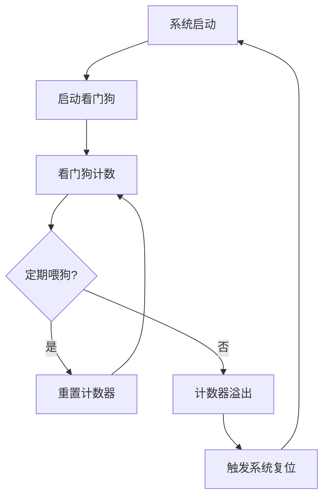

# 看门狗与系统监控


## 学习目标

完成本教程后，你将能够：

- 理解看门狗定时器的工作原理和作用
- 掌握STM32独立看门狗(IWDG)和窗口看门狗(WWDG)的配置与使用
- 能够设计和实现软件看门狗机制
- 掌握系统监控的设计方法和实现技巧
- 了解任务监控和死锁检测技术
- 能够构建完整的系统监控和异常处理系统


## 前置要求

### 知识要求
- 掌握C语言编程
- 了解嵌入式系统基础知识
- 理解定时器工作原理
- 熟悉RTOS基本概念（可选）
- 了解系统可靠性设计原则

### 环境要求
- 开发板：STM32F4系列或类似MCU
- 开发工具：STM32CubeIDE或Keil MDK
- 调试器：ST-Link或J-Link
- RTOS：FreeRTOS（可选，用于任务监控）
- 串口工具：用于查看监控日志


## 准备工作

### 1. 硬件准备

**开发板清单**：
- STM32F407开发板 × 1
- USB数据线 × 1
- ST-Link调试器 × 1
- LED指示灯 × 4（用于状态指示）
- 按键 × 2（用于模拟异常）

**硬件连接**：
```
ST-Link    →    STM32F407
SWDIO      →    SWDIO
SWCLK      →    SWCLK
GND        →    GND
3.3V       →    3.3V

LED1 (绿色) →   PA5  (系统正常运行)
LED2 (黄色) →   PA6  (看门狗警告)
LED3 (红色) →   PA7  (系统复位)
LED4 (蓝色) →   PA8  (任务监控)

KEY1       →    PC13 (模拟死循环)
KEY2       →    PC14 (模拟任务阻塞)
```

### 2. 软件准备

**创建工程**：
1. 使用STM32CubeMX创建新工程
2. 配置系统时钟为168MHz
3. 启用USART1用于日志输出
4. 配置GPIO用于LED和按键
5. 启用IWDG和WWDG
6. 可选：启用FreeRTOS

**配置看门狗**：
```c
// IWDG配置
// 预分频器: 64
// 重载值: 4095
// 超时时间: 约4秒

// WWDG配置
// 预分频器: 8
// 窗口值: 80
// 计数器值: 127
```


## 步骤说明

### 步骤1: 理解看门狗原理

看门狗定时器(Watchdog Timer)是一种硬件定时器，用于检测和恢复系统故障。

#### 1.1 看门狗工作原理



**核心概念**：
- **喂狗(Feed)**：重置看门狗计数器，防止超时
- **超时(Timeout)**：计数器溢出，触发系统复位
- **超时时间**：从启动到触发复位的时间间隔

#### 1.2 看门狗类型

**硬件看门狗**：
- 独立的硬件定时器
- 不受软件影响
- 可靠性高
- 配置相对固定

**软件看门狗**：
- 基于定时器中断实现
- 灵活性高
- 可实现复杂监控逻辑
- 依赖软件正常运行

#### 1.3 STM32看门狗类型

```c
// STM32提供两种硬件看门狗

// 1. 独立看门狗(IWDG - Independent Watchdog)
// - 独立的RC振荡器(LSI)
// - 不受系统时钟影响
// - 适合检测硬件故障
// - 超时时间: 125μs ~ 32s

// 2. 窗口看门狗(WWDG - Window Watchdog)
// - 基于APB1时钟
// - 支持窗口功能
// - 可触发中断
// - 超时时间: 几十μs ~ 几十ms
```


### 步骤2: 实现独立看门狗(IWDG)

IWDG是最常用的看门狗，用于检测系统死机。

#### 2.1 IWDG配置

```c
#include "stm32f4xx_hal.h"

// IWDG句柄
IWDG_HandleTypeDef hiwdg;

/**
 * @brief 初始化独立看门狗
 * @param timeout_ms 超时时间（毫秒）
 * @return HAL状态
 */
HAL_StatusTypeDef iwdg_init(uint32_t timeout_ms) {
    // 1. 配置IWDG参数
    hiwdg.Instance = IWDG;
    hiwdg.Init.Prescaler = IWDG_PRESCALER_64;  // 预分频64
    
    // 2. 计算重载值
    // LSI频率约为32kHz
    // 超时时间 = (4 * 2^预分频) * 重载值 / LSI频率
    // 重载值 = 超时时间 * LSI频率 / (4 * 2^预分频)
    uint32_t reload = (timeout_ms * 32) / (4 * 64);  // 简化计算
    
    if (reload > 4095) {
        reload = 4095;  // 最大值
    }
    
    hiwdg.Init.Reload = reload;
    
    // 3. 初始化IWDG
    if (HAL_IWDG_Init(&hiwdg) != HAL_OK) {
        return HAL_ERROR;
    }
    
    printf("IWDG initialized: timeout=%lu ms, reload=%lu\n", 
           timeout_ms, reload);
    
    return HAL_OK;
}

/**
 * @brief 喂独立看门狗
 */
void iwdg_feed(void) {
    HAL_IWDG_Refresh(&hiwdg);
}

/**
 * @brief 检查是否由看门狗复位
 * @return true: 看门狗复位, false: 其他原因复位
 */
bool iwdg_check_reset(void) {
    if (__HAL_RCC_GET_FLAG(RCC_FLAG_IWDGRST)) {
        // 清除复位标志
        __HAL_RCC_CLEAR_RESET_FLAGS();
        return true;
    }
    return false;
}
```

#### 2.2 IWDG使用示例

```c
/**
 * @brief 主函数示例
 */
int main(void) {
    // 系统初始化
    HAL_Init();
    SystemClock_Config();
    
    // 初始化外设
    MX_GPIO_Init();
    MX_USART1_UART_Init();
    
    // 检查复位原因
    if (iwdg_check_reset()) {
        printf("System reset by IWDG!\n");
        // 点亮红色LED指示
        HAL_GPIO_WritePin(GPIOA, GPIO_PIN_7, GPIO_PIN_SET);
        HAL_Delay(2000);
        HAL_GPIO_WritePin(GPIOA, GPIO_PIN_7, GPIO_PIN_RESET);
    }
    
    // 初始化看门狗（4秒超时）
    iwdg_init(4000);
    
    printf("System started with IWDG\n");
    
    uint32_t counter = 0;
    
    while (1) {
        // 正常工作
        counter++;
        
        // 点亮绿色LED
        HAL_GPIO_TogglePin(GPIOA, GPIO_PIN_5);
        
        // 定期喂狗（每1秒）
        HAL_Delay(1000);
        iwdg_feed();
        
        printf("Running... counter=%lu\n", counter);
        
        // 模拟死循环（按下KEY1）
        if (HAL_GPIO_ReadPin(GPIOC, GPIO_PIN_13) == GPIO_PIN_RESET) {
            printf("Simulating deadlock...\n");
            // 进入死循环，不再喂狗
            while (1) {
                HAL_GPIO_TogglePin(GPIOA, GPIO_PIN_6);  // 黄色LED闪烁
                HAL_Delay(100);
                // 不喂狗，4秒后系统将复位
            }
        }
    }
}
```

#### 2.3 IWDG高级应用

```c
// 看门狗管理器
typedef struct {
    bool enabled;                // 是否启用
    uint32_t timeout_ms;         // 超时时间
    uint32_t last_feed_time;     // 上次喂狗时间
    uint32_t feed_count;         // 喂狗次数
    uint32_t reset_count;        // 复位次数
} iwdg_manager_t;

static iwdg_manager_t g_iwdg_mgr = {0};

/**
 * @brief 初始化看门狗管理器
 * @param timeout_ms 超时时间
 */
void iwdg_manager_init(uint32_t timeout_ms) {
    g_iwdg_mgr.enabled = true;
    g_iwdg_mgr.timeout_ms = timeout_ms;
    g_iwdg_mgr.last_feed_time = HAL_GetTick();
    g_iwdg_mgr.feed_count = 0;
    
    // 读取复位次数（从备份寄存器）
    g_iwdg_mgr.reset_count = HAL_RTCEx_BKUPRead(&hrtc, RTC_BKP_DR0);
    
    // 检查是否由看门狗复位
    if (iwdg_check_reset()) {
        g_iwdg_mgr.reset_count++;
        // 保存复位次数
        HAL_RTCEx_BKUPWrite(&hrtc, RTC_BKP_DR0, g_iwdg_mgr.reset_count);
        
        printf("IWDG reset detected! Total resets: %lu\n", 
               g_iwdg_mgr.reset_count);
    }
    
    // 初始化IWDG
    iwdg_init(timeout_ms);
}

/**
 * @brief 智能喂狗
 * @return true: 成功, false: 失败
 */
bool iwdg_manager_feed(void) {
    if (!g_iwdg_mgr.enabled) {
        return false;
    }
    
    uint32_t current_time = HAL_GetTick();
    uint32_t elapsed = current_time - g_iwdg_mgr.last_feed_time;
    
    // 检查喂狗间隔是否合理
    if (elapsed < (g_iwdg_mgr.timeout_ms / 4)) {
        // 喂狗过于频繁，可能有问题
        printf("Warning: Feeding too frequently (elapsed=%lu ms)\n", elapsed);
    }
    
    if (elapsed > (g_iwdg_mgr.timeout_ms * 3 / 4)) {
        // 喂狗间隔过长，接近超时
        printf("Warning: Feeding too late (elapsed=%lu ms)\n", elapsed);
    }
    
    // 喂狗
    iwdg_feed();
    
    // 更新状态
    g_iwdg_mgr.last_feed_time = current_time;
    g_iwdg_mgr.feed_count++;
    
    return true;
}

/**
 * @brief 获取看门狗统计信息
 */
void iwdg_manager_get_stats(void) {
    printf("\n=== IWDG Statistics ===\n");
    printf("Enabled: %s\n", g_iwdg_mgr.enabled ? "Yes" : "No");
    printf("Timeout: %lu ms\n", g_iwdg_mgr.timeout_ms);
    printf("Feed count: %lu\n", g_iwdg_mgr.feed_count);
    printf("Reset count: %lu\n", g_iwdg_mgr.reset_count);
    printf("Last feed: %lu ms ago\n", 
           HAL_GetTick() - g_iwdg_mgr.last_feed_time);
    printf("======================\n\n");
}
```


### 步骤3: 实现窗口看门狗(WWDG)

WWDG提供窗口功能，要求在特定时间窗口内喂狗。

#### 3.1 WWDG配置

```c
// WWDG句柄
WWDG_HandleTypeDef hwwdg;

/**
 * @brief 初始化窗口看门狗
 * @return HAL状态
 */
HAL_StatusTypeDef wwdg_init(void) {
    // 1. 配置WWDG参数
    hwwdg.Instance = WWDG;
    hwwdg.Init.Prescaler = WWDG_PRESCALER_8;  // 预分频8
    hwwdg.Init.Window = 80;                    // 窗口值
    hwwdg.Init.Counter = 127;                  // 计数器初值
    hwwdg.Init.EWIMode = WWDG_EWI_ENABLE;     // 启用早期唤醒中断
    
    // 2. 初始化WWDG
    if (HAL_WWDG_Init(&hwwdg) != HAL_OK) {
        return HAL_ERROR;
    }
    
    printf("WWDG initialized\n");
    
    return HAL_OK;
}

/**
 * @brief 喂窗口看门狗
 */
void wwdg_feed(void) {
    HAL_WWDG_Refresh(&hwwdg);
}

/**
 * @brief WWDG早期唤醒中断回调
 * @param hwwdg WWDG句柄
 */
void HAL_WWDG_EarlyWakeupCallback(WWDG_HandleTypeDef *hwwdg) {
    // 在中断中喂狗
    HAL_WWDG_Refresh(hwwdg);
    
    // 点亮黄色LED指示
    HAL_GPIO_TogglePin(GPIOA, GPIO_PIN_6);
    
    printf("WWDG early wakeup interrupt\n");
}
```

#### 3.2 WWDG窗口机制

```c
/**
 * @brief WWDG窗口机制说明
 * 
 * 计数器从127递减到63，触发复位
 * 窗口值设为80，表示只能在计数器值 < 80时喂狗
 * 
 * 时间轴：
 * 127 -----> 80 -----> 63 -----> 复位
 *      禁止喂狗   允许喂狗   必须喂狗
 *      
 * 如果在计数器 > 80时喂狗：触发复位（过早喂狗）
 * 如果在计数器 < 63时未喂狗：触发复位（过晚喂狗）
 */

// WWDG窗口管理器
typedef struct {
    uint32_t min_feed_time_ms;   // 最早喂狗时间
    uint32_t max_feed_time_ms;   // 最晚喂狗时间
    uint32_t last_feed_time;     // 上次喂狗时间
    bool in_window;              // 是否在窗口内
} wwdg_window_t;

static wwdg_window_t g_wwdg_window = {0};

/**
 * @brief 初始化WWDG窗口管理
 */
void wwdg_window_init(void) {
    // 计算窗口时间
    // WWDG时钟 = PCLK1 / 4096 / 预分频
    // PCLK1 = 42MHz, 预分频 = 8
    // WWDG时钟 = 42MHz / 4096 / 8 = 1281.74 Hz
    // 计数周期 = 1 / 1281.74 = 0.78 ms
    
    // 从127到80: (127-80) * 0.78 = 36.66 ms (禁止喂狗)
    // 从80到63: (80-63) * 0.78 = 13.26 ms (允许喂狗)
    
    g_wwdg_window.min_feed_time_ms = 37;  // 最早喂狗时间
    g_wwdg_window.max_feed_time_ms = 50;  // 最晚喂狗时间
    g_wwdg_window.last_feed_time = HAL_GetTick();
    g_wwdg_window.in_window = false;
    
    printf("WWDG window: %lu - %lu ms\n",
           g_wwdg_window.min_feed_time_ms,
           g_wwdg_window.max_feed_time_ms);
}

/**
 * @brief 检查是否在喂狗窗口内
 * @return true: 在窗口内, false: 不在窗口内
 */
bool wwdg_window_check(void) {
    uint32_t current_time = HAL_GetTick();
    uint32_t elapsed = current_time - g_wwdg_window.last_feed_time;
    
    if (elapsed >= g_wwdg_window.min_feed_time_ms &&
        elapsed <= g_wwdg_window.max_feed_time_ms) {
        g_wwdg_window.in_window = true;
        return true;
    }
    
    g_wwdg_window.in_window = false;
    return false;
}

/**
 * @brief 智能喂WWDG
 * @return true: 成功, false: 失败
 */
bool wwdg_window_feed(void) {
    if (!wwdg_window_check()) {
        uint32_t elapsed = HAL_GetTick() - g_wwdg_window.last_feed_time;
        
        if (elapsed < g_wwdg_window.min_feed_time_ms) {
            printf("Warning: Too early to feed WWDG (elapsed=%lu ms)\n", elapsed);
            return false;
        }
        
        if (elapsed > g_wwdg_window.max_feed_time_ms) {
            printf("Error: Too late to feed WWDG (elapsed=%lu ms)\n", elapsed);
            // 已经超时，无法挽救
            return false;
        }
    }
    
    // 喂狗
    wwdg_feed();
    g_wwdg_window.last_feed_time = HAL_GetTick();
    
    return true;
}
```


### 步骤4: 实现软件看门狗

软件看门狗提供更灵活的监控机制。

#### 4.1 软件看门狗设计

```c
// 软件看门狗配置
#define SW_WDG_MAX_TASKS    8

// 任务状态
typedef enum {
    TASK_STATE_IDLE = 0,         // 空闲
    TASK_STATE_RUNNING,          // 运行中
    TASK_STATE_BLOCKED,          // 阻塞
    TASK_STATE_TIMEOUT           // 超时
} task_state_t;

// 任务监控信息
typedef struct {
    const char *name;            // 任务名称
    uint32_t timeout_ms;         // 超时时间
    uint32_t last_feed_time;     // 上次喂狗时间
    uint32_t feed_count;         // 喂狗次数
    task_state_t state;          // 任务状态
    bool enabled;                // 是否启用
} sw_wdg_task_t;

// 软件看门狗
typedef struct {
    sw_wdg_task_t tasks[SW_WDG_MAX_TASKS];
    uint8_t task_count;          // 任务数量
    bool enabled;                // 是否启用
    void (*timeout_callback)(uint8_t task_id);  // 超时回调
} sw_watchdog_t;

static sw_watchdog_t g_sw_wdg = {0};

/**
 * @brief 初始化软件看门狗
 * @param timeout_callback 超时回调函数
 */
void sw_wdg_init(void (*timeout_callback)(uint8_t)) {
    memset(&g_sw_wdg, 0, sizeof(sw_watchdog_t));
    g_sw_wdg.enabled = true;
    g_sw_wdg.timeout_callback = timeout_callback;
    
    printf("Software watchdog initialized\n");
}

/**
 * @brief 注册任务到软件看门狗
 * @param name 任务名称
 * @param timeout_ms 超时时间
 * @return 任务ID，-1表示失败
 */
int sw_wdg_register_task(const char *name, uint32_t timeout_ms) {
    if (g_sw_wdg.task_count >= SW_WDG_MAX_TASKS) {
        printf("Error: Too many tasks registered\n");
        return -1;
    }
    
    uint8_t task_id = g_sw_wdg.task_count;
    sw_wdg_task_t *task = &g_sw_wdg.tasks[task_id];
    
    task->name = name;
    task->timeout_ms = timeout_ms;
    task->last_feed_time = HAL_GetTick();
    task->feed_count = 0;
    task->state = TASK_STATE_IDLE;
    task->enabled = true;
    
    g_sw_wdg.task_count++;
    
    printf("Task '%s' registered (ID=%d, timeout=%lu ms)\n",
           name, task_id, timeout_ms);
    
    return task_id;
}

/**
 * @brief 喂软件看门狗
 * @param task_id 任务ID
 */
void sw_wdg_feed(uint8_t task_id) {
    if (task_id >= g_sw_wdg.task_count) {
        return;
    }
    
    sw_wdg_task_t *task = &g_sw_wdg.tasks[task_id];
    
    if (!task->enabled) {
        return;
    }
    
    task->last_feed_time = HAL_GetTick();
    task->feed_count++;
    task->state = TASK_STATE_RUNNING;
}

/**
 * @brief 检查软件看门狗
 * 应在定时器中断或主循环中周期性调用
 */
void sw_wdg_check(void) {
    if (!g_sw_wdg.enabled) {
        return;
    }
    
    uint32_t current_time = HAL_GetTick();
    
    for (uint8_t i = 0; i < g_sw_wdg.task_count; i++) {
        sw_wdg_task_t *task = &g_sw_wdg.tasks[i];
        
        if (!task->enabled) {
            continue;
        }
        
        uint32_t elapsed = current_time - task->last_feed_time;
        
        if (elapsed > task->timeout_ms) {
            // 任务超时
            if (task->state != TASK_STATE_TIMEOUT) {
                task->state = TASK_STATE_TIMEOUT;
                
                printf("Task '%s' timeout! (elapsed=%lu ms)\n",
                       task->name, elapsed);
                
                // 调用超时回调
                if (g_sw_wdg.timeout_callback) {
                    g_sw_wdg.timeout_callback(i);
                }
            }
        }
    }
}

/**
 * @brief 获取任务状态
 * @param task_id 任务ID
 * @return 任务状态
 */
task_state_t sw_wdg_get_task_state(uint8_t task_id) {
    if (task_id >= g_sw_wdg.task_count) {
        return TASK_STATE_IDLE;
    }
    
    return g_sw_wdg.tasks[task_id].state;
}

/**
 * @brief 打印软件看门狗状态
 */
void sw_wdg_print_status(void) {
    printf("\n=== Software Watchdog Status ===\n");
    printf("Enabled: %s\n", g_sw_wdg.enabled ? "Yes" : "No");
    printf("Task count: %d\n\n", g_sw_wdg.task_count);
    
    const char *state_str[] = {"IDLE", "RUNNING", "BLOCKED", "TIMEOUT"};
    
    for (uint8_t i = 0; i < g_sw_wdg.task_count; i++) {
        sw_wdg_task_t *task = &g_sw_wdg.tasks[i];
        uint32_t elapsed = HAL_GetTick() - task->last_feed_time;
        
        printf("Task %d: %s\n", i, task->name);
        printf("  State: %s\n", state_str[task->state]);
        printf("  Timeout: %lu ms\n", task->timeout_ms);
        printf("  Last feed: %lu ms ago\n", elapsed);
        printf("  Feed count: %lu\n", task->feed_count);
        printf("  Enabled: %s\n\n", task->enabled ? "Yes" : "No");
    }
    
    printf("================================\n\n");
}
```

#### 4.2 软件看门狗使用示例

```c
// 任务ID
static int task_main_id = -1;
static int task_sensor_id = -1;
static int task_comm_id = -1;

/**
 * @brief 软件看门狗超时回调
 * @param task_id 超时的任务ID
 */
void sw_wdg_timeout_handler(uint8_t task_id) {
    printf("Handling timeout for task %d\n", task_id);
    
    // 根据任务ID采取不同的恢复措施
    if (task_id == task_sensor_id) {
        // 传感器任务超时，尝试重新初始化传感器
        printf("Reinitializing sensor...\n");
        sensor_init();
    }
    else if (task_id == task_comm_id) {
        // 通信任务超时，尝试重新建立连接
        printf("Reconnecting communication...\n");
        comm_reconnect();
    }
    else {
        // 其他任务超时，记录日志
        printf("Task timeout logged\n");
    }
}

/**
 * @brief 主函数示例
 */
int main(void) {
    // 系统初始化
    HAL_Init();
    SystemClock_Config();
    MX_GPIO_Init();
    MX_USART1_UART_Init();
    
    // 初始化软件看门狗
    sw_wdg_init(sw_wdg_timeout_handler);
    
    // 注册任务
    task_main_id = sw_wdg_register_task("Main", 5000);
    task_sensor_id = sw_wdg_register_task("Sensor", 2000);
    task_comm_id = sw_wdg_register_task("Communication", 3000);
    
    uint32_t last_check_time = HAL_GetTick();
    
    while (1) {
        // 主任务工作
        HAL_GPIO_TogglePin(GPIOA, GPIO_PIN_5);
        
        // 喂主任务看门狗
        sw_wdg_feed(task_main_id);
        
        // 模拟传感器任务
        if ((HAL_GetTick() % 1000) < 100) {
            sw_wdg_feed(task_sensor_id);
        }
        
        // 模拟通信任务
        if ((HAL_GetTick() % 1500) < 100) {
            sw_wdg_feed(task_comm_id);
        }
        
        // 周期性检查软件看门狗（每100ms）
        if ((HAL_GetTick() - last_check_time) >= 100) {
            sw_wdg_check();
            last_check_time = HAL_GetTick();
        }
        
        // 打印状态（每5秒）
        static uint32_t last_print_time = 0;
        if ((HAL_GetTick() - last_print_time) >= 5000) {
            sw_wdg_print_status();
            last_print_time = HAL_GetTick();
        }
        
        HAL_Delay(50);
    }
}
```


### 步骤5: 实现系统监控

完整的系统监控包括CPU使用率、内存使用、任务状态等。

#### 5.1 CPU使用率监控

```c
// CPU使用率监控
typedef struct {
    uint32_t idle_count;         // 空闲计数
    uint32_t total_count;        // 总计数
    float cpu_usage;             // CPU使用率(%)
    uint32_t last_update_time;   // 上次更新时间
} cpu_monitor_t;

static cpu_monitor_t g_cpu_monitor = {0};

/**
 * @brief 初始化CPU监控
 */
void cpu_monitor_init(void) {
    memset(&g_cpu_monitor, 0, sizeof(cpu_monitor_t));
    g_cpu_monitor.last_update_time = HAL_GetTick();
    
    printf("CPU monitor initialized\n");
}

/**
 * @brief 更新CPU使用率
 * 在空闲任务中调用
 */
void cpu_monitor_idle_hook(void) {
    g_cpu_monitor.idle_count++;
}

/**
 * @brief 计算CPU使用率
 * 周期性调用（如每秒）
 */
void cpu_monitor_update(void) {
    uint32_t current_time = HAL_GetTick();
    uint32_t elapsed = current_time - g_cpu_monitor.last_update_time;
    
    if (elapsed < 1000) {
        return;  // 至少1秒更新一次
    }
    
    // 计算总计数（假设每次循环1us）
    g_cpu_monitor.total_count = elapsed * 1000;
    
    // 计算CPU使用率
    if (g_cpu_monitor.total_count > 0) {
        g_cpu_monitor.cpu_usage = 
            100.0f * (1.0f - (float)g_cpu_monitor.idle_count / 
                            g_cpu_monitor.total_count);
    }
    
    // 重置计数器
    g_cpu_monitor.idle_count = 0;
    g_cpu_monitor.last_update_time = current_time;
}

/**
 * @brief 获取CPU使用率
 * @return CPU使用率(%)
 */
float cpu_monitor_get_usage(void) {
    return g_cpu_monitor.cpu_usage;
}
```

#### 5.2 内存使用监控

```c
// 内存监控
typedef struct {
    uint32_t total_heap;         // 总堆大小
    uint32_t used_heap;          // 已用堆大小
    uint32_t free_heap;          // 空闲堆大小
    uint32_t peak_usage;         // 峰值使用
    uint32_t alloc_count;        // 分配次数
    uint32_t free_count;         // 释放次数
} memory_monitor_t;

static memory_monitor_t g_mem_monitor = {0};

/**
 * @brief 初始化内存监控
 * @param total_heap 总堆大小
 */
void memory_monitor_init(uint32_t total_heap) {
    g_mem_monitor.total_heap = total_heap;
    g_mem_monitor.used_heap = 0;
    g_mem_monitor.free_heap = total_heap;
    g_mem_monitor.peak_usage = 0;
    g_mem_monitor.alloc_count = 0;
    g_mem_monitor.free_count = 0;
    
    printf("Memory monitor initialized (total=%lu bytes)\n", total_heap);
}

/**
 * @brief 记录内存分配
 * @param size 分配大小
 */
void memory_monitor_alloc(uint32_t size) {
    g_mem_monitor.used_heap += size;
    g_mem_monitor.free_heap -= size;
    g_mem_monitor.alloc_count++;
    
    // 更新峰值
    if (g_mem_monitor.used_heap > g_mem_monitor.peak_usage) {
        g_mem_monitor.peak_usage = g_mem_monitor.used_heap;
    }
}

/**
 * @brief 记录内存释放
 * @param size 释放大小
 */
void memory_monitor_free(uint32_t size) {
    g_mem_monitor.used_heap -= size;
    g_mem_monitor.free_heap += size;
    g_mem_monitor.free_count++;
}

/**
 * @brief 获取内存使用率
 * @return 内存使用率(%)
 */
float memory_monitor_get_usage(void) {
    return 100.0f * g_mem_monitor.used_heap / g_mem_monitor.total_heap;
}

/**
 * @brief 打印内存监控信息
 */
void memory_monitor_print(void) {
    printf("\n=== Memory Monitor ===\n");
    printf("Total: %lu bytes\n", g_mem_monitor.total_heap);
    printf("Used: %lu bytes (%.1f%%)\n", 
           g_mem_monitor.used_heap,
           memory_monitor_get_usage());
    printf("Free: %lu bytes\n", g_mem_monitor.free_heap);
    printf("Peak: %lu bytes (%.1f%%)\n",
           g_mem_monitor.peak_usage,
           100.0f * g_mem_monitor.peak_usage / g_mem_monitor.total_heap);
    printf("Alloc count: %lu\n", g_mem_monitor.alloc_count);
    printf("Free count: %lu\n", g_mem_monitor.free_count);
    printf("======================\n\n");
}
```

#### 5.3 栈溢出检测

```c
// 栈溢出检测
#define STACK_CANARY    0xDEADBEEF

/**
 * @brief 初始化栈保护
 * @param stack_bottom 栈底地址
 * @param stack_size 栈大小
 */
void stack_guard_init(uint32_t *stack_bottom, uint32_t stack_size) {
    // 在栈底放置金丝雀值
    *stack_bottom = STACK_CANARY;
    
    printf("Stack guard initialized at 0x%08lX\n", (uint32_t)stack_bottom);
}

/**
 * @brief 检查栈是否溢出
 * @param stack_bottom 栈底地址
 * @return true: 溢出, false: 正常
 */
bool stack_guard_check(uint32_t *stack_bottom) {
    if (*stack_bottom != STACK_CANARY) {
        printf("Stack overflow detected!\n");
        printf("Expected: 0x%08X, Got: 0x%08lX\n", 
               STACK_CANARY, *stack_bottom);
        return true;
    }
    return false;
}

/**
 * @brief 获取栈使用情况
 * @param stack_bottom 栈底地址
 * @param stack_top 栈顶地址
 * @param stack_size 栈大小
 * @return 栈使用率(%)
 */
float stack_get_usage(uint32_t *stack_bottom, uint32_t *stack_top, 
                     uint32_t stack_size) {
    uint32_t used = (uint32_t)stack_top - (uint32_t)stack_bottom;
    return 100.0f * used / stack_size;
}
```


### 步骤6: 综合应用示例

将所有监控机制整合到一个完整的系统中。

#### 6.1 系统监控管理器

```c
// 系统监控管理器
typedef struct {
    bool iwdg_enabled;           // IWDG启用
    bool wwdg_enabled;           // WWDG启用
    bool sw_wdg_enabled;         // 软件看门狗启用
    bool cpu_monitor_enabled;    // CPU监控启用
    bool mem_monitor_enabled;    // 内存监控启用
    uint32_t monitor_interval_ms; // 监控间隔
    uint32_t last_monitor_time;  // 上次监控时间
} system_monitor_t;

static system_monitor_t g_sys_monitor = {0};

/**
 * @brief 初始化系统监控
 */
void system_monitor_init(void) {
    printf("\n=== System Monitor Initialization ===\n");
    
    // 1. 初始化IWDG
    g_sys_monitor.iwdg_enabled = true;
    iwdg_manager_init(4000);
    
    // 2. 初始化软件看门狗
    g_sys_monitor.sw_wdg_enabled = true;
    sw_wdg_init(sw_wdg_timeout_handler);
    
    // 3. 初始化CPU监控
    g_sys_monitor.cpu_monitor_enabled = true;
    cpu_monitor_init();
    
    // 4. 初始化内存监控
    g_sys_monitor.mem_monitor_enabled = true;
    memory_monitor_init(128 * 1024);  // 128KB堆
    
    // 5. 设置监控间隔
    g_sys_monitor.monitor_interval_ms = 1000;  // 1秒
    g_sys_monitor.last_monitor_time = HAL_GetTick();
    
    printf("System monitor initialized\n");
    printf("=====================================\n\n");
}

/**
 * @brief 系统监控任务
 * 周期性调用
 */
void system_monitor_task(void) {
    uint32_t current_time = HAL_GetTick();
    
    // 检查是否到达监控间隔
    if ((current_time - g_sys_monitor.last_monitor_time) < 
        g_sys_monitor.monitor_interval_ms) {
        return;
    }
    
    g_sys_monitor.last_monitor_time = current_time;
    
    // 1. 喂硬件看门狗
    if (g_sys_monitor.iwdg_enabled) {
        iwdg_manager_feed();
    }
    
    // 2. 检查软件看门狗
    if (g_sys_monitor.sw_wdg_enabled) {
        sw_wdg_check();
    }
    
    // 3. 更新CPU使用率
    if (g_sys_monitor.cpu_monitor_enabled) {
        cpu_monitor_update();
    }
    
    // 4. 检查内存使用
    if (g_sys_monitor.mem_monitor_enabled) {
        float mem_usage = memory_monitor_get_usage();
        if (mem_usage > 80.0f) {
            printf("Warning: High memory usage (%.1f%%)\n", mem_usage);
        }
    }
}

/**
 * @brief 打印系统监控报告
 */
void system_monitor_report(void) {
    printf("\n========== System Monitor Report ==========\n");
    printf("Uptime: %lu seconds\n", HAL_GetTick() / 1000);
    
    // IWDG状态
    if (g_sys_monitor.iwdg_enabled) {
        iwdg_manager_get_stats();
    }
    
    // 软件看门狗状态
    if (g_sys_monitor.sw_wdg_enabled) {
        sw_wdg_print_status();
    }
    
    // CPU使用率
    if (g_sys_monitor.cpu_monitor_enabled) {
        printf("CPU Usage: %.1f%%\n", cpu_monitor_get_usage());
    }
    
    // 内存使用
    if (g_sys_monitor.mem_monitor_enabled) {
        memory_monitor_print();
    }
    
    printf("===========================================\n\n");
}
```

#### 6.2 完整示例程序

```c
/**
 * @brief 主函数 - 完整示例
 */
int main(void) {
    // 1. 系统初始化
    HAL_Init();
    SystemClock_Config();
    MX_GPIO_Init();
    MX_USART1_UART_Init();
    
    printf("\n\n");
    printf("========================================\n");
    printf("  Watchdog & System Monitor Demo\n");
    printf("========================================\n\n");
    
    // 2. 初始化系统监控
    system_monitor_init();
    
    // 3. 注册监控任务
    int task_main = sw_wdg_register_task("Main Loop", 5000);
    int task_sensor = sw_wdg_register_task("Sensor Read", 2000);
    int task_comm = sw_wdg_register_task("Communication", 3000);
    
    // 4. 主循环
    uint32_t loop_count = 0;
    uint32_t last_report_time = HAL_GetTick();
    
    while (1) {
        loop_count++;
        
        // 喂主任务看门狗
        sw_wdg_feed(task_main);
        
        // 模拟传感器读取任务
        if ((loop_count % 10) == 0) {
            sw_wdg_feed(task_sensor);
            // 读取传感器...
        }
        
        // 模拟通信任务
        if ((loop_count % 15) == 0) {
            sw_wdg_feed(task_comm);
            // 发送数据...
        }
        
        // 执行系统监控任务
        system_monitor_task();
        
        // 定期打印监控报告（每10秒）
        if ((HAL_GetTick() - last_report_time) >= 10000) {
            system_monitor_report();
            last_report_time = HAL_GetTick();
        }
        
        // 检查按键
        if (HAL_GPIO_ReadPin(GPIOC, GPIO_PIN_13) == GPIO_PIN_RESET) {
            printf("\n!!! Simulating system hang !!!\n");
            printf("System will reset in 4 seconds...\n\n");
            
            // 模拟死循环，不喂狗
            while (1) {
                HAL_GPIO_TogglePin(GPIOA, GPIO_PIN_7);  // 红色LED闪烁
                HAL_Delay(100);
            }
        }
        
        // 正常运行指示
        HAL_GPIO_TogglePin(GPIOA, GPIO_PIN_5);  // 绿色LED闪烁
        
        HAL_Delay(100);
    }
}
```


## 验证方法

### 1. IWDG功能验证

**测试步骤**：
1. 编译并下载程序到开发板
2. 观察绿色LED正常闪烁
3. 按下KEY1按键，模拟死循环
4. 观察黄色LED开始闪烁
5. 等待约4秒，系统自动复位
6. 观察红色LED点亮2秒，表示检测到看门狗复位
7. 系统恢复正常运行

**预期结果**：
```
System started with IWDG
IWDG initialized: timeout=4000 ms, reload=2000
Running... counter=1
Running... counter=2
Running... counter=3
Simulating deadlock...
[系统复位]
System reset by IWDG!
System started with IWDG
Running... counter=1
...
```

### 2. 软件看门狗验证

**测试步骤**：
1. 观察串口输出的任务状态
2. 所有任务应该正常喂狗
3. 按下KEY2按键，模拟任务阻塞
4. 观察软件看门狗检测到超时
5. 查看超时回调是否被调用
6. 验证恢复措施是否执行

**预期结果**：
```
Task 'Main Loop' registered (ID=0, timeout=5000 ms)
Task 'Sensor Read' registered (ID=1, timeout=2000 ms)
Task 'Communication' registered (ID=2, timeout=3000 ms)

=== Software Watchdog Status ===
Task 0: Main Loop
  State: RUNNING
  Last feed: 100 ms ago
  
Task 1: Sensor Read
  State: RUNNING
  Last feed: 500 ms ago
  
Task 2: Communication
  State: TIMEOUT
  Last feed: 3200 ms ago
  
Handling timeout for task 2
Reconnecting communication...
```

### 3. 系统监控验证

**测试步骤**：
1. 运行程序10秒
2. 观察系统监控报告
3. 验证CPU使用率是否合理
4. 验证内存使用是否正常
5. 验证看门狗统计信息

**预期结果**：
```
========== System Monitor Report ==========
Uptime: 10 seconds

=== IWDG Statistics ===
Enabled: Yes
Timeout: 4000 ms
Feed count: 10
Reset count: 0
Last feed: 100 ms ago

CPU Usage: 25.3%

=== Memory Monitor ===
Total: 131072 bytes
Used: 2048 bytes (1.6%)
Free: 129024 bytes
Peak: 2048 bytes (1.6%)
```


## 故障排除

### 问题1: 看门狗频繁复位

**现象**：系统不断复位，无法正常运行

**可能原因**：
1. 超时时间设置过短
2. 主循环执行时间过长
3. 中断处理时间过长
4. 喂狗位置不合理

**解决方法**：
```c
// 1. 增加超时时间
iwdg_manager_init(8000);  // 从4秒增加到8秒

// 2. 优化主循环
while (1) {
    // 将耗时操作分解为多个步骤
    process_step1();
    iwdg_feed();  // 中间喂狗
    
    process_step2();
    iwdg_feed();  // 再次喂狗
    
    process_step3();
    iwdg_feed();  // 最后喂狗
}

// 3. 在长时间中断中喂狗
void HAL_UART_RxCpltCallback(UART_HandleTypeDef *huart) {
    // 处理接收数据
    process_rx_data();
    
    // 如果处理时间长，喂狗
    iwdg_feed();
}
```

### 问题2: 软件看门狗误报

**现象**：任务正常运行，但软件看门狗报告超时

**可能原因**：
1. 超时时间设置不合理
2. 任务执行时间不稳定
3. 系统时钟不准确

**解决方法**：
```c
// 1. 调整超时时间
// 超时时间应该是任务最大执行时间的2-3倍
int task_id = sw_wdg_register_task("Sensor", 5000);  // 增加裕量

// 2. 添加时间统计
uint32_t start_time = HAL_GetTick();
sensor_read();
uint32_t elapsed = HAL_GetTick() - start_time;
printf("Sensor read time: %lu ms\n", elapsed);

// 3. 动态调整超时时间
if (elapsed > task_timeout * 0.8) {
    printf("Warning: Task execution time close to timeout\n");
}
```

### 问题3: WWDG窗口配置错误

**现象**：WWDG频繁触发复位

**可能原因**：
1. 窗口时间计算错误
2. 喂狗时机不对
3. 系统时钟配置错误

**解决方法**：
```c
// 1. 重新计算窗口时间
// WWDG时钟 = PCLK1 / 4096 / 预分频
uint32_t pclk1 = HAL_RCC_GetPCLK1Freq();
uint32_t wwdg_clk = pclk1 / 4096 / 8;
float period_ms = 1000.0f / wwdg_clk;

printf("WWDG clock: %lu Hz\n", wwdg_clk);
printf("Period: %.2f ms\n", period_ms);

// 2. 使用定时器精确喂狗
void TIM_PeriodElapsedCallback(TIM_HandleTypeDef *htim) {
    if (htim->Instance == TIM2) {
        // 在定时器中断中喂WWDG
        wwdg_window_feed();
    }
}
```

### 问题4: 内存监控不准确

**现象**：内存使用统计与实际不符

**可能原因**：
1. 未正确记录所有分配和释放
2. 存在内存泄漏
3. 栈和堆混淆

**解决方法**：
```c
// 1. 重载malloc和free
void *monitored_malloc(size_t size) {
    void *ptr = malloc(size);
    if (ptr) {
        memory_monitor_alloc(size);
    }
    return ptr;
}

void monitored_free(void *ptr, size_t size) {
    if (ptr) {
        memory_monitor_free(size);
        free(ptr);
    }
}

// 2. 使用内存池
typedef struct {
    uint8_t pool[1024];
    uint32_t used;
} memory_pool_t;

void* pool_alloc(memory_pool_t *pool, size_t size) {
    if (pool->used + size > sizeof(pool->pool)) {
        return NULL;
    }
    void *ptr = &pool->pool[pool->used];
    pool->used += size;
    memory_monitor_alloc(size);
    return ptr;
}
```


## 总结

### 学习要点回顾

1. **看门狗原理**：
   - 看门狗是系统可靠性的最后一道防线
   - 通过定期喂狗防止系统死机
   - 超时后自动复位系统

2. **硬件看门狗**：
   - IWDG：独立时钟，可靠性高
   - WWDG：窗口功能，更灵活
   - 两者可以配合使用

3. **软件看门狗**：
   - 监控多个任务
   - 灵活的超时处理
   - 可实现复杂的监控逻辑

4. **系统监控**：
   - CPU使用率监控
   - 内存使用监控
   - 栈溢出检测
   - 综合监控报告

### 最佳实践

1. **看门狗配置**：
   - 超时时间应该是正常执行时间的2-3倍
   - 在关键位置喂狗
   - 避免在中断中长时间不喂狗

2. **监控策略**：
   - 硬件看门狗用于检测系统级故障
   - 软件看门狗用于监控任务级故障
   - 定期生成监控报告

3. **故障处理**：
   - 记录复位原因
   - 保存关键数据
   - 实施分级恢复策略

4. **调试技巧**：
   - 使用LED指示系统状态
   - 通过串口输出调试信息
   - 记录看门狗统计信息


## 下一步

完成本教程后，建议继续学习：

1. **冗余设计与容错技术**：
   - 学习如何设计冗余系统
   - 掌握故障切换机制
   - 了解N版本编程

2. **高可靠性系统设计**：
   - 综合应用各种可靠性技术
   - 设计完整的高可靠性系统
   - 进行可靠性测试和验证

3. **安全通信协议**：
   - 学习TLS/DTLS协议
   - 实现安全的通信机制
   - 防止通信攻击

4. **ISO 26262汽车功能安全**：
   - 了解汽车安全标准
   - 学习ASIL等级划分
   - 掌握安全开发流程


## 延伸阅读

### 官方文档
- [STM32F4 Reference Manual](https://www.st.com/resource/en/reference_manual/dm00031020.pdf) - IWDG和WWDG章节
- [AN4435: Using the IWDG and WWDG](https://www.st.com/resource/en/application_note/dm00113801.pdf)

### 技术文章
- "Watchdog Timers in Embedded Systems" - 看门狗定时器详解
- "System Monitoring Best Practices" - 系统监控最佳实践
- "Fault Detection and Recovery Strategies" - 故障检测与恢复策略

### 相关标准
- IEC 61508 - 功能安全标准
- ISO 26262 - 汽车功能安全标准
- DO-178C - 航空软件安全标准

### 开源项目
- FreeRTOS - 包含任务监控示例
- Zephyr RTOS - 完整的看门狗驱动
- NuttX - 系统监控实现参考

---

**版本历史**：
- v1.0 (2024-01-15): 初始版本

**作者**: 嵌入式知识平台  
**最后更新**: 2024-01-15

