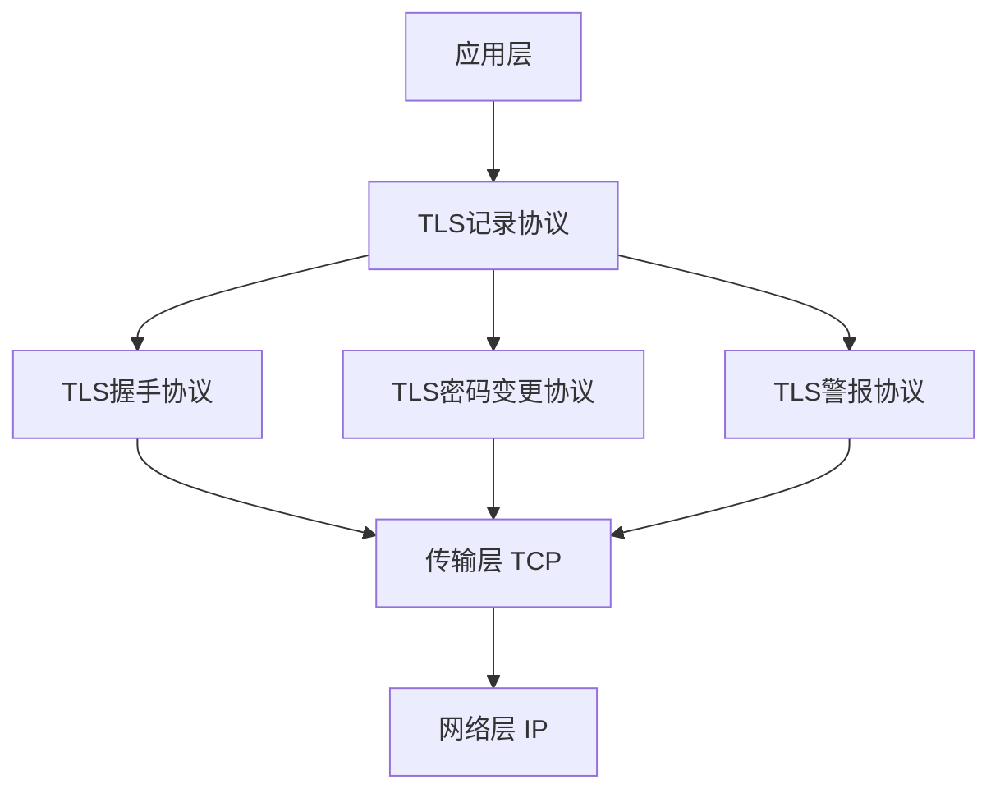
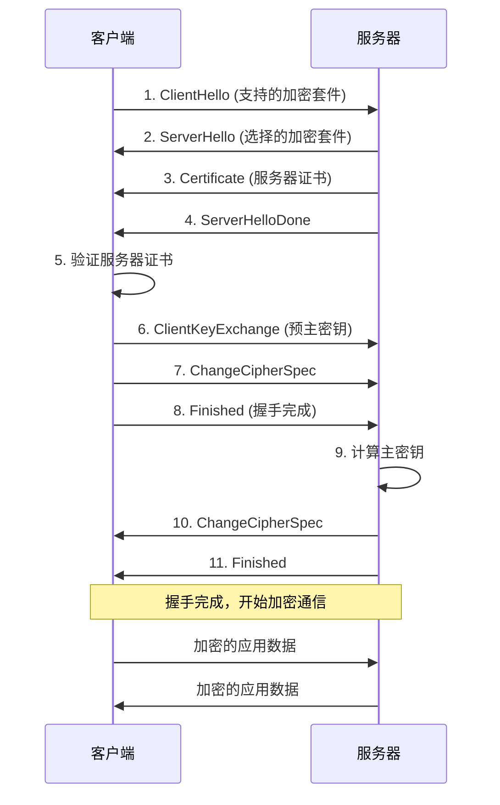

# 安全通信协议实现


## 学习目标

完成本教程后，你将能够：

- 理解TLS/SSL和DTLS协议的工作原理和安全机制
- 掌握mbedTLS库在嵌入式系统中的配置和使用
- 能够实现基于TLS的安全TCP通信
- 能够实现基于DTLS的安全UDP通信
- 掌握数字证书的生成、管理和验证方法
- 了解安全通信的性能优化和资源管理技巧
- 能够构建完整的安全通信系统


## 前置要求

### 知识要求
- 掌握C语言编程
- 了解TCP/IP网络协议栈
- 理解对称加密和非对称加密原理
- 熟悉数字证书和PKI体系
- 了解哈希算法和数字签名

### 环境要求
- 开发板：STM32F4系列或ESP32（支持网络）
- 开发工具：STM32CubeIDE或ESP-IDF
- 网络环境：以太网或WiFi连接
- 测试工具：OpenSSL命令行工具
- 抓包工具：Wireshark（用于分析加密流量）


## 准备工作

### 1. 硬件准备

**开发板清单**：
- STM32F407开发板 + W5500以太网模块 或 ESP32开发板 × 1
- USB数据线 × 1
- 网线 × 1（如使用以太网）
- 路由器 × 1

**硬件连接**（STM32 + W5500）：
```
W5500      →    STM32F407
MOSI       →    PA7 (SPI1_MOSI)
MISO       →    PA6 (SPI1_MISO)
SCK        →    PA5 (SPI1_SCK)
CS         →    PA4 (SPI1_NSS)
RST        →    PC4
INT        →    PC5
3.3V       →    3.3V
GND        →    GND
```

### 2. 软件准备

**安装mbedTLS库**：

对于STM32项目：
```bash
# 下载mbedTLS源码
git clone https://github.com/ARMmbed/mbedtls.git
cd mbedtls
git checkout mbedtls-2.28

# 将以下文件添加到项目：
# - mbedtls/library/*.c
# - mbedtls/include/mbedtls/*.h
```

对于ESP32项目：
```bash
# ESP-IDF已经包含mbedTLS
# 在menuconfig中启用：
# Component config → mbedTLS → Enable mbedTLS
```

**生成测试证书**：
```bash
# 生成CA私钥
openssl genrsa -out ca_key.pem 2048

# 生成CA证书
openssl req -new -x509 -days 3650 -key ca_key.pem -out ca_cert.pem \
  -subj "/C=CN/ST=Beijing/L=Beijing/O=Test/CN=Test CA"

# 生成服务器私钥
openssl genrsa -out server_key.pem 2048

# 生成服务器证书请求
openssl req -new -key server_key.pem -out server_csr.pem \
  -subj "/C=CN/ST=Beijing/L=Beijing/O=Test/CN=192.168.1.100"

# 签发服务器证书
openssl x509 -req -days 365 -in server_csr.pem \
  -CA ca_cert.pem -CAkey ca_key.pem -CAcreateserial \
  -out server_cert.pem

# 生成客户端私钥和证书（可选，用于双向认证）
openssl genrsa -out client_key.pem 2048
openssl req -new -key client_key.pem -out client_csr.pem \
  -subj "/C=CN/ST=Beijing/L=Beijing/O=Test/CN=Client"
openssl x509 -req -days 365 -in client_csr.pem \
  -CA ca_cert.pem -CAkey ca_key.pem -CAcreateserial \
  -out client_cert.pem
```


## 步骤说明

### 步骤1: 理解TLS/SSL协议原理

TLS(Transport Layer Security)和SSL(Secure Sockets Layer)是保护网络通信安全的加密协议。

#### 1.1 TLS协议架构



**核心组件**：
- **记录协议(Record Protocol)**：提供数据加密、完整性保护和压缩
- **握手协议(Handshake Protocol)**：协商加密参数、认证通信双方
- **密码变更协议(Change Cipher Spec)**：通知对方切换加密算法
- **警报协议(Alert Protocol)**：传递错误和警告信息

#### 1.2 TLS握手流程



**握手过程详解**：

1. **ClientHello**：客户端发送支持的TLS版本、加密套件列表、随机数
2. **ServerHello**：服务器选择TLS版本和加密套件，发送随机数
3. **Certificate**：服务器发送数字证书（包含公钥）
4. **ServerHelloDone**：服务器握手消息发送完毕
5. **证书验证**：客户端验证服务器证书的有效性
6. **ClientKeyExchange**：客户端生成预主密钥，用服务器公钥加密后发送
7. **ChangeCipherSpec**：客户端通知切换到加密模式
8. **Finished**：客户端发送握手完成消息（已加密）
9. **密钥计算**：服务器用私钥解密预主密钥，计算主密钥
10. **ChangeCipherSpec**：服务器通知切换到加密模式
11. **Finished**：服务器发送握手完成消息（已加密）

#### 1.3 DTLS协议特点

DTLS(Datagram TLS)是TLS在UDP上的实现，主要特点：

```c
// DTLS vs TLS 对比

// TLS特点：
// - 基于TCP，可靠传输
// - 有序数据流
// - 连接导向
// - 适合：HTTPS、FTPS、SMTPS

// DTLS特点：
// - 基于UDP，不可靠传输
// - 无序数据报
// - 无连接
// - 增加了重传和排序机制
// - 适合：VoIP、视频流、IoT设备
```

**DTLS关键机制**：
- **记录序列号**：防止重放攻击
- **握手重传**：处理UDP丢包
- **分片重组**：处理大消息
- **Cookie机制**：防止DoS攻击


### 步骤2: 配置mbedTLS库

mbedTLS是一个轻量级的TLS/SSL库，适合嵌入式系统。

#### 2.1 mbedTLS配置文件

创建 `mbedtls_config.h`：

```c
#ifndef MBEDTLS_CONFIG_H
#define MBEDTLS_CONFIG_H

// 1. 系统配置
#define MBEDTLS_PLATFORM_C
#define MBEDTLS_PLATFORM_MEMORY
#define MBEDTLS_MEMORY_BUFFER_ALLOC_C

// 2. 加密算法
#define MBEDTLS_AES_C                    // AES加密
#define MBEDTLS_SHA256_C                 // SHA-256哈希
#define MBEDTLS_MD_C                     // 消息摘要
#define MBEDTLS_CIPHER_C                 // 密码算法

// 3. 公钥算法
#define MBEDTLS_RSA_C                    // RSA算法
#define MBEDTLS_PK_C                     // 公钥抽象层
#define MBEDTLS_PK_PARSE_C               // 公钥解析
#define MBEDTLS_BIGNUM_C                 // 大数运算

// 4. X.509证书
#define MBEDTLS_X509_USE_C               // X.509证书
#define MBEDTLS_X509_CRT_PARSE_C         // 证书解析
#define MBEDTLS_ASN1_PARSE_C             // ASN.1解析
#define MBEDTLS_ASN1_WRITE_C             // ASN.1写入
#define MBEDTLS_OID_C                    // OID支持

// 5. TLS/SSL
#define MBEDTLS_SSL_TLS_C                // TLS核心
#define MBEDTLS_SSL_CLI_C                // TLS客户端
#define MBEDTLS_SSL_SRV_C                // TLS服务器
#define MBEDTLS_SSL_PROTO_TLS1_2         // TLS 1.2

// 6. DTLS支持（可选）
#define MBEDTLS_SSL_PROTO_DTLS           // DTLS协议
#define MBEDTLS_SSL_DTLS_ANTI_REPLAY     // 防重放
#define MBEDTLS_SSL_DTLS_HELLO_VERIFY    // Hello验证

// 7. 随机数生成
#define MBEDTLS_ENTROPY_C                // 熵源
#define MBEDTLS_CTR_DRBG_C               // 随机数生成器

// 8. 网络支持
#define MBEDTLS_NET_C                    // 网络抽象层

// 9. 调试支持
#define MBEDTLS_DEBUG_C                  // 调试输出
#define MBEDTLS_ERROR_C                  // 错误字符串

// 10. 性能优化
#define MBEDTLS_AES_ROM_TABLES           // 使用ROM表
#define MBEDTLS_SSL_MAX_CONTENT_LEN 4096 // 最大内容长度

// 11. 内存配置
#define MBEDTLS_MEM_ALLOC   pvPortMalloc  // 使用FreeRTOS内存分配
#define MBEDTLS_MEM_FREE    vPortFree

#include "mbedtls/check_config.h"

#endif /* MBEDTLS_CONFIG_H */
```

#### 2.2 mbedTLS初始化

```c
#include "mbedtls/platform.h"
#include "mbedtls/net_sockets.h"
#include "mbedtls/ssl.h"
#include "mbedtls/entropy.h"
#include "mbedtls/ctr_drbg.h"
#include "mbedtls/error.h"
#include "mbedtls/debug.h"

// mbedTLS上下文
typedef struct {
    mbedtls_entropy_context entropy;      // 熵源
    mbedtls_ctr_drbg_context ctr_drbg;   // 随机数生成器
    mbedtls_ssl_context ssl;              // SSL上下文
    mbedtls_ssl_config conf;              // SSL配置
    mbedtls_x509_crt cacert;              // CA证书
    mbedtls_x509_crt clicert;             // 客户端证书（可选）
    mbedtls_pk_context pkey;              // 私钥（可选）
    mbedtls_net_context server_fd;        // 网络连接
} tls_context_t;

static tls_context_t g_tls_ctx;

/**
 * @brief 调试回调函数
 * @param ctx 上下文
 * @param level 调试级别
 * @param file 文件名
 * @param line 行号
 * @param str 调试信息
 */
static void tls_debug_callback(void *ctx, int level,
                               const char *file, int line,
                               const char *str) {
    printf("%s:%04d: %s", file, line, str);
}

/**
 * @brief 初始化mbedTLS
 * @return 0: 成功, 负数: 错误码
 */
int tls_init(void) {
    int ret;
    const char *pers = "tls_client";
    
    printf("Initializing mbedTLS...\n");
    
    // 1. 初始化上下文
    mbedtls_net_init(&g_tls_ctx.server_fd);
    mbedtls_ssl_init(&g_tls_ctx.ssl);
    mbedtls_ssl_config_init(&g_tls_ctx.conf);
    mbedtls_x509_crt_init(&g_tls_ctx.cacert);
    mbedtls_x509_crt_init(&g_tls_ctx.clicert);
    mbedtls_pk_init(&g_tls_ctx.pkey);
    mbedtls_ctr_drbg_init(&g_tls_ctx.ctr_drbg);
    mbedtls_entropy_init(&g_tls_ctx.entropy);
    
    // 2. 初始化随机数生成器
    ret = mbedtls_ctr_drbg_seed(&g_tls_ctx.ctr_drbg,
                                mbedtls_entropy_func,
                                &g_tls_ctx.entropy,
                                (const unsigned char *)pers,
                                strlen(pers));
    if (ret != 0) {
        printf("mbedtls_ctr_drbg_seed failed: -0x%04x\n", -ret);
        return ret;
    }
    
    printf("mbedTLS initialized successfully\n");
    
    return 0;
}

/**
 * @brief 清理mbedTLS资源
 */
void tls_cleanup(void) {
    mbedtls_net_free(&g_tls_ctx.server_fd);
    mbedtls_x509_crt_free(&g_tls_ctx.cacert);
    mbedtls_x509_crt_free(&g_tls_ctx.clicert);
    mbedtls_pk_free(&g_tls_ctx.pkey);
    mbedtls_ssl_free(&g_tls_ctx.ssl);
    mbedtls_ssl_config_free(&g_tls_ctx.conf);
    mbedtls_ctr_drbg_free(&g_tls_ctx.ctr_drbg);
    mbedtls_entropy_free(&g_tls_ctx.entropy);
    
    printf("mbedTLS cleaned up\n");
}
```


### 步骤3: 实现TLS客户端

实现一个完整的TLS客户端，连接到HTTPS服务器。

#### 3.1 加载证书

```c
// CA证书（PEM格式）
const char *ca_cert_pem = 
"-----BEGIN CERTIFICATE-----\n"
"MIIDXTCCAkWgAwIBAgIJAKL0UG+mRKSzMA0GCSqGSIb3DQEBCwUAMEUxCzAJBgNV\n"
// ... 证书内容 ...
"-----END CERTIFICATE-----\n";

/**
 * @brief 加载CA证书
 * @return 0: 成功, 负数: 错误码
 */
int tls_load_ca_cert(void) {
    int ret;
    
    printf("Loading CA certificate...\n");
    
    // 解析CA证书
    ret = mbedtls_x509_crt_parse(&g_tls_ctx.cacert,
                                 (const unsigned char *)ca_cert_pem,
                                 strlen(ca_cert_pem) + 1);
    if (ret != 0) {
        printf("mbedtls_x509_crt_parse failed: -0x%04x\n", -ret);
        return ret;
    }
    
    printf("CA certificate loaded successfully\n");
    
    return 0;
}

/**
 * @brief 加载客户端证书和私钥（用于双向认证）
 * @param cert_pem 客户端证书（PEM格式）
 * @param key_pem 客户端私钥（PEM格式）
 * @return 0: 成功, 负数: 错误码
 */
int tls_load_client_cert(const char *cert_pem, const char *key_pem) {
    int ret;
    
    printf("Loading client certificate and key...\n");
    
    // 1. 解析客户端证书
    ret = mbedtls_x509_crt_parse(&g_tls_ctx.clicert,
                                 (const unsigned char *)cert_pem,
                                 strlen(cert_pem) + 1);
    if (ret != 0) {
        printf("mbedtls_x509_crt_parse failed: -0x%04x\n", -ret);
        return ret;
    }
    
    // 2. 解析私钥
    ret = mbedtls_pk_parse_key(&g_tls_ctx.pkey,
                               (const unsigned char *)key_pem,
                               strlen(key_pem) + 1,
                               NULL, 0);  // 无密码保护
    if (ret != 0) {
        printf("mbedtls_pk_parse_key failed: -0x%04x\n", -ret);
        return ret;
    }
    
    printf("Client certificate and key loaded successfully\n");
    
    return 0;
}
```

#### 3.2 配置TLS连接

```c
/**
 * @brief 配置TLS客户端
 * @param hostname 服务器主机名（用于SNI和证书验证）
 * @return 0: 成功, 负数: 错误码
 */
int tls_config_client(const char *hostname) {
    int ret;
    
    printf("Configuring TLS client...\n");
    
    // 1. 设置默认配置
    ret = mbedtls_ssl_config_defaults(&g_tls_ctx.conf,
                                      MBEDTLS_SSL_IS_CLIENT,
                                      MBEDTLS_SSL_TRANSPORT_STREAM,
                                      MBEDTLS_SSL_PRESET_DEFAULT);
    if (ret != 0) {
        printf("mbedtls_ssl_config_defaults failed: -0x%04x\n", -ret);
        return ret;
    }
    
    // 2. 设置认证模式
    mbedtls_ssl_conf_authmode(&g_tls_ctx.conf, MBEDTLS_SSL_VERIFY_REQUIRED);
    
    // 3. 设置CA证书
    mbedtls_ssl_conf_ca_chain(&g_tls_ctx.conf, &g_tls_ctx.cacert, NULL);
    
    // 4. 设置客户端证书（可选，用于双向认证）
    // mbedtls_ssl_conf_own_cert(&g_tls_ctx.conf, 
    //                          &g_tls_ctx.clicert, 
    //                          &g_tls_ctx.pkey);
    
    // 5. 设置随机数生成器
    mbedtls_ssl_conf_rng(&g_tls_ctx.conf,
                        mbedtls_ctr_drbg_random,
                        &g_tls_ctx.ctr_drbg);
    
    // 6. 设置调试回调
    mbedtls_ssl_conf_dbg(&g_tls_ctx.conf, tls_debug_callback, NULL);
    mbedtls_debug_set_threshold(2);  // 调试级别：0-4
    
    // 7. 设置超时（DTLS需要）
    // mbedtls_ssl_conf_handshake_timeout(&g_tls_ctx.conf, 1000, 60000);
    
    // 8. 应用配置到SSL上下文
    ret = mbedtls_ssl_setup(&g_tls_ctx.ssl, &g_tls_ctx.conf);
    if (ret != 0) {
        printf("mbedtls_ssl_setup failed: -0x%04x\n", -ret);
        return ret;
    }
    
    // 9. 设置主机名（用于SNI和证书验证）
    ret = mbedtls_ssl_set_hostname(&g_tls_ctx.ssl, hostname);
    if (ret != 0) {
        printf("mbedtls_ssl_set_hostname failed: -0x%04x\n", -ret);
        return ret;
    }
    
    printf("TLS client configured successfully\n");
    
    return 0;
}
```

#### 3.3 建立TLS连接

```c
/**
 * @brief 连接到TLS服务器
 * @param host 服务器地址
 * @param port 服务器端口
 * @return 0: 成功, 负数: 错误码
 */
int tls_connect(const char *host, const char *port) {
    int ret;
    
    printf("Connecting to %s:%s...\n", host, port);
    
    // 1. 建立TCP连接
    ret = mbedtls_net_connect(&g_tls_ctx.server_fd, host, port,
                             MBEDTLS_NET_PROTO_TCP);
    if (ret != 0) {
        printf("mbedtls_net_connect failed: -0x%04x\n", -ret);
        return ret;
    }
    
    printf("TCP connection established\n");
    
    // 2. 设置BIO回调
    mbedtls_ssl_set_bio(&g_tls_ctx.ssl, &g_tls_ctx.server_fd,
                       mbedtls_net_send, mbedtls_net_recv, NULL);
    
    // 3. 执行TLS握手
    printf("Performing TLS handshake...\n");
    
    while ((ret = mbedtls_ssl_handshake(&g_tls_ctx.ssl)) != 0) {
        if (ret != MBEDTLS_ERR_SSL_WANT_READ &&
            ret != MBEDTLS_ERR_SSL_WANT_WRITE) {
            printf("mbedtls_ssl_handshake failed: -0x%04x\n", -ret);
            return ret;
        }
    }
    
    printf("TLS handshake completed\n");
    
    // 4. 验证服务器证书
    uint32_t flags = mbedtls_ssl_get_verify_result(&g_tls_ctx.ssl);
    if (flags != 0) {
        char vrfy_buf[512];
        mbedtls_x509_crt_verify_info(vrfy_buf, sizeof(vrfy_buf),
                                     "  ! ", flags);
        printf("Certificate verification failed:\n%s\n", vrfy_buf);
        return -1;
    }
    
    printf("Certificate verification passed\n");
    
    // 5. 打印连接信息
    printf("TLS connection established:\n");
    printf("  Protocol: %s\n", mbedtls_ssl_get_version(&g_tls_ctx.ssl));
    printf("  Ciphersuite: %s\n", 
           mbedtls_ssl_get_ciphersuite(&g_tls_ctx.ssl));
    
    return 0;
}

/**
 * @brief 发送TLS数据
 * @param data 数据缓冲区
 * @param len 数据长度
 * @return 发送的字节数，负数表示错误
 */
int tls_send(const unsigned char *data, size_t len) {
    int ret;
    
    while ((ret = mbedtls_ssl_write(&g_tls_ctx.ssl, data, len)) <= 0) {
        if (ret != MBEDTLS_ERR_SSL_WANT_READ &&
            ret != MBEDTLS_ERR_SSL_WANT_WRITE) {
            printf("mbedtls_ssl_write failed: -0x%04x\n", -ret);
            return ret;
        }
    }
    
    return ret;
}

/**
 * @brief 接收TLS数据
 * @param buf 接收缓冲区
 * @param len 缓冲区大小
 * @return 接收的字节数，负数表示错误
 */
int tls_recv(unsigned char *buf, size_t len) {
    int ret;
    
    do {
        ret = mbedtls_ssl_read(&g_tls_ctx.ssl, buf, len);
        
        if (ret == MBEDTLS_ERR_SSL_WANT_READ ||
            ret == MBEDTLS_ERR_SSL_WANT_WRITE) {
            continue;
        }
        
        if (ret == MBEDTLS_ERR_SSL_PEER_CLOSE_NOTIFY) {
            printf("Connection closed by peer\n");
            return 0;
        }
        
        if (ret < 0) {
            printf("mbedtls_ssl_read failed: -0x%04x\n", -ret);
            return ret;
        }
        
        if (ret == 0) {
            printf("EOF\n");
            return 0;
        }
        
        break;
    } while (1);
    
    return ret;
}

/**
 * @brief 关闭TLS连接
 */
void tls_close(void) {
    int ret;
    
    printf("Closing TLS connection...\n");
    
    // 发送关闭通知
    do {
        ret = mbedtls_ssl_close_notify(&g_tls_ctx.ssl);
    } while (ret == MBEDTLS_ERR_SSL_WANT_WRITE);
    
    // 关闭TCP连接
    mbedtls_net_free(&g_tls_ctx.server_fd);
    
    printf("TLS connection closed\n");
}
```

#### 3.4 TLS客户端使用示例

```c
/**
 * @brief TLS客户端示例
 */
void tls_client_example(void) {
    int ret;
    unsigned char buf[1024];
    
    // 1. 初始化mbedTLS
    ret = tls_init();
    if (ret != 0) {
        goto exit;
    }
    
    // 2. 加载CA证书
    ret = tls_load_ca_cert();
    if (ret != 0) {
        goto exit;
    }
    
    // 3. 配置TLS客户端
    ret = tls_config_client("www.example.com");
    if (ret != 0) {
        goto exit;
    }
    
    // 4. 连接到服务器
    ret = tls_connect("www.example.com", "443");
    if (ret != 0) {
        goto exit;
    }
    
    // 5. 发送HTTPS请求
    const char *request = 
        "GET / HTTP/1.1\r\n"
        "Host: www.example.com\r\n"
        "Connection: close\r\n"
        "\r\n";
    
    ret = tls_send((const unsigned char *)request, strlen(request));
    if (ret < 0) {
        goto exit;
    }
    
    printf("Sent %d bytes\n", ret);
    
    // 6. 接收响应
    printf("\nReceiving response:\n");
    printf("-----------------------------------\n");
    
    do {
        ret = tls_recv(buf, sizeof(buf) - 1);
        if (ret <= 0) {
            break;
        }
        
        buf[ret] = '\0';
        printf("%s", buf);
    } while (1);
    
    printf("\n-----------------------------------\n");
    
    // 7. 关闭连接
    tls_close();
    
exit:
    // 8. 清理资源
    tls_cleanup();
}
```


### 步骤4: 实现DTLS通信

DTLS用于保护UDP通信，适合实时性要求高的场景。

#### 4.1 配置DTLS客户端

```c
/**
 * @brief 配置DTLS客户端
 * @param hostname 服务器主机名
 * @return 0: 成功, 负数: 错误码
 */
int dtls_config_client(const char *hostname) {
    int ret;
    
    printf("Configuring DTLS client...\n");
    
    // 1. 设置DTLS配置
    ret = mbedtls_ssl_config_defaults(&g_tls_ctx.conf,
                                      MBEDTLS_SSL_IS_CLIENT,
                                      MBEDTLS_SSL_TRANSPORT_DATAGRAM,  // UDP
                                      MBEDTLS_SSL_PRESET_DEFAULT);
    if (ret != 0) {
        printf("mbedtls_ssl_config_defaults failed: -0x%04x\n", -ret);
        return ret;
    }
    
    // 2. 设置认证模式
    mbedtls_ssl_conf_authmode(&g_tls_ctx.conf, MBEDTLS_SSL_VERIFY_REQUIRED);
    
    // 3. 设置CA证书
    mbedtls_ssl_conf_ca_chain(&g_tls_ctx.conf, &g_tls_ctx.cacert, NULL);
    
    // 4. 设置随机数生成器
    mbedtls_ssl_conf_rng(&g_tls_ctx.conf,
                        mbedtls_ctr_drbg_random,
                        &g_tls_ctx.ctr_drbg);
    
    // 5. 设置握手超时（DTLS特有）
    mbedtls_ssl_conf_handshake_timeout(&g_tls_ctx.conf,
                                       1000,   // 最小超时：1秒
                                       60000); // 最大超时：60秒
    
    // 6. 设置DTLS Cookie（防DoS攻击）
    // 服务器端需要
    
    // 7. 设置防重放攻击
    mbedtls_ssl_conf_dtls_anti_replay(&g_tls_ctx.conf,
                                      MBEDTLS_SSL_ANTI_REPLAY_ENABLED);
    
    // 8. 应用配置
    ret = mbedtls_ssl_setup(&g_tls_ctx.ssl, &g_tls_ctx.conf);
    if (ret != 0) {
        printf("mbedtls_ssl_setup failed: -0x%04x\n", -ret);
        return ret;
    }
    
    // 9. 设置主机名
    ret = mbedtls_ssl_set_hostname(&g_tls_ctx.ssl, hostname);
    if (ret != 0) {
        printf("mbedtls_ssl_set_hostname failed: -0x%04x\n", -ret);
        return ret;
    }
    
    printf("DTLS client configured successfully\n");
    
    return 0;
}

/**
 * @brief 连接到DTLS服务器
 * @param host 服务器地址
 * @param port 服务器端口
 * @return 0: 成功, 负数: 错误码
 */
int dtls_connect(const char *host, const char *port) {
    int ret;
    
    printf("Connecting to DTLS server %s:%s...\n", host, port);
    
    // 1. 建立UDP连接
    ret = mbedtls_net_connect(&g_tls_ctx.server_fd, host, port,
                             MBEDTLS_SSL_TRANSPORT_DATAGRAM);
    if (ret != 0) {
        printf("mbedtls_net_connect failed: -0x%04x\n", -ret);
        return ret;
    }
    
    printf("UDP connection established\n");
    
    // 2. 设置BIO回调（DTLS使用特殊的recv_timeout）
    mbedtls_ssl_set_bio(&g_tls_ctx.ssl, &g_tls_ctx.server_fd,
                       mbedtls_net_send, mbedtls_net_recv,
                       mbedtls_net_recv_timeout);
    
    // 3. 设置定时器回调（DTLS需要）
    mbedtls_ssl_set_timer_cb(&g_tls_ctx.ssl,
                            &g_timer,
                            mbedtls_timing_set_delay,
                            mbedtls_timing_get_delay);
    
    // 4. 执行DTLS握手
    printf("Performing DTLS handshake...\n");
    
    while ((ret = mbedtls_ssl_handshake(&g_tls_ctx.ssl)) != 0) {
        if (ret != MBEDTLS_ERR_SSL_WANT_READ &&
            ret != MBEDTLS_ERR_SSL_WANT_WRITE) {
            printf("mbedtls_ssl_handshake failed: -0x%04x\n", -ret);
            return ret;
        }
    }
    
    printf("DTLS handshake completed\n");
    
    // 5. 验证证书
    uint32_t flags = mbedtls_ssl_get_verify_result(&g_tls_ctx.ssl);
    if (flags != 0) {
        char vrfy_buf[512];
        mbedtls_x509_crt_verify_info(vrfy_buf, sizeof(vrfy_buf),
                                     "  ! ", flags);
        printf("Certificate verification failed:\n%s\n", vrfy_buf);
        return -1;
    }
    
    printf("DTLS connection established\n");
    
    return 0;
}
```

#### 4.2 DTLS数据传输

```c
/**
 * @brief 发送DTLS数据
 * @param data 数据缓冲区
 * @param len 数据长度
 * @return 发送的字节数，负数表示错误
 */
int dtls_send(const unsigned char *data, size_t len) {
    int ret;
    
    // DTLS发送（与TLS类似，但处理UDP特性）
    while ((ret = mbedtls_ssl_write(&g_tls_ctx.ssl, data, len)) <= 0) {
        if (ret == MBEDTLS_ERR_SSL_WANT_READ ||
            ret == MBEDTLS_ERR_SSL_WANT_WRITE) {
            continue;
        }
        
        if (ret == MBEDTLS_ERR_SSL_TIMEOUT) {
            printf("DTLS send timeout\n");
            return ret;
        }
        
        printf("mbedtls_ssl_write failed: -0x%04x\n", -ret);
        return ret;
    }
    
    return ret;
}

/**
 * @brief 接收DTLS数据
 * @param buf 接收缓冲区
 * @param len 缓冲区大小
 * @param timeout_ms 超时时间（毫秒）
 * @return 接收的字节数，负数表示错误
 */
int dtls_recv(unsigned char *buf, size_t len, uint32_t timeout_ms) {
    int ret;
    
    // 设置接收超时
    mbedtls_ssl_conf_read_timeout(&g_tls_ctx.conf, timeout_ms);
    
    ret = mbedtls_ssl_read(&g_tls_ctx.ssl, buf, len);
    
    if (ret == MBEDTLS_ERR_SSL_TIMEOUT) {
        return 0;  // 超时，无数据
    }
    
    if (ret == MBEDTLS_ERR_SSL_WANT_READ ||
        ret == MBEDTLS_ERR_SSL_WANT_WRITE) {
        return 0;  // 需要重试
    }
    
    if (ret < 0) {
        printf("mbedtls_ssl_read failed: -0x%04x\n", -ret);
        return ret;
    }
    
    return ret;
}

/**
 * @brief DTLS通信示例
 */
void dtls_example(void) {
    int ret;
    unsigned char send_buf[256];
    unsigned char recv_buf[256];
    
    // 1. 初始化
    ret = tls_init();
    if (ret != 0) {
        goto exit;
    }
    
    // 2. 加载证书
    ret = tls_load_ca_cert();
    if (ret != 0) {
        goto exit;
    }
    
    // 3. 配置DTLS
    ret = dtls_config_client("dtls.server.com");
    if (ret != 0) {
        goto exit;
    }
    
    // 4. 连接
    ret = dtls_connect("192.168.1.100", "4433");
    if (ret != 0) {
        goto exit;
    }
    
    // 5. 发送数据
    const char *message = "Hello from DTLS client!";
    snprintf((char *)send_buf, sizeof(send_buf), "%s", message);
    
    ret = dtls_send(send_buf, strlen((char *)send_buf));
    if (ret < 0) {
        goto exit;
    }
    
    printf("Sent: %s\n", send_buf);
    
    // 6. 接收响应
    ret = dtls_recv(recv_buf, sizeof(recv_buf) - 1, 5000);
    if (ret > 0) {
        recv_buf[ret] = '\0';
        printf("Received: %s\n", recv_buf);
    }
    
    // 7. 关闭连接
    tls_close();
    
exit:
    tls_cleanup();
}
```


### 步骤5: 证书管理

证书管理是TLS/DTLS安全的关键。

#### 5.1 证书验证

```c
/**
 * @brief 自定义证书验证回调
 * @param data 用户数据
 * @param crt 证书
 * @param depth 证书链深度
 * @param flags 验证标志
 * @return 0: 通过, 非0: 失败
 */
static int cert_verify_callback(void *data, mbedtls_x509_crt *crt,
                                int depth, uint32_t *flags) {
    char buf[1024];
    
    printf("\nVerifying certificate at depth %d:\n", depth);
    
    // 打印证书信息
    mbedtls_x509_crt_info(buf, sizeof(buf) - 1, "  ", crt);
    printf("%s\n", buf);
    
    // 检查证书有效期
    time_t now = time(NULL);
    if (now < crt->valid_from.year ||
        now > crt->valid_to.year) {
        printf("Certificate expired or not yet valid\n");
        *flags |= MBEDTLS_X509_BADCERT_EXPIRED;
        return -1;
    }
    
    // 检查证书用途
    if (depth == 0) {  // 服务器证书
        if (!(crt->ext_types & MBEDTLS_X509_EXT_KEY_USAGE)) {
            printf("Certificate missing key usage extension\n");
            *flags |= MBEDTLS_X509_BADCERT_KEY_USAGE;
            return -1;
        }
    }
    
    // 自定义验证逻辑
    // ...
    
    return 0;
}

/**
 * @brief 设置证书验证回调
 */
void tls_set_cert_verify_callback(void) {
    mbedtls_ssl_conf_verify(&g_tls_ctx.conf,
                           cert_verify_callback,
                           NULL);
}
```

#### 5.2 证书固定(Certificate Pinning)

```c
// 预期的证书指纹（SHA-256）
const unsigned char expected_cert_hash[32] = {
    0x12, 0x34, 0x56, 0x78, 0x9A, 0xBC, 0xDE, 0xF0,
    0x12, 0x34, 0x56, 0x78, 0x9A, 0xBC, 0xDE, 0xF0,
    0x12, 0x34, 0x56, 0x78, 0x9A, 0xBC, 0xDE, 0xF0,
    0x12, 0x34, 0x56, 0x78, 0x9A, 0xBC, 0xDE, 0xF0
};

/**
 * @brief 验证证书指纹
 * @param crt 证书
 * @return 0: 匹配, -1: 不匹配
 */
int verify_cert_pinning(mbedtls_x509_crt *crt) {
    unsigned char cert_hash[32];
    int ret;
    
    // 计算证书的SHA-256哈希
    ret = mbedtls_sha256_ret(crt->raw.p, crt->raw.len, cert_hash, 0);
    if (ret != 0) {
        printf("Failed to calculate certificate hash\n");
        return -1;
    }
    
    // 比较哈希值
    if (memcmp(cert_hash, expected_cert_hash, 32) != 0) {
        printf("Certificate pinning failed!\n");
        printf("Expected hash: ");
        for (int i = 0; i < 32; i++) {
            printf("%02X", expected_cert_hash[i]);
        }
        printf("\nActual hash:   ");
        for (int i = 0; i < 32; i++) {
            printf("%02X", cert_hash[i]);
        }
        printf("\n");
        return -1;
    }
    
    printf("Certificate pinning verified\n");
    return 0;
}
```

#### 5.3 证书链验证

```c
/**
 * @brief 验证完整的证书链
 * @param cert_chain 证书链
 * @param ca_cert CA证书
 * @return 0: 成功, 负数: 错误码
 */
int verify_cert_chain(mbedtls_x509_crt *cert_chain,
                     mbedtls_x509_crt *ca_cert) {
    uint32_t flags;
    int ret;
    
    printf("Verifying certificate chain...\n");
    
    // 验证证书链
    ret = mbedtls_x509_crt_verify(cert_chain, ca_cert, NULL,
                                  NULL, &flags, NULL, NULL);
    
    if (ret != 0) {
        char vrfy_buf[512];
        mbedtls_x509_crt_verify_info(vrfy_buf, sizeof(vrfy_buf),
                                     "  ! ", flags);
        printf("Certificate chain verification failed:\n%s\n", vrfy_buf);
        return ret;
    }
    
    printf("Certificate chain verified successfully\n");
    
    // 打印证书链信息
    mbedtls_x509_crt *cur = cert_chain;
    int depth = 0;
    
    while (cur != NULL) {
        char buf[1024];
        mbedtls_x509_crt_info(buf, sizeof(buf) - 1, "  ", cur);
        printf("\nCertificate at depth %d:\n%s\n", depth, buf);
        
        cur = cur->next;
        depth++;
    }
    
    return 0;
}
```


### 步骤6: 性能优化

在资源受限的嵌入式系统中，需要优化TLS/DTLS性能。

#### 6.1 会话恢复

```c
// 会话缓存
static mbedtls_ssl_session saved_session;

/**
 * @brief 保存TLS会话
 * @return 0: 成功, 负数: 错误码
 */
int tls_save_session(void) {
    int ret;
    
    printf("Saving TLS session...\n");
    
    // 获取当前会话
    ret = mbedtls_ssl_get_session(&g_tls_ctx.ssl, &saved_session);
    if (ret != 0) {
        printf("mbedtls_ssl_get_session failed: -0x%04x\n", -ret);
        return ret;
    }
    
    printf("TLS session saved\n");
    
    return 0;
}

/**
 * @brief 恢复TLS会话
 * @return 0: 成功, 负数: 错误码
 */
int tls_resume_session(void) {
    int ret;
    
    printf("Resuming TLS session...\n");
    
    // 设置会话
    ret = mbedtls_ssl_set_session(&g_tls_ctx.ssl, &saved_session);
    if (ret != 0) {
        printf("mbedtls_ssl_set_session failed: -0x%04x\n", -ret);
        return ret;
    }
    
    printf("TLS session resumed\n");
    
    return 0;
}

/**
 * @brief 使用会话恢复的连接示例
 */
void tls_session_resume_example(void) {
    int ret;
    
    // 第一次连接
    printf("\n=== First Connection ===\n");
    ret = tls_connect("www.example.com", "443");
    if (ret != 0) {
        return;
    }
    
    // 保存会话
    tls_save_session();
    
    // 关闭连接
    tls_close();
    
    // 第二次连接（使用会话恢复）
    printf("\n=== Second Connection (Session Resume) ===\n");
    
    // 恢复会话
    tls_resume_session();
    
    // 重新连接（握手会更快）
    ret = tls_connect("www.example.com", "443");
    if (ret != 0) {
        return;
    }
    
    // 检查是否成功恢复会话
    if (mbedtls_ssl_session_reused(&g_tls_ctx.ssl)) {
        printf("Session successfully resumed!\n");
        printf("Handshake time reduced significantly\n");
    } else {
        printf("Session resume failed, full handshake performed\n");
    }
    
    tls_close();
}
```

#### 6.2 内存优化

```c
/**
 * @brief 配置mbedTLS内存使用
 */
void tls_config_memory(void) {
    // 1. 使用静态内存池
    static unsigned char memory_buf[40000];
    mbedtls_memory_buffer_alloc_init(memory_buf, sizeof(memory_buf));
    
    // 2. 限制最大内容长度
    // 在mbedtls_config.h中设置：
    // #define MBEDTLS_SSL_MAX_CONTENT_LEN 4096
    
    // 3. 禁用不需要的加密套件
    // 只保留必要的加密算法
    
    // 4. 使用ROM表（减少RAM使用）
    // #define MBEDTLS_AES_ROM_TABLES
    
    printf("Memory configuration:\n");
    printf("  Buffer size: %d bytes\n", sizeof(memory_buf));
    printf("  Max content length: %d bytes\n", MBEDTLS_SSL_MAX_CONTENT_LEN);
}

/**
 * @brief 获取内存使用情况
 */
void tls_print_memory_usage(void) {
    size_t max_used, max_blocks;
    
    mbedtls_memory_buffer_alloc_max_get(&max_used, &max_blocks);
    
    printf("\nMemory usage:\n");
    printf("  Peak usage: %zu bytes\n", max_used);
    printf("  Peak blocks: %zu\n", max_blocks);
}
```

#### 6.3 加密套件选择

```c
/**
 * @brief 配置加密套件（优先选择性能好的）
 */
void tls_config_ciphersuites(void) {
    // 推荐的加密套件（按优先级排序）
    static const int ciphersuites[] = {
        // 1. ECDHE + AES-GCM（推荐，提供前向安全）
        MBEDTLS_TLS_ECDHE_RSA_WITH_AES_128_GCM_SHA256,
        MBEDTLS_TLS_ECDHE_RSA_WITH_AES_256_GCM_SHA384,
        
        // 2. ECDHE + AES-CBC（兼容性好）
        MBEDTLS_TLS_ECDHE_RSA_WITH_AES_128_CBC_SHA256,
        MBEDTLS_TLS_ECDHE_RSA_WITH_AES_256_CBC_SHA384,
        
        // 3. RSA + AES-GCM（无前向安全，但性能好）
        MBEDTLS_TLS_RSA_WITH_AES_128_GCM_SHA256,
        MBEDTLS_TLS_RSA_WITH_AES_256_GCM_SHA384,
        
        0  // 结束标记
    };
    
    // 设置加密套件
    mbedtls_ssl_conf_ciphersuites(&g_tls_ctx.conf, ciphersuites);
    
    printf("Configured ciphersuites:\n");
    for (int i = 0; ciphersuites[i] != 0; i++) {
        printf("  %s\n", 
               mbedtls_ssl_get_ciphersuite_name(ciphersuites[i]));
    }
}

/**
 * @brief 选择适合嵌入式的加密套件
 */
void tls_config_embedded_ciphersuites(void) {
    // 嵌入式优化的加密套件
    static const int embedded_ciphersuites[] = {
        // 使用AES硬件加速（如果MCU支持）
        MBEDTLS_TLS_RSA_WITH_AES_128_CBC_SHA256,
        
        // 使用较小的密钥长度（平衡安全性和性能）
        MBEDTLS_TLS_ECDHE_RSA_WITH_AES_128_GCM_SHA256,
        
        0
    };
    
    mbedtls_ssl_conf_ciphersuites(&g_tls_ctx.conf, embedded_ciphersuites);
}
```


## 验证方法

### 1. TLS客户端验证

**测试步骤**：
1. 编译并下载程序到开发板
2. 确保开发板已连接到网络
3. 运行TLS客户端示例
4. 观察串口输出的连接过程
5. 验证是否成功建立TLS连接
6. 验证是否能正确收发数据

**预期结果**：
```
Initializing mbedTLS...
mbedTLS initialized successfully
Loading CA certificate...
CA certificate loaded successfully
Configuring TLS client...
TLS client configured successfully
Connecting to www.example.com:443...
TCP connection established
Performing TLS handshake...
TLS handshake completed
Certificate verification passed
TLS connection established:
  Protocol: TLSv1.2
  Ciphersuite: TLS-ECDHE-RSA-WITH-AES-128-GCM-SHA256
Sent 78 bytes

Receiving response:
-----------------------------------
HTTP/1.1 200 OK
Content-Type: text/html
...
-----------------------------------

Closing TLS connection...
TLS connection closed
```

### 2. DTLS通信验证

**测试步骤**：
1. 在PC上启动DTLS测试服务器：
```bash
openssl s_server -dtls1_2 -accept 4433 \
  -cert server_cert.pem -key server_key.pem \
  -CAfile ca_cert.pem -Verify 0
```

2. 运行DTLS客户端程序
3. 观察握手过程
4. 发送测试数据
5. 验证数据是否正确加密传输

**预期结果**：
```
Configuring DTLS client...
DTLS client configured successfully
Connecting to DTLS server 192.168.1.100:4433...
UDP connection established
Performing DTLS handshake...
DTLS handshake completed
DTLS connection established
Sent: Hello from DTLS client!
Received: Hello from DTLS server!
```

### 3. 证书验证测试

**测试步骤**：
1. 使用有效证书连接，验证通过
2. 使用过期证书连接，验证失败
3. 使用自签名证书连接，验证失败
4. 使用证书固定，验证指纹匹配

**预期结果**：
```
Verifying certificate at depth 0:
  cert. version     : 3
  serial number     : 01
  issuer name       : C=CN, ST=Beijing, L=Beijing, O=Test, CN=Test CA
  subject name      : C=CN, ST=Beijing, L=Beijing, O=Test, CN=192.168.1.100
  issued  on        : 2024-01-01 00:00:00
  expires on        : 2025-01-01 00:00:00
  signed using      : RSA with SHA-256
  RSA key size      : 2048 bits

Certificate verification passed
Certificate pinning verified
```

### 4. 性能测试

**测试指标**：
- 握手时间：首次连接 vs 会话恢复
- 内存使用：峰值内存占用
- 吞吐量：加密数据传输速率
- CPU使用率：加密解密开销

**测试方法**：
```c
void tls_performance_test(void) {
    uint32_t start_time, end_time;
    
    // 1. 测试握手时间
    start_time = HAL_GetTick();
    tls_connect("www.example.com", "443");
    end_time = HAL_GetTick();
    printf("Handshake time: %lu ms\n", end_time - start_time);
    
    // 2. 测试吞吐量
    unsigned char data[1024];
    memset(data, 0xAA, sizeof(data));
    
    start_time = HAL_GetTick();
    for (int i = 0; i < 100; i++) {
        tls_send(data, sizeof(data));
    }
    end_time = HAL_GetTick();
    
    uint32_t total_bytes = 100 * 1024;
    uint32_t elapsed_ms = end_time - start_time;
    float throughput = (float)total_bytes / elapsed_ms;  // KB/s
    
    printf("Throughput: %.2f KB/s\n", throughput);
    
    // 3. 打印内存使用
    tls_print_memory_usage();
    
    tls_close();
}
```

**预期结果**：
```
=== Performance Test Results ===
Handshake time: 1250 ms
Throughput: 45.6 KB/s

Memory usage:
  Peak usage: 28672 bytes
  Peak blocks: 42
================================
```


## 故障排除

### 问题1: 握手失败

**现象**：TLS握手过程中断，返回错误码

**可能原因**：
1. 证书验证失败
2. 加密套件不匹配
3. 网络连接不稳定
4. 时间不同步

**解决方法**：
```c
// 1. 启用详细调试
mbedtls_debug_set_threshold(4);  // 最高调试级别

// 2. 检查错误码
if (ret != 0) {
    char error_buf[100];
    mbedtls_strerror(ret, error_buf, sizeof(error_buf));
    printf("Error: %s\n", error_buf);
}

// 3. 临时禁用证书验证（仅用于调试）
mbedtls_ssl_conf_authmode(&g_tls_ctx.conf, MBEDTLS_SSL_VERIFY_NONE);

// 4. 检查系统时间
time_t now = time(NULL);
printf("Current time: %s", ctime(&now));
```

### 问题2: 内存不足

**现象**：程序运行一段时间后崩溃或握手失败

**可能原因**：
1. 内存池太小
2. 内存泄漏
3. 缓冲区配置过大

**解决方法**：
```c
// 1. 增加内存池大小
static unsigned char memory_buf[60000];  // 从40000增加到60000

// 2. 减小最大内容长度
#define MBEDTLS_SSL_MAX_CONTENT_LEN 2048  // 从4096减小到2048

// 3. 检查内存泄漏
void check_memory_leak(void) {
    size_t before_used, before_blocks;
    size_t after_used, after_blocks;
    
    mbedtls_memory_buffer_alloc_cur_get(&before_used, &before_blocks);
    
    // 执行TLS操作
    tls_connect("www.example.com", "443");
    tls_close();
    
    mbedtls_memory_buffer_alloc_cur_get(&after_used, &after_blocks);
    
    if (after_used > before_used) {
        printf("Memory leak detected: %zu bytes\n", 
               after_used - before_used);
    }
}

// 4. 使用内存分析工具
mbedtls_memory_buffer_alloc_status();
```

### 问题3: DTLS丢包

**现象**：DTLS通信不稳定，频繁超时

**可能原因**：
1. 网络质量差
2. 超时时间设置不合理
3. MTU配置问题

**解决方法**：
```c
// 1. 增加握手超时时间
mbedtls_ssl_conf_handshake_timeout(&g_tls_ctx.conf,
                                   2000,    // 最小2秒
                                   120000); // 最大120秒

// 2. 设置合适的MTU
mbedtls_ssl_set_mtu(&g_tls_ctx.ssl, 1200);  // 考虑网络MTU

// 3. 启用重传
// DTLS会自动重传，但可以调整参数

// 4. 监控丢包率
static uint32_t sent_packets = 0;
static uint32_t recv_packets = 0;

void dtls_monitor_packet_loss(void) {
    float loss_rate = 1.0f - (float)recv_packets / sent_packets;
    printf("Packet loss rate: %.2f%%\n", loss_rate * 100);
    
    if (loss_rate > 0.1f) {  // 丢包率超过10%
        printf("Warning: High packet loss!\n");
    }
}
```

### 问题4: 证书验证失败

**现象**：证书验证返回错误标志

**可能原因**：
1. CA证书不正确
2. 证书链不完整
3. 证书已过期
4. 主机名不匹配

**解决方法**：
```c
// 1. 打印详细的验证错误
uint32_t flags = mbedtls_ssl_get_verify_result(&g_tls_ctx.ssl);
if (flags != 0) {
    char vrfy_buf[512];
    mbedtls_x509_crt_verify_info(vrfy_buf, sizeof(vrfy_buf), "  ! ", flags);
    printf("Verification failed:\n%s\n", vrfy_buf);
    
    // 分析具体错误
    if (flags & MBEDTLS_X509_BADCERT_EXPIRED) {
        printf("Certificate has expired\n");
    }
    if (flags & MBEDTLS_X509_BADCERT_CN_MISMATCH) {
        printf("CN mismatch\n");
    }
    if (flags & MBEDTLS_X509_BADCERT_NOT_TRUSTED) {
        printf("Certificate not trusted\n");
    }
}

// 2. 检查证书链
mbedtls_x509_crt *cert = mbedtls_ssl_get_peer_cert(&g_tls_ctx.ssl);
if (cert) {
    char buf[1024];
    mbedtls_x509_crt_info(buf, sizeof(buf) - 1, "  ", cert);
    printf("Server certificate:\n%s\n", buf);
}

// 3. 验证主机名
const char *expected_cn = "www.example.com";
if (mbedtls_x509_crt_check_cn(cert, expected_cn, strlen(expected_cn)) != 0) {
    printf("CN mismatch: expected %s\n", expected_cn);
}
```


## 总结

本教程详细介绍了在嵌入式系统中实现安全通信协议的方法：

1. **TLS/SSL协议**：理解握手流程、加密机制和安全特性
2. **DTLS协议**：掌握UDP上的安全通信实现
3. **mbedTLS库**：配置和使用轻量级TLS库
4. **证书管理**：生成、验证和管理数字证书
5. **性能优化**：会话恢复、内存优化、加密套件选择
6. **故障排除**：常见问题的诊断和解决方法

通过本教程的学习，你应该能够在嵌入式设备上实现安全可靠的网络通信，保护数据传输的机密性和完整性。


## 延伸阅读

### 相关教程
- 信息安全基础知识 - 加密算法和安全原理
- 密钥管理与存储 - 密钥安全管理
- 安全启动与固件验证 - 固件安全
- 渗透测试与漏洞分析 - 安全测试方法

### 技术文档
- [mbedTLS官方文档](https://tls.mbed.org/kb) - mbedTLS知识库
- [RFC 5246 - TLS 1.2](https://tools.ietf.org/html/rfc5246) - TLS协议规范
- [RFC 6347 - DTLS 1.2](https://tools.ietf.org/html/rfc6347) - DTLS协议规范
- [OWASP TLS Cheat Sheet](https://cheatsheetseries.owasp.org/cheatsheets/Transport_Layer_Protection_Cheat_Sheet.html) - TLS最佳实践

### 工具和资源
- [OpenSSL](https://www.openssl.org/) - 证书生成和测试工具
- [Wireshark](https://www.wireshark.org/) - 网络抓包分析
- [SSL Labs](https://www.ssllabs.com/ssltest/) - SSL/TLS配置测试
- [testssl.sh](https://testssl.sh/) - TLS/SSL测试脚本


## 参考资料

### 标准规范
1. RFC 5246 - The Transport Layer Security (TLS) Protocol Version 1.2
2. RFC 6347 - Datagram Transport Layer Security Version 1.2
3. RFC 5280 - Internet X.509 Public Key Infrastructure Certificate
4. RFC 2818 - HTTP Over TLS

### 技术书籍
1. "Bulletproof SSL and TLS" by Ivan Ristić
2. "Network Security with OpenSSL" by John Viega et al.
3. "Implementing SSL/TLS Using Cryptography and PKI" by Joshua Davies

### 在线资源
1. mbedTLS GitHub: https://github.com/ARMmbed/mbedtls
2. TLS 1.3 RFC: https://tools.ietf.org/html/rfc8446
3. Mozilla SSL Configuration Generator: https://ssl-config.mozilla.org/

