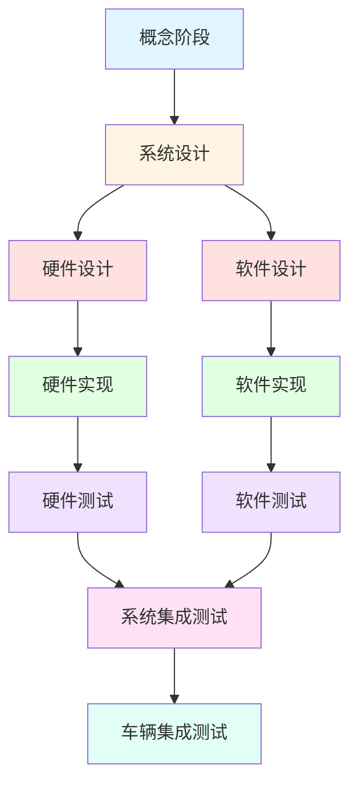
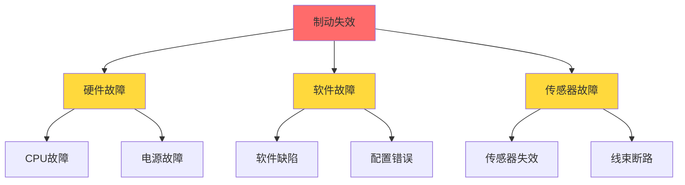

---
# 基础信息
title: "ISO 26262汽车功能安全标准详解"
description: "深入讲解ISO 26262汽车功能安全标准的核心概念、ASIL等级划分、安全开发流程、验证确认方法，以及在嵌入式系统开发中的实际应用"
slug: "iso26262-automotive-safety"

# 分类信息
domain: "10-cross-cutting-concerns"
module: "03-security-reliability"
content_type: "article"
skill_level: "intermediate"

# 标签和关联
tags:
  - ISO 26262
  - 汽车安全
  - 功能安全
  - ASIL
  - 安全标准
prerequisites:
  - beginner/02-functional-safety-basics.md
related_contents:
  - intermediate/01-fault-detection-diagnosis.md
  - intermediate/02-watchdog-system-monitoring.md
  - intermediate/03-redundancy-fault-tolerance.md

# 学习信息
estimated_time: 70
difficulty_score: 4

# 作者和版本
author: "嵌入式知识平台"
author_id: ""
created_at: "2026-03-10"
updated_at: "2026-03-10"
version: "1.0"

# 语言和本地化
language: "zh-CN"
translations: []

# 状态和可见性
status: "published"
is_featured: false
is_premium: false

# SEO和元数据
keywords:
  - ISO 26262
  - 汽车功能安全
  - ASIL等级
  - 安全开发流程
  - 功能安全认证
cover_image: ""
---

# ISO 26262汽车功能安全标准详解


## 概述

ISO 26262是专门针对道路车辆电气/电子系统功能安全的国际标准，是汽车行业最重要的安全标准之一。随着汽车电子化程度不断提高，从传统的ECU到现代的ADAS和自动驾驶系统，功能安全已成为汽车开发的核心要求。

**学习目标**：
- 理解ISO 26262标准的结构和核心概念
- 掌握ASIL（汽车安全完整性等级）的确定方法
- 了解功能安全开发的V模型流程
- 学习安全需求分析和安全机制设计
- 掌握验证确认的方法和要求

## 背景知识

### 功能安全的定义

**功能安全（Functional Safety）** 是指系统在合理可预见的误用情况下，能够正确执行其安全功能，避免因系统故障导致的不合理风险。

**关键概念**：
- **安全（Safety）**：免于不可接受的风险
- **功能安全**：通过正确执行安全功能实现的安全
- **故障（Fault）**：可能导致错误的异常状况
- **失效（Failure）**：无法执行要求的功能

### ISO 26262的发展历程

```
2005年：ISO 26262项目启动
2011年：第一版发布（Part 1-10）
2018年：第二版发布（Part 1-12）
  - 新增半导体指南（Part 11）
  - 新增摩托车指南（Part 12）
  - 扩展到卡车和公交车
```

**标准适用范围**：
- 乘用车（M1类）
- 商用车（N1类，≤3.5吨）
- 摩托车（L类）
- 安全相关的电气/电子系统

**不适用范围**：
- 纯机械系统
- 人为故意破坏
- 电磁兼容（EMC）问题


## ISO 26262标准结构

### 标准组成

ISO 26262标准共分为12个部分：

| 部分 | 名称 | 主要内容 |
|------|------|----------|
| Part 1 | 词汇表 | 术语和定义 |
| Part 2 | 功能安全管理 | 组织、流程、文档管理 |
| Part 3 | 概念阶段 | 项目定义、危害分析、安全目标 |
| Part 4 | 系统层面的产品开发 | 系统设计、安全需求分配 |
| Part 5 | 硬件层面的产品开发 | 硬件设计、验证 |
| Part 6 | 软件层面的产品开发 | 软件设计、编码、测试 |
| Part 7 | 生产、运行、服务和报废 | 生命周期后期阶段 |
| Part 8 | 支持过程 | 配置管理、变更管理、文档 |
| Part 9 | 以ASIL为导向和以安全为导向的分析 | FMEA、FTA等分析方法 |
| Part 10 | 指南 | 标准应用指导 |
| Part 11 | 半导体应用指南 | 芯片开发指南 |
| Part 12 | 摩托车应用指南 | 摩托车特定要求 |

### V模型开发流程

ISO 26262采用V模型作为开发框架：



**V模型左侧（设计）**：
- 需求分解和细化
- 从抽象到具体
- 定义验证标准

**V模型右侧（验证）**：
- 测试和确认
- 从具体到抽象
- 验证需求实现


## ASIL等级详解

### ASIL的定义

**ASIL（Automotive Safety Integrity Level，汽车安全完整性等级）** 是ISO 26262中用于表示安全需求严格程度的分级体系。

**ASIL等级分类**：
- **QM（Quality Management）**：质量管理，无特殊安全要求
- **ASIL A**：最低安全等级
- **ASIL B**：中低安全等级
- **ASIL C**：中高安全等级
- **ASIL D**：最高安全等级

### ASIL确定方法

ASIL等级通过危害分析和风险评估（HARA）确定，考虑三个因素：

**1. 严重度（Severity, S）**

| 等级 | 描述 | 伤害程度 |
|------|------|----------|
| S0 | 无伤害 | 无人员伤害 |
| S1 | 轻度伤害 | 轻伤和中度伤害 |
| S2 | 重度伤害 | 重伤和存活（有生命危险的伤害） |
| S3 | 危及生命/致命 | 危及生命的伤害或致命伤害 |

**2. 暴露度（Exposure, E）**

| 等级 | 描述 | 暴露概率 |
|------|------|----------|
| E0 | 极不可能 | 不太可能发生 |
| E1 | 非常低的概率 | 非常低的概率 |
| E2 | 低概率 | 低概率 |
| E3 | 中等概率 | 中等概率 |
| E4 | 高概率 | 高概率（几乎持续） |

**3. 可控性（Controllability, C）**

| 等级 | 描述 | 可控程度 |
|------|------|----------|
| C0 | 一般可控 | 99%以上的驾驶员能够控制 |
| C1 | 简单可控 | 90%以上的驾驶员能够控制 |
| C2 | 通常可控 | 90%以上的驾驶员能够控制 |
| C3 | 难以控制或不可控 | 少于90%的驾驶员能够控制 |

### ASIL确定表

根据S、E、C三个参数查表确定ASIL等级：

```
示例：
S3 + E4 + C3 = ASIL D（最严格）
S1 + E1 + C1 = ASIL A（较宽松）
S0 + 任意E + 任意C = QM（无特殊要求）
```

**完整ASIL确定表**：

| S | E | C0 | C1 | C2 | C3 |
|---|---|----|----|----|----|
| S1 | E1 | QM | QM | QM | A |
| S1 | E2 | QM | QM | A | A |
| S1 | E3 | QM | A | A | B |
| S1 | E4 | QM | A | B | B |
| S2 | E1 | QM | QM | A | A |
| S2 | E2 | QM | A | A | B |
| S2 | E3 | A | A | B | C |
| S2 | E4 | A | B | C | C |
| S3 | E1 | QM | A | A | B |
| S3 | E2 | A | A | B | C |
| S3 | E3 | A | B | C | D |
| S3 | E4 | B | C | C | D |

### ASIL分解

**ASIL分解（ASIL Decomposition）** 允许将高ASIL等级的安全需求分解为多个较低等级的需求：

```
ASIL D = ASIL B(D) + ASIL B(D)
ASIL D = ASIL C(D) + ASIL A(D)
```

**分解原则**：
- 分解后的元素必须独立
- 必须有充分的理由
- 需要证明独立性
- 文档化分解决策

**应用场景**：
- 降低开发成本
- 利用现有组件
- 简化供应链管理
- 提高系统灵活性


## 安全开发流程

### 概念阶段（Part 3）

**主要活动**：

1. **项目定义**
   - 定义项目范围
   - 识别系统边界
   - 确定开发假设

2. **危害分析和风险评估（HARA）**
   - 识别潜在危害
   - 分析危害场景
   - 评估风险等级
   - 确定ASIL等级

3. **安全目标制定**
   - 定义顶层安全目标
   - 分配ASIL等级
   - 定义安全状态

**HARA示例**：

```yaml
系统: 电子制动系统（EBS）

危害场景1:
  描述: 制动失效
  严重度: S3（危及生命）
  暴露度: E4（高概率）
  可控性: C3（难以控制）
  ASIL: D
  安全目标: "系统应在检测到制动失效时，提供备用制动功能"

危害场景2:
  描述: 意外制动
  严重度: S2（重度伤害）
  暴露度: E2（低概率）
  可控性: C2（通常可控）
  ASIL: B
  安全目标: "系统应防止无驾驶员输入的意外制动"
```

### 系统层面开发（Part 4）

**主要活动**：

1. **技术安全概念**
   - 定义安全功能
   - 分配安全需求
   - 定义安全机制

2. **系统设计**
   - 架构设计
   - 接口定义
   - 安全分析（FMEA、FTA）

3. **安全需求规格**
   - 功能安全需求（FSR）
   - 技术安全需求（TSR）
   - 硬件/软件安全需求

**安全机制示例**：

```c
// 示例：看门狗监控机制（ASIL D）
typedef struct {
    uint32_t timeout_ms;        // 超时时间
    uint32_t last_kick_time;    // 上次喂狗时间
    bool enabled;               // 使能标志
    uint32_t fault_counter;     // 故障计数器
} Watchdog_t;

// 初始化看门狗
void Watchdog_Init(Watchdog_t* wd, uint32_t timeout_ms) {
    wd->timeout_ms = timeout_ms;
    wd->last_kick_time = GetSystemTime();
    wd->enabled = true;
    wd->fault_counter = 0;
}

// 喂狗操作
void Watchdog_Kick(Watchdog_t* wd) {
    if (wd->enabled) {
        wd->last_kick_time = GetSystemTime();
        wd->fault_counter = 0;  // 重置故障计数
    }
}

// 检查看门狗状态
bool Watchdog_Check(Watchdog_t* wd) {
    uint32_t current_time = GetSystemTime();
    uint32_t elapsed = current_time - wd->last_kick_time;
    
    if (elapsed > wd->timeout_ms) {
        wd->fault_counter++;
        
        // 连续3次超时触发安全状态
        if (wd->fault_counter >= 3) {
            EnterSafeState();  // 进入安全状态
            return false;
        }
    }
    
    return true;
}
```

### 软件层面开发（Part 6）

**软件安全完整性等级要求**：

| ASIL | 编码规范 | 静态分析 | 动态测试 | 代码审查 |
|------|----------|----------|----------|----------|
| A | 推荐 | 推荐 | 要求 | 推荐 |
| B | 要求 | 要求 | 要求 | 推荐 |
| C | 要求 | 要求 | 要求 | 要求 |
| D | 要求 | 要求 | 要求 | 要求 |

**软件架构设计原则**：

1. **模块化设计**
   - 高内聚低耦合
   - 清晰的接口定义
   - 独立的安全模块

2. **防御性编程**
   - 输入验证
   - 边界检查
   - 错误处理

3. **冗余和多样性**
   - 双通道架构
   - 不同算法实现
   - 独立监控

**软件单元测试示例**：

```c
// 被测函数：制动力计算
uint16_t CalculateBrakingForce(uint16_t pedal_position, 
                                uint16_t vehicle_speed) {
    // 输入验证（防御性编程）
    if (pedal_position > 100) {
        pedal_position = 100;  // 限幅
    }
    
    if (vehicle_speed > 250) {
        vehicle_speed = 250;  // 限幅
    }
    
    // 制动力计算
    uint32_t force = (pedal_position * vehicle_speed) / 10;
    
    // 输出限制
    if (force > 1000) {
        force = 1000;
    }
    
    return (uint16_t)force;
}

// 单元测试用例
void Test_CalculateBrakingForce(void) {
    // 测试用例1：正常输入
    assert(CalculateBrakingForce(50, 100) == 500);
    
    // 测试用例2：边界值测试
    assert(CalculateBrakingForce(0, 100) == 0);
    assert(CalculateBrakingForce(100, 100) == 1000);
    
    // 测试用例3：异常输入（超出范围）
    assert(CalculateBrakingForce(150, 100) == 1000);  // 应限幅
    assert(CalculateBrakingForce(50, 300) == 1000);   // 应限幅
    
    // 测试用例4：输出限制
    assert(CalculateBrakingForce(100, 250) == 1000);  // 最大输出
}
```


### 硬件层面开发（Part 5）

**硬件安全指标**：

1. **单点故障度量（SPFM）**
   - 单点故障：直接导致安全目标违反的故障
   - SPFM = (1 - 单点故障率 / 总故障率) × 100%

2. **潜在故障度量（LFM）**
   - 潜在故障：多点故障中的第一个故障
   - LFM = (1 - 潜在故障率 / 总故障率) × 100%

**ASIL等级要求**：

| ASIL | SPFM | LFM |
|------|------|-----|
| A | ≥90% | ≥60% |
| B | ≥90% | ≥70% |
| C | ≥97% | ≥80% |
| D | ≥99% | ≥90% |

**硬件安全机制示例**：

```c
// 示例：双通道冗余架构
typedef struct {
    uint16_t channel_a;  // 通道A
    uint16_t channel_b;  // 通道B
    bool valid;          // 数据有效标志
} DualChannel_t;

// 双通道读取和比较
bool ReadDualChannel(DualChannel_t* data) {
    // 读取两个独立通道
    data->channel_a = ADC_Read_Channel_A();
    data->channel_b = ADC_Read_Channel_B();
    
    // 比较两个通道的值
    int16_t diff = abs(data->channel_a - data->channel_b);
    
    // 允许的最大偏差（例如5%）
    uint16_t max_diff = (data->channel_a * 5) / 100;
    
    if (diff <= max_diff) {
        data->valid = true;
        return true;
    } else {
        data->valid = false;
        // 记录故障
        LogFault(FAULT_DUAL_CHANNEL_MISMATCH);
        return false;
    }
}

// 使用双通道数据
uint16_t GetSafeValue(DualChannel_t* data) {
    if (data->valid) {
        // 返回平均值
        return (data->channel_a + data->channel_b) / 2;
    } else {
        // 返回安全默认值
        return SAFE_DEFAULT_VALUE;
    }
}
```

## 验证与确认

### 验证方法

**1. 需求验证**
- 需求评审
- 需求追踪
- 需求一致性检查

**2. 设计验证**
- 设计评审
- 架构分析
- 接口验证

**3. 实现验证**
- 代码审查
- 静态分析
- 单元测试

**4. 集成验证**
- 集成测试
- 接口测试
- 系统测试

### 测试覆盖率要求

**软件测试覆盖率**：

| ASIL | 语句覆盖 | 分支覆盖 | MC/DC |
|------|----------|----------|-------|
| A | 要求 | 推荐 | - |
| B | 要求 | 要求 | 推荐 |
| C | 要求 | 要求 | 要求 |
| D | 要求 | 要求 | 要求 |

**MC/DC（修改条件/判定覆盖）**：
- 每个条件独立影响判定结果
- ASIL C和D必须达到100% MC/DC覆盖

**测试用例设计示例**：

```c
// 被测函数：安全状态判断
bool IsSafeState(uint16_t speed, uint16_t brake_pressure, 
                 bool airbag_deployed) {
    // 条件1: 速度低于5 km/h
    // 条件2: 制动压力为0
    // 条件3: 安全气囊未展开
    
    if (speed < 5 && brake_pressure == 0 && !airbag_deployed) {
        return true;
    }
    return false;
}

// MC/DC测试用例
void Test_IsSafeState_MCDC(void) {
    // 基准用例：所有条件为真
    assert(IsSafeState(3, 0, false) == true);
    
    // 测试条件1的独立影响
    assert(IsSafeState(10, 0, false) == false);  // 仅条件1改变
    
    // 测试条件2的独立影响
    assert(IsSafeState(3, 50, false) == false);  // 仅条件2改变
    
    // 测试条件3的独立影响
    assert(IsSafeState(3, 0, true) == false);    // 仅条件3改变
}
```

### 安全分析方法

**1. FMEA（失效模式与影响分析）**

```yaml
组件: 制动ECU

失效模式1:
  描述: CPU故障
  影响: 制动功能失效
  严重度: 10
  发生率: 3
  检测度: 2
  RPN: 60
  安全机制: 看门狗监控
  
失效模式2:
  描述: 传感器信号丢失
  影响: 无法检测制动请求
  严重度: 9
  发生率: 4
  检测度: 3
  RPN: 108
  安全机制: 信号有效性检查
```

**2. FTA（故障树分析）**



**3. DFA（相关失效分析）**
- 分析共因失效
- 评估级联失效
- 确保独立性


## 功能安全管理

### 安全生命周期

**完整生命周期阶段**：


### 安全管理活动

**1. 安全计划**
- 制定安全计划
- 定义角色和职责
- 确定里程碑

**2. 配置管理**
- 版本控制
- 变更管理
- 基线管理

**3. 文档管理**
- 安全文档清单
- 文档评审
- 文档追溯

**4. 确认审查**
- 功能安全审核
- 独立评估
- 合规性检查

### 安全文档体系

**必需的安全文档**：

| 文档类型 | 文档名称 | ASIL要求 |
|----------|----------|----------|
| 管理文档 | 安全计划 | 所有ASIL |
| 管理文档 | 安全案例 | 所有ASIL |
| 技术文档 | 危害分析报告 | 所有ASIL |
| 技术文档 | 安全需求规格 | 所有ASIL |
| 技术文档 | 安全分析报告 | 所有ASIL |
| 技术文档 | 验证报告 | 所有ASIL |
| 技术文档 | 确认报告 | 所有ASIL |

### 工具认证

**工具分类**：

1. **TI1（Tool Impact 1）**
   - 工具故障可能导致安全目标违反
   - 无法检测或防止
   - 需要工具认证

2. **TI2（Tool Impact 2）**
   - 工具故障可能导致安全目标违反
   - 可以检测或防止
   - 需要较低级别认证

3. **TI3（Tool Impact 3）**
   - 工具故障不会导致安全目标违反
   - 无需认证

**工具认证方法**：
- 增加使用信心
- 工具验证
- 工具开发符合标准

## 实际应用案例

### 案例1：电子稳定控制系统（ESC）

**系统描述**：
- 功能：防止车辆失控
- ASIL等级：ASIL D
- 关键组件：传感器、ECU、执行器

**安全架构**：

```c
// ESC系统安全架构示例
typedef struct {
    // 传感器数据（双通道）
    DualChannel_t yaw_rate;      // 横摆角速度
    DualChannel_t lateral_accel; // 横向加速度
    DualChannel_t wheel_speed[4]; // 四轮速度
    
    // 安全状态
    bool system_ok;
    uint8_t fault_code;
    
    // 控制输出
    uint16_t brake_pressure[4];  // 四轮制动压力
} ESC_System_t;

// ESC主控制函数
void ESC_Control(ESC_System_t* esc) {
    // 1. 读取传感器数据（带冗余检查）
    if (!ReadDualChannel(&esc->yaw_rate) ||
        !ReadDualChannel(&esc->lateral_accel)) {
        // 传感器故障，进入安全状态
        ESC_EnterSafeState(esc);
        return;
    }
    
    // 2. 计算车辆状态
    float vehicle_slip = CalculateSlipAngle(esc);
    
    // 3. 判断是否需要干预
    if (fabs(vehicle_slip) > SLIP_THRESHOLD) {
        // 4. 计算制动力分配
        CalculateBrakeDistribution(esc, vehicle_slip);
        
        // 5. 应用制动（带安全检查）
        ApplyBrakeWithSafety(esc);
    }
    
    // 6. 自诊断
    ESC_SelfDiagnosis(esc);
}

// 安全状态处理
void ESC_EnterSafeState(ESC_System_t* esc) {
    // 1. 停止主动干预
    for (int i = 0; i < 4; i++) {
        esc->brake_pressure[i] = 0;
    }
    
    // 2. 设置故障标志
    esc->system_ok = false;
    
    // 3. 通知驾驶员
    SetWarningLight(WARNING_ESC_FAULT);
    
    // 4. 记录故障
    LogFault(esc->fault_code);
}
```

### 案例2：自适应巡航控制（ACC）

**系统描述**：
- 功能：自动保持车距和车速
- ASIL等级：ASIL B
- 关键组件：雷达、摄像头、ECU

**安全需求示例**：

```yaml
安全需求1:
  ID: SR-ACC-001
  描述: "系统应在检测到前方障碍物时，自动减速以保持安全距离"
  ASIL: B
  验证方法: 系统测试
  
安全需求2:
  ID: SR-ACC-002
  描述: "系统应在传感器故障时，立即退出ACC功能并通知驾驶员"
  ASIL: B
  验证方法: 故障注入测试
  
安全需求3:
  ID: SR-ACC-003
  描述: "驾驶员应能随时通过制动或转向接管车辆控制"
  ASIL: B
  验证方法: 人机交互测试
```

**故障处理策略**：

```c
// ACC故障处理
typedef enum {
    ACC_STATE_ACTIVE,      // 正常工作
    ACC_STATE_STANDBY,     // 待机
    ACC_STATE_DEGRADED,    // 降级模式
    ACC_STATE_FAILED       // 故障
} ACC_State_t;

void ACC_FaultHandler(ACC_System_t* acc, Fault_t fault) {
    switch (fault) {
        case FAULT_RADAR_LOST:
            // 雷达信号丢失
            if (acc->camera_ok) {
                // 降级到仅摄像头模式
                acc->state = ACC_STATE_DEGRADED;
                SetWarningLight(WARNING_ACC_DEGRADED);
            } else {
                // 完全失效
                acc->state = ACC_STATE_FAILED;
                ACC_Deactivate(acc);
            }
            break;
            
        case FAULT_CAMERA_LOST:
            // 摄像头信号丢失
            if (acc->radar_ok) {
                // 降级到仅雷达模式
                acc->state = ACC_STATE_DEGRADED;
                SetWarningLight(WARNING_ACC_DEGRADED);
            } else {
                // 完全失效
                acc->state = ACC_STATE_FAILED;
                ACC_Deactivate(acc);
            }
            break;
            
        case FAULT_BRAKE_SYSTEM:
            // 制动系统故障
            acc->state = ACC_STATE_FAILED;
            ACC_Deactivate(acc);
            SetWarningLight(WARNING_ACC_FAULT);
            break;
            
        default:
            break;
    }
}
```


## 常见问题

### Q1: ISO 26262与IEC 61508的关系？

**A**: ISO 26262是基于IEC 61508（通用功能安全标准）针对汽车行业的定制版本。

**主要区别**：
- ISO 26262专注于汽车电子系统
- 增加了ASIL等级（对应IEC 61508的SIL）
- 考虑了汽车特定的使用场景
- 简化了某些通用要求
- 增加了汽车特定的分析方法

### Q2: 如何选择合适的ASIL等级？

**A**: 通过HARA（危害分析和风险评估）确定：

**步骤**：
1. 识别所有可能的危害场景
2. 评估每个场景的严重度（S）
3. 评估暴露度（E）
4. 评估可控性（C）
5. 查表确定ASIL等级

**注意事项**：
- 考虑最坏情况
- 评估要保守
- 需要专家评审
- 文档化评估过程

### Q3: ASIL D开发成本有多高？

**A**: ASIL D是最高安全等级，开发成本显著增加：

**成本增加因素**：
- 更严格的开发流程
- 更多的验证活动
- 更高的测试覆盖率要求
- 独立的安全评估
- 更详细的文档

**估算**：
- ASIL A: 基准成本的1.2-1.5倍
- ASIL B: 基准成本的1.5-2倍
- ASIL C: 基准成本的2-3倍
- ASIL D: 基准成本的3-5倍

### Q4: 软件可以达到ASIL D吗？

**A**: 可以，但需要满足严格的要求：

**关键措施**：
- 使用经过认证的编译器和工具
- 遵循MISRA C等编码规范
- 实现100% MC/DC测试覆盖
- 进行全面的代码审查
- 使用静态分析工具
- 实施防御性编程
- 添加软件安全机制

### Q5: 如何处理第三方组件？

**A**: 第三方组件需要特殊处理：

**评估方法**：
1. **SEooC（Safety Element out of Context）**
   - 组件独立开发
   - 定义假设条件
   - 提供安全手册

2. **已验证组件**
   - 检查认证证书
   - 验证适用性
   - 评估假设条件

3. **遗留组件**
   - 评估使用历史
   - 进行安全分析
   - 可能需要额外验证

### Q6: 如何进行功能安全培训？

**A**: 建议的培训路径：

**基础培训**：
- ISO 26262标准概述
- 功能安全基本概念
- ASIL等级确定

**专业培训**：
- 功能安全工程师认证
- 安全评估师培训
- 工具使用培训

**实践培训**：
- 案例分析
- 项目实战
- 审核经验

## 总结

### 关键要点

1. **ISO 26262是汽车功能安全的核心标准**
   - 覆盖完整的安全生命周期
   - 提供系统化的开发方法
   - 明确各方责任和要求

2. **ASIL等级决定开发严格程度**
   - 通过HARA确定
   - 考虑严重度、暴露度、可控性
   - 等级越高，要求越严格

3. **V模型是开发框架**
   - 左侧：需求分解和设计
   - 右侧：验证和确认
   - 确保需求可追溯

4. **安全机制是关键**
   - 检测故障
   - 控制故障
   - 避免或减轻危害

5. **验证确认不可或缺**
   - 多层次测试
   - 高覆盖率要求
   - 独立评估

### 最佳实践

**开发阶段**：
- 尽早开始安全活动
- 建立清晰的安全架构
- 使用成熟的安全机制
- 保持文档追溯性

**验证阶段**：
- 制定详细的测试计划
- 使用自动化测试工具
- 进行独立验证
- 记录所有测试结果

**管理阶段**：
- 建立安全文化
- 培训团队成员
- 定期安全审核
- 持续改进流程

### 学习建议

**进阶方向**：

1. **深入学习标准**
   - 阅读ISO 26262完整标准
   - 学习相关标准（IEC 61508、ISO 21448）
   - 参加专业培训

2. **实践经验**
   - 参与实际项目
   - 进行案例分析
   - 学习行业最佳实践

3. **工具掌握**
   - 安全分析工具（FMEA、FTA）
   - 测试工具（覆盖率分析）
   - 管理工具（需求追踪）

4. **持续关注**
   - 标准更新
   - 行业动态
   - 新技术应用


## 延伸阅读

### 相关标准

1. **IEC 61508**
   - 通用功能安全标准
   - ISO 26262的基础
   - 适用于所有行业

2. **ISO 21448 (SOTIF)**
   - 预期功能安全
   - 针对ADAS和自动驾驶
   - 补充ISO 26262

3. **ISO/SAE 21434**
   - 汽车网络安全
   - 与功能安全互补
   - 2021年发布

4. **AUTOSAR**
   - 汽车软件架构标准
   - 包含安全扩展
   - 支持ISO 26262实施

### 推荐资源

**书籍**：
- 《ISO 26262 - A Practical Guide》
- 《Automotive Safety Integrity Level (ASIL) Determination》
- 《Functional Safety for Road Vehicles》

**在线资源**：
- ISO官方网站
- SAE International
- AUTOSAR官方文档
- 功能安全社区论坛

**培训机构**：
- TÜV SÜD
- TÜV Rheinland
- SGS
- Exida

### 相关内容

**前置学习**：
- [功能安全基础(IEC 61508)](../beginner/02-functional-safety-basics.html) - 了解功能安全基本概念
- [可靠性设计原则](../beginner/06-reliability-design-principles.html) - 学习可靠性设计方法

**深入学习**：
- [故障检测与诊断技术](./01-fault-detection-diagnosis.html) - 掌握故障检测方法
- [看门狗与系统监控](./02-watchdog-system-monitoring.html) - 学习监控机制
- [冗余设计与容错技术](./03-redundancy-fault-tolerance.html) - 了解冗余设计

**实践应用**：
- [高可靠性系统设计实战](../advanced/02-high-reliability-system.html) - 综合应用项目
- [安全认证与合规实践](../advanced/03-security-certification-compliance.html) - 认证流程

### 工具推荐

**安全分析工具**：
- Medini Analyze（FMEA/FTA）
- APIS IQ-Software（安全分析）
- PTC Windchill（需求管理）

**测试工具**：
- Vector CANoe（网络测试）
- LDRA（代码覆盖率）
- Polyspace（静态分析）

**管理工具**：
- Jama Connect（需求追踪）
- Polarion（ALM）
- codeBeamer（合规管理）

## 参考资料

### 标准文档

1. ISO 26262:2018 - Road vehicles - Functional safety
   - Part 1: Vocabulary
   - Part 2: Management of functional safety
   - Part 3: Concept phase
   - Part 4: Product development at the system level
   - Part 5: Product development at the hardware level
   - Part 6: Product development at the software level
   - Part 7: Production, operation, service and decommissioning
   - Part 8: Supporting processes
   - Part 9: ASIL-oriented and safety-oriented analyses
   - Part 10: Guideline on ISO 26262
   - Part 11: Guidelines on application of ISO 26262 to semiconductors
   - Part 12: Adaptation of ISO 26262 for motorcycles

2. IEC 61508:2010 - Functional Safety of Electrical/Electronic/Programmable Electronic Safety-related Systems

3. ISO 21448:2022 - Road vehicles - Safety of the intended functionality (SOTIF)

4. ISO/SAE 21434:2021 - Road vehicles - Cybersecurity engineering

### 技术文献

1. Hillenbrand, M. (2012). "Functional Safety according to ISO 26262"
2. Hobbs, C. (2018). "Embedded Software Development for Safety-Critical Systems"
3. Mader, R., et al. (2013). "ISO 26262 - Automotive Safety Integrity Levels"

### 行业报告

1. SAE International Technical Papers on Functional Safety
2. AUTOSAR Safety Extensions Specification
3. VDA (German Association of the Automotive Industry) Guidelines

---

**版权声明**：本文内容基于ISO 26262:2018标准编写，仅供学习参考。实际项目开发请遵循标准原文和相关法规要求。

**更新说明**：本文将根据标准更新和行业最佳实践持续更新。如发现错误或有改进建议，欢迎反馈。

**作者信息**：本文由嵌入式知识平台内容团队编写，经过功能安全专家审核。

---

**下一步学习建议**：

1. 如果你是初学者，建议先学习[功能安全基础](../beginner/02-functional-safety-basics.html)
2. 如果你想了解具体实现，可以学习[故障检测与诊断技术](./01-fault-detection-diagnosis.html)
3. 如果你在汽车行业工作，建议深入学习ISO 26262标准原文
4. 如果你想获得认证，可以参加TÜV等机构的功能安全工程师培训

**实践建议**：

- 从简单的ASIL A项目开始
- 逐步积累经验
- 参与实际项目
- 持续学习和改进

祝你在功能安全领域取得成功！
