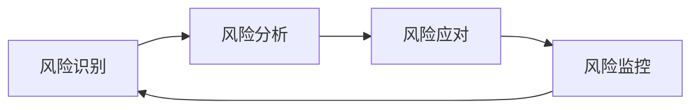

# 嵌入式项目管理概述：从零开始理解项目管理

## 概述


嵌入式项目管理是确保嵌入式系统开发项目按时、按质、按预算完成的关键能力。与纯软件项目不同，嵌入式项目涉及硬件、软件、固件的紧密集成，需要协调多个专业领域的团队成员，管理复杂的技术依赖关系。

完成本文学习后，你将能够：

- 理解嵌入式项目管理的基本概念和重要性
- 掌握嵌入式项目的完整生命周期
- 了解团队协作的关键要素和最佳实践
- 识别和管理嵌入式项目中的常见风险
- 认识成功交付嵌入式项目的关键要素

## 为什么嵌入式项目需要专门的管理方法

### 嵌入式项目的独特挑战

嵌入式项目与传统软件项目有显著差异：

**硬件软件紧密耦合**：
- 软件开发依赖硬件原型的可用性
- 硬件变更可能导致软件大规模返工
- 调试需要专用的硬件工具和设备

**多学科团队协作**：
- 硬件工程师、固件工程师、软件工程师、测试工程师需要紧密配合
- 不同专业背景的成员沟通存在障碍
- 技术决策需要权衡多方面因素

**资源和时间约束**：
- 硬件原型制作周期长，成本高
- 调试设备和测试环境有限
- 产品上市时间窗口紧迫

**质量和可靠性要求高**：
- 嵌入式系统通常运行在关键场景
- 软件更新困难，需要高度稳定
- 安全性和实时性要求严格

### 项目管理的价值

良好的项目管理能够：

1. **提高成功率**：通过系统化的规划和执行，降低项目失败风险
2. **优化资源利用**：合理分配人力、设备和预算资源
3. **加速交付**：识别关键路径，避免不必要的延误
4. **提升质量**：建立质量保证机制，减少缺陷和返工
5. **增强团队协作**：明确角色职责，促进有效沟通

## 嵌入式项目生命周期

### 项目生命周期概览

嵌入式项目通常经历以下五个主要阶段：


### 1. 启动阶段

**主要目标**：明确项目目标，获得项目批准

**关键活动**：
- 识别项目需求和业务目标
- 进行可行性分析（技术、经济、时间）
- 定义项目范围和边界
- 识别主要干系人
- 编写项目章程

**交付物**：
- 项目章程文档
- 初步需求说明
- 可行性分析报告

**示例场景**：
假设你要开发一个智能温控器项目。启动阶段需要明确：
- 目标市场和用户需求（家用/商用）
- 核心功能（温度控制、远程监控、节能模式）
- 技术约束（功耗、成本、尺寸）
- 预算和时间限制（6个月，50万预算）

### 2. 规划阶段

**主要目标**：制定详细的项目执行计划

**关键活动**：
- 详细需求分析和规格定义
- 系统架构设计
- 工作分解结构（WBS）
- 进度计划和里程碑设定
- 资源分配和预算规划
- 风险识别和应对计划
- 质量标准定义

**交付物**：
- 需求规格说明书
- 系统设计文档
- 项目进度计划（甘特图）
- 资源分配表
- 风险管理计划
- 质量保证计划

**规划要点**：


```markdown
硬件开发计划：
- PCB设计：2周
- 原型制作：3周
- 硬件测试：2周

软件开发计划：
- 驱动开发：4周
- 应用开发：6周
- 集成测试：3周

关键里程碑：
- M1：需求评审完成（第2周）
- M2：硬件原型就绪（第8周）
- M3：软件Alpha版本（第12周）
- M4：系统集成完成（第18周）
- M5：产品发布（第24周）
```

### 3. 执行阶段

**主要目标**：按计划实施项目任务

**关键活动**：
- 硬件设计和原型制作
- 固件和软件开发
- 单元测试和集成测试
- 团队协调和沟通
- 问题解决和决策
- 变更管理

**执行要点**：

**并行开发策略**：
- 硬件和软件尽可能并行开发
- 使用仿真器和开发板进行早期软件开发
- 建立持续集成环境

**迭代开发**：
- 采用敏捷方法进行软件开发
- 定期进行集成和测试
- 快速响应需求变化

**团队协作**：
- 每日站会同步进度
- 定期技术评审
- 及时解决阻塞问题

### 4. 监控阶段

**主要目标**：跟踪项目进展，确保按计划执行

**关键活动**：
- 进度跟踪和报告
- 成本监控
- 质量检查
- 风险监控
- 变更控制
- 问题管理

**监控指标**：

| 指标类别 | 具体指标 | 监控频率 |
|---------|---------|---------|
| 进度 | 任务完成率、里程碑达成情况 | 每周 |
| 成本 | 实际支出vs预算、成本偏差 | 每月 |
| 质量 | 缺陷数量、测试覆盖率 | 每周 |
| 风险 | 风险状态、新风险识别 | 每周 |
| 资源 | 人员利用率、设备可用性 | 每周 |

**监控工具**：
- 项目管理软件（Jira、Trello、MS Project）
- 版本控制系统（Git）
- 缺陷跟踪系统（Bugzilla、Jira）
- 持续集成工具（Jenkins、GitLab CI）

### 5. 收尾阶段

**主要目标**：正式结束项目，总结经验教训

**关键活动**：
- 最终测试和验收
- 文档整理和归档
- 产品交付
- 项目总结会议
- 经验教训记录
- 团队解散和资源释放

**交付物**：
- 最终产品和文档
- 项目总结报告
- 经验教训文档
- 技术文档和用户手册

## 团队协作的关键要素

### 团队角色和职责

典型的嵌入式项目团队包括：

**项目经理（Project Manager）**：
- 整体项目规划和协调
- 资源分配和进度管理
- 风险管理和问题解决
- 干系人沟通

**硬件工程师（Hardware Engineer）**：
- 电路设计和PCB布局
- 硬件原型制作和测试
- 硬件文档编写

**固件工程师（Firmware Engineer）**：
- 底层驱动开发
- 硬件抽象层实现
- 实时性能优化

**软件工程师（Software Engineer）**：
- 应用层软件开发
- 用户界面实现
- 网络通信功能

**测试工程师（Test Engineer）**：
- 测试计划制定
- 测试用例设计和执行
- 缺陷跟踪和验证

**系统架构师（System Architect）**：
- 系统架构设计
- 技术选型和评估
- 技术难题攻关

### 有效沟通机制

**定期会议**：

1. **每日站会（Daily Standup）**
   - 时间：15分钟
   - 内容：昨天完成、今天计划、遇到的问题
   - 目的：快速同步，及时发现阻塞

2. **周例会（Weekly Meeting）**
   - 时间：1小时
   - 内容：进度回顾、问题讨论、下周计划
   - 目的：全面了解项目状态

3. **技术评审会（Technical Review）**
   - 时间：2-3小时
   - 内容：设计评审、代码评审、测试评审
   - 目的：确保技术质量

4. **里程碑评审（Milestone Review）**
   - 时间：半天
   - 内容：阶段性成果展示和评审
   - 目的：确认阶段目标达成

**沟通工具**：
- 即时通讯：Slack、Microsoft Teams、钉钉
- 文档协作：Confluence、Notion、飞书文档
- 代码协作：GitHub、GitLab、Gitee
- 任务管理：Jira、Trello、禅道

### 跨职能协作

**硬件-软件协作**：
- 及早确定硬件接口规范
- 建立硬件抽象层（HAL）
- 使用仿真器进行并行开发
- 定期进行硬件软件联调

**开发-测试协作**：
- 测试人员参与需求评审
- 开发过程中持续测试
- 自动化测试集成到CI/CD
- 缺陷及时反馈和修复

## 风险管理

### 常见风险类型

**技术风险**：
- 技术方案不可行
- 性能无法满足要求
- 第三方组件不稳定
- 技术难题无法攻克

**进度风险**：
- 任务估算不准确
- 关键人员离职
- 硬件延期交付
- 需求频繁变更

**资源风险**：
- 预算超支
- 人员不足或能力不匹配
- 设备和工具短缺
- 外部依赖延误

**质量风险**：
- 缺陷率过高
- 测试覆盖不足
- 性能不达标
- 可靠性问题

### 风险管理流程



**1. 风险识别**：
- 头脑风暴会议
- 检查清单法
- 专家访谈
- 历史项目经验

**2. 风险分析**：
- 评估风险发生概率（高/中/低）
- 评估风险影响程度（高/中/低）
- 计算风险优先级

**风险矩阵示例**：

| 风险 | 概率 | 影响 | 优先级 | 应对策略 |
|------|------|------|--------|---------|
| 硬件原型延期 | 高 | 高 | 1 | 提前准备备选方案 |
| 关键人员离职 | 中 | 高 | 2 | 知识共享，交叉培训 |
| 第三方库不稳定 | 中 | 中 | 3 | 充分测试，准备替代方案 |
| 需求变更 | 高 | 中 | 2 | 建立变更控制流程 |

**3. 风险应对策略**：


- **规避（Avoid）**：改变计划以消除风险
- **转移（Transfer）**：将风险转移给第三方（如保险、外包）
- **减轻（Mitigate）**：降低风险发生概率或影响
- **接受（Accept）**：接受风险，准备应急计划

**4. 风险监控**：
- 定期审查风险状态
- 识别新出现的风险
- 评估应对措施效果
- 更新风险管理计划

### 风险应对实例

**案例：硬件原型延期风险**

**风险描述**：
PCB制作厂商可能因为订单积压导致原型板延期2-3周交付，影响软件开发进度。

**应对措施**：
1. **规避**：选择交期更可靠的供应商，即使成本稍高
2. **减轻**：
   - 提前1周下单，留出缓冲时间
   - 使用开发板进行早期软件开发
   - 准备硬件仿真环境
3. **应急计划**：
   - 如果延期，优先开发不依赖硬件的模块
   - 调整软件开发顺序，先完成算法和逻辑
   - 考虑使用快速打样服务（成本更高但速度快）

## 项目成功的关键要素

### 1. 清晰的目标和范围

**明确项目目标**：
- 使用SMART原则定义目标
  - Specific（具体的）
  - Measurable（可衡量的）
  - Achievable（可实现的）
  - Relevant（相关的）
  - Time-bound（有时限的）

**示例**：
- ❌ 不好的目标："开发一个智能设备"
- ✅ 好的目标："在6个月内开发一款支持WiFi连接、功耗<1W、成本<50元的智能温控器，通过CE认证"

**控制范围蔓延**：
- 建立正式的变更控制流程
- 评估每个变更的影响
- 优先级排序，必要时推迟到下一版本

### 2. 合理的计划和估算

**任务分解**：
- 使用工作分解结构（WBS）
- 将大任务分解为可管理的小任务
- 每个任务不超过2周工作量

**时间估算技巧**：
- 三点估算法：(乐观+4×最可能+悲观)/6
- 参考历史数据
- 考虑风险和不确定性
- 留出缓冲时间（通常20-30%）

**示例估算**：
```
任务：GPIO驱动开发
- 乐观估计：3天
- 最可能估计：5天
- 悲观估计：8天
- 三点估算：(3 + 4×5 + 8)/6 = 5.2天
- 加上20%缓冲：6.2天 ≈ 7天
```

### 3. 有效的团队协作

**建立团队文化**：
- 开放透明的沟通
- 相互尊重和信任
- 鼓励创新和试错
- 及时认可和奖励

**促进知识共享**：
- 代码评审
- 技术分享会
- 文档编写
- 结对编程

**处理冲突**：
- 及时发现和解决冲突
- 关注问题而非个人
- 寻求双赢方案
- 必要时升级处理

### 4. 持续的质量保证

**质量内建**：
- 编码规范和代码评审
- 单元测试和集成测试
- 持续集成和自动化测试
- 静态代码分析

**测试策略**：
- 单元测试：覆盖率≥80%
- 集成测试：验证模块间接口
- 系统测试：验证整体功能
- 性能测试：验证性能指标
- 压力测试：验证极限情况

**质量门禁**：
- 代码提交前必须通过单元测试
- 集成前必须通过代码评审
- 发布前必须通过完整测试

### 5. 灵活应对变化

**拥抱变化**：
- 需求变化是常态
- 建立快速响应机制
- 保持架构的灵活性

**敏捷实践**：
- 迭代开发，小步快跑
- 频繁交付，快速反馈
- 持续改进，回顾总结

**技术债务管理**：
- 识别和记录技术债务
- 定期偿还技术债务
- 平衡新功能和重构

## 项目管理工具和方法

### 常用项目管理方法

**瀑布模型（Waterfall）**：
- 适用场景：需求明确、变化少的项目
- 优点：流程清晰，文档完整
- 缺点：灵活性差，风险集中在后期

**敏捷开发（Agile）**：
- 适用场景：需求不确定、需要快速迭代的项目
- 优点：灵活应对变化，快速交付价值
- 缺点：需要团队高度协作，文档可能不足

**混合模式**：
- 硬件开发采用瀑布模型（周期长，变更成本高）
- 软件开发采用敏捷方法（灵活迭代）
- 在关键里程碑进行集成

### 项目管理工具

**进度管理**：
- Microsoft Project：专业的项目管理软件
- Jira：敏捷项目管理
- Trello：看板式任务管理
- 甘特图：可视化进度计划

**协作工具**：
- Confluence：团队知识库
- Slack/Teams：即时通讯
- Zoom/腾讯会议：视频会议

**版本控制**：
- Git：代码版本管理
- SVN：集中式版本控制

**文档管理**：
- Google Docs/Office 365：在线文档协作
- Markdown：轻量级文档格式

## 实践建议

### 对于项目经理

1. **建立信任**：
   - 言行一致，说到做到
   - 公平对待团队成员
   - 承认错误，勇于担责

2. **有效沟通**：
   - 主动沟通，不等问题爆发
   - 倾听团队意见
   - 清晰表达期望

3. **授权赋能**：
   - 信任团队成员
   - 给予决策权
   - 提供必要支持

4. **持续学习**：
   - 学习项目管理知识
   - 了解技术发展趋势
   - 总结项目经验教训

### 对于团队成员

1. **主动沟通**：
   - 及时报告进度和问题
   - 主动寻求帮助
   - 分享知识和经验

2. **承担责任**：
   - 对自己的工作负责
   - 按时完成任务
   - 保证工作质量

3. **团队协作**：
   - 帮助其他成员
   - 参与团队活动
   - 维护团队氛围

4. **持续改进**：
   - 学习新技术和方法
   - 反思工作方式
   - 提出改进建议

## 常见问题

### Q1: 如何处理需求频繁变更？

**A**: 需求变更是嵌入式项目的常态，关键是建立有效的变更管理机制：

1. **建立变更控制流程**：
   - 所有变更必须正式提出
   - 评估变更的影响（时间、成本、质量）
   - 由项目委员会决策是否接受

2. **优先级管理**：
   - 将变更分为必须、重要、可选
   - 必须的变更立即实施
   - 可选的变更推迟到下一版本

3. **保持架构灵活性**：
   - 采用模块化设计
   - 使用抽象层隔离变化
   - 预留扩展接口

4. **敏捷应对**：
   - 采用迭代开发
   - 每个迭代交付可用功能
   - 根据反馈调整方向

### Q2: 硬件延期如何保证软件开发进度？

**A**: 硬件延期是嵌入式项目的常见风险，可以采取以下措施：

1. **使用开发板**：
   - 选择与目标硬件相似的开发板
   - 在开发板上进行早期软件开发
   - 验证核心功能和算法

2. **硬件仿真**：
   - 使用QEMU等仿真器
   - 模拟硬件行为
   - 进行软件测试

3. **分层开发**：
   - 先开发不依赖硬件的模块
   - 使用硬件抽象层（HAL）
   - 后期只需适配HAL层

4. **并行开发**：
   - 软件和硬件同时进行
   - 定期同步接口规范
   - 及早发现集成问题

### Q3: 如何平衡进度和质量？

**A**: 进度和质量的平衡是项目管理的核心挑战：

1. **质量内建**：
   - 从一开始就注重质量
   - 代码评审和测试同步进行
   - 避免后期大量返工

2. **合理的质量标准**：
   - 根据项目特点设定标准
   - 不追求完美，够用即可
   - 关键模块高标准，非关键模块适度

3. **技术债务管理**：
   - 允许适度的技术债务
   - 记录和跟踪技术债务
   - 定期偿还技术债务

4. **风险驱动**：
   - 高风险模块优先保证质量
   - 低风险模块可以适度妥协
   - 根据实际情况动态调整

### Q4: 团队成员技能不足怎么办？

**A**: 团队能力建设是长期工作：

1. **培训和学习**：
   - 组织内部培训
   - 支持外部培训和认证
   - 鼓励自学和分享

2. **导师制度**：
   - 资深成员指导新人
   - 结对编程
   - 代码评审中学习

3. **合理分工**：
   - 根据能力分配任务
   - 给予成长机会
   - 逐步提高难度

4. **外部支持**：
   - 必要时引入外部专家
   - 技术咨询
   - 关键模块外包

## 总结

嵌入式项目管理是一门综合性的学科，需要平衡技术、人员、时间、成本等多方面因素。本文介绍的核心要点包括：

**项目生命周期**：
- 启动、规划、执行、监控、收尾五个阶段
- 每个阶段有明确的目标和交付物
- 阶段之间相互关联，需要整体把握

**团队协作**：
- 明确角色和职责
- 建立有效的沟通机制
- 促进跨职能协作
- 营造良好的团队文化

**风险管理**：
- 识别、分析、应对、监控四个步骤
- 关注技术、进度、资源、质量四类风险
- 制定应对策略和应急计划

**成功要素**：
- 清晰的目标和范围
- 合理的计划和估算
- 有效的团队协作
- 持续的质量保证
- 灵活应对变化

记住，项目管理不是一成不变的流程，而是需要根据项目特点和团队情况灵活调整的实践。最重要的是保持开放的心态，持续学习和改进。

## 延伸阅读

推荐进一步学习的资源：

- [需求分析与管理](02-requirements-analysis.html) - 深入学习需求管理方法
- [敏捷开发在嵌入式中的应用](03-agile-in-embedded.html) - 了解敏捷方法在嵌入式项目中的实践
- [技术文档编写规范](04-technical-documentation.html) - 学习如何编写高质量的项目文档
- [PMBOK指南](https://www.pmi.org/) - 项目管理知识体系
- [敏捷宣言](https://agilemanifesto.org/) - 了解敏捷开发理念

## 参考资料

1. Project Management Institute. (2021). *A Guide to the Project Management Body of Knowledge (PMBOK® Guide)* – Seventh Edition
2. Schwaber, K., & Sutherland, J. (2020). *The Scrum Guide*
3. Cohn, M. (2005). *Agile Estimating and Planning*
4. 《嵌入式系统项目管理实践》- 电子工业出版社
5. 《软件项目管理》- 清华大学出版社

---

**练习题**：

1. 列出你参与或了解的一个嵌入式项目，识别其中的主要风险，并提出应对措施。

2. 为一个智能手环项目制定简单的WBS（工作分解结构），包括硬件、软件、测试等主要工作包。

3. 思考：在你的项目中，如何平衡硬件开发周期长和软件需要快速迭代的矛盾？

**下一步**：建议学习 [需求分析与管理](02-requirements-analysis.html)，深入了解如何有效管理项目需求。
