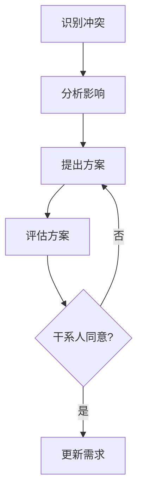
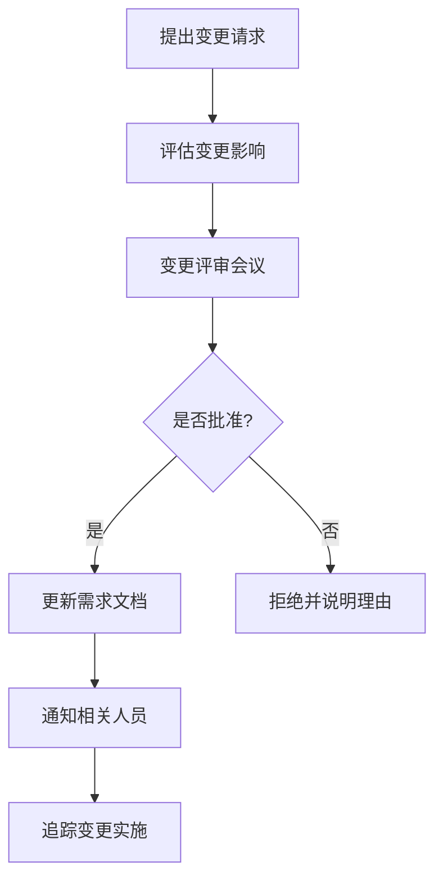
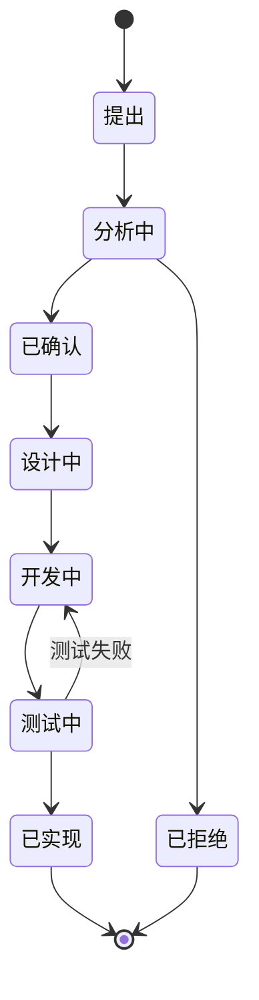

# 需求分析与管理：构建成功项目的基石

## 学习目标

完成本教程后，你将能够：

- 掌握多种需求收集方法，有效获取干系人需求
- 理解需求分析的完整流程，将模糊需求转化为清晰规格
- 编写规范的需求文档，准确传达项目需求
- 建立需求变更控制机制，管理需求演进
- 使用需求追踪工具，确保需求全生命周期可追溯

## 前置要求

**知识要求**：
- 了解嵌入式项目管理基础（建议先学习[嵌入式项目管理概述](01-embedded-project-management.html)）
- 具备基本的技术文档阅读能力
- 了解嵌入式系统的基本概念

**技能要求**：
- 能够与不同背景的人员进行有效沟通
- 具备基本的逻辑思维和分析能力
- 熟悉常用的文档编辑工具（Word、Markdown等）

**环境要求**：
- 文档编辑工具（推荐：Markdown编辑器、Word）
- 可选：需求管理工具（Jira、Confluence、Trello等）

## 准备工作

### 1. 理解需求的重要性

在开始学习具体方法之前，先理解为什么需求分析如此重要：

**需求错误的代价**：
- 研究表明，需求阶段的错误修复成本是编码阶段的10-100倍
- 80%的项目失败源于需求问题
- 需求变更是项目延期的主要原因之一

**需求质量的影响**：
```
清晰的需求 → 准确的设计 → 高效的开发 → 成功的项目
模糊的需求 → 频繁返工 → 进度延误 → 项目失败
```

### 2. 需求的类型

嵌入式项目中的需求通常分为以下几类：

**功能需求（Functional Requirements）**：
- 系统必须实现的具体功能
- 示例：温控器必须能够在5-35°C范围内控制温度

**非功能需求（Non-Functional Requirements）**：
- 性能：响应时间、吞吐量、资源占用
- 可靠性：MTBF、故障恢复时间
- 安全性：数据加密、访问控制
- 可维护性：代码可读性、模块化程度

**约束条件（Constraints）**：
- 硬件限制：MCU型号、内存大小、功耗预算
- 软件限制：操作系统、开发工具、编程语言
- 时间限制：上市时间、开发周期
- 成本限制：硬件成本、开发成本

**接口需求（Interface Requirements）**：
- 用户界面：显示屏、按键、LED指示
- 硬件接口：传感器、执行器、通信模块
- 软件接口：API、协议、数据格式


## 步骤1：需求收集

需求收集是需求工程的第一步，目标是从各个干系人那里获取完整、准确的需求信息。

### 1.1 识别干系人

首先要识别所有相关的干系人：

**内部干系人**：
- 产品经理：定义产品愿景和市场需求
- 硬件工程师：提供硬件能力和限制
- 软件工程师：评估技术可行性
- 测试工程师：关注可测试性
- 项目经理：关注进度和资源

**外部干系人**：
- 客户/用户：最终使用产品的人
- 市场部门：了解市场趋势和竞争态势
- 供应商：提供关键组件和技术支持
- 监管机构：提出合规性要求

### 1.2 需求收集方法

#### 方法1：访谈（Interview）

**适用场景**：深入了解特定干系人的需求

**实施步骤**：

1. **准备阶段**：
   - 确定访谈对象和目标
   - 准备访谈提纲和问题清单
   - 预约访谈时间（建议30-60分钟）

2. **执行阶段**：
   - 开放式问题引导："您希望这个产品解决什么问题？"
   - 封闭式问题确认："温度控制精度需要达到±0.5°C吗？"
   - 记录关键信息和疑问点

3. **总结阶段**：
   - 整理访谈记录
   - 提取关键需求
   - 与访谈对象确认理解

**示例访谈问题**：
```
产品愿景类：
- 这个产品的核心价值是什么？
- 目标用户是谁？他们的痛点是什么？
- 与竞品相比，我们的差异化在哪里？

功能需求类：
- 系统必须实现哪些核心功能？
- 用户如何与系统交互？
- 系统需要支持哪些工作模式？

性能需求类：
- 系统的响应时间要求是多少？
- 需要支持多少并发用户/设备？
- 功耗预算是多少？

约束条件类：
- 硬件平台有什么限制？
- 开发周期和预算是多少？
- 有哪些必须遵守的标准或规范？
```

#### 方法2：问卷调查（Questionnaire）

**适用场景**：从大量用户收集需求

**实施步骤**：

1. **设计问卷**：
   - 明确调查目标
   - 设计问题（选择题、量表题、开放题）
   - 控制问卷长度（建议10-15分钟完成）

2. **发放问卷**：
   - 选择合适的渠道（邮件、在线平台）
   - 设定回收期限
   - 提供激励措施（如抽奖）

3. **分析结果**：
   - 统计数据
   - 识别共性需求
   - 提取关键洞察

**问卷设计示例**：
```
1. 您目前使用的温控设备是什么品牌？
   □ A品牌  □ B品牌  □ C品牌  □ 其他____

2. 您对当前设备的满意度？（1-5分）
   温度控制精度：1 2 3 4 5
   操作便捷性：  1 2 3 4 5
   能耗表现：    1 2 3 4 5

3. 您最希望改进的功能是？（可多选）
   □ 远程控制  □ 定时功能  □ 节能模式
   □ 温度曲线  □ 故障提醒  □ 其他____

4. 您愿意为远程控制功能支付多少溢价？
   □ 不愿意  □ 10%以内  □ 10-20%  □ 20%以上
```

#### 方法3：观察法（Observation）

**适用场景**：了解用户的实际使用场景和行为

**实施步骤**：

1. **现场观察**：
   - 到用户的实际使用环境
   - 观察用户如何使用现有产品
   - 记录用户的操作流程和痛点

2. **情境分析**：
   - 分析使用环境的特点
   - 识别未被满足的需求
   - 发现用户的隐性需求

**观察要点**：
- 用户在什么场景下使用产品？
- 用户的操作流程是怎样的？
- 用户遇到了哪些困难？
- 用户采用了哪些变通方法？


#### 方法4：原型法（Prototyping）

**适用场景**：需求不明确，需要通过原型澄清

**实施步骤**：

1. **快速原型**：
   - 创建低保真原型（纸质原型、线框图）
   - 或高保真原型（可交互的界面）

2. **用户反馈**：
   - 让用户试用原型
   - 收集反馈和建议
   - 识别遗漏的需求

3. **迭代优化**：
   - 根据反馈调整原型
   - 重复验证过程
   - 直到需求明确

**原型工具推荐**：
- 纸质原型：快速、成本低
- Figma/Sketch：UI原型设计
- Arduino/树莓派：硬件功能原型
- 仿真工具：系统行为原型

#### 方法5：头脑风暴（Brainstorming）

**适用场景**：创新性需求，需要团队共创

**实施步骤**：

1. **准备会议**：
   - 邀请跨职能团队成员
   - 准备会议主题和背景资料
   - 预留充足时间（1-2小时）

2. **头脑风暴规则**：
   - 鼓励自由发言，不批评任何想法
   - 追求数量，不追求质量
   - 鼓励组合和改进他人的想法
   - 记录所有想法

3. **整理归纳**：
   - 对想法进行分类
   - 评估可行性
   - 提取有价值的需求

### 1.3 需求收集的最佳实践

**多种方法结合**：
- 不同方法适用于不同场景
- 结合使用可以相互验证
- 提高需求的完整性和准确性

**持续收集**：
- 需求收集不是一次性活动
- 在整个项目过程中持续进行
- 及时捕获新的需求和变化

**文档化**：
- 及时记录收集到的需求
- 标注需求来源和优先级
- 建立需求追溯关系

## 步骤2：需求分析

需求分析是将收集到的原始需求转化为清晰、完整、一致的需求规格的过程。

### 2.1 需求分类和优先级

#### 需求分类

使用MoSCoW方法对需求进行分类：

**Must Have（必须有）**：
- 核心功能，没有就无法交付
- 示例：温控器必须能够读取温度传感器数据

**Should Have（应该有）**：
- 重要但不是必需的功能
- 可以在后续版本中实现
- 示例：温控器应该支持远程监控

**Could Have（可以有）**：
- 锦上添花的功能
- 资源允许时实现
- 示例：温控器可以显示历史温度曲线

**Won't Have（不会有）**：
- 明确不在当前范围内的功能
- 避免范围蔓延
- 示例：温控器不会支持语音控制（本版本）

#### 优先级评估

使用优先级矩阵评估需求：

```
        重要性
          ↑
    高  | P1 | P0 |
        |----|----|
    低  | P3 | P2 |
        └─────────→
          紧急性
```

- **P0**：高重要性 + 高紧急性 → 立即实现
- **P1**：高重要性 + 低紧急性 → 计划实现
- **P2**：低重要性 + 高紧急性 → 快速解决
- **P3**：低重要性 + 低紧急性 → 延后处理

### 2.2 需求分解

将高层需求分解为可实现的细粒度需求：

**示例：温度控制功能分解**

```
高层需求：系统应能够自动控制室内温度

分解为：
├── 温度采集
│   ├── 读取温度传感器数据
│   ├── 数据滤波和校准
│   └── 异常值检测和处理
│
├── 温度控制算法
│   ├── PID控制器实现
│   ├── 控制参数自适应调整
│   └── 控制输出限幅
│
├── 执行器控制
│   ├── 加热器开关控制
│   ├── 制冷器开关控制
│   └── 风扇转速控制
│
└── 用户交互
    ├── 目标温度设定
    ├── 当前温度显示
    └── 工作状态指示
```

### 2.3 需求验证

确保需求满足SMART原则：

**Specific（具体的）**：
- ❌ 系统应该快速响应
- ✅ 系统应在100ms内响应用户按键

**Measurable（可衡量的）**：
- ❌ 系统应该节能
- ✅ 系统待机功耗应小于0.5W

**Achievable（可实现的）**：
- ❌ 系统应支持所有通信协议
- ✅ 系统应支持Wi-Fi和蓝牙通信

**Relevant（相关的）**：
- ❌ 系统应支持播放音乐（温控器不需要）
- ✅ 系统应支持温度异常报警

**Time-bound（有时限的）**：
- ❌ 系统将来会支持OTA升级
- ✅ 系统在V2.0版本支持OTA升级


### 2.4 需求冲突解决

识别和解决需求之间的冲突：

**常见冲突类型**：

1. **性能与成本冲突**：
   - 冲突：要求高性能处理器，但成本预算有限
   - 解决：评估性能需求的必要性，寻找性价比更高的方案

2. **功能与时间冲突**：
   - 冲突：要求实现所有功能，但开发时间不足
   - 解决：使用MoSCoW方法，优先实现核心功能

3. **可靠性与功耗冲突**：
   - 冲突：要求高可靠性（频繁自检），但功耗要求低
   - 解决：优化自检策略，在关键时刻进行自检

**冲突解决流程**：



## 步骤3：需求文档编写

需求文档是需求分析的重要输出，是设计和开发的依据。

### 3.1 需求文档结构

**标准需求文档（SRS - Software Requirements Specification）结构**：

```
1. 引言
   1.1 目的
   1.2 范围
   1.3 定义、缩写和术语
   1.4 参考资料
   1.5 文档概述

2. 总体描述
   2.1 产品概述
   2.2 产品功能
   2.3 用户特征
   2.4 约束条件
   2.5 假设和依赖

3. 具体需求
   3.1 功能需求
   3.2 性能需求
   3.3 接口需求
   3.4 设计约束
   3.5 质量属性

4. 附录
   A. 用例图
   B. 数据字典
   C. 需求追踪矩阵
```

### 3.2 需求编写规范

**需求编号规范**：
```
格式：[类型]-[模块]-[序号]

示例：
FR-TEMP-001：功能需求-温度模块-第1条
NFR-PERF-001：非功能需求-性能-第1条
CR-HW-001：约束条件-硬件-第1条
```

**需求描述模板**：

```markdown
## FR-TEMP-001：温度采集

**需求描述**：
系统应能够每秒采集一次环境温度数据。

**输入**：
- 温度传感器模拟信号（0-3.3V）

**处理**：
- ADC转换（12位精度）
- 温度值计算（根据传感器特性曲线）
- 数据滤波（移动平均，窗口大小=5）

**输出**：
- 温度值（单位：°C，精度：0.1°C）
- 有效范围：-20°C ~ 60°C

**性能要求**：
- 采样周期：1秒 ± 10ms
- 响应时间：< 100ms

**异常处理**：
- 传感器断线：报警并显示"--"
- 超出范围：报警并显示实际值

**优先级**：P0（必须实现）

**来源**：产品需求文档 PRD-2024-001

**验收标准**：
1. 在正常温度范围内，测量误差 < ±0.5°C
2. 采样周期稳定，抖动 < 10ms
3. 传感器断线时能正确报警
```

### 3.3 用例描述

使用用例（Use Case）描述用户与系统的交互：

**用例模板**：

```markdown
### 用例：设置目标温度

**用例编号**：UC-001

**参与者**：用户

**前置条件**：
- 系统已上电并初始化完成
- 显示屏正常工作

**主要流程**：
1. 用户按下"设置"按钮
2. 系统进入设置模式，当前目标温度闪烁
3. 用户按"+"或"-"按钮调整温度
4. 系统实时更新显示的温度值
5. 用户按"确认"按钮
6. 系统保存新的目标温度并退出设置模式

**替代流程**：
3a. 用户长按"+"或"-"按钮
    - 系统以每秒5次的速度快速调整温度
3b. 用户在30秒内无操作
    - 系统自动退出设置模式，不保存更改

**后置条件**：
- 目标温度已更新
- 系统根据新的目标温度进行控制

**异常流程**：
- 如果设置的温度超出允许范围（5-35°C），系统提示错误并保持原值

**非功能需求**：
- 按键响应时间 < 100ms
- 温度调整步长：0.5°C
```

### 3.4 需求文档示例

**完整需求示例**：

```markdown
# 智能温控器需求规格说明书

## 1. 引言

### 1.1 目的
本文档定义了智能温控器的软硬件需求，为系统设计、开发和测试提供依据。

### 1.2 范围
本产品是一款家用智能温控器，支持温度自动控制、远程监控和节能模式。

### 1.3 术语定义
- **PID控制**：比例-积分-微分控制算法
- **OTA**：Over-The-Air，空中升级
- **MTBF**：Mean Time Between Failures，平均故障间隔时间

## 2. 总体描述

### 2.1 产品概述
智能温控器通过温度传感器实时监测环境温度，并通过PID算法控制加热/制冷设备，
实现精确的温度控制。用户可通过本地按键或手机APP进行设置和监控。

### 2.2 产品功能
- 温度采集和显示
- 自动温度控制
- 定时功能
- 远程监控和控制
- 节能模式
- 故障诊断和报警

### 2.3 用户特征
- 主要用户：家庭用户，年龄18-65岁
- 技术水平：无需专业知识，能使用智能手机
- 使用频率：每天多次查看，每周调整设置

### 2.4 约束条件
- 硬件平台：STM32F103C8T6 MCU
- 内存限制：64KB Flash, 20KB RAM
- 功耗预算：工作 < 2W，待机 < 0.5W
- 成本目标：BOM成本 < 50元
- 开发周期：6个月

## 3. 具体需求

### 3.1 功能需求

#### 3.1.1 温度控制

**FR-TEMP-001：温度采集**
系统应每秒采集一次环境温度，精度±0.5°C，范围-20°C ~ 60°C。

**FR-TEMP-002：温度控制**
系统应根据目标温度自动控制加热/制冷设备，控制精度±0.5°C。

**FR-TEMP-003：温度显示**
系统应在LCD屏幕上实时显示当前温度和目标温度。

#### 3.1.2 用户交互

**FR-UI-001：目标温度设置**
用户应能通过按键设置目标温度，范围5-35°C，步长0.5°C。

**FR-UI-002：工作模式切换**
用户应能切换工作模式：自动、制热、制冷、关闭。

### 3.2 性能需求

**NFR-PERF-001：响应时间**
系统应在100ms内响应用户按键操作。

**NFR-PERF-002：控制精度**
温度控制精度应达到±0.5°C，稳态误差 < 0.2°C。

**NFR-PERF-003：功耗**
- 工作模式功耗 < 2W
- 待机模式功耗 < 0.5W

### 3.3 可靠性需求

**NFR-REL-001：MTBF**
系统平均故障间隔时间应 > 50000小时。

**NFR-REL-002：故障恢复**
系统应能在断电后自动恢复，保留用户设置。

### 3.4 接口需求

**IR-HW-001：温度传感器接口**
- 类型：NTC热敏电阻
- 接口：模拟输入，ADC采样
- 精度：±0.5°C

**IR-HW-002：继电器接口**
- 类型：5V继电器
- 接口：GPIO输出
- 负载能力：10A/250VAC

**IR-SW-001：Wi-Fi接口**
- 协议：IEEE 802.11 b/g/n
- 频段：2.4GHz
- 通信协议：MQTT

## 4. 附录

### A. 需求追踪矩阵
| 需求ID | 需求描述 | 来源 | 优先级 | 状态 | 设计文档 | 测试用例 |
|--------|---------|------|--------|------|----------|----------|
| FR-TEMP-001 | 温度采集 | PRD-001 | P0 | 已确认 | DD-TEMP-01 | TC-001 |
| FR-TEMP-002 | 温度控制 | PRD-001 | P0 | 已确认 | DD-TEMP-02 | TC-002 |
```


## 步骤4：需求变更管理

需求变更是不可避免的，关键是建立有效的变更控制机制。

### 4.1 需求变更流程



### 4.2 变更请求表单

**变更请求模板**：

```markdown
# 需求变更请求

**变更编号**：CR-2024-001

**提出人**：张三（产品经理）

**提出日期**：2024-03-10

**变更类型**：
- [ ] 新增需求
- [x] 修改需求
- [ ] 删除需求

**相关需求**：FR-TEMP-002（温度控制）

**变更描述**：
将温度控制精度从±0.5°C提高到±0.3°C，以满足高端市场需求。

**变更原因**：
市场调研显示，竞品的控制精度为±0.3°C，我们需要保持竞争力。

**影响分析**：

1. **技术影响**：
   - 需要更高精度的温度传感器（成本增加5元）
   - 需要优化PID控制算法（开发工作量+3人天）
   - 需要更频繁的ADC采样（功耗增加0.1W）

2. **进度影响**：
   - 硬件重新选型和测试：2周
   - 软件算法优化和测试：1周
   - 总延期：3周

3. **成本影响**：
   - 硬件成本增加：5元/台
   - 开发成本增加：3人天 × 1000元 = 3000元

4. **风险评估**：
   - 新传感器供货稳定性待确认
   - 算法优化可能影响系统稳定性

**建议方案**：
1. 方案A：接受变更，调整项目计划和预算
2. 方案B：仅在高端型号中实现，标准型号保持原精度
3. 方案C：拒绝变更，保持原需求

**评审意见**：
- 硬件工程师：技术可行，但需要2周时间
- 软件工程师：算法优化有风险，需要充分测试
- 项目经理：建议采用方案B，降低风险

**决策**：
批准方案B，在高端型号中实现±0.3°C精度。

**批准人**：李四（项目总监）

**批准日期**：2024-03-12
```

### 4.3 变更影响分析

**影响分析检查清单**：

```markdown
## 变更影响分析清单

### 1. 技术影响
- [ ] 是否需要修改系统架构？
- [ ] 是否需要新的硬件组件？
- [ ] 是否影响现有接口？
- [ ] 是否需要新的技术或工具？

### 2. 进度影响
- [ ] 需要多少额外开发时间？
- [ ] 是否影响关键路径？
- [ ] 是否影响里程碑？
- [ ] 是否需要调整项目计划？

### 3. 成本影响
- [ ] 硬件成本变化？
- [ ] 开发成本变化？
- [ ] 测试成本变化？
- [ ] 总成本是否在预算内？

### 4. 质量影响
- [ ] 是否影响系统可靠性？
- [ ] 是否引入新的风险？
- [ ] 是否需要额外测试？
- [ ] 是否影响用户体验？

### 5. 范围影响
- [ ] 是否属于项目范围？
- [ ] 是否影响其他需求？
- [ ] 是否需要修改合同？
- [ ] 是否需要客户批准？
```

### 4.4 变更控制最佳实践

**建立变更控制委员会（CCB）**：
- 成员：项目经理、技术负责人、产品经理、关键干系人
- 职责：评审和批准需求变更
- 会议：每周或根据需要召开

**变更优先级**：
- **紧急变更**：影响系统安全或合规性，立即处理
- **高优先级**：影响核心功能，尽快处理
- **中优先级**：改进性变更，计划处理
- **低优先级**：锦上添花，资源允许时处理

**变更冻结期**：
- 在项目后期设置需求冻结期
- 只接受关键缺陷修复
- 其他变更推迟到下一版本

## 步骤5：需求追踪

需求追踪确保每个需求都被正确实现和测试。

### 5.1 需求追踪矩阵

**追踪矩阵示例**：

```markdown
| 需求ID | 需求描述 | 优先级 | 来源 | 设计文档 | 代码模块 | 测试用例 | 状态 |
|--------|---------|--------|------|----------|----------|----------|------|
| FR-TEMP-001 | 温度采集 | P0 | PRD-001 | DD-TEMP-01 | temp_sensor.c | TC-001, TC-002 | 已实现 |
| FR-TEMP-002 | 温度控制 | P0 | PRD-001 | DD-TEMP-02 | pid_control.c | TC-003, TC-004 | 开发中 |
| FR-UI-001 | 温度设置 | P0 | PRD-002 | DD-UI-01 | ui_handler.c | TC-005 | 已实现 |
| NFR-PERF-001 | 响应时间 | P1 | PRD-003 | DD-PERF-01 | - | TC-010 | 已测试 |
```

**追踪关系**：
```
需求 → 设计 → 实现 → 测试
  ↓      ↓      ↓      ↓
验证 ← 验证 ← 验证 ← 验证
```

### 5.2 需求状态管理

**需求生命周期状态**：



**状态定义**：
- **提出**：需求已提出，等待分析
- **分析中**：正在进行可行性分析
- **已确认**：需求已确认，等待设计
- **已拒绝**：需求不合理或超出范围
- **设计中**：正在进行详细设计
- **开发中**：正在编码实现
- **测试中**：正在进行测试验证
- **已实现**：需求已完成并通过测试

### 5.3 需求追踪工具

**工具选择**：

1. **Excel/Google Sheets**：
   - 优点：简单易用，成本低
   - 缺点：协作困难，版本管理弱
   - 适用：小型项目，团队 < 5人

2. **Jira**：
   - 优点：功能强大，集成度高
   - 缺点：学习曲线陡，成本较高
   - 适用：中大型项目，敏捷团队

3. **Confluence**：
   - 优点：文档管理强，协作方便
   - 缺点：需要与Jira配合使用
   - 适用：需要详细文档的项目

4. **Azure DevOps**：
   - 优点：全生命周期管理，微软生态
   - 缺点：配置复杂
   - 适用：使用微软技术栈的团队

5. **Trello**：
   - 优点：可视化好，简单直观
   - 缺点：功能相对简单
   - 适用：小型项目，快速迭代

**工具使用示例（Jira）**：

```markdown
## 在Jira中管理需求

### 1. 创建Epic（史诗）
- Epic代表大的功能模块
- 示例：温度控制系统

### 2. 创建Story（用户故事）
- Story代表具体的用户需求
- 示例：作为用户，我希望设置目标温度

### 3. 创建Task（任务）
- Task代表实现Story的具体工作
- 示例：实现温度设置UI

### 4. 创建Bug（缺陷）
- Bug代表需求实现中的问题
- 示例：温度显示不准确

### 5. 建立链接关系
- Story → Task：实现关系
- Story → Test：测试关系
- Bug → Story：缺陷关系
```


## 验证方法

完成本教程后，通过以下方式验证学习效果：

### 1. 理论验证

回答以下问题：

1. 列举至少3种需求收集方法，并说明各自的适用场景。
2. 解释MoSCoW方法的四个分类及其含义。
3. 什么是SMART原则？如何用它验证需求质量？
4. 需求变更管理的主要流程是什么？
5. 需求追踪矩阵包含哪些关键信息？

### 2. 实践验证

完成以下练习：

**练习1：需求收集**
- 选择一个简单的嵌入式产品（如智能灯泡）
- 设计一份访谈提纲（至少10个问题）
- 设计一份用户问卷（至少8个问题）

**练习2：需求分析**
- 收集到的需求进行MoSCoW分类
- 使用优先级矩阵评估需求优先级
- 将高层需求分解为细粒度需求

**练习3：需求文档**
- 编写至少5条功能需求（使用标准模板）
- 编写至少2条非功能需求
- 创建一个用例描述

**练习4：需求追踪**
- 创建一个需求追踪矩阵（至少10条需求）
- 标注需求状态和追踪关系

### 3. 项目实战

选择一个实际项目，完成完整的需求分析过程：

1. **需求收集**（1周）：
   - 识别干系人
   - 使用至少2种方法收集需求
   - 整理需求清单

2. **需求分析**（1周）：
   - 需求分类和优先级排序
   - 需求分解和细化
   - 需求冲突识别和解决

3. **需求文档**（1周）：
   - 编写完整的需求规格说明书
   - 包含功能需求、非功能需求、用例
   - 创建需求追踪矩阵

4. **需求评审**（1天）：
   - 组织需求评审会议
   - 收集反馈意见
   - 修订需求文档

### 4. 评估标准

**优秀（90-100分）**：
- 需求收集方法多样，覆盖全面
- 需求描述清晰、完整、一致
- 需求文档结构规范，格式统一
- 需求追踪关系明确，状态管理清晰
- 能够独立完成复杂项目的需求分析

**良好（75-89分）**：
- 需求收集方法合理，覆盖较全
- 需求描述基本清晰，少量模糊
- 需求文档基本规范，格式基本统一
- 需求追踪基本完整，状态管理基本清晰
- 能够在指导下完成项目需求分析

**及格（60-74分）**：
- 需求收集方法单一，覆盖不全
- 需求描述存在模糊和不一致
- 需求文档结构不够规范
- 需求追踪不够完整
- 需要较多指导才能完成需求分析

## 故障排除

### 常见问题1：需求收集不全面

**症状**：
- 开发过程中频繁发现遗漏的需求
- 干系人提出"我以为应该有这个功能"

**原因**：
- 干系人识别不全
- 需求收集方法单一
- 没有进行需求验证

**解决方案**：
1. 绘制干系人地图，确保覆盖所有相关人员
2. 结合多种需求收集方法
3. 进行需求评审，让干系人确认
4. 使用原型验证需求理解

### 常见问题2：需求描述模糊

**症状**：
- 开发人员对需求理解不一致
- 实现的功能与预期不符

**原因**：
- 使用了模糊的词汇（如"快速"、"稳定"）
- 缺少量化指标
- 没有明确边界条件

**解决方案**：
1. 使用SMART原则检查需求
2. 将模糊词汇量化（"快速" → "< 100ms"）
3. 明确输入、处理、输出
4. 定义边界条件和异常情况

### 常见问题3：需求频繁变更

**症状**：
- 需求变更请求不断
- 项目进度严重延误

**原因**：
- 需求分析不充分
- 缺少变更控制机制
- 干系人期望管理不当

**解决方案**：
1. 在需求阶段投入更多时间
2. 建立正式的变更控制流程
3. 设置需求冻结期
4. 管理干系人期望，说明变更的代价

### 常见问题4：需求与实现脱节

**症状**：
- 开发完成后发现与需求不符
- 测试时发现大量缺陷

**原因**：
- 缺少需求追踪
- 需求文档未及时更新
- 开发人员未参考需求文档

**解决方案**：
1. 建立需求追踪矩阵
2. 定期同步需求文档
3. 在代码中引用需求ID
4. 进行需求符合性审查

### 常见问题5：需求冲突未解决

**症状**：
- 设计阶段发现需求矛盾
- 无法同时满足多个需求

**原因**：
- 需求分析时未识别冲突
- 缺少冲突解决机制
- 干系人未达成共识

**解决方案**：
1. 在需求分析阶段主动识别冲突
2. 建立冲突解决流程
3. 组织干系人会议达成共识
4. 记录冲突解决方案和理由

## 总结

### 关键要点回顾

1. **需求收集**：
   - 识别所有干系人
   - 使用多种收集方法
   - 持续收集，及时记录

2. **需求分析**：
   - 使用MoSCoW方法分类
   - 评估优先级
   - 分解和细化需求
   - 识别和解决冲突

3. **需求文档**：
   - 遵循标准结构
   - 使用规范模板
   - 描述清晰、完整、一致
   - 包含追踪信息

4. **需求变更**：
   - 建立正式流程
   - 评估变更影响
   - 控制变更范围
   - 记录变更历史

5. **需求追踪**：
   - 建立追踪矩阵
   - 管理需求状态
   - 使用合适工具
   - 确保可追溯性

### 最佳实践

**需求工程的黄金法则**：

1. **尽早开始，持续进行**：
   - 需求工程贯穿整个项目生命周期
   - 不要等到"需求完全明确"才开始

2. **多方参与，达成共识**：
   - 让所有干系人参与需求过程
   - 确保对需求的理解一致

3. **文档化，可追溯**：
   - 所有需求都要文档化
   - 建立完整的追踪关系

4. **迭代优化，拥抱变化**：
   - 需求会变化，这是正常的
   - 建立机制管理变化

5. **验证确认，质量第一**：
   - 需求质量决定项目质量
   - 投入时间验证需求正确性

### 进阶学习建议

**深入学习主题**：

1. **需求工程方法论**：
   - 学习CMMI、ISO/IEC 29148等标准
   - 研究不同的需求工程过程模型

2. **需求建模技术**：
   - UML用例图、活动图、状态图
   - SysML系统建模语言
   - 形式化方法（Z语言、VDM等）

3. **需求管理工具**：
   - 深入学习Jira、Azure DevOps等工具
   - 了解需求管理工具的高级功能

4. **领域特定需求**：
   - 安全关键系统需求（DO-178C、IEC 61508）
   - 汽车电子需求（ISO 26262）
   - 医疗设备需求（IEC 62304）

**推荐资源**：

- 书籍：
  - 《软件需求》（Karl Wiegers）
  - 《需求工程：软件建模与分析》（Axel van Lamsweerde）
  - 《用户故事与敏捷方法》（Mike Cohn）

- 在线课程：
  - Coursera：Software Requirements Prioritization
  - edX：Requirements Engineering
  - Udemy：Mastering Requirements Analysis

- 标准文档：
  - IEEE 830：软件需求规格说明推荐实践
  - ISO/IEC 29148：系统和软件工程需求工程
  - CMMI：能力成熟度模型集成

## 延伸阅读

继续学习相关主题：

- [敏捷开发在嵌入式中的应用](03-agile-in-embedded.html) - 了解敏捷方法中的需求管理
- [技术文档编写规范](04-technical-documentation.html) - 学习如何编写高质量的需求文档
- [项目进度管理与控制](../intermediate/02-project-schedule-management.html) - 了解需求如何影响项目进度

## 练习与思考

### 练习题

1. **需求收集练习**：
   为一个智能门锁项目设计完整的需求收集计划，包括：
   - 干系人列表
   - 收集方法选择
   - 访谈提纲
   - 问卷设计

2. **需求分析练习**：
   给定以下原始需求，进行分析和细化：
   "系统应该能够远程控制，响应要快，功耗要低，成本不能太高"

3. **需求文档练习**：
   为一个简单的LED闪烁项目编写完整的需求规格说明书。

4. **需求变更练习**：
   模拟一个需求变更场景，填写变更请求表单，进行影响分析。

5. **需求追踪练习**：
   创建一个包含10条需求的追踪矩阵，标注完整的追踪关系。

### 思考题

1. 在你的项目中，哪些需求收集方法最有效？为什么？

2. 如何平衡需求的完整性和项目的时间压力？

3. 需求文档应该详细到什么程度？如何避免过度文档化？

4. 如何说服干系人接受需求变更控制流程？

5. 在敏捷开发中，如何进行需求管理？与传统方法有何不同？

**下一步**：建议学习 [敏捷开发在嵌入式中的应用](03-agile-in-embedded.html)，了解敏捷方法中的需求管理实践。

