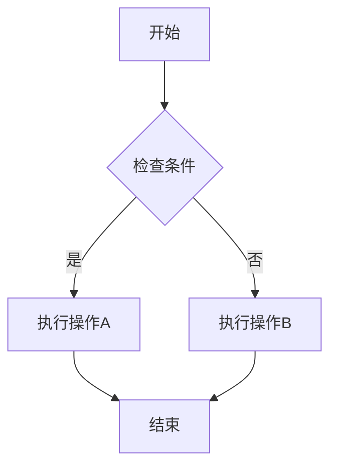
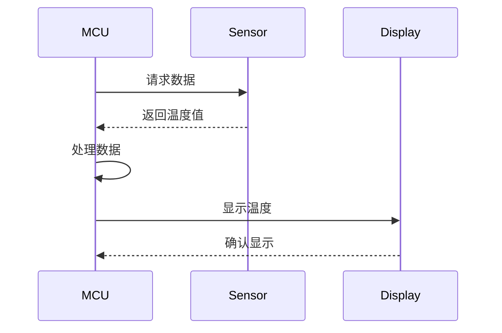
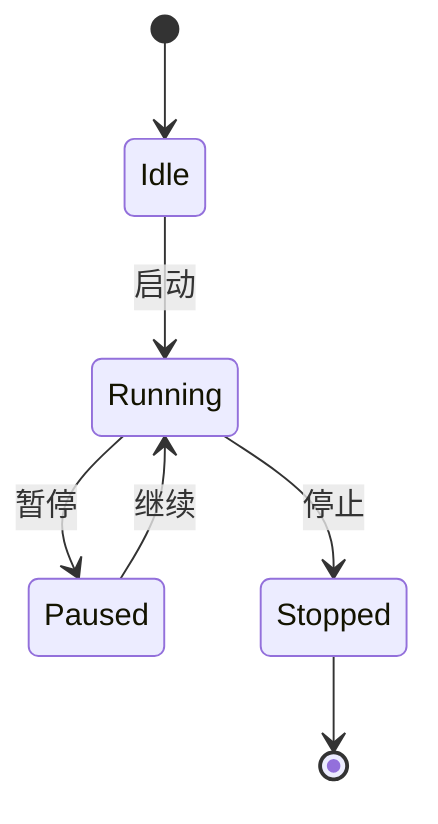
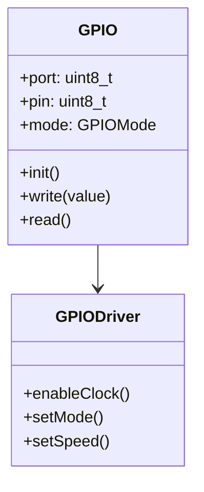
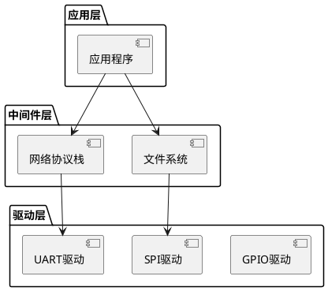

---
# 基础信息
title: "嵌入式系统技术文档编写规范"
description: "本教程介绍嵌入式系统开发中的技术文档编写规范，包括文档类型、编写标准、Markdown使用技巧、图表绘制方法和文档管理流程，帮助初学者掌握专业的技术文档编写能力"
slug: "technical-documentation"

# 分类信息
domain: "10-cross-cutting-concerns"
module: "04-project-management-career"
content_type: "tutorial"
skill_level: "beginner"

# 标签和关联
tags:
  - 技术文档
  - 文档编写
  - Markdown
  - 图表绘制
  - 文档管理
prerequisites: []
related_contents: []

# 学习信息
estimated_time: 65
difficulty_score: 2

# 作者和版本
author: "嵌入式知识平台"
author_id: ""
created_at: "2026-03-10"
updated_at: "2026-03-10"
version: "1.0"

# 语言和本地化
language: "zh-CN"
translations: []

# 状态和可见性
status: "draft"
is_featured: false
is_premium: false

# SEO和元数据
keywords:
  - 技术文档
  - 文档规范
  - Markdown教程
  - 技术写作
  - 文档管理
cover_image: ""
---

# 嵌入式系统技术文档编写规范

## 概述

技术文档是嵌入式系统开发中不可或缺的组成部分。良好的技术文档不仅能帮助团队成员理解系统设计和实现细节，还能为后续的维护、升级和知识传承提供重要支持。本教程将系统地介绍嵌入式系统开发中常见的文档类型、编写规范和最佳实践。

### 学习目标

通过本教程的学习，你将能够：

- 了解嵌入式系统开发中的主要文档类型及其用途
- 掌握技术文档的编写规范和结构设计
- 熟练使用Markdown编写格式化的技术文档
- 学会使用工具绘制专业的技术图表
- 建立有效的文档管理和版本控制流程

### 为什么技术文档很重要

在嵌入式系统开发中，技术文档的重要性体现在：

1. **知识传承**：记录设计决策和实现细节，避免知识流失
2. **团队协作**：帮助团队成员快速理解系统架构和接口
3. **问题排查**：提供调试和故障排除的参考依据
4. **质量保证**：作为代码审查和测试的重要参考
5. **客户交付**：满足客户对产品文档的要求
6. **合规要求**：满足行业标准和认证要求（如ISO 26262）

## 前置要求

### 知识要求

- 基本的嵌入式系统开发经验
- 了解软件开发流程
- 具备基本的文字表达能力

### 技能要求

- 能够使用文本编辑器
- 了解基本的文件管理操作
- 具备基本的计算机操作能力

### 环境要求

- 文本编辑器（推荐VS Code、Typora或Obsidian）
- Markdown预览工具
- 图表绘制工具（可选）
- Git版本控制工具（可选）

## 准备工作

### 软件准备

**1. 安装文本编辑器**

推荐使用VS Code，它提供了丰富的Markdown支持：

```bash
# Windows用户可以从官网下载安装
# https://code.visualstudio.com/

# 安装Markdown相关插件
# - Markdown All in One
# - Markdown Preview Enhanced
# - markdownlint
```

**2. 安装图表工具**

```bash
# 在线工具（无需安装）
# - Draw.io: https://app.diagrams.net/
# - Mermaid Live Editor: https://mermaid.live/

# 本地工具
# - PlantUML
# - Graphviz
```

### 环境配置

**配置VS Code的Markdown环境**：

```json
// settings.json
{
  "markdown.preview.fontSize": 14,
  "markdown.preview.lineHeight": 1.6,
  "[markdown]": {
    "editor.wordWrap": "on",
    "editor.quickSuggestions": false
  },
  "markdown.extension.toc.levels": "2..6"
}
```

## 步骤1：了解文档类型

### 1.1 需求文档

**用途**：描述系统的功能需求和非功能需求

**主要内容**：
- 项目背景和目标
- 功能需求列表
- 性能要求
- 接口要求
- 约束条件

**示例结构**：

```markdown
# 需求规格说明书

## 1. 引言
### 1.1 项目背景
### 1.2 项目目标
### 1.3 术语定义

## 2. 功能需求
### 2.1 用户管理
### 2.2 数据采集
### 2.3 数据处理

## 3. 非功能需求
### 3.1 性能要求
### 3.2 可靠性要求
### 3.3 安全性要求

## 4. 接口需求
### 4.1 硬件接口
### 4.2 软件接口
### 4.3 通信接口
```

### 1.2 设计文档

**用途**：描述系统的架构设计和详细设计

**主要内容**：
- 系统架构
- 模块划分
- 接口定义
- 数据结构
- 算法说明

**示例结构**：

```markdown
# 系统设计文档

## 1. 系统架构
### 1.1 整体架构
### 1.2 分层设计
### 1.3 模块关系

## 2. 模块设计
### 2.1 驱动层
### 2.2 中间件层
### 2.3 应用层

## 3. 接口设计
### 3.1 API定义
### 3.2 数据结构
### 3.3 通信协议

## 4. 数据库设计（如适用）
### 4.1 数据模型
### 4.2 表结构
```

### 1.3 API文档

**用途**：描述软件接口的使用方法

**主要内容**：
- 函数原型
- 参数说明
- 返回值说明
- 使用示例
- 注意事项

**示例格式**：

```c
/**
 * @brief  初始化GPIO引脚
 * @param  GPIOx: GPIO端口，可选值：GPIOA, GPIOB, GPIOC
 * @param  GPIO_Pin: GPIO引脚号，范围：0-15
 * @param  Mode: GPIO模式
 *         - GPIO_MODE_INPUT: 输入模式
 *         - GPIO_MODE_OUTPUT: 输出模式
 *         - GPIO_MODE_AF: 复用功能模式
 * @retval 0: 成功
 *         -1: 参数错误
 * 
 * @note   使用前需要先使能GPIO时钟
 * 
 * @example
 *   // 配置PA5为输出模式
 *   GPIO_Init(GPIOA, 5, GPIO_MODE_OUTPUT);
 */
int GPIO_Init(GPIO_TypeDef* GPIOx, uint8_t GPIO_Pin, uint32_t Mode);
```

### 1.4 用户手册

**用途**：指导用户如何使用产品

**主要内容**：
- 产品介绍
- 安装指南
- 使用说明
- 故障排除
- 常见问题

**示例结构**：

```markdown
# 用户手册

## 1. 产品介绍
### 1.1 产品概述
### 1.2 主要特性
### 1.3 技术规格

## 2. 快速入门
### 2.1 开箱检查
### 2.2 硬件连接
### 2.3 首次使用

## 3. 功能说明
### 3.1 基本功能
### 3.2 高级功能
### 3.3 配置选项

## 4. 故障排除
### 4.1 常见问题
### 4.2 错误代码
### 4.3 联系支持
```

### 1.5 测试文档

**用途**：记录测试计划、用例和结果

**主要内容**：
- 测试策略
- 测试用例
- 测试结果
- 缺陷报告

**示例结构**：

```markdown
# 测试文档

## 1. 测试计划
### 1.1 测试范围
### 1.2 测试方法
### 1.3 测试环境

## 2. 测试用例
### 2.1 功能测试
### 2.2 性能测试
### 2.3 压力测试

## 3. 测试结果
### 3.1 测试摘要
### 3.2 缺陷统计
### 3.3 测试结论
```

### 1.6 维护文档

**用途**：指导系统的维护和升级

**主要内容**：
- 系统配置
- 维护流程
- 升级指南
- 备份恢复

## 步骤2：掌握Markdown基础

### 2.1 Markdown简介

Markdown是一种轻量级标记语言，具有以下优点：

- **简单易学**：语法简洁，易于掌握
- **纯文本**：便于版本控制和协作
- **跨平台**：在任何平台都能编辑和查看
- **可转换**：可以转换为HTML、PDF等格式

### 2.2 基本语法

**标题**：

```markdown
# 一级标题
## 二级标题
### 三级标题
#### 四级标题
##### 五级标题
###### 六级标题
```

**强调**：

```markdown
*斜体文本* 或 _斜体文本_
**粗体文本** 或 __粗体文本__
***粗斜体文本*** 或 ___粗斜体文本___
~~删除线文本~~
`行内代码`
```

**列表**：

```markdown
# 无序列表
- 项目1
- 项目2
  - 子项目2.1
  - 子项目2.2
- 项目3

# 有序列表
1. 第一项
2. 第二项
3. 第三项

# 任务列表
- [x] 已完成任务
- [ ] 未完成任务
```

**链接和图片**：

```markdown
# 链接
[链接文本](https://example.com)
[带标题的链接](https://example.com "链接标题")

# 图片


# 引用式链接
[链接文本][ref]
[ref]: https://example.com "链接标题"
```

**代码块**：

````markdown
# 行内代码
使用 `printf()` 函数输出信息

# 代码块
```c
#include <stdio.h>

int main(void) {
    printf("Hello, World!\n");
    return 0;
}
```

# 带行号的代码块
```c {.line-numbers}
void delay_ms(uint32_t ms) {
    for(uint32_t i = 0; i < ms * 1000; i++) {
        __NOP();
    }
}
```
````

**表格**：

```markdown
| 参数名 | 类型 | 说明 | 默认值 |
|--------|------|------|--------|
| timeout | uint32_t | 超时时间(ms) | 1000 |
| retry | uint8_t | 重试次数 | 3 |
| mode | enum | 工作模式 | MODE_NORMAL |

# 对齐方式
| 左对齐 | 居中对齐 | 右对齐 |
|:-------|:--------:|-------:|
| 内容1  | 内容2    | 内容3  |
```

**引用**：

```markdown
> 这是一段引用文本
> 
> 可以包含多个段落
>
> > 嵌套引用
```

**分隔线**：

```markdown
---
***
___
```

### 2.3 高级语法

**脚注**：

```markdown
这是一段包含脚注的文本[^1]。

[^1]: 这是脚注的内容
```

**定义列表**：

```markdown
GPIO
: General Purpose Input/Output，通用输入输出

UART
: Universal Asynchronous Receiver/Transmitter，通用异步收发器
```

**数学公式**（需要支持LaTeX）：

```markdown
行内公式：$E = mc^2$

块级公式：
$$
\int_{0}^{\infty} e^{-x^2} dx = \frac{\sqrt{\pi}}{2}
$$
```

**目录**：

```markdown
# 自动生成目录
[TOC]

# 或使用插件生成
<!-- TOC -->
```

## 步骤3：编写结构化文档

### 3.1 文档结构设计

一个好的技术文档应该具有清晰的结构：

```markdown
# 文档标题

## 1. 概述
- 文档目的
- 适用范围
- 术语定义

## 2. 系统描述
- 系统概述
- 主要功能
- 技术特点

## 3. 详细内容
- 具体章节
- 技术细节
- 实现说明

## 4. 附录
- 参考资料
- 版本历史
- 联系方式
```

### 3.2 编写规范

**标题规范**：

```markdown
# 使用规范
- 标题层次不超过6级
- 标题前后空一行
- 标题与内容之间空一行
- 同级标题格式统一

# 示例
## 2. 系统架构

系统采用分层架构设计...

### 2.1 硬件抽象层

硬件抽象层提供...
```

**段落规范**：

```markdown
# 使用规范
- 段落之间空一行
- 每段专注一个主题
- 段落长度适中（3-5句话）
- 使用过渡词连接段落

# 示例
GPIO（General Purpose Input/Output）是微控制器最基本的外设之一。
它允许软件控制引脚的输入输出状态，实现与外部设备的交互。

在STM32系列微控制器中，GPIO被组织成多个端口。每个端口包含
最多16个引脚，可以独立配置为不同的工作模式。
```

**列表规范**：

```markdown
# 使用规范
- 有序列表用于步骤或优先级
- 无序列表用于并列项目
- 列表项简洁明了
- 子列表缩进2个空格

# 示例
GPIO初始化步骤：

1. 使能GPIO时钟
2. 配置GPIO模式
   - 输入模式
   - 输出模式
   - 复用功能模式
3. 配置GPIO参数
   - 上拉/下拉
   - 输出速度
   - 输出类型
4. 初始化GPIO
```

**代码规范**：

```markdown
# 使用规范
- 代码块必须指定语言
- 添加必要的注释
- 代码格式规范
- 提供完整示例

# 示例
```c
/**
 * @brief  GPIO初始化函数
 * @param  port: GPIO端口
 * @param  pin: 引脚号
 * @retval None
 */
void GPIO_Init(GPIO_TypeDef* port, uint16_t pin) {
    // 1. 使能时钟
    RCC_EnableClock(port);
    
    // 2. 配置模式
    GPIO_SetMode(port, pin, GPIO_MODE_OUTPUT);
    
    // 3. 配置参数
    GPIO_SetSpeed(port, pin, GPIO_SPEED_HIGH);
}
```
```

### 3.3 文档模板

**API文档模板**：

```markdown
# API文档

## 函数名称

### 函数原型
```c
返回类型 函数名(参数列表);
```

### 功能描述
简要描述函数的功能和用途。

### 参数说明
| 参数名 | 类型 | 方向 | 说明 |
|--------|------|------|------|
| param1 | type1 | in | 参数1说明 |
| param2 | type2 | out | 参数2说明 |

### 返回值
| 返回值 | 说明 |
|--------|------|
| 0 | 成功 |
| -1 | 失败 |

### 使用示例
```c
// 示例代码
```

### 注意事项
- 注意事项1
- 注意事项2

### 相关函数
- 相关函数1
- 相关函数2
```

**设计文档模板**：

```markdown
# 设计文档

## 1. 文档信息
- 文档名称：
- 版本号：
- 创建日期：
- 最后更新：
- 作者：

## 2. 变更历史
| 版本 | 日期 | 作者 | 变更内容 |
|------|------|------|----------|
| 1.0 | 2024-01-01 | 张三 | 初始版本 |

## 3. 概述
### 3.1 背景
### 3.2 目标
### 3.3 范围

## 4. 系统架构
### 4.1 整体架构
### 4.2 模块划分
### 4.3 接口定义

## 5. 详细设计
### 5.1 模块A
### 5.2 模块B
### 5.3 模块C

## 6. 数据设计
### 6.1 数据结构
### 6.2 数据流
### 6.3 数据存储

## 7. 接口设计
### 7.1 内部接口
### 7.2 外部接口
### 7.3 通信协议

## 8. 性能设计
### 8.1 性能指标
### 8.2 优化策略

## 9. 安全设计
### 9.1 安全需求
### 9.2 安全措施

## 10. 测试设计
### 10.1 测试策略
### 10.2 测试用例

## 11. 附录
### 11.1 参考资料
### 11.2 术语表
```

## 步骤4：绘制技术图表

### 4.1 使用Mermaid绘制流程图

Mermaid是一种基于文本的图表绘制工具，可以直接在Markdown中使用。

**流程图示例**：

````markdown

````

**时序图示例**：

````markdown

````

**状态图示例**：

````markdown

````

**类图示例**：

````markdown

````

### 4.2 使用PlantUML绘制UML图

PlantUML是另一个强大的文本图表工具。

**组件图示例**：



### 4.3 使用Draw.io绘制架构图

Draw.io是一个在线图表工具，适合绘制复杂的架构图。

**使用步骤**：

1. 访问 https://app.diagrams.net/
2. 选择存储位置（本地、Google Drive等）
3. 创建新图表
4. 使用拖拽方式添加组件
5. 导出为PNG或SVG格式
6. 在Markdown中引用

**架构图示例**：

```markdown


系统采用分层架构设计，从下到上分为：
- 硬件层：MCU、传感器、执行器
- 驱动层：GPIO、UART、SPI等驱动
- 中间件层：RTOS、文件系统、网络协议栈
- 应用层：业务逻辑和用户界面
```

### 4.4 图表使用规范

```markdown
# 图表规范
1. 图表必须有标题和编号
2. 图表必须有说明文字
3. 图表清晰易读
4. 图表格式统一
5. 图表文件命名规范

# 示例
图3-1：GPIO初始化流程图


上图展示了GPIO初始化的完整流程，包括时钟使能、模式配置、
参数设置和初始化确认四个主要步骤。
```

## 步骤5：建立文档管理流程

### 5.1 文档版本控制

使用Git进行文档版本控制：

```bash
# 初始化Git仓库
git init

# 添加文档文件
git add docs/

# 提交变更
git commit -m "docs: 添加API文档"

# 创建版本标签
git tag -a v1.0 -m "版本1.0文档"

# 推送到远程仓库
git push origin main
git push origin v1.0
```

**提交信息规范**：

```bash
# 格式：<类型>: <描述>

# 类型
docs: 文档变更
feat: 新增功能文档
fix: 修正文档错误
style: 格式调整
refactor: 文档重构

# 示例
git commit -m "docs: 更新GPIO驱动API文档"
git commit -m "fix: 修正UART配置示例中的错误"
git commit -m "feat: 添加SPI驱动使用指南"
```

### 5.2 文档目录结构

建立清晰的文档目录结构：

```
project/
├── docs/
│   ├── requirements/          # 需求文档
│   │   ├── SRS.md            # 软件需求规格说明
│   │   └── use-cases.md      # 用例文档
│   ├── design/               # 设计文档
│   │   ├── architecture.md   # 架构设计
│   │   ├── detailed-design.md # 详细设计
│   │   └── database.md       # 数据库设计
│   ├── api/                  # API文档
│   │   ├── gpio.md          # GPIO API
│   │   ├── uart.md          # UART API
│   │   └── spi.md           # SPI API
│   ├── user-guide/           # 用户手册
│   │   ├── quick-start.md   # 快速入门
│   │   ├── user-manual.md   # 用户手册
│   │   └── faq.md           # 常见问题
│   ├── test/                 # 测试文档
│   │   ├── test-plan.md     # 测试计划
│   │   ├── test-cases.md    # 测试用例
│   │   └── test-report.md   # 测试报告
│   ├── assets/               # 资源文件
│   │   ├── images/          # 图片
│   │   ├── diagrams/        # 图表源文件
│   │   └── templates/       # 文档模板
│   └── README.md            # 文档索引
```

### 5.3 文档命名规范

```markdown
# 命名规范
- 使用小写字母
- 单词之间用短横线连接
- 文件名要有意义
- 包含版本号（可选）

# 示例
good:
  - gpio-driver-api.md
  - system-architecture-v1.0.md
  - user-manual-zh-cn.md

bad:
  - doc1.md
  - GPIO_API.md
  - 用户手册.md
```

### 5.4 文档审查流程

建立文档审查机制：

```yaml
审查流程:
  1. 作者自查:
     - 检查格式规范
     - 检查内容完整性
     - 检查技术准确性
     - 运行拼写检查

  2. 同行评审:
     - 指定评审人员
     - 提交评审请求
     - 收集评审意见
     - 修改文档

  3. 技术审查:
     - 技术专家审查
     - 验证技术细节
     - 确认示例代码
     - 批准发布

  4. 发布归档:
     - 更新版本号
     - 生成PDF版本
     - 发布到文档库
     - 通知相关人员
```

### 5.5 文档更新维护

```markdown
# 更新触发条件
- 代码功能变更
- 发现文档错误
- 用户反馈问题
- 定期审查更新

# 更新流程
1. 识别需要更新的文档
2. 评估更新范围和影响
3. 更新文档内容
4. 更新版本号和变更历史
5. 重新审查和发布

# 版本号规则
- 主版本号：重大变更
- 次版本号：功能增加
- 修订号：错误修正

示例：v1.2.3
  1 - 主版本号
  2 - 次版本号
  3 - 修订号
```

## 验证方法

### 验证清单

完成文档编写后，使用以下清单进行验证：

```markdown
## 格式检查
- [ ] 标题层次正确
- [ ] 代码块有语言标识
- [ ] 图片有描述文字
- [ ] 链接有效
- [ ] 表格格式正确

## 内容检查
- [ ] 内容完整
- [ ] 逻辑清晰
- [ ] 术语统一
- [ ] 示例正确
- [ ] 无拼写错误

## 技术检查
- [ ] 技术描述准确
- [ ] 代码可以运行
- [ ] 参数说明正确
- [ ] 接口定义清晰
- [ ] 版本信息准确

## 可读性检查
- [ ] 语言流畅
- [ ] 结构清晰
- [ ] 重点突出
- [ ] 易于理解
- [ ] 格式美观
```

### 使用工具验证

**1. Markdown语法检查**：

```bash
# 使用markdownlint检查
markdownlint docs/**/*.md

# 使用VS Code插件
# 安装 markdownlint 插件
# 自动检查语法错误
```

**2. 链接有效性检查**：

```bash
# 使用markdown-link-check
npm install -g markdown-link-check
markdown-link-check docs/**/*.md

# 检查所有链接是否有效
```

**3. 拼写检查**：

```bash
# 使用cspell
npm install -g cspell
cspell docs/**/*.md

# 或使用VS Code的Code Spell Checker插件
```

### 预期结果

完成本教程后，你应该能够：

1. **创建规范的技术文档**
   - 文档结构清晰
   - 格式规范统一
   - 内容完整准确

2. **熟练使用Markdown**
   - 掌握基本语法
   - 使用高级特性
   - 编写格式化文档

3. **绘制专业图表**
   - 使用Mermaid绘制流程图
   - 使用PlantUML绘制UML图
   - 使用Draw.io绘制架构图

4. **建立文档管理流程**
   - 版本控制
   - 目录组织
   - 审查发布

## 故障排除

### 常见问题

**Q1: Markdown预览显示不正常**

```markdown
问题：代码块或图表无法正确显示

解决方案：
1. 检查代码块的语言标识是否正确
2. 确认Markdown编辑器支持相应的扩展
3. 尝试使用不同的Markdown编辑器
4. 检查是否有语法错误
```

**Q2: 图片无法显示**

```markdown
问题：文档中的图片显示为损坏图标

解决方案：
1. 检查图片路径是否正确
2. 确认图片文件是否存在
3. 使用相对路径而不是绝对路径
4. 检查图片文件名是否包含特殊字符
5. 确认图片格式是否支持（PNG、JPG、SVG）
```

**Q3: Mermaid图表不显示**

```markdown
问题：Mermaid代码块显示为纯文本

解决方案：
1. 确认编辑器支持Mermaid
2. 安装Mermaid相关插件
3. 检查Mermaid语法是否正确
4. 尝试在Mermaid Live Editor中测试
5. 更新编辑器到最新版本
```

**Q4: 文档转换为PDF时格式错乱**

```markdown
问题：Markdown转PDF后格式不正确

解决方案：
1. 使用专业的转换工具（Pandoc、Typora）
2. 调整CSS样式
3. 检查特殊字符和符号
4. 简化复杂的表格和图表
5. 使用PDF导出插件
```

**Q5: 中文字符显示乱码**

```markdown
问题：文档中的中文显示为乱码

解决方案：
1. 确保文件编码为UTF-8
2. 在文件开头添加BOM标记（可选）
3. 检查编辑器的编码设置
4. 使用支持UTF-8的编辑器
5. 转换文件编码格式
```

### 调试技巧

**1. 使用在线工具验证**：

```markdown
# Markdown验证
- Dillinger: https://dillinger.io/
- StackEdit: https://stackedit.io/

# Mermaid验证
- Mermaid Live Editor: https://mermaid.live/

# PlantUML验证
- PlantUML Online: http://www.plantuml.com/plantuml/
```

**2. 分段测试**：

```markdown
# 如果文档很长，可以分段测试
1. 将文档分成多个小文件
2. 逐个文件测试
3. 定位问题所在
4. 修复后合并
```

**3. 使用版本控制**：

```bash
# 使用Git追踪变更
git diff                    # 查看变更
git log --oneline          # 查看历史
git checkout <commit>      # 回退到之前版本
```

## 总结

技术文档是嵌入式系统开发中的重要组成部分。通过本教程，我们学习了：

### 关键要点

1. **文档类型**
   - 需求文档：描述系统需求
   - 设计文档：描述系统设计
   - API文档：描述接口使用
   - 用户手册：指导用户使用
   - 测试文档：记录测试过程

2. **Markdown技能**
   - 基本语法：标题、列表、链接、图片
   - 高级语法：表格、代码块、数学公式
   - 扩展功能：Mermaid图表、PlantUML

3. **文档规范**
   - 结构清晰：层次分明，逻辑连贯
   - 格式统一：遵循编写规范
   - 内容准确：技术描述正确
   - 易于维护：版本控制，定期更新

4. **图表绘制**
   - Mermaid：流程图、时序图、状态图
   - PlantUML：UML图、组件图
   - Draw.io：架构图、系统图

5. **文档管理**
   - 版本控制：使用Git管理
   - 目录组织：清晰的文件结构
   - 审查流程：确保文档质量
   - 持续维护：及时更新文档

### 最佳实践

```markdown
1. 文档先行
   - 在编码前编写设计文档
   - 在发布前编写用户文档
   - 在测试前编写测试文档

2. 保持更新
   - 代码变更时同步更新文档
   - 定期审查文档准确性
   - 及时修正文档错误

3. 注重质量
   - 内容准确完整
   - 格式规范统一
   - 语言简洁清晰
   - 示例正确可用

4. 便于维护
   - 使用版本控制
   - 建立文档模板
   - 自动化检查
   - 团队协作

5. 用户导向
   - 考虑读者需求
   - 提供清晰示例
   - 包含故障排除
   - 持续改进
```

### 下一步学习

- 深入学习Markdown高级特性
- 掌握更多图表绘制工具
- 学习文档自动化生成（Doxygen、Sphinx）
- 了解文档即代码（Docs as Code）理念
- 探索API文档工具（Swagger、OpenAPI）

## 延伸阅读

### 推荐资源

**书籍**：
- 《技术写作：原理与实践》
- 《The Docs Book》
- 《Docs Like Code》

**在线资源**：
- Markdown Guide: https://www.markdownguide.org/
- Mermaid Documentation: https://mermaid-js.github.io/
- PlantUML Guide: https://plantuml.com/
- Write the Docs: https://www.writethedocs.org/

**工具推荐**：
- VS Code + Markdown插件
- Typora（所见即所得编辑器）
- Obsidian（知识管理工具）
- GitBook（文档发布平台）
- Read the Docs（文档托管平台）

### 相关内容

- [嵌入式项目管理概述](01-embedded-project-management.html) - 了解项目管理中的文档需求
- [需求分析与管理](02-requirements-analysis.html) - 学习如何编写需求文档
- [敏捷开发在嵌入式中的应用](03-agile-in-embedded.html) - 了解敏捷开发中的文档实践
- [代码审查最佳实践](05-code-review-best-practices.html) - 学习代码文档的编写

## 实践练习

### 练习1：编写API文档

为以下GPIO函数编写完整的API文档：

```c
int GPIO_Init(GPIO_TypeDef* GPIOx, uint16_t GPIO_Pin, uint32_t Mode);
void GPIO_WritePin(GPIO_TypeDef* GPIOx, uint16_t GPIO_Pin, uint8_t PinState);
uint8_t GPIO_ReadPin(GPIO_TypeDef* GPIOx, uint16_t GPIO_Pin);
```

要求：
- 包含函数原型
- 详细的参数说明
- 返回值说明
- 使用示例
- 注意事项

### 练习2：绘制系统架构图

使用Mermaid绘制一个简单的嵌入式系统架构图，包含：
- 硬件层
- 驱动层
- 中间件层
- 应用层

### 练习3：创建用户手册

为一个简单的LED控制系统编写用户手册，包含：
- 产品介绍
- 快速入门
- 功能说明
- 故障排除

---

**版本历史**：
- v1.0 (2026-03-10): 初始版本，涵盖文档类型、Markdown使用、图表绘制和文档管理
