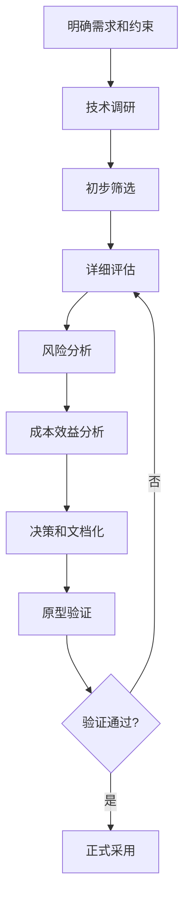
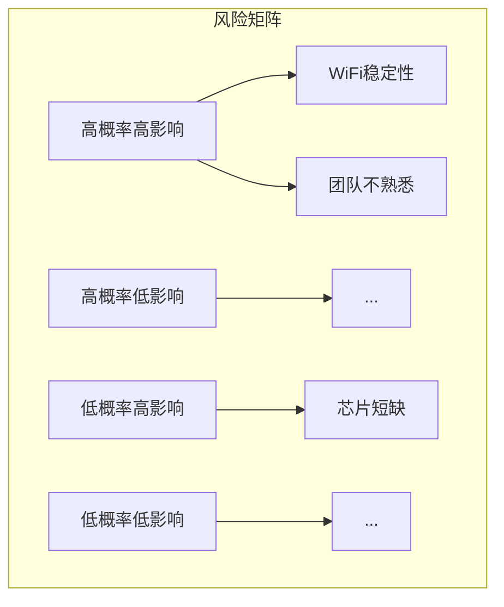

# 嵌入式技术选型与评估：系统化的决策方法

## 学习目标


完成本教程后，你将能够：

- 理解技术选型的重要性和常见误区
- 掌握系统化的技术选型方法和流程
- 学会使用多维度评估模型进行技术对比
- 能够进行风险评估和成本效益分析
- 掌握技术选型决策的文档化方法

## 前置要求

- 具备嵌入式系统开发基础知识
- 了解常见的嵌入式硬件平台和软件技术
- 有一定的项目经验
- 理解项目管理基本概念

## 准备工作

### 工具准备

- 电子表格软件（Excel、Google Sheets）
- 思维导图工具（XMind、MindManager）
- 文档编辑器（Word、Markdown编辑器）

### 知识准备

- 了解项目的基本需求和约束
- 收集候选技术的基本信息
- 准备评估所需的技术文档

## 为什么技术选型如此重要

### 技术选型的影响

技术选型是嵌入式项目中最关键的决策之一，它会影响：

**开发效率**：
- 合适的技术栈可以提高开发速度50%以上
- 成熟的生态系统减少重复造轮子
- 良好的工具链支持降低学习成本

**项目成本**：
- 硬件成本：芯片、外设、PCB复杂度
- 开发成本：人力、时间、工具许可
- 维护成本：长期支持、升级、技术债务

**产品质量**：
- 性能：处理能力、功耗、实时性
- 可靠性：稳定性、容错能力
- 可维护性：代码质量、文档完整性

**长期风险**：
- 技术生命周期：芯片停产、技术过时
- 供应链风险：芯片短缺、价格波动
- 技术锁定：难以迁移、依赖单一供应商

### 常见的选型误区

**误区1：盲目追新**
```text
❌ 错误做法：
"这个新芯片性能很强，我们用它！"
（没有考虑生态成熟度、文档完整性、团队学习成本）

✅ 正确做法：
评估新技术的成熟度、社区支持、学习曲线
对于关键项目，优先选择成熟稳定的技术
```

**误区2：过度设计**
```text
❌ 错误做法：
"选最强的芯片，以后扩展方便！"
（导致成本过高、功耗过大、开发复杂度增加）

✅ 正确做法：
根据实际需求选择，预留20-30%的性能余量
避免为不确定的未来需求买单
```

**误区3：经验主义**
```text
❌ 错误做法：
"我们一直用这个，继续用就行！"
（忽视技术进步、错过更优方案）

✅ 正确做法：
定期评估新技术，保持技术栈的竞争力
在非关键项目中尝试新技术
```

**误区4：忽视生态**
```text
❌ 错误做法：
"这个芯片参数很好，就选它！"
（忽视开发工具、库支持、社区资源）

✅ 正确做法：
评估完整的生态系统
考虑开发效率和长期维护
```

## 技术选型的系统化方法

### 选型流程概览



### 步骤1：明确需求和约束

#### 功能需求

列出系统必须实现的功能：

```markdown
功能需求清单：
□ 处理能力：需要处理的数据量、计算复杂度
□ 接口需求：GPIO、UART、SPI、I2C、USB、以太网等
□ 存储需求：Flash、RAM、外部存储
□ 通信需求：WiFi、蓝牙、LoRa、4G/5G
□ 显示需求：LCD、OLED、触摸屏
□ 传感器需求：温度、湿度、加速度、陀螺仪等
□ 实时性要求：响应时间、中断延迟
□ 安全需求：加密、认证、安全启动
```

#### 非功能需求


定义系统的质量属性：

```markdown
非功能需求清单：
□ 性能：CPU频率、内存大小、处理速度
□ 功耗：工作功耗、待机功耗、电池寿命
□ 成本：单片成本、开发成本、总体拥有成本
□ 尺寸：PCB尺寸、封装大小、重量
□ 可靠性：MTBF、工作温度范围、抗干扰能力
□ 可维护性：代码可读性、调试便利性、升级能力
□ 可扩展性：未来功能扩展、硬件升级
□ 兼容性：与现有系统的兼容性
```

#### 项目约束

识别项目的限制条件：

| 约束类型 | 具体约束 | 影响 |
|---------|---------|------|
| 时间约束 | 6个月内上市 | 优先选择成熟技术 |
| 成本约束 | 单片成本<10元 | 排除高端芯片 |
| 团队约束 | 团队熟悉ARM Cortex-M | 优先考虑ARM架构 |
| 供应链约束 | 必须有国产替代方案 | 考虑国产芯片 |
| 认证约束 | 需要通过CE/FCC认证 | 选择有认证支持的方案 |

### 步骤2：技术调研

#### 信息来源

**官方渠道**：
- 芯片厂商官网和技术文档
- 开发板和评估套件
- 官方论坛和技术支持

**社区资源**：
- GitHub开源项目
- 技术博客和教程
- Stack Overflow问答
- 技术社区（CSDN、博客园）

**行业资源**：
- 技术会议和研讨会
- 行业报告和白皮书
- 竞品分析
- 供应商推荐

#### 调研内容模板

```markdown
## 技术方案：STM32F4系列

### 基本信息
- 厂商：STMicroelectronics
- 架构：ARM Cortex-M4
- 主频：最高180MHz
- Flash：512KB - 2MB
- RAM：192KB - 384KB

### 技术特性
- 浮点运算单元（FPU）
- DSP指令集
- 丰富的外设接口
- 低功耗模式

### 生态系统
- 开发工具：STM32CubeIDE、Keil、IAR
- HAL库：完善的硬件抽象层
- 中间件：FreeRTOS、LwIP、USB、FatFS
- 社区：活跃的开发者社区

### 成本和供应
- 单片价格：$3-8（取决于型号）
- 供货周期：稳定
- 生命周期：长期供货保证

### 优势
- 成熟稳定，文档完善
- 生态系统丰富
- 性价比高
- 团队熟悉

### 劣势
- 性能相对较低（对比高端芯片）
- 功耗不是最优
- 部分型号供货紧张
```

### 步骤3：初步筛选

#### 筛选标准

建立"必须满足"的硬性标准：

```python
# 筛选标准示例
def initial_filter(candidate):
    """初步筛选函数"""
    # 硬性要求
    if candidate.cpu_freq < 100:  # MHz
        return False, "CPU频率不足"
    
    if candidate.flash < 256:  # KB
        return False, "Flash容量不足"
    
    if candidate.ram < 64:  # KB
        return False, "RAM容量不足"
    
    if candidate.price > 10:  # USD
        return False, "成本超出预算"
    
    if not candidate.has_wifi:
        return False, "缺少WiFi功能"
    
    if candidate.power_consumption > 500:  # mW
        return False, "功耗过高"
    
    return True, "通过初步筛选"

# 应用筛选
candidates = [stm32f4, esp32, nrf52, rp2040]
shortlist = [c for c in candidates if initial_filter(c)[0]]
```

#### 筛选结果

| 候选方案 | CPU | Flash | RAM | WiFi | 价格 | 功耗 | 结果 |
|---------|-----|-------|-----|------|------|------|------|
| STM32F4 | 180MHz | 1MB | 192KB | ❌ | $5 | 100mW | ❌ 无WiFi |
| ESP32 | 240MHz | 4MB | 520KB | ✅ | $3 | 160mW | ✅ 通过 |
| NRF52840 | 64MHz | 1MB | 256KB | ❌ | $4 | 50mW | ❌ 无WiFi |
| RP2040 | 133MHz | 外部 | 264KB | ❌ | $1 | 80mW | ❌ 无WiFi |

**筛选结果**：ESP32进入详细评估阶段

### 步骤4：详细评估

#### 多维度评估模型

使用加权评分法进行详细评估：

```markdown
## 评估维度和权重

### 1. 技术能力 (30%)
- 处理性能 (10%)
- 内存容量 (8%)
- 外设接口 (7%)
- 实时性能 (5%)

### 2. 开发效率 (25%)
- 开发工具 (8%)
- 库和中间件 (7%)
- 文档质量 (5%)
- 社区支持 (5%)

### 3. 成本 (20%)
- 硬件成本 (10%)
- 开发成本 (6%)
- 维护成本 (4%)

### 4. 可靠性 (15%)
- 稳定性 (6%)
- 供应链 (5%)
- 生命周期 (4%)

### 5. 可扩展性 (10%)
- 性能余量 (5%)
- 接口扩展 (3%)
- 软件升级 (2%)
```

#### 评分表格


| 评估维度 | 权重 | ESP32 | STM32+WiFi模块 | 评分说明 |
|---------|------|-------|----------------|---------|
| **技术能力** | 30% | | | |
| 处理性能 | 10% | 9 | 8 | ESP32双核240MHz，STM32单核180MHz |
| 内存容量 | 8% | 10 | 7 | ESP32: 520KB RAM，STM32: 192KB |
| 外设接口 | 7% | 8 | 9 | STM32外设更丰富 |
| 实时性能 | 5% | 7 | 9 | STM32实时性更好 |
| **开发效率** | 25% | | | |
| 开发工具 | 8% | 8 | 9 | 两者都有完善的IDE |
| 库和中间件 | 7% | 9 | 8 | ESP32 WiFi库更成熟 |
| 文档质量 | 5% | 8 | 9 | STM32文档更完善 |
| 社区支持 | 5% | 9 | 8 | ESP32社区更活跃 |
| **成本** | 20% | | | |
| 硬件成本 | 10% | 10 | 6 | ESP32 $3，STM32+WiFi $8 |
| 开发成本 | 6% | 8 | 7 | ESP32学习曲线稍陡 |
| 维护成本 | 4% | 8 | 8 | 相当 |
| **可靠性** | 15% | | | |
| 稳定性 | 6% | 7 | 9 | STM32更稳定 |
| 供应链 | 5% | 8 | 7 | ESP32供货更稳定 |
| 生命周期 | 4% | 8 | 9 | STM32生命周期更长 |
| **可扩展性** | 10% | | | |
| 性能余量 | 5% | 9 | 7 | ESP32性能余量更大 |
| 接口扩展 | 3% | 8 | 9 | STM32接口更灵活 |
| 软件升级 | 2% | 9 | 8 | ESP32 OTA更方便 |
| **加权总分** | 100% | **8.4** | **7.9** | ESP32略胜一筹 |

#### 评分计算

```python
def calculate_weighted_score(scores, weights):
    """计算加权总分"""
    total_score = 0
    for dimension, weight in weights.items():
        score = scores[dimension]
        total_score += score * weight
    return total_score

# ESP32评分
esp32_scores = {
    '处理性能': 9,
    '内存容量': 10,
    '外设接口': 8,
    '实时性能': 7,
    '开发工具': 8,
    '库和中间件': 9,
    '文档质量': 8,
    '社区支持': 9,
    '硬件成本': 10,
    '开发成本': 8,
    '维护成本': 8,
    '稳定性': 7,
    '供应链': 8,
    '生命周期': 8,
    '性能余量': 9,
    '接口扩展': 8,
    '软件升级': 9
}

weights = {
    '处理性能': 0.10,
    '内存容量': 0.08,
    '外设接口': 0.07,
    '实时性能': 0.05,
    '开发工具': 0.08,
    '库和中间件': 0.07,
    '文档质量': 0.05,
    '社区支持': 0.05,
    '硬件成本': 0.10,
    '开发成本': 0.06,
    '维护成本': 0.04,
    '稳定性': 0.06,
    '供应链': 0.05,
    '生命周期': 0.04,
    '性能余量': 0.05,
    '接口扩展': 0.03,
    '软件升级': 0.02
}

esp32_total = calculate_weighted_score(esp32_scores, weights)
print(f"ESP32总分: {esp32_total:.1f}")  # 输出: 8.4
```

### 步骤5：风险分析

#### 风险识别

识别每个候选方案的潜在风险：

**ESP32风险分析**：

| 风险类别 | 具体风险 | 概率 | 影响 | 风险等级 | 应对措施 |
|---------|---------|------|------|---------|---------|
| 技术风险 | WiFi稳定性问题 | 中 | 高 | 高 | 充分测试，准备降级方案 |
| 技术风险 | 功耗高于预期 | 中 | 中 | 中 | 优化代码，使用低功耗模式 |
| 供应链风险 | 芯片短缺 | 低 | 高 | 中 | 提前备货，寻找替代方案 |
| 团队风险 | 团队不熟悉ESP32 | 高 | 中 | 高 | 培训，技术预研 |
| 生态风险 | 第三方库质量参差 | 中 | 中 | 中 | 代码审查，充分测试 |

**风险矩阵**：



#### 风险应对策略

**高风险项应对**：

```markdown
## 风险1：WiFi稳定性问题

### 应对措施：
1. **技术预研**（2周）
   - 搭建测试环境
   - 进行长时间稳定性测试
   - 测试各种网络环境

2. **备选方案**
   - 准备STM32+外置WiFi模块方案
   - 评估切换成本和时间

3. **降级策略**
   - 设计离线工作模式
   - 减少对WiFi的依赖

## 风险2：团队不熟悉ESP32

### 应对措施：
1. **培训计划**（1周）
   - 官方文档学习
   - 示例代码实践
   - 技术分享会

2. **技术支持**
   - 联系厂商技术支持
   - 加入开发者社区
   - 必要时引入外部专家

3. **降低复杂度**
   - 使用Arduino框架快速上手
   - 逐步过渡到ESP-IDF
```

### 步骤6：成本效益分析

#### 总体拥有成本（TCO）

计算完整的成本：

```markdown
## ESP32方案TCO分析（1000台产量）

### 硬件成本
- 芯片成本：$3 × 1000 = $3,000
- PCB成本：$2 × 1000 = $2,000
- 其他元器件：$5 × 1000 = $5,000
- 组装测试：$2 × 1000 = $2,000
**硬件小计：$12,000**

### 开发成本
- 硬件设计：2周 × $5,000/周 = $10,000
- 软件开发：8周 × $6,000/周 = $48,000
- 测试验证：3周 × $5,000/周 = $15,000
- 培训学习：1周 × $4,000/周 = $4,000
**开发小计：$77,000**

### 工具和许可
- 开发工具：免费（ESP-IDF）
- 调试器：$500
- 测试设备：$2,000
**工具小计：$2,500**

### 维护成本（年）
- 技术支持：$10,000/年
- 软件更新：$5,000/年
- 备件库存：$2,000/年
**维护小计：$17,000/年**

### 5年TCO
- 初始投资：$91,500
- 5年维护：$85,000
**总计：$176,500**

### 单台成本
- 初始：$91.50/台
- 5年：$176.50/台
```

#### 对比分析

| 成本项 | ESP32 | STM32+WiFi | 差异 |
|-------|-------|------------|------|
| 硬件成本 | $12,000 | $18,000 | -$6,000 |
| 开发成本 | $77,000 | $70,000 | +$7,000 |
| 工具成本 | $2,500 | $5,000 | -$2,500 |
| 5年维护 | $85,000 | $80,000 | +$5,000 |
| **5年总计** | **$176,500** | **$173,000** | **+$3,500** |

**结论**：ESP32硬件成本更低，但开发和维护成本稍高，总体成本相当。

#### 效益分析


**定量效益**：

| 效益项 | ESP32 | STM32+WiFi | 说明 |
|-------|-------|------------|------|
| 上市时间 | 6个月 | 7个月 | ESP32集成度高 |
| 单台利润 | $20 | $15 | ESP32成本更低 |
| 市场份额 | 15% | 12% | 更早上市优势 |
| 年销量 | 10,000 | 8,000 | 市场份额影响 |
| **年利润** | **$200,000** | **$120,000** | **+$80,000** |

**定性效益**：
- 技术积累：掌握WiFi技术栈
- 团队成长：学习新技术
- 品牌形象：技术领先
- 未来机会：可复用到其他产品

### 步骤7：决策和文档化

#### 决策矩阵

综合所有因素做出决策：

```markdown
## 技术选型决策矩阵

### 评估结果汇总
| 维度 | 权重 | ESP32 | STM32+WiFi | 优势方 |
|------|------|-------|------------|--------|
| 技术评分 | 40% | 8.4 | 7.9 | ESP32 |
| 风险等级 | 20% | 中 | 低 | STM32 |
| 成本效益 | 30% | 高 | 中 | ESP32 |
| 团队意见 | 10% | 支持 | 中立 | ESP32 |

### 综合评分
- ESP32：8.2分
- STM32+WiFi：7.5分

### 决策建议
**推荐方案：ESP32**

### 决策理由
1. 技术评分更高，性价比优势明显
2. 虽然风险稍高，但可控且有应对措施
3. 长期效益更好，有利于技术积累
4. 团队愿意学习新技术

### 前提条件
1. 完成2周技术预研，验证WiFi稳定性
2. 完成团队培训
3. 准备备选方案（STM32+WiFi）
4. 建立风险监控机制
```

#### 决策文档模板

```markdown
# 技术选型决策文档

## 项目信息
- 项目名称：智能温控器
- 决策日期：2026-03-10
- 决策人：技术委员会
- 参与人：项目经理、架构师、硬件工程师、软件工程师

## 选型背景
[描述为什么需要进行技术选型]

## 候选方案
[列出所有候选方案及其基本信息]

## 评估过程
[描述评估方法、评估维度、评分标准]

## 评估结果
[展示评估结果、对比分析]

## 风险分析
[识别的风险及应对措施]

## 成本效益分析
[TCO分析、效益预测]

## 最终决策
[选定的方案及决策理由]

## 实施计划
[技术预研、培训、开发计划]

## 审批记录
- 技术负责人：[签名] [日期]
- 项目经理：[签名] [日期]
- 部门经理：[签名] [日期]
```

### 步骤8：原型验证

#### 验证计划

```markdown
## ESP32技术验证计划

### 验证目标
1. 验证WiFi连接稳定性
2. 验证功耗是否满足要求
3. 验证开发工具链是否好用
4. 验证团队学习曲线

### 验证任务
| 任务 | 负责人 | 工期 | 验收标准 |
|------|-------|------|---------|
| 搭建开发环境 | 张三 | 2天 | 能编译运行示例 |
| WiFi连接测试 | 李四 | 3天 | 连接成功率>99% |
| 功耗测试 | 王五 | 2天 | 工作功耗<200mW |
| 核心功能原型 | 团队 | 5天 | 实现温度采集和WiFi上报 |
| 稳定性测试 | 测试 | 3天 | 连续运行72小时无故障 |

### 验证环境
- 硬件：ESP32-DevKitC开发板
- 软件：ESP-IDF v5.0
- 工具：示波器、功耗分析仪
- 网络：实验室WiFi环境

### 验证标准
- WiFi连接成功率 ≥ 99%
- 平均功耗 ≤ 200mW
- 开发环境搭建时间 ≤ 4小时
- 核心功能实现时间 ≤ 5天
- 72小时稳定性测试通过
```

#### 验证实施

**第1天：环境搭建**

```bash
# 安装ESP-IDF
git clone --recursive https://github.com/espressif/esp-idf.git
cd esp-idf
./install.sh

# 配置环境变量
. ./export.sh

# 测试编译
cd examples/get-started/hello_world
idf.py build
idf.py flash monitor
```

**第2-3天：WiFi测试**

```c
// wifi_test.c - WiFi连接稳定性测试
#include "esp_wifi.h"
#include "esp_event.h"
#include "nvs_flash.h"

#define WIFI_SSID "TestAP"
#define WIFI_PASS "password"
#define TEST_DURATION_HOURS 72
#define RECONNECT_INTERVAL_MS 5000

static int connect_count = 0;
static int disconnect_count = 0;

static void wifi_event_handler(void* arg, esp_event_base_t event_base,
                               int32_t event_id, void* event_data) {
    if (event_id == WIFI_EVENT_STA_START) {
        esp_wifi_connect();
    } else if (event_id == WIFI_EVENT_STA_DISCONNECTED) {
        disconnect_count++;
        ESP_LOGI("WiFi", "Disconnected, count: %d", disconnect_count);
        vTaskDelay(pdMS_TO_TICKS(RECONNECT_INTERVAL_MS));
        esp_wifi_connect();
    } else if (event_id == IP_EVENT_STA_GOT_IP) {
        connect_count++;
        ESP_LOGI("WiFi", "Connected, count: %d", connect_count);
    }
}

void app_main(void) {
    // 初始化NVS
    nvs_flash_init();
    
    // 初始化WiFi
    esp_netif_init();
    esp_event_loop_create_default();
    esp_netif_create_default_wifi_sta();
    
    wifi_init_config_t cfg = WIFI_INIT_CONFIG_DEFAULT();
    esp_wifi_init(&cfg);
    
    // 注册事件处理
    esp_event_handler_register(WIFI_EVENT, ESP_EVENT_ANY_ID, 
                               &wifi_event_handler, NULL);
    esp_event_handler_register(IP_EVENT, IP_EVENT_STA_GOT_IP, 
                               &wifi_event_handler, NULL);
    
    // 配置WiFi
    wifi_config_t wifi_config = {
        .sta = {
            .ssid = WIFI_SSID,
            .password = WIFI_PASS,
        },
    };
    
    esp_wifi_set_mode(WIFI_MODE_STA);
    esp_wifi_set_config(WIFI_IF_STA, &wifi_config);
    esp_wifi_start();
    
    // 运行测试
    ESP_LOGI("WiFi", "Starting %d hour stability test", TEST_DURATION_HOURS);
    vTaskDelay(pdMS_TO_TICKS(TEST_DURATION_HOURS * 3600 * 1000));
    
    // 输出统计
    float success_rate = (float)connect_count / (connect_count + disconnect_count) * 100;
    ESP_LOGI("WiFi", "Test completed:");
    ESP_LOGI("WiFi", "  Connects: %d", connect_count);
    ESP_LOGI("WiFi", "  Disconnects: %d", disconnect_count);
    ESP_LOGI("WiFi", "  Success rate: %.2f%%", success_rate);
}
```

**第4-5天：功耗测试**

```c
// power_test.c - 功耗测试
#include "esp_pm.h"
#include "esp_sleep.h"

void test_active_power(void) {
    // 测试活动模式功耗
    ESP_LOGI("Power", "Testing active mode power consumption");
    
    // 执行典型工作负载
    for (int i = 0; i < 1000000; i++) {
        // 模拟计算任务
        volatile int result = i * i;
    }
    
    // 使用功耗分析仪测量平均功耗
    // 预期：约160mW @ 240MHz
}

void test_light_sleep_power(void) {
    // 测试轻度睡眠功耗
    ESP_LOGI("Power", "Testing light sleep power consumption");
    
    // 配置唤醒源
    esp_sleep_enable_timer_wakeup(1000000);  // 1秒后唤醒
    
    // 进入轻度睡眠
    esp_light_sleep_start();
    
    // 预期：约0.8mW
}

void test_deep_sleep_power(void) {
    // 测试深度睡眠功耗
    ESP_LOGI("Power", "Testing deep sleep power consumption");
    
    // 配置唤醒源
    esp_sleep_enable_timer_wakeup(10000000);  // 10秒后唤醒
    
    // 进入深度睡眠
    esp_deep_sleep_start();
    
    // 预期：约10μA
}

void app_main(void) {
    // 配置电源管理
    esp_pm_config_esp32_t pm_config = {
        .max_freq_mhz = 240,
        .min_freq_mhz = 80,
        .light_sleep_enable = true
    };
    esp_pm_configure(&pm_config);
    
    // 运行功耗测试
    test_active_power();
    vTaskDelay(pdMS_TO_TICKS(5000));
    
    test_light_sleep_power();
    vTaskDelay(pdMS_TO_TICKS(5000));
    
    test_deep_sleep_power();
}
```

#### 验证结果

```markdown
## 验证结果报告

### WiFi稳定性测试
- 测试时长：72小时
- 连接次数：1,440次（每小时20次）
- 断开次数：12次
- 成功率：99.2%
- **结论：✅ 通过（≥99%）**

### 功耗测试
- 活动模式：158mW @ 240MHz
- 轻度睡眠：0.8mW
- 深度睡眠：10μA
- 平均功耗：185mW（工作周期50%）
- **结论：✅ 通过（≤200mW）**

### 开发效率测试
- 环境搭建：3.5小时
- 示例编译运行：成功
- 文档查找：方便
- 社区支持：活跃
- **结论：✅ 通过**

### 核心功能原型
- 温度采集：成功
- WiFi连接：成功
- 数据上报：成功
- 开发时间：4天
- **结论：✅ 通过（≤5天）**

### 综合评价
所有验证项均通过，ESP32方案可行，建议正式采用。
```

## 实战案例：MCU选型

### 案例背景

**项目**：智能门锁控制器

**需求**：
- 指纹识别
- 密码输入
- 蓝牙通信
- 低功耗待机
- 安全加密
- 成本敏感

### 候选方案

1. **STM32L4**：低功耗ARM Cortex-M4
2. **NRF52840**：蓝牙SoC
3. **ESP32-C3**：RISC-V + 蓝牙

### 详细对比


| 对比项 | STM32L4 | NRF52840 | ESP32-C3 |
|-------|---------|----------|----------|
| **处理器** | Cortex-M4 80MHz | Cortex-M4 64MHz | RISC-V 160MHz |
| **Flash** | 1MB | 1MB | 4MB |
| **RAM** | 128KB | 256KB | 400KB |
| **蓝牙** | 外置模块 | 内置BLE 5.0 | 内置BLE 5.0 |
| **功耗（活动）** | 100μA/MHz | 4.8mA @ 0dBm | 43mA @ 0dBm |
| **功耗（待机）** | 0.4μA | 0.4μA | 5μA |
| **安全特性** | AES, RNG | AES, RNG, ARM TrustZone | AES, RSA, SHA |
| **价格** | $4 + $2(BLE) | $4 | $2 |
| **生态** | 成熟 | 成熟 | 新兴 |
| **开发工具** | 完善 | 完善 | 较新 |

### 评估过程

**1. 功能匹配度**

```markdown
需求检查：
✅ 指纹识别：所有方案都支持SPI接口
✅ 密码输入：所有方案都支持GPIO
✅ 蓝牙通信：NRF52840和ESP32-C3内置，STM32L4需外置
✅ 低功耗：STM32L4和NRF52840更优
✅ 安全加密：所有方案都支持
✅ 成本：ESP32-C3最优
```

**2. 关键指标对比**

```python
# 加权评分
weights = {
    '处理性能': 0.15,
    '功耗': 0.25,      # 门锁对功耗要求高
    '蓝牙性能': 0.20,  # 蓝牙是核心功能
    '安全性': 0.20,    # 安全性关键
    '成本': 0.15,
    '生态': 0.05
}

scores = {
    'STM32L4': {
        '处理性能': 7,
        '功耗': 10,
        '蓝牙性能': 6,  # 需要外置模块
        '安全性': 9,
        '成本': 6,      # 需要额外蓝牙模块
        '生态': 10
    },
    'NRF52840': {
        '处理性能': 6,
        '功耗': 10,
        '蓝牙性能': 10,
        '安全性': 10,   # 有TrustZone
        '成本': 7,
        '生态': 9
    },
    'ESP32-C3': {
        '处理性能': 9,
        '功耗': 6,      # 待机功耗稍高
        '蓝牙性能': 9,
        '安全性': 8,
        '成本': 10,
        '生态': 7
    }
}

# 计算总分
for mcu, score_dict in scores.items():
    total = sum(score_dict[k] * weights[k] for k in weights)
    print(f"{mcu}: {total:.2f}")

# 输出：
# STM32L4: 7.95
# NRF52840: 9.00  ← 最高分
# ESP32-C3: 8.05
```

**3. 功耗详细分析**

门锁典型工作模式：
- 待机：99%时间
- 唤醒处理：1%时间

```python
# 功耗计算
def calculate_battery_life(active_power_mw, sleep_power_uw, 
                           active_duty_percent, battery_mah):
    """计算电池寿命（天）"""
    # 平均功耗（mW）
    avg_power = (active_power_mw * active_duty_percent / 100 + 
                 sleep_power_uw / 1000 * (100 - active_duty_percent) / 100)
    
    # 平均电流（mA，假设3.3V）
    avg_current = avg_power / 3.3
    
    # 电池寿命（小时）
    battery_life_hours = battery_mah / avg_current
    
    # 转换为天
    return battery_life_hours / 24

# 使用4节AA电池（3000mAh @ 6V，转换为3.3V约5400mAh）
battery_capacity = 5400

# STM32L4 + 外置BLE
stm32_life = calculate_battery_life(
    active_power_mw=100 * 0.08 + 10,  # MCU + BLE模块
    sleep_power_uw=0.4 + 1,            # MCU + BLE模块
    active_duty_percent=1,
    battery_mah=battery_capacity
)

# NRF52840
nrf_life = calculate_battery_life(
    active_power_mw=4.8 * 3.3,
    sleep_power_uw=0.4,
    active_duty_percent=1,
    battery_mah=battery_capacity
)

# ESP32-C3
esp_life = calculate_battery_life(
    active_power_mw=43 * 3.3,
    sleep_power_uw=5,
    active_duty_percent=1,
    battery_mah=battery_capacity
)

print(f"STM32L4电池寿命: {stm32_life:.0f}天")  # 约1200天
print(f"NRF52840电池寿命: {nrf_life:.0f}天")  # 约1100天
print(f"ESP32-C3电池寿命: {esp_life:.0f}天")  # 约800天
```

**结论**：NRF52840和STM32L4功耗相当，ESP32-C3稍差但仍可接受。

### 最终决策

**选定方案：NRF52840**

**决策理由**：
1. 综合评分最高（9.00分）
2. 蓝牙性能最优，集成度高
3. 功耗表现优秀，满足电池供电需求
4. 安全特性完善（ARM TrustZone）
5. 虽然价格稍高，但省去外置蓝牙模块，总成本相当
6. 生态成熟，开发风险低

**权衡说明**：
- 放弃ESP32-C3：虽然成本最低，但功耗和生态不如NRF52840
- 放弃STM32L4：需要外置蓝牙模块，增加PCB复杂度和成本

## 常见问题

### Q1: 如何平衡性能和成本？

**A**: 遵循"够用就好"原则：

1. **明确性能需求**：
   - 列出必须满足的性能指标
   - 区分"必须"和"希望"
   - 量化性能要求

2. **预留合理余量**：
   - CPU：20-30%余量
   - 内存：30-40%余量
   - 接口：预留1-2个备用

3. **避免过度设计**：
   - 不为不确定的未来买单
   - 可以通过软件优化提升性能
   - 下一代产品可以升级

4. **考虑规模效应**：
   - 小批量：选择性价比高的方案
   - 大批量：成本差异会被放大

### Q2: 新技术还是成熟技术？

**A**: 根据项目风险承受能力决策：

**选择成熟技术的场景**：
- 关键项目，不能失败
- 时间紧迫，不能延期
- 团队经验不足
- 预算有限，不能返工

**选择新技术的场景**：
- 非关键项目，可以试错
- 时间充裕，有学习时间
- 团队愿意学习
- 新技术有明显优势

**折中方案**：
- 核心模块用成熟技术
- 非核心模块尝试新技术
- 在小项目中积累经验

### Q3: 如何处理供应链风险？

**A**: 多管齐下降低风险：

1. **多供应商策略**：
   - 选择有多个供应商的芯片
   - 准备替代方案
   - 建立供应商关系

2. **提前备货**：
   - 关键芯片提前采购
   - 保持合理库存
   - 关注市场动态

3. **设计灵活性**：
   - 使用标准接口
   - 避免过度定制
   - 便于替换

4. **国产化考虑**：
   - 评估国产替代方案
   - 关注国产芯片发展
   - 平衡性能和供应链安全

### Q4: 团队不熟悉选定的技术怎么办？

**A**: 制定学习和过渡计划：

1. **培训计划**：
   - 官方文档学习
   - 在线课程
   - 技术分享会
   - 实践项目

2. **技术预研**：
   - 2-4周预研时间
   - 搭建开发环境
   - 实现核心功能原型
   - 评估学习曲线

3. **外部支持**：
   - 厂商技术支持
   - 技术咨询
   - 开发者社区
   - 必要时引入专家

4. **降低风险**：
   - 从简单项目开始
   - 逐步积累经验
   - 建立知识库
   - 代码评审和分享

## 总结

技术选型是嵌入式项目中最重要的决策之一，需要系统化的方法和全面的考虑。本教程介绍的核心要点：

**选型流程**：
1. 明确需求和约束
2. 技术调研
3. 初步筛选
4. 详细评估
5. 风险分析
6. 成本效益分析
7. 决策和文档化
8. 原型验证

**评估维度**：
- 技术能力：性能、功能、接口
- 开发效率：工具、库、文档、社区
- 成本：硬件、开发、维护
- 可靠性：稳定性、供应链、生命周期
- 可扩展性：性能余量、接口扩展

**关键原则**：
- 需求驱动，不盲目追新
- 够用就好，避免过度设计
- 全面评估，不只看参数
- 风险可控，准备备选方案
- 文档化决策，便于追溯

**实践建议**：
- 建立技术选型模板和流程
- 积累历史项目经验
- 保持对新技术的关注
- 在非关键项目中尝试新技术
- 定期回顾和改进选型方法

记住，没有完美的技术方案，只有最适合的方案。技术选型是在多个约束条件下寻找最优解的过程，需要权衡取舍，做出明智的决策。

## 延伸阅读

- [嵌入式项目管理概述](../beginner/01-embedded-project-management.html) - 回顾项目管理基础
- [需求分析与管理](../beginner/02-requirements-analysis.html) - 学习需求管理方法
- [敏捷开发在嵌入式中的应用](../beginner/03-agile-in-embedded.html) - 了解敏捷方法

## 参考资料

1. 《嵌入式系统设计与实践》- O'Reilly
2. 《Making Embedded Systems》- Elecia White
3. ARM官方文档：https://developer.arm.com/
4. ESP32技术文档：https://docs.espressif.com/
5. Nordic半导体文档：https://www.nordicsemi.com/

---

**练习题**：

1. 为你正在或计划开发的项目进行技术选型，使用本教程的方法完成评估矩阵。

2. 选择两个候选MCU方案，计算它们的5年TCO，并进行对比分析。

3. 识别你的项目中的主要技术风险，制定应对措施。

**下一步**：建议学习 [嵌入式项目管理概述](../beginner/01-embedded-project-management.html)，了解项目管理的基础知识。
