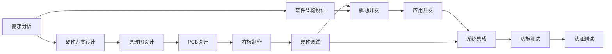
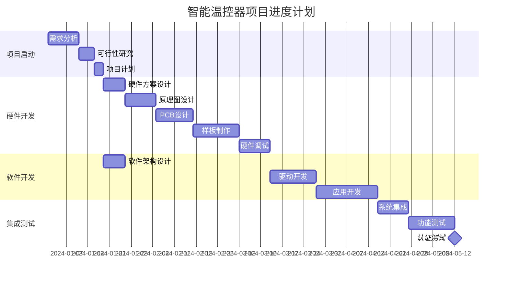
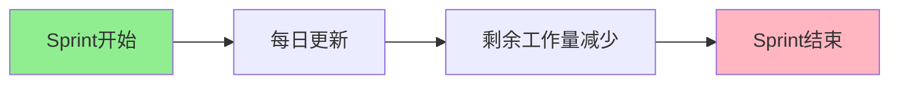

---
# 基础信息
title: "嵌入式项目进度管理与控制"
description: "深入讲解嵌入式项目的进度计划制定、里程碑设置、关键路径分析、进度跟踪方法以及延期应对策略，帮助项目经理和技术负责人有效管理项目时间"
slug: "project-schedule-management"

# 分类信息
domain: "10-cross-cutting-concerns"
module: "04-project-management-career"
content_type: "article"
skill_level: "intermediate"

# 标签和关联
tags:
  - 进度管理
  - 项目控制
  - 项目管理
  - 里程碑
  - 关键路径
prerequisites: []
related_contents: []

# 学习信息
estimated_time: 60
difficulty_score: 3

# 作者和版本
author: "嵌入式知识平台"
author_id: ""
created_at: "2026-03-10"
updated_at: "2026-03-10"
version: "1.0"

# 语言和本地化
language: "zh-CN"
translations: []

# 状态和可见性
status: "draft"
is_featured: false
is_premium: false

# SEO和元数据
keywords:
  - 嵌入式项目管理
  - 进度计划
  - 甘特图
  - 项目延期
  - 风险管理
cover_image: ""
---

# 嵌入式项目进度管理与控制

## 概述

项目进度管理是项目管理的核心内容之一，直接关系到项目能否按时交付。嵌入式项目由于涉及硬件、软件、测试等多个环节，进度管理尤为复杂和关键。


### 为什么进度管理重要

在嵌入式项目中，进度延误可能导致：
- 错过市场窗口期，失去竞争优势
- 成本超支，影响项目盈利
- 团队士气下降，人员流失
- 客户信任度降低，影响后续合作
- 资源冲突，影响其他项目

### 学习目标

通过本文，你将学习到：
- 如何制定科学合理的项目进度计划
- 如何设置有效的里程碑和检查点
- 如何识别和管理项目关键路径
- 如何跟踪和监控项目进度
- 如何应对项目延期和风险

## 背景知识

### 嵌入式项目的特点

嵌入式项目与纯软件项目相比，具有以下特点：

1. **硬件依赖性强**：软件开发依赖硬件平台，硬件延期直接影响软件进度
2. **测试周期长**：需要在实际硬件上进行测试，测试环境搭建复杂
3. **迭代成本高**：硬件修改成本高，需要更严格的前期规划
4. **多团队协作**：涉及硬件、软件、测试、供应链等多个团队
5. **不确定性高**：技术风险、供应链风险、认证风险等因素多

### 项目管理基本概念

**工作分解结构（WBS）**：将项目分解为可管理的工作包

**关键路径（Critical Path）**：项目中耗时最长的任务序列，决定项目最短完成时间

**里程碑（Milestone）**：项目中的重要节点，通常是可交付成果的完成点

**浮动时间（Float/Slack）**：任务可以延迟而不影响项目总工期的时间

**资源平衡（Resource Leveling）**：优化资源分配，避免资源冲突

## 核心内容

### 1. 进度计划制定

#### 1.1 工作分解结构（WBS）

WBS是进度计划的基础，将项目分解为可管理的工作包。


**嵌入式项目WBS示例**：

```
智能温控器项目
├── 1. 项目启动
│   ├── 1.1 需求分析
│   ├── 1.2 可行性研究
│   └── 1.3 项目计划
├── 2. 硬件开发
│   ├── 2.1 硬件方案设计
│   ├── 2.2 原理图设计
│   ├── 2.3 PCB设计
│   ├── 2.4 样板制作
│   └── 2.5 硬件调试
├── 3. 软件开发
│   ├── 3.1 软件架构设计
│   ├── 3.2 驱动开发
│   ├── 3.3 应用开发
│   ├── 3.4 通信协议实现
│   └── 3.5 用户界面开发
├── 4. 系统集成
│   ├── 4.1 硬件软件集成
│   ├── 4.2 功能测试
│   ├── 4.3 性能测试
│   └── 4.4 问题修复
├── 5. 认证与量产
│   ├── 5.1 EMC测试
│   ├── 5.2 安全认证
│   ├── 5.3 试产
│   └── 5.4 量产准备
└── 6. 项目收尾
    ├── 6.1 文档整理
    ├── 6.2 经验总结
    └── 6.3 项目验收
```

**WBS分解原则**：
- 每个工作包应该是可交付的成果
- 分解到可以估算工期和成本的粒度（通常1-2周）
- 避免过度分解，增加管理成本
- 确保完整性，不遗漏任何工作

#### 1.2 任务依赖关系

识别任务之间的依赖关系是制定进度计划的关键。

**依赖关系类型**：

1. **完成-开始（FS）**：前置任务完成后，后续任务才能开始
   - 示例：PCB设计完成后，才能开始样板制作

2. **开始-开始（SS）**：前置任务开始后，后续任务才能开始
   - 示例：硬件调试开始后，驱动开发才能开始

3. **完成-完成（FF）**：前置任务完成后，后续任务才能完成
   - 示例：所有模块测试完成后，系统测试才能完成

4. **开始-完成（SF）**：前置任务开始后，后续任务才能完成（较少使用）


**依赖关系图示**：



#### 1.3 工期估算

准确的工期估算是进度计划的基础。

**三点估算法**：

```
乐观时间（O）：最理想情况下的完成时间
最可能时间（M）：正常情况下的完成时间
悲观时间（P）：最坏情况下的完成时间

期望时间（TE）= (O + 4M + P) / 6
标准差（SD）= (P - O) / 6
```

**示例：驱动开发工期估算**

```
任务：STM32 GPIO驱动开发
乐观时间：2天（一切顺利）
最可能时间：4天（正常开发）
悲观时间：8天（遇到硬件问题）

期望时间 = (2 + 4×4 + 8) / 6 = 4.3天
标准差 = (8 - 2) / 6 = 1天
```

**工期估算注意事项**：
- 考虑团队成员的经验和技能水平
- 预留缓冲时间应对不确定性
- 考虑资源可用性（假期、其他项目占用）
- 参考历史项目数据
- 咨询技术专家意见

#### 1.4 甘特图制作

甘特图是最常用的进度计划可视化工具。

**甘特图示例**（使用Mermaid）：




### 2. 里程碑设置

里程碑是项目中的重要检查点，用于评估项目进展和质量。

#### 2.1 里程碑定义原则

**SMART原则**：
- **Specific（具体）**：明确的可交付成果
- **Measurable（可衡量）**：有明确的验收标准
- **Achievable（可实现）**：团队有能力完成
- **Relevant（相关）**：与项目目标相关
- **Time-bound（有时限）**：有明确的完成时间

#### 2.2 典型里程碑设置

**嵌入式项目典型里程碑**：

| 里程碑 | 可交付成果 | 验收标准 | 时间节点 |
|--------|-----------|---------|---------|
| M1: 需求评审 | 需求规格说明书 | 需求评审通过 | 第2周 |
| M2: 方案评审 | 系统方案设计文档 | 方案评审通过 | 第4周 |
| M3: 硬件样板 | 第一版PCB样板 | 硬件基本功能验证 | 第10周 |
| M4: 软件Alpha | 核心功能实现 | 基本功能可演示 | 第14周 |
| M5: 系统集成 | 硬件软件集成 | 系统功能完整 | 第18周 |
| M6: Beta测试 | 测试版本 | 功能测试通过 | 第22周 |
| M7: 认证完成 | 认证报告 | 通过EMC/安全认证 | 第26周 |
| M8: 量产准备 | 量产文档 | 试产成功 | 第28周 |

#### 2.3 里程碑评审

每个里程碑都应该进行正式评审：

**评审流程**：
1. **准备阶段**：整理可交付成果，准备评审材料
2. **评审会议**：演示成果，回答问题，收集反馈
3. **决策阶段**：评审委员会做出通过/修改/拒绝决定
4. **跟进阶段**：根据评审意见进行改进

**评审检查清单**：
```markdown
□ 可交付成果是否完整
□ 是否满足验收标准
□ 质量是否达标
□ 是否存在重大风险
□ 是否需要调整后续计划
□ 资源是否充足
□ 团队是否准备好进入下一阶段
```

### 3. 关键路径分析

关键路径是项目中最长的任务序列，决定了项目的最短完成时间。

#### 3.1 关键路径识别

**关键路径法（CPM）步骤**：

1. **列出所有任务及其依赖关系**
2. **计算每个任务的最早开始时间（ES）和最早完成时间（EF）**
3. **计算每个任务的最晚开始时间（LS）和最晚完成时间（LF）**
4. **计算浮动时间（Float = LS - ES 或 LF - EF）**
5. **浮动时间为0的任务序列即为关键路径**


**关键路径示例**：

```
任务网络：
A(5天) → B(10天) → D(8天) → F(12天)
A(5天) → C(7天) → E(6天) → F(12天)

路径1：A → B → D → F = 5 + 10 + 8 + 12 = 35天（关键路径）
路径2：A → C → E → F = 5 + 7 + 6 + 12 = 30天

路径1是关键路径，任何任务延期都会导致项目延期
路径2有5天浮动时间，可以适当延期而不影响项目总工期
```

#### 3.2 关键路径管理

**关键路径管理策略**：

1. **重点监控**：密切跟踪关键路径上的任务进度
2. **资源优先**：优先保证关键路径任务的资源
3. **风险防范**：提前识别和应对关键路径上的风险
4. **快速响应**：关键路径任务延期时立即采取措施
5. **压缩工期**：需要赶工时，优先压缩关键路径任务

**工期压缩方法**：

```markdown
1. 赶工（Crashing）
   - 增加资源（人力、设备）
   - 加班加点
   - 成本增加，但工期缩短

2. 快速跟进（Fast Tracking）
   - 并行执行原本串行的任务
   - 风险增加，但工期缩短
   - 示例：硬件调试与驱动开发并行

3. 范围削减
   - 减少非关键功能
   - 推迟次要功能到后续版本
   - 降低质量标准（谨慎使用）
```

### 4. 进度跟踪方法

有效的进度跟踪是及时发现和解决问题的关键。

#### 4.1 进度跟踪指标

**关键指标**：

1. **计划完成百分比（Planned % Complete）**：按计划应该完成的工作量百分比
2. **实际完成百分比（Actual % Complete）**：实际完成的工作量百分比
3. **进度偏差（Schedule Variance, SV）**：实际进度与计划进度的差异
4. **进度绩效指数（Schedule Performance Index, SPI）**：SPI = 实际完成 / 计划完成

**进度状态判断**：
```
SPI > 1.0：进度超前
SPI = 1.0：进度正常
SPI < 1.0：进度滞后
```

#### 4.2 挣值管理（EVM）

挣值管理是一种综合考虑进度和成本的项目管理方法。

**核心概念**：
- **计划价值（PV）**：按计划应该完成的工作的预算成本
- **挣值（EV）**：实际完成工作的预算成本
- **实际成本（AC）**：实际完成工作的实际成本

**计算公式**：
```
进度偏差（SV）= EV - PV
成本偏差（CV）= EV - AC
进度绩效指数（SPI）= EV / PV
成本绩效指数（CPI）= EV / AC
完工估算（EAC）= BAC / CPI
```


**挣值分析示例**：

```
项目预算（BAC）：100万元
项目周期：20周
当前时间：第10周

计划价值（PV）：50万元（应该完成50%）
挣值（EV）：40万元（实际完成40%）
实际成本（AC）：45万元

进度偏差（SV）= 40 - 50 = -10万元（进度滞后）
成本偏差（CV）= 40 - 45 = -5万元（成本超支）
进度绩效指数（SPI）= 40 / 50 = 0.8（进度滞后20%）
成本绩效指数（CPI）= 40 / 45 = 0.89（成本超支11%）
完工估算（EAC）= 100 / 0.89 = 112.4万元（预计超支12.4万元）
```

#### 4.3 进度报告

**周报内容**：
```markdown
# 项目周报 - 第X周

## 本周完成
- 完成任务A：PCB设计评审通过
- 完成任务B：驱动框架搭建完成
- 完成任务C：通信协议测试通过

## 下周计划
- 任务D：完成样板焊接
- 任务E：完成GPIO驱动开发
- 任务F：开始应用层开发

## 进度状态
- 计划完成：50%
- 实际完成：45%
- SPI：0.9（进度略有滞后）

## 风险与问题
- 风险1：芯片供货延期2周，影响样板制作
- 问题1：硬件设计发现bug，需要修改原理图

## 需要支持
- 需要增加1名硬件工程师支持调试
- 需要采购示波器用于信号测试
```

#### 4.4 进度会议

**每日站会（Daily Standup）**：
- 时间：每天早上15分钟
- 内容：
  - 昨天完成了什么
  - 今天计划做什么
  - 遇到什么阻碍

**周例会（Weekly Meeting）**：
- 时间：每周1小时
- 内容：
  - 回顾本周进度
  - 讨论问题和风险
  - 调整下周计划

**里程碑评审会（Milestone Review）**：
- 时间：每个里程碑节点
- 内容：
  - 评审可交付成果
  - 决定是否进入下一阶段
  - 调整后续计划

### 5. 延期应对策略

项目延期是常见问题，关键是及时发现和有效应对。

#### 5.1 延期原因分析

**常见延期原因**：

1. **需求变更**
   - 客户需求变化
   - 市场需求调整
   - 技术方案变更

2. **技术问题**
   - 技术难度超出预期
   - 硬件设计缺陷
   - 软件bug复杂

3. **资源问题**
   - 人员不足或流失
   - 关键人员请假
   - 设备或工具缺乏

4. **供应链问题**
   - 芯片供货延期
   - PCB制作延期
   - 元器件缺货

5. **沟通协调问题**
   - 团队协作不畅
   - 跨部门沟通困难
   - 信息传递不及时


#### 5.2 延期应对措施

**应对策略矩阵**：

| 延期程度 | 应对策略 | 具体措施 |
|---------|---------|---------|
| 轻微延期（<5%） | 内部调整 | 加班、优化流程、提高效率 |
| 中度延期（5-15%） | 资源调配 | 增加人力、并行任务、快速跟进 |
| 严重延期（15-30%） | 范围调整 | 削减功能、推迟次要需求 |
| 重大延期（>30%） | 重新规划 | 重新评估、调整里程碑、延期交付 |

**具体应对措施**：

1. **增加资源**
```markdown
- 增加开发人员
- 外包部分工作
- 采购更好的工具和设备
- 提供培训提升效率

注意事项：
- 新人需要时间熟悉项目
- 增加人员可能降低效率（布鲁克斯定律）
- 成本会显著增加
```

2. **并行任务**
```markdown
- 硬件调试与驱动开发并行
- 模块开发与集成测试并行
- 文档编写与开发并行

注意事项：
- 增加返工风险
- 需要更强的协调能力
- 可能影响质量
```

3. **削减范围**
```markdown
- 推迟非核心功能到下一版本
- 简化用户界面
- 减少测试用例
- 降低性能指标

注意事项：
- 需要客户同意
- 可能影响产品竞争力
- 要确保核心功能完整
```

4. **优化流程**
```markdown
- 简化审批流程
- 减少不必要的会议
- 使用自动化工具
- 改进开发方法

注意事项：
- 不能牺牲质量
- 需要团队配合
- 效果可能不明显
```

#### 5.3 延期沟通

**向上沟通（向管理层）**：
```markdown
1. 及时报告
   - 发现延期风险立即报告
   - 不要隐瞒或拖延

2. 分析原因
   - 客观分析延期原因
   - 区分可控和不可控因素

3. 提出方案
   - 提供多个应对方案
   - 分析每个方案的利弊
   - 给出推荐方案

4. 请求支持
   - 明确需要的资源和支持
   - 说明支持的紧迫性
```

**向下沟通（向团队）**：
```markdown
1. 坦诚沟通
   - 如实告知项目状况
   - 不要制造恐慌

2. 鼓舞士气
   - 肯定团队的努力
   - 强调项目的重要性

3. 明确目标
   - 清晰传达调整后的计划
   - 明确每个人的任务

4. 激励措施
   - 提供加班补偿
   - 承诺项目完成后的奖励
```

**向客户沟通**：
```markdown
1. 提前预警
   - 尽早通知可能的延期
   - 不要等到最后一刻

2. 解释原因
   - 客观说明延期原因
   - 避免推卸责任

3. 提供方案
   - 提供多个选择方案
   - 让客户参与决策

4. 承诺补偿
   - 提供补偿措施
   - 确保客户满意
```


### 6. 进度管理工具

#### 6.1 项目管理软件

**常用工具对比**：

| 工具 | 特点 | 适用场景 | 价格 |
|------|------|---------|------|
| Microsoft Project | 功能强大，专业级 | 大型复杂项目 | 付费 |
| Jira | 敏捷开发，问题跟踪 | 软件开发项目 | 免费/付费 |
| Trello | 简单直观，看板管理 | 小型项目，团队协作 | 免费/付费 |
| Asana | 任务管理，团队协作 | 中小型项目 | 免费/付费 |
| 禅道 | 国产，功能全面 | 各类项目 | 开源/付费 |
| Teambition | 简单易用，协作 | 中小型项目 | 免费/付费 |

**Microsoft Project使用示例**：
```markdown
1. 创建项目
   - 设置项目开始日期
   - 定义工作日历

2. 输入任务
   - 创建WBS结构
   - 输入任务名称和工期

3. 设置依赖
   - 定义任务之间的依赖关系
   - 设置前置任务和后置任务

4. 分配资源
   - 添加团队成员
   - 分配任务给资源

5. 查看关键路径
   - 自动计算关键路径
   - 识别关键任务

6. 跟踪进度
   - 更新任务完成百分比
   - 查看进度偏差
```

#### 6.2 甘特图工具

**在线甘特图工具**：
- GanttProject（开源免费）
- TeamGantt（在线协作）
- Smartsheet（企业级）
- Excel（简单项目）

**Excel制作甘特图**：
```markdown
1. 创建任务列表
   - 列A：任务名称
   - 列B：开始日期
   - 列C：工期（天）
   - 列D：结束日期

2. 创建时间轴
   - 第一行：日期序列
   - 使用条件格式显示任务条

3. 添加依赖关系
   - 使用箭头或连线表示

4. 标注里程碑
   - 使用特殊符号（◆）标注
```

#### 6.3 燃尽图（Burndown Chart）

燃尽图用于敏捷开发中跟踪剩余工作量。



**燃尽图示例数据**：
```
Day 0: 100小时（总工作量）
Day 1: 95小时（完成5小时）
Day 2: 88小时（完成7小时）
Day 3: 82小时（完成6小时）
...
Day 10: 0小时（全部完成）

理想燃尽线：每天减少10小时
实际燃尽线：根据实际完成情况绘制
```

## 实践示例

### 案例：智能门锁项目进度管理

**项目背景**：
- 项目周期：6个月
- 团队规模：8人（硬件2人，软件4人，测试2人）
- 主要功能：指纹识别、密码开锁、远程控制、日志记录


**进度计划**：

```markdown
## 阶段1：需求与设计（4周）
Week 1-2: 需求分析
  - 用户需求调研
  - 功能需求定义
  - 性能需求定义
  - 里程碑M1：需求评审

Week 3-4: 系统设计
  - 硬件方案设计
  - 软件架构设计
  - 接口定义
  - 里程碑M2：设计评审

## 阶段2：硬件开发（8周）
Week 5-6: 原理图设计
  - 主控电路设计
  - 指纹模块接口设计
  - 电源管理设计

Week 7-8: PCB设计
  - PCB布局
  - PCB布线
  - 设计评审

Week 9-10: 样板制作
  - PCB制板
  - 元器件采购
  - 样板焊接

Week 11-12: 硬件调试
  - 电源测试
  - 接口测试
  - 功能验证
  - 里程碑M3：硬件样板完成

## 阶段3：软件开发（10周）
Week 7-9: 驱动开发（与硬件并行）
  - GPIO驱动
  - UART驱动
  - 指纹模块驱动

Week 10-13: 应用开发
  - 指纹识别功能
  - 密码管理功能
  - 远程控制功能
  - 日志记录功能

Week 14-16: 软件测试
  - 单元测试
  - 集成测试
  - 里程碑M4：软件Alpha版本

## 阶段4：系统集成（4周）
Week 17-18: 硬件软件集成
  - 功能集成
  - 性能优化
  - 问题修复

Week 19-20: 系统测试
  - 功能测试
  - 性能测试
  - 压力测试
  - 里程碑M5：Beta版本

## 阶段5：认证与量产（6周）
Week 21-23: 认证测试
  - EMC测试
  - 安全认证
  - 问题整改

Week 24-26: 量产准备
  - 试产
  - 工艺优化
  - 文档整理
  - 里程碑M6：量产准备完成
```

**关键路径识别**：
```
关键路径：
需求分析(2周) → 设计(2周) → 原理图(2周) → PCB(2周) → 
样板(2周) → 硬件调试(2周) → 应用开发(4周) → 
系统集成(2周) → 系统测试(2周) → 认证(3周) → 量产(3周)

总工期：26周

非关键路径：
驱动开发可以与硬件开发并行，有2周浮动时间
```

**风险应对**：

```markdown
风险1：指纹模块供货延期
- 概率：中
- 影响：高（影响硬件调试和软件开发）
- 应对：
  - 提前下单，预留2周缓冲
  - 准备备选方案（其他供应商）
  - 先用模拟器进行软件开发

风险2：EMC测试不通过
- 概率：中
- 影响：高（影响认证进度）
- 应对：
  - 设计阶段充分考虑EMC
  - 预留2周整改时间
  - 提前进行预测试

风险3：软件开发延期
- 概率：高
- 影响：中（有一定浮动时间）
- 应对：
  - 采用敏捷开发，分阶段交付
  - 优先完成核心功能
  - 必要时增加开发人员
```

**实际执行情况**：

```markdown
Week 12: 发现问题
- 硬件调试发现电源模块设计缺陷
- 需要修改原理图和PCB
- 预计延期2周

应对措施：
1. 立即组织评审，确定修改方案
2. 加急PCB制作（1周）
3. 驱动开发团队先用旧版本硬件开发
4. 应用开发团队使用模拟器并行开发
5. 压缩后续测试时间（从4周压缩到3周）

结果：
- 实际延期1周
- 通过并行开发和压缩测试时间，将影响降到最低
- 最终在第27周完成项目（比原计划延期1周）
```


## 常见问题

### Q1: 如何应对频繁的需求变更？

**A**: 需求变更是项目管理中的常见挑战，应对策略包括：

1. **建立变更控制流程**
   - 所有变更必须经过评审
   - 评估变更对进度、成本、质量的影响
   - 由变更控制委员会决策

2. **预留变更缓冲**
   - 在计划中预留10-15%的缓冲时间
   - 用于应对不可避免的变更

3. **采用敏捷方法**
   - 短周期迭代开发
   - 每个迭代交付可用功能
   - 更灵活地应对变更

4. **与客户充分沟通**
   - 让客户理解变更的代价
   - 协商变更的优先级
   - 必要时调整项目范围或时间

### Q2: 团队成员对进度计划不认同怎么办？

**A**: 团队认同是计划成功的关键：

1. **让团队参与计划制定**
   - 邀请团队成员参与工期估算
   - 听取团队的意见和建议
   - 共同制定计划

2. **充分沟通计划依据**
   - 解释计划的制定依据
   - 说明关键假设和约束
   - 回答团队的疑问

3. **建立反馈机制**
   - 定期收集团队反馈
   - 根据实际情况调整计划
   - 让团队感受到被尊重

4. **设置合理的目标**
   - 避免过于激进的计划
   - 考虑团队的实际能力
   - 预留适当的缓冲时间

### Q3: 如何平衡进度和质量？

**A**: 进度和质量的平衡是项目管理的核心挑战：

1. **质量优先原则**
   - 质量问题会导致返工，最终延误进度
   - 不能为了赶进度而牺牲质量
   - 建立质量门槛，不达标不放行

2. **合理的质量标准**
   - 根据项目特点设定质量标准
   - 不追求完美，够用即可
   - 区分核心功能和次要功能

3. **持续集成和测试**
   - 尽早发现和修复问题
   - 避免问题积累到后期
   - 降低返工成本

4. **风险驱动的测试**
   - 重点测试高风险区域
   - 优先测试核心功能
   - 合理分配测试资源

### Q4: 项目延期了，如何向客户解释？

**A**: 向客户沟通延期需要技巧：

1. **及时通知**
   - 发现延期风险立即通知
   - 不要等到最后一刻
   - 给客户足够的准备时间

2. **客观分析原因**
   - 如实说明延期原因
   - 区分可控和不可控因素
   - 不推卸责任

3. **提供解决方案**
   - 提供多个选择方案
   - 分析每个方案的利弊
   - 让客户参与决策

4. **承诺补偿措施**
   - 提供合理的补偿
   - 确保客户利益
   - 维护长期合作关系

### Q5: 如何激励团队在紧张的进度下保持高效？

**A**: 团队激励是项目成功的关键：

1. **物质激励**
   - 提供加班补偿
   - 设置项目奖金
   - 承诺项目完成后的休假

2. **精神激励**
   - 肯定团队的努力和贡献
   - 营造积极的团队氛围
   - 强调项目的重要性和意义

3. **改善工作环境**
   - 提供必要的工具和设备
   - 减少不必要的会议和干扰
   - 创造高效的工作环境

4. **关注团队健康**
   - 避免长期高强度加班
   - 关注团队成员的身心健康
   - 提供必要的支持和帮助


## 总结

项目进度管理是项目管理的核心内容，对于嵌入式项目尤为重要。本文介绍了进度管理的关键要素：

### 核心要点

1. **科学的进度计划**
   - 使用WBS分解工作
   - 识别任务依赖关系
   - 准确估算工期
   - 制作甘特图可视化

2. **有效的里程碑管理**
   - 设置SMART里程碑
   - 定期进行里程碑评审
   - 及时调整后续计划

3. **关键路径分析**
   - 识别关键路径
   - 重点监控关键任务
   - 优先保证关键路径资源

4. **持续的进度跟踪**
   - 使用挣值管理方法
   - 定期更新进度报告
   - 及时发现和解决问题

5. **灵活的延期应对**
   - 分析延期原因
   - 采取针对性措施
   - 有效沟通和协调

### 最佳实践

```markdown
1. 计划阶段
   ✓ 让团队参与计划制定
   ✓ 预留10-15%缓冲时间
   ✓ 识别和评估风险
   ✓ 制定应急预案

2. 执行阶段
   ✓ 每日站会跟踪进度
   ✓ 每周更新进度报告
   ✓ 及时解决阻碍问题
   ✓ 保持团队沟通

3. 监控阶段
   ✓ 使用挣值管理
   ✓ 关注关键路径
   ✓ 定期评审里程碑
   ✓ 及时调整计划

4. 收尾阶段
   ✓ 总结经验教训
   ✓ 更新历史数据
   ✓ 改进流程方法
   ✓ 分享最佳实践
```

### 关键成功因素

1. **充分的前期规划**：花时间做好计划，可以节省后期大量时间
2. **团队的认同和参与**：团队认同的计划更容易执行
3. **持续的沟通和协调**：及时沟通可以避免很多问题
4. **灵活的应变能力**：计划赶不上变化，要能灵活调整
5. **有效的工具支持**：好的工具可以提高管理效率

### 避免的陷阱

```markdown
✗ 过于乐观的估算
✗ 忽视风险和不确定性
✗ 缺乏缓冲时间
✗ 不及时更新计划
✗ 隐瞒问题和延期
✗ 为了进度牺牲质量
✗ 忽视团队的反馈
✗ 缺乏有效的沟通
```

### 持续改进

进度管理是一个持续改进的过程：

1. **收集历史数据**
   - 记录实际工期
   - 分析偏差原因
   - 建立估算模型

2. **总结经验教训**
   - 项目结束后进行复盘
   - 识别成功因素和失败原因
   - 形成最佳实践

3. **优化流程方法**
   - 根据经验改进流程
   - 引入新的工具和方法
   - 持续提升管理能力

4. **培养团队能力**
   - 培训项目管理技能
   - 分享经验和知识
   - 建立学习型组织

## 延伸阅读

### 推荐书籍

1. **《项目管理知识体系指南（PMBOK）》**
   - 项目管理的权威指南
   - 系统介绍项目管理知识
   - 适合系统学习

2. **《关键链》（Critical Chain）**
   - Eliyahu M. Goldratt著
   - 介绍关键链项目管理方法
   - 提供新的进度管理视角

3. **《人月神话》（The Mythical Man-Month）**
   - Frederick P. Brooks Jr.著
   - 软件项目管理经典
   - 深刻洞察项目管理本质

4. **《敏捷估计与规划》（Agile Estimating and Planning）**
   - Mike Cohn著
   - 介绍敏捷项目的估算和规划
   - 适合敏捷团队

### 在线资源

1. **PMI官网**（www.pmi.org）
   - 项目管理协会官网
   - 提供大量项目管理资源

2. **Scrum Guide**（scrumguides.org）
   - Scrum官方指南
   - 学习敏捷项目管理

3. **ProjectManagement.com**
   - 项目管理社区
   - 分享经验和最佳实践

### 相关工具

1. **Microsoft Project**
   - 专业项目管理软件
   - 功能强大，适合复杂项目

2. **Jira**
   - 敏捷项目管理工具
   - 适合软件开发项目

3. **Trello**
   - 简单直观的看板工具
   - 适合小型项目和团队协作

4. **GanttProject**
   - 开源免费的甘特图工具
   - 适合个人和小团队

### 相关认证

1. **PMP（Project Management Professional）**
   - PMI认证的项目管理专业人士
   - 国际认可度高

2. **PRINCE2**
   - 英国政府项目管理方法
   - 欧洲认可度高

3. **ACP（Agile Certified Practitioner）**
   - PMI认证的敏捷项目管理专业人士
   - 适合敏捷团队

---

**版权声明**：本文为嵌入式知识平台原创内容，转载请注明出处。

**更新日志**：
- 2026-03-10：初始版本发布
