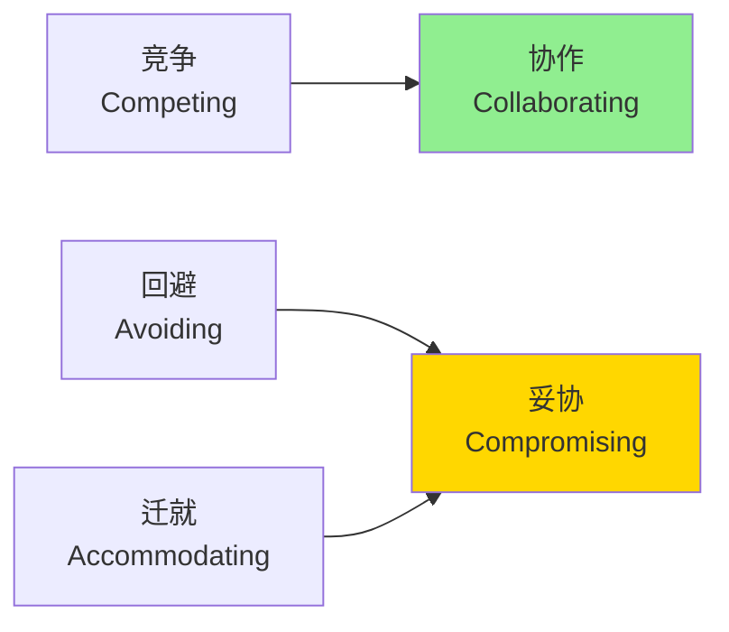

# 团队协作与沟通技巧

## 概述

在嵌入式系统开发中，技术能力固然重要，但团队协作和沟通能力同样关键。一个项目的成功往往取决于团队成员之间的有效协作、清晰的沟通以及妥善的冲突处理。本文将帮助你掌握团队协作的核心技能。

完成本文学习后，你将能够：

- 掌握有效的沟通技巧和方法
- 组织和管理高效的团队会议
- 识别和解决团队冲突
- 实现跨部门的顺畅协作
- 适应远程协作的工作模式

## 背景知识

### 嵌入式团队的特点

嵌入式开发团队通常具有以下特点：

1. **跨学科性质**：涉及硬件、软件、测试等多个专业领域
2. **技术复杂度高**：需要深入的技术讨论和知识共享
3. **协作紧密**：硬件和软件开发需要密切配合
4. **周期压力大**：产品上市时间要求严格
5. **沟通成本高**：技术细节多，容易产生误解

### 协作的重要性

良好的团队协作能够：

- 提高开发效率，减少返工
- 降低沟通成本和误解
- 促进知识共享和技能提升
- 增强团队凝聚力和士气
- 提升项目成功率

## 核心内容

### 有效沟通技巧

#### 1. 清晰表达

**技术沟通的原则**：

- **准确性**：使用准确的技术术语，避免模糊表达
- **简洁性**：直奔主题，避免冗长的铺垫
- **结构化**：按照逻辑顺序组织信息
- **可视化**：使用图表、示意图辅助说明

**实践示例**：

```markdown
# 不好的表达
"GPIO那个东西好像有点问题，你看看吧"

# 好的表达
"PA5引脚的GPIO输出电平异常：
- 现象：设置为高电平后，实测只有1.2V
- 预期：应该输出3.3V
- 测试条件：使用HAL_GPIO_WritePin()函数
- 请协助排查是否为硬件问题"
```

#### 2. 主动倾听

**倾听的层次**：

1. **听到**：接收声音信号
2. **理解**：理解对方的意思
3. **评估**：判断信息的价值
4. **回应**：给予适当的反馈

**主动倾听技巧**：

- 保持眼神接触，展现专注
- 不打断对方，让其完整表达
- 通过点头、"嗯"等方式确认理解
- 复述关键信息确认理解正确
- 提出澄清性问题

**示例对话**：

```
硬件工程师："这个电路的上拉电阻可能需要调整"

软件工程师（主动倾听）：
"你是说PA5的上拉电阻吗？具体是什么问题？
是电平不稳定还是功耗过高？"

（而不是立即说："那你改吧"）
```

#### 3. 选择合适的沟通渠道

不同场景选择不同的沟通方式：

| 沟通场景 | 推荐渠道 | 原因 |
|---------|---------|------|
| 紧急问题 | 电话/当面 | 即时响应，快速解决 |
| 技术讨论 | 会议/视频 | 可以演示和互动 |
| 进度更新 | 邮件/文档 | 留存记录，便于追溯 |
| 简单确认 | 即时消息 | 快速高效 |
| 正式决策 | 邮件/文档 | 正式记录，明确责任 |

#### 4. 技术文档沟通

**文档的重要性**：

- 减少重复解释
- 便于异步协作
- 知识沉淀和传承
- 降低人员变动影响

**文档编写要点**：

```markdown
# 好的技术文档结构

## 1. 概述
- 简要说明文档目的
- 适用范围和读者对象

## 2. 背景
- 问题描述
- 技术背景

## 3. 方案
- 设计思路
- 实现细节
- 代码示例

## 4. 测试
- 测试方法
- 测试结果

## 5. 注意事项
- 已知问题
- 使用限制
```

### 会议管理

#### 1. 会议类型

**常见的技术会议**：

1. **站会（Daily Standup）**
   - 时长：15分钟
   - 内容：昨天完成、今天计划、遇到的问题
   - 频率：每日

2. **技术评审会**
   - 时长：1-2小时
   - 内容：设计方案评审、代码审查
   - 频率：按需

3. **问题分析会**
   - 时长：30-60分钟
   - 内容：分析和解决技术问题
   - 频率：按需

4. **迭代规划会**
   - 时长：2-4小时
   - 内容：规划下一迭代的工作
   - 频率：每迭代开始

5. **回顾会**
   - 时长：1-2小时
   - 内容：总结经验教训
   - 频率：每迭代结束

#### 2. 高效会议的要素

**会前准备**：

```markdown
# 会议准备清单

□ 明确会议目的和预期成果
□ 准备会议议程
□ 提前发送相关材料
□ 确认参会人员和时间
□ 准备演示材料和设备
□ 预留讨论和Q&A时间
```

**会议议程示例**：

```markdown
# 技术方案评审会议

**时间**：2026-03-10 14:00-16:00
**地点**：会议室A / 线上会议链接
**参会人员**：硬件团队、软件团队、测试团队

## 议程

1. 开场和目标说明 (5分钟)
2. 方案介绍 (30分钟)
   - 硬件设计方案
   - 软件架构设计
3. 技术讨论 (45分钟)
   - 接口定义
   - 性能指标
   - 风险评估
4. 决策和行动项 (30分钟)
5. 总结和下一步 (10分钟)

## 会前阅读材料
- 硬件设计文档 v1.0
- 软件架构文档 v1.0
```

**会议主持技巧**：

1. **准时开始和结束**：尊重大家的时间
2. **控制节奏**：避免跑题，及时拉回主题
3. **鼓励参与**：确保每个人都有发言机会
4. **记录要点**：指定专人记录会议纪要
5. **明确行动项**：每个决策都要有负责人和截止日期

**会议纪要模板**：

```markdown
# 会议纪要

**会议主题**：技术方案评审
**日期**：2026-03-10
**参会人员**：张三、李四、王五
**记录人**：赵六

## 讨论要点

1. 硬件接口定义
   - 决定使用SPI接口
   - 时钟频率设置为10MHz

2. 软件架构
   - 采用分层架构
   - HAL层由硬件团队提供

## 决策事项

| 决策内容 | 负责人 | 截止日期 |
|---------|--------|---------|
| 完成接口文档 | 张三 | 03-15 |
| 实现HAL层 | 李四 | 03-20 |
| 编写测试用例 | 王五 | 03-18 |

## 待解决问题

1. 功耗优化方案需要进一步讨论
2. 测试环境搭建时间待确认

## 下次会议

**时间**：2026-03-17 14:00
**议题**：接口文档评审
```

#### 3. 避免会议陷阱

**常见问题及解决方案**：

| 问题 | 表现 | 解决方案 |
|-----|------|---------|
| 会议过多 | 大量时间在开会 | 评估会议必要性，合并相似会议 |
| 准备不足 | 会上才看材料 | 提前发送材料，要求预习 |
| 跑题严重 | 讨论偏离主题 | 主持人及时引导，记录待讨论事项 |
| 没有结论 | 讨论后无决策 | 明确决策机制，指定决策人 |
| 缺少跟进 | 决策无人执行 | 明确责任人和时间，定期检查 |

### 冲突解决

#### 1. 识别冲突类型

**技术冲突**：

- 技术方案选择分歧
- 接口设计意见不同
- 性能优化方向争议

**资源冲突**：

- 人力资源分配
- 设备使用冲突
- 时间安排冲突

**人际冲突**：

- 沟通方式不当
- 个性差异
- 工作风格不同

#### 2. 冲突解决策略

**Thomas-Kilmann冲突模式**：



**五种策略的应用**：

1. **竞争（Competing）**
   - 适用：紧急决策、安全问题
   - 特点：坚持己见，追求自己的目标
   - 风险：可能损害关系

2. **协作（Collaborating）**
   - 适用：重要决策、长期合作
   - 特点：寻找双赢方案
   - 优点：最佳解决方案，增进关系

3. **妥协（Compromising）**
   - 适用：时间紧迫、双方实力相当
   - 特点：各让一步，快速解决
   - 缺点：可能不是最优方案

4. **回避（Avoiding）**
   - 适用：小问题、需要冷静
   - 特点：暂时搁置
   - 风险：问题可能恶化

5. **迁就（Accommodating）**
   - 适用：维护关系、小事让步
   - 特点：满足对方需求
   - 风险：自己的需求未满足

#### 3. 技术分歧的解决

**实践案例**：

```markdown
# 场景：技术方案选择分歧

## 问题
软件团队希望使用RTOS，硬件团队担心资源不足

## 解决步骤

1. **明确各方关注点**
   - 软件：需要多任务管理，提高开发效率
   - 硬件：担心Flash和RAM不够，成本增加

2. **收集数据**
   - RTOS的资源占用：Flash 20KB, RAM 5KB
   - 当前芯片资源：Flash 128KB, RAM 32KB
   - 成本影响：无需更换芯片

3. **寻找方案**
   - 方案A：使用轻量级RTOS（如FreeRTOS）
   - 方案B：使用状态机实现多任务
   - 方案C：升级芯片（成本增加）

4. **评估对比**
   | 方案 | 开发效率 | 资源占用 | 成本 | 风险 |
   |-----|---------|---------|------|------|
   | A   | 高      | 可接受   | 无   | 低   |
   | B   | 中      | 低      | 无   | 中   |
   | C   | 高      | 充足    | 高   | 低   |

5. **达成共识**
   - 选择方案A：使用FreeRTOS
   - 承诺：软件团队优化代码，控制资源使用
   - 监控：定期检查资源使用情况
```

**冲突解决的沟通技巧**：

```markdown
# 建设性沟通框架

## 1. 描述事实（而非指责）
❌ "你的设计有问题"
✅ "这个设计在高温环境下可能不稳定"

## 2. 表达感受和影响
❌ "你总是不听我的"
✅ "当方案没有被讨论就决定时，我担心会有遗漏"

## 3. 提出需求
❌ "你必须改"
✅ "我们能否一起评估一下这个方案的风险？"

## 4. 寻求合作
❌ "这是我的决定"
✅ "你觉得我们可以怎么改进？"
```

### 跨部门协作

#### 1. 理解不同部门的视角

**硬件团队的关注点**：

- 成本控制
- 可制造性
- 可靠性
- 供应链稳定性

**软件团队的关注点**：

- 开发效率
- 代码可维护性
- 功能实现
- 性能优化

**测试团队的关注点**：

- 可测试性
- 测试覆盖率
- 问题可复现性
- 测试效率

**产品团队的关注点**：

- 用户体验
- 功能完整性
- 上市时间
- 市场竞争力

#### 2. 建立协作机制

**接口人制度**：

```markdown
# 跨部门接口人职责

## 硬件-软件接口人
- 负责硬件接口文档的传递和解释
- 协调硬件变更对软件的影响
- 组织联合调试会议

## 软件-测试接口人
- 提供测试所需的技术支持
- 协助复现和定位问题
- 参与测试用例评审

## 职责要求
- 技术能力强，能够理解双方需求
- 沟通能力好，能够准确传达信息
- 责任心强，及时响应和跟进
```

**定期同步机制**：

| 会议类型 | 频率 | 参与方 | 目的 |
|---------|------|--------|------|
| 技术同步会 | 每周 | 硬件+软件 | 同步进度，讨论问题 |
| 集成测试会 | 每两周 | 全部门 | 集成测试，问题协调 |
| 里程碑评审 | 按阶段 | 全部门+管理层 | 评审成果，规划下阶段 |

#### 3. 协作工具的使用

**项目管理工具**：

```markdown
# 推荐工具

## Jira / 禅道
- 任务管理和跟踪
- Bug管理
- 看板可视化

## Confluence / Wiki
- 文档协作
- 知识库建设
- 会议纪要

## Git / SVN
- 代码版本管理
- 协作开发
- 代码审查

## Slack / 企业微信
- 即时沟通
- 文件共享
- 群组讨论
```

**工具使用规范**：

```markdown
# 协作工具使用规范

## 1. 任务管理
- 所有任务必须在Jira中创建
- 任务状态及时更新
- 关键信息记录在任务中

## 2. 文档管理
- 技术文档统一存放在Confluence
- 使用版本控制
- 重要文档需要评审

## 3. 代码管理
- 遵循Git工作流
- 提交信息清晰明确
- 代码审查后才能合并

## 4. 沟通规范
- 紧急问题：电话
- 技术讨论：会议或视频
- 进度更新：Jira评论
- 简单确认：即时消息
```

### 远程协作

#### 1. 远程协作的挑战

**常见问题**：

- 沟通不及时，信息传递延迟
- 缺少面对面交流，容易误解
- 时区差异，协调困难
- 团队凝聚力下降
- 工作状态难以监控

#### 2. 远程协作最佳实践

**建立工作节奏**：

```markdown
# 远程工作日程示例

## 上午
09:00-09:15  团队站会（视频）
09:15-12:00  专注工作时间
12:00-13:00  午休

## 下午
13:00-14:00  技术讨论时间（可预约）
14:00-17:00  专注工作时间
17:00-17:30  每日总结和同步

## 原则
- 固定的会议时间
- 明确的在线时间
- 预留讨论时间
- 及时响应消息
```

**视频会议技巧**：

```markdown
# 视频会议最佳实践

## 会前准备
□ 测试设备和网络
□ 准备演示材料
□ 选择安静的环境
□ 提前5分钟进入会议

## 会议中
□ 打开摄像头（增强互动）
□ 不说话时静音（减少噪音）
□ 使用屏幕共享（演示内容）
□ 使用聊天功能（补充信息）
□ 注意时间控制

## 会后跟进
□ 发送会议纪要
□ 明确行动项
□ 上传会议录像（如需要）
```

**异步协作**：

```markdown
# 异步协作指南

## 1. 文档驱动
- 重要信息写成文档
- 减少实时会议依赖
- 便于不同时区查阅

## 2. 清晰的任务描述
- 任务目标明确
- 验收标准清晰
- 提供足够的上下文

## 3. 及时更新状态
- 每日更新任务进度
- 遇到问题及时反馈
- 完成后及时通知

## 4. 建立响应时间预期
- 紧急问题：2小时内
- 一般问题：当天内
- 非紧急：2个工作日内
```

#### 3. 保持团队凝聚力

**虚拟团队建设活动**：

- 在线咖啡时间：非正式聊天
- 技术分享会：轮流分享技术话题
- 线上游戏：团队破冰活动
- 庆祝成就：里程碑达成庆祝

**建立信任**：

```markdown
# 远程团队信任建设

## 1. 透明沟通
- 主动分享工作进展
- 坦诚讨论问题和挑战
- 不隐瞒信息

## 2. 可靠交付
- 按时完成承诺的任务
- 质量符合预期
- 遇到问题及时沟通

## 3. 主动协助
- 帮助团队成员解决问题
- 分享知识和经验
- 响应他人的求助

## 4. 尊重差异
- 理解不同的工作方式
- 尊重不同的时区
- 包容文化差异
```

## 实践示例

### 示例1：技术评审会议

**场景**：需要评审一个新的通信协议设计方案

**会议组织**：

```markdown
# 通信协议设计评审会

**时间**：2026-03-15 14:00-16:00
**参会人员**：
- 软件架构师（主讲）
- 硬件工程师
- 测试工程师
- 项目经理

## 会前准备（提前3天发送）

### 阅读材料
1. 通信协议设计文档 v1.0
2. 接口定义文档
3. 性能测试报告

### 评审要点
- 协议的可靠性
- 性能是否满足要求
- 实现的复杂度
- 测试的可行性

## 会议流程

### 1. 方案介绍（30分钟）
- 设计背景和目标
- 协议架构
- 关键技术点
- 性能指标

### 2. 技术讨论（60分钟）
- 硬件接口适配性
- 软件实现复杂度
- 测试方案
- 风险评估

### 3. 决策（20分钟）
- 方案是否通过
- 需要修改的地方
- 后续行动计划

### 4. 总结（10分钟）
```

**会议执行**：

```markdown
# 会议纪要

## 讨论要点

### 1. 协议可靠性
- 采用CRC校验确保数据完整性
- 实现超时重传机制
- 硬件工程师确认接口支持

### 2. 性能指标
- 目标：1000条消息/秒
- 测试结果：达到1200条消息/秒
- 满足需求

### 3. 实现复杂度
- 软件实现预计2周
- 需要硬件配合调试
- 测试用例编写1周

## 决策

✅ 方案通过，可以开始实施

## 行动项

| 任务 | 负责人 | 截止日期 | 状态 |
|-----|--------|---------|------|
| 完善接口文档 | 张三 | 03-18 | 进行中 |
| 实现协议栈 | 李四 | 03-29 | 未开始 |
| 编写测试用例 | 王五 | 03-25 | 未开始 |
| 准备测试环境 | 赵六 | 03-22 | 未开始 |

## 风险

1. 硬件接口可能需要微调
   - 缓解措施：预留调试时间
2. 性能在实际环境可能下降
   - 缓解措施：进行压力测试
```

### 示例2：跨部门问题解决

**场景**：产品在测试中发现功耗超标

**问题分析会议**：

```markdown
# 功耗问题分析会

## 问题描述
- 现象：待机功耗150μA，超出目标100μA
- 影响：电池续航不达标
- 紧急程度：高（影响产品发布）

## 参会人员
- 硬件工程师（电源设计）
- 软件工程师（功耗管理）
- 测试工程师（问题发现者）

## 分析过程

### 1. 信息收集
- 测试条件：室温25°C，3.3V供电
- 测试方法：万用表串联测量
- 软件版本：v1.2.0
- 硬件版本：v2.0

### 2. 问题定位
```

**硬件工程师**：
"我测量了各个模块的功耗，发现主要是MCU和外设"

**软件工程师**：
"我检查了代码，发现有几个外设没有正确进入低功耗模式"

**测试工程师**：
"我可以提供详细的测试数据和波形"

### 3. 原因分析

| 模块 | 预期功耗 | 实际功耗 | 差异 | 原因 |
|-----|---------|---------|------|------|
| MCU | 30μA | 35μA | +5μA | 时钟未优化 |
| UART | 0μA | 40μA | +40μA | 未关闭 |
| ADC | 10μA | 15μA | +5μA | 采样率过高 |
| 其他 | 60μA | 60μA | 0 | 正常 |
| **总计** | **100μA** | **150μA** | **+50μA** | - |

### 4. 解决方案

**软件优化**：
```c
// 进入低功耗模式前关闭UART
void enter_low_power_mode(void) {
    // 关闭UART
    HAL_UART_DeInit(&huart1);
    
    // 降低ADC采样率
    HAL_ADC_Stop(&hadc1);
    
    // 配置MCU进入STOP模式
    HAL_PWR_EnterSTOPMode(PWR_LOWPOWERREGULATOR_ON, PWR_STOPENTRY_WFI);
}
```

**硬件优化**：
- 调整MCU时钟配置
- 检查上拉/下拉电阻

### 5. 验证计划
- 软件修改：2天
- 硬件调整：1天
- 测试验证：1天
- 预期功耗：≤100μA

## 协作亮点
- 各部门快速响应
- 数据驱动分析
- 明确分工协作
- 及时验证结果
```

## 深入理解

### 沟通的心理学

**同理心的重要性**：

```markdown
# 同理心沟通

## 场景：软件工程师向硬件工程师反馈问题

### 缺少同理心
"你的硬件设计有问题，导致我的代码无法正常工作"

### 具有同理心
"我理解硬件设计的复杂性。我在调试时发现一个现象，
想和你讨论一下是否是硬件相关的问题，还是我的理解有误"

## 效果对比
- 前者：对方感到被指责，可能产生防御心理
- 后者：对方感到被尊重，愿意合作解决问题
```

### 文化差异的影响

**不同文化背景的沟通风格**：

| 文化特点 | 沟通风格 | 协作建议 |
|---------|---------|---------|
| 直接型（欧美） | 直言不讳，明确表达 | 不要过度解读，直接询问 |
| 间接型（亚洲） | 委婉表达，注重和谐 | 注意言外之意，给予面子 |
| 等级型 | 尊重权威，自上而下 | 尊重层级，通过正式渠道 |
| 平等型 | 扁平化，开放讨论 | 鼓励表达，平等对话 |

### 建立个人影响力

**技术影响力的建立**：

```markdown
# 提升技术影响力

## 1. 专业能力
- 深入掌握核心技术
- 解决关键技术难题
- 持续学习和更新知识

## 2. 知识分享
- 主动分享技术经验
- 编写技术文档
- 组织技术培训

## 3. 协作精神
- 主动帮助团队成员
- 积极参与技术讨论
- 推动团队技术进步

## 4. 可靠性
- 按时交付高质量工作
- 言行一致
- 承担责任
```

## 常见问题

### Q1: 如何处理团队中的"技术大牛"不愿意分享知识？

**A**: 这是一个常见的挑战，可以尝试以下方法：

1. **理解动机**：了解不愿分享的原因
   - 担心失去竞争优势？
   - 觉得分享浪费时间？
   - 不知道如何分享？

2. **建立激励机制**：
   - 将知识分享纳入绩效考核
   - 给予公开认可和奖励
   - 提供分享的平台和机会

3. **降低分享门槛**：
   - 从简单的问答开始
   - 提供分享模板和指导
   - 安排专门的分享时间

4. **营造分享文化**：
   - 领导以身作则
   - 鼓励提问和讨论
   - 建立学习型组织

### Q2: 远程协作时如何保持团队凝聚力？

**A**: 远程团队的凝聚力需要刻意培养：

1. **定期视频会议**：
   - 每周至少一次全员视频会议
   - 打开摄像头，增强互动
   - 预留非正式交流时间

2. **虚拟团队活动**：
   - 在线咖啡时间
   - 技术分享会
   - 线上游戏或竞赛

3. **透明沟通**：
   - 及时分享信息
   - 公开讨论决策
   - 鼓励表达意见

4. **线下聚会**：
   - 定期组织线下团建
   - 重要里程碑庆祝
   - 年度团队活动

### Q3: 如何在技术讨论中避免争吵？

**A**: 保持建设性的技术讨论：

1. **对事不对人**：
   - 讨论技术方案，不评价个人
   - 使用"这个方案"而非"你的方案"
   - 关注问题解决，不是输赢

2. **基于数据和事实**：
   - 用数据支持观点
   - 进行实验验证
   - 避免主观臆断

3. **尊重不同观点**：
   - 认真倾听对方的理由
   - 承认合理的部分
   - 寻找共同点

4. **寻求第三方意见**：
   - 邀请其他专家参与
   - 参考行业最佳实践
   - 进行技术调研

### Q4: 如何提高会议效率？

**A**: 高效会议的关键要素：

1. **明确目的**：
   - 每个会议都要有明确的目标
   - 提前发送议程
   - 只邀请必要的人员

2. **充分准备**：
   - 提前发送材料
   - 要求参会者预习
   - 准备演示和数据

3. **控制时间**：
   - 设定时间限制
   - 准时开始和结束
   - 使用计时器

4. **明确行动项**：
   - 每个决策都要有负责人
   - 设定明确的截止日期
   - 会后发送纪要

5. **评估必要性**：
   - 能否用邮件或文档代替？
   - 是否可以合并其他会议？
   - 参会人员是否都必要？

## 总结

团队协作和沟通能力是嵌入式工程师职业发展的关键软技能。本文介绍的核心要点包括：

- **有效沟通**：清晰表达、主动倾听、选择合适渠道、重视文档
- **会议管理**：明确目的、充分准备、控制节奏、跟进行动
- **冲突解决**：识别类型、选择策略、建设性沟通、寻求共赢
- **跨部门协作**：理解视角、建立机制、使用工具、保持同步
- **远程协作**：建立节奏、异步协作、保持凝聚力、建立信任

记住，技术能力让你入门，但协作能力决定你能走多远。持续提升沟通和协作技能，你将成为团队中不可或缺的成员。

## 延伸阅读

推荐进一步学习的资源：

- [《非暴力沟通》](https://book.douban.com/subject/3533221/) - 马歇尔·卢森堡
- [《关键对话》](https://book.douban.com/subject/10586741/) - 科里·帕特森
- [《团队协作的五大障碍》](https://book.douban.com/subject/4135306/) - 帕特里克·兰西奥尼
- 敏捷开发在嵌入式中的应用 - 了解敏捷团队协作
- 项目管理概述 - 项目管理基础

## 参考资料

1. Thomas-Kilmann Conflict Mode Instrument - 冲突管理模型
2. Scrum Guide - 敏捷团队协作框架
3. Remote: Office Not Required - 远程协作实践
4. The Culture Map - 跨文化沟通指南

---

**练习题**：

1. 回顾最近一次团队会议，分析哪些地方做得好，哪些可以改进？
2. 选择一个你最近遇到的团队冲突，使用Thomas-Kilmann模型分析应该采用哪种策略？
3. 为你的团队设计一个跨部门协作机制，包括会议安排、沟通渠道和工具使用。

**下一步**：建议学习 开源项目参与指南，了解如何在更大的社区中协作。
