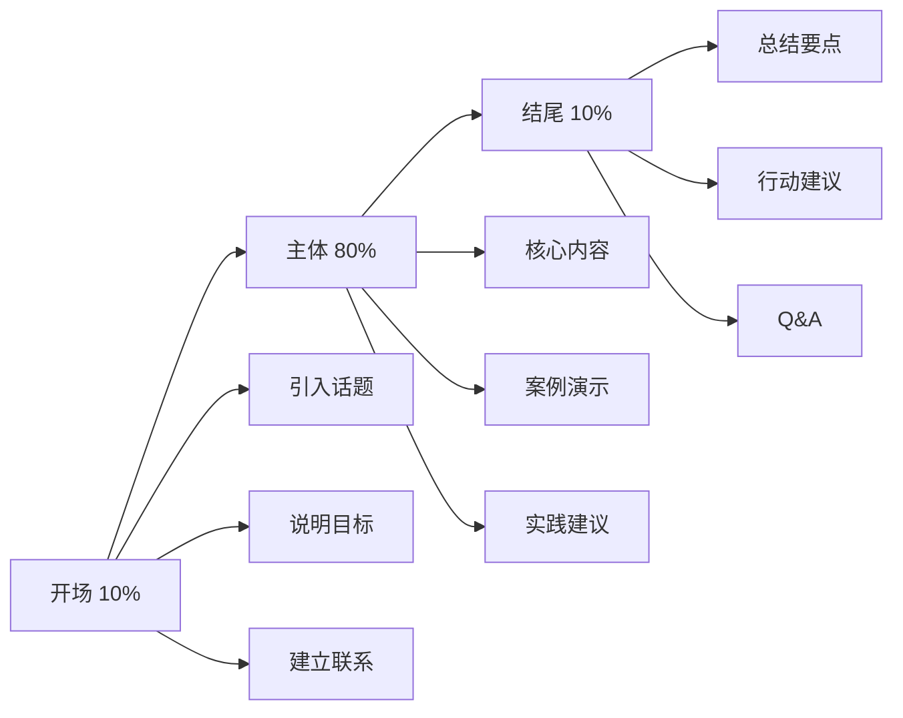
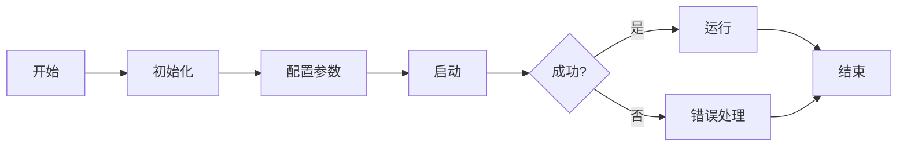
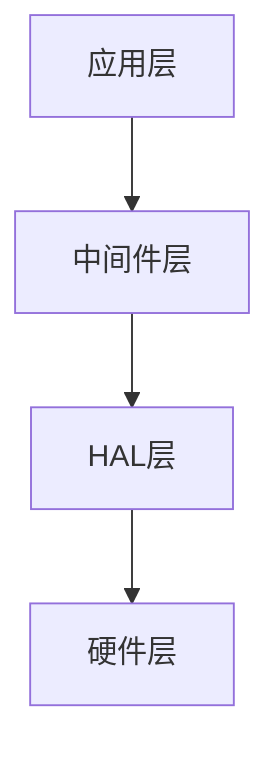

# 技术演讲与分享：从准备到呈现的完整指南

## 概述


技术演讲和分享是嵌入式工程师职业发展中的重要技能。无论是在团队内部的技术分享、技术会议的演讲，还是开源社区的交流，良好的演讲能力都能帮助你更有效地传播技术知识，建立个人影响力，促进职业成长。

完成本文学习后，你将能够：

- 理解技术演讲的价值和常见误区
- 掌握系统化的演讲准备方法
- 学会制作清晰有效的技术PPT
- 掌握演讲呈现的核心技巧
- 学会处理听众提问和互动
- 了解技术分享的最佳实践

## 为什么技术演讲很重要

### 技术演讲的价值

**个人成长**：
- 深化理解：教是最好的学，准备演讲会迫使你深入理解技术
- 表达能力：提升技术表达和沟通能力
- 个人品牌：建立技术专家形象，提升行业影响力
- 职业机会：获得更多的职业发展机会

**团队价值**：
- 知识传播：快速传播技术知识和最佳实践
- 团队协作：促进团队成员之间的技术交流
- 文化建设：营造学习和分享的技术文化
- 问题解决：通过讨论发现和解决技术问题

**社区价值**：
- 技术推广：推广新技术和工具
- 经验分享：分享实践经验，帮助他人避坑
- 社区贡献：回馈开源社区和技术社区
- 行业影响：推动行业技术进步

### 常见的演讲误区

**误区1：技术好就能讲好**
```text
❌ 错误想法：
"我技术很强，随便讲讲就行"
（忽视演讲技巧，导致听众听不懂或失去兴趣）

✅ 正确认识：
技术能力和演讲能力是两回事
需要专门学习和练习演讲技巧
```

**误区2：PPT越详细越好**
```text
❌ 错误做法：
把所有代码和细节都放到PPT上
（信息过载，听众无法消化）

✅ 正确做法：
PPT只展示关键信息和结构
详细内容通过口头讲解
```

**误区3：照着PPT念**
```text
❌ 错误做法：
一字不差地朗读PPT内容
（枯燥乏味，失去互动）

✅ 正确做法：
PPT是提纲，用自己的话讲解
增加互动和案例
```

**误区4：忽视听众背景**
```text
❌ 错误做法：
用专业术语对初学者讲解
或对专家讲解基础知识
（听众听不懂或觉得浪费时间）

✅ 正确做法：
了解听众背景，调整内容深度
使用合适的语言和案例
```

## 演讲准备：成功的基础

### 明确演讲目标


在开始准备演讲前，首先要明确演讲的目标：

**知识传授型**：
- 目标：教会听众某项技术或技能
- 特点：系统性强，循序渐进
- 示例：《STM32 HAL库入门教程》

**经验分享型**：
- 目标：分享项目经验和教训
- 特点：实践导向，案例丰富
- 示例：《智能家居项目开发实战》

**技术推广型**：
- 目标：推广新技术或工具
- 特点：突出优势，对比分析
- 示例：《为什么选择Rust开发嵌入式》

**问题解决型**：
- 目标：解决特定技术问题
- 特点：聚焦问题，提供方案
- 示例：《如何解决STM32的功耗问题》

### 了解听众

**听众分析清单**：

```markdown
## 听众背景调研

### 技术水平
□ 初学者：刚接触嵌入式开发
□ 中级：有1-3年开发经验
□ 高级：有3年以上经验
□ 专家：行业资深人士

### 知识背景
□ 熟悉的技术栈
□ 使用的开发工具
□ 项目经验类型
□ 学习目的

### 期望收获
□ 学习新技术
□ 解决具体问题
□ 了解行业趋势
□ 寻找解决方案

### 人数规模
□ 小型（<20人）：可以深入互动
□ 中型（20-50人）：适度互动
□ 大型（>50人）：单向讲解为主
```

**根据听众调整内容**：

| 听众类型 | 内容深度 | 语言风格 | 案例选择 |
|---------|---------|---------|---------|
| 初学者 | 基础概念 | 通俗易懂 | 简单示例 |
| 中级 | 实践技巧 | 专业但清晰 | 实际项目 |
| 高级 | 深入原理 | 技术术语 | 复杂场景 |
| 混合 | 分层讲解 | 兼顾各方 | 多样化 |

### 内容结构设计


**经典三段式结构**：



**开场部分（5-10分钟）**：

1. **自我介绍**（1分钟）
   - 姓名和背景
   - 相关经验
   - 为什么有资格讲这个话题

2. **话题引入**（2-3分钟）
   - 为什么这个话题重要
   - 听众能获得什么
   - 与听众的关联

3. **内容概览**（2-3分钟）
   - 今天要讲什么
   - 内容结构
   - 时间安排

**主体部分（30-40分钟）**：

```markdown
## 主体内容组织

### 方式1：问题-解决方案
1. 提出问题
2. 分析问题
3. 提供解决方案
4. 演示效果

### 方式2：循序渐进
1. 基础概念
2. 核心原理
3. 实践应用
4. 高级技巧

### 方式3：案例驱动
1. 项目背景
2. 技术选型
3. 实现过程
4. 经验总结

### 方式4：对比分析
1. 方案A介绍
2. 方案B介绍
3. 对比分析
4. 选择建议
```

**结尾部分（5-10分钟）**：

1. **核心要点总结**（2-3分钟）
   - 3-5个关键要点
   - 简洁明了
   - 强化记忆

2. **行动建议**（2-3分钟）
   - 下一步可以做什么
   - 推荐学习资源
   - 实践建议

3. **Q&A环节**（5-10分钟）
   - 回答听众问题
   - 深入讨论
   - 收集反馈

### 时间规划

**30分钟演讲时间分配**：

| 部分 | 时间 | 占比 | 内容 |
|------|------|------|------|
| 开场 | 3分钟 | 10% | 自我介绍、话题引入 |
| 主体 | 22分钟 | 73% | 核心内容讲解 |
| 结尾 | 3分钟 | 10% | 总结、行动建议 |
| Q&A | 2分钟 | 7% | 问答互动 |

**时间控制技巧**：
- 每个部分设置时间检查点
- 准备可删减的内容
- 预留缓冲时间
- 使用计时器提醒


## PPT制作：视觉化的艺术

### PPT设计原则

**1. 简洁原则**

```text
❌ 错误示例：
标题：STM32微控制器的GPIO配置方法详解
内容：密密麻麻的文字，包含所有配置步骤、代码、注意事项...

✅ 正确示例：
标题：GPIO配置三步骤
内容：
1. 使能时钟
2. 配置参数
3. 初始化GPIO
（详细内容通过口头讲解）
```

**2. 一页一个主题**

每页PPT只讲一个核心观点：
- 避免信息过载
- 便于听众理解
- 方便后续回顾

**3. 视觉化优先**

用图表代替文字：
- 流程图：展示步骤和流程
- 架构图：展示系统结构
- 对比表：展示方案对比
- 代码片段：展示关键代码

**4. 一致性**

保持风格统一：
- 字体：全文使用2-3种字体
- 颜色：使用统一的配色方案
- 布局：保持页面布局一致
- 动画：适度使用，保持一致

### PPT结构模板

**封面页**：

```markdown
# 演讲标题
## 副标题（可选）

演讲人：XXX
日期：2026-03-10
场合：XX技术分享会
```

**目录页**：

```markdown
# 今天的内容

1. 背景和问题
2. 解决方案
3. 实践案例
4. 经验总结
```

**内容页**：

```markdown
# 页面标题

## 核心观点
- 要点1
- 要点2
- 要点3

[配图或代码示例]
```

**总结页**：

```markdown
# 核心要点

✓ 要点1：简短描述
✓ 要点2：简短描述
✓ 要点3：简短描述

下一步：行动建议
```

**致谢页**：

```markdown
# 谢谢！

联系方式：
- 邮箱：xxx@example.com
- GitHub：github.com/xxx
- 博客：blog.example.com

欢迎交流讨论！
```

### 代码展示技巧

**原则**：代码要清晰、简洁、突出重点

**技巧1：只展示关键代码**

```c
// ❌ 展示完整代码（太长）
void GPIO_Init(void) {
    // 100行代码...
}

// ✅ 只展示核心逻辑
void GPIO_Init(void) {
    // 1. 使能时钟
    __HAL_RCC_GPIOA_CLK_ENABLE();
    
    // 2. 配置GPIO
    GPIO_InitStruct.Pin = GPIO_PIN_5;
    GPIO_InitStruct.Mode = GPIO_MODE_OUTPUT_PP;
    
    // 3. 初始化
    HAL_GPIO_Init(GPIOA, &GPIO_InitStruct);
}
```

**技巧2：使用高亮和注释**

```c
// 关键代码高亮显示
void LED_Toggle(void) {
    HAL_GPIO_TogglePin(GPIOA, GPIO_PIN_5);  // ← 核心操作
}
```

**技巧3：分步展示**

不要一次展示所有代码，而是：
- 第1页：展示函数签名和结构
- 第2页：展示第一部分实现
- 第3页：展示第二部分实现
- 第4页：展示完整代码


### 图表设计

**流程图示例**：



**架构图示例**：



**对比表示例**：

| 特性 | 方案A | 方案B |
|------|-------|-------|
| 性能 | ⭐⭐⭐ | ⭐⭐⭐⭐⭐ |
| 成本 | ⭐⭐⭐⭐⭐ | ⭐⭐⭐ |
| 易用性 | ⭐⭐⭐⭐ | ⭐⭐⭐ |

### 配色方案

**技术演讲推荐配色**：

```markdown
## 方案1：专业蓝
- 主色：#2C3E50（深蓝）
- 辅色：#3498DB（亮蓝）
- 强调：#E74C3C（红色）
- 背景：#FFFFFF（白色）

## 方案2：科技绿
- 主色：#27AE60（绿色）
- 辅色：#2ECC71（亮绿）
- 强调：#F39C12（橙色）
- 背景：#FFFFFF（白色）

## 方案3：简约灰
- 主色：#34495E（深灰）
- 辅色：#95A5A6（浅灰）
- 强调：#E67E22（橙色）
- 背景：#FFFFFF（白色）
```

**配色原则**：
- 主色用于标题和重点
- 辅色用于正文和说明
- 强调色用于关键信息
- 背景色保持简洁

### 字体选择

**中文字体**：
- 标题：微软雅黑、思源黑体
- 正文：微软雅黑、苹方
- 代码：等宽字体（Consolas、Monaco）

**英文字体**：
- 标题：Arial、Helvetica
- 正文：Arial、Calibri
- 代码：Consolas、Courier New

**字号建议**：
- 标题：32-44pt
- 副标题：24-28pt
- 正文：18-24pt
- 代码：14-18pt

## 演讲呈现：台上的表现

### 开场技巧

**1. 吸引注意力**

```markdown
## 开场方式

### 方式1：提出问题
"你们有没有遇到过STM32功耗过高的问题？"
（引起共鸣，激发兴趣）

### 方式2：分享故事
"去年我们项目遇到了一个奇怪的bug..."
（引人入胜，建立联系）

### 方式3：展示数据
"我们的优化让功耗降低了70%"
（震撼效果，引发好奇）

### 方式4：演示效果
"让我先给大家演示一下最终效果"
（直观展示，吸引注意）
```

**2. 建立信任**

- 简短介绍相关经验
- 说明为什么有资格讲这个话题
- 展示实际项目成果

**3. 设定期望**

- 明确今天要讲什么
- 听众能学到什么
- 不会讲什么（避免期望过高）

### 讲解技巧

**1. 语言表达**

**清晰表达**：
- 语速适中：不要太快或太慢
- 发音清晰：注意咬字
- 音量适当：确保后排能听清
- 语调变化：避免单调

**结构化表达**：
```text
"接下来我要讲三个要点：
第一，GPIO的基本概念
第二，配置方法
第三，常见问题

首先，我们来看第一个要点..."
```

**通俗化表达**：
```text
❌ 技术术语：
"我们使用DMA进行数据传输，配置NDTR寄存器..."

✅ 通俗解释：
"DMA就像一个搬运工，可以自动搬运数据，
不需要CPU参与，这样CPU就可以做其他事情..."
```


**2. 肢体语言**

**眼神交流**：
- 扫视全场，不要只盯着一个地方
- 与听众有眼神接触
- 避免一直看PPT或地面

**手势运用**：
- 自然的手势辅助表达
- 避免过度夸张
- 不要把手插在口袋里
- 不要交叉双臂

**站姿和移动**：
- 站直，保持自信
- 适度移动，不要僵硬
- 不要来回踱步
- 面向听众，不要背对

**3. 互动技巧**

**提问互动**：
```markdown
## 互动问题类型

### 开放式问题
"大家平时用什么开发板？"
（了解听众背景）

### 选择式问题
"你们觉得方案A好还是方案B好？举手表决"
（快速收集意见）

### 确认式问题
"这个概念大家都理解了吗？"
（检查理解程度）

### 引导式问题
"如果遇到这个问题，你们会怎么解决？"
（引发思考）
```

**回应听众**：
- 对听众的回答给予肯定
- 重复或总结听众的观点
- 将听众的问题与主题联系

**控制节奏**：
- 观察听众反应
- 适时调整讲解速度
- 重要内容重复强调
- 复杂内容多举例子

### 演示技巧

**代码演示**：

```markdown
## 演示准备

### 提前准备
□ 测试所有演示代码
□ 准备备用方案
□ 检查开发环境
□ 准备演示数据

### 演示过程
1. 说明要演示什么
2. 展示代码结构
3. 逐步执行演示
4. 解释运行结果
5. 总结关键点

### 应对失败
- 保持冷静
- 解释可能的原因
- 使用备用方案
- 继续后续内容
```

**硬件演示**：

```markdown
## 硬件演示注意事项

### 准备工作
□ 提前测试硬件
□ 准备备用硬件
□ 检查连接线缆
□ 准备摄像头（如需要）

### 演示技巧
- 使用摄像头放大展示
- 清晰说明硬件连接
- 解释每个步骤
- 展示运行效果
- 处理异常情况
```

### 时间管理

**时间控制策略**：

```markdown
## 时间管理技巧

### 提前准备
- 多次彩排，掌握时间
- 标记时间检查点
- 准备可删减内容
- 设置计时器提醒

### 演讲中
- 定期检查时间
- 根据进度调整
- 必要时跳过细节
- 保证核心内容

### 超时应对
- 快速总结当前内容
- 跳过次要部分
- 直接进入总结
- 提供补充资料
```

**时间分配示例（30分钟）**：

| 时间点 | 内容 | 检查点 |
|-------|------|--------|
| 0-3分钟 | 开场 | 是否吸引注意 |
| 3-10分钟 | 第一部分 | 进度是否正常 |
| 10-18分钟 | 第二部分 | 是否需要加快 |
| 18-25分钟 | 第三部分 | 是否需要删减 |
| 25-28分钟 | 总结 | 留足Q&A时间 |
| 28-30分钟 | Q&A | 准时结束 |

## 问答处理：应对挑战

### 问答准备

**预测常见问题**：

```markdown
## 问题预测清单

### 技术细节类
- "这个方案的性能如何？"
- "为什么不用XX方案？"
- "如何处理XX情况？"

### 实践应用类
- "这个方案适用于XX场景吗？"
- "实际项目中遇到XX问题怎么办？"
- "有没有开源实现？"

### 对比分析类
- "与XX方案相比有什么优势？"
- "为什么选择这个技术栈？"
- "有没有更好的替代方案？"
```

**准备答案**：
- 对每个预测问题准备答案
- 准备相关数据和案例
- 准备补充材料
- 准备"不知道"的应对


### 回答技巧

**1. 理解问题**

```markdown
## 确认理解

### 重复问题
"你的问题是关于XX，对吗？"
（确保理解正确）

### 澄清问题
"你是想问XX还是YY？"
（明确问题范围）

### 分解问题
"这个问题包含两个方面，我分别回答"
（结构化回答）
```

**2. 回答策略**

**直接回答**：
```text
问题：这个方案的功耗如何？
回答：在我们的测试中，平均功耗是150mW，
      待机功耗可以降到5μA。
```

**分层回答**：
```text
问题：为什么选择这个方案？
回答：主要有三个原因：
      第一，性能满足需求
      第二，成本控制在预算内
      第三，生态系统成熟
```

**举例说明**：
```text
问题：这个方案在实际项目中效果如何？
回答：我们在XX项目中使用了这个方案，
      实际效果是...（具体案例）
```

**对比分析**：
```text
问题：与XX方案相比有什么优势？
回答：相比XX方案，我们的方案在以下方面更优：
      1. 性能提升30%
      2. 成本降低20%
      3. 开发周期缩短2周
```

**3. 应对难题**

**不知道的问题**：
```text
"这是个好问题，但我目前没有确切答案。
我会后续研究并通过邮件回复你。
你可以留下联系方式。"
```

**超出范围的问题**：
```text
"这个问题很有意思，但超出了今天的主题范围。
我们可以会后单独讨论，或者我推荐你看XX资料。"
```

**有争议的问题**：
```text
"这个问题确实有不同的观点。
从我的经验来看...
但我理解也有人持不同看法...
最终还是要根据具体场景选择。"
```

**挑战性问题**：
```text
"你提出了一个很好的质疑。
让我解释一下我们的考虑...
（冷静、专业地回应）"
```

### 互动管理

**控制提问节奏**：

```markdown
## 提问管理

### 设定规则
"我会在每个部分后留时间回答问题"
"请大家把问题留到最后的Q&A环节"

### 时间控制
"由于时间关系，我们再回答最后一个问题"
"这个问题比较复杂，我们会后详细讨论"

### 引导讨论
"这个问题很好，大家有什么看法？"
"有没有人遇到过类似的情况？"
```

**处理干扰**：

```markdown
## 应对策略

### 跑题的问题
"这个问题很有意思，但与今天的主题关系不大，
我们可以会后讨论"

### 过于细节的问题
"这个细节问题比较复杂，
我建议会后我们单独交流"

### 重复的问题
"这个问题刚才已经回答过了，
简单重复一下..."

### 攻击性问题
"我理解你的关注点，
让我们专注于技术讨论..."
```

## 经验分享：最佳实践

### 演讲前准备

**彩排练习**：

```markdown
## 彩排计划

### 第1次彩排（提前1周）
- 完整讲一遍
- 记录时间
- 发现问题
- 调整内容

### 第2次彩排（提前3天）
- 对着镜子练习
- 注意肢体语言
- 优化表达
- 熟悉流程

### 第3次彩排（提前1天）
- 在实际场地练习
- 测试设备
- 最后调整
- 建立信心
```

**设备检查**：

```markdown
## 设备清单

### 必备设备
□ 笔记本电脑（充满电）
□ 电源适配器
□ 翻页笔/遥控器
□ HDMI/VGA转接线
□ U盘备份（PPT和演示代码）

### 演示设备
□ 开发板
□ 调试器
□ 连接线
□ 备用硬件

### 应急准备
□ 备用笔记本
□ 纸质讲稿
□ 联系方式卡片
```

### 演讲中技巧

**应对紧张**：

```markdown
## 缓解紧张的方法

### 演讲前
- 深呼吸放松
- 积极心理暗示
- 与听众交流
- 检查设备

### 演讲中
- 专注于内容
- 与听众互动
- 适当停顿
- 喝水缓解

### 心态调整
- 紧张是正常的
- 听众是友善的
- 错误可以纠正
- 经验会积累
```

**处理意外**：

```markdown
## 意外情况应对

### 技术故障
- 保持冷静
- 使用备用方案
- 继续讲解
- 必要时跳过

### 时间不足
- 快速总结
- 跳过次要内容
- 提供补充资料
- 延长Q&A

### 听众反应冷淡
- 增加互动
- 调整讲解方式
- 举更多例子
- 询问反馈

### 提问过多
- 设定时间限制
- 选择代表性问题
- 会后继续讨论
- 提供联系方式
```


### 演讲后跟进

**收集反馈**：

```markdown
## 反馈收集方法

### 即时反馈
- Q&A环节的问题
- 现场交流
- 观察听众反应

### 后续反馈
- 发送反馈问卷
- 邮件收集意见
- 社交媒体互动

### 反馈问题示例
1. 内容是否清晰易懂？
2. 哪部分最有价值？
3. 哪部分需要改进？
4. 演讲节奏是否合适？
5. 还想了解什么内容？
```

**持续改进**：

```markdown
## 改进计划

### 自我反思
- 回顾演讲录像
- 分析优缺点
- 记录经验教训
- 制定改进计划

### 内容优化
- 根据反馈调整内容
- 补充遗漏的知识点
- 优化案例和示例
- 更新过时信息

### 技能提升
- 参加演讲培训
- 观摩优秀演讲
- 多次实践
- 寻求指导
```

**资料分享**：

```markdown
## 分享渠道

### 演讲材料
- PPT上传到SlideShare
- 代码上传到GitHub
- 文章发布到博客
- 视频上传到B站/YouTube

### 补充资料
- 详细文档
- 参考链接
- 学习资源
- 联系方式

### 持续互动
- 回答后续问题
- 更新补充内容
- 建立学习社群
- 组织后续活动
```

## 实战案例：技术分享会

### 案例背景

**场景**：公司内部技术分享会

**主题**：《STM32低功耗设计实践》

**听众**：20名嵌入式工程师（初中级）

**时间**：45分钟（含Q&A）

### 准备过程

**1. 内容规划**（提前2周）

```markdown
## 内容大纲

### 开场（5分钟）
- 自我介绍
- 为什么关注低功耗
- 今天要讲什么

### 主体（30分钟）
#### 第一部分：低功耗基础（10分钟）
- 功耗来源分析
- 低功耗模式介绍
- 功耗测量方法

#### 第二部分：实践技巧（15分钟）
- 时钟配置优化
- 外设管理策略
- 睡眠模式应用
- 代码优化技巧

#### 第三部分：项目案例（5分钟）
- 项目背景
- 优化过程
- 效果对比

### 结尾（5分钟）
- 核心要点总结
- 实践建议
- 推荐资源

### Q&A（5分钟）
- 回答问题
- 深入讨论
```

**2. PPT制作**（提前1周）

```markdown
## PPT结构（共30页）

1. 封面（1页）
2. 目录（1页）
3. 开场（2页）
   - 功耗问题的重要性
   - 今天的内容

4. 低功耗基础（8页）
   - 功耗来源（2页）
   - 低功耗模式（4页）
   - 测量方法（2页）

5. 实践技巧（12页）
   - 时钟优化（3页）
   - 外设管理（3页）
   - 睡眠模式（4页）
   - 代码优化（2页）

6. 项目案例（4页）
   - 项目背景（1页）
   - 优化过程（2页）
   - 效果对比（1页）

7. 总结（2页）
   - 核心要点
   - 行动建议

8. 致谢（1页）
```

**3. 演示准备**（提前3天）

```markdown
## 演示内容

### 演示1：功耗测量
- 硬件：STM32开发板 + 功耗分析仪
- 内容：展示不同模式下的功耗
- 时间：3分钟

### 演示2：代码优化
- 内容：对比优化前后的代码
- 工具：Keil MDK
- 时间：2分钟

### 备用方案
- 录制演示视频
- 准备截图
- 准备数据表格
```

**4. 彩排练习**（提前1天）

```markdown
## 彩排记录

### 第1次彩排
- 时间：42分钟
- 问题：第二部分讲解过快
- 调整：增加案例，放慢节奏

### 第2次彩排
- 时间：46分钟
- 问题：演示环节不够流畅
- 调整：简化演示步骤

### 第3次彩排
- 时间：44分钟
- 状态：流畅，时间合适
- 准备：信心充足
```

### 演讲实施

**开场（实际5分钟）**：

```text
"大家好，我是XX，从事嵌入式开发5年。

去年我们项目遇到一个棘手问题：
产品功耗超标，电池续航只有设计目标的一半。
经过3个月的优化，我们最终将功耗降低了65%。

今天我想分享这个过程中的经验和教训。

我会讲三个部分：
第一，低功耗的基础知识
第二，实用的优化技巧
第三，我们项目的实际案例

希望能帮助大家在项目中少走弯路。"
```

**主体讲解（实际30分钟）**：

- 使用流程图展示功耗来源
- 用表格对比不同低功耗模式
- 演示功耗测量过程
- 展示代码优化前后对比
- 分享项目优化的关键步骤

**互动环节**：

```text
提问1："如何选择合适的低功耗模式？"
回答：根据唤醒时间要求选择...

提问2："外设时钟关闭会影响功能吗？"
回答：需要在使用前重新使能...

提问3："有没有自动化的功耗分析工具？"
回答：推荐使用STM32CubeMX的功耗计算器...
```

**结尾（实际5分钟）**：

```text
"今天我们讲了低功耗设计的三个关键点：
第一，理解功耗来源，找到优化方向
第二，合理使用低功耗模式
第三，从代码层面优化

建议大家：
1. 在项目初期就考虑功耗设计
2. 使用工具进行功耗测量和分析
3. 参考ST的应用笔记AN4365

我把PPT和代码上传到了公司Wiki，
大家可以随时查看。

欢迎随时交流讨论！"
```

### 效果评估

**反馈统计**：

| 评价维度 | 评分（1-5） | 反馈 |
|---------|------------|------|
| 内容实用性 | 4.5 | 案例很有帮助 |
| 讲解清晰度 | 4.3 | 逻辑清晰 |
| 演示效果 | 4.0 | 演示直观 |
| 互动性 | 4.2 | 问答充分 |
| 整体满意度 | 4.4 | 收获很大 |

**改进建议**：
- 增加更多实际项目案例
- 提供功耗优化检查清单
- 补充常见问题的解决方案

## 常见问题

### Q1: 如何克服演讲紧张？

**A**: 紧张是正常的，关键是如何管理：

1. **充分准备**：
   - 熟悉内容
   - 多次彩排
   - 准备备用方案

2. **心理调整**：
   - 积极心理暗示
   - 专注于分享价值
   - 接受不完美

3. **技巧运用**：
   - 深呼吸放松
   - 与听众互动
   - 从简单内容开始

4. **经验积累**：
   - 从小场合开始
   - 多次实践
   - 总结经验

### Q2: 如何应对听众提出的刁钻问题？

**A**: 保持专业和冷静：

1. **理解问题**：
   - 确认问题的真实意图
   - 不要急于回答

2. **诚实回应**：
   - 不知道就承认
   - 承诺后续跟进

3. **引导讨论**：
   - 将问题转化为讨论
   - 邀请其他人参与

4. **保持专业**：
   - 不要情绪化
   - 专注于技术讨论

### Q3: 如何让技术演讲更有趣？

**A**: 增加互动和故事性：

1. **讲故事**：
   - 分享真实经历
   - 使用生动案例
   - 制造悬念

2. **增加互动**：
   - 提问互动
   - 现场演示
   - 小组讨论

3. **视觉化**：
   - 使用图表和动画
   - 展示实物
   - 播放视频

4. **幽默元素**：
   - 适当的技术笑话
   - 自嘲式幽默
   - 轻松的氛围


## 总结

技术演讲和分享是嵌入式工程师的重要技能，通过系统化的准备和练习可以不断提升。本文的核心要点：

**演讲准备**：
- 明确演讲目标和听众背景
- 设计清晰的内容结构
- 合理规划时间分配
- 充分彩排练习

**PPT制作**：
- 遵循简洁原则，一页一个主题
- 使用视觉化元素代替文字
- 保持风格一致性
- 突出关键信息

**演讲呈现**：
- 开场吸引注意力
- 清晰的语言表达
- 适当的肢体语言
- 有效的互动技巧

**问答处理**：
- 预测常见问题
- 理解问题后再回答
- 诚实应对不知道的问题
- 控制提问节奏

**持续改进**：
- 收集反馈
- 自我反思
- 不断练习
- 积累经验

记住，优秀的技术演讲不是天生的，而是通过不断学习和实践培养出来的。每一次演讲都是成长的机会，勇于尝试，持续改进，你一定能成为优秀的技术演讲者。

## 延伸阅读

- [技术文档编写规范](../beginner/04-technical-documentation.html) - 学习文档写作技巧
- [团队协作与沟通技巧](03-team-collaboration.html) - 提升沟通能力
- [技术博客与个人品牌建设](07-technical-blogging.html) - 建立个人影响力

## 参考资料

1. 《演说之禅》- Garr Reynolds
2. 《TED演讲的秘密》- Jeremey Donovan
3. 《金字塔原理》- Barbara Minto
4. TED官方演讲指南：https://www.ted.com/participate/organize-a-local-tedx-event/tedx-organizer-guide/speakers-program/prepare-your-speaker
5. 《技术演讲指南》- Google Developers

---

**练习题**：

1. 选择一个你熟悉的技术主题，准备一个15分钟的技术分享，包括完整的PPT和演讲稿。

2. 观看3个优秀的技术演讲视频（如TED、技术会议），分析他们的演讲技巧和PPT设计。

3. 在团队内部进行一次技术分享，收集反馈并总结改进点。

**下一步**：建议学习 [开源项目参与指南](04-open-source-contribution.html)，了解如何在开源社区中分享技术。

