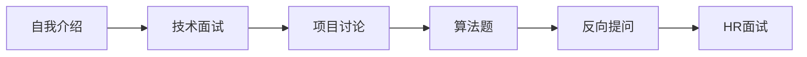

# 嵌入式工程师面试准备：从简历到Offer的完整指南

## 学习目标

完成本教程学习后，你将能够：

- 制作一份专业的嵌入式工程师简历
- 系统准备嵌入式技术面试知识点
- 掌握面试中的沟通和表达技巧
- 有效展示项目经验和技术能力
- 应对各类面试问题和场景
- 了解面试流程和注意事项

## 前置要求

在开始本教程前，建议你：

- 有至少1年的嵌入式开发经验
- 完成过至少1-2个完整项目
- 对自己的职业方向有基本规划
- 了解目标公司和岗位要求

## 准备工作

### 所需材料

```markdown
## 面试准备清单

### 文档材料
□ 个人简历（中英文）
□ 项目作品集
□ 技术博客链接
□ GitHub/Gitee主页
□ 学历学位证书
□ 获奖证书（如有）

### 技术准备
□ 技术知识点总结
□ 项目经验整理
□ 常见问题答案
□ 代码示例准备

### 心理准备
□ 明确求职目标
□ 了解市场行情
□ 调整心态
□ 制定时间计划
```

### 环境准备

**线下面试**：
- 准备正装或商务休闲装
- 打印多份简历
- 准备笔记本和笔
- 规划交通路线
- 提前15-30分钟到达

**线上面试**：
- 测试摄像头和麦克风
- 选择安静的环境
- 准备稳定的网络
- 测试面试软件
- 准备电子版简历

## 步骤1：简历准备

### 简历基本原则

**STAR原则**：
- Situation（情境）：项目背景
- Task（任务）：你的职责
- Action（行动）：采取的行动
- Result（结果）：取得的成果

**简历要点**：
```markdown
## 简历核心要素

### 必须包含
✓ 个人信息（姓名、联系方式）
✓ 教育背景
✓ 工作经历
✓ 项目经验
✓ 技能清单

### 可选包含
○ 个人总结
○ 获奖经历
○ 开源贡献
○ 技术博客
○ 英语能力

### 避免包含
✗ 过多个人信息（身高、体重等）
✗ 无关工作经历
✗ 主观评价（"精通"、"熟练"）
✗ 虚假信息
```

### 简历结构设计

**标准简历模板**：

```markdown
# 张三 - 嵌入式软件工程师

## 个人信息
- 手机：138****1234
- 邮箱：zhangsan@example.com
- GitHub：github.com/zhangsan
- 博客：blog.zhangsan.com
- 期望职位：嵌入式软件工程师
- 期望薪资：15-20K

## 教育背景
**XX大学** | 电子信息工程 | 本科 | 2018.09 - 2022.06
- GPA：3.6/4.0
- 核心课程：嵌入式系统、数字电路、微机原理、C语言程序设计
- 获奖：国家励志奖学金、电子设计竞赛省二等奖

## 工作经历
**XX科技有限公司** | 嵌入式软件工程师 | 2022.07 - 至今
- 负责智能家居产品的固件开发和维护
- 参与产品架构设计和技术选型
- 优化系统性能，降低功耗30%
- 指导2名实习生完成开发任务

## 项目经验
### 智能门锁控制系统（2023.03 - 2023.08）
**项目描述**：
基于STM32F4的智能门锁系统，支持指纹、密码、NFC多种开锁方式

**技术栈**：
STM32F4、FreeRTOS、LVGL、BLE、指纹识别

**主要职责**：
- 负责系统架构设计和核心模块开发
- 实现指纹识别算法集成和优化
- 开发BLE通信协议和手机APP对接
- 实现低功耗设计，待机功耗<50μA

**项目成果**：
- 成功量产，出货量10万+
- 识别准确率达到99.5%
- 获得公司年度优秀项目奖
```

### 车载T-Box系统（2022.09 - 2023.02）
**项目描述**：
车联网终端设备，实现车辆远程监控和OTA升级

**技术栈**：
STM32H7、Linux、4G模块、CAN总线、MQTT

**主要职责**：
- 开发CAN总线通信模块
- 实现MQTT协议栈和云端对接
- 开发OTA升级功能
- 进行系统稳定性测试和优化

**项目成果**：
- 通过车规级测试认证
- OTA升级成功率99.9%
- 系统运行稳定，无重大bug

## 技能清单
**编程语言**：C（熟练）、C++（熟悉）、Python（了解）
**操作系统**：FreeRTOS、RT-Thread、Linux
**通信协议**：UART、SPI、I2C、CAN、BLE、Wi-Fi、4G
**开发工具**：Keil、IAR、GCC、Git、JIRA
**硬件平台**：STM32系列、ESP32、NXP i.MX系列
**其他技能**：低功耗设计、OTA升级、安全启动

## 开源贡献
- 为FreeRTOS贡献代码，修复内存泄漏bug
- 维护个人开源项目：STM32驱动库（Star 500+）
- 技术博客累计阅读量10万+

## 自我评价
3年嵌入式开发经验，熟悉STM32和Linux平台开发。
擅长系统架构设计和性能优化，有完整的产品开发经验。
学习能力强，能快速掌握新技术。
具备良好的团队协作和沟通能力。
```

### 简历优化技巧

**1. 量化成果**

```text
❌ 不好的描述：
"负责系统性能优化"

✅ 好的描述：
"通过算法优化和代码重构，将系统响应时间从200ms降低到50ms，
提升性能75%"

❌ 不好的描述：
"参与产品开发"

✅ 好的描述：
"独立完成3个核心模块开发，代码量5000+行，
按时交付，质量零缺陷"
```

**2. 突出亮点**

```markdown
## 项目亮点提炼

### 技术难点
- 解决了什么技术难题
- 使用了什么创新方案
- 克服了什么挑战

### 业务价值
- 带来了什么收益
- 提升了什么指标
- 解决了什么问题

### 个人贡献
- 承担了什么角色
- 做出了什么贡献
- 获得了什么认可
```

**3. 关键词优化**

根据目标岗位要求，在简历中突出相关关键词：

| 岗位类型 | 关键词示例 |
|---------|-----------|
| 驱动开发 | 设备驱动、内核、BSP、硬件调试 |
| 应用开发 | RTOS、中间件、协议栈、应用框架 |
| 系统架构 | 架构设计、性能优化、技术选型 |
| 物联网 | 无线通信、云平台、边缘计算 |

**4. 格式规范**

```markdown
## 简历格式要求

### 文件格式
- 首选PDF格式（保持格式不变）
- 文件名：姓名-岗位-工作年限.pdf
- 示例：张三-嵌入式工程师-3年.pdf

### 排版要求
- 字体：宋体或微软雅黑
- 字号：10-12pt
- 行距：1.15-1.5倍
- 页边距：2cm左右
- 长度：1-2页（3年以下1页，3年以上2页）

### 视觉效果
- 结构清晰，层次分明
- 重点突出，易于阅读
- 避免花哨的设计
- 保持专业简洁
```

### 常见简历问题

**问题1：技能描述过于主观**

```text
❌ 错误示例：
"精通C语言"
"熟练掌握STM32"
"深入理解RTOS"

✅ 正确示例：
"3年C语言开发经验，代码量10万+行"
"完成5个STM32项目，涵盖F1/F4/H7系列"
"使用FreeRTOS开发3个产品，熟悉任务调度和内存管理"
```

**问题2：项目描述过于简单**

```text
❌ 错误示例：
"参与智能家居项目开发"

✅ 正确示例：
"负责智能家居网关的固件开发，实现Zigbee/Wi-Fi双模通信，
支持100+设备接入，系统稳定运行1年+"
```

**问题3：缺少数据支撑**

```text
❌ 错误示例：
"优化了系统性能"

✅ 正确示例：
"通过DMA优化和算法改进，将数据处理速度提升3倍，
CPU占用率从80%降低到30%"
```

## 步骤2：技术知识准备

### 知识体系梳理

**核心知识点清单**：

```markdown
## 嵌入式技术知识图谱

### 1. C语言基础（必考）
□ 指针和数组
□ 结构体和联合体
□ 函数指针和回调
□ 内存管理
□ 位操作
□ volatile和const关键字
□ 预处理器

### 2. 数据结构与算法
□ 链表、队列、栈
□ 排序和查找算法
□ 时间复杂度分析
□ 常见算法题

### 3. 操作系统原理
□ 进程和线程
□ 任务调度
□ 同步互斥（信号量、互斥锁）
□ 内存管理
□ 中断处理

### 4. 硬件基础
□ 数字电路基础
□ 微处理器架构
□ 存储器类型
□ 常用外设接口
□ 时序图分析

### 5. 通信协议
□ UART、SPI、I2C
□ CAN、USB
□ TCP/IP协议栈
□ 无线通信（BLE、Wi-Fi、LoRa）

### 6. RTOS
□ 任务管理
□ 内存管理
□ 队列和信号量
□ 定时器
□ 中断管理
```

### 高频面试题

**C语言基础题**：

```c
// 题目1：指针和数组的区别
// 问题：以下代码的输出是什么？
char str1[] = "hello";
char *str2 = "hello";
str1[0] = 'H';  // 合法
str2[0] = 'H';  // 非法，段错误

// 解析：
// str1是数组，存储在栈上，可修改
// str2是指针，指向字符串常量区，不可修改

// 题目2：volatile关键字的作用
volatile int flag = 0;

// 解析：
// volatile告诉编译器该变量可能被外部修改（如中断、硬件）
// 防止编译器优化，每次都从内存读取
// 常用于：
// 1. 中断服务程序修改的变量
// 2. 多线程共享变量
// 3. 硬件寄存器

// 题目3：宏定义的陷阱
#define SQUARE(x) x*x
int result = SQUARE(1+2);  // 结果是多少？

// 解析：
// 展开后：1+2*1+2 = 5（不是9！）
// 正确写法：
#define SQUARE(x) ((x)*(x))

// 题目4：结构体内存对齐
struct Test {
    char a;     // 1字节
    int b;      // 4字节
    char c;     // 1字节
};
// sizeof(struct Test) = ?

// 解析：
// 考虑内存对齐，通常是12字节
// a(1) + padding(3) + b(4) + c(1) + padding(3) = 12
```

**操作系统题**：

```c
// 题目1：死锁的四个必要条件
// 回答：
// 1. 互斥条件：资源不能被共享
// 2. 请求和保持：持有资源的同时请求新资源
// 3. 不可剥夺：资源不能被强制剥夺
// 4. 循环等待：存在资源请求的循环链

// 题目2：信号量和互斥锁的区别
// 回答：
// 信号量：
// - 可以计数（0, 1, 2...）
// - 用于资源计数和同步
// - 可以在不同任务间使用
// 互斥锁：
// - 只有两个状态（锁定/未锁定）
// - 用于互斥访问
// - 必须由加锁的任务解锁

// 题目3：中断和轮询的区别
// 回答：
// 中断：
// - 事件驱动，CPU被动响应
// - 实时性好，响应快
// - 需要保存和恢复上下文
// - 适合低频事件
// 轮询：
// - CPU主动查询
// - 实时性差，有延迟
// - 不需要上下文切换
// - 适合高频事件或简单系统
```

**硬件基础题**：

```markdown
## 常见硬件问题

### 题目1：上拉电阻和下拉电阻的作用
**回答**：
- 上拉电阻：将引脚拉到高电平，防止悬空
- 下拉电阻：将引脚拉到低电平，防止悬空
- 作用：
  1. 提供确定的电平状态
  2. 限制电流
  3. 防止干扰

### 题目2：如何选择晶振
**回答**：
考虑因素：
1. 频率：根据系统时钟需求
2. 精度：通信应用需要高精度
3. 负载电容：匹配MCU要求
4. 温度特性：工作温度范围
5. 功耗：低功耗应用选择低功耗晶振
```

### 算法题准备

**常见算法题类型**：

```c
// 1. 链表反转
typedef struct Node {
    int data;
    struct Node *next;
} Node;

Node* reverseList(Node *head) {
    Node *prev = NULL;
    Node *curr = head;
    Node *next = NULL;
    
    while (curr != NULL) {
        next = curr->next;  // 保存下一个节点
        curr->next = prev;  // 反转指针
        prev = curr;        // 移动prev
        curr = next;        // 移动curr
    }
    
    return prev;
}

// 2. 判断链表是否有环
int hasCycle(Node *head) {
    Node *slow = head;
    Node *fast = head;
    
    while (fast != NULL && fast->next != NULL) {
        slow = slow->next;
        fast = fast->next->next;
        
        if (slow == fast) {
            return 1;  // 有环
        }
    }
    
    return 0;  // 无环
}

// 3. 二分查找
int binarySearch(int arr[], int n, int target) {
    int left = 0;
    int right = n - 1;
    
    while (left <= right) {
        int mid = left + (right - left) / 2;
        
        if (arr[mid] == target) {
            return mid;
        } else if (arr[mid] < target) {
            left = mid + 1;
        } else {
            right = mid - 1;
        }
    }
    
    return -1;  // 未找到
}
```

// 4. 字符串反转
void reverseString(char *str) {
    if (str == NULL) return;
    
    int len = strlen(str);
    int i, j;
    
    for (i = 0, j = len - 1; i < j; i++, j--) {
        char temp = str[i];
        str[i] = str[j];
        str[j] = temp;
    }
}

// 5. 找出数组中的最大值和最小值
void findMinMax(int arr[], int n, int *min, int *max) {
    if (n == 0) return;
    
    *min = *max = arr[0];
    
    for (int i = 1; i < n; i++) {
        if (arr[i] < *min) {
            *min = arr[i];
        }
        if (arr[i] > *max) {
            *max = arr[i];
        }
    }
}
```

### 技术深度准备

**针对简历中的技术栈深入准备**：

```markdown
## 技术深度准备清单

### 如果简历中提到STM32
□ 熟悉STM32系列芯片架构
□ 了解HAL库和LL库的区别
□ 掌握常用外设配置（GPIO、UART、SPI、I2C、ADC、DMA）
□ 理解时钟树配置
□ 了解中断优先级和NVIC
□ 掌握低功耗模式

### 如果简历中提到FreeRTOS
□ 理解任务调度算法
□ 掌握任务创建和管理
□ 熟悉队列、信号量、互斥锁
□ 了解内存管理方案
□ 理解临界区保护
□ 掌握软件定时器

### 如果简历中提到通信协议
□ 理解协议的物理层和数据链路层
□ 掌握协议的时序要求
□ 了解协议的错误处理机制
□ 能够分析协议波形
□ 熟悉协议的应用场景
```

## 步骤3：项目经验准备

### 项目描述框架

**STAR法则应用**：

```markdown
## 项目描述模板

### 项目背景（Situation）
- 项目类型和应用场景
- 项目规模和团队规模
- 项目周期和开发阶段
- 面临的挑战和问题

### 你的职责（Task）
- 在项目中的角色
- 负责的模块和功能
- 承担的技术任务
- 需要解决的问题

### 采取的行动（Action）
- 技术方案选择
- 具体实现方法
- 遇到的困难和解决方案
- 与团队的协作

### 取得的成果（Result）
- 项目成果和交付物
- 量化的性能指标
- 获得的认可和奖励
- 个人的成长和收获
```

### 项目经验整理

**准备3-5个核心项目**：

```markdown
## 项目1：智能门锁系统（重点项目）

### 项目背景
公司要开发一款智能门锁产品，需要支持多种开锁方式，
并且要求低功耗、高安全性。我作为核心开发人员，
负责系统架构设计和核心功能实现。

### 技术挑战
1. 多种开锁方式的统一管理
2. 低功耗设计（待机<50μA）
3. 安全性保障（防暴力破解）
4. 用户体验优化（响应时间<500ms）

### 技术方案
**硬件平台**：STM32F4 + 指纹模块 + NFC模块 + BLE模块
**软件架构**：分层架构（HAL层、驱动层、应用层）
**操作系统**：FreeRTOS
**通信协议**：BLE 5.0

### 核心功能实现
1. **指纹识别模块**
   - 集成第三方指纹算法
   - 优化识别速度（<300ms）
   - 实现防假指纹功能

2. **低功耗设计**
   - 使用STM32的Stop模式
   - 外设按需使能
   - 优化唤醒机制
   - 实现动态电源管理
```

3. **安全机制**
   - 实现安全启动
   - 密钥加密存储
   - 防暴力破解（错误次数限制）
   - 日志记录和审计

4. **BLE通信**
   - 实现自定义BLE协议
   - 手机APP对接
   - OTA升级功能
   - 连接稳定性优化

### 技术难点和解决方案
**难点1：低功耗与快速响应的矛盾**
- 问题：深度睡眠模式下唤醒时间长
- 解决：使用浅睡眠+定时唤醒的混合策略
- 效果：待机功耗<50μA，唤醒时间<100ms

**难点2：指纹识别准确率**
- 问题：干手指识别率低
- 解决：调整算法参数，增加多次采样
- 效果：识别准确率从95%提升到99.5%

**难点3：BLE连接稳定性**
- 问题：距离远时连接不稳定
- 解决：优化天线设计，增加重连机制
- 效果：10米内连接成功率>98%

### 项目成果
- 成功量产，出货量10万+
- 用户满意度4.8/5.0
- 获得公司年度优秀项目奖
- 申请专利1项

### 个人收获
- 掌握了完整的产品开发流程
- 提升了系统架构设计能力
- 学会了低功耗设计技巧
- 积累了BLE开发经验
```

### 常见项目问题

**问题1：项目中遇到的最大困难是什么？**

```markdown
## 回答框架

### 描述困难
具体说明遇到的技术难题或挑战

### 分析原因
分析问题的根本原因

### 解决方案
详细说明采取的解决措施

### 最终结果
说明问题是否解决，效果如何

### 经验总结
从中学到了什么
```

**示例回答**：

```text
在智能门锁项目中，最大的困难是实现低功耗设计。

问题：产品要求待机功耗小于50μA，但初版设计功耗达到200μA，
远超要求。

分析：通过功耗分析仪测试，发现主要问题是：
1. 外设时钟未关闭
2. GPIO配置不当导致漏电流
3. 唤醒机制设计不合理

解决方案：
1. 实现动态电源管理，按需使能外设
2. 优化GPIO配置，使用上下拉电阻
3. 改用RTC唤醒替代定时器唤醒
4. 使用STM32的Stop模式替代Sleep模式

结果：最终将待机功耗降低到45μA，满足产品要求。

收获：深入理解了STM32的低功耗机制，掌握了系统级的
功耗优化方法，这些经验在后续项目中都得到了应用。
```

**问题2：如何保证代码质量？**

```markdown
## 回答要点

### 编码规范
- 遵循MISRA C或公司编码规范
- 使用静态代码分析工具
- 代码审查机制

### 测试策略
- 单元测试
- 集成测试
- 系统测试
- 压力测试

### 版本管理
- 使用Git进行版本控制
- 代码审查流程
- 持续集成

### 文档管理
- 编写设计文档
- 代码注释
- 接口文档
```

**问题3：如何进行技术选型？**

```markdown
## 回答框架

### 需求分析
- 功能需求
- 性能需求
- 成本约束
- 时间约束

### 方案对比
- 列出候选方案
- 对比优缺点
- 评估风险

### 决策依据
- 技术成熟度
- 团队经验
- 生态系统
- 长期维护

### 验证方案
- 原型验证
- 性能测试
- 风险评估
```

## 步骤4：面试技巧

### 面试流程

**典型面试流程**：



**各环节时间分配（1小时技术面试）**：

| 环节 | 时间 | 重点 |
|------|------|------|
| 自我介绍 | 3-5分钟 | 突出亮点 |
| 技术基础 | 15-20分钟 | 扎实基础 |
| 项目经验 | 20-25分钟 | 深入细节 |
| 算法题 | 10-15分钟 | 思路清晰 |
| 反向提问 | 5-10分钟 | 展现兴趣 |

### 自我介绍

**3分钟自我介绍模板**：

```text
面试官您好，我叫张三，毕业于XX大学电子信息工程专业，
目前有3年嵌入式开发经验。

【教育背景】
在校期间主修嵌入式系统、数字电路等课程，参加过电子设计竞赛，
获得省二等奖。

【工作经历】
毕业后加入XX公司，主要从事智能家居产品的固件开发。
在这期间，我独立完成了智能门锁和智能网关两个核心产品的开发。

【技术能力】
熟练掌握C语言和STM32平台开发，有FreeRTOS和Linux开发经验。
擅长系统架构设计和性能优化，特别是低功耗设计方面。

【项目成果】
我负责的智能门锁项目成功量产，出货量超过10万台，
通过低功耗优化，将待机功耗降低了65%。

【求职动机】
我对贵公司的XX产品很感兴趣，希望能加入团队，
发挥我在嵌入式开发方面的经验，同时学习更多新技术。

以上是我的基本情况，谢谢！
```

**自我介绍要点**：

```markdown
## 自我介绍结构

### 开场（10秒）
- 姓名、学校、专业
- 工作年限

### 教育背景（20秒）
- 学历和专业
- 相关课程或项目
- 获奖经历（如有）

### 工作经历（60秒）
- 公司和岗位
- 主要职责
- 核心项目
- 技术栈

### 技术能力（40秒）
- 擅长的技术领域
- 核心技能
- 特长和优势

### 项目成果（30秒）
- 代表性项目
- 量化成果
- 获得的认可

### 求职动机（20秒）
- 为什么选择这家公司
- 能带来什么价值
- 职业规划

### 注意事项
✓ 控制在3分钟内
✓ 突出与岗位相关的经验
✓ 用数据说话
✓ 保持自信和热情
✗ 避免背诵感
✗ 不要过于谦虚或自大
✗ 不要提及薪资期望
```

### 技术问题应对

**回答技术问题的STAR法则**：

```markdown
## 技术问题回答框架

### S - Situation（背景）
简要说明问题的背景和上下文

### T - Task（任务）
说明需要解决的具体问题

### A - Action（行动）
详细说明你的解决方案和实现方法

### R - Result（结果）
说明最终效果和收获
```

**示例**：

```text
问题：如何优化系统的启动时间？

回答：
【背景】在我们的车载T-Box项目中，系统启动时间达到8秒，
客户要求优化到3秒以内。

【任务】我负责分析启动流程，找出瓶颈并进行优化。

【行动】
1. 使用示波器和日志分析启动流程，发现主要耗时在：
   - 外设初始化：3秒
   - 文件系统挂载：2秒
   - 网络初始化：2秒

2. 采取的优化措施：
   - 并行初始化非依赖模块
   - 延迟加载非关键外设
   - 优化文件系统配置
   - 使用异步网络初始化

3. 代码层面优化：
   - 减少不必要的延时
   - 优化时钟配置
   - 使用DMA加速数据传输

【结果】
最终将启动时间优化到2.5秒，超出客户预期。
这个优化方案后来应用到了其他产品线。
```

### 不会的问题如何应对

**诚实应对策略**：

```markdown
## 应对不会的问题

### 方式1：承认不知道，但展示学习能力
"这个问题我之前没有深入研究过，但我了解相关的XX概念。
如果遇到这个问题，我会通过查阅文档、参考开源实现、
请教有经验的同事来解决。"

### 方式2：说出相关知识
"这个具体的API我不太熟悉，但我知道它是用来XX的，
工作原理应该是YY。如果项目中需要用到，我会快速学习掌握。"

### 方式3：反问了解需求
"您提到的这个场景很有意思，能否详细说明一下具体的应用场景？
这样我可以更好地理解问题。"

### 避免的回答
✗ "不知道"（太简短）
✗ "这个不重要"（态度问题）
✗ "我们项目不用这个"（局限性）
✗ 胡乱猜测（不诚实）
```

### 算法题应对

**解题步骤**：

```markdown
## 算法题解题流程

### 1. 理解题目（2分钟）
- 仔细阅读题目
- 确认输入输出
- 询问边界条件
- 举例说明理解

### 2. 分析思路（3分钟）
- 说出解题思路
- 分析时间复杂度
- 考虑边界情况
- 与面试官确认

### 3. 编写代码（5分钟）
- 先写框架
- 再填充细节
- 边写边解释
- 注意代码规范

### 4. 测试验证（2分钟）
- 用示例测试
- 考虑边界情况
- 发现并修正bug
- 优化代码

### 5. 复杂度分析（1分钟）
- 分析时间复杂度
- 分析空间复杂度
- 讨论优化可能
```

**示例：链表反转**

```c
// 面试过程演示

// 1. 理解题目
"我理解题目是要反转一个单链表，比如1->2->3->4->5
反转后变成5->4->3->2->1，对吗？"

// 2. 分析思路
"我的思路是使用三个指针：prev、curr、next
遍历链表，逐个反转指针方向
时间复杂度O(n)，空间复杂度O(1)"

// 3. 编写代码
Node* reverseList(Node *head) {
    // 处理空链表
    if (head == NULL) {
        return NULL;
    }
    
    Node *prev = NULL;
    Node *curr = head;
    Node *next = NULL;
    
    // 遍历链表
    while (curr != NULL) {
        next = curr->next;  // 保存下一个节点
        curr->next = prev;  // 反转指针
        prev = curr;        // 移动prev
        curr = next;        // 移动curr
    }
    
    return prev;  // prev是新的头节点
}

// 4. 测试验证
"让我用1->2->3来测试：
初始：prev=NULL, curr=1
第1步：1->NULL, prev=1, curr=2
第2步：2->1->NULL, prev=2, curr=3
第3步：3->2->1->NULL, prev=3, curr=NULL
返回prev=3，正确"

// 5. 复杂度分析
"时间复杂度：O(n)，需要遍历整个链表
空间复杂度：O(1)，只使用了三个指针"
```

### 反向提问

**好的问题示例**：

```markdown
## 关于团队和项目

### 技术相关
1. "团队目前使用的技术栈是什么？"
2. "这个岗位主要负责哪些模块的开发？"
3. "团队的代码审查流程是怎样的？"
4. "公司对新技术的态度如何？"

### 项目相关
1. "目前团队在做什么项目？"
2. "项目的技术难点是什么？"
3. "产品的目标用户是谁？"
4. "项目的开发周期一般多长？"

### 团队相关
1. "团队规模和结构是怎样的？"
2. "团队的工作氛围如何？"
3. "新人会有导师带吗？"
4. "团队的技术分享机制是怎样的？"

### 发展相关
1. "这个岗位的职业发展路径是怎样的？"
2. "公司对员工的培训和学习支持如何？"
3. "技术人员的晋升机制是怎样的？"
4. "公司的技术氛围如何？"

## 避免的问题

### 不要问的问题
✗ "加班多吗？"（第一轮不要问）
✗ "薪资待遇如何？"（HR面再问）
✗ "多久能转正？"（显得急功近利）
✗ "公司会倒闭吗？"（不礼貌）

### 可以问但要注意方式
○ "团队的工作时间安排是怎样的？"
  （比直接问加班好）
○ "这个岗位的薪资范围是多少？"
  （HR面时可以问）
```

## 步骤5：面试后跟进

### 面试总结

**面试后立即记录**：

```markdown
## 面试记录模板

### 基本信息
- 公司：XX科技
- 岗位：嵌入式软件工程师
- 面试官：张经理（技术总监）
- 日期：2026-03-10
- 时长：1小时

### 面试内容
#### 技术问题
1. C语言指针和数组的区别
2. FreeRTOS任务调度原理
3. 如何优化系统功耗
4. 算法题：链表反转

#### 项目讨论
- 重点讨论了智能门锁项目
- 面试官对低功耗设计很感兴趣
- 询问了BLE开发经验

#### 反向提问
- 了解了团队规模和技术栈
- 询问了项目情况
- 了解了职业发展路径

### 自我评估
#### 表现好的地方
- 项目经验讲解清晰
- 技术问题回答准确
- 算法题思路正确

#### 需要改进的地方
- 对Linux驱动开发不够熟悉
- 算法题编码速度可以更快
- 某些细节问题回答不够深入

### 面试官反馈
- 对项目经验比较满意
- 建议加强Linux相关知识
- 整体评价：符合岗位要求

### 后续行动
- 补充Linux驱动开发知识
- 练习算法题
- 等待HR通知
```

### 感谢信

**发送时机**：面试后24小时内

**感谢信模板**：

```text
主题：感谢您的面试机会 - 张三

尊敬的张经理：

您好！

感谢您今天抽出宝贵时间面试我。通过这次交流，我对贵公司
的XX项目和团队有了更深入的了解，也更加坚定了加入贵公司
的意愿。

在面试中，您提到的低功耗设计和系统优化方面的挑战，
正是我在之前项目中积累了丰富经验的领域。我相信我的技能
和经验能够为团队带来价值。

同时，通过这次面试，我也认识到自己在Linux驱动开发方面
还有提升空间。如果有幸加入团队，我会快速学习，尽快上手。

再次感谢您的时间和指导，期待您的好消息！

祝工作顺利！

张三
2026-03-10
```

**注意事项**：
- 简洁真诚，不要过长
- 提及面试中的具体内容
- 表达加入意愿
- 不要催促结果

### 等待结果

**合理的等待时间**：

| 面试轮次 | 等待时间 | 跟进时机 |
|---------|---------|---------|
| 一面 | 3-5天 | 5天后可询问 |
| 二面 | 5-7天 | 7天后可询问 |
| 终面 | 7-10天 | 10天后可询问 |
| Offer | 3-5天 | 5天后可询问 |

**跟进方式**：

```text
主题：咨询面试结果 - 张三

尊敬的HR：

您好！

我是张三，于3月10日参加了贵公司嵌入式软件工程师岗位的面试。

想咨询一下面试结果，以便我合理安排后续的求职计划。

如果还需要补充任何材料，请随时告知。

期待您的回复，谢谢！

张三
```

## 常见问题

### Q1: 如何应对压力面试？

**A**: 压力面试是面试官故意制造压力，测试应聘者的抗压能力：

**常见压力面试场景**：
1. 质疑你的能力："你的经验看起来不够"
2. 挑战你的观点："我不认同你的方案"
3. 打断你的回答："这个不重要，说下一个"
4. 沉默不语：面试官长时间不说话

**应对策略**：
```markdown
### 保持冷静
- 深呼吸，不要慌张
- 理解这是测试，不是针对个人
- 保持专业态度

### 积极回应
- 承认不足，展示学习能力
- 用事实和数据支持观点
- 保持自信，不卑不亢

### 示例回应
面试官："你的经验看起来不够"
回答："我理解您的顾虑。虽然我的工作年限是3年，
但我参与了5个完整项目的开发，积累了丰富的实战经验。
特别是在低功耗设计和系统优化方面，我有独特的见解和
成功案例。我相信经验的质量比数量更重要。"
```

### Q2: 如何谈薪资？

**A**: 薪资谈判是面试的重要环节：

**谈薪时机**：
- 不要在第一轮面试提
- 等HR主动问或终面后
- 拿到Offer后可以谈

**谈薪策略**：

```markdown
## 薪资谈判技巧

### 1. 了解市场行情
- 查看招聘网站的薪资范围
- 咨询同行业朋友
- 参考行业报告

### 2. 评估自身价值
- 工作年限
- 技术能力
- 项目经验
- 学历背景

### 3. 给出合理范围
"根据我的经验和市场行情，我期望的薪资范围是15-20K"
（给出范围比具体数字更灵活）

### 4. 强调价值
"我在低功耗设计方面有丰富经验，能够快速为团队创造价值"

### 5. 考虑整体待遇
- 基本工资
- 绩效奖金
- 股票期权
- 福利待遇
- 发展机会
```

### Q3: 如何应对多个Offer？

**A**: 拿到多个Offer是好事，但需要理性选择：

**评估维度**：

| 维度 | 权重 | 评估要点 |
|------|------|---------|
| 薪资待遇 | 30% | 基本工资、奖金、福利 |
| 发展空间 | 25% | 技术成长、晋升机会 |
| 公司前景 | 20% | 行业地位、发展趋势 |
| 工作内容 | 15% | 技术栈、项目类型 |
| 团队氛围 | 10% | 团队文化、工作环境 |

**决策方法**：

```markdown
## Offer对比表

| 项目 | 公司A | 公司B | 公司C |
|------|-------|-------|-------|
| 薪资 | 18K | 20K | 17K |
| 技术栈 | STM32+FreeRTOS | Linux+C++ | ESP32+IoT |
| 项目 | 智能家居 | 车联网 | 工业控制 |
| 团队 | 10人 | 30人 | 5人 |
| 发展 | 技术专家 | 技术管理 | 创业团队 |
| 通勤 | 30分钟 | 60分钟 | 20分钟 |
| 加班 | 偶尔 | 较多 | 弹性 |

## 综合评分
- 公司A：85分（平衡型）
- 公司B：80分（大平台）
- 公司C：75分（创业型）

## 决策建议
如果看重稳定发展：选择公司A
如果看重薪资和平台：选择公司B
如果看重成长和挑战：选择公司C
```

### Q4: 面试失败后如何调整？

**A**: 面试失败是正常的，关键是总结经验：

**失败原因分析**：

```markdown
## 常见失败原因

### 技术能力不足
- 基础知识薄弱
- 项目经验不够
- 技术栈不匹配

### 表达能力欠缺
- 逻辑不清晰
- 重点不突出
- 紧张影响发挥

### 准备不充分
- 对公司了解不够
- 简历不够完善
- 没有准备常见问题

### 其他原因
- 岗位要求变化
- 内部候选人
- 薪资预期不符
```

**改进计划**：

```markdown
## 面试失败后的行动计划

### 1. 总结反思（1天）
- 记录面试过程
- 分析失败原因
- 找出薄弱环节

### 2. 补充知识（1-2周）
- 针对性学习
- 刷算法题
- 做项目总结

### 3. 优化简历（2-3天）
- 根据反馈调整
- 突出相关经验
- 量化项目成果

### 4. 模拟面试（1周）
- 找朋友模拟
- 录制视频自查
- 改进表达方式

### 5. 继续投递（持续）
- 调整目标公司
- 优化投递策略
- 保持积极心态
```

## 总结

面试准备是一个系统工程，需要从简历、技术、项目、技巧等多方面入手。本教程的核心要点：

**简历准备**：
- 使用STAR法则描述项目经验
- 量化成果，突出亮点
- 针对岗位优化关键词
- 保持格式专业简洁

**技术准备**：
- 系统梳理知识体系
- 准备高频面试题
- 深入理解简历中的技术
- 练习算法题

**项目经验**：
- 准备3-5个核心项目
- 使用STAR法则讲述
- 突出技术难点和解决方案
- 量化项目成果

**面试技巧**：
- 3分钟自我介绍
- 结构化回答问题
- 诚实应对不会的问题
- 准备反向提问

**面试后跟进**：
- 及时记录面试内容
- 发送感谢信
- 合理跟进结果
- 总结经验教训

记住，面试是双向选择的过程，不仅是公司在选择你，你也在选择公司。保持自信，展现真实的自己，相信你一定能找到理想的工作！

## 延伸阅读

- [嵌入式工程师职业规划](../beginner/06-career-planning.html) - 了解职业发展路径
- [技术演讲与分享](05-technical-presentation.html) - 提升表达能力
- [开源项目参与指南](04-open-source-contribution.html) - 积累项目经验

## 参考资料

1. 《程序员面试金典》- Gayle Laakmann McDowell
2. 《剑指Offer》- 何海涛
3. 《嵌入式系统面试宝典》
4. LeetCode算法题库：https://leetcode.cn/
5. 牛客网面经：https://www.nowcoder.com/

---

**练习题**：

1. 根据本教程的模板，制作一份你自己的简历，并请有经验的朋友帮忙审阅。

2. 准备你最熟悉的3个项目的STAR描述，并练习在3分钟内讲清楚一个项目。

3. 从本教程的高频面试题中选择10道题，准备详细的答案，并找朋友模拟面试。

4. 在LeetCode上刷50道算法题，重点练习链表、数组、字符串相关的题目。

5. 研究3家目标公司，了解他们的产品、技术栈和企业文化，准备针对性的面试策略。

**下一步**：建议学习 [技术博客与个人品牌建设](07-technical-blogging.html)，通过写作提升个人影响力，为求职加分。
