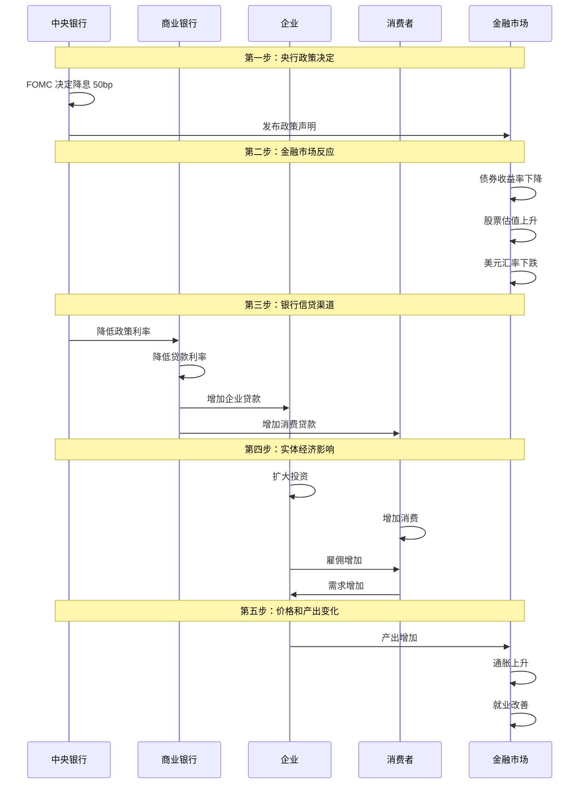

# 中央银行运作：货币政策的制定与执行

## 概述

中央银行是现代金融体系的核心，通过货币政策影响利率、信贷、汇率，进而影响经济增长、就业和通胀。理解中央银行的运作机制，是理解宏观经济和金融市场的关键。

本文将详细讲解：
- 四大央行系统的组织架构和决策机制
- 货币政策工具箱：传统工具和非常规工具
- 政策传导机制：从央行决策到实体经济
- 央行沟通策略和前瞻性指引
- 历史上的重大货币政策案例

掌握这些知识，你将能够：
- 解读央行政策声明和会议纪要
- 预判货币政策走向
- 理解政策对资产价格的影响路径
- 把握政策转向带来的投资机会
- 避免与央行"对抗"的投资错误

## 美联储系统（Federal Reserve System）

### 组织架构

**三层结构**：

1. **联邦储备委员会（Board of Governors）**
   - 7 名委员，由总统提名、参议院批准
   - 任期 14 年，交错任期确保独立性
   - 主席和副主席任期 4 年，可连任
   - 位于华盛顿特区

2. **12 个地区联邦储备银行**
   - 纽约联储：最重要，执行公开市场操作
   - 其他 11 个地区联储：波士顿、费城、克利夫兰、里士满、亚特兰大、芝加哥、圣路易斯、明尼阿波利斯、堪萨斯城、达拉斯、旧金山
   - 半官方性质：股东是成员银行，但受联邦监管

3. **联邦公开市场委员会（FOMC）**
   - 货币政策决策机构
   - 成员：7 名委员 + 12 名地区联储主席（5 名有投票权轮换）
   - 每年 8 次会议
   - 决定联邦基金利率目标

### 政策目标

**双重使命（Dual Mandate）**：
1. 最大化就业
2. 稳定物价（通胀目标 2%）

**与其他央行的区别**：
- 欧央行：单一目标（物价稳定）
- 人民银行：多重目标（增长、就业、物价、国际收支）

### 决策流程

**FOMC 会议**：
1. **经济形势评估**：各地区联储报告（褐皮书）
2. **工作人员报告**：经济预测和政策建议
3. **委员讨论**：各委员发表观点
4. **投票决策**：多数决，通常一致通过
5. **政策声明**：会后立即发布
6. **主席新闻发布会**：解读政策和回答问题
7. **会议纪要**：3 周后发布详细讨论

**市场关注重点**：
- 利率决定（加息、降息、维持）
- 点阵图（Dot Plot）：委员对未来利率的预测
- 经济预测摘要（SEP）：GDP、失业率、通胀预测
- 政策声明措辞变化：鹰派 vs 鸽派

## 欧洲中央银行（European Central Bank, ECB）

### 组织架构

**管理委员会（Governing Council）**：
- 6 名执行委员会成员
- 19 个欧元区国家央行行长
- 每月会议（每 6 周一次政策会议）

**执行委员会（Executive Board）**：
- 行长、副行长、4 名委员
- 负责日常运营和政策执行

### 政策目标

**单一目标**：
- 物价稳定：中期通胀率 2%
- 不承担就业目标（与美联储不同）
- 但实际上也关注经济增长和金融稳定

### 欧央行的挑战

**多国协调**：
- 19 个成员国，经济状况差异大
- 统一货币政策，但财政政策各自独立
- 德国担心通胀，南欧需要宽松

**主权债务危机**：
- 2010-2012 年希腊、西班牙、意大利债务危机
- 欧央行能否购买成员国国债？
- 德拉吉"不惜一切代价"承诺

**负利率政策**：
- 2014 年开始实施负利率
- 存款利率降至 -0.5%
- 对银行盈利能力的挑战

## 中国人民银行（People's Bank of China, PBOC）

### 组织架构

**领导体系**：
- 行长、副行长
- 受国务院领导
- 货币政策委员会：咨询和建议

**分支机构**：
- 9 个大区分行
- 省级分行
- 地市中心支行

### 政策目标

**多重目标**：
1. 保持货币币值稳定
2. 促进经济增长
3. 促进就业
4. 保持国际收支平衡

**实际优先级**：
- 经济增长和金融稳定优先级高
- 通胀容忍度相对较高（3-4%）
- 汇率稳定重要

### 中国特色的货币政策工具

**数量型工具**（传统上更常用）：
- **存款准备金率（RRR）**：调整频繁，幅度大
  - 大型银行：12-13%
  - 中小银行：8-10%
  - 定向降准：支持特定领域
  
- **信贷额度管理**：窗口指导
- **公开市场操作**：逆回购、正回购

**价格型工具**（逐步转向）：
- **贷款市场报价利率（LPR）**：贷款基准利率
- **中期借贷便利（MLF）**：向银行提供中期流动性
- **常备借贷便利（SLF）**：流动性上限
- **抵押补充贷款（PSL）**：支持政策性银行

**结构性工具**：
- 定向降准：支持小微企业、三农
- 再贷款、再贴现：支持特定领域
- "精准滴灌"而非"大水漫灌"

### 中国货币政策的特点

**政策协调**：
- 与财政政策紧密配合
- 与产业政策协调
- 与金融监管协调

**双支柱框架**：
- 货币政策：总量调控
- 宏观审慎政策：防范系统性风险

**汇率管理**：
- 有管理的浮动汇率制度
- 保持人民币汇率基本稳定
- 外汇储备管理

## 日本银行（Bank of Japan, BOJ）

### 组织架构

**政策委员会**：
- 总裁、2 名副总裁、6 名委员
- 每月 1-2 次会议

### 极端宽松政策

**零利率政策（ZIRP）**：
- 1999 年开始
- 政策利率降至 0-0.1%

**量化宽松（QE）**：
- 2001 年开始，全球首创
- 购买国债和其他资产

**量化质化宽松（QQE）**：
- 2013 年黑田东彦上任后推出
- 每年购买 80 万亿日元资产
- 目标：2 年内实现 2% 通胀

**负利率政策（NIRP）**：
- 2016 年开始
- 超额准备金利率 -0.1%

**收益率曲线控制（YCC）**：
- 2016 年开始
- 将 10 年期国债收益率控制在 0% 附近
- 无限量购买国债以维持目标
- 2023 年放松控制

### 日本的教训

**政策局限**：
- 极端宽松政策效果有限
- 通缩预期难以扭转
- 财政和结构性改革更重要

**副作用**：
- 央行资产负债表膨胀（GDP 的 130%）
- 扭曲市场价格发现
- 退出策略困难

## 货币政策工具箱

### 传统工具

**1. 政策利率**

**美联储**：
- 联邦基金利率（Federal Funds Rate）
- 银行间隔夜拆借利率
- 通过公开市场操作实现目标

**欧央行**：
- 主要再融资利率
- 存款便利利率
- 边际贷款便利利率

**人民银行**：
- 7 天逆回购利率
- 1 年期 MLF 利率
- LPR（贷款市场报价利率）

**2. 公开市场操作（OMO）**

**操作方式**：
- 买入债券：注入流动性，降低利率
- 卖出债券：回收流动性，提高利率
- 每日操作，灵活性高

**美联储**：
- 纽约联储执行
- 主要交易国债和 MBS
- 通过一级交易商进行

**3. 准备金要求**

**机制**：
- 要求银行在央行存放一定比例的准备金
- 降准：释放流动性
- 提准：收紧流动性

**使用情况**：
- 中国：频繁使用，调整幅度大（0.5-1%）
- 美国：2020 年降至 0%，基本废弃
- 欧洲：1%，很少调整

**4. 再贴现窗口**

**功能**：
- 银行向央行借款的渠道
- "最后贷款人"
- 通常利率高于市场利率（惩罚性）

**使用**：
- 正常时期很少使用（有污名效应）
- 危机时期大量使用

### 非常规工具

**1. 量化宽松（QE）**

**操作**：
- 大规模购买长期国债、MBS、企业债
- 扩张央行资产负债表
- 压低长期利率

**规模**：
- 美联储：2008-2014 年购买 3.5 万亿，2020-2021 年购买 4.5 万亿
- 欧央行：2015-2018 年购买 2.6 万亿欧元
- 日本银行：持续购买，资产达 GDP 的 130%

**2. 前瞻性指引（Forward Guidance）**

**定义**：
央行承诺未来一段时间的政策路径，影响市场预期。

**类型**：
- **时间导向**："将维持低利率至 2024 年"
- **状态导向**："直到失业率降至 5% 以下"
- **定性指引**："在相当长时间内维持宽松"

**效果**：
- 降低长期利率
- 稳定市场预期
- 增强政策效果

**3. 负利率政策（NIRP）**

**实施**：
- 欧央行：-0.5%
- 日本银行：-0.1%
- 瑞士、瑞典、丹麦也实施过

**机制**：
- 对银行在央行的超额准备金收取利息
- 鼓励银行放贷而非囤积准备金
- 压低整个利率曲线

**争议**：
- 对银行盈利能力的负面影响
- 效果有限（日本经验）
- 可能导致现金囤积

**4. 收益率曲线控制（YCC）**

**日本经验**：
- 承诺将 10 年期国债收益率控制在 0% 附近（±0.25%）
- 无限量购买国债以维持目标
- 2023 年放宽至 ±0.5%，后放弃

**澳大利亚**：
- 2020-2021 年控制 3 年期国债收益率
- 2021 年放弃（通胀上升）

**挑战**：
- 需要无限量购买承诺
- 市场可能"测试"央行决心
- 退出困难

## 货币政策传导机制

### 传导渠道

**1. 利率渠道**
- 政策利率 ↓ → 市场利率 ↓ → 借贷成本 ↓ → 投资和消费 ↑

**2. 信贷渠道**
- 宽松政策 → 银行放贷意愿 ↑ → 信贷可得性 ↑ → 经济活动 ↑

**3. 资产价格渠道**
- 降息 → 股票、房地产价格 ↑ → 财富效应 → 消费 ↑
- 托宾 Q 理论：资产价格 ↑ → 投资 ↑

**4. 汇率渠道**
- 降息 → 本币贬值 → 出口竞争力 ↑ → 净出口 ↑

**5. 预期渠道**
- 宽松政策 → 乐观预期 → 提前消费和投资
- 前瞻性指引强化预期

### 传导的时滞

**政策时滞**：
- 认识时滞：识别经济问题（1-3 个月）
- 决策时滞：政策制定（1-2 个月）
- 执行时滞：政策实施（立即）
- 效果时滞：影响经济（6-18 个月）

**投资含义**：
- 央行政策变化领先经济变化
- 市场提前反应（预期）
- "不要与美联储对抗"（Don't Fight the Fed）

## 历史政策案例

### 案例 1：沃尔克的通胀战争（1979-1982）

**背景**：
- 1970 年代通胀失控，CPI 达 13.5%
- 公众对美联储失去信心
- 通胀预期根深蒂固

**沃尔克的策略**：
- 1979 年 8 月就任美联储主席
- 改变政策框架：从盯住利率转为盯住货币供应
- 允许利率大幅波动
- 联邦基金利率最高达 20%

**代价**：
- 1981-1982 年严重衰退
- 失业率达 10.8%
- 企业破产增加
- 拉美债务危机

**成果**：
- 通胀率从 13.5% 降至 3%
- 通胀预期被打破
- 为 1980-1990 年代繁荣奠定基础
- 确立了美联储的可信度

**投资启示**：
- 央行抗通胀的决心至关重要
- 短期痛苦换取长期稳定
- 高利率环境下债券最终成为最佳投资
- 1982 年开启了 40 年的债券大牛市

### 案例 2：格林斯潘的"大缓和"（1987-2006）

**背景**：
- 1987 年格林斯潘就任美联储主席
- 经历 1987 年股灾、1990 年衰退、2000 年互联网泡沫

**政策特点**：
- **"格林斯潘看跌期权"**：市场下跌时快速降息救市
- 不对称政策：泡沫时不干预，崩盘时救助
- 长期低利率环境

**"大缓和"时期**：
- 1990-2007 年经济波动性大幅下降
- 通胀稳定在 2-3%
- 经济持续增长

**争议**：
- 过度宽松埋下 2008 年危机的种子
- 房地产泡沫
- 金融机构过度冒险
- "格林斯潘看跌期权"鼓励道德风险

**投资启示**：
- 央行的"隐性担保"推高资产价格
- 低利率环境下风险资产表现优异
- 但泡沫最终会破裂
- 理解央行政策框架的演变

### 案例 3：伯南克的危机应对（2008-2014）

**背景**：
- 2008 年金融危机爆发
- 传统货币政策空间耗尽（利率已接近零）
- 金融体系濒临崩溃

**创新政策**：

**1. 紧急流动性工具**：
- TAF（定期拍卖工具）：向银行提供流动性
- TSLF（定期证券借贷工具）：接受 MBS 作为抵押
- CPFF（商业票据融资工具）：购买商业票据
- TALF（定期资产支持证券贷款工具）

**2. 量化宽松（QE）**：
- QE1（2008-2010）：1.7 万亿
- QE2（2010-2011）：6000 亿
- QE3（2012-2014）：每月 850 亿，持续到经济改善

**3. 前瞻性指引**：
- "在相当长时间内维持低利率"
- 后来改为状态导向："直到失业率降至 6.5% 以下"

**效果**：
- 成功稳定金融体系
- 避免了大萧条重演
- 股市从低点上涨 300%+
- 但复苏缓慢，就业恢复慢

**争议**：
- QE 是否必要？
- 是否加剧贫富分化？
- 如何退出？

**投资启示**：
- 危机中央行是最终支撑
- QE 推高所有资产价格
- "不要与美联储对抗"
- 理解政策工具创新

## 央行沟通策略

### 为什么沟通重要

**管理预期**：
- 货币政策通过预期发挥作用
- 清晰沟通增强政策效果
- 减少市场波动

**透明度演进**：
- 1990 年代前：高度保密
- 1994 年：美联储开始发布政策声明
- 2011 年：开始新闻发布会
- 现在：高度透明

### 沟通工具

**1. 政策声明**
- 会后立即发布
- 描述经济形势和政策决定
- 措辞变化是关键信号

**2. 会议纪要**
- 详细讨论记录
- 3 周后发布（美联储）
- 揭示内部分歧

**3. 新闻发布会**
- 主席解读政策
- 回答记者提问
- 市场高度关注

**4. 演讲和证词**
- 主席和委员的公开演讲
- 国会听证
- 传递政策信号

**5. 经济预测**
- SEP（经济预测摘要）
- 点阵图（利率预测）
- 通胀和增长预测

### 鹰派 vs 鸽派

**鹰派（Hawkish）**：
- 更关注通胀风险
- 倾向于加息或收紧政策
- 代表：沃尔克、德国央行传统

**鸽派（Dovish）**：
- 更关注就业和增长
- 倾向于降息或宽松政策
- 代表：伯南克、耶伦

**市场解读**：
- 鹰派言论 → 利率预期上升 → 股市下跌、美元上涨
- 鸽派言论 → 利率预期下降 → 股市上涨、美元下跌

## 央行独立性与政治压力

### 独立性的重要性

**为什么需要独立**：
- 避免政治周期影响货币政策
- 防止财政赤字货币化
- 维护长期物价稳定
- 增强政策可信度

**独立性的维度**：
- **目标独立**：央行自主设定政策目标
- **工具独立**：央行自主选择政策工具
- **人事独立**：任期保障，不受政治干预
- **财务独立**：不依赖财政拨款

### 政治压力

**美国**：
- 特朗普多次批评鲍威尔加息
- 但美联储保持独立
- 国会监督但不干预具体政策

**欧洲**：
- 德国担心通胀，南欧希望宽松
- 政治压力来自多个成员国
- 欧央行坚持独立性

**中国**：
- 人民银行受国务院领导
- 但操作层面有自主权
- 政策协调性强

**土耳其反例**：
- 埃尔多安频繁干预央行
- 多次解雇央行行长
- 导致里拉暴跌，通胀失控

## 央行的局限性

### 货币政策不是万能的

**无法解决的问题**：
- 结构性问题：生产率低下、人口老龄化
- 供给冲击：石油危机、供应链中断
- 财政问题：政府债务过高
- 收入分配：贫富差距

**副作用**：
- 资产泡沫：长期低利率推高资产价格
- 僵尸企业：低利率让低效企业存活
- 储蓄者受损：低利率侵蚀储蓄收益
- 养老金困境：低利率下难以实现回报目标

### "推绳子"问题

**流动性陷阱**：
- 利率已经很低，但企业和家庭不愿借贷
- 货币政策失效
- 日本的长期困境

**解决方案**：
- 财政政策配合
- 结构性改革
- 直升机撒钱（直接给民众发钱）

## 投资者如何跟踪央行

### 关键日程

**美联储**：
- FOMC 会议：每年 8 次（约 6 周一次）
- 会议日程提前公布
- 会后 2:00 PM ET 发布声明
- 2:30 PM 主席新闻发布会
- 3 周后发布会议纪要

**欧央行**：
- 政策会议：每 6 周一次
- 会后新闻发布会
- 2 周后发布会议纪要

**人民银行**：
- 季度货币政策执行报告
- 不定期政策调整
- 关注国务院常务会议

### 解读政策声明

**关键措辞变化**：

**通胀描述**：
- "暂时性" → "持久性"：政策将收紧
- "温和" → "显著"：加息信号
- "接近目标" → "高于目标"：鹰派转向

**经济评估**：
- "稳固" → "温和"：增长放缓
- "强劲" → "稳固"：可能放缓加息

**政策立场**：
- "宽松" → "中性"：政策转向
- "适当" → "限制性"：收紧力度加大

**前瞻性指引**：
- "持续加息" → "暂停加息"：政策拐点
- "保持耐心" → "采取行动"：政策变化

### 点阵图解读

**什么是点阵图**：
- FOMC 委员对未来利率的预测
- 每个点代表一位委员的预测
- 中位数是市场关注重点

**如何解读**：
- 点阵图上移：加息预期增强
- 点阵图下移：降息预期增强
- 分散度：委员分歧程度
- 与市场预期的差异：潜在意外

## 实战应用

### 投资策略调整

**宽松周期**：
- 增加股票配置
- 延长债券久期
- 增加风险资产
- 减少现金

**收紧周期**：
- 减少股票配置（尤其是高估值成长股）
- 缩短债券久期
- 增加现金和短期债券
- 防御性配置

**政策转向时**：
- 最大的投资机会和风险
- 提前布局（市场会提前反应）
- 关注央行沟通的细微变化

### 不同市场的反应时间

**立即反应**（分钟到小时）：
- 外汇市场
- 债券市场
- 期货市场

**快速反应**（小时到天）：
- 股票市场
- 大宗商品

**滞后反应**（月到季度）：
- 房地产市场
- 实体经济
- 就业市场

## 延伸阅读

### 推荐书籍

1. **《美联储的诞生》** - 罗杰·洛温斯坦
   - 美联储创立的历史
   - 理解央行制度的起源

2. **《行动的勇气》** - 本·伯南克
   - 2008 年危机的亲历者回忆
   - 政策制定的内幕

3. **《大缓和的终结》** - 罗伯特·席勒
   - 格林斯潘时代的反思
   - 央行政策的局限

4. **《货币政策的艺术》** - 艾伦·布林德
   - 前美联储副主席的经验
   - 政策制定的实践

5. **《Lords of Finance》** - 利亚卡特·艾哈迈德
   - 1920-1930 年代四大央行行长
   - 大萧条的货币政策失误

6. **《21 世纪货币政策》** - 本·伯南克
   - 伯南克的最新著作
   - 货币政策的未来

### 进阶资源

- 美联储官网：政策声明、会议纪要、演讲
- 欧央行官网：政策决定、经济公报
- 人民银行官网：货币政策执行报告
- 央行观察者：Tim Duy, Nick Timiraos, Mohamed El-Erian

## 参考文献

1. Bernanke, B. S. (2022). *21st Century Monetary Policy: The Federal Reserve from the Great Inflation to COVID-19*. W.W. Norton & Company.

2. Blinder, A. S. (2013). *After the Music Stopped: The Financial Crisis, the Response, and the Work Ahead*. Penguin Press.

3. Lowenstein, R. (2015). *America's Bank: The Epic Struggle to Create the Federal Reserve*. Penguin Press.

4. Ahamed, L. (2009). *Lords of Finance: The Bankers Who Broke the World*. Penguin Press.

5. Woodford, M. (2003). *Interest and Prices: Foundations of a Theory of Monetary Policy*. Princeton University Press.

6. Clarida, R., Gali, J., & Gertler, M. (1999). "The Science of Monetary Policy: A New Keynesian Perspective." *Journal of Economic Literature*, 37(4), 1661-1707.

7. Draghi, M. (2012). "Speech at the Global Investment Conference in London." European Central Bank.

8. Volcker, P. A., & Harper, C. (2018). *Keeping At It: The Quest for Sound Money and Good Government*. PublicAffairs.

9. 周小川 (2016). 《中国货币政策调控方式转型》. 《中国金融》.

10. 易纲 (2021). 《中国的利率体系与利率市场化改革》. 《金融研究》.

11. Federal Reserve (2020). "Statement on Longer-Run Goals and Monetary Policy Strategy." Revised August 2020.

12. European Central Bank (2021). "The ECB's monetary policy strategy statement." Press Release.

13. Bank of Japan (2016). "Introduction of 'Quantitative and Qualitative Monetary Easing with Yield Curve Control'." Statement.

14. Mishkin, F. S. (1996). "The Channels of Monetary Transmission: Lessons for Monetary Policy." *NBER Working Paper* No. 5464.

15. Kuttner, K. N. (2018). "Outside the Box: Unconventional Monetary Policy in the Great Recession and Beyond." *Journal of Economic Perspectives*, 32(4), 121-146.

---

**下一步学习**：
- 进入第二阶段学习 [宏观经济学](../02-economic-foundation/macroeconomics/index.html)
- 深入学习 [经济周期理论](../02-economic-foundation/economic-cycles/index.html)
- 理解 [货币政策](../02-economic-foundation/monetary-policy/index.html) 的更多细节
