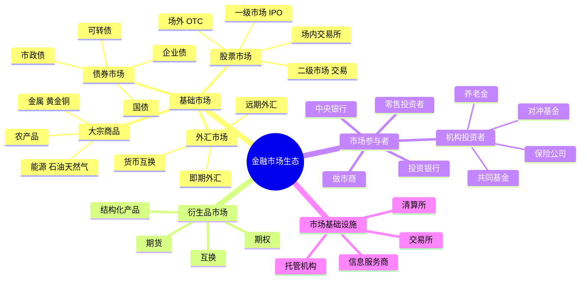

# 金融市场结构：资本流动的生态系统

## 概述

金融市场是资金供给者和需求者交易金融资产的场所，是现代经济的核心基础设施。理解金融市场的结构和运作机制，是理解资本如何流动、资产如何定价的关键。

本文将系统讲解：
- 四大基础市场：股票、债券、外汇、大宗商品的运作机制
- 衍生品市场如何提供风险管理和投机工具
- 不同市场参与者的角色和行为模式
- 市场之间的互联关系和传导机制
- 市场微观结构如何影响价格发现

掌握这些知识，你将能够：
- 理解不同资产类别的特点和风险收益特征
- 认识市场参与者的行为对价格的影响
- 理解市场间的联动和风险传染
- 为资产配置和投资决策打下基础

## 金融市场生态系统



## 股票市场

### 一级市场（发行市场）

**IPO（首次公开发行）流程**：

1. **准备阶段**
   - 公司决定上市
   - 选择投资银行作为承销商
   - 准备招股说明书
   - 监管机构审核

2. **定价阶段**
   - 路演（Roadshow）：向机构投资者推介
   - 询价（Bookbuilding）：收集投资意向
   - 确定发行价格和规模

3. **发行阶段**
   - 向投资者配售股票
   - 股票在交易所挂牌
   - 承销商提供价格稳定支持

**其他发行方式**：
- **增发（SEO）**：已上市公司再次发行股票
- **配股**：向现有股东按比例发行
- **可转债**：可转换为股票的债券
- **SPAC**：特殊目的收购公司（近年流行）

### 二级市场（交易市场）

**交易所市场**：
- **纽约证券交易所（NYSE）**：最大的股票交易所，市值约 25 万亿美元
- **纳斯达克（NASDAQ）**：科技股为主，电子交易
- **上海证券交易所**：中国最大，市值约 7 万亿美元
- **深圳证券交易所**：创业板和中小企业
- **香港交易所**：国际金融中心，连接中国和世界

**交易机制**：
- **连续竞价**：买卖盘实时撮合
- **集合竞价**：开盘和收盘时段
- **做市商制度**：做市商提供流动性（纳斯达克）
- **竞价制度**：订单驱动（NYSE、上交所）

**交易成本**：
- 佣金：券商收取（美国已降至零，中国约 0.03%）
- 印花税：中国 A 股 0.1%（卖出时）
- 买卖价差（Bid-Ask Spread）：流动性成本
- 市场冲击成本：大单交易的价格影响

### 市场参与者

**机构投资者**（占美股 80% 以上）：
- **共同基金**：主动管理，追求超额收益
- **指数基金/ETF**：被动跟踪指数
- **养老金**：长期投资，稳健为主
- **保险公司**：资产负债匹配
- **对冲基金**：多策略，追求绝对收益
- **主权财富基金**：国家外汇储备投资

**零售投资者**（散户）：
- 美国：占比约 20%，多通过基金间接投资
- 中国：占比约 80%，直接炒股为主
- 行为特点：追涨杀跌，情绪化交易

**做市商和高频交易**：
- 提供流动性
- 赚取买卖价差
- 使用算法交易
- 占美股交易量 50% 以上

## 债券市场

### 债券类型

**按发行主体分类**：

1. **国债（Government Bonds）**
   - 主权政府发行
   - 信用风险最低
   - 流动性最好
   - 基准利率

2. **企业债（Corporate Bonds）**
   - 公司发行融资
   - 信用风险较高
   - 收益率高于国债
   - 分为投资级和高收益债（垃圾债）

3. **市政债（Municipal Bonds）**
   - 地方政府发行
   - 美国市政债有税收优惠
   - 中国的城投债

4. **机构债**
   - 政策性银行发行
   - 如国开债、农发债

### 债券市场规模

**全球债券市场**：
- 总规模约 130 万亿美元（2023）
- 大于股票市场（约 100 万亿）
- 美国债券市场最大（约 50 万亿）

**中国债券市场**：
- 规模约 20 万亿美元
- 全球第二大
- 国债、政策性金融债、企业债、城投债

### 债券定价和收益率

**债券价格与收益率反向关系**：
```
债券价格 ↑ ⟺ 收益率 ↓
债券价格 ↓ ⟺ 收益率 ↑
```

**收益率曲线**：
- **正常曲线**：长期利率 > 短期利率（经济正常）
- **倒挂曲线**：长期利率 < 短期利率（衰退信号）
- **平坦曲线**：长短期利率接近（过渡阶段）

**信用利差**：
```
企业债收益率 = 国债收益率 + 信用利差
```
- 信用利差扩大：市场担忧违约风险
- 信用利差收窄：市场风险偏好上升

### 债券市场的作用

1. **融资功能**：政府和企业筹集资金
2. **基准利率**：国债收益率是无风险利率
3. **货币政策传导**：央行通过债券市场影响利率
4. **风险管理**：投资者配置安全资产
5. **经济信号**：收益率曲线预示经济走向

## 外汇市场

### 市场规模和特点

**全球最大的金融市场**：
- 日均交易量约 7.5 万亿美元（2022）
- 24 小时连续交易
- 高度流动性
- 杠杆交易普遍

**主要货币对**：
- EUR/USD（欧元/美元）：交易量最大
- USD/JPY（美元/日元）
- GBP/USD（英镑/美元）
- USD/CNY（美元/人民币）

### 外汇市场类型

**即期市场（Spot Market）**：
- 即时交割（T+2）
- 汇率由供需决定
- 交易量最大

**远期市场（Forward Market）**：
- 约定未来某日的汇率
- 用于对冲汇率风险
- 场外交易（OTC）

**期货市场（Futures Market）**：
- 标准化合约
- 交易所交易
- 保证金制度

**互换市场（Swap Market）**：
- 交换不同货币的现金流
- 长期汇率风险管理
- 银行间市场

### 汇率决定因素

**基本面因素**：
- 利率差异：高利率货币吸引资本流入
- 经济增长：强劲经济支撑货币
- 贸易平衡：顺差国货币升值压力
- 通胀差异：高通胀侵蚀货币价值
- 政治稳定：不确定性导致货币贬值

**市场因素**：
- 央行干预：直接买卖外汇
- 投机资本：短期大量流动
- 风险偏好：避险时美元、日元升值
- 技术面：图表和动量交易

### 外汇市场的参与者

1. **商业银行**：最大的参与者，做市和自营
2. **中央银行**：干预汇率，管理外汇储备
3. **企业**：对冲贸易和投资的汇率风险
4. **机构投资者**：跨境投资的汇率管理
5. **零售交易者**：通过外汇经纪商交易

## 大宗商品市场

### 主要商品类别

**能源**：
- **原油**：WTI（美国）、Brent（欧洲）
  - 全球最重要的大宗商品
  - 影响通胀和经济增长
  - 地缘政治敏感
- **天然气**：区域性定价
- **煤炭**：能源转型中逐步减少

**金属**：
- **贵金属**：黄金、白银、铂金
  - 黄金：避险资产，对抗通胀
  - 与美元负相关
- **工业金属**：铜、铝、锌、镍
  - 经济周期敏感
  - "铜博士"：铜价预示经济走向

**农产品**：
- 谷物：小麦、玉米、大豆
- 软商品：咖啡、可可、棉花
- 受天气和季节影响大

### 商品市场的特点

**实物交割**：
- 期货合约到期可以实物交割
- 大多数投资者在到期前平仓
- 仓储和运输成本影响价格

**供需基本面主导**：
- 供给：产能、库存、天气、地缘政治
- 需求：经济增长、工业生产、季节性
- 库存水平是关键指标

**高波动性**：
- 供需弹性低
- 投机资本参与
- 地缘政治风险

### 商品与宏观经济

**商品作为经济指标**：
- 铜价：工业需求的晴雨表
- 原油：通胀和经济活动
- 黄金：避险情绪和实际利率
- 波罗的海干散货指数（BDI）：全球贸易活跃度

**商品超级周期**：
- 10-20 年的长期趋势
- 由供需结构性变化驱动
- 2000-2011：中国工业化驱动
- 2020s：能源转型和绿色金属需求

## 衍生品市场

### 衍生品类型

**期货（Futures）**：
- 标准化合约
- 交易所交易
- 保证金制度
- 每日结算

**期权（Options）**：
- 买入或卖出的权利（非义务）
- 看涨期权（Call）和看跌期权（Put）
- 杠杆更高，风险有限（买方）

**互换（Swaps）**：
- 交换现金流
- 利率互换、货币互换、信用违约互换（CDS）
- 场外交易，定制化

**结构化产品**：
- 组合多种衍生品
- 定制风险收益特征
- 如保本型、杠杆型产品

### 衍生品的功能

**风险管理（对冲）**：
- 企业对冲汇率、利率、商品价格风险
- 投资者对冲投资组合风险
- 降低不确定性

**价格发现**：
- 期货价格反映市场对未来的预期
- 提供前瞻性信息
- 引导现货市场

**投机和套利**：
- 杠杆放大收益
- 跨市场套利
- 提高市场效率

**风险**：
- 高杠杆可能导致巨额损失
- 复杂产品难以估值
- 系统性风险（如 2008 年 CDS）

## 市场参与者分析

### 机构投资者

**养老金基金**：
- 规模：全球约 50 万亿美元
- 特点：长期投资，风险厌恶
- 配置：股票 40-60%，债券 30-40%，另类 10-20%
- 影响：稳定市场，长期资金来源

**共同基金**：
- 规模：全球约 60 万亿美元
- 特点：主动管理，追求超额收益
- 类型：股票基金、债券基金、混合基金
- 影响：交易活跃，影响股价

**对冲基金**：
- 规模：全球约 4 万亿美元
- 特点：高杠杆，多策略，追求绝对收益
- 策略：多空、事件驱动、宏观、量化
- 影响：市场波动的放大器

**保险公司**：
- 规模：全球约 35 万亿美元
- 特点：资产负债匹配，偏好固定收益
- 配置：债券为主（60-70%）
- 影响：债券市场的重要买家

**主权财富基金**：
- 规模：全球约 11 万亿美元
- 特点：国家外汇储备投资，长期视角
- 代表：挪威政府养老基金、中投公司、新加坡 GIC
- 影响：跨境资本流动的重要力量

### 零售投资者（散户）

**美国散户**：
- 占股市交易量 20% 左右
- 多通过基金间接投资（401k 养老金计划）
- 长期投资为主
- 2020 年后 Robinhood 等平台推动散户交易增加

**中国散户**：
- 占 A 股交易量 80% 以上
- 直接炒股为主
- 换手率高，投机性强
- 行为特点：追涨杀跌，羊群效应

**散户的劣势**：
- 信息不对称
- 情绪化决策
- 交易成本高（频繁交易）
- 缺乏专业分析能力

### 做市商和高频交易

**做市商（Market Makers）**：
- 同时报买价和卖价
- 赚取买卖价差
- 提供流动性
- 承担库存风险

**高频交易（HFT）**：
- 使用算法和高速网络
- 毫秒级交易
- 套利微小价差
- 占美股交易量 50% 以上

**争议**：
- 提高了市场效率和流动性
- 但可能加剧市场波动
- "闪电崩盘"（Flash Crash）风险

## 市场互联机制

### 跨市场联动

**股债跷跷板**：
- 风险偏好上升：资金从债券流向股票
- 避险情绪上升：资金从股票流向债券
- 但有时股债同涨或同跌（流动性驱动）

**美元与大宗商品**：
- 美元升值 → 商品价格下跌（以美元计价）
- 美元贬值 → 商品价格上涨
- 负相关关系

**利率与资产价格**：
- 利率上升 → 股票估值下降，债券价格下跌
- 利率下降 → 股票估值上升，债券价格上涨
- 房地产对利率高度敏感

### 风险传染机制

**流动性传染**：
- 一个市场流动性枯竭
- 投资者被迫抛售其他市场资产
- 引发连锁反应

**信用传染**：
- 一家机构违约
- 交易对手损失
- 信心崩溃，信用紧缩

**情绪传染**：
- 恐慌情绪蔓延
- 羊群效应
- 市场暴跌

## 历史案例分析

### 案例 1：1987 年黑色星期一

**事件**：
- 1987 年 10 月 19 日，道琼斯指数单日暴跌 22.6%
- 全球股市连锁下跌
- 史上最大单日跌幅

**原因**：
- 程序化交易（Portfolio Insurance）放大下跌
- 市场流动性枯竭
- 恐慌性抛售

**应对**：
- 美联储立即声明提供流动性
- 暂停程序化交易
- 引入熔断机制

**启示**：
- 市场微观结构影响价格稳定
- 流动性是市场的生命线
- 央行的"最后贷款人"角色至关重要
- 程序化交易需要监管

### 案例 2：2015 年中国股市异常波动

**事件**：
- 2014-2015 年上半年：A 股暴涨，上证指数从 2000 点涨至 5178 点
- 2015 年 6-8 月：暴跌，最大跌幅 45%
- 千股跌停，流动性枯竭

**原因**：
- 杠杆资金大量入市（场外配资、融资融券）
- 散户投机情绪高涨
- 监管突然收紧配资
- 强制平仓引发连锁反应

**政府救市**：
- 证金公司入市购买股票
- 暂停 IPO
- 限制大股东减持
- 调查"恶意做空"

**启示**：
- 杠杆是双刃剑，放大涨跌
- 散户主导的市场波动性更大
- 监管政策对市场影响巨大
- 政府干预的利弊权衡

### 案例 3：2020 年 3 月流动性危机

**事件**：
- COVID-19 疫情爆发
- 全球股市暴跌 30-40%
- 连美国国债市场都出现流动性问题
- 企业债、市政债市场几乎停摆

**原因**：
- 恐慌性抛售
- 共同基金面临赎回压力
- 做市商退出市场
- 流动性螺旋下降

**央行应对**：
- 美联储无限量 QE
- 购买企业债 ETF（史无前例）
- 建立多个流动性工具
- 全球央行协调行动

**启示**：
- 极端情况下，所有资产都可能失去流动性
- 央行是市场的最终支撑
- 现金和流动性的重要性
- 危机中的投资机会

## 市场基础设施

### 交易所

**功能**：
- 提供交易平台
- 制定交易规则
- 监督市场行为
- 信息披露

**盈利模式**：
- 交易费用
- 上市费用
- 数据服务费
- 技术服务费

### 清算所

**功能**：
- 交易确认和清算
- 作为中央对手方（CCP）
- 管理保证金
- 降低交易对手风险

**重要性**：
- 防止连锁违约
- 提高市场效率
- 降低系统性风险

### 托管机构

**功能**：
- 保管证券资产
- 处理公司行动（分红、配股）
- 提供资产服务
- 风险隔离

## 延伸阅读

### 推荐书籍

1. **《金融市场与金融机构基础》** - 弗兰克·法博齐
   - 金融市场的全面介绍
   - 适合系统学习

2. **《股票作手回忆录》** - 埃德温·利弗莫尔
   - 经典交易回忆录
   - 理解市场心理

3. **《说谎者的扑克牌》** - 迈克尔·刘易斯
   - 华尔街债券交易的内幕
   - 可读性强

4. **《大空头》** - 迈克尔·刘易斯
   - 2008 年危机中做空次贷的故事
   - 理解市场如何失灵

5. **《非理性繁荣》** - 罗伯特·席勒
   - 市场泡沫的形成
   - 行为金融学视角

6. **《金融市场技术分析》** - 约翰·墨菲
   - 技术分析经典
   - 理解市场行为

### 进阶资源

- 各大交易所官网（NYSE, NASDAQ, LSE, HKEX, SSE）
- 世界交易所联合会（WFE）统计数据
- 国际证监会组织（IOSCO）监管指引
- 彭博、路透等金融数据终端

## 参考文献

1. Harris, L. (2003). *Trading and Exchanges: Market Microstructure for Practitioners*. Oxford University Press.

2. Fabozzi, F. J., Modigliani, F., & Jones, F. J. (2014). *Foundations of Financial Markets and Institutions* (4th ed.). Pearson.

3. Shiller, R. J. (2015). *Irrational Exuberance* (3rd ed.). Princeton University Press.

4. Lewis, M. (2010). *The Big Short: Inside the Doomsday Machine*. W.W. Norton & Company.

5. Mackay, C. (1841). *Extraordinary Popular Delusions and the Madness of Crowds*. Richard Bentley.

6. Schwager, J. D. (2012). *Market Wizards: Interviews with Top Traders*. Wiley.

7. 吴晓求 (2017). 《中国资本市场：从理论到实践》. 中国人民大学出版社.

8. Bank for International Settlements (2022). "OTC derivatives statistics." Quarterly Review.

9. World Federation of Exchanges (2023). "Annual Statistics Guide."

10. Securities and Exchange Commission (2010). "Findings Regarding the Market Events of May 6, 2010." Report.

11. 中国证券监督管理委员会 (2016). 《关于 2015 年股市异常波动的调查报告》.

12. International Organization of Securities Commissions (2021). "Principles for Financial Market Infrastructures."

---

**下一步学习**：
- 学习 [通胀理论](inflation-theory.html) 理解货币政策如何通过市场传导
- 阅读 [中央银行运作](central-banking.html) 了解央行如何影响市场
- 进入第二阶段学习宏观经济学和经济周期理论
