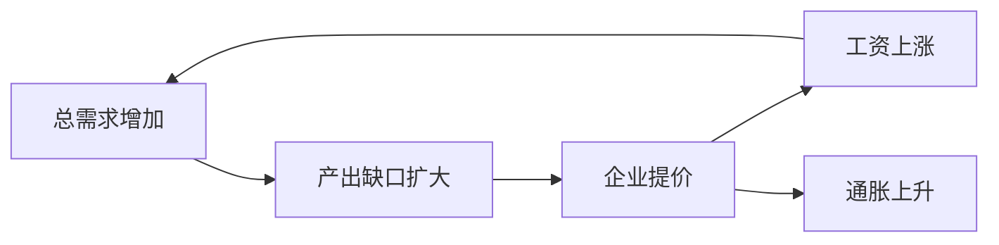
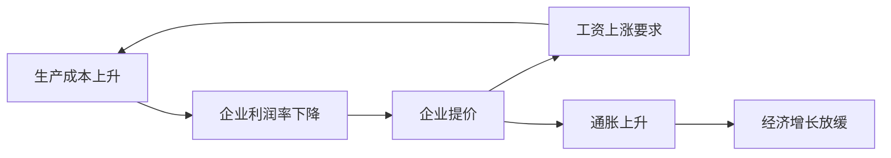
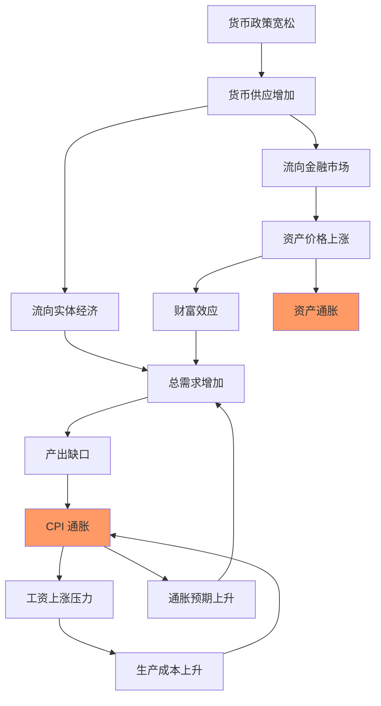

# 通胀理论：货币、价格与资产配置

## 概述

通货膨胀是现代经济中最重要的宏观变量之一，深刻影响着货币政策、经济增长和资产价格。理解通胀的成因和影响机制，是投资者必备的基础知识。

本文将系统讲解：
- 通胀的定义和多种测量方法
- 三大通胀理论：需求拉动、成本推动、货币主义
- 通胀对不同资产类别的影响机制
- 历史上的重大通胀事件和教训
- 通胀环境下的投资策略

掌握通胀理论，你将能够：
- 理解央行为何如此关注通胀
- 预判通胀趋势对投资组合的影响
- 在不同通胀环境下调整资产配置
- 识别通胀风险和通缩风险
- 理解"实际收益率"的重要性

## 通胀的定义和测量

### 什么是通货膨胀

**定义**：
通货膨胀是指一般物价水平在一段时间内持续上涨的现象，等价于货币购买力的下降。

**关键要素**：
- **一般物价水平**：不是个别商品价格，而是整体价格水平
- **持续上涨**：不是短期波动，而是趋势性变化
- **货币现象**：本质上是货币购买力的变化

### 通胀测量指标

**1. 消费者物价指数（CPI）**

最常用的通胀指标，衡量消费者购买一篮子商品和服务的价格变化。

**构成**（美国 CPI）：
- 住房：42%（最大权重）
- 食品和饮料：14%
- 交通：17%
- 医疗：9%
- 教育和通讯：7%
- 其他：11%

**计算方法**：
```
CPI 通胀率 = (本期 CPI - 上期 CPI) / 上期 CPI × 100%
```

**核心 CPI（Core CPI）**：
- 剔除食品和能源价格
- 更稳定，反映潜在通胀趋势
- 央行更关注核心 CPI

**2. 生产者物价指数（PPI）**

衡量生产者出厂价格的变化。

**特点**：
- 领先于 CPI（成本传导需要时间）
- 反映上游价格压力
- 对工业品价格敏感

**3. 个人消费支出价格指数（PCE）**

美联储首选的通胀指标。

**与 CPI 的区别**：
- 权重动态调整（CPI 权重固定）
- 覆盖范围更广
- 通常低于 CPI 0.3-0.5 个百分点

**核心 PCE**：
- 美联储的通胀目标：2%
- 政策制定的关键参考

**4. GDP 平减指数**

衡量整个经济的价格水平变化。

**特点**：
- 覆盖所有商品和服务
- 权重根据 GDP 构成
- 最全面但发布滞后

### 通胀的分类

**按程度分类**：
- **温和通胀**：2-3% 年率（健康水平）
- **高通胀**：5-10% 年率（需要警惕）
- **恶性通胀**：> 50% 月率（经济崩溃）
- **通缩**：负通胀（也有问题）

**按持续性分类**：
- **暂时性通胀**：供给冲击导致，会自行消退
- **持久性通胀**：需求过热或货币超发，需要政策干预

## 三大通胀理论

### 1. 需求拉动型通胀（Demand-Pull Inflation）

**核心观点**：
总需求超过总供给，导致价格上涨。

**传导机制**：


**触发因素**：
- 财政刺激：政府增加支出
- 货币宽松：低利率刺激消费和投资
- 出口增长：外部需求旺盛
- 消费者信心：乐观预期推动消费

**经典案例**：
- 1960 年代美国：越战支出 + 伟大社会计划
- 2021-2022 年：疫情后财政刺激 + 压抑需求释放

**政策应对**：
- 加息：抑制需求
- 紧缩财政：减少政府支出
- 提高准备金率：收紧信贷

### 2. 成本推动型通胀（Cost-Push Inflation）

**核心观点**：
生产成本上升，企业被迫提价，导致通胀。

**传导机制**：


**触发因素**：
- 能源价格上涨：石油危机
- 原材料价格上涨：供应链中断
- 工资上涨：劳动力短缺
- 汇率贬值：进口成本上升
- 监管成本：环保、安全标准提高

**经典案例**：
- 1970 年代石油危机：油价上涨 4 倍
- 2021-2022 年：供应链中断 + 能源价格飙升

**政策困境**：
- 加息抑制需求，但无法解决供给问题
- 可能导致"滞胀"（通胀 + 经济停滞）
- 需要供给侧改革配合

### 3. 货币主义通胀理论（Monetarist Theory）

**核心观点**：
"通胀永远是货币现象"（弗里德曼）。货币供应增长超过经济增长，导致通胀。

**货币数量方程**：
```
M × V = P × Y

M = 货币供应量
V = 货币流通速度
P = 价格水平
Y = 实际产出
```

**推导**：
```
通胀率 ≈ 货币增长率 - 实际 GDP 增长率
```

**关键假设**：
- 货币流通速度（V）相对稳定
- 长期来看，实际产出（Y）由供给面决定
- 因此，货币供应（M）决定价格水平（P）

**经典案例**：
- 1970-1980 年代美国：M2 增速与通胀高度相关
- 2000-2020 年：货币大量增加但通胀温和（V 下降）

**现代质疑**：
- 2008 年后 QE 规模巨大，但通胀温和
- 货币流通速度不稳定
- 货币流向金融市场而非实体经济

## 通胀传导机制



**关键洞察**：
- 货币增加可能导致 CPI 通胀或资产通胀
- 2008 年后主要是资产通胀（股票、房地产）
- 2021-2022 年转为 CPI 通胀（供应链 + 需求）
- 通胀预期自我实现

## 通胀对资产价格的影响

### 理论框架

**实际收益率 = 名义收益率 - 通胀率**

这是投资的黄金法则。投资者关心的是实际购买力的增长，而非名义数字。

### 不同资产的表现

**股票**：
- **温和通胀（2-3%）**：✓ 最佳环境
  - 企业可以提价，保持利润率
  - 经济增长健康
  - 估值合理
  
- **高通胀（> 5%）**：✗ 不利
  - 央行加息，估值压缩
  - 成本上升，利润率下降
  - 不确定性增加
  
- **通缩（< 0%）**：✗ 不利
  - 需求萎缩，企业盈利下降
  - 债务负担加重

**债券**：
- **通胀上升**：✗✗ 最不利
  - 固定收益被通胀侵蚀
  - 央行加息，债券价格下跌
  - 实际收益率为负
  
- **通胀下降**：✓✓ 最有利
  - 实际收益率上升
  - 央行降息，债券价格上涨

**房地产**：
- **温和通胀**：✓ 有利
  - 租金随通胀上涨
  - 实物资产保值
  - 低利率支持
  
- **高通胀**：± 复杂
  - 租金上涨（利好）
  - 但利率上升（利空）
  - 取决于通胀类型和政策应对

**黄金**：
- **高通胀**：✓✓ 最有利
  - 传统抗通胀资产
  - 货币购买力下降时的避险
  - 与实际利率负相关
  
- **低通胀 + 高利率**：✗ 不利
  - 持有黄金无利息收入
  - 机会成本高

**大宗商品**：
- **通胀上升**：✓ 有利
  - 商品价格本身就是通胀的组成部分
  - 供需紧张推高价格
  
- **通缩**：✗ 不利
  - 需求萎缩
  - 价格下跌

**现金**：
- **任何通胀**：✗ 不利
  - 购买力持续下降
  - 实际收益率为负
  - 但提供流动性和灵活性

### 资产配置矩阵

| 通胀环境 | 最佳资产 | 次优资产 | 避免资产 |
|---------|---------|---------|---------|
| 低通胀 + 增长 | 股票、企业债 | 房地产 | 现金、黄金 |
| 高通胀 + 增长 | 商品、房地产 | 股票（价值股） | 债券、现金 |
| 低通胀 + 衰退 | 国债、黄金 | 现金 | 股票、商品 |
| 高通胀 + 衰退（滞胀） | 黄金、商品 | 现金 | 股票、债券 |


## 历史案例分析

### 案例 1：1970 年代大滞胀

**背景**：
- 1973 年和 1979 年两次石油危机
- 油价从 3 美元/桶飙升至 40 美元/桶
- 美国 CPI 通胀率达到 13.5%（1980）
- 同时经济增长停滞，失业率上升

**成因分析**：

**成本推动**：
- 石油价格暴涨（OPEC 石油禁运）
- 能源成本传导至各行业
- 工资-价格螺旋上升

**需求拉动**：
- 1960 年代货币政策过度宽松
- 越战和"伟大社会"计划的财政支出
- 总需求持续超过供给

**货币因素**：
- 美元与黄金脱钩（1971 年布雷顿森林体系崩溃）
- 货币供应失去约束
- M2 增速过快

**政策应对**：

**沃尔克的激进加息**（1979-1982）：
- 联邦基金利率提高至 20%
- 引发严重衰退
- 失业率达到 10.8%
- 但成功控制通胀

**效果**：
- 通胀率从 13.5% 降至 3%
- 为 1980-1990 年代的繁荣奠定基础
- 确立了央行抗通胀的决心和可信度

**投资启示**：
- 滞胀是最糟糕的投资环境
- 股票和债券都表现不佳
- 黄金从 35 美元涨至 850 美元（24 倍）
- 商品和实物资产是最佳选择
- 高利率最终压垮通胀，创造债券投资机会

### 案例 2：2021-2023 年通胀回归

**背景**：
- 2020 年疫情后大规模财政刺激
- 美国发放数万亿美元支票
- 美联储维持零利率和 QE
- 2021 年经济重启，需求激增

**通胀爆发**：
- 2021 年初：CPI 2%
- 2022 年 6 月：CPI 达到 9.1%（40 年新高）
- 核心 PCE 也达到 5.4%

**成因分析**：

**需求侧**：
- 财政刺激：5 万亿美元（美国 GDP 的 25%）
- 货币宽松：M2 增速达到 27%
- 压抑需求释放：疫情后报复性消费

**供给侧**：
- 供应链中断：港口拥堵，芯片短缺
- 劳动力短缺：提前退休，工资上涨
- 能源价格：俄乌冲突推高油价和天然气价格

**美联储应对**：
- 2022 年 3 月开始加息
- 18 个月内加息 11 次，从 0% 升至 5.5%
- 史上最激进的加息周期之一
- 同时缩表（QT）

**效果**：
- 2023 年底通胀降至 3-4%
- 经济未陷入严重衰退（软着陆）
- 但房地产市场受到冲击
- 区域银行危机（SVB 等）

**争议**：

**"暂时性"争论**：
- 2021 年美联储称通胀是"暂时的"
- 后来证明判断错误
- 延误了加息时机

**财政 vs 货币**：
- 财政刺激过度？
- 货币政策反应太慢？
- 供应链问题被低估？

**投资启示**：
- 通胀预期转变对市场影响巨大
- 2022 年股债双杀（60/40 组合最差年份）
- 现金和短期国债成为避风港
- 能源股和价值股表现优于成长股
- 理解通胀周期对投资时机至关重要

### 案例 3：日本的通缩陷阱（1990s-2020s）

**背景**：
- 1990 年资产泡沫破裂
- 股市和房地产暴跌
- 银行坏账累积

**通缩螺旋**：
```
资产价格下跌 → 财富缩水 → 消费减少 → 企业降价 → 
利润下降 → 工资下降 → 消费进一步减少 → 通缩加剧
```

**特征**：
- CPI 通胀率长期在 0% 附近或为负
- 名义 GDP 零增长
- 利率降至零甚至负值
- 货币政策失效

**政策尝试**：
- 零利率政策（ZIRP）
- 量化宽松（QE）
- 负利率政策（NIRP）
- 收益率曲线控制（YCC）
- 大规模财政刺激

**效果有限**：
- 通缩预期根深蒂固
- 企业和家庭不愿借贷和消费
- "流动性陷阱"
- 直到 2022 年才出现明显通胀

**投资启示**：
- 通缩环境下现金为王
- 日本股市失去 30 年（1990-2020）
- 日本国债收益率长期接近零
- 避免通缩陷阱比抗通胀更难

## 通胀预期的重要性

### 预期如何形成

**适应性预期**：
- 基于过去的通胀经验
- 通胀持续 → 预期上升
- 通胀下降 → 预期下降

**理性预期**：
- 基于所有可得信息
- 考虑政策变化
- 前瞻性判断

**央行可信度**：
- 如果市场相信央行能控制通胀
- 预期就会锚定在目标水平（如 2%）
- 沃尔克的激进加息建立了美联储的可信度

### 预期的自我实现

**通胀预期上升**：
- 工人要求更高工资
- 企业提前提价
- 消费者提前购买
- 实际通胀上升

**通缩预期**：
- 推迟消费和投资
- 企业降价
- 工资下降
- 实际通缩

**政策含义**：
- 管理预期是货币政策的核心
- 前瞻性指引（Forward Guidance）
- 通胀目标制（Inflation Targeting）

## 通胀与投资策略

### 通胀对冲策略

**1. 实物资产**
- 房地产：租金随通胀上涨
- 大宗商品：价格直接受益
- 基础设施：现金流与通胀挂钩

**2. 通胀保值债券（TIPS）**
- 本金随 CPI 调整
- 提供实际收益率保护
- 美国 TIPS，中国 CPI 挂钩债券

**3. 股票（选择性）**
- 定价权强的公司：奢侈品、品牌消费品
- 资产轻的公司：软件、服务业
- 避免：资本密集型、低利润率行业

**4. 黄金和贵金属**
- 传统抗通胀资产
- 与实际利率负相关
- 但短期波动大

### 不同通胀环境的策略

**低通胀 + 增长（Goldilocks）**：
- 股票 60-70%
- 债券 20-30%
- 另类 10%
- 最佳投资环境

**高通胀 + 增长**：
- 商品 30-40%
- 股票（价值股）30-40%
- 房地产 20%
- 短期债券 10%

**滞胀（高通胀 + 衰退）**：
- 黄金 30-40%
- 商品 20-30%
- 现金 20-30%
- 短期国债 20%
- 最困难的环境

**通缩**：
- 长期国债 40-50%
- 现金 30%
- 高质量股票 20%
- 避免：商品、房地产

## 通胀的结构性变化

### 2010s：低通胀之谜

**现象**：
- 2008 年后货币大量增加
- 但 CPI 通胀持续低于 2%
- 挑战了传统货币理论

**解释**：

**1. 全球化**
- 中国等新兴市场融入全球经济
- 劳动力供给增加
- 制造业成本下降

**2. 技术进步**
- 自动化降低生产成本
- 互联网提高效率
- 数字产品边际成本接近零

**3. 人口老龄化**
- 储蓄率上升，消费率下降
- 总需求不足
- 日本、欧洲尤为明显

**4. 货币流通速度下降**
- 货币滞留在金融体系
- 未流入实体经济
- 导致资产通胀而非 CPI 通胀

### 2020s：通胀回归？

**新的通胀压力**：

**1. 去全球化**
- 供应链本地化
- 贸易保护主义
- 成本上升

**2. 能源转型**
- 传统能源投资不足
- 绿色能源成本高
- 过渡期价格波动

**3. 劳动力短缺**
- 人口老龄化
- 移民限制
- 工资上涨压力

**4. 财政主导**
- 政府支出增加（基建、绿色、国防）
- 央行配合（财政赤字货币化）
- MMT 思想影响

**争论**：
- 是新的高通胀时代？
- 还是暂时性冲击？
- 央行能否控制？

## 实战应用

### 监测通胀的关键指标

**领先指标**：
- PPI：领先 CPI 3-6 个月
- 大宗商品价格：原油、铜、农产品
- 货币供应增速：M2 增长率
- 工资增长：劳动力成本

**同步指标**：
- CPI、核心 CPI
- PCE、核心 PCE
- GDP 平减指数

**预期指标**：
- 密歇根大学消费者通胀预期
- 盈亏平衡通胀率（TIPS 与国债利差）
- 市场定价的通胀预期

### 投资决策框架

**步骤 1：判断通胀趋势**
- 当前通胀水平和趋势
- 领先指标的信号
- 央行的政策立场

**步骤 2：评估政策应对**
- 央行会加息还是维持？
- 财政政策是扩张还是紧缩？
- 政策的滞后效应

**步骤 3：调整资产配置**
- 根据通胀环境选择资产类别
- 调整股票内部结构（价值 vs 成长）
- 管理久期（债券）
- 考虑对冲工具

**步骤 4：动态再平衡**
- 通胀环境变化时及时调整
- 不要过度交易
- 保持纪律

## 常见误区

### 误区 1："通胀对股票总是不利"

**真相**：
- 温和通胀（2-3%）对股票有利
- 高通胀（> 5%）才不利
- 关键看企业能否转嫁成本

### 误区 2："黄金是最佳抗通胀资产"

**真相**：
- 黄金对抗的是实际利率下降，而非通胀本身
- 1980-2000 年通胀温和，但黄金表现不佳
- 股票长期抗通胀能力更强

### 误区 3："房地产永远抗通胀"

**真相**：
- 高通胀导致高利率，房地产承压
- 1970-1980 年代房地产实际收益率为负
- 需要区分名义价格和实际价格

### 误区 4："通缩对经济有利"

**真相**：
- 温和通缩可能反映生产率提高（好事）
- 但持续通缩导致债务负担加重
- 推迟消费，经济螺旋下降
- 日本的教训

## 深入理解：菲利普斯曲线

**传统菲利普斯曲线**：
- 通胀与失业率负相关
- 低失业率 → 工资上涨 → 通胀上升
- 政策权衡：降低失业 vs 控制通胀

**1970 年代的挑战**：
- 滞胀：高通胀 + 高失业
- 菲利普斯曲线失效
- 引入预期因素

**现代理解**：
- 短期：菲利普斯曲线存在
- 长期：通胀由预期决定
- 央行可信度是关键

**近年的"平坦化"**：
- 失业率很低，但通胀温和（2010s）
- 全球化和技术进步压低价格
- 工人议价能力下降

## 延伸阅读

### 推荐书籍

1. **《通胀螺旋》** - 弗里德曼
   - 货币主义通胀理论
   - 历史数据支持

2. **《这次不一样》** - 莱因哈特、罗格夫
   - 800 年金融危机史
   - 通胀和通缩的历史模式

3. **《债务危机》** - 瑞·达里奥
   - 通胀性去杠杆 vs 通缩性去杠杆
   - 48 个历史案例

4. **《美联储的诞生》** - 罗杰·洛温斯坦
   - 理解央行如何管理通胀

5. **《大通胀时代》** - 威廉·西尔伯
   - 1970 年代滞胀的详细分析
   - 沃尔克如何战胜通胀

6. **《通缩的恐怖》** - 克鲁格曼
   - 日本通缩陷阱分析
   - 流动性陷阱理论

### 进阶资源

- 美国劳工统计局（BLS）：CPI 数据和方法论
- 美联储经济数据（FRED）：各类通胀指标
- 克利夫兰联储：通胀预期模型
- 国际清算银行（BIS）：全球通胀研究

## 参考文献

1. Friedman, M. (1963). *Inflation: Causes and Consequences*. Asia Publishing House.

2. Blanchard, O., & Gali, J. (2007). "The Macroeconomic Effects of Oil Price Shocks: Why are the 2000s so different from the 1970s?" *NBER Working Paper* No. 13368.

3. Bernanke, B. S. (2004). "The Great Moderation." Speech at Eastern Economic Association.

4. Reinhart, C. M., & Rogoff, K. S. (2009). *This Time Is Different: Eight Centuries of Financial Folly*. Princeton University Press.

5. Krugman, P. (1998). "It's Baaack: Japan's Slump and the Return of the Liquidity Trap." *Brookings Papers on Economic Activity*, 1998(2), 137-205.

6. Goodfriend, M., & King, R. G. (2005). "The Incredible Volcker Disinflation." *Journal of Monetary Economics*, 52(5), 981-1015.

7. Summers, L. H. (2014). "U.S. Economic Prospects: Secular Stagnation, Hysteresis, and the Zero Lower Bound." *Business Economics*, 49(2), 65-73.

8. Coibion, O., & Gorodnichenko, Y. (2015). "Is the Phillips Curve Alive and Well after All? Inflation Expectations and the Missing Disinflation." *American Economic Journal: Macroeconomics*, 7(1), 197-232.

9. Ball, L., & Mazumder, S. (2011). "Inflation Dynamics and the Great Recession." *Brookings Papers on Economic Activity*, Spring 2011, 337-381.

10. 易纲 (2020). 《货币政策的市场化协调与监管》. 《中国金融》.

11. Federal Reserve (2023). "Review of Monetary Policy Strategy, Tools, and Communications." Report.

12. International Monetary Fund (2022). "World Economic Outlook: Countering the Cost-of-Living Crisis." October 2022.

---

**下一步学习**：
- 深入学习 [中央银行运作](central-banking.html) 了解央行如何应对通胀
- 阅读经济周期理论，理解通胀在周期中的位置
- 学习资产配置策略，应对不同通胀环境
