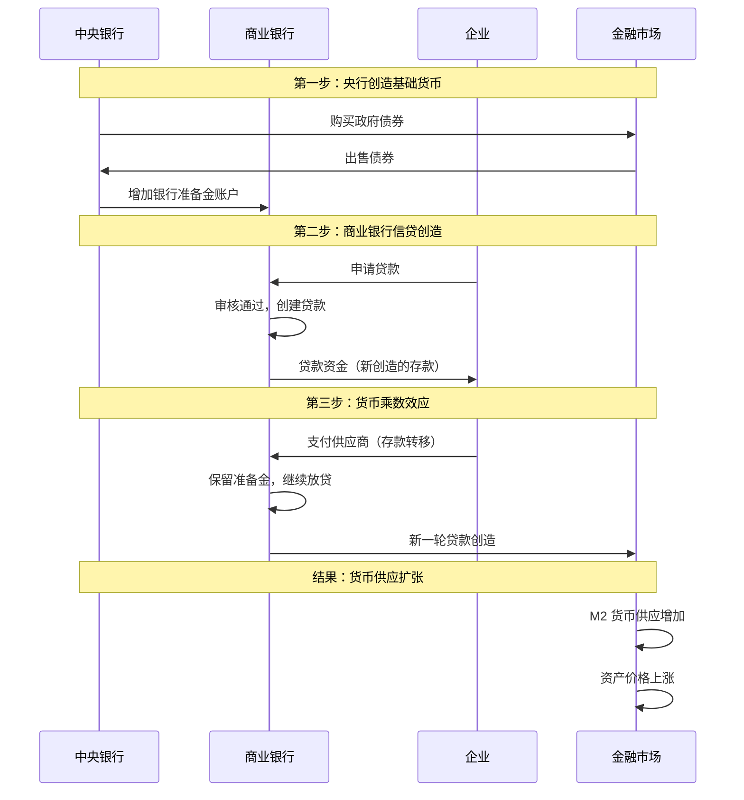

# 货币创造机制：现代金融体系的核心

## 概述

货币创造是现代金融体系最核心、也最容易被误解的机制。理解货币如何被创造出来，是理解整个金融世界运作的基础。与大众认知不同，现代货币并非由政府印刷厂简单印制，而是通过中央银行和商业银行的复杂互动过程创造出来的。

掌握货币创造机制，你将能够：
- 理解中央银行货币政策如何影响经济和资产价格
- 认识商业银行在货币供应中的关键作用
- 理解量化宽松等非常规货币政策的本质
- 预判货币政策变化对投资组合的影响
- 避免对货币创造的常见误解

这是金融认知的第一课，也是最重要的一课。理解了货币创造，你就理解了现代金融体系的底层逻辑。

## 核心概念

### 1. 两层货币创造体系

现代货币体系采用两层结构：

**第一层：中央银行创造基础货币**
- 基础货币（Base Money）= 流通中的现金 + 商业银行在央行的准备金
- 中央银行通过公开市场操作、贷款给商业银行等方式创造基础货币
- 基础货币是整个货币体系的"原材料"

**第二层：商业银行创造广义货币**
- 广义货币（M2）= 现金 + 活期存款 + 定期存款 + 储蓄存款
- 商业银行通过发放贷款创造存款，从而创造货币
- 这是货币供应的主要来源，占比通常超过 90%

### 2. 中央银行的货币创造

中央银行创造基础货币的主要方式：

**公开市场操作（Open Market Operations）**
- 央行购买政府债券，向市场注入基础货币
- 央行出售政府债券，从市场回收基础货币
- 这是最常用、最灵活的货币政策工具

**再贴现窗口（Discount Window）**
- 商业银行向央行借款，央行创造基础货币
- 通过调整再贴现率影响借款成本
- 作为流动性的"最后贷款人"

**法定准备金要求（Reserve Requirements）**
- 要求商业银行在央行存放一定比例的准备金
- 调整准备金率可以影响货币创造能力
- 中国常用此工具，美国较少使用

### 3. 商业银行的信贷创造

商业银行通过"部分准备金制度"创造货币：

**信贷创造过程**：
1. 客户 A 存入 1000 元到银行
2. 银行保留 10% 作为准备金（100 元）
3. 银行将 900 元贷款给客户 B
4. 客户 B 的 900 元存入银行（新创造的存款）
5. 银行再保留 10%（90 元），贷出 810 元
6. 循环往复...

**关键认知**：
- 银行不是简单的"中介"，而是货币的"创造者"
- 每一笔贷款都创造了新的存款，即新的货币
- 存款不是贷款的前提，贷款创造存款

### 4. 货币乘数效应

货币乘数（Money Multiplier）描述基础货币如何被放大：

**理论公式**：
```
货币乘数 = 1 / 法定准备金率
```

**示例**：
- 如果准备金率为 10%，货币乘数 = 1/0.1 = 10
- 央行创造 1000 亿基础货币，理论上可以创造 10000 亿广义货币

**实际情况更复杂**：
- 银行可能持有超额准备金
- 公众可能持有现金而非存款
- 银行的贷款意愿受经济周期影响
- 实际货币乘数通常为 3-8 倍

**修正公式**：
```
货币乘数 = (1 + 现金比率) / (法定准备金率 + 超额准备金率 + 现金比率)
```

### 5. 量化宽松政策（Quantitative Easing, QE）

当传统货币政策失效时（利率接近零），央行采用 QE：

**QE 的运作机制**：
1. 央行大规模购买政府债券、企业债券、甚至股票 ETF
2. 向金融系统注入大量基础货币
3. 压低长期利率，刺激借贷和投资
4. 推高资产价格，产生"财富效应"

**QE 与传统货币政策的区别**：
- 传统政策：调整短期利率
- QE：直接购买长期资产，影响长期利率和资产价格
- QE 规模更大，影响更直接

**QE 的影响**：
- 降低借贷成本，刺激经济活动
- 推高股票、债券、房地产价格
- 可能导致资产泡沫和贫富分化
- 退出 QE（Taper）可能引发市场动荡

## 货币创造流程可视化



## 历史案例分析

### 案例 1：2008 年金融危机后的量化宽松

**背景**：
2008 年金融危机后，美联储将联邦基金利率降至接近零，但经济仍然疲弱。传统货币政策已经失效。

**QE 实施**：
- **QE1（2008-2010）**：购买 1.7 万亿美元资产（MBS 和国债）
- **QE2（2010-2011）**：购买 6000 亿美元国债
- **QE3（2012-2014）**：每月购买 850 亿美元资产，持续到经济改善

**效果**：
- 美联储资产负债表从 9000 亿扩张到 4.5 万亿美元（5 倍）
- 10 年期国债收益率从 4% 降至 1.5%
- 标普 500 指数从 2009 年低点上涨超过 300%
- 失业率从 10% 降至 5%

**关键启示**：
- QE 有效支撑了资产价格，尤其是股票和房地产
- 货币创造并未导致严重通胀（CPI 保持在 2% 左右）
- 但加剧了贫富分化（资产持有者受益）

### 案例 2：欧债危机与欧央行的货币政策

**背景**：
2010-2012 年，希腊、西班牙、意大利等国主权债务危机，威胁欧元区解体。

**欧央行应对**：
- **LTRO（长期再融资操作）**：向银行提供 3 年期低息贷款
- **OMT（直接货币交易）**：承诺无限量购买成员国国债
- **负利率政策**：存款利率降至 -0.5%
- **QE（2015-2018）**：每月购买 600 亿欧元资产

**德拉吉名言**：
> "Within our mandate, the ECB is ready to do whatever it takes to preserve the euro. And believe me, it will be enough."
> （在我们的职责范围内，欧央行将不惜一切代价保卫欧元。相信我，这就足够了。）

**效果**：
- 成功稳定了欧元区金融市场
- 意大利、西班牙国债收益率大幅下降
- 欧元区经济逐步复苏
- 但长期低利率导致银行盈利困难

**关键启示**：
- 央行的"承诺"本身就是强大的政策工具
- 货币创造可以解决流动性危机
- 但无法解决结构性问题（如财政纪律）

### 案例 3：中国的货币政策与信贷扩张

**背景**：
中国采用独特的货币政策框架，人民银行通过多种工具调控货币供应。

**2008-2009 年"四万亿"刺激**：
- 政府推出 4 万亿财政刺激计划
- 银行配合大规模放贷，2009 年新增贷款 9.6 万亿（前一年的 2 倍）
- M2 增速达到 27.7%

**效果**：
- 中国经济快速复苏，GDP 增速保持 8% 以上
- 房地产价格大幅上涨
- 但留下地方债务和产能过剩问题

**2015-2016 年"去杠杆"**：
- 收紧货币政策，控制信贷扩张
- M2 增速从 13% 降至 8%
- 影子银行受到严格监管

**2020 年疫情应对**：
- 降准降息，但力度远小于美国
- 结构性货币政策工具（如 MLF、SLF）
- M2 增速短期回升至 11%，但很快回落

**关键启示**：
- 中国货币政策更注重"精准滴灌"而非"大水漫灌"
- 信贷扩张与房地产市场高度相关
- 货币政策需要平衡增长和风险

## 实战应用：理解货币政策对资产价格的影响

### 传导机制

**货币宽松 → 资产价格上涨**：

1. **利率渠道**：
   - 降低利率 → 降低贴现率 → 提高资产现值
   - 降低借贷成本 → 增加投资和消费 → 提高企业盈利

2. **信贷渠道**：
   - 增加货币供应 → 银行放贷意愿增强 → 企业和个人获得更多资金
   - 更多资金流入股市和房地产市场

3. **资产组合渠道**：
   - 央行购买债券 → 债券收益率下降 → 投资者转向股票等风险资产
   - "There Is No Alternative" (TINA) 效应

4. **预期渠道**：
   - 宽松政策 → 市场预期经济改善 → 风险偏好上升 → 资产价格上涨

### 投资者应该关注的信号

**货币宽松信号**（利好股票、房地产）：
- 央行降息或降准
- 央行资产负债表扩张
- M2 增速加快
- 信贷增速上升
- 央行官员"鸽派"表态

**货币收紧信号**（利空风险资产）：
- 央行加息或提高准备金率
- 央行缩表（减少资产购买）
- M2 增速放缓
- 信贷增速下降
- 央行官员"鹰派"表态

### 不同资产类别的反应

| 资产类别 | 货币宽松时 | 货币收紧时 |
|---------|-----------|-----------|
| 股票 | ↑↑ 估值提升，盈利改善 | ↓↓ 估值压缩，盈利承压 |
| 债券 | ↑ 收益率下降，价格上涨 | ↓ 收益率上升，价格下跌 |
| 房地产 | ↑↑ 低利率刺激需求 | ↓ 高利率抑制需求 |
| 黄金 | ↑ 实际利率下降 | ↓ 实际利率上升 |
| 现金 | ↓ 购买力下降 | ↑ 相对吸引力提升 |

## 常见误区

### 误区 1："央行印钞导致通胀"

**误解**：很多人认为央行增加货币供应必然导致通货膨胀。

**真相**：
- 货币供应增加不一定导致通胀，关键看货币流向
- 如果新增货币流入金融市场，导致资产价格上涨（资产通胀）
- 如果新增货币流入实体经济，才可能导致商品价格上涨（CPI 通胀）
- 2008 年后美国 QE 规模巨大，但 CPI 通胀温和，因为货币主要留在金融体系

### 误区 2："银行只是中介，把存款贷出去"

**误解**：认为银行先收集存款，再把存款贷出去。

**真相**：
- 银行通过发放贷款创造存款，而不是相反
- "贷款创造存款"（Loans Create Deposits）
- 银行受限于资本充足率和央行准备金要求，而非存款数量
- 这是现代货币理论（MMT）的核心观点之一

### 误区 3："政府可以无限印钞"

**误解**：认为政府可以通过印钞解决所有财政问题。

**真相**：
- 过度货币创造会导致恶性通胀（如委内瑞拉、津巴布韦）
- 货币创造受制于经济的实际生产能力
- 央行独立性是防止滥发货币的关键制度安排
- 财政赤字货币化（央行直接购买政府债务）是危险的

### 误区 4："M2 增速高就是货币超发"

**误解**：简单用 M2 增速判断货币政策松紧。

**真相**：
- 需要看 M2 增速与名义 GDP 增速的关系
- 如果 M2 增速 = GDP 增速 + 通胀率，则货币供应适度
- 还要看信贷结构（流向实体还是金融市场）
- 不同国家的 M2 统计口径不同，不能简单对比

## 深入理解：现代货币理论（MMT）争议

**MMT 的核心观点**：
- 拥有货币主权的政府不会破产
- 政府支出创造货币，税收销毁货币
- 财政赤字不是问题，通胀才是约束
- 充分就业应该是政策目标

**主流经济学的批评**：
- MMT 低估了通胀风险
- 忽视了财政纪律的重要性
- 过度依赖政府干预
- 可能导致货币信用崩溃

**投资者的视角**：
- 无论理论对错，政策实践正在向 MMT 靠拢
- 2020 年后各国大规模财政刺激 + 央行配合
- 理解 MMT 有助于预判政策走向
- 但要警惕长期通胀风险

## 货币政策工具箱

### 传统工具

1. **利率政策**
   - 调整政策利率（如联邦基金利率）
   - 影响整个利率曲线
   - 最常用的工具

2. **公开市场操作**
   - 买卖政府债券
   - 调节基础货币供应
   - 每日操作，灵活性高

3. **准备金要求**
   - 调整法定准备金率
   - 直接影响货币乘数
   - 影响较大，使用较少

### 非常规工具

1. **量化宽松（QE）**
   - 大规模资产购买
   - 压低长期利率
   - 危机时期使用

2. **负利率政策**
   - 对银行准备金收取利息
   - 鼓励银行放贷
   - 欧洲、日本使用

3. **前瞻性指引**
   - 承诺未来政策路径
   - 影响市场预期
   - 增强政策效果

4. **收益率曲线控制（YCC）**
   - 承诺将特定期限国债收益率控制在目标水平
   - 日本央行使用
   - 需要无限量购买债券

## 延伸阅读

### 必读书籍

1. **《货币的非国家化》** - 哈耶克
   - 对法定货币制度的批判
   - 自由货币竞争的设想

2. **《货币金融学》** - 米什金
   - 货币银行学经典教材
   - 系统讲解货币创造机制

3. **《债务危机》** - 瑞·达里奥
   - 债务周期理论
   - 48 个历史危机案例分析

4. **《大而不倒》** - 安德鲁·罗斯·索尔金
   - 2008 年金融危机纪实
   - 政策制定者的决策过程

5. **《货币战争》系列** - 宋鸿兵
   - 货币体系的历史演进
   - 争议较大，需批判性阅读

6. **《现代货币理论》** - 兰德尔·雷
   - MMT 理论的系统阐述
   - 理解当代货币政策的新视角

7. **《美联储的诞生》** - 罗杰·洛温斯坦
   - 美联储创立的历史
   - 理解央行制度的起源

8. **《金融炼金术》** - 乔治·索罗斯
   - 反身性理论
   - 货币政策与市场互动

### 进阶资源

- 美联储官网：https://www.federalreserve.gov/
- 欧央行官网：https://www.ecb.europa.eu/
- 中国人民银行官网：http://www.pbc.gov.cn/
- BIS（国际清算银行）研究报告
- IMF 货币政策报告

## 参考文献

1. Bernanke, B. S. (2015). *The Courage to Act: A Memoir of a Crisis and Its Aftermath*. W.W. Norton & Company.

2. McLeay, M., Radia, A., & Thomas, R. (2014). "Money creation in the modern economy." *Bank of England Quarterly Bulletin*, Q1.

3. Mishkin, F. S. (2018). *The Economics of Money, Banking, and Financial Markets* (12th ed.). Pearson.

4. Dalio, R. (2018). *A Template for Understanding Big Debt Crises*. Bridgewater Associates.

5. Werner, R. A. (2014). "Can banks individually create money out of nothing? — The theories and the empirical evidence." *International Review of Financial Analysis*, 36, 1-19.

6. Borio, C., & Disyatat, P. (2011). "Global imbalances and the financial crisis: Link or no link?" *BIS Working Papers*, No 346.

7. Friedman, M., & Schwartz, A. J. (1963). *A Monetary History of the United States, 1867-1960*. Princeton University Press.

8. Keynes, J. M. (1936). *The General Theory of Employment, Interest and Money*. Macmillan.

9. Hayek, F. A. (1976). *Denationalisation of Money*. Institute of Economic Affairs.

10. Wray, L. R. (2015). *Modern Money Theory: A Primer on Macroeconomics for Sovereign Monetary Systems* (2nd ed.). Palgrave Macmillan.

11. 周小川 (2013). 《金融改革与发展》. 中国金融出版社.

12. 易纲 (2009). 《中国的货币化进程》. 商务印书馆.

13. European Central Bank (2012). "Technical features of Outright Monetary Transactions." ECB Press Release.

14. Federal Reserve (2020). "Federal Reserve announces extensive new measures to support the economy." Press Release.

15. People's Bank of China (2021). "China Monetary Policy Report." Quarterly Publication.

---

**下一步学习**：
- 继续学习 [银行体系](banking-system.html) 了解银行系统的组织架构
- 阅读 [中央银行运作](central-banking.html) 深入理解各国央行的具体操作
- 学习 [通胀理论](inflation-theory.html) 理解货币创造与通胀的关系
