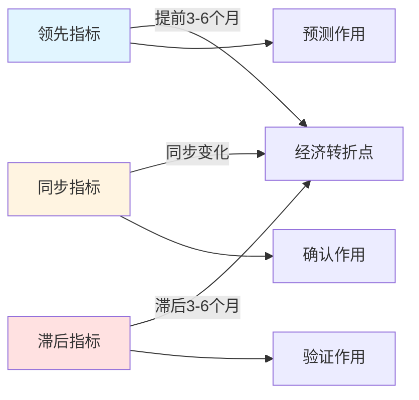

# 周期指标体系：判断经济周期的实用工具

## 概述

经济周期指标体系是判断经济周期位置和预测未来走势的重要工具。根据指标与经济周期的时间关系，可以分为领先指标、同步指标和滞后指标三大类。掌握这些指标的使用方法，对于投资决策至关重要。

**学习目标**：
1. 理解领先、同步、滞后指标的定义和作用
2. 掌握各类指标的具体内容和计算方法
3. 学会使用指标判断经济周期位置
4. 了解指标的局限性和注意事项
5. 掌握基于指标的投资决策框架

**为什么重要**：
- 提供客观的周期判断依据
- 帮助预测经济转折点
- 指导资产配置决策
- 降低投资决策的主观性

## 指标分类框架

### 三类指标的定义

**领先指标（Leading Indicators）**：
- 定义：在经济转折点之前变化的指标
- 提前时间：通常提前3-6个月
- 作用：预测经济走势，提前布局
- 特点：波动较大，有时会发出假信号

**同步指标（Coincident Indicators）**：
- 定义：与经济周期同步变化的指标
- 时间关系：基本同步
- 作用：确认经济当前状态
- 特点：反映经济实时状况

**滞后指标（Lagging Indicators）**：
- 定义：在经济转折点之后变化的指标
- 滞后时间：通常滞后3-6个月
- 作用：验证经济转折，确认趋势
- 特点：稳定性强，确认作用

## 领先指标详解

### 1. 制造业PMI（采购经理人指数）

**定义**：
- 反映制造业景气程度的综合指数
- 50为荣枯线：>50扩张，<50收缩

**构成**：
- 新订单（30%）
- 生产（25%）
- 就业（20%）
- 供应商配送时间（15%）
- 库存（10%）

**领先性**：
- 提前经济周期3-6个月
- 新订单分项领先性最强

**使用方法**：
- PMI从50以下回升至50以上：经济复苏信号
- PMI从50以上回落至50以下：经济衰退信号
- 连续3个月趋势更可靠

**投资应用**：
- PMI上升：增加股票配置，重点配置周期股
- PMI下降：减少股票配置，转向防御股

### 2. 新订单指数

**定义**：
- PMI的分项指标
- 反映企业新接订单情况

**领先性**：
- 比PMI更领先，提前4-8个月
- 是最重要的领先指标之一

**关键信号**：
- 新订单-库存差值：
  - 正值且扩大：需求旺盛，被动去库存
  - 负值且扩大：需求疲软，被动补库存

### 3. 社会融资规模增速

**定义**：
- 实体经济从金融体系获得的资金总量
- 包括贷款、债券、股票等

**领先性**：
- 提前经济周期6-9个月
- 中国特色的重要领先指标

**使用方法**：
- 社融增速持续上升：经济将复苏
- 社融增速持续下降：经济将放缓

**注意事项**：
- 需要剔除季节性因素
- 关注结构变化（企业贷款 vs 居民贷款）

### 4. 股票市场指数

**定义**：
- 股票价格的综合指数
- 反映市场对未来的预期

**领先性**：
- 提前经济周期3-6个月
- "股市是经济的晴雨表"

**使用方法**：
- 股市领先上涨：经济将复苏
- 股市领先下跌：经济将衰退

**局限性**：
- 有时会发出假信号
- 受情绪和流动性影响大
- 需要结合其他指标

### 5. 房地产新开工面积

**定义**：
- 房地产开发商新开工的建筑面积
- 反映房地产投资意愿

**领先性**：
- 提前经济周期3-6个月
- 对中国经济尤其重要

**传导机制**：
- 新开工 → 建材需求 → 上游产业 → 经济增长

### 6. 消费者信心指数

**定义**：
- 反映消费者对经济前景的信心
- 包括当前状况和未来预期

**领先性**：
- 提前经济周期2-4个月
- 对消费驱动型经济重要

**使用方法**：
- 信心指数上升：消费将增加
- 信心指数下降：消费将减少

### 7. 收益率曲线

**定义**：
- 不同期限国债收益率的曲线
- 反映市场对未来利率和经济的预期

**关键形态**：
- **正常曲线**：长期利率 > 短期利率（经济正常）
- **平坦曲线**：长短期利率接近（经济不确定）
- **倒挂曲线**：长期利率 < 短期利率（衰退预警）

**领先性**：
- 倒挂后6-18个月通常出现衰退
- 是最可靠的衰退预测指标

**历史验证**：
- 1989年倒挂 → 1990年衰退
- 2000年倒挂 → 2001年衰退
- 2006年倒挂 → 2008年衰退
- 2019年倒挂 → 2020年衰退（疫情加速）

## 同步指标详解

### 1. GDP增速

**定义**：国内生产总值的增长率
**频率**：季度数据
**作用**：最全面的经济状况指标

### 2. 工业增加值

**定义**：工业企业生产活动的增加值
**频率**：月度数据
**作用**：反映工业生产状况

### 3. 零售销售额

**定义**：社会消费品零售总额
**频率**：月度数据
**作用**：反映消费需求状况

### 4. 就业人数

**定义**：非农就业人数变化
**频率**：月度数据
**作用**：反映劳动力市场状况

## 滞后指标详解

### 1. 失业率

**定义**：失业人口占劳动力的比例
**滞后性**：滞后3-6个月
**作用**：确认经济转折

### 2. CPI（消费者价格指数）

**定义**：消费品和服务价格变化
**滞后性**：滞后3-6个月
**作用**：反映通胀压力

### 3. 企业利润

**定义**：工业企业利润总额
**滞后性**：滞后3-6个月
**作用**：反映企业盈利状况

### 4. 单位劳动成本

**定义**：单位产出的劳动成本
**滞后性**：滞后6-9个月
**作用**：反映成本压力

## 综合指数体系

### 美国领先指标指数（LEI）

**构成**（10个指标）**：
1. 平均每周工时
2. 首次申请失业救济人数
3. 制造业新订单（消费品）
4. 供应商配送时间
5. 制造业新订单（资本品）
6. 建筑许可
7. 标普500指数
8. 领先信用指数
9. 利差（10年期国债-联邦基金利率）
10. 消费者预期指数

**使用方法**：
- LEI连续3个月下降：衰退警告
- LEI连续3个月上升：复苏信号

### 中国先行指数

**构成**：
- PMI新订单
- 社会融资规模
- 房地产新开工
- 股票市场指数
- 消费者信心指数

## 实战应用框架

### 周期判断流程

1. **收集数据**：获取最新指标数据
2. **趋势分析**：判断指标变化趋势
3. **综合判断**：结合多个指标
4. **周期定位**：确定当前周期位置
5. **投资决策**：调整资产配置

### 投资决策矩阵

| 领先指标 | 同步指标 | 滞后指标 | 周期判断 | 投资策略 |
|---------|---------|---------|---------|---------|
| ↑ | ↓ | ↓ | 复苏早期 | 大幅增加股票 |
| ↑ | ↑ | ↓ | 复苏中期 | 保持股票配置 |
| ↑ | ↑ | ↑ | 繁荣期 | 增加大宗商品 |
| ↓ | ↑ | ↑ | 繁荣晚期 | 开始减仓 |
| ↓ | ↓ | ↑ | 衰退早期 | 转向防御 |
| ↓ | ↓ | ↓ | 衰退中期 | 增加债券 |

## 注意事项

### 1. 指标局限性

- 数据滞后和修正
- 结构性变化影响
- 政策干预扭曲
- 外部冲击影响

### 2. 使用原则

- 多指标综合判断
- 关注趋势而非单点
- 结合定性分析
- 保持灵活调整

### 3. 常见误区

- 过度依赖单一指标
- 忽视数据质量
- 机械套用历史规律
- 忽视特殊情况

## 延伸阅读

1. **"Business Cycle Indicators"** - NBER
2. **《经济指标解读》** - Bernard Baumohl
3. **《宏观经济分析框架》** - 任泽平
4. **《周期指标实战手册》** - 姜超

## 参考文献

1. Stock, J. H., & Watson, M. W. (1989). "New Indexes of Coincident and Leading Economic Indicators". *NBER Macroeconomics Annual*, 4, 351-394.

2. Conference Board. (2001). *Business Cycle Indicators Handbook*. Conference Board.

3. Zarnowitz, V., & Boschan, C. (1975). "Cyclical Indicators: An Evaluation and New Leading Indexes". *Business Conditions Digest*, May, v-xix.

4. 国家统计局. (2019). "中国经济景气监测指标体系". 中国统计出版社.

---

**下一步学习**：
- [美林时钟详解](./merrill-lynch-clock.html) - 应用指标进行资产配置
- [经济周期总览](./cycle-overview.html) - 回顾周期理论框架
- [宏观经济分析](../macroeconomics/gdp-analysis.html) - 深入学习宏观指标
5. Burns, A. F., & Mitchell, W. C. (1946). *Measuring Business Cycles*. National Bureau of Economic Research.
6. Zarnowitz, V. (1992). *Business Cycles: Theory, History, Indicators, and Forecasting*. University of Chicago Press.
7. Diebold, F. X., & Rudebusch, G. D. (1999). *Business Cycles: Durations, Dynamics, and Forecasting*. Princeton University Press.
8. Stock, J. H., & Watson, M. W. (1999). "Business Cycle Fluctuations in US Macroeconomic Time Series." *Handbook of Macroeconomics*, 1, 3-64.

## 深度分析

### 核心机制解析

理解本主题需要从多个维度进行系统性分析。以下从理论基础、实践应用和历史验证三个层面展开深度探讨。

**理论基础层面**：本主题的核心逻辑建立在经济学和金融学的基本原理之上。通过对基础理论的深入理解，投资者能够建立起稳固的分析框架，避免被市场短期噪音所干扰。

**实践应用层面**：理论必须与实践相结合才能产生价值。在实际投资决策中，需要将抽象的概念转化为具体的分析工具和决策标准。

**历史验证层面**：金融市场有着丰富的历史记录，通过研究历史案例，我们可以验证理论的有效性，并从中提炼出具有普遍意义的规律。

### 关键影响因素

影响本主题的关键因素可以从以下几个维度进行分析：

1. **宏观经济环境**：利率水平、通货膨胀率、经济增长速度等宏观变量对本主题有着深远影响。在不同的宏观经济周期中，相关指标的表现会呈现出显著差异。

2. **市场结构因素**：市场参与者的构成、信息传播机制、流动性状况等市场结构因素决定了价格发现的效率和准确性。

3. **政策监管环境**：政府政策、监管框架的变化会直接影响相关市场的运作规则和参与者行为。

4. **技术创新驱动**：技术进步不断改变着金融市场的运作方式，从算法交易到区块链技术，每一次技术革新都带来新的机遇和挑战。

5. **全球化与地缘政治**：在全球化背景下，各国市场之间的联动性日益增强，地缘政治风险的影响也越来越不可忽视。

### 量化分析框架

为了更精确地分析和评估，可以采用以下量化框架：

| 分析维度 | 关键指标 | 参考基准 | 分析方法 |
|---------|---------|---------|---------|
| 规模评估 | 绝对值与相对值 | 历史均值 | 趋势分析 |
| 质量评估 | 稳定性指标 | 行业对标 | 横向比较 |
| 风险评估 | 波动率指标 | 风险阈值 | 情景分析 |
| 价值评估 | 估值倍数 | 历史区间 | 回归分析 |

通过系统性地应用上述框架，投资者可以对目标进行全面、客观的评估，从而做出更加理性的投资决策。

## 高级分析与前沿研究

### 学术研究进展

近年来，学术界对本领域的研究取得了重要进展。以下是几个值得关注的研究方向：

**行为金融学视角**：传统金融理论假设市场参与者是完全理性的，但行为金融学的研究表明，认知偏差和情绪因素在投资决策中扮演着重要角色。诺贝尔经济学奖得主丹尼尔·卡尼曼（Daniel Kahneman）和理查德·塞勒（Richard Thaler）的研究为我们理解市场非理性行为提供了重要框架。

**因子投资研究**：尤金·法玛（Eugene Fama）和肯尼斯·弗伦奇（Kenneth French）的三因子模型，以及后续发展的五因子模型，为系统性地解释股票收益差异提供了理论基础。这些研究表明，市值、账面市值比、盈利能力和投资模式等因子能够解释大部分股票收益的横截面差异。

**市场微观结构研究**：对市场流动性、价格发现机制和交易成本的深入研究，帮助我们更好地理解市场的运作机制，并为优化交易策略提供指导。

### 实战案例深度解析

**案例一：长期价值创造的典范**

以沃伦·巴菲特（Warren Buffett）的伯克希尔·哈撒韦（Berkshire Hathaway）为例，其长达数十年的卓越投资业绩证明了价值投资理念的有效性。从1965年至今，伯克希尔的账面价值年均增长率约为19.8%，远超同期标普500指数的约10.2%年均回报。

巴菲特的成功秘诀在于：
- 专注于具有持久竞争优势的优质企业
- 以合理价格买入，而非追求最低价格
- 长期持有，让复利效应充分发挥
- 保持充足的安全边际，控制下行风险

**案例二：危机中的机遇识别**

2008年金融危机期间，大多数投资者恐慌性抛售，但少数具有前瞻性的投资者却在危机中发现了历史性的投资机会。约翰·保尔森（John Paulson）通过做空次级抵押贷款相关证券，在危机中获得了约150亿美元的利润，成为金融史上最成功的单笔交易之一。

这个案例告诉我们：
- 深入的基本面研究能够发现市场定价错误
- 逆向思维往往能够发现被市场忽视的机会
- 风险管理和仓位控制是成功的关键

### 跨市场比较分析

不同市场在结构、监管、投资者构成等方面存在显著差异，这些差异对投资策略的选择有重要影响：

**美国市场特征**：
- 机构投资者主导，市场效率较高
- 信息披露制度完善，分析师覆盖广泛
- 衍生品市场发达，对冲工具丰富
- 长期牛市历史，但也经历过多次重大调整

**中国市场特征**：
- 散户投资者比例较高，市场波动性较大
- 政策因素影响显著，需要密切关注监管动向
- 新兴行业发展迅速，成长投资机会丰富
- A股、港股、美股中概股形成多层次市场体系

**欧洲市场特征**：
- 价值股比例较高，估值相对保守
- 受地缘政治和欧元区政策影响较大
- 部分行业（如奢侈品、工业）具有全球竞争优势
- ESG投资理念推广较为领先

