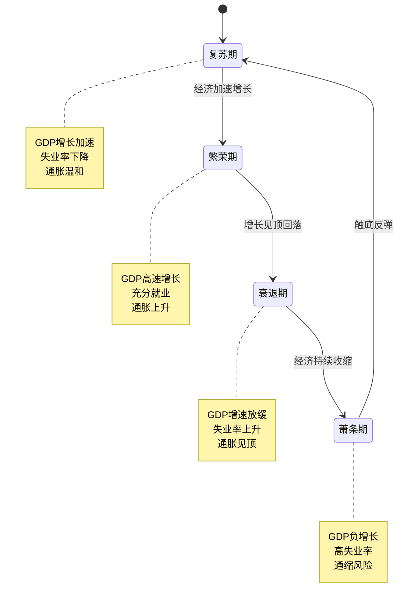
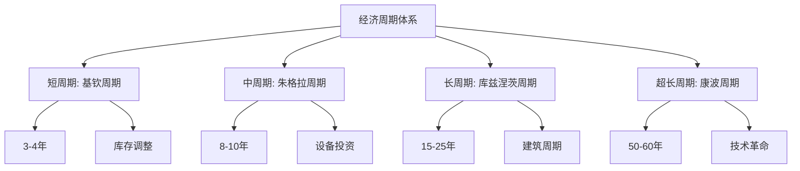
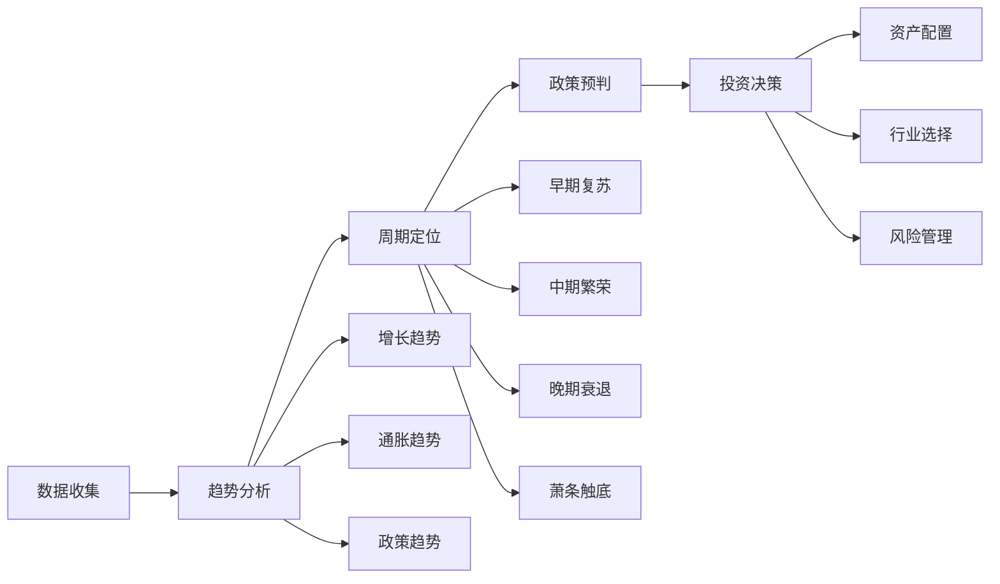

# 经济周期总览：理解经济波动的本质

## 概述

经济周期是现代经济体系中最重要的现象之一，理解经济周期对于投资决策、企业战略和政策制定都至关重要。本文将全面解析经济周期的本质、四个经典阶段、多重周期理论，以及如何利用周期理论指导投资实践。

**学习目标**：
1. 理解经济周期的定义和形成机制
2. 掌握经济周期四个阶段的特征
3. 了解多重周期理论（基钦、朱格拉、库兹涅茨、康波）
4. 学会识别当前经济所处的周期位置
5. 掌握基于周期的投资策略框架

## 经济周期的本质

### 什么是经济周期

经济周期（Business Cycle）是指经济活动沿着长期增长趋势线上下波动的周期性现象。这种波动表现为经济扩张和收缩的交替出现，是市场经济的内在特征。

**核心特征**：
- **周期性**：经济活动呈现规律性的波动
- **累积性**：经济变化具有自我强化的特点
- **传导性**：周期波动会在不同部门和地区传播
- **可预测性**：虽然时间难以精确预测，但模式相对稳定

### 经济周期的形成机制

经济周期的形成源于多种因素的相互作用：

**1. 内生因素**
- **投资波动**：企业投资决策的集中性导致产能周期
- **库存调整**：企业库存管理引发短期波动
- **信贷周期**：银行信贷扩张与收缩的循环
- **心理预期**：市场参与者的乐观与悲观情绪交替

**2. 外生因素**
- **技术创新**：重大技术突破带来长期增长浪潮
- **政策干预**：货币政策和财政政策的调控
- **外部冲击**：战争、疫情、能源危机等突发事件
- **国际传导**：全球经济一体化带来的跨国传播

**3. 金融加速器效应**
金融系统在经济周期中起到放大作用：
- 繁荣期：信贷宽松，资产价格上涨，进一步刺激借贷
- 衰退期：信贷紧缩，资产价格下跌，加剧经济下行

## 经济周期的四个阶段

经济周期通常被划分为四个经典阶段，每个阶段都有独特的经济特征和投资机会。

### 第一阶段：复苏期（Recovery）

**经济特征**：
- **GDP增长**：从负增长转为正增长，增速逐步加快
- **就业市场**：失业率开始下降，但仍处于较高水平
- **通货膨胀**：通胀率较低，产能利用率不足
- **企业盈利**：利润率开始改善，但绝对水平仍较低
- **消费者信心**：从悲观转向谨慎乐观

**政策环境**：
- **货币政策**：宽松，低利率环境
- **财政政策**：扩张性，政府支出增加
- **信贷条件**：逐步宽松，但企业和个人仍较谨慎

**投资特征**：
- **股票市场**：估值修复，周期性行业开始表现
- **债券市场**：收益率处于低位，价格较高
- **大宗商品**：价格开始回升，但涨幅有限
- **房地产**：交易量回升，价格企稳

**最佳资产配置**：股票（周期股）> 大宗商品 > 债券 > 现金

### 第二阶段：繁荣期（Expansion/Boom）

**经济特征**：
- **GDP增长**：高速增长，超过潜在增长率
- **就业市场**：接近或达到充分就业，工资上涨
- **通货膨胀**：通胀压力显现，CPI和PPI上升
- **企业盈利**：利润率和绝对利润都处于高位
- **消费者信心**：高度乐观，消费和投资旺盛

**政策环境**：
- **货币政策**：从宽松转向中性或紧缩
- **财政政策**：开始收紧，减少刺激措施
- **信贷条件**：宽松，信贷快速扩张

**投资特征**：
- **股票市场**：估值偏高，但盈利增长支撑
- **债券市场**：收益率上升，价格下跌
- **大宗商品**：价格快速上涨，需求旺盛
- **房地产**：价格高涨，投机活跃

**风险信号**：
- 资产价格泡沫化
- 杠杆率快速上升
- 通胀失控风险
- 政策收紧预期

**最佳资产配置**：大宗商品 > 股票 > 现金 > 债券

### 第三阶段：衰退期（Recession）

**经济特征**：
- **GDP增长**：增速明显放缓，可能转为负增长
- **就业市场**：失业率上升，企业裁员增加
- **通货膨胀**：通胀见顶回落，但仍可能较高（滞胀风险）
- **企业盈利**：利润率和绝对利润双双下降
- **消费者信心**：快速恶化，消费和投资收缩

**政策环境**：
- **货币政策**：开始转向宽松，但可能滞后
- **财政政策**：准备刺激措施
- **信贷条件**：收紧，违约率上升

**投资特征**：
- **股票市场**：大幅下跌，估值压缩
- **债券市场**：避险需求推动价格上涨
- **大宗商品**：价格回落，需求疲软
- **房地产**：交易量萎缩，价格下跌

**典型特征**：
- 收益率曲线倒挂（衰退前兆）
- 信用利差扩大
- 股市波动率飙升
- 资金流向安全资产

**最佳资产配置**：现金 > 债券 > 防御性股票 > 大宗商品

### 第四阶段：萧条期（Depression/Trough）

**经济特征**：
- **GDP增长**：持续负增长或零增长
- **就业市场**：高失业率，就业市场冰冻
- **通货膨胀**：通缩风险，价格普遍下跌
- **企业盈利**：大量企业亏损，破产增加
- **消费者信心**：极度悲观，储蓄率上升

**政策环境**：
- **货币政策**：极度宽松，零利率或负利率
- **财政政策**：大规模刺激计划
- **信贷条件**：极度紧缩，信贷冻结

**投资特征**：
- **股票市场**：估值极低，但缺乏买盘
- **债券市场**：国债收益率极低，信用债违约
- **大宗商品**：价格触底
- **房地产**：价格大幅下跌，流动性枯竭

**机会与风险**：
- **机会**：优质资产估值极低，长期投资良机
- **风险**：流动性危机，系统性风险
- **策略**：保持流动性，等待明确的复苏信号

**最佳资产配置**：现金 > 国债 > 黄金 > 优质股票（逆向投资）

## 多重周期理论

经济活动中存在多个不同长度的周期，它们相互叠加，共同影响经济走势。

### 基钦周期（Kitchin Cycle）- 库存周期

**周期长度**：3-4年  
**驱动因素**：企业库存调整  
**影响范围**：短期经济波动

企业根据需求预期调整库存水平，导致生产和订单的周期性波动。这是最短的经济周期，对短期投资决策影响显著。

**投资应用**：
- 适合短期交易策略
- 关注库存数据和PMI指标
- 周期股的短期轮动机会

### 朱格拉周期（Juglar Cycle）- 设备投资周期

**周期长度**：8-10年  
**驱动因素**：企业设备更新和产能扩张  
**影响范围**：中期经济波动

企业固定资产投资的周期性变化，包括设备更新、厂房建设等。这是最经典的经济周期，对中期投资策略至关重要。

**投资应用**：
- 中期资产配置的核心依据
- 关注资本开支和产能利用率
- 周期行业的中期趋势判断

### 库兹涅茨周期（Kuznets Cycle）- 建筑周期

**周期长度**：15-25年  
**驱动因素**：房地产和基础设施建设  
**影响范围**：长期经济结构

房地产开发和基础设施投资的长周期波动，与人口结构、城市化进程密切相关。

**投资应用**：
- 房地产投资的长期判断
- 基建相关行业的配置
- 人口红利的把握

### 康德拉季耶夫周期（Kondratieff Wave）- 技术创新周期

**周期长度**：50-60年  
**驱动因素**：重大技术革命和产业变革  
**影响范围**：超长期经济格局

由重大技术创新引发的超长期经济波动，包括蒸汽机、电力、信息技术、人工智能等技术革命。

**历史上的康波周期**：
1. **第一次康波**（1780s-1840s）：蒸汽机和纺织工业
2. **第二次康波**（1840s-1890s）：铁路和钢铁工业
3. **第三次康波**（1890s-1940s）：电力和化学工业
4. **第四次康波**（1940s-1990s）：汽车和石油工业
5. **第五次康波**（1990s-2040s?）：信息技术和互联网
6. **第六次康波**（2020s-?）：人工智能和新能源？

**投资应用**：
- 识别时代性投资机会
- 把握产业变革趋势
- 超长期资产配置

## 周期叠加效应

多个周期同时作用于经济，产生复杂的叠加效应：

**共振放大**：
- 当多个周期同时处于上行阶段，经济增长强劲
- 当多个周期同时处于下行阶段，经济衰退严重

**相互抵消**：
- 短周期上行但长周期下行：经济温和增长
- 短周期下行但长周期上行：经济短期调整

**实例分析：2008年金融危机**
- 朱格拉周期：设备投资周期见顶
- 库兹涅茨周期：房地产周期见顶
- 康波周期：信息技术周期成熟期
- 三大周期共振向下，导致严重危机

## 如何识别当前周期位置

### 关键指标体系

**1. 增长指标**
- GDP增速及其趋势
- 工业生产指数
- 零售销售增长
- 固定资产投资增速

**2. 就业指标**
- 失业率
- 新增就业人数
- 平均工时
- 工资增长率

**3. 通胀指标**
- CPI和核心CPI
- PPI
- GDP平减指数
- 通胀预期

**4. 金融指标**
- 收益率曲线形态
- 信用利差
- 股市估值水平
- 信贷增速

**5. 信心指标**
- 消费者信心指数
- 企业景气指数
- PMI指数
- 投资者情绪指标

### 周期判断框架

**步骤1：数据收集**
- 收集上述五类关键指标的最新数据
- 关注数据的变化趋势而非绝对水平
- 对比历史周期的相似阶段

**步骤2：趋势分析**
- 判断增长趋势：加速、稳定还是放缓
- 判断通胀趋势：上升、稳定还是下降
- 判断政策趋势：宽松、中性还是紧缩

**步骤3：周期定位**
- 综合判断当前所处的周期阶段
- 评估距离下一阶段的时间
- 识别可能的转折点信号

**步骤4：政策预判**
- 预测货币政策的可能变化
- 预测财政政策的可能调整
- 评估政策对经济的影响

**步骤5：投资决策**
- 根据周期阶段调整资产配置
- 选择适合当前周期的行业和个股
- 设置合理的风险管理措施

## 基于周期的投资策略

### 战略资产配置

不同周期阶段的最优资产配置：

| 周期阶段 | 股票 | 债券 | 大宗商品 | 现金 | 房地产 |
|---------|------|------|----------|------|--------|
| 复苏期 | +++  | +    | ++       | -    | +      |
| 繁荣期 | ++   | -    | +++      | +    | ++     |
| 衰退期 | -    | ++   | -        | ++   | -      |
| 萧条期 | +    | +++  | -        | +++  | --     |

注：+++ 最优，++ 较优，+ 中性，- 较差，-- 最差

### 行业轮动策略

**复苏期**：
- **首选行业**：金融、可选消费、工业
- **逻辑**：经济复苏，信贷扩张，消费回暖
- **代表股票**：银行、汽车、机械

**繁荣期**：
- **首选行业**：能源、材料、工业
- **逻辑**：需求旺盛，价格上涨，产能扩张
- **代表股票**：石油、钢铁、化工

**衰退期**：
- **首选行业**：必需消费、医疗保健、公用事业
- **逻辑**：防御性强，需求稳定，现金流好
- **代表股票**：食品饮料、医药、电力

**萧条期**：
- **首选行业**：优质成长股、黄金
- **逻辑**：逆向投资，寻找长期价值
- **代表股票**：科技龙头、消费龙头

### 风险管理要点

**1. 周期顶部风险**
- 警惕估值过高
- 关注政策收紧信号
- 逐步降低风险敞口
- 增加现金和防御性资产

**2. 周期底部机会**
- 克服恐惧心理
- 寻找优质资产
- 分批建仓
- 保持足够耐心

**3. 周期转换风险**
- 提前布局下一阶段
- 避免过度集中
- 保持灵活性
- 及时止损

## 历史周期案例分析

### 案例1：2008-2009年金融危机周期

**背景**：
- 房地产泡沫破裂
- 次贷危机爆发
- 雷曼兄弟破产

**周期演变**：
- **2007年中-2008年中**：衰退期
  - GDP增速放缓
  - 失业率上升
  - 股市大跌

- **2008年下-2009年初**：萧条期
  - 金融系统冻结
  - 经济急剧收缩
  - 恐慌性抛售

- **2009年中-2010年**：复苏期
  - 政策刺激见效
  - 经济触底反弹
  - 股市V型反转

**投资启示**：
- 危机中保持流动性至关重要
- 萧条期是长期投资的最佳时机
- 政策转向是重要的买入信号
- 优质资产在危机后恢复最快

### 案例2：2020年COVID-19冲击周期

**背景**：
- 全球疫情爆发
- 经济活动骤停
- 史无前例的政策刺激

**周期演变**：
- **2020年2-3月**：急速衰退
  - 股市暴跌30%+
  - 经济活动冻结
  - 失业率飙升

- **2020年4-12月**：快速复苏
  - 超宽松货币政策
  - 大规模财政刺激
  - 股市创历史新高

- **2021-2022年**：过热与通胀
  - 经济过热
  - 通胀失控
  - 政策急速收紧

**投资启示**：
- 外生冲击创造极端买入机会
- 政策响应速度决定复苏节奏
- 流动性泛滥推高资产价格
- 通胀回归改变投资逻辑

### 案例3：中国经济周期（2000-2023）

**第一轮周期（2000-2008）**：
- 加入WTO，出口驱动
- 房地产市场化改革
- 重化工业化高峰

**第二轮周期（2009-2015）**：
- 4万亿刺激计划
- 产能过剩问题
- 经济增速换挡

**第三轮周期（2016-2019）**：
- 供给侧改革
- 去杠杆、去产能
- 经济结构优化

**第四轮周期（2020-至今）**：
- 疫情冲击与复苏
- 双循环新格局
- 高质量发展转型

**中国周期特点**：
- 政策主导性强
- 投资驱动明显
- 周期波动较大
- 结构转型加速

## 常见误区与注意事项

### 误区1：机械套用周期理论

**错误做法**：
- 简单按照历史周期长度预测
- 忽视当前经济结构变化
- 不考虑政策干预影响

**正确做法**：
- 理解周期背后的经济逻辑
- 结合当前经济结构特点
- 考虑政策工具的演变

### 误区2：试图精确预测周期拐点

**错误做法**：
- 追求精确的时间预测
- 频繁调整投资组合
- 过度交易

**正确做法**：
- 关注周期趋势而非精确时点
- 提前布局，保持耐心
- 战略配置为主，战术调整为辅

### 误区3：忽视周期叠加效应

**错误做法**：
- 只关注单一周期
- 忽视不同周期的相互作用
- 简化复杂的经济现实

**正确做法**：
- 综合考虑多个周期
- 理解周期共振和抵消
- 建立多维分析框架

### 误区4：过度依赖周期择时

**错误做法**：
- 完全基于周期判断进行交易
- 忽视个股基本面
- 放弃长期投资原则

**正确做法**：
- 周期分析与基本面分析结合
- 战略配置基于长期价值
- 战术调整基于周期判断

## 实战应用建议

### 对于长期投资者

**核心策略**：
1. **战略配置为主**：基于长期价值投资优质资产
2. **周期调整为辅**：根据周期阶段适度调整仓位
3. **逆向投资思维**：在周期底部增加配置，顶部减少配置
4. **保持耐心**：不被短期波动干扰

**具体做法**：
- 在萧条期和复苏早期增加股票配置
- 在繁荣晚期和衰退期降低风险敞口
- 始终保持一定比例的核心持仓
- 利用周期波动优化成本

### 对于中期交易者

**核心策略**：
1. **行业轮动**：根据周期阶段切换行业配置
2. **趋势跟随**：顺应周期趋势进行交易
3. **风险控制**：在周期转换时严格止损
4. **灵活调整**：根据周期信号及时调整策略

**具体做法**：
- 复苏期：超配周期股，低配防御股
- 繁荣期：超配资源股，低配成长股
- 衰退期：超配防御股，低配周期股
- 萧条期：保持现金，寻找价值股

### 对于短期投资者

**核心策略**：
1. **关注短周期**：重点跟踪基钦周期（库存周期）
2. **数据驱动**：基于高频数据进行交易
3. **快进快出**：把握短期波动机会
4. **严格纪律**：设置明确的止盈止损

**具体做法**：
- 密切跟踪PMI、库存等高频指标
- 关注政策微调信号
- 利用技术分析辅助判断
- 控制单次交易风险

## 延伸阅读

### 经典著作

1. **《商业周期》** - Wesley C. Mitchell
   - 经济周期理论的奠基之作
   - 系统阐述周期的本质和特征

2. **《繁荣与萧条》** - Irving Fisher
   - 债务-通缩理论
   - 1929年大萧条的深刻分析

3. **《经济周期理论》** - Joseph Schumpeter
   - 创新驱动的周期理论
   - 多重周期叠加分析

4. **《这次不一样：八百年金融危机史》** - Reinhart & Rogoff
   - 历史上的金融危机和经济周期
   - 数据丰富，视角独特

5. **《周期》** - Howard Marks
   - 投资大师的周期智慧
   - 实战经验与理论结合

### 现代研究

6. **《债务危机》** - Ray Dalio
   - 债务周期的深入分析
   - 48个历史案例研究

7. **《经济机器是如何运行的》** - Ray Dalio
   - 简明易懂的经济周期模型
   - 配有优秀的视频讲解

8. **《周期的力量》** - Lars Tvede
   - 全面的周期理论综述
   - 涵盖各类经济和金融周期

### 学术论文

9. **"Business Cycles"** - Robert Lucas (1977)
   - 理性预期与经济周期
   - 现代宏观经济学基础

10. **"The Financial Accelerator"** - Bernanke, Gertler & Gilchrist (1999)
    - 金融加速器理论
    - 解释金融与实体经济的互动

## 参考文献

1. Mitchell, W. C. (1927). *Business Cycles: The Problem and Its Setting*. NBER.

2. Schumpeter, J. A. (1939). *Business Cycles: A Theoretical, Historical, and Statistical Analysis of the Capitalist Process*. McGraw-Hill.

3. Burns, A. F., & Mitchell, W. C. (1946). *Measuring Business Cycles*. NBER.

4. Kondratieff, N. D. (1935). "The Long Waves in Economic Life". *Review of Economics and Statistics*, 17(6), 105-115.

5. Kuznets, S. (1930). *Secular Movements in Production and Prices*. Houghton Mifflin.

6. Juglar, C. (1862). *Des Crises commerciales et leur retour périodique en France, en Angleterre et aux États-Unis*. Guillaumin.

7. Kitchin, J. (1923). "Cycles and Trends in Economic Factors". *Review of Economics and Statistics*, 5(1), 10-16.

8. Dalio, R. (2018). *A Template for Understanding Big Debt Crises*. Bridgewater Associates.

9. Marks, H. (2018). *Mastering the Market Cycle: Getting the Odds on Your Side*. Houghton Mifflin Harcourt.

10. Reinhart, C. M., & Rogoff, K. S. (2009). *This Time Is Different: Eight Centuries of Financial Folly*. Princeton University Press.

11. Bernanke, B. S., Gertler, M., & Gilchrist, S. (1999). "The Financial Accelerator in a Quantitative Business Cycle Framework". *Handbook of Macroeconomics*, 1, 1341-1393.

12. Stock, J. H., & Watson, M. W. (1999). "Business Cycle Fluctuations in US Macroeconomic Time Series". *Handbook of Macroeconomics*, 1, 3-64.

13. Zarnowitz, V. (1985). "Recent Work on Business Cycles in Historical Perspective: A Review of Theories and Evidence". *Journal of Economic Literature*, 23(2), 523-580.

14. Estrella, A., & Mishkin, F. S. (1998). "Predicting US Recessions: Financial Variables as Leading Indicators". *Review of Economics and Statistics*, 80(1), 45-61.

15. Borio, C. (2014). "The Financial Cycle and Macroeconomics: What Have We Learnt?". *Journal of Banking & Finance*, 45, 182-198.

---

**下一步学习**：
- [美林时钟详解](./merrill-lynch-clock.html) - 深入学习周期与资产配置
- [周期指标体系](./cycle-indicators.html) - 掌握周期判断的具体工具
- [基钦周期](./kitchin-cycle.html) - 了解短期库存周期
- [朱格拉周期](./juglar-cycle.html) - 理解中期设备投资周期
